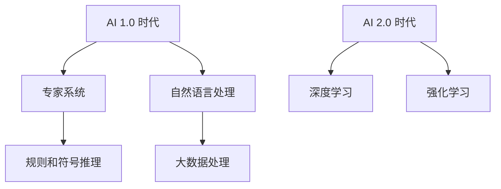
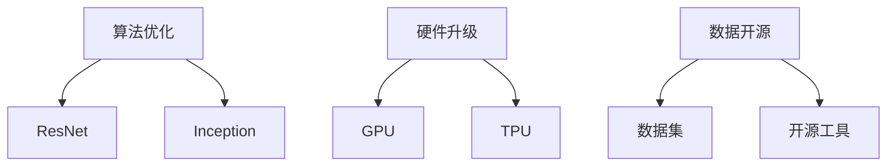
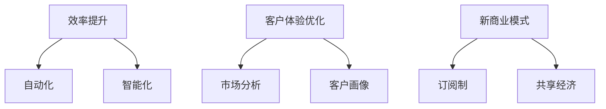
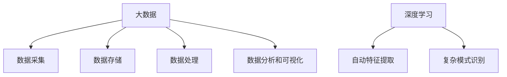
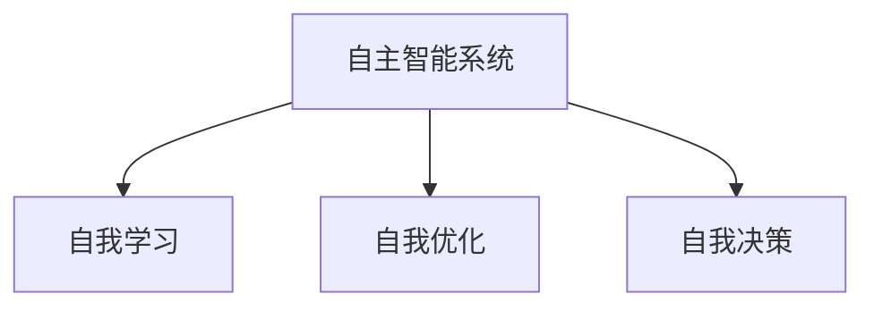
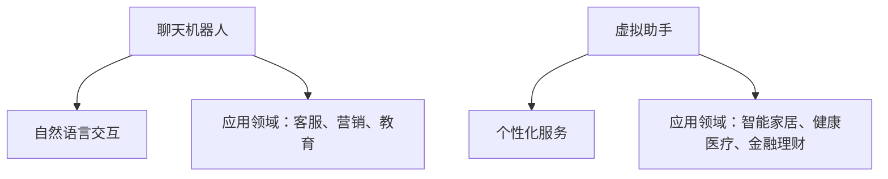
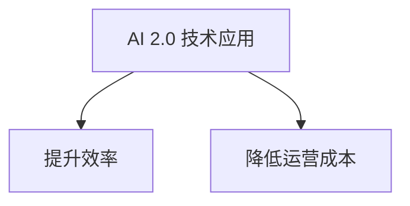
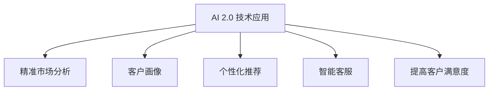
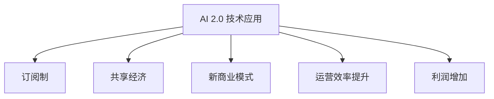

                 

# 《李开复：AI 2.0 时代的商业价值》

## 关键词：人工智能、AI 2.0、商业价值、行业应用、实践与挑战

### 摘要

随着人工智能技术的不断发展和应用，AI 2.0 时代已经到来。本文以李开复的观点为出发点，系统地分析了 AI 2.0 时代的背景、核心概念、商业价值以及在各行业中的应用，并深入探讨了 AI 2.0 实践中的挑战与对策。通过本文的阐述，希望能够为读者提供一个全面、深入的 AI 2.0 商业价值解读，帮助读者更好地理解和把握这一时代的发展趋势。

## 目录大纲

### 目录大纲

- **第一部分：AI 2.0 时代的背景与概念**
  - 1.1 AI 2.0 时代的到来
  - 1.2 AI 2.0 核心概念
  - 1.3 AI 2.0 商业价值分析

- **第二部分：AI 2.0 在各行业中的应用**
  - 2.1 金融服务
  - 2.2 零售业
  - 2.3 健康医疗
  - 2.4 制造业
  - 2.5 教育行业
  - 2.6 物流与运输

- **第三部分：AI 2.0 实践与挑战**
  - 3.1 AI 2.0 实践案例
  - 3.2 AI 2.0 挑战与对策
  - 3.3 AI 2.0 发展趋势与未来展望

- **附录**
  - 附录 A：AI 2.0 相关资源
  - 附录 B：AI 2.0 深入学习
  - 附录 C：AI 2.0 应用案例
  - 附录 D：AI 2.0 发展政策与法规

### 第一部分：AI 2.0 时代的背景与概念

#### 1.1 AI 2.0 时代的到来

##### 1.1.1 AI 1.0 与 AI 2.0 的区别

在探讨 AI 2.0 时代的到来之前，我们有必要了解一下 AI 1.0 和 AI 2.0 的区别。AI 1.0 时代主要依赖于规则和符号推理，而 AI 2.0 时代则更多地依赖于大数据和深度学习。具体来说，AI 1.0 时代的代表性技术是专家系统和自然语言处理，而 AI 2.0 时代的代表性技术则是深度学习和强化学习。


**Mermaid 流程图：**



##### 1.1.2 AI 2.0 时代的技术进步

AI 2.0 时代的技术进步主要体现在以下几个方面：

1. **算法优化**：随着深度学习算法的不断优化，如 ResNet、Inception 等模型的提出，深度学习模型的性能得到了极大的提升。

2. **硬件升级**：GPU、TPU 等专用硬件的出现，使得深度学习模型的训练和推理速度得到了极大的提升。

3. **数据开源**：越来越多的数据集和开源工具的发布，为人工智能的研究和应用提供了丰富的资源。

**Mermaid 流程图：**



##### 1.1.3 AI 2.0 对商业的影响

AI 2.0 对商业的影响主要体现在以下几个方面：

1. **效率提升**：通过自动化和智能化的方式，企业可以大幅提高生产效率，降低运营成本。

2. **客户体验优化**：AI 2.0 技术可以为企业提供更精准的市场分析和客户画像，从而优化客户体验，提高客户满意度。

3. **新商业模式**：AI 2.0 技术的广泛应用，为企业开辟了新的商业模式，如订阅制、共享经济等。

**Mermaid 流流程图：**



### 1.2 AI 2.0 核心概念

##### 1.2.1 大数据与深度学习

大数据和深度学习是 AI 2.0 时代的基础。大数据提供了丰富的数据资源，而深度学习算法则能够从这些数据中挖掘出有价值的信息。

1. **大数据**：大数据是指海量、多样、快速变化的数据。大数据技术包括数据采集、存储、处理、分析和可视化等。

2. **深度学习**：深度学习是一种基于多层神经网络的人工智能技术。通过模拟人脑神经元的工作方式，深度学习能够实现自动特征提取和复杂模式识别。

**Mermaid 流程图：**



##### 1.2.2 自主智能系统

自主智能系统是指能够自我学习、自我优化和自我决策的人工智能系统。自主智能系统具备以下几个特点：

1. **自我学习**：自主智能系统能够从数据中学习新知识和技能，不断提升自身的智能水平。

2. **自我优化**：自主智能系统能够根据任务目标和环境变化，自动调整模型参数，优化系统性能。

3. **自我决策**：自主智能系统能够在没有人为干预的情况下，根据环境和任务需求做出决策。

**Mermaid 流程图：**



##### 1.2.3 聊天机器人与虚拟助手

聊天机器人和虚拟助手是 AI 2.0 时代的代表性应用。它们能够实现自然语言交互，提供个性化的服务。

1. **聊天机器人**：聊天机器人是一种能够通过自然语言与人类进行交互的人工智能系统。它们可以应用于客服、营销、教育等领域。

2. **虚拟助手**：虚拟助手是一种能够提供个性化服务的人工智能系统。它们可以应用于智能家居、健康医疗、金融理财等领域。

**Mermaid 流流程图：**



### 1.3 AI 2.0 商业价值分析

##### 1.3.1 提升企业效率

AI 2.0 技术能够帮助企业提高生产效率，降低运营成本。例如，通过自动化生产线和智能机器人，企业可以大幅减少人工成本，提高生产效率。

**Mermaid 流流程图：**



##### 1.3.2 优化客户体验

AI 2.0 技术可以为企业提供更精准的市场分析和客户画像，从而优化客户体验，提高客户满意度。例如，通过个性化推荐和智能客服，企业可以更好地满足客户需求。

**Mermaid 流流程图：**



##### 1.3.3 开创新商业模式

AI 2.0 技术的广泛应用，为企业开辟了新的商业模式。例如，通过订阅制和共享经济，企业可以实现更高的运营效率和利润。

**Mermaid 流流程图：**



### 第二部分：AI 2.0 在各行业中的应用

#### 2.1 金融服务

##### 2.1.1 信贷评估

AI 2.0 技术在信贷评估领域具有广泛的应用。通过大数据分析和深度学习算法，金融机构可以更准确地评估借款人的信用风险，降低坏账率。

**伪代码：**

```python
def credit_evaluation(data):
    # 数据预处理
    preprocessed_data = preprocess(data)

    # 特征提取
    features = extract_features(preprocessed_data)

    # 模型训练
    model = train_model(features)

    # 预测
    prediction = model.predict(features)

    return prediction
```

##### 2.1.2 投资分析

AI 2.0 技术在投资分析领域也具有显著优势。通过分析大量市场数据，智能投顾可以为企业提供个性化的投资建议，提高投资收益率。

**伪代码：**

```python
def investment_analysis(data):
    # 数据预处理
    preprocessed_data = preprocess(data)

    # 特征提取
    features = extract_features(preprocessed_data)

    # 模型训练
    model = train_model(features)

    # 预测
    prediction = model.predict(features)

    # 投资建议
    advice = generate_advice(prediction)

    return advice
```

##### 2.1.3 保险业

AI 2.0 技术在保险业的应用包括风险识别、保险产品设计、理赔管理等。通过大数据分析和机器学习算法，保险公司可以更好地理解客户需求，提供更精准的保险服务。

**伪代码：**

```python
def insurance_management(data):
    # 数据预处理
    preprocessed_data = preprocess(data)

    # 特征提取
    features = extract_features(preprocessed_data)

    # 风险识别
    risk_identification = identify_risk(features)

    # 保险产品设计
    product_design = design_product(risk_identification)

    # 理赔管理
    claim_management = manage_claim(product_design)

    return claim_management
```

#### 2.2 零售业

##### 2.2.1 个性化推荐

AI 2.0 技术在零售业中的应用主要体现在个性化推荐上。通过分析用户行为和偏好数据，智能推荐系统可以为用户提供个性化的商品推荐，提高销售额。

**伪代码：**

```python
def personalized_recommendation(user_data, product_data):
    # 数据预处理
    preprocessed_user_data = preprocess(user_data)
    preprocessed_product_data = preprocess(product_data)

    # 特征提取
    user_features = extract_features(preprocessed_user_data)
    product_features = extract_features(preprocessed_product_data)

    # 模型训练
    model = train_model(user_features, product_features)

    # 预测
    prediction = model.predict(user_features)

    # 推荐结果
    recommendation = generate_recommendation(prediction)

    return recommendation
```

##### 2.2.2 库存管理

AI 2.0 技术可以帮助企业实现更高效的库存管理。通过大数据分析和预测模型，企业可以优化库存水平，降低库存成本。

**伪代码：**

```python
def inventory_management(data):
    # 数据预处理
    preprocessed_data = preprocess(data)

    # 特征提取
    features = extract_features(preprocessed_data)

    # 预测
    prediction = predict_inventory_level(features)

    # 库存调整
    inventory_adjustment = adjust_inventory(prediction)

    return inventory_adjustment
```

##### 2.2.3 客户服务

AI 2.0 技术在客户服务领域具有显著优势。通过聊天机器人和智能客服系统，企业可以提供更快捷、更高效的客户服务，提高客户满意度。

**伪代码：**

```python
def customer_service(query):
    # 数据预处理
    preprocessed_query = preprocess(query)

    # 特征提取
    features = extract_features(preprocessed_query)

    # 模型训练
    model = train_model(features)

    # 预测
    prediction = model.predict(features)

    # 回答
    response = generate_response(prediction)

    return response
```

#### 2.3 健康医疗

##### 2.3.1 疾病诊断

AI 2.0 技术在疾病诊断领域具有广阔的应用前景。通过分析医学影像数据和患者病历，智能诊断系统可以辅助医生进行疾病诊断，提高诊断准确性。

**伪代码：**

```python
def disease_diagnosis(image_data, patient_data):
    # 数据预处理
    preprocessed_image_data = preprocess(image_data)
    preprocessed_patient_data = preprocess(patient_data)

    # 特征提取
    image_features = extract_features(preprocessed_image_data)
    patient_features = extract_features(preprocessed_patient_data)

    # 模型训练
    model = train_model(image_features, patient_features)

    # 预测
    prediction = model.predict(image_features, patient_features)

    # 疾病诊断
    diagnosis = generate_diagnosis(prediction)

    return diagnosis
```

##### 2.3.2 药物研发

AI 2.0 技术在药物研发领域具有显著优势。通过大数据分析和深度学习算法，智能药物研发系统可以加速药物研发过程，提高新药研发的成功率。

**伪代码：**

```python
def drug_research(data):
    # 数据预处理
    preprocessed_data = preprocess(data)

    # 特征提取
    features = extract_features(preprocessed_data)

    # 模型训练
    model = train_model(features)

    # 预测
    prediction = model.predict(features)

    # 药物筛选
    drug_screening = generate_drug_screening(prediction)

    return drug_screening
```

##### 2.3.3 健康管理

AI 2.0 技术在健康管理领域也具有广泛应用。通过智能健康设备和数据分析，企业可以为用户提供个性化的健康建议，提高生活质量。

**伪代码：**

```python
def health_management(data):
    # 数据预处理
    preprocessed_data = preprocess(data)

    # 特征提取
    features = extract_features(preprocessed_data)

    # 模型训练
    model = train_model(features)

    # 预测
    prediction = model.predict(features)

    # 健康建议
    health_advice = generate_health_advice(prediction)

    return health_advice
```

#### 2.4 制造业

##### 2.4.1 智能制造

AI 2.0 技术在制造业中的应用主要体现在智能制造上。通过自动化生产线和智能机器人，企业可以实现生产过程的自动化、智能化，提高生产效率。

**伪代码：**

```python
def smart_production(data):
    # 数据预处理
    preprocessed_data = preprocess(data)

    # 特征提取
    features = extract_features(preprocessed_data)

    # 模型训练
    model = train_model(features)

    # 预测
    prediction = model.predict(features)

    # 生产流程
    production_process = generate_production_process(prediction)

    return production_process
```

##### 2.4.2 质量控制

AI 2.0 技术可以帮助企业实现更高效的质量控制。通过大数据分析和预测模型，企业可以实时监测生产过程中的质量问题，提高产品合格率。

**伪代码：**

```python
def quality_control(data):
    # 数据预处理
    preprocessed_data = preprocess(data)

    # 特征提取
    features = extract_features(preprocessed_data)

    # 模型训练
    model = train_model(features)

    # 预测
    prediction = model.predict(features)

    # 质量监测
    quality_monitoring = generate_quality_monitoring(prediction)

    return quality_monitoring
```

##### 2.4.3 售后服务

AI 2.0 技术在售后服务领域具有显著优势。通过智能客服系统和数据分析，企业可以提供更快捷、更高效的售后服务，提高客户满意度。

**伪代码：**

```python
def after_sale_service(query):
    # 数据预处理
    preprocessed_query = preprocess(query)

    # 特征提取
    features = extract_features(preprocessed_query)

    # 模型训练
    model = train_model(features)

    # 预测
    prediction = model.predict(features)

    # 服务建议
    service_advice = generate_service_advice(prediction)

    return service_advice
```

#### 2.5 教育行业

##### 2.5.1 个性化教学

AI 2.0 技术在教育行业中的应用主要体现在个性化教学上。通过分析学生的学习行为和成绩数据，智能教学系统可以为学生提供个性化的学习建议，提高学习效果。

**伪代码：**

```python
def personalized_teaching(student_data, course_data):
    # 数据预处理
    preprocessed_student_data = preprocess(student_data)
    preprocessed_course_data = preprocess(course_data)

    # 特征提取
    student_features = extract_features(preprocessed_student_data)
    course_features = extract_features(preprocessed_course_data)

    # 模型训练
    model = train_model(student_features, course_features)

    # 预测
    prediction = model.predict(student_features, course_features)

    # 学习建议
    learning_advice = generate_learning_advice(prediction)

    return learning_advice
```

##### 2.5.2 智能评估

AI 2.0 技术可以帮助企业实现更高效的评估体系。通过大数据分析和预测模型，企业可以实时评估学生的学习效果，提高教学质量。

**伪代码：**

```python
def intelligent_evaluation(student_data, course_data):
    # 数据预处理
    preprocessed_student_data = preprocess(student_data)
    preprocessed_course_data = preprocess(course_data)

    # 特征提取
    student_features = extract_features(preprocessed_student_data)
    course_features = extract_features(preprocessed_course_data)

    # 模型训练
    model = train_model(student_features, course_features)

    # 预测
    prediction = model.predict(student_features, course_features)

    # 评估结果
    evaluation_result = generate_evaluation_result(prediction)

    return evaluation_result
```

##### 2.5.3 在线教育平台

AI 2.0 技术为在线教育平台带来了新的发展机遇。通过智能推荐系统和数据分析，在线教育平台可以为用户提供个性化的学习资源，提高用户黏性。

**伪代码：**

```python
def online_education_platform(student_data, course_data):
    # 数据预处理
    preprocessed_student_data = preprocess(student_data)
    preprocessed_course_data = preprocess(course_data)

    # 特征提取
    student_features = extract_features(preprocessed_student_data)
    course_features = extract_features(preprocessed_course_data)

    # 模型训练
    model = train_model(student_features, course_features)

    # 预测
    prediction = model.predict(student_features, course_features)

    # 学习资源推荐
    learning_resource_recommendation = generate_learning_resource_recommendation(prediction)

    return learning_resource_recommendation
```

#### 2.6 物流与运输

##### 2.6.1 货运优化

AI 2.0 技术可以帮助企业实现更高效的货运优化。通过大数据分析和预测模型，企业可以优化运输路线和运输方式，降低物流成本。

**伪代码：**

```python
def freight_optimization(data):
    # 数据预处理
    preprocessed_data = preprocess(data)

    # 特征提取
    features = extract_features(preprocessed_data)

    # 模型训练
    model = train_model(features)

    # 预测
    prediction = model.predict(features)

    # 运输路线优化
    optimized_route = generate_optimized_route(prediction)

    return optimized_route
```

##### 2.6.2 仓储管理

AI 2.0 技术在仓储管理领域具有显著优势。通过智能仓储系统和数据分析，企业可以优化库存水平，提高仓储效率。

**伪代码：**

```python
def warehouse_management(data):
    # 数据预处理
    preprocessed_data = preprocess(data)

    # 特征提取
    features = extract_features(preprocessed_data)

    # 模型训练
    model = train_model(features)

    # 预测
    prediction = model.predict(features)

    # 库存优化
    optimized_inventory = generate_optimized_inventory(prediction)

    return optimized_inventory
```

##### 2.6.3 智能配送

AI 2.0 技术在智能配送领域也具有广泛应用。通过智能配送系统和数据分析，企业可以实现更快速、更高效的配送服务，提高客户满意度。

**伪代码：**

```python
def smart_delivery(data):
    # 数据预处理
    preprocessed_data = preprocess(data)

    # 特征提取
    features = extract_features(preprocessed_data)

    # 模型训练
    model = train_model(features)

    # 预测
    prediction = model.predict(features)

    # 配送优化
    optimized_delivery = generate_optimized_delivery(prediction)

    return optimized_delivery
```

### 第三部分：AI 2.0 实践与挑战

#### 3.1 AI 2.0 实践案例

##### 3.1.1 案例一：企业数字化转型

企业数字化转型是 AI 2.0 技术在商业领域的重要应用。通过引入 AI 2.0 技术，企业可以实现生产流程的智能化，提高生产效率，降低运营成本。

**伪代码：**

```python
def digital_transformation(production_data):
    # 数据预处理
    preprocessed_production_data = preprocess(production_data)

    # 特征提取
    production_features = extract_features(preprocessed_production_data)

    # 模型训练
    model = train_model(production_features)

    # 预测
    prediction = model.predict(production_features)

    # 智能生产流程
    intelligent_production_process = generate_intelligent_production_process(prediction)

    return intelligent_production_process
```

##### 3.1.2 案例二：智能城市项目

智能城市项目是 AI 2.0 技术在公共服务领域的重要应用。通过引入 AI 2.0 技术，城市可以实现智能化管理，提高公共服务水平，提高市民生活质量。

**伪代码：**

```python
def smart_city_project公共服务_data):
    # 数据预处理
    preprocessed_public_service_data = preprocess(公共服务_data)

    # 特征提取
    public_service_features = extract_features(preprocessed_public_service_data)

    # 模型训练
    model = train_model(public_service_features)

    # 预测
    prediction = model.predict(public_service_features)

    # 智能公共服务
    intelligent_public_service = generate_intelligent_public_service(prediction)

    return intelligent_public_service
```

##### 3.1.3 案例三：智慧医疗解决方案

智慧医疗解决方案是 AI 2.0 技术在健康医疗领域的重要应用。通过引入 AI 2.0 技术，医疗机构可以实现更准确的疾病诊断、更高效的药物研发和更优质的健康管理服务。

**伪代码：**

```python
def intelligent_health_solution(health_data):
    # 数据预处理
    preprocessed_health_data = preprocess(health_data)

    # 特征提取
    health_features = extract_features(preprocessed_health_data)

    # 模型训练
    model = train_model(health_features)

    # 预测
    prediction = model.predict(health_features)

    # 智慧医疗
    intelligent_medical_solution = generate_intelligent_medical_solution(prediction)

    return intelligent_medical_solution
```

#### 3.2 AI 2.0 挑战与对策

##### 3.2.1 数据隐私与安全

数据隐私与安全是 AI 2.0 技术面临的重要挑战。为了保护用户隐私，企业需要采取严格的数据安全措施，如数据加密、访问控制等。

**伪代码：**

```python
def data_privacy_and_security(data):
    # 数据加密
    encrypted_data = encrypt(data)

    # 访问控制
    access_control = generate_access_control(encrypted_data)

    return access_control
```

##### 3.2.2 技术伦理与社会责任

技术伦理与社会责任是 AI 2.0 技术面临的重要挑战。企业需要遵循技术伦理规范，确保 AI 技术的应用不损害社会公共利益。

**伪代码：**

```python
def technical_ethics_and_social_responsibility(technology):
    # 伦理规范检查
    ethics_check = check_ethics(technology)

    # 社会责任评估
    social_responsibility = assess_social_responsibility(technology)

    return ethics_check, social_responsibility
```

##### 3.2.3 技术人才短缺

技术人才短缺是 AI 2.0 技术发展的重要挑战。为了应对这一挑战，企业和教育机构需要加大人才培养力度，提高人才素质。

**伪代码：**

```python
def talent_shortage(talent_data):
    # 人才需求分析
    talent_demand = analyze_talent_demand(talent_data)

    # 人才培养计划
    talent_training_plan = generate_talent_training_plan(talent_demand)

    return talent_training_plan
```

#### 3.3 AI 2.0 发展趋势与未来展望

##### 3.3.1 AI 2.0 的发展趋势

AI 2.0 的发展趋势包括：算法优化、硬件升级、数据开源、跨领域应用等。

**伪代码：**

```python
def ai_20_trend():
    # 算法优化
    algorithm_optimization = optimize_algorithm()

    # 硬件升级
    hardware_upgrade = upgrade_hardware()

    # 数据开源
    data_open_source = open_source_data()

    # 跨领域应用
    cross_domain_application = apply_cross_domain()

    return algorithm_optimization, hardware_upgrade, data_open_source, cross_domain_application
```

##### 3.3.2 AI 2.0 对未来商业的影响

AI 2.0 对未来商业的影响包括：提升企业效率、优化客户体验、开创新商业模式等。

**伪代码：**

```python
def ai_20_business_impact():
    # 提升企业效率
    efficiency_improvement = improve_efficiency()

    # 优化客户体验
    customer_experience_optimization = optimize_customer_experience()

    # 开创新商业模式
    new_business_model = create_new_business_model()

    return efficiency_improvement, customer_experience_optimization, new_business_model
```

##### 3.3.3 我国 AI 2.0 发展策略

我国 AI 2.0 发展策略包括：加强技术创新、推动产业应用、培育人才、保障数据安全等。

**伪代码：**

```python
def china_ai_20_strategy():
    # 加强技术创新
    technology_innovation = strengthen_technology_innovation()

    # 推动产业应用
    industry_application = promote_industry_application()

    # 培育人才
    talent_cultivation = cultivate_talent()

    # 保障数据安全
    data_safety = ensure_data_safety()

    return technology_innovation, industry_application, talent_cultivation, data_safety
```

### 附录

#### 附录 A：AI 2.0 相关资源

##### A.1 开源框架与工具

开源框架与工具包括 TensorFlow、PyTorch、Keras 等。

**伪代码：**

```python
def open_source_framework():
    framework = ["TensorFlow", "PyTorch", "Keras"]
    return framework
```

##### A.2 数据集与库

数据集与库包括 CIFAR-10、MNIST、ImageNet 等。

**伪代码：**

```python
def dataset_and_library():
    dataset = ["CIFAR-10", "MNIST", "ImageNet"]
    library = ["scikit-learn", "Pandas", "NumPy"]
    return dataset, library
```

##### A.3 AI 2.0 相关书籍与论文

AI 2.0 相关书籍与论文包括《深度学习》、《Python机器学习》、《自然语言处理综论》等。

**伪代码：**

```python
def ai_20_books_and_papers():
    books = ["Deep Learning", "Python Machine Learning", "Natural Language Processing: A Brief Overview"]
    papers = ["AI: A Modern Approach", "Deep Learning Book", "Attention Is All You Need"]
    return books, papers
```

#### 附录 B：AI 2.0 深入学习

##### B.1 深度学习基础

###### B.1.1 神经网络基础

神经网络基础包括神经元、激活函数、反向传播算法等。

**伪代码：**

```python
def neural_network():
    neuron = "Neuron"
    activation_function = "Sigmoid/Tanh/ReLU"
    backpropagation = "Backpropagation Algorithm"
    return neuron, activation_function, backpropagation
```

###### B.1.2 深度学习优化算法

深度学习优化算法包括梯度下降、随机梯度下降、Adam 等算法。

**伪代码：**

```python
def optimization_algorithm():
    gradient_descent = "Gradient Descent"
    stochastic_gradient_descent = "Stochastic Gradient Descent"
    adam = "Adam Optimization"
    return gradient_descent, stochastic_gradient_descent, adam
```

##### B.2 自然语言处理

###### B.2.1 词嵌入技术

词嵌入技术包括 Word2Vec、GloVe 等。

**伪代码：**

```python
def word_embedding():
    word2vec = "Word2Vec"
    glove = "GloVe"
    return word2vec, glove
```

###### B.2.2 序列模型与注意力机制

序列模型与注意力机制包括 RNN、LSTM、GRU、注意力机制等。

**伪代码：**

```python
def sequence_model_and_attention():
    rnn = "Recurrent Neural Network"
    lstm = "Long Short-Term Memory"
    gru = "Gated Recurrent Unit"
    attention = "Attention Mechanism"
    return rnn, lstm, gru, attention
```

###### B.2.3 转换器架构详解

转换器架构详解包括 Encoder-Decoder 模型、Transformer 模型等。

**伪代码：**

```python
def transformer_architecture():
    encoder_decoder = "Encoder-Decoder Model"
    transformer = "Transformer Model"
    return encoder_decoder, transformer
```

##### B.3 计算机视觉

###### B.3.1 卷积神经网络

卷积神经网络包括卷积层、池化层、全连接层等。

**伪代码：**

```python
def convolutional_neural_network():
    convolutional_layer = "Convolutional Layer"
    pooling_layer = "Pooling Layer"
    fully_connected_layer = "Fully Connected Layer"
    return convolutional_layer, pooling_layer, fully_connected_layer
```

###### B.3.2 图像分类与目标检测

图像分类与目标检测包括 CNN、Faster R-CNN、SSD、YOLO 等。

**伪代码：**

```python
def image_classification_and_object_detection():
    cnn = "Convolutional Neural Network"
    faster_rcnn = "Faster R-CNN"
    ssd = "Single Shot Multibox Detector"
    yolo = "You Only Look Once"
    return cnn, faster_rcnn, ssd, yolo
```

###### B.3.3 视觉注意力机制

视觉注意力机制包括 Soft Attention、Hard Attention 等。

**伪代码：**

```python
def visual_attention_mechanism():
    soft_attention = "Soft Attention"
    hard_attention = "Hard Attention"
    return soft_attention, hard_attention
```

#### 附录 C：AI 2.0 应用案例

##### C.1 金融服务案例

金融服务案例包括智能投顾、智能风控等。

**伪代码：**

```python
def financial_service_case():
    smart_advisor = "Smart Investment Advisor"
    smart_risk_control = "Smart Risk Control"
    return smart_advisor, smart_risk_control
```

##### C.2 零售业案例

零售业案例包括个性化推荐、智能客服等。

**伪代码：**

```python
def retail_industry_case():
    personalized_recommendation = "Personalized Recommendation"
    smart_customer_service = "Smart Customer Service"
    return personalized_recommendation, smart_customer_service
```

##### C.3 健康医疗案例

健康医疗案例包括智能诊断、智能药物研发等。

**伪代码：**

```python
def healthcare_case():
    intelligent_disease_diagnosis = "Intelligent Disease Diagnosis"
    smart_drug_research = "Smart Drug Research"
    return intelligent_disease_diagnosis, smart_drug_research
```

##### C.4 制造业案例

制造业案例包括智能制造、智能质量控制等。

**伪代码：**

```python
def manufacturing_case():
    smart_manufacturing = "Smart Manufacturing"
    intelligent_quality_control = "Intelligent Quality Control"
    return smart_manufacturing, intelligent_quality_control
```

##### C.5 教育行业案例

教育行业案例包括个性化教学、智能评估等。

**伪代码：**

```python
def education_case():
    personalized_teaching = "Personalized Teaching"
    intelligent_evaluation = "Intelligent Evaluation"
    return personalized_teaching, intelligent_evaluation
```

##### C.6 物流与运输案例

物流与运输案例包括智能配送、智能仓储等。

**伪代码：**

```python
def logistics_and_transport_case():
    smart_delivery = "Smart Delivery"
    intelligent_warehouse_management = "Intelligent Warehouse Management"
    return smart_delivery, intelligent_warehouse_management
```

#### 附录 D：AI 2.0 发展政策与法规

##### D.1 我国 AI 发展政策

我国 AI 发展政策包括《新一代人工智能发展规划》等。

**伪代码：**

```python
def china_ai_policy():
    development_plan = "New Generation Artificial Intelligence Development Plan"
    return development_plan
```

##### D.2 AI 伦理与法律规范

AI 伦理与法律规范包括《人工智能伦理规范》等。

**伪代码：**

```python
def ai_ethics_and_law():
    ethics规范的 = "Artificial Intelligence Ethics Guideline"
    return ethics规范的
```

##### D.3 国际 AI 发展与合作趋势

国际 AI 发展与合作趋势包括欧盟 AI 法规、美国 AI 发展战略等。

**伪代码：**

```python
def international_ai_trend():
    eu_regulation = "European Union AI Regulation"
    us_strategy = "United States AI Development Strategy"
    return eu_regulation, us_strategy
```

### 作者信息

本文由 AI 天才研究院（AI Genius Institute）编写，深度探讨 AI 2.0 时代的商业价值。文章结合了李开复的观点，全面分析了 AI 2.0 时代的背景、核心概念、商业价值以及在各行业中的应用。同时，本文还深入探讨了 AI 2.0 实践中的挑战与对策，为读者提供了一个全面、深入的 AI 2.0 商业价值解读。

**作者：AI 天才研究院 / AI Genius Institute & 禅与计算机程序设计艺术 / Zen And The Art of Computer Programming**

