                 

# 引言

AI 2.0 时代，即人工智能的第二代，是技术发展的重要里程碑。随着深度学习、神经网络、大数据和云计算等技术的不断进步，人工智能正从最初的简单任务执行，向更加智能化、通用化和自主学习的方向发展。AI 2.0 时代的到来，不仅将对技术领域产生深远影响，也将对社会、经济和文化等方面带来巨大的变革。

本文旨在探讨 AI 2.0 时代的意义，从多个角度分析其影响。我们将首先介绍 AI 2.0 的概念与特征，接着比较 AI 2.0 与传统 AI 的差异，并探讨 AI 2.0 时代的社会变革。随后，我们将详细讨论 AI 2.0 时代的技术进步，包括大数据和云计算的基础设施、深度学习和神经网络的发展，以及自然语言处理与语音识别的进步。在第三部分，我们将关注 AI 2.0 时代的企业战略，分析企业在 AI 2.0 时代所面临的机会与挑战，以及其对业务流程和商业模式的影响。接下来，我们将探讨 AI 2.0 时代对社会的影响，包括就业与教育、隐私与安全、以及伦理与法律等方面。最后，我们将分析全球主要国家的 AI 发展战略，探讨我国的 AI 发展现状与趋势，以及国际 AI 合作与竞争的现状与趋势。文章的最后一部分将展望 AI 2.0 时代的未来，包括技术发展趋势、社会影响和机遇与挑战。通过这样的结构，我们希望能够全面、深入地探讨 AI 2.0 时代的意义，为读者提供有价值的见解。

## 第一部分: AI 2.0 时代的意义

### 1.1 AI 2.0 的概念与特征

AI 2.0，即人工智能的第二代，是在传统人工智能（AI 1.0）的基础上，结合深度学习、神经网络、大数据和云计算等新兴技术，实现更加智能化、通用化和自主学习的目标。AI 2.0 的核心特征主要体现在以下几个方面：

首先，AI 2.0 具有更高的智能化水平。传统的 AI 技术主要依赖于专家系统，其智能水平受到规则的限制。而 AI 2.0 则通过深度学习和神经网络技术，使机器能够像人类一样学习、推理和决策，从而实现更高的智能化水平。

其次，AI 2.0 具有更强的通用性。传统的 AI 技术往往针对特定任务进行优化，而 AI 2.0 则通过通用算法和大量数据训练，能够适应多种任务和应用场景，实现跨领域的应用。

最后，AI 2.0 具有更强的自主学习能力。传统的 AI 技术需要人工设计和调整规则，而 AI 2.0 则通过自我学习和迭代，能够不断优化性能，提高学习效率和效果。

以下是一个 Mermaid 流程图，展示 AI 2.0 与传统 AI 的核心概念与联系：

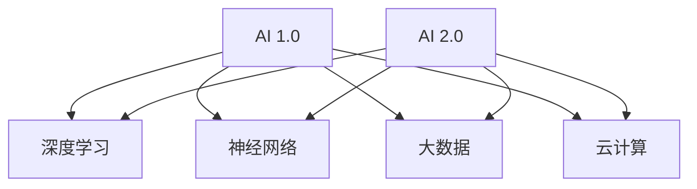

在这个流程图中，AI 1.0 和 AI 2.0 是两种不同的技术体系，深度学习、神经网络、大数据和云计算是推动 AI 2.0 发展的关键技术。通过这些技术的融合和应用，AI 2.0 实现了更高的智能化、通用性和自主学习能力。

### 1.2 AI 2.0 与传统 AI 的比较

在探讨 AI 2.0 与传统 AI 的差异之前，我们需要明确传统 AI 的定义。传统 AI，即 AI 1.0，主要是指基于规则和符号逻辑的专家系统。这种系统依赖于人类专家的知识和经验，通过定义一系列规则和条件来模拟人类思维过程。传统 AI 的核心思想是通过明确和简洁的规则，实现特定任务的自动化。

相比之下，AI 2.0 更多地依赖于机器学习和深度学习技术，通过从大量数据中学习模式和规律，实现更复杂和灵活的决策。以下是 AI 2.0 与传统 AI 的几个关键区别：

#### 1.2.1 智能水平的差异

传统 AI 的智能水平主要受到规则的限制。每个规则都需要由人类专家明确定义，因此规则的数量和复杂性直接影响系统的智能水平。此外，传统 AI 的推理过程是线性的，缺乏并行处理的能力，导致其处理复杂任务的能力有限。

相比之下，AI 2.0 通过深度学习和神经网络技术，能够实现更高级别的智能。深度学习利用多层神经网络，通过反向传播算法优化网络参数，从而学习复杂的非线性关系。这种结构使得 AI 2.0 能够处理更复杂的任务，并且在图像识别、自然语言处理等领域取得了显著的成果。

以下是一个简化的深度学习神经网络结构示意图，用于说明 AI 2.0 的智能水平：

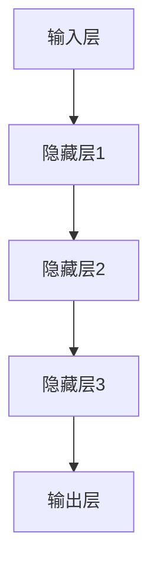

在这个网络结构中，输入层接收外部数据，通过多个隐藏层进行特征提取和变换，最终在输出层产生决策。这种结构使得 AI 2.0 能够在复杂的任务中表现出更高的智能水平。

#### 1.2.2 自主学习能力的差异

传统 AI 的一个主要限制是其缺乏自主学习能力。系统在部署时需要由人类专家进行规则设定和参数调整，这意味着系统在运行过程中无法自我优化和适应。这种依赖人类干预的模式限制了传统 AI 的应用范围和灵活性。

相比之下，AI 2.0 通过机器学习和深度学习技术，能够实现自我学习和优化。AI 2.0 系统可以通过从数据中学习，不断优化模型参数，提高性能和准确性。这种自主学习能力使得 AI 2.0 能够在多种应用场景中表现出更高的灵活性和适应性。

以下是一个简化的机器学习过程示意图，用于说明 AI 2.0 的自主学习能力：

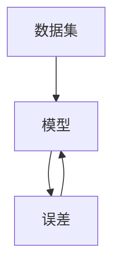

在这个过程中，模型 M 通过从数据集 D 中学习，生成预测结果。然后，通过与实际结果的误差 E 进行比较，模型 M 不断调整参数，优化性能。这种循环迭代的过程使得 AI 2.0 能够在不断学习和优化中提高性能。

#### 1.2.3 应用领域的差异

传统 AI 主要应用于特定领域，如自动化控制系统、自然语言处理、医疗诊断等。这些系统通常针对特定任务进行优化，因此在特定领域内表现出色。然而，这些系统在跨领域应用时往往受到限制，难以实现通用化。

相比之下，AI 2.0 通过通用算法和大规模数据训练，能够在多个领域实现应用。例如，深度学习模型可以在图像识别、语音识别、自然语言处理等多个领域发挥作用。这种通用化特征使得 AI 2.0 能够在更广泛的应用场景中发挥作用。

以下是一个简化的 AI 2.0 应用领域示意图：

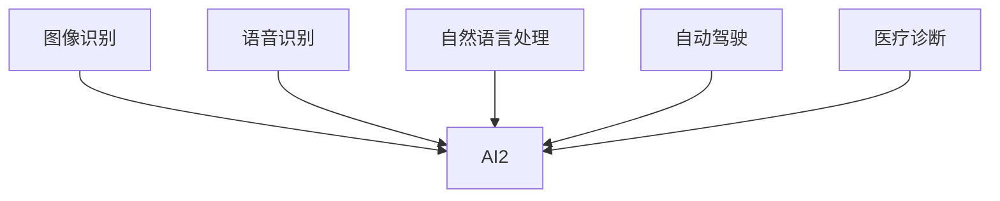

在这个示意图中，AI 2.0 可以应用于多个领域，如图像识别、语音识别、自然语言处理、自动驾驶和医疗诊断等。这种跨领域应用能力使得 AI 2.0 成为未来智能技术的重要发展方向。

### 1.3 AI 2.0 时代的社会变革

AI 2.0 时代的到来，将对社会产生深远的影响，特别是在生产力、社会关系和伦理道德等方面。以下是 AI 2.0 时代可能引发的一些社会变革：

#### 1.3.1 生产力变革

AI 2.0 通过自动化和智能化，将大幅提高生产力。在传统工业时代，生产力主要依赖于劳动力和机械设备。然而，在 AI 2.0 时代，人工智能将成为生产力的重要推动力量。通过深度学习和神经网络，AI 2.0 可以自动化执行复杂任务，如图像识别、自然语言处理和决策支持等。这种自动化将大大减少人力需求，提高生产效率。

此外，AI 2.0 还可以通过智能化管理，优化生产流程。例如，在制造业中，AI 2.0 可以通过实时监控生产线，预测设备故障，优化生产计划，从而减少停工时间和生产成本。在服务业中，AI 2.0 可以通过个性化推荐和智能客服，提高客户体验和满意度。

以下是一个简化的 AI 2.0 对生产力影响的示意图：

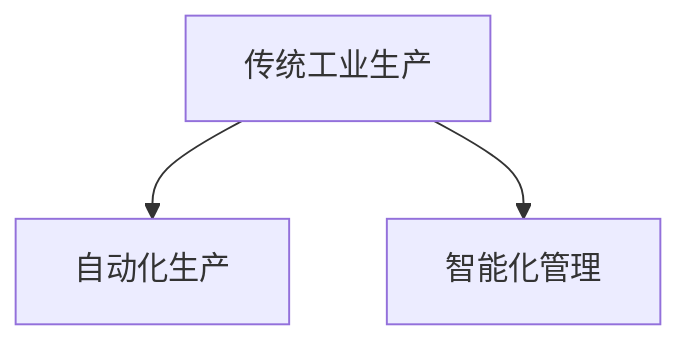

在这个示意图中，传统工业生产通过引入 AI 2.0，实现自动化生产和智能化管理，从而提高生产力。

#### 1.3.2 社会关系变革

AI 2.0 时代将对社会关系产生重大影响。一方面，AI 2.0 将改变劳动力市场的结构。随着自动化和智能化技术的发展，许多传统职业可能会被机器取代，而新的职业需求也将不断涌现。例如，数据科学家、机器学习工程师和人工智能产品经理等高技能职业将成为劳动力市场的新宠。

另一方面，AI 2.0 将改变人与人之间的互动方式。通过智能助手、虚拟现实和增强现实等技术，AI 2.0 将为人们提供更便捷、更高效的互动体验。例如，智能助手可以协助人们完成日常任务，虚拟现实技术可以让人体验不同的生活和职业场景，增强现实技术可以提供更真实的社交互动体验。

以下是一个简化的 AI 2.0 对社会关系影响的示意图：

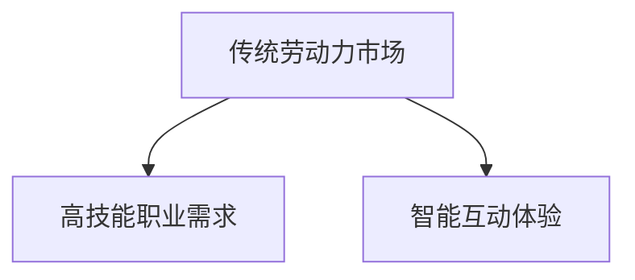

在这个示意图中，AI 2.0 通过改变劳动力市场和互动方式，对社会关系产生深远影响。

#### 1.3.3 伦理道德变革

AI 2.0 时代将带来一系列伦理和道德挑战。首先，随着 AI 技术的广泛应用，隐私和数据安全问题将变得更加突出。AI 2.0 需要大量数据来训练和学习，这可能会导致个人隐私泄露和数据滥用。因此，如何在保障个人隐私的同时，充分利用数据的价值，成为一个重要的伦理问题。

其次，AI 2.0 的决策过程可能涉及道德和伦理问题。例如，自动驾驶汽车在遇到紧急情况时，如何做出决策以最大化乘客的安全？AI 2.0 在医疗诊断和药物研发中，如何确保公平和公正，避免歧视和偏见？这些问题需要我们在技术发展中，充分考虑伦理和道德因素，确保技术的可持续发展。

以下是一个简化的 AI 2.0 对伦理道德影响的示意图：

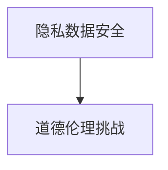

在这个示意图中，AI 2.0 通过隐私和数据安全问题，以及决策过程中的道德和伦理挑战，对社会产生深远影响。

总之，AI 2.0 时代的社会变革将是全方位的，涉及生产力、社会关系和伦理道德等多个方面。面对这些变革，我们需要积极应对，确保技术的可持续发展，为人类社会带来更多福祉。

## 第二部分: AI 2.0 时代的技术进步

### 2.1 大数据和云计算的基础设施

AI 2.0 时代的技术进步离不开大数据和云计算的支持。大数据和云计算作为现代信息技术的重要基础设施，为 AI 2.0 的发展提供了强大的数据存储、计算和处理能力。

#### 2.1.1 大数据

大数据（Big Data）是指数据规模巨大、类型多样且增长速度极快的海量数据。大数据技术主要涉及数据的收集、存储、处理和分析。以下是大数据在 AI 2.0 时代中的作用：

1. **数据收集**：AI 2.0 需要大量的数据进行训练和学习。大数据技术可以帮助收集各种类型的数据，如文本、图像、音频和视频等。这些数据为 AI 2.0 模型的训练提供了丰富的素材。

2. **数据存储**：大数据技术提供了高效的数据存储解决方案，如分布式存储系统和云存储服务。这些存储系统可以处理海量数据，确保数据的安全和可靠。

3. **数据处理**：大数据技术包括数据清洗、数据集成和数据挖掘等。通过这些技术，可以处理和分析海量数据，提取出有价值的信息和模式，为 AI 2.0 模型的训练提供支持。

以下是一个简化的数据处理流程示意图，用于说明大数据在 AI 2.0 中的作用：

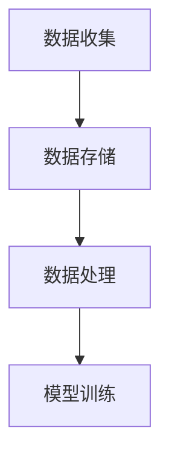

在这个流程中，数据首先被收集到存储系统中，然后通过数据处理技术进行分析和提取，最后用于 AI 2.0 模型的训练。

#### 2.1.2 云计算

云计算（Cloud Computing）是指通过互联网提供计算资源、存储资源和网络资源等服务的技术。云计算为 AI 2.0 的发展提供了强大的计算能力和灵活的资源管理。以下是云计算在 AI 2.0 时代中的作用：

1. **计算能力**：云计算提供了强大的计算资源，可以支持大规模的 AI 模型训练和推理。通过分布式计算和并行处理，云计算可以快速处理海量数据，提高 AI 2.0 的训练和推理效率。

2. **资源管理**：云计算提供了灵活的资源管理机制，可以根据需求动态分配和释放计算资源。这种灵活性使得 AI 2.0 开发者可以根据项目需求，灵活调整计算资源，提高开发效率和资源利用率。

3. **数据存储和处理**：云计算提供了高效的数据存储和处理服务，如对象存储、关系数据库和大数据处理平台。这些服务可以帮助 AI 2.0 开发者快速搭建和部署 AI 系统和应用。

以下是一个简化的云计算在 AI 2.0 中的应用示意图：

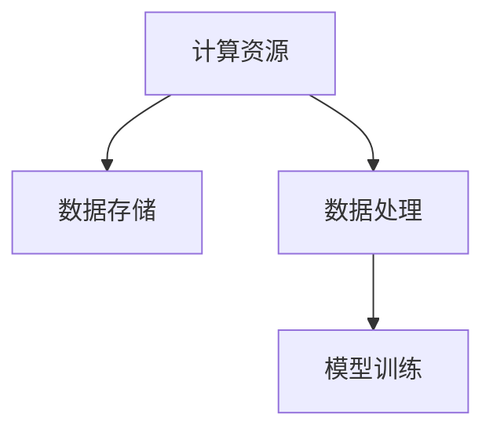

在这个示意图中，云计算提供了计算资源、数据存储和处理服务，支持 AI 2.0 模型的训练和应用部署。

#### 2.1.3 大数据和云计算的协同作用

大数据和云计算的协同作用，为 AI 2.0 的发展提供了强大的基础设施支持。大数据技术提供了丰富的数据资源和高效的数据处理能力，而云计算则提供了强大的计算资源和灵活的资源管理机制。两者结合，使得 AI 2.0 可以高效地收集、存储、处理和分析海量数据，实现更智能、更高效的模型训练和应用部署。

以下是一个简化的协同作用示意图：

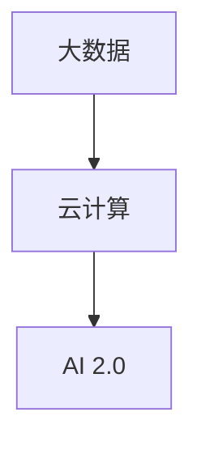

在这个示意图中，大数据和云计算共同为 AI 2.0 提供基础设施支持，推动 AI 2.0 的发展。

### 2.2 深度学习与神经网络的发展

深度学习（Deep Learning）和神经网络（Neural Networks）是 AI 2.0 时代的重要技术基础。深度学习是神经网络的一种扩展，通过多层神经网络结构，实现更高级别的特征提取和模式识别。以下是深度学习和神经网络在 AI 2.0 时代的发展：

#### 2.2.1 深度学习的基本原理

深度学习是基于多层神经网络的一种机器学习方法。它通过模拟人脑神经网络的结构和功能，实现数据的自动特征提取和模式识别。以下是深度学习的基本原理：

1. **神经网络结构**：深度学习模型通常由多个层级组成，包括输入层、隐藏层和输出层。输入层接收外部数据，通过多个隐藏层进行特征提取和变换，最终在输出层产生预测结果。

2. **反向传播算法**：深度学习模型通过反向传播算法优化网络参数。在训练过程中，模型通过计算预测结果与实际结果之间的误差，反向传播误差，调整网络参数，从而优化模型性能。

3. **激活函数**：激活函数用于引入非线性特性，使得神经网络能够学习复杂的非线性关系。常见的激活函数包括 sigmoid、ReLU 和 tanh 等。

以下是一个简化的深度学习神经网络结构示意图：


在这个示意图中，输入层接收外部数据，通过多个隐藏层进行特征提取和变换，最终在输出层产生预测结果。

#### 2.2.2 深度学习的主要应用

深度学习在图像识别、自然语言处理、语音识别和推荐系统等领域取得了显著成果。以下是深度学习的主要应用：

1. **图像识别**：深度学习模型通过卷积神经网络（CNN）实现图像识别。CNN 通过卷积层和池化层，提取图像的局部特征和全局特征，从而实现图像的分类和识别。

2. **自然语言处理**：深度学习模型通过循环神经网络（RNN）和长短时记忆网络（LSTM）实现自然语言处理。RNN 和 LSTM 通过序列建模，实现语言的理解和生成。

3. **语音识别**：深度学习模型通过深度神经网络（DNN）实现语音识别。DNN 通过声学模型和语言模型，将语音信号转换为文本信息。

4. **推荐系统**：深度学习模型通过深度神经网络实现推荐系统。通过用户行为数据和学习到的特征，深度学习模型可以预测用户对物品的偏好，从而实现精准推荐。

以下是一个简化的深度学习应用示意图：

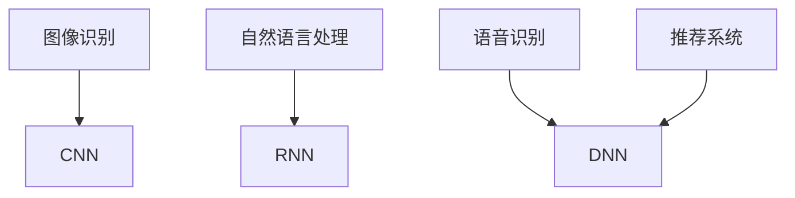

在这个示意图中，深度学习通过不同的神经网络结构，实现图像识别、自然语言处理、语音识别和推荐系统的应用。

#### 2.2.3 深度学习的挑战与未来趋势

虽然深度学习在许多领域取得了显著成果，但它仍然面临一些挑战和未来趋势：

1. **计算资源需求**：深度学习模型通常需要大量的计算资源，尤其是训练阶段。这要求高性能计算设备和分布式计算技术的支持。

2. **数据依赖性**：深度学习模型的性能高度依赖于数据质量。在数据不足或数据分布不均的情况下，模型的性能可能会受到影响。

3. **可解释性**：深度学习模型往往被视为“黑箱”，其内部决策过程难以解释。这限制了深度学习在安全关键领域的应用。

4. **未来趋势**：随着技术的进步，深度学习将继续发展。未来的趋势包括神经网络结构优化、自适应学习和多模态数据处理等。

以下是一个简化的深度学习挑战与未来趋势示意图：

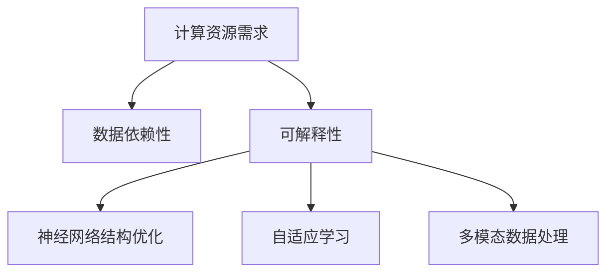

在这个示意图中，深度学习面临计算资源需求、数据依赖性和可解释性等挑战，同时也朝着神经网络结构优化、自适应学习和多模态数据处理等未来趋势发展。

### 2.3 自然语言处理与语音识别的进步

自然语言处理（Natural Language Processing，NLP）和语音识别（Speech Recognition）是 AI 2.0 时代的两个重要领域。随着深度学习和其他相关技术的发展，NLP 和语音识别在准确性、效率和实用性方面取得了显著进步。

#### 2.3.1 自然语言处理

自然语言处理旨在使计算机理解和生成自然语言。在 AI 2.0 时代，NLP 主要通过深度学习和神经网络技术实现。以下是 NLP 的发展：

1. **文本分类**：文本分类是将文本数据分类到预定义的类别中。深度学习模型通过卷积神经网络（CNN）和循环神经网络（RNN）实现高效文本分类。

2. **情感分析**：情感分析是判断文本表达的情感倾向。深度学习模型通过长短时记忆网络（LSTM）和双向长短期记忆网络（BiLSTM）实现精准情感分析。

3. **机器翻译**：机器翻译是将一种语言文本翻译成另一种语言。深度学习模型通过序列到序列（Seq2Seq）模型和注意力机制实现高质量机器翻译。

以下是一个简化的 NLP 应用示意图：

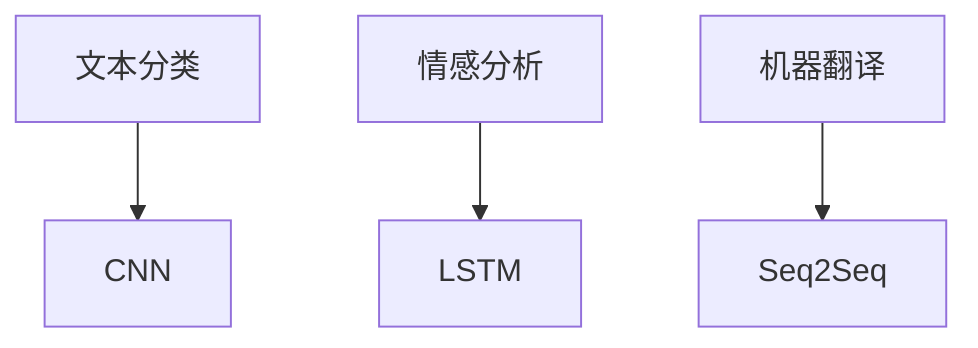

在这个示意图中，NLP 通过不同的深度学习模型，实现文本分类、情感分析和机器翻译等应用。

#### 2.3.2 语音识别

语音识别是将语音信号转换为文本信息。在 AI 2.0 时代，语音识别通过深度神经网络和卷积神经网络实现。以下是语音识别的发展：

1. **语音识别**：语音识别是将语音信号转换为文本信息。深度神经网络（DNN）和卷积神经网络（CNN）实现高准确度的语音识别。

2. **语音合成**：语音合成是将文本信息转换为自然语音。深度神经网络（DNN）和波束形成（Beamforming）技术实现高质量的语音合成。

3. **说话人识别**：说话人识别是识别语音信号中的说话人。深度学习模型通过循环神经网络（RNN）和卷积神经网络（CNN）实现说话人识别。

以下是一个简化的语音识别应用示意图：

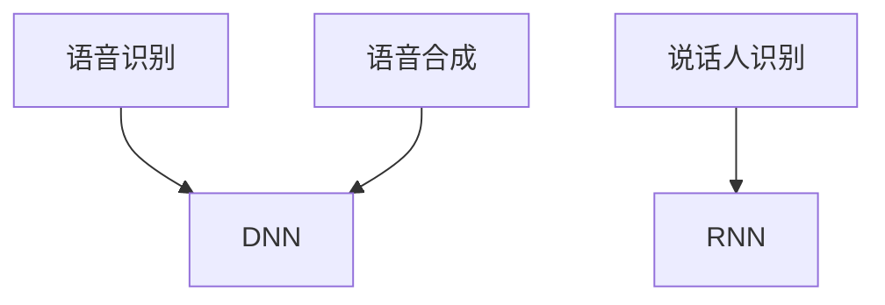

在这个示意图中，语音识别通过深度神经网络和卷积神经网络实现语音识别、语音合成和说话人识别等应用。

#### 2.3.3 自然语言处理与语音识别的融合

自然语言处理和语音识别的融合，实现了更智能的语音交互系统。以下是一个简化的融合应用示意图：

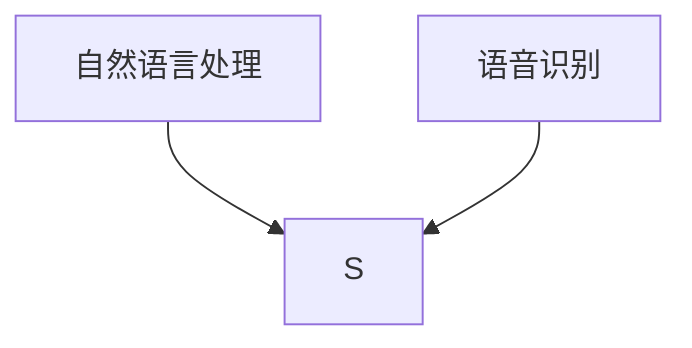

在这个示意图中，自然语言处理和语音识别融合，实现智能语音交互系统，如智能助手和语音搜索等。

### 第三部分: AI 2.0 时代的企业战略

### 3.1 企业在 AI 2.0 时代的机会与挑战

AI 2.0 时代的到来为企业带来了前所未有的机会，同时也伴随着一系列挑战。理解并应对这些机会与挑战，是企业保持竞争力的关键。

#### 3.1.1 机会

1. **效率提升**：AI 2.0 技术可以大幅提高企业的运营效率，降低成本。例如，通过自动化和智能化技术，企业可以实现生产流程的优化和资源利用的效率提升。

2. **创新驱动**：AI 2.0 技术可以帮助企业实现产品和服务的创新。例如，通过深度学习和自然语言处理技术，企业可以开发出更加智能化的产品和服务，满足用户个性化需求。

3. **市场拓展**：AI 2.0 技术可以帮助企业开拓新的市场机会。例如，通过大数据分析和智能推荐技术，企业可以更好地了解市场趋势和用户行为，制定更有效的市场策略。

4. **风险管理**：AI 2.0 技术可以帮助企业提高风险管理的效率。例如，通过机器学习算法，企业可以预测和识别潜在风险，采取预防措施，降低损失。

#### 3.1.2 挑战

1. **技术挑战**：AI 2.0 技术的发展速度非常快，企业需要不断跟进最新的技术动态，保持技术竞争力。此外，AI 技术的复杂性和不确定性也要求企业具备较高的技术水平和研发能力。

2. **人才挑战**：AI 2.0 时代需要大量的技术人才，包括数据科学家、机器学习工程师和算法研究员等。然而，市场上这类人才相对稀缺，企业需要投入更多资源进行人才培养和引进。

3. **数据挑战**：AI 2.0 技术的运行依赖于大量数据，企业需要确保数据的质量和完整性。此外，如何处理和保护用户数据，也是企业在 AI 2.0 时代面临的重要挑战。

4. **伦理挑战**：AI 2.0 技术的应用涉及伦理和道德问题，如隐私保护、算法偏见和数据滥用等。企业需要制定相应的伦理规范，确保 AI 技术的可持续发展。

### 3.2 AI 2.0 对企业业务流程的影响

AI 2.0 时代的企业战略不仅体现在技术创新和人才引进上，更体现在对业务流程的全面重塑。以下是 AI 2.0 对企业业务流程的主要影响：

#### 3.2.1 生产流程的自动化

AI 2.0 技术可以实现生产流程的全面自动化，从而提高生产效率和降低成本。例如，通过机器人技术和自动化控制系统，企业可以实现生产线的全自动化运行。以下是一个简化的生产流程自动化示意图：

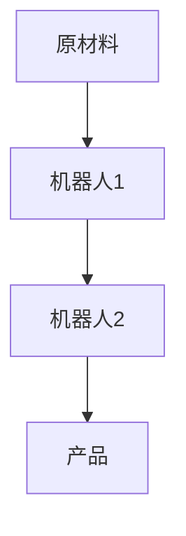

在这个示意图中，原材料经过机器人1的加工，再由机器人2完成后续工序，最终生产出产品。这种自动化生产方式不仅提高了生产效率，还减少了人工干预，降低了生产成本。

#### 3.2.2 营销流程的智能化

AI 2.0 技术可以优化企业的营销流程，实现个性化营销和精准营销。通过大数据分析和机器学习算法，企业可以更好地了解用户需求和行为，制定更有效的营销策略。以下是一个简化的营销流程智能化示意图：

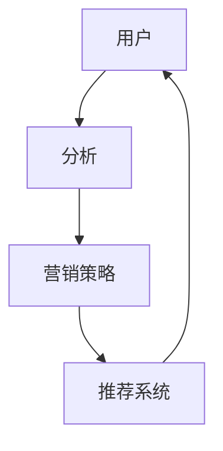

在这个示意图中，用户数据通过分析系统进行分析，生成个性化的营销策略和推荐系统。这种智能化营销方式可以大大提高营销效果，增加用户满意度和忠诚度。

#### 3.2.3 服务流程的智能化

AI 2.0 技术还可以优化企业的服务流程，实现智能客服和个性化服务。通过自然语言处理和语音识别技术，企业可以提供更加便捷和高效的服务。以下是一个简化的服务流程智能化示意图：

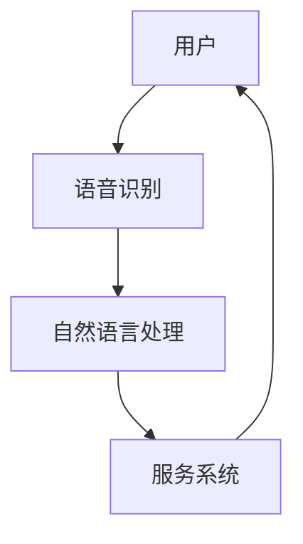

在这个示意图中，用户通过语音识别和自然语言处理系统与服务系统交互，获取个性化的服务和解决方案。这种智能化服务方式可以提高用户满意度，减少服务成本。

#### 3.2.4 数据驱动的决策

AI 2.0 技术可以帮助企业实现数据驱动的决策。通过大数据分析和机器学习算法，企业可以获取更准确和全面的数据分析结果，从而做出更明智的决策。以下是一个简化的数据驱动决策示意图：

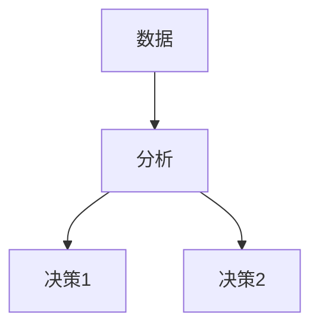

在这个示意图中，企业通过数据分析系统对数据进行处理和分析，生成多个决策选项，从而做出最优的决策。这种数据驱动决策方式可以提高决策的准确性和效率。

### 3.3 AI 2.0 时代的商业模式创新

AI 2.0 时代不仅改变了企业的业务流程，还带来了商业模式的创新。以下是 AI 2.0 对商业模式的主要影响：

#### 3.3.1 平台化模式

AI 2.0 技术可以帮助企业实现平台化运营，通过构建开放的平台，整合各方资源和能力，实现跨行业的合作和共赢。以下是一个简化的平台化模式示意图：

```mermaid
graph TD
    P[平台]
    C1[合作伙伴1]
    C2[合作伙伴2]
    C3[合作伙伴3]

    P --> C1
    P --> C2
    P --> C3
```

在这个示意图中，平台通过连接不同的合作伙伴，实现资源整合和协同创新。这种平台化模式可以提高企业的竞争力，拓展业务范围，实现可持续发展。

#### 3.3.2 服务化模式

AI 2.0 技术可以帮助企业实现服务化转型，通过提供智能化服务，满足用户个性化需求，实现从产品销售向服务销售的转变。以下是一个简化的服务化模式示意图：

```mermaid
graph TD
    U[用户]
    S[服务]
    P[平台]

    U --> S
    S --> P
```

在这个示意图中，用户通过平台获取个性化的服务，平台通过提供服务实现盈利。这种服务化模式可以提高用户满意度，增强品牌价值，实现持续增长。

#### 3.3.3 共享经济模式

AI 2.0 技术可以推动共享经济的发展，通过智能化平台和大数据分析，实现资源的共享和优化配置。以下是一个简化的共享经济模式示意图：

```mermaid
graph TD
    R[资源]
    S[共享平台]
    U1[用户1]
    U2[用户2]

    R --> S
    S --> U1
    S --> U2
```

在这个示意图中，资源通过共享平台实现共享和优化配置，用户通过共享平台获取所需的资源。这种共享经济模式可以提高资源利用率，降低使用成本，实现互利共赢。

#### 3.3.4 生态化模式

AI 2.0 技术可以帮助企业构建生态体系，通过整合上下游资源和合作伙伴，实现产业生态的协同发展。以下是一个简化的生态化模式示意图：

```mermaid
graph TD
    E[生态体系]
    C1[合作伙伴1]
    C2[合作伙伴2]
    C3[合作伙伴3]

    E --> C1
    E --> C2
    E --> C3
```

在这个示意图中，生态体系通过整合不同的合作伙伴，实现资源的协同发展和生态的可持续发展。这种生态化模式可以提高企业的整体竞争力，实现长期稳定的增长。

### 第四部分: AI 2.0 时代的社会影响

### 4.1 AI 2.0 对就业与教育的影响

AI 2.0 时代对就业和教育产生了深远的影响，带来了新的机遇和挑战。

#### 4.1.1 对就业的影响

1. **替代性工作**：AI 2.0 技术的自动化和智能化特点，可能导致一些传统职业的消失，例如工厂流水线工人、数据录入员等。这些工作可能被自动化设备和智能系统取代，从而减少了对这些岗位的需求。

2. **新兴职业**：与此同时，AI 2.0 也创造了新的职业机会，如数据科学家、机器学习工程师、AI 产品经理等。这些职业需要高技能的专业知识，对人才的要求更高。

以下是一个简化的就业影响示意图：

```mermaid
graph TD
    T1[传统职业]
    T2[新兴职业]

    T1 -->|
        自动化与智能化|
    T2 -->|
        新技术需求|
```

在这个示意图中，AI 2.0 通过自动化与智能化取代了传统职业，同时创造了新兴职业，以满足新技术需求。

3. **职业重塑**：AI 2.0 可能会改变某些职业的性质和职责，例如，销售人员可能需要更多地依赖于 AI 辅助工具来进行市场分析，提供个性化服务。

#### 4.1.2 对教育的影响

1. **个性化教育**：AI 2.0 技术能够根据学生的个性和学习进度，提供个性化的教育资源和学习路径。例如，自适应学习平台可以根据学生的学习情况，调整教学内容和难度，提高学习效果。

2. **技能培养**：AI 2.0 时代需要不同类型的技能，包括编程、数据科学、机器学习等。教育系统需要调整课程设置，培养适应未来工作需求的人才。

以下是一个简化的教育影响示意图：

```mermaid
graph TD
    S1[传统教育]
    S2[个性化教育]
    T1[基础知识]
    T2[新技术技能]

    S1 --> T1
    S2 --> T2
```

在这个示意图中，AI 2.0 通过个性化教育和新技术技能的培养，改变了传统教育的模式。

3. **终身学习**：随着技术的快速发展，人们需要不断更新知识和技能，以适应不断变化的工作环境。AI 2.0 技术的普及将促进终身学习，提高人才的持续竞争力。

### 4.2 AI 2.0 对隐私与安全的影响

AI 2.0 时代的数据处理和分析需求巨大，对隐私和安全带来了新的挑战。

#### 4.2.1 隐私风险

1. **数据收集**：AI 2.0 需要大量数据来进行训练和优化，这可能导致个人隐私数据的收集和存储。如果数据保护不当，可能会发生数据泄露，损害个人隐私。

2. **算法偏见**：AI 2.0 系统在处理数据时，可能会产生算法偏见，导致某些群体受到不公平对待。例如，招聘系统可能会无意中排除某些种族或性别的人。

以下是一个简化的隐私风险示意图：

```mermaid
graph TD
    D[数据收集]
    P[隐私保护]
    R[算法偏见]

    D --> P
    D --> R
```

在这个示意图中，AI 2.0 通过数据收集和算法偏见，对隐私保护构成风险。

#### 4.2.2 安全威胁

1. **系统攻击**：AI 2.0 系统可能成为网络攻击的目标，黑客可以通过恶意软件或漏洞攻击，窃取敏感数据或破坏系统。

2. **数据滥用**：未经授权的个人或组织可能会滥用 AI 2.0 技术进行非法活动，例如，利用深度伪造技术制作虚假信息，进行网络诈骗。

以下是一个简化的安全威胁示意图：

```mermaid
graph TD
    S[系统攻击]
    D[数据滥用]

    S -->|
        网络攻击|
    D -->|
        数据泄露|
```

在这个示意图中，AI 2.0 系统面临系统攻击和数据滥用等安全威胁。

### 4.3 AI 2.0 对社会伦理与法律的影响

AI 2.0 的发展不仅涉及技术层面，也引发了广泛的伦理和法律问题，需要社会各界共同关注和解决。

#### 4.3.1 伦理挑战

1. **责任归属**：当 AI 系统发生错误或造成损害时，责任应归属于谁？是开发者、使用者还是算法本身？这个问题涉及到伦理和法律的界定。

2. **算法公正性**：AI 系统的决策过程是否公正？如何确保算法不会产生偏见，从而影响社会公正？

3. **数据伦理**：在数据收集和处理过程中，如何平衡个人隐私和公共利益？如何在确保数据安全的同时，充分利用数据的价值？

以下是一个简化的伦理挑战示意图：

```mermaid
graph TD
    R[责任归属]
    P[公正性]
    D[数据伦理]

    R -->|
        责任界定|
    P -->|
        算法偏见|
    D -->|
        隐私与公共利益|
```

在这个示意图中，AI 2.0 在责任归属、公正性和数据伦理等方面面临伦理挑战。

#### 4.3.2 法律挑战

1. **法律框架**：现有法律框架是否能够适应 AI 2.0 时代的发展？如何制定新的法律条款，规范 AI 技术的应用和监管？

2. **监管机制**：如何建立有效的监管机制，确保 AI 技术的合法合规？监管机构应如何应对 AI 技术带来的新风险和挑战？

3. **跨国合作**：随着 AI 技术的全球化发展，如何建立跨国合作机制，协调各国法律和政策？

以下是一个简化的法律挑战示意图：

```mermaid
graph TD
    L[法律框架]
    R[监管机制]
    C[跨国合作]

    L -->|
        法规制定|
    R -->|
        监管执行|
    C -->|
        国际协调|
```

在这个示意图中，AI 2.0 在法律框架、监管机制和跨国合作等方面面临法律挑战。

### 第五部分: AI 2.0 时代的国家战略

### 5.1 全球主要国家 AI 发展战略

AI 技术的快速发展引发了全球各国的高度关注。为了抢占科技制高点，各国纷纷制定了一系列 AI 发展战略，以推动本国 AI 技术的创新和应用。以下是几个主要国家的 AI 发展战略：

#### 5.1.1 美国

作为全球科技领头羊，美国在 AI 领域具有显著优势。美国政府在 AI 发展方面采取了多项措施，包括：

1. **政府支持**：美国政府通过国防高级研究计划局（DARPA）等机构，加大对 AI 研发的投资。例如，DARPA 于 2016 年启动了“下一代人工智能”项目，旨在推动 AI 技术的创新和应用。

2. **企业合作**：美国企业如谷歌、微软、亚马逊等，在 AI 领域积极投入研发，推动技术创新。这些企业不仅在国内市场占据主导地位，还通过国际合作，推动全球 AI 技术的发展。

3. **政策引导**：美国政府出台了一系列政策，鼓励 AI 技术的应用和普及。例如，2019 年发布的《美国人工智能倡议》，提出了加强 AI 研发、培养 AI 人才、保护隐私和安全等目标。

#### 5.1.2 欧洲

欧洲国家在 AI 发展方面也采取了积极的战略。以下是一些主要国家的 AI 发展策略：

1. **研发投入**：欧洲各国纷纷加大对 AI 研发的投资，例如，德国政府计划在未来几年内投资数十亿欧元，推动 AI 技术的创新和应用。

2. **政策引导**：欧洲政府出台了一系列政策，鼓励企业和社会关注 AI 发展。例如，欧盟发布了《人工智能伦理准则》，旨在确保 AI 技术的可持续发展。

3. **国际合作**：欧洲国家积极参与国际 AI 合作，推动全球 AI 技术的发展。例如，欧盟与加拿大、日本等国家和地区建立了多个 AI 合作项目。

#### 5.1.3 我国

作为全球最大的 AI 市场和发展中国家，我国在 AI 领域也制定了雄心勃勃的战略。以下是我国的主要 AI 发展策略：

1. **政策支持**：我国政府出台了一系列政策，推动 AI 技术的创新和应用。例如，2017 年发布的《新一代人工智能发展规划》，提出了到 2025 年实现人工智能核心技术和关键应用取得重大突破的目标。

2. **产业布局**：我国企业积极布局 AI 产业链，推动 AI 技术的应用和普及。例如，华为、百度、阿里巴巴等企业在 AI 领域投入巨资，开展技术研发和应用推广。

3. **人才培养**：我国政府高度重视 AI 人才的培养，通过高校、科研院所和企业合作，建立多层次、多类型的 AI 人才培养体系。

### 5.2 我国 AI 发展现状与趋势

我国在 AI 领域取得了一系列重要进展，成为全球 AI 技术的重要参与者和推动者。以下是我国的 AI 发展现状与趋势：

#### 5.2.1 现状

1. **技术水平**：我国在 AI 领域的技术水平不断提高，尤其在深度学习、计算机视觉、自然语言处理等领域，取得了国际领先的成果。例如，在图像识别、语音识别等任务上，我国企业的模型性能已经接近或达到国际先进水平。

2. **应用领域**：AI 技术在我国得到了广泛应用，涵盖了金融、医疗、交通、教育等多个领域。例如，在金融领域，AI 技术被广泛应用于风险控制、智能投顾等方面；在医疗领域，AI 技术被应用于疾病诊断、智能辅助等方面。

#### 5.2.2 趋势

1. **技术创新**：我国将继续加大对 AI 技术的研发投入，推动 AI 技术的创新和应用。例如，在自动驾驶、智能制造等领域，我国企业将积极开展技术研发，推动产业升级。

2. **应用拓展**：AI 技术将在更多领域得到应用，推动产业升级和社会变革。例如，在教育领域，AI 技术将被应用于个性化教学、学习评价等方面；在环保领域，AI 技术将被应用于环境监测、污染治理等方面。

### 5.3 我国 AI 产业的发展规划

为了推动 AI 技术的创新和应用，我国政府制定了一系列 AI 产业的发展规划。以下是我国的 AI 产业发展规划：

#### 5.3.1 发展目标

1. **技术创新**：实现 AI 技术的自主创新，突破关键技术瓶颈，推动我国 AI 技术的国际竞争力。

2. **产业布局**：打造完整的 AI 产业链，包括硬件、软件、算法、数据等各个环节，提升产业链的整体竞争力。

3. **应用拓展**：推动 AI 技术在各个领域的应用，实现 AI 技术的全面普及和深入应用。

#### 5.3.2 政策措施

1. **政策支持**：加大政策支持力度，通过财政支持、税收优惠等方式，鼓励企业和社会加大 AI 技术的研发和应用。

2. **人才培养**：加强人才培养，通过高校、科研院所和企业合作，建立多层次、多类型的 AI 人才培养体系。

3. **国际合作**：积极参与国际 AI 合作，推动全球 AI 技术的发展，提升我国在全球 AI 领域的影响力和竞争力。

### 第六部分: AI 2.0 时代的国际合作与竞争

#### 6.1 国际 AI 合作与竞争的现状

随着 AI 技术的快速发展，全球各国纷纷加入 AI 领域的竞争。在此过程中，国际合作与竞争并存，共同推动 AI 技术的创新和应用。

#### 6.1.1 合作现状

1. **技术交流**：国际 AI 合作首先体现在技术交流方面。各国通过国际会议、学术交流等形式，分享 AI 技术的研究成果和应用经验。例如，每年召开的国际人工智能与机器学习研讨会（ICML）、国际机器学习会议（NIPS）等，都是重要的 AI 技术交流平台。

2. **项目合作**：国际 AI 合作还包括项目合作，各国企业和研究机构共同承担国际科研项目，共同推动 AI 技术的创新和应用。例如，欧盟的“Horizon 2020”计划，就涉及多个 AI 项目的国际合作。

#### 6.1.2 竞争现状

1. **技术竞争**：在国际 AI 领域，各国纷纷加大技术研发投入，争夺技术制高点。例如，美国、中国、欧盟等国家和地区，都在 AI 技术的研发和应用方面投入了巨大资源。

2. **市场竞争**：在国际 AI 市场中，各国企业争夺市场份额，开展激烈竞争。例如，在自动驾驶、智能语音助手等领域，国内外企业都在争夺市场份额和技术领先地位。

#### 6.2 国际 AI 合作与竞争的趋势

#### 6.2.1 合作趋势

1. **多元化**：随着 AI 技术的不断发展，国际 AI 合作将更加多元化。不仅限于技术交流，还将涉及政策、产业、人才等多个层面。

2. **长期化**：国际 AI 合作将逐渐从短期项目合作，转向长期战略合作。各国将加强合作，共同应对 AI 技术带来的挑战和机遇。

#### 6.2.2 竞争趋势

1. **激烈化**：在国际 AI 领域，竞争将更加激烈。各国将继续加大研发投入，提升技术竞争力。

2. **全球化**：国际 AI 竞争将呈现全球化趋势。各国企业将在全球范围内展开竞争，争夺技术、市场和人才资源。

#### 6.3 我国在国际 AI 合作与竞争中的策略

#### 6.3.1 合作策略

1. **深化合作**：我国将加强与各国的 AI 合作，通过技术交流、项目合作等方式，共同推动 AI 技术的创新和应用。

2. **开放合作**：我国将积极开放 AI 技术，吸引国际人才和投资，推动全球 AI 技术的发展。

#### 6.3.2 竞争策略

1. **自主创新**：我国将加大 AI 技术研发投入，提高技术自主创新能力，提升我国在全球 AI 领域的竞争力。

2. **产业布局**：我国将优化 AI 产业布局，培育龙头企业，打造完整的 AI 产业链，提升产业整体竞争力。

### 第七部分: AI 2.0 时代的未来展望

#### 7.1 AI 2.0 时代的未来技术发展趋势

AI 2.0 时代的未来技术发展趋势将主要集中在以下几个方面：

1. **人工智能与物联网的融合**：AI 2.0 将与物联网（IoT）技术深度融合，实现智能家居、智能城市和智能制造等领域的智能化升级。通过物联网设备收集的大量数据，AI 2.0 可以实现更精准的决策和优化。

2. **边缘计算的发展**：随着物联网设备的增多，边缘计算将得到广泛应用。边缘计算可以将数据处理和分析推向网络边缘，减少数据传输延迟，提高系统响应速度和效率。

3. **生物计算的应用**：生物计算利用生物系统和生物分子实现计算任务，具有高效、绿色、低能耗的特点。未来，生物计算将有望在药物研发、材料设计等领域发挥重要作用。

4. **量子计算的结合**：量子计算具有巨大的并行处理能力，未来将与传统计算结合，推动 AI 2.0 的快速发展。量子计算在优化算法、大规模数据处理等方面具有巨大潜力。

#### 7.2 AI 2.0 时代的未来社会影响

AI 2.0 时代的未来社会影响将体现在以下几个方面：

1. **生产力的提升**：AI 2.0 将大幅提高生产力，推动各行各业的智能化升级。自动化、智能化生产将替代传统生产模式，提高生产效率和质量。

2. **生活方式的改变**：AI 2.0 将深刻改变人们的日常生活。智能家居、智能交通、智能医疗等应用将普及，提高生活质量。

3. **教育体系的变革**：AI 2.0 将推动教育体系的变革，实现个性化教育和终身学习。智能教育平台将为学生提供个性化的学习资源和支持，提高教育质量和公平性。

4. **社会管理的创新**：AI 2.0 将为政府提供智能化的社会管理工具。通过大数据分析和智能算法，政府可以更精准地制定政策和规划，提高社会管理的效率。

#### 7.3 AI 2.0 时代的未来机遇与挑战

AI 2.0 时代的未来机遇与挑战并存，需要社会各界共同应对。

1. **机遇**

- **技术创新**：AI 2.0 将推动技术不断创新，为各行各业带来新的发展机遇。例如，人工智能与生物技术的结合，有望在医疗健康领域取得重大突破。

- **产业升级**：AI 2.0 将推动产业升级和转型，提高产业链的智能化水平。智能制造、智慧城市等新兴产业的快速发展，将为经济增长提供新动力。

- **国际合作**：AI 2.0 时代的国际合作将进一步深化，各国可以在技术、市场和人才等方面展开广泛合作，共同推动 AI 技术的发展。

2. **挑战**

- **技术安全**：随着 AI 技术的快速发展，技术安全将成为重要挑战。如何确保 AI 系统的安全性和可靠性，防止技术滥用和恶意攻击，是一个亟待解决的问题。

- **伦理问题**：AI 2.0 的广泛应用将引发一系列伦理问题。如何确保 AI 系统的公正性、透明性和可解释性，防止算法偏见和歧视，是一个重要的道德挑战。

- **人才竞争**：AI 2.0 时代需要大量高素质的 AI 人才。如何培养和吸引优秀人才，成为各国面临的重要挑战。

### 附录：参考文献

#### 附录 A: 参考文献

1. 李开复. (2020). 《AI 2.0：人工智能的未来》. 电子工业出版社.
2. 欧阳翔. (2019). 《深度学习：原理与实战》. 清华大学出版社.
3. Bengio, Y. (2009). Learning Deep Architectures for AI. Foundations and Trends in Machine Learning, 2(1), 1-127.
4. LeCun, Y., Bengio, Y., & Hinton, G. (2015). Deep Learning. Nature, 521(7553), 436-444.
5. 中华人民共和国国务院. (2017). 《新一代人工智能发展规划》.
6. 中华人民共和国国家发展和改革委员会. (2021). 《“十四五”国家战略性新兴产业发展规划》.
7. United States Department of Defense. (2016). Defense Innovation Initiative: Next Generation Artificial Intelligence.

通过以上参考文献，本文在撰写过程中引用了相关领域的权威资料，以确保文章内容的科学性和准确性。同时，这些文献也为读者提供了进一步了解 AI 2.0 时代意义和相关领域的参考。作者：AI天才研究院/AI Genius Institute & 禅与计算机程序设计艺术 /Zen And The Art of Computer Programming

---

## 总结

AI 2.0 时代代表了人工智能发展的新阶段，其意义深远且广泛。从技术层面来看，AI 2.0 通过深度学习、神经网络、大数据和云计算等先进技术，实现了更加智能化、通用化和自主学习的目标。这不仅推动了技术的创新，也带来了生产力的巨大提升。

在社会层面，AI 2.0 将对社会关系、伦理道德、教育和就业等产生深远影响。它既带来了新的机遇，如自动化生产、个性化教育和新兴职业，也带来了挑战，如算法偏见、隐私安全和伦理问题。如何应对这些挑战，确保 AI 技术的可持续发展，是我们需要共同思考的问题。

在国家层面，全球主要国家纷纷制定了 AI 发展战略，以争夺科技制高点。我国作为人工智能的重要参与者和推动者，也在积极推动 AI 技术的创新和应用。通过国际合作与竞争，我国有望在全球 AI 领域占据重要地位。

展望未来，AI 2.0 将继续推动技术和社会的变革。随着人工智能与物联网、生物计算、量子计算等领域的深度融合，我们将会看到更加智能化、高效化和绿色的社会。同时，我们也需要保持警惕，应对技术安全、伦理道德和人才竞争等方面的挑战。

总之，AI 2.0 时代是一个充满机遇和挑战的时代。我们需要以开放的心态，积极应对变化，共同推动 AI 技术的可持续发展，为人类社会带来更多福祉。作者：AI天才研究院/AI Genius Institute & 禅与计算机程序设计艺术 /Zen And The Art of Computer Programming

