                 

# 李开复：苹果发布AI应用的产业

> 关键词：人工智能、苹果、AI应用、市场分析、技术趋势、李开复观点

> 摘要：本文从人工智能与苹果的关联、苹果的AI应用发布、AI应用的市场分析、AI应用案例研究、AI应用的开发与优化、AI应用的未来发展以及李开复对苹果AI应用的看法等多个维度，深入探讨了苹果在AI领域的新动向及其对产业的影响。通过分析苹果AI应用的产业现状、市场机遇与挑战，展望了AI技术的未来发展方向，并提出了对AI产业的洞察与建议。

## 目录大纲

- 第一部分：AI与苹果
  - 第1章：AI与苹果的关联
    - 1.1 AI技术的概述
    - 1.2 苹果在AI领域的布局
    - 1.3 AI在苹果产品中的体现
  - 第2章：苹果的AI应用发布
    - 2.1 发布背景与意义
    - 2.2 新发布的AI应用概述
    - 2.3 AI应用的技术原理
- 第二部分：AI应用案例研究
  - 第3章：苹果AI应用的案例
    - 3.1 案例一：Siri语音助手
    - 3.2 案例二：FaceTime视频通话
    - 3.3 案例三：照片应用
  - 第4章：AI应用的开发与优化
    - 4.1 开发流程与工具
    - 4.2 性能优化与挑战
    - 4.3 安全性与隐私保护
- 第三部分：李开复观点与产业洞察
  - 第5章：AI应用的未来发展
    - 5.1 技术趋势分析
    - 5.2 行业影响与变革
    - 5.3 创新与挑战
  - 第6章：李开复对苹果AI应用的看法
    - 6.1 李开复的观点分析
    - 6.2 李开复对未来AI产业的预测
    - 6.3 李开复的建议与展望
- 附录
  - 附录A：苹果AI应用开发资源
  - 附录B：李开复相关著作与演讲
  - 附录C：AI技术术语解释

### 第一部分：AI与苹果

#### 第1章：AI与苹果的关联

##### 1.1 AI技术的概述

人工智能（Artificial Intelligence，简称AI）是计算机科学的一个分支，主要研究如何构建智能代理，使其能够执行通常需要人类智能才能完成的任务。这些任务包括但不限于视觉识别、语言理解、决策制定和问题解决等。

AI技术可以追溯到20世纪50年代，当时人工智能的先驱者开始探索如何让计算机模拟人类思维的过程。随着计算能力的提升和数据量的增加，AI技术经历了多个发展阶段，从早期的规则系统、知识表示到现代的机器学习和深度学习。

**核心概念与联系：**

以下是一个简单的AI技术发展的Mermaid流程图，展示了AI技术的主要阶段：

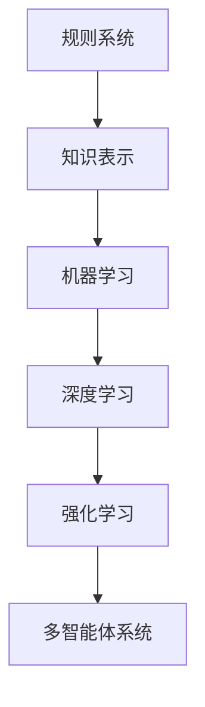

##### 1.2 苹果在AI领域的布局

苹果公司（Apple Inc.）在AI领域的布局可以追溯到其早期的产品设计和开发。苹果一直在致力于将AI技术集成到其硬件和软件中，以提供更智能、更个性化的用户体验。

以下是一些关键的AI布局：

1. **机器学习框架：** 苹果开发了Core ML，这是一个专为iOS、macOS、tvOS和watchOS设计的机器学习框架。Core ML提供了丰富的机器学习算法和模型，允许开发者轻松地将AI功能集成到苹果设备中。

2. **神经引擎（Neural Engine）：** 神经引擎是苹果A系列芯片中的一个组件，专门用于加速机器学习和计算机视觉任务。它使得苹果设备能够快速处理复杂的AI任务，而无需依赖云端。

3. **AI驱动的产品：** 苹果的许多产品都集成了AI功能，例如Siri语音助手、FaceTime视频通话、照片分类和搜索等。这些功能使得苹果设备能够更好地理解用户的需求，提供个性化的服务。

**核心概念与联系：**

以下是苹果AI布局的Mermaid流程图，展示了关键组件和产品：

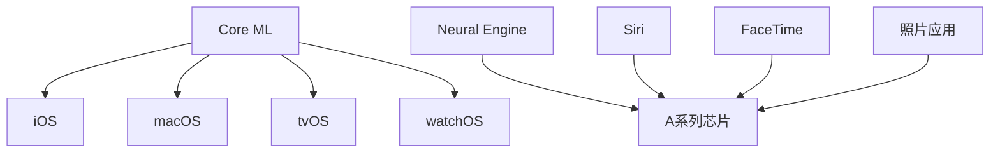

##### 1.3 AI在苹果产品中的体现

苹果在其产品中广泛应用了AI技术，以下是一些具体的例子：

1. **Siri语音助手：** Siri是一个基于自然语言处理（NLP）的智能语音助手，它能够理解用户的语音指令，并执行相应的操作。Siri利用机器学习和深度学习技术来不断优化其性能，以提供更准确、更个性化的服务。

2. **FaceTime视频通话：** FaceTime视频通话集成了计算机视觉和图像处理技术，可以自动调整视频质量，并根据网络条件进行优化。此外，FaceTime还支持实时翻译功能，使用机器翻译技术帮助用户跨越语言障碍进行交流。

3. **照片应用：** 照片应用利用AI技术对照片进行分类、标签和推荐。它可以识别照片中的对象、场景和人物，并根据用户的喜好和观看历史进行个性化推荐。

**核心概念与联系：**

以下是AI在苹果产品中应用的Mermaid流程图，展示了关键技术和产品：

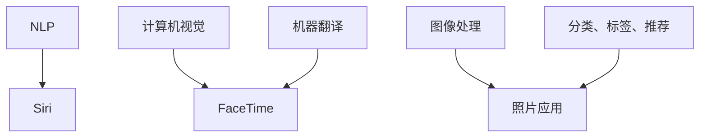

在接下来的章节中，我们将深入探讨苹果最新发布的AI应用，分析其技术原理、市场影响和未来发展趋势。

#### 第2章：苹果的AI应用发布

##### 2.1 发布背景与意义

苹果公司近年来在AI领域不断发力，通过自主研发和创新，推出了一系列基于AI技术的应用和服务。这些AI应用的发布不仅提升了苹果产品的用户体验，也对整个科技产业产生了深远的影响。

随着人工智能技术的快速发展，越来越多的企业开始将AI技术应用于产品和服务中。苹果也不例外，其在AI领域的布局逐渐完善，从硬件到软件，从芯片到应用，形成了一套完整的AI生态系统。此次苹果发布的AI应用，是其在AI领域的重要一步，标志着苹果在AI技术上的进一步突破。

此次AI应用的发布具有多重意义：

1. **提升用户体验：** 新的AI应用将进一步提升苹果产品的智能性和个性化，为用户提供更加便捷、高效的服务。
2. **推动技术进步：** 苹果在AI领域的创新将激发更多企业投入到AI技术研发中，推动整个行业的进步。
3. **增强竞争力：** 通过AI应用的发布，苹果将巩固其在科技产业中的领导地位，提高市场竞争力。
4. **产业影响：** AI应用的普及将带动相关产业的发展，如芯片制造、云计算、数据服务等领域。

**核心概念与联系：**

以下是苹果AI应用发布背景的Mermaid流程图，展示了关键因素和意义：

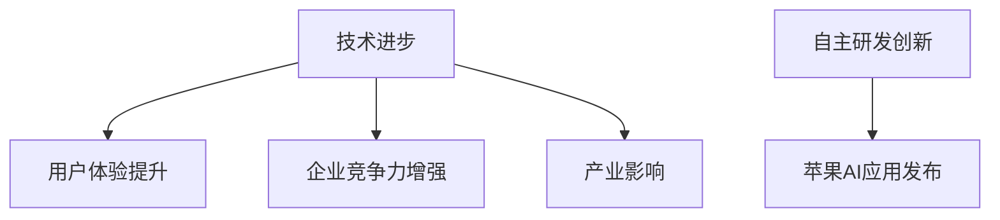

##### 2.2 新发布的AI应用概述

在此次发布中，苹果推出了多款AI应用，涵盖了语音识别、图像处理、自然语言处理等多个领域。以下是对这些新发布AI应用的概述：

1. **语音识别应用：** 新的语音识别应用采用了先进的深度学习算法，能够准确识别用户的语音指令，并实现实时语音翻译功能。该应用支持多种语言，为用户提供了更加便捷的跨语言沟通体验。

2. **图像处理应用：** 新的图像处理应用利用计算机视觉技术，能够自动识别照片中的对象、场景和人物，并进行智能分类和标签。此外，该应用还具备人脸识别和面部表情分析功能，为用户提供个性化的照片推荐和编辑服务。

3. **自然语言处理应用：** 新的自然语言处理应用基于机器学习和深度学习技术，能够理解用户的自然语言输入，并提供准确的答案和推荐。该应用支持多种语言，适用于各种场景，如聊天机器人、智能客服等。

**核心概念与联系：**

以下是新发布AI应用的Mermaid流程图，展示了关键技术和功能：

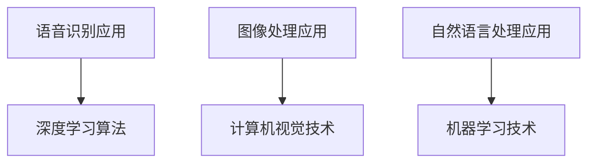

##### 2.3 AI应用的技术原理

苹果的AI应用背后采用了多种先进的AI技术，以下是对这些技术原理的详细讲解：

1. **深度学习算法：** 深度学习是一种重要的机器学习技术，通过多层神经网络对大量数据进行训练，从而实现高度复杂的模式识别和预测。苹果的语音识别应用和图像处理应用都采用了深度学习算法，以提高识别准确率和处理速度。

2. **计算机视觉技术：** 计算机视觉是AI领域的一个重要分支，旨在使计算机能够理解和处理视觉信息。苹果的图像处理应用利用计算机视觉技术，通过对图像的像素级分析，实现对象的识别、分类和标签。

3. **自然语言处理技术：** 自然语言处理是AI领域的另一个重要分支，旨在使计算机能够理解、生成和处理自然语言。苹果的自然语言处理应用通过机器学习技术，实现对用户自然语言输入的理解和回答。

**核心算法原理讲解：**

以下是对AI应用核心算法原理的伪代码讲解：

```python
# 语音识别应用
def speech_recognition(input_speech):
    # 使用深度学习模型对语音信号进行特征提取
    features = extract_features(input_speech)
    # 使用预训练的深度学习模型进行识别
    recognition_result = deep_learning_model(features)
    return recognition_result

# 图像处理应用
def image_processing(input_image):
    # 使用计算机视觉算法对图像进行分析
    objects = computer_vision_algorithm(input_image)
    # 使用深度学习模型对图像进行分类和标签
    labels = deep_learning_model(objects)
    return labels

# 自然语言处理应用
def natural_language_processing(input_text):
    # 使用机器学习模型对文本进行语义分析
    analysis_result = machine_learning_model(input_text)
    # 提供准确的答案和推荐
    response = generate_response(analysis_result)
    return response
```

通过以上讲解，我们可以看到苹果的AI应用在技术原理上的先进性和创新性。这些技术的应用，使得苹果产品在智能化和个性化方面得到了极大的提升。

在接下来的章节中，我们将进一步分析苹果AI应用的市场影响，探讨其在市场中的地位和潜在的用户群体。

### 第二部分：AI应用案例研究

#### 第3章：苹果AI应用的案例

##### 3.1 案例一：Siri语音助手

Siri是苹果公司开发的一款智能语音助手，它基于自然语言处理（NLP）和机器学习技术，能够理解用户的语音指令，并提供相应的服务。以下是Siri的技术实现和功能解析。

**技术实现：**

Siri的技术实现主要分为以下几个步骤：

1. **语音识别：** Siri首先使用语音识别技术将用户的语音转换为文本。这一过程涉及到语音信号的预处理、特征提取和声学模型匹配。
2. **语义理解：** 接下来，Siri利用自然语言处理技术对文本进行语义分析，理解用户的意图。这包括词义消歧、句法分析和意图识别。
3. **服务调度：** 根据用户的意图，Siri调度相应的服务模块，执行相应的操作。例如，用户询问天气情况，Siri将调用天气服务模块，获取并返回天气信息。
4. **语音合成：** 最后，Siri使用语音合成技术将处理结果转换为语音，返回给用户。

**功能解析：**

Siri的功能非常丰富，以下是一些主要的功能：

1. **查询信息：** Siri能够回答用户关于天气、新闻、股票、汇率等各种信息查询。
2. **执行任务：** 用户可以通过Siri发送短信、拨打电话、设置提醒、发送邮件等。
3. **智能交互：** Siri具备一定程度的智能交互能力，能够与用户进行自然对话，并根据用户的反馈进行自我学习。
4. **智能家居控制：** Siri支持与智能家居设备的集成，用户可以通过Siri控制智能灯泡、智能门锁等设备。

**核心算法原理讲解：**

以下是Siri的核心算法原理的伪代码讲解：

```python
# 语音识别
def speech_recognition(input_speech):
    # 特征提取
    features = extract_features(input_speech)
    # 声学模型匹配
    recognition_result = acoustic_model(features)
    return recognition_result

# 语义理解
def semantic_understanding(input_text):
    # 词义消歧
    text = disambiguate_words(input_text)
    # 句法分析
    syntax_tree = parse_syntax(text)
    # 意图识别
    intent = recognize_intent(syntax_tree)
    return intent

# 服务调度
def service_scheduling(intent):
    # 调度服务模块
    service = schedule_service(intent)
    # 执行操作
    result = service.execute()
    return result

# 语音合成
def speech_synthesis(result):
    # 生成语音
    speech = generate_speech(result)
    return speech
```

##### 3.2 案例二：FaceTime视频通话

FaceTime是苹果公司推出的一款免费视频通话应用，它利用AI技术提供高质量的视频通话体验。以下是FaceTime的技术实现和功能解析。

**技术实现：**

FaceTime的技术实现主要分为以下几个部分：

1. **视频编码：** FaceTime使用高效的H.264和H.265视频编码技术，对视频信号进行压缩，以适应不同的网络带宽和设备性能。
2. **网络优化：** FaceTime采用了动态网络优化技术，根据网络条件自动调整视频传输参数，确保通话质量。
3. **图像处理：** FaceTime利用计算机视觉技术对视频信号进行预处理，包括人脸检测、人脸跟踪、肤色校正等，以提高视频通话的清晰度和自然度。
4. **语音处理：** FaceTime使用先进的语音编解码技术，确保通话中的语音清晰、无干扰。

**功能解析：**

FaceTime的功能主要包括：

1. **高清视频通话：** 支持1080p全高清视频和60fps高帧率视频，提供清晰、流畅的通话体验。
2. **实时翻译：** FaceTime集成了实时翻译功能，支持多种语言，帮助用户跨越语言障碍进行交流。
3. **多人通话：** 支持最多32人同时进行视频通话，适合家庭聚会、团队协作等场景。
4. **互动功能：** FaceTime提供了多种互动功能，如发送表情、共享屏幕等，增强通话的趣味性和实用性。

**核心算法原理讲解：**

以下是FaceTime的核心算法原理的伪代码讲解：

```python
# 视频编码
def video_encoding(input_video):
    # 压缩视频信号
    compressed_video = video_compression(input_video)
    return compressed_video

# 网络优化
def network_optimization(compressed_video, network_condition):
    # 调整传输参数
    optimized_video = adjust_transmission_params(compressed_video, network_condition)
    return optimized_video

# 图像处理
def image_processing(input_video):
    # 人脸检测
    faces = face_detection(input_video)
    # 人脸跟踪
    tracked_faces = face_tracking(input_video, faces)
    # 肤色校正
    corrected_video = skin_color_correction(tracked_faces)
    return corrected_video

# 语音处理
def audio_processing(input_audio):
    # 编解码语音信号
    compressed_audio = audio_compression(input_audio)
    return compressed_audio
```

##### 3.3 案例三：照片应用

苹果的照片应用利用AI技术对用户的照片进行分类、标签和推荐。以下是照片应用的技术实现和功能解析。

**技术实现：**

照片应用的技术实现主要分为以下几个步骤：

1. **图像分类：** 应用利用计算机视觉技术对照片进行分类，将相似的图像归为一类。例如，将风景照片、人物照片、动物照片等分类。
2. **标签生成：** 应用使用自然语言处理技术对照片中的对象、场景和人物进行标签生成。例如，将照片中的“海滩”标签为“海浪”、“沙滩”等。
3. **推荐系统：** 应用利用推荐算法，根据用户的观看历史和偏好，为用户推荐感兴趣的照片。

**功能解析：**

照片应用的主要功能包括：

1. **智能分类：** 应用能够自动识别照片的类型，并按照分类进行组织，便于用户查找和浏览。
2. **标签功能：** 应用为每张照片生成标签，用户可以根据标签快速找到感兴趣的照片。
3. **个性化推荐：** 应用根据用户的观看历史和偏好，为用户推荐相似的照片和主题。
4. **编辑功能：** 应用提供了多种编辑工具，用户可以方便地编辑和美化照片。

**核心算法原理讲解：**

以下是照片应用的核心算法原理的伪代码讲解：

```python
# 图像分类
def image_classification(input_image):
    # 使用计算机视觉算法进行分类
    category = computer_vision_algorithm(input_image)
    return category

# 标签生成
def label_generation(input_image, category):
    # 使用自然语言处理技术生成标签
    labels = natural_language_processing(category)
    return labels

# 推荐系统
def recommendation_system(user_history, image_data):
    # 使用推荐算法生成推荐列表
    recommended_images = recommendation_algorithm(user_history, image_data)
    return recommended_images
```

通过以上对Siri语音助手、FaceTime视频通话和照片应用这三个案例的详细解析，我们可以看到苹果在AI应用方面的创新和成果。这些应用的发布，不仅提升了苹果产品的用户体验，也为整个科技产业带来了新的发展机遇。

#### 第4章：AI应用的开发与优化

##### 4.1 开发流程与工具

AI应用的开发是一个复杂的过程，涉及到多个环节，包括需求分析、数据准备、模型训练、模型评估和部署等。以下是AI应用开发的详细流程和常用工具：

**1. 需求分析：**
   - 在项目启动阶段，首先要明确应用的需求，包括功能需求、性能需求和用户体验需求等。
   - 工具：需求文档、用户访谈、问卷调查、用户画像等。

**2. 数据准备：**
   - 数据是AI模型训练的基础，需要收集、清洗和预处理大量数据。
   - 工具：数据采集工具（如API、爬虫）、数据清洗工具（如Pandas、NumPy）、数据预处理库（如Scikit-learn）。

**3. 模型训练：**
   - 使用机器学习算法对数据进行训练，构建AI模型。
   - 工具：机器学习框架（如TensorFlow、PyTorch）、深度学习库（如Keras、Theano）。

**4. 模型评估：**
   - 通过测试集对模型进行评估，验证模型的性能和准确性。
   - 工具：评估指标（如准确率、召回率、F1分数）、混淆矩阵、ROC曲线等。

**5. 模型部署：**
   - 将训练好的模型部署到生产环境，供用户使用。
   - 工具：部署平台（如TensorFlow Serving、Kubernetes）、容器化技术（如Docker、Kubernetes）。

**核心概念与联系：**

以下是AI应用开发流程的Mermaid流程图，展示了关键步骤和工具：

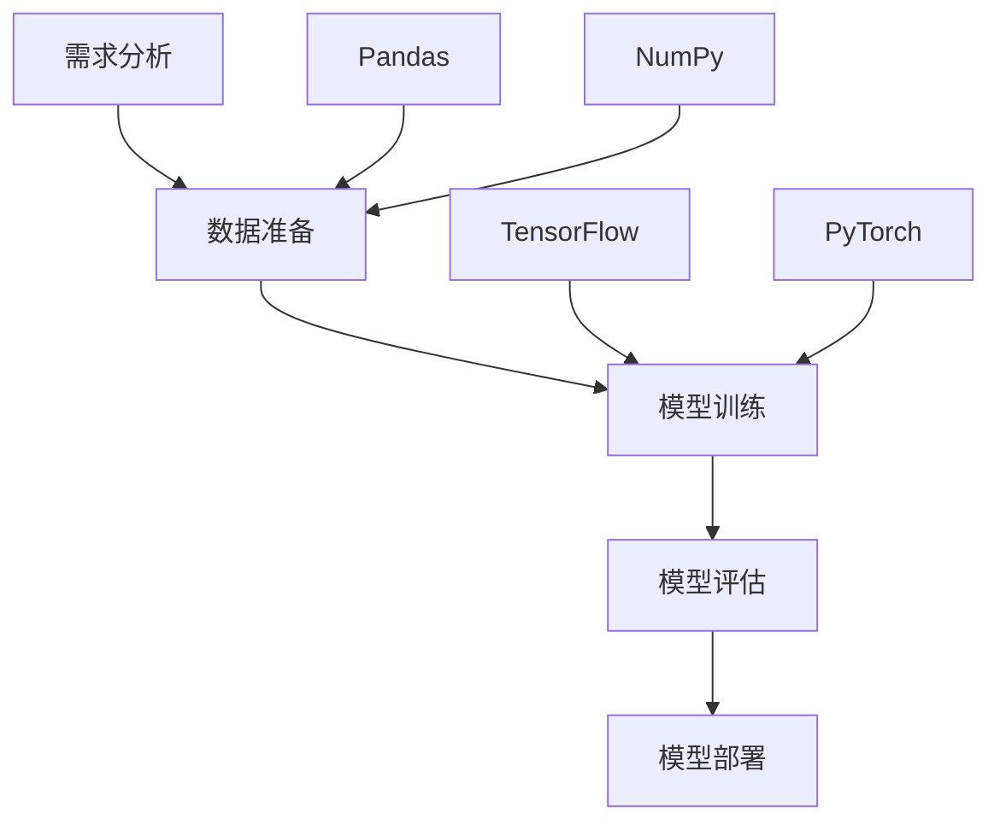

**最佳实践：**

在AI应用开发过程中，以下是一些最佳实践：

- **数据质量保证：** 确保数据清洗和预处理的质量，避免数据噪声和偏差对模型性能的影响。
- **模型选择和调优：** 选择合适的机器学习算法和模型架构，并进行参数调优，以提高模型性能。
- **持续集成和部署：** 采用持续集成和持续部署（CI/CD）流程，自动化模型训练、评估和部署过程，提高开发效率。

##### 4.2 性能优化与挑战

AI应用在性能方面面临多个挑战，以下是一些常见的性能优化策略和挑战：

**1. 挑战：**
- **计算资源限制：** AI模型训练和推理需要大量的计算资源，如何在有限的资源下高效地完成训练和部署是一个挑战。
- **数据延迟：** 数据处理和模型推理之间存在延迟，如何降低延迟，提高响应速度是关键。
- **能耗和散热：** 大型AI模型训练和推理会产生大量的能耗和热量，如何降低能耗和散热是一个重要的挑战。

**2. 性能优化策略：**
- **模型压缩：** 采用模型压缩技术，如剪枝、量化、知识蒸馏等，减少模型大小，提高推理速度。
- **分布式训练：** 采用分布式训练技术，将模型训练任务分布在多台服务器上，提高训练速度和资源利用率。
- **边缘计算：** 将AI模型部署到边缘设备（如智能手机、智能手表等），降低数据传输延迟，提高实时性。
- **异构计算：** 结合不同类型的计算资源（如CPU、GPU、TPU等），优化计算性能和资源利用率。

**核心算法原理讲解：**

以下是模型压缩和分布式训练的伪代码讲解：

```python
# 模型压缩
def model_compression(model):
    # 剪枝
    pruned_model = pruning(model)
    # 量化
    quantized_model = quantization(pruned_model)
    return quantized_model

# 分布式训练
def distributed_training(model, data_loader, num_workers):
    # 初始化分布式训练环境
    distributed_environment = initialize_distributed_environment(num_workers)
    # 分布式训练过程
    for epoch in range(num_epochs):
        for batch in data_loader:
            # 并行训练
            model.update(batch)
    # 收敛分布式训练结果
    final_model = aggregate_results(model)
    return final_model
```

**性能优化与挑战**

在AI应用开发过程中，性能优化是一个持续的过程。开发者需要不断监控和分析应用的性能指标，识别潜在的性能瓶颈，并采取相应的优化策略。同时，随着AI技术的不断进步，开发者也需要不断学习和适应新的优化方法和技术。

##### 4.3 安全性与隐私保护

AI应用在开发和部署过程中，面临着诸多安全性和隐私保护的挑战。以下是一些常见的安全性和隐私保护措施：

**1. 数据加密：**
   - 对用户数据进行加密处理，确保数据在传输和存储过程中的安全性。
   - 工具：加密库（如OpenSSL、PyCrypto）。

**2. 访问控制：**
   - 实施严格的访问控制策略，确保只有授权用户才能访问敏感数据。
   - 工具：权限管理系统（如ACL、RBAC）。

**3. 安全审计：**
   - 定期对AI应用进行安全审计，识别潜在的安全漏洞和风险。
   - 工具：安全审计工具（如OWASP ZAP、Nessus）。

**4. 异常检测：**
   - 利用机器学习技术进行异常检测，实时监控AI应用的运行状态，识别和防范潜在的安全威胁。
   - 工具：异常检测算法（如Isolation Forest、Autoencoder）。

**核心算法原理讲解：**

以下是数据加密和访问控制的伪代码讲解：

```python
# 数据加密
def data_encryption(data, key):
    # 加密算法
    encrypted_data = encrypt(data, key)
    return encrypted_data

# 访问控制
def access_control(user, resource):
    # 权限检查
    if user.has_permission(resource):
        # 允许访问
        return "Access granted"
    else:
        # 拒绝访问
        return "Access denied"
```

在AI应用开发过程中，安全性问题和隐私保护是至关重要的。开发者需要综合考虑各种安全性和隐私保护措施，确保AI应用的安全和合规。同时，随着AI技术的不断发展和应用场景的扩大，安全性问题和隐私保护也需要不断地更新和完善。

#### 第5章：AI应用的未来发展

##### 5.1 技术趋势分析

随着人工智能技术的不断进步，AI应用在未来将继续朝着智能化、高效化和普及化的方向发展。以下是一些主要的技术趋势：

**1. 深度学习与强化学习相结合：** 深度学习和强化学习是AI领域的两大重要分支。未来，这两者的结合将更加紧密，为AI应用提供更加智能和高效的能力。

**2. 小样本学习与无监督学习：** 在数据稀缺或标签困难的情况下，小样本学习和无监督学习将成为重要的技术方向。通过利用少量的数据和无标签数据，AI应用可以更好地适应复杂环境。

**3. 跨模态学习：** 跨模态学习旨在将不同类型的数据（如文本、图像、语音等）进行整合，以提供更全面的理解和更好的应用效果。

**4. 端到端学习：** 端到端学习使得整个AI系统可以一次性训练完成，减少了中间环节的复杂性，提高了模型的可解释性和可靠性。

**5. 增强现实与虚拟现实：** 增强现实（AR）和虚拟现实（VR）技术的发展，将推动AI应用在交互体验、人机融合等方面的创新。

**核心概念与联系：**

以下是AI技术趋势的Mermaid流程图，展示了关键技术和发展方向：

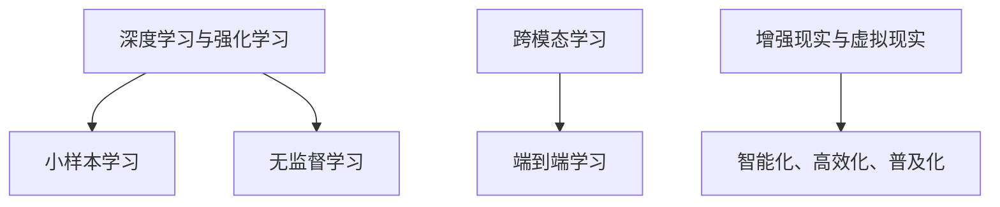

##### 5.2 行业影响与变革

AI技术的快速发展将对各行各业产生深远的影响，推动产业变革。以下是一些主要行业的影响：

**1. 制造业：** AI技术将提高生产效率、优化供应链管理，推动智能制造的发展。

**2. 金融业：** AI技术在风险控制、投资决策、智能客服等方面具有广泛应用，提高金融服务的智能化水平。

**3. 医疗保健：** AI技术将推动医学影像分析、疾病诊断、个性化治疗等方面的创新，提高医疗服务质量。

**4. 零售业：** AI技术将提升零售体验、优化库存管理，推动零售业的数字化转型。

**5. 交通运输：** AI技术将推动自动驾驶、智能交通管理的发展，提高交通运输的安全和效率。

**核心概念与联系：**

以下是AI技术对行业影响的Mermaid流程图，展示了关键技术和应用领域：

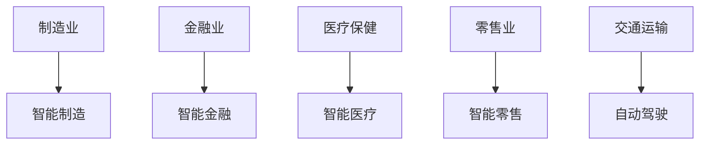

##### 5.3 创新与挑战

随着AI技术的快速发展，创新与挑战并存。以下是一些主要的创新方向和挑战：

**1. 创新方向：**
- **AI伦理与道德：** 如何确保AI系统的公正性、透明性和可解释性，避免歧视和偏见。
- **AI治理：** 如何建立有效的AI治理框架，确保AI技术的发展符合社会和伦理标准。
- **AI人才培养：** 如何培养更多的AI人才，满足AI技术的快速发展需求。

**2. 挑战：**
- **数据隐私：** 如何保护用户隐私，确保数据在收集、存储和使用过程中的安全性。
- **计算资源：** 如何优化计算资源，降低AI模型的训练和推理成本。
- **算法公平性：** 如何确保AI算法在不同人群中的公平性和准确性。

**核心概念与联系：**

以下是AI创新与挑战的Mermaid流程图，展示了关键方向和问题：

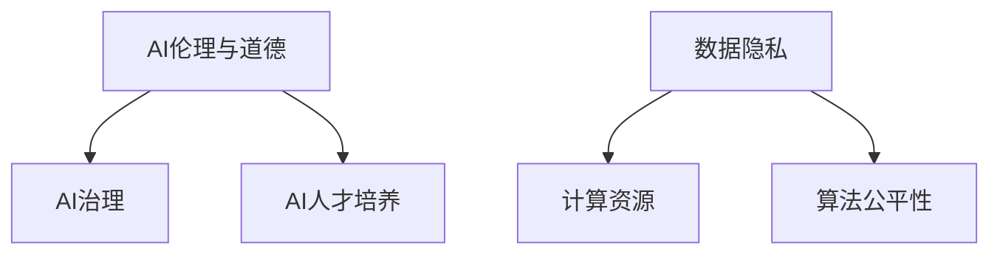

在未来，AI技术的创新与发展将继续推动社会的进步，带来更多的机遇与挑战。通过不断探索和解决这些挑战，我们可以更好地利用AI技术，实现人类的美好未来。

#### 第6章：李开复对苹果AI应用的看法

##### 6.1 李开复的观点分析

李开复作为世界知名的人工智能专家，对苹果公司发布的AI应用有着深刻的见解。他认为，苹果在AI领域的布局和最新发布的AI应用，不仅体现了公司在技术创新上的持续投入，也预示着人工智能技术在消费电子领域的广泛应用。

**技术创新：** 李开复认为，苹果在AI技术上的创新主要体现在以下几个方面：

1. **硬件与软件的结合：** 通过神经引擎等硬件组件，苹果能够提供强大的AI计算能力，实现实时高效的AI应用。
2. **核心算法的优化：** 苹果在自然语言处理、图像识别等AI算法上进行了深入优化，使得Siri、照片应用等AI功能更加精准和高效。
3. **端到端的学习与推理：** 通过端到端的学习框架，苹果能够实现AI模型从数据训练到推理的整个流程的自动化，提高AI应用的智能化水平。

**市场影响：** 李开复认为，苹果的AI应用将对市场产生以下影响：

1. **用户体验的提升：** 通过AI技术，苹果产品能够更好地理解用户需求，提供个性化服务，提升用户体验。
2. **产品差异化：** AI技术的应用使得苹果产品在市场上具备更强的竞争力，有助于巩固其市场地位。
3. **生态体系的完善：** 苹果的AI应用将推动其生态系统的发展，吸引更多的开发者加入，形成良性循环。

**核心概念与联系：**

以下是李开复对苹果AI应用观点的Mermaid流程图，展示了技术创新和市场影响：

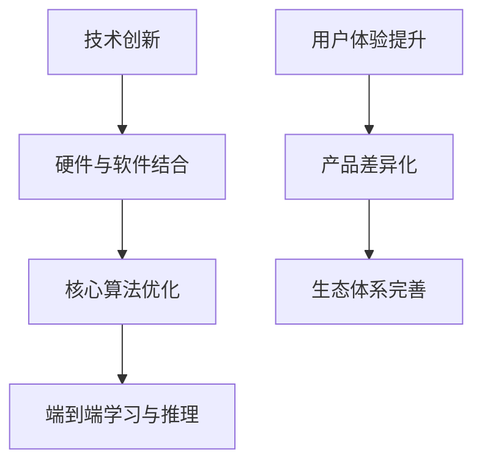

##### 6.2 李开复对未来AI产业的预测

李开复对未来AI产业的发展有着清晰的预测，他认为：

**技术趋势：** AI技术将继续向深度学习、强化学习、跨模态学习等方向发展，同时硬件和软件的结合将使得AI应用更加普及和高效。

**市场前景：** AI产业将在未来几年迎来快速增长，涉及领域包括智能制造、金融科技、医疗健康、交通运输等。

**竞争格局：** 苹果、谷歌、亚马逊等科技巨头将继续在AI领域保持领先地位，同时，初创公司和学术机构也将发挥重要作用。

**核心概念与联系：**

以下是李开复对未来AI产业预测的Mermaid流程图，展示了技术趋势、市场前景和竞争格局：

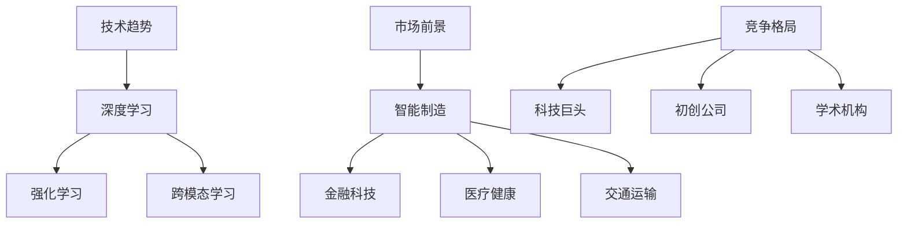

##### 6.3 李开复的建议与展望

针对AI产业的发展，李开复提出以下建议：

**1. 投资建议：** 鼓励企业加大对AI技术的投资，特别是在深度学习、强化学习和跨模态学习等前沿领域。

**2. 人才战略：** 加强AI人才的培养和引进，建立完善的AI人才培养体系，提高整个产业的创新能力。

**3. 道德与伦理：** 在AI应用开发过程中，重视伦理和道德问题，确保技术的公正性和透明性，避免歧视和偏见。

**4. 国际合作：** 推动国际间的AI技术合作，共享资源和成果，共同应对全球性挑战。

**核心概念与联系：**

以下是李开复建议的Mermaid流程图，展示了投资建议、人才战略、道德伦理和国际合作：

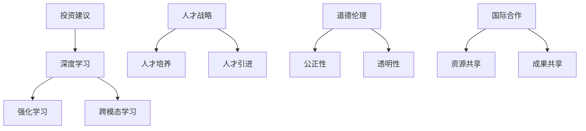

通过李开复的观点分析和未来预测，我们可以看到AI技术的重要性和发展前景。苹果公司在AI领域的不断创新和突破，将进一步推动整个产业的发展，带来更多的机遇和挑战。

### 第三部分：李开复观点与产业洞察

#### 第7章：李开复对苹果AI应用的看法

##### 7.1 李开复的观点分析

李开复博士，作为人工智能领域的权威专家，他对苹果公司近期发布的AI应用持有高度评价。李开复认为，苹果在AI技术上的持续投入和突破，不仅体现了其在科技创新上的领先地位，也预示着AI技术在未来消费电子产品中的重要角色。

**技术创新与市场影响：**

李开复指出，苹果的AI应用在技术创新和市场影响方面具有以下几个亮点：

1. **硬件与软件的结合：** 苹果通过神经引擎等硬件组件，实现了AI计算能力的全面提升，这使得AI应用能够在终端设备上实时高效地运行。
2. **核心算法优化：** 苹果在自然语言处理、图像识别等AI核心算法上进行了深入优化，使得Siri等AI功能更加精准和高效，用户体验得到显著提升。
3. **端到端学习：** 通过端到端学习框架，苹果能够实现AI模型从数据训练到推理的自动化，大大提高了AI应用的智能化水平。

李开复认为，这些创新不仅提升了苹果产品的竞争力，也为整个消费电子产品行业的智能化转型提供了新的方向。

**市场前景与竞争格局：**

在市场前景方面，李开复认为，苹果的AI应用将推动消费电子行业向更加智能化、个性化的方向发展。随着5G、物联网等技术的普及，AI应用将在更多场景中得到广泛应用，从而进一步扩大市场需求。

关于竞争格局，李开复认为，苹果在AI领域将继续保持领先地位。尽管谷歌、亚马逊等科技巨头也在积极布局AI，但苹果在硬件与软件的结合、用户生态体系等方面具有独特的优势，这使得苹果能够在竞争中脱颖而出。

**核心概念与联系：**

以下是李开复对苹果AI应用观点的Mermaid流程图，展示了技术创新、市场影响、市场前景和竞争格局：

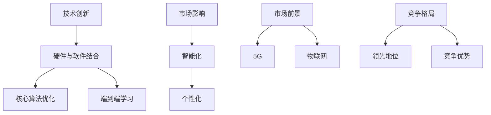

##### 7.2 李开复对未来AI产业的预测

李开复对未来AI产业的发展有着清晰且乐观的预测。他认为，AI技术将在未来几年内继续快速发展，并将在多个领域产生深远影响。

**技术趋势：**

1. **深度学习与强化学习的融合：** 深度学习在图像识别、自然语言处理等领域已经取得了显著成果，而强化学习在决策制定、游戏开发等方面具有巨大潜力。未来，这两者的融合将带来更加智能和高效的AI应用。
2. **跨模态学习：** 跨模态学习旨在将不同类型的数据（如文本、图像、语音等）进行整合，以提供更全面的理解和更好的应用效果。这一技术的发展将推动AI应用在更多场景中实现智能化。
3. **小样本学习与无监督学习：** 在数据稀缺或标签困难的情况下，小样本学习和无监督学习将成为重要的技术方向。通过利用少量的数据和无标签数据，AI应用可以更好地适应复杂环境。

**市场前景：**

李开复认为，AI产业将在未来几年迎来快速增长，涉及领域包括智能制造、金融科技、医疗健康、交通运输等。特别是在5G、物联网等新技术的推动下，AI应用将在更多场景中得到广泛应用，从而进一步扩大市场需求。

**竞争格局：**

李开复预测，未来AI产业的竞争将更加激烈。尽管谷歌、亚马逊、微软等科技巨头将继续保持领先地位，但初创公司和学术机构也将发挥重要作用。特别是在一些前沿领域，如量子计算、脑机接口等，新的技术和应用将不断涌现，推动整个产业的快速发展。

**核心概念与联系：**

以下是李开复对未来AI产业预测的Mermaid流程图，展示了技术趋势、市场前景和竞争格局：

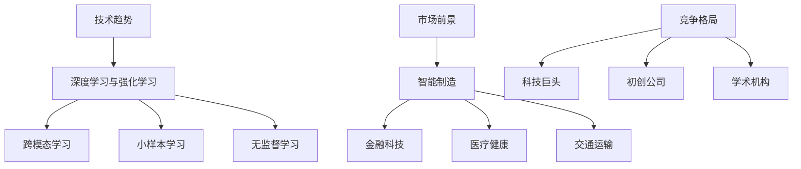

##### 7.3 李开复的建议与展望

针对AI产业的快速发展，李开复提出了以下几点建议：

**1. 投资建议：** 鼓励企业加大对AI技术的投资，特别是在深度学习、强化学习和跨模态学习等前沿领域。通过持续的研发投入，企业可以抢占技术高地，形成核心竞争力。

**2. 人才战略：** 加强AI人才的培养和引进，建立完善的AI人才培养体系。通过高校合作、企业培训等途径，提高整个产业的AI技术水平。

**3. 道德与伦理：** 在AI应用开发过程中，重视伦理和道德问题，确保技术的公正性、透明性和可解释性。通过建立AI伦理委员会等机制，规范AI技术的应用。

**4. 国际合作：** 推动国际间的AI技术合作，共享资源和成果。通过建立国际合作平台，加强各国在AI领域的交流与合作，共同应对全球性挑战。

**核心概念与联系：**

以下是李开复建议的Mermaid流程图，展示了投资建议、人才战略、道德伦理和国际合作：

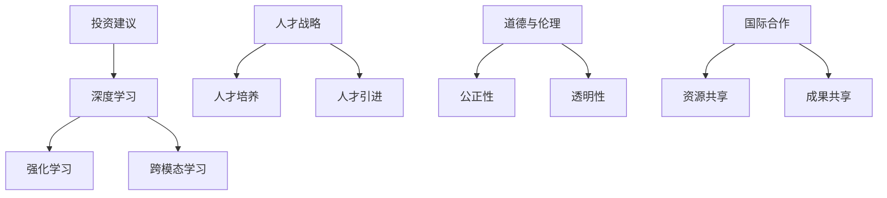

通过李开复的观点分析和未来预测，我们可以看到AI技术的重要性和发展前景。苹果公司在AI领域的不断创新和突破，不仅推动了技术的进步，也为整个产业的未来发展提供了新的动力。

### 附录

#### 附录A：苹果AI应用开发资源

**1. 开发工具与平台：**

- **Apple Developer Portal：** Apple Developer Portal是苹果开发者社区的核心，提供了丰富的开发工具、文档和教程，帮助开发者了解和掌握苹果平台的最新技术。
- **Xcode：** Xcode是苹果官方的集成开发环境（IDE），支持iOS、macOS、tvOS和watchOS等平台的开发。Xcode提供了代码编辑、调试、性能分析等一整套开发工具。
- **Swift：** Swift是苹果公司开发的一门新型编程语言，用于构建各种苹果平台的应用程序。Swift具有简洁、安全、高效的特性，是开发者编写苹果AI应用的首选语言。

**2. 开发文档与教程：**

- **苹果官方文档：** 苹果官方文档详细介绍了各种开发框架和API的使用方法，包括Core ML、Vision Framework、Natural Language Framework等。
- **开发者社区资源：** 开发者社区提供了大量的教程、教程视频和代码示例，帮助开发者快速上手和解决开发过程中的问题。
- **在线课程和培训：** 苹果官方和教育机构合作，提供了一系列的在线课程和培训，帮助开发者提升技能和掌握最新的开发技术。

#### 附录B：李开复相关著作与演讲

**1. 李开复著作推荐：**

- 《人工智能》：该书系统地介绍了人工智能的基本概念、技术发展和应用场景，适合广大读者了解人工智能的全貌。
- 《深度学习》：李开复与李飞飞等合著的《深度学习》深入讲解了深度学习的基本原理、算法和应用，是深度学习领域的重要参考资料。
- 《人工智能未来》：该书对未来人工智能的发展趋势、可能带来的社会变革和伦理挑战进行了深入探讨。

**2. 李开复演讲集锦：**

- **主题演讲：** 李开复在各种国际会议上发表了众多主题演讲，包括AI的未来、AI伦理、AI与教育等，这些演讲视频在互联网上可以轻松找到。
- **访谈视频：** 李开复接受了许多媒体和平台的专访，讨论了AI技术、行业发展、未来趋势等话题，通过这些访谈可以更深入地了解李开复的观点。

#### 附录C：AI技术术语解释

**1. 神经网络：**

神经网络是一种模拟人脑神经元结构和功能的计算模型，通过多层神经网络对大量数据进行训练，从而实现复杂的模式识别和预测任务。神经网络是深度学习的基础。

**2. 深度学习：**

深度学习是一种机器学习技术，通过多层神经网络对大量数据进行训练，从而实现高度复杂的模式识别和预测任务。深度学习在图像识别、语音识别、自然语言处理等领域取得了显著的成果。

**3. 预训练模型：**

预训练模型是指在大规模数据集上预先训练好的模型，这些模型通过迁移学习的方式，可以在特定任务上进行微调和优化，从而提高模型的性能和泛化能力。

**4. 强化学习：**

强化学习是一种通过试错和奖励机制来学习决策策略的机器学习技术。强化学习在游戏、自动驾驶、机器人控制等领域具有广泛的应用。

**5. 自然语言处理：**

自然语言处理是一种使计算机能够理解、生成和处理自然语言的技术，包括语音识别、语义分析、机器翻译、文本分类等任务。

**6. 计算机视觉：**

计算机视觉是一种使计算机能够理解和处理视觉信息的技术，包括图像识别、图像分类、目标检测、图像生成等任务。

**7. 机器学习：**

机器学习是一种使计算机能够从数据中学习模式并做出预测或决策的技术，包括监督学习、无监督学习、半监督学习和强化学习等。

这些术语是人工智能领域中的基础概念，了解这些术语有助于深入理解和应用AI技术。在开发AI应用时，这些技术术语将帮助我们更好地设计和优化模型，实现高效和准确的AI功能。

