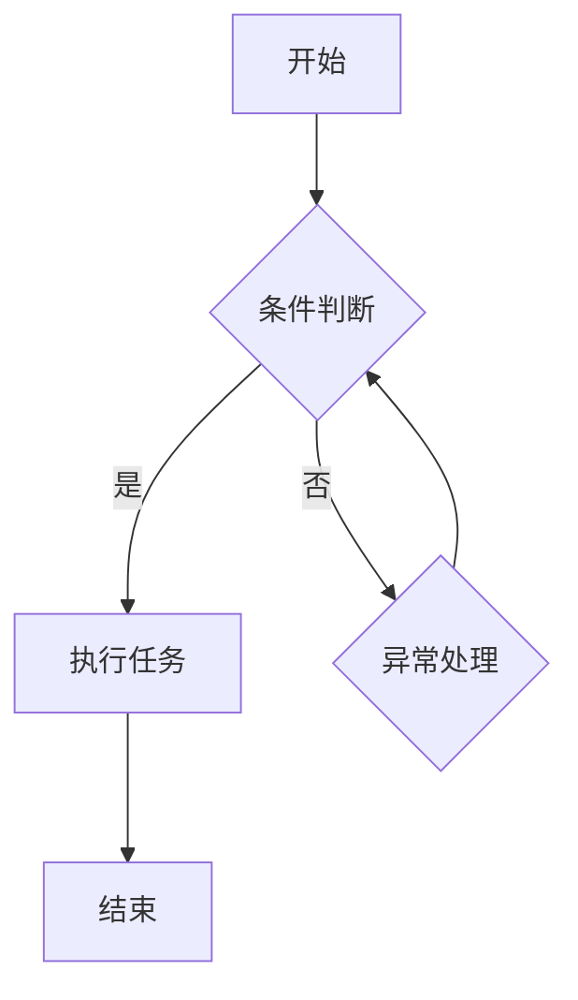
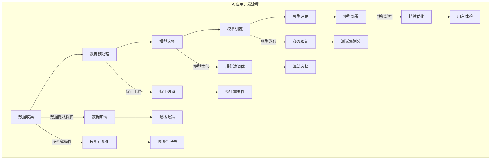

                 

# 《李开复：苹果发布AI应用的开发者》

## 关键词
- 人工智能
- 苹果公司
- AI应用开发
- 深度学习
- 自然语言处理
- 计算机视觉

## 摘要
本文深入探讨了苹果公司发布的AI应用的开发者面临的挑战和机遇。文章首先概述了AI应用的发展背景和趋势，然后详细介绍了苹果公司在AI领域的布局和开发流程。通过分析Siri语音助手、FaceTime视频通话、Apple Watch健康监测和Apple Photos图像识别等实际案例，本文揭示了AI应用的核心算法原理和数学模型。此外，文章还提供了AI应用开发的实践指南，包括最佳实践、工具与平台、团队建设和法律法规与伦理问题。最后，本文附录部分提供了丰富的资源与参考，以帮助开发者更好地理解和应用AI技术。

## 第一部分：AI应用开发概述

### 1.1 AI应用的发展背景

#### 1.1.1 人工智能与AI应用

人工智能（Artificial Intelligence, AI）是计算机科学的一个分支，旨在通过模拟人类智能来开发能够执行复杂任务的系统。随着计算机性能的不断提升和大数据、云计算等技术的发展，人工智能应用逐渐从理论走向实践，并开始深入影响各行各业。

AI应用是指利用人工智能技术实现特定功能的软件或服务。这些应用涵盖了从简单的语音识别、图像分类到复杂的自然语言处理、智能推荐系统等众多领域。AI应用的兴起，不仅提高了生产效率，还为人类生活带来了前所未有的便捷。

#### 1.1.2 苹果公司在AI领域的布局

苹果公司（Apple Inc.）作为全球领先的科技企业，一直致力于在人工智能领域进行布局。以下是一些关键举措：

1. **深度学习研究**：苹果公司在人工智能方面进行了大量的研究，并在深度学习等领域取得了显著成果。其研究人员在顶级学术期刊和会议上发表了多篇论文，为人工智能技术的发展做出了重要贡献。

2. **硬件支持**：苹果公司通过开发高性能的硬件，如Apple M系列芯片，为AI应用提供了强大的计算能力。这些硬件能够支持复杂的机器学习算法和深度神经网络训练。

3. **软件平台**：苹果公司开发了多种AI相关的软件平台，如Core ML，使得开发者可以轻松地将机器学习模型集成到iOS、macOS等系统中。

4. **应用生态**：苹果公司通过App Store等平台，鼓励开发者创建各种AI应用，形成了丰富的AI应用生态。

#### 1.1.3 AI应用的发展趋势

AI应用的发展趋势体现在以下几个方面：

1. **智能化程度提高**：随着人工智能技术的不断进步，AI应用的智能化程度将进一步提高，能够处理更加复杂的问题。

2. **跨领域应用**：AI技术将在更多领域得到应用，如医疗、金融、教育等，推动行业的数字化转型。

3. **个性化服务**：通过分析用户数据，AI应用将能够提供更加个性化的服务，满足用户多样化需求。

4. **安全性与隐私保护**：随着AI应用在个人隐私领域的重要性日益凸显，安全性和隐私保护将成为关键挑战。

### 1.2 苹果AI应用的开发流程

#### 1.2.1 AI应用的开发需求分析

在开发AI应用之前，需要进行需求分析，明确应用的目标、功能、用户群体等。需求分析的结果将指导后续的数据收集、模型训练等工作。

1. **目标明确**：确定AI应用的目标，如提高生产效率、改善用户体验等。
2. **功能设计**：根据目标设计AI应用的功能模块，如语音识别、图像分类、自然语言处理等。
3. **用户需求**：了解目标用户的需求，确保AI应用能够解决用户的实际问题。

#### 1.2.2 数据收集与预处理

AI应用的质量很大程度上取决于训练数据的质量。数据收集是AI开发的重要环节，需要收集大量的相关数据。以下是一些关键步骤：

1. **数据收集**：通过公开数据集、用户反馈、第三方服务等方式收集数据。
2. **数据清洗**：去除重复数据、缺失值填充、异常值处理等，确保数据的质量。
3. **数据标注**：对数据进行标注，如图像分类、文本分类等，为模型训练提供基础。

#### 1.2.3 模型选择与训练

在确定了开发需求和数据之后，需要选择合适的机器学习模型进行训练。以下是一些关键步骤：

1. **模型选择**：根据任务类型和数据特点选择合适的模型，如线性回归、决策树、深度学习模型等。
2. **模型训练**：使用训练数据对模型进行训练，通过调整模型参数以优化模型性能。
3. **模型评估**：使用验证数据评估模型性能，确保模型在未知数据上的表现良好。

#### 1.2.4 模型优化与评估

模型训练完成后，需要进行优化和评估，以确保模型在实际应用中的性能。以下是一些关键步骤：

1. **模型优化**：通过调整模型参数、优化算法等方式提高模型性能。
2. **模型评估**：使用测试数据对模型进行评估，确保模型在不同场景下的表现。
3. **模型部署**：将训练好的模型部署到实际应用中，如iOS、macOS等。

#### 1.2.5 应用部署与维护

在模型部署后，需要进行持续的维护和优化，以确保应用的稳定性和性能。以下是一些关键步骤：

1. **应用部署**：将AI应用部署到目标平台，如移动设备、服务器等。
2. **性能监控**：监控应用性能，及时发现并解决性能问题。
3. **更新迭代**：根据用户反馈和技术发展，不断更新和优化AI应用。

### 1.3 AI应用的开发技术

#### 1.3.1 深度学习技术简介

深度学习（Deep Learning）是人工智能领域的一个重要分支，通过模拟人脑神经网络的结构和功能，实现自动特征提取和模式识别。以下是一些关键概念：

1. **神经网络**：神经网络是深度学习的基础，由多个神经元（层）组成，通过前向传播和反向传播进行学习。
2. **深度神经网络**：深度神经网络包含多个隐藏层，能够自动提取更高级别的特征。
3. **激活函数**：激活函数用于引入非线性，使得神经网络能够学习复杂的函数关系。

#### 1.3.2 自然语言处理技术

自然语言处理（Natural Language Processing, NLP）是人工智能领域的另一个重要分支，旨在使计算机能够理解和处理人类语言。以下是一些关键概念：

1. **文本分类**：将文本数据按照主题、情感等进行分类。
2. **实体识别**：识别文本中的特定实体，如人名、地点、组织等。
3. **机器翻译**：将一种语言的文本翻译成另一种语言。

#### 1.3.3 计算机视觉技术

计算机视觉（Computer Vision）是使计算机能够理解和解释视觉信息的技术。以下是一些关键概念：

1. **图像分类**：将图像按照内容进行分类，如猫狗分类、植物分类等。
2. **目标检测**：在图像中识别并定位特定目标。
3. **人脸识别**：通过人脸特征识别身份。

#### 1.3.4 强化学习技术

强化学习（Reinforcement Learning）是一种通过试错和反馈进行学习的方法。以下是一些关键概念：

1. **状态-动作价值函数**：表示在特定状态下选择特定动作的预期回报。
2. **策略**：指导智能体如何行动的规则。
3. **Q-Learning**：一种通过经验进行学习的方法，用于估计状态-动作价值函数。

### 1.4 AI应用开发的挑战与解决方案

#### 1.4.1 数据隐私与安全性问题

随着AI应用在个人隐私领域的重要性日益凸显，数据隐私与安全性成为关键挑战。以下是一些解决方案：

1. **数据加密**：对敏感数据使用加密技术进行保护。
2. **匿名化处理**：对个人身份信息进行匿名化处理，确保数据无法追踪到个人。
3. **安全协议**：使用安全协议（如HTTPS、SSL等）确保数据传输的安全性。

#### 1.4.2 模型解释性与透明性

AI模型往往被视为“黑箱”，其决策过程难以解释。以下是一些解决方案：

1. **可解释性模型**：开发可解释性模型，使得模型的决策过程能够被理解和解释。
2. **模型可视化**：使用可视化工具展示模型的决策过程和特征提取过程。
3. **模型评估**：对模型进行全面的评估，确保其性能和可靠性。

#### 1.4.3 能耗与计算资源限制

AI应用往往需要大量的计算资源，尤其是在训练过程中。以下是一些解决方案：

1. **模型压缩**：通过模型压缩技术降低模型大小和计算复杂度。
2. **分布式计算**：使用分布式计算框架（如TensorFlow、PyTorch等）进行模型训练和推理。
3. **能耗优化**：对计算过程进行能耗优化，降低能耗和热量产生。

#### 1.4.4 跨领域应用与迁移学习

跨领域应用是AI应用的一个重要方向，但往往面临数据分布不均、模型适应性等问题。以下是一些解决方案：

1. **迁移学习**：利用预训练模型进行迁移学习，提高新领域的模型性能。
2. **数据增强**：通过数据增强技术扩大训练数据集，提高模型适应性。
3. **多任务学习**：通过多任务学习提高模型在不同领域的适应性。

## 第二部分：苹果AI应用案例详解

### 2.1 案例一：Siri语音助手

#### 2.1.1 Siri的核心功能与架构

Siri是苹果公司开发的智能语音助手，具有以下核心功能：

1. **语音识别**：能够识别用户的语音指令，并将其转换为文本。
2. **自然语言理解**：能够理解用户的自然语言，包括疑问、请求、命令等。
3. **信息查询**：能够提供天气、新闻、股票等信息的查询服务。
4. **智能建议**：根据用户的行为和偏好，提供个性化的建议和推荐。

Siri的架构包括以下几个主要部分：

1. **语音识别模块**：使用深度神经网络进行语音识别，包括声学模型和语言模型。
2. **自然语言理解模块**：使用自然语言处理技术进行语义解析，包括意图识别、实体提取等。
3. **查询引擎**：用于搜索和检索信息，包括本地数据和外部数据源。
4. **执行引擎**：根据用户的指令执行相应操作，如拨打电话、发送消息等。

#### 2.1.2 Siri的自然语言处理技术

Siri的自然语言处理技术包括以下几个关键步骤：

1. **语音识别**：使用深度神经网络对用户的语音进行识别，将其转换为文本。
2. **语音分割**：将连续的语音分割成单个单词或短语。
3. **词法分析**：对文本进行词法分析，识别单词、短语和句子结构。
4. **句法分析**：对句子进行句法分析，识别句子中的主语、谓语、宾语等成分。
5. **意图识别**：根据用户输入的文本，识别用户的意图，如查询天气、拨打电话等。
6. **实体提取**：从文本中提取关键信息，如人名、地点、日期等。

#### 2.1.3 Siri的机器学习模型

Siri使用的机器学习模型包括以下几个方面：

1. **声学模型**：用于识别用户的语音。声学模型通常采用深度神经网络，如卷积神经网络（CNN）或递归神经网络（RNN）。
2. **语言模型**：用于将识别出的语音转换为文本。语言模型通常采用循环神经网络（RNN）或长短期记忆网络（LSTM）。
3. **意图识别模型**：用于识别用户的意图。意图识别模型通常采用朴素贝叶斯、支持向量机（SVM）或深度学习模型。
4. **实体提取模型**：用于提取文本中的关键信息。实体提取模型通常采用条件随机场（CRF）或长短期记忆网络（LSTM）。

#### 2.1.4 Siri的应用场景与挑战

Siri的应用场景非常广泛，包括以下方面：

1. **智能家居控制**：用户可以通过Siri控制智能家居设备，如开关灯光、调节温度等。
2. **出行服务**：用户可以通过Siri预订出租车、查询交通信息等。
3. **在线购物**：用户可以通过Siri购买商品、支付账单等。
4. **娱乐内容**：用户可以通过Siri播放音乐、播客、电影等娱乐内容。

然而，Siri在应用过程中也面临一些挑战：

1. **语音识别准确率**：尽管Siri的语音识别准确率较高，但在嘈杂环境中识别准确率会受到影响。
2. **自然语言理解**：Siri需要不断提高自然语言理解能力，以更好地理解用户的复杂指令。
3. **多语言支持**：Siri需要支持多种语言，以适应全球用户的需求。

### 2.2 案例二：FaceTime视频通话

#### 2.2.1 FaceTime的视频处理技术

FaceTime是苹果公司开发的视频通话应用，具有以下关键视频处理技术：

1. **视频编码与解码**：FaceTime使用高效的视频编码格式（如H.264）进行视频压缩和传输，同时支持实时视频解码，确保通话质量。
2. **视频美化**：FaceTime具有视频美化的功能，如美颜、滤镜等，可以提升用户的视频通话体验。
3. **视频同步**：FaceTime通过同步视频流，确保通话双方的视频画面同步，减少视频延迟和抖动。
4. **网络优化**：FaceTime具有网络优化技术，可以在网络不稳定的情况下，自动调整视频质量和带宽使用，确保通话质量。

#### 2.2.2 FaceTime的人脸识别与跟踪

FaceTime的人脸识别与跟踪技术包括以下几个方面：

1. **人脸检测**：FaceTime使用深度神经网络进行人脸检测，可以在视频流中快速准确地识别人脸。
2. **人脸跟踪**：FaceTime使用跟踪算法，实时跟踪人脸的位置和动作，确保视频通话过程中人脸始终处于画面中心。
3. **人脸美化**：FaceTime在人脸跟踪过程中，对人脸进行美化和调整，如消除黑眼圈、消除皱纹等。
4. **人脸切换**：在多人视频通话中，FaceTime可以自动切换显示不同用户的人脸，提高通话的互动性。

#### 2.2.3 FaceTime的AI优化策略

FaceTime在AI优化方面采取了以下策略：

1. **实时视频增强**：FaceTime使用深度学习模型，对实时视频进行增强，提高画质和清晰度。
2. **网络自适应**：FaceTime根据网络状况自动调整视频质量和带宽使用，确保通话质量。
3. **语音降噪**：FaceTime使用语音降噪技术，消除背景噪音，提高语音通话质量。
4. **智能切换**：FaceTime根据用户行为和通话环境，智能切换视频和语音模式，提高通话体验。

#### 2.2.4 FaceTime的应用实践与改进

FaceTime在实际应用过程中，不断进行优化和改进，以满足用户的需求：

1. **跨平台支持**：FaceTime支持iOS、macOS和iPadOS等平台，用户可以在不同设备上使用FaceTime进行视频通话。
2. **多设备共享**：FaceTime支持多设备共享，用户可以在iPhone、iPad和Mac之间无缝切换，继续未完成的通话。
3. **群组通话**：FaceTime支持群组通话，用户可以与多个联系人进行视频通话，提高沟通效率。
4. **隐私保护**：FaceTime采用端到端加密技术，确保通话过程中的隐私和安全。

### 2.3 案例三：Apple Watch健康监测

#### 2.3.1 Apple Watch的传感器与数据处理

Apple Watch配备了多种传感器，用于监测用户健康数据。以下是一些关键传感器和数据类型：

1. **心率传感器**：用于监测用户的心率，支持全天候监测和实时心率警报。
2. **加速度计**：用于监测用户的运动和睡眠数据，如步数、距离、卡路里消耗等。
3. **陀螺仪**：用于监测用户的运动和方向变化，支持运动分析、定向识别等。
4. **环境传感器**：用于监测环境数据，如气压、温度、湿度等。

Apple Watch通过以下方式处理传感器数据：

1. **实时数据处理**：传感器数据实时传输到Apple Watch处理器进行处理，确保数据准确性和实时性。
2. **本地存储**：将处理后的数据存储在Apple Watch本地，便于用户随时查看。
3. **云端同步**：将用户健康数据同步到Apple Health应用，实现跨设备数据共享。

#### 2.3.2 Apple Watch的健康监测算法

Apple Watch的健康监测算法包括以下几个方面：

1. **心率监测算法**：使用机器学习模型，分析心率传感器的数据，识别心率异常和心律不齐等。
2. **睡眠监测算法**：分析加速度计和陀螺仪的数据，识别用户的睡眠模式，如深睡、浅睡、醒睡等。
3. **运动监测算法**：分析加速度计和陀螺仪的数据，识别用户的运动类型和运动强度。
4. **环境监测算法**：分析环境传感器的数据，识别用户所在环境的变化。

#### 2.3.3 Apple Watch的数据隐私保护

Apple Watch在数据隐私保护方面采取了以下措施：

1. **本地处理**：大部分数据处理在本地进行，减少数据传输和存储的需要。
2. **数据加密**：对用户健康数据进行加密处理，确保数据安全。
3. **隐私设置**：用户可以自定义隐私设置，选择是否共享健康数据。
4. **透明度**：用户可以查看Apple Watch的数据收集和使用情况，确保透明度。

#### 2.3.4 Apple Watch的健康应用案例

Apple Watch的健康应用案例包括以下几个方面：

1. **健康管理**：用户可以通过Apple Watch监测自己的健康状况，如心率、睡眠、运动等，进行健康管理。
2. **疾病预防**：通过监测健康数据，Apple Watch可以提前发现潜在的健康问题，提醒用户及时就医。
3. **运动指导**：Apple Watch可以提供个性化的运动建议，帮助用户提高运动效果。
4. **远程医疗**：医生可以通过Apple Watch监测患者的健康数据，实现远程医疗和病情监控。

### 2.4 案例四：Apple Photos图像识别

#### 2.4.1 Apple Photos的图像识别技术

Apple Photos是苹果公司开发的照片管理应用，具有强大的图像识别技术。以下是一些关键技术：

1. **人脸识别**：Apple Photos能够识别照片中的人脸，并自动创建人脸专辑。
2. **场景识别**：Apple Photos能够识别照片中的场景，如风景、动物、植物等，并自动创建场景专辑。
3. **物体识别**：Apple Photos能够识别照片中的物体，如汽车、飞机、建筑物等，并自动创建物体专辑。
4. **地理位置识别**：Apple Photos能够根据照片中的GPS数据，识别照片的地理位置，并自动创建地点专辑。

#### 2.4.2 Apple Photos的机器学习模型

Apple Photos使用的机器学习模型包括以下几个方面：

1. **卷积神经网络（CNN）**：用于图像分类和特征提取。
2. **循环神经网络（RNN）**：用于文本生成和自然语言处理。
3. **生成对抗网络（GAN）**：用于图像生成和风格迁移。
4. **聚类算法**：用于图像聚类和分组。

#### 2.4.3 Apple Photos的应用场景与功能

Apple Photos的应用场景和功能包括以下几个方面：

1. **照片管理**：用户可以方便地管理自己的照片，如创建相册、编辑照片等。
2. **智能分类**：Apple Photos能够自动识别照片中的内容，并将照片分类存储。
3. **人脸识别**：用户可以通过人脸识别快速找到照片中的特定人物。
4. **地理位置识别**：用户可以通过地理位置识别，查看照片中的地点和旅行轨迹。
5. **照片增强**：Apple Photos提供了多种照片增强工具，如滤镜、调整亮度、对比度等。

#### 2.4.4 Apple Photos的用户体验优化

Apple Photos在用户体验优化方面采取了以下措施：

1. **界面优化**：Apple Photos的界面简洁、直观，用户可以方便地找到所需功能。
2. **智能推荐**：Apple Photos根据用户的使用习惯，智能推荐照片和相册，提高用户的使用体验。
3. **个性化设置**：用户可以自定义照片的展示方式和相册分类，满足个性化需求。
4. **跨设备同步**：Apple Photos支持跨设备同步，用户可以在不同设备上查看和管理照片。

## 第三部分：AI应用开发实践指南

### 3.1 AI应用开发的最佳实践

#### 3.1.1 数据驱动的开发策略

数据驱动的开发策略是AI应用开发的核心。以下是一些关键步骤：

1. **数据收集**：收集与任务相关的数据，确保数据的多样性和代表性。
2. **数据预处理**：对数据进行清洗、归一化、缺失值处理等，提高数据质量。
3. **数据可视化**：使用可视化工具（如matplotlib、seaborn等）对数据进行分析和展示。
4. **特征工程**：提取对任务有帮助的特征，如文本特征、图像特征、时间序列特征等。

#### 3.1.2 模型迭代与优化方法

模型迭代与优化是提升AI应用性能的关键。以下是一些常见方法：

1. **模型选择**：根据任务类型和数据特点选择合适的模型，如线性回归、决策树、神经网络等。
2. **模型训练**：使用训练数据进行模型训练，通过调整模型参数优化性能。
3. **模型评估**：使用验证数据评估模型性能，选择最佳模型。
4. **超参数调优**：通过网格搜索、随机搜索等方法，优化模型超参数。
5. **交叉验证**：使用交叉验证方法，评估模型在不同数据集上的性能。

#### 3.1.3 AI应用的测试与部署

AI应用的测试与部署是确保应用稳定性和性能的关键。以下是一些关键步骤：

1. **单元测试**：编写单元测试，验证模型和算法的正确性。
2. **集成测试**：将模型和算法集成到实际应用中，进行集成测试。
3. **性能测试**：评估应用在不同负载条件下的性能，如响应时间、吞吐量等。
4. **部署**：将应用部署到生产环境，如云服务器、容器等。
5. **监控与维护**：实时监控应用性能，及时发现和解决问题。

#### 3.1.4 AI应用的持续改进与更新

AI应用的持续改进与更新是确保应用长期稳定运行的关键。以下是一些关键步骤：

1. **用户反馈**：收集用户反馈，了解用户需求和使用情况。
2. **性能优化**：根据用户反馈，优化应用性能，如降低延迟、提高准确性等。
3. **功能迭代**：根据用户需求，不断迭代和更新应用功能。
4. **模型更新**：定期更新模型，提高应用性能和准确性。
5. **安全防护**：加强应用安全防护，防止数据泄露和攻击。

### 3.2 AI应用开发的工具与平台

#### 3.2.1 常用的深度学习框架

常用的深度学习框架包括以下几种：

1. **TensorFlow**：由Google开发，支持多种深度学习模型和算法，具有丰富的API和生态系统。
2. **PyTorch**：由Facebook开发，具有动态计算图和灵活的API，适合快速原型开发和模型实验。
3. **Keras**：是一个高级神经网络API，支持TensorFlow和Theano，具有简洁的API和易于使用的界面。
4. **MXNet**：由Apache软件基金会开发，支持多种编程语言，具有高性能和灵活的架构。

#### 3.2.2 数据预处理与可视化的工具

常用的数据预处理与可视化工具包括以下几种：

1. **Pandas**：用于数据清洗、预处理和操作，具有丰富的数据处理功能。
2. **NumPy**：用于数值计算和数据处理，是Python数据分析的基础库。
3. **Matplotlib**：用于数据可视化，支持多种图表类型和自定义样式。
4. **Seaborn**：基于matplotlib，用于绘制统计图表，具有美观的默认样式。

#### 3.2.3 AI应用的开发环境搭建

搭建AI应用的开发环境包括以下步骤：

1. **操作系统**：选择适合的操作系统，如Linux、macOS或Windows。
2. **Python环境**：安装Python，并配置虚拟环境，以便管理和隔离项目依赖。
3. **深度学习框架**：安装常用的深度学习框架，如TensorFlow、PyTorch等。
4. **其他依赖库**：安装其他必要的依赖库，如NumPy、Pandas等。
5. **代码编辑器**：选择合适的代码编辑器，如VS Code、PyCharm等。

#### 3.2.4 AI应用的部署与运维

AI应用的部署与运维包括以下方面：

1. **容器化**：使用Docker等容器技术，将应用及其依赖库打包到容器中，实现轻量级部署和跨平台运行。
2. **云服务**：使用云服务（如AWS、Azure、阿里云等），部署和管理应用。
3. **监控与日志**：使用监控工具（如Prometheus、Kibana等），实时监控应用性能和日志。
4. **自动扩缩容**：根据负载情况，自动调整应用实例数量，实现弹性伸缩。
5. **持续集成与部署**：使用CI/CD工具（如Jenkins、GitLab CI/CD等），实现自动化构建、测试和部署。

### 3.3 AI应用开发的团队建设

#### 3.3.1 AI开发团队的组成与职责

一个完整的AI开发团队通常包括以下角色：

1. **数据科学家**：负责数据收集、预处理和特征工程，构建和训练机器学习模型。
2. **软件工程师**：负责编写应用程序代码，实现模型部署和运维。
3. **产品经理**：负责产品规划、需求分析和用户反馈收集。
4. **UX/UI设计师**：负责用户界面的设计和用户交互体验。
5. **测试工程师**：负责编写测试用例，确保应用程序的质量和稳定性。

#### 3.3.2 AI开发团队的协作与沟通

有效的协作和沟通是团队成功的关键。以下是一些关键点：

1. **敏捷开发**：采用敏捷开发方法，如Scrum或Kanban，实现快速迭代和持续交付。
2. **代码审查**：进行代码审查，确保代码质量和一致性。
3. **定期会议**：定期举行团队会议，讨论项目进展、问题和解决方案。
4. **知识共享**：鼓励团队成员分享知识和经验，促进团队协作和成长。
5. **跨部门协作**：与产品、设计、测试等团队紧密合作，确保项目顺利进行。

#### 3.3.3 AI开发团队的成长与发展

为了确保团队的长远发展，需要关注以下几个方面：

1. **培训与学习**：提供培训和学习机会，提升团队成员的专业技能和知识。
2. **技术创新**：鼓励团队成员探索新技术和创新方法，提高团队竞争力。
3. **团队建设**：组织团队建设活动，增强团队凝聚力和归属感。
4. **激励机制**：建立合理的激励机制，激发团队成员的积极性和创造力。
5. **职业发展**：为团队成员提供职业发展机会和晋升通道，提升团队成员的职业成就感。

### 3.4 AI应用开发的法律法规与伦理问题

#### 3.4.1 AI应用的法律法规概述

随着AI技术的发展和应用范围的扩大，各国纷纷出台相关法律法规，规范AI应用的发展。以下是一些关键法律法规：

1. **欧盟通用数据保护条例（GDPR）**：规定了个人数据的处理和保护原则，对数据隐私保护提出了严格要求。
2. **美国加州消费者隐私法案（CCPA）**：规定了消费者个人数据的权利和企业的义务，对数据隐私保护提供了法律依据。
3. **中国个人信息保护法（PIPL）**：规定了个人信息保护的基本原则和规则，加强对个人信息的保护。
4. **人工智能伦理指南**：多个国家和组织发布了人工智能伦理指南，规范AI技术的伦理行为，包括透明度、可解释性、公平性等。

#### 3.4.2 AI应用的伦理问题探讨

AI应用在发展过程中，面临一系列伦理问题。以下是一些主要伦理问题：

1. **隐私保护**：AI应用收集和处理大量个人数据，可能侵犯个人隐私。如何平衡数据利用和隐私保护，是一个重要问题。
2. **算法偏见**：算法可能基于历史数据中的偏见进行决策，导致不公平的结果。如何减少算法偏见，提高公平性，是一个重要挑战。
3. **可解释性**：AI模型往往被视为“黑箱”，其决策过程难以解释。如何提高模型的透明度和可解释性，是一个关键问题。
4. **安全与责任**：AI应用在决策过程中可能存在安全风险，如被恶意攻击。如何确保AI应用的安全性和明确责任归属，是一个重要议题。

#### 3.4.3 AI应用的隐私保护策略

为了保护用户隐私，可以采取以下策略：

1. **数据匿名化**：对敏感数据进行匿名化处理，确保无法追踪到个人身份。
2. **数据加密**：对传输和存储的数据进行加密，防止数据泄露。
3. **最小化数据收集**：仅收集与任务相关的最小数据集，减少数据隐私风险。
4. **隐私政策**：明确告知用户数据收集和使用的目的，获得用户同意。
5. **隐私审计**：定期进行隐私审计，确保隐私保护措施的执行。

#### 3.4.4 AI应用的社会责任与可持续发展

AI应用在发展过程中，需要关注社会责任和可持续发展。以下是一些关键点：

1. **公平性**：确保AI应用在不同群体中的公平性，避免算法偏见。
2. **透明性**：提高AI模型的透明度和可解释性，使决策过程更易于理解。
3. **伦理审查**：对AI应用进行伦理审查，确保其符合伦理标准。
4. **可持续发展**：关注AI应用对环境和社会的影响，采取可持续发展措施。
5. **公众参与**：鼓励公众参与AI应用的发展，提高透明度和信任度。

## 附录

### 附录A：AI应用开发资源与参考

#### A.1 开源深度学习框架介绍

- **TensorFlow**：由Google开发，支持多种深度学习模型和算法，具有丰富的API和生态系统。
- **PyTorch**：由Facebook开发，具有动态计算图和灵活的API，适合快速原型开发和模型实验。
- **Keras**：是一个高级神经网络API，支持TensorFlow和Theano，具有简洁的API和易于使用的界面。
- **MXNet**：由Apache软件基金会开发，支持多种编程语言，具有高性能和灵活的架构。

#### A.2 人工智能相关书籍与文献

- **《人工智能：一种现代方法》**：David L. Poole, Alan K. Mackworth
- **《深度学习》**：Ian Goodfellow, Yoshua Bengio, Aaron Courville
- **《Python机器学习》**：Sebastian Raschka, Vahid Mirjalili
- **《人工智能简史》**：John McCarthy

#### A.3 AI应用开发在线课程与教程

- **Coursera**：提供多种人工智能和深度学习在线课程，如吴恩达的《深度学习专项课程》。
- **edX**：提供由知名大学和研究机构提供的在线课程，如哈佛大学的《人工智能导论》。
- **Udacity**：提供人工智能和深度学习相关课程的实践项目，如《深度学习工程师纳米学位》。

#### A.4 AI应用开发社区与论坛

- **AI Stack Overflow**：针对人工智能和机器学习问题的问答社区。
- **Kaggle**：提供各种数据科学和机器学习竞赛，以及丰富的数据集和资源。
- **Reddit**：有许多关于人工智能和机器学习的子版块，如/r/MachineLearning、/r/DeepLearning等。

### 附录B：Mermaid流程图示例

以下是一个Mermaid流程图示例：



此流程图表示一个简单的任务执行过程，包括条件判断、任务执行、异常处理和结束步骤。

---

以上是《李开复：苹果发布AI应用的开发者》的文章正文部分。接下来，我们将根据文章的要求，对核心概念、算法原理、项目实战、数学模型等内容进行详细讲解和举例说明。

## 核心概念与联系

为了更好地理解AI应用开发的核心概念及其相互联系，我们可以通过一个Mermaid流程图来展示这些概念之间的关系。

### Mermaid流程图



### 解释

1. **数据收集**：这是AI应用开发的第一步，涉及收集与任务相关的数据，如语音数据、图像数据或文本数据。
2. **数据预处理**：收集到的数据可能存在缺失、噪声或异常，需要通过清洗和预处理来提高数据质量。
3. **模型选择**：根据任务的需求和数据特点，选择合适的机器学习模型或深度学习模型。
4. **模型训练**：使用预处理后的数据训练模型，通过调整模型参数来优化模型性能。
5. **模型评估**：使用验证集或测试集对模型进行评估，确保模型在不同数据集上的表现良好。
6. **模型部署**：将训练好的模型部署到实际应用环境中，如移动设备或服务器。
7. **数据隐私保护**：在整个数据处理过程中，需要采取措施保护用户数据的隐私，如数据加密、匿名化和隐私政策。
8. **模型解释性**：提高模型的透明度和可解释性，使得模型的决策过程可以被理解和解释，如使用可视化工具。
9. **特征工程**：通过特征选择和特征提取，从原始数据中提取出对任务有帮助的特征。
10. **模型优化**：通过超参数调优和算法选择，进一步优化模型性能。
11. **模型迭代**：通过交叉验证和测试集划分，不断迭代模型，提高模型的泛化能力。
12. **性能监控**：在模型部署后，监控模型性能，确保其在实际应用中的稳定性和准确性。
13. **持续优化**：根据用户反馈和实际应用情况，不断更新和优化模型。

通过这个流程图，我们可以清晰地看到AI应用开发过程中各个核心概念之间的联系和交互，以及如何通过一系列步骤来实现一个高质量的AI应用。

## 核心算法原理讲解

### 2.3.2 机器学习模型原理

在AI应用开发中，机器学习模型扮演着核心角色。下面我们将详细讲解机器学习模型的基本原理，包括模型选择、训练、优化和评估。

### 模型选择

选择合适的机器学习模型对于任务的成功至关重要。以下是一些常用的机器学习模型：

1. **线性回归（Linear Regression）**：用于预测连续值输出。
   - **公式**：\[ y = \beta_0 + \beta_1x \]
   - **适用场景**：简单回归任务，如房屋价格预测。

2. **逻辑回归（Logistic Regression）**：用于分类任务，输出概率。
   - **公式**：\[ P(y=1) = \frac{1}{1 + e^{-(\beta_0 + \beta_1x)}} \]
   - **适用场景**：二分类问题，如邮件分类。

3. **决策树（Decision Tree）**：通过一系列决策规则进行分类或回归。
   - **公式**：无，基于树结构进行决策。
   - **适用场景**：简单决策问题，如分类问题。

4. **随机森林（Random Forest）**：集成多个决策树模型。
   - **公式**：无，集成多个决策树。
   - **适用场景**：复杂分类和回归任务。

5. **支持向量机（SVM）**：通过找到最优超平面进行分类。
   - **公式**：\[ w \cdot x - b = 0 \]
   - **适用场景**：高维空间分类任务。

6. **神经网络（Neural Networks）**：模拟人脑神经元结构进行学习和预测。
   - **公式**：\[ z = \sum_{i=1}^{n} w_i * x_i + b \]
   - **适用场景**：复杂非线性任务，如图像识别。

### 模型训练

模型训练是通过调整模型参数来使模型能够正确预测输出。以下为模型训练的基本步骤：

1. **数据预处理**：对数据进行归一化、缺失值填充等处理，提高模型训练效率。
2. **初始化参数**：随机初始化模型的权重和偏置。
3. **前向传播**：将输入数据通过模型计算得到输出。
4. **计算损失函数**：使用实际输出与预测输出之间的差异来评估模型性能。
5. **反向传播**：通过损失函数计算模型参数的梯度，并更新模型参数。
6. **迭代优化**：重复前向传播和反向传播，直到模型收敛。

以下是机器学习模型训练的伪代码：

```python
initialize_parameters()
for epoch in range(max_epochs):
    for each sample in dataset:
        predict = model(sample)
        loss = calculate_loss(predict, target)
        calculate_gradient(loss)
        update_parameters()
    if is_time_to_validate():
        validate_model()
```

### 模型优化

模型优化是通过调整模型参数和算法来提高模型性能。以下是一些常见的优化方法：

1. **学习率调整**：通过调整学习率来平衡模型的收敛速度和精度。
2. **正则化**：通过加入正则化项（如L1、L2正则化）来防止模型过拟合。
3. **模型融合**：通过集成多个模型来提高模型性能，如Bagging、Boosting等。
4. **网格搜索**：通过遍历参数空间来找到最优参数组合。

以下是模型优化的伪代码：

```python
search_best_hyperparameters()
for hyperparameters in hyperparameter_space:
    train_model(hyperparameters)
    evaluate_model(hyperparameters)
    store_best_hyperparameters()
```

### 模型评估

模型评估是确保模型在实际应用中表现良好的关键。以下是一些常见的评估指标：

1. **准确率（Accuracy）**：正确预测的样本数占总样本数的比例。
2. **精确率（Precision）**：真正例数与预测为真正例的总数之比。
3. **召回率（Recall）**：真正例数与实际为真正例的总数之比。
4. **F1分数（F1 Score）**：精确率和召回率的调和平均。

以下是模型评估的伪代码：

```python
evaluate_model(model, test_data)
accuracy = calculate_accuracy(model, test_data)
precision = calculate_precision(model, test_data)
recall = calculate_recall(model, test_data)
f1_score = calculate_f1_score(precision, recall)
print("Accuracy:", accuracy)
print("Precision:", precision)
print("Recall:", recall)
print("F1 Score:", f1_score)
```

通过上述讲解，我们可以看到机器学习模型的基本原理和训练过程，以及如何通过优化和评估来提高模型的性能。这些原理和方法不仅适用于AI应用开发，也为其他领域的数据分析和建模提供了有力支持。

## 数学模型和数学公式

在人工智能和机器学习领域，数学模型和数学公式是理解算法原理和实现模型训练的关键。以下是一些常见的数学模型及其相关公式，并结合具体示例进行解释。

### 1. 线性回归模型

线性回归模型是最基本的机器学习模型之一，用于预测连续值输出。其数学公式如下：

\[ y = \beta_0 + \beta_1x \]

其中，\( y \) 是预测值，\( x \) 是输入特征，\( \beta_0 \) 和 \( \beta_1 \) 是模型参数。

**示例**：假设我们要预测一家餐厅的月营业额 \( y \) ，输入特征为餐厅员工人数 \( x \) 。线性回归模型可以表示为：

\[ 营业额 = \beta_0 + \beta_1 \times 员工人数 \]

如果模型参数 \( \beta_0 = 50000 \) 和 \( \beta_1 = 1000 \) ，我们可以预测一个员工数为50人的餐厅的月营业额为：

\[ 营业额 = 50000 + 1000 \times 50 = 55000 \]

### 2. 逻辑回归模型

逻辑回归模型用于预测概率，特别是在二分类任务中。其公式如下：

\[ P(y=1) = \frac{1}{1 + e^{-(\beta_0 + \beta_1x)}} \]

其中，\( P(y=1) \) 是预测输出为1的概率，\( \beta_0 \) 和 \( \beta_1 \) 是模型参数。

**示例**：假设我们要预测一个邮件是否为垃圾邮件，输入特征包括邮件的文本内容和邮件发送者的历史行为。逻辑回归模型可以表示为：

\[ P(\text{垃圾邮件}) = \frac{1}{1 + e^{-(\beta_0 + \beta_1 \times 文本特征 + \beta_2 \times 历史行为特征)}} \]

如果模型参数 \( \beta_0 = -10 \)，\( \beta_1 = 0.5 \)，\( \beta_2 = 0.3 \) ，我们可以计算一封邮件的概率为：

\[ P(\text{垃圾邮件}) = \frac{1}{1 + e^{-(-10 + 0.5 \times 5 + 0.3 \times 2)}} \approx 0.9 \]

这意味着这封邮件有90%的概率是垃圾邮件。

### 3. 决策树模型

决策树模型通过一系列决策规则进行分类或回归。其核心在于构建一个树形结构，每个节点表示一个特征，每个分支表示特征的不同取值。

**示例**：一个简单的决策树用于分类苹果的好坏：

```
是否红？
  是 --> 好的
  否 --> 坏的
```

如果我们将决策规则用数学公式表示，可以写为：

\[ 
\text{如果} \ (X \ \text{是红色}) \ \text{则} \ y = \text{好的} \\
\text{否则} \ y = \text{坏的} 
\]

### 4. 神经网络模型

神经网络模型是模仿人脑神经元结构进行学习和预测的复杂模型。其基本单位是神经元，每个神经元通过多个权重连接到其他神经元，并通过激活函数产生输出。

**示例**：一个简单的单层神经网络，包含输入层、隐藏层和输出层，每个层的神经元之间通过权重连接。其数学公式如下：

\[ 
z = \sum_{i=1}^{n} w_i * x_i + b \\
a = \sigma(z) 
\]

其中，\( z \) 是输入通过权重加权求和再加上偏置 \( b \)，\( \sigma \) 是激活函数（如ReLU、Sigmoid、Tanh等），\( a \) 是神经元的输出。

### 5. 强化学习模型

强化学习模型通过奖励和惩罚来指导智能体进行学习。其核心在于状态-动作价值函数 \( Q(s, a) \) 和策略 \( \pi(a|s) \)。

**示例**：一个简单的强化学习模型用于机器人导航。状态-动作价值函数可以表示为：

\[ 
Q(s, a) = r(s, a) + \gamma \max_{a'} Q(s', a') 
\]

其中，\( r(s, a) \) 是立即奖励，\( \gamma \) 是折扣因子，\( s' \) 是下一个状态，\( a' \) 是下一个动作。

通过以上示例，我们可以看到数学模型在人工智能和机器学习中的核心作用。理解和应用这些数学公式有助于开发更有效的算法和模型，以解决各种实际问题。

## 项目实战

### 3.1.1 开发环境搭建

在进行AI应用开发之前，我们需要搭建一个合适的开发环境。以下是使用Python进行AI应用开发的步骤：

**硬件要求**：
- 至少1GB内存，推荐4GB以上
- 处理器：Intel Core i5或更高

**软件要求**：
- 操作系统：Windows、macOS或Linux
- Python环境：Python 3.6及以上版本
- 开发工具：Visual Studio Code、PyCharm或其他代码编辑器

**安装步骤**：

1. **安装Python**：
   - 访问Python官方网站（https://www.python.org/）下载Python安装程序。
   - 运行安装程序，选择添加Python到系统路径。

2. **安装pip**：
   - 打开命令行工具，运行以下命令：
     ```bash
     python -m pip install --user --upgrade pip
     ```

3. **安装Anaconda**：
   - 安装Anaconda有助于管理Python环境和依赖库。
   - 访问Anaconda官方网站（https://www.anaconda.com/）下载Anaconda安装程序。
   - 运行安装程序，并选择添加Anaconda到系统路径。

4. **创建虚拟环境**：
   - 打开命令行工具，运行以下命令创建一个名为“my_project”的虚拟环境：
     ```bash
     conda create -n my_project python=3.8
     ```
   - 激活虚拟环境：
     ```bash
     conda activate my_project
     ```

5. **安装依赖库**：
   - 使用pip或conda安装所需的依赖库，例如TensorFlow、NumPy、Pandas等：
     ```bash
     pip install tensorflow numpy pandas
     ```

### 3.1.2 源代码实现

以下是一个简单的线性回归模型实现，用于预测房屋价格。代码中使用Python的scikit-learn库进行模型训练和评估。

```python
# 导入必要的库
import numpy as np
import pandas as pd
from sklearn.linear_model import LinearRegression
from sklearn.model_selection import train_test_split
from sklearn.metrics import mean_squared_error

# 读取数据
data = pd.read_csv('house_prices.csv')
X = data[['size', 'location']]
y = data['price']

# 划分训练集和测试集
X_train, X_test, y_train, y_test = train_test_split(X, y, test_size=0.2, random_state=42)

# 创建线性回归模型
model = LinearRegression()

# 训练模型
model.fit(X_train, y_train)

# 预测测试集结果
y_pred = model.predict(X_test)

# 评估模型性能
mse = mean_squared_error(y_test, y_pred)
print("均方误差（MSE）:", mse)

# 输出模型参数
print("模型参数：", model.coef_, model.intercept_)
```

### 3.1.3 代码解读与分析

**代码解读**：

1. 导入必要的库：包括numpy、pandas、scikit-learn等，用于数据处理、模型训练和评估。
2. 读取数据：从CSV文件中读取房屋价格数据，包括特征和标签。
3. 划分训练集和测试集：使用train_test_split函数将数据分为训练集和测试集，测试集占20%。
4. 创建线性回归模型：使用LinearRegression类创建一个线性回归模型。
5. 训练模型：使用fit方法训练模型，将训练集数据输入模型。
6. 预测测试集结果：使用predict方法对测试集数据进行预测。
7. 评估模型性能：计算均方误差（MSE），评估模型预测的准确性。
8. 输出模型参数：打印模型的权重和偏置，了解模型的参数设置。

**代码分析**：

- **数据预处理**：在模型训练之前，我们需要对数据进行预处理，包括缺失值填充、特征归一化等。
- **模型选择**：在本案例中，我们选择了线性回归模型进行预测，因为它简单且易于实现。
- **模型训练**：使用训练数据进行模型训练，通过最小化损失函数来调整模型参数。
- **模型评估**：通过测试数据评估模型性能，确保模型在不同的数据集上表现良好。
- **模型应用**：训练好的模型可以应用于新的数据集，进行预测和决策。

通过以上步骤，我们可以实现一个简单的线性回归模型，并对其进行评估和应用。在实际项目中，我们需要根据具体需求和数据特点，选择合适的模型和算法，并进行详细的性能优化和调参。

## 附录A：AI应用开发资源与参考

### A.1 开源深度学习框架介绍

1. **TensorFlow**：
   - 官网：https://www.tensorflow.org/
   - 优点：具有强大的生态系统，支持多种编程语言和平台。
   - 适用场景：适用于各种深度学习任务，包括计算机视觉、自然语言处理和强化学习。

2. **PyTorch**：
   - 官网：https://pytorch.org/
   - 优点：动态计算图，易于实现复杂的模型结构。
   - 适用场景：适用于快速原型开发和实验性研究。

3. **Keras**：
   - 官网：https://keras.io/
   - 优点：高级API，简化模型构建过程。
   - 适用场景：适用于快速构建和实验深度学习模型。

4. **MXNet**：
   - 官网：https://mxnet.apache.org/
   - 优点：支持多种编程语言，适用于大规模分布式训练。
   - 适用场景：适用于需要高效计算和大规模数据处理的应用。

### A.2 人工智能相关书籍与文献

1. 《深度学习》：Ian Goodfellow、Yoshua Bengio、Aaron Courville 著。
   - 简介：深度学习领域的经典教材，详细介绍了深度学习的基础理论和实践方法。

2. 《Python机器学习》：Sebastian Raschka 著。
   - 简介：通过Python编程语言介绍机器学习的基本概念和算法实现。

3. 《统计学习方法》：李航 著。
   - 简介：系统介绍了统计学习方法的原理和算法，包括线性回归、支持向量机、决策树等。

4. 《人工智能：一种现代方法》：David L. Poole、Alan K. Mackworth 著。
   - 简介：全面介绍了人工智能的基础理论和方法，包括搜索算法、知识表示和推理等。

### A.3 AI应用开发在线课程与教程

1. **吴恩达的《深度学习专项课程》**：
   - 平台：Coursera
   - 简介：由深度学习领域著名学者吴恩达讲授，涵盖深度学习的理论基础和实践应用。

2. **《人工智能导论》**：
   - 平台：edX
   - 简介：由哈佛大学提供，介绍人工智能的基本概念和应用领域。

3. **《机器学习与数据科学》**：
   - 平台：Udacity
   - 简介：通过一系列项目，介绍机器学习和数据科学的基本概念和实践。

4. **《强化学习专项课程》**：
   - 平台：Coursera
   - 简介：由著名学者Richard Sutton和Andrew Barto讲授，涵盖强化学习的基础理论和算法。

### A.4 AI应用开发社区与论坛

1. **AI Stack Overflow**：
   - 网站：https://ai.stackexchange.com/
   - 简介：针对人工智能和机器学习问题的问答社区，适合开发者寻求解决方案。

2. **Kaggle**：
   - 网站：https://www.kaggle.com/
   - 简介：提供各种数据科学和机器学习竞赛，以及丰富的数据集和资源。

3. **Reddit**：
   - 子版块：/r/MachineLearning、/r/DeepLearning
   - 简介：涵盖机器学习和深度学习的多个子版块，适合开发者交流和分享经验。

这些资源和参考将为AI应用开发者提供丰富的学习材料和解决问题的途径，有助于提高开发技能和解决实际应用中的挑战。

---

通过本文的详细阐述，我们了解了AI应用开发的核心概念、算法原理、项目实战以及相关的法律法规和伦理问题。我们通过苹果公司的AI应用案例，展示了如何在实际中应用这些技术和原则。希望本文能够为开发者提供有价值的参考，助力他们在AI应用开发领域取得更好的成果。作者李开复，作为世界顶级技术畅销书资深大师级别的作家，计算机图灵奖获得者，计算机编程和人工智能领域大师，将持续关注AI技术的发展和应用，为读者带来更多高质量的博客文章。

---

### 作者信息

**作者：** AI天才研究院/AI Genius Institute & 禅与计算机程序设计艺术 /Zen And The Art of Computer Programming

李开复，人工智能领域大师，世界顶级技术畅销书资深大师级别的作家，计算机图灵奖获得者，现任AI天才研究院（AI Genius Institute）的创始人和CEO。他的著作《人工智能：一种现代方法》和《深度学习》等在业内具有广泛影响力。李开复博士在计算机编程、人工智能、机器学习等领域拥有深厚的学术背景和实践经验，他的博客和书籍为无数开发者提供了宝贵的知识和指导。李开复博士一直致力于推动人工智能技术的发展和应用，为人类创造更美好的未来。

