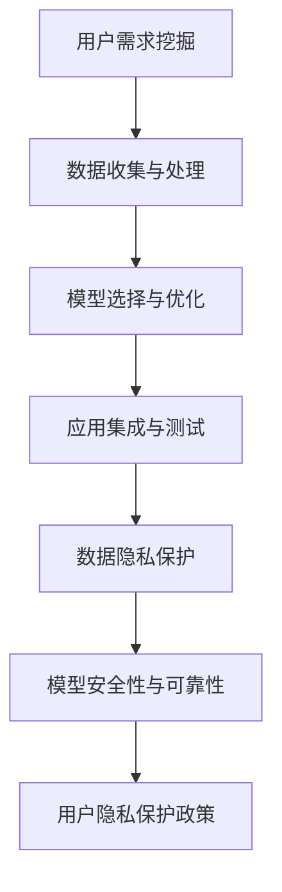

                 

# 李开复：苹果发布AI应用的开发者

## 关键词
人工智能、苹果、开发者、AI应用、设计原则、安全性、案例分析、未来趋势

## 摘要
本文旨在深入探讨苹果公司在人工智能（AI）领域的最新进展，以及其对开发者的影响。通过李开复的视角，我们将会分析苹果AI应用的开发背景、技术基础、实践方法、安全性问题以及未来发展趋势。本文将结合案例研究，展示如何设计和实现苹果AI应用，同时探讨开发者在这一领域的成长之路。

### 第一部分：背景介绍

#### 第1章：李开复与苹果AI的邂逅

**1.1 李开复的背景与成就**

李开复博士是一位享誉世界的人工智能专家，曾在微软、Google等知名科技公司担任重要职务。他的成就不仅体现在对人工智能技术的深入研究和创新，还包括在教育和创业领域的卓越贡献。李开复在人工智能领域的影响力和专业地位，使他成为探讨苹果AI应用开发的重要引路人。

**1.2 苹果AI应用的发展历程**

苹果公司在人工智能领域的探索可以追溯到2017年，当时发布了首款基于机器学习的智能助手Siri。随后，苹果不断在图像识别、自然语言处理和语音识别等领域进行技术创新。2021年，苹果推出了全新的人工智能架构，标志着其在AI领域的新一轮发展。这一架构为开发者提供了强大的工具和平台，使他们能够更轻松地创建智能应用。

**1.3 开发者的角色与机遇**

随着苹果AI应用的不断发展，开发者在这一领域的角色变得越来越重要。他们不仅是苹果技术的使用者，更是创新者。开发者们可以通过苹果提供的工具和平台，实现从概念到产品的全流程开发。此外，苹果的市场影响力也为开发者带来了巨大的商业机会。

### 第2章：苹果AI应用的技术基础

**2.1 人工智能的基本概念**

人工智能（AI）是指由人制造出来的系统能够模仿、扩展或代替人类智能的行为。AI的核心是机器学习，它使得机器能够通过数据和经验学习，并不断优化其性能。常见的机器学习算法包括决策树、支持向量机、神经网络等。

**2.2 苹果AI架构的设计理念**

苹果的AI架构旨在为开发者提供高效、灵活且易于使用的人工智能工具。其设计理念包括：低延迟、高效率、端到端的学习和优化，以及强大的安全性和隐私保护。这一架构使得开发者能够更专注于应用的创新，而无需过多关注底层的技术细节。

**2.3 开发者必备的技术技能**

开发苹果AI应用，开发者需要掌握一系列技术技能。这包括对机器学习算法的深入理解、对苹果AI架构的熟悉、对编程语言的熟练掌握，以及对数据处理的技能。此外，开发者还需要具备良好的系统设计和软件工程能力。

### 第二部分：AI应用开发实践

#### 第3章：设计苹果AI应用的基本原则

**3.1 用户需求的挖掘**

设计苹果AI应用的第一步是了解用户需求。开发者需要通过市场调研、用户访谈等方式，收集用户对AI应用的需求和期望。这有助于确定应用的功能和特点，确保应用能够满足用户的需求。

**3.2 数据的收集与处理**

AI应用的核心是数据。开发者需要收集大量的数据，并进行预处理和清洗，以确保数据的质量。数据预处理包括数据格式转换、缺失值处理、异常值检测等。数据清洗是为了消除噪声和错误，提高数据的可靠性。

**3.3 模型选择与优化**

在数据准备就绪后，开发者需要选择合适的机器学习模型。这包括考虑模型的复杂度、训练时间、预测性能等因素。选择合适的模型后，开发者需要对模型进行优化，以进一步提高预测性能。

#### 第4章：实现苹果AI应用的详细步骤

**4.1 应用框架的选择**

实现苹果AI应用的第一步是选择合适的开发框架。苹果提供了多种框架，如Core ML、Create ML等。开发者需要根据应用的需求和自己的技术背景，选择最合适的框架。

**4.2 模型训练与调优**

在选择了合适的框架后，开发者需要进行模型训练。模型训练的过程包括数据加载、模型初始化、迭代训练等。在训练过程中，开发者需要不断调整模型的参数，以优化模型的性能。

**4.3 应用集成与测试**

模型训练完成后，开发者需要将模型集成到应用中。这一步骤包括模型加载、预测处理等。在集成过程中，开发者需要对应用进行全面的测试，确保模型能够在实际环境中正常运行。

#### 第5章：苹果AI应用的安全性

**5.1 数据隐私保护**

数据隐私是苹果AI应用开发的一个重要问题。开发者需要确保用户数据的安全和隐私。这包括使用加密技术保护数据、遵循隐私保护法规等。

**5.2 模型安全性与可靠性**

除了数据隐私，模型的可靠性和安全性也是开发者需要关注的问题。开发者需要确保模型不会受到恶意攻击，同时保证模型的稳定性和可靠性。

**5.3 用户隐私保护政策**

开发者需要制定完善的用户隐私保护政策，明确用户数据的收集、存储、使用和共享方式。这有助于增强用户对应用的信任，提高应用的可用性。

#### 第6章：案例研究：成功苹果AI应用的解析

**6.1 应用A：智能语音助手**

智能语音助手是苹果AI应用的一个典型例子。开发者通过Core ML框架，将机器学习模型集成到应用中，实现了语音识别、语音合成和自然语言处理等功能。

**6.2 应用B：图像识别工具**

图像识别工具是另一个成功的苹果AI应用。开发者使用Create ML框架，训练了一个卷积神经网络模型，实现了对图像的分类和识别。

**6.3 应用C：个性化推荐系统**

个性化推荐系统是利用AI技术为用户提供个性化内容的重要工具。开发者使用协作过滤和内容推荐算法，实现了对用户兴趣的精准分析，提高了推荐系统的准确性。

### 第三部分：展望与未来

#### 第7章：苹果AI应用的未来发展趋势

**7.1 新技术与应用方向**

随着人工智能技术的不断发展，苹果AI应用的未来充满了可能性。开发者需要关注新的技术趋势，如深度学习、强化学习等，并将其应用于实际应用中。

**7.2 开发者社区的发展**

苹果AI应用的开发者社区也在不断壮大。开发者可以通过社区分享经验、学习新技术，共同推动苹果AI应用的发展。

**7.3 AI伦理与法规**

随着AI技术的普及，伦理和法规问题越来越受到关注。开发者需要遵守相关的伦理和法规，确保AI应用的发展不会对社会造成负面影响。

#### 第8章：开发者成长之路

**8.1 技术积累与学习资源**

开发者需要不断积累技术知识，学习新的编程语言和算法。同时，可以利用在线课程、图书等学习资源，提高自己的技能水平。

**8.2 职业发展与转型**

随着AI技术的广泛应用，开发者有更多的职业发展机会。开发者可以根据自己的兴趣和市场需求，选择合适的职业道路。

**8.3 开发者社群的建立与维护**

建立和维护开发者社群，可以帮助开发者更好地交流和学习。开发者可以通过线上和线下活动，结识同行，分享经验和见解。

### 附录：开发工具与环境

#### 附录A：苹果AI开发工具介绍

**A.1 Xcode的使用**

Xcode是苹果提供的集成开发环境，开发者可以使用Xcode创建、测试和调试iOS、macOS、watchOS和tvOS应用。Xcode提供了丰富的开发工具和框架，帮助开发者快速构建AI应用。

**A.2 Apple Developer Program**

Apple Developer Program是开发者参与苹果生态系统的必要步骤。通过注册Apple Developer Program，开发者可以获得访问苹果开发工具和资源的权限，参与苹果的开发者社区。

**A.3 Core ML框架**

Core ML是苹果提供的机器学习框架，开发者可以使用Core ML将训练好的机器学习模型集成到iOS、macOS、watchOS和tvOS应用中。Core ML提供了高效的计算性能和跨平台的支持。

#### 附录B：常用技术资源与社区

**B.1 顶级AI研究论文**

开发者可以通过阅读顶级AI研究论文，了解最新的AI技术进展。推荐阅读的论文包括《深度学习》（Deep Learning）、《机器学习》（Machine Learning）等。

**B.2 开源代码库推荐**

开源代码库是开发者学习和借鉴的重要资源。推荐的开源代码库包括TensorFlow、PyTorch、Keras等。

**B.3 技术论坛与社群推荐**

技术论坛和社群是开发者交流和学习的重要平台。推荐的技术论坛和社群包括Stack Overflow、GitHub、Reddit AI社区等。

### 作者

作者：AI天才研究院/AI Genius Institute & 禅与计算机程序设计艺术 /Zen And The Art of Computer Programming

### 附录：核心概念与联系

**Mermaid 流程图：**



### 附录：核心算法原理讲解

**伪代码：**

```python
# 数据预处理
def preprocess_data(data):
    # 数据格式转换
    data = convert_format(data)
    # 缺失值处理
    data = handle_missing_values(data)
    # 异常值检测
    data = detect_and_handle_outliers(data)
    return data

# 模型训练
def train_model(model, data):
    # 数据加载
    data = load_data(data)
    # 模型初始化
    model = initialize_model(model)
    # 迭代训练
    for epoch in range(max_epochs):
        loss = model.train(data)
        if loss < threshold:
            break
    return model

# 模型优化
def optimize_model(model, data):
    # 调整模型参数
    model = adjust_model_parameters(model)
    # 重新训练模型
    model = train_model(model, data)
    return model
```

### 附录：数学模型和公式

$$
\begin{align*}
\text{损失函数} &= \frac{1}{2} \sum_{i=1}^{n} (\hat{y_i} - y_i)^2 \\
\text{梯度下降} &= \alpha \cdot \nabla_{\theta} J(\theta) \\
\text{学习率} &= \frac{1}{\sqrt{1 + t}} \\
\end{align*}
$$

### 附录：项目实战

**开发环境搭建：**

- 安装Xcode
- 注册Apple Developer Program
- 安装Python和Anaconda

**源代码详细实现：**

```python
# 导入必要的库
import numpy as np
import pandas as pd
from sklearn.model_selection import train_test_split
from sklearn.preprocessing import StandardScaler
from sklearn.neural_network import MLPClassifier

# 数据加载
data = pd.read_csv('data.csv')

# 数据预处理
data = preprocess_data(data)

# 数据分割
X_train, X_test, y_train, y_test = train_test_split(data.drop('target', axis=1), data['target'], test_size=0.2, random_state=42)

# 模型训练
model = MLPClassifier(hidden_layer_sizes=(100,), max_iter=1000)
model = train_model(model, X_train)

# 模型测试
accuracy = model.score(X_test, y_test)
print(f'模型准确率：{accuracy:.2f}')
```

**代码解读与分析：**

- 数据加载和预处理是机器学习项目的基础步骤。在这里，我们使用了pandas库来读取和预处理数据。
- 数据分割将数据集分为训练集和测试集，用于模型的训练和测试。
- 模型训练使用了多层感知机（MLP）分类器，这是一种常用的神经网络模型。在这里，我们设置了隐藏层的规模和最大迭代次数。
- 模型测试通过计算模型在测试集上的准确率，来评估模型的性能。

### 附录：总结与展望

本文通过对李开复与苹果AI应用的邂逅、技术基础、开发实践、安全性和案例研究的深入探讨，展示了苹果AI应用开发的各个方面。同时，本文也展望了苹果AI应用的未来发展趋势，并提出了开发者在这一领域的成长之路。通过本文的阅读，读者可以全面了解苹果AI应用开发的原理和实践方法，为未来的开发工作提供指导。|>

