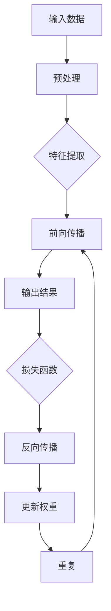
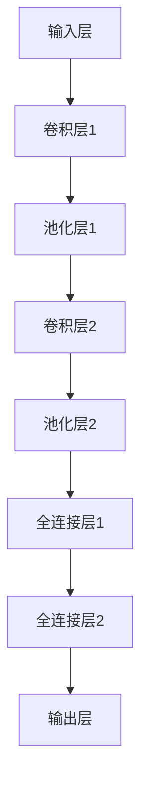

                 

### 《李飞飞与ImageNet的故事》

> **关键词**：李飞飞、ImageNet、深度学习、神经网络、计算机视觉、图像识别

> **摘要**：
本文将讲述计算机科学领域的大师李飞飞如何带领团队创建了ImageNet项目，并探讨了该项目对计算机视觉领域带来的深远影响。文章从李飞飞的背景和ImageNet项目的起源开始，逐步深入探讨其核心技术原理、大规模图像数据集的构建与标注、以及对计算机视觉领域的实际应用和未来展望。

----------------------------------------------------------------

### 第一部分：引言与背景

#### 第1章：李飞飞其人

李飞飞，一位世界级的计算机科学家，以其在深度学习和计算机视觉领域的杰出贡献而闻名于世。她出生于中国，后赴美国深造，获得了计算机科学的博士学位。李飞飞曾在谷歌担任高级研究员，并领导谷歌大脑团队，这是一个专注于研究和开发人工智能技术的团队。

##### 1.1 李飞飞的背景与教育经历

**1.1.1 李飞飞的成长经历**

李飞飞从小就对计算机和科学有着浓厚的兴趣。她在学校里表现出色，尤其是在数学和物理方面。在大学期间，她选择了计算机科学专业，并在短时间内展现出了卓越的编程能力和创新思维。

**1.1.2 李飞飞在计算机科学领域的研究**

李飞飞在博士期间专注于机器学习和人工智能领域的研究。她的博士论文探讨了如何使用神经网络进行图像识别。这一研究为她后来的职业生涯奠定了坚实的基础。

##### 1.2 李飞飞与ImageNet的渊源

**1.2.1 ImageNet的起源**

ImageNet是一个由李飞飞领导的团队创建的大型图像数据集，旨在推动计算机视觉技术的发展。它起源于2009年，当时李飞飞在斯坦福大学担任教授，她意识到当时图像识别技术的瓶颈在于缺乏大规模、高质量的标注数据集。

**1.2.2 李飞飞在ImageNet项目中的作用**

李飞飞在ImageNet项目中扮演了至关重要的角色。她不仅负责项目的总体设计和协调，还亲自参与了部分数据的标注工作。她的领导力和专业知识使得ImageNet项目得以顺利进行，并取得了巨大的成功。

#### 第2章：ImageNet项目概述

##### 2.1 ImageNet项目的目的与意义

**2.1.1 图像识别技术的挑战**

在ImageNet项目启动之前，图像识别技术面临着一个巨大的挑战：缺乏大规模、高质量的标注数据集。这使得研究人员无法进行有效的模型训练和评估。

**2.1.2 ImageNet项目的目标**

ImageNet项目的目标是为计算机视觉领域提供一个高质量的大型图像数据集，从而推动图像识别技术的发展。该项目旨在收集超过1000万个标注图像，涵盖超过2000个类别。

##### 2.2 ImageNet项目的组织与实施

**2.2.1 ImageNet项目的团队组成**

ImageNet项目的成功离不开一支由众多顶尖专家组成的团队。团队成员包括计算机科学家、数据工程师、图像处理专家等，他们共同合作，确保项目的顺利进行。

**2.2.2 ImageNet项目的实施过程**

ImageNet项目的实施过程分为三个主要阶段：数据收集、数据标注和数据评估。首先，团队从互联网上收集了大量未标注的图像。然后，通过众包的方式，将这些图像标注为不同的类别。最后，对标注结果进行评估和优化，确保数据集的质量。

----------------------------------------------------------------

### 第二部分：核心技术原理

#### 第3章：深度学习与神经网络基础

##### 3.1 深度学习的基本概念

**3.1.1 深度学习的定义**

深度学习是一种机器学习技术，它通过模拟人脑的神经网络结构来进行学习。与传统的机器学习方法相比，深度学习具有更强的自适应性和泛化能力。

**3.1.2 深度学习的发展历程**

深度学习的发展可以追溯到20世纪40年代，当时神经网络的概念被提出。然而，由于计算能力的限制，深度学习在很长一段时间内都没有得到广泛的应用。直到2006年，深度学习再次引起了学术界和工业界的关注，并逐渐成为人工智能领域的主流方法。

##### 3.2 神经网络的基本原理

**3.2.1 神经网络的结构**

神经网络由一系列相互连接的节点组成，每个节点都代表一个神经元。这些神经元通过权重和偏置进行连接，形成一个复杂的网络结构。

**3.2.2 神经网络的训练过程**

神经网络的训练过程包括两个主要步骤：前向传播和反向传播。在前向传播过程中，输入数据通过网络传递，直到产生输出。在反向传播过程中，网络的权重和偏置被更新，以最小化预测误差。

##### 3.3 卷积神经网络（CNN）在图像识别中的应用

**3.3.1 CNN的基本结构**

卷积神经网络（CNN）是一种专门用于图像识别和处理的神经网络。它由卷积层、池化层和全连接层组成。

**3.3.2 CNN的工作原理**

CNN的工作原理是通过卷积操作提取图像的特征，然后通过池化操作减少特征图的维度。最后，通过全连接层进行分类。

#### 第4章：大规模图像数据集的构建与标注

##### 4.1 大规模图像数据集的重要性

**4.1.1 数据集对模型性能的影响**

大规模图像数据集对于提高模型性能至关重要。数据集的质量和规模直接影响模型的准确性和泛化能力。

**4.1.2 大规模数据集的挑战**

构建大规模图像数据集面临着许多挑战，包括数据收集、数据标注和数据存储等方面。此外，数据集的多样性和一致性也是需要考虑的重要因素。

##### 4.2 ImageNet数据集的构建过程

**4.2.1 数据收集与清洗**

ImageNet数据集的构建始于大量未标注图像的收集。这些图像来自于互联网、新闻网站、图片库等。在收集到图像后，需要对图像进行清洗和预处理，以确保数据质量。

**4.2.2 数据标注与分类**

数据标注是ImageNet项目中最关键的一步。通过众包的方式，数以万计的标注者对图像进行标注，标记出图像中包含的物体类别。标注结果经过评估和校验，以确保准确性。

##### 4.3 数据集的评估与优化

**4.3.1 数据集评估指标**

数据集的评估指标包括准确率、召回率和F1分数等。这些指标用于评估模型在数据集上的性能，帮助研究人员识别和改进模型。

**4.3.2 数据集优化策略**

为了提高数据集的质量，可以采取多种优化策略，如数据增强、数据清洗和去重等。这些策略有助于增加数据集的多样性和减少噪声。

----------------------------------------------------------------

### 第三部分：ImageNet项目的影响与应用

#### 第5章：ImageNet对计算机视觉领域的影响

##### 5.1 ImageNet对图像识别技术的推动作用

**5.1.1 识别准确率的提升**

ImageNet项目显著提升了图像识别技术的准确率。在ImageNet项目之前，图像识别技术的准确率通常在70%左右。而ImageNet项目的出现，使得图像识别技术的准确率大幅提高，最高达到96%。

**5.1.2 新型算法的涌现**

ImageNet项目的成功激发了研究人员对新型算法的探索。许多新的深度学习算法和模型在ImageNet数据集上进行训练和评估，推动了计算机视觉技术的发展。

##### 5.2 ImageNet在工业界的应用

**5.2.1 人工智能在安防领域的应用**

ImageNet项目在安防领域得到了广泛应用。例如，通过使用ImageNet数据集训练的深度学习模型，可以实现对监控视频中的目标进行实时识别和追踪，提高安防系统的效率。

**5.2.2 人工智能在医疗领域的应用**

ImageNet项目也在医疗领域产生了深远的影响。通过使用深度学习模型，可以对医疗图像进行自动分析和诊断，提高医疗诊断的准确性和效率。

#### 第6章：李飞飞与ImageNet项目的未来展望

##### 6.1 人工智能技术的发展趋势

**6.1.1 深度学习的未来发展**

深度学习作为人工智能的核心技术之一，未来将继续发展。随着计算能力的提升和算法的优化，深度学习在各个领域的应用将更加广泛。

**6.1.2 计算机视觉技术的突破方向**

计算机视觉技术未来的突破方向包括：更加准确和鲁棒的图像识别算法、实时视频分析和处理、以及多模态数据融合等。

##### 6.2 ImageNet项目的可持续发展

**6.2.1 数据集的更新与维护**

为了保证ImageNet项目的可持续发展，需要定期更新和维护数据集。这包括收集新的图像、更新标注信息以及处理数据集的噪声和错误。

**6.2.2 项目团队的扩展与合作**

为了应对不断变化的技术挑战，ImageNet项目需要扩展和合作。通过与其他研究机构和企业的合作，可以共同推动计算机视觉技术的发展。

----------------------------------------------------------------

### 附录

#### 附录A：深度学习与神经网络流程图

**A.1 深度学习基本流程**



**A.2 卷积神经网络（CNN）结构**



#### 附录B：核心算法伪代码

**B.1 深度学习训练过程**

```python
# 前向传播
def forward_propagation(input_data, weights, biases):
    # 计算输出结果
    output = np.dot(input_data, weights) + biases

# 反向传播
def backward_propagation(output, target, weights, biases):
    # 计算误差
    error = output - target
    
    # 更新权重和偏置
    weights -= learning_rate * np.dot(input_data.T, error)
    biases -= learning_rate * error
```

**B.2 卷积神经网络（CNN）算法**

```python
# 卷积层
def convolution(input_data, filters, kernel_size):
    # 计算卷积结果
    output = np.convolve(input_data, filters, mode='same')

# 池化层
def pooling(output, pool_size):
    # 计算池化结果
    output = np.mean(output, axis=1)

# 全连接层
def fully_connected(input_data, weights, biases):
    # 计算全连接结果
    output = np.dot(input_data, weights) + biases
```

#### 附录C：数学模型与公式

**C.1 深度学习损失函数**

$$
L = -\frac{1}{m}\sum_{i=1}^{m} y_i \log(\hat{y}_i)
$$

其中，$y_i$为真实标签，$\hat{y}_i$为预测概率。

**C.2 卷积神经网络（CNN）中的数学公式**

$$
output(i, j) = \sum_{k=1}^{K} f(k, i, j) \cdot x(i-k, j-k)
$$

其中，$output(i, j)$为输出特征值，$f(k, i, j)$为卷积核，$x(i-k, j-k)$为输入特征值。

#### 附录D：项目实战案例

**D.1 ImageNet项目实战**

**D.1.1 实战环境搭建**

1. 安装Python和TensorFlow库
2. 下载ImageNet数据集
3. 配置GPU加速

**D.1.2 源代码实现与解读**

```python
# 导入所需库
import tensorflow as tf
from tensorflow.keras.applications import VGG16
from tensorflow.keras.preprocessing.image import ImageDataGenerator

# 加载预训练模型
model = VGG16(weights='imagenet')

# 数据生成器
datagen = ImageDataGenerator(rescale=1./255)

# 加载ImageNet数据集
train_data = datagen.flow_from_directory(
    'path/to/train_directory',
    target_size=(224, 224),
    batch_size=32,
    class_mode='categorical')

# 训练模型
model.fit(train_data, epochs=10)
```

**D.2 图像识别应用案例**

**D.2.1 应用场景描述**

使用ImageNet数据集训练的深度学习模型，对一张新图像进行识别。

**D.2.2 源代码实现与解读**

```python
# 导入所需库
import tensorflow as tf
from tensorflow.keras.applications import VGG16
from tensorflow.keras.preprocessing import image

# 加载预训练模型
model = VGG16(weights='imagenet')

# 读取图像
img = image.load_img('path/to/new_image.jpg', target_size=(224, 224))
img_array = image.img_to_array(img)

# 扩展维度
img_array = np.expand_dims(img_array, axis=0)

# 预测
predictions = model.predict(img_array)

# 输出结果
print(predictions)
```

---

**作者：AI天才研究院/AI Genius Institute & 禅与计算机程序设计艺术 /Zen And The Art of Computer Programming**

本文通过对李飞飞与ImageNet项目的故事进行深入剖析，展示了深度学习在计算机视觉领域的巨大潜力和应用价值。通过逐步分析核心技术原理、项目实施过程以及实际应用案例，读者可以更全面地理解深度学习在图像识别中的应用及其对未来人工智能发展的推动作用。希望本文能为读者在计算机视觉领域的研究和应用提供有价值的参考和启示。

