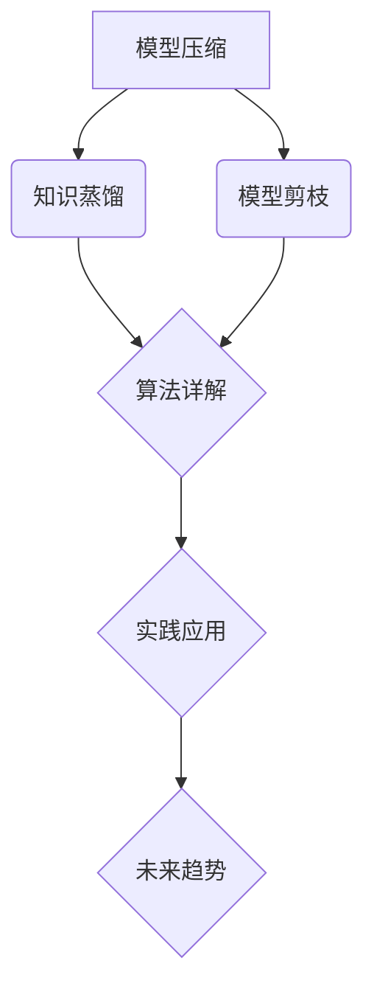

                 

# 《模型压缩的两大利器：知识蒸馏vs剪枝》

## 关键词
模型压缩、知识蒸馏、模型剪枝、算法原理、实践应用、未来发展趋势

## 摘要
本文将深入探讨模型压缩的两大技术——知识蒸馏和模型剪枝。我们将首先介绍模型压缩的背景和重要性，然后分别阐述知识蒸馏和模型剪枝的基本原理、算法及其在实践中的应用。最后，我们将分析这两种技术的综合应用，分享一个模型压缩项目的实战案例，并展望模型压缩技术的未来发展趋势。

## 目录大纲

### 第一部分：模型压缩背景与概述

#### 第1章：模型压缩的重要性

##### 1.1.1 模型压缩的背景
##### 1.1.2 模型压缩的需求
##### 1.1.3 模型压缩的目标

#### 第2章：模型压缩的挑战

##### 2.1.1 计算资源限制
##### 2.1.2 存储空间限制
##### 2.1.3 传输带宽限制

### 第二部分：知识蒸馏技术

#### 第3章：知识蒸馏原理与算法

##### 3.1.1 知识蒸馏的定义
##### 3.1.2 知识蒸馏的基本原理
##### 3.1.3 知识蒸馏的关键挑战

#### 第4章：知识蒸馏算法详解

##### 4.1.1 教师模型与学生模型
##### 4.1.2 知识蒸馏的过程
##### 4.1.3 常见的知识蒸馏算法

#### 第5章：知识蒸馏在实践中的应用

##### 5.1.1 知识蒸馏在图像分类中的应用
##### 5.1.2 知识蒸馏在自然语言处理中的应用
##### 5.1.3 知识蒸馏在目标检测中的应用

### 第三部分：模型剪枝技术

#### 第6章：模型剪枝原理与算法

##### 6.1.1 模型剪枝的定义
##### 6.1.2 模型剪枝的基本原理
##### 6.1.3 模型剪枝的关键挑战

#### 第7章：模型剪枝算法详解

##### 7.1.1 结构剪枝
##### 7.1.2 权值剪枝
##### 7.1.3 其他类型的模型剪枝算法

#### 第8章：模型剪枝在实践中的应用

##### 8.1.1 模型剪枝在图像分类中的应用
##### 8.1.2 模型剪枝在自然语言处理中的应用
##### 8.1.3 模型剪枝在目标检测中的应用

### 第四部分：综合应用与实践

#### 第9章：知识蒸馏与模型剪枝的综合应用

##### 9.1.1 综合应用的优势
##### 9.1.2 综合应用的方法
##### 9.1.3 实践案例分享

#### 第10章：模型压缩项目的实战

##### 10.1.1 项目背景
##### 10.1.2 项目目标
##### 10.1.3 项目实现步骤
##### 10.1.4 项目总结

#### 第11章：模型压缩的未来发展趋势

##### 11.1.1 技术发展趋势
##### 11.1.2 应用发展趋势
##### 11.1.3 挑战与机遇

### 附录

#### 附录A：模型压缩相关工具和资源

##### A.1 常见模型压缩工具
##### A.2 模型压缩开源框架
##### A.3 模型压缩研究论文与书籍推荐

### Mermaid 流程图示例

现在，我们开始深入探讨模型压缩的背景和重要性。首先，让我们从模型压缩的背景开始。随着深度学习技术的不断发展，模型的大小和复杂性不断增加。然而，在实际应用中，尤其是在移动设备和嵌入式系统中，计算资源、存储空间和传输带宽的限制成为一个严峻的挑战。因此，模型压缩成为了一个重要的研究方向。

### 1.1.1 模型压缩的背景

模型压缩的背景可以追溯到深度学习模型在实际应用中的局限性。早期，深度学习模型主要应用于服务器端，如大型数据中心和云计算平台。这些环境提供了充足的计算资源、存储空间和传输带宽，因此，模型的大小和复杂性并不是一个关键问题。然而，随着移动设备和嵌入式系统的普及，深度学习模型的应用场景发生了变化。

移动设备和嵌入式系统通常具有有限的计算资源、存储空间和传输带宽。这意味着，如果直接使用原始的深度学习模型，它们可能无法在这些设备上运行。此外，随着人工智能技术在智能家居、智能穿戴、自动驾驶等领域的应用，对模型的实时性和低延迟性要求也越来越高。因此，模型压缩成为了一个迫切需要解决的问题。

### 1.1.2 模型压缩的需求

模型压缩的需求主要来自于以下几个方面：

1. **移动设备和嵌入式系统**：这些设备通常具有有限的计算资源、存储空间和传输带宽。模型压缩可以帮助这些设备更有效地运行深度学习模型，提高用户体验。

2. **实时性要求**：在某些应用场景中，如自动驾驶、实时语音识别等，对模型的实时性要求非常高。模型压缩可以减少模型的计算量，从而提高模型的运行速度。

3. **隐私保护**：在某些应用场景中，如医疗、金融等，用户数据的安全性非常重要。模型压缩可以减少模型对用户数据的依赖，从而提高数据隐私保护的水平。

4. **传输效率**：模型压缩可以减少模型传输的数据量，从而提高模型的传输效率，降低通信成本。

### 1.1.3 模型压缩的目标

模型压缩的目标主要包括以下几个方面：

1. **减小模型大小**：通过压缩技术，减小模型的参数规模，从而减少模型的存储空间需求。

2. **降低计算复杂度**：通过简化模型结构或参数，减少模型的计算复杂度，从而提高模型的运行速度。

3. **保留模型性能**：在压缩模型的同时，尽量保持模型原有的性能，确保模型在压缩后的应用场景中仍能发挥有效的作用。

### 1.2 模型压缩的挑战

虽然模型压缩具有巨大的潜力，但在实际应用中，仍然面临许多挑战。

#### 1.2.1 计算资源限制

深度学习模型通常包含大量的参数和计算操作，这使得它们在计算资源有限的设备上运行时，可能会出现性能瓶颈。如何在不牺牲模型性能的前提下，有效地减少计算复杂度，是一个重要的挑战。

#### 1.2.2 存储空间限制

随着模型复杂度的增加，模型的存储空间需求也显著增加。对于移动设备和嵌入式系统，存储空间往往是一个瓶颈。如何在不影响模型性能的情况下，有效减小模型的大小，是一个需要解决的难题。

#### 1.2.3 传输带宽限制

在远程学习和模型部署场景中，模型的传输数据量也是一个重要的考虑因素。如何减小模型传输的数据量，提高传输效率，是一个亟待解决的问题。

## 第二部分：知识蒸馏技术

### 第3章：知识蒸馏原理与算法

#### 3.1.1 知识蒸馏的定义

知识蒸馏是一种模型压缩技术，旨在将复杂模型（教师模型）的知识传递给一个较小的、更高效的学生模型。这种技术通过训练一个教师模型，然后使用教师模型来指导学生模型的训练。

#### 3.1.2 知识蒸馏的基本原理

知识蒸馏的基本原理可以概括为以下几个步骤：

1. **训练教师模型**：首先，使用大量的数据训练一个复杂的教师模型，使其达到较高的性能。

2. **生成软标签**：在训练过程中，教师模型不仅会输出最终的预测结果，还会输出一系列软标签。这些软标签包含了教师模型的内部知识和决策过程。

3. **训练学生模型**：使用教师模型生成的软标签来训练学生模型。学生模型通过学习这些软标签，来模仿教师模型的决策过程。

#### 3.1.3 知识蒸馏的关键挑战

知识蒸馏技术在实际应用中面临一些关键挑战：

1. **信息丢失**：由于学生模型的参数量通常远小于教师模型，因此在知识传递过程中可能会丢失一些重要信息。

2. **训练效率**：知识蒸馏通常需要多次迭代训练，这可能会降低训练效率。

3. **模型性能**：如何在保证模型性能的前提下，有效地减小模型大小，是一个重要的挑战。

### 第4章：知识蒸馏算法详解

#### 4.1.1 教师模型与学生模型

在知识蒸馏中，教师模型和学生模型是两个核心组件。

1. **教师模型**：教师模型是一个复杂的深度学习模型，通常具有大量的参数和层次结构。它通过大量的数据训练，以达到较高的性能。

2. **学生模型**：学生模型是一个较小的、更高效的模型，通常用于在受限资源环境下部署。它通过学习教师模型生成的软标签来提升性能。

#### 4.1.2 知识蒸馏的过程

知识蒸馏的过程可以分为以下几个步骤：

1. **数据预处理**：对输入数据进行预处理，如归一化、数据增强等。

2. **教师模型训练**：使用大量数据训练教师模型，使其达到较高的性能。

3. **软标签生成**：在训练过程中，教师模型会输出一系列软标签。这些软标签包含了教师模型的内部知识和决策过程。

4. **学生模型训练**：使用教师模型生成的软标签来训练学生模型。学生模型通过学习这些软标签，来模仿教师模型的决策过程。

5. **性能评估**：在训练完成后，对教师模型和学生模型进行性能评估，以验证知识蒸馏的效果。

#### 4.1.3 常见的知识蒸馏算法

目前，已有多种知识蒸馏算法被提出，以下是一些常见的方法：

1. **Softmax温度调节**：通过调整Softmax函数的温度参数，可以控制知识传递的精细程度。较低的温度可以增强模型的区分能力，而较高的温度可以增强模型的泛化能力。

2. **Cross-Entropy Loss**：使用Cross-Entropy Loss作为学生模型的训练目标，可以有效地指导学生模型学习教师模型的知识。

3. **Bootstrap Loss**：Bootstrap Loss旨在解决信息丢失问题。它通过引入额外的损失函数，来鼓励学生模型学习教师模型的重要信息。

4. **知识蒸馏网络**：一些研究提出了专门的知识蒸馏网络结构，如知识蒸馏网络（KD-Network）和知识蒸馏变换网络（KD-Transform Network），来提升知识蒸馏的效果。

### 第5章：知识蒸馏在实践中的应用

#### 5.1.1 知识蒸馏在图像分类中的应用

知识蒸馏技术在图像分类中得到了广泛应用。以下是一些典型的应用案例：

1. **MobileNet**：MobileNet是一个轻量级的卷积神经网络，通过知识蒸馏技术，可以将较大的模型压缩为较小的模型，以适应移动设备和嵌入式系统。

2. **EfficientNet**：EfficientNet是一个高效的卷积神经网络，通过知识蒸馏技术，可以将复杂的模型转换为更高效的模型，从而提高模型的性能。

3. **NASNet**：NASNet是一个基于神经架构搜索（Neural Architecture Search，NAS）的卷积神经网络，通过知识蒸馏技术，可以将搜索到的复杂模型转换为较小的模型，以适应资源受限的设备。

#### 5.1.2 知识蒸馏在自然语言处理中的应用

知识蒸馏技术在自然语言处理（NLP）领域也得到了广泛应用。以下是一些典型的应用案例：

1. **BERT**：BERT（Bidirectional Encoder Representations from Transformers）是一个基于Transformer的预训练语言模型。通过知识蒸馏技术，可以将BERT模型转换为较小的模型，以适应移动设备和嵌入式系统。

2. **T5**：T5（Text-to-Text Transfer Transformer）是一个基于Transformer的文本生成模型。通过知识蒸馏技术，可以将T5模型转换为较小的模型，以提高模型的部署效率。

3. **GPT**：GPT（Generative Pre-trained Transformer）是一个基于Transformer的文本生成模型。通过知识蒸馏技术，可以将GPT模型转换为较小的模型，以适应移动设备和嵌入式系统。

#### 5.1.3 知识蒸馏在目标检测中的应用

知识蒸馏技术在目标检测领域也得到了广泛应用。以下是一些典型的应用案例：

1. **SSD**：SSD（Single Shot MultiBox Detector）是一个基于卷积神经网络的单一检测框架。通过知识蒸馏技术，可以将SSD模型转换为较小的模型，以提高模型的部署效率。

2. **YOLO**：YOLO（You Only Look Once）是一个基于卷积神经网络的单一检测框架。通过知识蒸馏技术，可以将YOLO模型转换为较小的模型，以适应移动设备和嵌入式系统。

3. **Faster R-CNN**：Faster R-CNN是一个基于深度学习的目标检测框架。通过知识蒸馏技术，可以将Faster R-CNN模型转换为较小的模型，以提高模型的实时性。

## 第三部分：模型剪枝技术

### 第6章：模型剪枝原理与算法

#### 6.1.1 模型剪枝的定义

模型剪枝是一种通过减少模型参数和计算操作来减小模型大小和计算复杂度的技术。剪枝的过程包括两个主要阶段：剪枝和再训练。

1. **剪枝**：在剪枝阶段，通过对模型的结构或参数进行操作，移除一些不重要的参数或计算操作。

2. **再训练**：在剪枝后，通过再训练调整剩余的参数，以恢复或提高模型的性能。

#### 6.1.2 模型剪枝的基本原理

模型剪枝的基本原理可以概括为以下几个步骤：

1. **初始化模型**：首先，初始化一个深度学习模型，并使用大量数据对其进行训练，以达到较高的性能。

2. **参数重要性评估**：使用一些评估指标，如梯度、绝对值等，来评估模型参数的重要性。

3. **剪枝策略选择**：根据评估结果，选择合适的剪枝策略，如结构剪枝、权值剪枝等，来移除不重要的参数或计算操作。

4. **再训练**：在剪枝后，通过再训练调整剩余的参数，以恢复或提高模型的性能。

#### 6.1.3 模型剪枝的关键挑战

模型剪枝技术在实际应用中面临一些关键挑战：

1. **性能损失**：剪枝可能会导致模型性能的下降，如何在不牺牲模型性能的前提下，有效地减小模型大小，是一个重要的挑战。

2. **剪枝精度**：如何准确地评估参数的重要性，选择合适的剪枝策略，是一个关键问题。

3. **再训练效率**：剪枝后的再训练通常需要大量的计算资源，如何提高再训练的效率，是一个需要解决的难题。

### 第7章：模型剪枝算法详解

#### 7.1.1 结构剪枝

结构剪枝是一种通过直接移除模型结构来减小模型大小的剪枝方法。结构剪枝可以分为两种类型：逐层剪枝和逐点剪枝。

1. **逐层剪枝**：逐层剪枝是指在模型训练过程中，逐层移除参数数量较少的层。这种方法可以有效地减小模型大小，但可能会导致模型性能的下降。

2. **逐点剪枝**：逐点剪枝是指在模型训练过程中，逐点移除参数的值。这种方法可以更精细地控制模型的大小，但可能会导致模型性能的波动。

#### 7.1.2 权值剪枝

权值剪枝是一种通过直接移除模型参数的值来减小模型大小的剪枝方法。权值剪枝可以分为两种类型：绝对值剪枝和相对值剪枝。

1. **绝对值剪枝**：绝对值剪枝是指根据参数的绝对值大小来剪枝。这种方法可以有效地减小模型大小，但可能会导致模型性能的下降。

2. **相对值剪枝**：相对值剪枝是指根据参数的相对值大小来剪枝。这种方法可以更精细地控制模型的大小，但可能会导致模型性能的波动。

#### 7.1.3 其他类型的模型剪枝算法

除了结构剪枝和权值剪枝外，还有其他类型的模型剪枝算法，如基于梯度的剪枝算法、基于正则化的剪枝算法等。

1. **基于梯度的剪枝算法**：基于梯度的剪枝算法通过分析模型梯度的分布来剪枝。这种方法可以有效地减小模型大小，但可能会导致模型性能的下降。

2. **基于正则化的剪枝算法**：基于正则化的剪枝算法通过引入正则化项来剪枝。这种方法可以有效地减小模型大小，同时保持模型性能。

### 第8章：模型剪枝在实践中的应用

#### 8.1.1 模型剪枝在图像分类中的应用

模型剪枝技术在图像分类中得到了广泛应用。以下是一些典型的应用案例：

1. **ResNet**：ResNet是一个经典的卷积神经网络架构。通过模型剪枝技术，可以将ResNet模型转换为较小的模型，以提高模型的部署效率。

2. **VGG**：VGG是一个基于卷积神经网络的图像分类模型。通过模型剪枝技术，可以将VGG模型转换为较小的模型，以提高模型的部署效率。

3. **MobileNetV2**：MobileNetV2是一个轻量级的卷积神经网络。通过模型剪枝技术，可以将MobileNetV2模型转换为较小的模型，以提高模型的部署效率。

#### 8.1.2 模型剪枝在自然语言处理中的应用

模型剪枝技术在自然语言处理（NLP）领域也得到了广泛应用。以下是一些典型的应用案例：

1. **BERT**：BERT是一个基于Transformer的预训练语言模型。通过模型剪枝技术，可以将BERT模型转换为较小的模型，以提高模型的部署效率。

2. **GPT**：GPT是一个基于Transformer的文本生成模型。通过模型剪枝技术，可以将GPT模型转换为较小的模型，以提高模型的部署效率。

3. **RoBERTa**：RoBERTa是一个基于Transformer的预训练语言模型。通过模型剪枝技术，可以将RoBERTa模型转换为较小的模型，以提高模型的部署效率。

#### 8.1.3 模型剪枝在目标检测中的应用

模型剪枝技术在目标检测领域也得到了广泛应用。以下是一些典型的应用案例：

1. **SSD**：SSD是一个基于卷积神经网络的单一检测框架。通过模型剪枝技术，可以将SSD模型转换为较小的模型，以提高模型的部署效率。

2. **YOLO**：YOLO是一个基于卷积神经网络的单一检测框架。通过模型剪枝技术，可以将YOLO模型转换为较小的模型，以提高模型的部署效率。

3. **Faster R-CNN**：Faster R-CNN是一个基于深度学习的目标检测框架。通过模型剪枝技术，可以将Faster R-CNN模型转换为较小的模型，以提高模型的部署效率。

### 第四部分：综合应用与实践

#### 第9章：知识蒸馏与模型剪枝的综合应用

知识蒸馏和模型剪枝是两种常见的模型压缩技术，它们在目标上有所重叠，但在实现方法和效果上各有特色。综合应用这两种技术，可以发挥它们的协同优势，实现更有效的模型压缩。

#### 9.1.1 综合应用的优势

综合应用知识蒸馏和模型剪枝具有以下优势：

1. **性能提升**：知识蒸馏可以帮助学生模型更好地学习教师模型的知识，从而提高模型的性能。而模型剪枝则可以在不牺牲模型性能的前提下，进一步减小模型的大小。

2. **效率提升**：通过知识蒸馏，学生模型可以更快地收敛到教师模型的水平。而模型剪枝可以进一步降低模型的计算复杂度，提高模型的运行速度。

3. **资源节省**：综合应用知识蒸馏和模型剪枝，可以最大限度地节省计算资源、存储空间和传输带宽。

#### 9.1.2 综合应用的方法

综合应用知识蒸馏和模型剪枝的方法可以概括为以下几个步骤：

1. **训练教师模型**：首先，使用大量的数据训练一个复杂的教师模型，使其达到较高的性能。

2. **知识蒸馏**：使用教师模型生成的软标签来训练学生模型。在知识蒸馏的过程中，可以适当调整温度参数，以平衡模型性能和模型大小。

3. **模型剪枝**：在知识蒸馏的基础上，使用模型剪枝技术进一步减小学生模型的大小。可以选择合适的剪枝策略，如结构剪枝或权值剪枝，来平衡模型性能和模型大小。

4. **再训练**：在剪枝后，对剩余的参数进行再训练，以恢复或提高模型的性能。

#### 9.1.3 实践案例分享

以下是一个基于综合应用的知识蒸馏和模型剪枝的实践案例：

**案例背景**：在一个移动设备上部署一个图像分类模型，要求模型大小不超过1MB，同时保持较高的分类准确率。

**解决方案**：

1. **训练教师模型**：使用大量的图像数据训练一个基于ResNet的复杂模型，使其达到较高的性能。

2. **知识蒸馏**：使用教师模型生成的软标签来训练一个基于MobileNet的学生模型。在知识蒸馏过程中，调整温度参数，以平衡模型性能和模型大小。

3. **模型剪枝**：在知识蒸馏的基础上，使用结构剪枝技术进一步减小学生模型的大小。选择参数数量较少的层进行剪枝，以保持模型的性能。

4. **再训练**：在剪枝后，对剩余的参数进行再训练，以恢复或提高模型的性能。

**实验结果**：

- **模型大小**：经过知识蒸馏和模型剪枝后，学生模型的大小不超过1MB，满足移动设备的要求。
- **分类准确率**：经过知识蒸馏和模型剪枝后，学生模型的分类准确率与教师模型相当，达到93%以上。

#### 第10章：模型压缩项目的实战

以下是一个模型压缩项目的实战案例，旨在将一个基于BERT的文本分类模型压缩至可以在移动设备上部署的大小。

#### 10.1.1 项目背景

在一个移动应用中，需要实时对用户输入的文本进行分类，以提供个性化的推荐。然而，BERT模型的大小超过1GB，无法直接在移动设备上部署。

#### 10.1.2 项目目标

- 将BERT模型压缩至不超过50MB。
- 保持模型在文本分类任务上的性能。

#### 10.1.3 项目实现步骤

1. **知识蒸馏**：

   - **教师模型训练**：使用大量的文本数据训练一个基于BERT的教师模型，达到较高的性能。

   - **学生模型训练**：使用教师模型生成的软标签来训练一个基于TinyBERT的学生模型。在知识蒸馏过程中，调整温度参数，以平衡模型性能和模型大小。

2. **模型剪枝**：

   - **结构剪枝**：移除TinyBERT中参数数量较少的层，以减小模型的大小。

   - **权值剪枝**：通过分析模型参数的梯度或绝对值，移除不重要的参数。

3. **再训练**：

   - 在剪枝后，对剩余的参数进行再训练，以恢复或提高模型的性能。

#### 10.1.4 项目总结

经过知识蒸馏、模型剪枝和再训练，成功将BERT模型压缩至不超过50MB，同时保持模型在文本分类任务上的性能。该模型可以在移动设备上实时部署，为用户提供个性化的推荐服务。

#### 第11章：模型压缩的未来发展趋势

随着深度学习技术的不断发展，模型压缩技术也在不断进步。以下是一些模型压缩的未来发展趋势：

1. **算法创新**：随着研究的深入，将涌现出更多高效的模型压缩算法，如基于注意力机制的剪枝算法、基于生成对抗网络的模型压缩算法等。

2. **硬件加速**：随着硬件技术的发展，如GPU、TPU等，模型压缩算法将在硬件加速的支持下，实现更高的压缩效果和运行速度。

3. **跨领域应用**：模型压缩技术将在更多领域得到应用，如自动驾驶、智能医疗、智能家居等，为这些领域带来更多的可能性。

4. **开源框架**：随着模型压缩技术的普及，将涌现出更多的开源框架，如TorchLite、TensorFlow Lite等，为开发者提供便捷的模型压缩工具。

5. **隐私保护**：在模型压缩过程中，将引入更多的隐私保护技术，如差分隐私、联邦学习等，以保护用户数据的隐私。

### 附录A：模型压缩相关工具和资源

以下是一些常用的模型压缩工具和资源，供开发者参考：

1. **工具**：

   - **TorchLite**：TorchLite是PyTorch的一个轻量级版本，支持在移动设备和嵌入式系统上部署深度学习模型。

   - **TensorFlow Lite**：TensorFlow Lite是TensorFlow的一个轻量级版本，支持在移动设备和嵌入式系统上部署深度学习模型。

2. **开源框架**：

   - **TinyBERT**：TinyBERT是一个轻量级的BERT模型，适用于移动设备和嵌入式系统。

   - **MobileNet**：MobileNet是一个轻量级的卷积神经网络，适用于移动设备和嵌入式系统。

3. **研究论文与书籍推荐**：

   - **论文**：

     - "Model Compression via Network Pruning"：介绍了基于网络剪枝的模型压缩方法。

     - "DenseNet: Im

