                 

### 《注意力管理与大脑训练实践：增强认知灵活性和专注力》

> **关键词**：注意力管理、大脑训练、认知灵活性、专注力、方法与实践、案例分析

> **摘要**：本文旨在探讨注意力管理与大脑训练的实践方法，以提高认知灵活性和专注力。文章从基本概念出发，详细阐述了大脑的结构与功能、注意力管理的策略、认知灵活性训练方法和专注力训练实践，并结合实际案例进行分析。通过本文的阅读，读者将了解注意力管理和大脑训练的重要性，掌握提升注意力与专注力的具体方法，为日常生活和工作中的高效能提供指导。

### 第一部分：理解注意力管理

#### 第1章：注意力管理的基本概念

在本章中，我们将探讨注意力管理的基本概念，包括注意力的定义与分类、注意力的重要性与作用，以及注意力管理的核心原理。

##### 1.1 注意力的定义与分类

注意力是指大脑在处理信息时选择关注某些信息并忽略其他信息的认知过程。根据注意力的不同功能，可以分为以下几种类型：

1. 选择性注意力（Selective Attention）：选择性地关注某些特定信息，而忽略其他无关信息。
2. 分配性注意力（Divided Attention）：同时关注多个任务或信息来源。
3. 留存性注意力（Maintenance Attention）：在处理某项任务时保持注意力集中。
4. 适应性注意力（Adaptive Attention）：根据环境和任务的要求灵活调整注意力的分配。

##### 1.2 注意力的重要性与作用

注意力是人类认知活动的重要基础，对个体的学习、工作、生活等方面具有重要影响。以下是注意力的一些重要作用：

1. 提高学习效率：注意力集中有助于更好地理解和记忆知识，提高学习效率。
2. 增强问题解决能力：注意力有助于捕捉关键信息，从而提高问题解决能力。
3. 提高工作效率：集中注意力有助于减少工作干扰，提高工作效率。
4. 增强情绪调节能力：注意力管理有助于调节情绪，降低压力和焦虑。
5. 促进社交互动：良好的注意力管理能力有助于更好地与他人沟通和互动。

##### 1.3 注意力管理的核心原理

注意力管理是指通过一系列方法和技术，提高个体对注意力的控制与调节能力。以下是一些核心原理：

1. 注意力聚焦（Focus）：将注意力集中在目标上，减少干扰因素。
2. 注意力分配（Allocation）：合理分配注意力，同时关注多个任务或信息来源。
3. 注意力调节（Regulation）：根据任务和环境的变化，灵活调整注意力分配。
4. 注意力维持（Maintenance）：保持注意力集中，避免分心和疲劳。
5. 注意力恢复（Recovery）：在长时间高强度的注意力任务后，进行适当的休息和恢复。

#### 第2章：大脑的基本结构与功能

在本章中，我们将探讨大脑的基本结构、功能，以及大脑的可塑性。

##### 2.1 大脑的结构概览

大脑是人体最重要的器官之一，主要由以下部分组成：

1. **大脑皮层（Cortex）**：大脑皮层是大脑的最外层，负责高级认知功能，如思考、记忆、语言和感知。
2. **基底神经节（Basal Ganglia）**：基底神经节参与运动控制和情绪调节。
3. **小脑（Cerebellum）**：小脑负责协调运动和维持身体平衡。
4. **脑干（Brainstem）**：脑干负责基本生命功能的维持，如呼吸和心跳。

##### 2.2 大脑的神经传导与功能

大脑中的神经元通过神经传导物质传递信息，实现各种认知功能。以下是大脑的主要功能：

1. **感知与认知**：大脑通过感官接收信息，处理和理解外部世界。
2. **记忆**：大脑将信息存储为记忆，包括短期记忆和长期记忆。
3. **情绪调节**：大脑参与情绪的产生和调节。
4. **行为控制**：大脑负责运动控制和行为决策。
5. **语言与沟通**：大脑的某些区域负责语言理解和表达。

##### 2.3 大脑的可塑性

大脑的可塑性是指大脑在结构和功能上能够随着经验和环境的变化而发生变化。以下是一些影响大脑可塑性的因素：

1. **神经再生长**：受损的神经元可以重新生长，建立新的神经通路。
2. **神经再生**：神经元可以产生新的突触连接，形成新的神经网络。
3. **经验依赖**：大脑的结构和功能会随着经验的积累而发生变化。
4. **环境影响**：环境因素，如学习、锻炼和社交互动，会影响大脑的可塑性。

### 第二部分：注意力管理策略

#### 第3章：提高注意力的方法

在本章中，我们将探讨提高注意力的方法，包括心理放松训练、专注力提升策略，以及注意力分散的应对策略。

##### 3.1 心理放松训练

心理放松训练是一种通过降低身体和心理紧张状态来提高注意力的方法。以下是一些常用的心理放松训练方法：

1. **深呼吸**：深呼吸可以帮助缓解紧张情绪，提高注意力集中。
2. **冥想**：冥想是一种通过专注呼吸和排除杂念来放松身心，提高注意力的方法。
3. **渐进性肌肉放松**：通过逐渐放松身体各部位的肌肉，达到身心放松的目的。

##### 3.2 专注力提升策略

以下是一些提升专注力的策略：

1. **定时法**：使用定时器，如番茄工作法，将任务分割成小块，提高专注度。
2. **环境优化**：创造一个安静、舒适的工作环境，减少干扰因素。
3. **目标明确**：设定明确的任务目标，有助于提高专注力。
4. **心理暗示**：通过自我暗示，如“我能集中注意力完成任务”，来提高专注力。

##### 3.3 注意力分散的应对策略

以下是一些应对注意力分散的策略：

1. **任务分解**：将复杂任务分解成小步骤，逐一完成，减少分心。
2. **环境控制**：避免在容易分心的环境中完成任务，如关闭社交媒体通知。
3. **避免多任务**：专注于一项任务，避免同时进行多项任务，减少分心。
4. **休息与恢复**：在长时间高强度的任务后，适当休息，恢复精力。

### 第三部分：大脑训练与专注力提升实践

#### 第4章：认知灵活性训练方法

在本章中，我们将探讨认知灵活性训练方法，包括认知灵活性的定义与重要性、认知灵活性训练的基本原则和认知灵活性训练实例。

##### 4.1 认知灵活性的定义与重要性

认知灵活性是指个体在认知活动中快速适应新环境、新任务和新信息的能力。以下是认知灵活性的一些重要性：

1. **提高学习效率**：认知灵活性有助于更好地适应新的学习环境，提高学习效率。
2. **增强问题解决能力**：认知灵活性有助于快速识别问题和找到解决方案。
3. **提升创新能力**：认知灵活性有助于发现新的问题和创造新的解决方案。
4. **改善心理健康**：认知灵活性有助于降低焦虑和压力，提高心理健康。

##### 4.2 认知灵活性训练的基本原则

以下是一些认知灵活性训练的基本原则：

1. **多样性训练**：通过多样化训练，提高个体适应不同任务和环境的能力。
2. **挑战性训练**：设置适当的挑战性，促使个体不断突破自己的舒适区。
3. **反馈与调整**：及时反馈训练效果，根据个体差异进行调整。
4. **长期坚持**：认知灵活性训练需要长期坚持，逐步提高个体的认知灵活性。

##### 4.3 认知灵活性训练实例

以下是一些认知灵活性训练的实例：

1. **情景模拟**：通过模拟不同场景，让个体快速适应新环境和新任务。
2. **思维拓展**：通过阅读、思考、讨论，拓展个体的思维领域。
3. **解决问题**：设置具有挑战性的问题，让个体通过思考和尝试找到解决方案。

#### 第5章：专注力训练实践

在本章中，我们将探讨专注力训练实践，包括专注力训练的目标与步骤、专注力训练的技巧与策略，以及专注力训练的评估与调整。

##### 5.1 专注力训练的目标与步骤

专注力训练的目标是提高个体的专注能力，使其能够更长时间地保持注意力集中。以下是专注力训练的步骤：

1. **设定目标**：明确训练的目标，如提高专注时间、减少分心次数等。
2. **制定计划**：根据目标制定具体的训练计划，如每天进行多长时间的专注训练。
3. **选择方法**：选择适合自己的专注力训练方法，如定时法、环境优化等。
4. **执行训练**：按照计划执行专注力训练，逐步提高专注能力。
5. **评估效果**：定期评估训练效果，根据评估结果进行调整。

##### 5.2 专注力训练的技巧与策略

以下是一些专注力训练的技巧与策略：

1. **定时法**：使用定时器，如番茄工作法，将训练时间分割成小块，提高专注度。
2. **环境优化**：创造一个安静、舒适的工作环境，减少干扰因素。
3. **目标明确**：设定明确的训练目标，有助于提高专注力。
4. **心理暗示**：通过自我暗示，如“我能集中注意力完成任务”，来提高专注力。
5. **休息与恢复**：在长时间高强度的训练后，适当休息，恢复精力。

##### 5.3 专注力训练的评估与调整

以下是专注力训练的评估与调整方法：

1. **自我评估**：定期自我评估专注力水平，如专注时间、分心次数等。
2. **反馈与调整**：根据评估结果，调整训练计划和方法，以提高专注能力。
3. **长期坚持**：专注力训练需要长期坚持，逐步提高个体的专注能力。
4. **寻求专业帮助**：如有需要，可以寻求专业心理咨询师或专注力训练师的帮助。

### 第四部分：案例分析与应用

#### 第6章：成功案例分享

在本章中，我们将分享一些成功案例，包括职场专注力提升、学生注意力管理和健康生活的注意力管理。

##### 6.1 案例一：职场专注力提升

**案例描述**：一位职场人士在日常工作中发现自己的专注力较低，容易分心，导致工作效率低下。

**案例实施过程**：

1. **设定目标**：明确提升专注力的目标，如每天专注工作4小时。
2. **制定计划**：根据目标制定具体的训练计划，如每天进行1小时的专注力训练。
3. **环境优化**：在工作环境中减少干扰因素，如关闭社交媒体通知。
4. **方法选择**：采用番茄工作法进行专注力训练，每25分钟专注工作，然后休息5分钟。
5. **评估效果**：定期评估专注力水平，根据评估结果调整训练计划。

**案例效果分析**：经过一段时间的训练，该职场人士的专注力显著提高，工作效率也大幅提升。

##### 6.2 案例二：学生注意力管理

**案例描述**：一名学生在学习过程中发现自己容易分心，影响学习效果。

**案例实施过程**：

1. **设定目标**：明确提高注意力的目标，如每天专注学习3小时。
2. **制定计划**：根据目标制定具体的训练计划，如每天进行1小时的专注力训练。
3. **环境优化**：在书房内创造一个安静、舒适的学习环境。
4. **方法选择**：采用定时法和目标明确法进行专注力训练，每30分钟专注学习，然后休息10分钟。
5. **评估效果**：定期评估注意力水平，根据评估结果调整训练计划。

**案例效果分析**：经过一段时间的训练，学生的注意力显著提高，学习效果也得到了明显改善。

##### 6.3 案例三：健康生活的注意力管理

**案例描述**：一名健康意识较强的人在日常生活中发现自己在做运动和休息时容易分心。

**案例实施过程**：

1. **设定目标**：明确提高注意力的目标，如每天专注运动30分钟。
2. **制定计划**：根据目标制定具体的训练计划，如每天进行1小时的专注力训练。
3. **环境优化**：选择一个安静、舒适的场所进行运动和休息。
4. **方法选择**：采用深呼吸和冥想进行专注力训练，提高专注度。
5. **评估效果**：定期评估注意力水平，根据评估结果调整训练计划。

**案例效果分析**：经过一段时间的训练，该名健康意识较强的人在运动和休息时的注意力显著提高，生活质量也得到了提升。

### 第五部分：注意力管理与大脑训练的总结与应用

#### 第7章：注意力管理与大脑训练的总结与应用

在本章中，我们将总结注意力管理与大脑训练的方法与实践，并探讨其应用场景、未来发展趋势与挑战。

##### 7.1 总结与展望

注意力管理与大脑训练是一项重要的研究与实践领域，旨在提高个体的认知灵活性和专注力。通过本章的总结，我们可以得出以下几点：

1. **注意力管理的重要性**：注意力是人类认知活动的基础，对学习、工作、生活等方面具有重要影响。
2. **大脑训练的方法与实践**：通过心理放松训练、专注力提升策略、认知灵活性训练方法和专注力训练实践，可以有效地提高注意力与认知灵活性。
3. **应用场景**：注意力管理与大脑训练在职场、学习、健康生活等多个领域具有广泛的应用。
4. **未来发展趋势**：随着技术的进步和人们对大脑健康的关注，注意力管理与大脑训练将得到进一步发展。

##### 7.2 注意力管理与大脑训练的实际应用场景

注意力管理与大脑训练在以下实际应用场景中具有重要意义：

1. **职场**：提高职场人士的专注力和工作效率，减少分心和疲劳。
2. **学习**：帮助学生提高学习效率，培养良好的学习习惯。
3. **健康生活**：提高健康意识较强的人在运动和休息时的注意力，提升生活质量。

##### 7.3 未来发展趋势与挑战

注意力管理与大脑训练在未来发展中将面临以下挑战：

1. **技术进步**：随着人工智能、大数据等技术的进步，注意力管理与大脑训练的方法将得到进一步优化。
2. **个性化**：根据个体差异，提供个性化的注意力管理与大脑训练方案，以提高效果。
3. **普及性**：提高公众对注意力管理与大脑训练的认识，促进其在日常生活中的普及应用。

### 附录

#### 附录A：注意力管理工具与资源推荐

在本附录中，我们推荐一些注意力管理工具与资源，以帮助读者更好地进行注意力管理与大脑训练。

##### A.1 注意力管理应用软件推荐

1. **Forest**：一款通过种植虚拟树木来帮助用户保持专注的应用。
2. **Pomodoro Timer**：一款基于番茄工作法的定时器应用。
3. **Headspace**：一款提供冥想和放松课程的应用。

##### A.2 大脑训练书籍推荐

1. 《注意力管理：如何提高你的专注力和效率》
2. 《大脑的未来：如何通过科学训练和思维锻炼，保持大脑年轻和活力》
3. 《认知灵活性：如何提高你的学习能力和创新力》

##### A.3 注意力管理相关网站与平台推荐

1. **注意力管理协会（Attention Management Association）**：提供注意力管理的相关资源和信息。
2. **大脑训练在线（Brain Training for Success）**：提供各种大脑训练方法和资源。
3. **专注力提升（Focus@Will）**：提供专注力提升的音乐和课程。

#### 目录大纲图示

```mermaid
graph TB
    A[《注意力管理与大脑训练实践：增强认知灵活性和专注力》] --> B[第一部分：理解注意力管理]
    B --> C[第1章：注意力管理的基本概念]
    C --> D[1.1 注意力的定义与分类]
    C --> E[1.2 注意力的重要性与作用]
    C --> F[1.3 注意力管理的核心原理]
    B --> G[第2章：大脑的基本结构与功能]
    G --> H[2.1 大脑的结构概览]
    G --> I[2.2 大脑的神经传导与功能]
    G --> J[2.3 大脑的可塑性]
    B --> K[第二部分：注意力管理策略]
    K --> L[第3章：提高注意力的方法]
    L --> M[3.1 心理放松训练]
    L --> N[3.2 专注力提升策略]
    L --> O[3.3 注意力分散的应对策略]
    K --> P[第4章：注意力管理在日常生活中的应用]
    P --> Q[4.1 工作中的注意力管理]
    P --> R[4.2 学习中的注意力管理]
    P --> S[4.3 睡眠与注意力管理]
    K --> T[第三部分：大脑训练与专注力提升实践]
    T --> U[第5章：认知灵活性训练方法]
    U --> V[5.1 认知灵活性的定义与重要性]
    U --> W[5.2 认知灵活性训练的基本原则]
    U --> X[5.3 认知灵活性训练实例]
    T --> Y[第6章：专注力训练实践]
    Y --> Z[6.1 专注力训练的目标与步骤]
    Y --> AA[6.2 专注力训练的技巧与策略]
    Y --> AB[6.3 专注力训练的评估与调整]
    K --> AC[第四部分：案例分析与应用]
    AC --> AD[第7章：成功案例分享]
    AD --> AE[7.1 案例一：职场专注力提升]
    AD --> AF[7.2 案例二：学生注意力管理]
    AD --> AG[7.3 案例三：健康生活的注意力管理]
    AC --> AH[第8章：注意力管理与大脑训练的总结与应用]
    AH --> AI[8.1 总结与展望]
    AH --> AJ[8.2 注意力管理与大脑训练的实际应用场景]
    AH --> AK[8.3 未来发展趋势与挑战]
    B --> AL[附录]
    AL --> AM[附录A：注意力管理工具与资源推荐]
    AM --> AN[1.1 注意力管理应用软件推荐]
    AM --> AO[1.2 大脑训练书籍推荐]
    AM --> AP[1.3 注意力管理相关网站与平台推荐]
```

### 结论

本文从注意力管理的基本概念出发，详细阐述了大脑的基本结构与功能，注意力管理的策略，认知灵活性训练方法和专注力训练实践。通过案例分析，我们看到了注意力管理和大脑训练在职场、学习和健康生活中的实际应用效果。在未来，随着技术的进步和人们对大脑健康的关注，注意力管理与大脑训练将得到进一步发展。

作者：AI天才研究院/AI Genius Institute & 禅与计算机程序设计艺术 /Zen And The Art of Computer Programming

### 附录A：注意力管理工具与资源推荐

在本附录中，我们为您推荐一些注意力管理工具与资源，以帮助您更好地进行注意力管理与大脑训练。

#### A.1 注意力管理应用软件推荐

1. **Forest**
   - **简介**：Forest是一款通过种植虚拟树木来帮助用户保持专注的应用。
   - **特点**：设定任务后，应用会开始种树，如果用户分心，树木就会枯萎。
   - **下载链接**：[Forest官网](https://www森林应用.com)

2. **Pomodoro Timer**
   - **简介**：Pomodoro Timer是一款基于番茄工作法的定时器应用。
   - **特点**：将工作时间分割成25分钟的工作周期，每个周期后休息5分钟。
   - **下载链接**：[Pomodoro Timer官网](https://www.pomodoro-timer.com)

3. **Headspace**
   - **简介**：Headspace是一款提供冥想和放松课程的应用。
   - **特点**：包括针对专注力、睡眠、压力缓解等不同主题的冥想课程。
   - **下载链接**：[Headspace官网](https://www.headspace.com)

#### A.2 大脑训练书籍推荐

1. **《注意力管理：如何提高你的专注力和效率》**
   - **作者**：约翰·迪福
   - **简介**：本书详细介绍了注意力管理的方法和策略，帮助读者提高专注力和效率。
   - **购买链接**：[注意力管理：如何提高你的专注力和效率](https://www.亚马逊.com/)

2. **《大脑的未来：如何通过科学训练和思维锻炼，保持大脑年轻和活力》**
   - **作者**：丹尼尔·戈尔曼
   - **简介**：本书探讨了大脑训练的科学原理，提供了一系列实用的训练方法。
   - **购买链接**：[大脑的未来：如何通过科学训练和思维锻炼，保持大脑年轻和活力](https://www.亚马逊.com/)

3. **《认知灵活性：如何提高你的学习能力和创新力》**
   - **作者**：阿尔伯特·巴甫洛夫
   - **简介**：本书介绍了认知灵活性的概念和训练方法，帮助读者提高学习能力和创新力。
   - **购买链接**：[认知灵活性：如何提高你的学习能力和创新力](https://www.亚马逊.com/)

#### A.3 注意力管理相关网站与平台推荐

1. **注意力管理协会（Attention Management Association）**
   - **简介**：提供注意力管理的相关资源和信息，包括研究论文、教程和实践建议。
   - **网站链接**：[注意力管理协会官网](https://www.attentionmanagementassociation.com)

2. **大脑训练在线（Brain Training for Success）**
   - **简介**：提供各种大脑训练方法和资源，包括认知训练游戏、教程和案例研究。
   - **网站链接**：[大脑训练在线官网](https://www.braintrainingforsuccess.com)

3. **专注力提升（Focus@Will）**
   - **简介**：提供专注于提高专注力的音乐和课程，帮助用户在工作、学习和休息时保持专注。
   - **网站链接**：[专注力提升官网](https://www.focus@will.com)

