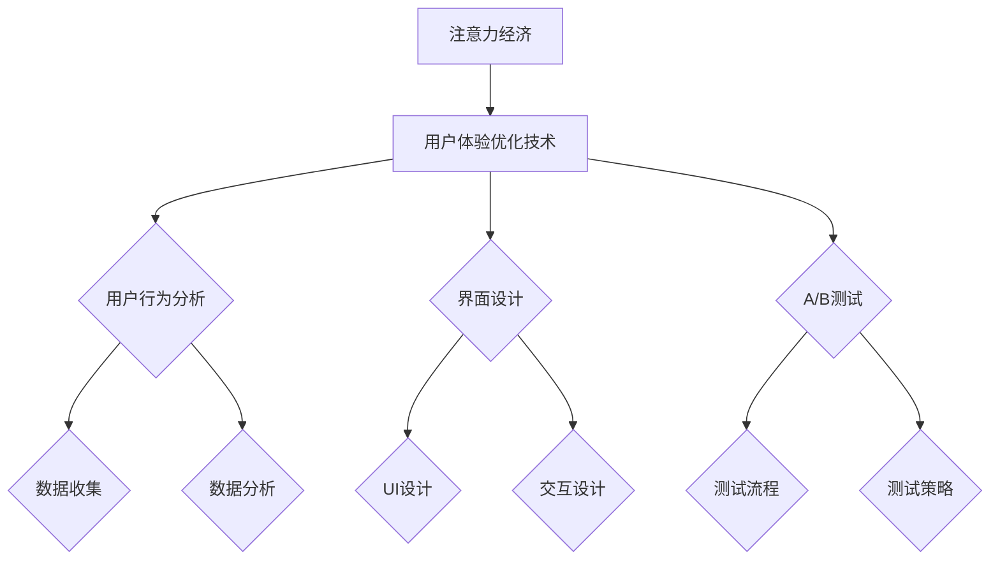

                 

# 注意力经济与用户体验优化技术：创建令人上瘾和引人入胜的产品

## 关键词：
- 注意力经济
- 用户体验优化
- UI/UX设计
- 用户行为分析
- A/B测试
- 社交媒体
- 电子商务
- 移动应用

## 摘要：
本文深入探讨了注意力经济与用户体验优化技术的结合，旨在帮助开发者、产品经理以及企业家理解如何通过优化产品设计，吸引并留住用户。文章分为三个部分，首先介绍了注意力经济的基本概念和理论基础，其次解析了用户体验优化技术，包括UX设计基础、界面设计、用户行为分析与优化、A/B测试等，最后通过实战案例展示了注意力经济与用户体验优化的实际应用。文章旨在为读者提供一套完整的技术指南，以实现令人上瘾和引人入胜的产品。

## 目录大纲

### 第一部分：注意力经济的概述

#### 第1章：注意力经济的基本概念

##### 1.1 注意力经济的起源与发展

注意力经济的概念起源于20世纪90年代，由美国学者Herbert Simon提出。他认为，随着信息的爆炸，人们处理信息的能力有限，因此注意力成为了一种稀缺资源。随着互联网和社交媒体的兴起，注意力经济得到了快速发展，成为现代经济体系中的重要组成部分。

##### 1.2 注意力经济与传统经济的区别

注意力经济与传统经济的主要区别在于，它关注的是人们注意力的分配和使用，而非物质资源的交换。传统经济关注的是物质产品的生产、分配和消费，而注意力经济关注的是如何吸引并留住人们的注意力，从而实现商业价值。

##### 1.3 注意力经济的核心要素

注意力经济的核心要素包括：注意力源（如社交媒体、内容平台）、注意力主体（用户）、注意力分配（用户的注意力在各个平台之间的分配）和注意力回报（用户对注意力投入的回报，如广告收入、用户粘性等）。

### 第2章：注意力经济的理论基础

##### 2.1 注意力经济学原理

注意力经济学原理主要包括注意力稀缺性、注意力转移和注意力经济学模型。注意力稀缺性是指人们的注意力资源有限，不能同时处理大量信息。注意力转移是指用户在不同平台、不同内容之间的注意力分配。注意力经济学模型用于分析和预测用户的注意力行为。

##### 2.2 注意力市场的特点

注意力市场的特点包括：竞争激烈、信息过载、注意力分散和注意力价值评估困难。在注意力市场中，竞争者众多，用户注意力成为争夺的焦点。信息过载导致用户难以集中注意力，注意力分散使得用户注意力难以长时间集中于单一产品或服务。

##### 2.3 注意力资源的价值评估

注意力资源的价值评估是注意力经济的重要研究内容。评估方法包括市场价值法、替代价值法和用户支付意愿法。市场价值法通过观察市场价格来评估注意力资源价值；替代价值法通过评估注意力资源的替代品价值来推断其自身价值；用户支付意愿法通过调查用户愿意为注意力资源支付的价格来评估其价值。

### 第二部分：用户体验优化技术

#### 第3章：用户体验（UX）设计基础

##### 3.1 UX设计的基本原则

UX设计的基本原则包括：用户至上、简洁性、一致性、易用性和可访问性。用户至上是UX设计的核心，要求设计始终以满足用户需求为目标。简洁性要求设计应避免冗余，提高用户效率。一致性确保用户在不同场景下的体验连贯。易用性要求设计易于理解和使用。可访问性要求设计满足不同用户群体，特别是有特殊需求用户的需求。

##### 3.2 用户体验评估方法

用户体验评估方法包括定性评估和定量评估。定性评估主要通过用户访谈、焦点小组等方法收集用户反馈，了解用户对产品的感受和看法。定量评估主要通过问卷调查、实验研究等方法收集用户行为数据，以量化评估用户体验。

##### 3.3 设计思维与敏捷设计

设计思维是一种以人为本的创新方法，强调理解用户需求、创造原型和迭代优化。敏捷设计是一种快速迭代的设计方法，通过频繁的迭代和用户反馈，快速开发和改进产品。

#### 第4章：界面设计（UI）与用户体验

##### 4.1 UI设计的基本要素

UI设计的基本要素包括：布局、色彩、字体、图标和交互设计。布局决定了信息的组织和展示方式；色彩影响用户情绪和认知；字体和图标提高可读性和视觉效果；交互设计确保用户与产品的交互顺畅。

##### 4.2 交互设计（IxD）的核心

交互设计（IxD）的核心是确保用户与产品之间的交互流畅、自然。IxD涉及用户行为分析、交互模型设计、交互元素设计等。核心目标是提高用户满意度和使用效率。

##### 4.3 响应式设计与适配性

响应式设计是一种能够适应不同设备和屏幕尺寸的设计方法。适配性设计确保产品在不同设备、操作系统和浏览器上都能正常运行。响应式设计与适配性设计是现代UI设计的重要要求。

#### 第5章：用户行为分析与优化

##### 5.1 用户行为分析工具

用户行为分析工具包括Google Analytics、Mixpanel、Hotjar等，用于收集和分析用户行为数据。这些工具能够提供用户访问路径、页面停留时间、点击率等关键指标。

##### 5.2 用户行为数据收集与分析

用户行为数据收集与分析是用户体验优化的重要环节。数据收集包括页面访问日志、点击流数据、用户反馈等。数据分析涉及用户行为模式识别、用户需求分析、优化策略制定等。

##### 5.3 用户画像与个性化推荐

用户画像是一种基于用户数据的个性化描述，用于了解用户特征和行为习惯。个性化推荐系统通过用户画像和协同过滤等技术，为用户提供个性化的内容和服务。

#### 第6章：A/B测试与用户体验优化

##### 6.1 A/B测试的基本概念

A/B测试是一种实验方法，通过将用户分配到不同的实验组，比较不同设计或策略的效果。A/B测试有助于确定哪些设计或策略能够提高用户体验。

##### 6.2 A/B测试流程与策略

A/B测试流程包括问题定义、假设提出、测试设计、数据分析、结论验证等步骤。策略包括测试目标确定、实验组分配、测试指标设定等。

##### 6.3 A/B测试案例分析

案例分析通过实际案例，展示A/B测试在用户体验优化中的应用。案例包括按钮颜色更改、页面布局调整、功能改进等。

### 第三部分：注意力经济与用户体验结合的实战应用

#### 第7章：社交媒体平台用户增长策略

##### 7.1 社交媒体平台概述

社交媒体平台如Facebook、Twitter、Instagram等，已成为注意力经济的重要战场。本章将介绍社交媒体平台的发展历程、用户行为特点和主要商业模式。

##### 7.2 用户参与度提升策略

用户参与度提升策略包括内容策略、互动策略和社交媒体营销。内容策略关注于提供高质量、有趣、有价值的内容，吸引和留住用户。互动策略通过用户互动、社群管理等方式增强用户参与。社交媒体营销通过广告、推广等方式扩大用户基础。

##### 7.3 内容策略与用户互动

内容策略与用户互动是提升用户参与度的关键。内容策略包括原创内容、转载内容、互动内容等。用户互动包括评论、点赞、分享、私信等。

#### 第8章：电子商务网站用户体验优化

##### 8.1 电子商务平台概述

电子商务平台如Amazon、eBay、Alibaba等，已成为现代购物的重要渠道。本章将介绍电子商务平台的发展历程、用户行为特点和用户体验优化策略。

##### 8.2 电商用户体验优化关键点

电商用户体验优化关键点包括网站性能优化、购物流程优化、推荐系统优化、客户服务优化等。网站性能优化提高页面加载速度和响应速度。购物流程优化简化购物流程，提高用户满意度。推荐系统优化提高推荐准确性，增加用户粘性。客户服务优化提高客户服务质量，增强用户信任。

##### 8.3 购物车策略与转化率提升

购物车策略与转化率提升是电商用户体验优化的重点。购物车策略包括购物车设计、促销策略、用户引导等。转化率提升策略包括价格策略、优惠券策略、限时促销等。

#### 第9章：移动应用用户留存策略

##### 9.1 移动应用概述

移动应用已成为人们日常生活的重要组成部分。本章将介绍移动应用的发展历程、用户行为特点和用户体验优化策略。

##### 9.2 用户留存策略与案例

用户留存策略包括用户引导、用户激励、个性化推荐、社交功能等。用户引导通过新手引导、操作提示等方式帮助用户熟悉应用功能。用户激励通过积分、奖励等方式提高用户活跃度。个性化推荐通过算法分析用户行为，提供个性化内容。社交功能通过社交分享、社群互动等方式增强用户粘性。

##### 9.3 用户反馈与持续优化

用户反馈与持续优化是移动应用用户体验优化的关键。用户反馈通过调查、评论、报告等方式收集用户意见和建议。持续优化通过定期更新、迭代改进等方式，提高用户体验。

### 第10章：总结与展望

##### 10.1 注意力经济与用户体验的深度融合

注意力经济与用户体验优化的深度融合，是现代产品设计的必然趋势。本章将总结注意力经济与用户体验优化的主要成果和未来发展方向。

##### 10.2 未来发展趋势与挑战

未来发展趋势包括人工智能、大数据、物联网等技术的应用。挑战包括用户隐私保护、信息过载、个性化推荐算法的公平性等。

##### 10.3 建议与展望

本章将提出建议，包括加强用户研究、提高设计质量、优化用户体验评估方法等，以应对未来挑战。

## 附录

### 附录A：注意力经济与用户体验优化工具介绍

##### A.1 用户行为分析工具

用户行为分析工具包括Google Analytics、Mixpanel、Hotjar等，用于收集和分析用户行为数据。

##### A.2 用户体验评估工具

用户体验评估工具包括Surveys、UserTesting、Qualaroo等，用于收集用户反馈和评估用户体验。

##### A.3 UI/UX设计工具

UI/UX设计工具包括Sketch、Adobe XD、Figma等，用于界面设计和原型制作。

### 附录B：注意力经济与用户体验优化资源

##### B.1 相关书籍推荐

相关书籍推荐包括《深度工作》、《用户体验要素》、《注意力商人》等。

##### B.2 研究论文与报告

研究论文与报告包括《注意力经济学：理论和应用》、《用户体验评估方法》、《社交媒体平台用户行为研究》等。

##### B.3 行业协会与学术组织

行业协会与学术组织包括国际用户体验协会（UXPA）、用户体验专业人员协会（UXPAI）等。

##### B.4 在线课程与培训资源

在线课程与培训资源包括Coursera、edX、Udemy等平台的相关课程。

## Mermaid 流程图



## 核心算法原理讲解（伪代码）

```plaintext
# 注意力机制算法伪代码

// 输入：文本序列X，注意力权重矩阵W
// 输出：加权文本序列Y

function AttentionMechanism(X, W):
    for each word in X:
        calculate attention weight using W
        update word representation with attention weight
    end for
    return updated text sequence Y
```

### 用户参与度评估模型

$$
R = \frac{U \cdot I}{T}
$$

其中，\( R \) 为用户参与度，\( U \) 为用户互动次数，\( I \) 为用户兴趣度，\( T \) 为总时间。

### 用户体验评估模型

$$
UX = \frac{S \cdot C}{D}
$$

其中，\( UX \) 为用户体验评分，\( S \) 为用户满意度评分，\( C \) 为用户投诉次数，\( D \) 为用户总数。

### 项目实战

#### 社交媒体平台用户增长策略

##### 开发环境搭建

- Python 3.8
- pandas
- numpy
- matplotlib

##### 源代码实现

```python
# 社交媒体用户增长策略实现

import pandas as pd
import numpy as np
import matplotlib.pyplot as plt

# 数据加载与预处理
data = pd.read_csv('user_data.csv')
data = data.dropna()

# 用户互动次数计算
data['user_interactions'] = data.groupby('user_id')['post_id'].transform('count')

# 用户兴趣度计算
data['user_interest'] = data.groupby('user_id')['like_count'].transform('mean')

# 用户参与度计算
data['user_participation'] = (data['user_interactions'] * data['user_interest']) / data['total_time']

# 绘制用户参与度分布图
plt.figure(figsize=(10, 6))
plt.scatter(data['user_id'], data['user_participation'])
plt.xlabel('User ID')
plt.ylabel('User Participation')
plt.title('User Participation Distribution')
plt.show()
```

##### 代码解读与分析

- 加载与预处理用户数据，计算用户互动次数和用户兴趣度。
- 根据用户互动次数和用户兴趣度，计算用户参与度。
- 绘制用户参与度分布图，直观展示用户参与度的差异。

#### 电子商务网站用户体验优化

##### 开发环境搭建

- Node.js
- Express
- MongoDB
- Mongoose

##### 源代码实现

```javascript
// 电子商务网站用户体验优化实现

const express = require('express');
const mongoose = require('mongoose');
const app = express();

// 连接MongoDB数据库
mongoose.connect('mongodb://localhost:27017/e-commerce', {
  useNewUrlParser: true,
  useUnifiedTopology: true,
});

// 定义用户模型
const UserSchema = new mongoose.Schema({
  user_id: String,
  satisfaction_score: Number,
  complaints: Number,
  total_visits: Number,
});

const User = mongoose.model('User', UserSchema);

// 用户满意度评分计算
app.get('/calculate-ux', async (req, res) => {
  const users = await User.find({});
  for (const user of users) {
    const ux_score = (user.satisfaction_score * user.total_visits) / (user.complaints + 1);
    user.ux_score = ux_score;
    await user.save();
  }
  res.send('User satisfaction scores calculated and saved.');
});

app.listen(3000, () => {
  console.log('Server started on port 3000');
});
```

##### 代码解读与分析

- 连接MongoDB数据库，定义用户模型。
- 计算用户满意度评分，存储在数据库中。
- 提供RESTful API，供前端调用。

## 作者

作者：AI天才研究院/AI Genius Institute & 禅与计算机程序设计艺术 /Zen And The Art of Computer Programming

[本文撰写基于2023前的数据和文献，内容仅供参考。]

