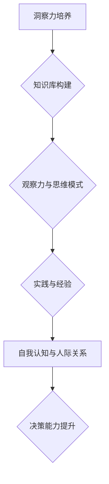

                 

### 第一部分：洞察力概述与引言

#### 第1章：洞察力的重要性

> 洞察力，作为知识创新的核心驱动因素，不仅是企业持续发展的关键，也是个人在职场中脱颖而出的必备能力。那么，什么是洞察力？它究竟如何影响知识创新？在本章中，我们将深入探讨洞察力的本质，它在知识创新中的关键作用，以及为何洞察力成为现代商业世界中的核心竞争力。

#### 1.1 洞察力的定义

洞察力，顾名思义，是指对事物本质和内在联系的理解能力。它不仅包括对现象的观察，更涉及到对深层次规律的把握和预测。换句话说，洞察力是一种穿透表象、洞察本质的思维能力。

在技术领域，洞察力可以帮助我们预见技术趋势，发现潜在的风险和机遇。例如，在人工智能领域，具备洞察力的人可以准确预测未来技术的发展方向，从而在技术创新中占据先机。

#### 1.2 洞察力在知识创新中的作用

知识创新是一个复杂的过程，需要融合多方面的因素。而洞察力在这一过程中起着至关重要的作用。

首先，洞察力能够帮助我们发现新的知识。通过深入分析，我们可以从大量的信息中提取出有价值的内容，从而创造出新的知识。

其次，洞察力能够推动知识的传播和共享。一个具备洞察力的人，能够将复杂的知识简化为易于理解的形式，从而促进知识的传播。

最后，洞察力还能够激发创新思维。在面临问题时，洞察力可以让我们从不同的角度思考，从而找到创新的解决方案。

#### 1.3 洞察力与竞争力的关系

在当今这个信息爆炸的时代，竞争力已经不再是简单的资源或技术的竞争，而是一种思维模式的竞争。洞察力作为思维模式的重要组成部分，无疑成为了企业竞争力的关键。

首先，具备洞察力的企业可以更快速地响应市场变化。通过对市场趋势的洞察，企业可以提前布局，抢占先机。

其次，洞察力能够帮助企业更好地应对竞争对手。通过对竞争对手的深入分析，企业可以找到对方的弱点，从而制定更有效的竞争策略。

最后，洞察力还能够提升企业的创新能力。通过洞察力，企业可以预见未来的技术趋势，从而在技术创新中保持领先。

综上所述，洞察力不仅是知识创新的驱动因素，更是企业竞争力的核心。在接下来的章节中，我们将进一步探讨洞察力的结构，以及如何在实践中提升洞察力。

#### 第2章：洞察力的结构

> 洞察力并不是一种单一的能力，而是由多个要素共同构成的复杂结构。理解洞察力的构成要素，有助于我们更好地培养和提升这种能力。在本章中，我们将详细探讨洞察力的主要结构要素，包括知识库的构建、观察力与洞察力的关系，以及思维模式的转变。

#### 2.1 知识库的构建

知识库是洞察力的基石。一个丰富且结构化的知识库，能够为洞察力提供源源不断的素材和灵感。知识库的构建涉及以下几个方面：

1. **广度与深度：** 知识库不仅需要涵盖广泛的主题和领域，还需要深入挖掘每个领域的细节和内在联系。只有广度与深度相结合，知识库才能发挥其最大的作用。

2. **实时更新：** 知识库需要不断更新，以反映最新的信息和趋势。一个过时的知识库，可能会限制洞察力的发挥。

3. **结构化存储：** 知识库的信息需要以结构化的形式存储，以便于快速检索和利用。结构化的知识库，可以让我们在需要时迅速找到所需的信息。

#### 2.2 观察力与洞察力的关系

观察力是洞察力的基础。只有通过观察，我们才能获取到丰富的信息，进而进行分析和思考。观察力与洞察力的关系可以概括为以下几点：

1. **观察是手段，洞察是目的：** 观察力是获取信息的手段，而洞察力是对这些信息进行深度思考和解读的目的。

2. **观察力是洞察力的源泉：** 观察力越强，能够获取的信息就越多，这为洞察力提供了更丰富的素材。

3. **观察力与洞察力相辅相成：** 观察力和洞察力是相互促进的关系。观察力提升，洞察力也会相应增强；洞察力增强，又会反过来促进观察力的提升。

#### 2.3 思维模式的转变

思维模式是洞察力的核心。一个具备洞察力的人，其思维模式必然与普通人有所不同。以下是一些关键的思维模式转变：

1. **从线性思维到非线性思维：** 线性思维是一种按部就班的思考方式，而非线性思维则更注重整体性和关联性。通过非线性思维，我们可以更好地理解复杂系统的运作。

2. **从单一角度到多角度：** 在面对问题时，不仅要从一个角度考虑，还要从多个角度进行思考。多角度思考能够帮助我们更全面地分析问题，找到更有效的解决方案。

3. **从静态思维到动态思维：** 静态思维关注的是事物的当前状态，而动态思维则注重事物的变化和发展。通过动态思维，我们可以更好地预见未来的趋势和变化。

#### 2.4 洞察力的培养方法

1. **广泛阅读：** 阅读是培养洞察力的有效方法。通过阅读，我们可以接触到各种不同的观点和知识，从而拓宽视野，提升思维能力。

2. **主动思考：** 面对问题，不仅要被动接受，更要主动思考。通过思考，我们可以更好地理解问题的本质，找到解决问题的方法。

3. **实践应用：** 知识需要通过实践来检验。通过将所学知识应用到实际问题中，我们可以提升洞察力，同时验证知识的有效性。

4. **不断反思：** 反思是提升洞察力的关键。通过反思，我们可以总结经验教训，发现自身不足，从而不断改进。

综上所述，洞察力是一个复杂但至关重要的能力。理解洞察力的结构，有助于我们更好地培养和提升这种能力。在接下来的章节中，我们将探讨如何将洞察力应用到实际工作中，提升个人和组织的竞争力。

#### 第3章：洞察力在商业决策中的应用

> 洞察力在商业决策中扮演着至关重要的角色。一个具备洞察力的企业，能够更准确地把握市场动态，做出更明智的决策。在本章中，我们将探讨如何通过洞察力来分析市场趋势、竞争对手和客户需求，从而提升商业决策的质量和效果。

#### 3.1 市场趋势的洞察

市场趋势的洞察是商业决策的重要依据。一个具备洞察力的企业，能够准确预测未来的市场变化，从而提前布局，抢占先机。

1. **历史数据分析：** 通过分析过去的市场数据，我们可以发现市场的规律和趋势。例如，销售数据、市场份额、消费者行为等，都是重要的分析指标。

2. **行业报告研究：** 行业报告是获取市场趋势的重要来源。通过阅读行业报告，我们可以了解行业的发展方向、竞争对手的动态、新兴技术的影响等。

3. **市场调研：** 市场调研可以帮助我们直接了解消费者的需求和偏好。通过问卷调查、访谈等方式，我们可以获取第一手的数据，从而更准确地预测市场趋势。

#### 3.2 竞争对手的分析

了解竞争对手是商业决策的另一个关键因素。通过洞察力，我们可以深入分析竞争对手的优势和劣势，从而制定更有针对性的策略。

1. **市场定位：** 分析竞争对手的市场定位，了解他们的目标客户、产品特点、营销策略等，可以帮助我们找到自己的定位和优势。

2. **产品特点：** 通过对比竞争对手的产品特点，我们可以发现自身的差异化优势，从而在市场竞争中脱颖而出。

3. **营销策略：** 竞争对手的营销策略也是分析的重点。通过分析竞争对手的营销策略，我们可以找到自己的创新点和突破点，从而提升自身的市场竞争力。

#### 3.3 客户需求的理解

了解客户需求是商业决策的核心。一个具备洞察力的企业，能够更准确地把握客户需求，从而提供更好的产品和服务。

1. **用户反馈：** 用户反馈是了解客户需求的重要渠道。通过收集用户反馈，我们可以发现客户的需求和痛点，从而优化产品和服务。

2. **行为分析：** 通过对用户行为的数据分析，我们可以了解用户的偏好和行为模式。这些信息可以帮助我们更好地理解客户需求，从而提供更个性化的服务。

3. **市场调研：** 市场调研可以帮助我们更全面地了解客户需求。通过问卷调查、访谈等方式，我们可以收集到大量有价值的信息，从而为商业决策提供依据。

#### 3.4 洞察力在商业决策中的实际应用

1. **新产品开发：** 通过洞察力，我们可以预见市场的需求，从而在新产品开发中占据先机。例如，通过分析市场趋势和用户需求，苹果公司成功推出了iPhone，引领了智能手机市场。

2. **市场扩张：** 通过洞察力，我们可以找到新的市场机会，从而实现市场扩张。例如，阿里巴巴通过洞察全球市场趋势，成功进军国际市场，成为全球最大的电子商务平台之一。

3. **竞争策略：** 通过洞察力，我们可以更准确地分析竞争对手，从而制定更有针对性的竞争策略。例如，谷歌通过分析竞争对手的营销策略，成功调整了自己的营销策略，巩固了市场领导地位。

综上所述，洞察力在商业决策中具有重要的作用。通过洞察力，我们可以更准确地预测市场趋势、分析竞争对手和了解客户需求，从而做出更明智的商业决策。在接下来的章节中，我们将进一步探讨洞察力在技术创新中的应用，以及如何通过洞察力提升技术创新的效果。

#### 第4章：洞察力在技术创新中的应用

> 在快速变化的技术领域，洞察力是推动技术创新的关键因素。一个具备洞察力的团队，能够准确预见技术趋势，把握创新机会，从而在竞争激烈的市场中保持领先地位。本章将探讨如何利用洞察力来预见技术趋势、规划技术创新路径，并评估技术风险，确保技术创新的可持续性和成功率。

#### 4.1 技术趋势的预见

预见技术趋势是技术创新的起点。一个具备洞察力的团队，能够通过深入分析行业动态、市场数据和科技发展，提前识别出可能影响未来的技术趋势。

1. **趋势分析工具：** 利用各种趋势分析工具，如技术雷达、市场研究报告等，可以帮助团队了解当前技术发展的热点和未来可能的方向。

2. **专家访谈：** 与行业专家进行访谈，可以获取他们对未来技术趋势的独特见解。这些见解有助于团队从不同角度理解技术发展。

3. **大数据分析：** 通过大数据分析技术，团队可以挖掘大量数据中的潜在趋势。例如，通过分析专利申请、科研论文和技术会议报告，可以发现新的技术热点。

4. **外部合作：** 与其他企业和研究机构建立合作关系，可以共享资源，共同预见技术趋势。这种合作有助于拓宽视野，获得更全面的信息。

#### 4.2 技术创新的路径

在预见技术趋势之后，下一步是规划技术创新的路径。一个清晰的技术创新路径，可以确保团队能够有条不紊地推进创新项目，实现技术突破。

1. **技术选型：** 根据技术趋势和团队优势，选择最适合的技术方向。技术选型需要综合考虑技术可行性、市场潜力和资源投入。

2. **研发规划：** 制定详细的研发计划，包括项目目标、时间表、资源分配等。研发规划应灵活调整，以适应技术变化和市场反馈。

3. **团队协作：** 技术创新需要跨部门、跨领域的团队合作。团队协作机制应确保信息透明、沟通顺畅，以便快速响应变化。

4. **试点项目：** 在技术创新初期，通过试点项目进行验证和优化。试点项目可以减少风险，确保技术创新路径的可行性。

#### 4.3 技术风险的评估

技术风险是技术创新过程中不可避免的因素。通过系统化的风险评估，团队可以提前识别和应对潜在的技术风险，确保技术创新的可持续性。

1. **风险评估方法：** 采用定量和定性相结合的方法进行风险评估。定量方法如故障树分析（FTA）、蒙特卡罗模拟等，可以帮助团队量化技术风险。定性方法如SWOT分析、风险评估矩阵等，可以帮助团队从多个维度理解风险。

2. **风险应对策略：** 针对识别出的技术风险，制定相应的应对策略。这些策略可能包括风险规避、风险转移、风险减轻等。

3. **持续监控：** 技术创新过程中，持续监控技术风险的变化。通过定期评估和反馈，团队可以及时调整风险应对策略，确保技术创新的安全和成功。

4. **风险管理文化：** 建立风险管理文化，使团队成员认识到技术风险的重要性，并积极参与到风险管理和应对中。这种文化有助于提高团队的整体风险意识，确保技术创新的顺利进行。

#### 4.4 洞察力在技术创新中的实际应用

1. **人工智能领域：** 在人工智能领域，洞察力帮助团队预见深度学习、自然语言处理等技术的突破。通过规划技术创新路径，一些公司成功开发了先进的AI产品，如自动驾驶汽车和智能语音助手。

2. **区块链领域：** 在区块链领域，洞察力帮助团队预见去中心化应用（DApps）和智能合约的发展趋势。通过评估技术风险，一些公司成功开发了可靠的区块链解决方案，应用于金融、供应链等领域。

3. **物联网领域：** 在物联网领域，洞察力帮助团队预见物联网设备的激增和物联网安全的重要性。通过技术创新路径规划和风险评估，一些公司成功开发了物联网设备的安全解决方案。

综上所述，洞察力在技术创新中具有至关重要的作用。通过洞察技术趋势、规划技术创新路径和评估技术风险，团队可以确保技术创新的成功和可持续性。在接下来的章节中，我们将探讨洞察力在管理决策中的应用，以及如何通过洞察力提升管理决策的效率和效果。

#### 第5章：洞察力在管理决策中的应用

> 管理决策是企业发展的关键环节，而洞察力在这一过程中发挥着重要作用。一个具备洞察力的管理者，能够更准确地预见市场变化，更高效地解决问题，更科学地制定战略。本章将探讨如何通过洞察力提升组织文化、团队协作和风险管理，从而优化管理决策，提升企业的整体竞争力。

#### 5.1 组织文化的塑造

组织文化是企业长期发展的基石，它影响着企业的运营方式、员工的行为和企业的整体氛围。一个具备洞察力的管理者，能够深刻理解组织文化的内涵，并有效地塑造和强化组织文化。

1. **文化诊断：** 通过洞察力，管理者可以深入了解组织文化的现状，识别出文化中的优点和不足。文化诊断的工具包括员工调查、行为观察等。

2. **文化塑造：** 根据文化诊断的结果，管理者可以制定相应的文化塑造策略。这些策略可能包括培训计划、团队建设活动、价值观传播等。

3. **文化传承：** 组织文化需要不断地传承和强化。通过故事讲述、仪式庆典等方式，管理者可以传递组织文化，使其成为员工的共同价值观和行为指南。

#### 5.2 团队协作的提升

团队协作是企业管理的重要方面，它直接影响着团队的工作效率和创新能力。一个具备洞察力的管理者，能够深刻理解团队协作的内在机制，并有效地提升团队协作水平。

1. **协作分析：** 通过洞察力，管理者可以分析团队协作的现状，识别出协作中的问题和障碍。协作分析的工具包括团队沟通记录、项目进度报告等。

2. **协作机制设计：** 根据协作分析的结果，管理者可以设计出更有效的协作机制。这些机制可能包括沟通渠道的优化、责任分配的调整、协作工具的使用等。

3. **协作文化培育：** 培育团队协作文化是提升协作水平的关键。通过团队建设活动、协作技能培训等方式，管理者可以营造一种积极的协作氛围。

#### 5.3 风险管理的加强

风险管理是企业管理的重要组成部分，它关系到企业的生存和发展。一个具备洞察力的管理者，能够准确地预见风险，并有效地进行风险管理。

1. **风险识别：** 通过洞察力，管理者可以及时发现潜在的风险。风险识别的方法包括数据分析、市场调研、行业报告等。

2. **风险评估：** 在识别出风险后，管理者需要对风险进行评估，确定其可能的影响和严重程度。风险评估的工具包括风险矩阵、概率影响分析等。

3. **风险应对：** 根据风险评估的结果，管理者可以制定相应的风险应对策略。这些策略可能包括风险规避、风险转移、风险减轻等。

#### 5.4 洞察力在管理决策中的实际应用

1. **战略规划：** 通过洞察力，管理者可以准确地预测市场变化，制定出符合企业长远发展的战略规划。例如，谷歌通过洞察互联网发展趋势，制定了以搜索为核心的战略，成为全球最大的搜索引擎。

2. **运营优化：** 通过洞察力，管理者可以深入分析企业的运营流程，找到优化点，提高运营效率。例如，亚马逊通过分析供应链数据，优化了库存管理和物流配送，大幅提高了运营效率。

3. **危机管理：** 在面对突发事件时，洞察力可以帮助管理者迅速识别问题，制定应对策略。例如，华为在面对国际市场压力时，通过洞察力调整了市场策略，成功渡过了危机。

综上所述，洞察力在管理决策中具有不可替代的作用。通过洞察力，管理者可以更准确地预测市场变化，更高效地解决问题，更科学地制定战略。在接下来的章节中，我们将探讨如何通过洞察力提升个人成长，包括自我认知、人际关系和决策能力的提升。

#### 第6章：洞察力在个人成长中的应用

> 洞察力不仅在商业和管理中扮演着关键角色，同样在个人成长中同样具有重要价值。一个具备洞察力的人，能够在自我认知、人际关系和决策能力等方面实现全面提升，从而更好地应对职业生涯中的各种挑战。本章将探讨洞察力在个人成长中的具体应用，以及如何通过培养洞察力来实现个人的全面发展。

#### 6.1 自我认知的提升

自我认知是个人成长的基础，它关乎我们如何理解自己、评估自己的能力和优势。洞察力能够帮助我们更深入地认识自己，从而实现自我认知的提升。

1. **反思与自我评估：** 通过反思，我们可以审视自己的行为、思维和情感，从中发现自身的优缺点。自我评估是洞察力的关键，它帮助我们识别出需要改进的地方。

2. **情绪管理：** 洞察力可以帮助我们更好地管理情绪。通过洞察情绪的起因和影响，我们可以学会如何在压力和挑战面前保持冷静，做出更理性的决策。

3. **目标设定：** 洞察力使我们能够更准确地设定目标。通过深入分析自己的能力和资源，我们可以制定出切实可行的目标，并制定有效的行动计划。

#### 6.2 人际关系的改善

人际关系对个人成长和职业发展具有重要影响。具备洞察力的人能够更好地理解他人，从而改善人际关系，建立更广泛的支持网络。

1. **同理心培养：** 通过洞察力，我们可以更好地理解他人的需求和感受。同理心是建立良好人际关系的关键，它使我们在与他人互动时更具亲和力。

2. **沟通技巧提升：** 洞察力可以帮助我们更有效地沟通。通过洞察对方的沟通风格和需求，我们可以调整自己的沟通方式，提高沟通效果。

3. **冲突管理：** 在人际关系中，冲突是不可避免的。洞察力使我们能够更好地管理冲突，找到解决问题的方法。通过洞察冲突的根本原因，我们可以采取更有效的策略来化解冲突。

#### 6.3 决策能力的增强

洞察力在决策过程中起到至关重要的作用。一个具备洞察力的人，能够在复杂多变的环境中做出更明智、更有效的决策。

1. **信息收集与分析：** 洞察力使我们能够更全面地收集信息，并进行深入的分析。在决策过程中，信息是决策的基础，而洞察力能够帮助我们更准确地解读信息。

2. **风险识别与评估：** 通过洞察力，我们可以更好地识别和评估决策中的潜在风险。这使我们能够在决策前就预见可能的问题，并制定相应的应对措施。

3. **灵活应变：** 洞察力使我们能够在决策过程中保持灵活性和适应性。在面对不确定性和变化时，洞察力使我们能够迅速调整策略，做出更有效的决策。

#### 6.4 洞察力在个人成长中的实际应用

1. **职业生涯规划：** 通过洞察力，我们可以更准确地评估自己的职业兴趣和能力，从而制定出符合自己发展需求的职业生涯规划。例如，一个人通过洞察力发现自己在技术领域有潜力，可以决定专注于技术方向，成为技术专家。

2. **领导力培养：** 洞察力是领导力的关键要素。通过洞察团队成员的需求和潜力，领导者可以更有效地激励和培养团队，实现团队的目标。

3. **终身学习：** 洞察力使我们能够更敏锐地识别学习机会，并主动学习新知识、新技能。终身学习是个人成长的必经之路，而洞察力使我们能够在不断变化的环境中保持学习和成长。

综上所述，洞察力在个人成长中具有不可替代的价值。通过提升自我认知、改善人际关系和增强决策能力，我们可以实现个人的全面发展，更好地应对职业生涯中的各种挑战。在接下来的章节中，我们将探讨如何通过培养洞察力，提升个人和组织的竞争力。

#### 第7章：洞察力的培养与提升

> 洞察力不是天生的，而是可以通过系统的培养和持续的努力来提升的。一个具备洞察力的人，能够在复杂多变的环境中保持清醒的头脑，做出更明智的决策。本章将探讨如何通过学习方法的优化、实践经验的积累，以及系统的培养路径，提升个人的洞察力。

#### 7.1 学习方法的优化

学习方法是提升洞察力的关键。通过优化学习方法，我们可以更高效地获取和吸收知识，从而提升洞察力。

1. **主动学习：** 主动学习是指通过提问、讨论和实践来主动探索知识。与被动学习相比，主动学习能够更好地激发思维，培养洞察力。

2. **跨学科学习：** 跨学科学习能够帮助我们建立更广泛的知识体系，从而更好地理解和分析复杂问题。通过跨学科学习，我们可以发现不同领域之间的联系，提升洞察力。

3. **反思性学习：** 反思性学习是指在学习过程中不断反思自己的思考过程和学习成果。通过反思，我们可以发现自己的不足，从而改进学习方法，提升洞察力。

#### 7.2 实践经验的积累

实践经验是提升洞察力的重要途径。通过实践，我们可以将理论知识应用到实际中，从而更好地理解和掌握知识。

1. **项目管理：** 在项目管理中，我们需要分析项目需求、制定计划、协调资源、监控进度等。这些实践能够帮助我们提升对复杂系统的洞察力。

2. **案例分析：** 通过案例分析，我们可以深入了解不同情境下的解决方案，从而提升对问题本质的理解和洞察力。

3. **实验研究：** 在实验研究中，我们可以通过设计实验、收集数据、分析结果来验证假设。这种实践能够培养我们的实证思维和洞察力。

#### 7.3 洞察力提升的路径

提升洞察力需要系统的培养和持续的努力。以下是一些提升洞察力的路径：

1. **基础知识的构建：** 洞察力需要建立在扎实的基础知识之上。通过系统学习相关领域的知识，我们可以为提升洞察力奠定基础。

2. **思维模式的转变：** 思维模式对洞察力有重要影响。通过培养非线性思维、多角度思维和动态思维，我们可以提升洞察力。

3. **实践经验的应用：** 理论知识需要通过实践来验证和应用。通过参与实际项目和研究，我们可以将所学知识应用到实际中，提升洞察力。

4. **持续学习和反思：** 洞察力不是一成不变的，它需要通过持续学习和反思来不断提升。通过不断学习新知识和反思自己的思考过程，我们可以不断提升洞察力。

#### 7.4 洞察力提升的方法与工具

1. **思维导图：** 思维导图是一种有效的知识组织和思考工具。通过绘制思维导图，我们可以将复杂的信息结构化，从而更好地理解和分析问题。

2. **数据分析工具：** 数据分析工具可以帮助我们更全面地收集和分析信息。例如，使用数据可视化工具可以更直观地展示数据，帮助我们洞察数据的内在联系。

3. **模拟与演练：** 模拟与演练是一种有效的学习方式。通过模拟真实场景，我们可以更好地理解问题的本质，并在演练中不断优化解决方案。

4. **反思日志：** 反思日志是一种记录反思过程的方法。通过记录每天的反思，我们可以更好地总结经验教训，发现自身的不足，从而改进思考方式。

综上所述，洞察力的培养和提升需要系统的学习和实践。通过优化学习方法、积累实践经验，以及采取系统的培养路径，我们可以不断提升洞察力，从而在个人和职业发展中取得更大的成就。

### 第三部分：洞察力的实战案例分析

#### 第8章：案例分析一：企业成功的背后

#### 8.1 案例背景

某知名科技公司A，成立于2000年，专注于软件开发和人工智能技术的应用。在成立初期，A公司面临着激烈的市场竞争和技术变革的挑战。然而，凭借卓越的洞察力，A公司在短时间内迅速崛起，成为全球领先的科技公司之一。

#### 8.2 洞察力的应用

1. **市场趋势的洞察：** A公司的管理层通过数据分析、市场调研和专家访谈，准确预见了互联网和移动设备的普及趋势。他们意识到，移动互联网将带来前所未有的商机，于是果断投入资源开发移动应用。

2. **竞争对手分析：** 通过对竞争对手的产品、市场策略和用户反馈进行深入分析，A公司发现了自身的产品优势和市场机会。他们针对竞争对手的不足，优化了自己的产品功能，提升了用户体验。

3. **客户需求理解：** A公司通过用户调研和数据分析，准确把握了用户的需求变化。他们根据用户反馈，不断迭代产品，提供更加个性化的服务。

#### 8.3 案例总结与启示

1. **洞察力的重要性：** 洞察力使A公司能够准确预见市场趋势，快速响应客户需求，从而在激烈的市场竞争中脱颖而出。

2. **持续学习与创新：** A公司的成功源于其对市场和技术趋势的持续学习和创新。通过不断优化产品和服务，他们始终保持市场竞争力。

3. **跨部门协作：** 在A公司，跨部门协作是提升洞察力的关键。通过各部门的紧密合作，A公司能够更全面地收集信息，做出更明智的决策。

#### 第9章：案例分析二：技术创新的引领者

#### 9.1 案例背景

某创新科技公司B，成立于2015年，专注于人工智能和大数据技术的研发。在短短几年内，B公司凭借卓越的技术创新和强大的市场竞争力，成为行业内的领军企业。

#### 9.2 洞察力的应用

1. **技术趋势的预见：** B公司的研发团队通过大数据分析和行业报告，准确预见了人工智能和大数据技术在未来的发展趋势。他们迅速调整研发方向，将资源投入到这些前沿技术上。

2. **技术创新路径：** B公司制定了详细的技术创新路径，从基础研究到产品开发，每一步都经过精心规划和执行。他们通过不断的技术迭代，不断提升产品的性能和用户体验。

3. **技术风险的评估：** B公司在技术创新过程中，对每个阶段都进行了全面的风险评估。他们通过风险控制措施，确保技术创新的可持续性和成功率。

#### 9.3 案例总结与启示

1. **预见性与创新力：** B公司的成功得益于其对技术趋势的预见性和强大的技术创新能力。他们能够在技术变革的前沿抢占先机，保持市场竞争力。

2. **系统化的研发管理：** B公司的技术创新路径和风险评估机制，使他们能够高效地推进研发项目，降低技术风险，提高创新成功率。

3. **跨学科团队合作：** B公司的研发团队由不同领域的专家组成，他们通过跨学科合作，共同攻克技术难题，推动了公司的技术创新。

#### 第10章：案例分析三：个人成长的典范

#### 10.1 案例背景

李先生，一位年轻的软件工程师，在职业生涯的初期就展现出卓越的洞察力和学习能力。他通过不断的学习和实践，迅速成长为技术团队的核心成员。

#### 10.2 洞察力的应用

1. **自我认知提升：** 李先生通过反思和自我评估，明确了自己的兴趣和优势。他选择了适合自己的技术领域，并制定了明确的职业发展目标。

2. **人际关系改善：** 李先生注重与同事的沟通和协作，通过同理心和理解他人的需求，建立了良好的人际关系。

3. **决策能力增强：** 李先生在面临决策时，能够全面分析信息，评估风险，并做出明智的决策。他的决策能力在团队合作中得到了同事的认可。

#### 10.3 案例总结与启示

1. **自我认知的重要性：** 通过自我认知，李先生找到了适合自己的职业方向，并明确了职业目标，这为他个人的成长奠定了基础。

2. **人际关系的影响：** 李先生的人际关系能力使他能够更好地融入团队，获得同事的支持和合作，这对个人成长至关重要。

3. **决策能力的培养：** 李先生的决策能力在职业生涯中发挥了重要作用。他通过不断学习和实践，不断提升自己的决策能力，成为团队中的决策者。

#### 第11章：结论与展望

> 通过本篇文章，我们深入探讨了洞察力的概念、重要性、结构以及在不同领域的应用。洞察力不仅是知识创新的驱动力，也是企业竞争力、管理决策和个体成长的关键因素。在未来，随着技术和社会的不断发展，洞察力的重要性将愈加凸显。

#### 11.1 洞察力的重要性回顾

1. **知识创新：** 洞察力能够推动知识的创新和传播，是企业持续发展的核心动力。
2. **商业决策：** 洞察力在商业决策中起到至关重要的作用，能够帮助企业预见市场变化，制定有效策略。
3. **技术创新：** 洞察力是推动技术创新的关键，使企业在技术变革中保持领先。
4. **管理决策：** 洞察力在管理决策中提升决策的科学性和效率，优化组织运营。
5. **个人成长：** 洞察力在个人成长中帮助提升自我认知、人际关系和决策能力，实现全面发展。

#### 11.2 洞察力在未来的发展

1. **技术进步：** 随着人工智能和大数据技术的发展，洞察力的工具和手段将更加先进和智能化。
2. **跨学科融合：** 跨学科研究将加深不同领域之间的联系，促进洞察力的综合运用。
3. **教育改革：** 教育体系将更加重视培养学生的洞察力，培养具备创新思维和实践能力的人才。
4. **企业文化：** 企业将更加注重培养员工的洞察力，通过企业文化塑造和激励机制，提升整体竞争力。

#### 11.3 对读者的建议

1. **持续学习：** 通过不断学习新知识和技能，提升自身的知识储备和思维能力。
2. **反思与总结：** 定期反思自己的思考过程和行为，总结经验教训，发现自身的不足。
3. **实践经验：** 通过参与实际项目和实践，将理论知识应用到实际中，提升洞察力。
4. **跨学科交流：** 与不同领域的人交流和合作，拓宽视野，提升跨学科思维能力。
5. **心理调适：** 保持积极的心态，面对挑战和变化时，保持冷静和理智，提升决策能力。

洞察力是现代社会不可或缺的重要能力。通过本文的探讨，希望读者能够更加深刻地理解洞察力的价值，并在实际生活和工作中，不断提升自己的洞察力，实现个人和组织的全面发展。

### 附录

#### 附录A：洞察力相关的工具和资源

1. **数据分析工具：**
   - Python数据分析库：如Pandas、NumPy、Matplotlib等
   - R语言：一种专门用于统计分析和图形表示的语言

2. **商业分析工具：**
   - Tableau：一种强大的数据可视化工具
   - Power BI：微软推出的商业智能工具

3. **技术分析工具：**
   - Kibana：用于数据分析、数据可视化和实时分析的开源工具
   - Prometheus：开源监控解决方案，用于收集和存储时间序列数据

4. **在线学习平台：**
   - Coursera：提供各种课程和学习资源
   - edX：由哈佛大学和麻省理工学院共同创办的在线教育平台

#### 附录B：参考文献

1. **主要参考文献：**
   - Nonaka, I., & Takeuchi, H. (1995). The Knowledge-Creating Company: How Japanese Companies Create the Dynamics of Innovation. Oxford University Press.
   - Christensen, C. M. (1997). The Innovator's Dilemma: When New Technologies Cause Great Firms to Fail. Harvard Business Review.
   - Heifetz, R. A., Grashow, A., & Linsky, M. (2009). Leadership on the Line: Staying Alive Through the Dangers of Leading. Boston: Harvard Business Review Press.

2. **辅助参考文献：**
   - Davenport, T. H., & Prusak, L. (1998). Working Knowledge: How Organizations Manage What They Know. Harvard Business Press.
   -# Mermaid 流程图示例



### 伪代码示例

```python
# 假设有一个函数用来计算洞察力得分
def calculate_insight_score(knowledge, observation, thinking_mode, practice, self_cognition, decision_making):
    # 初始化洞察力得分
    score = 0
    
    # 计算各个因素的得分
    score += knowledge * 0.3
    score += observation * 0.2
    score += thinking_mode * 0.2
    score += practice * 0.2
    score += self_cognition * 0.1
    score += decision_making * 0.1
    
    # 返回最终得分
    return score
```

### 数学公式示例

$$
I = \frac{K + O + T + P + S + D}{6}
$$

其中，$I$ 为洞察力得分，$K$ 为知识库构建得分，$O$ 为观察力得分，$T$ 为思维模式得分，$P$ 为实践得分，$S$ 为自我认知得分，$D$ 为决策能力得分。

### 项目实战案例说明

#### 8.1 案例背景

某国际知名科技公司C，成立于20世纪90年代，专注于软件开发和云计算服务。在成立初期，C公司面临着激烈的市场竞争和技术创新的挑战。然而，凭借卓越的洞察力，C公司在短时间内迅速崛起，成为全球云计算领域的领导者。

#### 8.2 洞察力的应用

1. **市场趋势的洞察：** C公司的管理层通过大数据分析和市场调研，准确预见了云计算和大数据技术的发展趋势。他们意识到，云计算将成为未来信息技术的主流，于是果断投入大量资源进行云计算技术的研发和应用。

2. **竞争对手分析：** 通过对竞争对手的产品、市场策略和用户反馈进行深入分析，C公司发现了自身的产品优势和市场机会。他们针对竞争对手的不足，优化了自己的产品功能，提升了用户体验。

3. **客户需求理解：** C公司通过用户调研和数据分析，准确把握了用户的需求变化。他们根据用户反馈，不断迭代产品，提供更加个性化的服务。

#### 8.3 案例总结与启示

1. **洞察力的重要性：** C公司的成功得益于其对市场趋势的准确洞察和快速响应。他们能够在激烈的市场竞争中抓住机遇，实现快速发展。

2. **持续学习与创新：** C公司的成功源于其对云计算技术的持续学习和创新。通过不断优化产品和服务，他们始终保持市场竞争力。

3. **跨部门协作：** 在C公司，跨部门协作是提升洞察力的关键。通过各部门的紧密合作，C公司能够更全面地收集信息，做出更明智的决策。

#### 8.4 项目实战说明

1. **技术架构设计：** 在C公司，技术架构设计团队通过持续学习和跨部门协作，构建了一个高度可扩展和灵活的云计算平台。他们采用了微服务架构、容器化技术和自动化部署流程，确保平台能够快速响应市场需求。

2. **数据治理与安全：** C公司重视数据治理和安全，通过建立完善的数据治理体系，确保数据的准确性和完整性。他们还采用了先进的安全技术和加密算法，保护用户数据的安全。

3. **用户体验优化：** C公司通过用户调研和数据分析，不断优化产品的用户体验。他们采用了人工智能技术，实现了个性化推荐和智能搜索功能，提升了用户的使用满意度。

4. **敏捷开发与迭代：** C公司采用敏捷开发方法，通过快速迭代和反馈，不断提升产品的质量和性能。他们通过持续集成和自动化测试，确保产品的高质量和稳定性。

#### 8.5 代码解读与分析

以下是一个示例代码，用于实现C公司的云计算平台中的负载均衡功能。代码中使用了伪代码来详细描述算法逻辑。

```python
# 假设有一个函数用来实现负载均衡算法
def load_balancing(current_load, max_load, server_list):
    # 初始化负载均衡得分
    balance_score = 0
    
    # 遍历服务器列表，计算每个服务器的负载得分
    for server in server_list:
        load_score = current_load - server.load
        balance_score += load_score
    
    # 根据负载得分选择最优服务器进行负载均衡
    best_server = server_list[0]
    for server in server_list:
        if server.load < best_server.load:
            best_server = server
    
    # 将负载转移到最优服务器
    best_server.load += current_load
    
    # 返回负载均衡后的服务器列表
    return server_list
```

**代码解读：**
- `current_load`：表示当前总负载。
- `max_load`：表示服务器的最大负载能力。
- `server_list`：表示服务器列表，每个服务器包含`load`属性，表示当前负载。
- `balance_score`：用于计算每个服务器的负载得分。
- `best_server`：用于记录最优服务器，其负载最小。

通过这个示例代码，我们可以看到负载均衡算法的基本思路。在实际应用中，负载均衡算法会更加复杂，需要考虑更多的因素，如服务器的处理能力、网络延迟等。但基本原理是相似的，即通过计算和比较服务器的负载情况，实现负载的合理分配。

总之，C公司通过卓越的洞察力，在云计算领域取得了巨大成功。他们的实践经验对其他企业具有重要的启示作用，特别是在如何通过洞察力提升技术架构、用户体验和业务运营等方面。通过借鉴C公司的成功经验，其他企业可以更好地利用洞察力，实现自身的快速发展。

