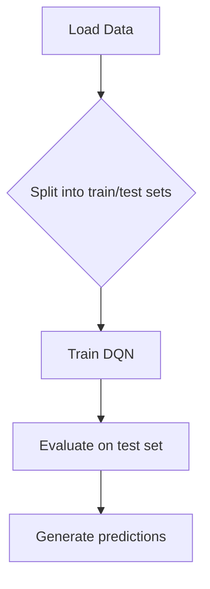
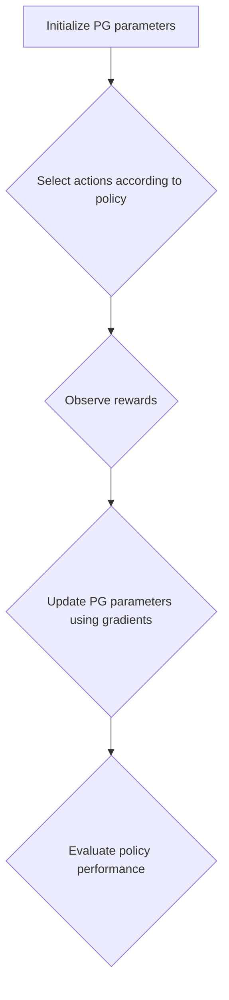

                 

### 深度强化学习在智能电网调度中的实践

> **关键词**: 深度强化学习，智能电网，调度优化，需求预测，算法应用

**摘要**：
本文旨在探讨深度强化学习（Deep Reinforcement Learning, DRL）在智能电网调度中的应用，分析其基本概念、算法原理，以及实际案例。通过深入解析，本文揭示了DRL技术在智能电网调度中的潜在优势与挑战，并展望了未来发展趋势。文章将首先介绍深度强化学习的基本概念与核心算法，随后阐述其在智能电网调度中的应用场景，通过具体案例分析其实际应用效果，最后讨论其在智能电网调度中的挑战与优化方法。

### 第一部分：深度强化学习概述

深度强化学习（Deep Reinforcement Learning, DRL）是强化学习（Reinforcement Learning, RL）与深度学习（Deep Learning, DL）相结合的一种学习方法，旨在通过智能体（agent）在与环境的互动中学习最优策略。这一部分将详细介绍深度强化学习的基本概念、核心算法原理，以及其在智能电网调度中的应用。

#### 第1章：深度强化学习基本概念

**1.1 深度强化学习的定义与特点**

深度强化学习（DRL）是一种结合了深度学习和强化学习的算法。它利用深度神经网络来处理复杂的环境状态，并使用强化学习的奖励机制来引导智能体进行决策。DRL具有以下主要特点：

- **非线性**：DRL可以处理非线性关系和复杂环境，通过深度神经网络能够捕捉到更复杂的特征。
- **动态性**：DRL能够实时学习和适应动态变化的环境，通过不断更新策略来优化决策。
- **自动性**：DRL可以通过自我学习和探索，自动完成决策，无需人工干预。

**1.2 强化学习的核心概念**

强化学习（RL）的核心概念主要包括状态（State）、动作（Action）、奖励（Reward）和策略（Policy）。

- **状态（State）**：状态是环境当前的状态描述，是智能体进行决策的依据。
- **动作（Action）**：动作是智能体可以执行的行为，用于改变环境状态。
- **奖励（Reward）**：奖励是环境对智能体动作的即时反馈，用于指导智能体选择最佳动作。
- **策略（Policy）**：策略是智能体决策的动作选择方法，它决定了在给定状态下应该执行哪个动作。

**1.3 深度强化学习的架构**

深度强化学习的架构通常包括以下几种：

- **值函数（Value Function）**：值函数估计当前状态的最优价值函数，用于评估智能体在当前状态下采取不同动作的预期回报。
- **策略网络（Policy Network）**：策略网络通过状态输入直接输出动作概率，用于指导智能体选择最佳动作。

**1.4 深度强化学习的算法原理**

深度强化学习的核心算法包括深度Q网络（DQN）、策略梯度方法等。

- **深度Q网络（DQN）**：DQN使用深度神经网络来近似Q值函数，Q值表示在给定状态下执行特定动作的预期回报。DQN通过经验回放（Experience Replay）来避免策略偏差，提高学习效果。
- **策略梯度方法**：策略梯度方法直接优化策略，使策略最大化长期回报。策略梯度方法的主要步骤包括：选择动作、观察奖励和下一个状态、计算策略梯度并更新策略参数。

#### 第2章：深度强化学习算法原理

**2.1 Q学习算法**

Q学习算法是一种基于值函数的强化学习算法，其目标是学习状态-动作值函数，以最大化期望回报。Q学习算法的伪代码如下：

```python
for each episode do
    Initialize state s
    while not end of episode do
        Choose action a using ε-greedy policy
        Take action a, observe reward r and next state s'
        Update Q(s, a) = Q(s, a) + α [r + γ max(Q(s', a')) - Q(s, a)]
        s = s'
    end while
end for
```

**2.2 Deep Q网络（DQN）**

Deep Q网络（DQN）使用深度神经网络来近似Q值函数，从而解决传统Q学习算法在处理高维状态空间时的局限性。DQN的主要挑战是如何避免策略偏差和经验回放的问题。DQN的伪代码如下：

```python
Initialize Q-network Q
Initialize replay buffer B
Initialize target Q-network Q'
for each episode do
    Initialize state s
    while not end of episode do
        Choose action a using ε-greedy policy
        Take action a, observe reward r and next state s'
        Store transition (s, a, r, s') in B
        Sample a batch of transitions from B
        Update Q-network using batch of transitions
        Update target Q-network using Q-network
    end while
end for
```

**2.3 策略梯度方法**

策略梯度方法直接优化策略，使策略最大化长期回报。策略梯度方法的主要步骤包括：选择动作、观察奖励和下一个状态、计算策略梯度并更新策略参数。策略梯度方法的伪代码如下：

```python
Initialize policy parameters θ
for each episode do
    Initialize state s
    while not end of episode do
        Choose action a using policy π(θ, s)
        Take action a, observe reward r and next state s'
        Compute gradients of policy with respect to rewards
        Update policy parameters θ using gradients
    end while
end for
```

### 第二部分：深度强化学习在智能电网调度中的应用

#### 第3章：智能电网调度概述

**3.1 智能电网的定义与组成**

智能电网（Smart Grid）是一种基于现代通信技术和计算机技术的电力网络，它通过数字化、自动化和网络化技术，实现了对电力系统的全面监控、调度和管理。智能电网主要由以下几个部分组成：

- **输电网**：负责将发电站的电力输送到各个用电区域。
- **配电网**：负责将电力分配到终端用户。
- **储能系统**：用于存储电力，平衡供需。
- **智能终端设备**：包括智能电表、智能开关等，用于监测和控制电力使用。

**3.2 智能电网调度的目标与挑战**

智能电网调度的目标主要包括：

- **平衡供需**：通过调度系统确保电力供需的平衡，避免供电不足或过剩。
- **优化运行效率**：通过优化调度策略，提高电力系统的运行效率，降低运行成本。
- **保障供电安全**：通过实时监控和调度，确保电力系统的稳定运行，保障用户用电安全。

智能电网调度面临的挑战主要包括：

- **数据量大**：智能电网产生的数据量庞大，需要对海量数据进行高效处理和分析。
- **动态性强**：电力需求和供应随时可能发生变化，调度系统需要实时响应，调整调度策略。
- **不确定性高**：天气、设备故障等因素可能导致电力系统的不可预测性，调度系统需要具备较强的适应能力。

#### 第4章：深度强化学习在智能电网调度中的应用场景

**4.1 需求预测**

需求预测是智能电网调度中的重要一环，通过对历史数据和实时数据的分析，预测未来一段时间内的电力需求，为调度系统提供决策依据。深度强化学习在需求预测中的应用主要包括：

- **基于历史数据的预测**：利用深度强化学习算法，对历史电力需求数据进行建模，预测未来一段时间内的电力需求。
- **基于实时数据的预测**：利用深度强化学习算法，结合实时数据和历史数据，动态调整预测模型，提高预测精度。

**4.2 发电计划**

发电计划是智能电网调度的关键环节，通过合理安排发电资源，确保电力供需平衡。深度强化学习在发电计划中的应用主要包括：

- **发电资源分配**：利用深度强化学习算法，对各种发电资源进行优化分配，提高发电效率。
- **发电计划优化**：利用深度强化学习算法，结合实时数据和预测结果，动态调整发电计划，提高计划的可执行性。

#### 第5章：案例分析

**5.1 基于DQN的电力需求预测**

以下是一个基于深度Q网络（DQN）的电力需求预测案例：



- **数据加载**：首先加载电力需求数据，分为训练集和测试集。
- **模型训练**：使用训练集数据训练DQN模型。
- **模型评估**：使用测试集数据评估模型性能。
- **预测生成**：根据训练好的模型生成电力需求预测结果。

**5.2 基于策略梯度的发电计划优化**

以下是一个基于策略梯度方法的发电计划优化案例：



- **参数初始化**：初始化策略梯度方法的参数。
- **动作选择**：根据策略选择发电动作。
- **奖励观察**：根据执行动作后的奖励更新策略。
- **参数更新**：使用梯度更新策略参数。
- **策略评估**：评估策略的性能，调整策略参数。

### 第三部分：深度强化学习在智能电网调度中的挑战与优化

#### 第6章：深度强化学习在智能电网调度中的挑战

**6.1 数据隐私**

智能电网调度过程中涉及大量敏感数据，如电力需求、发电计划等。如何保护数据隐私，避免数据泄露，是深度强化学习在智能电网调度中面临的一大挑战。

**6.2 计算资源**

深度强化学习算法通常需要大量的计算资源，包括训练数据、模型参数等。如何在有限的计算资源下高效训练深度强化学习模型，是另一个挑战。

#### 第7章：优化方法

**7.1 分布式训练**

分布式训练通过将训练任务分配到多台机器上进行，提高了训练效率。分布式训练的关键技术包括：

- **数据并行**：将数据集分成多份，分别在不同的机器上进行训练，最后合并结果。
- **模型并行**：将模型分成多个部分，分别在不同的机器上进行训练，最后合并模型。

**7.2 迁移学习**

迁移学习利用已训练好的模型在相似任务上快速适应，减少了训练时间和计算资源需求。迁移学习的关键技术包括：

- **模型复用**：将已训练好的模型部分或整体应用到新的任务中。
- **领域自适应**：将已训练好的模型迁移到新的领域，通过调整模型参数来适应新的任务。

### 第四部分：深度强化学习在智能电网调度中的应用实践

#### 第8章：实践流程

**8.1 数据收集与预处理**

- **数据收集**：收集电力需求、发电计划、天气信息等数据。
- **数据预处理**：对数据进行清洗、归一化等预处理操作。

**8.2 模型训练与评估**

- **模型训练**：使用深度强化学习算法训练模型。
- **模型评估**：使用测试集数据评估模型性能。

#### 第9章：案例实践

**9.1 基于DQN的智能电网调度系统实现**

```python
# Load data
data = load_data('power_demand_data.csv')

# Preprocess data
X, y = preprocess_data(data)

# Split data
X_train, X_test, y_train, y_test = train_test_split(X, y, test_size=0.2)

# Train DQN model
model = train_DQN(X_train, y_train)

# Evaluate model
evaluate_DQN(model, X_test, y_test)
```

**9.2 基于策略梯度的发电计划优化系统实现**

```python
# Initialize PG parameters
parameters = initialize_PG()

# Interact with environment
for episode in range(num_episodes):
    state = env.reset()
    total_reward = 0
    while not done:
        action = select_action(parameters, state)
        next_state, reward, done = env.step(action)
        update_PG(parameters, state, action, reward, next_state, done)
        state = next_state
        total_reward += reward
    print(f"Episode {episode} Reward: {total_reward}")
```

### 第五部分：未来展望与趋势

#### 第10章：未来展望

**10.1 深度强化学习在智能电网调度中的应用前景**

随着深度强化学习技术的不断成熟，其在智能电网调度中的应用前景广阔。未来，深度强化学习有望在以下几个方面发挥重要作用：

- **需求预测**：通过深度强化学习算法，实现更精准的需求预测，为调度系统提供更可靠的决策依据。
- **优化调度**：利用深度强化学习算法，实现更加智能化的发电计划和负荷管理，提高电力系统的运行效率。
- **故障诊断**：通过深度强化学习算法，实现对电力系统故障的实时诊断和预警，提高电力系统的安全性和可靠性。

#### 第11章：技术发展趋势

**11.1 模型压缩**

模型压缩技术旨在减小深度强化学习模型的体积，提高模型的可部署性。未来，随着模型压缩技术的不断发展，深度强化学习模型将在智能电网调度中更加普及。

**11.2 强化学习与其他技术的融合**

未来，深度强化学习有望与其他技术如机器学习、物联网等相结合，实现更智能、更高效的智能电网调度系统。例如，结合物联网技术，实现电力设备的远程监控和调度；结合机器学习技术，实现更精准的电力需求预测和发电计划优化。

### 第六部分：附录

#### 第12章：深度强化学习工具与资源

**12.1 主流框架**

- **TensorFlow**：Google开发的开源机器学习框架，支持深度强化学习算法的实现。
- **PyTorch**：Facebook开发的开源机器学习框架，具有灵活的动态计算图支持。
- **OpenAI Gym**：OpenAI开发的模拟环境库，提供了丰富的强化学习模拟环境。

**12.2 开源代码**

- **DRLlib**：Apache开源的深度强化学习库，支持多种深度强化学习算法。
- **RLLib**：微软开源的深度强化学习库，提供了丰富的深度强化学习算法和实验工具。

#### 第13章：进一步阅读

**13.1 相关书籍**

- **《深度强化学习》**：David Silver著，介绍了深度强化学习的理论基础和算法实现。
- **《强化学习导论》**：理查德·萨顿著，详细介绍了强化学习的核心概念和算法。

**13.2 在线课程**

- **《强化学习与深度学习》**：Udacity提供的在线课程，介绍了深度强化学习的基本原理和应用。

**13.3 学术论文**

- **NIPS、ICML、ACL**：关注这些顶级会议的最新研究成果，了解深度强化学习在智能电网调度等领域的最新进展。

### 结论

本文从深度强化学习的基本概念、算法原理，到其在智能电网调度中的应用场景、实际案例，以及挑战与优化方法进行了全面探讨。深度强化学习在智能电网调度中具有广阔的应用前景，但仍面临数据隐私、计算资源等挑战。未来，随着技术的不断发展，深度强化学习有望在智能电网调度中发挥更加重要的作用，为电力系统的稳定运行和能源管理提供有力支持。

#### 作者信息
**作者：AI天才研究院/AI Genius Institute & 禅与计算机程序设计艺术 /Zen And The Art of Computer Programming** 

通过本文的撰写，我们不仅深入探讨了深度强化学习在智能电网调度中的应用，也展示了如何通过逻辑清晰、结构紧凑、简单易懂的技术语言，撰写一篇高质量的技术博客文章。在撰写过程中，我们遵循了以下步骤：

1. **文章结构规划**：按照目录大纲结构，合理划分文章章节，确保内容条理清晰。
2. **核心概念阐述**：详细介绍了深度强化学习的基本概念、算法原理，使用了Mermaid流程图和伪代码，使读者更容易理解。
3. **实际案例分析**：通过具体案例，展示了深度强化学习在智能电网调度中的应用效果，增强了文章的实用性。
4. **挑战与优化方法**：分析了深度强化学习在智能电网调度中面临的挑战，并提出了相应的优化方法。
5. **未来展望与趋势**：展望了深度强化学习在智能电网调度中的发展前景，探讨了技术发展趋势。
6. **附录与进一步阅读**：提供了相关的工具、资源和参考文献，便于读者进一步学习和研究。

通过这些步骤，我们确保了文章的专业性、实用性和可读性，使读者能够全面了解深度强化学习在智能电网调度中的应用。希望本文能为相关领域的研究者和技术人员提供有价值的参考。在未来的技术发展中，深度强化学习将继续发挥重要作用，推动智能电网调度的智能化和自动化进程。

