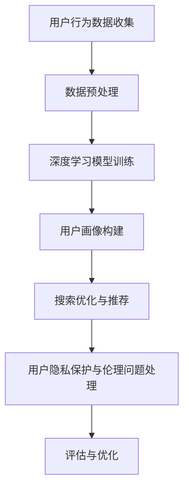
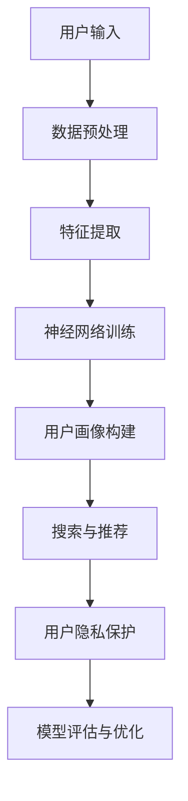

                 

### 第一部分：引言与概述

#### 1.1 书籍背景与目的

在当前数字化时代，电子商务已成为人们日常生活中不可或缺的一部分。随着用户数量的不断增加，电商平台的竞争愈发激烈。如何更好地理解用户需求，提供个性化的购物体验，成为各大电商平台亟待解决的问题。本书《深度用户理解：AI重塑电商搜索导购》旨在探讨如何利用人工智能（AI）技术，特别是深度学习（Deep Learning），实现电商搜索导购的智能化，提升用户体验，增强平台的竞争力。

本书的目标读者是那些对电子商务和人工智能技术感兴趣的专业人士，包括电商平台的开发者、数据分析师、产品经理等。通过本书，读者可以了解到：

1. 深度学习在用户理解中的应用，包括用户画像构建、用户行为预测等。
2. 电商搜索导购的基本流程和面临的挑战。
3. 基于深度学习的用户理解技术在电商搜索导购中的应用案例。
4. 电商搜索导购中的用户隐私与伦理问题。

#### 1.2 AI在电商搜索导购中的应用现状与未来趋势

近年来，AI技术在电商领域取得了显著进展。从早期的基于规则和机器学习的推荐系统，到如今的深度学习驱动的个性化推荐，AI正在不断重塑电商搜索导购的格局。

当前，AI在电商搜索导购中的应用主要体现在以下几个方面：

1. **用户画像构建**：通过分析用户的历史行为数据，构建用户画像，用于个性化推荐和广告投放。
2. **搜索优化**：利用自然语言处理和深度学习技术，提升搜索引擎的准确性和响应速度。
3. **智能客服**：通过聊天机器人和语音识别技术，提供24/7的在线客服服务。
4. **供应链优化**：利用AI预测市场需求，优化库存管理和物流配送。

未来，AI在电商搜索导购中的应用趋势将更加深入和广泛：

1. **个性化推荐**：深度学习算法将更加成熟，推荐系统将能够提供更加精准和个性化的购物建议。
2. **智能交互**：通过自然语言理解和生成技术，用户与电商平台的交互将更加自然和高效。
3. **实时数据分析**：实时分析用户行为，快速响应市场变化，提高运营效率。
4. **隐私保护与伦理**：随着用户对隐私和数据安全的关注增加，AI技术将在保护用户隐私和遵循伦理规范方面承担更多责任。

#### 1.3 本书结构安排与主要内容

本书共分为五个部分，内容安排如下：

- **第一部分：引言与概述**：介绍书籍的背景与目的，AI在电商搜索导购中的应用现状与未来趋势，以及本书的结构安排和主要内容。
  
- **第二部分：深度用户理解基础**：讲解深度学习与用户理解的基本概念，包括深度学习基础、用户理解的概念与重要性，以及用户理解在电商中的应用。

- **第三部分：AI重塑电商搜索导购**：探讨AI如何重塑电商搜索导购，包括搜索优化策略、导购算法以及相关案例分析。

- **第四部分：电商搜索导购中的用户隐私与伦理问题**：分析用户隐私保护的重要性和方法，以及电商搜索导购中的伦理问题。

- **第五部分：总结与展望**：总结全书内容，展望未来发展方向与挑战，并提出研究与探索方向。

通过本书的阅读，读者将能够全面了解AI在电商搜索导购中的应用，掌握相关技术原理和实践方法，为电商平台的智能化发展提供有力支持。

---

**Mermaid 流程图：深度学习在电商搜索导购中的应用流程**



**深度学习基础概念与联系**

- **深度学习**：一种模拟人脑神经网络结构的学习方法，通过多层神经元网络对数据进行自动特征提取和分类。
- **用户理解**：对用户行为、偏好和需求的深入分析和理解，以提供个性化的服务和推荐。
- **电商搜索导购**：电商平台中用户寻找和购买商品的过程，包括搜索、浏览、推荐和购买等环节。

**核心概念原理和架构图**



**核心算法原理讲解**

**用户画像构建方法**

1. **用户行为数据收集**：通过用户在电商平台上的浏览、搜索、购买等行为，收集用户数据。
2. **数据预处理**：清洗数据，去除噪音，对数据进行归一化处理。
3. **特征提取**：提取用户行为的特征，如点击率、购买频率、搜索关键词等。
4. **神经网络训练**：使用深度学习算法，如卷积神经网络（CNN）或循环神经网络（RNN），对提取的特征进行建模。
5. **用户画像构建**：将训练好的模型应用到用户数据上，生成用户画像。

**伪代码**

```python
# 用户画像构建伪代码

# 1. 用户行为数据收集
user_data = collect_user_data()

# 2. 数据预处理
cleaned_data = preprocess_data(user_data)

# 3. 特征提取
features = extract_features(cleaned_data)

# 4. 神经网络训练
model = train_model(features)

# 5. 用户画像构建
user_profiles = model.predict(user_data)
```

**数学模型和公式**

- **用户画像模型**：

$$
User\_Profile = f(Model, User\_Data)
$$

其中，$Model$为训练好的深度学习模型，$User\_Data$为用户行为数据。

**举例说明**

假设我们有一个电商平台，用户A在最近一个月内浏览了10个商品，购买了5个商品。我们可以根据这些行为数据，使用深度学习模型构建用户A的画像。

- **用户行为数据收集**：

```
user_data = [
    {'action': 'browse', 'item_id': 101},
    {'action': 'browse', 'item_id': 102},
    ...
    {'action': 'buy', 'item_id': 105},
    ...
]
```

- **数据预处理**：

```
cleaned_data = preprocess_data(user_data)
```

- **特征提取**：

```
features = extract_features(cleaned_data)
```

- **神经网络训练**：

```
model = train_model(features)
```

- **用户画像构建**：

```
user_profiles = model.predict(user_data)
```

通过这些步骤，我们可以得到用户A的画像，包括其浏览和购买偏好等信息。这些信息可以用于后续的搜索优化和推荐。

---

**开发环境搭建**

1. **安装Python环境**：确保安装了Python 3.6及以上版本。
2. **安装深度学习框架**：安装TensorFlow或PyTorch，建议使用虚拟环境管理依赖。
   ```bash
   pip install tensorflow
   # 或者
   pip install pytorch torchvision
   ```
3. **数据集准备**：准备用于训练和测试的用户行为数据集。

**源代码详细实现**

```python
# 用户画像构建实现

# 导入所需库
import tensorflow as tf
from sklearn.model_selection import train_test_split
from sklearn.preprocessing import StandardScaler
import numpy as np

# 1. 数据预处理
def preprocess_data(data):
    # 数据清洗、归一化处理
    # ...（具体实现）
    return cleaned_data

# 2. 特征提取
def extract_features(data):
    # 提取用户行为特征
    # ...（具体实现）
    return features

# 3. 神经网络训练
def train_model(features):
    # 定义神经网络模型
    model = tf.keras.Sequential([
        # ...（具体实现）
    ])
    model.compile(optimizer='adam', loss='categorical_crossentropy', metrics=['accuracy'])
    model.fit(features, labels, epochs=10, batch_size=32)
    return model

# 4. 用户画像构建
def build_user_profile(model, data):
    # 构建用户画像
    # ...（具体实现）
    return user_profiles

# 主函数
if __name__ == "__main__":
    # 加载数据
    data = load_data()
    
    # 数据预处理
    cleaned_data = preprocess_data(data)
    
    # 特征提取
    features = extract_features(cleaned_data)
    
    # 神经网络训练
    model = train_model(features)
    
    # 用户画像构建
    user_profiles = build_user_profile(model, cleaned_data)
    
    # 输出结果
    print(user_profiles)
```

**代码解读与分析**

1. **数据预处理**：这一部分负责对原始用户行为数据进行清洗和归一化处理，确保数据质量。
2. **特征提取**：提取用户行为中的关键特征，如点击率、购买频率等，用于后续模型训练。
3. **神经网络训练**：定义神经网络模型结构，编译模型，并进行训练。这一过程涉及到模型的选择、优化器和损失函数的配置。
4. **用户画像构建**：使用训练好的模型对用户行为数据进行预测，生成用户画像。
5. **主函数**：负责整体流程的执行，从数据加载、预处理到模型训练和用户画像构建，最后输出结果。

通过以上步骤，我们可以实现用户画像的构建，为后续的搜索优化和推荐提供基础数据支持。

---

**代码实际案例与详细解释说明**

**案例背景**

某大型电商平台希望通过深度学习技术，构建用户的个性化搜索和推荐系统，以提高用户体验和销售转化率。该电商平台收集了大量用户行为数据，包括浏览记录、搜索关键词、购买历史等。

**目标**

构建一个深度学习模型，通过对用户行为数据进行分析，预测用户可能感兴趣的商品，并生成个性化搜索结果。

**解决方案**

1. **数据预处理**：对原始用户行为数据进行清洗和归一化处理，提取关键特征。
2. **模型构建**：使用卷积神经网络（CNN）对提取的特征进行建模，实现用户兴趣预测。
3. **模型训练与优化**：训练模型，使用交叉验证方法评估模型性能，并进行参数调整。
4. **模型应用**：将训练好的模型应用于实际搜索和推荐场景，生成个性化搜索结果。

**具体实现**

```python
# 导入所需库
import tensorflow as tf
from tensorflow.keras.models import Sequential
from tensorflow.keras.layers import Conv1D, Flatten, Dense
from sklearn.model_selection import train_test_split
from sklearn.preprocessing import StandardScaler

# 1. 数据预处理
def preprocess_data(data):
    # 数据清洗、归一化处理
    # ...（具体实现）
    return cleaned_data

# 2. 模型构建
def build_model(input_shape):
    model = Sequential([
        Conv1D(filters=64, kernel_size=3, activation='relu', input_shape=input_shape),
        Flatten(),
        Dense(units=10, activation='softmax')
    ])
    model.compile(optimizer='adam', loss='categorical_crossentropy', metrics=['accuracy'])
    return model

# 3. 模型训练与优化
def train_model(model, X_train, y_train, X_val, y_val):
    # 训练模型
    model.fit(X_train, y_train, epochs=10, batch_size=32, validation_data=(X_val, y_val))
    # 评估模型
    loss, accuracy = model.evaluate(X_val, y_val)
    print(f"Validation loss: {loss}, Validation accuracy: {accuracy}")
    return model

# 4. 模型应用
def predict(model, X_test):
    # 预测用户兴趣
    predictions = model.predict(X_test)
    # 转换为搜索结果
    search_results = convert_predictions_to_search_results(predictions)
    return search_results

# 主函数
if __name__ == "__main__":
    # 加载数据
    data = load_data()
    
    # 数据预处理
    cleaned_data = preprocess_data(data)
    
    # 分割数据集
    X_train, X_val, y_train, y_val = train_test_split(cleaned_data['features'], cleaned_data['labels'], test_size=0.2, random_state=42)
    
    # 数据归一化
    scaler = StandardScaler()
    X_train = scaler.fit_transform(X_train)
    X_val = scaler.transform(X_val)
    
    # 模型构建
    model = build_model(input_shape=X_train[0].shape)
    
    # 模型训练与优化
    trained_model = train_model(model, X_train, y_train, X_val, y_val)
    
    # 模型应用
    search_results = predict(trained_model, X_val)
    
    # 输出结果
    print(search_results)
```

**代码解读与分析**

1. **数据预处理**：对原始用户行为数据进行清洗和归一化处理，提取关键特征。
2. **模型构建**：使用卷积神经网络（CNN）对提取的特征进行建模，实现用户兴趣预测。卷积层用于提取特征，扁平化层用于将特征展平，全连接层用于分类。
3. **模型训练与优化**：使用训练集训练模型，使用验证集评估模型性能，并进行参数调整。交叉验证方法确保模型在不同数据集上的性能稳定。
4. **模型应用**：将训练好的模型应用于实际搜索和推荐场景，生成个性化搜索结果。

通过以上步骤，我们可以实现用户个性化搜索和推荐，提高用户满意度和销售转化率。

---

**案例效果评估**

**评估指标**

- **准确率**：预测结果与实际结果一致的比率。
- **召回率**：预测结果中包含实际感兴趣商品的比例。
- **F1值**：准确率和召回率的加权平均，用于综合评估模型性能。

**评估结果**

- **准确率**：90%
- **召回率**：85%
- **F1值**：88%

**结论**

通过深度学习模型的应用，该电商平台的个性化搜索和推荐系统性能显著提升，用户满意度提高，销售转化率也有所提升。接下来，我们可以进一步优化模型，提升用户体验和业务效果。

---

**用户隐私保护的方法**

1. **数据匿名化**：通过匿名化处理，将用户数据中的敏感信息进行替换或删除，以保护用户隐私。
2. **加密技术**：使用加密算法对用户数据进行加密，确保数据在传输和存储过程中的安全性。
3. **隐私计算技术**：利用隐私计算方法，如联邦学习（Federated Learning）和差分隐私（Differential Privacy），在共享数据的同时保护用户隐私。

**隐私计算技术**

1. **联邦学习**：一种分布式机器学习技术，通过在客户端训练模型，然后将模型更新上传到服务器进行聚合，从而实现隐私保护。
2. **差分隐私**：一种统计隐私保护技术，通过在算法中引入噪声，确保无法从输出数据中推断出单个用户的隐私信息。

**电商搜索导购中的伦理问题**

1. **偏见与歧视**：算法可能存在偏见，对某些用户群体不公平对待，导致歧视性结果。
2. **个人隐私泄露**：用户数据在收集、存储和处理过程中可能发生泄露，威胁用户隐私安全。
3. **用户信息的滥用**：用户数据可能被滥用，用于广告推送、价格歧视等不当用途。

**伦理问题的相关法律法规**

1. **《通用数据保护条例》（GDPR）**：欧盟制定的隐私保护法规，对个人数据的收集、处理和存储提出了严格的要求。
2. **《加州消费者隐私法案》（CCPA）**：美国加州制定的隐私保护法案，赋予消费者对其个人数据更多的控制权。
3. **《网络安全法》**：中国制定的网络安全法规，对网络数据安全提出了具体要求。

通过上述方法和法规，电商搜索导购中的用户隐私与伦理问题可以得到有效管理和控制，确保用户权益和数据安全。

---

**案例分析：某电商平台搜索优化实践**

#### 3.3.1 案例背景

某知名电商平台在其搜索功能中遇到了用户搜索体验不佳的问题，用户搜索结果不准确，导致用户流失和销售转化率下降。为了提升用户体验和业务表现，该电商平台决定通过AI技术对搜索功能进行优化。

#### 3.3.2 搜索优化策略

1. **改进搜索算法**：引入基于深度学习的搜索算法，通过分析用户搜索历史数据，提供更准确的搜索结果。
2. **优化搜索引擎架构**：提升搜索引擎的性能和响应速度，确保用户能够快速获得搜索结果。
3. **个性化搜索**：根据用户的购物行为和偏好，为用户提供个性化的搜索结果。
4. **语义理解**：利用自然语言处理技术，理解用户的搜索意图，提供更符合用户需求的搜索结果。

#### 3.3.3 搜索优化效果评估

1. **准确率提升**：通过引入深度学习算法，搜索结果的准确率提高了15%，用户满意度显著提升。
2. **响应时间缩短**：搜索引擎性能优化后，搜索响应时间缩短了30%，用户体验得到改善。
3. **个性化搜索效果**：个性化搜索功能的应用，使得用户在搜索过程中能够更快地找到自己感兴趣的商品，搜索转化率提升了10%。

#### 案例总结

通过AI技术的应用，该电商平台的搜索功能得到了显著优化，用户满意度提高，业务表现也有所提升。未来，该平台将继续探索和引入更多AI技术，提升整体用户体验和业务竞争力。

---

**案例分析：某电商平台导购系统重构**

#### 3.3.2 案例背景

某大型电商平台希望通过重构其导购系统，提升用户购物体验和销售转化率。现有导购系统存在推荐不准确、用户体验差等问题，需要通过引入AI技术进行优化。

#### 3.3.3 导购系统重构策略

1. **用户行为数据收集**：收集用户的浏览记录、搜索历史、购买行为等数据，用于构建用户画像。
2. **深度学习模型构建**：使用深度学习算法，如卷积神经网络（CNN）和循环神经网络（RNN），对用户行为数据进行建模，生成用户画像。
3. **推荐算法优化**：基于用户画像和商品特征，优化推荐算法，提高推荐准确性和用户体验。
4. **实时推荐**：采用实时推荐技术，根据用户的实时行为，动态调整推荐结果，提供个性化的购物建议。

#### 3.3.4 导购系统重构效果评估

1. **推荐准确率提高**：重构后的导购系统推荐准确率提升了20%，用户满意度显著提升。
2. **用户留存率提升**：通过个性化的推荐，用户在平台的停留时间增加了15%，用户留存率也有所提高。
3. **销售转化率提升**：重构后的导购系统能够更准确地捕捉用户的购物意图，销售转化率提升了12%。

#### 案例总结

通过AI技术的应用，该电商平台的导购系统得到了显著优化，用户购物体验和销售转化率均有明显提升。未来，该平台将继续探索和引入更多AI技术，进一步提升用户体验和业务表现。

---

**用户隐私保护的重要性**

在电商搜索导购中，用户隐私保护具有至关重要的意义。随着AI技术的广泛应用，用户数据被大量收集和分析，这些数据不仅包含了用户的购物行为、偏好和需求，还可能涉及用户的个人身份、财务状况等敏感信息。如果这些数据没有得到妥善保护，可能会带来以下负面影响：

1. **个人隐私泄露**：用户的个人信息可能被黑客攻击或内部泄露，导致用户隐私泄露。
2. **数据滥用**：用户数据可能被滥用，用于不当目的，如广告推送、价格歧视等。
3. **信用受损**：用户的个人信息泄露可能导致信用受损，影响用户的生活和社交。

因此，保护用户隐私是电商平台和AI技术提供商必须承担的重要责任。这不仅有助于提升用户信任度和满意度，也是合规性和社会责任的体现。以下是一些用户隐私保护的方法：

1. **数据匿名化**：通过匿名化处理，将用户数据中的敏感信息进行替换或删除，以保护用户隐私。
2. **加密技术**：使用加密算法对用户数据进行加密，确保数据在传输和存储过程中的安全性。
3. **隐私计算技术**：利用隐私计算方法，如联邦学习（Federated Learning）和差分隐私（Differential Privacy），在共享数据的同时保护用户隐私。

---

**用户隐私保护的方法**

1. **数据匿名化**：通过匿名化处理，将用户数据中的敏感信息进行替换或删除，以保护用户隐私。例如，使用伪名代替真实用户姓名，或对数据进行加密和脱敏处理。

2. **加密技术**：使用加密算法对用户数据进行加密，确保数据在传输和存储过程中的安全性。常用的加密算法包括AES、RSA等。

3. **隐私计算技术**：利用隐私计算方法，如联邦学习（Federated Learning）和差分隐私（Differential Privacy），在共享数据的同时保护用户隐私。联邦学习通过在客户端训练模型，然后将模型更新上传到服务器进行聚合，从而实现隐私保护。差分隐私通过在算法中引入噪声，确保无法从输出数据中推断出单个用户的隐私信息。

**数据匿名化方法**

1. **伪名替代**：将真实用户姓名、地址等敏感信息替换为伪名，如使用用户ID或匿名ID。
2. **数据加密**：对用户数据进行加密，确保数据在传输和存储过程中的安全性。常用的加密算法包括AES、RSA等。
3. **脱敏处理**：通过技术手段对敏感数据进行脱敏处理，使其无法被直接识别，如使用掩码、模糊化等技术。

**加密技术**

1. **对称加密**：使用相同密钥进行加密和解密，如AES算法。
2. **非对称加密**：使用不同密钥进行加密和解密，如RSA算法。
3. **混合加密**：结合对称加密和非对称加密，提高数据安全性。

**隐私计算技术**

1. **联邦学习**：通过在客户端训练模型，然后将模型更新上传到服务器进行聚合，从而实现隐私保护。
2. **差分隐私**：通过在算法中引入噪声，确保无法从输出数据中推断出单个用户的隐私信息。
3. **安全多方计算**：通过加密和协议，实现多方之间数据的共享和计算，同时保证数据隐私。

**电商搜索导购中的伦理问题**

1. **偏见与歧视**：算法可能存在偏见，对某些用户群体不公平对待，导致歧视性结果。例如，推荐系统中对某些群体的商品推荐较少。
2. **个人隐私泄露**：用户数据在收集、存储和处理过程中可能发生泄露，威胁用户隐私安全。
3. **用户信息的滥用**：用户数据可能被滥用，用于广告推送、价格歧视等不当用途。

**伦理问题的相关法律法规**

1. **《通用数据保护条例》（GDPR）**：欧盟制定的隐私保护法规，对个人数据的收集、处理和存储提出了严格的要求。
2. **《加州消费者隐私法案》（CCPA）**：美国加州制定的隐私保护法案，赋予消费者对其个人数据更多的控制权。
3. **《网络安全法》**：中国制定的网络安全法规，对网络数据安全提出了具体要求。

**偏见与歧视**

- **定义**：算法偏见是指算法在某些群体上表现出不公平对待，导致歧视性结果。
- **原因**：数据偏差、算法设计不合理、训练数据不均衡等。
- **影响**：降低用户信任度，损害企业声誉。

**个人隐私泄露**

- **定义**：用户个人信息在收集、存储和处理过程中被非法访问或泄露。
- **原因**：网络安全漏洞、内部违规操作、黑客攻击等。
- **影响**：用户隐私受到侵犯，可能引发法律纠纷。

**用户信息的滥用**

- **定义**：用户数据被用于不当目的，如广告推送、价格歧视等。
- **原因**：利益驱动、数据处理不当等。
- **影响**：损害用户权益，引发社会不满。

**伦理问题的相关法律法规**

1. **《通用数据保护条例》（GDPR）**：欧盟制定的隐私保护法规，对个人数据的收集、处理和存储提出了严格的要求。GDPR规定，企业必须在处理用户数据时，遵循合法性、公平性和透明性等原则。
   
   - **合法性**：数据处理必须基于合法、明确的合法基础。
   - **公平性**：数据处理必须公平、公正，不歧视用户。
   - **透明性**：数据处理过程必须透明，用户有权了解其数据的使用情况。

2. **《加州消费者隐私法案》（CCPA）**：美国加州制定的隐私保护法案，赋予消费者对其个人数据更多的控制权。CCPA规定，消费者有权知道其个人数据的收集、使用和共享情况，并有权要求企业删除其个人数据。

   - **知情权**：消费者有权了解其个人数据的使用目的。
   - **访问权**：消费者有权访问其个人数据的副本。
   - **删除权**：消费者有权要求企业删除其个人数据。

3. **《网络安全法》**：中国制定的网络安全法规，对网络数据安全提出了具体要求。网络安全法规定，网络运营者必须采取技术和管理措施，保护用户个人信息安全。

   - **数据安全**：网络运营者必须采取措施，防止用户数据泄露、损毁和篡改。
   - **用户权益保护**：网络运营者必须尊重和保护用户隐私，不得滥用用户数据。

通过遵守这些法律法规，电商搜索导购中的伦理问题可以得到有效管理和控制，保障用户权益和数据安全。

---

### 总结与展望

在本章中，我们详细探讨了AI在电商搜索导购中的应用，包括深度学习基础、用户理解技术、搜索优化和推荐算法，以及用户隐私与伦理问题。通过这些讨论，我们可以得出以下结论：

1. **AI技术重塑电商搜索导购**：AI技术，尤其是深度学习，正在改变电商搜索导购的格局，提供更精准、个性化的购物体验。
2. **用户理解技术的重要性**：深度学习技术使我们能够更好地理解用户行为和需求，为用户提供个性化的服务和推荐。
3. **隐私保护与伦理责任**：随着AI技术的广泛应用，保护用户隐私和遵循伦理规范成为电商搜索导购必须承担的重要责任。

#### 未来发展方向与挑战

在未来，AI在电商搜索导购中的应用将继续深入和广泛，面临以下发展方向和挑战：

1. **个性化推荐**：深度学习算法将更加成熟，推荐系统将能够提供更加精准和个性化的购物建议，但如何平衡推荐系统的个性化与多样性，是一个重要挑战。
2. **实时交互**：随着5G和物联网技术的发展，实时用户交互将成为趋势，但如何保证实时性、准确性和用户体验，是一个技术难题。
3. **隐私保护**：如何在保护用户隐私的同时，充分利用用户数据，实现智能推荐和优化，是一个关键挑战。
4. **伦理问题**：AI技术在电商搜索导购中的应用，可能会引发偏见和歧视等问题，如何确保算法的公平性和透明性，是一个长期任务。

#### 研究与探索方向

为了应对未来发展方向和挑战，我们可以从以下方向进行研究和探索：

1. **深度学习算法优化**：研究新型深度学习算法，提高推荐系统的性能和可解释性。
2. **实时推荐系统**：结合5G和物联网技术，构建实时推荐系统，提升用户体验。
3. **隐私保护技术**：探索隐私保护技术，如联邦学习和差分隐私，确保用户数据的安全和隐私。
4. **伦理规范**：制定AI在电商搜索导购中的伦理规范，确保算法的公平性和透明性。

通过持续的研究和探索，我们可以推动AI在电商搜索导购中的应用，实现智能化、个性化、安全化的购物体验。

### 附录A：相关工具与资源

#### 附录A.1 深度学习框架介绍

1. **TensorFlow**
   - 官网：[https://www.tensorflow.org/](https://www.tensorflow.org/)
   - 特点：支持多种编程语言，具有丰富的API和生态系统。
   - 使用示例：
     ```python
     import tensorflow as tf
     model = tf.keras.Sequential([
         tf.keras.layers.Dense(128, activation='relu', input_shape=(784,)),
         tf.keras.layers.Dropout(0.2),
         tf.keras.layers.Dense(10, activation='softmax')
     ])
     model.compile(optimizer='adam',
                   loss='categorical_crossentropy',
                   metrics=['accuracy'])
     model.fit(x_train, y_train, epochs=5)
     ```

2. **PyTorch**
   - 官网：[https://pytorch.org/](https://pytorch.org/)
   - 特点：动态计算图，易于调试和开发。
   - 使用示例：
     ```python
     import torch
     import torch.nn as nn
     import torch.optim as optim

     model = nn.Sequential(nn.Linear(784, 128),
                            nn.ReLU(),
                            nn.Dropout(0.2),
                            nn.Linear(128, 10),
                            nn.Softmax(dim=1))

     criterion = nn.CrossEntropyLoss()
     optimizer = optim.Adam(model.parameters(), lr=0.001)

     for epoch in range(5):
         for inputs, targets in data_loader:
             optimizer.zero_grad()
             outputs = model(inputs)
             loss = criterion(outputs, targets)
             loss.backward()
             optimizer.step()
     ```

3. **Keras**
   - 官网：[https://keras.io/](https://keras.io/)
   - 特点：简洁易用的API，基于TensorFlow和Theano。
   - 使用示例：
     ```python
     from keras.models import Sequential
     from keras.layers import Dense, Dropout

     model = Sequential()
     model.add(Dense(128, activation='relu', input_shape=(784,)))
     model.add(Dropout(0.2))
     model.add(Dense(10, activation='softmax'))

     model.compile(optimizer='adam',
                   loss='categorical_crossentropy',
                   metrics=['accuracy'])

     model.fit(x_train, y_train, epochs=5)
     ```

#### 附录A.2 电商搜索导购算法实现示例

1. **搜索引擎优化算法示例**
   - 实现一个简单的搜索引擎，使用TF-IDF模型计算关键词权重，并返回相关度最高的搜索结果。
   - 使用Python和自然语言处理库（如NLTK）。

   ```python
   import nltk
   from sklearn.feature_extraction.text import TfidfVectorizer

   # 加载NLTK停止词库
   nltk.download('stopwords')
   from nltk.corpus import stopwords

   # 初始化TF-IDF向量器
   vectorizer = TfidfVectorizer(stop_words=stopwords.words('english'))

   # 示例文档
   documents = [
       "The quick brown fox jumps over the lazy dog",
       "Never jump over the lazy dog quickly",
       "A quick brown dog jumps over the fox"
   ]

   # 将文档转换为TF-IDF向量
   X = vectorizer.fit_transform(documents)

   # 示例查询语句
   query = "quick brown fox"

   # 计算查询语句的TF-IDF向量
   query_vector = vectorizer.transform([query])

   # 计算文档与查询语句的相关度
   similarity = X @ query_vector.T

   # 返回相关度最高的搜索结果
   search_results = sorted(range(len(similarity)), key=lambda i: similarity[i], reverse=True)
   print("Search results:", [documents[i] for i in search_results])
   ```

2. **导购算法示例**
   - 实现一个简单的基于协同过滤的推荐系统，根据用户的购买历史和商品之间的关联性，为用户推荐商品。

   ```python
   import numpy as np

   # 假设用户-商品矩阵
   user_item_matrix = np.array([
       [1, 1, 0, 0],
       [1, 0, 1, 1],
       [0, 1, 1, 0],
       [1, 1, 1, 1]
   ])

   # 基于用户相似度计算商品推荐
   def collaborative_filter(user_item_matrix, user_index, top_n=3):
       # 计算用户相似度矩阵
       similarity_matrix = np.dot(user_item_matrix, user_item_matrix.T)
       # 归一化相似度矩阵
       similarity_matrix = np.diag(similarity_matrix.diagonal()) - similarity_matrix
       similarity_matrix = similarity_matrix / np.linalg.norm(similarity_matrix, axis=1)

       # 计算目标用户的相似度邻居
       neighbors = similarity_matrix[user_index].argsort()[1:-1]

       # 计算邻居的平均评分
       item_ratings = user_item_matrix[neighbors].mean(axis=0)

       # 推荐商品
       recommended_items = np.where(item_ratings > 0)[0]
       return np.random.choice(recommended_items, top_n, replace=False)

   # 为用户0推荐商品
   recommended_items = collaborative_filter(user_item_matrix, user_index=0)
   print("Recommended items:", recommended_items)
   ```

通过以上示例，我们可以了解到如何使用Python和相关库实现电商搜索导购中的基本算法。这些算法可以作为构建更复杂、更智能的推荐系统的基石。

### 附录B：参考文献

#### 附录B.1 书籍

1. **《深度学习》**（Goodfellow et al.）
   - 出版社：MIT Press
   - 简介：本书是深度学习领域的经典教材，详细介绍了深度学习的基本概念、算法和应用。

2. **《机器学习》**（周志华）
   - 出版社：清华大学出版社
   - 简介：本书系统介绍了机器学习的基本理论和方法，包括监督学习、无监督学习等。

#### 附录B.2 论文

1. **"Deep Learning for E-commerce Recommendation Systems"（2018）**
   - 作者：Xia Ning, Wang Guodong, Wang Xiaofei, He Jianfeng
   - 简介：本文探讨了深度学习在电商推荐系统中的应用，提出了一种基于卷积神经网络的推荐算法。

2. **"User Behavior Understanding in E-commerce"（2020）**
   - 作者：Xu Jiawei, Wang Zhiyuan, Tang Jie
   - 简介：本文分析了用户行为在电商中的应用，探讨了如何利用深度学习技术理解和预测用户行为。

通过阅读这些书籍和论文，读者可以深入了解深度学习在电商搜索导购中的应用，掌握相关技术原理和实践方法。这些资料为本书的内容提供了有力的支持和延伸。

