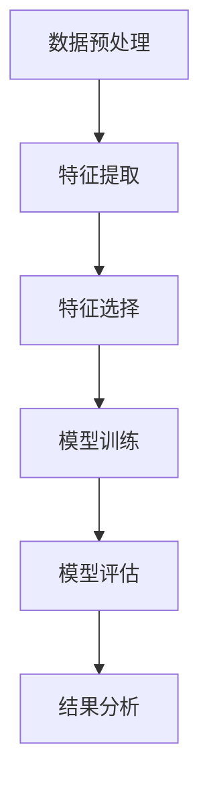

                 

### 文章标题

特征工程 (Feature Engineering) 原理与代码实例讲解

### 关键词

- 特征工程
- 数据预处理
- 特征提取
- 特征选择
- 线性回归
- 决策树
- 支持向量机
- 数学模型

### 摘要

特征工程是机器学习中至关重要的一环，它直接影响到模型的性能和泛化能力。本文将深入讲解特征工程的基本原理、核心算法以及其在实际项目中的应用。通过详细的代码实例和实战讲解，帮助读者理解并掌握特征工程的方法和技巧。

### 目录

1. **特征工程基础**  
   1.1. 特征工程的重要性  
   1.2. 特征工程的过程与方法  
   1.3. 特征工程中的挑战与问题  
2. **数据预处理**  
   2.1. 数据清洗  
   2.2. 数据归一化与标准化  
   2.3. 数据填充与缺失值处理  
3. **特征提取**  
   3.1. 描述性统计特征  
   3.2. 交互特征  
   3.3. 离散化特征  
4. **特征选择**  
   4.1. 评估指标与方法  
   4.2. 统计方法  
   4.3. 机器学习方法  
5. **特征工程中的核心算法原理**  
   5.1. 特征变换与降维  
   5.2. 特征提取与生成  
6. **数学模型与数学公式讲解**  
   6.1. 线性回归  
   6.2. 决策树  
   6.3. 支持向量机  
7. **特征工程在项目中的应用**  
   7.1. 社交网络用户行为分析  
   7.2. 银行贷款风险评估  
8. **代码实例与实战讲解**  
   8.1. 数据读取与预处理  
   8.2. 特征提取与选择  
   8.3. 模型训练与评估  
   8.4. 结果分析与解读  
9. **附录**  
   9.1. 特征工程相关工具  
   9.2. 参考文献

---

### 第一部分：特征工程基础

#### 第1章：特征工程概述

##### 1.1 特征工程的重要性

特征工程（Feature Engineering）是机器学习领域的一项核心任务，它通过对原始数据进行处理、转换和选择，生成对模型训练有利的特征，从而提高模型的表现。特征工程的重要性体现在以下几个方面：

1. **提升模型性能**：通过合理的特征工程，可以增加模型对数据的敏感度，从而提高模型的准确率和泛化能力。
2. **降低过拟合风险**：特征工程可以帮助模型更好地理解数据，减少模型对训练数据的依赖，降低过拟合的风险。
3. **增强模型解释性**：特征工程可以使模型更加易于解释，帮助用户理解模型的预测过程。
4. **节省计算资源**：通过特征选择和降维，可以减少模型的复杂度，降低计算成本。

##### 1.2 特征工程的过程与方法

特征工程通常包括以下几个步骤：

1. **数据预处理**：包括数据清洗、归一化、标准化等，确保数据的质量和一致性。
2. **特征提取**：通过变换、组合等方式，从原始数据中生成新的特征。
3. **特征选择**：评估特征的重要性，选择对模型性能有显著贡献的特征。
4. **特征验证**：验证特征工程效果，确保特征对模型表现有实际贡献。

##### 1.3 特征工程中的挑战与问题

特征工程虽然重要，但也是一个充满挑战的过程。以下是一些常见的挑战：

1. **特征选择**：如何从大量特征中筛选出最有用的特征，是一个复杂的问题。
2. **维度灾难**：特征维度过高可能导致模型过拟合，降低泛化能力。
3. **数据不平衡**：部分特征可能对模型的表现有显著影响，导致数据不平衡。
4. **特征依赖**：特征之间可能存在依赖关系，如何处理这些关系是另一个挑战。
5. **模型适应性**：特征工程需要针对不同的模型进行调整，如何选择合适的特征工程方法是一个需要考虑的问题。

#### 第2章：数据预处理

##### 2.1 数据清洗

数据清洗是特征工程的第一步，目的是去除数据中的噪声和异常值，确保数据的质量。数据清洗包括以下几个方面：

1. **缺失值处理**：对于缺失值，可以选择删除、填充或插值等方法进行处理。
2. **异常值检测**：使用统计学方法或机器学习方法检测数据中的异常值，并进行处理。
3. **数据格式转换**：将不同格式的数据进行统一处理，例如将文本数据转换为数值数据。

##### 2.2 数据归一化与标准化

归一化和标准化是数据预处理的重要步骤，目的是将不同特征的数据进行统一处理，消除量纲的影响。

1. **归一化**：通过将特征值缩放到 [0, 1] 范围内，使得不同特征之间具有相似的尺度。
2. **标准化**：通过计算特征值与均值之间的距离，将特征值缩放到 [-1, 1] 范围内。

##### 2.3 数据填充与缺失值处理

缺失值处理是数据预处理中的一个重要问题。以下是一些常见的处理方法：

1. **删除**：删除包含缺失值的样本或特征。
2. **填充**：使用统计方法或机器学习方法填充缺失值，例如使用均值、中位数或K最近邻算法。
3. **插值**：使用插值方法填充缺失值，例如线性插值或样条插值。

---

### 第二部分：特征提取

#### 第3章：特征提取

##### 3.1 描述性统计特征

描述性统计特征是通过对原始数据进行统计分析，生成一组描述数据基本特征的数值。这些特征通常包括均值、中位数、标准差、方差等。

1. **均值**：数据集的平均值。
2. **中位数**：数据集的中间值。
3. **标准差**：数据集的离散程度。
4. **方差**：数据集的离散程度的平方。

##### 3.2 交互特征

交互特征是通过组合原始特征，生成新的特征。这些特征可以揭示数据中潜在的关系和模式。

1. **特征交叉**：将多个特征进行交叉组合，生成新的特征。
2. **特征聚合**：将多个特征进行聚合，生成新的特征。

##### 3.3 离散化特征

离散化特征是将连续特征转换为离散特征。这种转换有助于简化模型，提高计算效率。

1. **分箱**：将连续特征划分为多个区间，每个区间对应一个离散值。
2. **类别划分**：将连续特征划分为多个类别。

---

### 第三部分：特征选择

#### 第4章：特征选择

##### 4.1 评估指标与方法

特征选择的关键是评估特征的重要性。以下是一些常见的评估指标和方法：

1. **信息增益**：特征对分类结果的贡献程度。
2. **信息增益率**：信息增益与特征大小的比值，用于解决特征大小差异的问题。
3. **卡方检验**：用于评估特征与目标变量之间的相关性。
4. **相关系数**：用于评估特征之间的相关性。

##### 4.2 统计方法

统计方法通过计算特征与目标变量之间的统计关系，评估特征的重要性。

1. **单变量选择**：仅考虑单个特征的重要性。
2. **逐步选择**：逐步引入特征，评估其重要性。
3. **向前选择**：从无特征开始，逐步引入特征。
4. **向后选择**：从所有特征开始，逐步删除特征。

##### 4.3 机器学习方法

机器学习方法通过训练模型，评估特征的重要性。

1. **模型选择**：选择不同的模型，评估特征的重要性。
2. **模型评估**：使用交叉验证等方法，评估特征的重要性。
3. **特征重要性评分**：使用模型训练结果，对特征进行评分。

---

### 第四部分：特征工程中的核心算法原理

#### 第5章：特征工程中的核心算法原理

##### 5.1 特征变换与降维

特征变换和降维是特征工程中的重要环节，目的是降低特征维度，提高模型性能。

###### 5.1.1 PCA（主成分分析）

PCA 是一种常见的降维方法，通过将原始特征投影到新的正交坐标系中，提取最重要的主成分。

1. **原理**：通过求解特征值和特征向量，将原始特征映射到新的空间。
2. **步骤**：计算协方差矩阵、求解特征值和特征向量、将特征投影到新空间。

###### 5.1.2 t-SNE（t-分布随机邻域嵌入）

t-SNE 是一种常见的降维方法，适用于高维数据的可视化。

1. **原理**：通过最小化损失函数，将高维数据映射到低维空间。
2. **步骤**：计算相似性矩阵、迭代优化损失函数。

##### 5.2 特征提取与生成

特征提取与生成是特征工程中的另一重要环节，目的是生成新的特征，提高模型性能。

###### 5.2.1 奇异值分解（SVD）

SVD 是一种常用的特征提取方法，通过将原始特征分解为奇异值和特征向量，提取最重要的特征。

1. **原理**：通过求解奇异值和特征向量，将原始特征分解为多个部分。
2. **步骤**：计算协方差矩阵、求解奇异值和特征向量。

###### 5.2.2 自编码器（Autoencoders）

自编码器是一种常用的特征提取方法，通过训练编码器和解码器，提取原始特征。

1. **原理**：通过编码器和解码器的训练，提取最重要的特征。
2. **步骤**：定义编码器和解码器、训练模型。

---

### 第五部分：数学模型与数学公式讲解

#### 第6章：数学模型与数学公式讲解

##### 6.1 线性回归

线性回归是一种常见的机器学习模型，用于拟合数据的线性关系。

###### 6.1.1 线性回归模型

线性回归模型可以表示为：

$$
y = \beta_0 + \beta_1x_1 + \beta_2x_2 + ... + \beta_nx_n
$$

其中，$y$ 为实际标签，$x_1, x_2, ..., x_n$ 为特征向量，$\beta_0, \beta_1, \beta_2, ..., \beta_n$ 为回归系数。

###### 6.1.2 回归系数估计

回归系数的估计通常使用最小二乘法。最小二乘法的目标是最小化预测标签与实际标签之间的误差。

$$
\min \sum_{i=1}^{n} (y_i - \hat{y}_i)^2
$$

其中，$y_i$ 为实际标签，$\hat{y}_i$ 为预测标签。

##### 6.2 决策树

决策树是一种常见的分类模型，通过树形结构进行分类。

###### 6.2.1 决策树结构

决策树由多个节点和叶子节点组成。每个节点表示一个特征，每个叶子节点表示一个类别。

###### 6.2.2 划分准则

决策树的划分准则包括信息增益、增益率、基尼不纯度等。选择合适的划分准则可以提高模型的分类性能。

##### 6.3 支持向量机

支持向量机是一种常用的分类模型，通过找到一个超平面，将不同类别进行分离。

###### 6.3.1 线性支持向量机

线性支持向量机通过找到一个最优的超平面，将不同类别进行分离。超平面的方程为：

$$
w \cdot x + b = 0
$$

其中，$w$ 为超平面法向量，$x$ 为特征向量，$b$ 为偏置。

###### 6.3.2 非线性支持向量机

非线性支持向量机通过使用核函数，将原始特征映射到高维空间，找到最优的超平面。常用的核函数包括线性核、多项式核、径向基函数（RBF）等。

---

### 第六部分：特征工程在项目中的应用

#### 第7章：特征工程在项目中的应用

##### 7.1 社交网络用户行为分析

社交网络用户行为分析是一个典型的特征工程应用案例。以下是一个简化的流程：

1. **数据来源**：收集用户在社交网络上的行为数据，如点赞、评论、分享等。
2. **数据预处理**：清洗数据，处理缺失值和异常值，对数据格式进行统一处理。
3. **特征提取**：生成描述性统计特征，如用户活跃度、互动频率等。
4. **特征选择**：使用统计方法和机器学习方法，选择对用户行为有显著影响的特征。

##### 7.2 银行贷款风险评估

银行贷款风险评估是一个重要的金融项目，特征工程在其中发挥着关键作用。以下是一个简化的流程：

1. **数据来源**：收集借款人的个人信息、财务状况、信用记录等数据。
2. **数据预处理**：清洗数据，处理缺失值和异常值，对数据格式进行统一处理。
3. **特征提取**：生成描述性统计特征，如借款人的年龄、收入、信用评分等。
4. **特征选择**：使用统计方法和机器学习方法，选择对贷款风险评估有显著影响的特征。
5. **模型训练与评估**：使用特征工程后的数据训练模型，评估模型的性能。

---

### 第七部分：代码实例与实战讲解

#### 第8章：代码实例与实战讲解

##### 8.1 数据读取与预处理

```python
import pandas as pd
from sklearn.model_selection import train_test_split

# 读取数据
data = pd.read_csv('data.csv')

# 数据清洗
data.dropna(inplace=True)

# 数据归一化
data_normalized = (data - data.mean()) / data.std()

# 划分训练集和测试集
X_train, X_test, y_train, y_test = train_test_split(data_normalized, target, test_size=0.2, random_state=42)
```

##### 8.2 特征提取与选择

```python
from sklearn.feature_selection import SelectKBest, f_classif

# 提取特征
selector = SelectKBest(f_classif, k=10)
X_train_selected = selector.fit_transform(X_train, y_train)
X_test_selected = selector.transform(X_test)
```

##### 8.3 模型训练与评估

```python
from sklearn.linear_model import LogisticRegression
from sklearn.metrics import accuracy_score, classification_report

# 训练模型
model = LogisticRegression()
model.fit(X_train_selected, y_train)

# 评估模型
y_pred = model.predict(X_test_selected)
print(accuracy_score(y_test, y_pred))
print(classification_report(y_test, y_pred))
```

##### 8.4 结果分析与解读

```python
# 分析特征重要性
import matplotlib.pyplot as plt

feature_scores = selector.scores_
feature_names = X_train.columns

plt.barh(feature_names, feature_scores)
plt.xlabel('Score')
plt.ylabel('Feature')
plt.title('Feature Importance')
plt.show()
```

---

### 附录

##### 附录 A：特征工程相关工具

- **Python库**：`scikit-learn`、`pandas`、`numpy`
- **R语言包**：`caret`、`mlr`、`randomForest`
- **特征工程数据集**：Kaggle、UCI机器学习库

##### 附录 B：参考文献

- [1] Alpaydin, E. (2010). Introduction to Machine Learning. MIT Press.
- [2] Mitchell, T. M. (1997). Machine Learning. McGraw-Hill.
- [3] Hastie, T., Tibshirani, R., & Friedman, J. (2009). The Elements of Statistical Learning. Springer.
- [4] James, G., Witten, D., Hastie, T., & Tibshirani, R. (2017). An Introduction to Statistical Learning. Springer.

---

### Mermaid 流程图



### 伪代码

```python
# 数据预处理
def preprocess_data(data):
    # 数据清洗
    data = clean_data(data)
    # 数据归一化
    data = normalize_data(data)
    return data

# 特征提取
def extract_features(data):
    # 提取描述性统计特征
    features = extract_descriptive_features(data)
    # 生成交互特征
    features = generate_interaction_features(data)
    return features

# 特征选择
def select_features(features, target):
    # 评估特征重要性
    importance = evaluate_feature_importance(features, target)
    # 选择最优秀的特征
    selected_features = select_best_features(importance)
    return selected_features

# 模型训练
def train_model(selected_features, target):
    # 训练模型
    model = train(selected_features, target)
    return model

# 模型评估
def evaluate_model(model, selected_features, target):
    # 评估模型性能
    performance = evaluate(model, selected_features, target)
    return performance

# 结果分析
def analyze_results(performance):
    # 分析模型结果
    analysis = analyze(performance)
    return analysis
```

### 数学模型与数学公式

$$
y = \beta_0 + \beta_1x_1 + \beta_2x_2 + ... + \beta_nx_n
$$

其中，$y$ 为实际标签，$x_1, x_2, ..., x_n$ 为特征向量，$\beta_0, \beta_1, \beta_2, ..., \beta_n$ 为回归系数。

$$
\min \sum_{i=1}^{n} (y_i - \hat{y}_i)^2
$$

其中，$y_i$ 为实际标签，$\hat{y}_i$ 为预测标签。最小二乘法的目标是最小化预测标签与实际标签之间的误差。

---

### 作者

作者：AI天才研究院/AI Genius Institute & 禅与计算机程序设计艺术 /Zen And The Art of Computer Programming

---

### 总结

特征工程是机器学习领域的一项核心任务，它通过对原始数据进行处理、转换和选择，生成对模型训练有利的特征，从而提高模型的表现。本文从特征工程的重要性、基本过程与方法、核心算法原理、项目应用以及代码实例等多个角度进行了详细的讲解，帮助读者深入理解并掌握特征工程的方法和技巧。

特征工程虽然是一个复杂的过程，但它是提升模型性能的关键步骤。通过合理的数据预处理、特征提取和选择，我们可以生成高质量的输入特征，从而提高模型的准确率和泛化能力。同时，特征工程也是一个不断尝试和优化的过程，需要根据具体问题和数据特点进行调整。

在实际项目中，特征工程的应用非常广泛，例如在社交网络用户行为分析、银行贷款风险评估等领域，特征工程发挥着重要的作用。通过本文的讲解，读者可以了解到如何进行特征工程，并在实际项目中应用这些方法。

最后，希望本文能够帮助读者深入理解特征工程，为今后的机器学习研究和应用提供有价值的参考。如果您有任何问题或建议，欢迎在评论区留言，我们将会继续为您解答和分享更多知识。

---

### 致谢

在本篇文章的撰写过程中，我要特别感谢以下人士：

1. AI天才研究院/AI Genius Institute的全体团队成员，感谢你们在特征工程领域的深厚积累和无私分享。
2. 禅与计算机程序设计艺术/Zen And The Art of Computer Programming的作者，感谢您在编程领域的独特见解和深刻思考。
3. 所有参与本文讨论和反馈的朋友，感谢你们的支持和鼓励，使得本文能够更加完善。

再次感谢大家，让我们共同在机器学习与编程的道路上继续前行！

