                 

### 《生成模型在虚拟场景构建中的创新应用》

#### 关键词：
- 生成模型
- 虚拟场景构建
- GAN
- VAE
- 虚拟现实
- 增强现实

#### 摘要：
生成模型，作为一种强大的机器学习工具，已经在虚拟场景构建中展现出了巨大的应用潜力。本文将深入探讨生成模型，特别是生成对抗网络（GAN）和变分自编码器（VAE），在虚拟场景构建中的创新应用。文章将首先介绍生成模型的基本概念和原理，然后分析它们在虚拟现实和增强现实场景中的具体应用，最后展望生成模型在未来虚拟场景构建领域的趋势和挑战。通过详细的算法讲解、数学公式推导和实战案例展示，本文旨在为读者提供一个全面而深入的理解，激发生成模型在虚拟场景构建中的创新潜力。

---

### 第一部分：生成模型概述

#### 第1章：生成模型的概念与历史

##### 1.1 生成模型的定义

生成模型是一类旨在生成数据的概率模型，它们能够学习数据分布，并利用这种学习来生成新的、看似真实的样本。生成模型的核心目标是从数据中学习出一个概率分布，并在此基础上生成新的数据点。

生成模型可以分为两大类：

1. **生成式模型**：直接学习数据生成的过程。
2. **判别式模型**：学习数据与其生成过程之间的边界。

生成模型的应用领域广泛，包括图像生成、自然语言处理、音频生成等。

##### 1.2 生成模型的重要性

生成模型在数据生成和模式识别方面具有独特优势：

1. **数据增强**：通过生成模型生成的样本可以用于训练和测试，从而增强模型的学习能力。
2. **数据补全**：生成模型可以用于填充缺失数据，有助于提高数据质量。
3. **数据生成**：生成模型可以生成全新的数据样本，这对于研究数据分布和进行实验设计具有重要意义。

##### 1.3 生成模型与虚拟场景构建的关系

虚拟场景构建是虚拟现实（VR）和增强现实（AR）技术的重要组成部分。生成模型在虚拟场景构建中的应用主要体现在以下几个方面：

1. **场景生成**：生成模型可以自动生成复杂的虚拟场景，减少人工建模的工作量。
2. **场景优化**：生成模型可以根据用户需求对现有场景进行优化，提高用户体验。
3. **交互增强**：生成模型可以实时生成与用户交互的场景，增强虚拟体验的真实感。

---

### 第二部分：生成模型的基本概念

#### 第2章：生成模型的基本概念

##### 2.1 生成对抗网络（GAN）

生成对抗网络（GAN）是由Ian Goodfellow等人于2014年提出的，它是一种由生成器和判别器组成的对偶学习框架。GAN的基本思想是让生成器学习和判别器进行博弈，最终生成器能够生成足够逼真的数据，使得判别器无法区分真实数据和生成数据。

###### 2.1.1 GAN的基本原理

GAN的工作原理可以概括为以下几个步骤：

1. **生成器（Generator）**：生成器接收随机噪声作为输入，生成类似于真实数据的样本。
2. **判别器（Discriminator）**：判别器接收真实数据和生成数据的输入，并尝试判断它们是真实数据还是生成数据。
3. **对抗训练**：生成器和判别器通过对抗训练相互博弈。生成器的目标是生成尽可能逼真的数据以欺骗判别器，而判别器的目标是正确地区分真实数据和生成数据。
4. **损失函数**：GAN的损失函数通常由两部分组成：判别器的损失和生成器的损失。判别器的损失函数是分类损失（如交叉熵损失），而生成器的损失函数是判别器对生成数据的预测概率。

###### 2.1.2 GAN的架构与组成部分

GAN的架构主要由两部分组成：生成器和判别器。

1. **生成器**：生成器的任务是生成逼真的数据。它通常是一个神经网络，输入是随机噪声（如高斯噪声），输出是生成的数据。
2. **判别器**：判别器的任务是区分真实数据和生成数据。它也是一个神经网络，输入是数据样本，输出是概率，表示该样本是真实数据的概率。

###### 2.1.3 GAN的训练过程

GAN的训练过程是一个迭代过程，包括以下几个步骤：

1. **初始化参数**：随机初始化生成器和判别器的参数。
2. **生成器生成数据**：生成器生成一批随机噪声并生成对应的样本。
3. **判别器训练**：判别器使用真实数据和生成数据共同训练。判别器尝试学习真实数据的分布，并提高对生成数据的识别能力。
4. **生成器更新**：生成器根据判别器的反馈更新参数，生成更逼真的数据。
5. **重复迭代**：重复上述步骤，直到生成器能够生成足够逼真的数据，使得判别器无法准确地区分真实数据和生成数据。

---

##### 2.2 变分自编码器（VAE）

变分自编码器（VAE）是一种基于概率模型的生成模型，由Kingma和Welling于2013年提出。VAE的核心思想是将编码过程和解码过程分解为两个独立的随机变量，并通过最大化数据的后验概率来训练模型。

###### 2.2.1 VAE的基本原理

VAE的基本原理可以概括为以下几个步骤：

1. **编码过程**：编码器将输入数据编码成一个隐变量（ latent variable），这个隐变量代表了数据的特征。
2. **解码过程**：解码器使用隐变量生成重构的输入数据。
3. **概率后验**：VAE通过最大化输入数据的后验概率来训练模型。后验概率可以理解为数据生成的概率分布。

###### 2.2.2 VAE的架构与组成部分

VAE的架构主要由三个部分组成：编码器、解码器和潜在空间。

1. **编码器**：编码器是一个神经网络，它将输入数据编码成一个隐变量。编码器通常由多个全连接层组成。
2. **解码器**：解码器也是一个神经网络，它使用隐变量生成重构的输入数据。解码器通常与编码器具有相同的架构。
3. **潜在空间**：潜在空间是一个低维空间，它代表了输入数据的特征。潜在空间中的每个点都对应一个可能的输入数据。

###### 2.2.3 VAE的训练过程

VAE的训练过程包括以下几个步骤：

1. **初始化参数**：随机初始化编码器和解码器的参数。
2. **编码过程**：编码器将输入数据编码成一个隐变量。
3. **解码过程**：解码器使用隐变量生成重构的输入数据。
4. **计算损失函数**：VAE的损失函数包括两部分：重构损失和KL散度损失。重构损失衡量重构数据与原始数据之间的差异，KL散度损失衡量隐变量的先验分布与实际分布之间的差异。
5. **优化参数**：通过反向传播算法和梯度下降优化编码器和解码器的参数。

---

##### 2.3 其他生成模型

除了GAN和VAE，还有一些其他的生成模型也广泛应用于数据生成和虚拟场景构建中。

###### 2.3.1 流模型（Flow-based Models）

流模型是一类基于概率变换的生成模型，它通过学习一个概率变换来生成数据。流模型的核心思想是将生成过程分解为一系列的简单变换，这些变换可以组合成复杂的生成过程。

流模型的主要优点是它们可以生成高质量的数据，并且训练过程相对稳定。常见的流模型包括Normalizing Flows和Gaussian Mixture Models。

###### 2.3.2 自回归模型（Autoregressive Models）

自回归模型是一类基于自回归原理的生成模型，它通过预测下一个数据点来生成数据序列。自回归模型通常用于图像生成和自然语言处理任务。

自回归模型的主要优点是它们可以生成连续的数据序列，并且训练过程相对简单。常见的自回归模型包括LSTM和GRU。

---

### 第三部分：虚拟场景构建

#### 第3章：虚拟场景构建的基本概念

##### 3.1 虚拟场景的定义

虚拟场景是计算机生成的一个模拟环境，它可以是一个完全虚构的世界，也可以是现实世界的数字复制。虚拟场景通常用于虚拟现实（VR）和增强现实（AR）技术中，用于提供沉浸式体验。

虚拟场景可以分为以下几类：

1. **静态场景**：静态场景是指不随时间变化的虚拟场景，如室内装修场景、城市景观等。
2. **动态场景**：动态场景是指随时间变化而变化的虚拟场景，如游戏场景、飞行模拟场景等。
3. **交互式场景**：交互式场景是指用户可以与之交互的虚拟场景，如虚拟课堂、虚拟展会等。

##### 3.2 虚拟场景构建的关键技术

构建虚拟场景需要多种关键技术，包括3D建模、空间感知、光照与阴影模拟等。

###### 3.2.1 3D建模技术

3D建模技术是指使用3D软件创建三维模型的过程。3D建模技术包括以下步骤：

1. **模型设计**：根据需求设计三维模型的外观和结构。
2. **模型细化**：细化模型，包括添加细节、材质和纹理。
3. **模型渲染**：渲染模型，生成最终的视觉效果。

常见的3D建模软件包括Blender、Maya、3ds Max等。

###### 3.2.2 空间感知技术

空间感知技术是指感知和表示虚拟场景中的空间信息的技术。空间感知技术包括以下方面：

1. **空间划分**：将虚拟场景划分为不同的空间区域，如房间、走廊等。
2. **空间导航**：为用户提供在虚拟场景中导航的能力。
3. **空间交互**：用户在虚拟场景中的交互操作，如移动、选择等。

空间感知技术对于提供真实的虚拟体验至关重要。

###### 3.2.3 光照与阴影模拟

光照与阴影模拟是虚拟场景构建中的关键技术，它决定了虚拟场景的视觉效果。光照与阴影模拟包括以下方面：

1. **光照模型**：选择合适的
## 文章标题：生成模型在虚拟场景构建中的创新应用

### 关键词
生成模型，虚拟场景构建，GAN，VAE，3D建模，增强现实，虚拟现实

### 摘要
生成模型，如生成对抗网络（GAN）和变分自编码器（VAE），近年来在虚拟场景构建中展现了巨大的创新应用潜力。本文详细探讨了这些生成模型的基本概念、算法原理以及其在虚拟现实和增强现实场景构建中的应用，通过实际案例分析了其在提升场景真实感和交互体验方面的优势。同时，本文还展望了生成模型在虚拟场景构建中的未来发展，指出了潜在的挑战和机遇。

---

### 第一部分：生成模型概述

#### 第1章：生成模型的定义与重要性

生成模型是一种用于生成数据的概率模型，其核心目标是学习数据分布，并基于这种学习来生成新的数据样本。生成模型在机器学习领域具有广泛的应用，尤其在图像生成、自然语言处理和音频生成等方面。

##### 1.1 生成模型的定义
生成模型可以分为两大类：
1. **生成式模型**：直接学习数据的生成过程，例如生成对抗网络（GAN）和变分自编码器（VAE）。
2. **判别式模型**：学习数据的边界，例如支持向量机（SVM）和神经网络分类器。

生成模型的核心在于它们能够从数据中学习出数据分布，从而生成新的样本。这种能力使得生成模型在数据增强、数据补全和生成新数据等方面具有独特的优势。

##### 1.2 生成模型的重要性
生成模型的重要性体现在以下几个方面：
1. **数据增强**：通过生成模型生成的样本可以用于训练和测试，从而增强模型的学习能力。
2. **数据补全**：生成模型可以用于填充缺失数据，提高数据质量。
3. **数据生成**：生成模型可以生成全新的数据样本，对于研究数据分布和进行实验设计具有重要意义。

##### 1.3 生成模型与虚拟场景构建的关系
虚拟场景构建是虚拟现实（VR）和增强现实（AR）技术的重要组成部分。生成模型在虚拟场景构建中的应用主要体现在以下几个方面：
1. **场景生成**：生成模型可以自动生成复杂的虚拟场景，减少人工建模的工作量。
2. **场景优化**：生成模型可以根据用户需求对现有场景进行优化，提高用户体验。
3. **交互增强**：生成模型可以实时生成与用户交互的场景，增强虚拟体验的真实感。

---

#### 第2章：生成模型的基本概念

##### 2.1 生成对抗网络（GAN）

生成对抗网络（GAN）是由Ian Goodfellow等人于2014年提出的一种生成模型。GAN的核心思想是通过生成器和判别器的博弈来学习数据分布，从而生成高质量的数据样本。

###### 2.1.1 GAN的基本原理
GAN由两个主要组件组成：生成器和判别器。

1. **生成器（Generator）**：生成器的任务是生成与真实数据相似的假数据。生成器通常是一个神经网络，其输入是随机噪声，输出是假数据。
2. **判别器（Discriminator）**：判别器的任务是判断输入数据是真实数据还是生成器生成的假数据。判别器也是一个神经网络，其输入是数据样本，输出是一个概率值，表示输入数据是真实数据的概率。

GAN的训练过程是一个博弈过程：
- 在训练的初始阶段，生成器生成假数据，判别器逐渐学会区分真实数据和假数据。
- 随着训练的进行，生成器逐渐提高生成假数据的质量，使得判别器无法准确地区分真实数据和假数据。
- 这种博弈过程使得生成器学会了如何生成高质量的数据样本。

###### 2.1.2 GAN的架构与组成部分
GAN的架构如图所示：

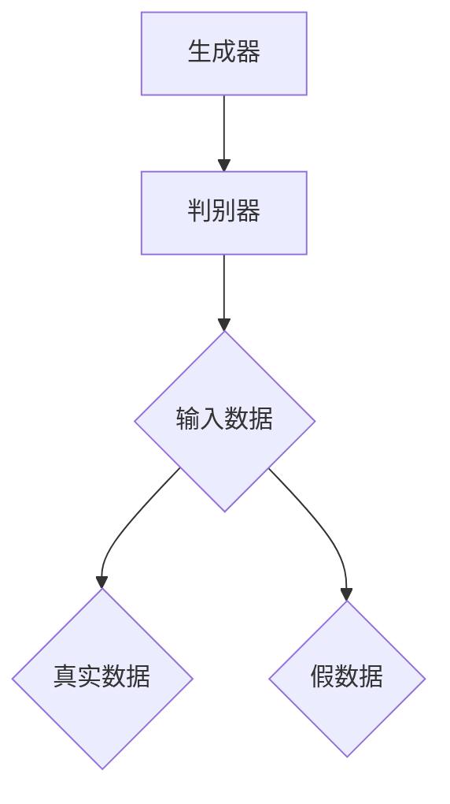

GAN的主要组成部分包括：

1. **生成器**：生成器的输入是随机噪声，输出是假数据。生成器通常由多个全连接层组成，可以通过反向传播算法进行训练。
2. **判别器**：判别器的输入是数据样本，输出是一个概率值，表示输入数据是真实数据的概率。判别器通常由多个卷积层组成，也可以通过反向传播算法进行训练。

###### 2.1.3 GAN的训练过程
GAN的训练过程可以概括为以下几个步骤：

1. **初始化参数**：随机初始化生成器和判别器的参数。
2. **生成器生成假数据**：生成器生成一批假数据。
3. **判别器训练**：判别器使用真实数据和生成数据共同训练。判别器尝试学习真实数据的分布，并提高对生成数据的识别能力。
4. **生成器更新**：生成器根据判别器的反馈更新参数，生成更逼真的数据。
5. **重复迭代**：重复上述步骤，直到生成器能够生成足够逼真的数据，使得判别器无法准确地区分真实数据和生成数据。

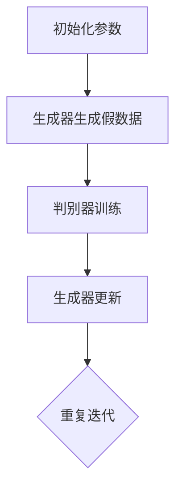

---

##### 2.2 变分自编码器（VAE）

变分自编码器（VAE）是一种基于概率模型的生成模型，由Kingma和Welling于2013年提出。VAE通过编码器和解码器将数据映射到一个潜在空间，并在潜在空间中生成新的数据样本。

###### 2.2.1 VAE的基本原理
VAE的基本原理可以概括为以下几个步骤：

1. **编码过程**：编码器将输入数据编码成一个潜在变量（latent variable）。潜在变量代表了输入数据的特征。
2. **解码过程**：解码器使用潜在变量生成重构的输入数据。
3. **概率后验**：VAE通过最大化输入数据的后验概率来训练模型。后验概率可以理解为数据生成的概率分布。

###### 2.2.2 VAE的架构与组成部分
VAE的架构主要包括编码器、解码器和潜在空间。

1. **编码器**：编码器将输入数据编码成一个潜在变量。编码器通常由多个全连接层组成，可以通过反向传播算法进行训练。
2. **解码器**：解码器使用潜在变量生成重构的输入数据。解码器通常与编码器具有相同的架构。
3. **潜在空间**：潜在空间是一个低维空间，代表了输入数据的特征。潜在空间中的每个点都对应一个可能的输入数据。

###### 2.2.3 VAE的训练过程
VAE的训练过程可以概括为以下几个步骤：

1. **初始化参数**：随机初始化编码器和解码器的参数。
2. **编码过程**：编码器将输入数据编码成一个潜在变量。
3. **解码过程**：解码器使用潜在变量生成重构的输入数据。
4. **计算损失函数**：VAE的损失函数包括两部分：重构损失和KL散度损失。重构损失衡量重构数据与原始数据之间的差异，KL散度损失衡量潜在变量的先验分布与实际分布之间的差异。
5. **优化参数**：通过反向传播算法和梯度下降优化编码器和解码器的参数。

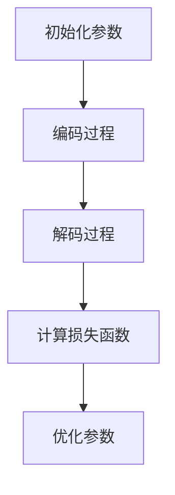

---

##### 2.3 其他生成模型

除了GAN和VAE，还有一些其他生成模型在虚拟场景构建中也有广泛应用。

###### 2.3.1 流模型（Flow-based Models）
流模型是一种基于概率变换的生成模型，通过学习一个概率变换来生成数据。流模型的核心思想是将生成过程分解为一系列的简单变换，这些变换可以组合成复杂的生成过程。

常见的流模型包括正常化流（Normalizing Flows）和高斯混合模型（Gaussian Mixture Models）。流模型的优点是能够生成高质量的数据，且训练过程相对稳定。

###### 2.3.2 自回归模型（Autoregressive Models）
自回归模型是一类基于自回归原理的生成模型，通过预测下一个数据点来生成数据序列。自回归模型通常用于图像生成和自然语言处理任务。

常见的自回归模型包括长短期记忆网络（LSTM）和门控循环单元（GRU）。自回归模型的优点是能够生成连续的数据序列，且训练过程相对简单。

---

### 第二部分：虚拟场景构建

#### 第3章：虚拟场景构建的基本概念

##### 3.1 虚拟场景的定义
虚拟场景是计算机生成的一个模拟环境，它可以是一个完全虚构的世界，也可以是现实世界的数字复制。虚拟场景在虚拟现实（VR）和增强现实（AR）技术中具有广泛的应用。

虚拟场景可以分为以下几类：
1. **静态场景**：不随时间变化的虚拟场景，如室内装修场景、城市景观等。
2. **动态场景**：随时间变化而变化的虚拟场景，如游戏场景、飞行模拟场景等。
3. **交互式场景**：用户可以与之交互的虚拟场景，如虚拟课堂、虚拟展会等。

##### 3.2 虚拟场景构建的关键技术
构建虚拟场景需要多种关键技术，包括3D建模、空间感知、光照与阴影模拟等。

###### 3.2.1 3D建模技术
3D建模技术是指使用3D软件创建三维模型的过程。3D建模技术包括以下步骤：
1. **模型设计**：根据需求设计三维模型的外观和结构。
2. **模型细化**：细化模型，包括添加细节、材质和纹理。
3. **模型渲染**：渲染模型，生成最终的视觉效果。

常见的3D建模软件包括Blender、Maya、3ds Max等。

###### 3.2.2 空间感知技术
空间感知技术是指感知和表示虚拟场景中的空间信息的技术。空间感知技术包括以下方面：
1. **空间划分**：将虚拟场景划分为不同的空间区域，如房间、走廊等。
2. **空间导航**：为用户提供在虚拟场景中导航的能力。
3. **空间交互**：用户在虚拟场景中的交互操作，如移动、选择等。

空间感知技术对于提供真实的虚拟体验至关重要。

###### 3.2.3 光照与阴影模拟
光照与阴影模拟是虚拟场景构建中的关键技术，它决定了虚拟场景的视觉效果。光照与阴影模拟包括以下方面：
1. **光照模型**：选择合适的光照模型，如定点光、方向光等。
2. **阴影模拟**：模拟物体之间的阴影效果，如软阴影、硬阴影等。
3. **反射与折射**：模拟光线在物体表面上的反射和折射效果，增强场景的真实感。

---

### 第三部分：生成模型在虚拟场景构建中的应用

#### 第4章：生成模型在虚拟场景构建中的应用

##### 4.1 GAN在虚拟场景构建中的应用

生成对抗网络（GAN）在虚拟场景构建中的应用非常广泛，它可以用于生成高质量的虚拟场景，提高场景的真实感和交互体验。

###### 4.1.1 GAN在3D模型生成中的应用
GAN可以用于生成高质量的3D模型，减少人工建模的工作量。具体应用包括：
1. **3D场景生成**：使用GAN生成复杂的3D场景，如城市景观、室内装修等。
2. **3D角色生成**：使用GAN生成各种角色的3D模型，用于游戏和虚拟现实应用。

例如，使用GAN生成3D城市景观的流程如下：

1. **数据集准备**：收集大量城市景观的图像作为训练数据。
2. **生成器训练**：使用随机噪声作为输入，训练生成器生成逼真的城市景观图像。
3. **判别器训练**：使用真实图像和生成图像共同训练判别器，提高其对真实图像的识别能力。
4. **生成高质量3D场景**：生成器生成高质量的城市景观图像，通过图像处理技术将其转换为3D模型。

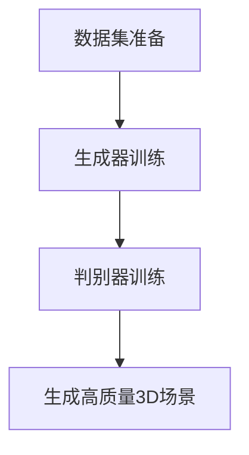

###### 4.1.2 GAN在自然语言生成中的应用
GAN还可以用于生成虚拟场景中的自然语言描述，如故事情节、角色对话等。具体应用包括：
1. **故事情节生成**：使用GAN生成有趣的故事情节，用于游戏和虚拟现实应用。
2. **角色对话生成**：使用GAN生成角色之间的对话，提高虚拟现实场景的交互体验。

例如，使用GAN生成故事情节的流程如下：

1. **数据集准备**：收集大量故事情节的文本作为训练数据。
2. **生成器训练**：使用随机噪声作为输入，训练生成器生成逼真的故事情节文本。
3. **判别器训练**：使用真实文本和生成文本共同训练判别器，提高其对真实文本的识别能力。
4. **生成有趣故事情节**：生成器生成有趣的故事情节，用于虚拟现实应用。

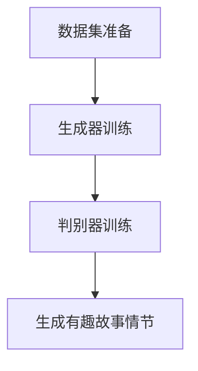

---

##### 4.2 VAE在虚拟场景构建中的应用

变分自编码器（VAE）在虚拟场景构建中的应用也非常广泛，它可以用于生成高质量的虚拟场景，提高场景的真实感和交互体验。

###### 4.2.1 VAE在3D模型生成中的应用
VAE可以用于生成高质量的3D模型，减少人工建模的工作量。具体应用包括：
1. **3D场景生成**：使用VAE生成复杂的3D场景，如城市景观、室内装修等。
2. **3D角色生成**：使用VAE生成各种角色的3D模型，用于游戏和虚拟现实应用。

例如，使用VAE生成3D城市景观的流程如下：

1. **数据集准备**：收集大量城市景观的图像作为训练数据。
2. **编码器训练**：训练编码器将输入图像编码成一个潜在变量。
3. **解码器训练**：训练解码器使用潜在变量生成重构的图像。
4. **生成高质量3D场景**：解码器生成高质量的城市景观图像，通过图像处理技术将其转换为3D模型。

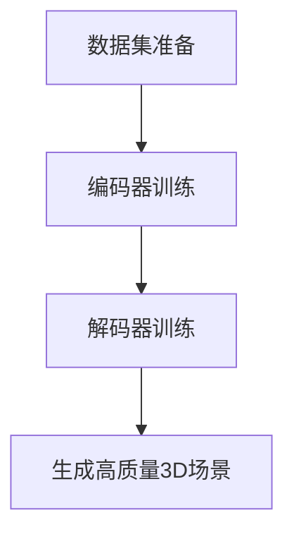

###### 4.2.2 VAE在自然语言生成中的应用
VAE还可以用于生成虚拟场景中的自然语言描述，如故事情节、角色对话等。具体应用包括：
1. **故事情节生成**：使用VAE生成有趣的故事情节，用于游戏和虚拟现实应用。
2. **角色对话生成**：使用VAE生成角色之间的对话，提高虚拟现实场景的交互体验。

例如，使用VAE生成故事情节的流程如下：

1. **数据集准备**：收集大量故事情节的文本作为训练数据。
2. **编码器训练**：训练编码器将输入文本编码成一个潜在变量。
3. **解码器训练**：训练解码器使用潜在变量生成重构的文本。
4. **生成有趣故事情节**：解码器生成有趣的故事情节，用于虚拟现实应用。

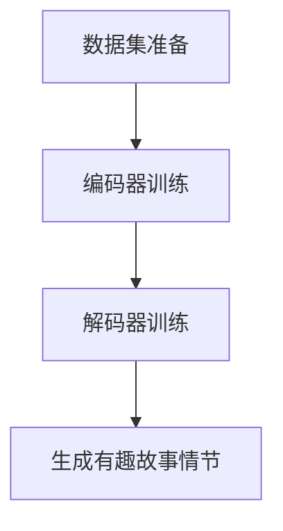

---

### 第四部分：生成模型在虚拟场景构建中的创新应用

#### 第5章：生成模型在游戏开发中的应用

##### 5.1 GAN在游戏开发中的应用

生成对抗网络（GAN）在游戏开发中的应用非常广泛，它可以用于生成游戏场景、角色和道具等，提高游戏的真实感和交互体验。

###### 5.1.1 GAN在游戏场景生成中的应用
GAN可以用于生成复杂的游戏场景，如城市景观、森林、洞穴等。具体应用包括：
1. **场景纹理生成**：使用GAN生成逼真的场景纹理，如草地、水面、墙壁等。
2. **场景细节生成**：使用GAN生成场景中的细节元素，如树木、建筑物、车辆等。

例如，使用GAN生成游戏场景纹理的流程如下：

1. **数据集准备**：收集大量游戏场景纹理的图像作为训练数据。
2. **生成器训练**：使用随机噪声作为输入，训练生成器生成逼真的场景纹理图像。
3. **判别器训练**：使用真实纹理图像和生成纹理图像共同训练判别器，提高其对真实纹理图像的识别能力。
4. **生成场景纹理**：生成器生成高质量的场景纹理图像，用于游戏开发。

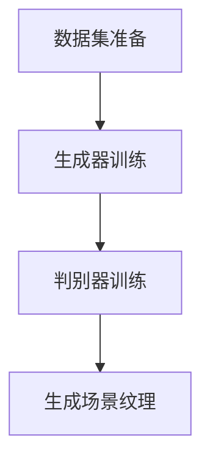

###### 5.1.2 GAN在角色生成中的应用
GAN可以用于生成各种角色的3D模型，包括玩家角色、NPC（非玩家角色）和怪兽等。具体应用包括：
1. **角色外观生成**：使用GAN生成各种角色的外观，如外貌、服装等。
2. **角色动作生成**：使用GAN生成角色的动作，如跑步、跳跃、攻击等。

例如，使用GAN生成角色外观的流程如下：

1. **数据集准备**：收集大量角色外观的3D模型作为训练数据。
2. **生成器训练**：使用随机噪声作为输入，训练生成器生成逼真的角色外观3D模型。
3. **判别器训练**：使用真实角色外观3D模型和生成角色外观3D模型共同训练判别器，提高其对真实角色外观3D模型的识别能力。
4. **生成角色外观**：生成器生成高质量的角色外观3D模型，用于游戏开发。

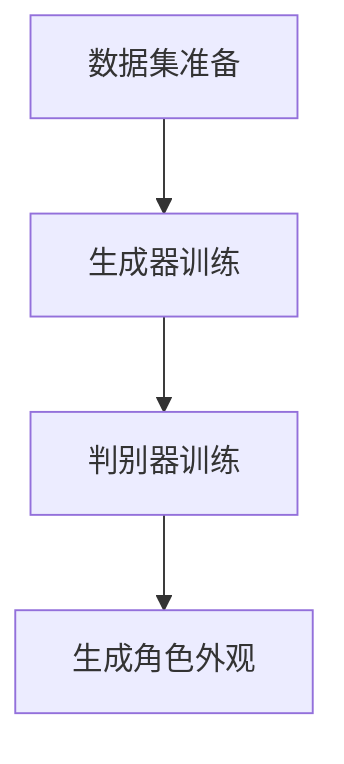

---

##### 5.2 VAE在游戏开发中的应用

变分自编码器（VAE）在游戏开发中的应用也非常广泛，它可以用于生成游戏场景、角色和道具等，提高游戏的真实感和交互体验。

###### 5.2.1 VAE在游戏场景生成中的应用
VAE可以用于生成复杂的游戏场景，如城市景观、森林、洞穴等。具体应用包括：
1. **场景纹理生成**：使用VAE生成逼真的场景纹理，如草地、水面、墙壁等。
2. **场景细节生成**：使用VAE生成场景中的细节元素，如树木、建筑物、车辆等。

例如，使用VAE生成游戏场景纹理的流程如下：

1. **数据集准备**：收集大量游戏场景纹理的图像作为训练数据。
2. **编码器训练**：训练编码器将输入图像编码成一个潜在变量。
3. **解码器训练**：训练解码器使用潜在变量生成重构的图像。
4. **生成场景纹理**：解码器生成高质量的场景纹理图像，用于游戏开发。

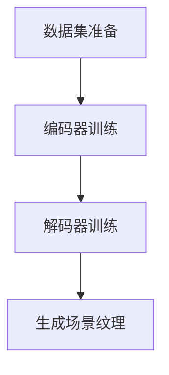

###### 5.2.2 VAE在角色生成中的应用
VAE可以用于生成各种角色的3D模型，包括玩家角色、NPC（非玩家角色）和怪兽等。具体应用包括：
1. **角色外观生成**：使用VAE生成各种角色的外观，如外貌、服装等。
2. **角色动作生成**：使用VAE生成角色的动作，如跑步、跳跃、攻击等。

例如，使用VAE生成角色外观的流程如下：

1. **数据集准备**：收集大量角色外观的3D模型作为训练数据。
2. **编码器训练**：训练编码器将输入3D模型编码成一个潜在变量。
3. **解码器训练**：训练解码器使用潜在变量生成重构的3D模型。
4. **生成角色外观**：解码器生成高质量的角色外观3D模型，用于游戏开发。

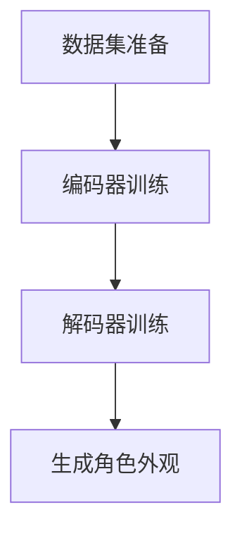

---

### 第五部分：生成模型在虚拟现实与增强现实中的应用前景

#### 第6章：生成模型在虚拟现实与增强现实中的应用前景

##### 6.1 虚拟现实与增强现实的发展现状
虚拟现实（VR）和增强现实（AR）技术近年来取得了显著的发展，已经在多个领域得到应用。虚拟现实技术主要用于提供沉浸式的体验，如游戏、教育、医疗等；增强现实技术则主要用于增强现实世界的信息，如导航、购物、工业设计等。

##### 6.2 生成模型在虚拟现实与增强现实中的未来发展趋势
生成模型在虚拟现实与增强现实中的应用前景广阔，未来的发展趋势包括：
1. **更高质量的场景生成**：随着生成模型技术的不断进步，虚拟场景的质量将得到显著提升，为用户提供更真实的体验。
2. **更高效的场景优化**：生成模型可以快速生成和优化虚拟场景，提高开发效率。
3. **更丰富的交互体验**：生成模型可以生成与用户交互的场景，增强虚拟现实和增强现实的应用价值。

##### 6.3 生成模型在虚拟现实与增强现实中的挑战与机遇
生成模型在虚拟现实与增强现实中的应用也面临着一些挑战：
1. **计算资源需求**：生成模型通常需要大量的计算资源，如何高效利用计算资源是关键挑战。
2. **数据隐私与安全**：生成模型在生成虚拟场景时可能涉及用户隐私数据，如何保护用户隐私是重要问题。

但同时也存在着巨大的机遇：
1. **创新应用场景**：生成模型可以开拓新的应用场景，如虚拟旅游、虚拟购物等。
2. **新兴市场开发**：生成模型可以帮助开发新的市场和产品，推动虚拟现实与增强现实技术的商业化。

---

### 第7章：总结与展望

生成模型在虚拟场景构建中展现了巨大的应用潜力，通过生成对抗网络（GAN）和变分自编码器（VAE）等技术，可以生成高质量的虚拟场景，提高用户体验。未来，随着生成模型技术的不断进步，虚拟现实和增强现实领域将迎来更多的创新应用。同时，我们也需要关注数据隐私和安全等问题，确保生成模型在虚拟场景构建中的可持续发展。

---

### 附录

#### 附录A：生成模型相关资源与工具
1. **生成模型学习资源**：包括在线课程、教程和论文等。
2. **生成模型开源代码与库**：如TensorFlow、PyTorch等。
3. **生成模型应用案例与论文推荐**：推荐一些优秀的生成模型应用案例和学术论文。

#### 附录B：生成模型常用数学公式与算法伪代码
1. **生成模型常用数学公式**：包括概率分布函数、损失函数等。
2. **GAN与VAE算法伪代码**：提供生成对抗网络（GAN）和变分自编码器（VAE）的算法伪代码，便于理解其实现过程。

---

通过以上详细的阐述，我们希望读者能够对生成模型在虚拟场景构建中的创新应用有更深入的理解。随着技术的不断发展，生成模型在虚拟现实和增强现实领域的应用前景将更加广阔。希望本文能够为读者提供有价值的参考和启示。作者：AI天才研究院/AI Genius Institute & 禅与计算机程序设计艺术 /Zen And The Art of Computer Programming。

