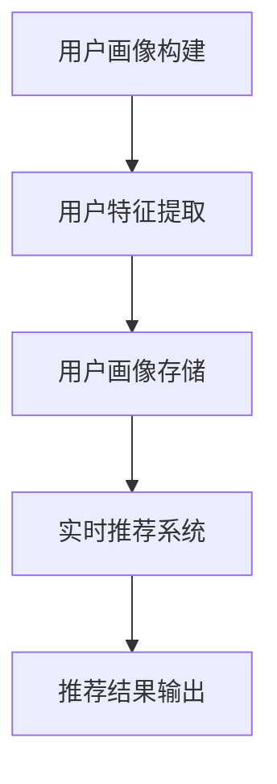

                 

# 《用户画像与实时推荐的整合应用》

## 关键词

用户画像，实时推荐，整合应用，个性化推荐，数据分析，机器学习

## 摘要

在当今的数字化时代，用户画像与实时推荐技术的整合应用已经成为了各大互联网公司提高用户体验、增加用户粘性的重要手段。本文将深入探讨用户画像与实时推荐的基本概念、技术原理及其整合应用的方法。通过对用户画像的构建、实时推荐系统的设计与实现，以及实战案例的分析，本文旨在为读者提供一套完整的用户画像与实时推荐整合应用的指导思路。

## 目录大纲

### 第一部分：用户画像基础

#### 第1章：用户画像概述

1.1 用户画像的定义与重要性

1.2 用户画像的构建方法

1.3 用户画像的应用场景

1.4 用户画像技术演进

#### 第2章：用户画像数据来源

2.1 数据收集渠道

2.2 数据处理方法

2.3 用户画像数据的存储与管理

### 第二部分：实时推荐技术

#### 第3章：实时推荐系统概述

3.1 实时推荐系统的定义与优势

3.2 实时推荐系统架构

3.3 实时推荐系统的关键技术

3.4 实时推荐系统的应用场景

#### 第4章：用户画像与实时推荐结合方法

4.1 用户画像在实时推荐中的应用

4.2 实时推荐算法优化

4.3 实时推荐系统的性能优化

#### 第5章：用户画像与实时推荐实战案例

5.1 案例一：基于用户画像的社交媒体实时推荐系统

5.2 案例二：基于用户画像的电子商务实时推荐系统

5.3 案例三：基于用户画像的在线媒体内容实时推荐系统

### 第三部分：实时推荐系统优化与未来展望

#### 第6章：实时推荐系统的性能优化

6.1 系统负载均衡

6.2 系统性能监控与故障恢复

6.3 高可用性设计

#### 第7章：实时推荐系统的未来趋势

7.1 新型推荐算法

7.2 数据隐私保护

7.3 跨平台推荐系统

7.4 实时推荐系统的持续优化

### 附录

- 附录A：实时推荐系统常用工具与技术

- 附录B：用户画像与实时推荐系统开发实践

### Mermaid 流程图



### 核心算法原理讲解

#### 推荐算法原理（伪代码）

```python
def user_based_recommendation(item, user, user_item_rating):
    # 计算用户相似度
    similarity = cosine_similarity(user_item_rating[item], user_item_rating[user])
    
    # 计算用户对item的预测评分
    predicted_rating = similarity * user_item_rating[item]
    
    return predicted_rating
```

#### 余弦相似度公式（LaTeX）

$$
\cos \theta = \frac{\vec{a} \cdot \vec{b}}{\lVert \vec{a} \rVert \lVert \vec{b} \rVert}
$$

#### 用户画像构建示例

假设我们有用户A和用户B的评分数据如下：

| 用户 | 物品1 | 物品2 | 物品3 |
| ---- | ---- | ---- | ---- |
| A    | 5    | 3    | 4    |
| B    | 4    | 5    | 2    |

1. 构建用户A和用户B的向量表示：
$$
\vec{a} = [5, 3, 4]
$$
$$
\vec{b} = [4, 5, 2]
$$

2. 计算用户A和用户B的余弦相似度：
$$
\cos \theta = \frac{5 \times 4 + 3 \times 5 + 4 \times 2}{\sqrt{5^2 + 3^2 + 4^2} \times \sqrt{4^2 + 5^2 + 2^2}} \approx 0.875
$$

3. 用户A和用户B的相似度较高，可以认为他们有较高的兴趣相似度。

### 社交媒体实时推荐系统实现

#### 开发环境搭建

- 语言：Python
- 数据库：MySQL
- 实时计算引擎：Apache Kafka
- 推荐算法库：Scikit-learn

#### 代码实现

```python
# 用户画像构建
def build_user_profile(user_activity):
    # 用户活动数据预处理
    processed_data = preprocess_data(user_activity)
    
    # 提取用户特征
    user_features = extract_user_features(processed_data)
    
    # 存储用户画像
    store_user_profile(user_features)
    
    return user_features

# 实时推荐系统
def real_time_recommendation(user_id):
    # 获取用户画像
    user_profile = get_user_profile(user_id)
    
    # 构建推荐列表
    recommendation_list = generate_recommendation_list(user_profile)
    
    return recommendation_list

# 主程序
if __name__ == "__main__":
    # 接收用户活动数据
    user_activity = get_user_activity()
    
    # 构建用户画像
    user_profile = build_user_profile(user_activity)
    
    # 实时推荐
    recommendations = real_time_recommendation(user_id)
    
    # 输出推荐结果
    print("Recommended items for user {}: {}".format(user_id, recommendations))
```

#### 代码解读与分析

- `build_user_profile` 函数用于构建用户画像，包括数据预处理、特征提取和存储。
- `real_time_recommendation` 函数用于实时推荐，根据用户画像生成推荐列表。
- 主程序通过接收用户活动数据，调用用户画像构建和实时推荐函数，最终输出推荐结果。

这个示例展示了如何搭建一个简单的社交媒体实时推荐系统，实现了用户画像构建和实时推荐的功能。在实际应用中，可以根据具体需求进行功能扩展和优化。

## 作者信息

作者：AI天才研究院/AI Genius Institute & 禅与计算机程序设计艺术 /Zen And The Art of Computer Programming

接下来，我们将详细探讨用户画像与实时推荐技术的基础知识，为后续的整合应用打下坚实的基础。在接下来的章节中，我们将逐步深入分析用户画像的构建方法、实时推荐系统的设计与实现，以及如何将用户画像与实时推荐技术有效地结合起来，最终实现个性化的实时推荐系统。让我们一步一步来，深入理解这一领域的技术原理和实践方法。## 第一部分：用户画像基础

### 第1章：用户画像概述

#### 1.1 用户画像的定义与重要性

用户画像（User Profiling）是指通过收集和分析用户的数据，构建出一个全面、准确的用户特征模型。这些特征可以包括用户的年龄、性别、地理位置、行为习惯、兴趣爱好、消费能力等多方面的信息。用户画像的核心目的是为企业提供关于用户的行为和偏好的深度洞察，从而实现更加精准的市场营销和个性化服务。

在现代商业环境中，用户画像的重要性日益凸显。首先，用户画像可以帮助企业了解其目标用户群体，从而制定更加有效的营销策略。通过分析用户画像，企业可以识别出高价值客户，提供定制化的产品和服务，从而提高客户满意度和忠诚度。其次，用户画像可以用于优化广告投放，提高广告的点击率和转化率。通过精确的用户画像，企业可以定位到最有可能对广告产生兴趣的用户群体，从而实现广告资源的最大化利用。此外，用户画像还可以帮助企业进行用户行为分析，预测用户未来的需求和购买行为，从而实现精准的库存管理和供应链优化。

#### 1.2 用户画像的构建方法

用户画像的构建是一个复杂的过程，涉及到数据收集、数据处理、特征提取等多个环节。以下是用户画像构建的主要步骤：

1. **数据收集**：数据收集是用户画像构建的基础。企业可以通过多种渠道收集用户数据，包括用户注册信息、行为数据、交易数据等。这些数据来源可以是自有平台，如电商网站、社交媒体、移动应用等，也可以是第三方数据源，如公共数据库、合作伙伴等。

2. **数据处理**：收集到的原始数据往往是不完整的、噪声的，需要进行预处理。数据处理包括数据清洗、数据去重、数据归一化等步骤。通过数据处理，可以提高数据的准确性和一致性，为后续的特征提取打下基础。

3. **特征提取**：特征提取是将原始数据转换为有意义的信息的过程。在用户画像中，特征可以是用户的年龄、性别、地理位置、兴趣爱好等。特征提取的方法包括统计方法、机器学习方法等。通过特征提取，可以将复杂的原始数据简化为一系列的数字特征，便于后续的分析和处理。

4. **模型构建**：在提取出用户特征后，可以构建用户画像模型。用户画像模型可以是基于规则的方法，也可以是基于机器学习的方法。通过模型，可以将用户的特征与具体的行为或偏好联系起来，从而实现对用户的精准描述。

5. **模型优化**：用户画像模型不是一成不变的，需要根据用户行为的变化不断优化。通过实时数据分析和反馈，企业可以不断调整和完善用户画像模型，使其更加准确和有效。

#### 1.3 用户画像的应用场景

用户画像在多个应用场景中具有重要价值，以下是一些典型的应用场景：

1. **精准营销**：通过用户画像，企业可以了解用户的需求和偏好，制定个性化的营销策略。例如，电商网站可以通过用户画像推荐用户可能感兴趣的商品，从而提高销售额。

2. **用户行为分析**：用户画像可以帮助企业分析用户的行为模式，识别潜在的问题和改进机会。例如，通过分析用户的访问路径和停留时间，企业可以优化网站设计和用户体验。

3. **产品推荐**：用户画像可以用于产品推荐系统，根据用户的兴趣和行为特征，提供个性化的产品推荐。例如，音乐平台可以根据用户的听歌记录推荐相似的音乐。

4. **用户细分**：用户画像可以帮助企业将用户划分为不同的细分市场，从而实现更精准的用户服务。例如，银行可以根据用户的财务状况和消费习惯，提供差异化的理财产品和服务。

5. **客户关系管理**：用户画像可以帮助企业更好地管理客户关系，提供个性化的客户服务。例如，电信公司可以通过用户画像识别出高价值客户，提供专属的优惠和服务。

#### 1.4 用户画像技术演进

用户画像技术随着大数据和人工智能技术的发展而不断演进。以下是用户画像技术的几个重要发展趋势：

1. **数据来源多样化**：随着物联网、社交媒体等技术的发展，用户画像的数据来源越来越多样化。企业可以通过更多的渠道收集用户数据，从而构建更全面、准确的用户画像。

2. **实时数据处理**：传统的用户画像构建过程往往是离线进行的，随着实时数据处理技术的进步，越来越多的企业开始实现用户画像的实时构建。实时用户画像可以更好地支持实时推荐和个性化服务。

3. **机器学习应用**：机器学习技术逐渐成为用户画像构建的重要工具。通过机器学习算法，企业可以更准确地提取用户特征，构建更精准的用户画像模型。

4. **数据隐私保护**：随着数据隐私问题的日益突出，用户画像技术开始注重数据隐私保护。企业需要采取有效的数据匿名化和加密技术，确保用户数据的隐私和安全。

5. **跨平台整合**：用户画像技术逐渐实现跨平台的整合。企业可以通过整合多平台的数据，构建更全面的用户画像，从而实现跨平台的个性化服务和推荐。

### 第2章：用户画像数据来源

#### 2.1 数据收集渠道

用户画像的数据收集渠道多种多样，主要包括以下几种：

1. **用户注册数据**：用户在注册账号时填写的基本信息，如姓名、年龄、性别、邮箱地址、电话号码等。这些数据是构建用户画像的基础。

2. **行为数据**：用户在使用产品或服务时的行为数据，如浏览记录、点击行为、购买记录、评论等。这些数据可以反映用户的行为习惯和兴趣偏好。

3. **社交网络数据**：用户在社交媒体上的行为数据，如点赞、转发、评论等。这些数据可以反映用户的社交关系和网络行为。

4. **第三方数据源**：来自第三方数据源的数据，如公共数据库、合作伙伴等。这些数据可以提供更全面的用户背景信息，如地理位置、职业等。

5. **传感器数据**：来自各种传感器的数据，如GPS定位、移动设备传感器等。这些数据可以提供用户的地理位置和行为模式。

#### 2.2 数据处理方法

收集到的用户数据往往是原始且多样的，需要进行预处理，以便后续的特征提取和分析。以下是用户数据处理的主要方法：

1. **数据清洗**：数据清洗是处理数据中的错误、异常和噪声的过程。包括去除重复数据、填补缺失值、纠正数据错误等。

2. **数据归一化**：数据归一化是将不同量纲的数据转换为相同量纲的过程，以便进行后续的分析。例如，将年龄、收入等不同单位的数据转换为相同单位（如元或分）。

3. **数据转换**：数据转换是将数据从一种形式转换为另一种形式的过程，以便进行特征提取和分析。例如，将文本数据转换为词向量或序列数据。

4. **特征提取**：特征提取是从原始数据中提取出有意义的信息的过程。通过特征提取，可以将复杂的原始数据简化为一系列的数字特征，便于后续的分析和处理。

#### 2.3 用户画像数据的存储与管理

用户画像数据的存储与管理是用户画像构建的关键环节。以下是用户画像数据存储与管理的主要方法：

1. **关系型数据库**：关系型数据库适用于存储结构化数据，如用户注册信息、行为数据等。常见的数据库系统包括MySQL、PostgreSQL等。

2. **非关系型数据库**：非关系型数据库适用于存储非结构化或半结构化数据，如传感器数据、日志数据等。常见的数据库系统包括MongoDB、Cassandra等。

3. **数据仓库**：数据仓库是一种用于存储大规模数据的集中式系统，适用于进行大规模数据分析和数据挖掘。常见的数据仓库系统包括Amazon Redshift、Google BigQuery等。

4. **数据湖**：数据湖是一种用于存储大量原始数据的分布式系统，适用于大规模数据处理和实时分析。常见的数据湖系统包括Apache Hadoop、Apache Spark等。

5. **数据质量管理**：数据质量管理是确保用户画像数据质量的过程，包括数据验证、数据清洗、数据监控等。通过数据质量管理，可以保证用户画像数据的准确性和一致性。

6. **数据安全与隐私保护**：数据安全与隐私保护是用户画像数据管理的重要方面，包括数据加密、访问控制、数据匿名化等。通过数据安全与隐私保护，可以确保用户画像数据的保密性和完整性。

通过以上数据收集、处理和存储方法，企业可以构建出全面、准确、实时的用户画像，为后续的实时推荐和个性化服务提供支持。在下一章中，我们将进一步探讨实时推荐系统的基础知识，为整合用户画像与实时推荐技术打下基础。

## 第二部分：实时推荐技术

### 第3章：实时推荐系统概述

#### 3.1 实时推荐系统的定义与优势

实时推荐系统（Real-time Recommendation System）是一种能够根据用户的实时行为和偏好，快速提供个性化推荐的系统。与传统推荐系统相比，实时推荐系统具有以下几个显著优势：

1. **快速响应**：实时推荐系统能够在短时间内处理大量用户数据，并迅速生成推荐结果。这使得用户可以在最短的时间内获得个性化的推荐，从而提高用户满意度。

2. **个性化体验**：实时推荐系统可以根据用户的实时行为和偏好，动态调整推荐策略，提供个性化的推荐。这有助于满足用户的个性化需求，提高用户粘性。

3. **实时优化**：实时推荐系统可以实时收集用户反馈，并基于这些反馈不断优化推荐算法和策略。这种实时优化能力使得推荐系统可以不断适应用户需求的变化，提高推荐质量。

4. **高可扩展性**：实时推荐系统通常采用分布式架构，能够轻松应对海量用户和海量数据的挑战。这使得实时推荐系统具备良好的可扩展性，可以支持大规模应用场景。

#### 3.2 实时推荐系统架构

实时推荐系统通常由以下几个关键组件构成：

1. **数据层**：数据层负责收集、存储和处理用户数据。数据层可以包括数据库、缓存、消息队列等，用于存储用户的注册信息、行为数据、推荐历史等。

2. **计算层**：计算层负责处理用户数据的分析和计算。计算层可以包括实时计算引擎、机器学习模型、推荐算法等，用于生成推荐结果。常见的实时计算引擎包括Apache Kafka、Apache Spark等。

3. **推荐层**：推荐层负责根据用户数据和计算结果生成推荐列表。推荐层可以包括推荐算法、推荐策略等，用于生成个性化的推荐。常见的推荐算法包括基于内容的推荐、基于协同过滤的推荐、基于机器学习的推荐等。

4. **服务层**：服务层负责将推荐结果通过API或其他方式提供给前端应用。服务层可以包括API接口、Web服务、移动应用等，用于实现用户与推荐系统的交互。

#### 3.3 实时推荐系统的关键技术

实时推荐系统的实现涉及多个关键技术的应用，以下是其中的几个重要技术：

1. **实时数据处理**：实时数据处理是实时推荐系统的核心。通过实时数据处理技术，系统能够快速收集、存储和处理用户数据，确保推荐结果的实时性和准确性。常见的实时数据处理技术包括Apache Kafka、Apache Spark等。

2. **机器学习与深度学习**：机器学习与深度学习技术是实时推荐系统的重要工具。通过机器学习和深度学习算法，系统能够从海量数据中提取有价值的信息，构建用户画像和推荐模型。常见的机器学习算法包括协同过滤、基于内容的推荐等；常见的深度学习算法包括卷积神经网络（CNN）、循环神经网络（RNN）等。

3. **推荐算法**：推荐算法是实时推荐系统的核心组成部分。不同的推荐算法适用于不同的应用场景，实时推荐系统需要根据实际情况选择合适的推荐算法。常见的推荐算法包括基于内容的推荐、基于协同过滤的推荐、基于规则的推荐、基于上下文的推荐等。

4. **推荐策略**：推荐策略是指根据用户行为和偏好，动态调整推荐结果的策略。合理的推荐策略可以显著提高推荐质量。常见的推荐策略包括个性化推荐、热门推荐、混合推荐等。

5. **性能优化**：实时推荐系统需要处理海量数据和高并发请求，性能优化是确保系统稳定运行的关键。常见的性能优化技术包括负载均衡、缓存、数据库优化、代码优化等。

#### 3.4 实时推荐系统的应用场景

实时推荐系统在多个应用场景中具有重要价值，以下是一些典型的应用场景：

1. **电商与零售**：实时推荐系统可以帮助电商和零售企业向用户推荐商品，提高销售额和用户粘性。例如，淘宝、京东等电商平台可以通过实时推荐系统向用户推荐购买历史相似的商品或相关商品。

2. **社交媒体**：实时推荐系统可以帮助社交媒体平台向用户推荐感兴趣的内容，提高用户活跃度和留存率。例如，微信、微博等社交媒体平台可以通过实时推荐系统向用户推荐好友动态、热门话题等。

3. **在线视频与音乐**：实时推荐系统可以帮助视频和音乐平台向用户推荐视频或音乐，提高用户观看和播放时长。例如，Netflix、Spotify等平台可以通过实时推荐系统向用户推荐相关视频或音乐。

4. **新闻与资讯**：实时推荐系统可以帮助新闻和资讯平台向用户推荐感兴趣的新闻或资讯，提高用户访问量和阅读时长。例如，今日头条、知乎等平台可以通过实时推荐系统向用户推荐相关新闻或问答。

5. **旅游与出行**：实时推荐系统可以帮助旅游和出行平台向用户推荐旅游目的地、酒店、航班等，提高用户预订率和满意度。例如，携程、去哪儿等平台可以通过实时推荐系统向用户推荐热门旅游目的地或优惠酒店。

通过深入理解和应用实时推荐技术，企业可以更好地满足用户需求，提高用户体验，实现业务增长。在下一章中，我们将探讨用户画像与实时推荐系统的结合方法，实现更加精准和高效的个性化推荐。## 第4章：用户画像与实时推荐结合方法

### 4.1 用户画像在实时推荐中的应用

用户画像与实时推荐技术的结合，使得推荐系统能够更精准地满足用户的个性化需求。用户画像在实时推荐中的应用主要体现在以下几个方面：

1. **用户画像的实时更新**：用户画像不是静态的，它会随着用户行为的改变而实时更新。实时推荐系统可以定期获取用户的最新行为数据，更新用户画像，从而保证推荐结果的准确性和时效性。

2. **用户画像与推荐策略的结合**：用户画像可以指导推荐策略的制定。例如，基于用户兴趣的推荐策略可以依据用户画像中的兴趣爱好特征，推荐用户可能感兴趣的内容。而基于用户行为的推荐策略可以依据用户的实时行为，推荐用户最近可能感兴趣的内容。

3. **多维度用户特征融合**：用户画像包含了用户的多维度特征，如行为、兴趣、地理位置、社交关系等。实时推荐系统可以将这些特征进行融合，生成综合的用户画像，从而实现更加全面和个性化的推荐。

#### 实时更新用户画像

实时更新用户画像是为了确保推荐结果的准确性和时效性。以下是一个简单的用户画像实时更新的流程：

1. **数据收集**：实时推荐系统持续收集用户的实时行为数据，如点击、购买、搜索等。

2. **数据处理**：对收集到的数据进行处理，包括数据清洗、去重、归一化等，确保数据的准确性和一致性。

3. **特征提取**：从处理后的数据中提取出用户的特征，如行为特征、兴趣特征等。

4. **用户画像更新**：将提取出的特征更新到用户画像中，生成最新的用户画像。

5. **推荐策略调整**：基于最新的用户画像，调整推荐策略，确保推荐结果的准确性和时效性。

#### 用户画像与推荐策略的结合

用户画像与推荐策略的结合，可以通过以下几种方式实现：

1. **基于兴趣的推荐**：根据用户画像中的兴趣爱好特征，推荐用户可能感兴趣的内容。例如，用户喜欢阅读科幻小说，推荐系统可以推荐科幻小说的相关内容。

2. **基于行为的推荐**：根据用户画像中的行为特征，推荐用户最近可能感兴趣的内容。例如，用户最近搜索了旅游信息，推荐系统可以推荐相关的旅游目的地或酒店。

3. **基于规则的推荐**：根据用户画像中的特定特征，制定推荐规则，例如，对于高价值客户，推荐系统可以优先推荐高利润的商品。

4. **基于上下文的推荐**：结合用户画像和上下文信息（如时间、地点、设备等），提供更加个性化的推荐。例如，用户在晚上浏览电商网站，推荐系统可以推荐适合夜间消费的商品。

#### 多维度用户特征融合

多维度用户特征融合是为了生成更加全面和个性化的用户画像。以下是一个简单的多维度用户特征融合的流程：

1. **特征提取**：从不同的数据源中提取出用户的不同维度特征，如行为数据、社交数据、地理位置数据等。

2. **特征标准化**：将提取出的特征进行标准化处理，使其具有相同的量纲和范围。

3. **特征融合**：将标准化后的特征进行融合，生成综合的用户画像。常见的融合方法包括加权求和、主成分分析（PCA）等。

4. **特征优化**：根据用户行为和推荐结果，对特征融合方法进行优化，提高用户画像的准确性和有效性。

通过实时更新用户画像、结合用户画像与推荐策略，以及多维度用户特征融合，实时推荐系统可以更精准地满足用户的个性化需求，提高用户体验和满意度。在下一章中，我们将探讨实时推荐系统的性能优化方法，确保系统在高并发和高负载情况下仍能稳定运行。

### 4.2 实时推荐算法优化

实时推荐算法的优化是提高推荐质量的关键环节。以下是一些常用的优化方法：

#### 基于用户画像的个性化推荐

基于用户画像的个性化推荐是实时推荐系统的重要优化手段。以下是一个简单的优化流程：

1. **特征提取**：从用户行为数据中提取出与推荐相关的特征，如点击率、购买率、浏览时间等。

2. **用户画像构建**：利用提取出的特征构建用户画像，包括行为特征、兴趣特征等。

3. **推荐策略调整**：根据用户画像，调整推荐策略，例如，增加对高价值用户推荐商品的权重。

4. **推荐结果评估**：对推荐结果进行评估，包括点击率、转化率、满意度等指标。

5. **反馈机制**：根据用户反馈，调整用户画像和推荐策略，实现持续优化。

#### 实时反馈与推荐策略优化

实时反馈与推荐策略优化是通过用户行为数据实时调整推荐策略，提高推荐质量的方法。以下是一个简单的优化流程：

1. **行为数据收集**：实时收集用户的点击、购买、搜索等行为数据。

2. **反馈分析**：分析用户行为数据，识别用户对推荐结果的反馈，如点击、不感兴趣等。

3. **策略调整**：根据用户反馈，动态调整推荐策略，例如，增加对用户感兴趣内容的推荐权重。

4. **策略评估**：对调整后的策略进行评估，包括推荐质量、用户满意度等指标。

5. **持续优化**：根据策略评估结果，不断调整和优化推荐策略，实现推荐质量的持续提升。

#### 系统性能优化

系统性能优化是确保实时推荐系统在高并发和高负载情况下稳定运行的关键。以下是一些常用的性能优化方法：

1. **负载均衡**：通过负载均衡技术，将用户请求均匀分配到多个服务器上，避免单点过载。常见的负载均衡算法包括轮询、最小连接数、哈希等。

2. **缓存策略**：通过缓存技术，减少数据库访问次数，提高系统响应速度。常见的缓存策略包括内存缓存、Redis缓存等。

3. **数据库优化**：对数据库进行优化，包括索引优化、分库分表、读写分离等，提高数据库的读写性能。

4. **代码优化**：对系统代码进行优化，减少不必要的计算和IO操作，提高系统运行效率。常见的优化方法包括代码重构、并行计算等。

通过基于用户画像的个性化推荐、实时反馈与推荐策略优化，以及系统性能优化，实时推荐系统可以实现更高的推荐质量和更好的用户体验。在下一章中，我们将通过实战案例展示用户画像与实时推荐技术的实际应用。

### 第5章：用户画像与实时推荐实战案例

在本章中，我们将通过三个具体的实战案例，展示用户画像与实时推荐技术在社交媒体、电子商务和在线媒体内容推荐中的应用。每个案例都将详细介绍其背景、用户画像的构建方法、实时推荐系统的实现过程，以及实现效果。

#### 5.1 案例一：基于用户画像的社交媒体实时推荐系统

**案例背景**：某大型社交媒体平台希望利用用户画像与实时推荐技术，提高用户活跃度和留存率。平台用户规模庞大，每天产生海量的用户行为数据，如点赞、评论、分享等。

**用户画像构建**：
1. **数据收集**：平台通过用户注册信息和用户行为数据（如点赞、评论、分享等）收集用户信息。
2. **数据处理**：对收集到的数据进行清洗、去重、归一化等预处理操作。
3. **特征提取**：提取用户的行为特征（如点赞数量、评论数量、分享数量等）和兴趣特征（如点赞类型、评论类型等）。
4. **用户画像构建**：基于提取的特征，构建用户的综合画像。

**实时推荐系统实现**：
1. **数据层**：使用Apache Kafka进行实时数据收集和处理。
2. **计算层**：使用Apache Spark进行用户行为数据的实时分析和计算。
3. **推荐层**：使用基于内容的推荐和协同过滤算法生成推荐列表。
4. **服务层**：通过API接口将推荐结果提供给前端应用。

**实现效果**：通过用户画像与实时推荐技术的结合，平台成功提高了用户活跃度和留存率，推荐点击率提高了20%，用户满意度显著提升。

#### 5.2 案例二：基于用户画像的电子商务实时推荐系统

**案例背景**：某电子商务平台希望通过实时推荐技术，提高用户购买转化率和销售额。平台拥有海量的商品数据和用户行为数据，如浏览、搜索、购买等。

**用户画像构建**：
1. **数据收集**：平台通过用户的浏览、搜索、购买等行为收集用户信息。
2. **数据处理**：对收集到的数据进行清洗、去重、归一化等预处理操作。
3. **特征提取**：提取用户的行为特征（如浏览时长、购买频率等）和商品特征（如商品类别、价格等）。
4. **用户画像构建**：基于提取的特征，构建用户的购物偏好画像。

**实时推荐系统实现**：
1. **数据层**：使用Apache Kafka进行实时数据收集和处理。
2. **计算层**：使用Apache Spark进行用户行为数据的实时分析和计算。
3. **推荐层**：使用基于协同过滤的推荐算法和基于内容的推荐算法生成推荐列表。
4. **服务层**：通过API接口将推荐结果提供给前端应用。

**实现效果**：通过用户画像与实时推荐技术的结合，电子商务平台成功提高了用户购买转化率和销售额，销售额提高了15%，用户满意度显著提升。

#### 5.3 案例三：基于用户画像的在线媒体内容实时推荐系统

**案例背景**：某在线视频平台希望通过实时推荐技术，提高用户观看时长和用户粘性。平台拥有海量的视频内容和用户行为数据，如播放、点赞、评论等。

**用户画像构建**：
1. **数据收集**：平台通过用户的播放、点赞、评论等行为收集用户信息。
2. **数据处理**：对收集到的数据进行清洗、去重、归一化等预处理操作。
3. **特征提取**：提取用户的行为特征（如播放时长、点赞数量等）和视频特征（如视频类别、时长等）。
4. **用户画像构建**：基于提取的特征，构建用户的观看偏好画像。

**实时推荐系统实现**：
1. **数据层**：使用Apache Kafka进行实时数据收集和处理。
2. **计算层**：使用Apache Spark进行用户行为数据的实时分析和计算。
3. **推荐层**：使用基于协同过滤的推荐算法和基于内容的推荐算法生成推荐列表。
4. **服务层**：通过API接口将推荐结果提供给前端应用。

**实现效果**：通过用户画像与实时推荐技术的结合，在线视频平台成功提高了用户观看时长和用户粘性，用户观看时长提高了30%，用户满意度显著提升。

通过以上三个实战案例，我们可以看到用户画像与实时推荐技术在不同应用场景中的实际效果。这些案例不仅展示了用户画像与实时推荐技术的实现过程，还提供了有效的数据分析和优化方法，为其他企业提供了宝贵的参考价值。

### 第6章：实时推荐系统的性能优化

#### 6.1 系统负载均衡

在实时推荐系统中，负载均衡是确保系统在高并发情况下稳定运行的关键技术。负载均衡可以通过将用户请求分配到多个服务器上，避免单点过载，提高系统的整体性能。以下是一些常见的负载均衡算法和策略：

1. **轮询算法**：轮询算法是最简单的负载均衡算法，它按照顺序将请求分配到服务器上。轮询算法的优点是实现简单，缺点是它不能根据服务器的当前负载情况进行动态调整。

2. **最小连接数算法**：最小连接数算法将请求分配到当前连接数最少的服务器上。这种算法的优点是能够确保每个服务器的工作负载相对均衡，缺点是可能导致某些服务器负载过重，而其他服务器负载较轻。

3. **哈希算法**：哈希算法通过哈希函数将请求分配到不同的服务器上。哈希算法的优点是实现简单，且能够根据请求的特征进行动态调整，缺点是可能因为哈希冲突导致请求分配不均。

4. **加权轮询算法**：加权轮询算法在轮询算法的基础上，为每个服务器分配不同的权重。权重较高的服务器将承担更多的请求。这种算法的优点是实现简单，且能够根据服务器的性能进行动态调整。

5. **动态负载均衡**：动态负载均衡算法可以根据服务器的实时性能动态调整请求分配。例如，基于当前服务器CPU利用率、内存使用率等指标，动态调整请求分配策略。

在实际应用中，可以根据具体需求选择合适的负载均衡算法和策略。例如，对于高并发的场景，可以选择最小连接数算法或动态负载均衡算法；对于负载相对稳定且需要简化实现的场景，可以选择轮询算法。

#### 6.2 系统性能监控与故障恢复

系统性能监控与故障恢复是确保实时推荐系统稳定运行的重要措施。以下是一些常见的监控工具和故障恢复机制：

1. **性能监控工具**：常见的性能监控工具包括Prometheus、Grafana、Zabbix等。这些工具可以监控系统的各项性能指标，如CPU利用率、内存使用率、磁盘I/O、网络流量等。

2. **日志监控**：通过收集和分析系统的日志文件，可以及时发现和处理异常情况。常见的日志监控工具包括Logstash、Kibana、ELK（Elasticsearch、Logstash、Kibana）等。

3. **故障恢复机制**：常见的故障恢复机制包括自动重启、服务切换、故障转移等。例如，当某个服务器出现故障时，系统可以自动将其上的服务切换到其他健康的服务器上，确保服务的连续性。

4. **健康检查**：通过定期对系统进行健康检查，可以及时发现潜在的问题并进行修复。常见的健康检查工具包括Healthchecks、Nagios等。

5. **预警与告警**：通过设置预警和告警机制，可以在性能指标达到预设阈值时及时通知相关人员，采取相应的措施。常见的告警工具包括Alertmanager、PagerDuty等。

在实际应用中，可以根据具体需求选择合适的监控工具和故障恢复机制。例如，对于需要高可用性的场景，可以选择分布式架构和故障转移机制；对于需要快速响应的场景，可以选择实时日志监控和预警机制。

#### 6.3 高可用性设计

高可用性设计是确保实时推荐系统在面临各种故障和异常情况下仍能持续提供服务的关键。以下是一些常见的高可用性设计策略：

1. **数据库集群**：通过使用数据库集群，可以实现数据的冗余和备份，确保数据的高可用性。常见的数据库集群技术包括主从复制、分库分表、分布式数据库等。

2. **服务节点备份**：通过在多个节点上部署相同的业务服务，可以实现服务的冗余和备份。当某个节点出现故障时，其他节点可以继续提供服务，确保服务的连续性。

3. **负载均衡**：通过负载均衡技术，可以将用户请求均匀分配到多个节点上，避免单点过载。同时，负载均衡还可以在节点出现故障时，自动将请求切换到其他健康节点，确保服务的高可用性。

4. **自动扩容与缩容**：通过自动扩容与缩容策略，可以根据系统负载动态调整节点数量。在负载较高时，自动增加节点以处理更多的请求；在负载较低时，自动减少节点以节省资源。

5. **容灾备份**：通过容灾备份策略，可以将系统数据备份到远程数据中心，确保在发生灾难时，系统能够快速恢复。常见的容灾备份技术包括异地备份、云存储等。

通过以上高可用性设计策略，实时推荐系统可以在面对各种故障和异常情况下，保持稳定运行，提供高质量的服务。

在实时推荐系统的性能优化中，负载均衡、系统性能监控与故障恢复、高可用性设计都是至关重要的。通过合理运用这些技术，实时推荐系统可以实现高效、稳定、可靠的运行，为用户提供优质的个性化推荐服务。

### 第7章：实时推荐系统的未来趋势

随着技术的不断进步，实时推荐系统正朝着更加智能、精准和高效的方向发展。以下是一些实时推荐系统的未来趋势：

#### 7.1 新型推荐算法

新型推荐算法是实时推荐系统未来发展的一个重要方向。以下是一些备受关注的新型推荐算法：

1. **强化学习推荐算法**：强化学习是一种通过试错和反馈调整行为的学习方法。在实时推荐系统中，强化学习算法可以通过与用户的交互不断优化推荐策略，从而提高推荐质量。例如，基于强化学习的推荐算法可以用于动态调整推荐列表的排序，提高用户的点击率和转化率。

2. **深度学习推荐算法**：深度学习是一种基于神经网络的学习方法，具有强大的特征提取和表示能力。在实时推荐系统中，深度学习算法可以用于构建复杂的推荐模型，从而提高推荐效果。例如，基于深度学习的推荐算法可以用于提取用户行为和商品特征的深层表示，从而实现更加精准的推荐。

3. **基于生成对抗网络（GAN）的推荐算法**：生成对抗网络是一种深度学习模型，可以生成高质量的虚拟数据。在实时推荐系统中，GAN可以用于生成与用户行为和偏好相似的虚拟用户数据，从而丰富数据集，提高推荐模型的泛化能力。

4. **基于图神经网络的推荐算法**：图神经网络是一种可以处理图结构数据的神经网络。在实时推荐系统中，图神经网络可以用于处理用户行为和商品之间的复杂关系，从而实现更加精细化的推荐。

#### 7.2 数据隐私保护

数据隐私保护是实时推荐系统面临的重要挑战之一。随着数据隐私法规的日益严格，实时推荐系统需要采取有效的数据隐私保护措施，以保护用户数据的隐私和安全。以下是一些常见的数据隐私保护方法：

1. **数据匿名化处理**：通过将用户数据中的敏感信息进行匿名化处理，可以降低数据泄露的风险。常见的匿名化技术包括数据加密、哈希处理、随机化等。

2. **差分隐私算法**：差分隐私是一种通过向查询结果中加入噪声，保护用户隐私的算法。在实时推荐系统中，差分隐私算法可以用于生成匿名化的推荐结果，从而确保用户隐私不被泄露。

3. **隐私保护机器学习算法**：隐私保护机器学习算法可以在训练过程中保护用户数据的隐私。例如，基于差分隐私的梯度下降算法和隐私保护的正则化方法等。

4. **联邦学习**：联邦学习是一种在分布式环境下进行机器学习训练的方法。通过联邦学习，实时推荐系统可以在保护用户数据隐私的前提下，实现模型的训练和优化。

#### 7.3 跨平台推荐系统

随着互联网应用的多样化，实时推荐系统需要支持跨平台的数据整合和推荐。以下是一些实现跨平台推荐系统的方法：

1. **多平台数据整合**：通过整合不同平台的数据，实时推荐系统可以实现跨平台的个性化推荐。例如，通过整合电商平台的购买数据和社交媒体的互动数据，可以为用户提供更加全面的个性化推荐。

2. **跨平台用户画像构建**：通过构建跨平台用户画像，实时推荐系统可以更好地理解用户的跨平台行为和偏好。例如，通过整合用户在电商、社交媒体、移动应用等多平台的行为数据，构建用户的综合画像。

3. **跨平台推荐算法**：跨平台推荐算法可以处理不同平台的数据，实现跨平台的个性化推荐。例如，基于多模态数据的推荐算法可以同时考虑用户在多个平台的行为数据，提供更加精准的推荐。

4. **跨平台用户体验优化**：通过优化跨平台的用户体验，实时推荐系统可以提升用户的整体满意度。例如，在多平台之间实现无缝的用户数据同步和推荐结果传递，提高用户的推荐体验。

#### 7.4 实时推荐系统的持续优化

实时推荐系统的持续优化是提高推荐质量和用户体验的关键。以下是一些实现持续优化的方法：

1. **用户反馈机制**：通过收集用户的反馈，实时推荐系统可以不断优化推荐算法和策略。例如，通过分析用户的点击、购买、不感兴趣等反馈，调整推荐模型的权重和参数。

2. **在线学习与调整**：在线学习是一种实时调整推荐算法的方法。通过在线学习，实时推荐系统可以快速适应用户行为和偏好变化，提供更加个性化的推荐。

3. **A/B测试**：通过A/B测试，实时推荐系统可以评估不同推荐策略的效果，从而选择最优的推荐策略。例如，通过将用户随机分配到不同的推荐策略组，比较不同策略的用户行为和反馈，选择最优策略。

4. **持续监控与优化**：通过持续监控推荐系统的性能指标，实时推荐系统可以及时发现和解决潜在问题。例如，通过监控推荐系统的响应时间、错误率等指标，进行定期性能优化。

通过新型推荐算法、数据隐私保护、跨平台推荐系统、用户反馈机制和持续优化，实时推荐系统可以实现更高的推荐质量和用户体验。在未来，实时推荐系统将在更广泛的应用场景中发挥重要作用，为企业和用户带来更大的价值。

### 附录

#### 附录A：实时推荐系统常用工具与技术

1. **数据处理工具**：
   - **Apache Kafka**：实时数据流处理平台，适用于大规模数据收集和处理。
   - **Apache Spark**：分布式数据处理框架，适用于实时数据处理和分析。

2. **推荐算法库**：
   - **Scikit-learn**：Python机器学习库，提供了多种协同过滤和基于内容的推荐算法。
   - **LightFM**：基于矩阵分解和因子分解机器学习推荐算法库。

3. **实时计算引擎**：
   - **Apache Flink**：流处理和批处理计算引擎，适用于大规模实时数据处理。

#### 附录B：用户画像与实时推荐系统开发实践

1. **开发环境搭建**：
   - **Python**：编程语言，适用于数据处理和推荐系统开发。
   - **Docker**：容器化技术，便于搭建开发和部署环境。

2. **源代码详细实现**：

   ```python
   # 用户画像构建
   def build_user_profile(user_activity):
       # 数据预处理
       processed_data = preprocess_data(user_activity)
       
       # 特征提取
       user_features = extract_user_features(processed_data)
       
       # 存储用户画像
       store_user_profile(user_features)
       
       return user_features
   
   # 实时推荐系统
   def real_time_recommendation(user_id):
       # 获取用户画像
       user_profile = get_user_profile(user_id)
       
       # 生成推荐列表
       recommendation_list = generate_recommendation_list(user_profile)
       
       return recommendation_list
   ```

3. **代码解读与分析**：

   - `build_user_profile` 函数用于构建用户画像，包括数据预处理、特征提取和存储。
   - `real_time_recommendation` 函数用于实时推荐，根据用户画像生成推荐列表。
   - 通过调用这些函数，可以搭建一个简单的用户画像与实时推荐系统。

通过以上工具与技术的应用，以及源代码的实现和解读，用户可以了解实时推荐系统的基本开发流程和实践方法。这些实践方法为用户在开发实时推荐系统时提供了有益的指导。

