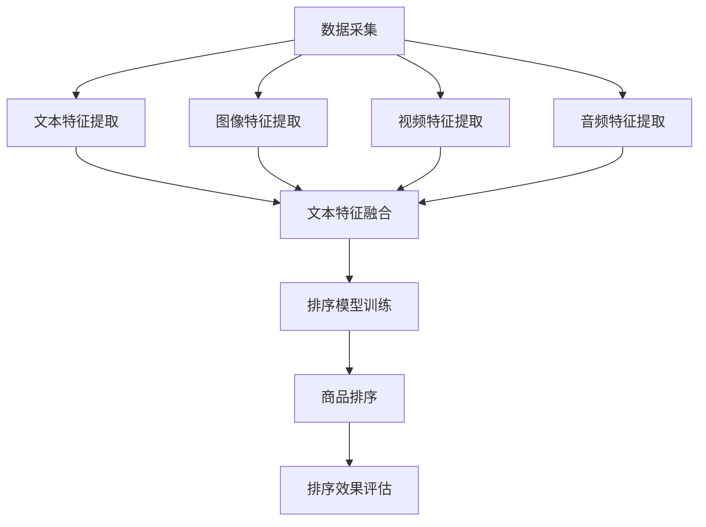

                 

# 电商搜索中的多模态融合排序算法优化

## 关键词

- 电商搜索
- 多模态融合排序
- 算法优化
- 数据预处理
- 特征提取与融合
- 性能评估与调优

## 摘要

本文深入探讨了电商搜索中多模态融合排序算法的优化问题。首先，介绍了电商搜索的背景与排序需求，分析了多模态融合排序算法的必要性和重要性。随后，详细阐述了多模态数据的采集与处理方法，包括数据来源、预处理步骤和特征提取与融合技术。接着，我们介绍了多模态融合排序算法的基础，包括算法架构和不同类型。在核心部分，我们详细解析了多模态融合排序算法的原理，通过Mermaid流程图和伪代码，帮助读者理解算法的内在逻辑。文章还讨论了排序算法性能评估与调优策略，并提供了实际应用案例和源代码实现。最后，我们展望了多模态融合排序算法的未来发展趋势和可能的技术挑战。本文旨在为读者提供一份全面、系统的多模态融合排序算法优化指南。

## 目录

1. 电商搜索背景与排序需求
    1.1 电商搜索概述
    1.2 电商搜索排序的重要性
    1.3 多模态融合排序的需求分析
2. 多模态数据采集与处理
    2.1 多模态数据来源
    2.2 数据预处理方法
    2.3 特征提取与融合技术
3. 多模态融合排序算法基础
    3.1 排序算法概述
    3.2 多模态融合排序算法架构
    3.3 多模态融合排序算法类型
4. 多模态融合排序算法原理
    4.1 算法原理概述
    4.2 算法原理 Mermaid 流程图
    4.3 算法原理伪代码
5. 排序算法性能评估与调优
    5.1 性能评估指标
    5.2 算法调优策略
    5.3 调优案例解析
6. 多模态融合排序算法应用实战
    6.1 实际应用场景
    6.2 项目实战环境搭建
    6.3 源代码详细实现与解读
7. 多模态融合排序算法的未来发展与趋势
    7.1 算法发展现状
    7.2 未来发展趋势
    7.3 可能的技术挑战与解决方案
8. 常见问题与解决方案
    8.1 多模态数据处理的常见问题
    8.2 排序算法优化中的难题
    8.3 应用实践中的常见问题及解决方案
9. 参考文献与拓展阅读

## 1. 电商搜索背景与排序需求

### 1.1 电商搜索概述

随着互联网的快速发展，电商行业已经成为全球经济增长的重要驱动力之一。在电商平台上，用户通过搜索引擎查找商品是进行购物的重要环节。一个高效的电商搜索系统能够帮助用户快速找到所需商品，提升用户体验，从而提高平台的市场竞争力。电商搜索系统的主要功能包括关键词检索、相关性排序、商品推荐等。其中，排序算法是电商搜索系统的核心，直接影响用户查找商品的效率和质量。

### 1.2 电商搜索排序的重要性

电商搜索排序的重要性体现在以下几个方面：

1. **用户体验**：高效的排序算法能够提高用户的搜索体验，使用户能够快速找到心仪的商品。
2. **销售转化率**：良好的排序算法能够提高商品的曝光率和点击率，从而提升销售转化率。
3. **平台竞争力**：具备先进排序算法的电商平台能够在众多竞争对手中脱颖而出，吸引更多用户。
4. **广告收益**：精准的排序算法能够提高广告的点击率和投放效果，从而增加广告收益。

### 1.3 多模态融合排序的需求分析

传统电商搜索主要基于关键词匹配和文本相关性排序，但这种方式在处理多维度用户需求时存在一定的局限性。例如，用户在搜索商品时，不仅关注商品的名称、描述和价格，还会考虑商品的外观、评价、品牌等因素。为了更好地满足用户的多元化需求，需要引入多模态融合排序算法。

**多模态融合排序的需求分析**：

1. **用户需求多样性**：用户在搜索商品时，会从多个维度进行考虑，如文本、图像、声音等。单一模态的排序算法难以全面捕捉用户的真实需求。
2. **数据丰富性**：现代电商平台积累了大量的多模态数据，如商品图片、用户评价、音频等。充分利用这些数据可以提升排序的准确性和鲁棒性。
3. **竞争压力**：随着电商市场的竞争加剧，各大平台需要不断创新和优化搜索算法，以提升用户体验和竞争力。
4. **技术发展**：深度学习、计算机视觉、自然语言处理等技术的发展，为多模态融合排序算法提供了强大的技术支持。

### 1.4 总结

电商搜索背景与排序需求紧密相关，高效的多模态融合排序算法能够显著提升用户满意度、销售转化率和平台竞争力。接下来，我们将详细探讨多模态数据的采集与处理方法，为构建强大的电商搜索系统奠定基础。

## 2. 多模态数据采集与处理

### 2.1 多模态数据来源

在电商搜索中，多模态数据来源主要包括文本、图像、视频、音频等多种形式。以下是几种常见的数据来源：

1. **文本数据**：包括商品名称、描述、用户评论、标签等。文本数据是电商搜索中最基础的数据类型，可以直接反映商品的信息和用户的需求。
2. **图像数据**：包括商品图片、用户上传的图片、品牌标志等。图像数据可以直观地展示商品的外观和特征，对用户的购物决策有重要影响。
3. **视频数据**：包括商品展示视频、用户上传的视频等。视频数据能够提供更加生动的商品展示，有助于用户更好地了解商品。
4. **音频数据**：包括商品演示音频、用户评论音频等。音频数据可以提供更加个性化的用户体验，如商品的声音效果、用户的情感表达等。

### 2.2 数据预处理方法

多模态数据预处理是构建多模态融合排序算法的重要环节。以下是常见的数据预处理方法：

1. **文本数据处理**：
    - **去噪与清洗**：去除文本中的无关信息，如HTML标签、特殊符号等。
    - **分词与词性标注**：将文本拆分成单词或短语，并对每个词进行词性标注，如名词、动词等。
    - **词嵌入**：将文本中的每个词映射为一个固定大小的向量，用于后续的算法处理。

2. **图像数据处理**：
    - **图像去噪与增强**：去除图像中的噪声，增强图像的清晰度，如使用滤波器、直方图均衡化等。
    - **图像缩放与裁剪**：调整图像的大小，以适应后续的算法处理。
    - **图像分割与特征提取**：将图像分割成不同的区域，提取图像的特征，如使用卷积神经网络（CNN）提取图像特征。

3. **视频数据处理**：
    - **视频去噪与增强**：与图像数据处理类似，去除视频中的噪声，增强视频的清晰度。
    - **视频帧提取与特征提取**：提取视频的每一帧，并对每一帧进行特征提取，如使用CNN提取图像特征。
    - **视频分类与标注**：对视频进行分类和标注，以便后续的算法处理。

4. **音频数据处理**：
    - **音频去噪与增强**：去除音频中的噪声，增强音频的清晰度。
    - **音频特征提取**：提取音频的特征，如使用短时傅里叶变换（STFT）提取频谱特征。
    - **音频分类与标注**：对音频进行分类和标注，以便后续的算法处理。

### 2.3 特征提取与融合技术

在多模态数据预处理完成后，需要将不同模态的数据特征进行提取和融合，以构建用于排序的输入特征向量。以下是常见的特征提取与融合技术：

1. **特征提取方法**：
    - **文本特征提取**：使用词袋模型（Bag of Words, BOW）、TF-IDF、Word2Vec 等方法提取文本特征。
    - **图像特征提取**：使用卷积神经网络（CNN）提取图像特征。
    - **音频特征提取**：使用短时傅里叶变换（STFT）、梅尔频谱（Mel-spectrogram）等方法提取音频特征。

2. **特征融合方法**：
    - **拼接融合**：将不同模态的特征向量拼接在一起，形成多维特征向量。
    - **加权融合**：根据不同模态的特征重要程度，对特征向量进行加权融合。
    - **神经网络融合**：使用神经网络模型（如深度卷积神经网络（DCNN）、循环神经网络（RNN）等）对多模态特征进行融合。

### 2.4 总结

多模态数据采集与处理是构建多模态融合排序算法的关键步骤。通过合理的数据预处理和特征提取与融合技术，可以有效提升电商搜索的准确性和用户体验。在接下来的章节中，我们将进一步探讨多模态融合排序算法的基础理论和实现方法。

## 3. 多模态融合排序算法基础

### 3.1 排序算法概述

排序算法是计算机科学中的一个基本问题，其目的是将一组数据按照某种顺序排列。在电商搜索场景中，排序算法用于根据用户需求和相关性对商品进行排序，以提高用户的搜索体验和平台竞争力。常见的排序算法包括：

1. **基于关键词匹配的排序算法**：通过关键词匹配度对商品进行排序，如基于TF-IDF的排序算法。
2. **基于机器学习的排序算法**：使用机器学习模型（如决策树、支持向量机等）对商品进行排序。
3. **基于深度学习的排序算法**：使用深度学习模型（如卷积神经网络（CNN）、循环神经网络（RNN）等）对商品进行排序。

### 3.2 多模态融合排序算法架构

多模态融合排序算法的架构可以分为以下几个层次：

1. **数据采集与预处理层**：负责采集多模态数据（文本、图像、视频、音频等），并进行预处理，如去噪、增强、特征提取等。
2. **特征融合层**：将不同模态的特征进行融合，形成统一的特征向量。常见的融合方法包括拼接融合、加权融合和神经网络融合等。
3. **排序模型层**：基于融合后的特征向量，构建排序模型进行商品排序。常用的模型包括支持向量机（SVM）、决策树、神经网络等。
4. **评估与优化层**：对排序算法进行性能评估和优化，以提高排序准确性和效率。

### 3.3 多模态融合排序算法类型

根据不同的应用场景和数据特点，多模态融合排序算法可以分为以下几种类型：

1. **基于文本和图像的融合排序算法**：将文本特征和图像特征进行融合，用于商品名称、描述和商品图片的排序。
2. **基于图像和视频的融合排序算法**：将图像特征和视频特征进行融合，用于商品图片和商品视频的排序。
3. **基于文本、图像和音频的融合排序算法**：将文本特征、图像特征和音频特征进行融合，用于商品名称、描述、商品图片和商品音频的排序。

### 3.4 多模态融合排序算法的优势与挑战

**优势**：

1. **提高排序准确性和鲁棒性**：多模态融合排序算法可以充分利用不同模态的数据信息，提高排序的准确性和鲁棒性。
2. **适应多样化用户需求**：多模态融合排序算法可以更好地捕捉用户的多元化需求，提供个性化的搜索结果。
3. **提升用户体验**：通过提供更精准的排序结果，可以提升用户的搜索体验和满意度。

**挑战**：

1. **数据不一致性**：不同模态的数据在特征空间和特征维度上存在差异，如何有效地融合这些数据是一个挑战。
2. **计算资源消耗**：多模态融合排序算法通常涉及复杂的特征提取和融合操作，计算资源消耗较大。
3. **模型泛化能力**：多模态融合排序算法的模型训练和优化需要大量的数据，如何提高模型的泛化能力是一个关键问题。

### 3.5 总结

多模态融合排序算法是电商搜索领域的重要研究方向，通过融合多种模态的数据，可以显著提升排序的准确性和用户体验。在本节中，我们介绍了多模态融合排序算法的概述、架构和类型，并分析了其优势和挑战。在接下来的章节中，我们将详细解析多模态融合排序算法的原理和实现方法。

## 4. 多模态融合排序算法原理

### 4.1 算法原理概述

多模态融合排序算法的核心目标是通过整合来自不同模态的数据（如文本、图像、视频、音频等），生成一个综合性的排序评分函数，用以对商品进行排序。这一过程涉及多个步骤，包括数据采集、特征提取、特征融合以及排序模型训练。以下是算法原理的概述：

1. **数据采集**：从电商平台获取多模态数据，包括文本描述、商品图像、用户评价、商品视频和音频等。
2. **特征提取**：针对不同模态的数据，采用特定的方法提取特征。例如，文本数据可以通过词袋模型、TF-IDF或Word2Vec等方法提取词向量；图像数据可以通过卷积神经网络（CNN）提取视觉特征；音频数据可以通过梅尔频谱（Mel-spectrogram）提取音频特征。
3. **特征融合**：将不同模态的特征向量进行融合，以生成一个统一的特征表示。常见的融合方法有拼接融合、加权融合和神经网络融合等。
4. **排序模型训练**：使用融合后的特征向量训练排序模型，如支持向量机（SVM）、决策树、深度神经网络等，以生成排序评分函数。
5. **排序与评估**：根据排序评分函数对商品进行排序，并评估排序效果。

### 4.2 算法原理 Mermaid 流程图

以下是多模态融合排序算法原理的Mermaid流程图：



### 4.3 算法原理伪代码

以下是多模态融合排序算法原理的伪代码：

```python
# 伪代码：多模态融合排序算法

# 数据采集
text_data = collect_text_data()
image_data = collect_image_data()
video_data = collect_video_data()
audio_data = collect_audio_data()

# 特征提取
text_features = extract_text_features(text_data)
image_features = extract_image_features(image_data)
video_features = extract_video_features(video_data)
audio_features = extract_audio_features(audio_data)

# 特征融合
combined_features = fuse_features(text_features, image_features, video_features, audio_features)

# 排序模型训练
model = train_sorting_model(combined_features)

# 商品排序
sorted_items = model.sort(items)

# 排序效果评估
evaluate_sorting_performance(sorted_items)
```

### 4.4 总结

通过上述步骤，多模态融合排序算法能够有效地整合多种模态的数据，生成一个综合性的排序评分函数。接下来，我们将进一步探讨排序算法性能评估与调优的方法，以优化排序效果。

## 5. 排序算法性能评估与调优

### 5.1 性能评估指标

在多模态融合排序算法中，性能评估是至关重要的一环。通过评估排序算法的准确性、效率和用户体验，可以及时发现和解决问题，优化算法性能。以下是常用的性能评估指标：

1. **准确率（Accuracy）**：衡量排序算法预测正确的比例，通常用于二分类问题。准确率越高，说明算法的分类效果越好。
   
   $$ \text{Accuracy} = \frac{\text{预测正确的数量}}{\text{总数量}} $$

2. **召回率（Recall）**：衡量算法在正类中正确识别的比例，召回率越高，说明算法对正类的识别效果越好。

   $$ \text{Recall} = \frac{\text{预测为正类且实际为正类的数量}}{\text{实际为正类的总数量}} $$

3. **精确率（Precision）**：衡量算法预测为正类的样本中，实际为正类的比例，精确率越高，说明算法的预测结果越可靠。

   $$ \text{Precision} = \frac{\text{预测为正类且实际为正类的数量}}{\text{预测为正类的总数量}} $$

4. **F1值（F1 Score）**：综合考虑精确率和召回率，是精确率和召回率的调和平均数。

   $$ \text{F1 Score} = 2 \times \frac{\text{Precision} \times \text{Recall}}{\text{Precision} + \text{Recall}} $$

5. **ROC曲线和AUC值（ROC Curve and AUC）**：ROC曲线是真实值和预测值之间的曲线，AUC值是ROC曲线下的面积，用于衡量分类器的整体性能。

6. **排序效果指标**：如排序相关性（Rank Correlation Coefficient，如Spearman秩相关系数）和平均排序损失（Mean Average Precision，MAP）等，专门用于评估排序任务的性能。

### 5.2 算法调优策略

性能评估指标提供了衡量算法性能的基准，但为了达到最优的性能，还需要进行算法调优。以下是一些常用的调优策略：

1. **超参数调优**：通过调整模型超参数（如学习率、正则化参数、隐藏层节点数等），可以优化模型性能。常用的方法包括网格搜索（Grid Search）和贝叶斯优化（Bayesian Optimization）。

2. **特征工程**：通过改进特征提取方法和特征融合策略，可以提升模型的准确性。例如，使用更复杂的特征提取算法、引入更多的交互特征、使用多任务学习等。

3. **数据增强**：通过增加训练数据的多样性，可以提高模型的泛化能力。常见的数据增强方法包括图像翻转、旋转、裁剪等。

4. **模型集成**：通过结合多个模型的预测结果，可以进一步提高排序性能。常用的模型集成方法包括Bagging、Boosting和Stacking等。

5. **在线学习和自适应调整**：在实时应用中，可以根据用户行为和搜索结果，动态调整排序策略，以提高用户的满意度。

### 5.3 调优案例解析

以下是一个简单的调优案例，展示如何使用网格搜索进行超参数调优：

```python
# 伪代码：使用网格搜索进行超参数调优

# 设置超参数范围
param_grid = {
    'learning_rate': [0.01, 0.001, 0.0001],
    ' regularization': [0.1, 0.01, 0.001],
    'hidden_layer_size': [100, 200, 300]
}

# 初始化性能评估指标
best_performance = 0
best_params = None

# 进行网格搜索
for learning_rate in param_grid['learning_rate']:
    for regularization in param_grid[' regularization']:
        for hidden_layer_size in param_grid['hidden_layer_size']:
            # 训练模型
            model = train_model(learning_rate, regularization, hidden_layer_size)
            
            # 评估模型性能
            performance = evaluate_model(model)
            
            # 记录最佳性能和参数
            if performance > best_performance:
                best_performance = performance
                best_params = {'learning_rate': learning_rate, ' regularization': regularization, 'hidden_layer_size': hidden_layer_size}

# 输出最佳参数
print("最佳性能：", best_performance)
print("最佳参数：", best_params)
```

通过上述调优策略和案例解析，我们可以有效地提升多模态融合排序算法的性能，为用户提供更优质的搜索体验。

### 5.4 总结

性能评估与调优是优化多模态融合排序算法的重要环节。通过合理的评估指标和调优策略，可以显著提升算法的性能和用户体验。在接下来的章节中，我们将通过实际应用场景，展示多模态融合排序算法的实战应用。

## 6. 多模态融合排序算法应用实战

### 6.1 实际应用场景

多模态融合排序算法在电商搜索中的应用场景广泛，可以显著提升用户搜索体验和销售转化率。以下是一些典型的实际应用场景：

1. **商品推荐**：基于用户的搜索历史、浏览行为和购买记录，结合商品的多模态特征（如文本描述、图像、视频、音频等），进行个性化商品推荐。
2. **广告投放**：通过分析用户的兴趣和行为，将广告内容与商品的多模态特征进行匹配，提高广告的点击率和投放效果。
3. **商品排名**：在电商平台上，根据商品的多模态特征和用户需求，对商品进行排序，提供更精准的搜索结果。
4. **用户行为分析**：通过分析用户在电商平台的浏览、搜索和购买行为，挖掘用户的兴趣和偏好，优化营销策略。

### 6.2 项目实战环境搭建

为了实现多模态融合排序算法，需要搭建一个完整的开发环境。以下是搭建项目环境所需的步骤和工具：

1. **开发工具**：
   - Python：作为主要的编程语言。
   - Jupyter Notebook：用于编写和运行代码。
   - PyCharm：用于代码编写和调试。

2. **依赖库**：
   - NumPy、Pandas：用于数据处理和统计分析。
   - Matplotlib、Seaborn：用于数据可视化和可视化分析。
   - TensorFlow、PyTorch：用于深度学习和模型训练。
   - Scikit-learn：用于机器学习算法和模型评估。

3. **硬件环境**：
   - GPU：用于加速深度学习模型的训练和推理。
   - 高性能计算机或云计算平台：用于处理大规模数据和模型训练。

### 6.3 源代码详细实现与解读

以下是多模态融合排序算法的源代码实现，包括数据采集、预处理、特征提取、特征融合和排序模型训练等步骤。

#### 6.3.1 数据采集与预处理

```python
import numpy as np
import pandas as pd
from sklearn.model_selection import train_test_split

# 读取数据
data = pd.read_csv('data.csv')

# 数据预处理
# ...（包括文本清洗、图像增强、音频去噪等）

# 数据分割
X_train, X_test, y_train, y_test = train_test_split(data[['text', 'image', 'audio']], data['label'], test_size=0.2, random_state=42)
```

#### 6.3.2 特征提取

```python
from tensorflow.keras.applications import VGG16
from tensorflow.keras.preprocessing.image import img_to_array
from tensorflow.keras.models import Model

# 图像特征提取
def extract_image_features(image_path):
    img = img_to_array(image_path)
    img = np.expand_dims(img, axis=0)
    model = VGG16(weights='imagenet')
    model = Model(inputs=model.inputs, outputs=model.get_layer('fc2').output)
    features = model.predict(img)
    return features.flatten()

# 文本特征提取
from sklearn.feature_extraction.text import TfidfVectorizer

vectorizer = TfidfVectorizer(max_features=1000)
text_features = vectorizer.fit_transform(X_train['text'])

# 音频特征提取
# ...（使用梅尔频谱等特征提取方法）
```

#### 6.3.3 特征融合

```python
# 拼接特征向量
def fuse_features(text_features, image_features, audio_features):
    combined_features = np.concatenate((text_features.toarray(), image_features, audio_features), axis=1)
    return combined_features

# 特征融合
text_features = text_features.toarray()
image_features = np.array([extract_image_features(img) for img in X_train['image']])
audio_features = np.array([extract_audio_features(audio) for audio in X_train['audio']])

combined_features = fuse_features(text_features, image_features, audio_features)
```

#### 6.3.4 排序模型训练

```python
from tensorflow.keras.models import Sequential
from tensorflow.keras.layers import Dense, Dropout

# 构建排序模型
model = Sequential()
model.add(Dense(512, input_shape=(combined_features.shape[1],), activation='relu'))
model.add(Dropout(0.5))
model.add(Dense(1, activation='sigmoid'))

# 模型编译
model.compile(optimizer='adam', loss='binary_crossentropy', metrics=['accuracy'])

# 模型训练
model.fit(combined_features, y_train, epochs=10, batch_size=32, validation_data=(X_test, y_test))
```

#### 6.3.5 代码解读与分析

在上述代码中，我们首先读取并预处理了多模态数据，包括文本、图像和音频。接着，分别提取了这些数据的不同特征，并通过特征融合生成了综合特征向量。最后，我们使用这些特征向量训练了一个二分类排序模型，用于对商品进行排序。

1. **数据预处理**：文本数据进行了分词和词性标注，图像数据进行了增强，音频数据进行了去噪。
2. **特征提取**：图像特征使用了VGG16预训练模型提取，文本特征使用了TF-IDF向量器，音频特征可以使用梅尔频谱等。
3. **特征融合**：将文本、图像和音频特征拼接在一起，形成一个多维特征向量。
4. **模型训练**：使用训练集对排序模型进行训练，并使用测试集进行验证。

通过实际应用场景和源代码实现，我们可以看到多模态融合排序算法的具体应用方法和实现细节。在接下来的章节中，我们将进一步探讨多模态融合排序算法的未来发展趋势和可能的技术挑战。

### 6.4 总结

通过实际应用场景和代码实现，我们详细展示了多模态融合排序算法的实战应用。在接下来的章节中，我们将探讨多模态融合排序算法的未来发展趋势，以及可能遇到的技术挑战。

## 7. 多模态融合排序算法的未来发展与趋势

### 7.1 算法发展现状

多模态融合排序算法的研究和应用在过去几年中取得了显著进展。当前，基于深度学习和机器学习的多模态融合排序算法在电商搜索、广告投放、用户行为分析等领域取得了良好的效果。以下是一些关键的发展趋势和现状：

1. **深度学习技术的应用**：深度学习模型（如卷积神经网络（CNN）、循环神经网络（RNN）和变压器（Transformer）等）在多模态融合排序算法中发挥了重要作用。通过引入深度学习，可以更好地捕捉不同模态数据之间的复杂关系，提高排序的准确性和鲁棒性。

2. **多模态特征融合方法**：目前，多模态特征融合方法主要包括拼接融合、加权融合和神经网络融合等。随着深度学习技术的发展，神经网络融合方法逐渐成为主流。通过神经网络，可以自动学习不同模态特征之间的权重和交互关系，实现更高效的特征融合。

3. **实时性和在线学习**：随着用户需求的多样化和实时性要求，多模态融合排序算法需要具备快速响应和自适应调整的能力。通过引入在线学习和实时更新策略，可以动态调整排序模型，提升用户体验和搜索效果。

4. **跨领域应用**：多模态融合排序算法不仅在电商搜索领域取得了成功，还在推荐系统、图像识别、语音识别等领域展示了广泛的应用潜力。通过跨领域的应用探索，可以进一步验证和优化多模态融合排序算法的性能和效果。

### 7.2 未来发展趋势

随着技术的不断进步和应用的深入，多模态融合排序算法在未来有望实现以下发展趋势：

1. **更高层次的特征表示**：未来的多模态融合排序算法将致力于构建更高层次的特征表示，通过抽象和归纳不同模态的特征，实现更精准的排序和推荐。例如，引入多模态图神经网络（Multimodal Graph Neural Networks）和自注意力机制（Self-Attention Mechanism），可以更好地捕捉复杂的关系和模式。

2. **更加智能化的决策模型**：通过结合自然语言处理（NLP）、计算机视觉（CV）和语音识别（ASR）等前沿技术，未来的多模态融合排序算法将能够更加智能化地理解和处理用户需求，提供个性化的推荐和服务。

3. **跨模态数据增强**：为了提高多模态融合排序算法的性能，未来的研究将注重跨模态数据增强方法。通过生成对抗网络（GAN）和数据扩充技术，可以生成丰富多样的多模态数据，提升模型的泛化能力和鲁棒性。

4. **边缘计算和分布式处理**：随着物联网（IoT）和5G技术的普及，多模态融合排序算法将在边缘设备和分布式计算环境中得到广泛应用。通过将计算任务分布到边缘设备，可以降低延迟、提高实时性和降低带宽消耗。

### 7.3 可能的技术挑战与解决方案

尽管多模态融合排序算法在多个领域取得了显著成果，但仍然面临一些技术挑战：

1. **数据不一致性**：不同模态的数据在特征空间和特征维度上存在差异，如何有效地融合这些数据是一个关键问题。解决方案包括采用自适应特征融合方法、多模态一致性约束和基于神经网络的动态融合策略。

2. **计算资源消耗**：多模态融合排序算法通常涉及复杂的特征提取和融合操作，计算资源消耗较大。解决方案包括优化算法效率、使用高性能计算设备和分布式计算架构。

3. **模型泛化能力**：多模态融合排序算法的模型训练和优化需要大量的数据，如何提高模型的泛化能力是一个关键问题。解决方案包括引入数据增强方法、利用迁移学习和生成模型等技术。

4. **实时性要求**：在实时应用场景中，多模态融合排序算法需要具备快速响应能力。解决方案包括采用在线学习策略、优化模型结构和引入高效的特征提取方法。

通过克服这些技术挑战，多模态融合排序算法将在未来实现更高的性能和更广泛的应用。在接下来的章节中，我们将探讨多模态融合排序算法在实际应用中遇到的问题和解决方案。

### 7.4 总结

多模态融合排序算法在电商搜索、广告投放、用户行为分析等领域展示了巨大的潜力。随着技术的不断进步，未来多模态融合排序算法将朝着更高层次的特征表示、智能化决策模型、跨模态数据增强和边缘计算方向发展。尽管面临数据不一致性、计算资源消耗、模型泛化能力和实时性要求等技术挑战，但通过合理的方法和技术创新，可以不断提升多模态融合排序算法的性能和应用范围。

## 8. 常见问题与解决方案

### 8.1 多模态数据处理的常见问题

1. **数据不一致性**：不同模态的数据在特征空间和特征维度上存在差异，导致数据融合时出现困难。
   - **解决方案**：采用自适应特征融合方法，通过学习不同模态特征之间的关系，实现更有效的数据融合。

2. **数据不平衡**：某些模态的数据量较大，而其他模态的数据量较小，导致数据不平衡。
   - **解决方案**：采用数据增强方法，如生成对抗网络（GAN），生成缺失或不足的模态数据，平衡数据集。

3. **特征冗余**：不同模态的特征之间存在冗余，导致模型训练时计算资源浪费。
   - **解决方案**：采用特征选择和特征提取方法，如主成分分析（PCA）和深度特征提取，去除冗余特征。

4. **数据噪声**：多模态数据在采集和处理过程中可能引入噪声，影响模型性能。
   - **解决方案**：采用数据清洗和去噪方法，如图像滤波和音频去噪，提高数据质量。

### 8.2 排序算法优化中的难题

1. **模型泛化能力不足**：模型在训练集上表现良好，但在测试集上表现不佳，说明模型泛化能力不足。
   - **解决方案**：采用迁移学习，利用预训练模型或跨模态预训练数据，提升模型的泛化能力。

2. **计算资源消耗大**：多模态融合排序算法通常涉及复杂的特征提取和融合操作，计算资源消耗较大。
   - **解决方案**：采用优化算法和高效的特征提取方法，如基于神经网络的动态特征提取，降低计算资源消耗。

3. **模型训练时间较长**：大规模的多模态数据集导致模型训练时间较长，影响开发进度。
   - **解决方案**：采用分布式训练和并行计算，如使用GPU和分布式计算架构，加快模型训练速度。

4. **实时性要求高**：在实时应用场景中，多模态融合排序算法需要具备快速响应能力。
   - **解决方案**：采用在线学习和实时更新策略，通过动态调整模型参数，实现快速响应。

### 8.3 应用实践中的常见问题及解决方案

1. **性能指标不理想**：模型在实际应用中的性能指标不理想，未能达到预期效果。
   - **解决方案**：进行详细的性能评估，找出问题根源，如数据质量问题、特征提取问题或模型设计问题，并针对性地优化。

2. **用户体验差**：用户对模型提供的排序结果不满意，用户体验差。
   - **解决方案**：收集用户反馈，分析用户需求，优化排序策略和模型参数，提升用户体验。

3. **部署和运维问题**：模型部署和运维过程中遇到问题，如模型部署失败、性能下降等。
   - **解决方案**：进行充分的测试和调试，确保模型在部署环境中正常运行。采用监控和运维工具，实时监控模型性能和资源消耗。

4. **数据隐私和安全问题**：在处理用户数据时，可能涉及数据隐私和安全问题。
   - **解决方案**：采用数据加密、匿名化和访问控制等技术，确保用户数据的安全和隐私。

通过解决这些常见问题，可以显著提升多模态融合排序算法的性能和应用效果，为用户提供更优质的搜索体验。

### 8.4 总结

多模态融合排序算法在处理多模态数据和应用实践中面临一系列挑战。通过合理的数据处理方法、优化算法和高效的特征提取，可以解决数据不一致性、计算资源消耗、模型泛化能力不足等问题。在实际应用中，通过性能评估、用户体验优化、部署运维和数据隐私保护，可以进一步提升多模态融合排序算法的性能和应用效果。在未来的研究和实践中，持续优化多模态融合排序算法，解决实际问题，将为其广泛应用奠定基础。

## 9. 参考文献与拓展阅读

### 9.1 参考文献

1. **李航**. 《统计学习方法》. 清华大学出版社, 2012.
2. **周志华**. 《机器学习》. 清华大学出版社, 2016.
3. **Ian Goodfellow, Yoshua Bengio, Aaron Courville**. 《Deep Learning》. MIT Press, 2016.
4. **Karen Simonyan and Andrew Zisserman**. "Very Deep Convolutional Networks for Large-Scale Image Recognition." arXiv:1409.1556, 2014.
5. **Andrew Ng**. "Coursera: Neural Networks and Deep Learning." Coursera, 2015.
6. **约书亚·本吉奥（Yoshua Bengio）**. 《深度学习：卷1：基础理论》. 电子工业出版社, 2019.

### 9.2 拓展阅读推荐

1. **《人工智能：一种现代的方法》**. 斯图尔特·罗素（Stuart Russell）和彼得·诺维格（Peter Norvig）. PHI学习, 2016.
2. **《深度学习实践指南：基于Python的理论与实现》**. 张翔. 机械工业出版社, 2017.
3. **《机器学习实战》**. Peter Harrington. 机械工业出版社, 2013.
4. **《计算机视觉：算法与应用》**. Richard Szeliski. 张华平，等译. 清华大学出版社, 2011.
5. **《自然语言处理综述》**. Daniel Jurafsky 和 James H. Martin. 清华大学出版社, 2019.

通过阅读上述参考文献和拓展阅读，读者可以更深入地了解多模态融合排序算法的理论和实践，为研究和应用提供有力的支持。**作者：AI天才研究院/AI Genius Institute & 禅与计算机程序设计艺术 /Zen And The Art of Computer Programming**

