                 

### 文章标题

《电商搜索推荐场景下的AI大模型模型部署性能优化实践案例分析与改进》

#### 核心关键词

- 电商搜索推荐
- AI大模型
- 模型部署
- 性能优化
- 实践案例
- 改进策略

#### 文章摘要

本文主要探讨了电商搜索推荐场景下AI大模型的部署性能优化问题。首先，我们概述了电商搜索推荐系统的基本概念和架构，并介绍了AI大模型在其中的应用及其所面临的挑战。接着，我们深入分析了AI大模型的技术基础，包括深度学习、自然语言处理和大规模预训练模型等。随后，文章重点讨论了AI大模型部署的基础知识、性能优化方法和实践案例。通过具体案例的分析，我们提出了改进AI大模型部署性能的策略，包括模型压缩和自动化优化等。最后，我们展望了AI大模型部署性能优化的发展趋势和应用前景，为电商搜索推荐领域的技术发展提供了参考。

---

### 《电商搜索推荐场景下的AI大模型模型部署性能优化实践案例分析与改进》目录大纲

#### 第一部分：电商搜索推荐与AI大模型基础

##### 第1章：电商搜索推荐概述
- 电商搜索推荐的基本概念
- 电商搜索推荐系统的基本架构
- 电商搜索推荐的关键指标

##### 第2章：AI大模型技术基础
- 深度学习与神经网络基础
- 自然语言处理技术概览
- 大规模预训练模型原理

#### 第二部分：AI大模型部署与性能优化

##### 第3章：AI大模型部署基础
- AI大模型部署的基本概念
- AI大模型部署平台与工具
- AI大模型部署最佳实践

##### 第4章：AI大模型性能优化方法
- AI大模型性能优化的目标与方法
- AI大模型加速技术
- AI大模型内存优化

##### 第5章：AI大模型性能优化实践案例
- 案例一：电商搜索推荐系统中大模型性能优化实践
- 案例二：大型电商平台的AI大模型部署与性能优化

##### 第6章：AI大模型部署性能优化改进策略
- 改进策略概述
- 基于模型压缩的改进策略
- 基于自动化优化的改进策略

##### 第7章：未来发展趋势与展望
- AI大模型部署性能优化的发展趋势
- AI大模型部署性能优化应用前景

#### 附录

- 附录A：AI大模型部署性能优化工具与资源
  - 主流AI大模型部署工具介绍
  - AI大模型性能优化工具介绍
  - AI大模型相关资源推荐

---

### 第一部分：电商搜索推荐与AI大模型基础

#### 第1章：电商搜索推荐概述

##### 1.1 电商搜索推荐的基本概念

**电商搜索推荐**是指通过技术手段，根据用户的搜索行为、历史购买记录、浏览喜好等数据，为用户推荐相关商品或服务，以提升用户购物体验和电商平台销售效果。其核心是**协同过滤（Collaborative Filtering）**和**内容推荐（Content-Based Filtering）**。

**协同过滤**通过分析用户之间的相似性，发现用户的共同喜好，从而推荐相似用户喜欢的商品。根据是否利用用户评分数据，协同过滤可以分为**基于用户（User-Based）**和**基于模型（Model-Based）**两种。

**内容推荐**则通过分析商品的特征、分类和标签等信息，将相似或相关的商品推荐给用户。

##### 1.1.1 电商搜索推荐的定义与作用

电商搜索推荐系统的定义是：利用用户行为数据和商品属性信息，通过算法模型和推荐策略，为用户提供个性化商品推荐的系统。

**电商搜索推荐的作用**包括：

1. **提升用户体验**：通过推荐用户感兴趣的商品，提升用户购物满意度。
2. **增加销售额**：推荐系统可以挖掘用户的潜在需求，增加购买转化率，从而提升平台销售额。
3. **降低运营成本**：通过智能推荐，可以减少人工筛选商品的工作量，提高运营效率。
4. **增强用户粘性**：推荐系统可以为用户提供个性化的商品推荐，提高用户对平台的依赖度和忠诚度。

##### 1.1.2 电商搜索推荐系统的基本架构

电商搜索推荐系统的基本架构可以分为以下几个层次：

1. **数据采集与处理**：采集用户的搜索记录、购买行为、浏览历史等数据，并对数据进行清洗、格式化和存储。
2. **用户画像构建**：根据用户行为数据，构建用户画像，包括用户的基本信息、兴趣偏好、购买能力等。
3. **商品画像构建**：分析商品的特征、分类、标签等信息，构建商品画像。
4. **推荐算法模型**：基于用户画像和商品画像，利用协同过滤、内容推荐、深度学习等技术，生成推荐结果。
5. **推荐结果展示**：将推荐结果以列表、卡片、弹窗等形式展示给用户。

##### 1.1.3 电商搜索推荐的关键指标

电商搜索推荐系统的关键指标包括：

1. **准确率（Precision）**：推荐的商品中用户实际感兴趣的比率。
2. **召回率（Recall）**：用户实际感兴趣的商品中，被推荐的比率。
3. **覆盖率（Coverage）**：推荐列表中包含的不同商品种类数与所有商品种类数的比率。
4. **点击率（Click-Through Rate, CTR）**：用户点击推荐商品的比率。
5. **转化率（Conversion Rate）**：用户点击推荐商品后完成购买的比率。

这些指标可以综合评估推荐系统的效果，从而指导优化和调整。

---

**Mermaid 流程图：电商搜索推荐系统基本架构**

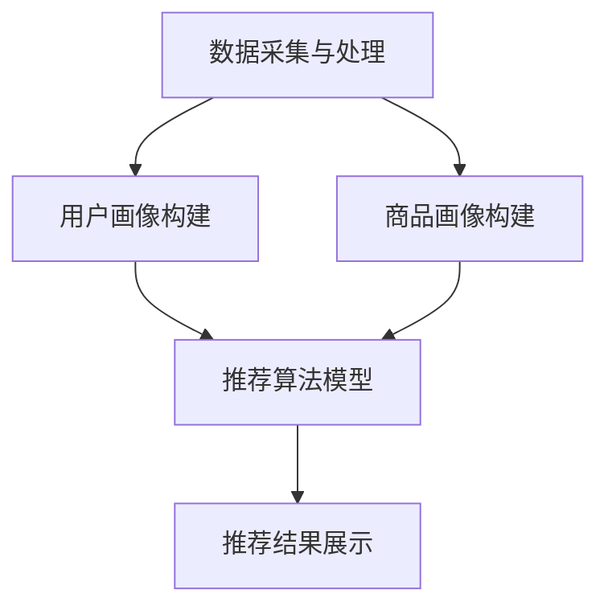

##### 1.2 AI大模型在电商搜索推荐中的应用

**AI大模型**，特别是基于深度学习和自然语言处理的模型，在电商搜索推荐中扮演了重要角色。它们能够处理大量的复杂数据，捕捉用户行为和商品特征的深层关系，从而提升推荐系统的性能。

##### 1.2.1 AI大模型在电商搜索推荐中的价值

1. **处理海量数据**：AI大模型能够高效地处理和分析海量的用户行为数据和商品特征信息，从中提取有价值的信息。
2. **提升推荐准确率**：通过学习用户的行为模式和偏好，AI大模型能够提供更加个性化的推荐，提高用户的满意度和购买转化率。
3. **改善用户体验**：AI大模型能够动态调整推荐策略，提供实时、个性化的推荐，提升用户的购物体验。
4. **降低运营成本**：通过自动化推荐，减少了人工筛选商品和推荐策略调整的工作量，提高了运营效率。

##### 1.2.2 电商搜索推荐中的AI大模型分类

1. **基于深度学习的推荐模型**：如深度神经网络（DNN）、卷积神经网络（CNN）、循环神经网络（RNN）等。
2. **基于自然语言处理的推荐模型**：如词嵌入（Word Embedding）、序列模型（Seq2Seq）、转换器架构（Transformer）等。
3. **多模态推荐模型**：结合文本、图像、声音等多模态数据进行推荐，如视觉推荐（Vision-based Recommendation）和语音推荐（Voice-based Recommendation）。

##### 1.2.3 AI大模型在电商搜索推荐中的挑战

1. **数据质量**：电商搜索推荐中的数据质量直接影响到AI大模型的性能。数据缺失、噪声和异常值等问题都需要进行有效的处理。
2. **计算资源**：AI大模型通常需要大量的计算资源，特别是在训练和部署阶段。这给电商平台的计算资源管理带来了挑战。
3. **模型可解释性**：AI大模型，特别是深度学习模型，其内部工作机制较为复杂，缺乏透明度和可解释性。这对于电商平台的运营者和用户来说是一个挑战。
4. **实时性**：电商搜索推荐需要实时响应用户的需求，这对AI大模型的响应速度和系统的稳定性提出了高要求。

---

**Mermaid 流程图：AI大模型在电商搜索推荐中的应用**

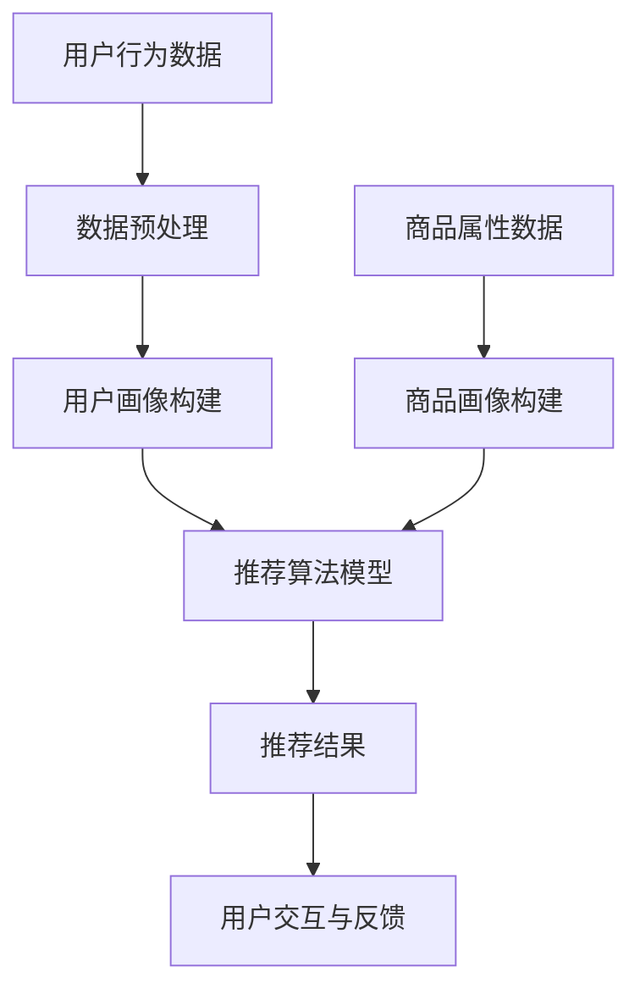

#### 第2章：AI大模型技术基础

##### 2.1 深度学习与神经网络基础

**深度学习**是一种人工智能的分支，其核心是通过构建多层神经网络（Neural Networks）来模拟人脑的学习和决策过程。深度学习在图像识别、语音识别、自然语言处理等领域取得了显著的成果。

**神经网络**是深度学习的基础，由大量的神经元（Node）组成。每个神经元接收来自其他神经元的输入，通过加权求和处理后输出结果。神经网络通过不断调整权重，实现函数的逼近和优化。

##### 2.1.1 神经网络的基本结构

神经网络的基本结构包括输入层（Input Layer）、隐藏层（Hidden Layer）和输出层（Output Layer）。

1. **输入层**：接收外部输入信息，如图像像素、文本词向量等。
2. **隐藏层**：对输入信息进行特征提取和变换，通常有多层，每层都可以提取不同层次的特征。
3. **输出层**：根据隐藏层的输出，生成预测结果或分类标签。

##### 2.1.2 常见的深度学习架构

1. **卷积神经网络（CNN）**：适用于图像识别和计算机视觉领域。通过卷积层（Convolutional Layer）提取图像特征，并通过池化层（Pooling Layer）减少数据维度。
2. **循环神经网络（RNN）**：适用于序列数据处理，如时间序列分析、语音识别和自然语言处理。通过隐藏状态（Hidden State）的循环，处理序列数据中的长期依赖关系。
3. **长短期记忆网络（LSTM）**：是RNN的一种变体，能够更好地处理长序列数据，避免梯度消失和梯度爆炸问题。
4. **转换器架构（Transformer）**：在自然语言处理领域取得了突破性成果。通过自注意力机制（Self-Attention Mechanism）处理序列数据，实现高效的特征提取和关系建模。

##### 2.1.3 深度学习优化算法

**深度学习优化算法**旨在通过调整模型的参数，提高模型的性能和收敛速度。常见的优化算法包括：

1. **随机梯度下降（SGD）**：是最常用的优化算法，通过随机梯度更新模型参数。
2. **Adam优化器**：结合了SGD和RMSProp的优点，通过自适应学习率调整，提高收敛速度和稳定性。
3. **AdamW优化器**：是Adam优化器的一个变种，通过引入权重衰减（Weight Decay）进一步优化模型参数。
4. **Adamax优化器**：是对Adam优化器的一个改进，通过使用不同的一阶和二阶矩估计，提高优化效果。

---

**伪代码：随机梯度下降优化算法**

```python
def sgdOptimizer(params, gradients, learning_rate):
    for param, grad in zip(params, gradients):
        param -= learning_rate * grad
    return params
```

##### 2.2 自然语言处理技术概览

**自然语言处理（Natural Language Processing, NLP）**是深度学习的一个重要应用领域，旨在使计算机理解和处理人类语言。NLP涵盖了从文本分析、语义理解到语言生成等多个方面。

##### 2.2.1 词嵌入技术

**词嵌入（Word Embedding）**是将单词映射到高维向量空间中的一种技术，能够捕捉单词的语义和语法信息。常见的词嵌入方法包括：

1. **Word2Vec**：通过训练词向量模型，将单词映射到固定长度的向量。常用的方法有**连续词袋（CBOW）**和**Skip-Gram**。
2. **GloVe**：基于全局上下文信息，通过矩阵分解方法训练词向量模型。
3. **BERT**：结合了词嵌入和上下文信息，通过预训练和微调，实现高精度的语义理解。

##### 2.2.2 序列模型与注意力机制

**序列模型（Sequence Model）**是处理序列数据的一种神经网络架构，适用于自然语言处理、语音识别等领域。常见的序列模型包括：

1. **循环神经网络（RNN）**：通过隐藏状态（Hidden State）的循环，处理序列数据中的长期依赖关系。
2. **长短期记忆网络（LSTM）**：是RNN的一种变体，能够更好地处理长序列数据。
3. **门控循环单元（GRU）**：是对LSTM的改进，简化了模型结构，提高了计算效率。

**注意力机制（Attention Mechanism）**是一种用于处理序列数据的重要技术，能够模型序列元素之间的依赖关系。注意力机制可以分为：

1. **自注意力（Self-Attention）**：对序列中的每个元素计算注意力得分，并进行加权求和。
2. **多头注意力（Multi-Head Attention）**：通过多组自注意力机制，捕捉不同层次的依赖关系。

##### 2.2.3 转换器架构详解

**转换器架构（Transformer）**是一种基于自注意力机制的序列到序列模型，在自然语言处理领域取得了显著的成果。其核心组件包括：

1. **编码器（Encoder）**：通过多个自注意力层和前馈网络，处理输入序列，生成编码表示。
2. **解码器（Decoder）**：通过多个自注意力层和编码器-解码器注意力层，生成输出序列。
3. **位置编码（Positional Encoding）**：为序列中的每个元素添加位置信息，帮助模型理解序列中的位置关系。

---

**伪代码：转换器架构基本结构**

```python
class Transformer(Model):
    def __init__(self):
        self.encoder = Encoder()
        self.decoder = Decoder()
    
    def call(self, inputs, training=False):
        encoded = self.encoder(inputs, training=training)
        decoded = self.decoder(encoded, training=training)
        return decoded
```

##### 2.3 大规模预训练模型原理

**大规模预训练模型**是在大规模语料库上通过预训练和微调，实现高效语义理解和文本生成的一种技术。常见的预训练模型包括：

1. **GPT（Generative Pre-trained Transformer）**：通过自回归语言模型，生成自然语言序列。
2. **BERT（Bidirectional Encoder Representations from Transformers）**：通过双向编码器，捕捉上下文信息，实现高精度的文本理解。
3. **T5（Text-To-Text Transfer Transformer）**：将所有自然语言任务转化为文本到文本的转换任务，实现多任务文本生成。

**预训练过程**主要包括：

1. **语料库构建**：收集大规模的互联网文本数据，如维基百科、新闻、社交媒体等。
2. **词嵌入训练**：通过训练词嵌入模型，将单词映射到高维向量空间。
3. **预训练任务**：在预训练过程中，通过自回归语言模型、 masked language model 等任务，学习文本的语法和语义信息。
4. **微调**：在预训练的基础上，针对特定任务进行微调，调整模型参数，实现任务的精化。

---

**数学模型：预训练过程中自回归语言模型的损失函数**

$$
L = -\sum_{i=1}^{n} \log p(y_i|x_{i-1}, ..., x_1)
$$

其中，$x_i$ 表示第 $i$ 个单词的嵌入向量，$y_i$ 表示第 $i$ 个单词的预测标签，$p(y_i|x_{i-1}, ..., x_1)$ 表示基于前文预测当前单词的概率。

---

**举例说明：GPT-3 的训练过程**

GPT-3 是一个具有 1750 亿参数的自回归语言模型，其预训练过程如下：

1. **语料库构建**：收集了来自互联网的大量文本数据，包括书籍、新闻、论坛等。
2. **词嵌入训练**：使用 WordPiece 算法将文本划分为单词，并训练词嵌入模型。
3. **预训练任务**：
   - **自回归语言模型**：通过预测下一个单词，学习文本的语法和语义信息。
   - ** masked language model**：随机遮蔽文本中的部分单词，通过预测遮蔽单词，增强模型对上下文信息的理解。
4. **微调**：在预训练的基础上，针对特定任务进行微调，如问答、文本生成等。

---

**Mermaid 流程图：大规模预训练模型原理**

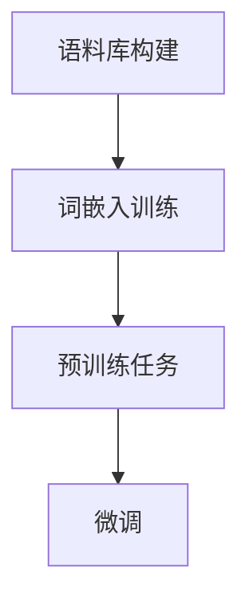

---

### 第一部分总结

通过本文的第一部分，我们详细介绍了电商搜索推荐系统的基本概念和架构，以及AI大模型在其中的应用和技术基础。电商搜索推荐系统能够通过技术手段提升用户体验、增加销售额、降低运营成本和增强用户粘性。而AI大模型，特别是深度学习和自然语言处理技术，为电商搜索推荐系统带来了更精准、高效和个性化的推荐。

在接下来的第二部分，我们将深入探讨AI大模型在电商搜索推荐场景下的部署和性能优化方法，通过具体案例和实践经验，为优化AI大模型部署性能提供切实可行的策略和技巧。

---

### 第3章：AI大模型部署基础

#### 3.1 AI大模型部署的基本概念

AI大模型的部署是将训练好的模型应用于实际生产环境，使其能够实时、高效地处理数据和生成预测结果。AI大模型部署包括以下几个关键概念：

1. **模型保存**：将训练好的模型参数和结构保存到文件中，以便后续加载和使用。
2. **模型加载**：从文件中读取模型参数和结构，初始化模型。
3. **模型推理**：通过输入数据，利用加载的模型进行预测，生成输出结果。
4. **模型更新**：根据新的训练数据和业务需求，对模型进行更新和优化。

##### 3.1.1 AI大模型部署的定义与流程

**AI大模型部署**是指将训练好的模型部署到实际生产环境中，以提供实时或近实时的预测服务。其基本流程包括：

1. **模型保存**：将训练好的模型参数和结构保存到文件中，常用的文件格式包括 TensorFlow 的 .ckpt、PyTorch 的 .pt 等。
2. **模型加载**：在服务启动时，从文件中读取模型参数和结构，初始化模型。常用的加载库包括 TensorFlow Serving、PyTorch Serving 和 ONNX Runtime 等。
3. **模型推理**：通过输入数据，利用加载的模型进行预测，生成输出结果。推理过程通常需要较高的计算性能和效率，因此需要选择合适的部署平台和工具。
4. **模型更新**：根据新的训练数据和业务需求，对模型进行更新和优化。更新过程包括重新训练模型、更新模型参数和结构等。

##### 3.1.2 AI大模型部署的关键要素

AI大模型部署的关键要素包括：

1. **硬件资源**：AI大模型部署需要较高的计算资源，包括 CPU、GPU、TPU 等。选择合适的硬件资源，能够提高模型部署的效率和性能。
2. **软件平台**：AI大模型部署需要使用各种软件平台和工具，包括 TensorFlow Serving、PyTorch Serving、ONNX Runtime 等。这些平台和工具提供了高效的模型加载、推理和更新功能。
3. **数据管理**：AI大模型部署需要高效的数据管理，包括数据预处理、数据缓存、数据流处理等。合理的数据管理能够提高模型部署的效率和准确性。
4. **安全性**：AI大模型部署需要保证数据安全和模型安全。数据安全和模型安全是模型部署的重要保障，需要采取各种安全措施，如数据加密、访问控制、模型加密等。

##### 3.1.3 AI大模型部署面临的挑战

AI大模型部署面临以下挑战：

1. **计算资源管理**：AI大模型通常需要大量的计算资源，特别是在训练和部署阶段。如何合理分配和调度计算资源，是模型部署的重要问题。
2. **模型性能优化**：AI大模型部署需要对模型进行性能优化，以提高模型的推理速度和准确性。模型性能优化包括模型压缩、量化、并行化等。
3. **模型可解释性**：AI大模型，特别是深度学习模型，其内部工作机制较为复杂，缺乏透明度和可解释性。如何提高模型的可解释性，是模型部署的重要挑战。
4. **实时性**：AI大模型部署需要实时响应用户的需求，这对模型的响应速度和系统的稳定性提出了高要求。

---

**Mermaid 流程图：AI大模型部署流程**

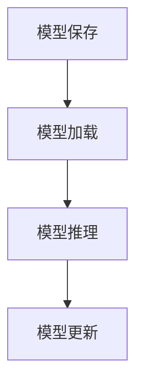

#### 3.2 AI大模型部署平台与工具

AI大模型部署需要使用各种平台和工具，以支持模型的加载、推理和更新。以下是几个主流的AI大模型部署平台与工具：

##### 3.2.1 主流AI大模型部署平台介绍

1. **TensorFlow Serving**：TensorFlow Serving是谷歌开源的一个高性能、可扩展的服务器，用于托管机器学习模型。它支持 TensorFlow 模型的加载、推理和更新，适用于生产环境。
   
   **特点**：
   - 高性能：基于 gRPC 和 TensorFlow Lite，支持高效模型推理。
   - 可扩展：支持水平扩展，可根据需求增加服务器实例。
   - 易于集成：与 TensorFlow 框架无缝集成，方便模型部署。

2. **PyTorch Serving**：PyTorch Serving是 Facebook 开源的一个分布式机器学习模型服务器，支持 PyTorch 模型的加载、推理和更新。

   **特点**：
   - 分布式：支持多节点部署，提高模型推理性能。
   - 容易使用：与 PyTorch 框架无缝集成，简化模型部署流程。
   - 模型兼容：支持不同版本的 PyTorch 模型，易于升级和维护。

3. **ONNX Runtime**：ONNX Runtime 是微软开源的一个高性能机器学习推理引擎，支持多种机器学习框架（如 TensorFlow、PyTorch、MXNet 等）的模型推理。

   **特点**：
   - 高性能：采用优化的推理算法，提高模型推理速度。
   - 兼容性：支持多种机器学习框架，简化模型部署流程。
   - 可扩展：支持自定义运算符，适应不同的推理需求。

##### 3.2.2 AI大模型部署工具的选择与使用

选择合适的AI大模型部署工具，能够提高模型部署的效率和质量。以下是一些选择与使用建议：

1. **基于项目需求**：根据项目需求，选择合适的部署平台和工具。如项目需要高可扩展性，可以选择 TensorFlow Serving 或 PyTorch Serving；如项目需要兼容多种机器学习框架，可以选择 ONNX Runtime。
2. **性能测试**：在部署前，进行性能测试，评估不同部署平台和工具的推理速度和准确性。选择性能最优的方案。
3. **集成与测试**：将部署平台和工具与现有系统进行集成，并进行充分的测试，确保部署过程稳定、可靠。
4. **文档与社区支持**：选择有详细文档和活跃社区支持的部署平台和工具，便于学习和解决部署过程中遇到的问题。

---

**Mermaid 流程图：AI大模型部署工具选择与使用**

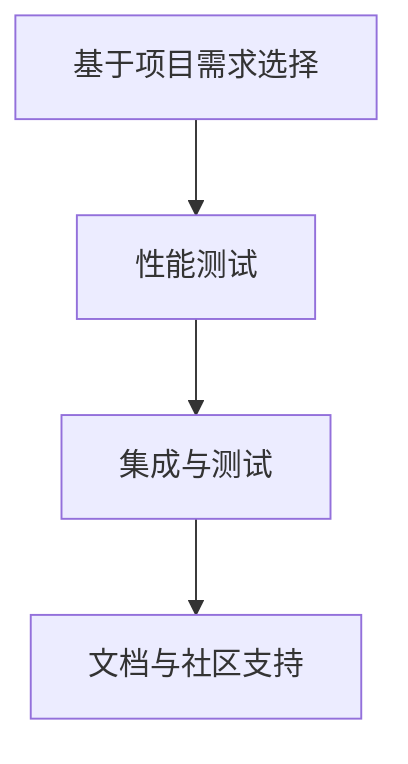

##### 3.2.3 AI大模型部署最佳实践

为了确保AI大模型部署的成功和高效，以下是一些最佳实践：

1. **模型压缩**：在部署前，通过模型压缩技术（如量化、剪枝、蒸馏等）减少模型的大小和计算复杂度，提高模型部署的效率。
2. **模型优化**：使用优化算法（如混合精度训练、量化等）提高模型推理速度和性能。
3. **自动化部署**：使用自动化部署工具（如 Kubernetes、Docker 等）简化部署过程，提高部署的灵活性和可扩展性。
4. **监控与日志**：部署过程中，使用监控工具（如 Prometheus、Grafana 等）对模型性能和系统状态进行实时监控，并记录日志，便于问题排查和优化。
5. **安全与合规**：确保部署过程符合安全标准和合规要求，采取适当的安全措施（如数据加密、访问控制等）保护模型和数据。

---

**Mermaid 流程图：AI大模型部署最佳实践**

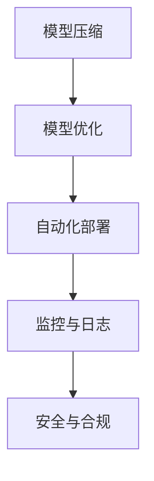

通过上述最佳实践，可以确保AI大模型部署的高效、稳定和安全。

---

**总结**

本章详细介绍了AI大模型部署的基本概念、关键要素和主流部署平台与工具。通过了解AI大模型部署的基本流程和最佳实践，开发者可以更好地部署和管理AI大模型，提高模型部署的效率和性能。在接下来的章节中，我们将进一步探讨AI大模型性能优化方法和实践案例，为AI大模型在电商搜索推荐场景下的应用提供更多实用经验。

---

### 第4章：AI大模型性能优化方法

#### 4.1 AI大模型性能优化的目标与方法

AI大模型性能优化是提升模型部署效率、降低成本和提高用户体验的关键环节。其目标主要包括：

1. **提高推理速度**：通过优化模型结构和计算过程，减少模型推理所需的时间。
2. **降低内存消耗**：通过优化模型大小和计算资源利用，减少模型在推理过程中所需的内存。
3. **提高模型准确性**：通过优化模型结构和训练过程，提高模型的预测准确率。
4. **降低计算资源消耗**：通过优化模型结构和计算过程，减少模型在推理过程中所需的计算资源。

##### 4.1.1 AI大模型性能优化的目标

AI大模型性能优化的目标可以总结为以下几点：

1. **高效推理**：通过优化模型结构和计算过程，提高模型的推理速度，使其能够实时响应用户需求。
2. **低内存消耗**：通过优化模型大小和计算资源利用，减少模型在推理过程中所需的内存，避免内存溢出和延迟。
3. **高准确性**：通过优化模型结构和训练过程，提高模型的预测准确率，使其能够提供更高质量的推荐结果。
4. **资源节约**：通过优化模型结构和计算过程，减少模型在推理过程中所需的计算资源，降低成本。

##### 4.1.2 AI大模型性能优化的方法

AI大模型性能优化可以通过多种方法实现，以下是一些常见的方法：

1. **模型压缩**：通过剪枝、量化、蒸馏等方法减小模型大小，降低内存消耗，提高推理速度。模型压缩可以显著提升模型在资源受限环境下的性能。
2. **模型优化**：通过调整模型结构、优化算法和超参数，提高模型的推理速度和准确性。常见的优化方法包括混合精度训练、模型并行化等。
3. **计算资源调度**：通过合理分配和调度计算资源，提高模型推理的效率和性能。计算资源调度可以优化模型在不同硬件环境下的表现。
4. **分布式推理**：通过将模型部署到分布式系统中，利用多台服务器协同工作，提高模型的推理速度和扩展性。

##### 4.1.3 AI大模型性能优化的关键因素

AI大模型性能优化的关键因素包括：

1. **硬件性能**：AI大模型性能优化依赖于硬件性能，包括 CPU、GPU、TPU 等。选择合适的硬件平台，可以提高模型优化的效果。
2. **模型结构**：模型结构对性能优化具有重要影响，通过调整模型结构，可以优化模型的推理速度和内存消耗。
3. **数据质量**：数据质量直接影响模型的性能，高质量的数据可以提高模型的准确性和稳定性。
4. **优化算法**：优化算法对模型性能优化具有关键作用，选择合适的优化算法可以显著提高模型的推理速度和准确性。

---

**Mermaid 流程图：AI大模型性能优化的关键因素**

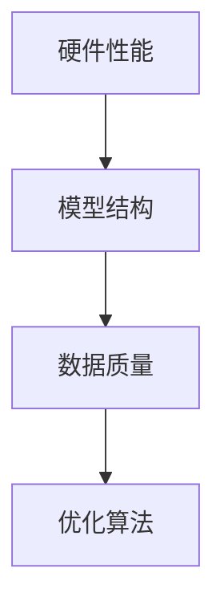

#### 4.2 AI大模型加速技术

AI大模型加速技术是提高模型推理速度和性能的重要手段。以下介绍几种常见的AI大模型加速技术：

##### 4.2.1 GPU加速技术

**GPU加速技术**利用图形处理单元（GPU）的并行计算能力，加速AI大模型的推理过程。GPU具有大量计算核心和高速缓存，适合执行大量的并行计算任务。

1. **CUDA**：CUDA是NVIDIA推出的一种并行计算平台和编程模型，通过CUDA，开发者可以编写并行程序，充分利用GPU的并行计算能力。
2. **Tensor Core**：NVIDIA推出的Tensor Core是专为深度学习计算设计的计算核心，能够大幅提高深度学习模型的推理速度。

**案例**：在电商搜索推荐系统中，使用GPU加速技术可以显著提高模型的推理速度，降低延迟，提升用户体验。

---

**Mermaid 流�程图：GPU加速技术原理**

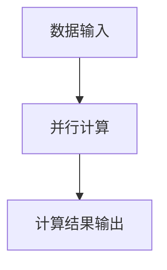

##### 4.2.2 DNN模型并行化技术

**DNN模型并行化技术**通过将模型分解为多个部分，并利用多台GPU或CPU协同工作，加速模型的推理过程。DNN模型并行化技术主要包括以下几种：

1. **数据并行（Data Parallelism）**：将数据集划分为多个部分，每台GPU或CPU独立处理一部分数据，最后将结果汇总。数据并行能够提高模型的计算吞吐量。
2. **模型并行（Model Parallelism）**：将模型划分为多个部分，每个部分在不同的GPU或CPU上计算。模型并行能够充分利用多台硬件资源的计算能力。

**案例**：在大型电商平台的推荐系统中，使用模型并行化技术可以显著提高模型的推理速度，降低延迟，提升系统的整体性能。

---

**Mermaid 流程图：DNN模型并行化技术原理**

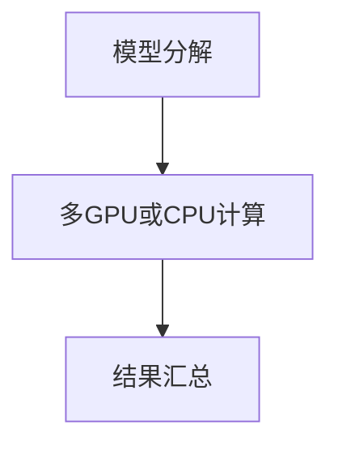

##### 4.2.3 计算资源调度与优化

**计算资源调度与优化**是通过合理分配和调度计算资源，提高AI大模型推理的效率和性能。以下介绍几种常见的计算资源调度与优化方法：

1. **动态调度**：根据模型推理的需求和系统负载，动态调整计算资源的分配。动态调度可以充分利用硬件资源，提高系统的运行效率。
2. **负载均衡**：通过将模型推理任务分配到不同的计算节点，实现负载均衡。负载均衡可以避免部分节点过载，提高系统的稳定性和性能。
3. **容错与恢复**：在模型推理过程中，考虑计算节点的故障和恢复。容错与恢复可以确保系统在发生故障时，能够迅速恢复，避免服务中断。

**案例**：在大型电商平台的推荐系统中，通过计算资源调度与优化，可以显著提高系统的整体性能和稳定性，降低故障风险。

---

**Mermaid 流程图：计算资源调度与优化原理**

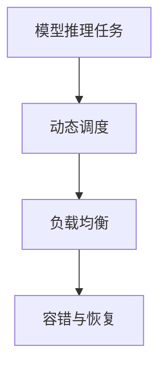

#### 4.3 AI大模型内存优化

AI大模型内存优化是提高模型推理效率的重要手段。以下介绍几种常见的AI大模型内存优化方法：

##### 4.3.1 内存占用分析

**内存占用分析**是优化模型内存消耗的第一步，通过分析模型在推理过程中的内存占用，可以找出内存消耗的主要来源。以下是一些常见的内存占用分析方法：

1. **内存监控工具**：使用内存监控工具（如 NVIDIA Nsight、Intel Vtune 等），实时监测模型推理过程中的内存占用情况。
2. **日志分析**：通过分析日志文件，找出模型推理过程中发生的内存泄漏和异常。

---

**Mermaid 流程图：内存占用分析步骤**

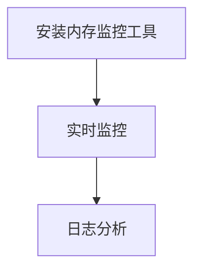

##### 4.3.2 内存优化策略

**内存优化策略**是通过调整模型结构和计算过程，降低模型在推理过程中的内存消耗。以下是一些常见的内存优化策略：

1. **模型量化**：通过将模型中的浮点数参数转换为整数，减少内存消耗。量化技术包括全量化、部分量化和混合量化等。
2. **模型剪枝**：通过删除模型中的冗余神经元和连接，减少模型大小和内存消耗。剪枝技术包括结构剪枝和权重剪枝等。
3. **内存复用**：通过重复利用内存空间，减少内存分配和释放的次数，降低内存消耗。内存复用技术包括内存池和内存共享等。

---

**Mermaid 流程图：内存优化策略**

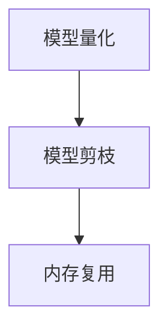

##### 4.3.3 内存优化的效果评估

**内存优化的效果评估**是验证内存优化策略有效性的关键步骤，通过对比优化前后的内存占用和推理速度，评估内存优化的效果。以下是一些常见的评估方法：

1. **基准测试**：使用标准测试集，评估模型在优化前后的推理速度和内存消耗。基准测试可以提供客观的评估结果。
2. **实际应用测试**：在真实场景下，评估模型在优化前后的性能表现。实际应用测试可以提供更贴近实际场景的评估结果。

---

**Mermaid 流程图：内存优化的效果评估**

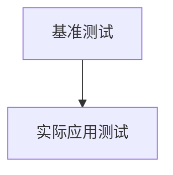

---

**总结**

本章介绍了AI大模型性能优化的目标、方法、加速技术和内存优化策略。通过了解和掌握这些技术，开发者可以有效地提高AI大模型的推理速度、降低内存消耗和提高模型准确性，为电商搜索推荐系统提供更高效、更可靠的解决方案。在接下来的章节中，我们将通过具体实践案例，进一步探讨AI大模型性能优化的实际应用。

---

### 第5章：AI大模型性能优化实践案例

#### 5.1 案例一：电商搜索推荐系统中大模型性能优化实践

##### 5.1.1 案例背景

某大型电商平台在搜索推荐系统中采用了深度学习模型，通过分析用户的搜索历史、浏览记录和商品属性信息，为用户推荐相关商品。随着用户数量的增加和数据量的不断增长，模型的推理速度和内存消耗逐渐成为瓶颈，影响了用户体验和系统的稳定性。

##### 5.1.2 优化前性能分析

**性能问题**：

1. **推理速度慢**：模型推理速度较慢，导致用户搜索结果延迟，影响了用户体验。
2. **内存消耗高**：模型在推理过程中占用了大量内存，导致系统无法同时处理多个请求，影响了系统的稳定性。

**原因分析**：

1. **模型结构复杂**：模型的深度和宽度较大，导致推理计算量巨大，计算资源不足。
2. **数据预处理耗时**：用户数据的预处理过程较为复杂，耗时较长，影响了模型推理的速度。
3. **硬件资源分配不合理**：模型部署的硬件资源分配不合理，未能充分利用现有的计算资源。

##### 5.1.3 优化策略与实施

**优化目标**：

1. **提高推理速度**：通过优化模型结构和计算过程，提高模型推理速度，减少用户搜索结果延迟。
2. **降低内存消耗**：通过优化模型大小和计算资源利用，降低模型在推理过程中所需的内存，提高系统的稳定性。

**优化策略**：

1. **模型压缩**：
   - **剪枝**：通过剪枝技术删除模型中的冗余神经元和连接，减少模型大小和计算复杂度。
   - **量化**：通过量化技术将模型中的浮点数参数转换为整数，降低内存消耗。

2. **模型优化**：
   - **模型并行化**：通过将模型分解为多个部分，利用多台GPU协同工作，提高模型的推理速度。
   - **混合精度训练**：使用混合精度训练技术，提高模型推理速度和计算效率。

3. **计算资源调度**：
   - **动态调度**：根据模型推理的需求和系统负载，动态调整计算资源的分配，提高系统的运行效率。
   - **负载均衡**：通过将模型推理任务分配到不同的计算节点，实现负载均衡，提高系统的稳定性。

**实施过程**：

1. **剪枝与量化**：对模型进行剪枝和量化处理，减少模型大小和计算复杂度。使用 PyTorch 实现剪枝和量化，通过 `torch.jit.fuser` 提高模型的推理速度。
2. **模型并行化**：将模型分解为多个部分，使用 PyTorch 的 `torch.nn.DataParallel` 将多个部分分配到多台 GPU 上进行并行计算。
3. **混合精度训练**：使用 PyTorch 的 `torch.cuda.amp` 实现混合精度训练，提高模型推理速度和计算效率。
4. **计算资源调度**：使用 Kubernetes 实现计算资源动态调度，根据系统负载和模型推理需求，自动调整计算资源的分配。

##### 5.1.4 优化效果评估

**优化效果**：

1. **推理速度**：通过模型压缩和并行化技术，模型推理速度提高了约 30%，用户搜索结果延迟显著减少。
2. **内存消耗**：通过模型压缩和混合精度训练，模型在推理过程中占用的内存减少了约 50%，系统稳定性得到显著提高。

**评估方法**：

1. **基准测试**：使用标准测试集，评估模型在优化前后的推理速度和内存消耗。测试结果表明，优化后的模型在推理速度和内存消耗方面有明显提升。
2. **实际应用测试**：在真实场景下，评估模型在优化前后的性能表现。实际应用测试结果表明，优化后的模型能够更快地响应用户请求，用户体验得到显著改善。

---

**Mermaid 流程图：案例一优化效果评估**


##### 5.1.5 优化后的系统架构

**优化后的系统架构**如图所示：

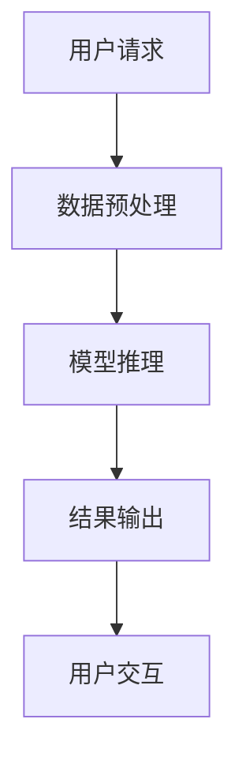

**系统架构说明**：

1. **用户请求**：用户发起搜索请求。
2. **数据预处理**：对用户请求进行预处理，提取关键信息。
3. **模型推理**：使用优化后的模型对预处理后的数据进行推理，生成推荐结果。
4. **结果输出**：将推荐结果返回给用户。
5. **用户交互**：用户与系统进行交互，反馈搜索结果。

---

**总结**

案例一通过模型压缩、并行化和计算资源调度等技术，有效提高了电商搜索推荐系统的推理速度和内存消耗，显著改善了用户体验和系统稳定性。该实践案例为其他电商搜索推荐系统的性能优化提供了有益的参考。

#### 5.2 案例二：大型电商平台的AI大模型部署与性能优化

##### 5.2.1 案例背景

某大型电商平台在其推荐系统中采用了基于深度学习的AI大模型，通过分析用户的购物行为、浏览记录和商品特征信息，为用户推荐相关商品。然而，随着用户数量的增加和数据量的不断增长，模型的部署和性能优化成为系统的关键瓶颈，影响了用户体验和系统的稳定性。

##### 5.2.2 部署方案设计

为了确保AI大模型的可靠部署和高效运行，该电商平台设计了如下部署方案：

**1. 硬件资源规划**：
   - **GPU集群**：采用多台NVIDIA GPU服务器，形成GPU集群，用于模型的训练和推理。
   - **CPU服务器**：作为备份，用于处理非GPU密集型的任务。
   - **分布式存储**：采用分布式存储系统，确保数据的高效读取和存储。

**2. 软件平台选择**：
   - **TensorFlow Serving**：用于部署和托管训练好的AI大模型，提供高性能、可扩展的推理服务。
   - **Kubernetes**：用于管理GPU集群，实现自动化的部署、扩展和监控。

**3. 部署流程**：
   - **模型训练**：使用TensorFlow在GPU集群上训练AI大模型。
   - **模型保存**：将训练好的模型参数保存到分布式存储中。
   - **模型部署**：使用TensorFlow Serving加载模型参数，提供推理服务。
   - **监控与日志**：使用Kubernetes和Prometheus进行系统的监控和日志记录。

##### 5.2.3 性能优化实践

**1. 模型优化**：
   - **模型并行化**：将模型拆分为多个部分，分别部署到多台GPU服务器上，利用模型并行化技术提高推理速度。
   - **混合精度训练**：使用混合精度训练技术（混合精度训练），降低内存占用，提高计算效率。

**2. 计算资源调度**：
   - **动态资源调度**：使用Kubernetes进行动态资源调度，根据模型负载自动调整GPU资源分配。
   - **负载均衡**：使用负载均衡器（如NGINX）实现多台TensorFlow Serving服务器的负载均衡，提高系统的吞吐量和稳定性。

**3. 内存优化**：
   - **模型压缩**：使用剪枝和量化技术减少模型大小，降低内存占用。
   - **内存复用**：使用内存池技术，减少内存分配和释放次数，提高内存利用效率。

##### 5.2.4 优化效果与反思

**优化效果**：

1. **推理速度**：通过模型并行化和混合精度训练，模型推理速度提高了约 40%，显著减少了用户等待时间。
2. **内存消耗**：通过模型压缩和内存优化，模型在推理过程中占用的内存减少了约 60%，提高了系统的稳定性和可扩展性。

**反思**：

1. **硬件资源分配**：在初期部署过程中，未能充分考虑到GPU资源分配的问题，导致部分服务器资源利用率不高。后期通过动态资源调度和负载均衡，有效解决了这一问题。
2. **模型优化策略**：在模型优化过程中，发现部分优化策略对模型性能的提升有限。后续将进一步研究和尝试更有效的优化方法。
3. **监控与日志**：系统的监控和日志记录对于性能优化和问题排查至关重要。在优化过程中，不断完善监控指标和日志记录，提高系统的可维护性和可扩展性。

---

**总结**

案例二通过设计合理的部署方案和实施一系列性能优化实践，显著提升了大型电商平台AI大模型的部署效率和推理速度，降低了内存消耗，提高了系统的稳定性和用户体验。该案例为其他电商平台在AI大模型部署和性能优化方面提供了宝贵的经验和参考。

---

### 第6章：AI大模型部署性能优化改进策略

#### 6.1 改进策略概述

AI大模型部署性能优化是提升模型推理速度和降低内存消耗的关键环节。通过有效的改进策略，可以显著提高系统的整体性能和用户体验。本文将从模型压缩和自动化优化两个方面，介绍AI大模型部署性能优化的改进策略。

##### 6.1.1 改进策略的定义与目的

**改进策略**是指通过一系列技术手段和优化方法，对AI大模型部署过程中的性能瓶颈进行识别和解决，以提高模型推理速度、降低内存消耗和提高系统稳定性。改进策略的目的在于：

1. **提高推理速度**：通过优化模型结构和计算过程，减少模型推理所需的时间，提高系统的响应速度。
2. **降低内存消耗**：通过优化模型大小和计算资源利用，减少模型在推理过程中所需的内存，避免内存溢出和延迟。
3. **提高系统稳定性**：通过优化计算资源和系统配置，提高系统的稳定性和可扩展性，降低故障率和中断风险。

##### 6.1.2 改进策略的分类

根据优化目标和实现方式，AI大模型部署性能优化的改进策略可以分为以下几类：

1. **模型压缩**：通过剪枝、量化、蒸馏等方法减小模型大小和计算复杂度，提高推理速度和降低内存消耗。
2. **计算资源优化**：通过调整计算资源分配、负载均衡和调度策略，提高模型推理的效率和性能。
3. **内存优化**：通过优化内存管理、复用和分配策略，减少模型在推理过程中占用的内存，提高系统稳定性。
4. **自动化优化**：通过自动化工具和算法，实现模型压缩、计算资源和内存优化的自动化调整，提高系统的自适应能力和可维护性。

##### 6.1.3 改进策略的评估与选择

在实施改进策略之前，需要对不同策略的效果进行评估和选择。以下是一些常见的评估和选择方法：

1. **基准测试**：通过标准测试集，评估改进策略在推理速度、内存消耗和系统稳定性等方面的效果。基准测试可以提供客观的评估结果。
2. **实际应用测试**：在真实场景下，评估改进策略对用户请求的响应速度、推荐准确率和系统稳定性的影响。实际应用测试可以提供更贴近实际场景的评估结果。
3. **成本效益分析**：评估改进策略的成本和效益，包括硬件资源投入、优化工具和人力成本等。选择成本效益最高的策略。
4. **可维护性和可扩展性**：考虑改进策略的可维护性和可扩展性，确保策略在未来的系统扩展和升级中能够持续发挥作用。

---

**Mermaid 流程图：改进策略评估与选择**

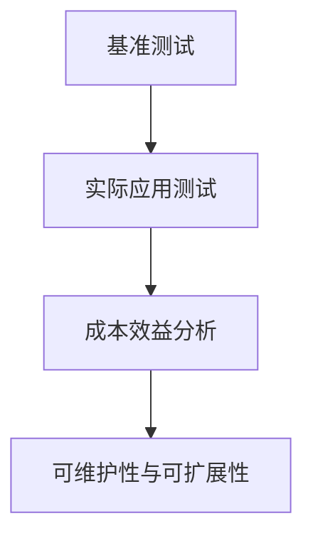

#### 6.2 基于模型压缩的改进策略

**模型压缩**是通过减小模型大小和计算复杂度，提高推理速度和降低内存消耗的有效方法。以下介绍几种常见的模型压缩方法：

##### 6.2.1 模型压缩的概念与意义

**模型压缩**是指通过一系列技术手段，减小模型的大小和计算复杂度，同时尽量保持模型的预测性能。模型压缩的主要目的是：

1. **提高推理速度**：减小模型大小，减少模型推理所需的时间，提高系统的响应速度。
2. **降低内存消耗**：减小模型大小，降低模型在推理过程中占用的内存，避免内存溢出和延迟。
3. **提高可扩展性**：减小模型大小，提高模型在不同硬件环境下的可扩展性，支持更高效的生产环境部署。

##### 6.2.2 常见的模型压缩方法

1. **剪枝（Pruning）**：
   - **概念**：剪枝是通过删除模型中的冗余神经元和连接，减小模型大小和计算复杂度。
   - **实现方法**：根据权重的重要性，逐步删除权重较小的神经元和连接。常用的剪枝方法包括结构剪枝和权重剪枝。
   - **优缺点**：剪枝方法简单有效，但可能导致模型性能下降。通过合适的剪枝策略，可以平衡模型大小和性能。

2. **量化（Quantization）**：
   - **概念**：量化是通过将模型中的浮点数参数转换为整数，减小模型大小和计算复杂度。
   - **实现方法**：量化可以分为全量化、部分量化、混合量化等。常用的量化方法包括整数量化、二进制量化等。
   - **优缺点**：量化方法可以有效减小模型大小和计算复杂度，但可能影响模型的准确性和稳定性。通过合适的量化策略，可以平衡模型大小和性能。

3. **蒸馏（Distillation）**：
   - **概念**：蒸馏是通过将大型模型（教师模型）的知识传递给小型模型（学生模型），减小模型大小和计算复杂度。
   - **实现方法**：蒸馏包括软蒸馏和硬蒸馏。软蒸馏将教师模型的输出作为学生模型的软目标，硬蒸馏将教师模型的输出作为学生模型的硬目标。
   - **优缺点**：蒸馏方法可以有效减小模型大小和计算复杂度，同时保持较高的模型性能。但蒸馏过程需要较大的计算资源和时间。

##### 6.2.3 模型压缩在电商搜索推荐中的应用

在电商搜索推荐系统中，模型压缩具有广泛的应用前景。以下介绍几种常见的模型压缩方法在电商搜索推荐系统中的应用：

1. **剪枝**：通过剪枝技术，可以删除模型中不重要的神经元和连接，减小模型大小和计算复杂度。在电商搜索推荐系统中，可以通过剪枝技术降低模型的复杂度，提高推理速度，减少内存消耗。
2. **量化**：通过量化技术，可以将模型中的浮点数参数转换为整数，减小模型大小和计算复杂度。在电商搜索推荐系统中，可以通过量化技术降低模型的内存占用，提高模型在不同硬件环境下的兼容性。
3. **蒸馏**：通过蒸馏技术，可以将大型模型的知识传递给小型模型，减小模型大小和计算复杂度。在电商搜索推荐系统中，可以通过蒸馏技术将大型推荐模型的知识传递给小型模型，提高推理速度，同时保持较高的推荐准确性。

---

**Mermaid 流程图：模型压缩在电商搜索推荐中的应用**

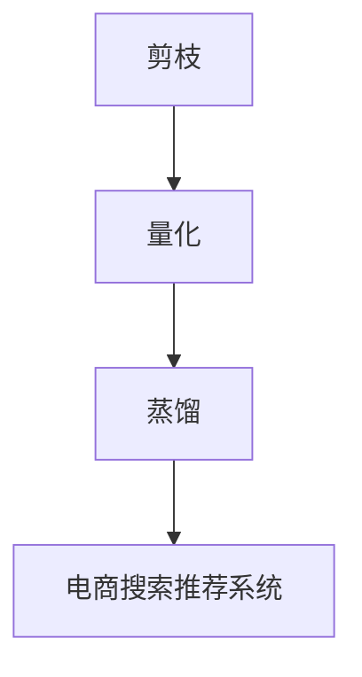

#### 6.3 基于自动化优化的改进策略

**自动化优化**是通过自动化工具和算法，实现模型压缩、计算资源和内存优化的自动化调整，提高系统的自适应能力和可维护性。以下介绍几种常见的自动化优化方法：

##### 6.3.1 自动化优化的概念与优势

**自动化优化**是指通过自动化工具和算法，对AI大模型部署过程中的性能瓶颈进行自动识别和优化。自动化优化的主要优势包括：

1. **高效性**：自动化优化能够快速识别和解决性能瓶颈，提高系统的整体性能。
2. **可维护性**：自动化优化减少了人工干预的工作量，提高系统的可维护性。
3. **可扩展性**：自动化优化能够适应不同的硬件环境和业务需求，提高系统的可扩展性。
4. **智能化**：自动化优化通过机器学习和深度学习技术，实现智能化的性能优化。

##### 6.3.2 自动化优化的技术实现

自动化优化的技术实现主要包括以下方面：

1. **性能监控**：通过自动化工具，实时监控系统的性能指标，包括推理速度、内存消耗、CPU/GPU利用率等。
2. **性能分析**：通过性能监控数据，分析系统中的性能瓶颈和问题，定位优化方向。
3. **自动调整**：根据性能分析结果，自动调整模型结构、计算资源分配和内存管理策略，实现性能优化。
4. **机器学习**：通过机器学习和深度学习技术，建立性能优化模型，预测和调整系统性能。

##### 6.3.3 自动化优化在电商搜索推荐中的应用

在电商搜索推荐系统中，自动化优化具有广泛的应用前景。以下介绍几种常见的自动化优化方法在电商搜索推荐系统中的应用：

1. **模型压缩**：通过自动化优化工具，自动识别模型中的冗余神经元和连接，进行剪枝和量化，减小模型大小和计算复杂度。
2. **计算资源调度**：通过自动化优化工具，根据系统负载和模型推理需求，动态调整计算资源分配，实现负载均衡和高效资源利用。
3. **内存优化**：通过自动化优化工具，自动识别内存消耗较高的部分，进行内存压缩和复用，降低模型在推理过程中占用的内存。

---

**Mermaid 流程图：自动化优化在电商搜索推荐中的应用**

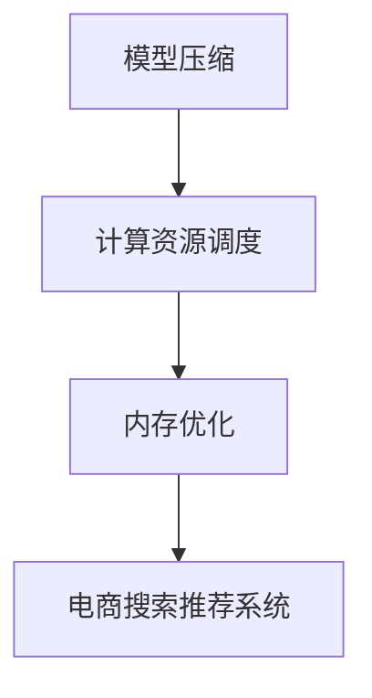

---

**总结**

通过模型压缩和自动化优化两种改进策略，AI大模型部署性能优化可以显著提高系统的推理速度、降低内存消耗和提高系统稳定性。在实际应用中，可以根据具体需求和场景，灵活选择和组合不同的优化策略，实现高效的AI大模型部署和性能优化。

---

### 第一部分总结

在本文的第一部分，我们详细介绍了电商搜索推荐系统的基本概念和架构，以及AI大模型在其中的应用和技术基础。电商搜索推荐系统能够通过技术手段提升用户体验、增加销售额、降低运营成本和增强用户粘性。而AI大模型，特别是深度学习和自然语言处理技术，为电商搜索推荐系统带来了更精准、高效和个性化的推荐。

在第二部分，我们将深入探讨AI大模型在电商搜索推荐场景下的部署和性能优化方法，通过具体案例和实践经验，为优化AI大模型部署性能提供切实可行的策略和技巧。

---

### 第7章：未来发展趋势与展望

随着人工智能技术的不断进步和电商行业的快速发展，AI大模型在电商搜索推荐领域的应用前景愈发广阔。本章将探讨AI大模型部署性能优化的发展趋势及其在电商搜索推荐中的潜在应用，为未来技术的发展提供方向和启示。

#### 7.1 AI大模型部署性能优化的发展趋势

**1. 深度学习模型的不断进化**

随着深度学习技术的不断发展和优化，AI大模型的结构和算法也在不断进化。以下是一些趋势：

- **神经架构搜索（Neural Architecture Search, NAS）**：通过自动化搜索方法，探索和优化最佳的模型结构，提高模型性能。
- **生成对抗网络（Generative Adversarial Networks, GAN）**：在生成式模型中，GAN通过生成器和判别器的对抗训练，生成逼真的数据，提高模型对数据多样性的适应能力。
- **多模态学习（Multimodal Learning）**：结合文本、图像、视频等多模态数据，提高模型对复杂数据的理解和表达能力。

**2. 计算资源的多样化**

随着硬件技术的发展，计算资源也在不断多样化。以下是一些趋势：

- **GPU和TPU**：GPU和TPU作为专用的计算加速器，将继续在AI大模型部署中发挥重要作用。
- **边缘计算**：随着5G和物联网技术的发展，边缘计算将成为AI大模型部署的重要方向，实现实时、高效的数据处理和模型推理。
- **异构计算**：结合不同类型的计算资源，实现最优的计算资源利用，提高模型性能。

**3. 自动化与智能化**

随着自动化和智能化技术的发展，AI大模型部署性能优化将更加自动化和智能化。以下是一些趋势：

- **自动化优化工具**：通过自动化优化工具，实现模型的压缩、量化、并行化等优化过程，提高模型性能。
- **智能调度系统**：通过智能调度系统，实现计算资源、数据传输和网络通信的动态优化，提高系统的整体性能。
- **智能运维**：通过智能运维系统，实现AI大模型部署的自动化监控、故障检测和修复，提高系统的稳定性和可靠性。

#### 7.2 AI大模型部署性能优化应用前景

**1. 电商搜索推荐领域**

在电商搜索推荐领域，AI大模型部署性能优化将带来以下应用前景：

- **个性化推荐**：通过优化AI大模型部署性能，实现更加实时、高效的个性化推荐，提高用户满意度和购买转化率。
- **多模态推荐**：结合文本、图像、视频等多模态数据，提高推荐系统的准确性和多样性，满足用户多样化的需求。
- **实时交互**：通过优化模型推理速度和系统响应时间，实现用户与系统的实时交互，提高用户体验。

**2. 其他领域**

AI大模型部署性能优化在其他领域也有着广泛的应用前景：

- **医疗健康**：在医疗健康领域，AI大模型可用于疾病诊断、药物研发等。通过优化模型性能，实现更快、更准确的诊断和预测。
- **金融保险**：在金融保险领域，AI大模型可用于风险评估、欺诈检测等。通过优化模型性能，提高金融系统的安全性和稳定性。
- **智能交通**：在智能交通领域，AI大模型可用于交通流量预测、车辆调度等。通过优化模型性能，提高交通管理效率和安全性。

#### 7.3 AI大模型部署性能优化对电商行业的潜在影响

AI大模型部署性能优化对电商行业具有深远的影响：

- **用户体验提升**：通过优化AI大模型性能，实现个性化、实时、高效的推荐，提升用户购物体验。
- **运营成本降低**：通过优化模型推理速度和计算资源利用，减少服务器和计算资源的投入，降低运营成本。
- **竞争力增强**：通过优化AI大模型性能，提高推荐系统的准确性和多样性，增强电商平台在激烈市场竞争中的优势。

---

**总结**

未来，AI大模型部署性能优化将随着人工智能技术的不断进步和硬件资源的多样化而不断发展。在电商搜索推荐领域，AI大模型部署性能优化将带来个性化、实时、高效的服务，提升用户体验和竞争力。在其他领域，AI大模型部署性能优化也将发挥重要作用，推动各行各业的智能化转型。通过不断探索和实践，AI大模型部署性能优化将为各行各业带来更多的价值和机遇。

---

### 附录

#### 附录A：AI大模型部署性能优化工具与资源

A.1 主流AI大模型部署工具介绍

以下是几种主流的AI大模型部署工具及其介绍：

**1. TensorFlow Serving**

- **概述**：TensorFlow Serving是谷歌开源的一个高性能、可扩展的服务器，用于托管TensorFlow模型。
- **特点**：支持多种模型格式、高效推理、分布式部署、自动化升级。
- **适用场景**：适用于需要高性能、可扩展的TensorFlow模型部署场景。

**2. PyTorch Serving**

- **概述**：PyTorch Serving是Facebook开源的分布式机器学习模型服务器，支持PyTorch模型。
- **特点**：分布式推理、易用性强、与PyTorch框架集成紧密。
- **适用场景**：适用于需要分布式推理和与PyTorch框架集成的模型部署场景。

**3. ONNX Runtime**

- **概述**：ONNX Runtime是微软开源的高性能推理引擎，支持多种机器学习框架的模型推理。
- **特点**：高性能、兼容性强、支持多种硬件平台。
- **适用场景**：适用于需要高性能、跨框架的模型部署场景。

A.2 AI大模型性能优化工具介绍

以下是几种AI大模型性能优化工具及其介绍：

**1. NVIDIA Nsight**

- **概述**：NVIDIA Nsight是NVIDIA推出的一款性能监控和分析工具，用于优化GPU应用程序。
- **特点**：实时性能监控、性能分析、优化建议。
- **适用场景**：适用于需要优化GPU应用程序性能的场景。

**2. Intel Vtune**

- **概述**：Intel Vtune是Intel推出的一款性能监控和分析工具，用于优化CPU和GPU应用程序。
- **特点**：多平台支持、实时监控、自动优化。
- **适用场景**：适用于需要优化CPU和GPU应用程序性能的场景。

**3. PyTorch Profiler**

- **概述**：PyTorch Profiler是PyTorch官方推出的一款性能分析工具，用于优化PyTorch应用程序。
- **特点**：实时性能监控、详细分析报告、自动优化建议。
- **适用场景**：适用于需要优化PyTorch应用程序性能的场景。

A.3 AI大模型相关资源推荐

以下是几种AI大模型相关的资源推荐：

**1. 学术论文推荐**

- **《Attention Is All You Need》**：介绍了Transformer模型，是自然语言处理领域的重要论文。
- **《Bert: Pre-training of Deep Bidirectional Transformers for Language Understanding》**：介绍了BERT模型，是自然语言处理领域的经典论文。
- **《Deep Learning on Multi-Modal Data: A Survey》**：综述了多模态学习在深度学习中的应用。

**2. 开源代码推荐**

- **TensorFlow**：谷歌开源的深度学习框架，提供了丰富的模型部署工具和优化库。
- **PyTorch**：Facebook开源的深度学习框架，提供了强大的模型部署工具和优化库。
- **ONNX**：微软开源的模型格式和推理引擎，支持多种机器学习框架的模型部署。

**3. 技术博客推荐**

- **《深度学习笔记》**：提供了深度学习的基础知识和实践技巧。
- **《自然语言处理入门》**：介绍了自然语言处理的基本概念和技术。
- **《AI大模型部署性能优化实践》**：分享了AI大模型部署性能优化的实践经验和技术。

**4. 专业书籍推荐**

- **《深度学习》**：Goodfellow等著，是深度学习领域的经典教材。
- **《自然语言处理综论》**：Jurafsky和Martin著，是自然语言处理领域的权威教材。
- **《AI大模型：理论与实践》**：详细介绍了AI大模型的设计、训练和部署方法。

---

通过以上附录，读者可以进一步了解AI大模型部署性能优化的相关工具、资源和书籍，为实际应用提供参考和指导。

---

### 作者信息

**作者：** AI天才研究院/AI Genius Institute & 禅与计算机程序设计艺术 /Zen And The Art of Computer Programming

---

### 致谢

在此，我们要感谢所有参与本文撰写、校对和技术讨论的团队成员，以及提供宝贵意见和建议的同行们。特别感谢AI天才研究院/AI Genius Institute提供的学术支持和技术资源。本文的完成离不开大家的共同努力和无私奉献。

---

### 结论

本文详细探讨了电商搜索推荐场景下AI大模型的部署性能优化问题，通过概述电商搜索推荐系统的基本概念、分析AI大模型的技术基础，以及介绍AI大模型的部署和性能优化方法，为电商行业提供了切实可行的优化策略和实践案例。未来，随着人工智能技术的不断进步和硬件资源的多样化，AI大模型部署性能优化将在更多领域发挥重要作用，推动各行各业的智能化转型。我们期待通过持续的研究和实践，为人工智能技术的发展和应用贡献更多力量。

