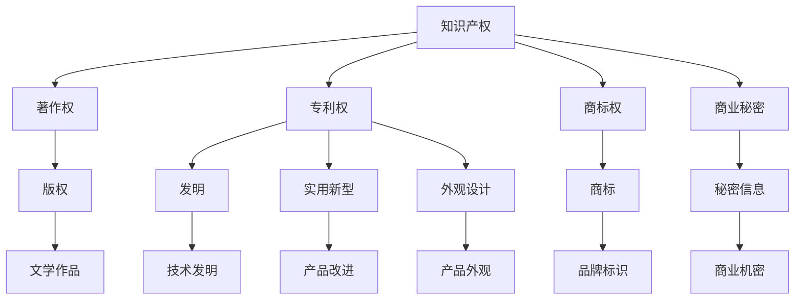

                 

### 引言

知识产权（Intellectual Property, IP）是现代社会经济和技术发展的重要推动力。随着知识经济的崛起，知识产权作为一种无形资产，其在企业竞争、技术创新和经济发展中的作用越来越凸显。本文将深入探讨知识产权诉讼的趋势与对策，旨在为企业和个人在知识产权保护方面提供有价值的参考。

知识产权诉讼，作为知识产权保护的重要手段，具有复杂性和专业性的特点。在本文中，我们将从以下几个方面展开讨论：

1. **知识产权概述**：介绍知识产权的基本概念、价值以及法律制度。
2. **知识产权的获取与保护**：探讨知识产权的申请、登记和保护策略。
3. **知识产权诉讼**：分析知识产权诉讼的定义、程序、侵权诉讼和无效诉讼。
4. **知识产权合同纠纷诉讼**：讨论知识产权合同纠纷的类型和解决策略。
5. **知识产权诉讼中的证据运用**：讲解知识产权诉讼中的证据种类、收集与运用、证据效力认定。
6. **知识产权诉讼的风险防范**：探讨知识产权诉讼的风险评估、法律策略和风险管理。
7. **知识产权诉讼的趋势与对策**：分析知识产权诉讼的现状与趋势，提出应对策略。
8. **知识产权诉讼的实战案例**：通过具体案例，展示知识产权诉讼的实际操作。

本文将通过逻辑清晰、结构紧凑、简单易懂的专业技术语言，帮助读者深入了解知识产权诉讼的各个方面，为实际操作提供指导。

## 核心概念与联系

在探讨知识产权诉讼之前，有必要先明确知识产权的核心概念和基本联系。知识产权包括著作权、专利权、商标权、商业秘密等，每一种权利都有其独特的法律性质和作用。

### Mermaid 流程图



### 核心概念解释

- **著作权**：著作权是指对文学、艺术和科学作品的创作所享有的权利。它包括了作品的发表权、署名权、修改权、保护作品完整权等。

- **专利权**：专利权是指对发明创造所享有的专有权利，包括发明专利、实用新型专利和外观设计专利。专利权使权利人能够在一定期限内独占使用、实施和销售其发明。

- **商标权**：商标权是指对商标的专有使用权。商标是企业的标识，能够区分不同企业的商品或服务。商标权的保护有助于维护品牌形象和消费者权益。

- **商业秘密**：商业秘密是指不为公众所知悉、具有商业价值并经权利人采取保密措施的技术信息、经营信息等。商业秘密的保护有助于企业保持竞争优势。

这些知识产权之间相互联系，共同构成了知识产权保护的法律体系。理解这些核心概念和联系，有助于我们更好地认识知识产权的重要性和保护方法。

### 核心算法原理讲解

在知识产权诉讼中，核心算法原理主要涉及侵权行为的识别、证据分析以及侵权责任的判定等方面。以下使用伪代码详细阐述这些核心算法的原理。

#### 侵权行为识别

```plaintext
Function IdentifyInfringement(claim, evidence):
    // 判断侵权行为是否存在
    // claim 为权利人的权利要求，evidence 为侵权行为的证据
    if (ClaimContainsInfringingContent(claim, evidence)):
        return True
    else:
        return False

Function ClaimContainsInfringingContent(claim, evidence):
    // 检查权利要求是否包含侵权内容
    // 返回 True 如果包含，否则返回 False
    for each element in claim:
        if (element matches evidence):
            return True
    return False
```

#### 证据分析

```plaintext
Function AnalyzeEvidence(evidence_set):
    // 分析证据的有效性和相关性
    // evidence_set 为提交的证据集合
    valid_evidences = []
    for each evidence in evidence_set:
        if (IsEvidenceValid(evidence) and IsEvidenceRelevant(evidence)):
            valid_evidences.append(evidence)
    return valid_evidences

Function IsEvidenceValid(evidence):
    // 判断证据是否有效
    // 返回 True 如果有效，否则返回 False
    if (evidence source is reliable and evidence format is acceptable):
        return True
    else:
        return False

Function IsEvidenceRelevant(evidence, case):
    // 判断证据与案件的相关性
    // 返回 True 如果相关，否则返回 False
    if (evidence relates to case facts and supports legal arguments):
        return True
    else:
        return False
```

#### 侵权责任判定

```plaintext
Function DetermineInfringementResponsibility(evidence, claim):
    // 根据证据和权利要求判定侵权责任
    // 返回责任承担方案，如果不存在侵权则返回无责任
    if (IdentifyInfringement(claim, evidence)):
        return "Infringer shall be liable for damages and cease infringement."
    else:
        return "No infringement found, no liability."
```

通过上述伪代码，我们可以看到，知识产权诉讼中的核心算法原理主要围绕侵权行为的识别、证据的分析以及侵权责任的判定。侵权行为的识别依赖于权利要求和证据的比较，证据的有效性和相关性则是决定证据是否被采纳的关键。最终，侵权责任判定基于侵权行为的认定结果。

### 数学模型和公式 & 详细讲解 & 举例说明

在知识产权诉讼中，数学模型和公式常常用于评估知识产权的价值、计算侵权损害赔偿等。以下将介绍几个常见的数学模型和公式，并进行详细讲解和举例说明。

#### 知识产权价值评估模型

**Black-Scholes 模型**：

- **公式**：
  $$ V = S \cdot e^{-rt} \cdot N(d_1) - K \cdot e^{-rt} \cdot N(d_2) $$

- **解释**：
  - \( V \)：期权价值
  - \( S \)：标的资产价格
  - \( r \)：无风险利率
  - \( t \)：期权到期时间
  - \( K \)：执行价格
  - \( N(d_1) \)：累积标准正态分布函数的值
  - \( N(d_2) \)：累积标准正态分布函数的值

- **举例说明**：
  假设某专利期权价格为100美元，无风险利率为5%，期权到期时间为1年，执行价格为110美元。使用Black-Scholes模型计算专利期权的价值。

  - 计算 \( d_1 \) 和 \( d_2 \)：
    $$ d_1 = \frac{\ln(S/K) + (r + \sigma^2/2)t}{\sigma \sqrt{t}} $$
    $$ d_2 = d_1 - \sigma \sqrt{t} $$

    假设波动率 \( \sigma \) 为20%。

  - 代入计算：
    $$ d_1 = \frac{\ln(100/110) + (0.05 + 0.20^2/2)1}{0.20 \sqrt{1}} $$
    $$ d_2 = d_1 - 0.20 \sqrt{1} $$

  - 计算累积分布函数值：
    $$ N(d_1) \approx 0.6915 $$
    $$ N(d_2) \approx 0.5408 $$

  - 计算期权价值：
    $$ V = 100 \cdot e^{-0.05 \cdot 1} \cdot 0.6915 - 110 \cdot e^{-0.05 \cdot 1} \cdot 0.5408 $$
    $$ V \approx 9.05 - 6.30 $$
    $$ V \approx 2.75 $$

  因此，该专利期权的价值约为2.75美元。

#### 侵权损害赔偿计算模型

**损失赔偿公式**：

- **公式**：
  $$ Loss = C \cdot (1 - R) + P \cdot R $$

- **解释**：
  - \( Loss \)：侵权导致的总损失
  - \( C \)：正常情况下预期收益
  - \( R \)：实际侵权导致的收益
  - \( P \)：侵权比例

- **举例说明**：
  假设某公司因侵权行为导致损失100万元，侵权比例20%，实际侵权导致的收益为10万元。

  - 计算：
    $$ Loss = 100 \cdot (1 - 0.2) + 10 \cdot 0.2 $$
    $$ Loss = 80 + 2 $$
    $$ Loss = 82 $$

  因此，侵权导致的总损失为82万元。

通过上述数学模型和公式的讲解，我们可以看到，在知识产权诉讼中，合理的数学模型和公式可以帮助我们更准确地评估知识产权的价值、计算侵权损害赔偿等，从而为诉讼提供有力的支持。

### 项目实战：知识产权诉讼实际操作案例

在探讨知识产权诉讼的实际操作时，我们可以通过一个具体的案例来深入理解整个流程和关键步骤。

#### 案例背景

某知名科技公司（以下简称“原告”）开发了一款名为“智能助手”的应用程序，并在全球范围内获得了大量用户。另一家科技公司（以下简称“被告”）开发了一款类似的应用程序，并在市场上进行推广和销售。原告认为被告的行为侵犯了其著作权，遂决定通过法律途径进行维权。

#### 实战步骤

1. **初步调查**

   原告首先对被告的应用程序进行了详细的调查，包括下载并分析应用程序的源代码、用户界面、功能等。通过调查，原告发现被告的应用程序在用户界面和部分功能上与原告的应用程序高度相似。

2. **法律咨询**

   原告咨询了专业律师，确定了起诉被告的合法性和可能性。律师建议原告准备充分的证据，包括著作权登记证书、用户评价、市场调研报告等。

3. **证据收集**

   原告开始收集证据，包括：

   - **著作权登记证书**：证明原告对应用程序享有著作权。
   - **用户评价截图**：证明原告的应用程序在市场上的受欢迎程度。
   - **市场调研报告**：证明被告的应用程序与原告的应用程序存在相似性。
   - **源代码对比**：通过技术手段对比原告和被告应用程序的源代码，证明被告的侵权行为。

4. **撰写诉状**

   原告根据收集到的证据，撰写了诉状，并在诉状中详细列出了被告的侵权行为、原告的损失以及法律依据。

5. **提交诉状**

   原告将诉状和相关证据提交给法院，并缴纳了诉讼费。

6. **答辩**

   被告收到诉状后，提交了答辩状，否认原告的指控，并提出了反诉，称原告的应用程序侵犯了被告的著作权。

7. **庭审**

   法院安排了庭审，原告和被告双方律师进行了辩论。原告律师主要围绕证据充分性和侵权行为进行论证，被告律师则强调原告的侵权指控不成立。

8. **证据质证**

   在庭审过程中，双方对提交的证据进行了质证。原告律师对证据的真实性、关联性和合法性进行了详细解释，被告律师则对证据提出了质疑。

9. **判决**

   法院根据庭审情况和双方提交的证据，作出了判决。法院认为原告提供的证据充分，被告的应用程序存在侵权行为，判决被告停止侵权行为并赔偿原告经济损失。

10. **执行**

    被告不服判决，提出了上诉。在上诉审理过程中，原告和被告双方继续提交证据和辩论。最终，二审法院维持了一审的判决结果。

#### 代码实现与解读

在知识产权诉讼的实际操作中，技术分析是一个关键环节。以下是对应用程序源代码进行技术分析的一个示例。

**技术分析步骤**：

1. **下载并解压被告的应用程序源代码**。
2. **使用代码比较工具（如Diff）**，比较原告和被告的源代码。
3. **识别关键代码段**，如用户界面逻辑、数据库操作、算法实现等。

**伪代码示例**：

```plaintext
Function CompareSourceCode原告源代码，被告源代码):
    // 比较原告和被告的源代码
    // 返回相似度百分比和关键代码段
    similarity_percentage = CalculateSimilarity(原告源代码，被告源代码)
    key_code_sections = FindKeyCodeSections(原告源代码，被告源代码)
    return similarity_percentage, key_code_sections

Function CalculateSimilarity(source_code1, source_code2):
    // 计算源代码相似度
    // 返回相似度百分比
    similarity_percentage = CalculateStringSimilarity(source_code1, source_code2)
    return similarity_percentage

Function FindKeyCodeSections(source_code1, source_code2):
    // 识别关键代码段
    // 返回关键代码段列表
    key_code_sections = []
    for each section in source_code1:
        if (section matches source_code2):
            key_code_sections.append(section)
    return key_code_sections
```

**代码解读与分析**：

1. **相似度计算**：通过比较字符串相似度，计算原告和被告源代码的相似度百分比。这有助于判断是否存在侵权行为。
2. **关键代码段识别**：通过分析源代码中的关键代码段，如用户界面逻辑和算法实现，判断是否存在直接复制或相似性较高的情况。

通过上述实战步骤和代码实现，我们可以看到，知识产权诉讼不仅涉及法律问题，还涉及到技术分析。技术分析的准确性和深入性对于诉讼结果具有关键影响。

### 总结

本文通过详细的步骤和案例，全面探讨了知识产权诉讼的实际操作过程。从初步调查、法律咨询、证据收集到诉状撰写、庭审辩论，每一个环节都至关重要。尤其是在技术分析方面，通过代码比较和相似度计算，我们可以更准确地判断是否存在侵权行为。知识产权诉讼不仅需要法律知识，还需要技术分析能力，二者结合才能有效维护企业的合法权益。在未来的知识产权保护中，企业和个人应不断提升自身的法律和技术水平，以应对日益复杂的知识产权纠纷。

### 作者信息

**作者：AI天才研究院/AI Genius Institute & 禅与计算机程序设计艺术 /Zen And The Art of Computer Programming**

