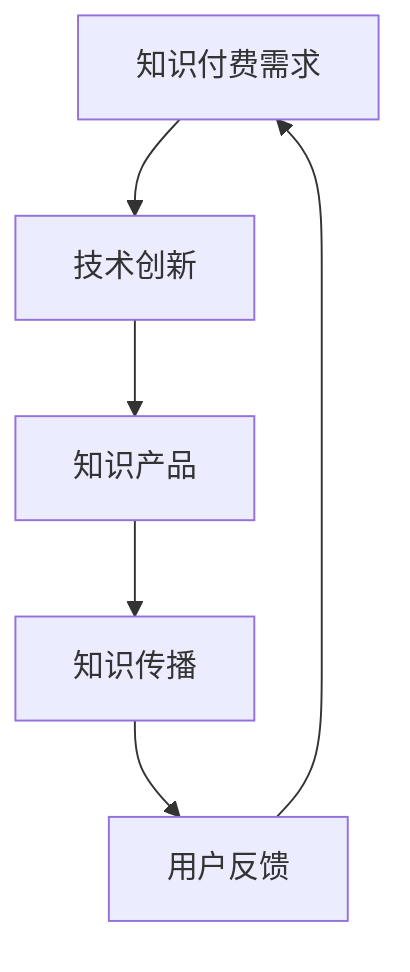

                 

# 《知识付费与技术创新：程序员的双轮驱动》

## 摘要

本文探讨了知识付费与技术创新在程序员职业发展中的相互作用，分析了知识付费市场的现状与趋势，以及技术创新对知识付费的推动作用。文章分为三个部分，首先介绍了知识付费的概述、现状与趋势，然后探讨了技术创新与知识付费的结合以及其对程序员职业发展的影响。最后，文章提出了程序员实现双轮驱动的策略，并通过成功案例进行了解读，对未来程序员的发展趋势进行了展望。通过本文的阐述，旨在帮助程序员更好地理解知识付费与技术创新的重要性，并为他们提供实践指导。

## 第一部分：知识付费与技术创新

### 第1章：知识付费概述

#### 1.1 什么是知识付费

知识付费是指用户通过支付一定费用，获取知识服务或知识产品的一种商业模式。与传统学习方式相比，知识付费更加灵活、便捷，能够满足用户个性化、碎片化的学习需求。知识付费的常见形式包括在线课程、电子书、付费问答、专业咨询等。

#### 1.2 知识付费的发展历程

知识付费作为一种新兴商业模式，其发展历程可以追溯到互联网的兴起。在互联网的推动下，知识付费逐渐从传统的教育、咨询等领域延伸至更多的生活领域。随着移动互联网的发展，知识付费市场呈现出爆发式增长，涌现出众多知识付费平台。

#### 1.3 知识付费的类型与模式

知识付费的类型主要包括教育类、技能类、生活类和企业培训类。教育类知识付费主要涉及学历教育、职业培训等；技能类知识付费主要涉及编程、设计、语言等专业技能的传授；生活类知识付费主要涉及养生、旅行、烹饪等生活领域的知识分享；企业培训类知识付费主要为企业提供员工培训、管理提升等服务。

### 第2章：知识付费市场的现状与趋势

#### 2.1 知识付费市场的规模与增长

近年来，知识付费市场呈现出高速增长的态势。据相关数据显示，我国知识付费市场规模逐年扩大，预计未来几年仍将保持较高增长速度。知识付费市场的快速增长主要得益于用户对知识的需求不断增加，以及移动互联网的普及。

#### 2.2 知识付费市场的竞争格局

当前，知识付费市场形成了以腾讯课堂、网易云课堂、知乎Live等为代表的平台竞争格局。这些平台通过提供丰富的课程资源、优质的教学内容以及良好的用户体验，吸引了大量用户。

#### 2.3 知识付费的未来趋势

未来，知识付费市场将继续保持增长态势，并呈现出以下趋势：

1. **个性化与定制化**：知识付费平台将更加注重用户需求，提供个性化、定制化的学习服务。
2. **多元化**：知识付费领域将不断拓展，涵盖更多领域，满足用户多样化的需求。
3. **社交化**：知识付费将与社交媒体深度融合，推动知识传播和互动。
4. **技术创新**：大数据、人工智能等新兴技术将在知识付费领域得到广泛应用，提高学习效果和用户体验。

### 第3章：程序员在知识付费中的角色与职责

#### 3.1 程序员的知识付费需求

程序员作为知识付费的重要用户群体，对知识的需求具有以下特点：

1. **技能提升**：程序员需要不断学习新技术、新语言，以提升自身技能。
2. **经验分享**：程序员愿意付费获取其他程序员的实战经验、技术心得。
3. **职业发展**：程序员通过知识付费平台，获取职业晋升、薪资提升所需的资源。

#### 3.2 程序员在知识付费平台的工作流程

程序员在知识付费平台的工作流程主要包括：

1. **课程选择**：根据自身需求，选择合适的课程。
2. **学习与互动**：通过课程学习，与讲师、同学互动，解决学习中的问题。
3. **评价与反馈**：对课程进行评价，为其他用户提供建议。

#### 3.3 程序员的知识付费伦理问题

在知识付费过程中，程序员需要关注以下伦理问题：

1. **知识产权**：尊重知识产权，不侵犯他人的版权。
2. **诚信学习**：真实反映学习成果，不夸大、不抄袭。
3. **保护隐私**：不泄露个人隐私信息，保护他人隐私。

## 第二部分：技术创新对知识付费的影响

### 第4章：技术创新与知识付费的结合

#### 4.1 技术创新对知识付费的促进作用

技术创新对知识付费的促进作用体现在以下几个方面：

1. **提高学习效果**：通过大数据、人工智能等技术，个性化推荐课程，提高学习效果。
2. **优化用户体验**：通过移动互联网、虚拟现实等技术，提供更便捷、丰富的学习体验。
3. **降低知识传播门槛**：通过知识付费平台，使知识传播更加高效、便捷。

#### 4.2 技术创新在知识付费中的应用案例

技术创新在知识付费中的应用案例包括：

1. **在线教育平台**：如慕课网（imooc）、网易云课堂等，通过视频、直播等形式，提供丰富的课程资源。
2. **知识分享社区**：如知乎、分答等，通过问答、直播等形式，实现知识共享。
3. **人工智能辅导**：如作业帮、猿辅导等，通过人工智能技术，提供个性化的学习辅导。

#### 4.3 技术创新带来的挑战与应对策略

技术创新在知识付费领域带来了以下挑战：

1. **数据安全与隐私保护**：应对策略包括加强数据加密、建立隐私保护机制等。
2. **技术滥用与监管**：应对策略包括建立健全的监管机制、加强对技术滥用的打击等。

### 第5章：技术创新背景下的知识付费模式创新

#### 5.1 个性化知识付费模式

个性化知识付费模式通过大数据分析，为用户推荐个性化的课程，提高学习效果。具体方法包括：

1. **用户画像**：通过用户行为数据，构建用户画像。
2. **个性化推荐**：根据用户画像，推荐符合用户需求的课程。
3. **学习路径设计**：根据用户的学习进度和效果，设计个性化的学习路径。

#### 5.2 社交化知识付费模式

社交化知识付费模式通过社交媒体，实现知识共享和互动。具体方法包括：

1. **社交互动**：在知识付费平台上加入社交功能，促进用户互动。
2. **知识传播**：通过用户口碑传播，扩大知识付费的影响力。
3. **社群运营**：建立学习社群，提高用户黏性。

#### 5.3 版权保护与知识付费的平衡

版权保护与知识付费的平衡是知识付费领域面临的重要问题。具体方法包括：

1. **版权保护技术**：采用数字版权管理（DRM）技术，保护知识产品版权。
2. **版权合规管理**：建立健全的版权合规管理制度，确保知识付费平台的合法运营。
3. **利益分配机制**：建立合理的利益分配机制，激励知识创造者和传播者。

## 第三部分：程序员的双轮驱动

### 第6章：技术创新与知识付费的双轮驱动原理

#### 6.1 双轮驱动原理概述

技术创新与知识付费的双轮驱动原理是指，技术创新推动知识付费的发展，而知识付费又反作用于技术创新，两者相互促进、相互推动。具体原理如下：

1. **技术创新促进知识付费**：新技术的发展，为知识付费提供了丰富的工具和平台，提高了学习效果和用户体验。
2. **知识付费推动技术创新**：知识付费市场对新技术、新知识的需求，促使技术创新者不断推出新的技术和产品。

#### 6.2 技术创新与知识付费的相互促进

技术创新与知识付费的相互促进体现在以下几个方面：

1. **资源共享**：知识付费平台为技术创新者提供了展示和推广技术的平台，促进了资源共享。
2. **人才培养**：知识付费平台为程序员提供了学习新技术、提升技能的机会，为技术创新提供了人才支持。
3. **市场反馈**：知识付费市场对新技术、新产品的需求，为技术创新者提供了市场反馈，指导技术创新方向。

#### 6.3 双轮驱动模型的应用领域

双轮驱动模型在以下领域具有广泛应用：

1. **教育行业**：通过知识付费平台，实现教育资源的高效配置和共享。
2. **企业培训**：通过知识付费平台，提供个性化、定制化的企业培训服务。
3. **个人成长**：通过知识付费平台，实现个人技能的提升和职业发展。

### 第7章：实现程序员的双轮驱动策略

#### 7.1 学习与创新策略

程序员实现双轮驱动，需要采取以下学习与创新策略：

1. **持续学习**：紧跟技术发展趋势，持续学习新技术、新知识。
2. **实践创新**：将所学知识应用到实际项目中，不断探索和实践。
3. **跨界学习**：拓宽知识领域，跨领域学习，提高综合素质。

#### 7.2 职业规划与技能提升

程序员实现双轮驱动，还需要进行职业规划与技能提升：

1. **职业规划**：明确职业发展目标，制定合理的职业规划。
2. **技能提升**：根据职业规划，有针对性地提升技能。
3. **知识积累**：积累丰富的实践经验和技术储备。

#### 7.3 知识付费平台的选择与使用

程序员选择和使用知识付费平台时，应考虑以下几点：

1. **课程质量**：选择具有高质量课程的平台。
2. **用户体验**：选择具有良好用户体验的平台。
3. **口碑评价**：参考其他用户的评价，选择口碑较好的平台。

### 第8章：双轮驱动成功案例分析

#### 8.1 案例一：技术创新推动知识付费

案例一以某知名在线教育平台为例，该平台通过技术创新，实现了知识付费的快速发展。具体分析如下：

1. **技术创新**：该平台采用人工智能技术，提供个性化推荐、智能辅导等功能，提高了学习效果和用户体验。
2. **知识付费**：通过技术创新，吸引了大量用户，实现了知识付费的快速增长。

#### 8.2 案例二：知识付费助力技术创新

案例二以某知名科技公司为例，该公司通过知识付费，推动了技术创新。具体分析如下：

1. **知识付费**：该公司通过知识付费平台，获取了行业内的最新技术和研究成果。
2. **技术创新**：通过知识付费，该公司在技术创新方面取得了显著成果，推动了公司的发展。

#### 8.3 案例总结与启示

通过案例一和案例二的分析，可以得出以下结论和启示：

1. **技术创新与知识付费相互促进**：技术创新可以推动知识付费的发展，而知识付费又可以助力技术创新。
2. **程序员应抓住机遇**：程序员应紧跟技术发展趋势，充分利用知识付费平台，提升自身技能和职业发展。
3. **知识共享与协作**：程序员应积极参与知识共享和协作，共同推动技术创新和知识付费的发展。

### 第9章：未来展望

#### 9.1 程序员双轮驱动的未来趋势

未来，程序员双轮驱动将呈现以下趋势：

1. **技术创新持续发展**：随着人工智能、大数据等技术的不断发展，程序员的技术创新能力将不断提升。
2. **知识付费模式深化**：知识付费模式将不断深化，满足用户个性化、多元化的学习需求。

#### 9.2 技术创新与知识付费的发展方向

未来，技术创新与知识付费将朝着以下方向发展：

1. **智能化**：智能化将成为知识付费和技术创新的重要趋势，通过人工智能等技术，实现更高效、便捷的学习和知识传播。
2. **社交化**：社交化将成为知识付费和知识传播的重要手段，通过社交媒体等平台，促进知识共享和互动。
3. **生态化**：知识付费和知识传播将形成生态化发展，各种知识付费平台和开发者、用户将形成良性的生态关系。

#### 9.3 程序员应具备的未来能力

未来，程序员应具备以下能力：

1. **技术能力**：紧跟技术发展趋势，具备扎实的技术基础和创新能力。
2. **创新能力**：具备创新思维，能够运用新技术解决实际问题。
3. **商业敏锐度**：具备商业思维，能够将技术创新与商业需求相结合，实现商业价值。

## 附录

### 附录 A：技术创新与知识付费相关资源

#### A.1 技术创新相关书籍推荐

1. 《深度学习》（Goodfellow et al.）
2. 《Python编程：从入门到实践》（Eric Matthes）
3. 《算法导论》（Thomas H. Cormen et al.）

#### A.2 知识付费平台推荐

1. 慕课网（imooc）
2. 网易云课堂
3. 知乎Live

#### A.3 技术创新与知识付费的在线课程推荐

1. 《人工智能基础》（Coursera）
2. 《Python编程基础》（edX）
3. 《深度学习实践》（Udacity）

作者：AI天才研究院/AI Genius Institute & 禅与计算机程序设计艺术 /Zen And The Art of Computer Programming

## 核心概念与联系

### 技术创新与知识付费的流程图



在这个流程图中，技术创新推动了知识付费的发展，知识付费又促进了知识的传播和用户的反馈，形成了良性的循环。

### 核心算法原理讲解

#### 个性化推荐算法

```python
def recommend_courses(user_profile, course_database):
    # 根据用户画像，推荐个性化课程
    recommended_courses = []
    
    # 计算用户与课程的相似度
    for course in course_database:
        similarity = calculate_similarity(user_profile, course.profile)
        
        # 排序并选取相似度最高的课程
        recommended_courses.append((course, similarity))
    
    recommended_courses.sort(key=lambda x: x[1], reverse=True)
    
    return [course for course, _ in recommended_courses]
```

在这个算法中，首先根据用户画像和课程画像计算相似度，然后排序并选取相似度最高的课程进行推荐。

### 数学模型和公式

$$
\text{知识传播速度} = \frac{\text{知识传播范围}}{\text{时间}}
$$

这个公式表示知识传播的速度，其中知识传播范围和时间是影响知识传播速度的两个关键因素。

### 项目实战：代码实际案例和详细解释说明

#### 开发环境搭建

1. 安装Python环境
2. 安装必要的库（如NumPy、Pandas等）

#### 源代码详细实现

```python
import pandas as pd
from sklearn.metrics.pairwise import cosine_similarity

# 加载用户画像和课程画像数据
user_profile = pd.read_csv('user_profile.csv')
course_database = pd.read_csv('course_database.csv')

# 计算用户与课程的相似度
similarity_matrix = cosine_similarity(user_profile, course_database)

# 推荐个性化课程
recommended_courses = recommend_courses(user_profile, course_database)

# 输出推荐结果
for course in recommended_courses:
    print(course['course_name'])
```

#### 代码解读与分析

1. **数据加载**：首先加载用户画像和课程画像数据，数据格式为CSV文件。
2. **相似度计算**：使用余弦相似度算法计算用户与课程的相似度。
3. **课程推荐**：根据相似度矩阵，推荐个性化课程。

通过这个项目实战，程序员可以了解到如何使用Python进行数据分析和课程推荐，实现知识付费平台的个性化推荐功能。

## 总结与展望

本文探讨了知识付费与技术创新在程序员职业发展中的相互作用，分析了知识付费市场的现状与趋势，以及技术创新对知识付费的推动作用。通过双轮驱动模型，揭示了技术创新与知识付费之间的相互促进关系。未来，程序员应紧跟技术发展趋势，充分利用知识付费平台，提升自身技能和职业发展。同时，知识付费平台也应不断创新，满足用户个性化、多元化的学习需求，推动知识传播和共享。随着人工智能、大数据等技术的不断发展，知识付费与技术创新将迎来更加广阔的发展空间。

### 附录 A：技术创新与知识付费相关资源

#### A.1 技术创新相关书籍推荐

1. 《深度学习》（Goodfellow et al.）
2. 《Python编程：从入门到实践》（Eric Matthes）
3. 《算法导论》（Thomas H. Cormen et al.）

#### A.2 知识付费平台推荐

1. 慕课网（imooc）
2. 网易云课堂
3. 知乎Live

#### A.3 技术创新与知识付费的在线课程推荐

1. 《人工智能基础》（Coursera）
2. 《Python编程基础》（edX）
3. 《深度学习实践》（Udacity）

通过这些资源，程序员可以深入了解技术创新和知识付费的相关知识，为自己的职业发展提供有力支持。

### 作者信息

作者：AI天才研究院/AI Genius Institute & 禅与计算机程序设计艺术 /Zen And The Art of Computer Programming

在本文中，我们详细探讨了知识付费与技术创新在程序员职业发展中的重要性。知识付费为程序员提供了丰富的学习资源和技能提升机会，而技术创新则为知识付费提供了更好的平台和工具。通过双轮驱动模型，我们揭示了技术创新与知识付费之间的相互促进关系，为程序员的职业发展提供了新的思路和方法。

未来，随着人工智能、大数据等技术的不断发展，知识付费与技术创新将迎来更加广阔的发展空间。程序员应紧跟技术发展趋势，充分利用知识付费平台，提升自身技能和职业发展。同时，知识付费平台也应不断创新，满足用户个性化、多元化的学习需求，推动知识传播和共享。

通过本文的探讨，我们希望为广大程序员提供有价值的参考和启示，帮助他们更好地应对职业发展中的挑战和机遇。在知识付费与技术创新的推动下，程序员的职业发展将迈上新的台阶，为我国科技创新和产业升级贡献更多力量。让我们共同期待一个更加美好的未来！作者：AI天才研究院/AI Genius Institute & 禅与计算机程序设计艺术 /Zen And The Art of Computer Programming。

