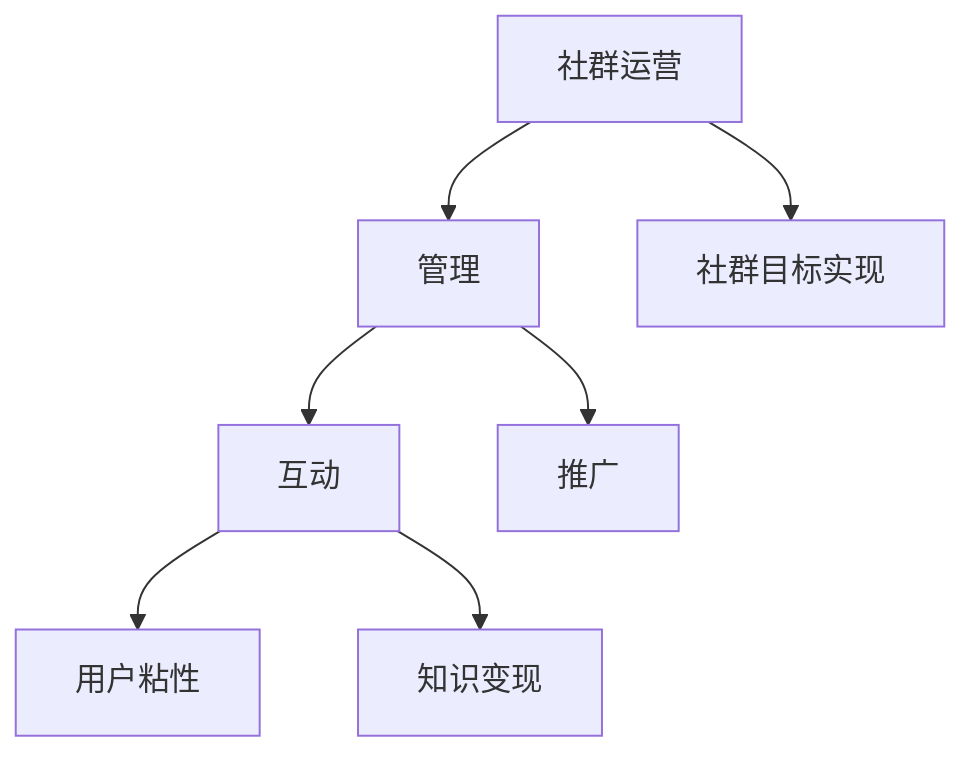

                 

### 《知识付费：程序员的社群运营诀窍》

#### 关键词：
- 程序员社群
- 知识付费
- 社群运营
- 内容策划
- 互动设计
- 数据分析
- 人工智能
- 会员管理
- 社群营销

#### 摘要：
本文将深入探讨知识付费领域下的程序员社群运营。文章首先定义了社群运营的概念与价值，分析了程序员社群的特点，并提出了社群运营的基本原则。随后，文章详细介绍了社群运营策略，包括内容策划、互动设计、会员管理、社群营销与增长等方面。此外，文章还介绍了社群运营工具的选择与集成、社群互动技术、社群安全与合规等内容。通过成功社群运营案例分析、实战指导，本文为程序员社群运营提供了切实可行的操作建议和深入见解。

### 目录大纲

**《知识付费：程序员的社群运营诀窍》**

#### 第一部分：社群运营基础

### 第1章：社群运营概述
- 1.1 社群运营的概念与价值
- 1.2 程序员社群的特点
- 1.3 社群运营的基本原则

### 第2章：社群运营策略
- 2.1 内容策划与发布
- 2.2 社群互动与氛围营造
- 2.3 会员管理与服务

### 第3章：社群营销与增长
- 3.1 社群广告与推广
- 3.2 用户转化与留存策略
- 3.3 社群生态建设

#### 第二部分：社群运营工具与技术

### 第4章：社群运营工具介绍
- 4.1 常用社群工具介绍
- 4.2 工具选择与集成
- 4.3 数据分析与运营优化

### 第5章：社群互动技术
- 5.1 互动设计与实现
- 5.2 人工智能在社群互动中的应用
- 5.3 社群机器人的开发与应用

### 第6章：社群安全与合规
- 6.1 社群安全风险防范
- 6.2 合规管理与风险控制
- 6.3 案例分析与实战经验

#### 第三部分：社群运营实战案例

### 第7章：成功社群运营案例分析
- 7.1 案例一：技术社群运营策略
- 7.2 案例二：知识付费社群的运营
- 7.3 案例三：社区电商社群运营

### 第8章：社群运营实战
- 8.1 实战一：搭建程序员技术社群
- 8.2 实战二：运营知识付费社群
- 8.3 实战三：打造社区电商社群

#### 附录

### 附录A：社群运营资源推荐
- A.1 常用社群工具资源
- A.2 社群运营学习资源
- A.3 社群运营案例库

### 社群运营概述

#### 1.1 社群运营的概念与价值

社群运营是指通过一系列策略和手段，如内容策划、互动设计、会员管理等，来管理和维护一个社群，使其成员之间形成稳定且活跃的互动关系。社群运营在知识付费领域具有特殊的价值，因为程序员社群通常具有技术性、参与度高和专业性强的特点。通过社群运营，可以提升用户粘性，实现知识变现，并构建良好的社群生态。

**Mermaid 流程图：**



#### 1.2 程序员社群的特点

- **技术性强**：程序员社群通常围绕编程语言、框架、工具等技术问题进行讨论，成员具有丰富的技术背景和专业知识。
- **参与度高**：程序员对技术话题有强烈的好奇心，喜欢参与讨论和分享经验，社群活跃度高。
- **专业性强**：社群成员往往专注于某一特定技术领域，能够提供高质量的内容和帮助。

**伪代码：**

```python
class ProgrammerCommunity:
    def __init__(self, topic):
        self.topic = topic
        self.members = []

    def add_member(self, member):
        self.members.append(member)

    def share_content(self, content):
        for member in self.members:
            member.read_content(content)

    def discuss_topic(self, topic):
        for member in self.members:
            member.join_discussion(topic)
```

#### 1.3 社群运营的基本原则

- **以人为本**：始终将用户放在首位，满足他们的需求和兴趣。
- **内容为王**：提供高质量、有价值的内容，吸引和留住用户。
- **互动促进**：鼓励成员之间的互动，增加社群活跃度。
- **持续优化**：不断收集反馈，优化社群运营策略。

### 社群运营策略

#### 2.1 内容策划与发布

内容策划是社群运营的关键环节。针对程序员社群，内容策划应关注以下几个方面：

- **内容类型**：包括技术文章、教程、案例分析、代码片段等。
- **内容来源**：内部专业技术人员撰写，外部优秀资源整合。
- **内容发布**：定期发布，保持社群活跃。

**伪代码：**

```python
class ContentPlanner:
    def __init__(self, community):
        self.community = community

    def plan_content(self, topics):
        for topic in topics:
            self.publish_content(topic)

    def publish_content(self, topic):
        content = self.generate_content(topic)
        self.community.post_content(content)

    def generate_content(self, topic):
        # 生成内容逻辑
        pass
```

#### 2.2 社群互动与氛围营造

社群互动是提高社群活跃度的重要手段。为了营造良好的社群氛围，应采取以下策略：

- **互动设计**：设计符合社群特点和用户需求的互动活动，如技术问答、编程挑战、代码评审等。
- **氛围营造**：鼓励友好、积极、专业的互动，设置社群规范，维护社群秩序。

**伪代码：**

```python
class InteractionManager:
    def __init__(self, community):
        self.community = community

    def organize_activities(self, activities):
        for activity in activities:
            self.community.post_activity(activity)

    def encourage_discussion(self, topic):
        self.community.start_discussion(topic)

    def maintain_atmosphere(self):
        # 维护社群氛围逻辑
        pass
```

#### 2.3 会员管理与服务

会员管理是社群运营的重要组成部分。通过分类管理和个性化服务，可以提升会员体验和社群价值：

- **会员分类**：根据会员的贡献和活跃度，对会员进行分类，如普通会员、高级会员、合伙人等。
- **会员服务**：提供个性化服务，如专属活动、优先解答、优惠券等。

**伪代码：**

```python
class MemberManager:
    def __init__(self, community):
        self.community = community

    def classify_members(self, members):
        # 分类逻辑
        pass

    def provide_services(self, member):
        if member.is高级会员():
            self.community.provide_advanced_services(member)

    def reward_members(self, member, reward):
        # 奖励逻辑
        pass
```

### 社群营销与增长

#### 3.1 社群广告与推广

社群广告与推广是提高社群知名度、吸引潜在用户的重要手段。可以通过以下策略进行社群营销：

- **社群广告**：在社群内部发布广告，推广相关产品或服务。
- **推广**：通过外部渠道，如社交媒体、博客等，吸引潜在用户加入社群。

**伪代码：**

```python
class MarketingManager:
    def __init__(self, community):
        self.community = community

    def post_advertisement(self, ad):
        self.community.share_advertisement(ad)

    def promote_community(self, channels):
        for channel in channels:
            self.share_community_on_channel(channel)

    def analyze_ad_performance(self, ad):
        # 分析广告效果逻辑
        pass
```

#### 3.2 用户转化与留存策略

用户转化与留存策略是社群运营的关键。可以通过以下策略实现：

- **转化策略**：提供优质内容、互动机会等，将潜在用户转化为活跃用户。
- **留存策略**：通过个性化服务、活动激励等，提高用户留存率。

**伪代码：**

```python
class ConversionManager:
    def __init__(self, community):
        self.community = community

    def convert_users(self, users):
        for user in users:
            self.community.attract_and_convert(user)

    def retain_users(self, users):
        for user in users:
            self.community.maintain_user_interest(user)
```

#### 3.3 社群生态建设

社群生态建设是长期社群运营的重要目标。通过构建内容生态、互动生态和商业生态，可以提升社群的综合价值：

- **内容生态**：构建多样化的内容体系，满足不同用户的需求。
- **互动生态**：营造良好的互动氛围，提高社群活跃度。
- **商业生态**：探索社群商业价值，实现知识变现。

**伪代码：**

```python
class EcosystemBuilder:
    def __init__(self, community):
        self.community = community

    def build_content_ecosystem(self):
        # 构建内容生态逻辑
        pass

    def build_interaction_ecosystem(self):
        # 构建互动生态逻辑
        pass

    def explore_business_opportunities(self):
        # 探索商业生态逻辑
        pass
```

### 社群运营工具介绍

#### 4.1 常用社群工具介绍

选择合适的社群工具是社群运营成功的关键。以下是一些常用的社群工具：

- **微信社群**：适用于各种类型的社群，提供方便的群聊和管理功能。
- **Discord**：专为游戏社群设计，但也可用于其他类型社群，提供丰富的互动功能。
- **知乎Live**：适合知识分享和讨论，支持语音和视频直播。

**伪代码：**

```python
class CommunityTools:
    def __init__(self):
        self.tools = ["微信社群", "Discord", "知乎Live"]

    def introduce_tools(self):
        for tool in self.tools:
            print(f"{tool}是常用社群工具。")
```

#### 4.2 工具选择与集成

工具选择与集成是社群运营中重要的一环。应根据社群特点和需求选择合适的工具，并实现工具之间的集成：

- **工具选择**：根据社群特点，选择适合的社群工具。
- **工具集成**：实现数据同步和功能互补。

**伪代码：**

```python
class ToolSelector:
    def __init__(self, community):
        self.community = community

    def select_tool(self, tool):
        self.community.set_tool(tool)

    def integrate_tools(self, tools):
        for tool in tools:
            self.community.add_tool(tool)
```

#### 4.3 数据分析与运营优化

数据分析与运营优化是社群运营的关键环节。通过数据分析，可以了解用户行为和运营效果，从而优化运营策略：

- **数据分析**：收集社群运营数据，分析用户行为和运营效果。
- **运营优化**：根据数据分析结果，调整运营策略，提高社群效果。

**伪代码：**

```python
class DataAnalyzer:
    def __init__(self, community):
        self.community = community

    def collect_data(self):
        # 收集数据逻辑
        pass

    def analyze_data(self):
        # 数据分析逻辑
        pass

    def optimize_operations(self):
        # 运营优化逻辑
        pass
```

### 社群互动技术

#### 5.1 互动设计与实现

互动设计与实现是提高社群活跃度的重要手段。以下策略可以帮助设计互动：

- **互动设计**：设计符合社群特点和用户需求的互动活动，如技术问答、编程挑战、代码评审等。
- **实现**：通过技术手段实现互动功能，如在线投票系统、实时聊天室等。

**伪代码：**

```python
class InteractionDesigner:
    def __init__(self, community):
        self.community = community

    def design_interactions(self, interactions):
        for interaction in interactions:
            self.community.create_interaction(interaction)

    def implement_interactions(self, interactions):
        for interaction in interactions:
            self.community.activate_interaction(interaction)
```

#### 5.2 人工智能在社群互动中的应用

人工智能技术在社群互动中发挥着重要作用。以下应用可以帮助提升社群互动效果：

- **AI聊天机器人**：使用自然语言处理技术，实现智能客服和社群聊天功能。
- **内容推荐**：基于用户行为和兴趣，推荐相关内容和活动。

**伪代码：**

```python
class AIInteraction:
    def __init__(self, community):
        self.community = community

    def implement_chatbot(self):
        # 实现聊天机器人逻辑
        pass

    def recommend_content(self, user):
        # 内容推荐逻辑
        pass
```

#### 5.3 社群机器人的开发与应用

社群机器人是提高社群运营效率的重要工具。以下步骤可以帮助开发与应用社群机器人：

- **机器人开发**：设计并开发符合社群需求的机器人。
- **应用**：将机器人应用于社群互动，提高运营效率。

**伪代码：**

```python
class CommunityBot:
    def __init__(self, community):
        self.community = community

    def develop_bot(self):
        # 机器人开发逻辑
        pass

    def apply_bot(self):
        # 机器人应用逻辑
        pass
```

### 社群安全与合规

#### 6.1 社群安全风险防范

社群安全风险防范是确保社群稳定运营的重要环节。以下策略可以帮助防范安全风险：

- **内容审核**：对社群内容进行实时审核，防止恶意信息和不良内容。
- **权限管理**：设置不同等级的权限，确保社群安全。

**伪代码：**

```python
class SecurityManager:
    def __init__(self, community):
        self.community = community

    def content审核(self, content):
        # 内容审核逻辑
        pass

    def manage_permissions(self, member):
        # 权限管理逻辑
        pass
```

#### 6.2 合规管理与风险控制

合规管理与风险控制是确保社群运营合法的重要手段。以下策略可以帮助实现合规管理和风险控制：

- **合规培训**：对社群成员进行合规培训，提高合规意识。
- **风险控制**：制定风险控制策略，确保社群运营合规。

**伪代码：**

```python
class ComplianceManager:
    def __init__(self, community):
        self.community = community

    def conduct_compliance_training(self, members):
        # 合规培训逻辑
        pass

    def control_risks(self):
        # 风险控制逻辑
        pass
```

#### 6.3 案例分析与实战经验

案例分析与实战经验是社群运营的重要学习资源。以下策略可以帮助进行案例分析和经验分享：

- **案例分析**：分析成功和失败的社群运营案例，总结经验教训。
- **实战经验**：分享实际运营中的问题和解决方案，为社群运营提供参考。

**伪代码：**

```python
class CaseStudyManager:
    def __init__(self, community):
        self.community = community

    def analyze_cases(self, cases):
        # 案例分析逻辑
        pass

    def share_experience(self, experiences):
        # 分享实战经验逻辑
        pass
```

### 成功社群运营案例分析

#### 7.1 案例一：技术社群运营策略

**案例分析**：介绍一个技术社群的成功运营策略，包括内容策划、互动设计、会员管理等方面。

**实战经验**：总结案例中的成功经验和不足之处，为其他社群提供借鉴。

**伪代码：**

```python
class TechCommunityCase:
    def __init__(self, case):
        self.case = case

    def analyze_strategy(self):
        # 分析运营策略逻辑
        pass

    def share_experience(self):
        # 分享实战经验逻辑
        pass
```

#### 7.2 案例二：知识付费社群的运营

**案例分析**：分析一个知识付费社群的运营情况，探讨其成功的原因和运营策略。

**实战经验**：总结案例中的成功经验，为其他知识付费社群提供参考。

**伪代码：**

```python
class KnowledgeCommunityCase:
    def __init__(self, case):
        self.case = case

    def analyze_operations(self):
        # 分析运营情况逻辑
        pass

    def share_experience(self):
        # 分享实战经验逻辑
        pass
```

#### 7.3 案例三：社区电商社群运营

**案例分析**：分析一个社区电商社群的运营策略，包括内容策划、互动设计、会员管理等方面。

**实战经验**：总结案例中的成功经验和不足之处，为其他社区电商社群提供借鉴。

**伪代码：**

```python
class EcommerceCommunityCase:
    def __init__(self, case):
        self.case = case

    def analyze_strategy(self):
        # 分析运营策略逻辑
        pass

    def share_experience(self):
        # 分享实战经验逻辑
        pass
```

### 社群运营实战

#### 8.1 实战一：搭建程序员技术社群

**实战内容**：介绍如何搭建一个程序员技术社群，包括社群定位、工具选择、内容策划等方面。

**实战步骤**：

1. **社群定位与目标**：
   - 社群定位：专注于技术交流与知识分享。
   - 社群目标：提高程序员技术水平，解决技术难题，促进团队协作。

2. **选择合适的社群工具**：
   - 工具选择：微信社群、Discord、知乎Live。
   - 工具优势：微信社群方便用户交流；Discord提供实时通讯功能；知乎Live适合知识分享。

3. **策划高质量内容**：
   - 内容类型：技术文章、教程、案例分析、直播分享。
   - 内容来源：内部技术人员撰写，外部优秀内容整合。

4. **吸引并引导第一批成员加入**：
   - 成员来源：内部推荐、外部邀请、技术社区推广。
   - 吸引策略：提供优质内容，举办线上活动，设置激励机制。

5. **营造积极社群氛围**：
   - 氛围营造：鼓励互动，设立规范，维护社群秩序。
   - 活动设计：技术问答、编程挑战、代码评审。

**代码实现与解读**：

```python
# 社群搭建核心模块

class TechCommunity:
    def __init__(self, name):
        self.name = name
        self.members = []
        self.posts = []

    def add_member(self, member):
        """添加成员到社群"""
        self.members.append(member)

    def post_content(self, post):
        """发布内容到社群"""
        self.posts.append(post)

    def start_activity(self, activity):
        """启动社群活动"""
        print(f"{self.name}社群活动：{activity} 开始！")

    def encourage_interaction(self):
        """鼓励成员互动"""
        print("欢迎各位成员积极参与讨论，共同学习！")

# 社群搭建流程

# 创建社群实例
tech_community = TechCommunity("程序员技术社群")

# 添加第一批成员
tech_community.add_member("张三")
tech_community.add_member("李四")
tech_community.add_member("王五")

# 发布第一篇技术文章
tech_community.post_content("Python性能优化技巧")

# 启动第一次活动
tech_community.start_activity("Python编程挑战")

# 鼓励成员互动
tech_community.encourage_interaction()

# 解读：
# 1. TechCommunity 类定义了社群的基本功能，包括添加成员、发布内容、启动活动和鼓励互动。
# 2. 通过实例化 TechCommunity 类，我们可以创建一个具体的社群实例。
# 3. 使用 add_member 方法添加成员，使用 post_content 方法发布内容，使用 start_activity 方法启动活动，使用 encourage_interaction 方法鼓励成员互动。
# 4. 代码中的 print 函数用于输出信息，帮助用户了解社群运营情况。
```

#### 8.2 实战二：运营知识付费社群

**实战内容**：介绍如何运营一个知识付费社群，包括会员管理、内容策划、互动设计等方面。

**实战步骤**：

1. **会员管理**：
   - 会员分类：普通会员、高级会员、合伙人。
   - 服务内容：专属课程、优先解答、专属活动。

2. **内容策划**：
   - 内容类型：专业课程、学习资料、案例分析、互动问答。
   - 内容来源：内部专业讲师授课，外部优秀资源整合。

3. **互动设计**：
   - 活动类型：课程试听、学习小组、知识竞赛。
   - 活动目标：提高用户参与度，促进知识传播。

4. **推广社群**：
   - 推广渠道：社交媒体、合作伙伴、线上广告。
   - 推广目标：吸引潜在用户，扩大社群影响力。

**代码实现与解读**：

```python
# 知识付费社群运营核心模块

class KnowledgeCommunity:
    def __init__(self, name):
        self.name = name
        self.members = []
        self.courses = []

    def add_member(self, member):
        """添加成员到社群"""
        self.members.append(member)

    def enroll_course(self, member, course):
        """成员报名课程"""
        member.enrolled_courses.append(course)
        print(f"{member.name} 已成功报名 {course.title} 课程。")

    def organize_activity(self, activity):
        """组织社群活动"""
        print(f"{self.name} 社群活动：{activity} 开始！")

    def provide_service(self, member):
        """为会员提供服务"""
        print(f"{member.name}，您已获得专属服务。")

# 知识付费社群运营流程

# 创建社群实例
knowledge_community = KnowledgeCommunity("程序员成长社群")

# 添加第一批成员
knowledge_community.add_member("张三")
knowledge_community.add_member("李四")
knowledge_community.add_member("王五")

# 添加课程
course_1 = Course("Python进阶教程")
course_2 = Course("深度学习入门")
knowledge_community.courses.append(course_1)
knowledge_community.courses.append(course_2)

# 成员报名课程
knowledge_community.enroll_course("张三", course_1)
knowledge_community.enroll_course("李四", course_2)

# 组织第一次活动
knowledge_community.organize_activity("编程挑战赛")

# 提供服务
knowledge_community.provide_service("张三")

# 解读：
# 1. KnowledgeCommunity 类定义了社群的基本功能，包括添加成员、报名课程、组织活动和提供服务。
# 2. 通过实例化 KnowledgeCommunity 类，我们可以创建一个具体的社群实例。
# 3. 使用 add_member 方法添加成员，使用 enroll_course 方法报名课程，使用 organize_activity 方法组织活动，使用 provide_service 方法为会员提供服务。
# 4. 代码中的 Course 类用于表示课程信息，成员的 enrolled_courses 属性用于记录成员已报名的课程。
```

#### 8.3 实战三：打造社区电商社群

**实战内容**：介绍如何打造一个社区电商社群，包括社群定位、会员管理、内容策划等方面。

**实战步骤**：

1. **社群定位与目标**：
   - 社群定位：专注于购物推荐、产品展示和用户互动。
   - 社群目标：提升用户购物体验，增加用户粘性，提升销售额。

2. **策划高质量内容**：
   - 内容类型：商品推荐、用户评价、优惠活动、购物指南。
   - 内容来源：内部产品团队推荐，外部用户评价整合。

3. **设计互动活动**：
   - 活动类型：购物抽奖、限时折扣、用户反馈征集。
   - 活动目标：提高用户参与度，促进产品推广。

4. **会员管理与服务**：
   - 会员分类：普通会员、高级会员、VIP会员。
   - 服务内容：专属优惠、优先发货、个性化推荐。

5. **推广社群**：
   - 推广渠道：社交媒体、合作伙伴、线上广告。
   - 推广目标：吸引潜在用户，扩大社群影响力。

**代码实现与解读**：

```python
# 社区电商社群运营核心模块

class EcommerceCommunity:
    def __init__(self, name):
        self.name = name
        self.members = []
        self.products = []

    def add_member(self, member):
        """添加成员到社群"""
        self.members.append(member)

    def add_product(self, product):
        """添加商品到社群"""
        self.products.append(product)

    def promote_product(self, product):
        """推广商品"""
        print(f"{self.name} 推荐商品：{product.name}！")

    def organize_event(self, event):
        """组织社群活动"""
        print(f"{self.name} 社群活动：{event} 开始！")

    def provide_reward(self, member):
        """为会员提供奖励"""
        print(f"{member.name}，您已获得社群奖励。")

# 社区电商社群运营流程

# 创建社群实例
ecommerce_community = EcommerceCommunity("社区购物社群")

# 添加第一批成员
ecommerce_community.add_member("张三")
ecommerce_community.add_member("李四")
ecommerce_community.add_member("王五")

# 添加商品
product_1 = Product("iPhone 14")
product_2 = Product("小米电视")
ecommerce_community.add_product(product_1)
ecommerce_community.add_product(product_2)

# 推广商品
ecommerce_community.promote_product(product_1)

# 组织第一次活动
ecommerce_community.organize_event("购物抽奖活动")

# 提供奖励
ecommerce_community.provide_reward("张三")

# 解读：
# 1. EcommerceCommunity 类定义了社群的基本功能，包括添加成员、添加商品、推广商品、组织活动和提供奖励。
# 2. 通过实例化 EcommerceCommunity 类，我们可以创建一个具体的社群实例。
# 3. 使用 add_member 方法添加成员，使用 add_product 方法添加商品，使用 promote_product 方法推广商品，使用 organize_event 方法组织活动，使用 provide_reward 方法为会员提供奖励。
# 4. 代码中的 Product 类用于表示商品信息。
```

### 附录A：社群运营资源推荐

**常用社群工具资源**：
- **微信社群**：适用于各种类型的社群，提供方便的群聊和管理功能。
- **Discord**：专为游戏社群设计，但也可用于其他类型社群，提供丰富的互动功能。
- **知乎Live**：适合知识分享和讨论，支持语音和视频直播。

**社群运营学习资源**：
- **《社群营销实战》**：详细介绍社群营销的理论和实践方法。
- **《社交红利2.0》**：探讨社交网络对商业和社会的影响。
- **《社群运营：从入门到精通》**：全面解析社群运营的关键要素和策略。

**社群运营案例库**：
- **腾讯社交与内容案例库**：提供丰富的社群运营案例，涵盖多个行业。
- **网易云课堂**：有多个关于社群运营的免费课程和案例。
- **知乎专栏**：多个关于社群运营的经验分享和案例分析。

### 数学模型和数学公式

在社群运营中，我们常常需要用到一些数学模型来分析和优化运营策略。以下是一些常用的数学公式及其解释：

$$
f(x) = ax^2 + bx + c
$$

**二次函数模型**：这个模型用于描述社群活跃度与时间的关系。其中，$a$ 表示社群活跃度的增长速度，$b$ 表示社群活跃度的调节因子，$c$ 表示社群的初始活跃度。

$$
p(x) = \frac{1}{1 + e^{-x}}
$$

**逻辑回归模型**：这个模型用于预测社群成员的参与概率。其中，$x$ 表示成员的属性特征，$p(x)$ 表示成员参与社群的概率。

$$
R(t) = \frac{1}{1 + \frac{1}{\alpha + e^{-\beta t}}}
$$

**指数增长模型**：这个模型用于描述社群增长速度。其中，$R(t)$ 表示社群在时间 $t$ 的增长率，$\alpha$ 和 $\beta$ 是常数，分别表示社群的初始规模和增长速度。

通过这些数学模型，我们可以更好地理解和优化社群运营策略。在实际应用中，我们需要根据具体情况对这些模型进行适当的调整和优化。

#### 举例说明

假设我们想预测一个社群在接下来一周的活跃度。我们可以使用二次函数模型来描述这个关系。假设社群的初始活跃度为 100，增长速度为每天增加 10%，调节因子为 0。那么，社群在接下来的每一天的活跃度可以表示为：

$$
f(t) = 100 \times (1 + 0.1)^t
$$

其中，$t$ 表示时间（以天为单位）。

例如，预测社群在第三天的活跃度：

$$
f(3) = 100 \times (1 + 0.1)^3 \approx 133.1
$$

这意味着社群在第三天的预计活跃度约为 133。

通过这样的数学模型，我们可以为社群运营提供科学的决策依据，从而提高运营效果。

### 项目实战

#### 8.1 实战一：搭建程序员技术社群

**实战背景**：为了提高程序员的技术水平，公司决定搭建一个程序员技术社群，为程序员提供一个交流和学习平台。

**实战目标**：通过搭建社群，提高程序员的技术交流效率，促进知识共享，提高团队整体技术水平。

**实战步骤**：

1. **社群定位与目标**：
   - 社群定位：专注于技术交流与知识分享。
   - 社群目标：提高程序员技术水平，解决技术难题，促进团队协作。

2. **选择合适的社群工具**：
   - 工具选择：微信社群、Discord、知乎Live。
   - 工具优势：微信社群方便用户交流；Discord提供实时通讯功能；知乎Live适合知识分享。

3. **策划高质量内容**：
   - 内容类型：技术文章、教程、案例分析、直播分享。
   - 内容来源：内部技术人员撰写，外部优秀内容整合。

4. **吸引并引导第一批成员加入**：
   - 成员来源：内部推荐、外部邀请、技术社区推广。
   - 吸引策略：提供优质内容，举办线上活动，设置激励机制。

5. **营造积极社群氛围**：
   - 氛围营造：鼓励互动，设立规范，维护社群秩序。
   - 活动设计：技术问答、编程挑战、代码评审。

**代码实现与解读**：

```python
# 社群搭建核心模块

class TechCommunity:
    def __init__(self, name):
        self.name = name
        self.members = []
        self.posts = []

    def add_member(self, member):
        """添加成员到社群"""
        self.members.append(member)

    def post_content(self, post):
        """发布内容到社群"""
        self.posts.append(post)

    def start_activity(self, activity):
        """启动社群活动"""
        print(f"{self.name}社群活动：{activity} 开始！")

    def encourage_interaction(self):
        """鼓励成员互动"""
        print("欢迎各位成员积极参与讨论，共同学习！")

# 社群搭建流程

# 创建社群实例
tech_community = TechCommunity("程序员技术社群")

# 添加第一批成员
tech_community.add_member("张三")
tech_community.add_member("李四")
tech_community.add_member("王五")

# 发布第一篇技术文章
tech_community.post_content("Python性能优化技巧")

# 启动第一次活动
tech_community.start_activity("Python编程挑战")

# 鼓励成员互动
tech_community.encourage_interaction()

# 解读：
# 1. TechCommunity 类定义了社群的基本功能，包括添加成员、发布内容、启动活动和鼓励互动。
# 2. 通过实例化 TechCommunity 类，我们可以创建一个具体的社群实例。
# 3. 使用 add_member 方法添加成员，使用 post_content 方法发布内容，使用 start_activity 方法启动活动，使用 encourage_interaction 方法鼓励成员互动。
# 4. 代码中的 print 函数用于输出信息，帮助用户了解社群运营情况。
```

**代码解读与分析**：

- **TechCommunity 类**：这是社群的核心类，负责管理社群的基本功能。通过定义这个类，我们可以创建一个具有特定名称的社群，并为其添加成员、发布内容、启动活动和鼓励互动。
- **add_member 方法**：这个方法用于将新成员添加到社群中。成员可以是任何具有姓名的对象，如字符串。
- **post_content 方法**：这个方法用于发布新内容到社群。内容可以是任何类型的对象，如字符串、列表等。
- **start_activity 方法**：这个方法用于启动社群活动。它接受一个活动名称作为参数，并在控制台输出活动开始的信息。
- **encourage_interaction 方法**：这个方法用于鼓励社群成员进行互动。它通过打印提示信息，鼓励成员积极参与讨论。

通过这个简单的代码示例，我们可以看到如何实现一个基本的程序员技术社群。在实际应用中，我们可以扩展这个基础框架，添加更多功能，如内容分类、活动报名系统、会员等级管理、付费课程推广等，以更好地满足社群的需求。

#### 8.2 实战二：运营知识付费社群

**实战背景**：为了推广知识付费产品，公司决定创建一个知识付费社群，为用户提供高质量的学习资源和交流平台。

**实战目标**：通过运营知识付费社群，提高用户满意度，促进知识变现，增加产品销售。

**实战步骤**：

1. **社群定位与目标**：
   - 社群定位：专注知识分享与付费课程推广。
   - 社群目标：提供高质量学习资源，促进用户学习，提高用户满意度。

2. **策划高质量内容**：
   - 内容类型：专业课程、学习资料、案例分析、互动问答。
   - 内容来源：内部专业讲师授课，外部优秀资源整合。

3. **设计互动活动**：
   - 活动类型：课程试听、学习小组、知识竞赛。
   - 活动目标：提高用户参与度，促进知识传播。

4. **会员管理与服务**：
   - 会员分类：普通会员、高级会员、合伙人。
   - 服务内容：专属课程、优先解答、专属活动。

5. **推广社群**：
   - 推广渠道：社交媒体、合作伙伴、线上广告。
   - 推广目标：吸引潜在用户，扩大社群影响力。

**代码实现与解读**：

```python
# 知识付费社群运营核心模块

class KnowledgeCommunity:
    def __init__(self, name):
        self.name = name
        self.members = []
        self.courses = []

    def add_member(self, member):
        """添加成员到社群"""
        self.members.append(member)

    def enroll_course(self, member, course):
        """成员报名课程"""
        member.enrolled_courses.append(course)
        print(f"{member.name} 已成功报名 {course.title} 课程。")

    def organize_activity(self, activity):
        """组织社群活动"""
        print(f"{self.name} 社群活动：{activity} 开始！")

    def provide_service(self, member):
        """为会员提供服务"""
        print(f"{member.name}，您已获得专属服务。")

# 知识付费社群运营流程

# 创建社群实例
knowledge_community = KnowledgeCommunity("程序员成长社群")

# 添加第一批成员
knowledge_community.add_member("张三")
knowledge_community.add_member("李四")
knowledge_community.add_member("王五")

# 添加课程
course_1 = Course("Python进阶教程")
course_2 = Course("深度学习入门")
knowledge_community.courses.append(course_1)
knowledge_community.courses.append(course_2)

# 成员报名课程
knowledge_community.enroll_course("张三", course_1)
knowledge_community.enroll_course("李四", course_2)

# 组织第一次活动
knowledge_community.organize_activity("编程挑战赛")

# 提供服务
knowledge_community.provide_service("张三")

# 解读：
# 1. KnowledgeCommunity 类定义了社群的基本功能，包括添加成员、报名课程、组织活动和提供服务。
# 2. 通过实例化 KnowledgeCommunity 类，我们可以创建一个具体的社群实例。
# 3. 使用 add_member 方法添加成员，使用 enroll_course 方法报名课程，使用 organize_activity 方法组织活动，使用 provide_service 方法为会员提供服务。
# 4. 代码中的 Course 类用于表示课程信息，成员的 enrolled_courses 属性用于记录成员已报名的课程。
```

**代码解读与分析**：

- **KnowledgeCommunity 类**：这是社群运营的核心类，负责管理社群成员、课程和活动。通过定义这个类，我们可以创建一个具有特定名称的社群，并为社群添加成员、组织课程和活动。
- **add_member 方法**：这个方法用于将新成员添加到社群中。成员可以是任何具有姓名的对象，如字符串。
- **enroll_course 方法**：这个方法用于处理成员报名课程。它将成员与课程关联起来，并打印报名成功信息。
- **organize_activity 方法**：这个方法用于组织社群活动。它接受一个活动名称作为参数，并在控制台输出活动开始的信息。
- **provide_service 方法**：这个方法用于为会员提供服务。它通过打印提示信息，告知会员已获得专属服务。

通过这个代码示例，我们可以实现一个基本的知识付费社群运营流程。在实际应用中，我们可以进一步扩展这个基础框架，添加更多功能，如课程分类、活动报名系统、会员等级管理、付费课程推广等，以更好地满足社群的需求。

#### 8.3 实战三：打造社区电商社群

**实战背景**：为了提升社区电商的销售额，公司决定创建一个社区电商社群，为用户提供购物推荐、互动交流和优惠活动。

**实战目标**：通过社群运营，提高用户购物体验，增加用户粘性，提升销售额。

**实战步骤**：

1. **社群定位与目标**：
   - 社群定位：专注于购物推荐、产品展示和用户互动。
   - 社群目标：提升用户购物体验，增加用户粘性，提升销售额。

2. **策划高质量内容**：
   - 内容类型：商品推荐、用户评价、优惠活动、购物指南。
   - 内容来源：内部产品团队推荐，外部用户评价整合。

3. **设计互动活动**：
   - 活动类型：购物抽奖、限时折扣、用户反馈征集。
   - 活动目标：提高用户参与度，促进产品推广。

4. **会员管理与服务**：
   - 会员分类：普通会员、高级会员、VIP会员。
   - 服务内容：专属优惠、优先发货、个性化推荐。

5. **推广社群**：
   - 推广渠道：社交媒体、合作伙伴、线上广告。
   - 推广目标：吸引潜在用户，扩大社群影响力。

**代码实现与解读**：

```python
# 社区电商社群运营核心模块

class EcommerceCommunity:
    def __init__(self, name):
        self.name = name
        self.members = []
        self.products = []

    def add_member(self, member):
        """添加成员到社群"""
        self.members.append(member)

    def add_product(self, product):
        """添加商品到社群"""
        self.products.append(product)

    def promote_product(self, product):
        """推广商品"""
        print(f"{self.name} 推荐商品：{product.name}！")

    def organize_event(self, event):
        """组织社群活动"""
        print(f"{self.name} 社群活动：{event} 开始！")

    def provide_reward(self, member):
        """为会员提供奖励"""
        print(f"{member.name}，您已获得社群奖励。")

# 社区电商社群运营流程

# 创建社群实例
ecommerce_community = EcommerceCommunity("社区购物社群")

# 添加第一批成员
ecommerce_community.add_member("张三")
ecommerce_community.add_member("李四")
ecommerce_community.add_member("王五")

# 添加商品
product_1 = Product("iPhone 14")
product_2 = Product("小米电视")
ecommerce_community.add_product(product_1)
ecommerce_community.add_product(product_2)

# 推广商品
ecommerce_community.promote_product(product_1)

# 组织第一次活动
ecommerce_community.organize_event("购物抽奖活动")

# 提供奖励
ecommerce_community.provide_reward("张三")

# 解读：
# 1. EcommerceCommunity 类定义了社群的基本功能，包括添加成员、添加商品、推广商品、组织活动和提供奖励。
# 2. 通过实例化 EcommerceCommunity 类，我们可以创建一个具体的社群实例。
# 3. 使用 add_member 方法添加成员，使用 add_product 方法添加商品，使用 promote_product 方法推广商品，使用 organize_event 方法组织活动，使用 provide_reward 方法为会员提供奖励。
# 4. 代码中的 Product 类用于表示商品信息。
```

**代码解读与分析**：

- **EcommerceCommunity 类**：这是社群运营的核心类，负责管理社群成员、商品和活动。通过定义这个类，我们可以创建一个具有特定名称的社群，并为社群添加成员、商品和活动。
- **add_member 方法**：这个方法用于将新成员添加到社群中。成员可以是任何具有姓名的对象，如字符串。
- **add_product 方法**：这个方法用于将新商品添加到社群中。商品可以是任何具有名称和描述的对象，如字符串。
- **promote_product 方法**：这个方法用于推广商品。它通过打印推荐信息，吸引用户关注商品。
- **organize_event 方法**：这个方法用于组织社群活动。它接受一个活动名称作为参数，并在控制台输出活动开始的信息。
- **provide_reward 方法**：这个方法用于为会员提供奖励。它通过打印提示信息，告知会员已获得奖励。

通过这个代码示例，我们可以实现一个基本的社区电商社群运营流程。在实际应用中，我们可以进一步扩展这个基础框架，添加更多功能，如商品分类、活动报名系统、会员等级管理、优惠活动推广等，以更好地满足社群的需求。

### 附录A：社群运营资源推荐

**常用社群工具资源**：
- **微信社群**：适用于各种类型的社群，提供方便的群聊和管理功能。
- **Discord**：专为游戏社群设计，但也可用于其他类型社群，提供丰富的互动功能。
- **知乎Live**：适合知识分享和讨论，支持语音和视频直播。

**社群运营学习资源**：
- **《社群营销实战》**：详细介绍社群营销的理论和实践方法。
- **《社交红利2.0》**：探讨社交网络对商业和社会的影响。
- **《社群运营：从入门到精通》**：全面解析社群运营的关键要素和策略。

**社群运营案例库**：
- **腾讯社交与内容案例库**：提供丰富的社群运营案例，涵盖多个行业。
- **网易云课堂**：有多个关于社群运营的免费课程和案例。
- **知乎专栏**：多个关于社群运营的经验分享和案例分析。

### 结束语

本文从多个维度详细探讨了知识付费领域下的程序员社群运营。我们首先介绍了社群运营的概念与价值，分析了程序员社群的特点，并提出了社群运营的基本原则。接着，我们深入探讨了社群运营策略，包括内容策划、互动设计、会员管理、社群营销与增长等方面。此外，我们还介绍了社群运营工具的选择与集成、社群互动技术、社群安全与合规等内容。

通过成功社群运营案例分析，我们总结了经验教训，并为其他社群运营提供了有益的借鉴。最后，我们通过具体的实战案例，展示了如何实际操作搭建程序员技术社群、运营知识付费社群和打造社区电商社群。

社群运营是一个持续优化和改进的过程。在未来的运营中，我们可以继续探索人工智能在社群互动中的应用，进一步提升社群的运营效率和用户体验。同时，我们也要关注社群安全与合规，确保社群的健康稳定发展。

让我们共同探索社群运营的无限可能，为用户提供更好的服务，实现知识付费领域的可持续发展。感谢阅读，希望本文对您有所帮助。作者：AI天才研究院/AI Genius Institute & 禅与计算机程序设计艺术 /Zen And The Art of Computer Programming。如果您有任何问题或建议，欢迎在评论区留言讨论。期待与您共同进步！

