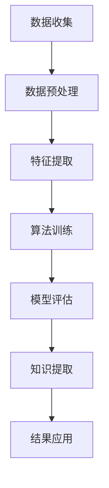

                 

# 知识发现引擎的API设计与开发

## 关键词
知识发现引擎，API设计，数据预处理，特征提取，算法实现，安全性能优化，应用案例

## 摘要
本文将深入探讨知识发现引擎的API设计与开发。我们将首先概述知识发现引擎的概念和重要性，然后详细分析其架构设计和关键技术。接着，我们将聚焦于API设计与开发的基础，包括设计原则、工具和接口规范。文章将逐步深入API接口功能的实现，并探讨安全性与性能优化方法。此外，我们将通过实际应用案例展示API在各个领域中的应用。最后，我们将展望知识发现引擎的未来发展趋势，并提出相关资源与工具，以助开发者更好地掌握这一技术。

## 第一部分：知识发现引擎概述

### 第1章：知识发现引擎的概念与重要性

#### 1.1 知识发现引擎的定义与历史

知识发现引擎（Knowledge Discovery Engine，简称KDE）是一种智能系统，它通过自动化过程从大量数据中提取有用信息和知识。这个概念最早由Fayyad等人于1996年提出，其核心目标是解决数据冗余、噪声和不一致性，帮助用户发现隐藏在数据背后的模式和关联。

知识发现引擎的发展历程可以追溯到20世纪80年代，当时数据挖掘和数据仓库的概念开始兴起。随着时间的推移，知识发现引擎逐渐从传统的数据库管理工具中分离出来，成为一个独立的领域。近年来，随着大数据和人工智能技术的迅猛发展，知识发现引擎的应用场景变得更加广泛，其在商业、科研、医疗等领域的价值也日益凸显。

知识发现引擎的背景主要源于以下几点：

1. **数据爆炸性增长**：现代社会中，数据以指数级增长，传统的数据处理方法已经无法满足需求，知识发现引擎的出现提供了更高效的数据分析手段。
2. **知识管理需求**：企业需要从海量数据中提取有价值的信息，以支持决策和业务发展，知识发现引擎为此提供了有效的解决方案。
3. **人工智能发展**：随着人工智能技术的不断进步，知识发现引擎的算法和实现方法也在不断优化，使其在复杂环境中表现更加出色。

#### 1.2 知识发现引擎的应用场景

知识发现引擎在多个领域都有着广泛的应用，以下是几个典型的应用场景：

1. **数据挖掘**：在商业和金融领域，知识发现引擎可以帮助企业从大量的交易数据中挖掘出潜在的商业机会，优化营销策略，提高销售额。
2. **人工智能**：在智能机器人、自动驾驶和智能语音识别等领域，知识发现引擎用于从大量训练数据中提取特征，训练出高效的模型，提高系统的准确性和性能。
3. **信息检索**：在互联网搜索引擎中，知识发现引擎可以帮助优化搜索算法，提高搜索结果的准确性和相关性。

#### 1.3 知识发现引擎的核心组件

知识发现引擎通常由以下几个核心组件组成：

1. **数据预处理**：包括数据清洗、数据归一化和数据转换，目的是提高数据质量，为后续分析奠定基础。
2. **特征提取**：从原始数据中提取出有用的特征，这些特征将用于构建模型和进行进一步分析。
3. **算法选择与优化**：根据具体应用场景选择合适的算法，并通过优化算法参数来提高模型的性能。

这些组件相互协作，共同实现从数据到知识的转化过程。知识发现引擎的工作流程可以概括为以下步骤：

1. **数据收集**：从各种数据源收集原始数据。
2. **数据预处理**：清洗和转换数据，使其符合分析要求。
3. **特征提取**：提取数据中的关键特征。
4. **模型训练**：使用选定的算法对特征进行建模。
5. **模型评估**：评估模型的效果，并进行优化。
6. **知识提取**：从模型中提取有价值的信息，供决策和业务使用。

### 第2章：知识发现引擎的架构设计

#### 2.1 知识发现引擎的整体架构

知识发现引擎的整体架构可以分为三个层次：数据层、算法层和应用层。

1. **数据层**：数据层负责数据的收集、存储和管理。它包括数据源、数据仓库和数据存储系统。数据源可以是数据库、文件、流数据或社交媒体等。数据仓库用于存储大量的结构化和非结构化数据，并提供高效的查询和访问能力。数据存储系统负责数据的持久化存储和管理。
   
2. **算法层**：算法层是知识发现引擎的核心，它包括数据预处理、特征提取和算法实现等模块。数据预处理模块负责清洗、归一化和转换数据，使其适合分析和建模。特征提取模块从原始数据中提取有用的特征，这些特征将用于训练模型。算法实现模块根据应用需求选择合适的算法，并进行优化和调整。

3. **应用层**：应用层是知识发现引擎的直接用户界面，它负责将分析结果转化为可操作的决策支持和业务应用。应用层可以是一个独立的系统，也可以集成到现有的业务系统中，为用户提供直观的数据分析和可视化工具。

#### 2.2 数据层设计

数据层设计是知识发现引擎架构中的关键部分，它直接影响系统的性能和可靠性。以下是数据层设计的几个关键点：

1. **数据源选择**：选择合适的数据源是数据层设计的第一步。数据源的选择应考虑数据的类型、质量、访问频率和可用性等因素。常见的数据源包括数据库、文件、流数据和社交媒体等。

2. **数据质量评估**：数据质量是数据发现的关键因素。数据质量评估包括数据完整性、一致性、准确性和及时性等方面的评估。通过数据质量评估，可以发现并修复数据中的错误和异常，提高数据的质量。

3. **数据存储与管理**：数据存储与管理是数据层设计的核心。数据存储系统应具有高效的数据存储、检索和管理能力，以支持大规模数据的处理。常见的数据存储系统包括关系型数据库、NoSQL数据库、文件系统和分布式存储系统等。

#### 2.3 算法层设计

算法层设计是知识发现引擎的核心，它决定了系统的性能和效果。以下是算法层设计的几个关键点：

1. **算法选择**：根据应用场景和数据特点选择合适的算法。常见的算法包括聚类算法、分类算法、回归算法和关联规则算法等。

2. **算法优化**：对选定的算法进行参数优化和调整，以提高模型的性能和准确性。算法优化可以通过交叉验证、网格搜索和贝叶斯优化等方法实现。

3. **性能评估**：对算法的性能进行评估，包括模型的准确率、召回率、F1分数等指标。性能评估可以帮助开发者了解算法的效果，并为进一步优化提供指导。

### 第3章：知识发现引擎的关键技术

#### 3.1 数据预处理技术

数据预处理是知识发现过程中的重要环节，其目的是提高数据质量，为后续分析奠定基础。以下是数据预处理的一些关键技术：

1. **数据清洗**：数据清洗是指识别并修复数据中的错误、异常和缺失值。常见的数据清洗方法包括删除重复记录、填补缺失值、纠正错误数据等。

2. **数据归一化**：数据归一化是指将不同数据范围的数据转化为同一范围，以便于后续分析和建模。常见的归一化方法包括最小-最大归一化、Z-Score归一化和幂次归一化等。

3. **数据转换**：数据转换是指将数据从一种形式转换为另一种形式，以便于分析和建模。常见的数据转换方法包括数据离散化、数据编码和数据降维等。

#### 3.2 特征提取技术

特征提取是从原始数据中提取出有用的特征，这些特征将用于构建模型和进行进一步分析。以下是特征提取的一些关键技术：

1. **特征选择**：特征选择是指从大量特征中筛选出对模型性能有显著影响的关键特征。常见的特征选择方法包括过滤式特征选择、包装式特征选择和嵌入式特征选择等。

2. **特征提取方法**：特征提取方法是指从原始数据中提取出新的特征。常见的特征提取方法包括主成分分析（PCA）、线性判别分析（LDA）、自动编码器等。

3. **特征降维**：特征降维是指将高维数据转换成低维数据，以减少计算复杂度和提高模型性能。常见的特征降维方法包括PCA、t-SNE、UMAP等。

#### 3.3 算法实现与优化

算法实现与优化是知识发现引擎的核心部分，它决定了系统的性能和效果。以下是算法实现与优化的一些关键技术：

1. **算法选择**：根据应用场景和数据特点选择合适的算法。常见的算法包括K-最近邻（K-NN）、支持向量机（SVM）、决策树、随机森林等。

2. **伪代码讲解**：以下是K-最近邻算法的伪代码：

   ```plaintext
   function KNN(train_data, train_labels, test_data, k):
       distances = []
       for each sample in test_data:
           for each sample in train_data:
               distance = calculate_distance(sample, train_sample)
               distances.append((train_sample, distance))
           distances.sort by distance
           neighbors = select k nearest neighbors from distances
           predict = majority_vote(neighbors, train_labels)
           return predict
   ```

   其中，`calculate_distance` 函数用于计算两个样本之间的距离，`majority_vote` 函数用于投票选择预测结果。

3. **实现细节**：在实现算法时，需要注意以下细节：

   - **数据预处理**：确保训练数据和测试数据具有相同的数据预处理步骤，以避免数据不一致问题。
   - **参数调整**：根据数据特点和模型性能，调整算法参数，如K值、正则化参数等。
   - **交叉验证**：使用交叉验证方法评估模型的性能，以避免过拟合。

4. **性能评估**：使用准确率、召回率、F1分数等指标评估模型性能，并对比不同算法的性能表现。

### 第二部分：知识发现引擎的API设计与实现

#### 第4章：API设计与开发基础

##### 4.1 API设计原则

API（Application Programming Interface）是知识发现引擎与外部系统或应用程序之间进行交互的接口。良好的API设计对于提高系统的可扩展性、易用性和安全性至关重要。以下是API设计的一些关键原则：

1. **简洁性**：API设计应尽可能简洁，避免复杂和冗余的接口设计。简洁的API更容易理解和使用，降低了学习成本。

2. **易用性**：API设计应考虑用户的实际使用场景，提供直观、清晰的接口描述和文档，以便用户能够快速上手和使用。

3. **可扩展性**：API设计应具备良好的可扩展性，以适应未来可能的需求变化和技术升级。可扩展性可以通过模块化设计和版本控制来实现。

4. **稳定性**：API设计应保证系统的稳定性和可靠性，避免接口频繁变更或突然中断，以影响业务运行。

5. **安全性**：API设计应考虑安全性，包括数据加密、认证授权和访问控制等，以防止数据泄露和非法访问。

##### 4.2 API开发工具

选择合适的API开发工具对于提高开发效率和系统性能至关重要。以下是一些常用的API开发工具：

1. **Flask**：Flask是一个轻量级的Web框架，适合快速开发和部署简单的API应用。Flask具有高度可扩展性和灵活性，支持多种Web服务器和中间件。

2. **Django**：Django是一个全栈Web框架，适合开发复杂的应用程序。Django提供了丰富的内置功能，包括ORM（对象关系映射）、认证和授权等，可以大大简化开发流程。

3. **FastAPI**：FastAPI是一个基于Python 3.6+的Web框架，支持异步编程和自动文档生成。FastAPI具有高性能和高可靠性，适用于构建高性能的API服务。

##### 4.3 API接口规范

API接口规范是确保API设计一致性和易用性的重要手段。以下是API接口规范的一些关键点：

1. **RESTful API设计**：RESTful API是一种基于HTTP协议的API设计风格，具有简洁、易扩展和易于理解的特点。RESTful API通常使用GET、POST、PUT、DELETE等方法进行数据操作。

2. **数据格式定义**：API接口通常使用JSON（JavaScript Object Notation）或XML（eXtensible Markup Language）作为数据传输格式。JSON具有简单、易解析和易于扩展的特点，被广泛用于API接口定义。

3. **错误处理**：API接口应提供统一的错误处理机制，包括错误代码、错误信息和错误提示等，以便客户端能够正确处理异常情况。

4. **参数验证**：API接口应对输入参数进行严格验证，以确保数据的有效性和一致性。参数验证可以通过正则表达式、类型检查和范围限定等手段实现。

#### 第5章：API接口功能实现

##### 5.1 数据检索接口

数据检索接口是知识发现引擎中最基本的API接口之一，它允许用户查询和获取数据。以下是数据检索接口的设计和实现步骤：

1. **接口设计**：

   ```plaintext
   GET /data/search?query=<search_query>
   ```

   该接口接收GET请求，并通过查询参数`query`接收用户的搜索请求。

2. **伪代码实现**：

   ```plaintext
   function search_data(query):
       data = query_database(query)
       return format_data_as_json(data)
   ```

   `query_database` 函数用于查询数据库，并返回匹配的记录。`format_data_as_json` 函数用于将数据格式化为JSON格式。

3. **实现细节**：

   - **数据库查询**：使用SQL或其他查询语言从数据库中检索数据。
   - **数据格式化**：将检索到的数据转换为JSON格式，以便客户端可以轻松解析和使用。

##### 5.2 数据分析接口

数据分析接口用于执行各种数据分析任务，如数据统计、趋势分析和预测等。以下是数据分析接口的设计和实现步骤：

1. **接口设计**：

   ```plaintext
   GET /data/analytics?report_type=<report_type>&date_range=<start_date>:<end_date>
   ```

   该接口接收GET请求，并通过查询参数`report_type`和`date_range`接收用户的数据分析请求。

2. **伪代码实现**：

   ```plaintext
   function analytics_data(report_type, date_range):
       data = fetch_data_from_database(date_range)
       report = generate_report(data, report_type)
       return format_report_as_json(report)
   ```

   `fetch_data_from_database` 函数用于从数据库中获取指定时间范围内的数据。`generate_report` 函数根据不同的报告类型生成报告。`format_report_as_json` 函数将报告格式化为JSON格式。

3. **实现细节**：

   - **数据查询**：根据用户指定的报告类型和时间范围，从数据库中查询数据。
   - **报告生成**：使用数据处理库或自定义函数生成报告。
   - **数据格式化**：将生成的报告格式化为JSON格式，便于客户端解析。

##### 5.3 数据可视化接口

数据可视化接口用于将数据分析结果以图形化方式展示，帮助用户更好地理解和分析数据。以下是数据可视化接口的设计和实现步骤：

1. **接口设计**：

   ```plaintext
   GET /data/visualize?chart_type=<chart_type>&data=<data_json>
   ```

   该接口接收GET请求，并通过查询参数`chart_type`和`data`接收用户的数据可视化请求。

2. **伪代码实现**：

   ```plaintext
   function visualize_data(chart_type, data):
       chart = create_chart(chart_type, data)
       return generate_chart_image(chart)
   ```

   `create_chart` 函数用于根据指定的图表类型和数据进行图表绘制。`generate_chart_image` 函数将图表转换为图像格式。

3. **实现细节**：

   - **图表绘制**：使用图表库（如matplotlib、plotly等）根据指定的图表类型和数据绘制图表。
   - **图像生成**：将绘制的图表转换为图像格式（如PNG、JPEG等），以便客户端可以显示和保存。

### 第三部分：知识发现引擎的未来发展与趋势

#### 第8章：知识发现引擎的挑战与趋势

知识发现引擎作为一种强大的数据处理和分析工具，在多个领域取得了显著的应用成果。然而，随着数据规模的不断扩大和复杂性的增加，知识发现引擎也面临着一系列挑战和趋势。

##### 8.1 挑战分析

1. **数据复杂性**：随着大数据时代的到来，数据类型和数据来源日益多样化，这给知识发现引擎的设计和应用带来了巨大的挑战。如何有效处理复杂数据结构、异构数据源和实时数据流，成为知识发现引擎需要解决的问题。

2. **算法效率**：随着数据规模的增加，传统算法的效率和性能逐渐受到影响。如何设计高效、可扩展的算法，提高知识发现引擎的处理速度和准确性，是当前的一个重要研究方向。

3. **安全隐私**：在知识发现过程中，数据安全和隐私保护成为关键问题。如何确保数据在传输、存储和处理过程中的安全性，防止数据泄露和非法访问，是知识发现引擎需要关注的重要方面。

##### 8.2 发展趋势

1. **云计算**：云计算技术为知识发现引擎提供了强大的计算能力和存储资源，使得大规模数据处理和分析成为可能。未来，知识发现引擎将进一步与云计算技术相结合，实现更高效、更灵活的数据处理和分析。

2. **大数据**：大数据技术的快速发展为知识发现引擎提供了丰富的数据资源和强大的处理能力。未来，知识发现引擎将更加深入地与大数据技术相结合，挖掘数据中的潜在价值。

3. **人工智能**：人工智能技术的飞速发展为知识发现引擎带来了新的机遇。通过深度学习、强化学习等技术，知识发现引擎将能够更加智能化地处理数据，发现更加复杂和隐含的模式。

#### 第9章：知识发现引擎的未来应用场景

知识发现引擎在未来的发展中将涵盖更多新兴领域和应用场景。以下是几个可能的应用方向：

1. **区块链**：区块链技术具有去中心化、不可篡改和可追溯性等特点，与知识发现引擎的结合可以实现对大规模分布式数据的智能分析和价值挖掘。

2. **物联网**：物联网技术的快速发展使得海量设备接入网络，产生了大量的实时数据。知识发现引擎可以应用于物联网领域，对设备数据进行实时分析，实现智能监控和预测。

3. **虚拟现实**：虚拟现实技术为用户提供沉浸式的体验，但同时也产生了大量的数据。知识发现引擎可以应用于虚拟现实领域，对用户行为数据进行分析，优化虚拟环境设计和用户体验。

### 附录

#### 附录A：知识发现引擎相关资源

为了帮助开发者更好地掌握知识发现引擎的相关技术和工具，以下推荐一些有用的资源：

1. **开源工具推荐**：

   - **Scikit-learn**：https://scikit-learn.org/
   - **TensorFlow**：https://www.tensorflow.org/
   - **PyTorch**：https://pytorch.org/

2. **学术论文精选**：

   - **"Knowledge Discovery in Databases: An Overview"**（Fayyad等，1996）
   - **"Deep Learning for Knowledge Discovery"**（Bengio等，2013）
   - **"Data Preprocessing for Knowledge Discovery"**（Japkowicz和Kubat，1995）

3. **实践教程链接**：

   - **《Python数据挖掘入门》**：https://www.springer.com/cn/book/9783662498140
   - **《深度学习入门》**：https://www.deeplearningbook.org/

#### 附录B：常用算法与模型介绍

在知识发现引擎中，常用的算法和模型包括以下几种：

1. **聚类算法**：聚类算法用于将数据点划分为多个类或簇。常见的聚类算法包括K-均值、层次聚类和DBSCAN等。

2. **分类算法**：分类算法用于将数据点分为预定义的类别。常见的分类算法包括决策树、随机森林、支持向量机和神经网络等。

3. **回归算法**：回归算法用于预测数值型目标变量。常见的回归算法包括线性回归、决策树回归和随机森林回归等。

4. **关联规则算法**：关联规则算法用于发现数据之间的关联关系。常见的关联规则算法包括Apriori算法和FP-Growth算法等。

#### 附录C：API开发工具与框架

在知识发现引擎的API开发中，常用的工具和框架包括以下几种：

1. **Flask**：Flask是一个轻量级的Web框架，适用于快速开发和部署简单的API应用。

2. **Django**：Django是一个全栈Web框架，提供了丰富的内置功能和高效的开发体验。

3. **FastAPI**：FastAPI是一个基于Python 3.6+的Web框架，支持异步编程和自动文档生成。

#### 附录D：知识发现引擎的Mermaid流程图

为了更直观地展示知识发现引擎的工作流程，以下是使用Mermaid绘制的流程图：



以上流程图描述了知识发现引擎的基本工作流程，包括数据收集、数据预处理、特征提取、算法训练、模型评估和知识提取等步骤。

### 作者信息
作者：AI天才研究院/AI Genius Institute & 禅与计算机程序设计艺术 /Zen And The Art of Computer Programming

以上就是本文关于知识发现引擎的API设计与开发的详细探讨。希望本文能帮助您更好地理解和掌握这一重要技术。在未来的实践中，不断探索和创新，相信您一定能够实现更多的应用和价值。让我们一起迎接知识发现引擎的未来，共同开创更加智能和高效的数字化世界。**

