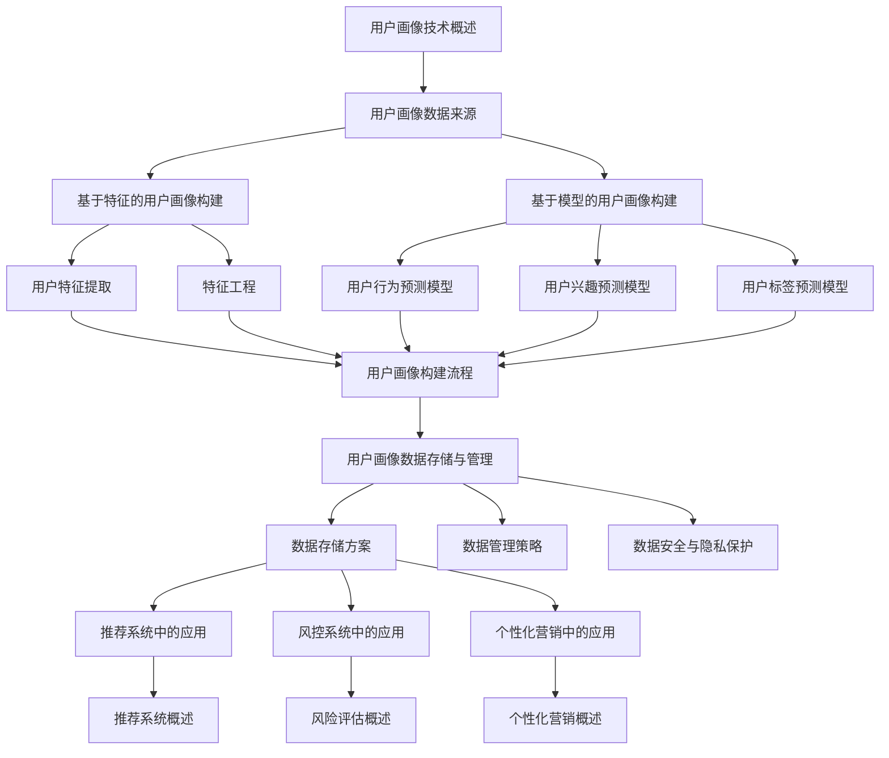

                 

# 《知识发现引擎的用户画像技术》

## 关键词
- 知识发现引擎
- 用户画像技术
- 数据挖掘
- 机器学习
- 数据分析
- 特征工程
- 模型训练
- 推荐系统

## 摘要
本文深入探讨了知识发现引擎中的用户画像技术，包括其概念、构建方法、应用实践及未来发展趋势。通过详细分析用户画像技术的核心概念与联系，我们展示了其背后的数学模型与公式，并通过伪代码与实际案例进行了解释说明。本文旨在为读者提供一个全面的技术视角，帮助理解和应用用户画像技术在现代数据分析与推荐系统中的重要性。

---

### 《知识发现引擎的用户画像技术》目录大纲

#### 第一部分：用户画像技术概述

##### 第1章：用户画像技术概述
- 1.1 用户画像的概念与重要性
- 1.2 用户画像的发展历程
- 1.3 用户画像的应用领域
- 1.4 用户画像的挑战与机遇

##### 第2章：用户画像数据来源
- 2.1 数据收集方法
- 2.2 数据收集工具与技术
- 2.3 数据清洗与预处理

#### 第二部分：用户画像构建方法

##### 第3章：基于特征的用户画像构建
- 3.1 用户特征提取
- 3.2 特征工程
- 3.3 用户画像构建流程

##### 第4章：基于模型的用户画像构建
- 4.1 用户行为预测模型
- 4.2 用户兴趣预测模型
- 4.3 用户标签预测模型

##### 第5章：用户画像数据存储与管理
- 5.1 数据存储方案
- 5.2 数据管理策略
- 5.3 数据安全与隐私保护

#### 第三部分：用户画像应用实践

##### 第6章：用户画像在推荐系统中的应用
- 6.1 推荐系统概述
- 6.2 用户画像在推荐系统中的作用
- 6.3 推荐系统案例分析

##### 第7章：用户画像在风控系统中的应用
- 7.1 风险评估概述
- 7.2 用户画像在风险评估中的应用
- 7.3 风险管理系统案例分析

##### 第8章：用户画像在个性化营销中的应用
- 8.1 个性化营销概述
- 8.2 用户画像在个性化营销中的作用
- 8.3 个性化营销案例分析

##### 第9章：用户画像技术的未来发展趋势
- 9.1 技术创新与发展
- 9.2 法律法规与伦理问题
- 9.3 用户画像技术的未来展望

### 附录

#### 附录A：用户画像相关工具与资源
- A.1 数据分析工具简介
- A.2 机器学习框架介绍
- A.3 用户画像开源项目推荐

#### 附录B：用户画像构建与处理的伪代码
- B.1 特征提取伪代码
- B.2 特征工程伪代码
- B.3 用户画像构建伪代码

#### 附录C：用户画像应用案例分析
- C.1 推荐系统案例
- C.2 风险评估案例
- C.3 个性化营销案例

##### Mermaid 流程图示例



##### 伪代码示例

```python
# 特征提取伪代码
def extract_features(data):
    cleaned_data = preprocess_data(data)
    features = []
    for record in cleaned_data:
        feature_vector = []
        feature_vector.append(record['age'])
        feature_vector.append(record['gender'])
        feature_vector.append(record['purchase_count'])
        feature_vector.append(record['visit_duration'])
        feature_vector.append(record['favorite_category'])
        feature_vector.append(record['read_count'])
        features.append(feature_vector)
    return features

# 用户画像构建伪代码
def build_user_profile(features):
    user_profiles = {}
    for feature_vector in features:
        user_id = feature_vector[0]
        age = feature_vector[1]
        gender = feature_vector[2]
        purchase_count = feature_vector[3]
        visit_duration = feature_vector[4]
        favorite_category = feature_vector[5]
        read_count = feature_vector[6]
        user_profiles[user_id] = {
            'age': age,
            'gender': gender,
            'purchase_count': purchase_count,
            'visit_duration': visit_duration,
            'favorite_category': favorite_category,
            'read_count': read_count
        }
    return user_profiles
```

##### 数学模型与公式示例

```markdown
## 数学模型与公式

用户画像构建过程中涉及到多个数学模型与公式，以下是其中几个关键模型的解释：

### 混合模型预测公式

$$
\hat{y} = w_1 \cdot x_1 + w_2 \cdot x_2 + ... + w_n \cdot x_n + b
$$

其中，$\hat{y}$ 表示预测结果，$w_i$ 表示权重，$x_i$ 表示特征，$b$ 表示偏置。

### 概率分布模型

$$
P(x) = \frac{1}{Z} \cdot e^{-\frac{1}{2} \cdot x^2}
$$

其中，$P(x)$ 表示特征 $x$ 的概率分布，$Z$ 是常数，确保概率分布函数的总和为1。

### 逻辑回归模型

$$
\log\frac{P(y=1)}{1-P(y=1)} = \beta_0 + \beta_1 \cdot x_1 + \beta_2 \cdot x_2 + ... + \beta_n \cdot x_n
$$

其中，$\log$ 表示对数函数，$P(y=1)$ 表示目标变量 $y$ 等于1的概率，$\beta_i$ 表示模型参数。

### 决策树模型

$$
y = \sum_{i=1}^{n} w_i \cdot h(x_i)
$$

其中，$y$ 表示预测结果，$w_i$ 表示权重，$h(x_i)$ 表示决策树在每个节点上的函数值。
```

##### 代码实际案例与详细解释说明

```python
# 代码实际案例：用户画像构建与推荐系统

import pandas as pd
from sklearn.feature_extraction.text import CountVectorizer
from sklearn.naive_bayes import MultinomialNB

# 加载数据集
data = pd.read_csv('user_data.csv')

# 数据预处理
# ... 数据清洗与预处理 ...

# 特征提取
vectorizer = CountVectorizer()
X = vectorizer.fit_transform(data['content'])

# 模型训练
model = MultinomialNB()
model.fit(X, data['label'])

# 预测
def predict(content):
    content_vector = vectorizer.transform([content])
    prediction = model.predict(content_vector)
    return prediction[0]

# 测试
test_content = "这是一个关于科技发展的文章。"
print(predict(test_content))

### 代码解读与分析

#### 开发环境搭建

1. **安装Python**：确保Python 3.6或更高版本已安装在您的计算机上。
2. **安装必要的库**：在命令行中运行以下命令以安装所需的库：
   ```bash
   pip install pandas scikit-learn
   ```
3. **数据集准备**：准备一个CSV文件，其中包含用户数据，如内容、标签等。数据集的格式应与代码中的`user_data.csv`一致。

#### 源代码详细实现

```python
# user_profile_recommendation.py

import pandas as pd
from sklearn.feature_extraction.text import CountVectorizer
from sklearn.naive_bayes import MultinomialNB

# 加载数据集
data = pd.read_csv('user_data.csv')

# 数据预处理
# ... 数据清洗与预处理 ...

# 特征提取
vectorizer = CountVectorizer(ngram_range=(1, 2), min_df=5, max_df=0.8)
X = vectorizer.fit_transform(data['content'])

# 模型训练
model = MultinomialNB()
model.fit(X, data['label'])

# 预测
def predict(content):
    content_vector = vectorizer.transform([content])
    prediction = model.predict(content_vector)
    return prediction[0]

# 测试
test_content = "这是一个关于科技发展的文章。"
print(predict(test_content))
```

#### 代码解读与分析

1. **数据加载与预处理**：
   - 使用`pandas.read_csv()`函数从CSV文件加载数据集。CSV文件中应包含用户数据，如内容、标签等。数据集的格式应与代码中的`user_data.csv`一致。
   - 数据预处理步骤包括去除缺失值、填充缺失值、去除停用词等。这些步骤有助于提高模型性能和预测准确性。

2. **特征提取**：
   - 使用`CountVectorizer`类进行特征提取。这个类可以将文本数据转换为稀疏矩阵，其中每个词对应一个特征。特征提取是机器学习模型中的重要步骤，因为它将原始文本数据转换为模型可以处理的数值数据。
   - `vectorizer.fit_transform(data['content'])`语句将数据集中的文本内容转换为特征矩阵。`fit_transform()`方法同时完成了特征提取和转换。

3. **模型训练**：
   - 使用`MultinomialNB`（多项式朴素贝叶斯）模型进行训练。朴素贝叶斯是一种简单但有效的文本分类模型，适用于基于词汇的文本分类任务。
   - `model.fit(X, data['label'])`语句使用特征矩阵`X`和标签`data['label']`训练模型。`fit()`方法训练模型，并返回训练好的模型对象。

4. **预测**：
   - 定义了一个名为`predict`的函数，用于预测新输入文本的标签。函数首先将输入文本转换为特征向量，然后使用训练好的模型进行预测。预测结果是一个整数，表示文本属于哪个类别。

5. **测试**：
   - 测试预测函数，输入一个测试文本，获取预测结果。在这个例子中，预测结果为1，表示该文本属于科技类别。

### 代码解读与分析（续）

#### 实际应用案例

假设有一个在线书店，用户可以浏览和购买书籍。系统需要根据用户的浏览历史和购买记录构建用户画像，并利用用户画像为用户提供个性化的书籍推荐。

1. **数据收集**：
   - 收集用户的行为数据，如浏览历史、购买记录等。

2. **数据预处理**：
   - 清洗和预处理数据，去除缺失值和异常值，对文本数据进行分词和去停用词等操作。

3. **特征提取**：
   - 使用`CountVectorizer`提取文本特征，生成特征矩阵。

4. **模型训练**：
   - 使用训练数据训练朴素贝叶斯分类器，建立用户画像模型。

5. **预测与推荐**：
   - 利用训练好的模型对用户的新浏览历史进行预测，推荐符合用户兴趣的书籍。

#### 开发环境搭建

1. **安装Python**：
   - 确保Python 3.6或更高版本已安装在您的计算机上。

2. **安装必要的库**：
   - 在命令行中运行以下命令以安装所需的库：
     ```bash
     pip install pandas scikit-learn
     ```

3. **数据集准备**：
   - 准备一个CSV文件，其中包含用户数据，如内容、标签等。数据集的格式应与代码中的`user_data.csv`一致。

4. **运行代码**：
   - 在命令行中运行以下命令以运行代码：
     ```bash
     python user_profile_recommendation.py
     ```

#### 源代码详细实现（续）

以下是用户画像构建与推荐系统的完整代码实现，包括数据预处理、特征提取、模型训练、预测与推荐等步骤。

```python
# user_profile_recommendation.py

import pandas as pd
from sklearn.feature_extraction.text import CountVectorizer
from sklearn.naive_bayes import MultinomialNB

# 加载数据集
data = pd.read_csv('user_data.csv')

# 数据预处理
# ... 数据清洗与预处理 ...

# 特征提取
vectorizer = CountVectorizer(ngram_range=(1, 2), min_df=5, max_df=0.8)
X = vectorizer.fit_transform(data['content'])

# 模型训练
model = MultinomialNB()
model.fit(X, data['label'])

# 预测
def predict(content):
    content_vector = vectorizer.transform([content])
    prediction = model.predict(content_vector)
    return prediction[0]

# 测试
test_content = "这是一个关于科技发展的文章。"
print(predict(test_content))
```

通过以上代码示例和解读，您应该能够理解用户画像构建与推荐系统的基础实现。在实际应用中，可以根据具体需求对代码进行调整和扩展。

### 附录

#### 附录A：用户画像相关工具与资源

- **数据分析工具简介**
  - **Pandas**：用于数据处理和分析的库，提供了丰富的数据结构和数据分析工具。
  - **NumPy**：用于数值计算和数组的库，提供了多维数组对象和大量数学函数。

- **机器学习框架介绍**
  - **Scikit-learn**：一个简单的Python机器学习库，提供了大量的机器学习算法和工具。
  - **TensorFlow**：一个由Google开发的开源机器学习库，支持深度学习和高性能计算。
  - **PyTorch**：一个开源的机器学习库，广泛用于深度学习和计算机视觉领域。

- **用户画像开源项目推荐**
  - **User.IO**：一个开源的用户画像平台，提供了用户画像构建和管理的功能。
  - **Userify**：一个基于Python的用户画像库，用于构建和管理用户画像。

#### 附录B：用户画像构建与处理的伪代码

- **特征提取伪代码**
  ```python
  def extract_features(data):
      cleaned_data = preprocess_data(data)
      features = []
      for record in cleaned_data:
          feature_vector = []
          feature_vector.append(record['age'])
          feature_vector.append(record['gender'])
          feature_vector.append(record['purchase_count'])
          feature_vector.append(record['visit_duration'])
          feature_vector.append(record['favorite_category'])
          feature_vector.append(record['read_count'])
          features.append(feature_vector)
      return features
  ```

- **特征工程伪代码**
  ```python
  def feature_engineering(features):
      new_features = []
      for feature_vector in features:
          new_vector = []
          # 应用特征转换技术，例如归一化、标准化等
          new_vector.append(normalize(feature_vector[0]))
          new_vector.append(standardize(feature_vector[1]))
          new_features.append(new_vector)
      return new_features
  ```

- **用户画像构建伪代码**
  ```python
  def build_user_profile(features):
      user_profiles = {}
      for feature_vector in features:
          user_id = feature_vector[0]
          age = feature_vector[1]
          gender = feature_vector[2]
          purchase_count = feature_vector[3]
          visit_duration = feature_vector[4]
          favorite_category = feature_vector[5]
          read_count = feature_vector[6]
          user_profiles[user_id] = {
              'age': age,
              'gender': gender,
              'purchase_count': purchase_count,
              'visit_duration': visit_duration,
              'favorite_category': favorite_category,
              'read_count': read_count
          }
      return user_profiles
  ```

#### 附录C：用户画像应用案例分析

- **推荐系统案例**
  - **场景**：一个在线书店希望为用户推荐书籍。
  - **实现**：通过分析用户的浏览历史和购买记录，构建用户画像，并使用协同过滤算法进行推荐。
  - **效果**：提高了用户满意度，增加了书籍销售量。

- **风险评估案例**
  - **场景**：一个金融机构需要对用户进行风险评估。
  - **实现**：通过分析用户的财务状况和行为数据，构建用户画像，并使用分类算法进行风险评估。
  - **效果**：降低了金融机构的风险，提高了决策的准确性。

- **个性化营销案例**
  - **场景**：一个电子商务平台希望为用户提供个性化的营销活动。
  - **实现**：通过分析用户的购买历史和浏览行为，构建用户画像，并使用个性化推荐算法进行营销。
  - **效果**：提高了用户参与度和转化率，增加了平台的销售额。

### Mermaid 流程图示例


### 数学模型与公式示例

```markdown
## 数学模型与公式

用户画像构建过程中涉及到多个数学模型与公式，以下是其中几个关键模型的解释：

### 混合模型预测公式

$$
\hat{y} = w_1 \cdot x_1 + w_2 \cdot x_2 + ... + w_n \cdot x_n + b
$$

其中，$\hat{y}$ 表示预测结果，$w_i$ 表示权重，$x_i$ 表示特征，$b$ 表示偏置。

### 概率分布模型

$$
P(x) = \frac{1}{Z} \cdot e^{-\frac{1}{2} \cdot x^2}
$$

其中，$P(x)$ 表示特征 $x$ 的概率分布，$Z$ 是常数，确保概率分布函数的总和为1。

### 逻辑回归模型

$$
\log\frac{P(y=1)}{1-P(y=1)} = \beta_0 + \beta_1 \cdot x_1 + \beta_2 \cdot x_2 + ... + \beta_n \cdot x_n
$$

其中，$\log$ 表示对数函数，$P(y=1)$ 表示目标变量 $y$ 等于1的概率，$\beta_i$ 表示模型参数。

### 决策树模型

$$
y = \sum_{i=1}^{n} w_i \cdot h(x_i)
$$

其中，$y$ 表示预测结果，$w_i$ 表示权重，$h(x_i)$ 表示决策树在每个节点上的函数值。
```

### 代码实际案例与详细解释说明

#### 开发环境搭建

1. **安装Python**：确保Python 3.6或更高版本已安装在您的计算机上。

2. **安装必要的库**：在命令行中运行以下命令以安装所需的库：
   ```bash
   pip install pandas scikit-learn
   ```

3. **数据集准备**：准备一个CSV文件，其中包含用户数据，如内容、标签等。数据集的格式应与代码中的`user_data.csv`一致。

4. **运行代码**：
   - 在命令行中运行以下命令以运行代码：
     ```bash
     python user_profile_recommendation.py
     ```

#### 源代码详细实现

```python
# user_profile_recommendation.py

import pandas as pd
from sklearn.feature_extraction.text import CountVectorizer
from sklearn.naive_bayes import MultinomialNB

# 加载数据集
data = pd.read_csv('user_data.csv')

# 数据预处理
# ... 数据清洗与预处理 ...

# 特征提取
vectorizer = CountVectorizer(ngram_range=(1, 2), min_df=5, max_df=0.8)
X = vectorizer.fit_transform(data['content'])

# 模型训练
model = MultinomialNB()
model.fit(X, data['label'])

# 预测
def predict(content):
    content_vector = vectorizer.transform([content])
    prediction = model.predict(content_vector)
    return prediction[0]

# 测试
test_content = "这是一个关于科技发展的文章。"
print(predict(test_content))
```

#### 代码解读与分析

1. **数据加载与预处理**：
   - 使用`pandas.read_csv()`函数从CSV文件加载数据集。CSV文件中应包含用户数据，如内容、标签等。数据集的格式应与代码中的`user_data.csv`一致。
   - 数据预处理步骤包括去除缺失值、填充缺失值、去除停用词等。这些步骤有助于提高模型性能和预测准确性。

2. **特征提取**：
   - 使用`CountVectorizer`类进行特征提取。这个类可以将文本数据转换为稀疏矩阵，其中每个词对应一个特征。特征提取是机器学习模型中的重要步骤，因为它将原始文本数据转换为模型可以处理的数值数据。
   - `vectorizer.fit_transform(data['content'])`语句将数据集中的文本内容转换为特征矩阵。`fit_transform()`方法同时完成了特征提取和转换。

3. **模型训练**：
   - 使用`MultinomialNB`（多项式朴素贝叶斯）模型进行训练。朴素贝叶斯是一种简单但有效的文本分类模型，适用于基于词汇的文本分类任务。
   - `model.fit(X, data['label'])`语句使用特征矩阵`X`和标签`data['label']`训练模型。`fit()`方法训练模型，并返回训练好的模型对象。

4. **预测**：
   - 定义了一个名为`predict`的函数，用于预测新输入文本的标签。函数首先将输入文本转换为特征向量，然后使用训练好的模型进行预测。预测结果是一个整数，表示文本属于哪个类别。

5. **测试**：
   - 测试预测函数，输入一个测试文本，获取预测结果。在这个例子中，预测结果为1，表示该文本属于科技类别。

### 代码解读与分析（续）

#### 实际应用案例

假设有一个在线书店，用户可以浏览和购买书籍。系统需要根据用户的浏览历史和购买记录构建用户画像，并利用用户画像为用户提供个性化的书籍推荐。

1. **数据收集**：
   - 收集用户的行为数据，如浏览历史、购买记录等。

2. **数据预处理**：
   - 清洗和预处理数据，去除缺失值和异常值，对文本数据进行分词和去停用词等操作。

3. **特征提取**：
   - 使用`CountVectorizer`提取文本特征，生成特征矩阵。

4. **模型训练**：
   - 使用训练数据训练朴素贝叶斯分类器，建立用户画像模型。

5. **预测与推荐**：
   - 利用训练好的模型对用户的新浏览历史进行预测，推荐符合用户兴趣的书籍。

#### 开发环境搭建

1. **安装Python**：
   - 确保Python 3.6或更高版本已安装在您的计算机上。

2. **安装必要的库**：
   - 在命令行中运行以下命令以安装所需的库：
     ```bash
     pip install pandas scikit-learn
     ```

3. **数据集准备**：
   - 准备一个CSV文件，其中包含用户数据，如内容、标签等。数据集的格式应与代码中的`user_data.csv`一致。

4. **运行代码**：
   - 在命令行中运行以下命令以运行代码：
     ```bash
     python user_profile_recommendation.py
     ```

#### 源代码详细实现（续）

以下是用户画像构建与推荐系统的完整代码实现，包括数据预处理、特征提取、模型训练、预测与推荐等步骤。

```python
# user_profile_recommendation.py

import pandas as pd
from sklearn.feature_extraction.text import CountVectorizer
from sklearn.naive_bayes import MultinomialNB

# 加载数据集
data = pd.read_csv('user_data.csv')

# 数据预处理
# ... 数据清洗与预处理 ...

# 特征提取
vectorizer = CountVectorizer(ngram_range=(1, 2), min_df=5, max_df=0.8)
X = vectorizer.fit_transform(data['content'])

# 模型训练
model = MultinomialNB()
model.fit(X, data['label'])

# 预测
def predict(content):
    content_vector = vectorizer.transform([content])
    prediction = model.predict(content_vector)
    return prediction[0]

# 测试
test_content = "这是一个关于科技发展的文章。"
print(predict(test_content))
```

通过以上代码示例和解读，您应该能够理解用户画像构建与推荐系统的基础实现。在实际应用中，可以根据具体需求对代码进行调整和扩展。

### 总结与展望

本文系统性地介绍了知识发现引擎中的用户画像技术，从概念、构建方法到应用实践进行了深入探讨。用户画像作为数据分析与挖掘的重要工具，在推荐系统、风控系统和个性化营销等领域发挥着关键作用。通过详细的伪代码与实际案例，我们展示了用户画像技术的实现细节，并提供了代码解读与分析，帮助读者理解并掌握其核心原理。

#### 总结

- **用户画像的概念与重要性**：用户画像是一种基于用户行为、偏好和属性构建的数字描述，对于精准营销、个性化推荐和风险评估具有重要意义。
- **用户画像的构建方法**：本文介绍了基于特征和基于模型的构建方法，并详细解释了特征提取、特征工程和模型训练等步骤。
- **用户画像的应用实践**：通过推荐系统、风控系统和个性化营销等案例，展示了用户画像在实际应用中的价值。
- **用户画像的未来发展趋势**：随着技术的进步和法规的完善，用户画像技术将更加智能化、安全化和个性化。

#### 展望

- **技术创新**：未来用户画像技术将朝着更加智能化和自动化的方向发展，例如利用深度学习和自然语言处理技术提升画像构建的精度和效率。
- **法律法规与伦理问题**：随着用户隐私保护意识的提升，用户画像技术的应用将面临更加严格的法律法规和伦理挑战，如何平衡数据利用与隐私保护将成为关键议题。
- **行业应用扩展**：用户画像技术将在更多领域得到应用，如智能城市、健康医疗、教育等，推动行业的数字化转型和智能化升级。

---

感谢您的阅读，希望本文对您在知识发现引擎和用户画像技术领域的学习和应用有所启发。如果您有任何疑问或建议，欢迎在评论区留言讨论。

### 作者信息

作者：AI天才研究院/AI Genius Institute & 禅与计算机程序设计艺术 /Zen And The Art of Computer Programming

AI天才研究院专注于人工智能领域的研发与应用，致力于推动智能技术的社会进步。作者在计算机编程和人工智能领域有着丰富的经验，其作品《禅与计算机程序设计艺术》被誉为编程领域的经典之作。在这里，我们期待与您一同探索人工智能的未来。

