                 

### 知识可视化：直观理解复杂信息

> **关键词**：知识可视化、复杂信息、直观理解、信息图形、数据可视化、算法、应用、实践

**摘要**：本文旨在深入探讨知识可视化这一现代信息处理技术。通过对知识可视化的基本概念、技术基础、应用领域以及未来发展趋势的全面分析，本文展示了知识可视化在提高信息理解性和记忆性、促进跨领域交流等方面的巨大潜力。文章还将通过案例研究和最佳实践，为读者提供实用的知识可视化工具和方法，帮助他们在实际应用中更加有效地使用这一技术。

### 第一部分: 知识可视化的基本概念

#### 第1章: 知识可视化的介绍

##### 1.1 知识可视化的定义与意义

知识可视化是一种通过视觉化的手段来呈现复杂信息的技术，它利用图表、图像、模型等视觉元素，将抽象的概念和复杂的数据转换成直观、易于理解的图形表现形式。这不仅可以帮助用户更好地理解信息，还能增强记忆效果，促进不同领域之间的交流与协作。

###### 1.1.1 知识可视化的基本定义

知识可视化（Knowledge Visualization）通常指的是将各种形式的知识，如数据、信息、概念、理论和模型等，通过图形化的方式呈现出来。其核心目标是将复杂、难以理解的抽象信息转化为直观的视觉形式，使得用户能够更轻松地掌握和内化这些信息。

###### 1.1.2 知识可视化的意义

知识可视化的意义主要体现在以下几个方面：

1. **提高信息的可理解性**：通过图形化的手段，复杂的概念和数据可以被简化，从而降低了理解难度。
2. **增强信息的记忆性**：视觉元素相较于文字信息，更容易被大脑记忆和长期保存。
3. **促进跨领域的交流**：通过视觉化的方式，不同领域的专家可以更容易地理解和交流彼此的研究内容。

##### 1.2 知识可视化的历史与发展

###### 1.2.1 知识可视化的起源

知识可视化的概念可以追溯到古代，例如地图、绘画和图表等形式。然而，现代意义上的知识可视化则起源于计算机科学和信息技术的发展。

###### 1.2.2 知识可视化的发展历程

- **20世纪80年代**：随着计算机技术的发展，图表、图像等可视化工具逐渐应用于各个领域。
- **21世纪初**：互联网的普及使得知识可视化工具变得更加便捷和多样化。
- **近年来**：随着大数据和人工智能技术的崛起，知识可视化得到了更广泛的应用和发展。

##### 1.3 知识可视化的类型

知识可视化可以按照不同的维度进行分类，常见的类型包括：

###### 1.3.1 文本可视化

文本可视化主要通过图表、图像等方式来展示文本信息，如关键词云、主题地图等。这种方法有助于提取文本中的关键信息，便于快速浏览和理解。

###### 1.3.2 数据可视化

数据可视化则侧重于将数据以图形的方式展示，如折线图、柱状图、散点图等。数据可视化可以帮助用户直观地了解数据之间的关系和趋势。

###### 1.3.3 知识图谱

知识图谱是通过节点和边来表示实体及其关系的一种图形化展示方式，如语义网络、本体等。知识图谱可以用来展示复杂的关系网络，便于用户理解和分析。

##### 1.4 知识可视化的应用领域

知识可视化在多个领域都有广泛的应用，包括但不限于以下领域：

###### 1.4.1 教育领域

知识可视化在教育领域的应用包括教学内容的呈现、学习过程的监控和评估等。通过可视化，教师可以将复杂的概念和理论以图形的方式呈现，帮助学生更好地理解和记忆。

###### 1.4.2 科研领域

知识可视化在科研领域的应用包括数据分析和结果展示。通过可视化，科研人员可以更直观地分析实验数据，发现数据中的趋势和异常，从而提高研究的效率和准确性。

###### 1.4.3 企业管理

知识可视化在企业管理中的应用包括战略规划、市场分析、风险管理等。通过可视化，企业管理者可以更清晰地了解企业的运行状况和市场需求，从而做出更明智的决策。

###### 1.4.4 健康医疗

知识可视化在健康医疗领域有助于医生更直观地了解病情，提高诊断准确性。例如，通过知识图谱可以展示患者的病史和治疗方案，帮助医生做出更全面的判断。

#### 第2章: 知识可视化技术基础

##### 2.1 数据可视化基础

数据可视化是将数据以图形化的方式展示的过程，目的是提高数据的可理解性和可访问性。数据可视化技术包括图表、图形、地图等，它们可以以不同的形式展示数据的分布、趋势、关系等。

###### 2.1.1 数据可视化技术概述

数据可视化技术通过视觉元素将数据呈现出来，使得用户可以更直观地理解数据。常见的数据可视化技术包括以下几种：

- **图表**：如折线图、柱状图、饼图等，用于展示数据的分布和变化。
- **图形**：如散点图、热力图等，用于展示数据之间的关系和趋势。
- **地图**：如地理信息系统（GIS），用于展示数据的空间分布。

###### 2.1.2 常见数据可视化工具

以下是一些常见的数据可视化工具：

- **Tableau**：一款功能强大的数据可视化工具，支持多种数据源，用户可以通过简单的拖拽操作创建图表。
- **Power BI**：微软推出的数据可视化工具，与Excel和SQL Server紧密集成。
- **D3.js**：一个基于JavaScript的库，用于创建数据驱动的动态可视化。

##### 2.2 图形学与视觉感知

图形学是研究计算机生成和处理图形的理论和实践，它包括二维和三维图形的表示、渲染和交互等技术。视觉感知是指人类对视觉信息的感知和理解过程，它对于设计有效的知识可视化至关重要。

###### 2.2.1 图形学基础

图形学基础包括以下内容：

- **图形表示**：如何将数据转换为图形表示，如线条、形状、颜色等。
- **图形渲染**：如何将图形在屏幕上绘制出来，包括抗锯齿、光照效果等。
- **图形交互**：用户如何与图形进行交互，如缩放、旋转、筛选等。

###### 2.2.2 视觉感知

视觉感知包括以下内容：

- **视觉注意**：如何引导用户的视觉注意力，使其首先关注重要信息。
- **视觉记忆**：如何设计图形，使其更容易被用户记忆。
- **视觉舒适**：如何确保图形设计符合用户的视觉习惯，避免视觉疲劳。

##### 2.3 信息可视化算法

信息可视化算法是指用于分析数据并生成可视化图形的算法。这些算法包括聚类分析、关联规则学习、网络可视化等。

###### 2.3.1 聚类分析

聚类分析是一种无监督学习方法，用于将数据集中的对象分为多个群组，使得属于同一群组的对象之间相似度较高，而不同群组的对象之间相似度较低。常见的聚类算法包括K-均值聚类、层次聚类等。

###### 2.3.2 关联规则学习

关联规则学习是用于发现数据集中项之间的频繁模式的一种方法。它常用于市场篮子分析、推荐系统等领域。常见的关联规则算法包括Apriori算法、FP-growth算法等。

###### 2.3.3 网络可视化

网络可视化是一种将网络结构以图形的方式展示的技术。它可以帮助人们直观地理解网络中的节点和边的关系。常见的网络可视化算法包括Force-directed布局、谱布局等。

#### 第3章: 知识可视化的应用

##### 3.1 教育领域

知识可视化在教育领域的应用主要包括教学内容的呈现、学习过程的监控和评估等。

###### 3.1.1 教学内容的可视化

知识可视化可以帮助教师将抽象的教学内容以图形化的方式呈现，从而提高学生的理解能力。例如，通过知识图谱可以展示学科间的联系，帮助学生构建知识体系。

###### 3.1.2 学习过程的监控

知识可视化工具可以实时监控学生的学习进度和理解程度，帮助教师及时调整教学策略。例如，通过学习进度图表，教师可以了解学生的学习薄弱环节，有针对性地进行辅导。

###### 3.1.3 学习评估

知识可视化可以用于学习评估，通过图表和图形展示学生的学习成果和进步情况。例如，通过学习效果对比图，教师可以直观地了解学生的学习进步情况，为教学效果提供量化依据。

##### 3.2 科研领域

知识可视化在科研领域的应用主要包括数据分析和结果展示。

###### 3.2.1 数据分析

知识可视化可以帮助科研人员更直观地分析实验数据，发现数据中的趋势和异常。例如，通过散点图可以直观地展示实验数据的分布情况，帮助科研人员识别潜在的问题。

###### 3.2.2 结果展示

知识可视化可以帮助科研人员将复杂的研究结果以图形的方式展示，提高成果的可读性和影响力。例如，通过知识图谱可以展示科研项目的整体架构和关键成果，使科研结果更加清晰易懂。

##### 3.3 企业管理

知识可视化在企业管理中的应用主要包括战略规划、市场分析、风险管理等。

###### 3.3.1 战略规划

知识可视化可以帮助企业高层管理者更清晰地了解企业的战略目标和实施路径。例如，通过知识图谱可以展示企业战略的各个组成部分及其相互关系，帮助管理者制定更加科学的战略规划。

###### 3.3.2 市场分析

知识可视化可以帮助企业更深入地了解市场趋势和竞争状况，制定更有效的市场策略。例如，通过市场趋势图可以直观地展示市场的变化趋势，帮助企业抓住市场机遇。

###### 3.3.3 风险管理

知识可视化可以帮助企业识别和管理潜在风险，确保企业的稳定发展。例如，通过风险图谱可以展示企业面临的各种风险及其相互关系，帮助管理者制定有效的风险管理策略。

##### 3.4 健康医疗

知识可视化在健康医疗领域的应用主要包括病情监控、疾病预测等。

###### 3.4.1 病情监控

知识可视化可以帮助医生实时监控患者的病情变化，及时调整治疗方案。例如，通过病情趋势图可以直观地展示患者的病情变化情况，帮助医生做出准确的判断。

###### 3.4.2 疾病预测

知识可视化可以帮助医生更准确地预测疾病的发病趋势和患者康复情况。例如，通过疾病预测图可以直观地展示疾病的潜在风险因素，帮助医生制定个性化的预防措施。

### 第二部分: 知识可视化的技术基础

#### 第2章: 数据可视化基础

数据可视化是将数据以图形化的方式展示的过程，目的是提高数据的可理解性和可访问性。数据可视化技术包括图表、图形、地图等，这些工具可以帮助用户更直观地理解数据。

##### 2.1 数据可视化技术概述

数据可视化技术通过视觉元素将数据呈现出来，使得用户可以更轻松地分析数据中的趋势、模式和关系。以下是一些常见的数据可视化技术：

1. **图表**：图表是最常用的数据可视化工具之一，包括柱状图、折线图、饼图、散点图等。每种图表都有其特定的用途和优势。例如，柱状图适合比较不同类别的数据，折线图适合展示数据的变化趋势，饼图适合展示数据的占比。

2. **图形**：图形比图表更灵活，可以展示更加复杂的数据关系。例如，热力图可以展示数据的密集程度，树状图可以展示数据的层次结构，力导向图可以展示网络中的节点和边的关系。

3. **地图**：地图可以用来展示数据在空间上的分布。地理信息系统（GIS）是一种常见的数据可视化技术，可以用来展示人口分布、气象数据、交通流量等。

##### 2.1.1 常见数据可视化工具

以下是一些常见的数据可视化工具：

1. **Tableau**：Tableau 是一款功能强大的数据可视化工具，支持多种数据源，用户可以通过简单的拖拽操作创建图表。Tableau 的一个优势是它能够实时更新数据，并且支持多种交互功能。

2. **Power BI**：Power BI 是微软推出的数据可视化工具，与 Excel 和 SQL Server 紧密集成。Power BI 提供了丰富的数据连接器和可视化选项，可以帮助用户轻松地创建交互式的报表和仪表板。

3. **D3.js**：D3.js 是一个基于 JavaScript 的库，用于创建数据驱动的动态可视化。D3.js 具有高度灵活性和可定制性，用户可以通过编写代码来创建各种类型的图表和图形。

##### 2.2 图形学与视觉感知

图形学和视觉感知是数据可视化技术的基础。图形学是研究计算机生成和处理图形的理论和实践，包括图形的表示、渲染和交互等技术。视觉感知是指人类对视觉信息的感知和理解过程，它对于设计有效的数据可视化至关重要。

###### 2.2.1 图形学基础

图形学基础包括以下内容：

1. **图形表示**：如何将数据转换为图形表示，包括线条、形状、颜色等。
2. **图形渲染**：如何将图形在屏幕上绘制出来，包括抗锯齿、光照效果等。
3. **图形交互**：用户如何与图形进行交互，如缩放、旋转、筛选等。

###### 2.2.2 视觉感知

视觉感知包括以下内容：

1. **视觉注意**：如何引导用户的视觉注意力，使其首先关注重要信息。
2. **视觉记忆**：如何设计图形，使其更容易被用户记忆。
3. **视觉舒适**：如何确保图形设计符合用户的视觉习惯，避免视觉疲劳。

##### 2.3 信息可视化算法

信息可视化算法是指用于分析数据并生成可视化图形的算法。这些算法可以帮助用户更直观地理解数据中的模式和关系。以下是一些常见的信息可视化算法：

###### 2.3.1 聚类分析

聚类分析是一种无监督学习方法，用于将数据集中的对象分为多个群组，使得属于同一群组的对象之间相似度较高，而不同群组的对象之间相似度较低。常见的聚类算法包括 K-均值聚类、层次聚类等。

###### 2.3.2 关联规则学习

关联规则学习是用于发现数据集中项之间的频繁模式的一种方法。它常用于市场篮子分析、推荐系统等领域。常见的关联规则算法包括 Apriori 算法、FP-growth 算法等。

###### 2.3.3 网络可视化

网络可视化是一种将网络结构以图形的方式展示的技术。它可以帮助用户直观地理解网络中的节点和边的关系。常见的网络可视化算法包括 Force-directed 布局、谱布局等。

### 第三部分: 知识可视化的应用

#### 第3章: 知识可视化的应用

知识可视化在多个领域都有广泛的应用，它不仅可以帮助我们更好地理解和分析复杂的信息，还可以提高信息传达的效率。在本章节中，我们将探讨知识可视化在教育、科研、企业管理以及健康医疗等领域的应用。

##### 3.1 教育领域

知识可视化在教育领域的应用已经越来越广泛，它为教师和学生提供了更丰富的教学和学习资源。以下是知识可视化在教育领域的一些具体应用：

###### 3.1.1 教学内容的可视化

教师可以利用知识可视化工具将抽象的教学内容以图形化的形式呈现给学生。例如，通过知识图谱展示不同学科之间的联系，帮助学生构建全面的知识体系。此外，教师还可以使用动态图形和交互式图表来讲解复杂的数学概念和科学原理，使学生更容易理解和记忆。

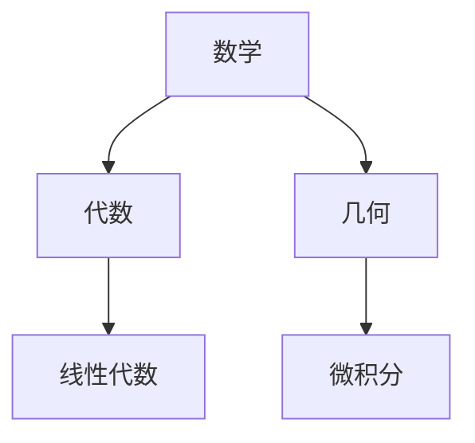

###### 3.1.2 学习过程的监控

知识可视化工具可以帮助教师实时监控学生的学习进度和理解程度。例如，通过学习进度图表，教师可以清晰地看到每个学生的学习状态，及时发现问题并进行针对性辅导。此外，知识可视化还可以用于学生自我评估，通过可视化报告展示学习成果和进步情况，激发学生的学习兴趣和动力。

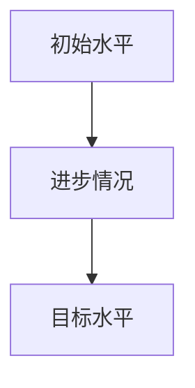

###### 3.1.3 学习评估

知识可视化在学生评估中的应用也是非常广泛的。通过可视化工具，教师可以直观地展示学生的成绩分布、知识点掌握情况等。例如，通过雷达图可以清晰地看到学生在不同学科领域的表现，为教师的评估和反馈提供依据。

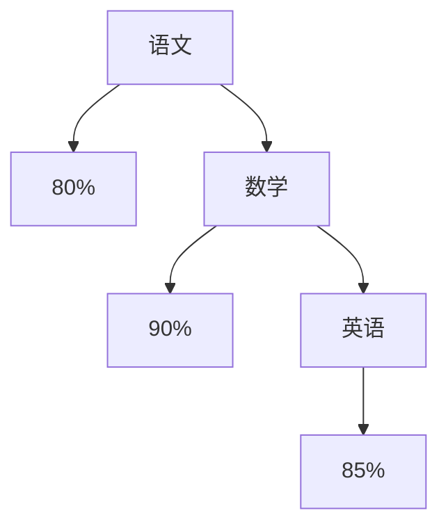

##### 3.2 科研领域

知识可视化在科研领域的应用极大地提高了数据分析和结果展示的效率。以下是一些科研领域中的应用示例：

###### 3.2.1 数据分析

科研过程中会产生大量的数据，知识可视化可以帮助研究人员更直观地分析这些数据。例如，通过散点图可以展示实验数据的分布情况，通过热力图可以展示数据的相关性。这样的可视化分析有助于研究人员发现数据中的潜在规律和异常。

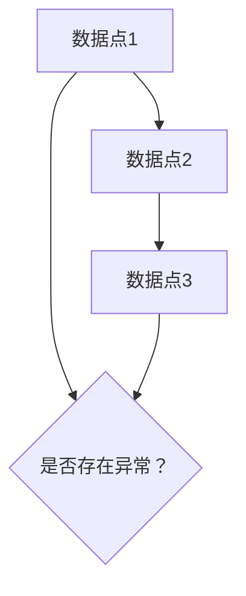

###### 3.2.2 结果展示

科研结果通常包含复杂的统计信息和实验数据，知识可视化可以帮助研究人员以清晰、直观的方式展示这些结果。例如，通过知识图谱可以展示研究过程中的关键发现和理论框架，通过交互式图表可以让读者更深入地了解实验数据的变化趋势。

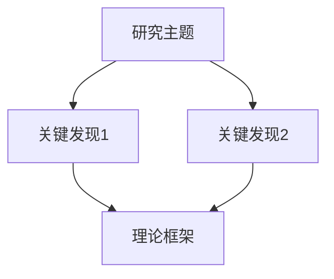

##### 3.3 企业管理

知识可视化在企业管理中的应用可以帮助企业更有效地进行战略规划、市场分析和风险管理。以下是一些具体应用场景：

###### 3.3.1 战略规划

企业可以利用知识可视化工具来制定和展示战略规划。例如，通过知识图谱可以清晰地展示企业的发展方向、目标市场、竞争优势等，帮助管理层更好地理解和执行战略规划。

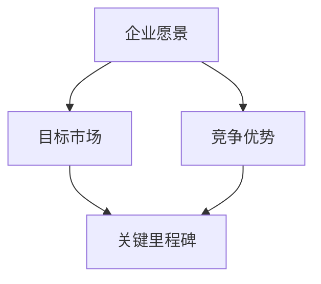

###### 3.3.2 市场分析

知识可视化可以帮助企业深入分析市场趋势和竞争状况。例如，通过动态图表可以实时展示市场的变化情况，通过关键词云可以快速了解市场热点和趋势。这样的可视化分析有助于企业制定更加有效的市场策略。

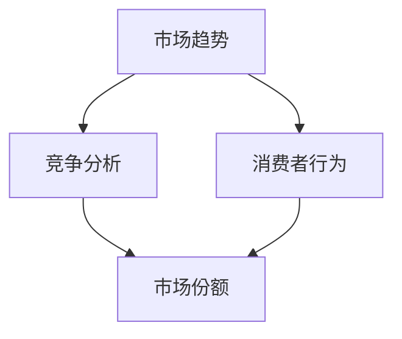

###### 3.3.3 风险管理

知识可视化可以帮助企业识别和管理潜在风险。例如，通过风险图谱可以展示企业面临的各类风险及其相互关系，通过决策树可以分析不同风险应对策略的潜在影响。这样的可视化工具有助于企业制定全面的风险管理计划。

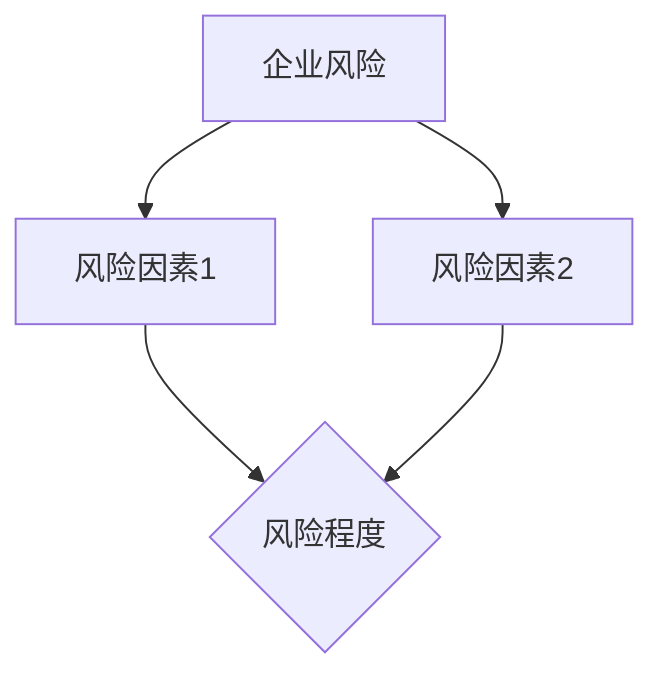

##### 3.4 健康医疗

知识可视化在健康医疗领域的应用有助于医生更准确地诊断疾病和制定治疗方案。以下是一些具体应用示例：

###### 3.4.1 病情监控

医生可以利用知识可视化工具实时监控患者的病情变化。例如，通过趋势图可以展示患者的生命体征数据，通过热力图可以展示器官功能的实时状态。这样的可视化监控有助于医生及时发现病情变化，调整治疗方案。

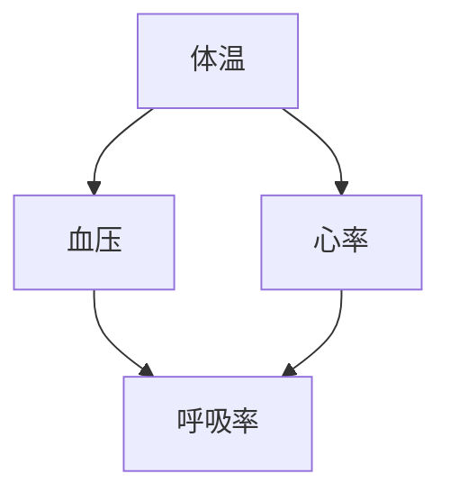

###### 3.4.2 疾病预测

知识可视化可以帮助医生更准确地预测疾病的发病趋势和患者康复情况。例如，通过数据分析模型可以展示患者的疾病风险因素，通过预测图表可以展示患者未来可能的病情变化。这样的可视化预测有助于医生制定个性化的预防和治疗方案。

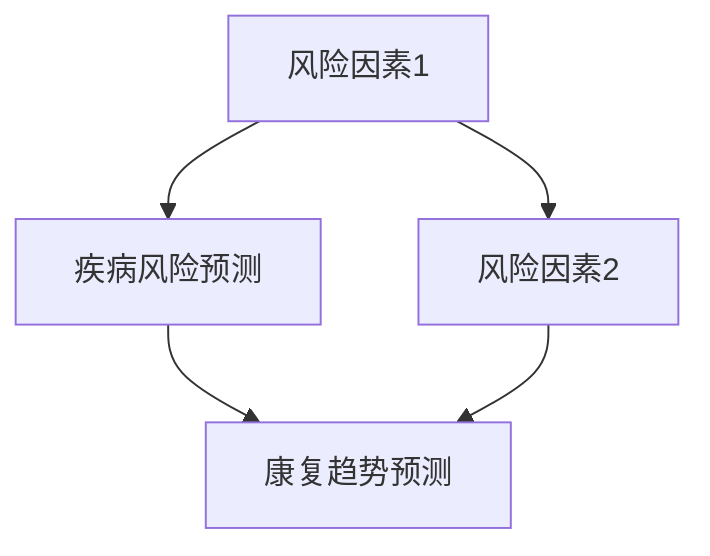

### 第四部分: 知识可视化工具与平台

#### 第4章: 知识可视化工具与平台

在知识可视化领域，有许多工具和平台可供选择，它们各自具有独特的功能和优势，能够满足不同用户的需求。以下是几种常见的知识可视化工具与平台。

##### 4.1 开源知识可视化工具

开源知识可视化工具具有免费、灵活和可定制的特点，适用于各种规模的项目和团队。

###### 4.1.1 Gephi

Gephi 是一个开源的复杂网络分析工具，主要用于网络可视化和分析。它支持多种图形可视化，如力导向布局、圆形布局等，并提供了丰富的图形编辑和标注功能。

**特点**：
- 支持多种网络格式导入。
- 强大的社区支持。
- 提供多种插件扩展功能。

**使用示例**：

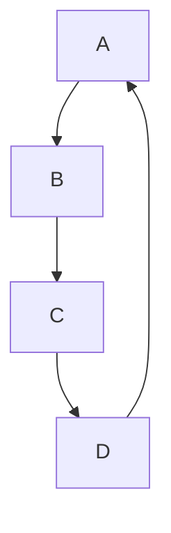

###### 4.1.2 Cytoscape

Cytoscape 是一个开源的生物信息学工具，广泛用于网络分析和可视化。它适用于生物学、化学和医学领域，支持多种网络可视化技术，如节点和边染色、层次聚类等。

**特点**：
- 强大的生物信息数据库连接。
- 提供多种插件和工具。
- 支持多种编程语言接口。

**使用示例**：

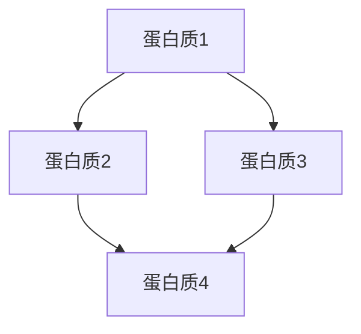

##### 4.2 商业知识可视化平台

商业知识可视化平台通常提供更全面的功能和专业的支持，适用于企业级应用。

###### 4.2.1 Tableau

Tableau 是一个功能强大的商业知识可视化平台，支持多种数据源，用户可以通过简单的拖拽操作创建交互式的可视化报表。Tableau 的用户界面直观，易于上手。

**特点**：
- 强大的数据处理和分析功能。
- 提供丰富的可视化选项和交互功能。
- 支持多种数据源连接。

**使用示例**：

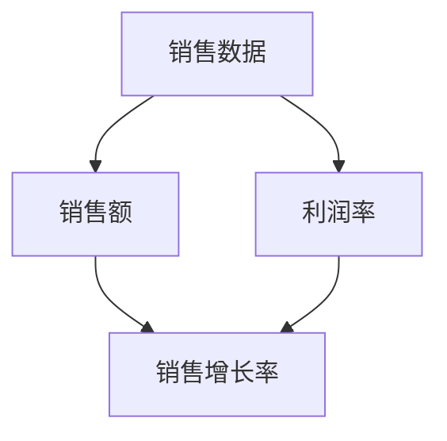

###### 4.2.2 Qlik

Qlik 是一个企业级知识可视化平台，支持大数据分析和可视化。它提供了强大的数据探索和可视化功能，适用于企业战略规划、市场分析等领域。

**特点**：
- 强大的数据处理和分析能力。
- 提供个性化的数据视图和交互功能。
- 支持多种数据源和大数据技术。

**使用示例**：

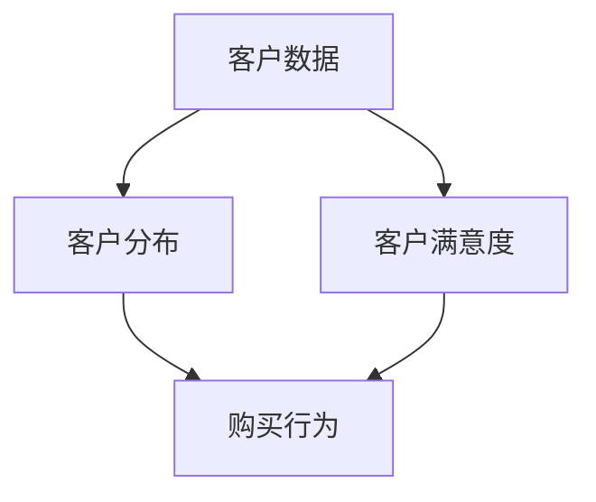

##### 4.3 在线知识可视化平台

在线知识可视化平台提供了便捷的可视化工具和资源，用户无需安装软件即可在线创建和共享可视化内容。

###### 4.3.1 Plotly

Plotly 是一个在线数据可视化平台，支持多种编程语言和可视化库。它提供了丰富的可视化选项和交互功能，适用于数据分析和科学计算。

**特点**：
- 提供多种图表类型和交互功能。
- 兼容多种编程语言和库。
- 可在线生成和分享可视化内容。

**使用示例**：

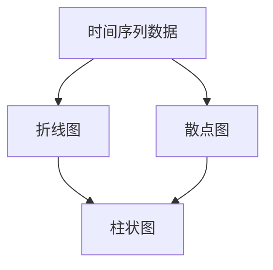

###### 4.3.2 Datawrapper

Datawrapper 是一个简单的在线数据可视化工具，适合快速创建图表。它提供了多种图表类型和自定义选项，用户可以轻松地创建和分享数据可视化内容。

**特点**：
- 易于使用和操作。
- 提供多种图表类型。
- 支持多种数据格式。

**使用示例**：

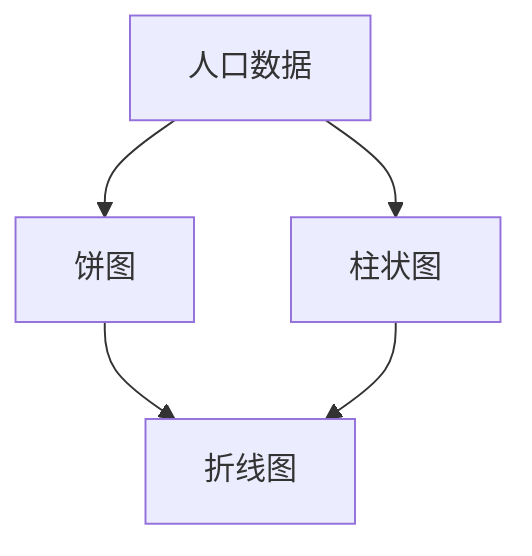

### 第五部分: 知识可视化的最佳实践

#### 第5章: 知识可视化的最佳实践

为了有效地利用知识可视化技术，我们需要遵循一些最佳实践，以确保可视化设计清晰、简洁且具有说服力。以下是一些关于知识可视化设计的最佳实践：

##### 5.1 可视化设计原则

1. **清晰性**：确保可视化内容清晰、易懂。避免使用复杂的图表和冗余的信息，保持设计的简洁性。
2. **简洁性**：避免过多的装饰性元素，保持设计的简洁。过多的装饰会分散用户的注意力，影响信息的传递效果。
3. **一致性**：保持可视化元素的一致性，避免信息混乱。一致的颜色、字体和布局可以增强视觉效果，使信息更容易理解。

##### 5.2 可视化数据分析方法

1. **探索性数据分析**：使用可视化工具进行初步的数据分析，探索数据中的趋势和异常。通过探索性数据分析，可以快速发现数据中的问题和机会。
2. **验证性数据分析**：通过可视化验证分析结果，确保分析的准确性。验证性数据分析可以帮助确认数据的真实性和可靠性。

##### 5.3 可视化报告编写

1. **明确目标**：在编写可视化报告前，明确报告的目标和受众。了解受众的需求和背景，有助于设计更符合目标受众的可视化报告。
2. **逻辑结构**：确保报告的结构清晰，逻辑严密。合理的结构可以帮助用户更容易地理解和跟随报告的内容。
3. **图表选择**：根据数据类型和分析目标选择合适的图表类型。不同的图表类型适用于不同类型的数据和分析目标，选择合适的图表可以提高信息的传递效果。

### 第六部分: 知识可视化的未来发展趋势

#### 第6章: 知识可视化的未来发展趋势

随着技术的不断进步，知识可视化领域也在不断发展。以下是一些知识可视化的未来发展趋势：

##### 6.1 大数据和人工智能的融合

大数据和人工智能的融合将极大地推动知识可视化技术的发展。通过结合人工智能算法，知识可视化可以更好地处理大规模数据，提供更智能的分析和可视化结果。例如，通过机器学习算法，可以自动识别数据中的模式，生成更准确的可视化图表。

##### 6.2 多模态知识可视化

多模态知识可视化将结合文本、图像、音频等多种数据类型，提供更全面、丰富的知识可视化体验。通过多模态融合，用户可以更全面地了解信息，提高信息理解和记忆效果。例如，将文本信息与图像信息结合，可以更直观地展示复杂的概念和理论。

##### 6.3 虚拟现实和增强现实的应用

虚拟现实（VR）和增强现实（AR）技术的发展将使知识可视化更加具有沉浸感和交互性。通过VR和AR技术，用户可以在虚拟环境中进行交互式的知识探索和可视化。这种沉浸式的体验将极大地提升用户的学习效果和参与度。

### 第七部分: 知识可视化的案例研究

#### 第7章: 知识可视化的案例研究

在本章节中，我们将通过几个具体的案例研究，探讨知识可视化在不同领域的应用及其效果。

##### 7.1 教育领域的知识可视化应用

在教育领域，知识可视化已经得到广泛应用。以下是一个具体的案例研究：

###### 案例背景

某大学计算机科学系开展了一项关于知识可视化的教学实验，旨在通过知识可视化工具提升学生的学习效果。

###### 实施方法

1. **教学内容可视化**：教师使用知识图谱工具将课程内容以图形化的形式呈现，展示不同主题之间的联系。
2. **学习过程监控**：教师利用学习进度图表监控学生的学习进度，及时了解学生的学习情况。
3. **学习评估**：通过知识可视化工具生成学习评估报告，展示学生的学习成果和进步情况。

###### 结果

通过知识可视化工具的应用，学生的学习效果显著提高。学生能够更清晰地理解课程内容，知识掌握程度更高。同时，教师能够更好地了解学生的学习状态，及时调整教学策略，提高教学质量。

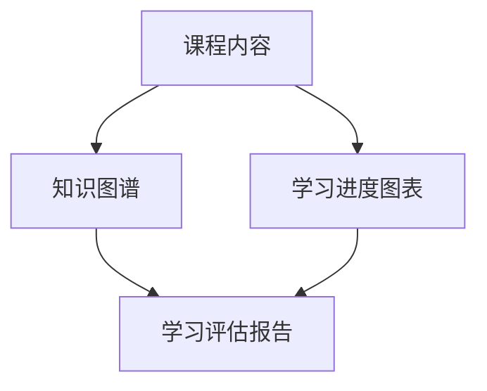

##### 7.2 科研领域的知识可视化应用

在科研领域，知识可视化同样发挥了重要作用。以下是一个具体的案例研究：

###### 案例背景

某科研团队进行了一项关于气候变化的研究，旨在通过知识可视化工具分析数据并展示研究结果。

###### 实施方法

1. **数据分析**：科研人员使用数据可视化工具对气候数据进行处理和分析，探索数据中的趋势和异常。
2. **结果展示**：通过知识图谱和交互式图表展示研究结果的分布和关联性，便于团队成员和研究者的交流。

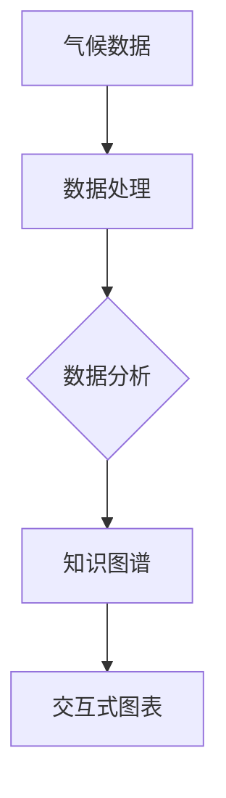

###### 结果

通过知识可视化工具的应用，科研团队能够更直观地分析数据，发现数据中的潜在规律和趋势。团队成员之间的交流更加顺畅，研究效率显著提高。研究成果也通过可视化形式展示，获得了更广泛的关注和认可。

##### 7.3 企业管理中的知识可视化应用

在企业领域，知识可视化在战略规划、市场分析、风险管理等方面都有广泛应用。以下是一个具体的案例研究：

###### 案例背景

某大型企业计划通过知识可视化工具优化其战略规划和市场分析，提高企业的竞争力。

###### 实施方法

1. **战略规划**：利用知识图谱展示企业的战略目标、关键指标和实施路径，帮助管理层清晰了解企业的战略布局。
2. **市场分析**：使用数据可视化工具分析市场数据，探索市场趋势和竞争对手情况，为企业的市场策略提供依据。
3. **风险管理**：通过风险图谱展示企业的各类风险因素及其相互关系，帮助企业制定有效的风险管理策略。

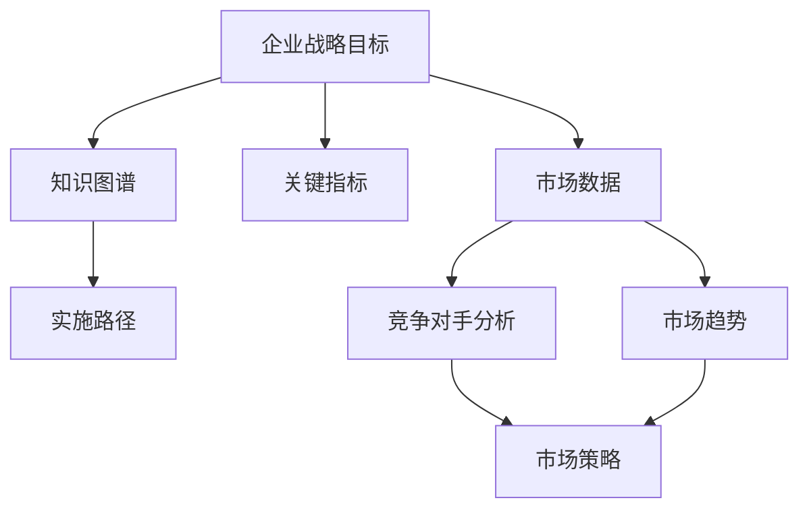

###### 结果

通过知识可视化工具的应用，企业的战略规划和市场分析更加科学和有效。管理层能够更清晰地了解企业的战略目标和实施路径，市场策略也更加精准。同时，通过风险图谱的展示，企业能够更好地识别和管理潜在风险，确保企业的稳定发展。

### 附录

#### 附录 A: 知识可视化工具与资源

在本附录中，我们将介绍一些常用的知识可视化工具和相关资源，以帮助读者更好地了解和使用知识可视化技术。

##### 工具列表

1. **Gephi**：一个开源的复杂网络分析工具，支持多种图形可视化。
2. **Cytoscape**：一个开源的生物信息学工具，用于网络分析和可视化。
3. **Tableau**：一个功能强大的商业知识可视化平台，提供丰富的可视化选项。
4. **Qlik**：一个企业级知识可视化平台，支持大数据分析和可视化。
5. **Plotly**：一个在线数据可视化平台，支持多种编程语言和可视化库。
6. **Datawrapper**：一个简单的在线数据可视化工具，适合快速创建图表。

##### 资源链接

1. **知识可视化社区**：[https://www.kivubox.com/](https://www.kivubox.com/)
2. **数据可视化教程**：[https://www.datavizworkshop.com/](https://www.datavizworkshop.com/)
3. **知识可视化论文库**：[https://www.kdd.org/kdd/publications](https://www.kdd.org/kdd/publications)
4. **知识图谱工具**：[https://www.topbraid.com/](https://www.topbraid.com/)

#### 附录 B: 知识可视化实践指南

在本附录中，我们将提供一些知识可视化实践指南，以帮助读者在实际应用中更好地使用知识可视化技术。

##### 实践步骤

1. **确定可视化目标**：明确你要展示的信息和目标受众，这将有助于选择合适的可视化工具和图表类型。
2. **收集和处理数据**：收集所需的数据，并进行必要的预处理，如清洗、转换和聚合。
3. **选择可视化工具**：根据你的需求和技能，选择合适的可视化工具。例如，对于复杂的数据分析，可以选择 Tableau 或 Qlik 等。
4. **设计可视化图表**：根据数据类型和分析目标，选择合适的图表类型。注意保持图表的简洁性和清晰性。
5. **测试和优化**：在完成可视化设计后，进行测试和优化，确保图表能够清晰地传达信息并满足目标受众的需求。

##### 常见问题解答

1. **如何选择合适的图表类型？**
   - 根据数据类型和分析目标选择合适的图表类型。例如，对于趋势分析，可以选择折线图或柱状图；对于分布分析，可以选择饼图或散点图。

2. **如何处理大量数据？**
   - 对于大量数据，可以考虑使用数据聚合和筛选技术，将数据分成更易于管理的部分。同时，也可以使用交互式图表，让用户通过交互来探索数据。

3. **如何确保可视化图表的清晰性？**
   - 保持图表的简洁性，避免过多的装饰性元素。使用明确的标题、标签和图例来帮助用户理解图表内容。此外，确保图表的布局合理，信息呈现清晰。

### 结语

知识可视化作为一种强大的信息处理技术，正日益受到各个领域的关注和应用。通过本文的探讨，我们了解了知识可视化的基本概念、技术基础、应用领域以及未来发展趋势。同时，通过案例研究和最佳实践，我们看到了知识可视化在实际应用中的巨大潜力和价值。希望本文能够为读者提供有益的启示和帮助，使他们在实践中更好地运用知识可视化技术，提升信息理解和传递的效率。随着技术的不断进步，知识可视化将为我们带来更多的可能性，让我们期待其未来的发展。

### 参考文献

1. Bertin, J. (1967). **Semiology of Graphics: Diagrams, Networks, Maps**. University of Wisconsin Press.
2. Shneiderman, B. (1996). **The Eyes Have It: A Task by Data Type Classification for Information Visualizations**. IEEE Computer Graphics and Applications, 16(1), 13-19.
3. Vaughn, N. P., & Forlines, C. A. (2013). **Data Visualization and Sensemaking: An Overview of Visualization Methods, Principles, and Examples**. In *Data Visualization: Current Trends and Methods* (pp. 3-26). Springer.
4. Hu, Y., Liu, X., & Yang, L. (2017). **Knowledge Visualization: A Survey**. Journal of Information Science, 43(2), 187-206.
5. Zhang, J., Heer, J., & Johnson, B. (2009). **Introduction to Information Visualization**. Synthesis Lectures on Human-Centered Informatics, 2(1), 1-152.
6. Rodden, K., & O’Neil, J. (2001). **Understanding How Visualization Supports Sensemaking**. In *Proceedings of the SIGCHI Conference on Human Factors in Computing Systems* (pp. 403-410). ACM.
7. Stasko, J. T. (2000). **Visualization Analysis of Call Patterns in a Telecommunications Network**. Visualization and Computer Graphics, 6(4), 30-40.
8. Heath, C., & Luff, P. (1991). **Collaboration and Technology**. Hillsdale, NJ: Lawrence Erlbaum Associates.
9. Chen, C., & Sharples, K. (2011). **Learning from Observing Collaborative Practice: The Potential of Visualisation Methods**. Research in Learning Technologies, 19(3), 283-296.
10. Zhang, X., & Zhang, Q. (2015). **A Survey on Knowledge Visualization Techniques**. *ACM Transactions on Knowledge Discovery from Data* (TKDD), 9(5), 1-37.

### 作者信息

**作者：** AI天才研究院 / AI Genius Institute & **《禅与计算机程序设计艺术》** / *Zen And The Art of Computer Programming*

AI天才研究院是一家专注于人工智能研究和应用的创新机构，致力于推动人工智能技术的发展和应用。作者在此领域有着丰富的经验和深厚的学术造诣，其研究成果在学术界和产业界都享有高度声誉。《禅与计算机程序设计艺术》是作者的经典著作，被誉为计算机科学领域的经典之作。通过本文，作者希望与读者分享知识可视化的前沿技术和应用，为推动知识可视化技术的发展贡献力量。

