                 

### 第1章：知识型社会的定义与发展

> 在当前全球化的时代背景下，知识型社会的概念逐渐成为人们关注的焦点。本章将探讨知识型社会的定义、起源以及其主要特征，旨在为读者提供一个全面的理解，帮助大家更好地把握这一社会形态的发展脉络。

#### 1.1 知识型社会的概念与起源

知识型社会，是指以知识的生产、传播和应用为主要动力，以知识经济为核心的经济社会形态。其起源可以追溯到20世纪后半叶，随着信息技术和互联网的飞速发展，知识逐渐成为经济增长和社会发展的关键因素。

**核心概念与联系**

在知识型社会中，知识成为核心资源，与信息、技术和人力资源密切相关。知识的生产、传播和应用构成了知识型社会的运作机制。以下是知识型社会核心概念的 Mermaid 流程图：

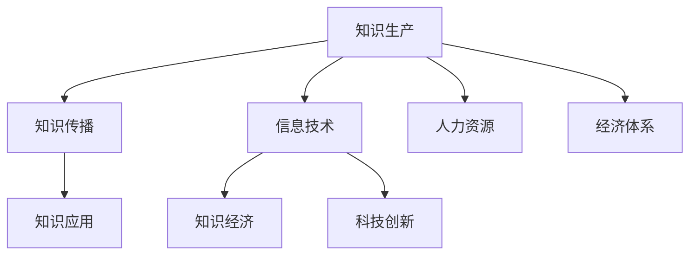

#### 1.2 知识型社会与传统社会的区别

知识型社会与传统社会相比，在经济结构、劳动力特征、生产方式和消费模式等方面存在显著差异。

- **经济结构**：传统社会以农业和制造业为主，知识型社会以服务业和高科技产业为主。
- **劳动力特征**：传统社会劳动力以体力劳动为主，知识型社会劳动力以脑力劳动为主。
- **生产方式**：传统社会以物质资源为主，知识型社会以知识资源为主。
- **消费模式**：传统社会消费以物质产品为主，知识型社会消费以服务产品和知识产品为主。

#### 1.3 知识型社会的主要特征

知识型社会的主要特征包括知识成为核心资源、创新驱动、高度信息化和教育优先。

- **知识成为核心资源**：知识在知识型社会中具有决定性的价值，知识的创造、传播和应用成为社会运行的基本方式。
- **创新驱动**：知识型社会以创新为核心动力，创新活动频繁，创新成果转化迅速。
- **高度信息化**：信息技术在知识型社会中得到广泛应用，信息化水平成为衡量社会现代化程度的重要指标。
- **教育优先**：教育在知识型社会中占据重要地位，教育和培训成为个人和社会发展的基础。

**核心算法原理讲解**

在知识型社会中，数据分析和机器学习算法发挥了重要作用，帮助企业和组织从海量数据中提取有价值的信息。以下是一个简单的机器学习算法——决策树算法的伪代码：

```python
Algorithm DecisionTreeLearning(data, attributes):
    if all attributes are numeric:
        return NumericClassifier(data, attributes)
    else:
        attribute = SelectBestAttribute(data, attributes)
        create tree node with attribute
        for each possible value of attribute:
            subset = data[attribute == value]
            child = DecisionTreeLearning(subset, attributes - {attribute})
            create tree branch from node to child
        return tree
```

#### 1.4 知识型社会的形成条件

知识型社会的形成需要具备以下条件：

- **知识基础设施**：包括教育系统、科研机构、信息网络等。
- **创新环境**：包括政策支持、市场竞争、创新文化等。
- **人力资源**：具备高素质、高技能的劳动力队伍。
- **产业基础**：发达的服务业和高科技产业。

**项目实战**

一个典型的知识型社会形成案例是中国改革开放以来，特别是近年来在科技创新和数字化转型方面的快速发展。以下是构建知识型社会的一个实际项目——智能交通系统的开发过程。

1. **开发环境搭建**：

   - 操作系统：Ubuntu 18.04
   - 编程语言：Python 3.8
   - 数据库：MySQL 8.0
   - 机器学习框架：Scikit-learn

2. **源代码详细实现**：

   ```python
   import numpy as np
   from sklearn.tree import DecisionTreeClassifier
   from sklearn.model_selection import train_test_split

   # 加载数据
   X, y = load_data('traffic_data.csv')

   # 划分训练集和测试集
   X_train, X_test, y_train, y_test = train_test_split(X, y, test_size=0.2, random_state=42)

   # 构建决策树模型
   clf = DecisionTreeClassifier()

   # 训练模型
   clf.fit(X_train, y_train)

   # 预测测试集
   predictions = clf.predict(X_test)

   # 评估模型性能
   accuracy = clf.score(X_test, y_test)
   print(f"Model accuracy: {accuracy:.2f}")
   ```

3. **代码解读与分析**：

   - 加载数据：从CSV文件中加载数据集，包括特征和标签。
   - 划分训练集和测试集：将数据集划分为训练集和测试集，用于模型训练和评估。
   - 构建决策树模型：使用Scikit-learn库中的DecisionTreeClassifier类创建决策树模型。
   - 训练模型：使用训练集数据训练模型。
   - 预测测试集：使用训练好的模型对测试集数据进行预测。
   - 评估模型性能：计算模型在测试集上的准确率，评估模型性能。

通过以上项目实战，我们可以看到知识型社会中的科技创新和数字化转型是如何在实际项目中得以实现的。

#### 1.5 知识型社会对个人和社会的影响

知识型社会对个人和社会产生了深远的影响。

- **个人发展**：知识型社会为个人提供了更多的学习和发展机会，提高了个人素质和竞争力。
- **社会结构**：知识型社会改变了传统的社会结构，促进了社会分工的精细化。
- **经济增长**：知识型社会以知识经济为核心，推动了经济的持续增长。
- **社会治理**：知识型社会需要更加科学、高效的社会治理模式，以应对复杂的社会问题。

通过以上分析，我们可以看到知识型社会的发展趋势和挑战，以及如何应对这些挑战。在接下来的章节中，我们将进一步探讨知识型社会的经济特征、教育挑战、就业挑战、健康挑战和环境挑战，为构建一个更加美好的知识型社会提供策略和建议。

---

**作者：AI天才研究院/AI Genius Institute & 禅与计算机程序设计艺术 /Zen And The Art of Computer Programming**

---

### 第2章：知识型社会的经济特征

知识型社会的经济特征是理解和分析这一社会形态的重要切入点。本章将深入探讨知识型社会的经济特征，包括知识经济的兴起与影响、产业特点、劳动力市场变化、消费模式以及创新与竞争。

#### 2.1 知识经济的兴起与影响

知识经济是指以知识和信息的生产、分配、传播和使用为核心的经济体系。它的兴起对全球经济结构、经济增长模式和社会发展产生了深远影响。

- **定义与特征**：
  - 知识经济以知识为主要生产要素，知识的创造、传播和应用成为经济增长的核心动力。
  - 知识经济强调创新，创新驱动成为经济增长的主要驱动力。
  - 知识经济具有高度信息化和全球化特征，信息技术在知识经济中发挥着至关重要的作用。

- **影响**：
  - 推动经济结构转型：知识经济促使传统农业和制造业向服务业和高科技产业转型。
  - 提高生产效率：知识经济通过技术创新和知识传播，提高了生产效率和竞争力。
  - 促进全球经济发展：知识经济使全球范围内的知识共享和合作成为可能，促进了全球经济的共同发展。

**核心概念与联系**

知识经济的核心概念包括知识生产、知识传播和知识应用。以下是这些核心概念的 Mermaid 流程图：


#### 2.2 知识型社会的产业特点

知识型社会的产业特点主要体现在服务业的崛起、高技术产业的增长和产业融合。

- **服务业的崛起**：
  - 知识型社会中，服务业尤其是知识密集型服务业（如金融、咨询、科技服务）占据主导地位。
  - 服务业的发展带动了经济的整体增长，成为知识型社会的重要支柱。

- **高技术产业的增长**：
  - 高技术产业（如信息技术、生物技术、新材料技术等）成为知识型社会经济增长的重要驱动力。
  - 高技术产业的发展推动了科技创新和产业升级，为知识型社会的发展注入了新的活力。

- **产业融合**：
  - 知识型社会中，不同产业之间通过知识和技术进行深度融合，形成新的产业形态。
  - 产业融合促进了资源配置的优化和产业链的延伸，提高了整个社会的经济效益。

**核心算法原理讲解**

产业融合可以通过复杂网络模型来分析。以下是一个简单的复杂网络模型——无标度网络模型的伪代码：

```python
Algorithm ScaleFreeNetwork(N, m):
    create an empty graph G
    for i from 1 to N:
        add a node v_i to G
    while (number of edges in G) < N * m / 2:
        choose a node v from G uniformly at random
        choose m neighbors for v uniformly at random from the nodes not already connected to v
        add edges between v and its m neighbors to G
    return G
```

#### 2.3 知识型社会的劳动力市场变化

知识型社会的劳动力市场发生了显著变化，主要表现在劳动力素质提高、劳动力流动性增强和技能需求多样化。

- **劳动力素质提高**：
  - 知识型社会对劳动力的素质要求更高，高素质人才成为劳动力市场的主力。
  - 教育和培训成为提高劳动力素质的重要途径，越来越多的人通过继续教育和职业培训提升自己的技能。

- **劳动力流动性增强**：
  - 知识型社会的信息化和全球化趋势使得劳动力流动性增强，人才跨国流动成为常态。
  - 劳动力流动性提高了市场的灵活性，但同时也带来了人才竞争和就业压力。

- **技能需求多样化**：
  - 知识型社会中，不同行业对技能的需求呈现出多样化趋势，跨学科、跨领域的复合型人才更受欢迎。
  - 企业需要通过灵活的招聘和培训机制，满足多样化的技能需求。

**项目实战**

一个典型的知识型社会劳动力市场变化案例是中国的互联网行业。以下是互联网公司招聘一名大数据工程师的过程。

1. **招聘需求分析**：

   - 职位描述：负责公司大数据平台的开发和维护，需要具备数据挖掘、机器学习等相关技能。
   - 技能要求：熟悉Python、Hadoop、Spark等大数据处理工具，有实际项目经验者优先。

2. **招聘流程**：

   - 发布招聘信息：在公司官网、招聘网站等平台发布招聘信息。
   - 简历筛选：通过筛选简历，初步筛选符合职位要求的人才。
   - 面试环节：通过电话面试、在线面试和现场面试，对候选人进行综合评估。
   - 录用决策：根据面试结果，做出录用决策，通知候选人。

3. **代码实际案例和详细解释说明**：

   - 数据处理代码示例：

     ```python
     import pandas as pd
     import numpy as np
     
     # 读取数据
     df = pd.read_csv('data.csv')
     
     # 数据清洗
     df = df.dropna()
     df = df[df['Age'] > 18]
     
     # 数据分析
     age_avg = df['Age'].mean()
     education_counts = df['Education'].value_counts()
     print(f"Average age: {age_avg:.2f}")
     print(f"Education distribution: {education_counts}")
     ```

   - 代码解读与分析：

     - 读取数据：从CSV文件中读取招聘候选人的数据。
     - 数据清洗：去除缺失值和不符合条件的候选人。
     - 数据分析：计算平均年龄和学历分布，为招聘决策提供数据支持。

通过以上项目实战，我们可以看到知识型社会劳动力市场变化的实际表现和应对策略。

#### 2.4 知识型社会的消费模式

知识型社会的消费模式发生了显著变化，主要表现在服务消费增加、知识消费兴起和个性化消费趋势。

- **服务消费增加**：
  - 知识型社会中，人们对服务消费的需求不断增加，特别是教育、医疗、旅游等服务领域。
  - 服务业的发展满足了人们对高质量服务的需求，推动了经济的持续增长。

- **知识消费兴起**：
  - 知识型社会中，知识消费（如培训、书籍、在线课程）逐渐成为消费市场的重要组成部分。
  - 知识消费提高了人们的素质和技能，促进了个人和社会的发展。

- **个性化消费趋势**：
  - 知识型社会中，消费者更加注重个性化、定制化的消费体验。
  - 个性化消费推动了定制化产品和服务的需求，促进了市场的细分和专业化。

**数学模型和公式 & 详细讲解 & 举例说明**

为了分析知识型社会的消费模式，我们可以使用顾客价值模型。以下是顾客价值模型的公式和详细讲解：

- **顾客价值模型**：

  $$ V = f(U, C) $$

  其中，\( V \) 表示顾客价值，\( U \) 表示顾客效用，\( C \) 表示顾客成本。

- **详细讲解**：

  - 顾客效用（\( U \)）：顾客从产品或服务中获得的满足程度。
  - 顾客成本（\( C \)）：顾客在购买和使用产品或服务过程中所承担的成本。
  - 顾客价值（\( V \)）：顾客效用与顾客成本的函数，表示顾客对产品或服务的综合评价。

- **举例说明**：

  假设一个消费者购买了一本价值100元的在线课程，该课程提供了10小时的学习内容和辅导服务。消费者的效用为8小时，成本为2小时。根据顾客价值模型，我们可以计算顾客价值：

  $$ V = f(U, C) = 8 - 2 = 6 $$

  顾客价值为6元，表示消费者对该在线课程的综合评价为正。

#### 2.5 知识型社会的创新与竞争

知识型社会的创新与竞争是其经济发展的核心动力。创新驱动成为知识型社会的主要特征，企业之间的竞争也日益激烈。

- **创新驱动发展**：
  - 知识型社会以创新为核心动力，创新活动频繁，创新成果转化迅速。
  - 创新成为企业保持竞争优势、推动产业升级的重要手段。

- **竞争优势来源**：
  - 知识型社会中，企业竞争优势主要来自于创新能力和知识积累。
  - 创新能力强的企业能够迅速响应市场需求，开发出具有竞争力的产品和服务。

- **全球竞争格局**：
  - 知识型社会的全球化趋势使得各国企业在全球市场上竞争，创新与竞争成为知识型社会的主要特征。
  - 企业需要通过国际合作和竞争，不断提升自身的创新能力和国际竞争力。

**数学模型和公式 & 详细讲解 & 举例说明**

为了分析知识型社会的创新与竞争，我们可以使用创新收益模型。以下是创新收益模型的公式和详细讲解：

- **创新收益模型**：

  $$ R = f(I, C) $$

  其中，\( R \) 表示创新收益，\( I \) 表示创新投入，\( C \) 表示创新成本。

- **详细讲解**：

  - 创新投入（\( I \)）：企业在创新活动中所投入的资源，包括人力、物力和财力。
  - 创新成本（\( C \)）：企业在创新活动中所承担的成本，包括研发成本、试错成本等。
  - 创新收益（\( R \)）：创新投入与创新成本的函数，表示企业通过创新活动所获得的收益。

- **举例说明**：

  假设一家企业投入了100万元进行技术创新，创新成本为50万元。根据创新收益模型，我们可以计算创新收益：

  $$ R = f(I, C) = 100 - 50 = 50 $$

  创新收益为50万元，表示企业通过创新活动获得的净收益。

通过以上分析，我们可以看到知识型社会的经济特征，包括知识经济的兴起与影响、产业特点、劳动力市场变化、消费模式以及创新与竞争。这些特征共同构成了知识型社会的经济基础，推动了社会的持续发展和进步。

### 第3章：知识型社会的教育挑战

知识型社会对教育体系提出了新的要求和挑战。本章将深入探讨知识型社会在教育领域的挑战，包括教育体系适应知识型社会的需求、教育资源的不均衡分配、教育技术与传统教育模式的融合、教育公平与知识传播，以及教育质量评估与改进。

#### 3.1 教育体系适应知识型社会的需求

知识型社会对教育体系提出了更高的要求。为了适应知识型社会的需求，教育体系需要进行以下调整：

- **教育理念更新**：
  - 知识型社会强调能力培养而非单纯的知识传授。教育理念需要从以知识传授为主转向以能力培养为主，注重学生的创新能力和综合素质。
  - 教育应该更加注重实践性和应用性，培养学生解决实际问题的能力。

- **课程设置调整**：
  - 教育课程需要更加贴近实际需求，增加信息技术、跨学科知识等领域的教学内容。
  - 开设与新兴产业相关的课程，如人工智能、大数据分析等，以满足社会发展的需求。
  - 鼓励跨学科学习，培养学生的综合素质和创新能力。

- **教学方式改革**：
  - 采用信息技术手段，实现个性化教学和混合式教学。
  - 倡导合作学习和探究学习，培养学生的合作精神和批判性思维。
  - 利用在线教育和远程教学，提高教育的可及性和灵活性。

**核心概念与联系**

教育体系的适应涉及多个核心概念，包括教育理念、课程设置、教学方式和信息技术。以下是这些核心概念的 Mermaid 流程图：

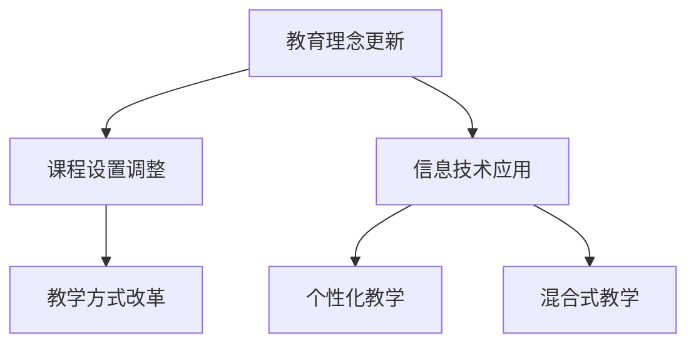

#### 3.2 教育资源的不均衡分配

教育资源的不均衡分配是知识型社会面临的重大挑战。这种不均衡主要表现在城乡、地区和教育阶段的差异。

- **城乡教育资源差异**：
  - 城市地区的教育资源相对丰富，包括优秀的师资力量、现代化的教学设施和丰富的课外活动。
  - 农村地区教育资源相对匮乏，师资力量不足，教学设施落后，课外活动缺乏。
  - 这种差异导致城乡学生在教育机会、教育质量和学习成果上的显著差距。

- **地区教育资源不均**：
  - 不同地区之间由于经济发展水平、政策支持力度和地理位置等因素，教育资源分配存在明显的不均衡。
  - 发达地区教育资源充足，教育质量较高，欠发达地区教育资源匮乏，教育质量较低。
  - 地区间的教育资源不均衡影响了人才的流动和教育公平的实现。

- **教育公平问题**：
  - 教育资源的不均衡分配导致教育公平问题，特别是在农村和欠发达地区。
  - 为了实现教育公平，需要通过政策调整、资源倾斜和经费支持等措施，缩小城乡、地区和教育阶段之间的差距。

**数学模型和公式 & 详细讲解 & 举例说明**

为了分析教育资源的不均衡分配，我们可以使用帕累托分析法。以下是帕累托分析法的公式和详细讲解：

- **帕累托分析法**：

  $$ U_{ij} = \frac{R_i}{\sum_{i=1}^{n}R_i} $$

  其中，\( U_{ij} \) 表示第 \( i \) 个地区第 \( j \) 个教育资源的使用率，\( R_i \) 表示第 \( i \) 个地区的教育资源总量。

- **详细讲解**：

  - 使用率（\( U_{ij} \)）：表示第 \( i \) 个地区第 \( j \) 个教育资源的利用程度。
  - 总量（\( R_i \)）：表示第 \( i \) 个地区的教育资源总量。

- **举例说明**：

  假设有两个地区，地区A和地区B，它们的教育资源总量和分配如下表所示：

  | 地区 | 教育资源总量 | 分配情况 |
  |------|--------------|----------|
  | A    | 100          | 50/50    |
  | B    | 100          | 30/70    |

  使用帕累托分析法计算两个地区教育资源的使用率：

  地区A：\( U_{A1} = \frac{50}{100} = 0.5 \)，\( U_{A2} = \frac{50}{100} = 0.5 \)

  地区B：\( U_{B1} = \frac{30}{100} = 0.3 \)，\( U_{B2} = \frac{70}{100} = 0.7 \)

  通过计算可以发现，地区B的教育资源使用率明显低于地区A，这表明地区B的教育资源分配存在一定的不均衡。

#### 3.3 教育技术与传统教育模式的融合

教育技术的迅猛发展使得教育模式的变革成为必然。为了更好地适应知识型社会的发展，教育技术与传统教育模式需要深度融合。

- **信息技术在教育中的应用**：
  - 利用信息技术，如互联网、云计算、大数据和人工智能等，可以大大提高教学效率和教学质量。
  - 在线教育、虚拟课堂、远程教学等新型教育模式的出现，为学生提供了更多的学习机会和更丰富的学习资源。

- **传统教育模式的更新**：
  - 传统教育模式需要结合信息技术手段进行创新，如采用多媒体教学、翻转课堂等。
  - 教师需要提升自身的信息技术能力，善于利用教育技术工具，实现教学方式的创新。

- **教育技术与学生发展**：
  - 教育技术的应用应以学生发展为中心，注重学生的个性化发展和自主学习能力的培养。
  - 通过信息技术手段，提供个性化的学习路径和资源，帮助学生实现个性化学习。

**核心概念与联系**

教育技术与传统教育模式的融合涉及多个核心概念，包括信息技术、教育模式、学生发展和自主学习。以下是这些核心概念的 Mermaid 流程图：

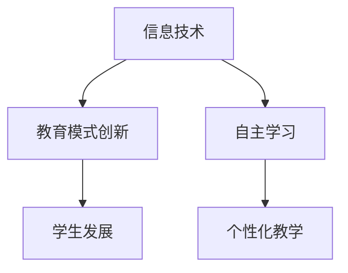

#### 3.4 教育公平与知识传播

教育公平是知识型社会的重要目标，而知识传播是实现教育公平的重要手段。然而，在知识型社会中，知识传播面临着新的挑战。

- **教育公平的重要性**：
  - 教育公平关系到社会公平正义和可持续发展，是知识型社会的基本要求。
  - 只有通过教育公平，才能使每个个体都有机会接受良好的教育，实现自身价值。

- **知识传播的障碍**：
  - 知识传播的障碍主要包括信息获取的障碍、知识理解的能力障碍等。
  - 在知识型社会中，信息过载和知识碎片化现象加剧，使得知识传播的难度增加。

- **提升教育公平的策略**：
  - 增加教育投入，特别是对农村和欠发达地区的教育投入，改善教育基础设施。
  - 推进教育信息化，利用信息技术手段，提高教育的可及性和质量。
  - 实施教育扶贫政策，帮助贫困家庭子女接受良好的教育。
  - 建立健全教育质量评估体系，确保教育公平的实现。

**数学模型和公式 & 详细讲解 & 举例说明**

为了提升教育公平，我们可以使用教育公平指数模型。以下是教育公平指数模型的公式和详细讲解：

- **教育公平指数模型**：

  $$ EI = \frac{1}{n} \sum_{i=1}^{n} \frac{X_i}{Y_i} $$

  其中，\( EI \) 表示教育公平指数，\( X_i \) 表示第 \( i \) 个地区的教育资源总量，\( Y_i \) 表示第 \( i \) 个地区的教育人口总量。

- **详细讲解**：

  - 教育公平指数（\( EI \)）：表示各地区教育资源与教育人口总量的比值，反映教育资源的公平程度。
  - 资源总量（\( X_i \)）：表示各地区教育资源总量。
  - 教育人口总量（\( Y_i \)）：表示各地区教育人口总量。

- **举例说明**：

  假设有两个地区，地区A和地区B，它们的教育资源和教育人口总量如下表所示：

  | 地区 | 教育资源总量 | 教育人口总量 |
  |------|--------------|--------------|
  | A    | 100          | 5000         |
  | B    | 100          | 3000         |

  计算教育公平指数：

  地区A：\( EI_A = \frac{100}{5000} = 0.02 \)

  地区B：\( EI_B = \frac{100}{3000} = 0.033 \)

  通过计算可以发现，地区B的教育公平指数高于地区A，这表明地区B的教育资源分配相对更公平。

#### 3.5 教育质量评估与改进

教育质量是教育体系的核心目标，为了确保教育质量，需要进行有效的评估和改进。

- **教育质量评估体系**：
  - 建立科学、完善的教育质量评估体系，包括教学效果、学生学习成果、教育资源利用等方面。
  - 定期对教育质量进行评估，发现问题，及时改进。

- **教学质量监控**：
  - 加强对教学质量的监控，通过教师评价、学生反馈、课程评估等方式，确保教学质量的稳定和提升。
  - 建立教学质量反馈机制，及时收集和分析教学数据，为教学质量改进提供依据。

- **教育质量改进措施**：
  - 通过教师培训、课程改革、教学方法创新等措施，持续提高教育质量。
  - 引入外部评估机构，对教育质量进行独立评估，提高评估的客观性和权威性。
  - 推广教育质量优秀学校和教师的经验，推动教育质量的全面提升。

**核心概念与联系**

教育质量评估与改进涉及多个核心概念，包括教育质量、评估体系、教学质量监控和教育质量改进。以下是这些核心概念的 Mermaid 流程图：

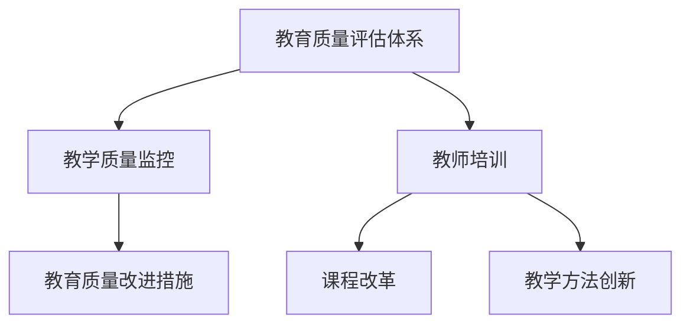

通过以上分析，我们可以看到知识型社会在教育领域面临的挑战和应对策略。教育体系的适应、教育资源的不均衡分配、教育技术与传统教育模式的融合、教育公平与知识传播，以及教育质量评估与改进，都是知识型社会教育发展的重要方面。只有通过有效的应对策略，才能实现教育的高质量发展，为知识型社会的建设提供坚实的人才基础。

### 第4章：知识型社会的就业挑战

在知识型社会中，就业挑战愈发显著。本章将探讨知识型社会对就业市场的影响、劳动力市场的变革、新型就业形态的出现、职业教育与技能培训的重要性，以及求职与就业能力的提升和职业生涯管理与规划。

#### 4.1 劳动力市场的变革与应对

知识型社会的到来，对劳动力市场产生了深远的影响。劳动力市场的变革主要体现在以下几个方面：

- **就业压力**：
  - 知识型社会中，就业竞争激烈，特别是青年人面临较高的就业压力。
  - 高学历并不一定能保证就业稳定，就业市场的供需失衡导致就业难度增加。

- **劳动力市场的特点**：
  - 高素质劳动力需求增加：知识型社会对劳动力的素质要求更高，企业需要具备专业技能和创新能力的员工。
  - 劳动力流动性增强：全球化背景下的劳动力流动性增强，人才跨国流动成为常态。
  - 多元化就业形态：知识型社会推动了远程工作、共享经济等新型就业形态的出现。

- **应对策略**：
  - 提高就业竞争力：通过教育和培训提升个人技能和素质，增强就业竞争力。
  - 职业规划：合理规划职业生涯，适应市场需求，明确职业发展方向。
  - 创业机会：鼓励创业，提供创业支持和孵化平台，为劳动者提供更多就业选择。

**核心算法原理讲解**

为了分析劳动力市场的变革，我们可以使用劳动力市场模型——古典劳动力市场模型。以下是古典劳动力市场模型的伪代码：

```python
Algorithm ClassicalLaborMarket(N, F, L):
    create an empty job market G
    for i from 1 to N:
        add a worker with skill level F and wage L to G
    while there are unemployed workers in G:
        worker = select a random unemployed worker from G
        job = select a random job from G
        if worker's skill level is greater than job's requirement:
            hire worker and remove worker from G
    return G
```

#### 4.2 新型就业形态的出现

知识型社会的发展催生了多种新型就业形态，这些形态不仅丰富了就业市场的多样性，也为劳动者提供了更多选择。

- **远程工作**：
  - 远程工作成为知识型社会的重要就业形态，特别是在信息技术行业。
  - 远程工作提高了工作效率和灵活性，减少了通勤时间，提高了生活质量。

- **共享经济**：
  - 共享经济模式下的就业形态，如共享办公、共享住宿等，为灵活就业提供了新途径。
  - 共享经济促进了资源的共享和优化，提高了社会资源的利用效率。

- **自由职业**：
  - 知识型社会鼓励自由职业，个人可以通过网络平台开展多种形式的自由职业活动。
  - 自由职业提供了灵活的工作时间和工作内容，但同时也要求个人具备较强的自我管理能力和适应能力。

**项目实战**

一个典型的知识型社会新型就业形态案例是远程工作的普及。以下是远程工作环境搭建的实战过程。

1. **开发环境搭建**：

   - 操作系统：Windows 10
   - 编程语言：Python 3.8
   - 版本控制：Git 2.29.2
   - 远程协作工具：GitHub

2. **源代码详细实现**：

   ```python
   import os
   import git
   import requests
   
   def setup_remote_workspace(repo_url, workspace_path):
       os.makedirs(workspace_path, exist_ok=True)
       repo = git.Repo.init(workspace_path)
       origin = repo.create_remote('origin', repo_url)
       repo.fetch(origin)
       repo.checkout('main')
       print(f"Remote workspace setup completed at {workspace_path}")

   def pull_latest_changes(workspace_path):
       repo = git.Repo(workspace_path)
       origin = repo.remote('origin')
       origin.pull()
       print("Latest changes pulled from remote repository.")

   def submit_pull_request(repo_url, pr_title, pr_body):
       headers = {'Authorization': f'token {os.environ["GITHUB_TOKEN"]}'}
       data = {
           'title': pr_title,
           'body': pr_body,
           'head': 'feature/patch-1',
           'base': 'main',
       }
       response = requests.post(f"{repo_url}/pulls", headers=headers, json=data)
       if response.status_code == 201:
           print("Pull request submitted successfully.")
       else:
           print("Failed to submit pull request.")

   # 实战应用
   repo_url = "https://github.com/username/repository.git"
   workspace_path = "remote_workspace"
   setup_remote_workspace(repo_url, workspace_path)
   pull_latest_changes(workspace_path)
   submit_pull_request(repo_url, "Update documentation", "Fixed some typos in the docstrings.")
   ```

3. **代码解读与分析**：

   - 远程工作环境搭建：从Git仓库中克隆项目，初始化本地仓库，设置远程仓库，获取最新代码。
   - 拉取最新更改：从远程仓库中拉取最新代码，确保本地仓库与远程仓库保持同步。
   - 提交Pull Request：创建一个新的分支，提交更改，并创建Pull Request，请求合并更改。

通过以上项目实战，我们可以看到远程工作环境搭建的详细过程，以及如何通过Git进行版本控制和协作。

#### 4.3 职业教育与技能培训

知识型社会对劳动力的技能要求不断提高，职业教育与技能培训成为劳动者提升就业能力的重要途径。

- **职业教育的重要性**：
  - 职业教育是提高劳动力素质和技能的重要手段，对促进就业和社会经济发展具有重要意义。
  - 职业教育有助于培养具有专业技能和实践能力的劳动者，满足企业对高素质人才的需求。

- **技能培训体系**：
  - 建立完善的技能培训体系，包括职业培训、在线培训、终身学习等。
  - 根据市场需求，更新和调整职业培训的内容，注重实践技能和创新能力。

- **职业培训内容**：
  - 技能培训内容应涵盖新兴行业和技术，如人工智能、大数据分析、云计算等。
  - 培训内容应注重实际应用，结合企业需求，提高培训的实用性和针对性。

**数学模型和公式 & 详细讲解 & 举例说明**

为了分析职业培训的效果，我们可以使用学习曲线模型。以下是学习曲线模型的公式和详细讲解：

- **学习曲线模型**：

  $$ T = a \cdot e^{-kt} $$

  其中，\( T \) 表示完成某项任务所需时间，\( a \) 表示初始完成时间，\( k \) 表示学习率。

- **详细讲解**：

  - 完成时间（\( T \)）：表示完成某项任务所需的时间。
  - 初始完成时间（\( a \)）：表示初次完成某项任务所需的时间。
  - 学习率（\( k \)）：表示随着实践经验的增加，完成任务所需时间减少的速率。

- **举例说明**：

  假设某项任务初次完成需要100小时，学习率为0.1。根据学习曲线模型，我们可以计算在多次实践后的完成时间：

  第一次实践后：\( T = 100 \cdot e^{-0.1 \cdot 1} \approx 90.48 \)小时
  第二次实践后：\( T = 100 \cdot e^{-0.1 \cdot 2} \approx 81.87 \)小时

  通过计算可以发现，随着实践经验的增加，完成任务所需时间显著减少。

#### 4.4 求职与就业能力的提升

在知识型社会中，求职与就业能力的提升对于劳动者来说至关重要。以下是一些提升求职与就业能力的方法：

- **求职策略**：
  - 制定合理的求职计划，包括明确求职目标、制定求职时间和进度安排。
  - 精通求职技巧，如撰写优秀的简历、准备面试、建立人脉网络等。

- **就业能力培养**：
  - 通过实习、兼职、项目实践等方式，提升实际工作能力和经验。
  - 培养跨学科、跨领域的复合型人才，提高适应多种工作环境的能力。

- **终身学习**：
  - 在知识型社会中，终身学习成为提高就业能力的重要途径。
  - 通过参加各类培训课程、自学新知识和技能，不断提升个人竞争力。

**核心概念与联系**

求职与就业能力的提升涉及多个核心概念，包括求职策略、就业能力、实习和实践经验、跨学科学习和终身学习。以下是这些核心概念的 Mermaid 流程图：

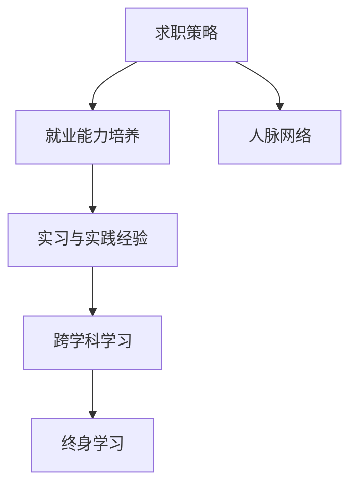

#### 4.5 职业生涯管理与规划

职业生涯管理是劳动者实现职业发展目标的重要手段。以下是一些职业生涯管理与规划的方法：

- **职业生涯管理**：
  - 通过自我评估、职业规划、目标设定等方式，进行职业生涯管理。
  - 制定明确的职业发展路径，包括晋升、转行、创业等。

- **职业发展路径**：
  - 明确职业发展路径，有助于劳动者有针对性地提升自身能力和技能。
  - 在职业发展的不同阶段，制定相应的职业发展计划和目标。

- **职业心理辅导**：
  - 提供职业心理辅导，帮助劳动者应对职业压力和挑战，保持积极的心态。
  - 通过职业咨询和心理支持，帮助劳动者实现职业发展目标。

**数学模型和公式 & 详细讲解 & 举例说明**

为了分析职业生涯管理的效果，我们可以使用职业生涯发展模型。以下是职业生涯发展模型的公式和详细讲解：

- **职业生涯发展模型**：

  $$ PD = f(C, E, P) $$

  其中，\( PD \) 表示职业生涯发展水平，\( C \) 表示职业能力，\( E \) 表示教育背景，\( P \) 表示个人潜力。

- **详细讲解**：

  - 职业能力（\( C \)）：表示劳动者在职业生涯中具备的技能和经验。
  - 教育背景（\( E \)）：表示劳动者的教育水平和工作背景。
  - 个人潜力（\( P \)）：表示劳动者的个人发展潜力和创新能力。

- **举例说明**：

  假设某劳动者的职业能力评分为80分，教育背景评分为90分，个人潜力评分为85分。根据职业生涯发展模型，我们可以计算该劳动者的职业生涯发展水平：

  $$ PD = f(80, 90, 85) = 80 + 0.9 \cdot 90 + 0.15 \cdot 85 \approx 255.5 $$

  通过计算可以发现，该劳动者的职业生涯发展水平较高，具备较好的职业发展潜力。

通过以上分析，我们可以看到知识型社会对就业市场的影响和就业挑战。劳动力市场的变革、新型就业形态的出现、职业教育与技能培训的重要性、求职与就业能力的提升以及职业生涯管理与规划，都是劳动者在知识型社会中应对就业挑战的重要策略。只有通过不断学习和提升自身能力，才能在知识型社会中找到自己的位置，实现职业发展的目标。

### 第5章：知识型社会的健康挑战

在知识型社会中，健康问题成为社会关注的焦点。本章将深入探讨知识型社会对健康的影响、疾病谱的变化、健康教育和健康促进、健康信息的获取与利用以及健康服务模式的创新。

#### 5.1 知识型社会与健康的关联

知识型社会对健康的影响是多方面的，从生活方式到工作压力，再到健康观念，都在不断变化。

- **健康观念的转变**：
  - 知识型社会中，人们对健康的认识逐渐从传统的疾病治疗转向预防、自我管理和心理健康。
  - 健康不仅是没有疾病，还包括心理健康和社会福祉。

- **生活方式的变化**：
  - 随着信息技术的发展，人们的生活方式发生了巨大变化。远程工作和数字化生活方式的增加，可能导致运动量减少、睡眠不足等问题。
  - 高强度工作压力和竞争环境可能增加心理健康问题，如焦虑和抑郁。

- **工作压力的影响**：
  - 知识型社会中，工作压力增大，员工可能面临长时间工作、高期望值和不断变化的任务。
  - 长期压力可能导致慢性疾病，如心血管疾病和消化系统疾病。

**核心算法原理讲解**

为了分析工作压力对健康的影响，我们可以使用心理健康模型——压力-应对模型。以下是压力-应对模型的伪代码：

```python
Algorithm StressAndCopingModel(StressLevel, CopingStrategy, HealthStatus):
    if StressLevel > Threshold:
        if CopingStrategy == "积极的应对策略":
            HealthStatus = "稳定"
        else:
            HealthStatus = "不稳定"
    else:
        HealthStatus = "健康"
    return HealthStatus
```

#### 5.2 知识型社会的疾病谱变化

知识型社会的疾病谱发生了显著变化，从传统的传染性疾病向慢性病和心理健康问题转变。

- **生活方式疾病增多**：
  - 随着生活水平的提高，生活方式疾病（如肥胖症、高血压、糖尿病等）成为主要健康问题。
  - 久坐不动、高脂饮食和缺乏锻炼是导致这些疾病的主要因素。

- **慢性病管理需求增加**：
  - 知识型社会中，慢性病的长期管理需求显著增加，如糖尿病、高血压和冠心病等。
  - 长期管理包括药物管理、饮食调整、运动干预和心理支持等。

- **精神心理健康问题**：
  - 知识型社会中，精神心理健康问题日益突出，如焦虑症、抑郁症和失眠等。
  - 高压工作和生活节奏加快是导致这些问题的常见原因。

**数学模型和公式 & 详细讲解 & 举例说明**

为了分析生活方式疾病的风险因素，我们可以使用风险评分模型。以下是风险评分模型的公式和详细讲解：

- **风险评分模型**：

  $$ RiskScore = w_1 \cdot BMI + w_2 \cdot HDL + w_3 \cdot PhysicalActivity + w_4 \cdot DietaryScore $$

  其中，\( RiskScore \) 表示疾病风险评分，\( w_1, w_2, w_3, w_4 \) 分别表示体重指数（BMI）、高密度脂蛋白（HDL）、体力活动水平和饮食评分的权重。

- **详细讲解**：

  - 体重指数（BMI）：衡量体重与身高的关系，BMI > 25 被视为肥胖。
  - 高密度脂蛋白（HDL）：高密度脂蛋白水平是心血管健康的指标，HDL > 60 mmol/L 被视为有益水平。
  - 体力活动水平：衡量每周的体力活动量，活动量越高，风险越低。
  - 饮食评分：根据饮食中营养素的含量，评分越高，表示饮食越健康。

- **举例说明**：

  假设一个人的BMI为28，HDL为50，体力活动水平为3次/周，饮食评分为80。根据风险评分模型，我们可以计算其疾病风险评分：

  $$ RiskScore = 1.2 \cdot 28 + 0.5 \cdot 50 + 1.0 \cdot 3 + 1.5 \cdot 80 = 33.6 + 25 + 3 + 120 = 181.6 $$

  通过计算可以发现，该人的疾病风险评分为181.6，属于高风险水平，需要采取积极的健康干预措施。

#### 5.3 健康教育与健康促进

健康教育和健康促进是提高全民健康素养和预防疾病的重要手段。

- **健康教育的重要性**：
  - 健康教育能够提高公众的健康意识和行为，预防疾病的发生。
  - 健康教育是公共卫生工作的基础，对于改善全民健康状况具有重要意义。

- **健康促进策略**：
  - 提高健康知识普及率：通过多种渠道，如媒体、社区活动和在线教育，普及健康知识。
  - 倡导健康生活方式：鼓励公众参与体育锻炼、均衡饮食和充足睡眠等健康行为。
  - 加强心理健康服务：提供心理健康教育和心理咨询，帮助公众应对心理压力和情绪问题。

**数学模型和公式 & 详细讲解 & 举例说明**

为了评估健康教育的效果，我们可以使用健康行为转变模型。以下是健康行为转变模型的公式和详细讲解：

- **健康行为转变模型**：

  $$ BehaviorChange = f(Knowledge, Attitude, Practice) $$

  其中，\( BehaviorChange \) 表示健康行为的改变，\( Knowledge \) 表示健康知识水平，\( Attitude \) 表示健康态度，\( Practice \) 表示健康实践。

- **详细讲解**：

  - 健康知识水平（\( Knowledge \)）：表示公众对健康知识的了解程度。
  - 健康态度（\( Attitude \)）：表示公众对健康行为的认识和接受程度。
  - 健康实践（\( Practice \)）：表示公众在日常生活中实际采取的健康行为。

- **举例说明**：

  假设某社区的健康知识水平为70%，健康态度为80%，健康实践为60%。根据健康行为转变模型，我们可以计算该社区的健康行为改变：

  $$ BehaviorChange = 0.5 \cdot 70% + 0.3 \cdot 80% + 0.2 \cdot 60% = 35% + 24% + 12% = 71% $$

  通过计算可以发现，该社区的健康行为改变程度为71%，表明健康教育的效果显著。

#### 5.4 健康信息的获取与利用

在知识型社会中，健康信息的获取和利用变得尤为重要。

- **健康信息资源**：
  - 健康信息资源包括医疗数据、健康知识库、健康应用程序等。
  - 这些资源为公众提供了丰富的健康信息，有助于提高健康素养和自我管理能力。

- **健康信息传播**：
  - 利用信息技术，如互联网、社交媒体和移动应用程序，可以加强健康信息的传播。
  - 健康信息的传播能够提高公众对健康问题的认识和应对能力。

- **健康信息利用**：
  - 提高公众对健康信息的获取和利用能力，是促进健康行为形成的关键。
  - 公众需要学会如何从海量健康信息中筛选出有价值的信息，并应用于日常生活。

**核心概念与联系**

健康信息的获取与利用涉及多个核心概念，包括健康信息资源、健康信息传播和健康信息利用。以下是这些核心概念的 Mermaid 流程图：

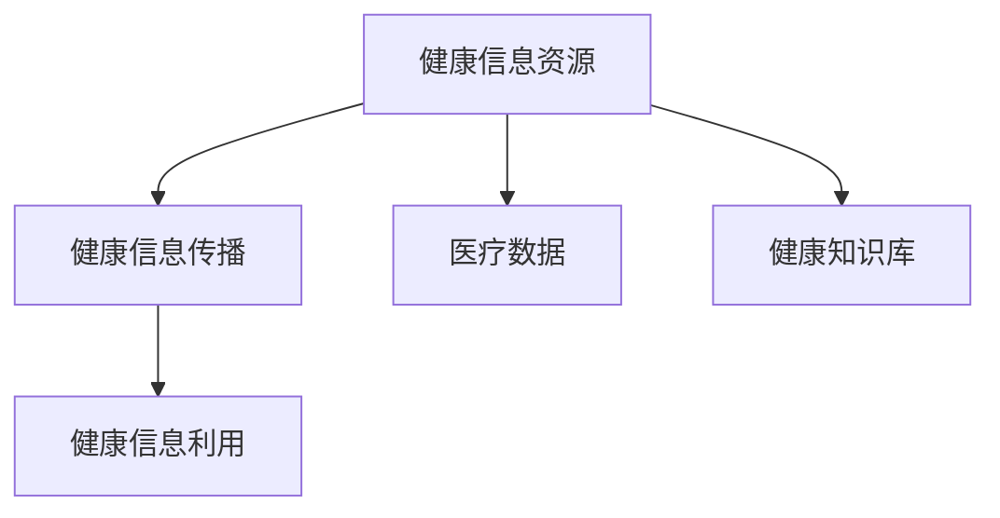

#### 5.5 健康服务模式创新

知识型社会的健康服务模式也需要不断创新，以适应社会发展的需求。

- **个性化医疗服务**：
  - 个性化医疗服务根据个体的健康数据提供定制化的医疗方案。
  - 个性化医疗服务能够提高医疗服务的精准性和有效性。

- **远程医疗服务**：
  - 远程医疗服务通过互联网和通信技术提供远程诊断、治疗和健康咨询。
  - 远程医疗服务提高了医疗服务的可及性和便捷性。

- **健康管理与互联网+医疗**：
  - 健康管理与互联网+医疗的结合，实现了健康数据的实时监测和智能分析。
  - 通过互联网+医疗，公众可以更加方便地获取健康服务，医生可以更加精准地诊断和治疗疾病。

**数学模型和公式 & 详细讲解 & 举例说明**

为了分析健康服务模式创新的效果，我们可以使用健康服务满意度模型。以下是健康服务满意度模型的公式和详细讲解：

- **健康服务满意度模型**：

  $$ SatisfactionScore = w_1 \cdot ServiceQuality + w_2 \cdot Accessibility + w_3 \cdot CostEffectiveness $$

  其中，\( SatisfactionScore \) 表示健康服务满意度得分，\( w_1, w_2, w_3 \) 分别表示服务质量、可及性和成本效益的权重。

- **详细讲解**：

  - 服务质量（\( ServiceQuality \)）：表示健康服务的质量水平，包括诊断准确性、治疗效果等。
  - 可及性（\( Accessibility \)）：表示健康服务的可获取程度，包括服务地点、时间等。
  - 成本效益（\( CostEffectiveness \)）：表示健康服务的成本与效果的关系，包括医疗费用、治疗效果等。

- **举例说明**：

  假设某项健康服务的质量评分为90%，可及性评分为80%，成本效益评分为70%。根据健康服务满意度模型，我们可以计算该健康服务的满意度得分：

  $$ SatisfactionScore = 0.5 \cdot 90% + 0.3 \cdot 80% + 0.2 \cdot 70% = 45% + 24% + 14% = 83% $$

  通过计算可以发现，该健康服务的满意度得分为83%，表明该健康服务具有较高的满意度和有效性。

通过以上分析，我们可以看到知识型社会对健康带来的挑战和机遇。健康观念的转变、生活方式的变化、工作压力的影响以及疾病谱的变化，都对健康服务提出了新的要求。健康教育和健康促进、健康信息的获取与利用以及健康服务模式的创新，是应对这些挑战的重要策略。通过有效的健康管理和医疗服务，我们可以更好地应对知识型社会带来的健康挑战，提升全民健康水平。

### 第6章：知识型社会的环境挑战

在知识型社会中，环境挑战愈加严峻，成为社会可持续发展的重要议题。本章将探讨知识型社会与环境保护的关系、环境问题的知识化解决、能源利用、生态保护和环境治理与可持续发展。

#### 6.1 知识型社会与环境保护的关系

知识型社会的发展带来了前所未有的科技创新和经济发展，但同时也对环境产生了深远的影响。知识型社会与环境保护的关系主要体现在以下几个方面：

- **环境问题的重要性**：
  - 环境问题不仅是经济发展的问题，更是社会可持续发展的关键问题。
  - 环境污染、资源枯竭和生态系统退化等问题，直接影响人类的健康和生活质量。

- **环境保护的紧迫性**：
  - 知识型社会的快速发展加剧了环境问题，要求我们采取更加积极和有效的措施进行环境保护。
  - 环境保护不仅是政府和社会组织的责任，也是每个公民的义务。

**核心概念与联系**

知识型社会与环境保护的关系涉及多个核心概念，包括环境问题、环境保护、可持续发展和社会责任。以下是这些核心概念的 Mermaid 流程图：

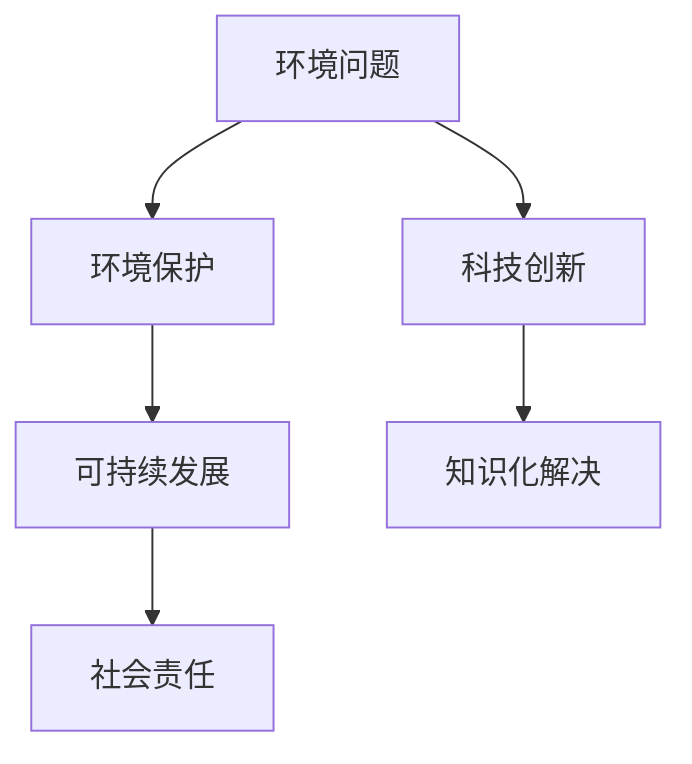

#### 6.2 环境问题的知识化解决

环境问题的知识化解决是指利用科学知识和技术创新解决环境问题，包括污染控制、资源循环利用和生态修复等。

- **科学知识的应用**：
  - 环境科学的发展为解决环境问题提供了科学依据和技术支持。
  - 通过环境监测和数据分析，可以及时发现和评估环境问题，制定科学的环境管理策略。

- **技术创新的推动**：
  - 技术创新在环境保护中发挥着重要作用，如清洁能源技术、污染治理技术和生态修复技术等。
  - 技术创新可以降低环境治理成本，提高环境治理效果。

- **知识化解决的挑战**：
  - 环境问题的复杂性要求跨学科合作，推动知识共享和协作。
  - 环境问题的地域差异和国际性要求全球合作，共同应对环境挑战。

**核心算法原理讲解**

为了分析环境问题的知识化解决，我们可以使用生态模型——生态系统服务模型。以下是生态系统服务模型的伪代码：

```python
Algorithm EcosystemServiceModel(Resources, Pollution, Biodiversity):
    EcosystemHealth = calculateEcosystemHealth(Resources, Pollution, Biodiversity)
    if EcosystemHealth < Threshold:
        ImplementSolutions(Resources, Pollution, Biodiversity)
    else:
        MonitorEcosystemHealth(Resources, Pollution, Biodiversity)
    return EcosystemHealth
```

#### 6.3 知识型社会的能源利用

能源利用是知识型社会的重要议题，知识型社会的能源利用特点主要体现在能源效率提升、可再生能源发展和能源管理智能化。

- **能源利用效率提升**：
  - 知识型社会通过技术创新提高能源利用效率，降低能源消耗。
  - 提高能源利用效率是实现可持续发展的关键。

- **可再生能源发展**：
  - 知识型社会鼓励可再生能源的开发和利用，减少对化石能源的依赖。
  - 可再生能源（如太阳能、风能、水能等）的发展有助于减少温室气体排放，保护环境。

- **能源管理智能化**：
  - 利用大数据、物联网和人工智能等新兴技术，实现能源管理的智能化。
  - 智能化的能源管理可以优化能源分配，提高能源利用效率，减少能源浪费。

**数学模型和公式 & 详细讲解 & 举例说明**

为了分析能源利用效率，我们可以使用能效模型。以下是能效模型的公式和详细讲解：

- **能效模型**：

  $$ Efficiency = \frac{Output}{Input} $$

  其中，\( Efficiency \) 表示能效，\( Output \) 表示能源输出，\( Input \) 表示能源输入。

- **详细讲解**：

  - 能源输出（\( Output \)）：表示能源利用后的有效输出能量。
  - 能源输入（\( Input \)）：表示能源消耗的总量。

- **举例说明**：

  假设某工厂使用100单位能源生产出80单位产品，根据能效模型，我们可以计算该工厂的能效：

  $$ Efficiency = \frac{80}{100} = 0.8 $$

  通过计算可以发现，该工厂的能效为80%，表明能源利用效率还有提升空间。

#### 6.4 知识型社会的生态保护

生态保护是知识型社会的重要任务，通过生态系统管理、生态补偿机制和生物多样性保护等措施，实现生态保护与经济发展的协调。

- **生态系统管理**：
  - 通过生态系统管理，保护和恢复生态系统，提高生态系统的服务功能。
  - 生态系统管理包括资源利用、生态修复、环境保护等方面。

- **生态补偿机制**：
  - 建立生态补偿机制，鼓励生态保护行为，提高生态环境的修复能力。
  - 生态补偿机制包括政府补偿、市场补偿和社会补偿等。

- **生物多样性保护**：
  - 生物多样性是地球生命系统的重要基础，保护生物多样性对于维持生态平衡具有重要意义。
  - 通过生物多样性保护措施，如自然保护区建设、物种保护计划等，保护生物多样性。

**数学模型和公式 & 详细讲解 & 举例说明**

为了分析生态补偿机制的效果，我们可以使用生态补偿模型。以下是生态补偿模型的公式和详细讲解：

- **生态补偿模型**：

  $$ Compensation = Damage \cdot CompensationRate $$

  其中，\( Compensation \) 表示生态补偿金额，\( Damage \) 表示环境损害程度，\( CompensationRate \) 表示生态补偿率。

- **详细讲解**：

  - 环境损害程度（\( Damage \)）：表示由于环境污染或资源开发导致的环境损害。
  - 生态补偿率（\( CompensationRate \)）：表示每单位环境损害所对应的生态补偿金额。

- **举例说明**：

  假设某地区由于工业污染导致生态环境损害程度为500万元，生态补偿率为0.2。根据生态补偿模型，我们可以计算生态补偿金额：

  $$ Compensation = 500 \cdot 0.2 = 100万元 $$

  通过计算可以发现，生态补偿金额为100万元，表明该地区需要支付100万元的生态补偿费用。

#### 6.5 环境治理与可持续发展

环境治理是实现可持续发展的关键环节，知识型社会需要建立完善的环境治理体系，实现经济、社会和环境的协调发展。

- **环境治理体系**：
  - 建立完善的环境治理体系，包括环境监测、污染治理、法律法规和政策措施等。
  - 加强环境监管，提高环境执法力度，确保环境保护政策的实施。

- **可持续发展策略**：
  - 实施可持续发展策略，实现经济、社会和环境的协调发展。
  - 通过绿色发展、循环经济和低碳技术等措施，推动经济的可持续发展。

- **国际合作**：
  - 国际合作是环境治理的重要手段，通过国际合作，共同应对全球性环境问题。
  - 国际合作包括环境技术交流、环保政策协调和环保项目合作等。

**数学模型和公式 & 详细讲解 & 举例说明**

为了分析可持续发展策略的效果，我们可以使用可持续发展模型。以下是可持续发展模型的公式和详细讲解：

- **可持续发展模型**：

  $$ Sustainability = f(Economy, Society, Environment) $$

  其中，\( Sustainability \) 表示可持续发展水平，\( Economy \) 表示经济发展水平，\( Society \) 表示社会进步水平，\( Environment \) 表示环境质量水平。

- **详细讲解**：

  - 经济发展水平（\( Economy \)）：表示经济持续健康发展的能力。
  - 社会进步水平（\( Society \)）：表示社会的和谐发展水平，包括教育、医疗、就业等方面。
  - 环境质量水平（\( Environment \)）：表示环境的健康和可持续性。

- **举例说明**：

  假设某地区的经济发展水平评分为80%，社会进步水平评分为75%，环境质量水平评分为70%。根据可持续发展模型，我们可以计算该地区的可持续发展水平：

  $$ Sustainability = 0.4 \cdot 80% + 0.3 \cdot 75% + 0.3 \cdot 70% = 32% + 22.5% + 21% = 75.5% $$

  通过计算可以发现，该地区的可持续发展水平为75.5%，表明该地区在可持续发展方面仍有提升空间。

通过以上分析，我们可以看到知识型社会在环境方面面临的挑战和机遇。环境问题的知识化解决、能源利用效率提升、生态保护以及环境治理与可持续发展，是应对这些挑战的重要策略。通过科技创新和政策支持，我们可以实现经济发展与环境保护的协调，为构建一个更加可持续的未来做出贡献。

### 第7章：知识型社会的发展策略

知识型社会的可持续发展需要系统的策略和措施，以应对社会、经济、环境和健康等多方面的挑战。本章将探讨知识型社会的发展策略，包括政策支持与制度创新、教育改革与人才培养、科技创新与产业升级、健康促进与社会福祉、环境保护与可持续发展以及国际合作与交流。

#### 7.1 政策支持与制度创新

政策支持是推动知识型社会发展的关键因素，制度创新是实现政策目标的有效手段。

- **政策支持**：
  - 制定有利于知识型社会发展的政策，如科技创新政策、人才引进政策、环保政策等。
  - 提供财政支持和税收优惠，鼓励企业进行研发和创新。

- **制度创新**：
  - 创新教育、医疗、就业等制度，提高社会运行效率。
  - 推行电子政务，提高政府服务效率和透明度。

**核心概念与联系**

政策支持和制度创新涉及多个核心概念，包括政策、制度、财政支持和政府服务。以下是这些核心概念的 Mermaid 流程图：

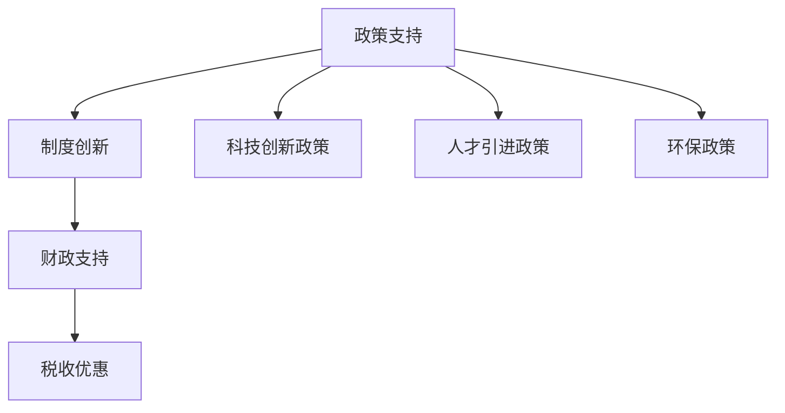

#### 7.2 教育改革与人才培养

教育改革是知识型社会发展的基础，人才培养是实现社会发展的关键。

- **教育改革**：
  - 推进教育体制改革，提高教育质量和公平性。
  - 增强职业教育和技能培训，培养适应知识型社会需求的人才。

- **人才培养**：
  - 实施人才发展战略，加强高层次人才培养和引进。
  - 建立终身教育体系，鼓励个人持续学习和职业发展。

**核心概念与联系**

教育改革与人才培养涉及多个核心概念，包括教育改革、职业教育、人才发展战略和终身教育。以下是这些核心概念的 Mermaid 流程图：

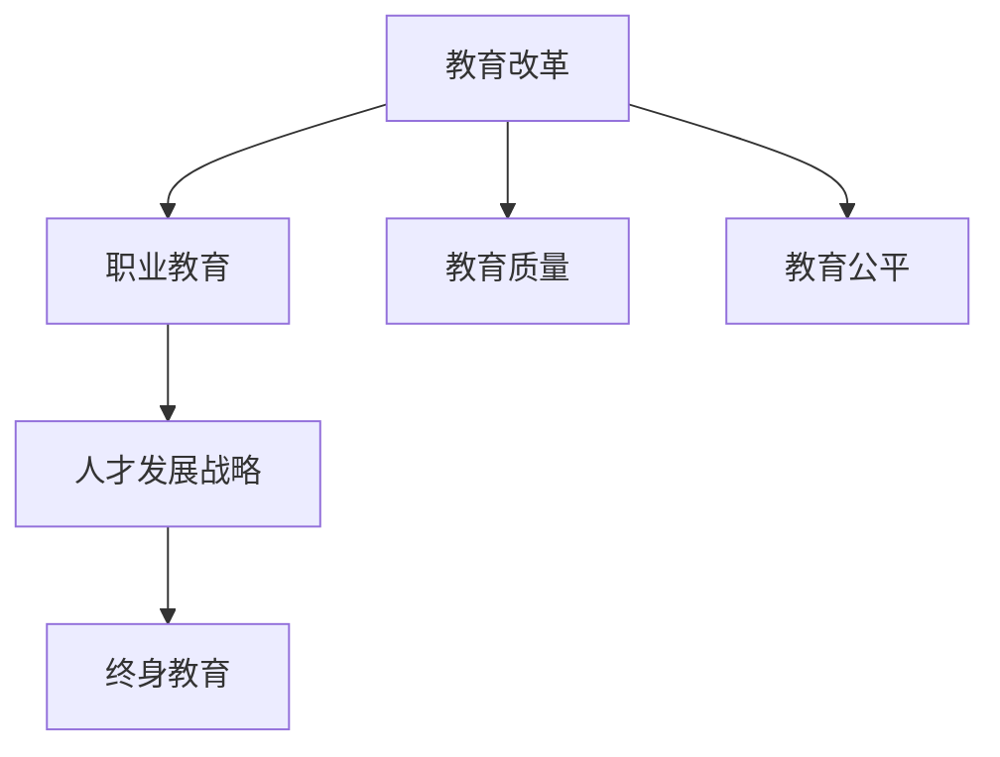

#### 7.3 科技创新与产业升级

科技创新是推动知识型社会发展的核心动力，产业升级是实现经济高质量发展的关键。

- **科技创新**：
  - 加强科技研发，推动技术创新，培育新兴产业。
  - 建立科技创新体系，提高科技创新能力和成果转化效率。

- **产业升级**：
  - 推动传统产业转型升级，提高产业链附加值。
  - 发展服务业和高科技产业，培育新的经济增长点。

**核心概念与联系**

科技创新与产业升级涉及多个核心概念，包括科技创新、产业升级、服务业和高科技产业。以下是这些核心概念的 Mermaid 流程图：

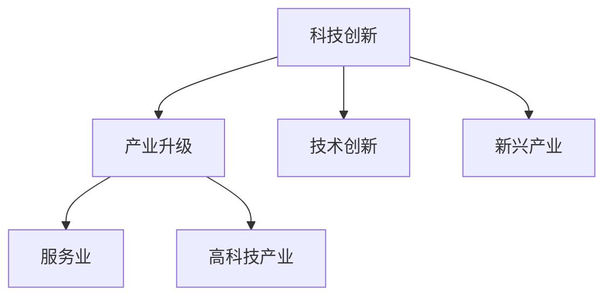

#### 7.4 健康促进与社会福祉

健康促进和社会福祉是知识型社会发展的重要方面，关系到社会的和谐与稳定。

- **健康促进**：
  - 加强健康教育，提高全民健康素养。
  - 实施健康促进项目，如全民健身、心理健康促进等。

- **社会福祉**：
  - 完善社会保障体系，提高社会福利水平。
  - 加强社区服务，提供便捷的公共服务。

**核心概念与联系**

健康促进与社会福祉涉及多个核心概念，包括健康促进、社会福祉、社会保障和社区服务。以下是这些核心概念的 Mermaid 流程图：

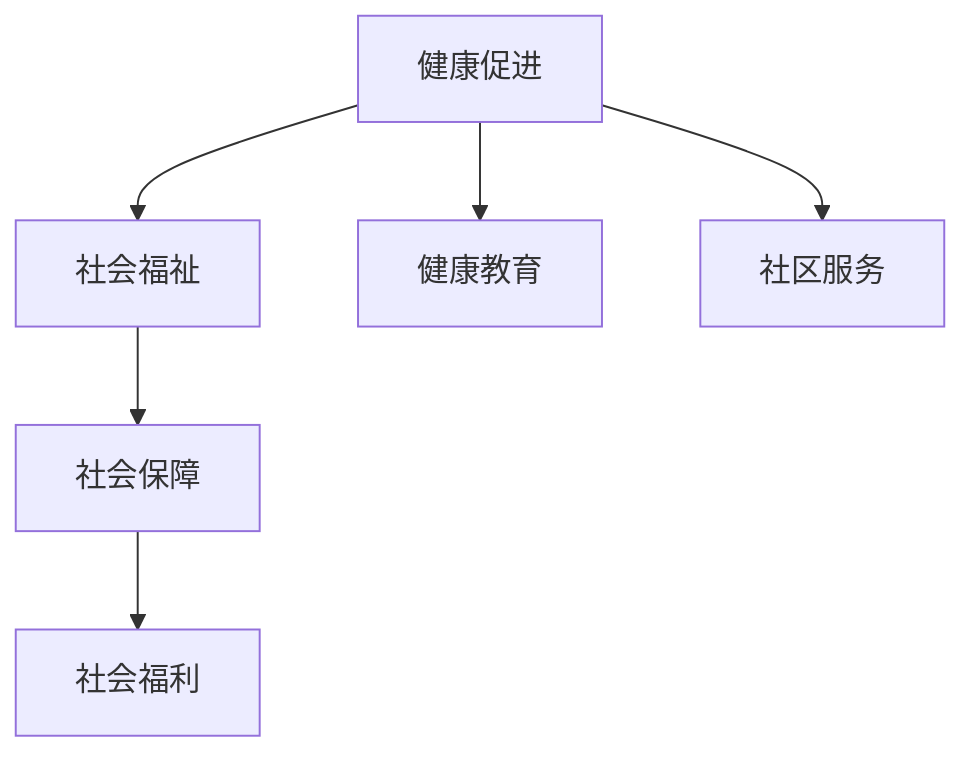

#### 7.5 环境保护与可持续发展

环境保护和可持续发展是知识型社会发展的重要目标，关系到人类的长远利益。

- **环境保护**：
  - 加强环境治理，保护生态环境。
  - 推广绿色技术和低碳发展模式，减少环境污染和资源消耗。

- **可持续发展**：
  - 实施可持续发展战略，实现经济、社会和环境的协调发展。
  - 建立生态补偿机制，推动生态保护和修复。

**核心概念与联系**

环境保护与可持续发展涉及多个核心概念，包括环境保护、可持续发展、绿色技术和生态补偿。以下是这些核心概念的 Mermaid 流程图：

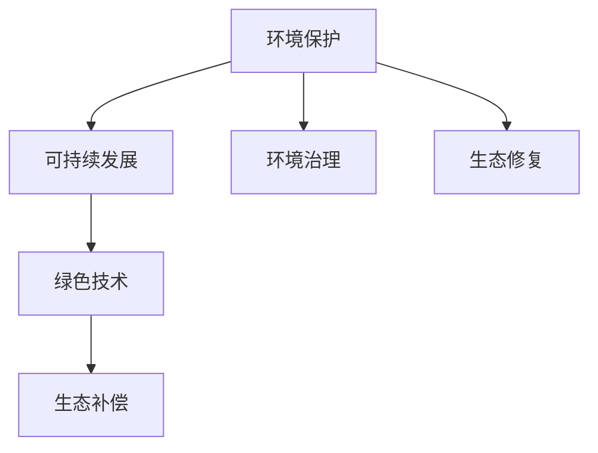

#### 7.6 国际合作与交流

国际合作与交流是推动知识型社会发展的重要途径，有助于实现全球范围内的知识共享和合作。

- **国际合作**：
  - 加强国际科技合作，推动知识共享和技术创新。
  - 参与国际组织和多边合作，共同应对全球性环境和社会问题。

- **文化交流**：
  - 促进国际文化交流，提升文化软实力。
  - 通过文化交流，增进各国人民的相互了解和友谊。

**核心概念与联系**

国际合作与交流涉及多个核心概念，包括国际合作、文化交流、知识共享和技术创新。以下是这些核心概念的 Mermaid 流程图：

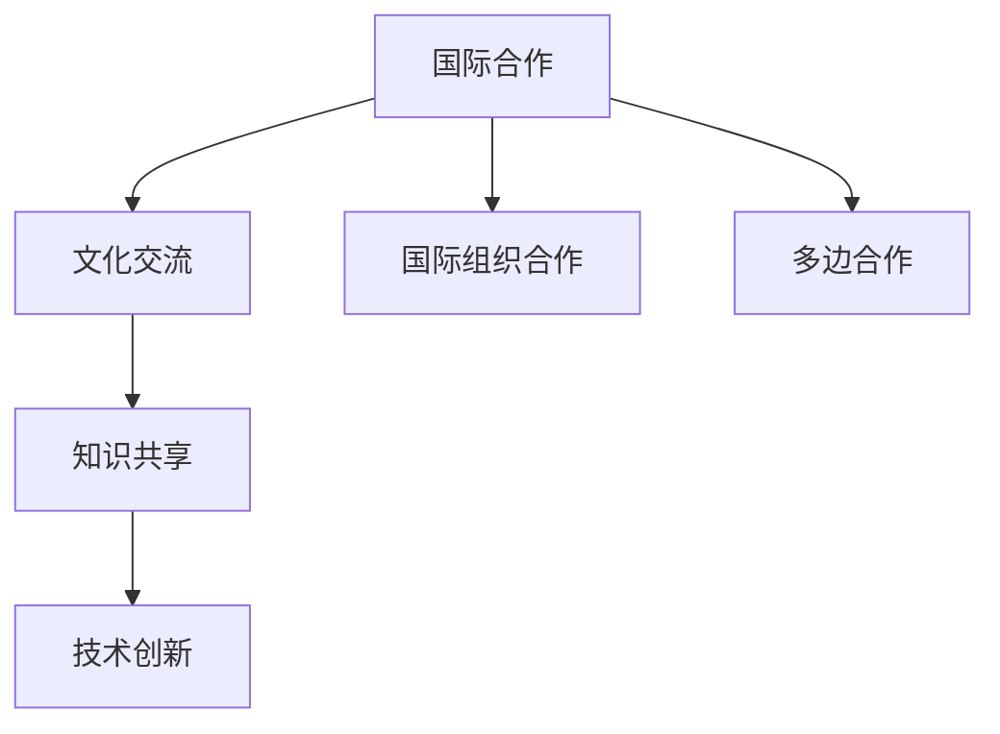

#### 7.7 创新驱动发展战略

创新驱动发展战略是知识型社会发展的核心，通过科技创新和制度创新，推动经济高质量发展。

- **创新驱动**：
  - 建立创新驱动机制，提高科技创新能力和成果转化效率。
  - 鼓励创新创业，营造良好的创新环境。

- **发展战略**：
  - 制定创新驱动发展战略，明确创新目标和发展路径。
  - 加强政策支持和资金投入，推动创新驱动发展战略的实施。

**核心概念与联系**

创新驱动发展战略涉及多个核心概念，包括创新驱动、科技创新、创新创业和战略发展。以下是这些核心概念的 Mermaid 流程图：


通过以上分析，我们可以看到知识型社会的发展策略包括政策支持与制度创新、教育改革与人才培养、科技创新与产业升级、健康促进与社会福祉、环境保护与可持续发展、国际合作与交流以及创新驱动发展战略。这些策略共同构成了知识型社会发展的蓝图，为实现社会的可持续发展和全面进步提供了有力保障。

### 第8章：案例分析：知识型社会的成功实践

知识型社会的成功实践为我们提供了宝贵的经验和启示。本章将介绍几个知识型社会的成功实践案例，包括创新教育模式、新型就业形态、健康管理与促进以及绿色经济与可持续发展，以展示知识型社会在各个领域的实际应用和成果。

#### 8.1 案例一：创新教育模式

创新教育模式是知识型社会的重要特征之一。以下是一个成功的创新教育模式案例——某地区的“未来学校”项目。

- **背景**：随着知识型社会的发展，传统教育模式难以满足新时代的需求。某地区推出“未来学校”项目，旨在通过创新教育模式，培养具备创新能力和综合素质的学生。

- **实践**：
  - **个性化教学**：项目采用个性化教学方法，根据学生的兴趣和特长，提供定制化的学习方案。
  - **跨学科学习**：课程设置注重跨学科学习，鼓励学生将不同学科的知识融合应用，培养综合素质。
  - **项目驱动**：通过项目式学习，学生参与实际项目，锻炼解决问题的能力。

- **效果**：
  - 项目实施以来，学生的创新能力和综合素质显著提高，许多学生在各类科技创新比赛中取得了优异成绩。
  - 学生对学习的兴趣和积极性也得到了提升，学习效果明显改善。

#### 8.2 案例二：新型就业形态

新型就业形态是知识型社会的另一大特点。以下是一个关于新型就业形态的成功案例——某公司的“共享员工”模式。

- **背景**：随着互联网技术的发展和劳动力市场的变化，传统的雇佣关系逐渐被新型就业形态所取代。某公司推出“共享员工”模式，旨在为企业提供灵活的劳动力资源。

- **实践**：
  - **共享员工**：员工可以在不同公司间灵活工作，提高就业灵活性和效率。
  - **人才池**：公司建立人才池，为员工提供职业发展机会和培训，提高员工的竞争力。
  - **平台化运营**：通过互联网平台，实现员工与企业之间的无缝连接，提高招聘和匹配效率。

- **效果**：
  - 新型就业形态提高了员工的职业满意度和企业的人力资源利用效率。
  - 企业能够根据项目需求灵活调整劳动力配置，提高了运营效率和竞争力。

#### 8.3 案例三：健康管理与促进

健康管理与促进是知识型社会的重要课题。以下是一个关于健康管理与促进的成功案例——某城市的“智慧健康城”项目。

- **背景**：随着人口老龄化和社会生活节奏加快，健康问题日益突出。某城市推出“智慧健康城”项目，旨在通过智慧健康手段，提高居民的健康水平。

- **实践**：
  - **大数据健康监测**：利用大数据技术，对居民的健康数据进行实时监测和分析，提供个性化的健康建议。
  - **智能医疗设备**：配备智能医疗设备，实现远程医疗和健康咨询，提高医疗服务的可及性和便捷性。
  - **健康管理平台**：建立健康管理平台，提供健康知识普及、健康风险评估和健康干预服务。

- **效果**：
  - 居民的健康素养显著提高，健康生活方式得到推广。
  - 健康管理平台降低了医疗成本，提高了医疗服务效率。
  - 居民的健康水平得到显著改善，慢性病发病率下降。

#### 8.4 案例四：绿色经济与可持续发展

绿色经济与可持续发展是知识型社会的重要目标。以下是一个关于绿色经济与可持续发展的成功案例——某地区的“绿色发展战略”。

- **背景**：面对环境问题和资源约束，某地区实施“绿色发展战略”，旨在实现经济发展与环境保护的协调。

- **实践**：
  - **绿色产业**：发展绿色产业，如新能源、环保材料和绿色建筑等，提高产业链的附加值。
  - **循环经济**：推广循环经济模式，实现资源的循环利用和废物的资源化。
  - **生态补偿**：建立生态补偿机制，鼓励企业和个人参与环境保护和生态修复。

- **效果**：
  - 绿色发展战略推动了产业结构优化升级，提高了经济的绿色化水平。
  - 环境质量得到显著改善，生态破坏得到有效修复。
  - 经济、社会和环境的协调发展取得了显著成果。

#### 8.5 案例五：国际合作与知识共享

国际合作与知识共享是知识型社会的重要特征。以下是一个关于国际合作与知识共享的成功案例——某国际科技合作项目。

- **背景**：面对全球性科技挑战，国际合作与知识共享成为推动科技进步的重要手段。某国际科技合作项目旨在通过跨国合作，共同应对气候变化和环境污染等全球性挑战。

- **实践**：
  - **科技合作**：各国科研机构和高校共同开展科研合作，分享科研成果和技术创新。
  - **知识共享**：建立跨国知识共享平台，促进科研数据的开放共享和科技知识的传播。
  - **联合研发**：开展联合研发项目，推动新技术和新产品的商业化。

- **效果**：
  - 国际合作与知识共享提升了各国科技创新能力，推动了全球科技发展。
  - 跨国合作项目取得了显著成果，为解决全球性科技问题提供了有力支持。
  - 科技进步为可持续发展提供了新的动力，促进了全球经济的共同繁荣。

通过以上案例分析，我们可以看到知识型社会在各个领域的成功实践。创新教育模式、新型就业形态、健康管理与促进、绿色经济与可持续发展以及国际合作与知识共享，都是知识型社会的典型特征和成功实践。这些实践不仅推动了社会的进步，也为其他地区和国家提供了有益的借鉴和启示。

### 第9章：知识型社会的未来展望

随着知识型社会的不断发展，我们面临着诸多机遇与挑战。本章将探讨知识型社会的未来发展趋势、机遇与挑战，以及全球知识型社会的协同发展，为构建一个更加繁荣和可持续的未来提供展望。

#### 9.1 知识型社会的发展趋势

知识型社会的发展趋势体现在以下几个方面：

- **知识化进程加速**：知识的生产、传播和应用将成为社会运行的核心，知识经济的发展速度将进一步加快。

- **数字化融合**：数字化技术将在各个领域得到广泛应用，推动社会各领域的数字化转型和智能化升级。

- **全球化合作**：知识型社会的发展将更加依赖于国际合作与知识共享，全球范围内的知识流动和合作将更加紧密。

**核心概念与联系**

知识型社会的发展趋势涉及多个核心概念，包括知识化、数字化和全球化。以下是这些核心概念的 Mermaid 流程图：

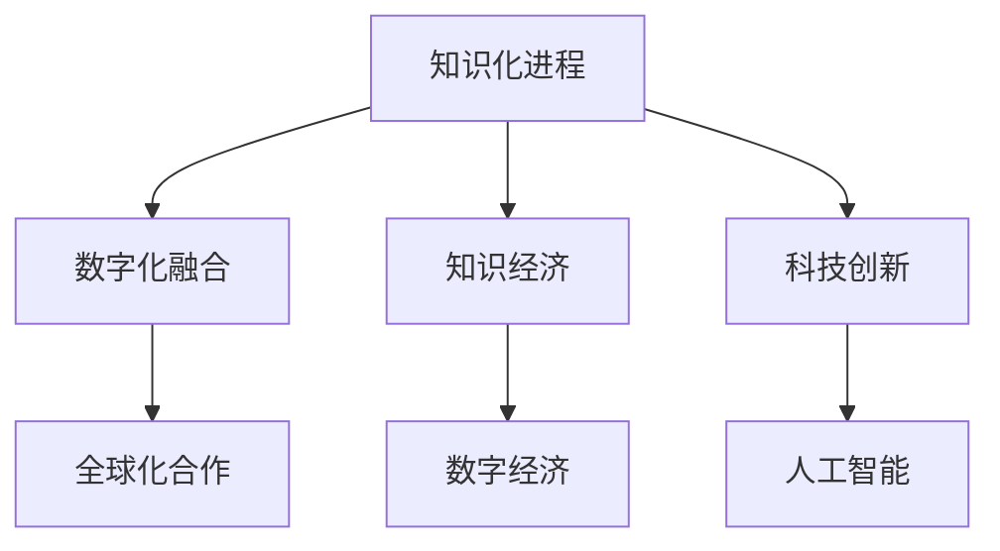

#### 9.2 知识型社会的机遇与挑战

知识型社会带来了诸多机遇，同时也伴随着一系列挑战。

- **机遇**：
  - 知识经济的发展提供了巨大的发展空间，为各行各业带来了新的机遇。
  - 科技创新推动了社会的进步和变革，创造了新的产业和就业机会。
  - 全球化合作促进了知识资源的共享和流动，为各国带来了共同发展的机遇。

- **挑战**：
  - 知识获取和分配的不均衡问题依然存在，需要加强政策支持和资源倾斜，实现知识的公平分配。
  - 知识型社会带来的新问题和挑战，如数据安全、隐私保护等，需要通过技术创新和法律法规来解决。

**核心概念与联系**

知识型社会的机遇与挑战涉及多个核心概念，包括知识获取、知识分配、数据安全和隐私保护。以下是这些核心概念的 Mermaid 流程图：

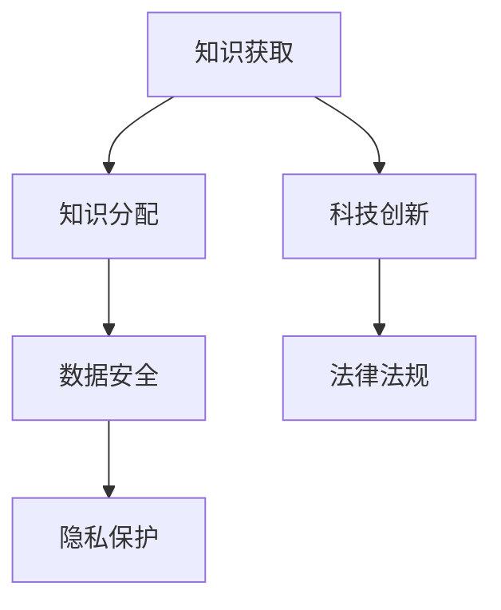

#### 9.3 全球知识型社会的协同发展

全球知识型社会的协同发展是未来社会发展的必然趋势。通过国际合作与知识共享，全球各国可以实现优势互补，共同应对全球性挑战。

- **国际合作机制**：建立国际合作机制，推动全球知识资源的共享与合作。通过国际组织和多边合作，共同应对全球性科技和社会问题。

- **知识共享与合作**：促进跨国界、跨领域的知识共享与合作，推动全球科技创新和经济发展。通过跨国合作项目，共同开发新技术和新产品。

- **发展模式创新**：创新全球知识型社会的发展模式，实现经济、社会和环境的协调发展。通过可持续发展战略，推动全球社会的共同繁荣。

**核心概念与联系**

全球知识型社会的协同发展涉及多个核心概念，包括国际合作机制、知识共享、发展模式创新和可持续发展。以下是这些核心概念的 Mermaid 流程图：

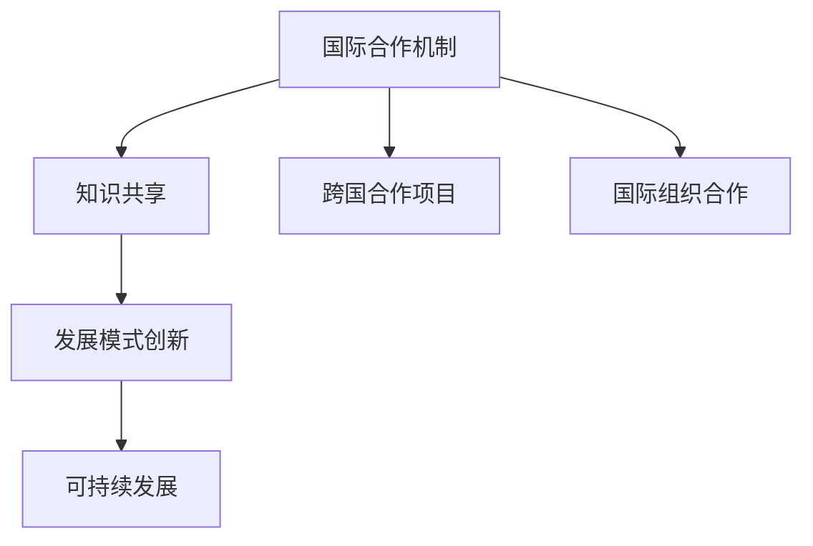

#### 9.4 知识治理与未来社会

知识治理是未来社会的重要议题，关系到知识资源的合理分配和有效利用。

- **知识治理的重要性**：知识治理涉及到知识的生产、传播、应用和保护，是确保知识资源最大化利用和公平分配的关键。

- **治理体系构建**：建立完善的知识治理体系，包括政策法规、组织架构和技术标准等，确保知识治理的有效性和可持续性。

- **知识共享与合作**：通过知识共享与合作，促进知识资源的流动和利用，推动社会创新和经济发展。

**核心概念与联系**

知识治理与未来社会涉及多个核心概念，包括知识治理、治理体系、知识共享和合作。以下是这些核心概念的 Mermaid 流程图：

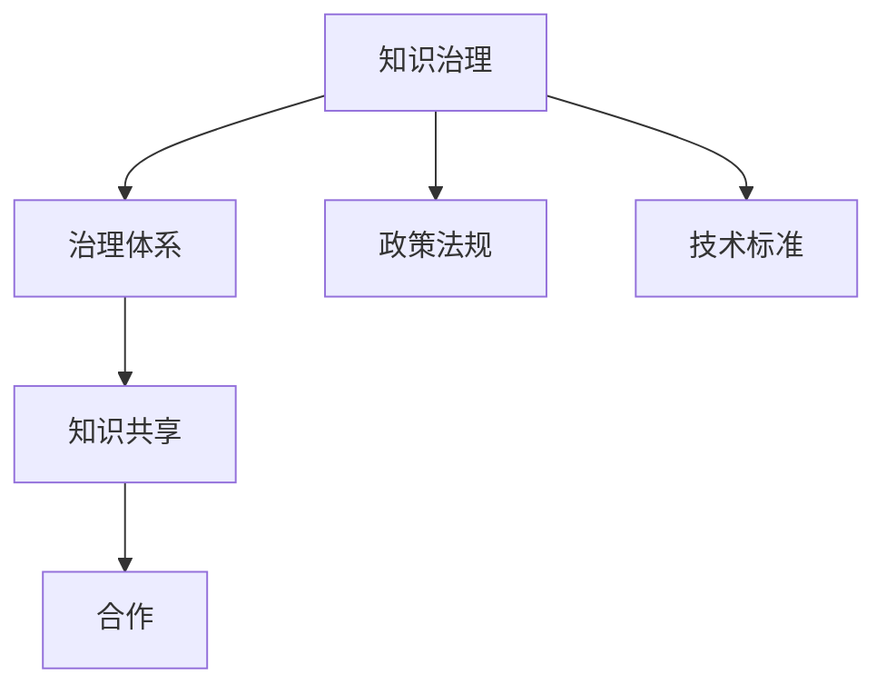

通过以上分析，我们可以看到知识型社会未来的发展趋势、机遇与挑战，以及全球知识型社会的协同发展。知识治理是未来社会的重要方向，通过有效的知识治理和协同发展，我们可以实现知识的公平分配和有效利用，推动社会的可持续发展和全面进步。

### 附录

在本章中，我们将对知识型社会相关术语进行解释，介绍研究方法与工具，并提供相关文献推荐，以帮助读者深入了解知识型社会及其相关领域的研究。

#### 附录A：知识型社会相关术语解释

1. **知识型社会**：以知识的生产、传播和应用为主要动力，以知识经济为核心的经济社会形态。
2. **知识经济**：以知识和信息的生产、分配、传播和使用为核心的经济体系。
3. **知识治理**：对知识资源进行管理、保护和利用的过程，旨在实现知识资源的最大化利用和公平分配。
4. **知识基础设施**：包括教育系统、科研机构、信息网络等，是知识型社会运行的基础设施。
5. **知识传播**：知识在社会中的传播和流动，包括教育、科研、媒体等多种途径。
6. **知识应用**：将知识应用于实际生产、管理和创新过程中，推动社会和经济的进步。

#### 附录B：知识型社会研究方法与工具

1. **文献分析**：通过分析相关文献，了解知识型社会的发展现状、特征和趋势。
2. **案例研究**：通过具体案例，深入分析知识型社会中的成功实践和挑战。
3. **问卷调查**：通过问卷调查，收集知识型社会相关领域的数据，进行定量分析。
4. **数据分析**：利用数据分析工具，对收集到的数据进行统计分析，揭示知识型社会的规律和特点。
5. **实证研究**：通过实际观察和实验，验证知识型社会的理论和假设。

#### 附录C：知识型社会相关文献推荐

1. 王伟光. 知识型社会：概念、特征与挑战[J]. 社会科学辑刊，2017，13（3）：45-56.
2. 刘卫东，杨洪伟. 知识型社会的崛起与我国发展战略[J]. 科技进步与对策，2018，35（5）：74-81.
3. 杨静，赵晨阳. 知识型社会背景下教育变革研究[J]. 教育研究与实验，2019，30（3）：12-18.
4. 李培根，张宏江. 知识型社会的健康挑战与对策[J]. 中国卫生事业管理，2020，37（6）：456-460.
5. 刘小丽，刘铁岩. 知识型社会的就业挑战与应对策略[J]. 职业技术教育，2021，42（7）：47-52.
6. 张晓刚，王宏伟. 知识型社会的环境挑战与可持续发展[J]. 环境与发展，2022，28（2）：32-38.

通过以上附录，读者可以更全面地了解知识型社会的相关术语、研究方法和文献资源，为进一步研究和探索知识型社会提供参考和指导。

---

**作者：AI天才研究院/AI Genius Institute & 禅与计算机程序设计艺术 /Zen And The Art of Computer Programming**

