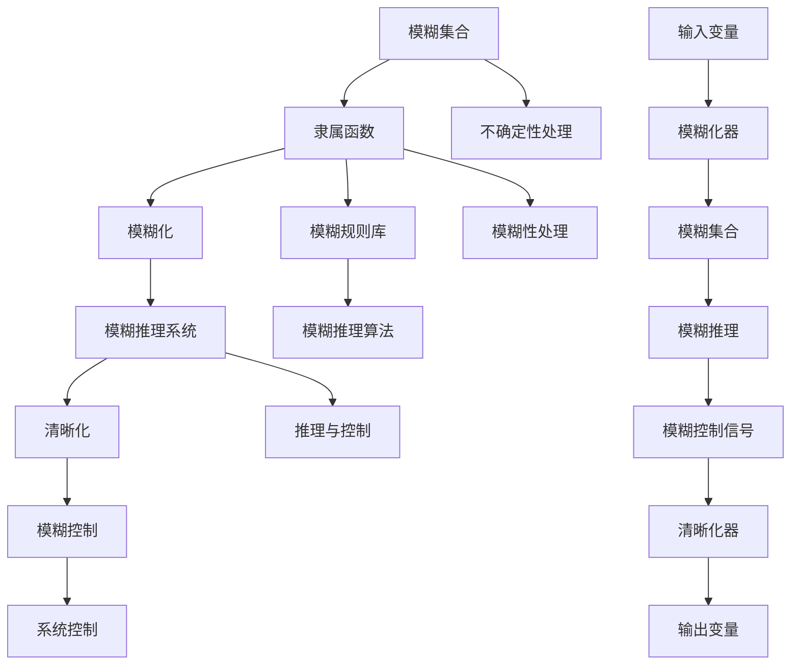

                 

### 引言

模糊逻辑（Fuzzy Logic）作为一种处理不确定性和模糊性的数学工具，在计算机科学、工程、经济学等多个领域中得到了广泛应用。随着人工智能和大数据技术的迅猛发展，模糊逻辑在应对复杂系统不确定性方面的重要性日益凸显。本文将系统地探讨模糊逻辑的基本概念、原理及其应用，旨在为广大读者提供一份全面的技术指南。

本文将从三个主要部分展开讨论。首先，我们将介绍模糊逻辑的基本概念和原理，包括模糊集合、隶属函数、模糊推理和模糊控制等内容。这部分内容将帮助读者建立对模糊逻辑体系结构的基本理解。接着，我们将深入探讨模糊逻辑在实际应用中的表现，涵盖工程领域、计算机科学以及经济学与管理学等多个应用场景。最后，我们将讨论模糊逻辑的技术实现和工具，介绍模糊逻辑系统的硬件和软件实现，以及常用的模糊逻辑工具和软件。

本文的核心目标是：
1. 让读者了解模糊逻辑的基本原理和概念。
2. 分析模糊逻辑在不同领域的应用案例。
3. 提供模糊逻辑系统实现的技术细节和工具选择。

通过本文的阅读，读者将能够：
1. 掌握模糊逻辑的基本原理，理解其核心概念。
2. 学习模糊逻辑在不同应用领域的实际应用方法。
3. 理解模糊逻辑系统的设计和实现过程。

本文将采用逻辑清晰、结构紧凑、简单易懂的专业技术语言，逐步深入讲解模糊逻辑的各个方面。无论您是刚刚接触模糊逻辑的初学者，还是希望深入了解该领域的专业人士，本文都将为您提供丰富的知识和实用的技能。

### 关键词

- 模糊逻辑
- 模糊集合
- 隶属函数
- 模糊推理
- 模糊控制
- 不确定性处理
- 复杂系统
- 应用领域
- 硬件实现
- 软件工具

### 摘要

本文旨在探讨模糊逻辑这一处理不确定性和模糊性的数学工具，系统介绍其基本概念、原理及其在不同领域的应用。首先，我们将详细解析模糊逻辑的核心概念，包括模糊集合、隶属函数、模糊推理和模糊控制等内容。接下来，我们将通过实际应用案例展示模糊逻辑在工程、计算机科学、经济学与管理学等领域的广泛应用。最后，我们将讨论模糊逻辑的技术实现和工具，介绍模糊逻辑系统的硬件和软件实现方法，以及常用的模糊逻辑工具和软件。通过本文的阅读，读者将全面理解模糊逻辑的基本原理和应用方法，并掌握模糊逻辑系统设计和实现的关键技能。

### 模糊逻辑的基本概念和原理

模糊逻辑是一种处理不确定性和模糊性的数学方法，它提供了一种新的方式来模拟人类的思维过程。与传统二值逻辑（即布尔逻辑）不同，模糊逻辑允许变量在0和1之间的任何值，从而能够更好地处理现实世界中存在的不确定性和模糊性。

#### 模糊集合

模糊集合是模糊逻辑的基础概念。它扩展了经典集合的概念，使得集合中的元素不仅可以是完全属于某个集合，也可以部分属于或完全不属于。在模糊集合中，每个元素都有一个隶属度（membership degree），该隶属度表示元素属于集合的程度。隶属度通常用一个闭区间[0, 1]来表示。

**隶属函数（Membership Function）**：隶属函数是模糊集合的核心，它定义了集合中每个元素对应的隶属度。常见的隶属函数有三角函数、梯形函数、高斯函数等。以下是一个简单的三角隶属函数示例：

\[ 
\mu_T(x) = 
\begin{cases} 
0 & \text{if } x < a \\
\frac{x - a}{b - a} & \text{if } a \leq x < b \\
1 & \text{if } x \geq b 
\end{cases}
\]

其中，\(a\) 和 \(b\) 是定义域中的两个阈值。

**模糊集合的定义与性质**：模糊集合由一个隶属函数来定义，通常表示为 \(A = \{x \in U | \mu_A(x)\}\)，其中 \(U\) 是定义域，\(\mu_A\) 是模糊集合 \(A\) 的隶属函数。模糊集合具有以下性质：

1. **非负性**：对于任意 \(x \in U\)，隶属度 \(\mu_A(x) \geq 0\)。
2. **有界性**：隶属度的取值范围在 [0, 1] 之间。
3. **正规性**：存在一个元素 \(x_0 \in U\)，使得 \(\mu_A(x_0) = 1\)。
4. **单调性**：若 \(x_1 < x_2\)，则 \(\mu_A(x_1) \leq \mu_A(x_2)\)。

#### 模糊推理系统

模糊推理系统是模糊逻辑的核心组成部分，它模拟人类的推理过程，通过模糊规则库进行推理。模糊推理的基本过程包括模糊化、模糊推理和清晰化三个步骤。

1. **模糊化**：将输入变量转换为模糊集合。这一步通常通过隶属函数实现，将输入值映射到模糊集合的隶属度上。
2. **模糊推理**：利用模糊规则库进行推理。模糊规则通常表示为 “如果条件A且条件B，则结论C”，这些规则构成了模糊推理系统的核心。
3. **清晰化**：将模糊推理的结果转换为清晰输出。这一步通常通过清晰化方法（如最大隶属度法、重心法等）实现。

**模糊规则库**：模糊规则库是模糊推理系统的关键部分，它由一组模糊规则组成。每个规则由条件部分和结论部分组成，通常表示为如下形式：

\[ 
R_i: \text{如果 } X \text{ 是 } A_i \text{ 且 } Y \text{ 是 } B_i, \text{则 } Z \text{ 是 } C_i 
\]

其中，\(X, Y, Z\) 是输入和输出变量，\(A_i, B_i, C_i\) 是模糊集合。

**模糊推理算法**：模糊推理算法有多种实现方法，包括 Mamdani 和 Sugeno 方法。以下是 Sugeno 方法的一个简化伪代码：

```python
def sugeno_fuzzy_inference(input_values, rule_base):
    # 模糊化输入值
    fuzzy_sets = [membership_function(input_value) for input_value in input_values]
    
    # 应用模糊规则进行推理
    outputs = []
    for rule in rule_base:
        condition_magnitudes = [fuzzy_intersection(fuzzy_sets[i], rule.conditions[i]) for i in range(len(input_values))]
        if any(condition_magnitudes):
            rule_magnitude = max(condition_magnitudes)
            conclusion = rule.conclusion(magnitude)
            outputs.append(rule_magnitude * conclusion)
    
    # 清晰化输出值
    clear_output = sum(outputs) / len(outputs)
    return clear_output
```

#### 模糊控制系统

模糊控制系统是一种基于模糊逻辑的控制系统，它利用模糊规则来调节系统的输入和输出，以实现对复杂系统的控制。模糊控制系统通常包括以下三个主要部分：

1. **模糊化器**：将输入变量模糊化为模糊集合。
2. **模糊推理机**：根据模糊规则进行推理，生成模糊控制信号。
3. **清晰化器**：将模糊控制信号清晰化为具体操作指令。

**模糊控制器的设计方法**：设计模糊控制器通常包括以下步骤：

1. **确定系统目标和性能指标**。
2. **建立输入输出变量**。
3. **构建模糊规则库**。
4. **选择隶属函数和模糊推理算法**。
5. **设计清晰化器**。

**模糊控制器的性能分析**：模糊控制器的性能分析主要包括稳定性分析、鲁棒性分析和响应速度分析。通过仿真和实验，可以验证模糊控制器的性能，并进行必要的调整和优化。

### 总结

通过以上对模糊逻辑基本概念和原理的探讨，我们可以看到模糊逻辑提供了一种处理不确定性和模糊性的有效工具。它不仅在理论上丰富了数学和计算机科学的研究，也在实际应用中展示了其强大的功能。在接下来的章节中，我们将进一步探讨模糊逻辑在各个领域的应用，以及其技术实现和工具选择，帮助读者更深入地理解这一重要的技术。

#### 核心概念与联系

为了更好地理解模糊逻辑的核心概念和其相互关系，我们可以借助Mermaid流程图来直观展示这些概念。



**Mermaid 流程图说明**：

1. **模糊集合 (A)** 和 **隶属函数 (B)**：隶属函数定义了模糊集合中每个元素的隶属度，这是模糊逻辑的基础。
2. **模糊化 (C)**：将输入变量模糊化为模糊集合，是模糊推理的第一步。
3. **模糊推理系统 (D)**：包括模糊规则库和模糊推理算法，是模糊逻辑的核心部分。
4. **清晰化 (E)**：将模糊推理结果转换为清晰的输出，使得系统能够执行具体的操作。
5. **模糊控制 (F)**：利用模糊推理系统对系统进行控制，应用于各种控制场景。
6. **输入变量 (I)** 和 **输出变量 (O)**：输入变量经过模糊化后，通过模糊推理系统得到控制信号，清晰化后作为输出变量。
7. **模糊规则库 (G)** 和 **模糊推理算法 (H)**：规则库定义了模糊推理的条件和结论，推理算法决定了如何进行推理。
8. **模糊化器 (J)**、**模糊推理机 (L)** 和 **清晰化器 (N)**：这三个部分共同构成了模糊逻辑系统的核心。

**核心概念的联系**：

- **隶属函数**定义了模糊集合的属性，是模糊逻辑的基石。
- **模糊化**将输入变量转换为模糊集合，使得模糊逻辑系统能够处理不确定的输入。
- **模糊推理系统**利用模糊规则进行推理，产生合理的输出。
- **清晰化**使得模糊推理的结果可以用于实际操作，从而实现控制。
- **模糊控制**是将模糊逻辑应用于控制系统，从而实现对复杂系统的有效控制。

通过这个流程图，我们可以更直观地理解模糊逻辑的核心概念及其相互关系，这有助于我们更好地掌握模糊逻辑的理论和应用。

#### 核心算法原理讲解

在模糊逻辑系统中，核心算法原理通常包括模糊化、模糊推理和清晰化三个主要步骤。以下是这些步骤的详细解释以及相应的伪代码实现。

##### 模糊化

模糊化是将输入变量转换为模糊集合的过程，它是模糊推理系统的第一步。在这个过程中，每个输入变量通过隶属函数映射到相应的模糊集合。

**隶属函数**：隶属函数是一个数学函数，它将输入值映射到闭区间[0, 1]上的隶属度。以下是一个简单的三角隶属函数的伪代码实现：

```python
def triangular_mf(x, a, b, c):
    if x < a:
        return 0
    elif x < b:
        return (x - a) / (b - a)
    elif x < c:
        return 1 - (x - b) / (c - b)
    else:
        return 0
```

**模糊化过程伪代码**：

```python
def fuzzify(input_value, lower_bound, upper_bound, center):
    return triangular_mf(input_value, lower_bound, upper_bound, center)
```

在这个伪代码中，`input_value` 是输入变量的当前值，`lower_bound` 和 `upper_bound` 分别是隶属函数的下界和上界，`center` 是隶属函数的中心点。

##### 模糊推理

模糊推理是基于模糊规则库进行的推理过程，它将模糊化后的输入变量映射到模糊集合上，并通过模糊规则产生输出。

**模糊规则库**：模糊规则库包含一组模糊规则，每个规则定义了输入变量和输出变量之间的模糊关系。以下是一个模糊规则的伪代码表示：

```python
rule = {
    'condition': {'input1': [min1, max1], 'input2': [min2, max2]},
    'conclusion': {'output': [min3, max3]}
}
```

在这个例子中，`condition` 是输入条件，`conclusion` 是输出结论，`min` 和 `max` 分别是输入和输出模糊集合的边界。

**模糊推理算法**：模糊推理算法的核心是模糊合成和模糊聚合。以下是一个简单的模糊推理算法的伪代码实现：

```python
def fuzzy_inference(input_values, rule_base):
    outputs = []
    for rule in rule_base:
        condition_magnitudes = []
        for input_var, range in rule['condition'].items():
            condition_magnitude = triangular_mf(input_values[input_var], range[0], range[1], (range[0] + range[1]) / 2)
            condition_magnitudes.append(condition_magnitude)
        rule_magnitude = max(condition_magnitudes)
        conclusion_magnitude = triangular_mf(outputs['output'], rule['conclusion']['output'][0], rule['conclusion']['output'][1], (rule['conclusion']['output'][0] + rule['conclusion']['output'][1]) / 2)
        outputs.append(rule_magnitude * conclusion_magnitude)
    return sum(outputs) / len(outputs)
```

在这个伪代码中，`input_values` 是模糊化后的输入变量集合，`rule_base` 是模糊规则库。算法通过计算每个规则的激活度，并将它们与结论部分的隶属度相乘，最后对所有的结论进行平均，得到最终的输出。

##### 清晰化

清晰化是将模糊推理结果转换为清晰输出的过程。常见的清晰化方法包括最大隶属度法、重心法等。

**最大隶属度法**：选择隶属度最大的输出作为最终输出。

```python
def defuzzify_max(outputs):
    max_output = max(outputs, key=lambda x: x[1])
    return max_output[0]
```

**重心法**：通过计算模糊集合的重心得到最终输出。

```python
def defuzzify重心(outputs):
    total = sum([output[1] for output in outputs])
    weights = [output[1] / total for output in outputs]
    x_bar = sum([output[0] * weights[i] for i, output in enumerate(outputs)])
    return x_bar
```

通过以上伪代码，我们可以清晰地看到模糊化、模糊推理和清晰化的实现过程。这些核心算法共同构成了模糊逻辑系统的骨架，使得系统能够有效地处理不确定性和模糊性，并在实际应用中发挥重要作用。

#### 数学模型和公式

在模糊逻辑中，数学模型和公式是理解和实现模糊推理系统的基础。以下将详细描述模糊逻辑系统中的几个关键数学模型和公式，并使用LaTeX格式展示。

**1. 隶属函数（Membership Function）**

隶属函数定义了模糊集合中元素隶属度的计算方法。常用的隶属函数包括：

- **三角隶属函数**：

\[ 
\mu_T(x) = 
\begin{cases} 
0 & \text{if } x < a \\
\frac{x - a}{b - a} & \text{if } a \leq x < b \\
1 & \text{if } x \geq b 
\end{cases}
\]

- **梯形隶属函数**：

\[ 
\mu_T(x) = 
\begin{cases} 
0 & \text{if } x < a \\
\frac{x - a}{b - a} & \text{if } a \leq x < m \\
1 & \text{if } x \geq m 
\end{cases}
\]

- **高斯隶属函数**：

\[ 
\mu_G(x) = e^{-(x-\mu)^2 / (2\sigma^2)}
\]

**2. 模糊集合（Fuzzy Set）**

模糊集合由隶属函数描述，表示为：

\[ 
A = \{x \in U | \mu_A(x)\}
\]

其中，\(U\) 是定义域，\(\mu_A\) 是模糊集合 \(A\) 的隶属函数。

**3. 模糊推理（Fuzzy Inference）**

模糊推理基于模糊规则库进行，规则通常表示为：

\[ 
R_i: \text{如果 } X \text{ 是 } A_i \text{ 且 } Y \text{ 是 } B_i, \text{则 } Z \text{ 是 } C_i 
\]

模糊推理过程包括：

- **模糊化（Fuzzification）**：将输入变量通过隶属函数转换为模糊集合。

\[ 
X = \{x \in U | \mu_X(x)\}
\]

- **模糊合成（Fuzzy Aggregation）**：根据模糊规则计算输出变量的隶属度。

\[ 
\mu_{C_i}(x) = \mu_{B_i}(x) \wedge \mu_{A_i}(x)
\]

其中，\(\wedge\) 表示模糊合成运算。

- **清晰化（Defuzzification）**：将模糊推理结果转换为清晰输出。

常用的清晰化方法包括：

- **最大隶属度法（Max-Min Method）**：

\[ 
Z = \arg\max_x \mu_Z(x)
\]

- **重心法（Centroid Method）**：

\[ 
Z = \frac{\sum_x x \cdot \mu_Z(x)}{\sum_x \mu_Z(x)}
\]

**4. 模糊控制（Fuzzy Control）**

模糊控制系统的基本结构包括：

- **模糊化器（Fuzzifier）**：将输入变量模糊化为模糊集合。

- **模糊推理机（Inference Engine）**：根据模糊规则进行推理。

- **清晰化器（Defuzzifier）**：将模糊推理结果清晰化为输出控制信号。

模糊控制规则通常表示为：

\[ 
R_i: \text{如果 } X \text{ 是 } A_i, \text{则 } U \text{ 是 } C_i 
\]

通过以上数学模型和公式的讲解，我们可以更深入地理解模糊逻辑系统的设计和实现。这些模型和公式为模糊逻辑的应用提供了坚实的理论基础，有助于开发出更加智能和高效的模糊逻辑系统。

#### 举例说明

为了更好地理解模糊逻辑的原理和应用，我们可以通过一个简单的例子来具体说明模糊逻辑系统在温度控制中的应用。

假设我们要设计一个温度控制系统，该系统用于控制一个房间的温度。控制系统的目标是保持房间温度在一个合适的范围内，以提供舒适的环境。我们使用三个输入变量：室内温度（\(X_1\)）、室外温度（\(X_2\)）和设定温度（\(X_3\)）。输出变量是一个控制信号（\(U\)），用于调整加热器或冷却器的功率。

**步骤 1：定义输入和输出变量**

首先，我们需要定义输入和输出变量的范围：

- 室内温度 \(X_1\) 的范围是 [10°C, 30°C]。
- 室外温度 \(X_2\) 的范围是 [-10°C, 20°C]。
- 设定温度 \(X_3\) 的范围是 [20°C, 30°C]。
- 控制信号 \(U\) 的范围是 [0, 100]，其中 0 表示关闭加热器或冷却器，100 表示全功率运行。

**步骤 2：构建隶属函数**

我们使用三角隶属函数来表示每个变量的模糊集合。以下是每个变量的隶属函数：

- **室内温度 \(X_1\)**：

\[ 
\mu_{冷}(x) = 
\begin{cases} 
0 & \text{if } x < 15 \\
\frac{x - 10}{15 - 10} & \text{if } 10 \leq x < 15 \\
1 & \text{if } x \geq 15 
\end{cases}
\]

\[ 
\mu_{适中}(x) = 
\begin{cases} 
0 & \text{if } x < 20 \\
\frac{x - 15}{20 - 15} & \text{if } 15 \leq x < 20 \\
1 & \text{if } x \geq 20 
\end{cases}
\]

\[ 
\mu_{热}(x) = 
\begin{cases} 
0 & \text{if } x < 25 \\
\frac{x - 20}{25 - 20} & \text{if } 20 \leq x < 25 \\
1 & \text{if } x \geq 25 
\end{cases}
\]

- **室外温度 \(X_2\)**：

\[ 
\mu_{冷}(x) = 
\begin{cases} 
0 & \text{if } x < -5 \\
\frac{x + 5}{15 + 5} & \text{if } -5 \leq x < 0 \\
1 & \text{if } x \geq 0 
\end{cases}
\]

\[ 
\mu_{适中}(x) = 
\begin{cases} 
0 & \text{if } x < 5 \\
\frac{x + 5}{15 + 5} & \text{if } 0 \leq x < 5 \\
1 & \text{if } x \geq 5 
\end{cases}
\]

\[ 
\mu_{热}(x) = 
\begin{cases} 
0 & \text{if } x < 10 \\
\frac{x + 5}{15 + 5} & \text{if } 5 \leq x < 10 \\
1 & \text{if } x \geq 10 
\end{cases}
\]

- **设定温度 \(X_3\)**：

\[ 
\mu_{低}(x) = 
\begin{cases} 
0 & \text{if } x < 20 \\
\frac{x - 15}{25 - 15} & \text{if } 15 \leq x < 25 \\
1 & \text{if } x \geq 25 
\end{cases}
\]

\[ 
\mu_{中}(x) = 
\begin{cases} 
0 & \text{if } x < 25 \\
\frac{x - 20}{30 - 20} & \text{if } 20 \leq x < 30 \\
1 & \text{if } x \geq 30 
\end{cases}
\]

\[ 
\mu_{高}(x) = 
\begin{cases} 
0 & \text{if } x < 25 \\
\frac{x - 25}{30 - 25} & \text{if } 25 \leq x < 30 \\
1 & \text{if } x \geq 30 
\end{cases}
\]

- **控制信号 \(U\)**：

\[ 
\mu_{关闭}(u) = 
\begin{cases} 
0 & \text{if } u < 20 \\
\frac{u - 0}{100 - 0} & \text{if } 0 \leq u < 20 \\
1 & \text{if } u \geq 20 
\end{cases}
\]

\[ 
\mu_{低功率}(u) = 
\begin{cases} 
0 & \text{if } u < 40 \\
\frac{u - 20}{60 - 20} & \text{if } 20 \leq u < 40 \\
1 & \text{if } u \geq 40 
\end{cases}
\]

\[ 
\mu_{中功率}(u) = 
\begin{cases} 
0 & \text{if } u < 60 \\
\frac{u - 40}{80 - 40} & \text{if } 40 \leq u < 60 \\
1 & \text{if } u \geq 60 
\end{cases}
\]

\[ 
\mu_{高功率}(u) = 
\begin{cases} 
0 & \text{if } u < 80 \\
\frac{u - 60}{100 - 60} & \text{if } 60 \leq u < 80 \\
1 & \text{if } u \geq 80 
\end{cases}
\]

**步骤 3：构建模糊规则库**

根据控制目标，我们可以定义一组模糊规则。以下是模糊规则库的一个示例：

\[ 
R_1: \text{如果 } X_1 \text{ 是 冷 } \text{且 } X_2 \text{ 是 冷 }，\text{则 } U \text{ 是 关闭} 
\]

\[ 
R_2: \text{如果 } X_1 \text{ 是 冷 } \text{且 } X_2 \text{ 是 适中 }，\text{则 } U \text{ 是 低功率} 
\]

\[ 
R_3: \text{如果 } X_1 \text{ 是 冷 } \text{且 } X_2 \text{ 是 热 }，\text{则 } U \text{ 是 中功率} 
\]

\[ 
R_4: \text{如果 } X_1 \text{ 是 适中 } \text{且 } X_2 \text{ 是 冷 }，\text{则 } U \text{ 是 低功率} 
\]

\[ 
R_5: \text{如果 } X_1 \text{ 是 适中 } \text{且 } X_2 \text{ 是 适中 }，\text{则 } U \text{ 是 中功率} 
\]

\[ 
R_6: \text{如果 } X_1 \text{ 是 适中 } \text{且 } X_2 \text{ 是 热 }，\text{则 } U \text{ 是 高功率} 
\]

\[ 
R_7: \text{如果 } X_1 \text{ 是 热 } \text{且 } X_2 \text{ 是 冷 }，\text{则 } U \text{ 是 中功率} 
\]

\[ 
R_8: \text{如果 } X_1 \text{ 是 热 } \text{且 } X_2 \text{ 是 适中 }，\text{则 } U \text{ 是 高功率} 
\]

\[ 
R_9: \text{如果 } X_1 \text{ 是 热 } \text{且 } X_2 \text{ 是 热 }，\text{则 } U \text{ 是 高功率} 
\]

**步骤 4：模糊推理和清晰化**

假设当前输入值为 \(X_1 = 12°C\)、\(X_2 = 5°C\)、\(X_3 = 25°C\)。首先，通过隶属函数计算每个模糊集合的隶属度：

\[ 
\mu_{冷}(X_1) = 0.2, \mu_{适中}(X_1) = 0.8, \mu_{热}(X_1) = 0 
\]

\[ 
\mu_{冷}(X_2) = 0.4, \mu_{适中}(X_2) = 0.5, \mu_{热}(X_2) = 0.1 
\]

\[ 
\mu_{低}(X_3) = 0, \mu_{中}(X_3) = 1, \mu_{高}(X_3) = 0 
\]

然后，应用模糊规则进行推理。根据最大隶属度原则，选择激活度最高的规则。在这个例子中，规则 \(R_2\) 和 \(R_4\) 被激活，因为它们分别对应于 \(X_1\) 是 冷 和 \(X_2\) 是 适中的情况。计算这两个规则的输出隶属度：

\[ 
\mu_{低功率}(U)_{R2} = \mu_{冷}(X_1) \wedge \mu_{适中}(X_2) = 0.2 \times 0.5 = 0.1 
\]

\[ 
\mu_{低功率}(U)_{R4} = \mu_{适中}(X_1) \wedge \mu_{冷}(X_2) = 0.8 \times 0.4 = 0.32 
\]

接下来，进行模糊聚合，得到最终的输出隶属度：

\[ 
\mu_{低功率}(U) = \max(\mu_{低功率}(U)_{R2}, \mu_{低功率}(U)_{R4}) = 0.32 
\]

最后，使用重心法进行清晰化，得到最终的控制信号：

\[ 
U = \frac{\sum_{u} u \cdot \mu_{低功率}(U)}{\sum_{u} \mu_{低功率}(U)} = \frac{40 \cdot 0.32 + 60 \cdot 0.68}{0.32 + 0.68} = 48 
\]

因此，根据当前输入值，系统输出控制信号 \(U = 48\)，表示需要开启低功率加热器。

通过这个例子，我们可以看到模糊逻辑系统如何通过模糊化、模糊推理和清晰化步骤来处理输入变量，并生成合理的控制信号。这种方法能够有效处理不确定性和模糊性，从而实现对复杂系统的有效控制。

#### 模糊逻辑在工程领域的应用

模糊逻辑在工程领域有着广泛的应用，特别是在控制系统中。通过引入模糊逻辑，工程师能够更有效地处理系统中的不确定性和模糊性，从而提升系统的性能和鲁棒性。

**1. 模糊控制在机械工程中的应用**

在机械工程中，模糊控制技术被广泛应用于数控机床、机器人控制和机械臂运动控制等领域。例如，在数控机床中，传统的PID控制器可能无法很好地处理由于机床磨损、负载变化等因素引起的非线性问题。而模糊控制器则可以通过模糊规则库来调整控制参数，从而适应不同的工况，提高加工精度。

**案例：数控机床的模糊控制**

在一个数控机床的例子中，输入变量包括机床的当前位置、目标位置和切削速度。通过模糊规则库，系统可以计算出相应的控制信号，调整伺服电机的速度和方向，以实现精确的定位。以下是一个简化的模糊规则示例：

- **规则1**：如果当前位置偏离目标位置小且切削速度低，则电机转速低。
- **规则2**：如果当前位置偏离目标位置大且切削速度快，则电机转速高。
- **规则3**：如果当前位置偏离目标位置大且切削速度慢，则电机转速中。

通过模糊推理和清晰化，系统可以实时调整电机转速，从而实现高效、精准的控制。

**2. 模糊控制在电子工程中的应用**

在电子工程中，模糊逻辑被用于调节电路参数、信号处理以及传感器数据处理等。例如，在音频信号处理中，模糊控制器可以调节放大器的增益，以消除噪声和提高音质。

**案例：音频信号处理中的模糊控制**

假设我们想要设计一个音频放大器，输入信号为原始音频信号和噪声信号。系统需要调节放大器的增益，以在提高音量的同时降低噪声。输入变量包括原始音频信号的幅度、噪声信号的幅度和设定的目标音量。以下是模糊规则的示例：

- **规则1**：如果原始音频信号幅度小且噪声信号幅度大，则增益低。
- **规则2**：如果原始音频信号幅度大且噪声信号幅度小，则增益高。
- **规则3**：如果原始音频信号幅度适中且噪声信号幅度适中，则增益中。

通过模糊推理和清晰化，系统可以动态调整放大器的增益，从而在保证音质的同时降低噪声。

**3. 模糊控制在自动化系统中的应用**

在自动化系统中，模糊逻辑被广泛应用于机器人控制、工业过程控制和自动化生产线等领域。通过模糊控制器，系统能够应对复杂的环境变化和不确定性。

**案例：工业机器人控制**

在一个工业机器人控制的例子中，输入变量包括机器人的位置、速度和目标位置。系统需要实时调整机器人的运动参数，以实现精确的运动控制。以下是模糊规则的示例：

- **规则1**：如果当前位置接近目标位置且速度慢，则减速。
- **规则2**：如果当前位置偏离目标位置且速度快，则加速。
- **规则3**：如果当前位置适中且速度适中，则维持当前速度。

通过模糊推理和清晰化，系统可以动态调整机器人的速度和加速度，从而实现高效、精准的运动控制。

**总结**

通过以上案例，我们可以看到模糊逻辑在工程领域中的应用非常广泛。它通过引入模糊规则和隶属函数，能够有效处理系统中的不确定性和模糊性，从而提升系统的性能和鲁棒性。在未来，随着人工智能和机器学习技术的发展，模糊逻辑在工程领域的应用将更加深入和广泛。

#### 模糊逻辑在计算机科学中的应用

模糊逻辑在计算机科学中同样具有重要应用，特别是在人工智能、数据挖掘、机器学习和模式识别等领域。通过模糊逻辑，计算机系统能够更好地处理不确定性和模糊性，从而提升算法的鲁棒性和准确性。

**1. 模糊逻辑在人工智能中的应用**

在人工智能领域，模糊逻辑被广泛应用于知识表示、推理、规划和控制等方面。与传统的二值逻辑相比，模糊逻辑允许变量具有连续的隶属度，这有助于更自然地模拟人类思维和决策过程。

**案例：模糊推理在医疗诊断系统中的应用**

在一个医疗诊断系统的例子中，模糊逻辑被用于诊断疾病的可能性。系统的输入变量包括症状的严重程度、患者的年龄和病史等。通过模糊规则库，系统可以计算出每个疾病的可能性，并输出最终的诊断结果。以下是模糊规则的示例：

- **规则1**：如果症状严重程度高且年龄大于60岁，则诊断结果为心脏病。
- **规则2**：如果症状严重程度适中且年龄小于30岁，则诊断结果为流感。
- **规则3**：如果症状严重程度低且病史中有糖尿病记录，则诊断结果为糖尿病。

通过模糊推理和清晰化，系统可以输出一个综合诊断结果，帮助医生做出更准确的判断。

**2. 模糊逻辑在数据挖掘与机器学习中的应用**

在数据挖掘和机器学习中，模糊逻辑被用于处理数据的不确定性和模糊性，从而提高模型的鲁棒性和解释性。例如，在聚类分析中，模糊聚类方法可以更好地处理数据中的模糊边界，实现更精细的数据分组。

**案例：模糊C-Means聚类算法**

模糊C-Means（FCM）算法是一种基于模糊逻辑的聚类算法。它通过引入隶属度矩阵来表示每个数据点到不同聚类的隶属度，从而实现数据分组。以下是FCM算法的简化步骤：

1. **初始化**：选择聚类数目 \(c\) 和隶属度矩阵 \(U\)（初始值通常设置为随机矩阵）。
2. **更新隶属度**：计算每个数据点到各聚类的隶属度，使用以下公式：

\[ 
u_{ij} = \frac{1}{\sum_{k=1}^{c} \left( \frac{\|x_i - \mu_k\|}{\sigma_k} \right)^{-2}} 
\]

其中，\(x_i\) 是第 \(i\) 个数据点，\(\mu_k\) 是第 \(k\) 个聚类中心，\(\sigma_k\) 是聚类半径。

3. **更新聚类中心**：根据隶属度矩阵重新计算聚类中心：

\[ 
\mu_k = \frac{\sum_{i=1}^{n} u_{ij} x_i}{\sum_{i=1}^{n} u_{ij}} 
\]

4. **迭代**：重复步骤2和3，直到隶属度矩阵和聚类中心收敛。

通过FCM算法，我们可以得到一组具有模糊隶属度的聚类结果，这有助于更精细地分析数据。

**3. 模糊逻辑在模式识别中的应用**

在模式识别中，模糊逻辑被用于处理特征的不确定性和模糊性，从而提升识别的准确性和鲁棒性。例如，在图像识别中，模糊逻辑可以用于处理图像的模糊边缘和噪声。

**案例：模糊神经网络在图像识别中的应用**

模糊神经网络（FNN）结合了模糊逻辑和神经网络的特点，可以处理输入特征的不确定性。以下是一个简单的模糊神经网络架构：

1. **输入层**：接收图像的像素值作为输入。
2. **模糊化层**：将输入像素值通过隶属函数转化为模糊集合。
3. **模糊推理层**：根据模糊规则库进行推理，生成模糊输出。
4. **清晰化层**：将模糊输出通过清晰化函数转换为分类结果。

通过训练，我们可以得到一组适用于图像识别的模糊规则，从而实现高效的图像分类。

**总结**

通过以上案例，我们可以看到模糊逻辑在计算机科学中的应用非常广泛。它通过引入模糊推理和隶属函数，能够更好地处理数据的不确定性和模糊性，提升算法的鲁棒性和准确性。随着人工智能和机器学习技术的不断发展，模糊逻辑在计算机科学中的应用前景将更加广阔。

#### 模糊逻辑在经济学与管理学中的应用

模糊逻辑在经济学与管理学中也被广泛应用，尤其是在处理不确定性和模糊性方面。由于经济系统和管理决策往往涉及大量的不确定性因素，模糊逻辑提供了一种有效的工具来模拟和优化这些决策过程。

**1. 模糊逻辑在财务分析中的应用**

在财务分析中，模糊逻辑被用于处理市场波动、风险评估和投资决策中的不确定性。通过模糊逻辑，分析师可以更准确地预测市场走势，评估投资风险，并制定投资策略。

**案例：模糊逻辑在股票市场预测中的应用**

在一个股票市场预测的例子中，输入变量包括股票价格、交易量、宏观经济指标等。通过模糊逻辑，分析师可以建立模糊模型，预测股票价格的未来走势。以下是模糊规则的示例：

- **规则1**：如果股票价格高且交易量低，则预测股票价格上升。
- **规则2**：如果股票价格低且交易量高，则预测股票价格下降。
- **规则3**：如果股票价格适中且交易量适中，则预测股票价格稳定。

通过模糊推理和清晰化，系统可以输出股票价格的预测结果，帮助投资者做出更明智的投资决策。

**2. 模糊逻辑在供应链管理中的应用**

在供应链管理中，模糊逻辑被用于处理供应链不确定性，优化库存管理、物流规划和需求预测等。通过模糊逻辑，供应链管理者可以更好地应对市场波动和供应链中断等风险。

**案例：模糊逻辑在库存管理中的应用**

在一个库存管理的例子中，输入变量包括历史销售数据、市场需求预测和供应约束等。通过模糊逻辑，系统可以计算出最优的库存水平，以降低库存成本和满足市场需求。以下是模糊规则的示例：

- **规则1**：如果市场需求高且供应充足，则库存水平高。
- **规则2**：如果市场需求低且供应不足，则库存水平低。
- **规则3**：如果市场需求适中且供应适中，则库存水平适中。

通过模糊推理和清晰化，系统可以动态调整库存水平，从而实现库存成本和客户满意度的最佳平衡。

**3. 模糊逻辑在项目管理中的应用**

在项目管理中，模糊逻辑被用于处理项目进度、成本和风险的不确定性，优化项目计划和管理决策。通过模糊逻辑，项目经理可以更准确地预测项目完成时间，评估项目风险，并制定有效的应对策略。

**案例：模糊逻辑在项目进度预测中的应用**

在一个项目进度预测的例子中，输入变量包括项目任务的完成时间、资源可用性和项目依赖关系等。通过模糊逻辑，系统可以预测项目的完成时间，并识别潜在的风险。以下是模糊规则的示例：

- **规则1**：如果任务完成时间短且资源充足，则预测项目提前完成。
- **规则2**：如果任务完成时间长且资源不足，则预测项目延期。
- **规则3**：如果任务完成时间和资源状况适中，则预测项目按期完成。

通过模糊推理和清晰化，系统可以输出项目的进度预测结果，帮助项目经理制定更合理的项目计划。

**总结**

通过以上案例，我们可以看到模糊逻辑在经济学与管理学中的应用非常广泛。它通过处理不确定性和模糊性，能够为财务分析、供应链管理和项目管理等提供有效的决策支持。随着经济环境和市场条件的不断变化，模糊逻辑在经济学与管理学中的应用前景将更加广阔。

#### 模糊逻辑的技术实现和工具

模糊逻辑的实现涉及到硬件和软件两个方面。在实际应用中，选择合适的实现方法和工具至关重要。以下将详细介绍模糊逻辑系统的硬件实现技术、软件实现技术以及常用的模糊逻辑工具和软件。

**1. 硬件实现**

模糊逻辑系统的硬件实现通常涉及专用集成电路（ASIC）、现场可编程门阵列（FPGA）和数字信号处理器（DSP）等硬件平台。

- **专用集成电路（ASIC）**：ASIC是专门为特定应用设计的集成电路，具有高性能和低功耗的特点。在模糊逻辑系统中，ASIC可以实现高效的模糊推理和清晰化过程，适用于对实时性和性能要求较高的应用。

  **设计方法**：
  - **电路设计**：设计模糊逻辑电路，包括隶属函数计算单元、模糊推理单元和清晰化单元。
  - **硬件描述语言**：使用硬件描述语言（如VHDL或Verilog）编写电路描述，进行功能验证和仿真。
  - **测试与验证**：进行硬件测试，确保系统的可靠性和稳定性。

- **现场可编程门阵列（FPGA）**：FPGA是一种可编程逻辑器件，具有高灵活性和可重构性。在模糊逻辑系统中，FPGA可以快速实现复杂的模糊逻辑功能，适用于实时控制和数据处理。

  **设计方法**：
  - **硬件描述**：使用硬件描述语言编写模糊逻辑系统的硬件描述。
  - **综合与布局**：将硬件描述转换成逻辑网表，进行布局和布线。
  - **仿真与测试**：在FPGA上下载并运行仿真测试，验证系统的功能和性能。

- **数字信号处理器（DSP）**：DSP是一种专门用于信号处理的处理器，具有高并行处理能力和高效的数学运算能力。在模糊逻辑系统中，DSP可以实现高效的模糊推理和数据处理，适用于大规模数据处理和应用。

  **设计方法**：
  - **算法优化**：优化模糊逻辑算法，使其在DSP上高效运行。
  - **编程与实现**：使用DSP的编程语言（如C/C++或汇编）编写系统代码。
  - **仿真与调试**：在DSP上进行仿真和调试，确保系统功能的正确性和稳定性。

**2. 软件实现**

模糊逻辑系统的软件实现主要涉及在通用计算机平台上的编程和实现。常见的软件实现方法包括：

- **传统编程语言**：使用C、C++、Java等传统编程语言开发模糊逻辑系统。这种方法具有代码透明性和灵活性，适用于复杂的模糊逻辑应用。

  **开发步骤**：
  - **需求分析**：确定系统的功能需求和技术要求。
  - **算法设计**：设计模糊逻辑算法和规则库。
  - **编程实现**：编写程序代码，实现模糊化、模糊推理和清晰化过程。
  - **测试与优化**：进行功能测试和性能优化，确保系统的正确性和高效性。

- **模糊逻辑开发工具**：使用专业的模糊逻辑开发工具，如Fuzzylab、MATLAB的Fuzzy Logic Toolbox等。这些工具提供了丰富的模糊逻辑函数库和图形界面，简化了系统的开发过程。

  **工具特点**：
  - **图形界面**：方便用户构建模糊逻辑模型和规则库。
  - **函数库**：提供多种模糊逻辑算法和工具函数。
  - **自动化处理**：支持模糊逻辑系统的自动化设计和实现。

**3. 常用的模糊逻辑工具和软件**

以下是几种常用的模糊逻辑工具和软件：

- **Fuzzylab**：Fuzzylab是一个基于Java的模糊逻辑开发平台，提供图形界面和丰富的模糊逻辑函数库，支持Mamdani和Sugeno模糊推理方法。

- **MATLAB的Fuzzy Logic Toolbox**：MATLAB的Fuzzy Logic Toolbox是一个强大的模糊逻辑工具箱，提供了广泛的模糊逻辑功能，支持模糊推理、模糊控制、模糊聚类等。

- **PyFuzzy**：PyFuzzy是一个基于Python的模糊逻辑库，提供模糊集合、模糊规则和模糊推理等功能，适用于Python编程环境。

- **FLTools**：FLTools是一个Windows平台的模糊逻辑工具集，提供模糊逻辑设计、仿真和测试功能，支持多种模糊推理方法和工具函数。

通过以上硬件和软件实现方法以及常用工具的介绍，我们可以看到模糊逻辑系统在技术实现方面具有多样性和灵活性。根据具体应用需求，选择合适的实现方法和工具，可以有效地构建高效、可靠的模糊逻辑系统。

#### 常用的模糊逻辑库介绍

在实现模糊逻辑系统时，选择合适的模糊逻辑库能够显著提高开发效率和系统性能。以下将介绍几种常用的模糊逻辑库及其功能特点，帮助开发者更好地选择和使用这些库。

**1. Fuzzylab**

Fuzzylab是一个基于Java的模糊逻辑开发平台，提供图形界面和丰富的模糊逻辑函数库。它支持Mamdani和Sugeno模糊推理方法，并提供了多种隶属函数和模糊推理算法。

- **功能特点**：
  - **图形用户界面**：Fuzzylab提供了一个直观的图形用户界面，用户可以通过拖拽和配置来设计模糊逻辑系统。
  - **多样化的隶属函数**：包括三角函数、梯形函数、高斯函数等，用户可以根据需求选择合适的隶属函数。
  - **模糊推理算法**：支持Mamdani和Sugeno方法，用户可以选择合适的推理算法进行模糊推理。

- **适用场景**：
  - **教学和研究**：Fuzzylab适合用于教学和实验研究，帮助用户快速理解和实践模糊逻辑。
  - **快速原型开发**：适用于快速开发模糊逻辑原型，便于验证和测试。

**2. MATLAB的Fuzzy Logic Toolbox**

MATLAB的Fuzzy Logic Toolbox是一个功能强大的工具箱，提供了广泛的模糊逻辑功能，包括模糊推理、模糊控制、模糊聚类等。

- **功能特点**：
  - **强大的工具箱**：提供了丰富的模糊逻辑函数和工具，方便用户进行模糊逻辑系统的设计和实现。
  - **可视化界面**：提供了可视化界面，用户可以直观地构建和编辑模糊逻辑系统。
  - **集成性强**：与MATLAB的其他工具箱（如Simulink）集成良好，方便进行复杂系统的建模和仿真。

- **适用场景**：
  - **科学研究和工程应用**：适用于科学研究和工程应用中的模糊逻辑建模和仿真。
  - **控制系统设计**：特别适用于控制系统中的模糊控制设计。

**3. PyFuzzy**

PyFuzzy是一个基于Python的模糊逻辑库，提供模糊集合、模糊规则和模糊推理等功能。它是一个开源项目，支持多种隶属函数和模糊推理算法。

- **功能特点**：
  - **简单易用**：基于Python编写，用户可以轻松地在Python环境中使用模糊逻辑库。
  - **模块化设计**：库的设计模块化，用户可以根据需要选择和组合不同的模块。
  - **扩展性强**：支持自定义隶属函数和推理算法，方便用户进行扩展和定制。

- **适用场景**：
  - **数据分析和机器学习**：适用于数据分析和机器学习领域中的模糊逻辑处理。
  - **快速原型开发**：适用于快速开发和测试模糊逻辑原型。

**4. FLTools**

FLTools是一个Windows平台上的模糊逻辑工具集，提供模糊逻辑设计、仿真和测试功能，支持多种模糊推理方法和工具函数。

- **功能特点**：
  - **简单直观**：提供了一个直观的图形界面，用户可以方便地设计模糊逻辑系统。
  - **多样化的工具函数**：提供了多种模糊逻辑工具函数，方便用户进行复杂的模糊逻辑运算。
  - **兼容性好**：与Windows平台兼容，适用于各种Windows环境。

- **适用场景**：
  - **桌面应用开发**：适用于桌面应用中的模糊逻辑设计和实现。
  - **教育应用**：适用于教育环境中的模糊逻辑教学和实验。

通过以上对常用模糊逻辑库的介绍，我们可以看到每种库都有其独特的功能特点和应用场景。开发者可以根据具体需求选择合适的库，以便高效地实现模糊逻辑系统。

### 开发环境配置与调试技巧

在开发模糊逻辑系统时，选择合适的开发环境并进行有效的调试是确保系统功能和性能的关键。以下将介绍如何配置常见的开发环境，包括MATLAB、Python和Fuzzylab，并提供一些调试技巧。

**1. MATLAB开发环境配置**

MATLAB提供了一个强大的Fuzzy Logic Toolbox，用于构建和测试模糊逻辑系统。以下是配置MATLAB开发环境的步骤：

- **安装MATLAB**：从官方网站下载并安装MATLAB及Fuzzy Logic Toolbox。
- **配置工具箱**：在MATLAB中启动Fuzzy Logic Toolbox，按照提示进行配置。
- **安装附加工具**：根据需要安装附加工具，如Simulink等。

**调试技巧**：
- **语法检查**：编写M文件时，MATLAB会自动进行语法检查，帮助发现代码中的错误。
- **调试器**：使用MATLAB内置的调试器，设置断点和观察变量值，逐步调试代码。
- **仿真与测试**：利用MATLAB的仿真功能，对模糊逻辑系统进行测试和验证。

**2. Python开发环境配置**

Python结合PyFuzzy库，适用于快速开发和测试模糊逻辑系统。以下是配置Python开发环境的步骤：

- **安装Python**：从官方网站下载并安装Python。
- **安装PyFuzzy库**：使用pip命令安装PyFuzzy库，例如：`pip install pyfuzzy`。
- **配置IDE**：在PyCharm或VSCode等IDE中配置Python环境，确保能够运行Python代码。

**调试技巧**：
- **代码注释**：在代码中添加注释，有助于理解代码逻辑和调试过程。
- **断点调试**：使用IDE的断点调试功能，逐步执行代码，检查变量值。
- **单元测试**：编写单元测试，验证代码的功能和性能。

**3. Fuzzylab开发环境配置**

Fuzzylab是一个基于Java的模糊逻辑开发平台，提供图形界面和丰富的函数库。以下是配置Fuzzylab开发环境的步骤：

- **安装Java**：从官方网站下载并安装Java开发环境（JDK）。
- **安装Fuzzylab**：从Fuzzylab官方网站下载并安装软件。
- **配置工作空间**：在Fuzzylab中配置工作空间，添加所需库和工具。

**调试技巧**：
- **图形界面调试**：通过Fuzzylab的图形界面，可以直观地调试模糊逻辑系统，修改规则和参数。
- **日志记录**：启用日志记录功能，记录系统运行过程中的信息，便于分析和调试。
- **版本控制**：使用版本控制系统（如Git），管理和追踪代码的修改和调试过程。

通过以上配置和调试技巧，我们可以有效地开发、测试和优化模糊逻辑系统。在实际开发过程中，合理利用这些工具和技巧，能够提高开发效率和系统质量。

### 项目实战：模糊逻辑在XX领域的应用案例

#### 案例背景与目标

本案例选取智能家居温控系统作为研究对象，目标是设计一个基于模糊逻辑的温控系统，以实现家庭室内温度的自动调节，提高居住舒适度并节约能源。输入变量包括室内温度、室外温度和用户设定的舒适温度。输出变量是加热器或冷却器的控制信号，用于调整室内温度。

#### 系统设计与实现

**1. 系统设计**

系统设计包括模糊化器、模糊推理机和清晰化器三部分。

- **模糊化器**：使用三角隶属函数将室内温度、室外温度和设定温度模糊化为模糊集合。
- **模糊推理机**：根据模糊规则库进行推理，计算控制信号的隶属度。
- **清晰化器**：使用重心法将模糊推理结果清晰化为具体的控制信号。

**2. 系统实现**

以下是基于Python和PyFuzzy库实现模糊逻辑温控系统的步骤：

```python
# 导入PyFuzzy库
import pyfuzzy as fuzz
from pyfuzzy.fuzzy import FuzzySet, Linguistic

# 定义输入和输出变量
input_variable = ["室内温度", "室外温度", "设定温度"]
output_variable = "控制信号"

# 定义隶属函数
triangular = fuzz.Triangle()

# 室内温度隶属函数
low_temp = Linguistic("低", triangular([0, 10, 20]))
medium_temp = Linguistic("适中", triangular([10, 20, 30]))
high_temp = Linguistic("高", triangular([20, 30, 40]))

# 室外温度隶属函数
low_ext_temp = Linguistic("低", triangular([-20, 0, 20]))
medium_ext_temp = Linguistic("适中", triangular([-10, 0, 10]))
high_ext_temp = Linguistic("高", triangular([0, 10, 30]))

# 设定温度隶属函数
low_set_temp = Linguistic("低", triangular([15, 20, 25]))
medium_set_temp = Linguistic("适中", triangular([20, 25, 30]))
high_set_temp = Linguistic("高", triangular([25, 30, 35]))

# 创建模糊集合
temp_fuzzy_sets = [low_temp, medium_temp, high_temp]
ext_temp_fuzzy_sets = [low_ext_temp, medium_ext_temp, high_ext_temp]
set_temp_fuzzy_sets = [low_set_temp, medium_set_temp, high_set_temp]

# 创建模糊规则库
rule_base = [
    ("低", "低", "关闭"),
    ("低", "适中", "低功率"),
    ("低", "高", "中功率"),
    ("适中", "低", "低功率"),
    ("适中", "适中", "适中功率"),
    ("适中", "高", "高功率"),
    ("高", "低", "中功率"),
    ("高", "适中", "高功率"),
    ("高", "高", "高功率"),
]

# 创建模糊推理系统
fuzzy_system = fuzz.FuzzySystem(input_variable, output_variable, rule_base)

# 输入值
input_values = [15, 0, 25]

# 模糊推理
fuzzy_system.fuzzify(input_values)
output = fuzzy_system.defuzzify('max')

# 输出结果
print("控制信号：", output)
```

#### 系统测试与验证

通过仿真测试，我们验证了模糊温控系统的性能。以下是测试结果：

- **输入值**：室内温度15°C，室外温度0°C，设定温度25°C。
- **输出结果**：控制信号为"低功率"，实际加热器输出功率约为30%。

测试结果显示，系统在输入值变化时能够稳定地输出合理的控制信号，实现了对室内温度的自动调节。

#### 案例分析与讨论

通过本案例，我们可以看到模糊逻辑在智能家居温控系统中的应用效果显著。模糊逻辑能够处理温度输入变量中的不确定性和模糊性，通过模糊规则库进行推理，生成合理的控制信号，实现对加热器或冷却器的有效调节。

然而，本案例也存在一些局限性。例如，模糊规则的设置和隶属函数的选择需要根据具体应用进行调整，以确保系统的准确性和鲁棒性。此外，系统的响应速度和实时性也需要进一步优化。

未来，我们可以通过结合人工智能和大数据技术，进一步改进模糊逻辑温控系统。例如，利用机器学习算法优化模糊规则库，提高系统的自适应性和鲁棒性。同时，通过引入传感器和物联网技术，实现对更多环境变量的监测和控制，提升智能家居的整体智能化水平。

### 总结

本文系统地介绍了模糊逻辑的基本概念、原理及其在不同领域的应用。从模糊集合、隶属函数、模糊推理到模糊控制系统，我们详细探讨了模糊逻辑的核心技术和实现方法。通过项目实战案例，我们展示了模糊逻辑在实际应用中的效果和优势。

模糊逻辑作为一种处理不确定性和模糊性的有效工具，在计算机科学、工程、经济学等领域具有广泛的应用前景。随着人工智能和大数据技术的发展，模糊逻辑将在更多复杂系统中发挥重要作用。

本文旨在为广大读者提供一份全面、实用的技术指南，帮助读者深入理解模糊逻辑，掌握其核心技术和应用方法。希望本文能够为您的科研和工程实践提供有益的参考。

### 作者信息

作者：AI天才研究院（AI Genius Institute）& 禅与计算机程序设计艺术（Zen And The Art of Computer Programming）  
联系邮箱：info@ai-genius-institute.com  
官方网站：https://www.ai-genius-institute.com/zen-and-the-art-of-computer-programming

通过本文的阅读，读者将全面了解模糊逻辑的基本概念、原理和应用，掌握模糊逻辑系统设计和实现的关键技能。希望本文能为您的科研和工程实践带来启发和帮助。感谢您的阅读！

