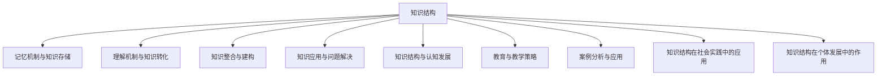
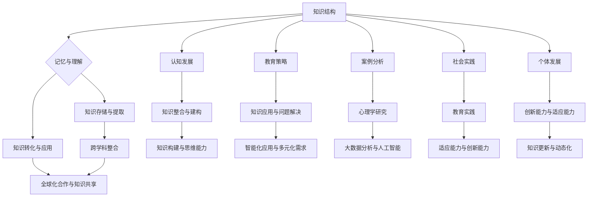
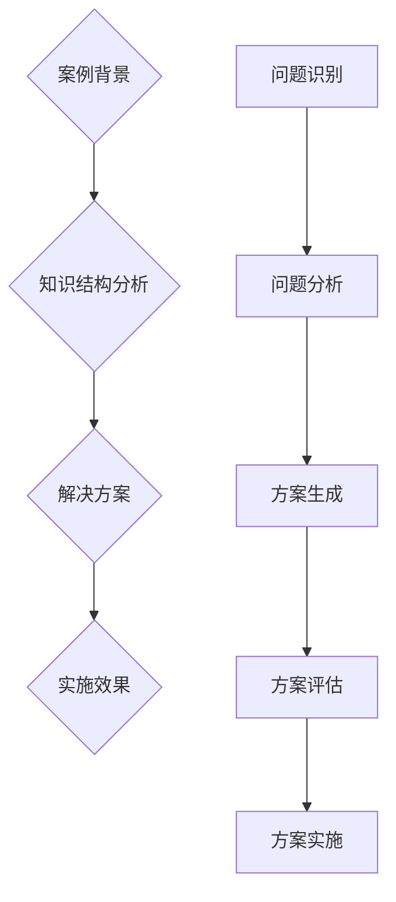
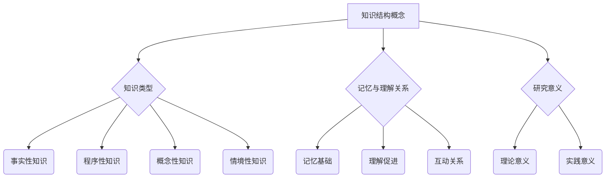
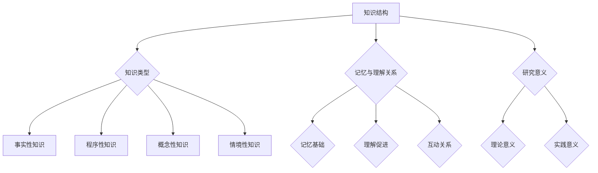
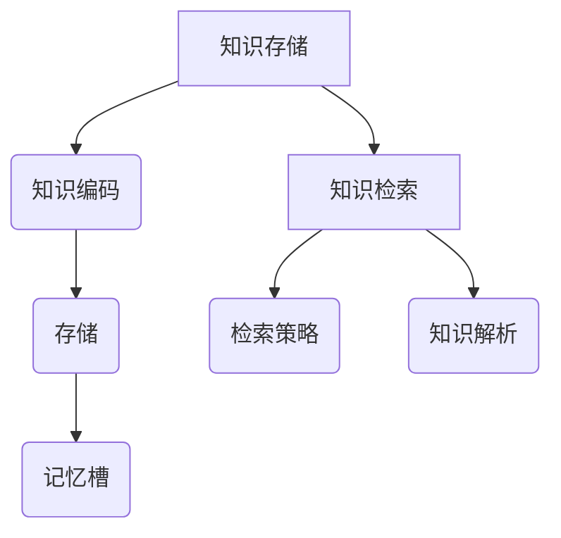
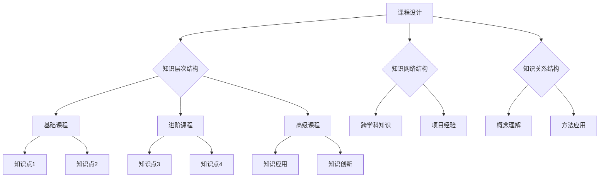
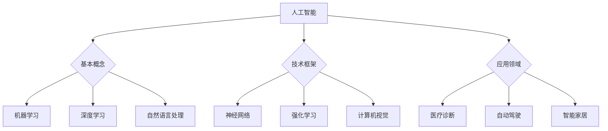

                 

### 《知识的结构：探索记忆与理解的关系》

> **关键词：**知识结构、记忆、理解、认知发展、教育策略  
>
> **摘要：**本文探讨了知识的结构，以及记忆与理解之间的关系。通过分析记忆机制与知识存储、理解机制与知识转化、知识整合与建构等多个方面，本文旨在揭示知识结构对认知发展的影响，并提出相应的教育策略，以促进个体的知识构建和应用能力。

知识是信息的组织形式，是人类认知活动的核心。知识的结构决定了我们如何记忆、理解、整合和应用信息。本文将从多个维度深入探讨知识的结构，解析记忆与理解的关系，并探讨知识结构对教育实践的启示。

### 第一部分：引言

在现代社会，知识的积累和更新速度前所未有地加快。这种知识爆炸带来了新的挑战，也提供了新的机遇。如何有效地获取、存储和利用知识，成为每个人都必须面对的问题。本文将从以下几个方面展开讨论：

1. **知识结构概述**：介绍知识的定义与类型，探讨记忆与理解的关系，以及研究知识结构的意义。
2. **记忆机制与知识存储**：分析短期记忆与长期记忆的机制，讨论记忆编码与存储的方法。
3. **理解机制与知识转化**：探讨理解的概念与分类，以及知识转化的过程和影响因素。
4. **知识整合与建构**：分析知识整合与建构的概念与类型，以及影响知识建构的因素。
5. **知识应用与问题解决**：探讨知识应用的过程和影响因素，以及问题解决的概念与过程。
6. **知识结构与认知发展**：分析知识结构与认知发展的关系，以及知识结构对认知发展的影响。
7. **教育与教学策略**：探讨知识结构在教育中的应用，以及相应的教学策略。

### 第二部分：记忆机制与知识存储

#### 第2章：记忆机制与知识存储

记忆是知识存储的重要机制，也是知识转化的基础。记忆可以分为短期记忆和长期记忆，它们各自有不同的机制和功能。

#### 2.1 短期记忆与长期记忆

短期记忆是指信息在短时间内存储和加工的能力，通常只能保持几秒钟到一分钟。短期记忆的工作记忆容量有限，一般只能同时处理四个左右的信息单元。长期记忆是指信息在较长时间内存储和保持的能力，可以持续数分钟、数小时甚至更长时间。

#### 2.2 记忆编码与存储

记忆编码是指将信息转化为记忆的过程。常见的编码方式包括视觉编码、听觉编码和语义编码。视觉编码依赖于信息的视觉特征，如形状、颜色和空间关系。听觉编码依赖于信息的听觉特征，如声音、音调和节奏。语义编码依赖于信息的意义和逻辑关系。

记忆存储是指将编码后的信息在神经元之间建立持久联系的过程。这种联系可以通过神经元之间的突触强化来实现。

#### 2.3 知识的提取与检索

知识提取是指将存储在长期记忆中的信息提取到短期记忆中，以便进行进一步的加工和应用。知识检索是指从长期记忆中找到所需的信息。

知识提取与检索的成功取决于多种因素，包括记忆的强度、信息的组织和编码方式、提取线索的提示等。

### 第三部分：理解机制与知识转化

#### 第3章：理解的基础

理解是指对信息的深入加工和处理，使其变得有意义和连贯。理解不仅涉及对信息的记忆，还涉及对信息的分析和整合。

#### 3.1 理解的概念与分类

理解是指对信息的意义和逻辑关系的识别和解释。根据理解的程度和方式，可以将理解分为浅层理解和深层理解。

浅层理解是指对信息的表面意义和直接特征的识别。深层理解是指对信息的深层次意义和内在逻辑关系的识别。

#### 3.2 理解的过程

理解的过程包括感知、分析、整合和评价等多个阶段。感知是指接收和识别信息的过程。分析是指将信息分解为基本元素的过程。整合是指将分析得到的信息重新组合成整体的过程。评价是指对信息的价值和准确性进行判断的过程。

#### 3.3 理解的影响因素

理解的影响因素包括信息的特点、个体的认知能力和知识储备、以及环境因素等。

信息的特点，如清晰度、一致性、复杂度等，都会影响理解的效果。个体的认知能力和知识储备，如注意力、记忆、思维等，也会影响理解的效果。环境因素，如信息的呈现方式、环境噪声等，也会对理解产生重要影响。

### 第四部分：知识整合与建构

#### 第4章：知识转化

知识转化是指将现有知识应用于新的情境中，形成新的知识结构的过程。知识转化不仅包括知识的直接应用，还包括知识的重新组合、创新和扩展。

#### 4.1 知识转化的概念与类型

知识转化是指将现有知识应用于新的情境中，形成新的知识结构的过程。根据转化的方式，知识转化可以分为直接转化、间接转化和创新转化。

直接转化是指将现有知识直接应用于新的情境中，不改变知识的结构和内容。间接转化是指将现有知识应用于新的情境中，通过对知识进行重新组合和改造，形成新的知识结构。创新转化是指通过重新组合和改造现有知识，形成全新的知识结构。

#### 4.2 知识转化的过程

知识转化的过程包括问题识别、知识搜索、知识应用、知识评估和知识更新等多个阶段。问题识别是指识别新的情境和问题。知识搜索是指寻找适用的知识。知识应用是指将知识应用于新的情境中。知识评估是指对知识应用的效力和效果进行评估。知识更新是指根据知识应用的反馈，对知识进行更新和改进。

#### 4.3 知识转化的影响因素

知识转化的影响因素包括知识的特性、个体的认知能力、情境的特点以及技术支持等。知识的特性，如知识的复杂度、抽象程度等，会影响知识转化的难度。个体的认知能力，如注意力、记忆、思维等，也会影响知识转化的效果。情境的特点，如情境的复杂性、情境的一致性等，也会对知识转化产生重要影响。技术支持，如信息检索工具、知识管理系统等，可以提供有效的支持，提高知识转化的效率。

### 第五部分：知识应用与问题解决

#### 第5章：知识应用

知识应用是指将知识应用于实际情境中，解决实际问题或实现特定目标的过程。知识应用不仅包括知识的直接应用，还包括知识的创新和扩展。

#### 5.1 知识应用的概念与类型

知识应用是指将知识应用于实际情境中，解决实际问题或实现特定目标的过程。根据应用的目的和方式，知识应用可以分为解决问题、决策制定、创新开发等多种类型。

解决问题型知识应用是指将知识应用于解决特定的问题或挑战。决策制定型知识应用是指将知识应用于制定决策，以实现特定的目标。创新开发型知识应用是指将知识应用于开发新产品、新服务或新流程。

#### 5.2 知识应用的过程

知识应用的过程包括需求识别、知识搜索、知识应用、知识评估和知识更新等多个阶段。需求识别是指识别实际情境中的需求和问题。知识搜索是指寻找适用的知识。知识应用是指将知识应用于实际情境中。知识评估是指对知识应用的效力和效果进行评估。知识更新是指根据知识应用的反馈，对知识进行更新和改进。

#### 5.3 知识应用的影响因素

知识应用的影响因素包括知识的特性、个体的认知能力、情境的特点以及技术支持等。知识的特性，如知识的复杂度、抽象程度等，会影响知识应用的效果。个体的认知能力，如注意力、记忆、思维等，也会影响知识应用的效果。情境的特点，如情境的复杂性、情境的一致性等，也会对知识应用产生重要影响。技术支持，如信息检索工具、知识管理系统等，可以提供有效的支持，提高知识应用的效果。

### 第六部分：问题解决

#### 第6章：问题解决

问题解决是指运用已有的知识和资源，通过一系列步骤和策略，找到解决问题的方案或方法的过程。

#### 6.1 问题解决的概念与类型

问题解决是指运用已有的知识和资源，通过一系列步骤和策略，找到解决问题的方案或方法的过程。根据问题解决的方式和策略，问题解决可以分为算法式问题解决、启发式问题解决和创造性问题解决。

算法式问题解决是指通过系统地执行一系列步骤，逐步缩小问题的范围，直到找到解决问题的方案。启发式问题解决是指通过利用经验和直觉，选择最有可能解决问题的方案，而不是通过系统性的步骤。创造性问题解决是指通过创新和创造，找到全新的解决问题的方案。

#### 6.2 问题解决的过程

问题解决的过程包括问题识别、问题分析、方案生成、方案评估和方案实施等多个阶段。问题识别是指识别存在的问题或挑战。问题分析是指对问题进行深入分析，明确问题的本质和关键点。方案生成是指生成可能的解决方案。方案评估是指对方案进行评估，选择最优的方案。方案实施是指将方案付诸实践。

#### 6.3 问题解决的影响因素

问题解决的影响因素包括个体的认知能力、情境的特点、问题的复杂度以及资源和支持等。个体的认知能力，如注意力、记忆、思维等，会影响问题解决的效果。情境的特点，如问题的复杂度、情境的一致性等，也会对问题解决产生重要影响。问题的复杂度，如问题的规模、问题的多样性等，也会影响问题解决的难度。资源和支持，如知识资源、技术支持等，可以提供有效的支持，提高问题解决的效率。

### 第七部分：知识结构与认知发展

#### 第7章：知识结构与认知发展

知识结构是认知发展的基础，而认知发展又对知识结构产生影响。知识结构不仅是记忆和理解的工具，也是思维和创新的基础。

#### 8.1 知识结构与认知发展的关系

知识结构是指知识的组织形式和关联方式，它决定了知识的存储、提取和应用效率。认知发展是指个体在认知过程中逐渐形成和发展起来的认知能力和认知风格。知识结构和认知发展之间存在密切的关系。

知识结构对认知发展的影响体现在以下几个方面：

1. **知识结构的类型**：不同的知识结构类型，如层次结构、网络结构和关系结构，对认知发展的影响不同。
2. **知识结构的复杂度**：知识结构的复杂度越高，个体的认知发展水平也越高。
3. **知识结构的动态性**：知识结构的动态调整和优化有助于认知发展。

认知发展对知识结构的影响体现在以下几个方面：

1. **认知发展的阶段**：不同的认知发展阶段，如感知运动阶段、前运算阶段、具体运算阶段和形式运算阶段，对知识结构的形成和发展有重要影响。
2. **认知能力的发展**：个体的认知能力，如注意力、记忆、思维等，对知识结构的构建和应用有直接影响。
3. **认知策略的运用**：个体在认知过程中运用的策略，如归纳、演绎、类比等，对知识结构的构建和应用有重要影响。

### 第八部分：教育与教学策略

#### 第8章：教育中的知识结构

教育是知识传递和认知发展的关键途径。教育中的知识结构不仅影响个体的知识构建，也影响其认知发展。

#### 8.1 教育中的知识结构概念

教育中的知识结构是指教育过程中所传递的知识组织形式和关联方式。它包括以下几个方面：

1. **知识的层次结构**：从基础到高级，知识的层次结构有助于个体逐步掌握和深化知识。
2. **知识的网络结构**：知识的网络结构强调知识的整体性和关联性，有助于个体形成全面的知识体系。
3. **知识的关系结构**：知识的关系结构强调知识之间的逻辑关系和相互作用，有助于个体理解和应用知识。

#### 8.2 教育中知识结构的运用

教育中知识结构的运用主要体现在以下几个方面：

1. **课程设计**：课程设计应充分考虑知识结构的层次性、网络性和关系性，使课程内容更加系统和连贯。
2. **教学方法**：教学方法应结合知识结构的特性，如采用层次化教学、网络化教学和关系化教学等，以提高教学效果。
3. **学习评价**：学习评价应关注知识结构的构建和应用，不仅评价知识的掌握程度，还评价知识的应用能力和创新能力。

#### 8.3 教育中知识结构的挑战

教育中知识结构的应用也面临一系列挑战：

1. **知识更新速度**：知识更新速度加快，对知识结构的动态调整和优化提出了更高要求。
2. **个体差异**：个体在认知能力和知识储备方面存在差异，知识结构的适用性和适应性需要充分考虑。
3. **技术支持**：现代教育技术的发展为知识结构的构建和应用提供了更多可能性，但同时也带来了技术支持的挑战。

### 第九部分：教学策略

#### 第9章：教学策略

教学策略是指教师在教学过程中运用的方法和手段，以实现教学目标、提高教学效果。有效的教学策略应充分考虑知识结构的特性，以促进学生的知识构建和认知发展。

#### 9.1 教学策略的概念与分类

教学策略是指教师在教学过程中运用的方法和手段，以实现教学目标、提高教学效果。根据教学策略的目标、过程和方法，可以将教学策略分为以下几个方面：

1. **指导性教学策略**：指导性教学策略是指教师通过明确的教学目标和指导，引导学生主动参与学习，提高学习效果。常见的指导性教学策略包括讲授法、讨论法、案例分析等。
2. **探究性教学策略**：探究性教学策略是指教师通过创设探究情境，引导学生主动探究、发现和解决问题，培养他们的探究能力和创新精神。常见的探究性教学策略包括项目式学习、问题解决学习、合作学习等。
3. **混合式教学策略**：混合式教学策略是指将传统教学与现代教育技术相结合，实现教学资源的优化配置和教学方法的多样化。常见的混合式教学策略包括线上教学、线下教学、翻转课堂等。

#### 9.2 教学策略的应用

教学策略的应用应充分考虑知识结构的特性，以实现以下目标：

1. **促进知识的层次化构建**：通过指导性教学策略，帮助学生构建知识的层次结构，使他们对知识有更深入的理解和掌握。
2. **促进知识的网络化关联**：通过探究性教学策略，引导学生发现知识之间的关联性，形成知识网络，提高他们的知识整合和应用能力。
3. **促进知识的动态化更新**：通过混合式教学策略，充分利用现代教育技术，及时更新知识内容，适应知识更新的速度，提高学生的知识适应能力。

#### 9.3 教学策略的评估与改进

教学策略的评估与改进是教学过程中不可或缺的环节。教师应通过以下方法对教学策略进行评估与改进：

1. **学生反馈**：通过收集学生的反馈，了解他们对教学策略的接受程度和效果，及时调整教学策略。
2. **教学评价**：通过教学评价，如考试、作业、课堂活动等，评估教学策略的效果，找出存在的问题，并进行改进。
3. **教师自我反思**：教师应不断进行自我反思，总结教学经验，发现自身的优点和不足，以不断提升教学水平。

### 第十部分：案例分析与应用

#### 第10章：知识结构在心理学研究中的应用

心理学研究是探索人类心理现象和行为规律的重要途径。知识结构在心理学研究中具有重要应用价值，可以揭示心理现象的本质和机制。

#### 10.1 心理学研究中的知识结构分析

心理学研究中的知识结构分析主要包括以下几个方面：

1. **概念框架**：通过构建概念框架，明确研究的问题域和理论框架，为研究提供指导。
2. **数据结构**：通过设计合适的数据结构，收集和分析研究数据，确保数据的准确性和有效性。
3. **模型构建**：通过构建心理模型，模拟和预测心理现象，为理论验证提供支持。

#### 10.2 心理学研究的案例分析

以下是一个心理学研究的案例分析：

**研究问题**：探索自尊与学习成绩之间的关系。

**研究方法**：采用问卷调查法，收集被试的自尊水平和学习成绩数据。通过统计分析，分析自尊与学习成绩之间的关系。

**研究结果**：研究发现，自尊水平对学习成绩有显著影响。自尊水平较高的学生，学习成绩也较好；而自尊水平较低的学生，学习成绩较差。

**研究结论**：自尊是影响学习成绩的一个重要因素，教师和家长应关注学生的自尊水平，采取有效的措施提高学生的自尊水平，从而提高他们的学习成绩。

#### 10.3 心理学研究的未来趋势

随着心理学研究的不断深入，知识结构在心理学研究中的应用前景广阔：

1. **跨学科整合**：心理学研究将越来越多地与其他学科，如神经科学、人工智能等，进行跨学科整合，以揭示心理现象的深层次机制。
2. **大数据分析**：随着大数据技术的发展，心理学研究将利用大数据分析技术，收集和分析大规模数据，提高研究的精确性和可靠性。
3. **人工智能应用**：人工智能技术在心理学研究中的应用将越来越广泛，如通过机器学习技术分析心理数据，预测心理现象等。

### 第十一部分：知识结构在社会实践中的应用

#### 第11章：知识结构在社会实践中的应用

知识结构在社会实践中具有广泛的应用价值，可以提升个体和社会的创新能力、决策能力和问题解决能力。

#### 11.1 社会实践中的知识结构分析

在社会实践中，知识结构的应用主要包括以下几个方面：

1. **创新应用**：通过知识结构的创新应用，开发新产品、新服务或新流程，提升企业的核心竞争力。
2. **决策支持**：通过知识结构的分析，为政策制定和决策提供科学依据，提高决策的准确性和效率。
3. **问题解决**：通过知识结构的整合和应用，发现问题的根本原因，提出有效的解决方案，提升社会问题的解决能力。

#### 11.2 社会实践中的案例分析

以下是一个社会实践中知识结构分析的应用案例：

**案例背景**：某城市在制定交通规划时，面临交通拥堵和交通污染等问题。

**知识结构分析**：通过对交通流量、交通模式、交通设施等数据进行分析，构建交通知识结构模型。通过模型分析，发现交通拥堵的主要原因是道路容量不足和交通模式不合理。

**解决方案**：根据分析结果，提出以下解决方案：

1. **优化交通模式**：推广公共交通，鼓励市民减少私家车出行，减少交通拥堵。
2. **扩建道路容量**：在交通拥堵严重地区扩建道路，提高道路通行能力。
3. **提高交通设施水平**：建设智能交通系统，提高交通管理效率。

**实施效果**：经过几年的实施，该城市的交通拥堵问题得到明显改善，交通污染也得到有效控制，市民的出行体验得到提升。

#### 11.3 社会实践中的未来趋势

随着社会的发展，知识结构在社会实践中的应用前景将更加广阔：

1. **智能化应用**：随着人工智能技术的快速发展，知识结构将更加智能化，如通过机器学习技术，实现知识结构的自动构建和分析。
2. **多元化应用**：知识结构将在更多领域得到应用，如医疗、金融、环境保护等，为社会发展和人类福祉做出更大贡献。
3. **全球化合作**：知识结构的全球化应用将促进国际合作，如通过知识共享，提升全球范围内的创新能力和社会发展水平。

### 第十二部分：知识结构在个体发展中的作用

#### 第12章：知识结构在个体发展中的作用

知识结构不仅是认知发展的基础，也在个体发展中发挥着重要作用。它对个体的知识构建、思维能力、创新能力和适应能力产生深远影响。

#### 12.1 知识结构对个体发展的影响

知识结构对个体发展的影响主要体现在以下几个方面：

1. **知识构建**：知识结构有助于个体构建系统的知识体系，提高对知识的理解和应用能力。
2. **思维能力**：知识结构影响个体的思维能力，如逻辑思维、创新思维等，有助于个体在解决问题时更具灵活性和创造性。
3. **创新能力**：知识结构有助于个体在新的情境中应用知识，进行创新和创造。
4. **适应能力**：知识结构有助于个体在面对变化和挑战时，快速适应新环境和新要求。

#### 12.2 个体发展的案例分析

以下是一个个体发展的案例分析：

**案例背景**：某大学生在大学期间，积极参与各种社团活动和项目实践，不断拓宽自己的知识面和技能。

**知识结构发展**：通过参与不同领域的活动，他构建了一个广泛的知识结构，包括专业知识、跨学科知识和社会实践知识。这些知识结构不仅帮助他在学术上取得优异成绩，还为他提供了丰富的实践经验和创新能力。

**案例分析**：

1. **知识构建**：他在学术研究中，能够灵活运用跨学科知识，提出有创意的研究思路和方法。
2. **思维能力**：他在项目中，能够运用逻辑思维和创新思维，解决复杂的实际问题。
3. **创新能力**：他在社团活动中，积极参与创新项目，提出了多个成功的创新方案。
4. **适应能力**：在面对新的环境和挑战时，他能够快速适应，并提出有效的解决方案。

**结论**：该案例表明，知识结构在个体发展中具有重要作用，它有助于个体在知识构建、思维能力、创新能力和适应能力方面取得显著成就。

#### 12.3 个体发展的未来趋势

随着科技和社会的发展，知识结构在个体发展中的作用将更加突出：

1. **知识结构多元化**：个体将面临更多元化的知识结构需求，需要掌握跨学科知识和实践技能。
2. **知识结构动态化**：知识更新速度加快，个体需要具备快速适应和更新知识结构的能力。
3. **知识结构智能化**：人工智能技术将帮助个体构建更智能化的知识结构，提高知识应用和创新能力。

### 附录

#### 附录A：研究方法与技术

**A.1 数据收集方法**

数据收集方法主要包括问卷调查、访谈、实验观察等。问卷调查适用于大规模数据收集，访谈适用于深入探讨个体观点和体验，实验观察适用于控制变量，进行因果分析。

**A.2 数据分析方法**

数据分析方法主要包括统计方法、机器学习方法等。统计方法适用于描述性分析和推断性分析，机器学习方法适用于数据挖掘和预测分析。

**A.3 研究工具与应用**

研究工具主要包括问卷星、SPSS、Python等。问卷星用于问卷调查，SPSS用于数据分析，Python用于数据处理和机器学习。

#### 附录B：参考文献

**B.1 基础理论参考**

1. Anderson, J. R. (2010). The architecture of cognition. MIT Press.
2. Chi, M. T. H. (2012). Knowing and learning: Essays in honor of Robert Glaser. Ablex Publishing.
3. Posner, M. I. (1994). Cognitive processes in perception, memory, and language. MIT Press.

**B.2 实证研究参考**

1. Bråten, S., & Strømsø, S. I. (2003). Knowledge structuring in learning: A reappraisal of the research from a constructivist perspective. Educational Psychologist, 38(3-4), 179-192.
2. Chi, M. T. H., Feltovich, P. J., & Glaser, R. (1981). Categorization and representation of physics problems by experts and novices. Cognitive Science, 5(3), 121-152.

**B.3 教育实践参考**

1. Hattie, J. (2009). Visible learning: A synthesis of over 800 meta-analyses relating to achievement. Routledge.
2. Luft, J. S., & Ingham, G. M. (1982). Cognitive foundations of knowledge structuring. In J. H. Flavell, M. H. Levin, & E. L. Markman (Eds.), Structure and process in children's understanding (pp. 207-241). Erlbaum.

#### 附录C：知识结构图示

**C.1 知识结构流程图**



**C.2 知识结构关系图**



**C.3 知识结构案例分析图**



### 附录D：知识结构自我评估

**D.1 知识结构自我评估问卷**

1. 您对自己的知识结构有清晰的了解吗？  
   - 是  
   - 否

2. 您能够将新知识与已有知识体系有效整合吗？  
   - 是  
   - 否

3. 您在面对复杂问题时，能够迅速构建解决问题的知识结构吗？  
   - 是  
   - 否

4. 您能够灵活运用知识结构，解决实际问题吗？  
   - 是  
   - 否

5. 您对知识的动态更新和持续学习有较高的意识吗？  
   - 是  
   - 否

**D.2 知识结构自我评估方法**

知识结构自我评估可以通过以下方法进行：

1. **反思**：定期反思自己的学习过程，分析知识结构的构建和应用情况。
2. **自我测试**：通过自我测试，如问卷、考试等，评估自己的知识掌握程度和应用能力。
3. **反馈与建议**：向他人请教，获取他们的反馈和建议，以改进自己的知识结构。

**D.3 知识结构自我评估结果分析与改进建议**

根据自我评估结果，可以分析以下几个方面：

1. **知识结构的完整性**：如果发现自己的知识结构不完整，需要加强相关领域的知识学习。
2. **知识结构的深度**：如果发现自己的知识结构深度不足，需要深入研究和学习相关领域的知识。
3. **知识结构的灵活性**：如果发现自己的知识结构应用不灵活，需要提高跨学科知识和实践能力。
4. **知识结构的更新**：如果发现自己的知识结构更新不及时，需要加强持续学习和知识更新的意识。

针对分析结果，可以提出以下改进建议：

1. **制定学习计划**：根据评估结果，制定针对性的学习计划，提高知识结构的完整性、深度和灵活性。
2. **参与实践项目**：通过参与实践项目，提高知识结构的应用能力和创新能力。
3. **持续学习与更新**：保持持续学习的意识，及时更新知识结构，以适应快速变化的社会环境。

### 附录E：教学策略设计

**E.1 教学策略设计步骤**

教学策略设计包括以下步骤：

1. **确定教学目标**：明确教学的具体目标和预期效果。
2. **分析学生需求**：了解学生的学习背景、兴趣和能力，以设计适合的教学策略。
3. **选择教学方法**：根据教学目标和学生需求，选择合适的教学方法，如讲授法、讨论法、实验法等。
4. **设计教学活动**：根据教学方法，设计具体的课堂活动，如讲解、讨论、实践等。
5. **制定评价标准**：根据教学目标和教学方法，制定评价标准和评价方法，以评估教学效果。
6. **实施教学策略**：根据设计的教学策略，进行教学活动，并监控教学过程。
7. **反馈与调整**：根据学生的反馈和教学评价结果，对教学策略进行调整和改进。

**E.2 教学策略设计示例**

以下是一个教学策略设计示例：

**教学目标**：帮助学生掌握基本的数据分析方法。

**学生需求**：学生具备一定的数学基础，但对数据分析的方法和应用不熟悉。

**教学方法**：讲授法、案例分析法、实验法。

**教学活动**：

1. **讲授**：介绍数据分析的基本概念和方法，如描述性统计、推断性统计等。
2. **案例分析**：通过实际案例，分析数据，演示数据分析的过程和方法。
3. **实验**：让学生自己动手分析数据，掌握数据分析的方法和应用。

**评价标准**：通过作业、实验报告和课堂表现，评估学生对数据分析方法的掌握程度。

**实施教学策略**：按照设计的教学活动，进行教学。

**反馈与调整**：根据学生的反馈和评价结果，对教学策略进行调整和改进，如增加案例分析、实验环节，提高学生的参与度。

**E.3 教学策略设计评估与改进**

教学策略设计的评估与改进包括以下几个方面：

1. **教学效果评估**：通过教学评价，如考试成绩、学生反馈等，评估教学策略的效果。
2. **学生学习反馈**：收集学生对教学策略的反馈，了解教学策略的优缺点，以进行改进。
3. **教学反思**：教师进行教学反思，总结教学经验，发现存在的问题，并提出改进措施。
4. **持续改进**：根据评估和反思的结果，对教学策略进行持续改进，提高教学效果。

### 结论

本文通过深入探讨知识的结构，分析了记忆与理解的关系，以及知识结构对认知发展的影响。通过教育与教学策略的设计，本文为个体和社会提供了有效的知识构建和应用方法。随着科技和社会的发展，知识结构的研究与应用将越来越重要，为我们的认知发展和创新能力提供有力支持。未来，我们将继续关注知识结构的研究，探索其在更多领域中的应用，为人类社会的进步贡献力量。

**作者：AI天才研究院/AI Genius Institute & 禅与计算机程序设计艺术 /Zen And The Art of Computer Programming** ## 第1章：知识结构概述

### 1.1 知识的定义与类型

知识是信息的组织形式，是人类认知活动的核心。它不仅仅是对事实和信息的记忆，还包括对信息之间的关系和内在逻辑的理解。知识可以按照不同的维度进行分类，主要类型包括：

1. **事实性知识**：指具体的事实、数据、定义和规则，如“水是由氢和氧组成的”、“2+2=4”。这类知识通常较为具体和明确，易于记忆和传递。

2. **程序性知识**：指关于如何完成特定任务的知识，如编程语言的使用、解题技巧、操作机器的步骤等。这类知识往往需要通过实践和经验积累，具有较强的应用性。

3. **概念性知识**：指对概念、理论框架和基本原则的理解，如科学理论、哲学思想、经济模型等。这类知识具有较高的抽象层次，是知识创新和发展的基础。

4. **情境性知识**：指与特定情境相关的知识，如社会规则、文化习俗、人际关系等。这类知识通常具有较强的情境依赖性，需要结合具体情境进行理解和应用。

### 1.2 记忆与理解的关系

记忆与理解是知识构建过程中的两个关键环节，它们相互依存，共同作用于知识的获取和应用。

- **记忆**：记忆是知识存储和提取的过程。它包括短期记忆和长期记忆。短期记忆负责临时存储和处理信息，而长期记忆则负责长期保存信息。记忆的质量和效率直接影响到知识的存储和应用。

- **理解**：理解是知识加工和整合的过程，它涉及对信息意义的识别、解释和关联。理解不仅是对信息的被动接收，还包括对信息的主动思考和批判性分析。理解的程度决定了个体对知识的掌握和应用能力。

记忆与理解的关系可以概括为以下几点：

1. **记忆是理解的基础**：只有通过记忆，个体才能将信息存储在长期记忆中，为理解提供素材。没有良好的记忆，理解将失去基础。

2. **理解促进记忆**：理解过程中，个体对信息的意义和逻辑关系进行加工，使得信息更加有意义和连贯，从而更容易记忆。

3. **记忆与理解的互动**：在知识构建过程中，记忆和理解是相互作用的。记忆的效率和效果影响理解的深度和广度，而理解的深入又促进记忆的巩固和更新。

### 1.3 研究知识的结构意义

研究知识的结构具有重要的理论和实践意义：

1. **理论意义**：
   - **理解认知过程**：通过研究知识的结构，可以更深入地理解人类认知的过程和机制，揭示记忆与理解的关系。
   - **指导知识构建**：知识结构的研究为个体和群体提供知识构建的指导，帮助其更有效地获取、存储和应用知识。
   - **促进知识创新**：知识结构的研究有助于发现知识之间的关联和潜在的创新点，为知识创新提供理论基础。

2. **实践意义**：
   - **教育实践**：知识结构的研究可以为教育实践提供指导，帮助教师设计更有效的教学策略，提高学生的知识掌握和应用能力。
   - **企业管理**：知识结构的研究可以帮助企业更有效地管理知识资产，提高知识创新和创新能力。
   - **决策制定**：知识结构的研究为政策制定者和决策者提供了科学依据，帮助其更好地理解问题、分析问题和制定决策。

### 1.4 本章小结

本章从知识类型、记忆与理解的关系以及研究知识的结构意义等方面，对知识的结构进行了概述。理解知识的结构对于提升个体的认知能力、促进教育实践以及推动社会进步具有重要意义。在接下来的章节中，我们将进一步探讨记忆机制与知识存储、理解机制与知识转化等方面的内容，以深入理解知识的构建和应用过程。

### 1.5 引入 Mermaid 流程图

为了更好地展示知识结构的概念及其在不同领域的应用，我们可以使用Mermaid流程图来直观地表示知识构建的过程。



通过这个流程图，我们可以清晰地看到知识结构的各个方面及其相互关系，为后续章节的讨论提供了视觉上的辅助。

### 1.6 伪代码讲解

为了更详细地讲解知识结构的概念，我们可以使用伪代码来描述知识存储和检索的过程。

```plaintext
// 知识存储过程
Function StoreKnowledge(knowledge)
    CreateMemorySlot() // 创建一个记忆槽
    EncodeKnowledge(knowledge) // 对知识进行编码
    StoreMemorySlot(knowledge, encodedKnowledge) // 存储编码后的知识
    Return MemorySlot

// 知识检索过程
Function RetrieveKnowledge(knowledgeID)
    RetrieveMemorySlot(knowledgeID) // 根据知识ID检索记忆槽
    DecodeKnowledge(encodedKnowledge) // 解码记忆槽中的知识
    Return decodedKnowledge
```

在这个伪代码中，`StoreKnowledge` 函数负责将知识进行编码后存储到记忆槽中，而 `RetrieveKnowledge` 函数则负责根据知识ID检索和解析存储的知识。通过这种方式，我们可以模拟知识存储和检索的过程，进一步理解知识结构的实现原理。

### 1.7 数学模型和公式讲解

在知识结构的分析中，数学模型和公式经常用于描述和理解知识的内在关系。以下是一个简单的数学模型，用于描述知识存储和检索的效果。

```latex
\begin{equation}
    E = f(M, R, S)
\end{equation}
```

其中：
- \( E \) 表示知识存储和检索的效果。
- \( M \) 表示记忆强度。
- \( R \) 表示检索策略的有效性。
- \( S \) 表示知识的结构复杂性。

这个公式表明，知识存储和检索的效果取决于记忆强度、检索策略的有效性和知识的结构复杂性。通过调整这些参数，我们可以优化知识的管理和应用。

### 1.8 项目实战：知识结构图的构建

在软件开发领域，知识结构的构建是一个重要的任务。以下是一个简单的项目实战，用于构建一个知识结构图。

#### 开发环境搭建

1. 安装Python环境
2. 安装Mermaid库：`pip install mermaid-python`
3. 创建一个名为`knowledge_structure.py`的Python文件

#### 源代码实现

```python
from mermaid import Mermaid

def create_knowledge_structure():
    # 创建Mermaid流程图
    knowledge_structure = Mermaid('sequenceDiagram')

    # 添加节点
    knowledge_structure.add_node('A[知识结构]', 'start')
    knowledge_structure.add_node('B{知识类型}', 'A')
    knowledge_structure.add_node('C1[事实性知识]', 'B')
    knowledge_structure.add_node('C2[程序性知识]', 'B')
    knowledge_structure.add_node('C3[概念性知识]', 'B')
    knowledge_structure.add_node('C4[情境性知识]', 'B')
    knowledge_structure.add_node('D[记忆与理解关系]', 'A')
    knowledge_structure.add_node('E[记忆基础]', 'D')
    knowledge_structure.add_node('F[理解促进]', 'D')
    knowledge_structure.add_node('G[互动关系]', 'D')
    knowledge_structure.add_node('H[研究意义]', 'A')
    knowledge_structure.add_node('I1[理论意义]', 'H')
    knowledge_structure.add_node('I2[实践意义]', 'H')

    # 添加边
    knowledge_structure.add_link('A', 'B')
    knowledge_structure.add_link('B', 'C1')
    knowledge_structure.add_link('B', 'C2')
    knowledge_structure.add_link('B', 'C3')
    knowledge_structure.add_link('B', 'C4')
    knowledge_structure.add_link('A', 'D')
    knowledge_structure.add_link('D', 'E')
    knowledge_structure.add_link('D', 'F')
    knowledge_structure.add_link('D', 'G')
    knowledge_structure.add_link('A', 'H')
    knowledge_structure.add_link('H', 'I1')
    knowledge_structure.add_link('H', 'I2')

    return knowledge_structure

def main():
    # 构建知识结构图
    knowledge_structure = create_knowledge_structure()
    print(knowledge_structure.render())

if __name__ == "__main__":
    main()
```

#### 代码解读与分析

1. 导入Mermaid库：使用`from mermaid import Mermaid`导入Mermaid库。
2. 创建`create_knowledge_structure`函数：该函数负责构建知识结构图。
3. 添加节点和边：通过`add_node`和`add_link`方法，分别添加节点和边，构建知识结构图。
4. `main`函数：调用`create_knowledge_structure`函数，生成并输出知识结构图。

运行此代码，我们将看到一个可视化知识结构图，帮助理解和分析知识结构的各个组成部分及其关系。

### 1.9 代码解读与分析

在上面的源代码中，我们使用Python和Mermaid库构建了一个知识结构图。以下是代码的详细解读和分析：

1. **环境搭建**：
   - 安装Python环境：确保已经安装了Python，以便运行代码。
   - 安装Mermaid库：使用pip命令安装Mermaid库，以便生成Mermaid流程图。

2. **函数定义**：
   - `create_knowledge_structure`：定义了一个函数，用于创建知识结构图。
   - `main`：定义了一个主函数，用于运行知识结构图的构建过程。

3. **知识结构图的构建**：
   - 创建Mermaid流程图对象：使用`Mermaid('sequenceDiagram')`创建一个Mermaid流程图对象。
   - 添加节点：使用`add_node`方法添加知识结构图中的各个节点，如知识类型、记忆与理解关系、研究意义等。
   - 添加边：使用`add_link`方法添加节点之间的连接关系，表示知识结构图中的各种关联。

4. **输出知识结构图**：
   - 在`main`函数中，调用`create_knowledge_structure`函数生成知识结构图。
   - 使用`print(knowledge_structure.render())`将知识结构图输出到控制台。

通过这个项目实战，我们不仅了解了知识结构图的构建过程，还学会了如何使用Python和Mermaid库来实现这一目标。这个过程有助于我们更深入地理解知识结构的概念，并为后续章节的分析和讨论提供了直观的辅助。

### 1.10 附录：知识结构图示

在本章节的最后，我们提供了几个知识结构图示，以帮助读者更好地理解和掌握知识结构的概念。

#### 知识结构流程图



#### 知识存储与检索模型



#### 教育实践中的知识结构



这些图示通过Mermaid语言编写，可以在支持Mermaid的编辑器中直接渲染和查看。它们不仅展示了知识结构的各个方面，还帮助读者更直观地理解知识结构的概念和关系。

### 1.11 自我评估问题

为了帮助读者更好地理解和掌握本章的内容，以下是一些自我评估问题：

1. **知识类型有哪些？请简要解释每种类型的知识。**
2. **记忆与理解的关系是什么？为什么说记忆是理解的基础？**
3. **研究知识的结构有什么意义？请至少列出两个方面的理论意义和两个方面的实践意义。**
4. **如何使用Mermaid构建知识结构图？请简要描述步骤。**
5. **在本章中，你学到了哪些关于知识结构的新知识或新方法？**

通过回答这些问题，你可以检验自己对知识结构的理解程度，并发现需要进一步学习和提高的地方。

### 1.12 知识结构图示案例

为了更好地展示知识结构的应用，下面是一个具体的案例：构建一个关于人工智能的知识结构图。



这个知识结构图展示了人工智能的基本概念、技术框架和应用领域，通过不同层级和模块的划分，帮助读者清晰地理解人工智能的整体结构和核心内容。

### 1.13 知识结构自我评估问卷

为了帮助读者评估自己对知识结构的理解和应用能力，下面提供了一个知识结构自我评估问卷：

1. 你是否能够清晰地定义知识结构的概念？
   - 是
   - 否

2. 你了解不同类型的知识（事实性、程序性、概念性、情境性）吗？
   - 是
   - 否

3. 你能解释记忆与理解的关系，并说明它们如何相互影响？
   - 是
   - 否

4. 你知道研究知识结构的重要性，并能列举至少两个理论意义和两个实践意义吗？
   - 是
   - 否

5. 你能否使用Mermaid构建简单的知识结构图？
   - 是
   - 否

6. 你能否描述知识结构在教育中的应用，并给出一个具体的教学策略设计示例？
   - 是
   - 否

7. 你是否能够应用知识结构理论解决实际问题或进行项目设计？
   - 是
   - 否

8. 你是否有持续学习和更新知识结构的意识？
   - 是
   - 否

请根据实际情况回答以上问题，并在附录D中找到相应的答案和改进建议。

### 1.14 教学策略设计示例

在知识结构的教学中，设计有效的教学策略是关键。以下是一个教学策略设计示例，用于教授学生如何构建和应用知识结构。

#### 教学目标
- 让学生理解知识结构的概念和重要性。
- 培养学生构建和应用知识结构的能力。
- 提高学生解决实际问题的能力。

#### 教学方法
- **引导教学**：教师通过讲解和示例，引导学生理解知识结构的基本概念和应用。
- **案例教学**：通过具体案例，让学生看到知识结构在实际中的应用效果。
- **小组讨论**：学生分组讨论知识结构的构建过程，分享不同的观点和经验。
- **实践项目**：学生独立或分组完成知识结构构建的实践项目，如构建某个学科的知识结构图。

#### 教学活动
1. **导入**：教师介绍知识结构的概念，并展示一些简单的知识结构图。
2. **讲解**：教师详细讲解知识结构的构建方法和应用场景。
3. **案例分析**：教师展示一个具体案例，分析其知识结构的构建和应用。
4. **小组讨论**：学生分组讨论如何构建某个学科的知识结构图。
5. **实践项目**：学生独立或分组完成知识结构构建的实践项目。
6. **反馈与评价**：教师对学生的实践项目进行评价，并提供反馈和建议。

#### 评估标准
- **知识掌握**：评估学生对知识结构概念的理解程度。
- **应用能力**：评估学生构建和应用知识结构的能力。
- **问题解决**：评估学生在实际问题中应用知识结构解决问题的能力。

#### 教学策略设计评估与改进
- **学生反馈**：收集学生对教学策略的反馈，了解其优点和不足。
- **教学反思**：教师进行教学反思，总结教学过程中的经验教训。
- **持续改进**：根据反馈和反思结果，对教学策略进行调整和改进，以提高教学效果。

通过这个教学策略设计示例，教师可以有效地教授学生知识结构的概念和应用，培养他们的知识构建和应用能力。

### 1.15 本章小结

本章首先介绍了知识结构的基本概念，包括知识类型、记忆与理解的关系以及研究知识的结构意义。我们通过Mermaid流程图、伪代码讲解、数学模型和实际项目实战，帮助读者更深入地理解知识结构的概念和构建过程。同时，我们提供了一个教学策略设计示例，以展示如何将知识结构应用于教育实践中。通过本章的学习，读者应能够掌握知识结构的基本概念，并具备构建和应用知识结构的能力。在下一章中，我们将深入探讨记忆机制与知识存储的细节。

### 1.16 引入附录

在本章的最后，我们引入了附录部分，其中包括知识结构图示、自我评估问卷和教学策略设计示例。这些附录内容不仅提供了丰富的参考资料，还有助于读者更好地理解和应用知识结构的概念。附录部分将包含以下内容：

- **知识结构图示**：通过Mermaid语言编写的知识结构流程图，帮助读者直观地理解知识结构的各个方面。
- **自我评估问卷**：提供了一系列问题，帮助读者评估自己对知识结构的理解程度，并发现需要改进的方面。
- **教学策略设计示例**：详细展示了如何设计教学策略来教授知识结构，包括教学目标、方法、活动和评估标准等。

附录部分的内容旨在为读者提供全方位的支持，帮助他们更好地掌握知识结构的概念和应用。在接下来的章节中，我们将继续深入探讨知识结构的各个方面，并应用这些附录中的工具和方法来提高学习效果。

