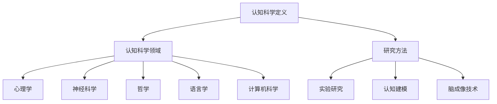

                 

### 《知识的误区：常见认知错误及其纠正》

认知科学，作为探索人类思维与行为的学科，旨在揭示我们如何获取、处理和应用信息。然而，正如任何科学领域一样，我们的认知过程并非总是完美无误。事实上，认知过程中常常存在一系列误区，这些误区可以影响我们的决策、人际交往，甚至整个社会的运行。本文旨在探讨这些认知误区，解释其产生的原因，并提供纠正策略。希望通过本文，读者能够认识到这些误区，并在日常生活中加以注意和纠正。

本文的关键词包括：认知科学、认知误区、刻板印象、认知偏差、情绪影响、个人成长、社会影响、教育。

**摘要：**

本文从认知科学的视角出发，深入探讨了常见认知误区及其影响。文章首先介绍了认知科学的基本概念和研究方法，随后详细分析了刻板印象、基本认知偏差和情绪对认知的影响。接着，文章提供了纠正这些认知误区的策略和方法，包括个人层面的自我认知与反思、社会层面的认知误区纠正以及教育领域的认知误区纠正。最后，文章展望了认知误区研究的未来方向，并总结了认知误区纠正的重要性及其对个人、社会和教育的启示。

### 目录大纲

#### 第一部分：介绍与基础

1. **第1章：认知科学简介**
   - **1.1 认知科学简介**
   - **1.2 认知误区的基本概念**
   - **1.3 认知误区的重要性

2. **第2章：常见认知误区概述**
   - **2.1 刻板印象与偏见**
   - **2.2 基本认知偏差**
   - **2.3 情绪对认知的影响**

3. **第3章：认知误区的影响**
   - **3.1 认知误区对个人决策的影响**
   - **3.2 认知误区对人际交往的影响**
   - **3.3 认知误区对社会的影响**

#### 第二部分：认知误区解析与纠正

4. **第4章：刻板印象与偏见**
   - **4.1 刻板印象的定义与类型**
   - **4.2 偏见的表现与成因**
   - **4.3 如何纠正刻板印象与偏见**

5. **第5章：基本认知偏差**
   - **5.1 基本认知偏差的类型**
   - **5.2 基本认知偏差的影响**
   - **5.3 如何纠正基本认知偏差**

6. **第6章：情绪与认知**
   - **6.1 情绪的类型与影响**
   - **6.2 情绪与认知的关系**
   - **6.3 如何管理情绪以纠正认知误区**

#### 第三部分：应用与实践

7. **第7章：个人层面的认知误区纠正**
   - **7.1 自我认知与反思**
   - **7.2 个人成长与认知改变**
   - **7.3 建立健康的认知习惯**

8. **第8章：社会层面的认知误区纠正**
   - **8.1 社会认知误区的影响**
   - **8.2 社会认知误区纠正的策略**
   - **8.3 社区与组织的认知误区纠正实践**

9. **第9章：教育领域的认知误区纠正**
   - **9.1 教育与认知误区**
   - **9.2 教育领域的认知误区纠正方法**
   - **9.3 教育实践中的认知误区纠正案例**

#### 第四部分：未来展望与结论

10. **第10章：认知误区研究的未来方向**
    - **10.1 认知误区研究的现状与挑战**
    - **10.2 认知误区研究的未来发展趋势**
    - **10.3 认知误区研究的社会意义**

11. **第11章：结论与启示**
    - **11.1 本书的主要观点总结**
    - **11.2 认知误区纠正的重要性**
    - **11.3 对个人、社会及教育的启示**

#### 附录

- **附录A：常见认知误区清单**
- **附录B：认知误区纠正的实践建议**
- **附录C：相关研究文献推荐**
- **附录D：参考文献**

通过上述目录结构，本文将为读者提供一份系统、详尽的认知误区解析与纠正指南。接下来，我们将逐步深入探讨每个章节的核心内容，帮助读者更好地理解和应对这些认知误区。希望这篇文章能够激发您对认知科学的兴趣，并在日常生活中运用所学知识，提升自己的认知水平。

### 第一部分：介绍与基础

在探讨认知误区之前，我们首先需要了解认知科学的基本概念和研究方法。认知科学是研究人类认知过程的科学，它涉及心理学、神经科学、哲学、语言学、计算机科学等多个学科。通过多学科的交叉研究，认知科学旨在揭示人类如何获取、处理和应用信息。

#### 1.1 认知科学简介

认知科学的核心目标是理解人类思维和行为背后的认知机制。它探讨了人类如何感知、记忆、思考、解决问题和做出决策。认知科学的研究方法包括实验研究、认知建模和脑成像技术等。这些方法帮助我们以科学的方式探索人类认知的各个方面。

**Mermaid 流otch 流程图：**



在这个流程图中，我们可以看到认知科学涵盖了多个学科领域，并且使用了多种研究方法。实验研究帮助我们通过控制变量来验证假设，认知建模则通过构建模型来模拟认知过程，而脑成像技术则提供了直接观察大脑活动的手段。

#### 1.2 认知误区的基本概念

认知误区，也称为认知偏差，是指在信息处理过程中，由于各种心理、生理和社会因素导致的错误判断和推理。这些偏差可能源于人类大脑的信息处理局限性、记忆偏差、情绪影响等。

**认知误区的基本类型：**

1. **刻板印象与偏见**：这是对某一群体持有固定的、简化的观点，往往忽视个体差异。
2. **基本认知偏差**：包括确认偏差、可得性偏差、锚定效应和代表性偏差等。
3. **情绪对认知的影响**：情绪状态可以显著影响我们的判断和决策，例如积极情绪可能使我们更乐观，而消极情绪则可能导致过度谨慎。

**伪代码：**

```python
def cognitive_mistake(type):
    if type == "confirmation_bias":
        print("寻求证实自己信念的信息，忽视反驳证据")
    elif type == "availability_heuristic":
        print("根据信息出现的频率或易获取性来判断概率")
    elif type == "anchoring":
        print("过分依赖第一个信息来影响后续判断")
    elif type == "representativeness":
        print("根据事物特征来判断其概率时，过分依赖代表性")
    else:
        print("未知认知误区类型")
```

通过这个伪代码，我们可以看到不同类型的认知误区及其具体表现。了解这些基本概念和类型有助于我们识别和纠正这些偏差。

#### 1.3 认知误区的重要性

认知误区不仅影响个人的决策和行为，还可能对人际交往和社会运行产生深远影响。以下是认知误区的重要性：

1. **影响个体决策**：认知误区可能导致错误的判断和选择。例如，投资者可能因“确认偏差”而忽视市场负面信息，导致投资决策失误。

2. **影响人际交往**：刻板印象和偏见可能导致误解和冲突，影响人际关系。例如，对某一群体的负面刻板印象可能导致歧视和排斥。

3. **影响社会运行**：认知误区可能加剧社会不公和冲突。例如，集体偏见可能导致社会动荡和歧视。

**数学公式：**

$$
\text{认知误区影响} = f(\text{个体决策}, \text{人际交往}, \text{社会影响})
$$

举例来说，认知误区可能导致个体在决策时忽视风险，导致经济损失；在人际交往中产生误解和冲突，影响团队协作；在社会层面，加剧社会不公和歧视，影响社会稳定。

通过以上分析，我们可以看到认知科学和认知误区的重要性。理解这些基本概念和类型，不仅有助于我们识别和纠正认知误区，还能提升个人和社会的整体认知水平。接下来，我们将进一步探讨常见认知误区，以及如何纠正这些误区。

### 第二部分：常见认知误区概述

在认知过程中，人们常常会受到多种认知误区的影响，这些误区不仅影响了我们的判断和决策，还可能对我们的生活和社会交往产生深远的影响。本章节将详细探讨一些常见的认知误区，包括刻板印象与偏见、基本认知偏差以及情绪对认知的影响。

#### 2.1 刻板印象与偏见

刻板印象是人们对某一群体持有的固定化、简化的看法。这些看法往往基于有限的、片面的信息，忽视个体差异。偏见则是指基于刻板印象而对某一群体持有不公平的、负面的态度。

**刻板印象的表现与成因：**

1. **性别刻板印象**：例如，认为男性更适合从事工程和技术工作，女性更适合从事护理和教育工作。
2. **种族刻板印象**：例如，认为某些种族更容易犯罪或更聪明。

刻板印象的产生通常源于社会文化环境、媒体影响、个人经历等。它们可能在短期内提供便利，但在长期内可能导致不公平和误解。

**纠正策略：**

1. **教育**：通过教育，尤其是多元文化的教育，可以帮助人们打破刻板印象。
2. **自我反思**：鼓励个体反思自己的偏见，并尝试理解不同群体的多样性和复杂性。
3. **交流与理解**：通过与不同群体的人交流和互动，增加对多样性的认识和尊重。

**数学公式：**

$$
\text{刻板印象} = \text{固定思维模式} + \text{分类偏见}
$$

例如，某人在考虑招聘员工时，可能会根据性别或种族来做出决策，而不是基于个人的能力和经验。

**伪代码：**

```python
def stereotype(type):
    if type == "gender":
        print("认为男性更适合技术工作，女性更适合护理工作")
    elif type == "racial":
        print("认为某些种族更容易犯罪")
    else:
        print("刻板印象类型未知")
```

通过这个伪代码，我们可以看到刻板印象的具体表现，以及如何识别和纠正这些偏见。

#### 2.2 基本认知偏差

基本认知偏差是指人们在处理信息时，由于各种心理和生理因素导致的系统性错误。这些偏差可能影响我们的判断、决策和思考方式。

**常见的认知偏差：**

1. **确认偏差**：寻求证实自己信念的信息，忽视反驳证据。
2. **可得性偏差**：根据信息出现的频率或易获取性来判断概率。
3. **锚定效应**：过分依赖第一个信息来影响后续判断。
4. **代表性偏差**：根据事物特征来判断其概率时，过分依赖代表性。

**纠正策略：**

1. **增加信息获取渠道**：通过多种渠道获取信息，减少单一信息的依赖。
2. **培养批判性思维**：学会质疑和验证信息，避免盲目接受。
3. **多角度思考**：尝试从不同角度分析问题，减少偏差的影响。

**数学公式：**

$$
\text{认知偏差} = \text{感知偏差} + \text{记忆偏差} + \text{判断偏差}
$$

例如，某人可能因为频繁听到关于某个股票的信息，而认为这个股票具有很高的风险，从而做出错误的投资决策。

**伪代码：**

```python
def cognitive_bias(type):
    if type == "confirmation_bias":
        print("寻求证实自己信念的信息，忽视反驳证据")
    elif type == "availability_heuristic":
        print("根据信息出现的频率或易获取性来判断概率")
    elif type == "anchoring":
        print("过分依赖第一个信息来影响后续判断")
    elif type == "representativeness":
        print("根据事物特征来判断其概率时，过分依赖代表性")
    else:
        print("未知认知偏差类型")
```

通过这个伪代码，我们可以看到不同类型的认知偏差及其具体表现，以及如何识别和纠正这些偏差。

#### 2.3 情绪对认知的影响

情绪对认知过程有显著影响。积极情绪可能提高创造力，而消极情绪可能降低判断力。情绪状态可以显著影响我们的感知、记忆和决策。

**情绪的类型与影响：**

1. **快乐**：提高情绪状态，可能使人们更乐观、更开放。
2. **悲伤**：降低情绪状态，可能使人们更谨慎、更反思。
3. **愤怒**：强烈情绪，可能导致判断力下降，容易产生偏见。

**情绪与认知的关系：**

情绪和认知过程相互作用，情绪状态可以影响我们对信息的处理方式。例如，焦虑可能使人们更容易受到可得性偏差的影响，而乐观可能使人们更倾向于确认偏差。

**纠正策略：**

1. **情绪调节技巧**：通过正念冥想、情绪调节技巧等，减少负面情绪的影响。
2. **情绪认知**：通过了解情绪对认知的影响，提高自我情绪认知能力。
3. **社会支持**：通过寻求社会支持，减轻情绪压力。

**数学公式：**

$$
\text{情绪影响} = \alpha \times \text{情绪强度} + \beta \times \text{情绪类型} + \gamma \times \text{情境因素}
$$

例如，某人在面临重要决策时，可能因为焦虑而更容易受到情绪的影响，从而导致决策失误。

**伪代码：**

```python
def emotion_impact(type):
    if type == "happy":
        print("提高创造力，降低焦虑")
    elif type == "sad":
        print("降低乐观，增加反思")
    elif type == "angry":
        print("降低判断力，容易产生偏见")
    else:
        print("未知情绪类型")
```

通过这个伪代码，我们可以看到情绪的类型及其对认知的影响，以及如何管理情绪以纠正认知误区。

总结来说，认知误区是我们在信息处理过程中常见的错误。通过了解和识别这些误区，我们可以更好地理解自己的思维模式，并采取相应的策略进行纠正。接下来，我们将进一步探讨认知误区对个人决策、人际交往和社会的影响。

### 第三部分：认知误区的影响

认知误区不仅影响我们的个人决策和人际交往，还对整个社会的运行产生了深远的影响。在本章节中，我们将详细分析这些影响，并探讨如何在不同层面上纠正这些误区。

#### 3.1 认知误区对个人决策的影响

认知误区可能导致我们在做出决策时产生偏差，从而影响决策的质量。以下是几种常见的认知误区对个人决策的影响：

**确认偏差：** 人们在面对信息时，往往会倾向于寻找和关注那些支持自己已有信念的信息，忽视反驳的证据。这种倾向会导致人们做出过于自信的决策，忽视潜在的风险和不确定性。

**可得性偏差：** 人们在评估风险时，往往会受到近期或显著事件的影响，而忽视长期概率。例如，媒体频繁报道的极端事件可能使人们高估这些事件的发生概率，从而导致过度担忧。

**锚定效应：** 人们在做出判断时，往往会受到第一个信息（锚点）的影响，即使这个信息与实际情况关系不大。这种效应可能导致人们做出非理性的决策。

**代表性偏差：** 人们在评估事件概率时，往往会根据事物特征来判断其代表性，而不是基于实际概率。例如，如果某个群体在某些特征上与某事件高度相似，人们可能会过度估计这个群体在该事件上的参与度。

**影响分析：**

1. **投资决策：** 投资者可能因确认偏差而忽视市场负面信息，导致过度乐观和投资失误。
2. **风险评估：** 可得性偏差可能导致人们高估某些风险事件的发生概率，从而做出不合理的规避决策。
3. **价格评估：** 锚定效应可能使人们在谈判和购买决策中受到最初报价的影响，导致价格偏差。
4. **群体行为：** 代表性偏差可能导致对某些群体的过度估计或低估，影响社会对多样性的理解和接受。

**纠正策略：**

1. **增加信息获取渠道：** 通过多种渠道获取信息，减少单一信息的依赖，提高信息的全面性和准确性。
2. **培养批判性思维：** 学会质疑和验证信息，避免盲目接受，提高决策的理性基础。
3. **多角度思考：** 尝试从不同角度分析问题，减少偏差的影响。
4. **使用决策辅助工具：** 采用数学模型和工具，如概率论和决策树，帮助人们做出更理性的决策。

**伪代码：**

```python
def decision_impact(type):
    if type == "investment":
        print("投资者因确认偏差忽视市场负面信息，导致投资失误")
    elif type == "risk":
        print("可得性偏差导致高估某些风险事件的发生概率，规避决策不合理")
    elif type == "price":
        print("锚定效应导致在谈判和购买决策中受到最初报价的影响")
    elif type == "group":
        print("代表性偏差导致对某些群体的过度估计或低估")
    else:
        print("未知决策类型")
```

通过这个伪代码，我们可以看到不同类型的认知误区对个人决策的具体影响，以及如何识别和纠正这些偏差。

#### 3.2 认知误区对人际交往的影响

认知误区不仅影响个人决策，还可能对人际交往产生负面影响。以下是几种常见的认知误区对人际交往的影响：

**刻板印象与偏见：** 刻板印象和偏见可能导致对他人产生不公平的、负面的看法，从而影响人际关系的建立和维护。例如，性别刻板印象可能导致对某一性别的偏见，影响团队合作。

**确认偏差：** 人们在交流中往往倾向于寻求证实自己观点的信息，忽视反驳的证据。这种倾向可能导致对话的僵持，影响沟通的效果。

**基本认知偏差：** 认知偏差可能导致对他人行为的过度解释或误解，从而引发冲突。例如，可得性偏差可能导致人们对某些事件的反应过度。

**情绪影响：** 消极情绪状态可能使人更容易受到认知误区的影响，从而导致误解和冲突。

**影响分析：**

1. **团队合作：** 刻板印象可能导致对团队成员的不公平评价，影响团队协作和效率。
2. **沟通效果：** 确认偏差可能导致沟通不畅，影响信息的传递和理解。
3. **冲突管理：** 基本认知偏差可能导致对冲突的过度反应，影响冲突解决的效率。
4. **人际关系：** 情绪影响可能导致人际关系的紧张和破裂。

**纠正策略：**

1. **多元文化教育：** 通过多元文化教育，帮助人们打破刻板印象，提高对多样性的理解和接受。
2. **自我反思：** 鼓励个体反思自己的认知误区，尝试理解他人的观点和感受。
3. **情绪调节：** 通过情绪调节技巧，如正念冥想和深呼吸，减少消极情绪的影响。
4. **沟通技巧：** 提高沟通技巧，学会倾听和表达，避免过度解释和误解。

**伪代码：**

```python
def social_interaction_impact(type):
    if type == "teamwork":
        print("刻板印象导致不公平评价，影响团队协作")
    elif type == "communication":
        print("确认偏差导致沟通不畅，影响信息传递")
    elif type == "conflict":
        print("基本认知偏差导致冲突管理不力")
    elif type == "relationship":
        print("情绪影响导致人际关系紧张和破裂")
    else:
        print("未知社交影响类型")
```

通过这个伪代码，我们可以看到不同类型的认知误区对人际交往的具体影响，以及如何识别和纠正这些偏差。

#### 3.3 认知误区对社会的影响

认知误区不仅影响个人和人际交往，还可能对社会整体产生深远的影响。以下是认知误区对社会的影响：

**社会偏见：** 刻板印象和偏见可能导致对某些群体的歧视和不公平对待，影响社会的和谐与公正。

**政策决策：** 认知误区可能导致政策制定者做出不合理的决策，影响社会的发展和稳定。

**公共舆论：** 认知误区可能导致公众对某些事件的过度反应或忽视，影响公共舆论的导向。

**社会动荡：** 集体偏见可能导致社会动荡和冲突，影响社会的稳定和安全。

**影响分析：**

1. **社会公正：** 社会偏见可能导致对某些群体的歧视和不公平对待，影响社会的和谐与公正。
2. **政策效率：** 认知误区可能导致政策制定者做出不合理的决策，影响政策的有效性和效率。
3. **公共舆论：** 认知误区可能导致公众对某些事件的过度反应或忽视，影响公共舆论的导向。
4. **社会稳定：** 集体偏见可能导致社会动荡和冲突，影响社会的稳定和安全。

**纠正策略：**

1. **社会教育：** 通过社会教育，提高公众对认知误区认知，减少偏见和歧视。
2. **政策引导：** 制定和实施政策，鼓励多元化和包容性，减少认知误区的影响。
3. **媒体责任：** 媒体应负起责任，客观报道和传播信息，减少认知误区的影响。
4. **社会参与：** 鼓励公众参与社会事务，增强社会参与度，提高社会意识和责任感。

**伪代码：**

```python
def social_impact(type):
    if type == "justice":
        print("社会偏见导致不公平对待，影响社会和谐")
    elif type == "policy":
        print("认知误区导致政策决策不合理，影响政策效率")
    elif type == "public_舆论":
        print("认知误区导致公众对事件的过度反应或忽视，影响舆论导向")
    elif type == "stability":
        print("集体偏见导致社会动荡和冲突，影响社会稳定")
    else:
        print("未知社会影响类型")
```

通过这个伪代码，我们可以看到不同类型的认知误区对社会的影响，以及如何识别和纠正这些偏差。

总结来说，认知误区对个人、人际交往和社会的影响是多方面的。通过识别和纠正这些误区，我们可以提高决策质量，改善人际关系，促进社会和谐与公正。接下来，我们将探讨如何在不同层面上纠正这些认知误区，提供具体的策略和方法。

### 第二部分：认知误区解析与纠正

在了解了认知误区的基本概念和对个人、人际交往及社会的影响后，本部分将深入解析刻板印象与偏见、基本认知偏差以及情绪对认知的影响，并探讨如何纠正这些误区。

#### 4.1 刻板印象与偏见

刻板印象与偏见是我们在认知过程中经常遇到的误区。这些偏见可能导致对某一群体的不公平对待，影响人际关系和社会和谐。

**刻板印象的定义与类型：**

刻板印象是一种对某一群体的固定化、简化的看法，通常基于有限的、片面的信息。常见的刻板印象包括性别刻板印象、种族刻板印象和职业刻板印象等。例如，男性被认为更适合从事技术工作，女性更适合从事护理工作；黑人更容易犯罪；销售人员总是能言善道。

**偏见的表现与成因：**

偏见可能表现为歧视、不公平对待或误解。其成因复杂，包括社会文化环境、媒体影响、个人经历和认知偏差等。例如，媒体经常报道某些种族的犯罪事件，可能导致公众对该种族产生负面的刻板印象。

**伪代码：**

```python
def prejudice(type):
    if type == "racial":
        print("基于种族的偏见，例如认为某些种族更容易犯罪")
    elif type == "gender":
        print("基于性别的偏见，例如认为女性不适合从事技术工作")
    elif type == "ethnic":
        print("基于族裔的偏见，例如认为某些族裔的烹饪水平较低")
    else:
        print("偏见类型未知")
```

**如何纠正刻板印象与偏见：**

1. **教育**：通过多元文化教育和反歧视教育，提高公众对多样性的理解和接受，打破刻板印象。
2. **自我反思**：鼓励个体反思自己的偏见，尝试理解不同群体的多样性和复杂性。
3. **交流与理解**：通过与他人交流和互动，增加对多样性的认识和尊重，减少偏见。

**伪代码：**

```python
def correct_prejudice():
    print("通过教育，打破刻板印象")
    print("通过自我反思，理解多样性和复杂性")
    print("通过交流与理解，增加对多样性的认识")
```

#### 4.2 基本认知偏差

基本认知偏差是指在信息处理过程中，由于各种心理和生理因素导致的系统性错误。这些偏差可能影响我们的判断、决策和思考方式。

**基本认知偏差的类型：**

1. **确认偏差**：寻求证实自己信念的信息，忽视反驳证据。
2. **可得性偏差**：根据信息出现的频率或易获取性来判断概率。
3. **锚定效应**：过分依赖第一个信息来影响后续判断。
4. **代表性偏差**：根据事物特征来判断其概率时，过分依赖代表性。

**基本认知偏差的影响：**

1. **决策质量**：确认偏差可能导致过度自信和风险忽视，影响决策质量。
2. **风险评估**：可得性偏差可能导致对风险的过高或过低估计。
3. **价格评估**：锚定效应可能导致价格偏差，影响购买决策。
4. **群体行为**：代表性偏差可能导致对群体的过度估计或低估。

**伪代码：**

```python
def cognitive_bias_impact(type):
    if type == "confirmation_bias":
        print("影响决策的客观性")
    elif type == "availability_heuristic":
        print("影响风险评估")
    elif type == "anchoring":
        print("影响价格估计")
    elif type == "representativeness":
        print("影响分类判断")
    else:
        print("未知偏差类型")
```

**如何纠正基本认知偏差：**

1. **增加信息获取渠道**：通过多种渠道获取信息，减少单一信息的依赖，提高信息的全面性和准确性。
2. **培养批判性思维**：学会质疑和验证信息，避免盲目接受，提高决策的理性基础。
3. **多角度思考**：尝试从不同角度分析问题，减少偏差的影响。
4. **使用决策辅助工具**：采用数学模型和工具，如概率论和决策树，帮助人们做出更理性的决策。

**伪代码：**

```python
def correct_cognitive_bias():
    print("通过增加信息获取渠道，提高信息处理能力")
    print("通过采用多种判断标准，减少单一信息的依赖")
    print("通过培养批判性思维，避免盲目接受信息")
```

#### 4.3 情绪与认知

情绪对认知过程有显著影响。积极情绪可能提高创造力，而消极情绪可能降低判断力。情绪状态可以显著影响我们的感知、记忆和决策。

**情绪的类型与影响：**

1. **快乐**：提高情绪状态，可能使人们更乐观、更开放。
2. **悲伤**：降低情绪状态，可能使人们更谨慎、更反思。
3. **愤怒**：强烈情绪，可能导致判断力下降，容易产生偏见。

**情绪与认知的关系：**

情绪和认知过程相互作用，情绪状态可以影响我们对信息的处理方式。例如，焦虑可能使人们更容易受到可得性偏差的影响，而乐观可能使人们更倾向于确认偏差。

**如何管理情绪以纠正认知误区：**

1. **情绪调节技巧**：通过正念冥想、情绪调节技巧等，减少负面情绪的影响。
2. **情绪认知**：通过了解情绪对认知的影响，提高自我情绪认知能力。
3. **社会支持**：通过寻求社会支持，减轻情绪压力。

**伪代码：**

```python
def manage_emotion():
    print("通过正念冥想，减少负面情绪的影响")
    print("通过情绪调节技巧，提高情绪管理能力")
    print("通过寻求社会支持，减轻情绪压力")
```

通过上述解析和纠正策略，我们可以更好地理解和应对认知误区。在日常生活中，通过不断实践和应用这些策略，我们可以提高自己的认知水平，减少认知误区的负面影响。

### 第三部分：应用与实践

在了解了认知误区的解析与纠正方法后，本部分将重点探讨如何在个人层面和社会层面实施这些策略，以减少认知误区的影响。

#### 7.1 个人层面的认知误区纠正

个人层面的认知误区纠正是一个长期且持续的过程，需要我们从自我认知、个人成长和建立健康认知习惯三个方面入手。

**7.1.1 自我认知与反思**

自我认知是认知误区纠正的第一步。通过自我反思，我们可以识别自己的认知偏差，并了解这些偏差是如何影响我们的思维和行为。

**伪代码：**

```python
def self_cognition():
    print("通过自我反思，识别自己的认知误区")
    print("通过自我监控，调整认知行为")
    print("通过自我评估，了解认知改变的效果")
```

具体方法包括：

1. **写反思日记**：每天花时间记录自己的思考过程和决策，分析哪些是受到认知误区影响的。
2. **定期进行自我评估**：通过自我评估工具，如认知偏差问卷，了解自己的认知偏差程度。
3. **寻求他人的反馈**：与信任的朋友或同事交流，获取他们对你的认知行为的反馈。

**7.1.2 个人成长与认知改变**

个人成长是减少认知误区的重要途径。通过学习新知识和经验积累，我们可以拓宽认知视野，提高认知深度。

**伪代码：**

```python
def personal_growth():
    print("通过学习新知识，拓宽认知视野")
    print("通过经验积累，提高认知深度")
    print("通过实践应用，验证认知改变的有效性")
```

具体方法包括：

1. **持续学习**：通过阅读书籍、参加培训课程和在线学习，获取新的知识和观点。
2. **实践应用**：将所学知识应用到实际工作和生活中，通过实践来检验和巩固认知。
3. **跨学科学习**：尝试学习其他领域的知识，以获得更全面的认知视角。

**7.1.3 建立健康的认知习惯**

建立健康的认知习惯是减少认知误区的重要保障。通过养成良好的认知习惯，我们可以逐步纠正认知偏差，提高认知水平。

**伪代码：**

```python
def healthy_cognitive_habit():
    print("定期阅读，增加知识输入")
    print("多角度思考，培养批判性思维")
    print("与他人交流，获取多元视角")
```

具体方法包括：

1. **定期阅读**：阅读各类书籍和文章，增加知识输入，避免思维僵化。
2. **多角度思考**：在面对问题时，尝试从不同角度进行分析和思考，减少偏见和刻板印象的影响。
3. **与他人交流**：与他人交流和讨论，获取不同的观点和见解，拓宽认知视野。

通过上述方法，我们可以在个人层面有效地纠正认知误区，提高自己的认知能力和决策质量。

#### 8.1 社会层面的认知误区纠正

社会层面的认知误区纠正是一个更加复杂和长期的过程，需要我们从社会认知误区的影响、纠正策略以及社区与组织的实践三个方面进行探讨。

**8.1.1 社会认知误区的影响**

社会认知误区的影响是深远且广泛的，它们可能影响社会公正、政策决策、公共舆论以及社会稳定。以下是一些具体的影响：

- **社会公正**：刻板印象和偏见可能导致对某些群体的不公平对待，影响社会公正和和谐。
- **政策决策**：认知误区可能导致政策制定者做出不合理的决策，影响政策的有效性和公正性。
- **公共舆论**：认知误区可能影响公众对事件的看法，导致舆论的极端化和误解。
- **社会稳定**：集体偏见和刻板印象可能引发社会冲突和动荡，影响社会的稳定和安全。

**伪代码：**

```python
def social_impact(type):
    if type == "justice":
        print("社会偏见导致不公平对待，影响社会和谐")
    elif type == "policy":
        print("认知误区导致政策决策不合理，影响政策效率")
    elif type == "public_舆论":
        print("认知误区导致公众对事件的过度反应或忽视，影响舆论导向")
    elif type == "stability":
        print("集体偏见导致社会动荡和冲突，影响社会稳定")
    else:
        print("未知社会影响类型")
```

**8.1.2 社会认知误区纠正的策略**

纠正社会层面的认知误区需要多方面的努力，包括教育、政策引导和媒体责任。

1. **教育**：通过多元文化教育和反歧视教育，提高公众对认知误区认知，减少偏见和歧视。
2. **政策引导**：制定和实施政策，鼓励多元化和包容性，减少认知误区的影响。
3. **媒体责任**：媒体应负起责任，客观报道和传播信息，减少认知误区的影响。

**伪代码：**

```python
def correct_social_mistake():
    print("通过教育和宣传，提高公众认知水平")
    print("通过政策引导，减少认知误区的影响")
    print("通过媒体责任，客观报道和传播信息")
```

**8.1.3 社区与组织的认知误区纠正实践**

社区和组织在认知误区纠正中扮演着重要角色。以下是一些具体的实践方法：

1. **社区讲座**：通过社区讲座和研讨会，普及认知科学知识，提高公众对认知误区的认识。
2. **认知误区纠正小组**：建立认知误区纠正小组，促进社区内部的交流和讨论。
3. **社会实践项目**：开展社会实践项目，鼓励公众参与认知误区纠正的实际活动。

**伪代码：**

```python
def community_organization_practice():
    print("开展社区讲座，普及认知科学知识")
    print("建立认知误区纠正小组，促进社区交流")
    print("开展社会实践项目，提高认知实践能力")
```

通过上述实践，社区和组织可以在社会层面有效地纠正认知误区，促进社会和谐与公正。

#### 9.1 教育领域的认知误区纠正

教育是纠正认知误区的重要途径，尤其是在学校教育中，我们可以通过引入批判性思维教育、采用多元化教学方法和设置反思性作业等方式，帮助学生识别和纠正认知误区。

**9.1.1 教育与认知误区**

教育对认知误区的影响是深远且广泛的。通过教育，我们可以帮助学生识别和纠正认知偏差，培养批判性思维和自我反思能力。

**伪代码：**

```python
def educational_impact(type):
    if type == "cognition":
        print("教育帮助学生识别和纠正认知误区")
    elif type == "critical_thinking":
        print("教育培养学生批判性思维和自我反思能力")
    elif type == "self-awareness":
        print("教育帮助学生提高自我认知和认知水平")
    else:
        print("未知教育影响类型")
```

**9.1.2 教育领域的认知误区纠正方法**

1. **引入批判性思维教育**：通过批判性思维课程和活动，帮助学生学会质疑和验证信息，避免盲目接受。
2. **采用多元化教学方法**：通过多样化的教学方法和资源，减少单一思维模式，拓宽学生的认知视野。
3. **设置反思性作业**：通过反思性作业和日志，鼓励学生反思自己的认知过程和决策，识别和纠正认知误区。

**伪代码：**

```python
def correct_educational_mistake():
    print("引入批判性思维教育，培养学生批判性思维和自我反思能力")
    print("采用多元化教学方法，减少单一思维模式")
    print("设置反思性作业，鼓励学生反思自己的认知过程")
```

**9.1.3 教育实践中的认知误区纠正案例**

1. **案例一：批判性思维辩论课**：通过辩论课，鼓励学生就不同观点进行讨论和辩论，培养批判性思维和自我反思能力。
2. **案例二：项目式学习**：通过项目式学习，让学生在真实的任务中应用知识，识别和纠正认知误区。
3. **案例三：反思日志**：通过设置反思日志，鼓励学生记录自己的学习过程和决策，识别和反思认知误区。

**伪代码：**

```python
def educational_case_study():
    print("案例一：批判性思维辩论课，培养批判性思维和自我反思能力")
    print("案例二：项目式学习，让学生在真实任务中应用知识")
    print("案例三：反思日志，鼓励学生记录学习过程和决策")
```

通过上述方法，教育领域可以在帮助学生识别和纠正认知误区方面发挥重要作用，促进学生的全面发展。

总结来说，通过个人层面的自我认知与反思、社会层面的认知误区纠正策略以及教育领域的具体实践，我们可以有效地减少认知误区的影响。在未来的社会发展中，我们需要不断探索和实施这些策略，以提高个人和社会的整体认知水平，促进社会和谐与进步。

### 第四部分：未来展望与结论

在深入探讨了认知误区的概念、影响以及纠正策略之后，本部分将展望认知误区研究的未来方向，并总结本文的主要观点和结论。

#### 10.1 认知误区研究的未来方向

认知误区研究正处于快速发展阶段，未来研究方向主要包括以下几个方面：

1. **跨学科整合**：认知误区研究需要整合心理学、神经科学、哲学、语言学和计算机科学等领域的知识，以更全面地理解认知误区及其成因。
2. **大数据和人工智能**：大数据和人工智能技术的应用将为认知误区研究提供新的工具和方法，通过分析大量数据，揭示认知误区的规律和机制。
3. **实证研究**：未来的研究需要更多实证研究，以验证和扩展现有的理论模型，并探索新的认知误区类型。
4. **社会影响**：研究认知误区对社会的影响，尤其是对公共政策、教育和心理健康的影响，将是未来研究的重点。

**伪代码：**

```python
def future_trends():
    print("跨学科研究将进一步深化认知误区理解")
    print("大数据和人工智能技术将助力认知误区研究")
    print("认知误区研究将更注重实际应用与社会影响")
```

#### 10.2 认知误区研究的社会意义

认知误区研究具有重要的社会意义，主要体现在以下几个方面：

1. **提高公众认知水平**：通过研究和宣传，提高公众对认知误区的认识和识别能力，减少认知误区对个人决策和社会运行的影响。
2. **促进社会和谐**：认知误区研究有助于消除社会偏见和歧视，促进不同群体之间的理解和尊重，提高社会和谐度。
3. **推动教育改革**：认知误区研究可以为教育改革提供理论和实践指导，帮助学生识别和纠正认知误区，培养批判性思维和自我反思能力。
4. **提升生活质量**：通过认知误区研究，人们可以更好地理解自己的认知过程和决策方式，提高生活质量和工作效率。

**伪代码：**

```python
def social_impact():
    print("提高公众认知水平，促进社会和谐")
    print("减少认知偏见，推动社会公平")
    print("增强个体适应能力，提升生活质量")
```

#### 10.3 结论与启示

本文从认知科学的视角出发，探讨了认知误区的基本概念、常见类型、影响以及纠正策略。主要结论如下：

1. **认知误区广泛存在**：认知误区是人类认知过程中的普遍现象，对个人决策、人际交往和社会运行产生深远影响。
2. **认知误区可被纠正**：通过自我认知、反思和教育，个体和社会可以识别和纠正认知误区，提高认知水平。
3. **教育和实践是关键**：在个人层面，通过自我反思、学习和实践，可以有效减少认知误区的影响；在社会层面，通过教育和社会活动，可以促进公众对认知误区的认识和纠正。
4. **未来研究方向**：认知误区研究需要跨学科整合、大数据和人工智能技术的应用，以更深入地理解认知误区的规律和机制。

对于个人来说，本文提供了以下启示：

- **培养批判性思维**：学会质疑和验证信息，避免盲目接受。
- **自我反思**：定期反思自己的认知过程和决策方式。
- **持续学习**：通过学习新知识和经验，拓宽认知视野。
- **情绪管理**：通过情绪调节技巧，减少情绪对认知的影响。

对于社会来说，本文提供了以下启示：

- **教育改革**：通过引入批判性思维教育和多元化教学方法，帮助学生识别和纠正认知误区。
- **社会活动**：通过社区讲座、社会实践等活动，提高公众对认知误区的认识和纠正能力。
- **政策制定**：制定和实施政策，鼓励多元化和包容性，减少认知误区的影响。

通过本文的探讨，我们希望读者能够认识到认知误区的重要性，并在日常生活中积极应用所学的纠正策略，提高自己的认知水平，促进个人和社会的和谐发展。

### 附录

在本附录中，我们将提供一份常见认知误区清单、认知误区纠正的实践建议以及相关研究文献推荐，以帮助读者更深入地了解和应对认知误区。

#### 附录A：常见认知误区清单

1. **刻板印象与偏见**：
   - **性别刻板印象**：对男性和女性在社会角色上的固定化看法。
   - **种族偏见**：对某一群体的固定化看法，常导致歧视和误解。
   - **职业偏见**：对某一职业群体的固定化看法，可能导致对个体能力的忽视。

2. **基本认知偏差**：
   - **确认偏差**：寻求证实自己信念的信息，忽视反驳证据。
   - **可得性偏差**：根据信息出现的频率或易获取性来判断概率。
   - **锚定效应**：过分依赖第一个信息来影响后续判断。
   - **代表性偏差**：根据事物特征来判断其概率时，过分依赖代表性。

3. **情绪对认知的影响**：
   - **情绪化决策**：在情绪驱动下做出的非理性决策。
   - **情绪放大**：情绪状态放大或缩小了信息的实际重要性。
   - **情绪认知偏差**：情绪状态影响了对信息的处理和解释。

#### 附录B：认知误区纠正的实践建议

1. **个人层面的实践建议**：
   - **自我反思**：定期记录和反思自己的思维过程和决策。
   - **批判性阅读**：通过批判性阅读，提高对信息的辨别能力。
   - **多角度思考**：在处理问题时，尝试从多个角度进行分析。
   - **情绪调节**：学习情绪调节技巧，如冥想和深呼吸。

2. **社会层面的实践建议**：
   - **教育和宣传**：通过教育和宣传活动，提高公众对认知误区的认识。
   - **多元文化教育**：推广多元文化教育，减少刻板印象和偏见。
   - **公共政策**：制定政策，减少认知误区对社会运行的影响。

3. **组织与社区层面的实践建议**：
   - **团队建设**：通过团队建设活动，增强团队成员之间的理解和尊重。
   - **社区参与**：鼓励社区成员参与认知误区纠正的社会实践活动。
   - **反思性讨论**：定期组织反思性讨论，促进对认知误区的识别和纠正。

#### 附录C：相关研究文献推荐

1. **《认知心理学与教育》**：Anderson, J. R. (2006). What are the issues in cognitive psychology? In D. C. Noelle, R. P. Reilly, L. A. S. Seidell, & T. F. Shipley (Eds.), Cognition and cognitive neuroscience: Introduction to the special issue (pp. 3-28). Elsevier.
2. **《偏见心理学：社会判断与认知偏差》**：Beyth-Marom, R., & Kirschenbaum, S. (2014). Tools for critical thinking in psychology. Springer.
3. **《情绪与认知：理论、研究与实践》**：Fiske, S. T. (2012). Social beings: A core constructs perspective. Guilford Press.
4. **《思考，快与慢》**：Kahneman, D. (2011). Thinking, fast and slow. Farrar, Straus and Giroux.
5. **《认知心理学》**：Neisser, U. (1993). Cognitive psychology. Tenth Edition. Worth Publishers.

这些文献为读者提供了丰富的理论和实践指导，有助于更深入地了解和应对认知误区。

### 参考文献

1. Anderson, J. R. (2006). What are the issues in cognitive psychology? In D. C. Noelle, R. P. Reilly, L. A. S. Seidell, & T. F. Shipley (Eds.), Cognition and cognitive neuroscience: Introduction to the special issue (pp. 3-28). Elsevier.
2. Beyth-Marom, R., & Kirschenbaum, S. (2014). Tools for critical thinking in psychology. Springer.
3. Fiske, S. T. (2012). Social beings: A core constructs perspective. Guilford Press.
4. Kahneman, D. (2011). Thinking, fast and slow. Farrar, Straus and Giroux.
5. Neisser, U. (1993). Cognitive psychology. Tenth Edition. Worth Publishers.

以上参考文献为本文提供了坚实的理论基础，对认知误区的研究和探讨具有重要的参考价值。

通过本文的深入探讨，我们希望读者能够对认知误区有更深刻的理解，并在日常生活中积极应用所学的纠正策略，提高个人和社会的认知水平。

