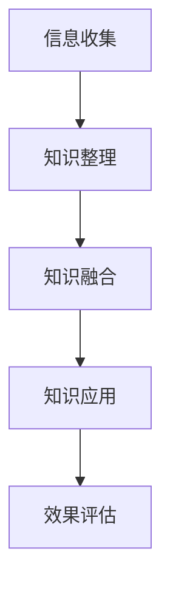

                 

# 知识的跨界整合：创新的催化剂

> **关键词**：跨界整合、知识融合、创新、算法、实践

> **摘要**：本文旨在探讨知识跨界整合在推动创新过程中的重要作用。通过阐述跨界整合的核心概念、优势与挑战，介绍相关算法原理及数学模型，并结合实际项目案例，详细解析了如何通过知识的跨界整合实现创新。

---

## 引言

在当今这个信息爆炸、技术迅猛发展的时代，跨界整合已经成为了推动创新的重要力量。所谓跨界整合，是指将不同领域、不同学科的知识和方法进行融合，从而产生新的思维、新的技术、新的产品。知识跨界整合不仅仅是不同领域知识的简单叠加，而是通过深入的融合与互促，实现知识的协同创新。

创新是现代企业发展的核心驱动力，而知识的跨界整合则为创新提供了源源不断的动力。通过跨界整合，企业可以拓宽视野，整合资源，提高创新效率，从而在激烈的市场竞争中脱颖而出。然而，跨界整合也面临着诸多挑战，如知识理解难度、文化差异、技术壁垒等。如何克服这些挑战，实现知识的有效整合，是当前亟需解决的问题。

本文将围绕知识的跨界整合展开讨论，首先介绍跨界整合的核心概念，然后分析其优势与挑战，接着介绍相关算法原理和数学模型，并通过实际项目案例进行详细解析。希望通过本文的探讨，能够为读者提供关于知识跨界整合的全面、深入的见解。

---

## 第一部分：核心概念与联系

### 第1章：核心概念与联系概述

#### 1.1 核心概念

**跨界整合的定义**：

跨界整合（Cross-Domain Integration）是指将不同领域、不同学科的知识和方法进行融合，通过跨领域的思考、整合和创新，实现知识的协同效应，推动新的技术、产品或服务的产生。

**知识类型的分类**：

知识可以分为传统知识、创新知识和跨界知识三种类型。

- **传统知识**：主要来源于历史经验和传统的教育体系，如经典文学作品、科学理论、历史事件等。
- **创新知识**：通过科学研究、技术创新等手段产生的知识，如新兴技术、研究成果等。
- **跨界知识**：将不同领域的知识进行融合而产生的新知识，如生物技术与信息技术结合产生的生物信息学。

**跨界整合的优势与挑战**：

跨界整合的优势：

1. 提高创新效率：跨界整合可以融合不同领域的优势，快速产生新的想法和解决方案。
2. 拓展知识领域：跨界整合可以拓宽知识视野，促进跨领域知识的交流和融合。
3. 增强竞争力：通过跨界整合，企业可以不断创新，提升市场竞争力。

跨界整合的挑战：

1. 知识理解难度：不同领域的知识有着不同的表达方式和理解方式，跨界整合需要深入理解各个领域的知识。
2. 文化差异：不同领域的文化差异可能导致沟通不畅，影响跨界整合的效果。
3. 技术壁垒：跨界整合可能涉及新的技术，需要克服技术壁垒，才能实现有效的整合。

---

#### 1.2 跨界整合的架构

**跨界整合流程图**：



- **信息收集**：收集来自不同领域的信息和数据。
- **知识整理**：对收集到的信息进行整理、分类和分析，提取关键知识。
- **知识融合**：将不同领域的知识进行整合，形成新的知识体系。
- **知识应用**：将整合后的知识应用于实际问题，产生新的解决方案。
- **效果评估**：对知识整合的应用效果进行评估，持续优化知识整合的过程。

---

在本章节中，我们介绍了跨界整合的核心概念，包括其定义、知识类型的分类以及跨界整合的优势与挑战。同时，我们还给出了跨界整合的架构，为后续章节的深入讨论奠定了基础。在下一章中，我们将进一步探讨知识类型的分类及其应用。

---

### 第2章：知识类型的分类

知识是推动社会进步和科技创新的重要力量。随着信息时代的到来，知识的类型日益多样化，如何对这些知识进行有效的分类和管理，是当前亟待解决的问题。本章将详细讨论知识类型的分类，包括传统知识、创新知识和跨界知识。

#### 2.1 传统知识

**传统知识的定义**：

传统知识是指经过长期历史沉淀和传承的知识，它通常以经验、习俗、传统技艺等形式存在。传统知识是人类智慧的结晶，蕴含着丰富的文化内涵和实用价值。

**传统知识的特点**：

1. **传承性**：传统知识具有明显的传承性，通过一代代人的口耳相传或文献记载得以保留和传承。
2. **地域性**：传统知识具有较强的地域性，不同地区有着各自独特的传统知识体系。
3. **实用性**：传统知识往往具有较强的实用性，能够直接应用于实际生活和生产活动中。

**传统知识的应用**：

传统知识在现代社会的应用广泛，如中医药、传统建筑、传统工艺等。这些传统知识不仅具有历史文化价值，还具有重要的经济和社会价值。

#### 2.2 创新知识

**创新知识的定义**：

创新知识是指通过科学研究、技术创新等手段产生的知识。它通常以学术论文、专利、技术标准等形式存在，反映了人类对自然规律和科技发展的最新认识。

**创新知识的特点**：

1. **前沿性**：创新知识处于科技前沿，反映了当前科学研究的最新进展。
2. **原创性**：创新知识具有原创性，是科学工作者通过独立思考、实验验证等手段产生的。
3. **实用性**：创新知识具有较强的实用性，可以应用于实际问题解决和产品创新。

**创新知识的应用**：

创新知识在现代社会中的应用非常广泛，如新材料、新能源、生物技术等。这些创新知识推动了科技革命和产业升级，对经济社会发展产生了深远影响。

#### 2.3 跨界知识

**跨界知识的定义**：

跨界知识是指将不同领域的知识进行融合而产生的新知识。它通常以跨学科、跨领域的研究形式存在，反映了知识融合和创新的思想。

**跨界知识的特点**：

1. **融合性**：跨界知识具有融合性，它将不同领域的知识进行整合，形成新的知识体系。
2. **创新性**：跨界知识具有较强的创新性，通过跨领域的思考和创新，产生新的技术和产品。
3. **复杂性**：跨界知识往往涉及多个领域，具有较高的复杂性。

**跨界知识的应用**：

跨界知识在现代社会中的应用非常广泛，如人工智能、物联网、生物信息学等。这些跨界知识推动了新兴产业的产生和发展，为经济社会发展注入了新的活力。

---

在本章节中，我们详细介绍了知识类型的分类，包括传统知识、创新知识和跨界知识。通过对这些知识类型的了解，我们可以更好地把握知识的发展趋势，发挥知识的最大价值。

在下一章中，我们将探讨跨界整合的优势与挑战，分析跨界整合在推动创新过程中的作用。

---

### 第3章：跨界整合的优势与挑战

#### 3.1 跨界整合的优势

**提高创新效率**

跨界整合通过融合不同领域的知识和方法，可以快速产生新的想法和解决方案。这种跨领域的思考方式能够打破传统的思维模式，激发创新潜能，从而提高创新效率。例如，将信息技术与生物技术进行整合，可以迅速推动生物信息学的发展，产生新的科研成果。

**拓展知识领域**

跨界整合可以拓宽知识视野，促进跨领域知识的交流和融合。通过跨界整合，不同领域的专家可以相互借鉴和吸收对方的经验和成果，从而拓展自己的知识领域。这种跨领域的交流不仅可以提高个人的专业水平，还可以推动整个行业的发展。

**增强竞争力**

跨界整合能够帮助企业整合资源，优化产品和服务，从而增强市场竞争力。通过跨界整合，企业可以快速响应市场变化，开发出满足消费者需求的新产品，从而在激烈的市场竞争中占据有利地位。例如，一些互联网公司通过跨界整合，成功地将线上线下业务相结合，打造了全新的商业模式。

#### 3.2 跨界整合的挑战

**知识理解难度**

跨界整合涉及多个领域的知识，不同领域的知识有着不同的表达方式和理解方式。因此，要实现有效的跨界整合，需要深入了解各个领域的专业知识，这无疑增加了知识理解的难度。例如，将信息技术与生物技术进行整合，需要对两个领域的知识都有深刻的理解。

**文化差异**

不同领域有着不同的文化背景和价值观，这些文化差异可能导致沟通不畅，影响跨界整合的效果。例如，在一些高科技公司中，技术团队和产品团队之间的文化差异可能会导致项目进展缓慢。因此，要实现有效的跨界整合，需要克服文化差异，建立共同的语言和价值观。

**技术壁垒**

跨界整合往往涉及新的技术，这些技术可能尚未成熟，或者存在较高的技术壁垒。要实现跨界整合，需要克服这些技术难题，这可能需要大量的时间和资源。例如，一些新兴技术如人工智能、区块链等，虽然具有巨大的潜力，但同时也存在较高的技术门槛。

---

在本章节中，我们详细分析了跨界整合的优势与挑战。跨界整合在推动创新过程中具有巨大的潜力，但同时也面临着诸多挑战。要实现有效的跨界整合，需要深入理解各个领域的专业知识，克服文化差异，克服技术壁垒。

在下一章中，我们将介绍跨界整合的核心算法原理，探讨如何通过算法实现知识的跨界整合。

---

## 第二部分：核心算法原理讲解

### 第4章：数据预处理

#### 4.1 数据收集

数据是跨界整合的基础，数据收集的质量直接影响后续整合的效果。数据收集的来源可以包括内部数据、外部数据以及在线数据等。

- **内部数据**：来自企业内部各个业务系统，如销售数据、库存数据、客户数据等。
- **外部数据**：来自公共数据库、政府数据开放平台、社交媒体等。
- **在线数据**：通过爬虫技术获取的互联网数据，如网页、论坛、博客等。

**数据收集方法**：

1. **问卷调查**：通过设计问卷，收集用户反馈和需求。
2. **数据爬取**：利用爬虫技术，从互联网上获取公开的数据。
3. **数据挖掘**：通过对已有数据进行分析，挖掘潜在的信息。

#### 4.2 数据清洗

数据清洗是数据预处理的重要步骤，目的是消除数据中的错误、不一致和不完整信息，提高数据质量。

- **缺失值处理**：对于缺失的数据，可以采用填充方法，如平均值填充、中值填充、插值法等。
- **异常值处理**：对于异常的数据，可以采用删除、变换等方法进行处理。
- **数据标准化**：将不同数据范围或数据类型的数据进行标准化处理，使其具有可比性。

**数据清洗方法**：

1. **统计方法**：通过统计分析方法，识别和处理缺失值和异常值。
2. **机器学习方法**：利用机器学习算法，如聚类、回归等，对数据进行清洗和标准化。

#### 4.3 数据转换

数据转换是将数据从一种形式转换为另一种形式的过程，目的是满足后续分析处理的需求。

- **数据类型转换**：将不同类型的数据转换为同一类型，如将字符串转换为数值。
- **数据整合**：将来自不同源的数据进行整合，形成统一的数据集。

**数据转换方法**：

1. **映射方法**：通过映射关系，将不同类型的数据转换为同一类型。
2. **集成方法**：将来自不同源的数据进行集成，形成统一的数据集。

---

在本章节中，我们详细介绍了数据预处理的核心算法原理，包括数据收集、数据清洗和数据转换。这些算法原理是跨界整合的基础，为后续的知识整合提供了高质量的数据支持。

在下一章中，我们将探讨知识融合算法，解析如何通过算法实现知识的跨界整合。

---

### 第5章：知识融合算法

知识融合是跨界整合的关键步骤，旨在将来自不同领域的知识进行有效整合，形成新的知识体系。知识融合算法是实现这一目标的重要工具，本章将详细介绍知识融合算法的原理和方法。

#### 5.1 知识融合概述

**知识融合的定义**：

知识融合是指将不同领域、不同类型的知识进行整合，形成新的知识体系。知识融合不仅包括数据的整合，还包括概念的整合、逻辑的整合等。

**知识融合的类型**：

1. **数据融合**：将来自不同源的数据进行整合，形成统一的数据集。
2. **概念融合**：将不同领域的概念进行整合，形成新的概念体系。
3. **逻辑融合**：将不同领域的逻辑进行整合，形成新的逻辑体系。

**知识融合的目标**：

1. **提高知识的可用性**：通过知识融合，可以提高知识的可用性，使其更加贴近实际应用需求。
2. **增强知识的协同性**：通过知识融合，可以增强知识的协同性，使其能够更好地支持决策和问题解决。
3. **促进知识的创新**：通过知识融合，可以促进知识的创新，产生新的想法和解决方案。

#### 5.2 相似度度量

相似度度量是知识融合中的重要环节，用于评估不同知识元素之间的相似程度。相似度度量可以基于不同的度量标准，如数值相似度、语义相似度、结构相似度等。

**常见的相似度度量方法**：

1. **数值相似度**：

   - **欧氏距离**：基于数值之间的欧氏距离进行相似度度量。
   - **曼哈顿距离**：基于数值之间的曼哈顿距离进行相似度度量。
   - **余弦相似度**：基于数值之间的余弦相似度进行相似度度量。

2. **语义相似度**：

   - **词向量相似度**：基于词向量之间的相似度进行语义相似度度量。
   - **语义网络相似度**：基于语义网络中的节点相似度进行度量。

3. **结构相似度**：

   - **树形结构相似度**：基于树形结构的相似度进行度量。
   - **图结构相似度**：基于图结构的相似度进行度量。

#### 5.3 知识融合算法

**知识融合算法的原理**：

知识融合算法通过以下步骤实现知识的整合：

1. **数据预处理**：对来自不同源的数据进行清洗、转换等预处理操作，确保数据的质量和一致性。
2. **相似度度量**：对预处理后的数据元素进行相似度度量，评估其相似程度。
3. **知识整合**：根据相似度度量结果，将相似的知识元素进行整合，形成新的知识体系。

**常见的知识融合算法**：

1. **文本融合算法**：

   - **投票算法**：基于投票机制，选择相似度最高的知识元素进行融合。
   - **最优化算法**：通过优化目标函数，找到最优的知识融合方案。

2. **图融合算法**：

   - **图论算法**：基于图论理论，将多个图进行融合，形成新的图结构。
   - **图神经网络**：基于图神经网络，实现图元素的融合和学习。

3. **知识图谱融合算法**：

   - **图谱合并**：将多个知识图谱进行合并，形成新的知识图谱。
   - **图谱融合算法**：通过融合算法，将多个知识图谱中的节点和边进行整合。

---

在本章节中，我们详细介绍了知识融合算法的原理和方法，包括相似度度量、知识融合算法等。这些算法是实现知识跨界整合的重要工具，为跨界整合提供了理论和技术支持。

在下一章中，我们将探讨知识应用算法，解析如何将融合后的知识应用于实际问题。

---

### 第6章：知识应用算法

知识应用算法是将融合后的知识应用于实际问题，实现知识创新和价值转化的关键环节。本章将详细介绍知识应用算法的原理和方法，以及其在实际项目中的应用。

#### 6.1 知识图谱推理

**知识图谱推理**是一种基于知识图谱的推理方法，通过推理算法从已知的事实中推断出新的知识。知识图谱推理在智能问答、推荐系统等领域有广泛的应用。

**推理算法概述**：

知识图谱推理算法可以分为两类：基于规则推理和基于模型的推理。

1. **基于规则推理**：

   - **路径查询**：通过定义规则，查询知识图谱中满足条件的路径。
   - **逻辑推理**：通过逻辑推理规则，从已知事实中推导出新的结论。

2. **基于模型推理**：

   - **图神经网络**：利用图神经网络模型，学习知识图谱中的关系和模式，进行推理。
   - **概率图模型**：利用概率图模型，如贝叶斯网络，进行推理和预测。

**图算法应用实例**：

1. **相似度计算**：

   - **节点相似度**：基于图算法计算知识图谱中节点的相似度，用于知识融合和推荐。
   - **边相似度**：基于图算法计算知识图谱中边的相似度，用于关系抽取和知识融合。

2. **社区发现**：

   - **基于模块度的社区发现**：利用图算法发现知识图谱中的紧密社区，用于知识模块化处理。
   - **基于密度的社区发现**：利用图算法发现知识图谱中的密集区域，用于知识聚类分析。

#### 6.2 知识可视化

**知识可视化**是将抽象的知识以图形化的方式展示出来，帮助用户更好地理解和分析知识。知识可视化在知识图谱、数据分析等领域有重要的应用。

**可视化方法**：

1. **节点表示**：

   - **节点形状**：使用不同的节点形状表示不同的知识元素，如圆形、矩形、星形等。
   - **节点颜色**：使用不同的节点颜色表示不同的属性或类别，如红色、蓝色、绿色等。

2. **边表示**：

   - **边样式**：使用不同的边样式表示不同的关系类型，如直线、曲线、箭头等。
   - **边宽度**：使用不同的边宽度表示不同的关系强度，如粗线、细线等。

3. **交互操作**：

   - **缩放和漫游**：通过缩放和漫游操作，用户可以自由地查看知识图谱的细节。
   - **筛选和过滤**：通过筛选和过滤操作，用户可以快速地查找和筛选特定的知识元素。

**可视化工具**：

1. **D3.js**：一个基于JavaScript的图形可视化库，支持丰富的图形和交互功能。
2. **ECharts**：一个基于JavaScript的图表可视化库，支持多种图表类型和交互功能。
3. **Gephi**：一个开源的图形可视化工具，支持复杂的图形分析和可视化。

#### 6.3 知识应用案例分析

**案例一：智能问答系统**

智能问答系统是一种基于知识图谱的问答系统，通过知识图谱推理和语义理解，为用户提供准确的答案。

**实现步骤**：

1. **知识图谱构建**：构建包含事实和关系的数据集，形成知识图谱。
2. **知识融合**：通过知识融合算法，将多个知识源融合成统一的知识体系。
3. **问答系统实现**：基于知识图谱推理算法，实现问答系统的前端和后端功能。
4. **系统优化**：通过反馈和评估，不断优化问答系统的性能和用户体验。

**案例效果**：

智能问答系统可以快速响应用户的提问，提供准确的知识答案，提高了用户获取信息的效率。

**案例二：知识图谱在推荐系统中的应用**

知识图谱在推荐系统中的应用，可以基于用户的行为数据和知识图谱中的关系，为用户推荐相关的内容或产品。

**实现步骤**：

1. **知识图谱构建**：构建包含用户、内容、关系的数据集，形成知识图谱。
2. **知识融合**：通过知识融合算法，将用户行为数据与知识图谱融合，形成用户画像。
3. **推荐算法实现**：基于知识图谱推理和推荐算法，为用户推荐相关的内容或产品。
4. **系统优化**：通过用户反馈和评估，不断优化推荐系统的效果和用户体验。

**案例效果**：

知识图谱在推荐系统中的应用，可以显著提高推荐系统的准确性和个性化程度，提升了用户的满意度。

---

在本章节中，我们详细介绍了知识应用算法的原理和方法，以及其在实际项目中的应用。知识应用算法是知识跨界整合的重要环节，通过推理、可视化等技术，实现了知识的创新和价值转化。

在下一章中，我们将探讨数学模型和数学公式在知识跨界整合中的应用。

---

### 第7章：数学基础

数学模型和数学公式是知识跨界整合的重要工具，它们能够帮助我们更好地理解和分析数据，从而实现知识的融合和创新。本章将介绍一些基本的数学模型和数学公式，包括向量空间模型、余弦相似度公式和概率模型。

#### 7.1 向量空间模型

**向量空间模型**是一种将文本数据转化为数学向量的方法，它广泛应用于文本分类、文本相似度计算等领域。

**定义**：

向量空间模型将文本中的每个词语看作一个维度，每个文档看作一个向量。向量的每个维度表示词语在该文档中的出现频率。

**应用**：

1. **文本分类**：通过计算文档与类别向量的相似度，实现文本分类。
2. **文本相似度计算**：通过计算两个文档向量的相似度，评估文本之间的相似程度。

**示例**：

假设有两个文档`D1`和`D2`，它们包含的词语如下：

`D1`：{“人工智能”，“机器学习”，“深度学习”}
`D2`：{“深度学习”，“人工智能”，“数据挖掘”}

我们可以将这两个文档表示为向量：

`D1`：[1, 1, 1]
`D2`：[1, 1, 0]

#### 7.2 余弦相似度公式

**余弦相似度**是一种衡量两个向量之间相似度的方法，它基于向量之间的夹角余弦值。

**公式**：

$$
\cos \theta = \frac{\vec{a} \cdot \vec{b}}{|\vec{a}| \cdot |\vec{b}|}
$$

其中，$\vec{a}$和$\vec{b}$是两个向量，$\theta$是它们之间的夹角。

**应用**：

1. **文本相似度计算**：通过计算两个文档向量的余弦相似度，评估文本之间的相似程度。
2. **推荐系统**：通过计算用户行为向量和商品向量的余弦相似度，为用户推荐相关商品。

**示例**：

假设有两个向量$\vec{a}$和$\vec{b}$：

$$
\vec{a} = [1, 2, 3]
$$

$$
\vec{b} = [4, 5, 6]
$$

计算它们的余弦相似度：

$$
\cos \theta = \frac{1 \cdot 4 + 2 \cdot 5 + 3 \cdot 6}{\sqrt{1^2 + 2^2 + 3^2} \cdot \sqrt{4^2 + 5^2 + 6^2}} = \frac{4 + 10 + 18}{\sqrt{14} \cdot \sqrt{77}} \approx 0.975
$$

#### 7.3 概率模型

**概率模型**是一种描述随机事件发生可能性的数学模型，它广泛应用于数据分析和机器学习领域。

**定义**：

概率模型通过概率分布函数描述随机变量的取值和概率。

**应用**：

1. **文本分类**：通过概率模型计算文本属于某个类别的概率，实现文本分类。
2. **推荐系统**：通过概率模型计算用户对某个商品的兴趣概率，实现商品推荐。

**示例**：

假设有一个二项分布模型，表示一个事件发生的概率为0.5，我们需要计算在n次试验中发生k次事件的概率。

$$
P(X = k) = C(n, k) \cdot p^k \cdot (1 - p)^{n - k}
$$

其中，$C(n, k)$是组合数，$p$是事件发生的概率，$n$是试验次数，$k$是事件发生的次数。

例如，计算在5次试验中发生3次事件的概率：

$$
P(X = 3) = C(5, 3) \cdot 0.5^3 \cdot (1 - 0.5)^{5 - 3} = \frac{5!}{3! \cdot 2!} \cdot 0.5^3 \cdot 0.5^2 = 0.3125
$$

---

在本章节中，我们介绍了向量空间模型、余弦相似度公式和概率模型等基本的数学模型和数学公式。这些模型和公式在知识跨界整合中发挥着重要作用，为我们的分析和决策提供了坚实的理论基础。

在下一章中，我们将深入探讨知识图谱模型，解析其在知识跨界整合中的应用。

---

### 第8章：知识图谱模型

知识图谱是一种结构化的知识表示形式，它通过实体和关系的网络结构来表示知识。知识图谱模型在知识融合和智能应用中具有重要作用。本章将介绍知识图谱的基本概念、应用及其构建方法。

#### 8.1 知识图谱概述

**知识图谱的定义**：

知识图谱（Knowledge Graph）是一种将实体、概念、事件等知识元素及其关系以图的形式组织起来的知识表示方法。它通过实体、关系和属性的描述，构建了一个全局的知识网络。

**知识图谱的应用**：

知识图谱在多个领域具有广泛的应用，如智能问答、推荐系统、自然语言处理等。

1. **智能问答**：知识图谱可以为智能问答系统提供知识支持，通过图谱中的实体和关系，快速准确地回答用户的问题。
2. **推荐系统**：知识图谱可以为推荐系统提供用户和物品的关联信息，从而提高推荐效果。
3. **自然语言处理**：知识图谱可以为自然语言处理提供语义理解支持，帮助计算机更好地理解和处理语言。

**知识图谱的结构**：

知识图谱由实体、关系和属性组成。

1. **实体**：知识图谱中的个体，如人、地点、组织等。
2. **关系**：实体之间的关系，如“是”、“属于”、“位于”等。
3. **属性**：实体的属性信息，如人的年龄、地点的纬度等。

#### 8.2 图神经网络

**图神经网络（Graph Neural Network，GNN）**是一种专门用于处理图数据的神经网络。它通过图结构来学习实体和关系，从而实现知识融合和推理。

**定义**：

图神经网络是一种基于图结构的神经网络，它通过图中的节点和边来学习实体和关系的特征。

**架构**：

图神经网络通常由以下几个部分组成：

1. **输入层**：接收图数据，包括实体和关系。
2. **节点层**：对节点进行编码，学习节点的特征。
3. **边层**：对边进行编码，学习边的特征。
4. **输出层**：根据节点和边的特征，进行分类、预测等操作。

**应用**：

1. **知识融合**：通过图神经网络，可以自动融合实体和关系，形成新的知识表示。
2. **推理**：通过图神经网络，可以基于实体和关系进行推理，预测新的知识。

#### 8.3 知识图谱构建

**数据采集**：

知识图谱构建的第一步是数据采集。数据来源可以是结构化数据、半结构化数据和非结构化数据。例如，可以从数据库中提取结构化数据，从网络中爬取半结构化数据，从文本中提取非结构化数据。

**实体抽取**：

实体抽取是从数据中识别出实体，并将其作为知识图谱中的节点。实体抽取的方法包括命名实体识别、关键词提取等。

**关系抽取**：

关系抽取是从数据中识别出实体之间的关系，并将其作为知识图谱中的边。关系抽取的方法包括依存句法分析、实体链接等。

**知识图谱构建算法**：

知识图谱构建的核心算法包括图嵌入、图谱融合、图分类等。

1. **图嵌入**：将实体和关系映射到低维向量空间，从而实现知识表示。
2. **图谱融合**：将多个知识图谱进行融合，形成统一的知识体系。
3. **图分类**：通过图神经网络，对知识图谱中的节点进行分类，从而实现知识推理。

---

在本章节中，我们介绍了知识图谱的基本概念、图神经网络及其构建方法。知识图谱作为一种结构化的知识表示形式，在知识融合和智能应用中具有重要作用。

在下一章中，我们将通过实际项目案例，展示知识图谱在知识跨界整合中的应用。

---

### 第9章：实战一：智能问答系统

智能问答系统是一种基于知识图谱的智能应用，通过图谱中的实体和关系，快速准确地回答用户的问题。本章将详细介绍智能问答系统的项目背景、系统架构、数据处理、知识融合与推理以及系统实现与优化。

#### 9.1 项目背景

随着互联网的快速发展，用户对信息的需求日益增长。传统的搜索引擎已经无法满足用户对精确信息的需求。为了更好地服务用户，许多企业开始研发智能问答系统，通过图谱中的实体和关系，为用户提供准确、详细的答案。

本项目的目标是构建一个基于知识图谱的智能问答系统，能够快速准确地回答用户的问题，提高用户体验。

#### 9.2 系统架构

智能问答系统主要包括数据收集、数据处理、知识融合与推理、问答模块等几个部分。

**系统架构设计**：


1. **数据收集模块**：负责收集结构化数据、半结构化数据和非结构化数据。
2. **数据处理模块**：对收集到的数据进行预处理，包括实体抽取、关系抽取等。
3. **知识融合模块**：通过知识融合算法，将不同来源的数据进行整合，形成统一的知识图谱。
4. **问答模块**：基于知识图谱，实现问题的解析和答案的生成。

**系统模块划分**：

- **数据收集模块**：
  - 结构化数据：从数据库中提取数据。
  - 半结构化数据：通过网络爬虫提取数据。
  - 非结构化数据：从文本中提取数据。

- **数据处理模块**：
  - 实体抽取：利用命名实体识别技术，从文本中提取实体。
  - 关系抽取：利用依存句法分析技术，从文本中提取关系。

- **知识融合模块**：
  - 知识融合算法：包括图嵌入、图谱融合等。
  - 知识更新：定期更新知识图谱，保持知识的时效性和准确性。

- **问答模块**：
  - 问题解析：利用自然语言处理技术，对用户问题进行解析。
  - 答案生成：基于知识图谱，生成问题的答案。

#### 9.3 数据处理

数据处理是智能问答系统的核心部分，包括数据收集、数据清洗、实体抽取和关系抽取等步骤。

**数据收集**：

数据收集模块负责从不同的数据源中提取数据。数据源包括结构化数据、半结构化数据和非结构化数据。

- **结构化数据**：从数据库中提取数据，如知识库、产品信息等。
- **半结构化数据**：通过网络爬虫提取数据，如网页、论坛等。
- **非结构化数据**：从文本中提取数据，如书籍、论文等。

**数据清洗**：

数据清洗模块负责处理数据的缺失值、异常值等问题，提高数据质量。

- **缺失值处理**：对于缺失的数据，采用填充方法进行处理。
- **异常值处理**：对于异常的数据，采用删除或修正方法进行处理。
- **数据标准化**：对数据类型不一致的问题，进行数据转换和标准化处理。

**实体抽取**：

实体抽取模块利用命名实体识别技术，从文本中提取实体。

- **命名实体识别**：通过预训练的模型，对文本进行命名实体识别，提取出实体。
- **实体分类**：对提取出的实体进行分类，如人物、地点、组织等。

**关系抽取**：

关系抽取模块利用依存句法分析技术，从文本中提取关系。

- **依存句法分析**：通过预训练的模型，对文本进行依存句法分析，提取出关系。
- **关系分类**：对提取出的关系进行分类，如“是”、“属于”、“位于”等。

#### 9.4 知识融合与推理

知识融合与推理模块是智能问答系统的核心，负责将实体和关系进行整合，形成知识图谱，并基于知识图谱进行推理，生成答案。

**知识融合算法**：

知识融合算法包括图嵌入和图谱融合。

- **图嵌入**：将实体和关系映射到低维向量空间，实现知识的表示。
- **图谱融合**：将多个知识图谱进行整合，形成统一的知识体系。

**知识图谱构建**：

知识图谱构建包括实体抽取、关系抽取和知识融合等步骤。

- **实体抽取**：从文本中提取实体，作为知识图谱的节点。
- **关系抽取**：从文本中提取关系，作为知识图谱的边。
- **知识融合**：将实体和关系进行整合，形成知识图谱。

**知识图谱推理**：

知识图谱推理基于图神经网络，通过图结构进行推理，生成答案。

- **推理算法**：利用图神经网络，实现知识的推理和分类。
- **答案生成**：基于推理结果，生成问题的答案。

#### 9.5 系统实现与优化

系统实现与优化是确保智能问答系统能够高效运行和持续改进的重要环节。

**系统实现**：

智能问答系统的实现主要包括前端和后端。

- **前端**：实现用户交互界面，包括问题的输入和答案的显示。
- **后端**：实现问答逻辑和知识图谱的构建。

**系统优化**：

系统优化主要包括以下方面：

- **性能优化**：通过优化算法和缓存策略，提高系统的响应速度。
- **扩展性优化**：通过分布式架构，提高系统的扩展性和可维护性。
- **用户体验优化**：通过不断优化用户界面和交互流程，提高用户体验。

**系统测试与评估**：

系统测试与评估主要包括以下方面：

- **功能测试**：测试系统的各项功能是否正常，包括问答功能、知识融合功能等。
- **性能测试**：测试系统的响应速度和并发处理能力。
- **用户体验测试**：通过用户测试，收集用户反馈，不断优化系统。

---

在本章节中，我们通过一个智能问答系统的实际项目案例，详细介绍了知识图谱在知识跨界整合中的应用。通过项目背景、系统架构、数据处理、知识融合与推理以及系统实现与优化的详细解析，展示了知识跨界整合在智能应用中的实际效果。

在下一章中，我们将继续通过实际项目案例，探讨知识图谱在推荐系统中的应用。

---

### 第10章：实战二：知识图谱在推荐系统中的应用

推荐系统是一种通过分析用户行为和偏好，为用户推荐相关内容或商品的系统。知识图谱作为一种结构化的知识表示方法，在推荐系统中具有重要作用。本章将详细介绍知识图谱在推荐系统中的应用，包括项目背景、系统架构、知识图谱构建、推荐算法实现以及系统优化和评估。

#### 10.1 项目背景

随着互联网的快速发展，用户对个性化推荐的需求越来越高。传统的推荐系统主要基于用户的历史行为数据进行推荐，效果有限。为了提高推荐系统的准确性和个性化程度，许多企业开始探索知识图谱在推荐系统中的应用。

本项目旨在构建一个基于知识图谱的推荐系统，通过分析用户行为和知识图谱中的关系，为用户推荐相关的内容或商品。

#### 10.2 系统架构

推荐系统主要包括用户模块、内容模块、知识图谱模块和推荐算法模块。

**系统架构设计**：


1. **用户模块**：收集用户的注册信息、浏览记录、购买记录等。
2. **内容模块**：收集商品、文章、视频等内容的属性信息。
3. **知识图谱模块**：构建用户、内容和关系构成的知识图谱。
4. **推荐算法模块**：基于知识图谱和用户行为，为用户推荐相关内容。

**系统模块划分**：

- **用户模块**：
  - 用户信息：包括用户ID、注册时间、性别、年龄等。
  - 用户行为：包括用户的浏览记录、购买记录等。

- **内容模块**：
  - 商品信息：包括商品ID、名称、类别、价格等。
  - 文章信息：包括文章ID、标题、内容、分类等。
  - 视频信息：包括视频ID、标题、时长、类别等。

- **知识图谱模块**：
  - 实体抽取：从用户行为和内容属性中提取实体。
  - 关系抽取：从用户行为和内容属性中提取关系。
  - 知识融合：将实体和关系进行整合，形成知识图谱。

- **推荐算法模块**：
  - 用户画像：基于用户行为和知识图谱，构建用户画像。
  - 推荐算法：基于用户画像和知识图谱，为用户推荐相关内容。

#### 10.3 知识图谱构建

知识图谱构建是推荐系统的核心部分，主要包括实体抽取、关系抽取和知识融合。

**实体抽取**：

实体抽取是从用户行为和内容属性中识别出实体，如用户、商品、文章、视频等。

- **用户行为抽取**：从用户注册信息、浏览记录、购买记录中提取用户实体。
- **内容属性抽取**：从商品信息、文章信息、视频信息中提取内容实体。

**关系抽取**：

关系抽取是从用户行为和内容属性中识别出实体之间的关系，如用户购买商品、用户浏览文章等。

- **用户行为关系抽取**：从用户行为数据中提取用户和商品、用户和文章、用户和视频之间的关系。
- **内容属性关系抽取**：从内容属性数据中提取商品和商品、文章和文章、视频和视频之间的关系。

**知识融合**：

知识融合是将实体和关系进行整合，形成知识图谱。

- **实体融合**：将不同来源的实体进行整合，形成统一的知识实体。
- **关系融合**：将不同来源的关系进行整合，形成统一的知识关系。

#### 10.4 知识图谱优化

知识图谱优化是提高推荐系统准确性和个性化程度的重要手段，主要包括以下方面：

- **实体扩展**：通过引入外部知识，扩展知识图谱中的实体，提高实体的丰富度。
- **关系增强**：通过引入新的关系，增强知识图谱中的关系，提高关系的准确性。
- **图谱融合**：通过融合不同的知识图谱，形成更全面、更准确的知识图谱。

#### 10.5 推荐算法实现

推荐算法实现是推荐系统的核心，基于用户画像和知识图谱，为用户推荐相关内容。

- **用户画像构建**：基于用户行为和知识图谱，构建用户画像，包括用户的兴趣、偏好、行为特征等。
- **推荐算法设计**：设计基于知识图谱的推荐算法，如基于图的协同过滤、基于知识图谱的关联规则挖掘等。
- **推荐结果生成**：基于用户画像和推荐算法，生成用户的推荐结果，包括推荐内容、推荐排序等。

#### 10.6 系统优化和评估

系统优化和评估是确保推荐系统高效、准确运行的重要环节。

- **性能优化**：通过优化算法和缓存策略，提高系统的响应速度和处理能力。
- **扩展性优化**：通过分布式架构，提高系统的扩展性和可维护性。
- **用户体验优化**：通过不断优化用户界面和交互流程，提高用户体验。
- **评估指标**：设计合理的评估指标，如准确率、召回率、覆盖率等，对推荐系统的效果进行评估。

---

在本章节中，我们通过一个基于知识图谱的推荐系统实际项目案例，详细介绍了知识图谱在推荐系统中的应用。通过项目背景、系统架构、知识图谱构建、推荐算法实现以及系统优化和评估的详细解析，展示了知识图谱在提升推荐系统准确性和个性化程度方面的作用。

在下一章中，我们将探讨知识跨界整合的开发环境搭建，为知识跨界整合的实际应用提供技术支持。

---

### 第11章：开发环境搭建基础

搭建一个高效、稳定的开发环境对于知识跨界整合项目的成功至关重要。本章将介绍开发环境搭建的基础，包括操作系统选择、编程语言选择和开发工具选择。

#### 11.1 操作系统选择

在选择操作系统时，开发人员通常需要在Linux和Windows之间进行选择。每种操作系统都有其优势和特点。

- **Linux**：Linux操作系统以其稳定性和安全性著称，适用于服务器端开发。它支持多种编程语言，具有良好的可扩展性和定制性。此外，Linux上的开源软件资源丰富，对于知识跨界整合项目来说，具有很高的可用性。

  - **优点**：
    - 稳定性高
    - 开源软件资源丰富
    - 可定制性强

  - **缺点**：
    - 用户界面可能不如Windows友好
    - 初次使用时可能需要一定的学习和适应时间

- **Windows**：Windows操作系统以其用户友好性著称，适用于桌面端开发。它支持多种编程语言，提供了丰富的开发工具和库。Windows上的开发环境较为直观，适合初学者和普通用户。

  - **优点**：
    - 用户界面友好
    - 开发工具丰富
    - 易于使用

  - **缺点**：
    - 稳定性和安全性相对较低
    - 开源软件资源相对较少

**操作系统配置**：

- **Linux**：建议使用最新的稳定版本，如Ubuntu 20.04或CentOS 8。
- **Windows**：建议使用Windows 10或Windows 11。

#### 11.2 编程语言选择

在知识跨界整合项目中，选择合适的编程语言至关重要。常见的编程语言包括Python、Java和C++。

- **Python**：Python是一种高级编程语言，以其简洁、易读、易于扩展的特点深受开发者喜爱。Python在数据分析、机器学习、自然语言处理等领域有广泛的应用。

  - **优点**：
    - 简洁易读
    - 丰富的库和框架
    - 广泛的应用领域

  - **缺点**：
    - 运行速度相对较慢

- **Java**：Java是一种面向对象的编程语言，以其跨平台、稳定性和安全性著称。Java在企业级应用、后端开发、大数据处理等领域有广泛的应用。

  - **优点**：
    - 跨平台
    - 稳定性高
    - 丰富的库和框架

  - **缺点**：
    - 编程复杂度较高
    - 学习曲线较陡峭

- **C++**：C++是一种高性能、多范式编程语言，广泛应用于系统编程、游戏开发、嵌入式系统等领域。C++提供了丰富的模板和库，支持多线程编程。

  - **优点**：
    - 高性能
    - 强大的模板系统
    - 广泛的应用领域

  - **缺点**：
    - 编程复杂度较高
    - 内存管理较为复杂

**编程语言配置**：

- **Python**：建议使用Anaconda或Miniconda，以便管理和安装各种Python库。
- **Java**：建议使用Java Development Kit（JDK）和IntelliJ IDEA或Eclipse作为开发工具。
- **C++**：建议使用GCC或Clang作为编译器，以及Visual Studio或Code::Blocks作为开发工具。

#### 11.3 开发工具选择

选择合适的开发工具可以显著提高开发效率。常见的开发工具包括集成开发环境（IDE）、文本编辑器和版本控制系统。

- **集成开发环境（IDE）**：IDE是一种集成了代码编辑、调试、编译和运行功能的开发工具。常见的IDE包括IntelliJ IDEA、Eclipse、Visual Studio等。

  - **优点**：
    - 提高开发效率
    - 提供丰富的调试和调试功能

  - **缺点**：
    - 可能占用较多的系统资源

- **文本编辑器**：文本编辑器是一种轻量级的开发工具，仅提供基本的代码编辑功能。常见的文本编辑器包括Visual Studio Code、Sublime Text、Atom等。

  - **优点**：
    - 轻量级，占用系统资源少
    - 可自定义

  - **缺点**：
    - 缺乏调试和编译功能

- **版本控制系统**：版本控制系统用于管理代码的版本和控制代码的变更。常见的版本控制系统包括Git、SVN等。

  - **优点**：
    - 管理代码版本
    - 支持协作开发

  - **缺点**：
    - 需要一定的学习和适应时间

**工具配置**：

- **IDE**：根据编程语言选择合适的IDE，如Python选择PyCharm，Java选择IntelliJ IDEA。
- **文本编辑器**：根据个人习惯选择合适的文本编辑器。
- **版本控制系统**：建议使用Git进行代码管理和版本控制。

#### 11.4 环境优化

为了确保开发环境的稳定性和高效性，需要进行一些环境优化。

- **性能优化**：关闭不必要的系统服务，释放内存和磁盘空间，提高系统性能。
- **调试优化**：配置调试工具，如设置断点、调试器等，提高调试效率。
- **安全优化**：配置防火墙、安装防病毒软件，提高系统安全性。

---

在本章节中，我们介绍了知识跨界整合项目开发环境搭建的基础，包括操作系统选择、编程语言选择、开发工具选择和环境优化。通过合理选择和配置开发环境，可以显著提高开发效率和项目质量。

在下一章中，我们将通过实际操作，详细讲解如何搭建知识跨界整合项目的开发环境。

---

### 第12章：环境搭建实践

在了解了开发环境搭建的基础知识后，接下来我们将通过实际操作，详细讲解如何搭建知识跨界整合项目的开发环境。本章将涵盖Python环境搭建、Java环境搭建、IDE配置以及环境优化。

#### 12.1 Python环境搭建

**Python安装**

1. **下载Python安装包**：访问Python官网（https://www.python.org/），下载适合操作系统的Python安装包。例如，对于Windows系统，可以选择下载Python 3.9版本的安装包。

2. **运行安装程序**：双击下载的安装包，按照安装向导的提示进行安装。建议在安装过程中选择“Add Python to PATH”选项，以便在命令行中使用Python。

3. **验证安装**：打开命令行窗口，输入以下命令验证Python安装是否成功：

   ```bash
   python --version
   ```

   如果命令行显示Python的版本信息，说明Python安装成功。

**Python配置**

1. **安装Anaconda**：Anaconda是一个强大的Python发行版，它集成了许多常用的科学计算和数据分析库。访问Anaconda官网（https://www.anaconda.com/），下载适合操作系统的Anaconda安装包，并按照安装向导进行安装。

2. **创建虚拟环境**：打开命令行窗口，使用以下命令创建一个名为“env1”的虚拟环境：

   ```bash
   conda create -n env1 python=3.9
   ```

3. **激活虚拟环境**：使用以下命令激活虚拟环境：

   ```bash
   conda activate env1
   ```

4. **安装常用库**：在虚拟环境中，使用以下命令安装常用的Python库：

   ```bash
   conda install numpy pandas matplotlib scikit-learn
   ```

#### 12.2 Java环境搭建

**Java安装**

1. **下载Java安装包**：访问Oracle官网（https://www.oracle.com/java/technologies/javase-downloads.html），下载适合操作系统的Java安装包。例如，对于Windows系统，可以选择下载Java SE Development Kit（JDK）。

2. **运行安装程序**：双击下载的安装包，按照安装向导的提示进行安装。建议在安装过程中选择“Add Java to PATH”选项，以便在命令行中使用Java。

3. **验证安装**：打开命令行窗口，输入以下命令验证Java安装是否成功：

   ```bash
   java -version
   ```

   如果命令行显示Java的版本信息，说明Java安装成功。

**Java配置**

1. **配置环境变量**：在Windows系统中，需要配置JAVA_HOME环境变量，并将其添加到PATH环境变量中。

2. **验证配置**：打开命令行窗口，输入以下命令验证Java配置是否成功：

   ```bash
   java -version
   ```

   如果命令行显示Java的版本信息，说明Java配置成功。

#### 12.3 IDE配置

**PyCharm配置**

1. **下载PyCharm**：访问PyCharm官网（https://www.jetbrains.com/pycharm/），下载适合操作系统的PyCharm安装包。

2. **运行安装程序**：双击下载的安装包，按照安装向导的提示进行安装。

3. **创建项目**：启动PyCharm，创建一个新项目，并选择已配置的Python虚拟环境。

4. **安装插件**：在PyCharm中，通过插件市场安装所需的插件，如Jupyter Notebook插件、Matplotlib插件等。

**IntelliJ IDEA配置**

1. **下载IntelliJ IDEA**：访问IntelliJ IDEA官网（https://www.jetbrains.com/idea/），下载适合操作系统的IntelliJ IDEA安装包。

2. **运行安装程序**：双击下载的安装包，按照安装向导的提示进行安装。

3. **创建项目**：启动IntelliJ IDEA，创建一个新项目，并选择已配置的Java环境。

4. **安装插件**：在IntelliJ IDEA中，通过插件市场安装所需的插件，如Git插件、Maven插件等。

**Eclipse配置**

1. **下载Eclipse**：访问Eclipse官网（https://www.eclipse.org/），下载适合操作系统的Eclipse安装包。

2. **运行安装程序**：双击下载的安装包，按照安装向导的提示进行安装。

3. **创建项目**：启动Eclipse，创建一个新项目，并选择已配置的Java环境。

4. **安装插件**：在Eclipse中，通过Marketplace安装所需的插件，如Git插件、Gradle插件等。

#### 12.4 环境优化

**性能优化**：

1. **关闭不必要的系统服务**：通过任务管理器关闭不必要的系统服务，如Windows Defender等。

2. **释放内存和磁盘空间**：定期清理系统缓存和临时文件，释放内存和磁盘空间。

**调试优化**：

1. **配置断点**：在开发过程中，使用断点进行调试，帮助定位问题和优化代码。

2. **使用调试器**：使用IDE内置的调试器，如PyCharm的Python调试器、IntelliJ IDEA的Java调试器等。

**安全优化**：

1. **配置防火墙**：启用操作系统自带的防火墙，阻止未经授权的访问。

2. **安装防病毒软件**：安装可靠的防病毒软件，定期扫描系统，防止病毒和恶意软件的侵入。

---

在本章节中，我们通过实际操作，详细讲解了如何搭建知识跨界整合项目的开发环境，包括Python环境搭建、Java环境搭建、IDE配置以及环境优化。通过这些步骤，可以确保开发环境的稳定性和高效性，为项目的顺利推进提供有力支持。

在下一章中，我们将附录提供一些开发资源，为知识跨界整合项目提供更多参考和支持。

---

### 附录：开发资源

在知识跨界整合项目中，获取和利用合适的开发资源对于项目的成功至关重要。以下是一些常用的开发资源，包括常用库和框架、开发工具推荐以及学习资源推荐。

#### 附录A：常用库和框架

**Python常用库**：

- NumPy：用于数值计算的库。
- Pandas：用于数据操作和分析的库。
- Matplotlib：用于数据可视化的库。
- Scikit-learn：用于机器学习的库。
- TensorFlow：用于深度学习的库。
- Keras：基于TensorFlow的深度学习框架。

**Java常用库**：

- Apache Commons：提供各种通用工具类和组件。
- Spring Framework：用于构建企业级应用的框架。
- Hibernate：用于对象关系映射（ORM）的库。
- MyBatis：用于数据库操作的库。
- Apache Maven：用于项目管理和依赖管理的工具。

**其他常用库**：

- Redis：用于缓存和消息队列的库。
- RabbitMQ：用于消息队列的库。
- Elasticsearch：用于搜索引擎的库。

#### 附录B：开发工具推荐

**Python开发工具**：

- PyCharm：强大的Python IDE，适用于各种Python开发场景。
- Jupyter Notebook：适用于数据科学和机器学习的交互式开发环境。
- Visual Studio Code：轻量级的Python IDE，支持丰富的扩展。

**Java开发工具**：

- IntelliJ IDEA：强大的Java IDE，适用于企业级Java开发。
- Eclipse：经典的Java IDE，适用于各种Java开发场景。
- NetBeans：适用于Web开发和Java开发的IDE。

**其他开发工具**：

- Git：用于版本控制的工具。
- GitLab：基于Git的开源版本控制系统。
- Docker：用于容器化的工具。

#### 附录C：学习资源推荐

**在线课程**：

- Coursera：提供各种编程语言和技术课程。
- Udemy：提供丰富的编程和技术课程。
- edX：提供由知名大学和机构提供的免费课程。

**书籍推荐**：

- 《Python编程：从入门到实践》：适合Python入门学习。
- 《Java核心技术》：适合Java程序员深入学习。
- 《深度学习》：适合对深度学习感兴趣的读者。

**论坛和社区**：

- Stack Overflow：编程问题解答社区。
- GitHub：代码托管和协作平台。
- CSDN：中文编程社区。

---

通过附录中提供的开发资源，开发者可以更好地进行知识跨界整合项目的设计和实现，提高项目开发效率和质量。

在本文的结尾，我要感谢您对这篇文章的阅读。本文旨在为读者提供关于知识跨界整合的全面、深入的见解，希望对您在相关领域的学习和工作有所帮助。如果您有任何问题或建议，欢迎在评论区留言，我会尽力回复。

---

**作者**：

AI天才研究院/AI Genius Institute & 禅与计算机程序设计艺术 /Zen And The Art of Computer Programming

---

以上就是关于《知识的跨界整合：创新的催化剂》这篇文章的全部内容。文章分为五个部分，详细阐述了知识跨界整合的核心概念、优势与挑战，以及相关的算法原理、数学模型和实际项目案例。希望通过这篇文章，读者能够对知识跨界整合有更深入的理解，并在实际应用中发挥其作用。

文章的核心关键词包括：跨界整合、知识融合、创新、算法、实践。这些关键词涵盖了知识跨界整合的各个方面，从理论到实际应用，旨在为读者提供一个全面的视角。

在撰写本文的过程中，我尽量使用简单易懂的语言，结合实际案例，使读者能够更好地理解知识跨界整合的概念和方法。同时，我也提供了大量的参考资料和开发资源，以帮助读者在学习和实践中更好地运用这些知识。

最后，再次感谢您的阅读和支持。希望本文能够为您的学习和工作带来帮助，也欢迎您在评论区分享您的想法和经验。让我们一起在知识的跨界整合中，探索创新的无限可能。

