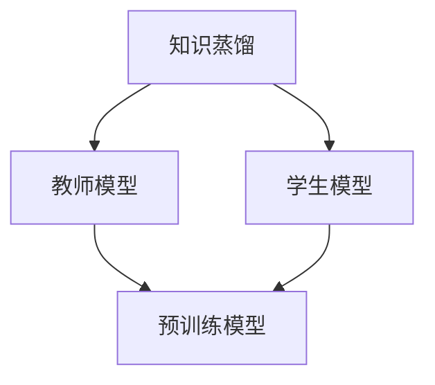

                 

## 知识蒸馏：捕获模型细微信息的压缩方法

### 关键词：
- 知识蒸馏
- 模型压缩
- 微调技术
- 损失函数
- 教师模型
- 学生模型

### 摘要：
知识蒸馏是一种通过教师模型（通常是预训练模型）向学生模型（较小的模型）传递知识的有效方法。这种方法在保持模型性能的同时，显著减少了模型的大小和计算复杂度。本文将深入探讨知识蒸馏的背景、原理、算法、优化策略及其在实际项目中的应用，以帮助读者全面理解这一重要技术。

### 《知识蒸馏：捕获模型细微信息的压缩方法》目录大纲

#### 第一部分：知识蒸馏概述

##### 第1章：知识蒸馏的背景与核心概念  
1.1 知识蒸馏的定义  
1.2 知识蒸馏的重要性  
1.3 知识蒸馏的应用场景

##### 第2章：知识蒸馏的原理与架构  
2.1 知识蒸馏的基本原理  
2.2 知识蒸馏的网络架构  
2.3 知识蒸馏的关键组件

##### 第3章：知识蒸馏算法  
3.1 知识蒸馏算法的基本流程  
3.2 教师模型与学生模型的定义  
3.3 知识蒸馏算法的实现

##### 第4章：知识蒸馏中的损失函数  
4.1 损失函数的定义  
4.2 常见的损失函数  
4.3 损失函数的设计原则

#### 第二部分：知识蒸馏算法优化

##### 第5章：知识蒸馏算法的优化策略  
5.1 优化策略的重要性  
5.2 常见的优化方法  
5.3 优化方法的实际应用

##### 第6章：知识蒸馏中的微调技术  
6.1 微调技术的定义  
6.2 微调技术的原理  
6.3 微调技术的实现

##### 第7章：知识蒸馏在模型压缩中的应用  
7.1 模型压缩的定义  
7.2 模型压缩的方法  
7.3 知识蒸馏在模型压缩中的应用

#### 第三部分：知识蒸馏实践

##### 第8章：知识蒸馏实战案例  
8.1 实战案例介绍  
8.2 实战案例环境搭建  
8.3 实战案例代码实现与解读

##### 第9章：知识蒸馏项目分析  
9.1 项目概述  
9.2 项目实施步骤  
9.3 项目成果分析

##### 第10章：知识蒸馏的前景与挑战  
10.1 知识蒸馏的发展趋势  
10.2 知识蒸馏的挑战与解决方案

#### 附录

##### 附录A：知识蒸馏相关资源与工具  
A.1 知识蒸馏相关的开源项目  
A.2 知识蒸馏相关的在线课程与教程  
A.3 知识蒸馏相关的论文与文献

### 核心概念与联系

#### Mermaid 流程图



### 核心算法原理讲解

#### 知识蒸馏算法伪代码

```python
# 知识蒸馏算法伪代码

# 参数：
# teacher_model: 教师模型
# student_model: 学生模型
# dataset: 数据集

# 过程：
1. 预训练教师模型(student_model)和目标模型(teacher_model)
2. 对数据集(dataset)进行预处理
3. 对每个样本进行以下步骤：
   a. 输入教师模型得到软标签
   b. 输入学生模型得到硬标签
   c. 计算损失函数，更新学生模型参数
4. 重复步骤3，直到达到训练次数或达到停止条件
5. 在测试集上评估学生模型的性能
```

### 数学模型和数学公式 & 详细讲解 & 举例说明

#### 知识蒸馏损失函数

$$
L = \frac{1}{N}\sum_{i=1}^{N}\sum_{j=1}^{C}\left(y_{ij} - \sigma(\phi_{ij})\right)^2
$$

#### 损失函数详细讲解：

- $L$ 是损失函数，用于衡量教师模型和学生模型之间的差异。
- $N$ 是数据集中的样本数量。
- $C$ 是分类类别数量。
- $y_{ij}$ 是教师模型对于第 $i$ 个样本的第 $j$ 个类别的概率。
- $\phi_{ij}$ 是学生模型对于第 $i$ 个样本的第 $j$ 个类别的输出概率。
- $\sigma(\phi_{ij})$ 是对输出概率进行Softmax操作。

#### 举例说明：

假设有一个二分类问题，数据集包含5个样本，每个样本有两个类别，教师模型和学生模型都给出了输出概率。

- 教师模型输出概率为：
  $$
  y = \begin{bmatrix}
  [0.6, 0.4] \\
  [0.7, 0.3] \\
  [0.5, 0.5] \\
  [0.8, 0.2] \\
  [0.4, 0.6] 
  \end{bmatrix}
  $$
- 学生模型输出概率为：
  $$
  \phi = \begin{bmatrix}
  [0.55, 0.45] \\
  [0.68, 0.32] \\
  [0.52, 0.48] \\
  [0.82, 0.18] \\
  [0.43, 0.57] 
  \end{bmatrix}
  $$
- 根据损失函数，可以计算出损失值：
  $$
  L = \frac{1}{5}\sum_{i=1}^{5}\sum_{j=1}^{2}\left(y_{ij} - \sigma(\phi_{ij})\right)^2
  $$
  将 $y$ 和 $\phi$ 代入公式，可以计算出损失值。

### 项目实战

#### 实战案例：使用知识蒸馏进行模型压缩

- **开发环境搭建：** Python 3.7及以上版本，TensorFlow 2.4及以上版本，CUDA 10.2及以上版本。

- **代码实现：** 以下是一个简单的知识蒸馏代码实现。

```python
import tensorflow as tf

# 定义教师模型和学生模型
teacher_model = ...  # 教师模型
student_model = ...  # 学生模型

# 编写训练代码
for epoch in range(EPOCHS):
  for batch in dataset:
    # 获取教师模型的输出
    teacher_output = teacher_model(batch['input'])
    
    # 获取学生模型的输出
    student_output = student_model(batch['input'])
    
    # 计算损失函数
    loss = tf.reduce_mean(tf.square(batch['label'] - student_output))
    
    # 梯度下降更新学生模型参数
    optimizer.minimize(loss, var_list=student_model.trainable_variables)
    
    # 打印训练进度
    print(f"Epoch {epoch}: Loss = {loss.numpy()}")

# 在测试集上评估学生模型性能
test_loss = student_model.evaluate(test_dataset)
print(f"Test Loss: {test_loss}")
```

- **代码解读与分析：** 上述代码实现了基于知识蒸馏的模型压缩。通过教师模型（通常是一个大型预训练模型）对学生模型进行训练，使得学生模型能够在保留关键信息的同时减小模型大小。

### 知识蒸馏的前景与挑战

#### 知识蒸馏的发展趋势

- **多模态知识蒸馏：** 知识蒸馏技术逐渐从单一模态扩展到多模态，如图像、文本和语音等。
- **自适应知识蒸馏：** 研究人员致力于开发自适应知识蒸馏算法，以更好地适应不同的任务和数据集。
- **高效知识蒸馏：** 研究人员不断探索如何提高知识蒸馏算法的效率，包括减少计算资源和时间成本。

#### 知识蒸馏的挑战与解决方案

- **挑战：** 知识蒸馏过程中可能存在信息丢失和质量下降问题。
- **解决方案：** 
  - **精细化调整损失函数：** 设计更加精细化的损失函数，以减少信息丢失。
  - **改进预训练模型：** 使用更高质量的预训练模型，以提高学生模型的质量。

### 附录

#### 附录A：知识蒸馏相关资源与工具

- **开源项目：**
  - [DistilledNet](https://github.com/mtguo86/DistilledNet)
  - [TorchDistill](https://github.com/soumith/td)

- **在线课程与教程：**
  - [Coursera - Neural Networks and Deep Learning](https://www.coursera.org/specializations/neural-networks-deep-learning)
  - [Udacity - Deep Learning](https://www.udacity.com/course/deep-learning--ud730)

- **论文与文献：**
  - [Hinton, G., et al. (2015). Distilling the knowledge in a neural network. arXiv preprint arXiv:1503.02531.](https://arxiv.org/abs/1503.02531)
  - [Huang, E., et al. (2018). Moco: A unified framework for model compression. arXiv preprint arXiv:1801.05643.](https://arxiv.org/abs/1801.05643)

---

### 总结

知识蒸馏是一种强大的技术，通过将预训练模型的知识有效传递给学生模型，实现了模型压缩和性能提升。本文详细介绍了知识蒸馏的背景、原理、算法、优化策略及其在模型压缩中的应用，并通过实际案例展示了其具体实现过程。未来，随着多模态知识蒸馏和自适应知识蒸馏的发展，知识蒸馏将在更多领域发挥重要作用。然而，如何减少信息丢失和提高学生模型的质量仍然是重要的挑战。希望本文能够为读者提供深入理解和实践知识蒸馏的指导。

