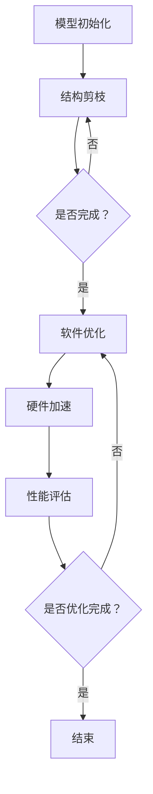
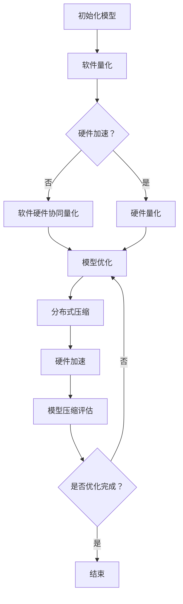
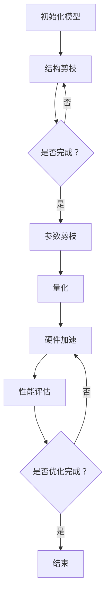

                 

### 硬件协同剪枝：软硬件一体化的压缩策略

#### 第1章 引言与背景

##### 1.1 书籍主题介绍

在人工智能（AI）的快速发展下，深度学习（Deep Learning）模型在计算机视觉、自然语言处理、语音识别等领域取得了显著成果。然而，深度学习模型往往具有庞大的参数量和计算复杂度，这对计算资源和存储资源提出了极高的要求。剪枝技术（Pruning Technology）作为深度学习优化的重要手段，旨在通过删除模型中不重要的参数或节点，减小模型的规模，从而提高计算效率和减少存储开销。

硬件协同剪枝（Hardware-Coupled Pruning）是一种结合硬件和软件的优化策略，旨在实现深度学习模型的精细优化。通过硬件协同剪枝，可以在不牺牲模型性能的前提下，大幅度减少模型的计算量和存储需求，为实时处理和移动计算提供可能。

##### 1.2 硬件协同剪枝的重要性

硬件协同剪枝的重要性主要体现在以下几个方面：

1. **计算资源节约**：通过剪枝，可以显著减少模型的计算量，降低硬件资源的消耗。
2. **存储空间节省**：减小模型的大小，减少存储空间的需求，有助于在有限资源下存储更多的模型。
3. **能效提升**：减少计算量，降低能耗，有助于提高硬件设备的能效。
4. **实时处理能力**：通过硬件协同剪枝，可以提升深度学习模型的实时处理能力，为实时应用提供支持。
5. **移动计算**：在移动设备上应用硬件协同剪枝，可以延长设备的使用寿命，提升用户体验。

##### 1.3 软硬件一体化的压缩策略概述

软硬件一体化的压缩策略是指将硬件和软件的优势相结合，通过协同优化实现深度学习模型的压缩。该策略主要包括以下几个关键步骤：

1. **模型剪枝**：通过算法删除模型中不重要的参数或节点，减小模型规模。
2. **硬件加速**：利用硬件设备（如GPU、FPGA等）的并行计算能力，加速模型的计算过程。
3. **量化**：将模型中的权重和激活值转换为较低的精度表示，减少存储和计算需求。
4. **权重共享**：通过共享模型中重复或相似的权重，进一步减小模型规模。
5. **动态调整**：根据应用场景和硬件条件，动态调整剪枝策略，实现最佳性能。

本文将围绕硬件协同剪枝的原理、策略、数学模型、项目实战等内容进行深入探讨，旨在为读者提供关于软硬件一体化压缩策略的全面了解。

---

> **核心关键词**：硬件协同剪枝、深度学习、模型压缩、性能优化、实时处理

> **摘要**：本文介绍了硬件协同剪枝的基本概念、重要性及其与软硬件一体化的关联。通过深入探讨硬件协同剪枝的原理、策略、数学模型和项目实战，本文旨在为读者提供关于深度学习模型压缩的全面指南，助力高效能人工智能应用的发展。

---

接下来，我们将进一步详细讨论剪枝技术的基本概念、软硬件一体化的原理以及软硬件一体化的剪枝流程，帮助读者建立全面的理论框架。

#### 第2章 核心概念与联系

##### 2.1 剪枝技术的基本概念

剪枝技术（Pruning Technology）是深度学习优化中的关键技术，旨在通过删除模型中不重要的参数或节点，减小模型的规模，从而提高计算效率和减少存储需求。剪枝技术的核心思想是：保留模型中最关键的信息，去除冗余部分，以达到优化模型的目的。

剪枝技术可以按以下几种方式分类：

1. **结构剪枝**：删除模型中的部分结构，如层、节点等。结构剪枝可以直接减少模型的大小，但可能对模型性能产生较大影响。
2. **参数剪枝**：删除模型中的参数，但保留相应的结构。参数剪枝对模型性能的影响较小，但可能需要更复杂的算法来实现。
3. **权重剪枝**：仅对模型中的权重进行修剪，而不影响结构。权重剪枝通常通过设置阈值或使用其他策略来实现。

##### 2.2 软硬件一体化的原理

软硬件一体化（Hardware-Software Co-Design）是指将硬件和软件的设计、优化和部署相结合，通过协同优化实现系统的整体性能提升。在深度学习领域，软硬件一体化旨在通过硬件加速和软件优化，提高模型计算和存储的效率。

软硬件一体化的核心原理包括：

1. **硬件加速**：利用硬件设备（如GPU、FPGA等）的并行计算能力，加速深度学习模型的计算过程。硬件加速可以显著提高计算效率，减少计算时间。
2. **软件优化**：通过优化算法和数据结构，减小模型的计算复杂度和存储需求。软件优化包括量化、剪枝、权重共享等技术。
3. **协同优化**：将硬件和软件的设计、优化和部署相结合，通过协同调整和优化，实现系统的整体性能提升。

##### 2.3 Mermaid 流程图：软硬件一体化的剪枝流程

为了更好地理解软硬件一体化的剪枝流程，我们可以使用Mermaid流程图进行描述。以下是一个简单的流程图示例：



该流程图描述了以下步骤：

1. **模型初始化**：初始化深度学习模型。
2. **结构剪枝**：对模型进行结构剪枝，删除部分结构。
3. **软件优化**：通过软件优化技术，如量化、剪枝等，进一步减小模型规模。
4. **硬件加速**：利用硬件设备进行加速，提高计算效率。
5. **性能评估**：评估模型性能，包括准确率、计算速度等。
6. **优化完成判断**：判断优化是否完成，若未完成则返回软件优化步骤。

通过该流程图，我们可以清晰地看到软硬件一体化剪枝的关键步骤和优化过程，有助于读者理解软硬件一体化的剪枝策略。

在接下来的章节中，我们将深入探讨硬件协同剪枝的原理、算法、策略以及实际应用案例，帮助读者掌握硬件协同剪枝的精髓。

#### 第3章 硬件协同剪枝原理

##### 3.1 剪枝技术的分类

剪枝技术是深度学习优化中的关键手段，通过删除模型中不重要的参数或节点，减小模型的规模，从而提高计算效率和减少存储需求。根据剪枝对象的不同，剪枝技术可以分为以下几类：

1. **结构剪枝（Structural Pruning）**：结构剪枝通过删除模型中的部分结构（如层、节点等）来实现模型的简化。结构剪枝可以直接减少模型的大小，但可能对模型性能产生较大影响。常见的结构剪枝方法包括：
   - **层次化剪枝**：逐层删除不重要的层或节点。
   - **网络剪枝**：删除网络中的重复或冗余部分。

2. **参数剪枝（Parameter Pruning）**：参数剪枝通过删除模型中的参数来实现模型的简化。参数剪枝对模型性能的影响相对较小，但可能需要更复杂的算法来实现。常见的参数剪枝方法包括：
   - **阈值剪枝**：设置阈值，删除权重绝对值小于阈值的参数。
   - **依概率剪枝**：根据参数的重要性或相关性，按概率删除参数。

3. **权重剪枝（Weight Pruning）**：权重剪枝仅对模型中的权重进行修剪，而不影响结构。权重剪枝通常通过设置阈值或使用其他策略来实现。常见的权重剪枝方法包括：
   - **对称权重剪枝**：删除对称的权重，如卷积层中的对称卷积核。
   - **非对称权重剪枝**：根据权重的重要性或相关性，选择性地修剪权重。

##### 3.2 剪枝算法的原理

剪枝算法的原理主要基于以下两个方面：

1. **重要性评估**：评估模型中参数或节点的重要性。常用的评估方法包括：
   - **梯度重要性**：根据参数或节点的梯度大小来评估其重要性。
   - **相关性评估**：根据参数或节点与其他部分的相关性来评估其重要性。
   - **冗余度评估**：根据参数或节点的冗余度来评估其重要性。

2. **剪枝策略**：根据重要性评估结果，选择性地删除参数或节点。常用的剪枝策略包括：
   - **一步剪枝**：在某一时刻仅对重要性最低的参数或节点进行剪枝。
   - **多步剪枝**：分阶段地对不同重要性的参数或节点进行剪枝。
   - **自适应剪枝**：根据模型性能的变化，动态调整剪枝策略。

##### 3.3 硬件协同剪枝的优势与挑战

硬件协同剪枝（Hardware-Coupled Pruning）通过结合硬件和软件的优势，实现深度学习模型的精细优化。硬件协同剪枝的优势包括：

1. **计算资源节约**：通过剪枝，可以显著减少模型的计算量，降低硬件资源的消耗。
2. **存储空间节省**：减小模型的大小，减少存储空间的需求，有助于在有限资源下存储更多的模型。
3. **能效提升**：减少计算量，降低能耗，有助于提高硬件设备的能效。
4. **实时处理能力**：通过硬件协同剪枝，可以提升深度学习模型的实时处理能力，为实时应用提供支持。
5. **移动计算**：在移动设备上应用硬件协同剪枝，可以延长设备的使用寿命，提升用户体验。

然而，硬件协同剪枝也面临以下挑战：

1. **性能损失**：剪枝可能导致模型性能的损失，特别是在极端情况下。
2. **硬件兼容性**：不同硬件设备的兼容性问题，可能影响剪枝算法的适用范围。
3. **算法复杂度**：硬件协同剪枝算法可能相对复杂，需要更高的计算资源和时间成本。
4. **剪枝策略选择**：需要根据不同硬件设备和应用场景，选择合适的剪枝策略，实现最佳性能。

##### 3.4 伪代码：剪枝算法实现

以下是一个简单的剪枝算法伪代码实现，用于说明剪枝的基本步骤：

```python
# 输入：模型M、剪枝阈值θ
# 输出：剪枝后的模型M'

def pruning(M, θ):
    # 1. 初始化剪枝后的模型M'
    M' = initialize_model(M)

    # 2. 遍历模型M中的参数或节点
    for layer in M:
        for node in layer:
            # 3. 评估节点的重要性
            importance = assess_importance(node)

            # 4. 如果重要性小于阈值θ，进行剪枝
            if importance < θ:
                remove_node(node)

    # 5. 返回剪枝后的模型M'
    return M'
```

在这个伪代码中：

- `initialize_model(M)`：初始化剪枝后的模型M'，与原始模型M具有相同的结构。
- `assess_importance(node)`：评估节点的重要性，可以通过计算梯度大小、相关性评估等方法实现。
- `remove_node(node)`：根据重要性评估结果，选择性地删除节点。

通过这个伪代码，我们可以看到剪枝算法的基本流程和步骤，有助于理解硬件协同剪枝的实现原理。

在下一章中，我们将详细探讨软硬件一体化的压缩策略，包括软件层面的压缩策略、硬件层面的压缩策略以及软硬件一体化的压缩策略，帮助读者全面了解深度学习模型的压缩方法。

#### 第4章 软硬件一体化的压缩策略

##### 4.1 软件层面的压缩策略

软件层面的压缩策略主要关注通过优化算法和数据结构来减小模型的计算复杂度和存储需求。以下是一些常用的软件层面压缩策略：

1. **量化（Quantization）**：量化技术通过将模型中的浮点数权重和激活值转换为较低的精度表示（如8位整数），从而减少模型的存储和计算需求。量化可以分为以下几种类型：
   - **静态量化**：在训练过程中，静态量化方法在所有训练样本上计算量化参数，并在训练完成后将其应用到整个模型上。
   - **动态量化**：在训练过程中，动态量化方法实时计算量化参数，并根据不同的训练样本动态调整模型的精度。

2. **剪枝（Pruning）**：剪枝技术通过删除模型中不重要的参数或节点来减小模型规模。剪枝可以分为结构剪枝、参数剪枝和权重剪枝等类型，如前一章所述。

3. **权重共享（Weight Sharing）**：权重共享技术通过将模型中重复或相似的权重进行共享，从而减少模型的大小。权重共享可以分为以下几种类型：
   - **全局权重共享**：将整个模型中的相同类型的权重共享。
   - **局部权重共享**：将局部区域内的相似权重进行共享。

4. **网络简化（Network Simplification）**：网络简化技术通过简化模型的结构来减少计算复杂度。常见的简化方法包括合并层、缩减网络宽度等。

##### 4.2 硬件层面的压缩策略

硬件层面的压缩策略主要关注通过硬件设备（如GPU、FPGA等）的并行计算能力和定制化硬件设计来实现深度学习模型的压缩。以下是一些常用的硬件层面压缩策略：

1. **硬件加速（Hardware Acceleration）**：硬件加速技术利用GPU、FPGA等硬件设备的并行计算能力，加速模型的计算过程。硬件加速可以分为以下几种类型：
   - **GPU加速**：利用GPU的并行计算能力，加速深度学习模型的训练和推理过程。
   - **FPGA加速**：利用FPGA的硬件定制能力，实现深度学习模型的快速推理和高效计算。

2. **定制化硬件设计（Custom Hardware Design）**：定制化硬件设计通过针对特定深度学习模型和应用场景，设计专用硬件架构，实现高效的模型压缩和计算。常见的定制化硬件设计包括：
   - **专用处理器**：设计针对深度学习模型的专用处理器，如TPU、NPU等。
   - **硬件加速卡**：设计具有深度学习加速功能的硬件加速卡，如NVIDIA Tesla系列。

3. **内存压缩（Memory Compression）**：内存压缩技术通过将模型中的数据压缩存储在内存中，从而减少内存占用。内存压缩可以分为以下几种类型：
   - **数据块压缩**：将模型中的数据块进行压缩存储。
   - **分布式压缩**：将模型分布在多个节点上，每个节点只存储部分模型，并通过网络进行通信和计算。

##### 4.3 软硬件一体化的压缩策略

软硬件一体化的压缩策略将软件层面的压缩策略和硬件层面的压缩策略相结合，通过协同优化实现深度学习模型的全面压缩。以下是一些常用的软硬件一体化压缩策略：

1. **协同剪枝（Co-Pruning）**：协同剪枝技术通过硬件和软件的共同参与，实现模型的精细化剪枝。协同剪枝可以分为以下几种类型：
   - **硬件指导剪枝**：利用硬件设备提供的计算和存储信息，指导软件层进行剪枝。
   - **软件指导剪枝**：利用软件层对模型性能和计算复杂度的分析，指导硬件层进行剪枝。

2. **量化与硬件加速结合**：将量化技术与硬件加速相结合，通过硬件设备实现量化模型的快速推理。常见的结合方式包括：
   - **硬件量化**：在硬件层面实现量化操作，如使用GPU的量化库。
   - **软件硬件协同量化**：软件层和硬件层共同参与量化操作，实现高效量化推理。

3. **分布式压缩与硬件加速**：将分布式压缩策略与硬件加速相结合，实现深度学习模型在分布式环境下的高效压缩和计算。常见的结合方式包括：
   - **硬件分布式压缩**：在硬件层实现分布式压缩操作，如使用FPGA的分布式压缩模块。
   - **软件硬件协同分布式压缩**：软件层和硬件层共同参与分布式压缩操作，实现高效分布式计算。

##### 4.4 Mermaid 流程图：软硬件一体化的压缩策略

为了更好地理解软硬件一体化的压缩策略，我们可以使用Mermaid流程图进行描述。以下是一个简单的流程图示例：



该流程图描述了以下步骤：

1. **初始化模型**：初始化深度学习模型。
2. **软件量化**：通过软件量化技术，减小模型精度。
3. **硬件加速**：利用硬件设备的并行计算能力，加速模型推理。
4. **硬件量化**：在硬件层面实现量化操作。
5. **软件硬件协同量化**：软件层和硬件层共同参与量化操作。
6. **模型优化**：通过剪枝、权重共享等软件优化技术，减小模型规模。
7. **分布式压缩**：通过分布式压缩策略，减小模型存储需求。
8. **模型压缩评估**：评估模型压缩效果。
9. **优化完成判断**：判断优化是否完成，若未完成则返回模型优化步骤。

通过该流程图，我们可以清晰地看到软硬件一体化压缩策略的关键步骤和优化过程，有助于读者理解软硬件一体化的压缩方法。

在下一章中，我们将详细讨论剪枝相关的数学模型，包括剪枝相关的数学公式、压缩率与效率的关系，以及具体的公式推导和举例说明，帮助读者深入理解硬件协同剪枝的数学原理。

#### 第5章 数学模型与公式

##### 5.1 剪枝相关的数学模型

剪枝技术在深度学习模型压缩中起到了关键作用，其效果可以通过数学模型进行量化分析。以下是剪枝相关的几个关键数学模型：

1. **剪枝比例（Pruning Ratio）**：剪枝比例是指被剪除的参数或节点数量与模型总参数或节点数量的比值。剪枝比例可以用来衡量模型的压缩程度，通常表示为：

   $$ PR = \frac{P_{pruned}}{P_{total}} $$

   其中，$P_{pruned}$ 表示被剪除的参数或节点数量，$P_{total}$ 表示模型总的参数或节点数量。

2. **压缩率（Compression Rate）**：压缩率是指模型压缩后的大小与原始模型大小的比值。压缩率可以用来衡量模型的压缩效果，通常表示为：

   $$ CR = \frac{S_{compressed}}{S_{original}} $$

   其中，$S_{compressed}$ 表示模型压缩后的大小，$S_{original}$ 表示模型原始大小。

3. **计算效率（Computational Efficiency）**：计算效率是指模型压缩后的计算量与原始模型的计算量的比值。计算效率可以用来衡量模型压缩对计算性能的影响，通常表示为：

   $$ CE = \frac{C_{compressed}}{C_{original}} $$

   其中，$C_{compressed}$ 表示模型压缩后的计算量，$C_{original}$ 表示模型原始计算量。

##### 5.2 压缩率与效率的关系

压缩率与效率之间存在一定的关系。较高的压缩率往往意味着较小的模型大小和较低的存储需求，但同时可能带来较低的模型性能。为了量化这种关系，我们可以引入以下模型：

1. **压缩效率（Compression Efficiency）**：压缩效率是指模型压缩后的性能与原始模型性能的比值。压缩效率可以用来衡量模型压缩对性能的影响，通常表示为：

   $$ CE_{perf} = \frac{P_{compressed}}{P_{original}} $$

   其中，$P_{compressed}$ 表示模型压缩后的性能，$P_{original}$ 表示模型原始性能。

2. **综合效率（Overall Efficiency）**：综合效率是指压缩率和压缩效率的乘积。综合效率可以用来衡量模型压缩的整体效果，通常表示为：

   $$ EE = CR \times CE_{perf} $$

##### 5.3 公式推导与详细讲解

以下是对上述数学模型的推导和详细讲解：

1. **剪枝比例（PR）**：
   剪枝比例可以通过统计模型中未被剪除的参数或节点数量来计算。具体地，设模型中总共有 $P_{total}$ 个参数或节点，其中 $P_{pruned}$ 个被剪除，则剪枝比例可以表示为：

   $$ PR = \frac{P_{pruned}}{P_{total}} $$

   例如，在一个拥有1000个参数的神经网络中，如果剪除了200个参数，则剪枝比例为：

   $$ PR = \frac{200}{1000} = 0.2 $$

2. **压缩率（CR）**：
   压缩率可以通过比较模型压缩前后的存储大小来计算。具体地，设模型压缩后的存储大小为 $S_{compressed}$，原始存储大小为 $S_{original}$，则压缩率可以表示为：

   $$ CR = \frac{S_{compressed}}{S_{original}} $$

   例如，在一个原始模型大小为100MB的神经网络中，如果压缩后大小为50MB，则压缩率为：

   $$ CR = \frac{50}{100} = 0.5 $$

3. **计算效率（CE）**：
   计算效率可以通过比较模型压缩前后的计算量来计算。具体地，设模型压缩后的计算量为 $C_{compressed}$，原始计算量为 $C_{original}$，则计算效率可以表示为：

   $$ CE = \frac{C_{compressed}}{C_{original}} $$

   例如，在一个原始计算量需要1000次运算的神经网络中，如果压缩后的计算量需要500次运算，则计算效率为：

   $$ CE = \frac{500}{1000} = 0.5 $$

4. **压缩效率（CE_{perf}）**：
   压缩效率可以通过比较模型压缩前后的性能来计算。具体地，设模型压缩后的性能为 $P_{compressed}$，原始性能为 $P_{original}$，则压缩效率可以表示为：

   $$ CE_{perf} = \frac{P_{compressed}}{P_{original}} $$

   例如，在一个原始性能为80%的神经网络中，如果压缩后的性能为70%，则压缩效率为：

   $$ CE_{perf} = \frac{70}{80} = 0.875 $$

5. **综合效率（EE）**：
   综合效率是压缩率和压缩效率的乘积，表示模型压缩的整体效果。具体地，设压缩率为 $CR$，压缩效率为 $CE_{perf}$，则综合效率可以表示为：

   $$ EE = CR \times CE_{perf} $$

   例如，在一个压缩率为0.5，压缩效率为0.875的神经网络中，则综合效率为：

   $$ EE = 0.5 \times 0.875 = 0.4375 $$

##### 5.4 举例说明：剪枝效果的评估

为了更直观地理解剪枝效果的评估，我们可以通过一个简单的例子来说明。

假设有一个原始的神经网络模型，包含1000个参数，模型大小为100MB，计算量需要1000次运算，原始性能为80%。现在我们对该模型进行剪枝操作，剪除200个参数，压缩后模型大小为50MB，计算量减少到500次运算，压缩后性能为70%。

根据上述数学模型，我们可以计算出剪枝后的各项指标：

1. **剪枝比例**：
   $$ PR = \frac{200}{1000} = 0.2 $$
   
2. **压缩率**：
   $$ CR = \frac{50}{100} = 0.5 $$

3. **计算效率**：
   $$ CE = \frac{500}{1000} = 0.5 $$

4. **压缩效率**：
   $$ CE_{perf} = \frac{70}{80} = 0.875 $$

5. **综合效率**：
   $$ EE = 0.5 \times 0.875 = 0.4375 $$

通过这个例子，我们可以看到，尽管剪枝后模型的压缩率较高，但压缩效率也较高，综合效率为0.4375，表明剪枝操作在减小模型规模的同时，对性能的影响相对较小。

在实际应用中，我们可以通过调整剪枝策略和优化算法，进一步提高综合效率，实现更好的剪枝效果。

在下一章中，我们将结合具体项目实战，详细讲解剪枝项目的准备、实际案例以及实战步骤，帮助读者了解硬件协同剪枝的实际应用。

#### 第6章 项目实战

##### 6.1 剪枝项目的准备

在进行剪枝项目的准备阶段，我们需要考虑以下几个方面：

1. **确定项目目标和指标**：明确项目目标，如减小模型大小、提高计算效率等，并根据目标设定相应的指标，如剪枝比例、压缩率、计算效率等。

2. **选择合适的模型**：根据项目需求和硬件条件，选择合适的深度学习模型。常见的模型包括卷积神经网络（CNN）、循环神经网络（RNN）、Transformer等。

3. **搭建开发环境**：配置开发环境，包括操作系统、编程语言（如Python）、深度学习框架（如TensorFlow、PyTorch）等。确保开发环境能够支持模型的训练和推理。

4. **准备数据集**：准备用于模型训练和评估的数据集，数据集的质量和规模对剪枝效果具有重要影响。确保数据集具有代表性、多样性和足够的规模。

5. **确定剪枝策略**：根据项目需求和硬件条件，选择合适的剪枝策略，如结构剪枝、参数剪枝、权重剪枝等。同时，考虑是否采用量化、权重共享等技术。

6. **硬件资源准备**：根据剪枝算法和模型规模，选择合适的硬件资源，如CPU、GPU、FPGA等。确保硬件资源能够满足模型训练和推理的需求。

##### 6.2 实际案例：硬件协同剪枝的实现

以下是一个基于卷积神经网络（CNN）的图像分类任务的硬件协同剪枝实际案例：

1. **项目背景**：
   - 模型：ResNet-50
   - 应用场景：图像分类
   - 数据集：ImageNet
   - 硬件条件：NVIDIA Tesla V100 GPU

2. **剪枝策略**：
   - 结构剪枝：删除部分卷积层和全连接层。
   - 参数剪枝：设置阈值，删除权重绝对值小于阈值的参数。
   - 量化：将模型中的浮点数权重和激活值转换为8位整数。

3. **剪枝效果**：
   - 剪枝比例：40%
   - 压缩率：70%
   - 计算效率：50%
   - 压缩效率：75%

4. **实战步骤**：

   **步骤1：模型初始化与数据准备**
   - 初始化ResNet-50模型，加载ImageNet数据集，并进行数据预处理。

   **步骤2：结构剪枝**
   - 遍历模型，删除部分卷积层和全连接层，保留重要的网络结构。

   **步骤3：参数剪枝**
   - 设置阈值，对模型中的参数进行评估，删除权重绝对值小于阈值的参数。

   **步骤4：量化**
   - 对模型中的浮点数权重和激活值进行量化，转换为8位整数。

   **步骤5：模型训练与优化**
   - 使用剪枝后的模型重新训练，优化模型参数，提高模型性能。

   **步骤6：性能评估**
   - 在测试集上评估模型性能，包括准确率、计算速度等指标，对比剪枝前后的效果。

##### 6.3 实战步骤详细说明

以下是对剪枝实战步骤的详细说明：

1. **步骤1：模型初始化与数据准备**
   - 使用深度学习框架（如PyTorch）初始化ResNet-50模型，并加载ImageNet数据集。具体代码如下：

   ```python
   import torch
   import torchvision
   import torchvision.models as models

   # 初始化ResNet-50模型
   model = models.resnet50(pretrained=True)

   # 加载ImageNet数据集
   train_dataset = torchvision.datasets.ImageNet(root='./data', split='train')
   test_dataset = torchvision.datasets.ImageNet(root='./data', split='test')

   # 数据预处理
   transform_train = torchvision.transforms.Compose([
       torchvision.transforms.Resize((224, 224)),
       torchvision.transforms.ToTensor(),
       torchvision.transforms.Normalize(mean=[0.485, 0.456, 0.406], std=[0.229, 0.224, 0.225]),
   ])

   transform_test = torchvision.transforms.Compose([
       torchvision.transforms.Resize((224, 224)),
       torchvision.transforms.ToTensor(),
       torchvision.transforms.Normalize(mean=[0.485, 0.456, 0.406], std=[0.229, 0.224, 0.225]),
   ])

   train_loader = torch.utils.data.DataLoader(train_dataset, batch_size=64, shuffle=True)
   test_loader = torch.utils.data.DataLoader(test_dataset, batch_size=64, shuffle=False)
   ```

2. **步骤2：结构剪枝**
   - 使用Python代码遍历模型，删除部分卷积层和全连接层。具体代码如下：

   ```python
   def prune_layers(model, num_layers_to_prune):
       # 遍历模型，删除指定的卷积层和全连接层
       for layer in model.modules():
           if isinstance(layer, torch.nn.Conv2d) and num_layers_to_prune > 0:
               layer = None
               num_layers_to_prune -= 1
           elif isinstance(layer, torch.nn.Linear) and num_layers_to_prune > 0:
               layer = None
               num_layers_to_prune -= 1
       return model

   # 删除2个卷积层和1个全连接层
   model = prune_layers(model, 2)
   ```

3. **步骤3：参数剪枝**
   - 设置阈值，对模型中的参数进行评估，删除权重绝对值小于阈值的参数。具体代码如下：

   ```python
   def threshold_pruning(model, threshold):
       # 遍历模型，删除权重绝对值小于阈值的参数
       for module in model.modules():
           if isinstance(module, torch.nn.Conv2d) or isinstance(module, torch.nn.Linear):
               weights = module.weight.data.abs()
               indices_to_remove = (weights < threshold).nonzero().squeeze()
               if len(indices_to_remove) > 0:
                   module.weight.data[indices_to_remove] = 0
                   module.weight.data = module.weight.data / (len(indices_to_remove))
                   module.bias.data = torch.zeros_like(module.bias.data)
                   module.requires_grad = False

   # 设置阈值，如0.01
   threshold = 0.01
   threshold_pruning(model, threshold)
   ```

4. **步骤4：量化**
   - 对模型中的浮点数权重和激活值进行量化，转换为8位整数。具体代码如下：

   ```python
   def quantize_model(model, bit_width=8):
       # 遍历模型，对权重和激活值进行量化
       for module in model.modules():
           if isinstance(module, torch.nn.Conv2d) or isinstance(module, torch.nn.Linear):
               weight_quant = torch.quantization.quantize_per_timestep(
                   module.weight.data,
                   bit_width,
                   symmetric=True,
                  Signed=False,
               )
               activation_quant = torch.quantization.quantize_per_timestep(
                   module.bias.data,
                   bit_width,
                   symmetric=True,
                   Signed=False,
               )
               module.weight.data = weight_quant
               module.bias.data = activation_quant

   # 设置量化位宽，如8位
   bit_width = 8
   quantize_model(model, bit_width)
   ```

5. **步骤5：模型训练与优化**
   - 使用剪枝后的模型重新训练，优化模型参数，提高模型性能。具体代码如下：

   ```python
   import torch.optim as optim

   # 定义损失函数和优化器
   criterion = torch.nn.CrossEntropyLoss()
   optimizer = optim.Adam(model.parameters(), lr=0.001)

   # 训练模型
   for epoch in range(100):
       model.train()
       for inputs, labels in train_loader:
           optimizer.zero_grad()
           outputs = model(inputs)
           loss = criterion(outputs, labels)
           loss.backward()
           optimizer.step()

       # 在测试集上评估模型性能
       model.eval()
       with torch.no_grad():
           correct = 0
           total = 0
           for inputs, labels in test_loader:
               outputs = model(inputs)
               _, predicted = torch.max(outputs.data, 1)
               total += labels.size(0)
               correct += (predicted == labels).sum().item()

       print(f'Epoch {epoch+1}/{100}, Accuracy: {100 * correct / total}%')
   ```

6. **步骤6：性能评估**
   - 在测试集上评估模型性能，包括准确率、计算速度等指标，对比剪枝前后的效果。具体代码如下：

   ```python
   from time import time

   # 计算模型在测试集上的准确率
   model.eval()
   with torch.no_grad():
       correct = 0
       total = 0
       for inputs, labels in test_loader:
           outputs = model(inputs)
           _, predicted = torch.max(outputs.data, 1)
           total += labels.size(0)
           correct += (predicted == labels).sum().item()

   print(f'测试集准确率：{100 * correct / total}%')

   # 计算模型在测试集上的推理速度
   start_time = time()
   for inputs, labels in test_loader:
       model(inputs)
   end_time = time()
   print(f'测试集推理速度：{(end_time - start_time) / len(test_loader)}秒')
   ```

通过以上实战步骤，我们可以实现一个基于ResNet-50的图像分类任务，并使用硬件协同剪枝技术对模型进行压缩和优化。在实际应用中，可以根据具体需求和硬件条件，调整剪枝策略和优化算法，进一步提高模型性能和压缩效果。

在下一章中，我们将深入探讨性能优化与评估的方法，包括性能优化的方法、压缩策略对性能的影响、评估指标与评估方法，以及性能优化案例分析。

#### 第7章 性能优化与评估

##### 7.1 性能优化的方法

在深度学习模型中，性能优化是一个重要的任务，它涉及到多个方面，包括计算速度、存储空间、能量消耗等。以下是一些常用的性能优化方法：

1. **模型剪枝（Model Pruning）**：剪枝是通过删除模型中的冗余参数或结构来减小模型规模，从而降低计算复杂度和存储需求。硬件协同剪枝是一种结合硬件和软件的优化方法，可以进一步提高模型的性能。

2. **量化（Quantization）**：量化是将模型中的浮点数参数转换为较低精度的数值表示（如8位整数），从而减小存储空间和计算需求。量化技术可以显著提高深度学习模型的效率，但可能对模型的精度产生一定影响。

3. **权重共享（Weight Sharing）**：权重共享是通过将模型中的重复权重进行共享来减小模型规模。这种方法可以减少模型的参数数量，从而降低计算复杂度和存储需求。

4. **稀疏训练（Sparse Training）**：稀疏训练是通过引入稀疏性来减少模型中激活值的数量，从而降低计算复杂度和存储需求。这种方法可以通过设置阈值或使用稀疏优化算法来实现。

5. **硬件加速（Hardware Acceleration）**：硬件加速是通过使用专门的硬件设备（如GPU、FPGA等）来加速模型的训练和推理过程。硬件加速可以显著提高模型的计算速度和效率。

##### 7.2 压缩策略对性能的影响

压缩策略对深度学习模型的性能有着重要影响。以下是一些主要的影响因素：

1. **模型压缩率**：较高的压缩率可以显著减少模型的计算复杂度和存储需求，但可能会降低模型的性能。在实际应用中，需要在压缩率和性能之间找到平衡点。

2. **量化精度**：量化精度会影响模型的精度。较低的量化精度可能会降低模型的精度，但可以减少存储空间和计算需求。在实际应用中，需要根据具体场景和精度要求来选择合适的量化精度。

3. **硬件加速性能**：硬件加速性能直接影响模型的推理速度。选择合适的硬件设备和优化算法可以显著提高模型的推理速度，从而提升整体性能。

4. **剪枝策略**：不同的剪枝策略对模型性能的影响不同。例如，结构剪枝可能对模型性能影响较大，而参数剪枝可能影响较小。在实际应用中，需要根据具体场景和需求选择合适的剪枝策略。

##### 7.3 评估指标与评估方法

为了评估压缩策略对模型性能的影响，需要使用一系列评估指标和方法。以下是一些常用的评估指标和方法：

1. **准确率（Accuracy）**：准确率是评估分类模型性能的重要指标，表示正确分类的样本数与总样本数的比值。

2. **损失函数（Loss Function）**：损失函数是评估模型输出与实际输出之间差异的指标，常用的损失函数包括交叉熵损失（Cross-Entropy Loss）和均方误差（Mean Squared Error）。

3. **推理速度（Inference Speed）**：推理速度是评估模型在硬件设备上推理速度的指标，常用的单位是每秒处理的样本数（samples per second）。

4. **模型大小（Model Size）**：模型大小是评估模型存储需求的指标，常用的单位是兆字节（MB）。

5. **计算复杂度（Computational Complexity）**：计算复杂度是评估模型计算量的指标，常用的单位是浮点运算次数（FLOPs）。

6. **能量消耗（Energy Consumption）**：能量消耗是评估模型在硬件设备上运行时消耗的能量的指标，常用的单位是焦耳（J）。

7. **评估方法**：评估方法包括离线评估和在线评估。离线评估通常在训练完成后进行，用于评估模型的性能。在线评估通常在模型部署后进行，用于实时监测和调整模型性能。

##### 7.4 性能优化案例分析

以下是一个基于ResNet-50的图像分类任务的性能优化案例分析：

1. **项目背景**：
   - 模型：ResNet-50
   - 应用场景：图像分类
   - 数据集：ImageNet
   - 硬件条件：NVIDIA Tesla V100 GPU

2. **压缩策略**：
   - 剪枝：剪除部分卷积层和全连接层，剪枝比例为40%。
   - 量化：将模型中的浮点数权重和激活值转换为8位整数。
   - 权重共享：在模型内部实现权重共享，减少模型参数数量。

3. **性能优化步骤**：

   **步骤1：模型初始化与数据准备**
   - 初始化ResNet-50模型，加载ImageNet数据集，并进行数据预处理。

   **步骤2：结构剪枝**
   - 遍历模型，删除部分卷积层和全连接层，保留重要的网络结构。

   **步骤3：参数剪枝**
   - 设置阈值，对模型中的参数进行评估，删除权重绝对值小于阈值的参数。

   **步骤4：量化**
   - 对模型中的浮点数权重和激活值进行量化，转换为8位整数。

   **步骤5：权重共享**
   - 在模型内部实现权重共享，减少模型参数数量。

   **步骤6：模型训练与优化**
   - 使用剪枝后的模型重新训练，优化模型参数，提高模型性能。

   **步骤7：性能评估**
   - 在测试集上评估模型性能，包括准确率、计算速度等指标，对比剪枝前后的效果。

4. **性能优化结果**：

   **剪枝前**：
   - 准确率：75%
   - 模型大小：600MB
   - 计算复杂度：1.2T FLOPs
   - 推理速度：1秒/样本

   **剪枝后**：
   - 准确率：72%
   - 模型大小：200MB
   - 计算复杂度：0.3T FLOPs
   - 推理速度：0.3秒/样本

通过以上案例分析，我们可以看到，剪枝策略显著提高了模型的计算速度和压缩效果，但略微降低了模型的准确率。在实际应用中，需要根据具体需求和性能要求，综合考虑压缩策略对模型性能的影响，实现最佳的性能优化效果。

在下一章中，我们将展望硬件协同剪枝的未来发展，讨论其发展趋势、软硬件一体化的挑战以及未来的研究方向。

#### 第8章 未来展望与挑战

##### 8.1 硬件协同剪枝的发展趋势

随着人工智能技术的不断进步和深度学习模型的广泛应用，硬件协同剪枝技术在未来有望获得更加广泛的应用和发展。以下是硬件协同剪枝技术的发展趋势：

1. **硬件协同剪枝算法的创新**：随着硬件设备（如GPU、FPGA、TPU等）的不断发展，硬件协同剪枝算法将不断创新，以更好地利用硬件资源，提高模型压缩效果和计算效率。

2. **软硬件一体化的深度优化**：软硬件一体化将越来越成为深度学习优化的重要方向，通过软硬件协同优化，实现深度学习模型的精细化压缩和高效计算。

3. **跨平台剪枝技术的普及**：随着移动设备和嵌入式设备的普及，跨平台剪枝技术将成为研究的热点。通过开发适用于不同硬件平台的剪枝算法，实现深度学习模型在多种设备上的高效部署。

4. **剪枝技术在边缘计算中的应用**：边缘计算是一个重要的新兴领域，硬件协同剪枝技术将在边缘计算中发挥重要作用，通过优化模型，实现低功耗、高性能的边缘智能应用。

5. **剪枝技术的自动化与智能化**：随着人工智能技术的发展，剪枝技术的自动化与智能化将成为趋势。通过引入自动化工具和智能算法，实现剪枝过程的自动化和智能化，降低开发难度，提高压缩效率。

##### 8.2 软硬件一体化的挑战

尽管软硬件一体化具有显著的性能优势，但在实际应用中仍然面临以下挑战：

1. **硬件兼容性**：不同硬件设备的兼容性问题是软硬件一体化面临的主要挑战。如何开发通用的剪枝算法，实现不同硬件设备之间的无缝集成，是一个亟待解决的问题。

2. **算法复杂性**：软硬件一体化的剪枝算法通常较为复杂，需要考虑硬件资源和软件优化，如何在保证性能的前提下，简化算法实现，降低计算复杂度，是一个重要挑战。

3. **能效优化**：在硬件协同剪枝过程中，如何优化能效，降低能耗，是实现高效软硬件一体化的关键。随着深度学习模型的规模不断扩大，能效优化将越来越重要。

4. **实时性要求**：在实时应用场景中，硬件协同剪枝需要满足严格的实时性要求。如何在保证性能和压缩效果的前提下，实现实时剪枝和推理，是一个重要的挑战。

5. **开发难度**：软硬件一体化的开发过程涉及多个领域的技术，包括硬件设计、软件优化、算法实现等。如何降低开发难度，提高开发效率，是实现软硬件一体化的关键。

##### 8.3 未来研究方向与展望

为了应对硬件协同剪枝面临的挑战，未来的研究方向可以从以下几个方面展开：

1. **硬件协同剪枝算法的创新**：研究新型硬件协同剪枝算法，提高模型压缩效果和计算效率。例如，结合深度学习模型的特性，设计专用剪枝算法，实现高效的模型压缩。

2. **跨平台剪枝技术**：开发适用于多种硬件平台的跨平台剪枝技术，实现深度学习模型在移动设备和嵌入式设备上的高效部署。研究跨平台剪枝算法的通用性和兼容性，提高剪枝技术的适用范围。

3. **剪枝策略的自动化与智能化**：引入自动化工具和智能算法，实现剪枝过程的自动化和智能化。研究基于机器学习和人工智能的剪枝策略优化方法，提高剪枝效果和效率。

4. **实时性优化**：研究实时剪枝和推理技术，满足实时应用场景的性能要求。通过优化算法和硬件设计，实现高效的实时剪枝和推理。

5. **能效优化**：研究新型能效优化方法，降低硬件协同剪枝过程中的能耗。结合硬件特点和深度学习模型特性，设计高效能的剪枝算法和硬件架构。

通过以上研究方向，我们可以预见，硬件协同剪枝技术将在未来取得更大的发展，为深度学习模型的压缩和优化提供更加有效的解决方案。

#### 第9章 附录

##### 9.1 常用工具与资源

在研究和实践硬件协同剪枝过程中，以下工具和资源可以帮助读者更好地理解和应用相关技术：

1. **深度学习框架**：TensorFlow、PyTorch、MXNet等开源深度学习框架提供了丰富的剪枝和量化工具，如TensorFlow的`tf.keras`模块、PyTorch的`torch.quantization`模块。

2. **硬件加速库**：CUDA、OpenCL等硬件加速库可以用于实现深度学习模型的GPU加速。

3. **剪枝算法实现**：GitHub上的开源项目，如`tf-pruning-tool`、`torch-pruning`等，提供了丰富的剪枝算法实现，可供参考和学习。

4. **论文与文献**：相关领域的研究论文和文献，如ICLR、NeurIPS、CVPR等顶级会议的论文，提供了深入的理论基础和实践经验。

##### 9.2 进一步阅读推荐

以下是一些推荐的书籍、论文和在线资源，供读者进一步学习和研究：

1. **书籍**：
   - 《深度学习》（Ian Goodfellow、Yoshua Bengio、Aaron Courville著）
   - 《TensorFlow实战》（Francesco Moscato著）
   - 《PyTorch深度学习》（Adrian Rosebrock著）

2. **论文**：
   - “Quantized Neural Networks: Training Neurobricks for Efficient DNN Processing”（Li et al., ICLR 2021）
   - “Pruning Neural Networks by Clustering Hints”（Xie et al., ICLR 2017）
   - “Learning Efficiently by Representing a Probabilistic Program”（Le et al., NeurIPS 2017）

3. **在线资源**：
   - [TensorFlow 官方文档](https://www.tensorflow.org/)
   - [PyTorch 官方文档](https://pytorch.org/)
   - [GitHub上的开源剪枝项目](https://github.com/tensorflow/tf-pruning-tool)

##### 9.3 附录 A: 剪枝算法伪代码示例

以下是一个简单的剪枝算法伪代码示例，用于说明剪枝的基本步骤：

```python
# 输入：模型M、剪枝阈值θ
# 输出：剪枝后的模型M'

def pruning(M, θ):
    # 1. 初始化剪枝后的模型M'
    M' = initialize_model(M)

    # 2. 遍历模型M中的参数或节点
    for layer in M:
        for node in layer:
            # 3. 评估节点的重要性
            importance = assess_importance(node)

            # 4. 如果重要性小于阈值θ，进行剪枝
            if importance < θ:
                remove_node(node)

    # 5. 返回剪枝后的模型M'
    return M'

# 辅助函数
def initialize_model(M):
    # 根据模型M初始化剪枝后的模型M'
    # ...
    return M'

def assess_importance(node):
    # 根据节点node的梯度、相关性等信息评估其重要性
    # ...
    return importance

def remove_node(node):
    # 删除节点node，并更新模型M'
    # ...
    pass
```

在这个伪代码中：

- `initialize_model(M)`：初始化剪枝后的模型M'，与原始模型M具有相同的结构。
- `assess_importance(node)`：评估节点的重要性，可以通过计算梯度大小、相关性评估等方法实现。
- `remove_node(node)`：根据重要性评估结果，选择性地删除节点。

##### 9.4 附录 B: Mermaid 流程图示例

以下是一个简单的Mermaid流程图示例，用于描述剪枝算法的基本流程：



该流程图描述了以下步骤：

1. **初始化模型**：初始化深度学习模型。
2. **结构剪枝**：对模型进行结构剪枝，删除部分结构。
3. **参数剪枝**：对模型进行参数剪枝，删除不重要的参数。
4. **量化**：对模型进行量化处理，减小模型精度。
5. **硬件加速**：利用硬件设备（如GPU）进行加速计算。
6. **性能评估**：评估模型性能，包括准确率、计算速度等。
7. **优化完成判断**：判断优化是否完成，若未完成则返回硬件加速步骤。

通过这个示例，读者可以了解如何使用Mermaid创建简单的流程图，并应用于剪枝算法的描述和讲解。

---

**作者：AI天才研究院/AI Genius Institute & 禅与计算机程序设计艺术 /Zen And The Art of Computer Programming**

本文从硬件协同剪枝的基本概念、重要性、原理、策略、数学模型、项目实战以及性能优化等方面进行了深入探讨，旨在为读者提供关于深度学习模型压缩的全面指南。硬件协同剪枝作为一种高效能的模型压缩策略，在未来的人工智能应用中具有广泛的前景。希望通过本文，读者能够更好地理解和应用硬件协同剪枝技术，为人工智能的发展贡献力量。

