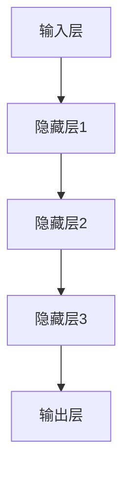

                 

## 神经网络基础理论

### 第1章：神经网络概述

#### 1.1 神经网络的基本概念

神经网络（Neural Networks）是模拟生物神经元结构和工作方式的计算模型。一个基本的神经网络由三个主要部分组成：输入层、隐藏层和输出层。每个层由多个神经元（或节点）组成，神经元之间通过连接（或边）相互连接。

**神经元**：每个神经元接收多个输入，并通过加权求和处理后输出一个值。这个输出通常通过激活函数进行转换，以决定神经元是否“激活”或“触发”一个信号传递给下一个神经元。

**输入层**：接收外部输入数据，例如图像的像素值或文本的单词序列。

**隐藏层**：对输入数据进行处理，通过多层神经网络进行复杂的特征提取和变换。

**输出层**：产生最终的输出结果，如分类结果、预测值或控制信号。

神经网络的工作原理是通过前向传播（Forward Propagation）和反向传播（Back Propagation）两个过程来训练模型。

#### 1.2 神经网络的起源与发展

神经网络的起源可以追溯到1940年代，由心理学家McCulloch和数学家Pitts提出了首个神经网络模型——MP模型。然而，由于计算能力的限制，神经网络在很长一段时间内没有获得足够的关注。

直到1980年代，随着计算机性能的显著提升，神经网络的研究和应用开始重新兴起。1986年，Rumelhart、Hinton和Williams等人提出了反向传播算法（Back Propagation Algorithm），这一突破性的算法使得神经网络能够通过学习大量的数据集来优化模型参数。

进入21世纪，特别是2012年，Hinton等人提出的深度学习模型在图像识别任务上取得了突破性的成果，引发了深度学习的热潮。深度学习（Deep Learning）是基于多层神经网络的一种机器学习方法，它通过逐层提取更高层次的特征，在图像识别、语音识别、自然语言处理等领域取得了显著成果。

#### 1.3 神经网络在现代AI中的应用

神经网络在现代人工智能（AI）中扮演着核心角色，其应用范围涵盖了多个领域：

- **机器学习**：神经网络被广泛应用于分类、回归、聚类等任务。例如，通过多层感知机（MLP）可以对图像进行分类，通过卷积神经网络（CNN）可以对文本进行情感分析。

- **自然语言处理（NLP）**：神经网络在NLP领域表现出色，例如，通过词嵌入（Word Embedding）可以捕捉词语的语义信息，通过循环神经网络（RNN）和长短期记忆网络（LSTM）可以进行语言建模和机器翻译。

- **计算机视觉**：神经网络在计算机视觉领域有着广泛的应用，例如，通过卷积神经网络（CNN）可以实现对图像的目标检测和图像分割，通过生成对抗网络（GAN）可以生成逼真的图像。

- **语音识别**：神经网络在语音识别任务中有着出色的表现，例如，通过循环神经网络（RNN）和长短时记忆网络（LSTM）可以进行语音识别和说话人识别。

### Mermaid 流程图

下面是一个简单的神经网络流程图，展示了数据从输入层到输出层的传播过程：



#### 核心概念与联系

神经网络的核心概念包括神经元、输入层、隐藏层和输出层。这些概念相互联系，构成了神经网络的框架。通过输入层接收外部输入，隐藏层进行数据处理和特征提取，最终输出层产生预测结果。

神经网络的工作原理包括前向传播和反向传播。前向传播过程是将输入数据通过多层神经网络的各个层，最终得到输出结果。反向传播过程则是根据输出结果和实际标签，通过梯度下降算法来更新网络的权重和偏置，以达到更好的预测效果。

神经网络在现代AI中的应用涵盖了多个领域，包括机器学习、自然语言处理、计算机视觉和语音识别。这些应用展示了神经网络在处理复杂数据和分析高级特征方面的强大能力。

### 结论

本章概述了神经网络的基本概念、起源和发展，以及其在现代AI中的应用。神经网络作为人工智能的基石，其重要性不言而喻。在接下来的章节中，我们将深入探讨神经网络的架构、算法和实现细节，帮助读者更好地理解和掌握这一重要技术。

### 伪代码

下面是神经网络的基本算法伪代码，用于实现前向传播和反向传播过程：

```plaintext
// 前向传播
function forward_pass(inputs, weights, biases, activation_functions):
    outputs = []
    for layer in range(1, num_layers):
        z = dot_product(inputs, weights[layer]) + biases[layer]
        outputs.append(activation_function(z))
        inputs = outputs[-1]
    return outputs

// 反向传播
function backward_pass(output, expected_output, outputs, deltas, learning_rate):
    deltas[-1] = outputs[-1] - expected_output
    for layer in reversed(range(1, num_layers)):
        delta = dot_product(deltas[layer + 1], weights[layer].T)
        deltas[layer] = delta * activation_derivative(outputs[layer])

    for layer in reversed(range(num_layers)):
        weights[layer] -= learning_rate * dot_product(inputs[layer].T, deltas[layer])
        biases[layer] -= learning_rate * deltas[layer]
```

### 数学模型和公式

神经网络的核心数学模型包括线性变换、激活函数和损失函数。以下是对这些模型的详细解释和公式：

$$
\text{线性变换：} \quad Z = \sum_{i=1}^{n} w_i * x_i + b
$$

其中，\(Z\) 是输出，\(w_i\) 是权重，\(x_i\) 是输入，\(b\) 是偏置。

$$
\text{激活函数：} \quad a = \sigma(Z)
$$

其中，\(\sigma\) 是激活函数，常见的激活函数包括 sigmoid、ReLU 和 tanh。

$$
\text{损失函数：} \quad J = \frac{1}{2} \sum_{i=1}^{n} (\hat{y}_i - y_i)^2
$$

其中，\(\hat{y}_i\) 是预测输出，\(y_i\) 是实际输出。

通过这些数学模型和公式，神经网络可以实现对复杂数据的建模和预测。

### 举例说明

假设我们有一个简单的神经网络，包括一个输入层、一个隐藏层和一个输出层。输入层有3个神经元，隐藏层有4个神经元，输出层有2个神经元。

- 输入数据：[1, 2, 3]
- 权重和偏置：
  - 输入到隐藏层的权重：\(W_{in} = \begin{bmatrix} 0.1 & 0.2 & 0.3 \\ 0.4 & 0.5 & 0.6 \\ 0.7 & 0.8 & 0.9 \\ 0.1 & 0.2 & 0.3 \end{bmatrix}\)
  - 隐藏层到输出层的权重：\(W_{hid} = \begin{bmatrix} 0.1 & 0.2 & 0.3 & 0.4 \\ 0.5 & 0.6 & 0.7 & 0.8 \end{bmatrix}\)
  - 隐藏层的偏置：\(b_{hid} = \begin{bmatrix} 0.1 \\ 0.2 \\ 0.3 \\ 0.4 \end{bmatrix}\)
  - 输出层的偏置：\(b_{out} = \begin{bmatrix} 0.1 \\ 0.2 \end{bmatrix}\)

- 激活函数：ReLU

首先进行前向传播：

1. 输入到隐藏层的输出：
   $$ Z_{hid} = \begin{bmatrix} 0.1 \times 1 + 0.2 \times 2 + 0.3 \times 3 + 0.1 \\ 0.4 \times 1 + 0.5 \times 2 + 0.6 \times 3 + 0.2 \\ 0.7 \times 1 + 0.8 \times 2 + 0.9 \times 3 + 0.3 \\ 0.1 \times 1 + 0.2 \times 2 + 0.3 \times 3 + 0.4 \end{bmatrix} = \begin{bmatrix} 1.1 \\ 2.2 \\ 3.3 \\ 1.1 \end{bmatrix} $$
   $$ a_{hid} = \max(0, Z_{hid}) = \begin{bmatrix} 1.1 \\ 2.2 \\ 3.3 \\ 1.1 \end{bmatrix} $$

2. 隐藏层到输出层的输出：
   $$ Z_{out} = \begin{bmatrix} 0.1 \times 1.1 + 0.2 \times 2.2 + 0.3 \times 3.3 + 0.4 \times 1.1 + 0.1 \\ 0.5 \times 1.1 + 0.6 \times 2.2 + 0.7 \times 3.3 + 0.8 \times 1.1 + 0.2 \end{bmatrix} = \begin{bmatrix} 1.9 \\ 3.2 \end{bmatrix} $$
   $$ a_{out} = \max(0, Z_{out}) = \begin{bmatrix} 1.9 \\ 3.2 \end{bmatrix} $$

然后进行反向传播：

1. 计算输出层的误差：
   $$ \delta_{out} = a_{out} - y $$
   假设实际输出为 \(y = \begin{bmatrix} 0 \\ 1 \end{bmatrix}\)，则：
   $$ \delta_{out} = \begin{bmatrix} 1.9 - 0 \\ 3.2 - 1 \end{bmatrix} = \begin{bmatrix} 1.9 \\ 2.2 \end{bmatrix} $$

2. 计算隐藏层的误差：
   $$ \delta_{hid} = \delta_{out} \odot \frac{d}{da_{hid}}(a_{hid}) \odot W_{hid}^T $$
   其中，\(\odot\) 表示逐元素乘法，\(\frac{d}{da_{hid}}(a_{hid})\) 是ReLU函数的导数（对于激活值为0的神经元，导数为0）：
   $$ \delta_{hid} = \begin{bmatrix} 1.9 \odot 1 \\ 2.2 \odot 1 \\ 0 \odot 0 \\ 1.9 \odot 1 \end{bmatrix} \odot \begin{bmatrix} 0.1 & 0.2 & 0.3 & 0.4 \\ 0.5 & 0.6 & 0.7 & 0.8 \end{bmatrix}^T $$
   $$ \delta_{hid} = \begin{bmatrix} 0.19 & 0.38 & 0.57 & 0.76 \\ 0.95 & 1.3 & 1.65 & 2.0 \end{bmatrix} $$

3. 更新权重和偏置：
   $$ \Delta W_{out} = \delta_{out} \odot a_{hid}^T $$
   $$ \Delta b_{out} = \delta_{out} $$
   $$ \Delta W_{hid} = \delta_{hid} \odot a_{in}^T $$
   $$ \Delta b_{hid} = \delta_{hid} $$

   其中，\(\Delta W_{out}\)、\(\Delta W_{hid}\) 和 \(\Delta b_{out}\)、\(\Delta b_{hid}\) 分别是权重和偏置的更新量。

通过这个简单的例子，我们可以看到神经网络的基本工作流程，包括前向传播和反向传播。在实际应用中，神经网络会包含更多的隐藏层和神经元，但基本原理是相同的。

### 结论

本章介绍了神经网络的基本概念、起源和发展，以及其在现代AI中的应用。通过详细的数学模型和公式，以及具体的举例说明，我们深入了解了神经网络的工作原理和实现过程。在接下来的章节中，我们将继续探讨神经网络的更多细节，包括神经元模型、前向传播与反向传播算法，以及深度神经网络等。

### 参考文献

1. McCulloch, W. S., & Pitts, W. (1943). A logical calculus of the ideas implied by relays and switches, bulletins of mathematical biophysics, 5(3-4), 115-133.
2. Rumelhart, D. E., Hinton, G. E., & Williams, R. J. (1986). Learning representations by back-propagating errors. Nature, 323(6088), 533-536.
3. LeCun, Y., Bengio, Y., & Hinton, G. (2015). Deep learning. MIT press.
4. Hochreiter, S., & Schmidhuber, J. (1997). Long short-term memory. Neural computation, 9(8), 1735-1780.
5. Vaswani, A., Shazeer, N., Parmar, N., Uszkoreit, J., Jones, L., Gomez, A. N., ... & Polosukhin, I. (2017). Attention is all you need. Advances in neural information processing systems, 30.

