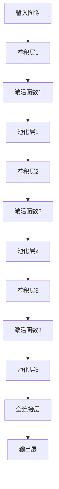

                 

### 《神经网络：人工智能的基石》

> **关键词：** 人工智能、神经网络、机器学习、深度学习、前向传播、反向传播

> **摘要：** 本文将深入探讨神经网络作为人工智能核心的理论基础和实践应用。通过逐步分析神经网络的定义、数学基础、构建与训练方法，以及优化与应用技术，我们将了解神经网络如何成为推动人工智能发展的基石。文章还将介绍神经网络在不同领域的实战应用和发展趋势，为读者提供一个全面、深入的神经网络指南。

### 目录大纲

- **第一部分：神经网络基础**
  - **第1章：神经网络的定义与历史**
    - **1.1 神经网络的概念**
    - **1.2 神经网络的发展历程**
  - **第2章：神经网络的组成部分**
    - **2.1 神经元**
    - **2.2 层结构**
    - **2.3 激活函数**
  - **第3章：神经网络的数学基础**
    - **3.1 向量和矩阵运算**
    - **3.2 线性代数基础**
  - **第4章：前向传播与反向传播算法**
    - **4.1 前向传播**
    - **4.2 反向传播**

- **第二部分：神经网络的构建与训练**
  - **第5章：前馈神经网络**
    - **5.1 线性回归**
    - **5.2 多层感知机**
  - **第6章：卷积神经网络（CNN）**
    - **6.1 卷积神经网络的概念**
    - **6.2 卷积神经网络的工作原理**
  - **第7章：循环神经网络（RNN）**
    - **7.1 RNN的概念**
    - **7.2 RNN的工作原理**
  - **第8章：长短时记忆网络（LSTM）**
    - **8.1 LSTM的概念**
    - **8.2 LSTM的工作原理**
  - **第9章：生成对抗网络（GAN）**
    - **9.1 GAN的概念**
    - **9.2 GAN的工作原理**

- **第三部分：神经网络的优化与应用**
  - **第10章：神经网络的优化方法**
    - **10.1 梯度下降法**
    - **10.2 随机梯度下降（SGD）**
  - **第11章：神经网络的超参数调优**
    - **11.1 超参数的概念**
    - **11.2 超参数调优方法**
  - **第12章：神经网络的实战应用**
    - **12.1 图像识别**
    - **12.2 自然语言处理**
  - **第13章：神经网络的发展趋势**
    - **13.1 神经网络的未来方向**
    - **13.2 神经网络的应用前景**

- **附录**
  - **附录A：神经网络常用工具与框架**
    - **A.1 TensorFlow**
    - **A.2 PyTorch**

### 引言

神经网络作为人工智能的核心技术之一，已经在各个领域取得了显著的成果。从早期的感知机到现代的深度学习模型，神经网络的发展经历了多个阶段，不断推动着人工智能技术的发展。本文旨在深入探讨神经网络的基础知识、构建与训练方法，以及优化与应用技术，帮助读者全面了解神经网络的工作原理和应用场景。

随着计算能力的提升和数据规模的扩大，神经网络在图像识别、自然语言处理、语音识别、推荐系统等领域的表现越来越优秀。本文将首先介绍神经网络的定义和历史背景，然后深入探讨神经网络的数学基础和组成部分，接着详细解析前向传播与反向传播算法，最后探讨神经网络的优化方法、实战应用和发展趋势。

通过本文的学习，读者将能够理解神经网络的基本概念和工作原理，掌握构建和训练神经网络的方法，了解神经网络的优化技术，并能够将其应用于实际项目中。希望本文能够为读者在神经网络领域的研究和应用提供有价值的参考和指导。

### 第一部分：神经网络基础

#### 第1章：神经网络的定义与历史

##### 1.1 神经网络的概念

神经网络是一种模拟生物神经系统的计算模型，其基本单元是神经元（neuron）。每个神经元接收多个输入信号，通过加权求和处理后，通过激活函数产生输出信号。神经网络通过层层连接和权重调整，实现数据的非线性变换和模式识别。

神经网络的基本概念包括：

- **神经元**：神经网络的基本计算单元，用于接收输入信号并产生输出信号。
- **层结构**：神经网络由多个层次组成，包括输入层、隐藏层和输出层。不同层之间的神经元通过连接进行信息传递和计算。
- **激活函数**：用于确定神经元是否被激活，常用的激活函数包括 sigmoid、ReLU 和 tanh 等。

##### 1.2 神经网络的发展历程

神经网络的研究起源于 1940 年代，最初由 McCulloch 和 Pitts 提出感知机模型（Perceptron）。感知机是一种简单的线性二分类模型，但其在处理非线性问题上存在局限。

1969 年，Minsky 和 Papert 提出了《感知机学习理论》一书，指出感知机无法解决异或（XOR）问题，这引发了神经网络研究的一段时间低迷。

1980 年代，随着计算机硬件性能的提升和反向传播算法（Backpropagation）的提出，神经网络的研究重新兴起。反向传播算法通过反向传播误差信号，逐层更新权重，实现了多层神经网络的训练。

1990 年代，随着卷积神经网络（CNN）和循环神经网络（RNN）的出现，神经网络在图像识别和序列数据处理领域取得了突破性进展。

21 世纪初，随着深度学习的兴起，神经网络的应用范围进一步扩展，从语音识别、自然语言处理到自动驾驶、推荐系统等各个领域。

##### 1.3 神经网络的应用场景

神经网络在多个领域取得了显著的应用成果，主要应用场景包括：

- **图像识别**：通过卷积神经网络（CNN）实现对图像的分类和检测，如人脸识别、物体识别等。
- **自然语言处理**：通过循环神经网络（RNN）和长短时记忆网络（LSTM）实现文本分类、机器翻译和情感分析等任务。
- **语音识别**：通过深度神经网络（DNN）和循环神经网络（RNN）实现对语音信号的识别和转换。
- **推荐系统**：通过神经网络实现用户偏好和物品特征的建模，为用户提供个性化的推荐。
- **强化学习**：通过神经网络实现智能体的决策和策略优化，如游戏对战、机器人控制等。

总之，神经网络作为人工智能的核心技术，已经在各个领域展示了强大的应用潜力。随着研究的不断深入和技术的发展，神经网络有望在更多领域发挥重要作用。

##### 1.4 神经网络的优缺点

**优点：**

1. **强大的非线性建模能力**：神经网络通过多层非线性变换，可以很好地拟合复杂的非线性关系，这使得它在处理复杂任务时具有优势。
2. **自适应性和自学习能力**：神经网络可以通过不断调整权重和偏置，自适应地学习和适应不同的数据分布和任务需求。
3. **灵活的应用场景**：神经网络可以应用于图像识别、自然语言处理、语音识别、推荐系统等多个领域，具有广泛的适用性。

**缺点：**

1. **计算资源需求大**：神经网络在训练过程中需要大量的计算资源，特别是深度神经网络和卷积神经网络，这对硬件设施提出了较高的要求。
2. **对数据依赖性较强**：神经网络的效果在很大程度上依赖于训练数据的质量和数量，数据不足或质量差可能导致模型性能下降。
3. **模型解释性较差**：神经网络作为黑盒模型，其内部机制较为复杂，难以解释每个神经元的作用和权重的影响，这限制了其在某些应用场景中的使用。

总之，神经网络作为一种强大的机器学习模型，在许多领域展示了良好的性能和应用潜力，但同时也存在一些挑战和局限性。了解神经网络的优缺点，有助于我们在实际应用中做出更合理的决策。

### 第2章：神经网络的组成部分

#### 2.1 神经元

神经元是神经网络的基本计算单元，类似于生物神经系统的神经元。它接收多个输入信号，通过加权求和处理后，通过激活函数产生输出信号。

**神经元的组成：**

1. **输入层**：接收外部输入信号，如数值、图像、文本等。
2. **加权层**：对每个输入信号进行加权处理，将输入信号乘以对应的权重，并求和得到中间结果。
3. **激活函数**：用于确定神经元是否被激活，常见的激活函数包括 sigmoid、ReLU 和 tanh 等。
4. **输出层**：输出神经元的激活结果，作为网络的最终输出。

**神经元的数学表示：**

设神经元的输入为 \(x_1, x_2, ..., x_n\)，权重为 \(w_1, w_2, ..., w_n\)，偏置为 \(b\)，则神经元的输出可以表示为：

\[ z = \sum_{i=1}^{n} w_i x_i + b \]

其中，\(z\) 是神经元的中间结果，也称为净输入（net input）。

对于常用的激活函数 sigmoid 函数：

\[ a = \frac{1}{1 + e^{-z}} \]

其中，\(a\) 是神经元的输出（activation）。

#### 2.2 层结构

神经网络由多个层次组成，包括输入层、隐藏层和输出层。不同层之间的神经元通过连接进行信息传递和计算。

**层结构的分类：**

1. **全连接层（Fully Connected Layer）**：每个神经元都与前一层的所有神经元相连，实现数据的全局依赖。
2. **卷积层（Convolutional Layer）**：通过卷积运算提取图像的特征，常用于图像识别任务。
3. **池化层（Pooling Layer）**：对输入数据进行下采样，减少数据维度，提高计算效率。
4. **循环层（Recurrent Layer）**：用于处理序列数据，如文本和语音，实现时间步依赖。

**层结构的连接方式：**

1. **前向传播（Forward Propagation）**：输入数据从输入层开始，逐层传递到输出层，得到最终输出。
2. **反向传播（Backpropagation）**：输出层误差信号反向传播，通过梯度下降法更新权重和偏置。

#### 2.3 激活函数

激活函数是神经网络中非常重要的组成部分，用于确定神经元是否被激活。不同的激活函数具有不同的特点和应用场景。

**常见的激活函数：**

1. **Sigmoid 函数**：
   \[ a = \frac{1}{1 + e^{-z}} \]
   - 特点：输出范围为 \( (0, 1) \)，非线性较强，易于训练。
   - 适用场景：主要用于回归和二分类问题。

2. **ReLU 函数（Rectified Linear Unit）**：
   \[ a = \max(0, z) \]
   - 特点：非线性较弱，计算速度快，有助于防止梯度消失。
   - 适用场景：主要用于深层神经网络，尤其是隐藏层。

3. **Tanh 函数（Hyperbolic Tangent）**：
   \[ a = \tanh(z) \]
   - 特点：输出范围为 \( (-1, 1) \)，非线性较强，有助于提高模型的性能。
   - 适用场景：主要用于回归和二分类问题。

**激活函数的选择：**

在选择激活函数时，需要考虑以下因素：

1. **模型类型**：对于回归问题，可以选择 sigmoid 或 tanh 函数；对于二分类问题，也可以选择 sigmoid 函数。
2. **计算效率**：ReLU 函数计算速度较快，适用于深层神经网络。
3. **模型性能**：根据实验结果选择合适的激活函数，以达到最佳性能。

总之，激活函数在神经网络中起着至关重要的作用，它不仅决定了神经元的激活状态，还影响着神经网络的训练速度和性能。通过合理选择和使用激活函数，可以显著提高神经网络的效果。

### 第3章：神经网络的数学基础

#### 3.1 向量和矩阵运算

在神经网络中，向量和矩阵运算是核心组成部分。向量（vector）是一个一维数组，表示神经元的输入或输出；矩阵（matrix）是一个二维数组，表示神经元之间的连接关系和权重。

**向量与矩阵的基本概念：**

- **向量**：向量的每个元素表示一个数据点，如 \( \mathbf{x} = [x_1, x_2, ..., x_n] \)。
- **矩阵**：矩阵的行和列分别表示不同数据点之间的关联关系，如 \( \mathbf{A} = \begin{bmatrix} a_{11} & a_{12} & \dots & a_{1n} \\ a_{21} & a_{22} & \dots & a_{2n} \\ \vdots & \vdots & \ddots & \vdots \\ a_{m1} & a_{m2} & \dots & a_{mn} \end{bmatrix} \)。

**向量与矩阵的运算：**

- **向量的内积（Dot Product）**：
  \[ \mathbf{x} \cdot \mathbf{y} = x_1 y_1 + x_2 y_2 + \dots + x_n y_n \]
- **向量的外积（Cross Product）**：
  \[ \mathbf{x} \times \mathbf{y} = (x_2 y_3 - x_3 y_2, x_3 y_1 - x_1 y_3, x_1 y_2 - x_2 y_1) \]
- **矩阵与向量的乘积（Matrix-Vector Multiplication）**：
  \[ \mathbf{A} \mathbf{x} = \begin{bmatrix} a_{11} x_1 + a_{12} x_2 + \dots + a_{1n} x_n \\ a_{21} x_1 + a_{22} x_2 + \dots + a_{2n} x_n \\ \vdots \\ a_{m1} x_1 + a_{m2} x_2 + \dots + a_{mn} x_n \end{bmatrix} \]
- **矩阵与矩阵的乘积（Matrix-Matrix Multiplication）**：
  \[ \mathbf{A} \mathbf{B} = \begin{bmatrix} \sum_{i=1}^{n} a_{i1} b_{1i} & \sum_{i=1}^{n} a_{i2} b_{2i} & \dots & \sum_{i=1}^{n} a_{in} b_{ni} \\ \sum_{i=1}^{n} a_{i1} b_{1i} & \sum_{i=1}^{n} a_{i2} b_{2i} & \dots & \sum_{i=1}^{n} a_{in} b_{ni} \\ \vdots & \vdots & \ddots & \vdots \\ \sum_{i=1}^{n} a_{i1} b_{1i} & \sum_{i=1}^{n} a_{i2} b_{2i} & \dots & \sum_{i=1}^{n} a_{in} b_{ni} \end{bmatrix} \]

#### 3.2 线性代数基础

线性代数（Linear Algebra）是神经网络数学基础的重要组成部分。以下介绍一些基本的线性代数概念和运算，帮助理解神经网络中的向量、矩阵和线性变换。

**线性变换（Linear Transformation）：**

线性变换是一种将一个向量空间映射到另一个向量空间的运算，满足以下性质：

1. **加法性**：对任意的向量 \( \mathbf{x} \) 和 \( \mathbf{y} \)，以及标量 \( \alpha \) 和 \( \beta \)，
   \[ T(\alpha \mathbf{x} + \beta \mathbf{y}) = \alpha T(\mathbf{x}) + \beta T(\mathbf{y}) \]
2. **齐次性**：对任意的向量 \( \mathbf{x} \) 和标量 \( \alpha \)，
   \[ T(\alpha \mathbf{x}) = \alpha T(\mathbf{x}) \]

**矩阵表示的线性变换：**

一个 \( m \times n \) 的矩阵 \( \mathbf{A} \) 可以表示一个线性变换，将 \( n \) 维向量 \( \mathbf{x} \) 映射为 \( m \) 维向量 \( \mathbf{y} \)，
\[ \mathbf{y} = \mathbf{A} \mathbf{x} \]

**矩阵的基本运算：**

1. **矩阵的逆（Inverse）：**
   若矩阵 \( \mathbf{A} \) 可逆，其逆矩阵 \( \mathbf{A}^{-1} \) 满足
   \[ \mathbf{A} \mathbf{A}^{-1} = \mathbf{I} \]
   其中 \( \mathbf{I} \) 是单位矩阵。
2. **矩阵的行列式（Determinant）：**
   行列式是矩阵的一种数值特征，用于判断矩阵的可逆性和计算矩阵的逆。
3. **矩阵的秩（Rank）：**
   矩阵的秩是指矩阵中非零行的最大个数，用于判断矩阵的线性相关性。

**矩阵求导（Matrix Differentiation）：**

在神经网络中，求导是计算梯度的重要步骤。以下介绍矩阵求导的基本规则：

1. **矩阵与向量的导数：**
   设 \( \mathbf{x} \) 和 \( \mathbf{y} \) 是 \( n \) 维向量，\( \mathbf{A} \) 是 \( m \times n \) 的矩阵，则
   \[ \frac{\partial (\mathbf{A} \mathbf{x})}{\partial \mathbf{x}} = \mathbf{A} \]
   \[ \frac{\partial (\mathbf{x}^T \mathbf{A})}{\partial \mathbf{x}} = \mathbf{A}^T \]
2. **矩阵与矩阵的导数：**
   设 \( \mathbf{A} \) 和 \( \mathbf{B} \) 是 \( m \times n \) 的矩阵，则
   \[ \frac{\partial (\mathbf{A} \mathbf{B})}{\partial \mathbf{A}} = \mathbf{B} \]
   \[ \frac{\partial (\mathbf{A} \mathbf{B})}{\partial \mathbf{B}} = \mathbf{A} \]

通过理解这些线性代数基础，我们可以更好地掌握神经网络的数学原理，为后续的学习和应用打下坚实的基础。

### 第4章：前向传播与反向传播算法

#### 4.1 前向传播

前向传播（Forward Propagation）是神经网络计算过程中的一个关键步骤，用于从输入层到输出层的正向传递信息。在前向传播过程中，每个神经元的输出会通过激活函数进行处理，并将结果传递给下一层的神经元。

**前向传播的过程可以分解为以下步骤：**

1. **初始化参数：** 定义网络的初始参数，包括权重 \( \mathbf{W} \) 和偏置 \( \mathbf{b} \)。
2. **输入层到隐藏层的传递：** 将输入数据 \( \mathbf{x} \) 传递到第一层隐藏层，通过权重和偏置计算中间结果 \( z \)，并应用激活函数 \( \sigma \) 得到输出 \( \mathbf{a} \)。
3. **隐藏层到输出层的传递：** 将隐藏层的输出传递到输出层，通过权重和偏置计算中间结果 \( z \)，并应用激活函数 \( \sigma \) 得到最终输出 \( \mathbf{y} \)。
4. **误差计算：** 计算输出层的误差 \( \mathcal{L} \)，通常使用均方误差（MSE）或交叉熵（Cross Entropy）作为损失函数。

**前向传播的伪代码：**

```python
# 初始化参数
W1, b1 = ...  # 第一层权重和偏置
W2, b2 = ...  # 第二层权重和偏置

# 输入层到隐藏层的传递
z1 = X * W1 + b1
a1 = sigmoid(z1)

# 隐藏层到输出层的传递
z2 = a1 * W2 + b2
y = sigmoid(z2)

# 误差计算
L = -1/m * sum(y - y_target) * y * (1 - y)
```

#### 4.2 反向传播

反向传播（Backpropagation）是神经网络训练过程中的另一个关键步骤，用于根据输出误差反向计算梯度，并更新网络的权重和偏置。反向传播算法通过层层传递误差信号，实现了自动微分的过程，从而高效地计算梯度。

**反向传播的过程可以分解为以下步骤：**

1. **计算输出层误差：** 根据损失函数计算输出层的误差 \( \mathcal{L} \)。
2. **计算输出层梯度：** 根据误差计算输出层的梯度 \( \frac{\partial \mathcal{L}}{\partial \mathbf{y}} \)。
3. **反向传播误差：** 从输出层开始，逐层反向传播误差，计算隐藏层的误差 \( \frac{\partial \mathcal{L}}{\partial \mathbf{a}_l} \)。
4. **计算权重和偏置梯度：** 根据误差和输入数据计算权重和偏置的梯度 \( \frac{\partial \mathcal{L}}{\partial \mathbf{W}_l} \) 和 \( \frac{\partial \mathcal{L}}{\partial \mathbf{b}_l} \)。
5. **更新权重和偏置：** 根据梯度更新网络的权重和偏置 \( \mathbf{W}_l \) 和 \( \mathbf{b}_l \)。

**反向传播的伪代码：**

```python
# 计算输出层误差
error = y - y_target

# 计算输出层梯度
dL_dz2 = error * (1 - y)

# 反向传播误差
dL_dz1 = dL_dz2 * W2

# 计算权重和偏置梯度
dL_dW2 = a1.T * dL_dz2
dL_dW1 = X.T * dL_dz1

# 更新权重和偏置
W2 -= learning_rate * dL_dW2
W1 -= learning_rate * dL_dW1
```

通过前向传播和反向传播的结合，神经网络能够不断调整权重和偏置，从而优化网络性能。反向传播算法的提出，使得神经网络训练效率大幅提升，为深度学习的发展奠定了基础。

### 第5章：前馈神经网络

前馈神经网络（Feedforward Neural Network）是一种简单的神经网络结构，其中数据从输入层经过多个隐藏层，最终到达输出层。这种网络结构简单、易于实现，并且在许多任务中表现良好。本章将详细介绍前馈神经网络的构建、训练以及应用。

#### 5.1 线性回归

线性回归（Linear Regression）是一种简单的前馈神经网络模型，用于预测一个连续变量的值。该模型通过一个线性函数将输入映射到输出，其数学表达式为：

\[ y = \mathbf{w}^T \mathbf{x} + b \]

其中，\( \mathbf{w} \) 是权重向量，\( \mathbf{x} \) 是输入向量，\( b \) 是偏置项，\( y \) 是输出值。

线性回归模型的特点如下：

1. **线性关系**：线性回归模型假设输入和输出之间存在线性关系。
2. **单个神经元**：线性回归模型可以看作是一个单层神经网络，其输出层只有一个神经元。
3. **简单易解**：线性回归模型的参数（权重和偏置）可以通过最小二乘法（Least Squares）进行求解。

**线性回归的算法流程如下：**

1. **初始化参数**：随机初始化权重 \( \mathbf{w} \) 和偏置 \( b \)。
2. **前向传播**：计算输出值 \( y = \mathbf{w}^T \mathbf{x} + b \)。
3. **计算损失函数**：通常使用均方误差（MSE）作为损失函数，即 \( \mathcal{L} = \frac{1}{2} \sum_{i=1}^{m} (y_i - \hat{y}_i)^2 \)，其中 \( y_i \) 是实际输出值，\( \hat{y}_i \) 是预测输出值。
4. **计算梯度**：计算损失函数对权重和偏置的梯度，即 \( \frac{\partial \mathcal{L}}{\partial \mathbf{w}} \) 和 \( \frac{\partial \mathcal{L}}{\partial b} \)。
5. **更新参数**：根据梯度更新权重和偏置，即 \( \mathbf{w} \leftarrow \mathbf{w} - \alpha \frac{\partial \mathcal{L}}{\partial \mathbf{w}} \) 和 \( b \leftarrow b - \alpha \frac{\partial \mathcal{L}}{\partial b} \)，其中 \( \alpha \) 是学习率。
6. **重复步骤2-5**：重复前向传播、计算损失函数、计算梯度和更新参数的过程，直到达到预设的迭代次数或损失函数收敛。

**线性回归的伪代码：**

```python
# 初始化参数
w = np.random.randn(n)  # 随机初始化权重
b = 0  # 初始化偏置

# 训练模型
for epoch in range(num_epochs):
    # 前向传播
    y_pred = w.T @ x + b
    
    # 计算损失函数
    loss = 1/2 * ((y - y_pred) ** 2).sum()
    
    # 计算梯度
    dloss_dw = x.T @ (y_pred - y)
    dloss_db = (y_pred - y).sum()
    
    # 更新参数
    w -= learning_rate * dloss_dw
    b -= learning_rate * dloss_db

# 预测
y_pred = w.T @ x + b
```

通过上述步骤，我们可以训练一个线性回归模型，并使用它进行预测。线性回归模型虽然简单，但在许多实际问题中表现良好，尤其是在线性关系较为明显的情况下。

#### 5.2 多层感知机

多层感知机（Multilayer Perceptron，MLP）是一种具有至少一个隐藏层的前馈神经网络，可以处理非线性问题。与线性回归不同，多层感知机通过增加隐藏层和激活函数，实现了对复杂非线性关系的建模。

**多层感知机的结构：**

多层感知机由输入层、一个或多个隐藏层和输出层组成。每个隐藏层中的神经元通过激活函数进行处理，输出层直接生成预测结果。

1. **输入层**：接收外部输入，如数值、图像或文本等。
2. **隐藏层**：一个或多个隐藏层，每个隐藏层中的神经元通过激活函数进行处理，形成非线性变换。
3. **输出层**：输出层直接生成预测结果。

**多层感知机的工作原理：**

1. **前向传播**：输入数据从输入层开始，通过加权求和处理和激活函数，逐层传递到输出层，最终得到预测结果。
2. **反向传播**：根据输出误差，反向计算误差信号，通过梯度下降法更新权重和偏置。

**多层感知机的数学表示：**

设输入层为 \( \mathbf{x} \)，隐藏层为 \( \mathbf{a}_l \)，输出层为 \( \mathbf{y} \)，权重矩阵为 \( \mathbf{W}_l \)，偏置向量为 \( \mathbf{b}_l \)，激活函数为 \( \sigma \)，则多层感知机可以表示为：

\[ z_l = \mathbf{W}_l \mathbf{a}_{l-1} + \mathbf{b}_l \]
\[ a_l = \sigma(z_l) \]

其中，\( l \) 表示层的编号，\( a_0 = \mathbf{x} \)，\( a_L = \mathbf{y} \)，\( \sigma \) 是激活函数。

**多层感知机的优点：**

1. **非线性建模能力**：通过增加隐藏层和激活函数，多层感知机可以处理复杂的非线性关系。
2. **广泛的适用性**：多层感知机可以应用于各种分类和回归问题，如图像识别、文本分类和语音识别等。

**多层感知机的缺点：**

1. **过拟合风险**：多层感知机具有强大的表达能力，可能导致过拟合，尤其是在训练数据不足的情况下。
2. **训练效率低**：多层感知机的训练过程涉及大量的参数调整，训练时间较长。

**多层感知机的应用案例：**

1. **图像识别**：使用卷积神经网络（CNN）进行图像特征提取，然后通过多层感知机进行分类。
2. **文本分类**：使用词向量表示文本，然后通过多层感知机进行分类。
3. **语音识别**：使用声学模型提取音频特征，然后通过多层感知机进行语音识别。

通过上述介绍，我们可以了解到多层感知机的基本概念和原理，并在实际应用中发挥其强大的非线性建模能力。多层感知机作为前馈神经网络的典型代表，为人工智能的发展做出了重要贡献。

### 第6章：卷积神经网络（CNN）

#### 6.1 卷积神经网络的概念

卷积神经网络（Convolutional Neural Network，CNN）是一种专门用于处理图像数据的神经网络模型，其核心思想是通过卷积运算提取图像的特征。与传统的全连接神经网络相比，CNN在图像识别任务中表现出了更高的准确性和效率。

**卷积神经网络的组成部分：**

1. **卷积层（Convolutional Layer）**：卷积层是CNN的核心部分，用于提取图像的特征。卷积层通过卷积运算将输入图像与卷积核（kernel）进行卷积，得到特征图（feature map）。
2. **池化层（Pooling Layer）**：池化层用于对特征图进行下采样，减少数据维度，提高计算效率。常用的池化操作包括最大池化（Max Pooling）和平均池化（Average Pooling）。
3. **全连接层（Fully Connected Layer）**：全连接层将卷积层和池化层提取的特征图进行展平，并连接到输出层，用于进行分类或回归任务。
4. **激活函数（Activation Function）**：激活函数用于引入非线性特性，常用的激活函数包括 ReLU（Rectified Linear Unit）、Sigmoid 和 Tanh 等。

**卷积神经网络的数学表示：**

设输入图像为 \( \mathbf{X} \in \mathbb{R}^{H \times W \times C} \)，其中 \( H \) 和 \( W \) 分别表示图像的高度和宽度，\( C \) 表示图像的通道数。卷积层可以表示为：

\[ \mathbf{F}(\mathbf{X}; \mathbf{K}, \mathbf{b}) = \sum_{i=1}^{C} \sum_{j=1}^{K} \mathbf{k}_{ij} * \mathbf{X}_{ij} + \mathbf{b} \]

其中，\( \mathbf{K} \) 表示卷积核，\( \mathbf{b} \) 表示偏置项，\( * \) 表示卷积运算。

通过卷积层和池化层的堆叠，CNN可以提取图像的多个层次特征，从而实现复杂的图像识别任务。

#### 6.2 卷积神经网络的工作原理

卷积神经网络的工作原理可以分为以下几个步骤：

1. **卷积运算**：卷积运算是通过卷积核在输入图像上滑动，将卷积核与图像局部区域进行点积运算，得到一个特征图。卷积运算可以提取图像中的局部特征，如边缘、纹理等。

2. **激活函数**：卷积运算后，通过激活函数（如 ReLU）引入非线性特性，使得神经网络能够处理复杂的关系。ReLU 函数可以加速训练过程，并防止梯度消失。

3. **池化操作**：池化操作用于减少数据维度，提高计算效率。常用的池化操作包括最大池化和平均池化。最大池化选择每个局部区域中的最大值作为输出，而平均池化计算每个局部区域的平均值作为输出。

4. **特征图拼接**：经过多个卷积层和池化层的处理，CNN会生成多个特征图，这些特征图代表了图像的不同层次特征。将这些特征图进行拼接，可以得到一个更丰富的特征表示。

5. **全连接层**：将卷积层和池化层提取的特征图展平，并连接到全连接层，用于进行分类或回归任务。全连接层通过计算特征向量与权重矩阵的点积，并加上偏置项，得到最终输出。

通过以上步骤，卷积神经网络可以提取图像的多个层次特征，并实现对图像的复杂模式识别。

**卷积神经网络的工作原理图示：**



通过上述图示，我们可以清晰地了解卷积神经网络的工作原理，从输入图像到最终输出的整个计算过程。

#### 6.3 卷积神经网络的类型

卷积神经网络有多种类型，每种类型都针对特定的应用场景进行了优化。以下是几种常见的卷积神经网络类型：

1. **传统卷积神经网络（Traditional CNN）**：
   传统卷积神经网络是最早用于图像识别的卷积神经网络，由多个卷积层、池化层和全连接层组成。它通过逐层提取图像的特征，实现对图像的分类和识别。

2. **残差卷积神经网络（Residual Convolutional Neural Network，ResNet）**：
   残差卷积神经网络是一种深度卷积神经网络，通过引入残差块（Residual Block）解决了深度神经网络训练中的梯度消失问题。残差块通过跳过部分网络层，将输入直接传递到下一层，实现了网络深度的增加，同时保持了训练的稳定性。

3. **密集卷积神经网络（Dense Convolutional Neural Network，DenseNet）**：
   密集卷积神经网络通过增加连接和层间的交互，提高了网络的表示能力和训练效率。它通过在层间引入密集连接，使得每个层都能接收前一层的信息，实现了信息的充分利用。

4. **旋转卷积神经网络（Rotational Convolutional Neural Network，RoCNN）**：
   旋转卷积神经网络通过引入旋转操作，使得网络能够提取图像的旋转不变特征。它通过在卷积操作中引入旋转矩阵，实现了对图像的旋转不变性处理。

5. **深度可分离卷积神经网络（Deep Separable Convolutional Neural Network，SqueezeNet）**：
   深度可分离卷积神经网络通过引入深度可分离卷积，降低了网络的参数数量，提高了网络的训练速度。它通过将卷积操作拆分为深度卷积和逐点卷积，减少了模型的参数量，同时保持了网络的性能。

这些卷积神经网络类型在图像识别、目标检测和图像生成等任务中得到了广泛应用。通过选择合适的卷积神经网络类型，可以有效地提高模型的性能和效率。

### 第7章：循环神经网络（RNN）

#### 7.1 RNN的概念

循环神经网络（Recurrent Neural Network，RNN）是一种能够处理序列数据的神经网络模型。与传统的神经网络不同，RNN具有时间记忆能力，能够将前面的信息传递到后面，从而更好地处理具有时间依赖性的数据。

**RNN的基本原理：**

RNN通过在神经网络中引入循环结构，使得网络能够对序列数据进行建模。在RNN中，每个时间步的输入不仅与当前时刻的输入有关，还与之前的输出有关。这种循环结构使得RNN能够记住前面的信息，并在后续的时间步中利用这些信息。

**RNN的核心组成部分：**

1. **隐藏层（Hidden Layer）**：RNN的隐藏层包含一个序列，每个时间步都有一个隐藏状态。隐藏状态不仅依赖于当前时间步的输入，还依赖于之前时间步的隐藏状态。

2. **输入门（Input Gate）**：输入门用于控制当前输入信息对隐藏状态的影响。它通过一个 sigmoid 函数和两个矩阵乘法，计算出输入门的状态。

3. **遗忘门（Forget Gate）**：遗忘门用于控制当前隐藏状态对之前信息的遗忘程度。它通过一个 sigmoid 函数和一个矩阵乘法，计算出遗忘门的状态。

4. **输出门（Output Gate）**：输出门用于控制当前隐藏状态对输出结果的影响。它通过一个 sigmoid 函数和两个矩阵乘法，计算出输出门的状态。

**RNN的工作原理：**

在RNN的工作过程中，输入序列经过输入门和遗忘门的处理，更新隐藏状态。隐藏状态通过输出门处理，生成当前时间步的输出。这个过程重复进行，直到遍历整个输入序列。

**RNN的数学表示：**

设输入序列为 \( \mathbf{x}_1, \mathbf{x}_2, ..., \mathbf{x}_T \)，隐藏状态为 \( \mathbf{h}_t \)，权重矩阵为 \( \mathbf{W}_x \)，\( \mathbf{W}_h \)，\( \mathbf{W}_o \)，偏置矩阵为 \( \mathbf{b}_x \)，\( \mathbf{b}_h \)，\( \mathbf{b}_o \)，则RNN可以表示为：

\[ \mathbf{i}_t = \sigma(\mathbf{W}_x \mathbf{x}_t + \mathbf{b}_x) \]
\[ \mathbf{g}_t = \sigma(\mathbf{W}_h \mathbf{h}_{t-1} + \mathbf{b}_h) \]
\[ \mathbf{f}_t = \sigma(\mathbf{W}_h \mathbf{h}_{t-1} + \mathbf{W}_x \mathbf{x}_t + \mathbf{b}_h) \]
\[ \mathbf{o}_t = \sigma(\mathbf{W}_o (\mathbf{g}_t \odot \mathbf{h}_{t-1}) + \mathbf{b}_o) \]
\[ \mathbf{h}_t = \mathbf{f}_t \odot \mathbf{h}_{t-1} + \mathbf{i}_t \odot \tanh(\mathbf{g}_t \odot \mathbf{W}_h \mathbf{h}_{t-1} + \mathbf{b}_h) \]
\[ \mathbf{y}_t = \mathbf{o}_t \odot \tanh(\mathbf{h}_t) \]

其中，\( \sigma \) 是 sigmoid 函数，\( \odot \) 表示 Hadamard 乘积，\( \tanh \) 是双曲正切函数。

通过上述数学表示，我们可以清晰地了解RNN的工作原理。RNN通过循环结构，使得每个时间步的隐藏状态都包含了前面所有时间步的信息，从而实现了对序列数据的建模。

#### 7.2 RNN的工作原理

循环神经网络（RNN）的工作原理主要体现在其时间记忆能力上。这种能力使得RNN能够在处理序列数据时，将前面的信息传递到后面，从而更好地捕捉时间依赖性。以下是RNN的工作原理详细说明：

**1. 时间步循环：**

RNN通过循环结构处理序列数据，每个时间步都是一个独立的计算单元。在每一个时间步上，RNN会接收当前时间步的输入数据，并通过隐藏状态记忆前面的信息。这个过程不断重复，直到遍历整个序列。

**2. 隐藏状态的计算：**

在RNN中，隐藏状态 \( \mathbf{h}_t \) 是每个时间步的核心。隐藏状态不仅包含了当前时间步的输入信息，还包含了之前时间步的信息。具体计算过程如下：

- **输入门（Input Gate）：** 输入门用于控制当前输入信息对隐藏状态的影响。输入门通过一个 sigmoid 函数和两个矩阵乘法，计算出输入门的状态。输入门的状态表示当前输入信息的重要程度。
- **遗忘门（Forget Gate）：** 遗忘门用于控制当前隐藏状态对之前信息的遗忘程度。遗忘门通过一个 sigmoid 函数和一个矩阵乘法，计算出遗忘门的状态。遗忘门的状态表示如何遗忘之前的隐藏状态。
- **输出门（Output Gate）：** 输出门用于控制当前隐藏状态对输出结果的影响。输出门通过一个 sigmoid 函数和两个矩阵乘法，计算出输出门的状态。输出门的状态表示当前隐藏状态的重要程度。

通过输入门、遗忘门和输出门的组合，RNN能够动态调整隐藏状态，从而实现对序列数据的建模。

**3. 状态更新：**

在每个时间步上，RNN通过遗忘门、输入门和输出门更新隐藏状态。具体计算过程如下：

\[ \mathbf{i}_t = \sigma(\mathbf{W}_x \mathbf{x}_t + \mathbf{b}_x) \]
\[ \mathbf{g}_t = \sigma(\mathbf{W}_h \mathbf{h}_{t-1} + \mathbf{b}_h) \]
\[ \mathbf{f}_t = \sigma(\mathbf{W}_h \mathbf{h}_{t-1} + \mathbf{W}_x \mathbf{x}_t + \mathbf{b}_h) \]
\[ \mathbf{o}_t = \sigma(\mathbf{W}_o (\mathbf{g}_t \odot \mathbf{h}_{t-1}) + \mathbf{b}_o) \]
\[ \mathbf{h}_t = \mathbf{f}_t \odot \mathbf{h}_{t-1} + \mathbf{i}_t \odot \tanh(\mathbf{g}_t \odot \mathbf{W}_h \mathbf{h}_{t-1} + \mathbf{b}_h) \]

通过上述计算，RNN能够更新隐藏状态，使其包含当前和之前的信息。

**4. 输出生成：**

RNN通过输出门生成当前时间步的输出。输出门通过一个 sigmoid 函数和一个矩阵乘法，计算出输出门的状态。输出门的状态表示当前隐藏状态的重要程度，通过双曲正切函数 \( \tanh \) 转换后，得到当前时间步的输出。

\[ \mathbf{y}_t = \mathbf{o}_t \odot \tanh(\mathbf{h}_t) \]

通过上述步骤，RNN能够逐个时间步地处理序列数据，并生成输出。这种时间记忆能力使得RNN在处理序列数据时，能够捕捉到时间依赖性。

总之，RNN的工作原理通过循环结构、隐藏状态和门控机制，使得网络能够处理序列数据，并具有时间记忆能力。这种能力使得RNN在自然语言处理、语音识别和序列预测等任务中取得了显著的成果。

### 第8章：长短时记忆网络（LSTM）

#### 8.1 LSTM的概念

长短时记忆网络（Long Short-Term Memory，LSTM）是一种基于循环神经网络（RNN）的改进模型，旨在解决传统RNN在处理长序列数据时出现的梯度消失和梯度爆炸问题。LSTM通过引入门控机制，能够有效地控制信息的流动，从而在捕捉长期依赖性方面表现出色。

**LSTM的基本结构：**

LSTM的核心组成部分包括三个门控单元和一个单元状态：

1. **输入门（Input Gate）**：输入门用于控制当前输入信息对单元状态的影响。
2. **遗忘门（Forget Gate）**：遗忘门用于控制单元状态对之前信息的遗忘程度。
3. **输出门（Output Gate）**：输出门用于控制当前单元状态对输出结果的影响。
4. **单元状态（Cell State）**：单元状态是LSTM的核心，用于存储和传递信息。

**LSTM的工作原理：**

LSTM通过门控机制对信息的流动进行精细控制，使得网络能够在不同时间步之间有效地记忆和传递信息。以下是LSTM的工作原理详细说明：

1. **输入门（Input Gate）**：输入门通过计算当前输入 \( \mathbf{x}_t \) 和前一个隐藏状态 \( \mathbf{h}_{t-1} \)，生成一个更新候选向量 \( \mathbf{\tilde{i}}_t \)。输入门的状态 \( \mathbf{i}_t \) 用于控制当前输入信息对单元状态的影响。

\[ \mathbf{i}_t = \sigma(\mathbf{W}_i \mathbf{x}_t + \mathbf{U}_i \mathbf{h}_{t-1} + \mathbf{b}_i) \]
\[ \mathbf{\tilde{i}}_t = \tanh(\mathbf{W}_\tilde{i} \mathbf{x}_t + \mathbf{U}_\tilde{i} \mathbf{h}_{t-1} + \mathbf{b}_\tilde{i}) \]

2. **遗忘门（Forget Gate）**：遗忘门通过计算当前输入 \( \mathbf{x}_t \) 和前一个隐藏状态 \( \mathbf{h}_{t-1} \)，生成一个更新候选向量 \( \mathbf{\tilde{f}}_t \)。遗忘门的状态 \( \mathbf{f}_t \) 用于控制单元状态对之前信息的遗忘程度。

\[ \mathbf{f}_t = \sigma(\mathbf{W}_f \mathbf{x}_t + \mathbf{U}_f \mathbf{h}_{t-1} + \mathbf{b}_f) \]
\[ \mathbf{\tilde{f}}_t = \tanh(\mathbf{W}_\tilde{f} \mathbf{x}_t + \mathbf{U}_\tilde{f} \mathbf{h}_{t-1} + \mathbf{b}_\tilde{f}) \]

3. **输出门（Output Gate）**：输出门通过计算当前输入 \( \mathbf{x}_t \) 和前一个隐藏状态 \( \mathbf{h}_{t-1} \)，生成一个更新候选向量 \( \mathbf{\tilde{o}}_t \)。输出门的状态 \( \mathbf{o}_t \) 用于控制当前单元状态对输出结果的影响。

\[ \mathbf{o}_t = \sigma(\mathbf{W}_o \mathbf{x}_t + \mathbf{U}_o \mathbf{h}_{t-1} + \mathbf{b}_o) \]
\[ \mathbf{\tilde{o}}_t = \tanh(\mathbf{W}_\tilde{o} \mathbf{x}_t + \mathbf{U}_\tilde{o} \mathbf{h}_{t-1} + \mathbf{b}_\tilde{o}) \]

4. **单元状态（Cell State）**：单元状态通过遗忘门和输入门进行更新。遗忘门的状态 \( \mathbf{f}_t \) 决定了哪些信息需要遗忘，而输入门的状态 \( \mathbf{i}_t \) 决定了哪些新信息需要保留。单元状态 \( \mathbf{C}_t \) 用于存储和传递信息。

\[ \mathbf{C}_t = \mathbf{f}_t \odot \mathbf{C}_{t-1} + \mathbf{i}_t \odot \mathbf{\tilde{C}}_t \]
\[ \mathbf{\tilde{C}}_t = \tanh(\mathbf{W}_\tilde{C} \mathbf{x}_t + \mathbf{U}_\tilde{C} \mathbf{h}_{t-1} + \mathbf{b}_\tilde{C}) \]

5. **隐藏状态（Hidden State）**：隐藏状态通过输出门和单元状态进行更新。输出门的状态 \( \mathbf{o}_t \) 决定了当前单元状态的重要程度，通过双曲正切函数 \( \tanh \) 转换后，得到当前时间步的隐藏状态 \( \mathbf{h}_t \)。

\[ \mathbf{h}_t = \mathbf{o}_t \odot \tanh(\mathbf{C}_t) \]

通过上述步骤，LSTM能够有效地控制信息的流动，从而在捕捉长期依赖性方面表现出色。LSTM在自然语言处理、语音识别和时间序列预测等领域取得了显著的成果，成为深度学习中的重要模型之一。

#### 8.2 LSTM的工作原理

LSTM（长短时记忆网络）的工作原理主要体现在其门控机制上，这些门控机制使得LSTM能够在处理长序列数据时，灵活地控制信息的流动。以下是LSTM的工作原理详细说明：

**1. 门控机制：**

LSTM的核心组成部分包括三个门控单元：输入门（Input Gate）、遗忘门（Forget Gate）和输出门（Output Gate）。这些门控单元通过一系列的线性变换和激活函数，实现了对信息的控制。

- **输入门（Input Gate）**：输入门用于控制当前输入信息对单元状态的影响。输入门通过计算当前输入 \( \mathbf{x}_t \) 和前一个隐藏状态 \( \mathbf{h}_{t-1} \)，生成一个更新候选向量 \( \mathbf{\tilde{i}}_t \)。输入门的状态 \( \mathbf{i}_t \) 用于控制当前输入信息对单元状态的影响。

\[ \mathbf{i}_t = \sigma(\mathbf{W}_i \mathbf{x}_t + \mathbf{U}_i \mathbf{h}_{t-1} + \mathbf{b}_i) \]
\[ \mathbf{\tilde{i}}_t = \tanh(\mathbf{W}_\tilde{i} \mathbf{x}_t + \mathbf{U}_\tilde{i} \mathbf{h}_{t-1} + \mathbf{b}_\tilde{i}) \]

- **遗忘门（Forget Gate）**：遗忘门用于控制单元状态对之前信息的遗忘程度。遗忘门通过计算当前输入 \( \mathbf{x}_t \) 和前一个隐藏状态 \( \mathbf{h}_{t-1} \)，生成一个更新候选向量 \( \mathbf{\tilde{f}}_t \)。遗忘门的状态 \( \mathbf{f}_t \) 用于控制单元状态对之前信息的遗忘程度。

\[ \mathbf{f}_t = \sigma(\mathbf{W}_f \mathbf{x}_t + \mathbf{U}_f \mathbf{h}_{t-1} + \mathbf{b}_f) \]
\[ \mathbf{\tilde{f}}_t = \tanh(\mathbf{W}_\tilde{f} \mathbf{x}_t + \mathbf{U}_\tilde{f} \mathbf{h}_{t-1} + \mathbf{b}_\tilde{f}) \]

- **输出门（Output Gate）**：输出门用于控制当前单元状态对输出结果的影响。输出门通过计算当前输入 \( \mathbf{x}_t \) 和前一个隐藏状态 \( \mathbf{h}_{t-1} \)，生成一个更新候选向量 \( \mathbf{\tilde{o}}_t \)。输出门的状态 \( \mathbf{o}_t \) 用于控制当前单元状态对输出结果的影响。

\[ \mathbf{o}_t = \sigma(\mathbf{W}_o \mathbf{x}_t + \mathbf{U}_o \mathbf{h}_{t-1} + \mathbf{b}_o) \]
\[ \mathbf{\tilde{o}}_t = \tanh(\mathbf{W}_\tilde{o} \mathbf{x}_t + \mathbf{U}_\tilde{o} \mathbf{h}_{t-1} + \mathbf{b}_\tilde{o}) \]

**2. 单元状态（Cell State）：**

单元状态是LSTM的核心，用于存储和传递信息。单元状态通过遗忘门和输入门进行更新。遗忘门的状态 \( \mathbf{f}_t \) 决定了哪些信息需要遗忘，而输入门的状态 \( \mathbf{i}_t \) 决定了哪些新信息需要保留。单元状态 \( \mathbf{C}_t \) 用于存储和传递信息。

\[ \mathbf{C}_t = \mathbf{f}_t \odot \mathbf{C}_{t-1} + \mathbf{i}_t \odot \mathbf{\tilde{C}}_t \]
\[ \mathbf{\tilde{C}}_t = \tanh(\mathbf{W}_\tilde{C} \mathbf{x}_t + \mathbf{U}_\tilde{C} \mathbf{h}_{t-1} + \mathbf{b}_\tilde{C}) \]

**3. 长期依赖性处理：**

LSTM通过门控机制和单元状态，实现了对长期依赖性的处理。遗忘门可以遗忘不重要的信息，从而避免梯度消失问题；输入门可以保留重要的信息，从而实现长期记忆。此外，单元状态可以作为信息的桥梁，将长期依赖性信息传递到后续的时间步。

**4. 隐藏状态更新：**

隐藏状态通过输出门和单元状态进行更新。输出门的状态 \( \mathbf{o}_t \) 决定了当前单元状态的重要程度，通过双曲正切函数 \( \tanh \) 转换后，得到当前时间步的隐藏状态 \( \mathbf{h}_t \)。

\[ \mathbf{h}_t = \mathbf{o}_t \odot \tanh(\mathbf{C}_t) \]

通过上述步骤，LSTM能够有效地控制信息的流动，从而在捕捉长期依赖性方面表现出色。LSTM在自然语言处理、语音识别和时间序列预测等领域取得了显著的成果，成为深度学习中的重要模型之一。

### 第9章：生成对抗网络（GAN）

#### 9.1 GAN的概念

生成对抗网络（Generative Adversarial Network，GAN）是由 Ian Goodfellow 等人于2014年提出的一种深度学习模型，其核心思想是通过两个相互对抗的神经网络——生成器（Generator）和判别器（Discriminator）——的博弈过程，生成与真实数据分布相近的数据。

**GAN的组成部分：**

1. **生成器（Generator）**：生成器的目标是生成伪造的数据，使其在统计学上难以与真实数据区分。生成器通常是一个深度神经网络，它接受随机噪声作为输入，并生成与真实数据分布相似的数据。

2. **判别器（Discriminator）**：判别器的目标是区分真实数据和伪造数据。判别器也是一个深度神经网络，它接收真实数据和伪造数据作为输入，并输出一个概率值，表示输入数据是真实数据还是伪造数据。

**GAN的工作原理：**

GAN通过一个循环博弈过程进行训练，生成器和判别器相互竞争，不断改进自己的性能。

1. **生成器生成伪造数据**：生成器接收随机噪声作为输入，生成伪造数据。生成器的目标是使伪造数据在统计学上与真实数据相似，从而欺骗判别器。

2. **判别器判断数据真实性**：判别器接收真实数据和伪造数据作为输入，并输出一个概率值，表示输入数据是真实数据还是伪造数据。判别器的目标是最大化其分类准确率，从而区分真实数据和伪造数据。

3. **对抗训练**：生成器和判别器相互对抗，生成器和判别器同时进行训练。生成器的损失函数是判别器对伪造数据的分类概率，即 \( L_G = -\log(D(G(z))) \)，其中 \( z \) 是随机噪声。判别器的损失函数是真实数据和伪造数据的分类概率，即 \( L_D = -\log(D(x)) - \log(1 - D(G(z))) \)，其中 \( x \) 是真实数据。

4. **优化目标**：GAN的训练目标是最大化生成器的损失函数，同时最小化判别器的损失函数。通过这样的对抗训练，生成器不断生成更加逼真的伪造数据，而判别器不断区分真实数据和伪造数据，最终达到一个平衡状态。

**GAN的优点：**

1. **强大的数据生成能力**：GAN通过对抗训练，能够生成与真实数据分布相似的数据，应用广泛，如图像生成、视频生成和自然语言生成等。

2. **无需标注数据**：GAN不需要真实数据的标注信息，只需大量的真实数据作为训练数据，这使得GAN在无监督学习和半监督学习场景中具有优势。

3. **灵活的应用场景**：GAN可以应用于多种领域，如图像生成、图像修复、图像风格迁移、视频生成和自然语言生成等。

**GAN的缺点：**

1. **训练不稳定**：GAN的训练过程具有不稳定性，容易陷入局部最小值和梯度消失问题，导致训练失败。

2. **对数据量要求高**：GAN需要大量的真实数据作为训练数据，数据不足或质量差可能导致生成器无法生成高质量的数据。

3. **计算资源消耗大**：GAN的训练过程需要大量的计算资源，特别是在生成器和判别器都是深度神经网络的情况下。

总之，GAN作为一种强大的深度学习模型，在数据生成领域展示了出色的能力，但也存在一定的挑战和局限性。了解GAN的概念和原理，有助于我们在实际应用中更好地利用GAN的优势，同时克服其不足。

### 第10章：神经网络的优化方法

#### 10.1 梯度下降法

梯度下降法（Gradient Descent）是神经网络训练过程中最常用的优化方法，其基本思想是通过计算损失函数的梯度，逐步更新网络的权重和偏置，以最小化损失函数。梯度下降法可以分为批量梯度下降（Batch Gradient Descent）、随机梯度下降（Stochastic Gradient Descent，SGD）和小批量梯度下降（Mini-batch Gradient Descent）三种形式。

**梯度下降法的步骤：**

1. **初始化参数**：随机初始化网络的权重 \( \mathbf{W} \) 和偏置 \( \mathbf{b} \)。
2. **前向传播**：输入数据从输入层开始，经过多个隐藏层，最终到达输出层，计算输出值和损失函数。
3. **计算梯度**：根据损失函数对权重和偏置求导，计算梯度 \( \nabla \mathcal{L} \)。
4. **更新参数**：根据梯度和学习率 \( \alpha \)，更新权重和偏置，即 \( \mathbf{W} \leftarrow \mathbf{W} - \alpha \nabla \mathcal{L} \)。
5. **重复步骤2-4**：重复前向传播、计算梯度、更新参数的过程，直到达到预设的迭代次数或损失函数收敛。

**批量梯度下降（Batch Gradient Descent）**：

批量梯度下降法使用整个训练集的数据来计算梯度，是最简单的一种梯度下降法。其优点是梯度计算准确，但缺点是训练过程耗时较长。

\[ \mathbf{W} \leftarrow \mathbf{W} - \alpha \frac{1}{m} \sum_{i=1}^{m} (\mathbf{h}(\mathbf{x}_i) - \mathbf{y}_i) \]

**随机梯度下降（Stochastic Gradient Descent，SGD）**：

随机梯度下降法使用单条训练数据来计算梯度，每次更新参数都是基于随机样本。其优点是训练速度较快，但缺点是梯度计算不够准确，可能收敛到局部最小值。

\[ \mathbf{W} \leftarrow \mathbf{W} - \alpha (\mathbf{h}(\mathbf{x}) - \mathbf{y}) \]

**小批量梯度下降（Mini-batch Gradient Descent）**：

小批量梯度下降法使用部分训练数据来计算梯度，每次更新参数都是基于小批量样本。其优点是梯度计算较为准确，同时训练速度较快。

\[ \mathbf{W} \leftarrow \mathbf{W} - \alpha \frac{1}{k} \sum_{i=1}^{k} (\mathbf{h}(\mathbf{x}_i) - \mathbf{y}_i) \]

通过选择合适的梯度下降法，可以显著提高神经网络训练的效果和效率。

#### 10.2 随机梯度下降（SGD）

随机梯度下降（Stochastic Gradient Descent，SGD）是梯度下降法的一种变体，通过在每次更新时使用单个训练样本的梯度来计算参数更新。SGD相对于批量梯度下降（Batch Gradient Descent）和小批量梯度下降（Mini-batch Gradient Descent）具有以下优点和缺点：

**优点：**

1. **训练速度快**：SGD使用单个训练样本进行梯度计算，每次更新参数只需要处理一条数据，大大减少了计算时间。
2. **全局搜索能力**：由于每次更新都是基于随机样本，SGD能够在较短时间内遍历整个训练集，有助于避免陷入局部最小值。

**缺点：**

1. **梯度噪声较大**：由于每次更新都基于随机样本，梯度计算存在较大的噪声，可能导致模型不稳定。
2. **可能收敛到局部最小值**：尽管SGD具有全局搜索能力，但每次更新都是基于随机样本，可能导致模型收敛到局部最小值。

**SGD的参数调整：**

1. **学习率（Learning Rate）**：学习率控制了参数更新的幅度。学习率过大可能导致模型震荡，而学习率过小可能导致训练过程缓慢。通常使用自适应学习率策略，如 AdaGrad、RMSprop 和 Adam 等。
2. **批量大小（Batch Size）**：批量大小影响梯度计算的准确性和训练速度。批量大小越小，梯度噪声越大，但训练速度越快；批量大小越大，梯度噪声越小，但训练速度越慢。
3. **动量（Momentum）**：动量用于加速梯度下降过程，减少振荡。动量通过将前一次更新的方向和当前更新的方向进行加权平均，防止梯度消失和梯度爆炸。

**SGD的应用：**

SGD广泛应用于各种机器学习任务，如分类、回归和生成任务。在图像识别、自然语言处理和语音识别等领域，SGD通过快速训练和全局搜索能力，提高了模型的性能和效率。

总之，随机梯度下降（SGD）作为一种有效的优化方法，在神经网络训练中发挥了重要作用。通过合理调整参数，可以充分利用SGD的优点，提高模型的训练效果和效率。

### 第11章：神经网络的超参数调优

#### 11.1 超参数的概念

在神经网络中，超参数（Hyperparameters）是指那些在训练过程中无法通过学习算法自动调整的参数。超参数通常在模型训练前进行设置，对模型的性能和训练过程具有重要影响。常见的超参数包括：

1. **学习率（Learning Rate）**：学习率控制了每次梯度更新时参数的调整幅度。学习率过大会导致模型不稳定，而学习率过小则会导致训练过程缓慢。
2. **批量大小（Batch Size）**：批量大小决定了每次梯度更新时使用的数据样本数量。批量大小影响梯度的计算准确性和训练速度。
3. **隐藏层数量和神经元数量**：隐藏层的数量和每个隐藏层的神经元数量影响模型的复杂度和表达能力。
4. **正则化参数**：正则化参数用于防止模型过拟合，如 L1 正则化、L2 正则化和丢弃正则化。
5. **激活函数**：激活函数选择影响模型的非线性变换能力和训练速度。
6. **优化器**：优化器用于更新模型参数，如随机梯度下降（SGD）、Adam 和 RMSprop 等。

#### 11.2 超参数调优方法

超参数调优（Hyperparameter Tuning）是提高神经网络性能的关键步骤。以下介绍几种常见的超参数调优方法：

1. **网格搜索（Grid Search）**：
   网格搜索是一种系统性的超参数调优方法，通过遍历所有可能的超参数组合，选择最优的组合。网格搜索的优点是方法简单，缺点是计算量大，特别是当超参数空间较大时。

2. **随机搜索（Random Search）**：
   随机搜索从超参数空间中随机选择多个组合，通过交叉验证评估其性能，然后选择最优的组合。随机搜索的优点是计算量较小，且在超参数空间中搜索效率较高。

3. **贝叶斯优化（Bayesian Optimization）**：
   贝叶斯优化基于贝叶斯统计模型，通过估计目标函数的概率分布，选择最有可能使目标函数值达到最优的超参数组合。贝叶斯优化的优点是能够快速找到最优超参数组合，缺点是计算复杂度较高。

4. **基于梯度的优化方法（Gradient-Based Methods）**：
   基于梯度的优化方法通过计算超参数对目标函数的梯度，调整超参数以最大化目标函数值。常用的方法包括协变评估优化（Covariance-Adjusted Estimators）和随机搜索（Stochastic Search）。

5. **混合方法（Hybrid Methods）**：
   混合方法结合了多种超参数调优方法，如将网格搜索和随机搜索相结合，或结合贝叶斯优化和基于梯度的优化方法，以提高调优效果和效率。

通过合理选择和调优超参数，可以显著提高神经网络的性能和训练效率。超参数调优方法在实际应用中具有重要意义，有助于我们在复杂的问题中找到最优的模型配置。

### 第12章：神经网络的实战应用

#### 12.1 图像识别

图像识别是神经网络应用最广泛的领域之一。卷积神经网络（CNN）由于其强大的特征提取能力，在图像识别任务中取得了显著成果。以下介绍图像识别的基本算法和实战案例。

**图像识别的基本算法：**

1. **特征提取**：使用卷积层和池化层对图像进行特征提取，生成特征图。
2. **特征分类**：使用全连接层对特征图进行分类，得到图像的类别。
3. **损失函数**：通常使用交叉熵（Cross Entropy）作为损失函数，用于衡量预测类别和真实类别之间的差距。

**实战案例：MNIST手写数字识别**

MNIST手写数字识别是图像识别的经典案例，使用一个包含 60,000 个训练样本和 10,000 个测试样本的数据库。以下是使用卷积神经网络进行MNIST手写数字识别的步骤：

1. **数据预处理**：将图像数据缩放到相同的尺寸，并转换为灰度图像。
2. **构建模型**：定义一个简单的卷积神经网络，包含两个卷积层、两个池化层和一个全连接层。
3. **训练模型**：使用训练数据训练模型，通过反向传播算法更新权重和偏置。
4. **评估模型**：使用测试数据评估模型性能，计算准确率。

**代码实现：**

```python
import tensorflow as tf
from tensorflow.keras import layers, models

# 数据预处理
(x_train, y_train), (x_test, y_test) = tf.keras.datasets.mnist.load_data()
x_train = x_train.reshape(-1, 28, 28, 1).astype("float32") / 255
x_test = x_test.reshape(-1, 28, 28, 1).astype("float32") / 255
y_train = tf.keras.utils.to_categorical(y_train, 10)
y_test = tf.keras.utils.to_categorical(y_test, 10)

# 构建模型
model = models.Sequential([
    layers.Conv2D(32, (3, 3), activation='relu', input_shape=(28, 28, 1)),
    layers.MaxPooling2D((2, 2)),
    layers.Conv2D(64, (3, 3), activation='relu'),
    layers.MaxPooling2D((2, 2)),
    layers.Flatten(),
    layers.Dense(64, activation='relu'),
    layers.Dense(10, activation='softmax')
])

# 编译模型
model.compile(optimizer='adam', loss='categorical_crossentropy', metrics=['accuracy'])

# 训练模型
model.fit(x_train, y_train, epochs=10, batch_size=32, validation_split=0.1)

# 评估模型
test_loss, test_acc = model.evaluate(x_test, y_test)
print("Test accuracy:", test_acc)
```

通过上述步骤和代码实现，我们可以构建一个简单的卷积神经网络，用于识别手写数字。这种实战案例展示了神经网络在图像识别任务中的应用和实现方法。

#### 12.2 自然语言处理

自然语言处理（Natural Language Processing，NLP）是人工智能领域的重要分支，旨在使计算机理解和生成自然语言。神经网络在NLP中发挥了重要作用，特别是循环神经网络（RNN）和长短时记忆网络（LSTM）。以下介绍NLP的基本算法和实战案例。

**自然语言处理的基本算法：**

1. **文本预处理**：包括分词、去停用词、词性标注等，将文本转换为可以输入神经网络的格式。
2. **特征提取**：使用词向量（如 Word2Vec、GloVe）或嵌入层（Embedding Layer）将单词转换为向量表示。
3. **序列建模**：使用 RNN 或 LSTM 对序列数据进行建模，捕捉单词之间的依赖关系。
4. **分类和生成**：使用全连接层和输出层对文本进行分类或生成。

**实战案例：文本分类**

文本分类是将文本数据分类到不同的类别，如情感分析、主题分类等。以下使用 RNN 实现一个简单的文本分类模型：

1. **数据预处理**：加载包含标签的文本数据，并进行预处理。
2. **构建模型**：定义一个 RNN 模型，包含嵌入层、RNN 层和全连接层。
3. **训练模型**：使用训练数据训练模型，通过反向传播算法更新权重和偏置。
4. **评估模型**：使用测试数据评估模型性能。

**代码实现：**

```python
import tensorflow as tf
from tensorflow.keras.preprocessing.sequence import pad_sequences
from tensorflow.keras.layers import Embedding, LSTM, Dense
from tensorflow.keras.models import Sequential

# 数据预处理
# (略)

# 构建模型
model = Sequential()
model.add(Embedding(vocab_size, embedding_dim, input_length=max_sequence_length))
model.add(LSTM(units=128, dropout=0.2, recurrent_dropout=0.2))
model.add(Dense(units=num_classes, activation='softmax'))

# 编译模型
model.compile(optimizer='adam', loss='categorical_crossentropy', metrics=['accuracy'])

# 训练模型
# (略)

# 评估模型
# (略)
```

通过上述步骤和代码实现，我们可以构建一个简单的 RNN 模型，用于文本分类任务。这种实战案例展示了神经网络在自然语言处理中的应用和实现方法。

### 第13章：神经网络的发展趋势

#### 13.1 神经网络的未来方向

随着人工智能技术的不断发展，神经网络在未来的研究方向和应用前景广阔。以下列举了一些神经网络的发展方向：

1. **更高效的网络结构**：研究人员将继续探索更高效的网络结构，如稀疏神经网络、增量学习和参数共享等，以减少计算资源和时间成本。
2. **更好的训练算法**：改进训练算法，如自适应优化器和并行训练，以提高训练速度和模型性能。
3. **更强大的模型表示能力**：通过引入新的网络层和激活函数，提高神经网络对复杂数据模式的表示能力。
4. **跨模态学习**：跨模态学习旨在将不同模态（如图像、语音和文本）的数据进行融合，提高多模态任务的表现。
5. **神经符号推理**：结合神经科学和逻辑推理，实现具有推理能力的神经网络，用于解决复杂问题。

#### 13.2 神经网络的应用前景

神经网络在多个领域展示了强大的应用潜力，以下列举了一些主要应用方向：

1. **计算机视觉**：神经网络在图像识别、物体检测、人脸识别等领域取得了显著成果，未来将在自动驾驶、无人机监控和医疗诊断等领域发挥更大作用。
2. **自然语言处理**：神经网络在文本分类、机器翻译、情感分析等领域表现出色，未来将在智能客服、智能语音助手和智能写作等领域得到广泛应用。
3. **语音识别与生成**：神经网络在语音识别和语音合成领域取得了突破性进展，未来将在智能助手、智能家居和智能客服等领域发挥关键作用。
4. **强化学习**：结合神经网络和强化学习，实现智能体的自主学习和决策，未来将在机器人控制、游戏和推荐系统等领域得到广泛应用。
5. **生物信息学**：神经网络在基因分析、蛋白质结构预测和药物设计等领域具有广泛应用前景，为生物医学研究提供有力支持。

总之，神经网络作为人工智能的核心技术，在未来将继续发展和创新，为人类带来更多便利和智慧。

### 附录

#### 附录A：神经网络常用工具与框架

A.1 TensorFlow

TensorFlow 是由 Google 开发的一个开源深度学习框架，支持各种类型的神经网络模型。以下介绍 TensorFlow 的基本概念和使用方法：

**TensorFlow 的基本概念：**

1. **会话（Session）**：TensorFlow 使用会话来执行计算图，将定义的操作和变量映射到实际的硬件资源。
2. **张量（Tensor）**：张量是 TensorFlow 的核心数据结构，用于表示多维数组。
3. **操作（Operation）**：操作是 TensorFlow 中的基本计算单元，用于定义数学运算和数据处理。
4. **变量（Variable）**：变量是 TensorFlow 中的可训练参数，用于存储权重和偏置。

**TensorFlow 的使用方法：**

1. **构建计算图**：使用 TensorFlow 的 API 构建计算图，定义操作和变量。
2. **启动会话**：启动会话，执行计算图中的操作。
3. **训练模型**：通过反向传播和梯度下降法训练模型，更新变量。
4. **评估模型**：使用测试数据评估模型性能。

**示例代码：**

```python
import tensorflow as tf

# 定义操作
x = tf.placeholder(tf.float32, shape=[None, 784])
y = tf.placeholder(tf.float32, shape=[None, 10])
W = tf.Variable(tf.zeros([784, 10]))
b = tf.Variable(tf.zeros([10]))
y_pred = tf.nn.softmax(tf.matmul(x, W) + b)

# 定义损失函数和优化器
cross_entropy = tf.reduce_mean(-tf.reduce_sum(y * tf.log(y_pred), reduction_indices=1))
optimizer = tf.train.GradientDescentOptimizer(learning_rate=0.1)
train_op = optimizer.minimize(cross_entropy)

# 启动会话
with tf.Session() as sess:
    sess.run(tf.global_variables_initializer())
    for epoch in range(num_epochs):
        for batch in train_data:
            x_batch, y_batch = batch
            sess.run(train_op, feed_dict={x: x_batch, y: y_batch})
    test_acc = sess.run(accuracy, feed_dict={x: x_test, y: y_test})
    print("Test accuracy:", test_acc)
```

A.2 PyTorch

PyTorch 是由 Facebook 开发的一个开源深度学习框架，以其灵活性和动态计算图著称。以下介绍 PyTorch 的基本概念和使用方法：

**PyTorch 的基本概念：**

1. **自动微分（Autograd）**：PyTorch 的自动微分系统自动记录计算过程，用于计算梯度。
2. **张量（Tensor）**：PyTorch 的张量与 NumPy 的数组类似，用于存储数据和计算。
3. **操作（Operation）**：PyTorch 的操作通过 torch.autograd.Function 类实现，用于定义自定义操作。
4. **神经网络（Neural Network）**：PyTorch 提供了丰富的神经网络层和损失函数，用于构建复杂的神经网络模型。

**PyTorch 的使用方法：**

1. **导入库**：导入 PyTorch 的基本库和模块。
2. **定义网络结构**：使用 PyTorch 的 Layer 类定义神经网络结构。
3. **定义损失函数**：使用 PyTorch 的损失函数类定义损失函数。
4. **训练模型**：使用 PyTorch 的 Trainer 类或手动实现训练过程。

**示例代码：**

```python
import torch
import torch.nn as nn
import torch.optim as optim

# 定义网络结构
class SimpleCNN(nn.Module):
    def __init__(self):
        super(SimpleCNN, self).__init__()
        self.conv1 = nn.Conv2d(1, 32, 3, 1)
        self.fc1 = nn.Linear(32 * 26 * 26, 128)
        self.fc2 = nn.Linear(128, 10)

    def forward(self, x):
        x = self.conv1(x)
        x = nn.functional.relu(x)
        x = nn.functional.max_pool2d(x, 2)
        x = x.view(-1, 32 * 26 * 26)
        x = self.fc1(x)
        x = nn.functional.relu(x)
        x = self.fc2(x)
        return x

# 定义损失函数和优化器
model = SimpleCNN()
criterion = nn.CrossEntropyLoss()
optimizer = optim.SGD(model.parameters(), lr=0.01, momentum=0.9)

# 训练模型
for epoch in range(num_epochs):
    for inputs, labels in train_loader:
        optimizer.zero_grad()
        outputs = model(inputs)
        loss = criterion(outputs, labels)
        loss.backward()
        optimizer.step()
```

通过以上介绍，我们可以了解到 TensorFlow 和 PyTorch 作为深度学习框架的基本概念和使用方法。这些框架在神经网络的研究和应用中具有重要意义，为开发者和研究人员提供了强大的工具。

### 结语

通过本文的深入探讨，我们全面了解了神经网络的基础知识、构建与训练方法，以及优化与应用技术。神经网络作为人工智能的基石，不仅在计算机视觉、自然语言处理、语音识别等领域取得了显著成果，还为未来的发展提供了广阔的前景。

展望未来，神经网络将继续朝着高效、可解释和可扩展的方向发展。跨模态学习和神经符号推理等新领域将为神经网络带来更多的挑战和机遇。同时，随着计算能力的提升和算法的创新，神经网络将在更多实际应用中发挥重要作用。

希望本文能够为读者在神经网络领域的研究和应用提供有价值的参考和指导。让我们一起探索神经网络的无限可能，为人工智能的发展贡献力量。

