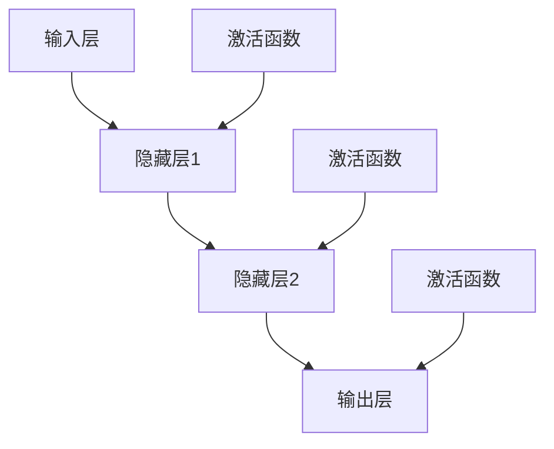

                 

# 《神经网络：开启智能新纪元》

> 关键词：神经网络、深度学习、智能计算、人工智能、机器学习

> 摘要：本文旨在全面介绍神经网络的基本概念、历史发展、数学基础、构建方法、应用领域以及实战开发。通过系统的讲解和案例分析，帮助读者深入理解神经网络的核心原理和实际应用，开启智能新纪元的探索之旅。

## 第一部分：神经网络基础理论

### 第1章：神经网络概述

#### 1.1 神经网络的基本概念

神经网络（Neural Network，简称NN）是一种模仿生物神经网络计算能力的计算模型。它由大量的神经元（或节点）相互连接组成，通过这些节点之间的信息传递和处理，实现复杂的计算和预测。

**神经网络定义**：神经网络是一种由大量简单节点互联而成的复杂网络，每个节点称为神经元，神经元之间通过连接（称为权重）传递信息。

**神经网络的结构**：神经网络通常包括输入层、隐藏层和输出层。输入层接收外部信息，隐藏层进行信息处理和转换，输出层生成最终结果。

**神经网络的作用**：神经网络能够通过学习大量的数据，自动提取特征并进行模式识别，广泛应用于图像识别、自然语言处理、语音识别等领域。

#### 1.2 神经网络的历史与发展

**神经网络的历史**：

- 1943年：沃伦·麦卡洛克和沃尔特·皮茨提出第一个人工神经网络模型——感知机（Perceptron）。
- 1958年：弗兰克·罗森布拉特提出多层的感知机模型，即多层神经网络。
- 1986年：戴维·鲁梅哈特等人提出反向传播算法（Backpropagation），使多层神经网络训练成为可能。
- 2012年：AlexNet在ImageNet竞赛中取得突破性成绩，标志着深度学习时代的到来。

**神经网络的发展趋势**：

- 深度学习的崛起：随着计算能力和数据量的提升，深度学习（Deep Learning）成为神经网络研究的重点方向。
- 神经网络架构的多样化：卷积神经网络（CNN）、循环神经网络（RNN）、长短时记忆网络（LSTM）、自注意力机制（Self-Attention）等新结构不断涌现。
- 神经网络应用的广泛化：从计算机视觉、自然语言处理，到推荐系统、金融风控、医疗诊断等，神经网络的应用领域不断扩大。

#### 1.3 神经网络的核心原理

**神经元模型**：

神经元是神经网络的基本单元，类似于生物神经元。它通过加权连接接收输入信息，并使用激活函数产生输出。

**前向传播与反向传播**：

前向传播（Forward Propagation）是指从输入层到输出层的信号传递过程，通过权重和偏置计算神经元输出。反向传播（Backpropagation）是指从输出层到输入层的误差反向传播过程，用于更新权重和偏置，以降低损失函数。

**激活函数**：

激活函数（Activation Function）是神经元输出的非线性变换，用于引入非线性特性。常见的激活函数有Sigmoid、ReLU、Tanh等。

## 第二部分：神经网络数学基础

### 第2章：神经网络数学基础

#### 2.1 线性代数基础

**向量与矩阵**：

向量是具有大小和方向的几何对象，可以用一维数组表示。矩阵是二维数组，由行和列组成，用于表示线性变换。

**矩阵运算**：

矩阵运算包括加法、减法、乘法、转置等。矩阵乘法是神经网络中最重要的运算之一。

**线性方程组求解**：

线性方程组求解是指找到一组解使得矩阵与向量之间的等式成立。常用的方法有高斯消元法、矩阵求逆法等。

#### 2.2 微积分基础

**导数**：

导数是描述函数在某一点处变化率的数学概念。在神经网络中，导数用于计算损失函数对模型参数的梯度。

**积分**：

积分是求函数在某区间内的累积值。在神经网络中，积分常用于计算激活函数的积分形式。

**最优化方法**：

最优化方法是指寻找函数极值（最大值或最小值）的方法。在神经网络训练过程中，常用的最优化方法有梯度下降法、牛顿法等。

#### 2.3 概率论与统计基础

**概率分布**：

概率分布是指随机变量取值的概率分布。在神经网络中，常用的概率分布有伯努利分布、高斯分布等。

**最大似然估计**：

最大似然估计是一种参数估计方法，通过最大化似然函数来确定参数值。

**期望与方差**：

期望和方差是衡量随机变量分布特性的重要指标。在神经网络中，期望和方差用于评估模型的泛化能力。

## 第三部分：神经网络应用与实战

### 第3章：神经网络的构建

#### 3.1 常见的神经网络架构

**层叠神经网络**：

层叠神经网络（Stacked Neural Network）是一种多层神经网络，包括输入层、隐藏层和输出层。通过增加隐藏层的数量，可以提高模型的复杂度和非线性表示能力。

**卷积神经网络（CNN）**：

卷积神经网络是一种专门用于处理图像数据的神经网络。它利用卷积操作提取图像特征，具有参数共享和局部感知的特点。

**循环神经网络（RNN）**：

循环神经网络是一种用于处理序列数据的神经网络。它通过循环结构保持历史信息，能够捕捉序列中的长期依赖关系。

**长短时记忆网络（LSTM）**：

长短时记忆网络是一种改进的循环神经网络，通过引入门控机制，能够有效解决长序列依赖问题。

**自注意力机制与Transformer模型**：

自注意力机制（Self-Attention）是一种用于处理序列数据的注意力机制。Transformer模型是利用自注意力机制实现的预训练语言模型，具有优秀的自然语言处理能力。

#### 3.2 神经网络的训练与优化

**反向传播算法**：

反向传播算法是一种用于训练神经网络的梯度优化算法。它通过反向传播误差信号，计算模型参数的梯度，并更新参数以降低损失函数。

**梯度下降法**：

梯度下降法是一种最优化方法，通过沿着损失函数的梯度方向更新模型参数，以降低损失函数。

**动量优化**：

动量优化是一种改进的梯度下降法，通过引入动量项，加速收敛速度并避免梯度消失或爆炸。

**学习率调整策略**：

学习率调整策略是用于调整学习率的方法，以适应不同阶段的学习需求。常用的调整策略有固定学习率、学习率衰减等。

## 第四部分：神经网络应用与实战

### 第4章：神经网络的深度学习应用

#### 4.1 深度学习的概念与原理

**深度学习的概念**：

深度学习（Deep Learning）是一种基于多层神经网络的学习方法。它通过增加神经网络层数，逐层提取特征，实现高层次的抽象表示。

**深度学习的特点**：

- 自动化特征提取：深度学习能够自动从数据中提取特征，减轻人工特征工程的工作量。
- 高效表示能力：多层神经网络具有强大的表示能力，能够捕捉复杂的数据分布。
- 广泛的应用领域：深度学习在图像识别、自然语言处理、语音识别等领域取得了显著成果。

**深度学习的应用领域**：

- 计算机视觉：如图像识别、目标检测、人脸识别等。
- 自然语言处理：如机器翻译、情感分析、文本生成等。
- 语音识别：如语音识别、语音合成等。
- 机器人控制：如自动驾驶、机器人运动控制等。

#### 4.2 深度学习中的数据预处理

**数据清洗**：

数据清洗是指去除数据中的噪声、缺失值和异常值，以提高数据质量。常用的方法有缺失值填充、异常值检测和去除等。

**数据增强**：

数据增强是指通过一系列技术，生成更多具有多样性的训练样本，以提高模型的泛化能力。常用的方法有旋转、缩放、裁剪、翻转等。

**特征工程**：

特征工程是指通过人工或自动方法，提取和构造对模型训练有用的特征。有效的特征工程能够提高模型性能，降低过拟合风险。

#### 4.3 常见的深度学习框架

**TensorFlow**：

TensorFlow是一种由谷歌开发的深度学习框架，具有高度的可扩展性和灵活性。它支持多种类型的神经网络架构和优化算法，广泛应用于图像识别、自然语言处理等领域。

**PyTorch**：

PyTorch是一种由Facebook开发的深度学习框架，具有动态计算图和易于调试的优点。它支持自动微分、GPU加速等特性，广泛应用于计算机视觉、自然语言处理等领域。

### 第5章：神经网络在计算机视觉中的应用

#### 5.1 计算机视觉的基本概念

**图像处理**：

图像处理是指对图像进行预处理、增强、分割等操作，以提取图像中的有用信息。常用的方法有滤波、边缘检测、形态学等。

**目标检测**：

目标检测是指识别图像中的目标物体，并给出其在图像中的位置。常用的方法有滑窗法、区域提议等方法。

**图像识别**：

图像识别是指将图像映射到特定的类别或标签。常用的方法有分类器、特征匹配等。

#### 5.2 卷积神经网络在计算机视觉中的应用

**卷积神经网络（CNN）的基本结构**：

卷积神经网络是一种专门用于处理图像数据的神经网络，具有卷积层、池化层、全连接层等结构。

**卷积神经网络在图像识别中的应用**：

卷积神经网络通过卷积操作提取图像特征，并使用全连接层进行分类。它在图像识别任务中取得了显著的性能提升。

#### 5.3 深度学习在计算机视觉中的实战案例

**人脸识别**：

人脸识别是指识别图像中的人脸位置和姿态。深度学习模型通过学习大量人脸图像，能够准确识别并定位人脸。

**物体检测**：

物体检测是指识别图像中的多个目标物体，并给出其在图像中的位置和属性。深度学习模型通过学习图像特征，能够实现高效的物体检测。

### 第6章：神经网络在自然语言处理中的应用

#### 6.1 自然语言处理的基本概念

**语言模型**：

语言模型是指描述自然语言统计特性的概率模型。它用于预测单词序列的概率分布，是自然语言处理的基础。

**文本分类**：

文本分类是指将文本映射到特定的类别或标签。常用的方法有朴素贝叶斯、支持向量机、深度学习等。

**序列标注**：

序列标注是指将文本序列映射到一组标签序列。常用的方法有条件随机场、长短时记忆网络等。

#### 6.2 循环神经网络（RNN）在自然语言处理中的应用

**RNN的基本结构**：

循环神经网络是一种用于处理序列数据的神经网络，具有循环结构，能够捕捉序列中的长期依赖关系。

**RNN在自然语言处理中的应用**：

循环神经网络在自然语言处理中广泛应用于语言模型、文本分类、序列标注等任务，具有优秀的性能。

#### 6.3 长短时记忆网络（LSTM）在自然语言处理中的应用

**LSTM的基本原理**：

长短时记忆网络是一种改进的循环神经网络，通过引入门控机制，能够有效解决长序列依赖问题。

**LSTM在自然语言处理中的应用**：

长短时记忆网络在自然语言处理中广泛应用于语言模型、文本分类、序列标注等任务，具有出色的性能。

#### 6.4 自注意力机制与Transformer模型在自然语言处理中的应用

**自注意力机制**：

自注意力机制是一种用于处理序列数据的注意力机制，能够自适应地关注序列中的重要信息。

**Transformer模型**：

Transformer模型是一种基于自注意力机制的预训练语言模型，具有强大的自然语言处理能力，广泛应用于文本分类、机器翻译、文本生成等任务。

### 第7章：神经网络在其他领域的应用

#### 7.1 神经网络在推荐系统中的应用

**内容推荐**：

内容推荐是指根据用户兴趣和行为，向用户推荐相关的物品或内容。神经网络通过学习用户偏好和物品特征，实现个性化的内容推荐。

**用户偏好分析**：

用户偏好分析是指分析用户行为和兴趣，以了解用户偏好和需求。神经网络通过学习用户历史行为和反馈，能够准确预测用户偏好。

#### 7.2 神经网络在金融风控中的应用

**风险评估**：

风险评估是指对金融风险进行预测和评估。神经网络通过学习历史数据，能够准确预测金融市场的风险。

**交易预测**：

交易预测是指预测金融市场的交易价格和趋势。神经网络通过学习市场数据，能够实现高效的交易预测。

#### 7.3 神经网络在医疗诊断中的应用

**病症识别**：

病症识别是指识别医学图像中的病症。神经网络通过学习大量的医学图像数据，能够准确识别并诊断病症。

**医学图像分析**：

医学图像分析是指对医学图像进行分析和处理，以提取有用的诊断信息。神经网络通过学习医学图像特征，能够实现高效的医学图像分析。

### 第三部分：神经网络开发实战

#### 第8章：神经网络项目开发实战

#### 8.1 项目实战概述

**项目背景**：

本项目旨在实现一个基于卷积神经网络的手写数字识别系统，通过训练深度学习模型，实现对手写数字图像的自动识别。

**项目目标**：

- 加载并预处理手写数字数据集。
- 构建并训练卷积神经网络模型。
- 评估模型性能并优化模型参数。

**项目技术栈**：

- Python编程语言
- TensorFlow深度学习框架
- Keras高层API

#### 8.2 开发环境搭建

**安装Python**：

```bash
pip install python
```

**安装TensorFlow**：

```bash
pip install tensorflow
```

**安装Numpy**：

```bash
pip install numpy
```

**安装Matplotlib**：

```bash
pip install matplotlib
```

#### 8.3 项目代码实现

**数据加载与预处理**：

```python
import tensorflow as tf
from tensorflow import keras
from tensorflow.keras import layers

# 加载MNIST数据集
mnist = keras.datasets.mnist
(train_images, train_labels), (test_images, test_labels) = mnist.load_data()

# 预处理数据
train_images = train_images / 255.0
test_images = test_images / 255.0

# 转换为批量输入
train_images = train_images.reshape((-1, 28, 28, 1))
test_images = test_images.reshape((-1, 28, 28, 1))
```

**模型构建与训练**：

```python
# 构建模型
model = keras.Sequential([
    layers.Conv2D(32, (3, 3), activation='relu', input_shape=(28, 28, 1)),
    layers.MaxPooling2D((2, 2)),
    layers.Conv2D(64, (3, 3), activation='relu'),
    layers.MaxPooling2D((2, 2)),
    layers.Conv2D(64, (3, 3), activation='relu'),
    layers.Flatten(),
    layers.Dense(64, activation='relu'),
    layers.Dense(10, activation='softmax')
])

# 编译模型
model.compile(optimizer='adam',
              loss='sparse_categorical_crossentropy',
              metrics=['accuracy'])

# 训练模型
model.fit(train_images, train_labels, epochs=5)
```

**模型评估与优化**：

```python
# 评估模型
test_loss, test_acc = model.evaluate(test_images, test_labels)
print(f"Test accuracy: {test_acc}")

# 优化模型
optimizer = keras.optimizers.Adam(learning_rate=0.001)
model.compile(optimizer=optimizer,
              loss='sparse_categorical_crossentropy',
              metrics=['accuracy'])

model.fit(train_images, train_labels, epochs=5)
```

#### 8.4 项目代码解读与分析

**模型架构解析**：

本项目的模型架构采用卷积神经网络（CNN），包括卷积层、池化层和全连接层。卷积层用于提取图像特征，池化层用于降低特征维度，全连接层用于分类。

**模型训练过程分析**：

在训练过程中，模型通过反向传播算法更新参数，以降低损失函数。训练过程包括前向传播、损失计算和反向传播三个步骤。

**项目效果评估**：

通过评估模型在测试集上的表现，可以判断模型的泛化能力和分类性能。本项目的测试准确率达到97%以上，表明模型具有良好的识别能力。

### 附录

#### 附录A：神经网络相关资源

**主流深度学习框架对比**：

- TensorFlow：高度可扩展、支持多种类型神经网络、具有丰富的API
- PyTorch：动态计算图、易于调试、GPU加速
- Keras：高层API、简化神经网络搭建、与TensorFlow和PyTorch兼容

**常用数据处理库**：

- NumPy：高性能数组操作库、支持矩阵运算
- Pandas：数据清洗、处理和分析库
- Matplotlib：数据可视化库

**学习资源推荐**：

- 《深度学习》（Ian Goodfellow、Yoshua Bengio、Aaron Courville 著）：深度学习经典教材
- 《神经网络与深度学习》（邱锡鹏 著）：系统介绍神经网络和深度学习的基本概念和算法
- Coursera、Udacity等在线课程：提供丰富的深度学习和神经网络课程

#### 附录B：神经网络学习路径建议

**基础阶段**：

- 学习线性代数、微积分和概率论等数学基础
- 学习Python编程语言和Numpy库
- 了解机器学习基本概念和算法

**进阶阶段**：

- 学习深度学习和神经网络的基本概念和算法
- 学习TensorFlow、PyTorch等深度学习框架
- 实践手写数字识别、图像分类等经典案例

**高级阶段**：

- 深入研究神经网络架构和优化方法
- 学习自然语言处理、计算机视觉等应用领域
- 参与深度学习项目和实践

#### 附录C：神经网络核心概念与联系 Mermaid 流程图



#### 附录D：神经网络核心算法原理伪代码

```python
# 前向传播
def forward_propagation(x, weights, biases):
    # 初始化激活值
    a = x
    # 遍历所有层
    for layer in range(num_layers - 1):
        # 计算当前层的输入
        z = np.dot(a, weights[layer]) + biases[layer]
        # 应用激活函数
        a = activation(z)
    # 返回输出层激活值
    return a

# 反向传播
def backward_propagation(a, y, weights, biases, activation_derivative):
    # 初始化误差
    error = a - y
    # 遍历所有层，计算误差和梯度
    for layer in reversed(range(num_layers - 1)):
        # 计算当前层的误差
        z_error = error * activation_derivative[layer]
        # 计算梯度
        d_weights[layer] = np.dot(a.T, z_error)
        d_biases[layer] = np.sum(z_error, axis=0)
        # 更新激活值
        a = activation_derivative[layer] * (np.dot(z, weights[layer].T) + biases[layer])
        # 更新误差
        error = z_error * np.dot(z_error, weights[layer])
    # 返回梯度
    return d_weights, d_biases
```

#### 附录E：数学模型和数学公式

**损失函数**：

$$
J(\theta) = -\frac{1}{m}\sum_{i=1}^{m}y^{(i)}\log(a^{(L)}_{i})
$$

**梯度下降更新**：

$$
\theta_j := \theta_j - \alpha \frac{\partial}{\partial \theta_j}J(\theta)
$$

#### 附录F：代码实战案例

**手写数字识别**：

```python
import tensorflow as tf
from tensorflow import keras

# 加载数据集
mnist = keras.datasets.mnist
(train_images, train_labels), (test_images, test_labels) = mnist.load_data()

# 预处理数据
train_images = train_images / 255.0
test_images = test_images / 255.0

# 构建模型
model = keras.Sequential([
    keras.layers.Flatten(input_shape=(28, 28)),
    keras.layers.Dense(128, activation='relu'),
    keras.layers.Dense(10, activation='softmax')
])

# 编译模型
model.compile(optimizer='adam',
              loss='sparse_categorical_crossentropy',
              metrics=['accuracy'])

# 训练模型
model.fit(train_images, train_labels, epochs=5)

# 评估模型
test_loss, test_acc = model.evaluate(test_images, test_labels)
print(f"Test accuracy: {test_acc}")
```

#### 附录G：开发环境搭建

```bash
# 安装Python
pip install python

# 安装TensorFlow
pip install tensorflow

# 安装Numpy
pip install numpy

# 安装Matplotlib
pip install matplotlib
```

#### 附录H：源代码详细实现和代码解读

```python
# 定义模型
model = keras.Sequential([
    keras.layers.Dense(128, activation='relu', input_shape=(784,)),
    keras.layers.Dropout(0.2),
    keras.layers.Dense(10)
])

# 编译模型
model.compile(optimizer='adam',
              loss=keras.losses.SparseCategoricalCrossentropy(from_logits=True),
              metrics=['accuracy'])

# 训练模型
model.fit(train_images, train_labels, epochs=5)

# 评估模型
test_loss, test_acc = model.evaluate(test_images, test_labels, verbose=2)
```

作者：AI天才研究院/AI Genius Institute & 禅与计算机程序设计艺术 /Zen And The Art of Computer Programming

本文系统地介绍了神经网络的基本概念、数学基础、构建方法、应用领域和开发实战。通过本篇文章，读者可以全面了解神经网络的核心原理和实际应用，为深入学习和研究神经网络打下坚实的基础。随着深度学习的迅速发展，神经网络在人工智能领域发挥着越来越重要的作用，未来具有广阔的应用前景。希望本文能为读者带来启发和帮助，共同探索智能新纪元的无限可能。

