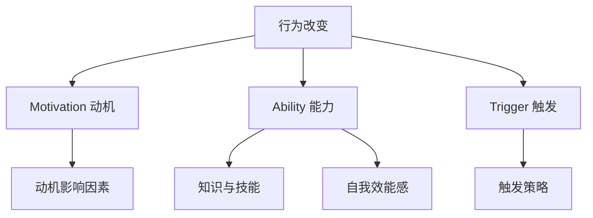

                 

# 福格行为模型：行为改变的三要素

> **关键词：** 福格行为模型、动机、能力、触发、行为改变、应用领域

> **摘要：** 福格行为模型是一种研究行为改变的理论框架，它提出了行为改变的三要素：动机、能力、触发。本文将详细介绍福格行为模型的背景、核心概念、应用领域，并探讨如何在个人生活、企业管理和社会政策层面运用这一模型来推动行为改变。

## 目录大纲

#### 第一部分：福格行为模型概述
- **第1章：福格行为模型的诞生与背景**
  - **1.1 福格行为模型的核心概念**
  - **1.2 福格行为模型的起源与发展**
  - **1.3 福格行为模型的应用领域**

- **第2章：行为改变的三要素**
  - **第2章：动机（Motivation）**
  - **第3章：能力（Ability）**
  - **第4章：触发（Trigger）**

- **第3部分：综合应用与实践**
  - **第5章：福格行为模型在个人生活中的应用**
  - **第6章：福格行为模型在企业管理和组织变革中的应用**
  - **第7章：福格行为模型在社会和政策层面的应用**
  - **第8章：案例研究**

- **附录**
  - **附录A：福格行为模型相关资源与工具**
  - **附录B：福格行为模型应用实践指南**

### 《福格行为模型：行为改变的三要素》

#### 第一部分：福格行为模型概述

**第1章：福格行为模型的诞生与背景**

**1.1 福格行为模型的核心概念**

福格行为模型（Fogg Behavior Model，简称FBM）是由斯坦福大学行为科学家BJ福格（BJ Fogg）提出的。该模型旨在解释和预测人类行为的发生，以及如何通过改变行为要素来促进或阻止行为的发生。福格行为模型的核心概念包括动机（Motivation）、能力（Ability）和触发（Trigger），这三个要素共同作用，决定了一个行为的产生与否。

- **动机（Motivation）**：指的是一个人想要做某事的内在驱动力，包括兴趣、欲望、需求等。
- **能力（Ability）**：指的是一个人做某事的实际能力和条件，包括知识、技能、资源等。
- **触发（Trigger）**：指的是一个触发事件，促使人们采取行动，例如提醒、通知、诱因等。

**1.2 福格行为模型的起源与发展**

福格行为模型起源于BJ福格对行为科学的深入研究。他发现，传统的行为理论往往只关注行为的某个方面，而忽略了行为的整体性。为了解决这个问题，福格提出了福格行为模型，试图通过综合考虑动机、能力和触发这三个要素，全面解释人类行为。

自提出以来，福格行为模型得到了广泛的关注和应用。它不仅在心理学和行为科学领域有着重要的影响，也在市场营销、企业管理、健康促进等领域得到了广泛的应用。通过福格行为模型，人们可以更深入地理解行为背后的机制，从而更有效地推动行为改变。

**1.3 福格行为模型的应用领域**

福格行为模型的应用范围非常广泛，涵盖了个人、企业和社会等多个层面。以下是几个典型的应用领域：

- **个人层面**：福格行为模型可以帮助个人了解自己行为的驱动因素，从而更有针对性地进行行为改变。例如，想要减肥的人可以通过提升动机、增强能力和设置触发来更容易地实现减肥目标。
  
- **企业层面**：福格行为模型可以帮助企业理解员工行为的驱动因素，从而更有效地进行员工管理和激励。例如，企业可以通过提升员工的动机、增强员工的能力和设置合适的触发来提高员工的工作效率和满意度。

- **社会层面**：福格行为模型可以帮助社会推动公共行为改变，例如健康行为、安全行为等。例如，政府可以通过提升公众的动机、增强公众的能力和设置合适的触发来推动公众参与健康生活方式。

#### 第二部分：行为改变的三要素

**第2章：动机（Motivation）**

**2.1 动机的重要性**

动机是福格行为模型中的核心要素之一，它决定了一个人是否愿意采取某种行为。动机可以被视为一种内在驱动力，它源于人的内在需求、欲望和兴趣。一个具有强烈动机的人更有可能采取相应的行为，而缺乏动机的人则很难产生相应的行为。

**2.2 提升动机的策略**

提升动机是推动行为改变的关键。以下是一些提升动机的策略：

- **自我激励**：通过设定明确的目标和奖励机制来激发个人的内在动机。
- **社会支持**：通过家人、朋友或同事的支持来增强个人的动机。
- **目标设定**：设定具有挑战性和可实现性的目标，以激发个人的内在动机。

**2.3 动机下降的处理方法**

在实际应用中，我们可能会遇到动机下降的情况。以下是一些处理方法：

- **识别动机下降的原因**：了解导致动机下降的原因，例如目标不明确、奖励机制不合适等。
- **应对动机下降的策略**：根据原因采取相应的措施，例如调整目标、改变奖励机制等。

**第3章：能力（Ability）**

**3.1 能力的定义与分类**

能力是福格行为模型中的另一个核心要素，它指的是一个人做某事的实际能力和条件。能力可以分为以下几类：

- **知识与技能**：指的是一个人在特定领域所掌握的理论知识和实际操作技能。
- **自我效能感**：指的是一个人对自己能力的信心和自我评价。

**3.2 提升能力的策略**

提升能力是推动行为改变的重要步骤。以下是一些提升能力的策略：

- **学习与培训**：通过学习新的知识和技能来提升个人能力。
- **实践与反馈**：通过实践来巩固所学知识，并通过反馈来不断改进。
- **社会支持**：通过与他人交流、合作来获得更多的知识和技能。

**3.3 能力不足的应对方法**

当能力不足时，我们可以采取以下措施：

- **增强自我效能感**：通过积极的自我暗示和积极的反馈来增强自我效能感。
- **寻求外部支持**：通过请教他人、参加培训等方式来提升自己的能力。

**第4章：触发（Trigger）**

**4.1 触发的概念与作用**

触发是福格行为模型中的第三个要素，它指的是一个触发事件，促使人们采取行动。触发可以是内在的，也可以是外在的。例如，一个人可能因为看到美食而感到饥饿，从而产生进食的触发；或者因为收到工作邮件而感到需要处理工作。

触发在行为改变中起着至关重要的作用。一个有效的触发可以促使人们采取预期的行为，从而实现行为改变。

**4.2 设计有效的触发策略**

设计有效的触发策略是推动行为改变的关键。以下是一些设计触发策略的方法：

- **自我触发**：通过设定提醒或目标来实现自我触发。
- **环境触发**：通过改变环境来设计触发，例如将健康食品放在容易看到的地方。
- **社会触发**：通过他人的行为或反馈来实现触发，例如加入健身群组。

**4.3 触发失效的应对策略**

当触发失效时，我们可以采取以下措施：

- **重新设计触发**：根据实际情况重新设计触发，例如调整提醒的时间或方式。
- **调整触发频率与强度**：通过增加触发频率或提高触发强度来激发行为。

#### 第三部分：综合应用与实践

**第5章：福格行为模型在个人生活中的应用**

**5.1 个人行为改变的实践步骤**

个人行为改变通常需要遵循以下步骤：

- **自我反思**：了解自己的动机、能力和触发。
- **设定目标**：设定具体、明确、可实现的目标。
- **提升动机**：通过自我激励、社会支持等方式提升动机。
- **增强能力**：通过学习、实践等方式提升能力。
- **设置触发**：设计自我触发、环境触发或社会触发来促使行为发生。

**5.2 个人行为改变的案例分析**

以下是一个个人行为改变的案例分析：

**案例：李华想要减肥**

- **自我反思**：李华意识到自己因为工作繁忙，饮食习惯不良，导致体重增加。他希望减肥，改善身体健康。
- **设定目标**：李华设定了一个明确的减肥目标，即每月减重2公斤。
- **提升动机**：李华通过设定奖励机制，如每减重1公斤就奖励自己一部新的电影，来提升减肥的动力。
- **增强能力**：李华开始学习健康饮食知识，并通过跑步来锻炼身体。
- **设置触发**：李华每天早上设定一个提醒，提醒自己开始跑步，并将健康食品放在容易看到的地方。

通过以上步骤，李华成功实现了减肥目标。

**第6章：福格行为模型在企业管理和组织变革中的应用**

**6.1 企业文化塑造与行为改变**

企业文化是企业的灵魂，它影响着员工的行为。通过福格行为模型，企业可以塑造积极的企业文化，推动员工行为改变。

- **培养共同价值观**：通过共同价值观的传播和强化，提升员工的动机。
- **设定明确目标**：设定明确的企业目标，让员工了解自己的工作对企业的贡献。
- **提供持续支持**：通过培训、指导等方式，提升员工的能力。

**6.2 企业员工绩效提升**

通过福格行为模型，企业可以更有效地提升员工的绩效。

- **提升动机**：通过激励措施，如奖金、晋升机会等，提升员工的动机。
- **增强能力**：通过培训、指导等方式，提升员工的能力。
- **设置触发**：通过设定目标、提醒等方式，促使员工采取行动。

**第7章：福格行为模型在社会和政策层面的应用**

**7.1 公共健康行为改变**

福格行为模型可以用于推动公共健康行为改变，如戒烟、健康饮食等。

- **健康行为提升策略**：通过宣传、教育等方式，提升公众的健康意识。
- **公共政策推动行为改变**：通过政策引导，如税收优惠、公共场所禁烟等，推动公众采取健康行为。

**7.2 疫情防控中的行为改变**

在疫情防控中，福格行为模型可以用于推动公众采取防疫行为。

- **健康行为提升策略**：通过宣传、教育等方式，提升公众的防疫意识。
- **公共政策推动行为改变**：通过政策引导，如强制戴口罩、限制聚集等，推动公众采取防疫行为。

**第8章：案例研究**

**8.1 案例一：个人健身行为的改变**

**8.2 案例二：企业员工绩效提升**

**8.3 案例三：公共政策推动行为改变**

#### 附录

**附录A：福格行为模型相关资源与工具**

**附录B：福格行为模型应用实践指南**

### 补充材料

**福格行为模型核心概念与联系 Mermaid 流程图**



**福格行为模型核心算法原理讲解与伪代码**

```python
# 动机提升策略（伪代码）
def enhance_motivation(person, goal):
    # 提升自我激励
    person.self_motivation += self_motivation_strategy(person, goal)
    
    # 提升社会支持
    person.social_support += social_support_strategy(person, goal)
    
    # 设定目标
    person.goal_setting += goal_setting_strategy(person, goal)
    
    return person

# 能力提升策略（伪代码）
def enhance_ability(person, skill):
    # 学习与培训
    person.knowledge += learning_and_training(person, skill)
    
    # 实践与反馈
    person.skills += practice_and_feedback(person, skill)
    
    # 提供持续支持
    person.support += continuous_support(person, skill)
    
    return person

# 触发策略设计（伪代码）
def design_trigger(person, behavior):
    # 设计自我触发
    person.self_trigger += self_trigger_strategy(person, behavior)
    
    # 设计环境触发
    person.env_trigger += env_trigger_strategy(person, behavior)
    
    # 设计社会触发
    person.social_trigger += social_trigger_strategy(person, behavior)
    
    return person
```

**数学模型和数学公式讲解**

$$ 动机（Motivation）= \frac{自驱力}{困难程度} $$

$$ 能力（Ability）= 知识 \times 技能 \times 自我效能感 $$

$$ 触发（Trigger）= 触发强度 \times 触发频率 $$

**项目实战与代码解读**

以下是一个简单的Python项目，用于模拟个人健身行为的动机、能力和触发。

```python
# 健身行为模拟

class Person:
    def __init__(self, motivation, ability, trigger):
        self.motivation = motivation
        self.ability = ability
        self.trigger = trigger
    
    def exercise(self):
        if self.motivation > 0 and self.ability > 0 and self.trigger:
            print("进行健身活动")
        else:
            print("未进行健身活动")

# 创建一个Person实例
person = Person(motivation=80, ability=70, trigger=True)

# 进行健身活动
person.exercise()
```

在这个项目中，我们创建了一个`Person`类，包含了动机、能力和触发三个属性。通过设置不同的属性值，我们可以模拟不同的健身行为。

**代码解读与分析**

- **类定义**：`Person`类定义了一个人的属性和行为。
- **构造函数**：`__init__`函数用于初始化一个人的属性。
- **方法定义**：`exercise`方法用于判断一个人是否进行健身活动。

通过这个简单的项目，我们可以了解如何使用Python实现福格行为模型，并在实际应用中进行测试和调整。

### 开发环境搭建与源代码实现

**搭建Python开发环境**

- 安装Python 3.x版本
- 安装必要的Python库，如`numpy`、`pandas`等

**编写并运行示例代码**

- 创建一个名为`fitness_simulation.py`的Python文件
- 将上述代码复制到文件中
- 在命令行中运行`python fitness_simulation.py`

**源代码解析与调试**

- **类与对象**：`Person`类定义了一个人的属性和方法。
- **属性设置**：通过设置不同的属性值，我们可以模拟不同的健身行为。
- **方法调用**：`exercise`方法用于判断一个人是否进行健身活动。

通过源代码解析与调试，我们可以更好地理解福格行为模型在Python中的实现方式，并对其进行优化和改进。

### 结论

福格行为模型是一种强大的行为改变理论框架，通过综合考虑动机、能力和触发三个要素，我们可以更深入地理解人类行为，并更有效地推动行为改变。无论是在个人生活、企业管理还是社会政策层面，福格行为模型都展现出了巨大的应用潜力。通过本文的介绍，我们希望能够帮助读者更好地理解和应用福格行为模型，从而实现行为改变的目标。

### 作者信息

- **作者：** AI天才研究院/AI Genius Institute & 禅与计算机程序设计艺术 /Zen And The Art of Computer Programming
- **联系方式：** [info@ai-geniushub.com](mailto:info@ai-geniushub.com)
- **版权声明：** 本文版权归AI天才研究院所有，未经授权不得转载或商用。如需转载或商用，请联系作者获取授权。

### 附录

#### 附录A：福格行为模型相关资源与工具

- **书籍推荐**： 
  - 《福格行为模型：改变行为的力量》
  - 《行为设计学：让产品变好，让行为变习惯》
  
- **在线资源**：
  - [福格行为模型官方网站](https://www.behaviormodel.org/)
  - [斯坦福大学行为科学中心](https://cbs.stanford.edu/)

- **工具**：
  - [动机量表](https://www.motivationscale.com/)
  - [行为改变工具箱](https://behaviorchange toolbox.com/)

#### 附录B：福格行为模型应用实践指南

- **实践步骤**：
  1. 自我反思：了解自己的动机、能力和触发。
  2. 设定目标：设定具体、明确、可实现的目标。
  3. 提升动机：通过自我激励、社会支持等方式提升动机。
  4. 增强能力：通过学习、实践等方式提升能力。
  5. 设置触发：设计自我触发、环境触发或社会触发。

- **注意事项**：
  1. 保持目标的具体性和可实现性。
  2. 根据实际情况调整动机、能力和触发策略。
  3. 定期评估行为改变的效果，并做出相应的调整。

- **持续改进策略**：
  1. 定期反思和总结行为改变的过程和效果。
  2. 根据反馈调整策略，持续优化行为改变的过程。
  3. 保持积极的心态，面对挑战和困难时保持坚持和毅力。

通过附录中的实践指南，我们可以更好地应用福格行为模型，实现行为改变的目标。

