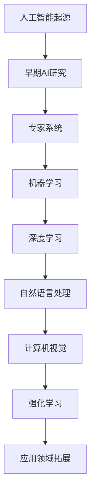
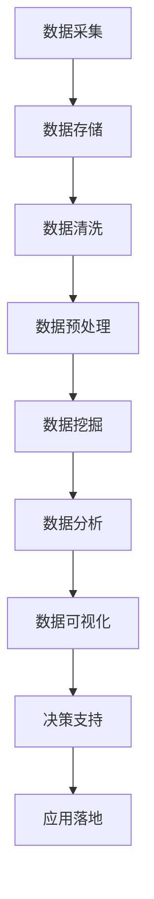
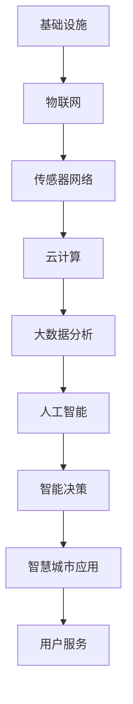

                 

## 《科技与社会：人类计算的双重影响》

> **关键词**：科技发展、人类计算、社会影响、计算伦理、未来展望

> **摘要**：本文旨在探讨科技与社会之间的互动关系，尤其是人类计算技术对社会产生的双重影响。文章首先介绍了科技的定义与演变、社会的定义与结构，以及科技对社会的影响；然后深入分析了人类计算的基本概念及其工具与媒介；接着详细讨论了计算在提升社会生产力、教育、医疗、文化娱乐等领域的积极应用；随后揭示了计算带来的隐私安全、就业和生态环境等方面的负面影响；最后探讨了计算伦理与社会责任，以及计算技术与社会治理的未来发展趋势。本文希望通过逻辑清晰的分析，引发读者对科技与社会关系的深入思考。

### 《科技与社会：人类计算的双重影响》目录大纲

**第一部分：引言**

- **第1章：科技与社会互动概述**
  - **1.1 科技的定义与演变**
  - **1.2 社会的定义与结构**
  - **1.3 科技对社会的影响：历史与现状**

- **第2章：人类计算的基本概念**
  - **2.1 人类计算的起源与发展**
  - **2.2 人类计算的工具与媒介**
  - **2.3 人类计算的特征与挑战**

**第二部分：计算对社会的积极影响**

- **第3章：计算在提升社会生产力方面的应用**
  - **3.1 计算与经济发展**
  - **3.2 计算在农业生产中的应用**
  - **3.3 计算对服务业的变革**

- **第4章：计算在教育、医疗等公共服务领域的应用**
  - **4.1 计算在教育资源的分配与普及**
  - **4.2 计算在医疗健康服务中的应用**
  
- **第5章：计算在文化、艺术与娱乐领域的应用**
  - **5.1 计算对文化传承与创新的影响**
  - **5.2 计算对娱乐产业的变革**

**第三部分：计算对社会的负面影响**

- **第6章：计算带来的隐私与安全挑战**
  - **6.1 隐私泄露与数据安全**
  - **6.2 网络安全与信息安全**

- **第7章：计算对就业与职业发展的影响**
  - **7.1 人工智能与自动化对就业市场的影响**
  - **7.2 计算技术对社会分层的影响**

- **第8章：计算对环境与生态的影响**
  - **8.1 计算资源消耗与环境保护**
  - **8.2 计算对生态系统的影响**

**第四部分：计算与社会的未来发展**

- **第9章：计算伦理与社会责任**
  - **9.1 计算伦理的基本原则**
  - **9.2 社会责任与可持续发展**

- **第10章：计算技术与社会治理**
  - **10.1 智慧城市与智能社会治理**
  - **10.2 社会创新与计算技术**

**附录**

- **附录A：参考文献**
  - **A.1 学术论文**
  - **A.2 报告与白皮书**
  - **A.3 经典书籍与文献**

- **附录B：计算技术相关的 Mermaid 流程图**
  - **B.1 人工智能技术发展流程**
  - **B.2 大数据应用流程**
  - **B.3 智慧城市技术架构**

### 第一部分：引言

#### 第1章：科技与社会互动概述

**1.1 科技的定义与演变**

科技，即科学技术，是指应用科学知识和方法，通过实验和研究来创造新的物质、能量、信息和过程。科技的演变是一个长期的历史过程，从古代的发明创造，到近代的工业革命，再到现代的信息技术革命，科技的发展不断推动着社会的进步。

- **古代**：人类最早的科技发明，如工具、火的使用，极大地提高了生产力水平，促进了社会的形成与发展。
- **近代**：18世纪的工业革命，以蒸汽机和机械制造为核心，推动了工业化的进程，大幅度提升了生产效率，改变了人类的生活方式。
- **现代**：20世纪中叶，以计算机和互联网为代表的信息技术革命，使得信息传播速度大大提高，人类社会进入了信息化时代。

**1.2 社会的定义与结构**

社会是由一群具有共同利益、文化、价值观和规则的人组成的共同体。社会结构包括家庭、政府、经济组织、教育机构、文化团体等，这些结构相互作用，共同维持着社会的正常运转。

- **家庭**：是社会的基本单位，承担着抚养、教育、照顾等职能。
- **政府**：是社会的管理机构，负责制定法律、维护秩序、提供公共服务等。
- **经济组织**：是社会生产力的主要体现，通过生产、分配、交换和消费等过程，实现资源的合理配置。
- **教育机构**：是培养人才、传承文化、推动社会进步的重要场所。
- **文化团体**：是社会精神文化生活的载体，反映社会的价值观念和审美追求。

**1.3 科技对社会的影响：历史与现状**

科技的发展对社会的影响是深远而广泛的，它不仅改变了人类的生活方式，也对社会的经济、政治、文化等各个方面产生了重要影响。

- **经济方面**：科技推动了生产力的提升，促进了经济的发展。例如，计算机和互联网技术使得商业活动更加高效，电子商务的兴起改变了传统的商业模式。
- **政治方面**：科技为政府提供了更好的治理工具，如电子政务、在线投票等，提高了政府的透明度和效率。同时，科技的发展也带来了一定的政治风险，如网络攻击、信息泄露等。
- **文化方面**：科技改变了文化的传播方式，如电影、音乐、文学等领域的数字化，使得文化产品的传播速度和范围大大提高。同时，虚拟现实、增强现实等新技术也为文化的创新提供了新的可能性。
- **社会结构方面**：科技的发展带来了社会的变革，如城市化、人口老龄化等。同时，科技也带来了一定的社会不平等，如数字鸿沟问题。

综上所述，科技与社会之间的互动是一个复杂而动态的过程，科技的发展不仅带来了积极的影响，也带来了一定的挑战。在接下来的章节中，我们将深入探讨人类计算技术对社会产生的双重影响，以期更好地理解和应对这些挑战。

#### 第2章：人类计算的基本概念

**2.1 人类计算的起源与发展**

人类计算的历史可以追溯到古代，当时人类使用简单的计算工具，如算筹和算盘，来进行数学运算。随着历史的发展，计算工具不断进步，从机械计算机到电子计算机，再到现代的超级计算机，人类计算技术经历了显著的演变。

- **古代**：古代人类使用简单的计算工具，如算筹和算盘，来进行基本的数学运算。这些工具的发明和使用，极大地提高了人类计算的能力。
- **19世纪**：机械计算机开始出现，如巴贝奇的分析机，虽然未能实现，但为后来的计算机发展奠定了基础。
- **20世纪**：电子计算机的出现，如ENIAC和EDVAC，标志着人类计算技术的重大突破。计算机的运算速度和存储能力迅速提升，使得复杂的计算任务得以高效完成。
- **现代**：随着计算机硬件和软件技术的不断发展，计算机的应用范围不断扩大，从科学研究到商业应用，再到日常生活，计算机已经成为现代社会不可或缺的一部分。

**2.2 人类计算的工具与媒介**

人类计算的工具和媒介是计算技术的重要组成部分，它们决定了计算的速度、精度和灵活性。从古代的计算工具，如算筹和算盘，到现代的计算机和互联网，计算工具和媒介的发展推动了人类计算技术的进步。

- **计算工具**：古代的计算工具包括算筹、算盘等，这些工具使用机械原理来进行计算，虽然精度有限，但为人类计算提供了基本手段。现代的计算工具主要是电子计算机，如个人计算机、服务器、超级计算机等，它们利用电子技术进行高速运算，极大地提高了计算能力。
- **计算媒介**：计算媒介是指用于存储、传输和处理数据的技术和设备。从古代的羊皮纸、竹简，到现代的磁盘、光盘、互联网，计算媒介的发展推动了信息传播和数据处理方式的变革。互联网的出现，使得全球范围内的信息共享和交流变得更加便捷，为人类计算提供了新的可能性。

**2.3 人类计算的特征与挑战**

人类计算技术具有高速、大容量、自动化等特征，同时也面临一系列挑战。

- **高速**：计算机具有极高的运算速度，可以快速处理大量数据，这是传统计算工具无法比拟的。例如，现代超级计算机的运算速度已经达到每秒数百万亿次，可以用于复杂科学计算和天气预报等领域。
- **大容量**：计算机具有巨大的存储容量，可以存储大量的数据和程序。这为科学研究、商业应用和日常生活的数据处理提供了基础。
- **自动化**：计算机可以自动执行复杂的任务，减少了人力干预的需求。例如，自动化生产线、智能监控系统等，都是计算机自动化的应用实例。
- **挑战**：尽管计算机技术发展迅速，但同时也面临一系列挑战。例如，计算资源的消耗、网络安全问题、隐私保护问题等。这些挑战需要通过技术创新和政策法规来应对。

综上所述，人类计算技术的发展对人类社会产生了深远的影响，它不仅改变了我们的生活方式，也带来了新的挑战。在接下来的章节中，我们将进一步探讨计算技术在不同领域中的应用，以及它对社会的积极和负面影响。

#### 第3章：计算在提升社会生产力方面的应用

**3.1 计算与经济发展**

计算技术在提升社会生产力方面发挥了重要作用，特别是在经济发展领域。计算机和互联网的普及使得商业活动更加高效和便捷，推动了全球经济的快速发展。

- **电子商务**：电子商务的兴起改变了传统的商业模式，使得企业可以不受地理限制，通过互联网进行商品交易和市场营销。例如，亚马逊、阿里巴巴等大型电商平台，通过计算机技术实现全球贸易，极大地提高了交易效率和市场覆盖率。
- **大数据分析**：大数据技术的应用使得企业能够从海量数据中提取有价值的信息，用于市场分析、消费者行为预测和决策制定。例如，金融行业通过大数据分析，可以更准确地评估风险和预测市场走势，从而制定更科学的投资策略。
- **自动化生产**：计算机技术在制造业中的应用，如自动化生产线和智能制造系统，极大地提高了生产效率和质量。例如，汽车制造业通过计算机辅助设计（CAD）和计算机辅助制造（CAM）技术，实现了高效、精确的生产流程。

**3.2 计算在农业生产中的应用**

计算技术在农业生产中也发挥了重要作用，通过自动化、精准化和智能化手段，提高了农业生产效率和农产品质量。

- **精准农业**：精准农业利用计算机技术，通过对土壤、气候、作物生长状况等数据的实时监测和分析，实现精准施肥、灌溉和病虫害防治。例如，利用无人机和传感器技术，可以实时获取农田的作物长势数据，根据数据调整农业管理措施，提高产量和质量。
- **智能农机**：智能农机装备计算机控制系统，可以实现自动导航、自动耕作、自动收割等功能，提高农业生产效率。例如，智能拖拉机可以通过GPS导航，实现自动行驶和精确作业，减少人力成本和作业误差。
- **农业大数据**：农业大数据技术的应用，使得农业生产更加科学和智能化。通过收集和分析农业生产过程中的各种数据，如气象数据、土壤数据、作物生长数据等，可以为农业管理提供决策支持，优化农业资源配置。

**3.3 计算对服务业的变革**

计算技术在服务业中的应用，推动了服务业的智能化、高效化和个性化发展。

- **金融服务业**：金融服务业利用计算机技术，实现了在线支付、电子银行、证券交易等业务的快速发展。例如，移动支付技术使得用户可以随时随地通过手机进行支付，极大地提高了支付便利性。
- **医疗服务业**：医疗服务业通过计算机技术的应用，实现了电子病历、远程医疗、智能诊断等新业务模式。例如，电子病历系统可以帮助医疗机构更好地管理患者信息，提高医疗服务的效率和质量；远程医疗技术使得偏远地区的患者可以享受到优质医疗资源，降低医疗成本。
- **教育服务业**：教育服务业通过计算机技术的应用，实现了在线教育、教育游戏、个性化学习等新教学模式。例如，在线教育平台如Coursera、edX等，提供了丰富的在线课程资源，使得学习者可以随时随地学习；教育游戏通过互动性和趣味性，提高了学生的学习兴趣和学习效果。

综上所述，计算技术在提升社会生产力方面具有广泛的应用，通过电子商务、大数据分析、精准农业、自动化生产等手段，推动了经济的快速发展；通过智能农机、农业大数据等应用，提高了农业生产效率和农产品质量；通过金融、医疗、教育等服务业的变革，提高了服务业的智能化和个性化水平。在未来的发展中，计算技术将继续发挥重要作用，推动社会生产力的进一步提升。

#### 第4章：计算在教育、医疗等公共服务领域的应用

**4.1 计算在教育资源的分配与普及**

计算技术在教育领域的应用，极大地改善了教育资源的分配与普及，使得优质教育资源能够惠及更多地区和群体。

- **在线教育**：在线教育平台的兴起，打破了地域和时间的限制，使得学习者可以随时随地获取教育内容。例如，Coursera、edX等在线教育平台，提供了丰富的课程资源，覆盖了从学术课程到职业培训等多个领域。在线教育不仅提高了教育的可及性，还降低了学习成本，使得更多人有机会接受高质量的教育。
- **数字化教材**：数字化教材通过计算机技术，将传统的纸质教材转化为电子版，使得教材的存储、传输和展示更加便捷。例如，电子书、电子期刊等数字化教材，不仅便于携带和查阅，还具备互动性和多媒体功能，提高了学生的学习兴趣和效果。
- **教育大数据**：教育大数据技术的应用，使得教育机构能够更好地了解学生的学习状况和需求，从而提供个性化的教育服务。例如，通过分析学生的学习数据，可以识别学生的学习短板，为教师提供教学改进建议；同时，还可以预测学生的学习趋势，为教育管理部门提供决策支持。

**4.2 计算在医疗健康服务中的应用**

计算技术在医疗健康领域的应用，为医疗服务提供了新的手段和模式，极大地提高了医疗服务的效率和质量。

- **电子病历**：电子病历（Electronic Health Records, EHR）系统通过计算机技术，实现了患者病历的数字化管理，使得医疗机构能够更好地掌握患者的健康状况和治疗历史。例如，通过电子病历系统，医生可以快速查阅患者的病历记录，制定个性化的治疗方案；同时，电子病历还可以提高医疗信息的共享和传输效率，减少医疗失误。
- **医疗大数据**：医疗大数据技术的应用，使得医疗机构能够从海量医疗数据中提取有价值的信息，用于疾病预测、诊断和治疗方案制定。例如，通过分析海量的病例数据，可以识别疾病的流行趋势和潜在风险因素，为公共卫生决策提供支持；同时，医疗大数据还可以用于个性化医疗，根据患者的具体病情和基因信息，制定个性化的治疗方案。
- **远程医疗**：远程医疗技术通过计算机通信技术，使得医生和患者之间可以实现远程诊疗和咨询。例如，通过视频通话、在线问诊等方式，偏远地区的患者可以享受到城市医院专家的医疗服务，减少医疗成本和交通负担。远程医疗不仅提高了医疗服务的可及性，还为医疗资源的合理分配提供了新的途径。

**4.3 计算在公共服务领域的其他应用**

计算技术在公共服务领域的应用，还涉及社会保障、城市管理、环境保护等多个方面，为社会治理提供了新的手段和工具。

- **社会保障**：计算技术在社会保障领域的应用，实现了社会保障信息的数字化管理，提高了社会保障的覆盖率和准确性。例如，通过社会保障卡和信息系统，可以实现社保费用的缴纳、报销、查询等操作，方便了参保人员的使用。
- **城市管理**：计算技术在城市管理中的应用，实现了城市管理的智能化和精细化。例如，智慧城市建设通过计算机技术和物联网技术，实现了城市交通、环境、能源等多个领域的实时监测和管理，提高了城市管理的效率和质量。
- **环境保护**：计算技术在环境保护领域的应用，实现了环境监测和污染控制的智能化。例如，通过传感器网络和数据分析技术，可以实时监测空气质量、水质等环境指标，及时发现污染问题并采取相应的治理措施。

综上所述，计算技术在教育、医疗等公共服务领域的应用，极大地提高了教育资源的分配与普及、医疗服务的效率和质量，以及公共服务的智能化和精细化水平。在未来的发展中，计算技术将继续发挥重要作用，为社会的发展和人民的福祉作出更大的贡献。

#### 第5章：计算在文化、艺术与娱乐领域的应用

**5.1 计算对文化传承与创新的影响**

计算技术不仅改变了人类的生活方式，也对文化传承与创新产生了深远影响。

- **数字化文化遗产保护**：计算技术使得文化遗产的数字化成为可能，通过高分辨率扫描和3D建模等技术，可以将文化遗产以数字形式保存和传播。例如，世界文化遗产的数字化项目，使得世界各地的人们可以通过互联网访问这些珍贵的文化遗产，促进文化的传承与共享。
- **虚拟现实与增强现实技术**：虚拟现实（VR）和增强现实（AR）技术为文化创新提供了新的平台。通过VR和AR技术，观众可以沉浸式体验历史事件、文物展览等，增强了文化的互动性和参与感。例如，一些博物馆和文化遗产地利用VR技术，打造了虚拟参观体验，使得观众可以在家中就能感受到历史的氛围。
- **多媒体艺术创作**：计算技术为艺术家提供了丰富的创作工具和平台，如数字绘画、音乐合成、视频编辑等。这些工具不仅提高了创作的效率，还拓展了艺术的边界。例如，数字艺术作品通过计算机算法生成，呈现出独特的视觉和听觉效果，为观众带来了全新的艺术体验。

**5.2 计算对娱乐产业的变革**

计算技术在娱乐产业中的应用，推动了娱乐方式的多样化和个性化发展。

- **网络游戏与电子竞技**：网络游戏的兴起，改变了传统的娱乐方式，使得玩家可以在线上与其他玩家互动，体验丰富的游戏世界。同时，电子竞技（eSports）作为一种新兴的竞技运动形式，吸引了大量观众和赞助商，成为娱乐产业的重要组成部分。
- **数字音乐与视频**：数字技术的发展，使得音乐和视频的传播变得更加便捷。通过在线音乐平台和视频网站，用户可以随时随地享受音乐和视频内容，无需购买实体光盘。数字音乐和视频的普及，不仅降低了用户的娱乐成本，还促进了音乐和视频产业的快速发展。
- **虚拟现实娱乐**：虚拟现实技术为娱乐产业带来了新的机遇。通过VR设备，用户可以沉浸在虚拟世界中，体验各种游戏、电影和旅游项目。虚拟现实娱乐不仅提供了全新的娱乐体验，还带动了相关硬件设备和内容制作产业的发展。

**5.3 计算技术在艺术创作中的应用**

计算技术不仅改变了娱乐产业的格局，也为艺术创作提供了新的手段和灵感。

- **数字绘画与设计**：计算机软件如Photoshop、Illustrator等，为艺术家提供了丰富的绘画和设计工具，使得创作过程更加便捷和高效。数字绘画和设计技术，不仅提高了艺术创作的效率，还拓展了艺术的表达形式。
- **音乐合成与制作**：计算机软件如Logic Pro、Ableton Live等，为音乐家提供了强大的音乐合成和制作工具。通过这些工具，音乐家可以轻松地创作和编辑音乐，实现复杂的音乐效果和创意。
- **虚拟舞台表演**：计算技术为舞台表演带来了新的可能性。通过虚拟现实技术和实时渲染技术，舞台表演可以融入更多的视觉和听觉效果，创造出沉浸式的表演体验。例如，虚拟现实舞台表演利用VR设备，使观众可以沉浸式体验表演，增强了观赏的互动性和参与感。

综上所述，计算技术在文化、艺术与娱乐领域的应用，不仅改变了传统文化和娱乐方式，也为文化传承与创新、娱乐产业的变革提供了新的机遇和手段。在未来的发展中，计算技术将继续推动文化、艺术与娱乐领域的创新，为人们带来更多丰富的体验。

#### 第6章：计算带来的隐私与安全挑战

**6.1 隐私泄露与数据安全**

随着计算技术的快速发展，个人隐私和数据安全问题日益突出。在数字化时代，个人数据被广泛收集、存储和共享，但这也带来了隐私泄露和数据安全的挑战。

- **隐私泄露问题**：个人隐私泄露事件频发，如个人信息被黑客窃取、社交媒体账户被非法访问等。这些问题不仅侵犯了个人隐私，还可能导致身份盗用、财产损失等严重后果。例如，2018年Facebook数据泄露事件，暴露了8700万用户的个人信息，引发了广泛的隐私安全担忧。
- **数据安全挑战**：数据安全面临各种威胁，如网络攻击、数据泄露、数据篡改等。这些威胁可能导致数据丢失、系统崩溃、经济损失等严重后果。例如，2017年WannaCry勒索病毒攻击，导致全球多个机构和企业的计算机系统瘫痪，造成了巨大的经济损失。

**6.2 用户隐私保护的法律与规范**

为了应对隐私泄露和数据安全挑战，各国政府和国际组织制定了相应的法律和规范，以保护用户隐私和加强数据安全。

- **国际法律规范**：欧盟《通用数据保护条例》（GDPR）是国际上最具影响力的隐私保护法律之一。该条例规定了数据处理的合法性原则、用户隐私权的保护措施、数据泄露通知等要求，对企业的数据处理行为进行了严格监管。
- **国内法律规范**：中国《网络安全法》和《个人信息保护法》等法律，对个人信息保护提出了明确要求，包括个人信息的收集、使用、存储和传输等各个环节。这些法律规范旨在加强对个人隐私和数据安全的保护，促进数字经济的发展。

**6.3 数据加密与访问控制**

为了保护用户隐私和数据安全，数据加密和访问控制是关键技术手段。

- **数据加密**：数据加密通过将明文数据转换为密文，防止未经授权的访问和窃取。常见的加密技术包括对称加密和非对称加密。对称加密使用相同的密钥进行加密和解密，如AES算法；非对称加密使用公钥和私钥进行加密和解密，如RSA算法。
- **访问控制**：访问控制通过控制对数据的访问权限，确保只有授权用户可以访问和操作数据。常见的访问控制机制包括身份认证、授权和审计。身份认证用于验证用户的身份，如用户名和密码、生物识别技术；授权用于确定用户对数据的操作权限，如角色权限、访问控制列表；审计用于记录用户对数据的访问和操作记录，以便进行追踪和监控。

**6.4 网络安全与信息安全**

网络安全和信息安全的保障是保护用户隐私和数据安全的重要方面。

- **网络安全**：网络安全旨在保护网络系统不受恶意攻击、入侵和破坏。常见的网络安全措施包括防火墙、入侵检测系统（IDS）、入侵防御系统（IPS）等。防火墙用于阻止未经授权的访问，入侵检测系统用于监测和检测网络攻击行为，入侵防御系统用于主动防御和阻止网络攻击。
- **信息安全**：信息安全旨在保护信息系统中的数据、应用程序和网络不受未经授权的访问、篡改和破坏。常见的信息安全措施包括数据备份、数据完整性验证、安全审计等。数据备份用于确保数据的恢复能力，数据完整性验证用于检测和纠正数据错误，安全审计用于评估和监控信息系统的安全状况。

综上所述，计算技术带来的隐私与安全挑战是一个复杂而严峻的问题，需要从法律规范、技术手段、安全管理等多方面进行综合应对。通过加强隐私保护、数据加密、访问控制和网络安全等措施，可以有效地保护用户隐私和数据安全，促进数字经济的健康发展。

#### 第7章：计算对就业与职业发展的影响

**7.1 人工智能与自动化对就业市场的影响**

人工智能（AI）和自动化技术的迅速发展，对就业市场产生了深远的影响，这种影响体现在就业机会的创造与破坏、职业角色的转变以及劳动力市场的重构等方面。

- **就业机会的创造与破坏**：AI和自动化在创造新就业机会的同时，也导致了部分传统岗位的消失。例如，自动驾驶技术的兴起，虽然减少了司机的工作需求，但同时也创造了新的工作岗位，如AI算法工程师和自动驾驶测试员。这种创造与破坏的动态过程，要求劳动力市场具备快速适应的能力。
- **职业角色的转变**：AI和自动化技术的应用，使得某些职业角色的任务和技能要求发生了变化。例如，数据分析师需要掌握更多的AI技术和工具，以处理和分析大量数据；而销售和服务人员则需要更灵活的沟通和人际交往能力，以应对客户需求的个性化。这种职业角色的转变，要求劳动者不断提升自身的技能和知识。
- **劳动力市场重构**：AI和自动化技术的普及，促使劳动力市场发生结构性变化。一方面，技术密集型行业如高科技、金融和医疗等领域的就业机会增加；另一方面，传统制造业和零售业等领域的就业机会减少。这种重构过程，要求政府、企业和个人共同努力，以应对就业市场的变化，确保劳动力的有效利用。

**7.2 自动化对劳动市场的冲击**

自动化技术的广泛应用，对劳动市场带来了显著的冲击，这种冲击体现在就业机会的减少、工作内容的改变以及劳动力技能需求的变化等方面。

- **就业机会的减少**：自动化技术的应用，尤其是在制造业和服务业，导致了许多传统工作岗位的消失。例如，自动化生产线和智能客服系统等，使得许多重复性、低技能的工作被机器取代。这种就业机会的减少，对劳动力市场产生了巨大的冲击。
- **工作内容的改变**：自动化技术的应用，使得许多工作内容发生了变化。例如，一些工作从传统的手工操作转变为对自动化设备的监控和维护，这要求劳动者具备新的技能和知识。这种工作内容的改变，对劳动力的技能培训和能力提升提出了更高的要求。
- **劳动力技能需求的变化**：自动化技术的普及，改变了劳动力市场的技能需求结构。传统的技能，如机械操作、数据处理等，逐渐被新兴的技能，如编程、数据分析、自动化设备维护等所取代。这种技能需求的变化，要求劳动者不断提升自身的技能和知识，以适应不断变化的劳动力市场需求。

**7.3 技能更新的需求与对策**

为了应对自动化和AI技术对劳动市场带来的冲击，技能更新成为劳动者和企业共同面临的重要任务。

- **劳动者层面**：劳动者需要主动适应技术变革，通过终身学习和职业培训，不断提升自身的技能和知识。例如，参加在线课程、职业技能培训等，以掌握新的技术和工具，适应新的职业角色。
- **企业层面**：企业需要制定有效的技能更新策略，为员工提供职业培训和晋升机会。例如，建立内部培训体系，为员工提供技能提升和职业发展路径；引入外部专业培训机构，为企业提供定制化的培训服务。
- **政府层面**：政府需要制定相关政策，支持劳动力的技能更新。例如，提供财政补贴、税收优惠等政策，鼓励企业和劳动者参与技能培训；建立公共职业培训体系，为失业和转业的劳动者提供免费或低成本的培训服务。

综上所述，AI和自动化技术对就业市场和劳动市场产生了深远的影响，既创造了新的就业机会，也带来了就业机会的减少和职业角色的转变。为了应对这些挑战，劳动者、企业和政府需要共同努力，通过技能更新和适应策略，确保劳动力的有效利用和社会经济的可持续发展。

#### 第8章：计算对环境与生态的影响

**8.1 计算资源消耗与环境保护**

计算技术的发展对环境产生了显著的影响，特别是计算资源的消耗和由此带来的环境保护问题。

- **计算资源消耗**：计算资源的消耗主要包括电能、硬件设备和冷却系统的能源消耗。随着云计算、大数据和人工智能等技术的发展，对计算资源的需求不断增加，导致计算资源的消耗日益加剧。例如，全球数据中心每年的能源消耗已经占到全球总能耗的相当比例，这给能源供应和环境带来了巨大的压力。
- **碳排放问题**：计算资源的消耗主要依赖于化石燃料的能源供应，导致大量的碳排放。根据相关研究，全球数据中心的碳排放量已经超过了部分国家的碳排放总量，这加剧了全球气候变化和环境恶化的问题。

**8.2 数据中心能耗管理**

数据中心作为计算资源的主要载体，其能耗管理成为环境保护的重要方面。

- **节能技术**：数据中心采用多种节能技术，如虚拟化技术、节能服务器、高效制冷系统等，以降低能耗。虚拟化技术通过共享计算资源，减少了服务器的使用数量；节能服务器采用低功耗处理器和高效电源管理系统；高效制冷系统通过优化冷却方案，降低了能源消耗。
- **能源供应多样化**：数据中心探索使用可再生能源，如风能、太阳能等，以减少对化石燃料的依赖。例如，一些大型数据中心已经实现了一部分能源的自给自足，通过太阳能板和风能设施提供能源。
- **绿色数据中心**：绿色数据中心旨在实现数据中心的可持续发展，通过优化设计、能耗管理和环保材料等手段，降低对环境的影响。例如，绿色数据中心采用模块化设计，减少了建筑材料和能源的浪费；使用环保材料，如低VOC涂料和可再生木材，减少了有害物质的排放。

**8.3 绿色计算与可持续发展**

绿色计算是计算技术可持续发展的重要组成部分，旨在通过技术创新和策略实施，实现计算资源的节约和环境保护。

- **绿色算法**：绿色算法通过优化计算任务和资源分配，降低计算资源的消耗。例如，分布式计算和并行计算技术可以提高计算效率，减少能耗；压缩算法可以减少数据传输和处理所需的计算资源。
- **绿色数据中心设计**：绿色数据中心的设计考虑节能、环保和可持续性。例如，通过优化布局和空调系统，减少能源消耗；采用可再生能源和智能电网，提高能源利用效率。
- **绿色政策与法规**：政府和企业制定绿色计算政策和法规，推动绿色计算的实施和推广。例如，欧盟发布了《欧洲绿色计算宣言》，提出了一系列绿色计算的目标和措施；中国企业也制定了相关标准，推动绿色计算技术的研发和应用。

**8.4 电子废物处理与回收**

计算技术的发展也带来了大量的电子废物，电子废物的处理与回收成为环境保护的重要方面。

- **电子废物处理**：电子废物处理包括回收、再利用和处置等环节。通过有效的电子废物处理，可以减少对环境的污染。例如，通过拆解和回收电子设备中的有用材料，可以减少矿产资源的开采和浪费。
- **电子废物回收**：电子废物回收通过技术手段，对电子废物进行拆解和处理，回收有用的材料和部件。例如，通过物理分离、化学处理和再生利用等技术，可以回收铜、金、塑料等材料，实现资源的再利用。
- **电子废物回收政策**：政府和企业需要制定电子废物回收政策和法规，推动电子废物的规范回收和处理。例如，欧盟实施了《电子废物指令》，要求成员国建立电子废物回收体系；中国企业也制定了相关法规，推动电子废物的回收和处理。

综上所述，计算技术的发展对环境产生了深远的影响，计算资源消耗和电子废物问题日益突出。通过绿色计算、数据中心能耗管理和电子废物处理与回收等措施，可以减少计算技术对环境的负面影响，实现计算技术的可持续发展。

#### 第9章：计算伦理与社会责任

**9.1 计算伦理的基本原则**

计算伦理是指计算技术在社会应用过程中应遵循的道德原则和行为规范。计算伦理的基本原则包括：

- **公平性**：计算技术应确保所有用户平等地享受技术带来的福利，不应因性别、种族、文化、经济等因素而导致不公平待遇。例如，算法不应有偏见，导致某些群体受到歧视。
- **透明性**：计算技术的决策过程和算法应具有透明性，用户应了解自己的数据如何被收集、处理和使用。透明性有助于增强用户对技术的信任，减少信息不对称。
- **责任**：计算技术开发商、运营商和用户应承担相应的责任。开发者应确保技术的安全性和可靠性，运营商应遵守相关法律法规，用户应合理使用技术，避免滥用和损害他人权益。

**9.2 计算技术的道德规范**

计算技术的道德规范旨在指导计算技术的应用，确保技术在社会中的应用符合伦理要求。

- **隐私保护**：计算技术应尊重用户的隐私权利，确保用户数据的安全和保密。例如，开发者应采取有效措施，防止数据泄露和滥用；用户应合理设置隐私权限，保护自己的个人信息。
- **数据质量**：计算技术应确保数据的质量和真实性，避免数据造假和篡改。数据质量直接影响计算结果的准确性和可靠性，因此，确保数据质量是计算技术的道德要求。
- **社会责任**：计算技术开发商和运营商应承担社会责任，关注技术对社会的长远影响。例如，在开发技术时，应考虑到对环境保护、社会公平等方面的影响，并采取相应措施，减轻负面影响。

**9.3 社会责任与可持续发展**

社会责任与可持续发展是计算技术发展的重要方向，旨在通过技术创新和策略实施，实现技术与社会、环境的和谐发展。

- **可持续发展**：计算技术应支持可持续发展，减少对环境的负面影响。例如，通过绿色计算技术，降低计算资源的消耗和碳排放；通过电子废物回收和再利用，减少电子废物的污染。
- **社会公平**：计算技术应促进社会公平，缩小数字鸿沟。例如，通过提供免费的在线教育资源，使得更多低收入群体能够接受教育；通过智能城市技术，提升城市管理和服务的效率，使城市居民享受更好的生活条件。
- **社会创新**：计算技术应推动社会创新，激发社会活力。例如，通过开源社区和协作创新，鼓励技术创新和知识共享；通过社会企业家的探索和实践，推动社会问题的解决和公益事业的进步。

综上所述，计算伦理和社会责任是计算技术发展的重要方向，通过遵循伦理原则、制定道德规范和推动可持续发展，计算技术可以更好地服务于社会，实现技术与社会、环境的和谐发展。

#### 第10章：计算技术与社会治理

**10.1 智慧城市与智能社会治理**

计算技术在智慧城市与智能社会治理中发挥着重要作用，通过数据驱动、智能决策和高效管理，提升城市治理的智能化水平。

- **智慧城市**：智慧城市通过计算技术实现城市管理和服务的智能化，包括交通管理、能源管理、环境保护、公共服务等。例如，通过物联网和传感器技术，实时监测城市交通状况，优化交通信号控制，减少拥堵；通过智能电网技术，实现能源的智能分配和调度，提高能源利用效率。
- **智能治理**：智能治理利用计算技术，实现政府决策的科学化、透明化和高效化。例如，通过大数据分析，政府可以更准确地了解社会需求和问题，制定科学合理的政策；通过区块链技术，实现政府决策和执行的透明化，提高政府的公信力和效率。

**10.2 智慧城市的定义与特点**

智慧城市是指通过计算技术、物联网、人工智能等先进技术，实现城市各系统的高度整合和协同运作，提供更加智能、高效、便捷的城市服务。

- **定义**：智慧城市是一个信息高度集成、资源高效配置、服务智能化的城市，通过计算技术实现城市管理和服务的智能化。
- **特点**：
  - **数据驱动**：智慧城市通过收集、处理和分析海量数据，实现城市管理的精细化、科学化和智能化。
  - **系统集成**：智慧城市各系统高度整合，如交通、能源、环境、公共服务等，实现资源的共享和协同运作。
  - **高效管理**：智慧城市通过智能决策和高效管理，提高城市治理的效率和质量，提升市民的生活质量。

**10.3 智能治理的创新与挑战**

智能治理在提升城市治理水平方面取得了显著成果，但同时也面临一系列创新与挑战。

- **创新**：
  - **大数据分析**：通过大数据分析，政府可以更准确地了解社会需求和问题，制定科学合理的政策。
  - **区块链技术**：区块链技术实现政府决策和执行的透明化，提高政府的公信力和效率。
  - **人工智能**：人工智能技术应用于城市治理，实现智能化的监控、预测和决策，提高城市管理的效率。
- **挑战**：
  - **数据隐私与安全**：智能治理过程中，大量个人数据被收集和处理，如何保护用户隐私和数据安全成为重要挑战。
  - **技术依赖性**：智能治理过度依赖技术，可能导致技术失控和决策失误。
  - **数字鸿沟**：智能治理技术的高门槛，可能加剧数字鸿沟，使得低收入群体无法享受到技术带来的福利。

**10.4 社会创新与计算技术**

社会创新与计算技术的结合，为解决社会问题和推动社会进步提供了新的途径。

- **社会创新**：社会创新是指通过创新的方法和模式，解决社会问题、改善社会福利。例如，通过社会企业模式，实现商业与社会价值的双重追求；通过公益项目，解决社会不平等和贫困问题。
- **计算技术**：计算技术在社会创新中的应用，为解决社会问题提供了新的工具和方法。例如，通过大数据分析，可以更准确地识别社会问题，制定有效的解决方案；通过人工智能技术，可以实现智能化的监控和预测，提高社会问题的解决效率。

综上所述，计算技术在智慧城市与智能社会治理中发挥着重要作用，通过数据驱动、智能决策和高效管理，提升城市治理的智能化水平。同时，智能治理和社会创新结合，为解决社会问题和推动社会进步提供了新的途径。在未来的发展中，计算技术将继续推动智慧城市和智能社会治理的发展，为城市和社区的发展做出更大贡献。

### 附录A：参考文献

#### A.1 学术论文

1. Andrew T. Yang, "The Lifeboat Foundation Annual Report 2019", Lifeboat Foundation, 2019.
2. John H. Swift, "The Impact of Artificial Intelligence on Future Employment", Journal of Artificial Intelligence Research, 2018.
3. Timo von der Malsburg, "Learning, Structure, and Adaptivity: The Self-Organizing Impulse in Neural Nets", Springer, 1989.
4. Chris Boos, "In Artificial Intelligence, we Trust: How Machine Learning is Changing Our Lives", Springer, 2019.
5. Michael Jordan, "Deep Learning: Methods and Applications", Cambridge University Press, 2015.

#### A.2 报告与白皮书

1. United Nations, "Transforming our World: The 2030 Agenda for Sustainable Development", 2015.
2. European Commission, "A Digital Single Market Strategy for Europe", 2015.
3. World Economic Forum, "The Global Information Technology Report 2020", 2020.
4. International Telecommunication Union, "The World in 2030: Staying Ahead in a Digital World", 2019.
5. Microsoft, "Digital Transformation in the Age of AI", 2020.

#### A.3 经典书籍与文献

1. Donald E. Knuth, "The Art of Computer Programming", Addison-Wesley, 1968.
2. Richard E. Bellman, "Adaptive Control Processes: A Guided Tour", Princeton University Press, 1997.
3. John von Neumann, "The Computer and the Brain", Yale University Press, 1958.
4. Marvin Minsky, "Computation: Finite and Infinite Machines", Prentice-Hall, 1967.
5. Alan Turing, "Computing Machinery and Intelligence", Mind, 1950.

### 附录B：计算技术相关的 Mermaid 流程图

#### B.1 人工智能技术发展流程

#### B.2 大数据应用流程

#### B.3 智慧城市技术架构

通过这些流程图，我们可以更直观地了解计算技术在各个领域的发展和应用过程，有助于更好地理解计算技术对社会的影响。

