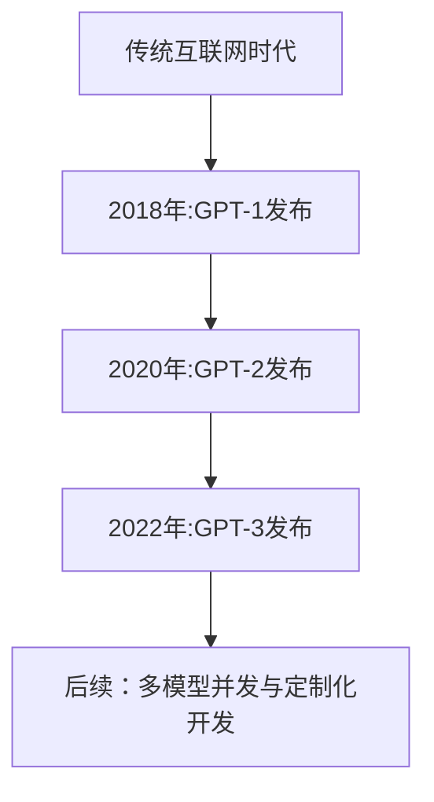

                 

# 秒推时代：LLM极速推理时代来临

> **关键词：** 秒推时代、语言模型、LLM、推理加速、应用场景、深度学习

> **摘要：** 本文章将探讨秒推时代下语言模型（LLM）的极速推理技术，分析其核心概念、算法原理以及实际应用，旨在为读者提供关于LLM在各个领域的应用及其挑战的全面理解。

## 第一部分：秒推时代的LLM基础理论

### 第1章：秒推时代的背景与核心概念

#### 1.1 秒推时代的概念解析

**传统互联网到秒推时代的转变**

在传统互联网时代，信息的传播速度受到带宽和处理能力的限制，用户在获取信息时往往需要等待较长时间。然而，随着移动互联网的普及和云计算技术的不断发展，信息的获取和处理速度显著提高。我们进入了秒推时代，这是一个以实时性、高效性和个性化为核心特征的时代。

**秒推时代的特征与优势**

- 实时性：信息能够在瞬间传播，用户可以即时获取所需的信息。
- 高效性：快速处理大量数据，提高工作效率。
- 个性化：根据用户需求提供定制化的服务，提升用户体验。

#### 1.2 LLM的起源与发展

**LLM的起源**

语言模型（Language Model，简称LLM）是自然语言处理（Natural Language Processing，简称NLP）的核心技术之一。最早的语言模型可以追溯到20世纪50年代，当时的研究者开始探索如何让计算机理解人类的自然语言。

**LLM的发展历程**

- 20世纪80年代：基于规则的方法，如统计语法模型和语法分析器。
- 20世纪90年代：基于统计的方法，如N元语法模型。
- 2018年：GPT-1发布，标志着深度学习在语言模型领域的突破。
- 2020年：GPT-2发布，进一步提升了模型的能力。
- 2022年：GPT-3发布，成为当前最先进的语言模型。

**LLM的应用现状**

LLM在诸多领域都取得了显著的成果，如聊天机器人、搜索引擎、内容生成等。其强大的语义理解和生成能力使得这些应用变得更加智能和高效。

#### 1.3 LLM的核心概念

**模型架构**

LLM通常采用深度神经网络（Deep Neural Network，简称DNN）的架构，其中最常用的是Transformer模型和GPT模型。

**参数规模**

LLM的参数规模巨大，以GPT-3为例，其参数规模达到了1750亿个参数。

**预训练与微调**

预训练（Pre-training）是指在大规模语料库上对模型进行训练，使其具备基本的语义理解和生成能力。微调（Fine-tuning）则是在预训练的基础上，针对特定任务对模型进行微调，以提升其性能。

**推理与生成**

推理（Inference）是指模型根据输入进行预测的过程。生成（Generation）是指模型根据特定条件生成文本的过程。

#### 1.4 LLM的技术挑战

**计算资源需求**

LLM的训练和推理过程对计算资源有着极高的要求，需要大量的GPU和TPU等硬件资源。

**能效消耗**

LLM的训练和推理过程会产生大量的能耗，这对环境造成了一定的压力。

**数据安全与隐私保护**

LLM的训练和推理过程中会涉及到大量的用户数据，如何保护用户数据的安全和隐私成为一个重要的挑战。

#### 1.5 秒推时代的机遇与挑战

**企业数字化转型**

秒推时代为企业的数字化转型提供了新的机遇，企业可以利用LLM技术提升业务效率和用户体验。

**用户需求变化**

随着秒推时代的到来，用户对信息获取和处理的速度和效率提出了更高的要求，这推动了LLM技术的发展。

**技术发展趋势**

未来，LLM技术将继续朝着更大规模、更高精度和更广泛应用的方向发展。

### Mermaid 流程图：LLM的发展历程



## 第二部分：秒推时代的LLM核心算法原理

### 第2章：LLM的算法基础与核心模型

#### 2.1 深度学习基础

**神经网络**

神经网络（Neural Network，简称NN）是深度学习的基础，由大量神经元（节点）通过权重连接形成。

**反向传播算法**

反向传播算法（Backpropagation Algorithm）是一种用于训练神经网络的优化方法，通过不断调整网络中的权重，使网络输出更接近目标。

**激活函数**

激活函数（Activation Function）是神经网络中的一个关键组件，用于引入非线性特性。

$$
f(x) = \text{ReLU}(x) = \max(0, x)
$$

#### 2.2 语言模型

**语言模型的概念**

语言模型（Language Model，简称LM）是一种用于预测下一个单词或字符的概率的模型。

**语言模型的类型**

- 隐马尔可夫模型（Hidden Markov Model，简称HMM）
- 神经网络语言模型
- 变分自动机（Variational Autoencoder，简称VAE）

**语言模型的评价指标**

- 准确率（Accuracy）
- 召回率（Recall）
- F1值（F1 Score）

#### 2.3 Transformer模型

**Transformer模型概述**

Transformer模型是一种基于自注意力机制（Self-Attention Mechanism）的深度神经网络模型，广泛应用于语言模型和机器翻译等领域。

**自注意力机制**

自注意力机制是一种计算序列中每个元素对自身及其他元素影响的方法，通过计算注意力权重来动态调整每个元素在模型中的重要性。

**编码器-解码器架构**

编码器（Encoder）用于将输入序列编码为一个固定长度的向量表示。解码器（Decoder）则根据编码器的输出生成输出序列。

#### 2.4 GPT模型

**GPT模型发展历程**

- GPT-1（2018年）：首次提出GPT模型，采用12层Transformer架构。
- GPT-2（2019年）：通过预训练更大规模的模型，提高了语言生成的质量和多样性。
- GPT-3（2020年）：参数规模达到1750亿，成为当前最先进的语言模型。

**GPT模型的特点**

- 自适应性：GPT模型能够根据输入文本自适应地调整其生成内容。
- 生成能力：GPT模型能够生成高质量、连贯的文本。

**GPT模型的优化策略**

- 预训练：在大规模语料库上进行预训练，使模型具备基本的语义理解和生成能力。
- 微调：在特定任务上进行微调，以提升模型性能。

#### 2.5 LLM训练与推理

**LLM训练过程**

- 数据准备：收集并清洗大规模文本数据。
- 预训练：在大量文本上进行预训练，使模型具备基本的语义理解和生成能力。
- 微调：在特定任务上进行微调，以提升模型性能。

**LLM推理过程**

- 输入编码：将输入文本编码为模型可处理的向量表示。
- 推理过程：模型根据输入向量生成输出文本。

**LLM的推理加速**

- 并行计算：利用多GPU或多TPU进行并行计算，提高推理速度。
- 算法优化：通过优化算法和数据结构，降低推理复杂度。

### 伪代码：深度学习中的反向传播算法

```python
def backpropagation(theta, X, y, learning_rate):
    # 计算预测值
    z = forward propagation(theta, X)

    # 计算损失函数的梯度
    delta = compute_loss_gradient(z, y)

    # 更新参数
    theta = theta - learning_rate * delta

    return theta
```

## 第三部分：秒推时代的LLM应用实战

### 第3章：秒推时代的应用场景与案例分析

#### 3.1 聊天机器人

**聊天机器人的概念与分类**

聊天机器人是一种能够与用户进行交互的计算机程序，可以分为基于规则和基于学习的两种类型。

**聊天机器人的核心技术**

- 语言理解：理解用户输入的意图和语义。
- 语言生成：根据用户输入生成自然语言回复。
- 对话管理：维持对话的连贯性和上下文。

**聊天机器人的案例分析**

- 例如：微软小冰，通过预训练的LLM模型，能够与用户进行自然流畅的对话。

#### 3.2 搜索引擎优化

**搜索引擎优化概述**

搜索引擎优化（Search Engine Optimization，简称SEO）是一种通过改进网站内容和技术，提高网站在搜索引擎中的排名和曝光率的方法。

**LLM在搜索引擎中的应用**

- 关键词提取：使用LLM提取文本中的关键词。
- 文本相似度计算：通过LLM计算文本之间的相似度。

**搜索引擎优化案例分析**

- 例如：谷歌搜索引擎，通过LLM技术优化搜索结果的相关性和准确性。

#### 3.3 内容生成

**内容生成概述**

内容生成（Content Generation）是指通过算法生成新的文本内容，可以应用于文章写作、摘要生成、对话生成等场景。

**LLM在内容生成中的应用**

- 文本生成：根据输入的提示生成完整的文本内容。
- 摘要生成：自动提取文本的主要内容和关键信息。

**内容生成案例分析**

- 例如：OpenAI的GPT-3模型，能够生成高质量的文章摘要和对话文本。

#### 3.4 企业应用

**企业应用概述**

企业应用（Enterprise Applications）是指在企业内部使用的各种软件系统，如客户关系管理（CRM）、企业资源规划（ERP）等。

**LLM在企业中的应用案例**

- 客户服务：通过聊天机器人提供24/7的客户服务。
- 数据分析：使用LLM分析大量数据，提供决策支持。

**企业应用案例分析**

- 例如：亚马逊的Alexa，通过LLM技术提供智能客服和语音交互功能。

### 实际案例：聊天机器人代码实现

```python
class ChatBot:
    def __init__(self, model):
        self.model = model

    def get_response(self, user_input):
        # 处理用户输入
        processed_input = preprocess_input(user_input)

        # 生成响应
        response = self.model.generate_response(processed_input)

        # 处理响应
        final_response = postprocess_response(response)

        return final_response
```

## 附录

### 附录A：秒推时代的LLM开发工具与资源

#### A.1 主流深度学习框架

- **TensorFlow**：由谷歌开发的开源深度学习框架，支持多种平台和硬件。
- **PyTorch**：由Facebook开发的开源深度学习框架，以动态计算图和灵活性著称。
- **Hugging Face Transformers**：基于PyTorch和TensorFlow的开源库，提供了丰富的预训练模型和工具。

#### A.2 开发环境搭建

- **硬件环境要求**：GPU或TPU硬件，支持CUDA或GPU加速。
- **软件环境安装**：安装Python、TensorFlow或PyTorch等深度学习框架，并配置相应的依赖库。

#### A.3 资源链接

- **开源代码库**：如GitHub、GitLab等平台上的相关项目。
- **论文资源**：如ACL、ICML、NeurIPS等顶级会议的论文。
- **社区与论坛**：如Stack Overflow、Reddit、Discord等社区，提供技术交流和问题解答。

### 作者

作者：AI天才研究院/AI Genius Institute & 禅与计算机程序设计艺术 /Zen And The Art of Computer Programming

### 总结

本文详细介绍了秒推时代下语言模型（LLM）的核心概念、算法原理和应用实战，分析了LLM在各个领域的应用及其挑战。随着秒推时代的到来，LLM技术将继续发挥重要作用，推动人工智能领域的发展。希望本文能为读者提供有价值的参考和启示。|user|>

