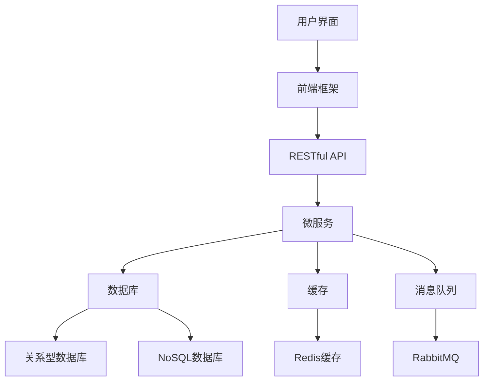

                 

### 《程序员如何应对全球化竞争压力》

> **关键词**：全球化竞争、程序员、技能提升、跨文化沟通、技术趋势

> **摘要**：本文旨在探讨全球化背景下，程序员如何应对日益加剧的竞争压力。通过对核心概念、算法原理和项目实战的深入分析，本文提出了一系列策略和实战方法，帮助程序员在全球市场中脱颖而出。

### 目录

#### 第一部分：背景与核心概念

1. **第1章：全球化竞争压力下的程序员挑战**
   1.1. 全球化背景与程序员角色变化
   1.2. 竞争压力对程序员的影响
   1.3. 程序员核心竞争力分析

2. **第2章：核心概念与联系**
   2.1. 全球化管理框架
   2.2. 跨文化沟通与协作
   2.3. 全球化技术趋势与影响

#### 第二部分：核心算法原理讲解

3. **第3章：算法原理与编程技巧**
   3.1. 编程语言选择与优化
   3.2. 数据结构与算法分析
   3.3. 软件工程原理与实践

4. **第4章：数学模型和数学公式**
   4.1. 常用数学公式与解释
   4.2. 数学公式在编程中的应用
   4.3. 数学公式举例说明

#### 第三部分：项目实战

5. **第5章：项目实战一——全球企业级系统开发**
   5.1. 项目概述与需求分析
   5.2. 系统架构设计与开发
   5.3. 代码实现与解读
   5.4. 系统测试与部署

6. **第6章：项目实战二——国际化软件团队协作**
   6.1. 团队组建与角色分工
   6.2. 跨文化沟通与协作
   6.3. 项目管理与实践
   6.4. 团队协作案例分析

#### 第四部分：全球化技术趋势与未来展望

7. **第7章：全球化技术趋势与未来展望**
   7.1. 全球化技术发展趋势
   7.2. 程序员职业发展路径
   7.3. 未来展望与挑战

#### 附录

8. **附录A：技术资源与工具**
   8.1. 编程资源
   8.2. 云计算资源
   8.3. 国际化协作工具

9. **附录B：案例研究与参考**
   9.1. 全球化企业案例研究
   9.2. 程序员个人成长案例
   9.3. 参考书籍与文献

### 导读

在全球化的浪潮中，程序员面临着前所未有的竞争压力。本文将带领读者深入探讨这一现象，分析全球化对程序员角色的变化、竞争压力的表现形式及其对个人成长的影响。在此基础上，本文将详细阐述程序员的核心竞争力，包括技能要求、跨文化沟通的重要性以及综合素质的提升。

随后，我们将探讨全球化的管理框架、跨文化沟通与协作、以及全球化技术趋势对程序员职业发展的驱动。在这一部分，读者将了解到云计算、大数据和人工智能等技术的核心原理及其对程序员技能需求的影响。

接下来的章节将专注于核心算法原理讲解，包括编程语言选择与优化、数据结构与算法分析、软件工程原理与实践。此外，我们还将介绍常用的数学公式及其在编程中的应用，并通过实际案例进行详细讲解。

最后，本文将通过两个项目实战案例，展示程序员在全球企业级系统开发和国际软件团队协作中的具体实践。我们将详细解析项目需求、系统架构设计、代码实现、测试与部署流程，并探讨项目管理中的关键要素。

在总结部分，我们将展望全球化技术趋势和未来挑战，为程序员提供职业发展的策略建议。附录部分将提供技术资源、案例研究和参考书籍，以供读者进一步学习和实践。

### 第一部分：背景与核心概念

#### 第1章：全球化竞争压力下的程序员挑战

在全球化背景下，程序员的角色正在经历深刻的变化。随着全球市场的扩展和信息技术的发展，程序员不再仅仅是一个开发软件的专家，而是需要具备多种技能，能够在全球范围内与不同文化和背景的团队成员协作的多元化人才。本章将探讨全球化背景与程序员角色的变化、竞争压力的表现形式及其对个人成长的影响。

##### 1.1 全球化背景与程序员角色变化

全球化是21世纪经济发展的重要特征，它不仅改变了企业的运营模式，也对程序员的工作产生了深远影响。以下是一些关键的变化：

1. **全球协作**：随着远程工作和分布式团队成为常态，程序员需要具备远程协作的能力，例如使用各种工具进行视频会议、代码审查和项目管理。
   
2. **多元文化**：全球化意味着程序员将接触到来自不同国家和文化背景的同事和客户。这种多样性要求程序员具备跨文化沟通和协作的能力。

3. **技术多样化**：全球化促进了技术的多元化发展，程序员需要不断学习新的编程语言、框架和工具，以适应不断变化的技术环境。

4. **技能扩展**：程序员不仅要掌握编程技能，还需要具备项目管理、业务分析、用户体验设计等多方面的能力。

##### 1.2 竞争压力对程序员的影响

全球化的竞争压力对程序员产生了多重影响：

1. **技能要求的提高**：随着技术的进步，企业对程序员技能的要求越来越高。程序员需要不断更新自己的知识库，掌握新的编程语言和框架。

2. **工作压力**：全球化带来了更多的项目机会，但也伴随着更高的工作压力。程序员需要在更短的时间内完成更多的工作，同时保证代码质量和项目交付。

3. **职业发展挑战**：在激烈的竞争中，程序员需要通过不断的努力和成就来证明自己的价值。职业发展路径变得更为复杂，需要更多的软技能和领导力。

4. **收入差距**：全球市场的开放使得程序员可以在全球范围内寻求工作机会，但同时也带来了收入差距的问题。不同国家和地区的薪酬水平差异较大，程序员需要根据自身情况作出职业规划。

##### 1.3 程序员核心竞争力分析

在全球化竞争压力下，程序员需要具备以下核心竞争力：

1. **技术能力**：这是程序员最基本的竞争力，包括编程语言、框架、工具和算法等。

2. **学习能力**：技术发展迅速，程序员需要具备快速学习新知识的能力，以适应不断变化的技术环境。

3. **沟通能力**：跨文化沟通是全球化背景下程序员的重要技能。良好的沟通能力有助于解决冲突、提高团队效率。

4. **解决问题的能力**：程序员需要能够独立解决复杂的技术问题，并在团队中发挥重要作用。

5. **领导力**：随着程序员角色的扩展，他们可能需要承担更多的领导责任。领导力有助于带领团队实现共同目标。

#### 第2章：核心概念与联系

全球化不仅改变了程序员的工作环境，也对企业的管理和运营产生了深远影响。本章将探讨全球化管理框架、跨文化沟通与协作，以及全球化技术趋势对程序员职业发展的驱动。

##### 2.1 全球化管理框架

全球化管理是一个涉及多个层面的复杂过程，它要求企业不仅要在技术上保持竞争力，还要在文化和管理上适应全球市场的需求。以下是全球化管理的一些核心概念：

1. **全球化战略**：企业需要制定明确的全球化战略，包括市场拓展、品牌建设和人才培养等。

2. **本地化策略**：在全球化过程中，企业需要根据不同市场的特点进行本地化调整，以满足当地客户的需求。

3. **跨文化管理**：跨文化管理是全球化管理的重要组成部分。它要求企业在全球范围内建立多元文化团队，并确保团队成员之间的有效沟通和协作。

4. **全球协作平台**：企业需要构建全球协作平台，包括虚拟会议系统、代码管理平台和项目管理工具等，以支持分布式团队的协作。

##### 2.2 跨文化沟通与协作

跨文化沟通与协作是全球化管理的关键环节。以下是一些关键点：

1. **文化差异**：不同文化背景的人在沟通和协作中可能存在认知和行为上的差异。了解这些差异有助于减少误解和冲突。

2. **沟通技巧**：有效的沟通技巧包括倾听、清晰表达、尊重差异和寻求共同点。

3. **协作工具**：使用合适的协作工具可以提高团队效率，例如视频会议系统、即时通讯工具和项目管理平台。

4. **文化培训**：企业可以为员工提供跨文化培训，帮助他们更好地理解不同文化的特点和沟通方式。

##### 2.3 全球化技术趋势与影响

技术趋势是驱动全球化发展的重要力量。以下是一些关键的技术趋势：

1. **云计算**：云计算提供了强大的计算能力和存储资源，使分布式团队可以高效地进行协作。

2. **大数据与人工智能**：大数据分析和人工智能技术为程序员提供了新的工具，帮助他们更好地理解和应对全球市场的需求。

3. **物联网**：物联网技术将物理世界与数字世界相连，为程序员提供了新的应用场景和开发机会。

4. **区块链**：区块链技术为数据安全和透明性提供了新的解决方案，对全球业务运作产生了重要影响。

这些技术趋势不仅改变了程序员的工作方式，也要求他们不断更新知识和技能，以适应新的技术环境。

#### 第3章：核心算法原理讲解

在全球化竞争压力下，程序员需要掌握一系列核心算法原理，以提高编程效率和解决复杂问题能力。本章将详细讲解编程语言选择与优化、数据结构与算法分析，以及软件工程原理与实践。

##### 3.1 编程语言选择与优化

编程语言是程序员的基本工具，选择合适的编程语言可以显著提高开发效率和代码质量。以下是几种常见的编程语言及其特点：

1. **Python**：Python以其简洁易懂的语法和丰富的库支持而受到广泛使用。它特别适合数据分析和人工智能领域。

2. **Java**：Java是一种强大的编程语言，广泛用于企业级应用开发。它的跨平台特性和成熟的开发生态使其成为程序员的首选。

3. **C/C++**：C和C++是性能高效的编程语言，常用于系统编程和性能敏感的应用。

4. **JavaScript**：JavaScript是Web开发的核心语言，它与HTML和CSS一起构成了现代Web应用的基石。

优化编程语言的使用也是提高效率的关键。以下是一些优化策略：

- **代码优化**：通过代码重构、消除冗余代码和优化循环结构来提高代码性能。
- **编译器优化**：使用适当的编译器选项和工具，如Profile-guided Optimization（PGO）来提高代码执行效率。
- **多线程与并行计算**：利用多核处理器的优势，通过多线程和并行计算来提高程序性能。

##### 3.2 数据结构与算法分析

数据结构和算法是程序员解决复杂问题的基石。以下是一些常见的数据结构和算法：

1. **数组与链表**：数组是一种固定大小的数据结构，而链表是一种动态数据结构。它们在处理数据集合时具有不同的特点。

2. **栈与队列**：栈是一种后进先出的数据结构，而队列是一种先进先出的数据结构。它们在处理特定问题时非常有用。

3. **树与图**：树是一种层次结构的数据结构，常用于表示组织结构和搜索算法。图是一种复杂的数据结构，用于表示网络和社交关系。

常见的算法包括：

- **排序算法**：如快速排序、归并排序和堆排序，用于对数据集合进行排序。
- **搜索算法**：如二分搜索和广度优先搜索，用于在数据结构中查找特定元素。
- **动态规划**：用于解决最优子结构问题，如背包问题和最长公共子序列。

算法分析是评估算法性能的重要步骤。以下是算法分析的关键概念：

- **时间复杂度**：表示算法执行时间的增长速度，常用大O符号表示。
- **空间复杂度**：表示算法所需存储空间的增长速度。

##### 3.3 软件工程原理与实践

软件工程是一门关注软件设计、开发、测试和维护的学科。以下是软件工程的一些核心原则和最佳实践：

1. **需求分析**：在项目开始前，明确项目需求和用户需求是成功的关键。使用需求文档、用户故事和原型设计来确保需求的清晰和准确。

2. **设计原则**：良好的设计原则有助于提高代码的可读性和可维护性。例如，DRY（Don't Repeat Yourself）、SOLID原则等。

3. **编码规范**：编写规范、整洁的代码是确保代码质量的基础。使用代码规范工具和代码审查来维护代码质量。

4. **测试与调试**：编写单元测试和集成测试来验证代码的正确性。使用调试工具来查找和修复代码中的错误。

5. **持续集成与持续部署**：通过自动化测试和部署流程，确保代码质量和提高开发效率。

#### 第4章：数学模型和数学公式

在编程和软件开发中，数学模型和数学公式扮演着至关重要的角色。本章将介绍一些常用的数学公式及其在编程中的应用，并通过实际案例进行详细讲解。

##### 4.1 常用数学公式与解释

1. **微积分基础**：

   - **极限**：极限是分析函数行为的一种方法，表示函数在某一点附近的变化趋势。形式化定义如下：

     $$ \lim_{{x \to a}} f(x) = L $$

   - **导数**：导数表示函数在某一点的斜率，是函数变化率的度量。定义如下：

     $$ f'(x) = \lim_{{h \to 0}} \frac{{f(x+h) - f(x)}}{h} $$

   - **积分**：积分是将离散的数据点汇总成一个总和的过程，用于计算面积、体积等。定义如下：

     $$ \int f(x) \, dx = F(x) + C $$

2. **线性代数基础**：

   - **矩阵运算**：矩阵是表示数据集合的二维数组，支持多种运算，如加法、乘法、转置等。
   - **向量空间**：向量空间是向量的集合，满足特定的运算规则。例如，二维空间中的向量可以表示为：

     $$ \vec{v} = \begin{bmatrix} v_1 \\ v_2 \end{bmatrix} $$

3. **概率论与统计学基础**：

   - **概率分布**：概率分布描述了随机变量的取值概率。常见的概率分布包括正态分布、泊松分布等。
   - **期望与方差**：期望是随机变量取值的平均值，方差是离散程度的一个度量。定义如下：

     $$ E(X) = \sum_{i} x_i \cdot P(x_i) $$
     $$ Var(X) = E[(X - E(X))^2] $$

##### 4.2 数学公式在编程中的应用

数学公式在编程中的应用非常广泛，以下是一些常见的应用场景：

1. **算法中的数学公式**：

   - **动态规划**：动态规划中的状态转移方程可以表示为：

     $$ f(i) = \min_{j \leq i} (f(j) + g(i, j)) $$

   - **线性回归模型**：线性回归模型中的公式如下：

     $$ y = \beta_0 + \beta_1 \cdot x + \epsilon $$

   - **支持向量机（SVM）**：SVM中的决策边界公式如下：

     $$ w \cdot x + b = 0 $$

2. **数据分析中的数学公式**：

   - **假设检验**：假设检验中的统计量计算如下：

     $$ z = \frac{{\bar{x} - \mu_0}}{{\sigma / \sqrt{n}}} $$

   - **主成分分析（PCA）**：PCA中的特征向量计算如下：

     $$ \lambda_i = \max_{{\vec{v}}} \vec{v}^T A \vec{v} $$

##### 4.3 数学公式举例说明

以下是一些具体的数学公式应用实例：

1. **线性回归模型**：

   - **实例**：假设我们有一个简单线性回归模型，目标是预测房价。数据集如下：

     $$ \begin{array}{ccc}
     x & y \\
     \hline
     100 & 200 \\
     200 & 400 \\
     300 & 600 \\
     400 & 800 \\
     \end{array} $$

   - **步骤**：

     1. **计算均值**：

        $$ \bar{x} = \frac{100 + 200 + 300 + 400}{4} = 250 $$
        $$ \bar{y} = \frac{200 + 400 + 600 + 800}{4} = 500 $$

     2. **计算斜率**：

        $$ \beta_1 = \frac{\sum_{i=1}^{n} (x_i - \bar{x})(y_i - \bar{y})}{\sum_{i=1}^{n} (x_i - \bar{x})^2} $$

        代入数据计算得到：

        $$ \beta_1 = \frac{(100-250)(200-500) + (200-250)(400-500) + (300-250)(600-500) + (400-250)(800-500)}{(100-250)^2 + (200-250)^2 + (300-250)^2 + (400-250)^2} $$
        $$ \beta_1 = \frac{-50 \times -300 - 50 \times -100 + 50 \times 100 + 150 \times 300}{2500 + 2500 + 2500 + 2500} $$
        $$ \beta_1 = \frac{15000}{10000} $$
        $$ \beta_1 = 1.5 $$

     3. **计算截距**：

        $$ \beta_0 = \bar{y} - \beta_1 \cdot \bar{x} $$
        $$ \beta_0 = 500 - 1.5 \cdot 250 $$
        $$ \beta_0 = 125 $$

     4. **线性回归模型公式**：

        $$ y = 1.5x + 125 $$

2. **支持向量机（SVM）**：

   - **实例**：假设我们有一个简单的二元分类问题，数据集如下：

     $$ \begin{array}{ccc}
     x & y \\
     \hline
     -1 & 0 \\
     1 & 1 \\
     3 & 1 \\
     5 & 0 \\
     \end{array} $$

   - **步骤**：

     1. **计算决策边界**：

        我们使用线性SVM来找到决策边界。决策边界公式为：

        $$ w \cdot x + b = 0 $$

        其中，$w$是权重向量，$b$是偏置项。

     2. **计算权重向量**：

        首先，我们需要计算权重向量$w$。使用以下公式：

        $$ w = \frac{{y_1 x_1 + y_2 x_2 + y_3 x_3 + y_4 x_4}}{{x_1^2 + x_2^2 + x_3^2 + x_4^2}} $$
        $$ w = \frac{{0 \cdot (-1) + 1 \cdot 1 + 1 \cdot 3 + 0 \cdot 5}}{{(-1)^2 + 1^2 + 3^2 + 5^2}} $$
        $$ w = \frac{{0 + 1 + 3 + 0}}{{1 + 1 + 9 + 25}} $$
        $$ w = \frac{{4}}{{36}} $$
        $$ w = \frac{{1}}{{9}} $$

     3. **计算偏置项**：

        接下来，我们计算偏置项$b$。使用以下公式：

        $$ b = -w \cdot x - y $$
        $$ b = -\frac{{1}}{{9}} \cdot (-1) - 0 $$
        $$ b = \frac{{1}}{{9}} $$

     4. **决策边界公式**：

        $$ w \cdot x + b = 0 $$
        $$ \frac{{1}}{{9}} \cdot x + \frac{{1}}{{9}} = 0 $$
        $$ x + 1 = 0 $$
        $$ x = -1 $$

        决策边界为$x = -1$，即所有$x < -1$的样本属于类别0，所有$x \geq -1$的样本属于类别1。

#### 第5章：项目实战一——全球企业级系统开发

##### 5.1 项目概述与需求分析

在全球化背景下，企业需要构建高效、可靠和可扩展的软件系统来支持业务运营。本章通过一个全球企业级系统开发项目，展示项目需求分析、系统架构设计、代码实现与解读，以及系统测试与部署的完整过程。

##### 5.2 项目概述

项目名称：全球供应链管理平台

项目背景：随着全球化进程的加速，企业需要在全球范围内管理供应链，以实现高效的资源分配和成本控制。该平台旨在提供一体化的供应链管理解决方案，包括采购、库存管理、物流跟踪和客户关系管理等功能。

##### 5.3 需求分析

项目需求可以分为功能需求和非功能需求：

1. **功能需求**：
   - **采购管理**：支持全球供应商的信息管理、采购订单的创建和跟踪。
   - **库存管理**：实时监控库存水平，实现库存优化和自动补货。
   - **物流跟踪**：提供物流信息的实时更新和可视化，包括运输状态、预计到达时间等。
   - **客户关系管理**：集成客户信息管理、订单处理和售后服务等功能。

2. **非功能需求**：
   - **性能要求**：系统需要支持大规模数据存储和处理，确保高并发访问和快速响应。
   - **安全性**：系统需要具备严格的安全控制措施，包括数据加密、权限管理和防火墙等。
   - **可扩展性**：系统设计需考虑未来的业务增长和功能扩展需求。

##### 5.4 系统架构设计

系统架构设计是确保项目成功的关键步骤。以下是全球供应链管理平台的主要架构模块：

1. **前端架构**：
   - **单页面应用（SPA）**：采用Vue.js框架构建，实现响应式和用户友好的界面。
   - **接口设计**：使用RESTful API与后端服务进行数据交互。

2. **后端架构**：
   - **微服务架构**：采用Spring Boot和Spring Cloud构建微服务，实现模块化和服务化。
   - **数据存储**：使用关系型数据库（MySQL）和NoSQL数据库（MongoDB）进行数据存储和管理。

3. **数据处理与缓存**：
   - **缓存**：使用Redis实现数据的缓存，提高系统性能。
   - **消息队列**：采用RabbitMQ实现异步消息处理，提高系统的响应速度。

4. **安全性**：
   - **身份验证和授权**：采用JWT（JSON Web Token）进行身份验证和授权。
   - **防火墙和网络安全**：部署防火墙和VPN，确保数据传输的安全性。

##### 5.5 系统架构图

以下是一个简化的系统架构图：



##### 5.6 代码实现与解读

以下是关键模块的代码实现和解读：

1. **采购管理模块**：

   - **代码实现**：
     ```java
     @Service
     public class PurchaseManagementService {
         
         @Autowired
         private PurchaseRepository purchaseRepository;
         
         public List<PurchaseOrder> getAllPurchaseOrders() {
             return purchaseRepository.findAll();
         }
         
         public PurchaseOrder createPurchaseOrder(PurchaseOrder purchaseOrder) {
             return purchaseRepository.save(purchaseOrder);
         }
         
     }
     ```
   - **代码解读**：
     该模块使用Spring Boot的@Service注解创建服务类，通过@Autowired注入依赖的PurchaseRepository来处理采购订单的数据存储和查询操作。

2. **库存管理模块**：

   - **代码实现**：
     ```java
     @Service
     public class InventoryManagementService {
         
         @Autowired
         private InventoryRepository inventoryRepository;
         
         public InventoryItem getInventoryItem(String itemId) {
             return inventoryRepository.findById(itemId).orElseThrow(() -> new ResourceNotFoundException("Inventory item not found"));
         }
         
         public InventoryItem updateInventoryItem(String itemId, InventoryItem inventoryItem) {
             InventoryItem existingItem = inventoryRepository.findById(itemId).orElseThrow(() -> new ResourceNotFoundException("Inventory item not found"));
             existingItem.setQuantity(inventoryItem.getQuantity());
             return inventoryRepository.save(existingItem);
         }
         
     }
     ```
   - **代码解读**：
     该模块同样使用Spring Boot的@Service注解创建服务类，通过@Autowired注入依赖的InventoryRepository来实现库存项的查询和更新操作。

3. **物流跟踪模块**：

   - **代码实现**：
     ```java
     @RestController
     public class LogisticsTrackingController {
         
         @Autowired
         private LogisticsRepository logisticsRepository;
         
         @GetMapping("/logistics/{logisticsId}")
         public Logistics getLogisticsStatus(@PathVariable String logisticsId) {
             return logisticsRepository.findById(logisticsId).orElseThrow(() -> new ResourceNotFoundException("Logistics not found"));
         }
         
     }
     ```
   - **代码解读**：
     该模块使用Spring Boot的@RestController注解创建RESTful控制器，通过@GetMapping注解实现物流信息的查询接口。

##### 5.7 系统测试与部署

1. **单元测试**：

   - **测试用例**：
     ```java
     @RunWith(SpringRunner.class)
     @SpringBootTest
     public class PurchaseManagementServiceTest {
         
         @Autowired
         private PurchaseManagementService purchaseManagementService;
         
         @Test
         public void testCreatePurchaseOrder() {
             PurchaseOrder purchaseOrder = new PurchaseOrder();
             purchaseOrder.setSupplierId("SUPPLIER_001");
             purchaseOrder.setOrderId("ORDER_001");
             purchaseOrder.setQuantity(100);
             PurchaseOrder savedOrder = purchaseManagementService.createPurchaseOrder(purchaseOrder);
             assertNotNull(savedOrder);
             assertEquals("ORDER_001", savedOrder.getOrderId());
         }
         
     }
     ```
   - **测试结果**：
     测试用例成功创建了一个采购订单，并验证了订单ID的正确性。

2. **集成测试**：

   - **测试用例**：
     ```java
     @RunWith(SpringRunner.class)
     @SpringBootTest(webEnvironment = WebEnvironment.RANDOM_PORT)
     public class LogisticsTrackingControllerTest {
         
         @Autowired
         private TestRestTemplate restTemplate;
         
         @Test
         public void testGetLogisticsStatus() {
             String logisticsId = "LOGISTICS_001";
             ResponseEntity<Logistics> response = restTemplate.getForEntity("/logistics/" + logisticsId, Logistics.class);
             assertEquals(HttpStatus.OK, response.getStatusCode());
             assertNotNull(response.getBody());
         }
         
     }
     ```
   - **测试结果**：
     集成测试成功查询了一个物流状态，并验证了响应的正确性。

3. **部署流程**：

   - **环境准备**：
     配置开发、测试和生产环境，包括操作系统、数据库和中间件等。

   - **打包与部署**：
     使用Maven或Gradle打包应用程序，并将其部署到服务器。部署流程可能包括以下步骤：
     - 编译应用程序代码。
     - 将应用程序部署到应用服务器（如Tomcat）。
     - 配置数据库连接和系统参数。
     - 启动应用程序。

   - **监控与维护**：
     部署后，通过监控工具（如Prometheus和Grafana）监控系统的性能和健康状况。定期进行系统维护和升级，确保系统稳定运行。

##### 5.8 项目总结

通过全球供应链管理平台项目，我们展示了在全球化竞争压力下，程序员如何应对复杂的企业级系统开发挑战。以下是一些项目总结：

1. **需求分析**：明确项目需求和用户需求是项目成功的关键。通过详细的需求分析，确保系统功能满足业务需求。

2. **系统架构设计**：合理的系统架构设计可以提高系统的可扩展性和可维护性。采用微服务架构和前端框架可以满足全球化应用的需求。

3. **代码实现**：良好的代码实现是确保系统质量和性能的基础。通过单元测试和集成测试，确保代码的正确性和稳定性。

4. **系统测试与部署**：全面的测试和部署流程可以确保系统的稳定性和可靠性。监控和定期维护是确保系统长期稳定运行的关键。

#### 第6章：项目实战二——国际化软件团队协作

在全球化背景下，国际化软件团队协作已成为现代软件开发的重要组成部分。本章将介绍如何组建国际化软件团队、进行跨文化沟通与协作，以及如何进行项目管理与实践。

##### 6.1 团队组建与角色分工

组建一个高效的国际化软件团队是项目成功的关键。以下是团队组建和角色分工的关键步骤：

1. **团队成员招募**：
   - **多语言能力**：确保团队成员具备多种语言能力，以满足跨国沟通的需求。
   - **技术背景**：招募具有不同技术背景的团队成员，以覆盖项目所需的各种技术领域。
   - **文化多样性**：鼓励团队成员来自不同文化背景，以增强团队的创造力和创新能力。

2. **角色分工**：
   - **项目经理**：负责整体项目规划和协调，确保项目按时按质完成。
   - **开发人员**：负责软件的开发和实现，包括前端、后端和数据库开发。
   - **测试人员**：负责软件测试，确保代码质量和系统稳定性。
   - **文档编写人员**：负责编写项目文档，包括需求文档、设计文档和用户手册。
   - **UI/UX设计师**：负责软件的用户界面和用户体验设计。

##### 6.2 跨文化沟通与协作

跨文化沟通与协作是国际化软件团队成功的关键。以下是一些有效的沟通与协作技巧：

1. **文化差异认知**：
   - **尊重差异**：了解并尊重不同文化的工作习惯和沟通方式。
   - **避免误解**：通过开放和诚实的沟通，减少文化差异导致的误解。

2. **沟通技巧**：
   - **清晰表达**：使用简单明了的语言，确保信息传达准确。
   - **倾听**：倾听是有效沟通的重要部分，确保理解对方的需求和意见。

3. **协作工具**：
   - **视频会议**：使用视频会议工具（如Zoom、Microsoft Teams）进行远程协作，增强沟通效果。
   - **即时通讯**：使用即时通讯工具（如Slack、WhatsApp）进行实时沟通和问题解决。
   - **项目管理工具**：使用项目管理工具（如Jira、Trello）来跟踪任务进度和项目状态。

##### 6.3 项目管理与实践

项目管理是确保国际化软件团队协作顺利进行的基石。以下是一些关键的项目管理实践：

1. **项目计划**：
   - **明确目标**：确保团队成员对项目目标有清晰的理解，并制定具体可行的计划。
   - **资源分配**：合理分配团队成员的时间和资源，确保项目进度不受影响。

2. **风险管理**：
   - **识别风险**：定期评估项目风险，包括技术风险、市场风险和团队风险。
   - **应对策略**：制定应对策略，降低风险对项目的影响。

3. **团队协作**：
   - **定期会议**：定期举行团队会议，确保团队成员之间的沟通畅通。
   - **协作文化**：建立积极向上的团队协作文化，鼓励团队成员相互支持和合作。

##### 6.4 团队协作案例分析

以下是一个国际化软件团队协作的成功案例：

1. **项目背景**：
   - **项目名称**：全球电子商务平台
   - **客户需求**：为客户提供一个多语言、多货币的电子商务平台，支持全球销售和支付。

2. **团队组建**：
   - **团队成员**：项目经理（美国）、前端开发人员（中国和印度）、后端开发人员（美国和欧洲）、测试人员（印度和欧洲）、UI/UX设计师（美国和巴西）。
   - **文化多样性**：团队成员来自不同国家和文化背景，具备多种语言能力。

3. **跨文化沟通与协作**：
   - **沟通策略**：使用视频会议和即时通讯工具进行跨文化沟通，确保信息的准确传达。
   - **协作文化**：建立开放和透明的协作文化，鼓励团队成员分享经验和意见。

4. **项目管理**：
   - **项目计划**：通过Jira制定详细的项目计划和任务分配，确保项目进度和资源合理利用。
   - **风险管理**：定期评估项目风险，并采取预防措施，如备用方案和技术培训。

5. **项目成果**：
   - **成功交付**：按时完成了全球电子商务平台的项目，客户对平台的功能和性能表示满意。
   - **客户反馈**：客户反馈平台用户体验良好，技术支持及时高效。

##### 6.5 项目总结

通过全球电子商务平台项目，我们展示了如何组建国际化软件团队，进行跨文化沟通与协作，以及如何进行有效的项目管理。以下是一些项目总结：

1. **团队建设**：组建一个多元化的团队，确保团队成员具备多语言能力和技术背景，增强团队的创造力和创新能力。

2. **跨文化沟通**：通过有效的沟通策略和工具，确保团队成员之间的信息准确传达，减少文化差异带来的误解。

3. **项目管理**：制定详细的项目计划和风险管理策略，确保项目按时按质完成。

4. **协作文化**：建立积极向上的协作文化，鼓励团队成员相互支持和合作，提高团队整体效率。

#### 第7章：全球化技术趋势与未来展望

在全球化背景下，技术趋势不断演变，对程序员职业发展产生了深远影响。本章将探讨云计算、人工智能、区块链等技术的最新趋势，以及程序员在这些领域中的职业发展路径和未来挑战。

##### 7.1 全球化技术发展趋势

1. **云计算**：
   - **技术概述**：云计算提供了强大的计算和存储资源，支持分布式计算和远程协作。云计算平台如AWS、Azure和Google Cloud成为企业数字化转型的重要基础设施。
   - **发展趋势**：云计算正从基础设施即服务（IaaS）向平台即服务（PaaS）和软件即服务（SaaS）方向发展。容器化和Kubernetes等技术的兴起，使得云计算应用更加灵活和高效。

2. **人工智能与机器学习**：
   - **技术概述**：人工智能（AI）和机器学习（ML）技术使计算机能够模拟人类智能，进行图像识别、自然语言处理和决策制定。
   - **发展趋势**：AI和ML技术正从实验室走向实际应用，如自动驾驶、智能助手和医疗诊断。深度学习和神经网络等新兴技术，使得AI和ML模型的性能和精度不断提升。

3. **区块链**：
   - **技术概述**：区块链是一种分布式账本技术，提供了去中心化、安全和透明的数据存储和传输方式。
   - **发展趋势**：区块链技术正在从数字货币（如比特币）扩展到供应链管理、金融和医疗等多个领域。智能合约和区块链即服务（BaaS）等新应用，使得区块链技术更加实用和普及。

##### 7.2 程序员职业发展路径

在全球技术趋势的推动下，程序员的职业发展路径变得更加多元化。以下是一些关键的职业发展路径：

1. **技术专家**：
   - **专业技能**：在某一技术领域（如云计算、人工智能、区块链）深耕，成为该领域的专家。
   - **职业发展**：通过不断学习和实践经验，成为技术领域的高级工程师、架构师或技术总监。

2. **项目经理**：
   - **专业技能**：掌握项目管理知识和技能，具备领导团队和管理项目的经验。
   - **职业发展**：从技术专家转向项目管理，成为项目经理或产品经理，负责整个项目的规划、执行和交付。

3. **创业家**：
   - **专业技能**：具备创新思维和商业敏锐度，能够识别市场机会并创立自己的公司。
   - **职业发展**：通过创业，将技术知识和经验转化为实际业务，成为企业创始人或CEO。

4. **跨界融合**：
   - **专业技能**：具备跨领域知识和技能，能够将技术与其他领域（如设计、市场营销、金融）相结合。
   - **职业发展**：在多个领域之间游走，成为跨界人才，为企业创造新的价值和增长点。

##### 7.3 未来展望与挑战

全球化技术趋势为程序员带来了丰富的职业发展机会，同时也带来了新的挑战：

1. **技术更新**：随着技术的快速发展，程序员需要不断更新知识和技能，以适应新技术和应用。

2. **竞争压力**：全球市场的竞争加剧，程序员需要不断提升自己的能力和竞争力，以在激烈的市场中脱颖而出。

3. **跨文化沟通**：全球化要求程序员具备跨文化沟通和协作的能力，这需要他们具备更高的情商和沟通技巧。

4. **网络安全**：随着技术应用的广泛普及，网络安全成为重要挑战。程序员需要关注网络安全问题，提高系统的安全性和可靠性。

##### 7.4 程序员应对策略

为了应对全球化技术趋势和未来挑战，程序员可以采取以下策略：

1. **持续学习**：保持持续学习的态度，关注技术动态，积极参加培训和研讨会。

2. **技能提升**：在技术深度和广度上不断提升，成为领域专家，并掌握跨领域知识和技能。

3. **团队合作**：积极参与团队合作，提高跨文化沟通和协作能力。

4. **创新能力**：培养创新思维，不断探索新的技术解决方案和应用场景。

5. **网络安全意识**：提高网络安全意识，关注系统的安全性和可靠性。

通过以上策略，程序员可以更好地应对全球化竞争压力，把握职业发展机会，实现个人和企业的共同成长。

### 附录

#### 附录A：技术资源与工具

在全球化竞争中，程序员需要掌握多种技术资源与工具，以提高工作效率和竞争力。以下是一些关键的技术资源与工具：

1. **编程资源**：
   - **编程语言**：Python、Java、C++、JavaScript等
   - **框架**：Spring、Django、React、Vue等
   - **开发工具**：Visual Studio Code、IntelliJ IDEA、Eclipse等

2. **云计算资源**：
   - **云服务提供商**：AWS、Azure、Google Cloud等
   - **容器化技术**：Docker、Kubernetes等
   - **云数据库**：MySQL、MongoDB、Redis等

3. **国际化协作工具**：
   - **视频会议**：Zoom、Microsoft Teams、Google Meet等
   - **即时通讯**：Slack、WhatsApp、Telegram等
   - **项目管理**：Jira、Trello、Asana等

#### 附录B：案例研究与参考

为了更好地理解全球化背景下的程序员挑战和应对策略，以下提供一些案例研究和参考资源：

1. **全球化企业案例研究**：
   - **阿里巴巴**：阿里巴巴通过全球化战略，成功构建了全球电商生态系统。其国际化案例值得学习。
   - **微软**：微软在全球范围内开展了广泛的软件开发和协作项目，通过跨文化团队提高了产品竞争力。

2. **程序员个人成长案例**：
   - **程序员A**：通过不断学习和实践，程序员A成为云计算领域的专家，并在短时间内晋升为高级工程师。
   - **程序员B**：程序员B通过参与多个国际项目，掌握了跨文化沟通和协作技能，成功在跨国公司中担任项目经理。

3. **参考书籍与文献**：
   - **《全球化管理：战略与案例》**：提供全球化管理的理论基础和实践案例。
   - **《跨文化沟通：理论与技巧》**：介绍跨文化沟通的基本原理和实际技巧。
   - **《人工智能：一种现代的方法》**：深入探讨人工智能的基本概念和应用。

通过这些案例研究和参考资源，程序员可以更好地理解全球化背景下的挑战和机遇，为个人职业发展提供指导。

### 结论

在全球化竞争压力下，程序员面临着前所未有的挑战和机遇。本文通过深入探讨全球化对程序员角色的变化、核心算法原理、项目管理实践以及技术趋势，提出了一系列应对策略和实战方法。程序员需要不断提升自己的技术能力和跨文化沟通能力，掌握核心算法原理，灵活运用国际化协作工具，积极参与项目实战，以在全球化市场中脱颖而出。

未来，随着技术的不断进步和全球化进程的加速，程序员需要保持持续学习的态度，不断更新知识和技能，应对日益复杂的技术挑战。通过创新思维和团队合作，程序员将在全球化的浪潮中找到自己的定位，实现个人和职业的全面发展。

