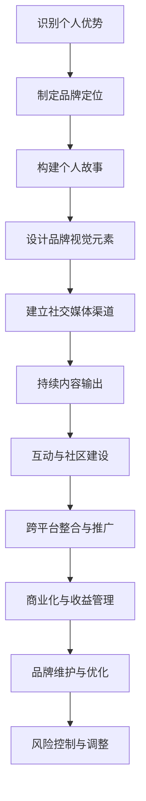

                 

### 《程序员如何打造千万美元身价的个人品牌》

> **关键词：个人品牌、程序员、品牌定位、专业技能、社交媒体、市场推广、商业化**

> **摘要：本文将探讨程序员如何通过构建个人品牌，实现千万美元身价的飞跃。文章从理解个人品牌的价值、打造个人品牌的基石、提升专业技能、构建网络影响力、市场推广与商业化、以及长期发展与维护等方面，系统性地分析并提供了实用的策略与建议。**

---

### 引言

在信息技术飞速发展的时代，编程技能成为职场中的核心能力。然而，仅仅拥有卓越的技术能力已不足以在竞争激烈的职场中脱颖而出。越来越多的程序员开始意识到，构建个人品牌是提升自身价值、实现职业发展的关键途径。个人品牌不仅能够增加个人在职场上的竞争力，还能够带来丰厚的经济回报，甚至实现千万美元身价的飞跃。

本文旨在探讨程序员如何通过打造个人品牌，实现职业与财富的双赢。我们将从以下几个部分进行详细探讨：

1. **理解个人品牌的价值和构建基础**
2. **构建个人品牌的专业能力**
3. **个人品牌的市场推广与商业化**
4. **个人品牌的长期发展与维护**

通过系统性的分析与策略指导，我们将帮助程序员们更好地理解和实践个人品牌建设，从而在职场中取得成功。

---

### 《程序员如何打造千万美元身价的个人品牌》目录大纲

#### 第一部分：理解个人品牌的价值和构建基础

##### 第1章：个人品牌的本质与价值
- 1.1 个人品牌的重要性
  - 成功的案例分析
  - 个人品牌对企业与职业发展的影响
- 1.2 品牌定位与核心价值
  - 品牌定位策略
  - 核心价值构建
- 1.3 品牌定位与市场差异化
  - 市场调研与竞争分析
  - 差异化策略

##### 第2章：打造个人品牌的基石
- 2.1 个人品牌的核心要素
  - 个人专业技能
  - 个人形象与风格
  - 个人故事与价值观
- 2.2 个人品牌的可视化元素
  - 个人标志与品牌色彩
  - 个人网站与社交媒体主页
- 2.3 个人品牌建设的基础设施
  - 个人博客与写作能力
  - 社交媒体运营与管理

#### 第二部分：构建个人品牌的专业能力

##### 第3章：提升个人专业技能
- 3.1 技术深耕与扩展
  - 技术趋势分析
  - 专业技能扩展策略
- 3.2 专业知识的深度挖掘
  - 技术深度研究
  - 专业知识分享与传播
- 3.3 专业认证与证书
  - 认证的价值
  - 如何获取相关证书

##### 第4章：构建个人品牌的网络影响力
- 4.1 社交媒体策略
  - 选择适合的平台
  - 内容策略与发布计划
- 4.2 网络影响力提升
  - 关键意见领袖合作
  - 内容营销与广告投放
- 4.3 网络互动与社区建设
  - 网络论坛与社区管理
  - 互动策略与用户参与

##### 第5章：个人品牌的跨平台整合
- 5.1 多平台策略
  - 平台间的协同与整合
  - 多平台内容一致性
- 5.2 个人品牌跨行业合作
  - 跨界合作模式
  - 跨界合作案例解析
- 5.3 个人品牌的国际化
  - 国际市场拓展策略
  - 国际化运营与品牌维护

#### 第三部分：个人品牌的市场推广与商业化

##### 第6章：个人品牌的市场推广
- 6.1 个人品牌推广策略
  - 网络广告与推广
  - 事件营销与活动策划
- 6.2 个人品牌的市场定位
  - 消费者群体分析
  - 市场定位与价值主张
- 6.3 个人品牌的粉丝经济
  - 粉丝互动与粉丝管理
  - 粉丝经济变现方式

##### 第7章：个人品牌的商业化路径
- 7.1 个人品牌的商业化模式
  - 个人品牌产品的设计
  - 个人品牌产品的营销
- 7.2 个人品牌的商业模式创新
  - IP授权与跨界合作
  - 电商与线上销售渠道
- 7.3 个人品牌的价值评估与变现
  - 个人品牌的价值评估方法
  - 个人品牌的盈利模式与收益管理

#### 第四部分：个人品牌的长期发展与维护

##### 第8章：个人品牌的长期规划
- 8.1 个人品牌发展的长期策略
  - 长期品牌愿景
  - 持续能力提升策略
- 8.2 个人品牌的调整与优化
  - 市场反馈与调整
  - 品牌元素更新与优化
- 8.3 个人品牌的传承与延续
  - 继承人培养
  - 品牌文化的传承

##### 第9章：个人品牌的危机管理与风险控制
- 9.1 个人品牌的危机管理
  - 危机识别与预警
  - 危机应对策略
- 9.2 个人品牌的法律保护
  - 知识产权保护
  - 合同法律风险控制
- 9.3 个人品牌的声誉管理
  - 媒体关系维护
  - 社交媒体声誉监控

##### 第10章：总结与展望
- 10.1 个人品牌建设的总结
  - 成功案例与经验分享
  - 常见问题与解决策略
- 10.2 个人品牌发展的展望
  - 未来趋势与机遇
  - 个人品牌成长的路径规划

#### 附录
##### 附录A：个人品牌建设工具与资源
- 10.1 主流社交媒体平台
  - 技术博客与论坛
  - 社交媒体管理工具
- 10.2 个人品牌建设相关书籍与资料
  - 个人品牌课程与培训
  - 品牌建设相关研究报告

#### Mermaid 流程图
- 个人品牌构建流程图
  mermaid
  graph TD
  A[识别个人优势] --> B[制定品牌定位]
  B --> C[构建个人故事]
  C --> D[设计品牌视觉元素]
  D --> E[建立社交媒体渠道]
  E --> F[持续内容输出]
  F --> G[互动与社区建设]
  G --> H[跨平台整合与推广]
  H --> I[商业化与收益管理]
  I --> J[品牌维护与优化]
  J --> K[风险控制与调整]
  
---

### 第一部分：理解个人品牌的价值和构建基础

#### 第1章：个人品牌的本质与价值

个人品牌，简单来说，就是个人在公众心中的形象和认知。它不仅体现了个人在专业领域的声望和认可，还包含了个人形象、价值观、风格等因素。随着互联网的普及和社交媒体的兴起，个人品牌已经成为一种重要的资产，对个人职业发展和社会影响力具有深远的影响。

**1.1 个人品牌的重要性**

首先，个人品牌能够显著提升个人的社会地位和职业吸引力。在一个高度竞争的市场环境中，拥有强大个人品牌的程序员不仅能够获得更多的工作机会，还能够获得更高的薪酬和职业晋升。例如，Twitter联合创始人比兹·斯通（Biz Stone）和LinkedIn联合创始人雷德·霍夫曼（Reid Hoffman）就是通过构建强大的个人品牌，在职业发展中获得了巨大的成功。

其次，个人品牌对企业的价值也不容忽视。一个具有强大个人品牌的程序员可以为企业带来品牌溢价和客户信任。比如，微软的比尔·盖茨（Bill Gates）和谷歌的拉里·佩奇（Larry Page）不仅个人财富丰厚，他们创立的公司也因个人品牌的力量而备受瞩目。

**1.2 品牌定位与核心价值**

构建个人品牌的第一步是明确品牌定位。品牌定位决定了个人在市场中的独特位置和价值主张。有效的品牌定位应该清晰、有力，能够准确地传达个人的专业能力和价值。

核心价值是个人品牌的重要组成部分。它指的是个人所坚持的价值观和信念，是个人行为和决策的指导原则。核心价值能够帮助个人在众多竞争者中脱颖而出，赢得信任和尊重。例如，知名程序员Linus Torvalds以其开放、创新的精神和卓越的技术能力，赢得了全球程序员社区的广泛尊敬。

**1.3 品牌定位与市场差异化**

品牌定位不仅仅是确定一个市场位置，更重要的是要实现市场差异化。在竞争激烈的市场环境中，差异化策略能够帮助个人品牌在众多竞争者中脱颖而出。

市场调研和竞争分析是品牌定位的重要环节。通过深入了解市场需求和竞争对手，个人可以找到自己的独特优势，并制定相应的差异化策略。例如，著名程序员兼企业家马克·扎克伯格（Mark Zuckerberg）通过强调Facebook的社交属性和隐私保护，成功在社交媒体市场中建立了强大的品牌定位。

总之，个人品牌是程序员在职场和市场中取得成功的关键。通过明确品牌定位、构建核心价值，并实现市场差异化，程序员可以打造出具有强大竞争力的个人品牌，从而实现职业发展和财富积累。

#### 第2章：打造个人品牌的基石

个人品牌的建立并非一蹴而就，它需要扎实的基石和系统的规划。本章将探讨个人品牌的核心要素，包括专业技能、个人形象与风格、个人故事与价值观，以及如何构建个人品牌的可视化元素，如个人标志和品牌色彩，以及个人网站与社交媒体主页。

**2.1 个人品牌的核心要素**

个人品牌的核心要素是构建个人品牌的基石。首先，个人专业技能是品牌的核心。程序员需要不断深耕技术领域，掌握前沿技术，提升自己的技术深度和广度。这不仅包括编程语言和框架，还涉及算法、数据结构、系统设计等核心技能。其次，个人形象和风格也是品牌的重要组成部分。一个专业的形象可以增强个人在公众中的可信度和吸引力。这包括着装、言行举止、沟通方式等方面。风格的一致性可以帮助个人在众多竞争者中脱颖而出。此外，个人故事与价值观也是品牌的重要元素。一个真实、有感染力的故事可以拉近与受众的距离，传递个人品牌的理念和价值。价值观则体现了个人的信念和追求，是品牌持久发展的内在动力。

**2.2 个人品牌的可视化元素**

个人品牌的可视化元素对于品牌的认知和传播至关重要。个人标志和品牌色彩是品牌视觉识别的重要组成部分。一个简洁、独特且具有象征意义的标志可以让人一眼记住，从而提升品牌的识别度。品牌色彩则能够传递品牌的情感和价值。例如，蓝色通常代表科技、专业和可靠，而绿色则代表创新和可持续。个人网站与社交媒体主页则是品牌对外展示的重要窗口。一个专业的网站不仅能够展示个人的技术能力和成就，还能提供互动和交流的平台。社交媒体主页则可以用来发布内容、与粉丝互动，以及推广个人品牌。选择适合的平台，如LinkedIn、Twitter、GitHub等，并根据平台特点制定内容策略和发布计划，是成功运营社交媒体的关键。

**2.3 个人品牌建设的基础设施**

个人品牌建设的基础设施包括个人博客、写作能力和社交媒体运营与管理。个人博客是展示个人技术深度和广度的重要平台。通过定期发布技术博客，程序员可以分享自己的经验和见解，提升自己的技术影响力。写作能力则是博客成功的关键。优秀的写作能力可以使内容更具吸引力和说服力。此外，社交媒体运营与管理也是个人品牌建设的重要环节。通过社交媒体，程序员可以与行业内的关键意见领袖建立联系，扩大自己的影响力。有效的社交媒体运营包括内容策略、互动策略和用户参与。例如，通过定期发布有价值的内容、积极回应粉丝的评论和私信，以及举办线上活动，可以提升个人品牌的粉丝经济和商业化潜力。

综上所述，个人品牌的建设是一个系统工程，需要从核心要素、可视化元素和基础设施三个方面进行全方位的规划和实施。通过不断提升专业技能、塑造专业形象、讲述真实故事、设计独特标志和色彩，以及利用博客和社交媒体等工具，程序员可以打造出具有强大竞争力和影响力的个人品牌，从而在职场和市场中脱颖而出。

#### 第3章：打造个人品牌的基石（续）

**2.3 个人品牌建设的基础设施（续）**

**个人博客与写作能力**

个人博客是构建个人品牌的重要基础设施之一。通过博客，程序员可以系统地分享自己的技术见解、项目经验和学习心得，从而建立起自己在专业领域的权威性和影响力。以下是打造成功个人博客的一些建议：

1. **内容规划与主题定位**：明确博客的主题和目标受众，确保内容具有较高的针对性和专业性。例如，可以选择某一特定领域，如人工智能、云计算或前端开发等，作为博客的主要内容方向。

2. **高质量文章撰写**：撰写高质量的文章是博客成功的核心。优秀的文章应具备清晰的结构、简洁的语言和丰富的内容。程序员可以结合具体案例、代码实现和详细解释，使文章更具实用性和吸引力。

3. **定期更新与维护**：保持博客的定期更新是建立读者忠诚度的关键。建议制定一个固定的更新计划，例如每周或每月发布一篇新文章。

**社交媒体运营与管理**

社交媒体运营在个人品牌建设中扮演着至关重要的角色。通过社交媒体，程序员可以与行业内的关键意见领袖（KOL）互动，扩大自己的影响力。以下是社交媒体运营的一些建议：

1. **平台选择**：根据个人品牌的目标和受众，选择合适的社交媒体平台。例如，GitHub和Stack Overflow适合技术交流，LinkedIn适合职业发展和人脉拓展，Twitter适合快速传播和参与热点话题。

2. **内容策略与发布计划**：制定一个明确的社交媒体内容策略和发布计划，确保内容的质量和一致性。例如，可以定期发布技术文章、项目更新、学习笔记等。

3. **互动策略与用户参与**：积极与粉丝互动，回复评论和私信，参与讨论和活动。这不仅可以提升粉丝的参与度，还可以增加个人品牌的忠诚度。

**案例研究**

以著名程序员和作家John Sonmez为例，他通过个人博客和社交媒体成功构建了自己的个人品牌。John Sonmez的博客“Simple Programmer”已成为程序员社区的知名资源之一。他的博客内容涵盖技术、职业发展和个人成长等多个方面。他不仅撰写高质量的技术文章，还定期发布关于编程生涯的建议和经验分享。此外，John Sonmez在社交媒体平台上也非常活跃，他通过Twitter和LinkedIn与读者互动，分享自己的见解和经验，吸引了大量的粉丝和关注。

通过以上案例，我们可以看到，个人博客和社交媒体运营在个人品牌建设中的重要性。成功的个人品牌需要系统的规划和持续的努力，通过高质量的内容输出和积极的互动，程序员可以逐步构建起自己的专业形象和影响力。

#### 第2章：打造个人品牌的基石

**2.1 个人品牌的核心要素**

在构建个人品牌的过程中，核心要素是确保品牌稳定性和持续性的关键。以下是构建个人品牌核心要素的详细探讨：

**个人专业技能**

个人专业技能是个人品牌的核心。作为一名程序员，技术能力是基础，但仅仅掌握基础技能是不够的。需要不断学习和掌握前沿技术，提升技术深度和广度。具体策略如下：

1. **技术深耕与扩展**：定期学习新技术，如人工智能、大数据、云计算等，保持技术前沿的敏锐度。可以通过在线课程、技术论坛、开源项目等方式进行技术扩展。
2. **实践项目**：通过实际项目应用所学知识，提升项目开发能力和解决实际问题的能力。实践是检验技术的最佳方式。
3. **专业认证与证书**：获取专业认证和证书，如PMP、AWS Certified Solutions Architect等，可以提高个人在行业内的认可度和专业水平。

**个人形象与风格**

个人形象与风格是个人品牌的外在表现。一个专业的形象可以增强个人在公众中的可信度和吸引力。以下是一些建议：

1. **着装规范**：保持整洁、得体的着装，体现专业和自信。
2. **言行举止**：在与他人交流和互动中，保持礼貌、尊重和专业，树立良好的个人形象。
3. **沟通技巧**：提高沟通技巧，包括口头和书面沟通，确保信息的准确传达和有效理解。

**个人故事与价值观**

个人故事与价值观是品牌的核心，能够传递个人品牌的理念和价值。一个真实、有感染力的故事可以拉近与受众的距离，赢得信任和支持。以下是一些建议：

1. **个人成长经历**：分享自己的成长故事和职业发展经历，展示自己的专业素养和持续学习的态度。
2. **价值观传播**：明确并传播自己的价值观，如团队合作、创新精神、诚信等，这些价值观可以成为品牌的重要组成部分。
3. **品牌故事**：构建一个独特的品牌故事，将个人技能、形象和价值观融合在一起，形成品牌的核心价值。

**2.2 个人品牌的可视化元素**

个人品牌的可视化元素对于品牌的认知和传播至关重要。以下是构建个人品牌的可视化元素的详细探讨：

**个人标志与品牌色彩**

个人标志是品牌视觉识别的核心。一个简洁、独特且具有象征意义的标志可以让人一眼记住，提升品牌的识别度。以下是设计个人标志的建议：

1. **标志设计原则**：遵循简洁性、易识别性和独特性原则。避免过于复杂的设计，确保标志在不同的应用场景中依然能够清晰传达品牌信息。
2. **色彩选择**：色彩能够传递品牌情感和价值。选择与个人风格和品牌定位相符合的色彩，如蓝色代表科技和专业，绿色代表创新和生态。

**个人网站与社交媒体主页**

个人网站和社交媒体主页是品牌对外展示的重要窗口。一个专业的网站不仅可以展示个人技能和成就，还能提供互动和交流的平台。以下是构建个人网站和社交媒体主页的建议：

1. **网站结构**：确保网站结构清晰、导航方便。主页应简洁明了，展示个人介绍、技术领域、项目经验和联系信息。
2. **内容更新**：定期更新网站内容，保持网站的活跃度和新鲜感。可以设置博客、新闻动态、项目展示等板块。
3. **社交媒体策略**：选择适合的社交媒体平台，制定内容策略和发布计划。通过高质量的内容输出和互动，提升个人品牌的粉丝数量和影响力。

综上所述，构建个人品牌需要从专业技能、个人形象与风格、个人故事与价值观，以及可视化元素等多个方面进行全方位的规划和实施。通过不断提升专业技能、塑造专业形象、讲述真实故事、设计独特标志和色彩，以及利用网站和社交媒体等工具，程序员可以打造出具有强大竞争力和影响力的个人品牌，从而在职场和市场中脱颖而出。

### 第二部分：构建个人品牌的专业能力

#### 第3章：提升个人专业技能

在构建个人品牌的过程中，专业技能的提升是至关重要的环节。作为一名程序员，技术能力的深度和广度不仅决定了个人在职场中的竞争力，也是建立个人品牌的基石。本章将详细探讨如何通过技术深耕与扩展、专业知识的深度挖掘，以及专业认证与证书的获取，来提升个人专业技能。

**3.1 技术深耕与扩展**

技术深耕与扩展是程序员提升专业技能的核心策略。通过持续学习和实践，程序员可以不断提升自己的技术深度和广度，从而在专业领域中脱颖而出。

**技术深耕**：
- **掌握核心技术**：精通一门或多门编程语言，如Java、Python、JavaScript等。对于每个语言，不仅要掌握其基础语法和常用库，还要深入理解其底层原理和应用场景。
- **项目实践**：参与实际项目，将所学知识应用到实践中。通过项目实践，不仅可以提高问题解决能力，还能积累宝贵的经验。

**技术扩展**：
- **关注新兴技术**：保持对新兴技术的关注，如人工智能、区块链、云计算等。通过阅读技术文章、参加技术会议和培训，了解新技术的发展趋势和应用场景。
- **学习跨领域知识**：拓展技术视野，学习跨领域的知识，如操作系统、网络编程、数据库管理等。这些跨领域知识可以提升程序员的全局视野和综合能力。

**3.2 专业知识的深度挖掘**

专业知识的深度挖掘是提升个人专业技能的另一个关键策略。通过深入研究特定技术领域，程序员可以成为该领域的专家，从而在市场中树立自己的专业形象。

**深度研究**：
- **专题研究**：选择一个具体的技术领域进行深入研究，如大数据处理、机器学习算法、前端开发框架等。通过阅读专业书籍、论文和技术博客，掌握该领域的核心知识和最新进展。
- **项目实践**：在实际项目中应用所学的深度知识，解决复杂问题。项目实践是验证和巩固知识的重要途径。

**知识分享与传播**：
- **撰写技术博客**：通过撰写技术博客，将研究心得和经验分享给他人。这不仅可以帮助自己巩固知识，还可以提升自己的写作和表达能力。
- **参与开源项目**：参与开源项目，与他人合作解决技术难题。通过开源项目，程序员可以积累实战经验，提升技术能力，同时扩大自己的影响力。

**3.3 专业认证与证书**

专业认证和证书是程序员提升专业认可度的重要手段。通过获取专业认证，程序员可以证明自己在某一领域的专业水平和能力。

**认证的价值**：
- **职业发展**：专业认证可以提升个人在职业发展中的竞争力，帮助获得更好的职位和更高的薪酬。
- **行业认可**：专业认证是行业内外对个人专业能力的认可，可以增强个人在市场中的可信度和权威性。

**如何获取相关证书**：
- **选择认证方向**：根据个人职业规划和市场需求，选择合适的认证方向。例如，云计算、大数据、人工智能等。
- **准备学习计划**：制定详细的学习计划，确保有足够的时间和精力进行学习和复习。可以通过在线课程、自学教材、培训课程等方式进行学习。
- **参加认证考试**：按照学习计划进行复习，参加认证考试。考试合格后，即可获得相关证书。

**案例研究**

以著名程序员兼创业家帕特里克·凯西（Patrick O'Shea）为例，他通过不断的技术深耕和扩展，成功在多个技术领域建立了自己的专业形象。Patrick O'Shea在云计算和大数据领域都有深厚的积累，他通过撰写高质量的技术博客和参与开源项目，不断提升自己的技术影响力。此外，他还获得了多个专业认证，如AWS Certified Solutions Architect、Google Certified Professional Data Engineer等，这些认证不仅提升了他的专业认可度，也为他在职业发展中带来了诸多机会。

总之，通过技术深耕与扩展、专业知识的深度挖掘，以及专业认证与证书的获取，程序员可以不断提升自己的专业技能，从而在构建个人品牌的过程中取得成功。

#### 第4章：构建个人品牌的网络影响力

在数字化时代，网络影响力成为个人品牌的重要组成部分。作为一名程序员，构建强大的网络影响力不仅有助于提升个人知名度，还能扩大职业机会和收入来源。本章将详细探讨如何通过社交媒体策略、网络影响力提升，以及网络互动与社区建设，来构建个人品牌的网络影响力。

**4.1 社交媒体策略**

社交媒体是构建网络影响力的重要工具。选择适合的平台、制定内容策略和发布计划是成功运营社交媒体的关键。

**选择适合的平台**

不同社交媒体平台具有不同的特点和受众，因此选择适合的平台至关重要。以下是一些常见的社交媒体平台及其适用场景：

- **LinkedIn**：适合职业发展和人脉拓展。可以发布职业文章、参与行业讨论，建立专业人脉网络。
- **Twitter**：适合快速传播和参与热点话题。可以关注行业领袖和同行，参与讨论和分享有价值的信息。
- **GitHub**：适合技术交流和项目展示。可以参与开源项目，展示个人技术成果，吸引潜在雇主和合作机会。
- **Stack Overflow**：适合技术问答和问题解决。可以解答问题、撰写技术文章，提升技术影响力和知名度。

**内容策略与发布计划**

制定明确的内容策略和发布计划是社交媒体运营成功的关键。以下是一些建议：

- **内容类型**：发布多种类型的内容，如技术博客、项目展示、学习笔记、职业经验分享等。多样化的内容可以吸引不同类型的读者，增加用户粘性。
- **发布频率**：保持一定的发布频率，如每周至少发布一篇文章或更新一次项目。定期更新可以维持用户的关注和互动。
- **互动策略**：积极与粉丝和读者互动，回复评论、私信，参与讨论。互动不仅能够提升用户参与度，还能增强粉丝对个人品牌的忠诚度。

**4.2 网络影响力提升**

提升网络影响力是构建个人品牌的重要环节。以下是一些提升网络影响力的方法：

**关键意见领袖合作**

与关键意见领袖（KOL）合作是快速提升网络影响力的一种有效方式。以下是一些建议：

- **建立联系**：通过社交媒体、行业会议等方式，与KOL建立联系。可以私信、留言，或者参加他们举办的线下活动。
- **合作内容**：与KOL合作，共同创作内容，如技术博客、视频教程、在线研讨会等。合作内容可以借助KOL的影响力，迅速吸引大量读者和观众。
- **互相推广**：在合作内容中互相推广，如提及对方的个人品牌、链接到对方的内容等。这不仅可以增加双方的网络影响力，还能扩大受众范围。

**内容营销与广告投放**

内容营销和广告投放是提升网络影响力的另一种有效方式。以下是一些建议：

- **内容营销**：通过高质量的内容吸引读者和粉丝，例如撰写专业博客、发布技术教程、举办线上研讨会等。内容营销不仅能够提升品牌知名度，还能增强用户对品牌的信任。
- **广告投放**：利用社交媒体平台的广告投放功能，向目标受众推广个人品牌。选择合适的广告形式，如图文广告、视频广告等，可以精准定位潜在粉丝，提高广告效果。

**4.3 网络互动与社区建设**

网络互动与社区建设是维护和提升个人品牌的重要环节。以下是一些网络互动与社区建设的方法：

**网络论坛与社区管理**

- **参与论坛和社区**：积极参与技术论坛和社区，如Stack Overflow、GitHub等，分享自己的知识和经验，帮助他人解决问题。这不仅可以提升个人影响力，还能扩大人脉网络。
- **建立个人社区**：建立自己的技术社区或论坛，为读者和粉丝提供互动和交流的平台。可以通过定期的技术讨论、问答环节等方式，增强社区的活跃度和用户粘性。

**互动策略与用户参与**

- **互动策略**：制定互动策略，如定期举办线上技术讲座、问答环节、代码挑战等，激发用户参与和互动。
- **用户参与**：鼓励用户参与内容创作，如征集技术文章、项目案例等。用户参与不仅能够增加内容的多样性，还能增强用户的归属感和忠诚度。

**案例研究**

以知名程序员和博主Annie Liu为例，她通过社交媒体和社区建设，成功构建了自己的个人品牌。Annie Liu在LinkedIn上发布了大量高质量的技术博客，分享了她的编程经验和职业发展心得。她与行业内的关键意见领袖合作，共同创作内容，借助KOL的影响力迅速吸引了大量粉丝。此外，她还在GitHub上积极参与开源项目，展示了自己的技术实力。通过这些方式，Annie Liu成功提升了自己的网络影响力，并在职业发展中获得了诸多机会。

总之，构建个人品牌的网络影响力需要系统的规划和持续的努力。通过社交媒体策略、网络影响力提升和网络互动与社区建设，程序员可以逐步扩大自己的影响力和知名度，从而在职业发展中取得更大的成功。

### 第5章：个人品牌的跨平台整合

在数字化时代，跨平台整合策略对于个人品牌的构建至关重要。通过整合多个平台，程序员可以实现内容的一致性、扩大受众范围，并提升整体影响力。本章将探讨如何制定多平台策略、实现平台间的协同与整合，以及如何构建个人品牌的国际化。

**5.1 多平台策略**

**选择合适的平台**

选择合适的社交媒体平台是跨平台整合的第一步。根据个人品牌的定位和目标受众，可以选择以下几种平台：

- **专业平台**：如LinkedIn、GitHub和Stack Overflow，适合展示专业能力和项目经验。
- **大众平台**：如Twitter、Instagram和YouTube，适合发布吸引眼球的内容和视频。
- **内容平台**：如Medium、Dev.to和博客园，适合发布技术文章和深度分析。

**内容策略与发布计划**

制定多平台的内容策略和发布计划，可以确保内容在不同平台上的传播效果。以下是一些建议：

- **统一内容主题**：确保不同平台上的内容主题保持一致，传递相同的品牌信息。
- **定制内容格式**：根据每个平台的特点，调整内容的格式和呈现方式。例如，在LinkedIn上发布专业博客，在Instagram上发布图文结合的展示内容。
- **同步发布时间**：制定统一的发布时间表，确保在不同平台上的内容能够同时发布，提升传播效果。

**5.2 平台间的协同与整合**

**内容一致性**

内容一致性是跨平台整合的关键。以下是一些建议确保内容在不同平台上的一致性：

- **品牌风格**：保持统一的品牌风格，包括字体、颜色和标识。这有助于提升品牌识别度，增强用户对品牌的认知。
- **内容主题**：确保内容主题在不同平台上的连贯性，传递相同的品牌信息。
- **语言风格**：使用简洁、清晰的语言风格，确保内容在不同平台上的可读性和吸引力。

**互动策略**

通过跨平台的互动策略，可以提升用户参与度和品牌忠诚度。以下是一些建议：

- **跨平台活动**：举办跨平台的活动，如在线研讨会、直播问答等，吸引更多用户参与。
- **互动链接**：在不同平台上的内容中，添加互动链接，引导用户访问其他平台。
- **粉丝互动**：定期回复粉丝的评论和私信，增强与粉丝的互动和联系。

**5.3 个人品牌的国际化**

**国际市场拓展策略**

国际市场拓展是提升个人品牌影响力的重要途径。以下是一些建议：

- **多语言内容**：制作多语言内容，吸引不同国家和地区的读者和粉丝。
- **本地化策略**：根据不同国家和地区的文化特点，调整内容策略和推广方式，以更好地适应当地市场。
- **国际合作**：与国际知名博主、技术专家和行业组织建立合作关系，共同推广个人品牌。

**国际化运营与品牌维护**

国际化运营和维护是确保个人品牌持续发展的关键。以下是一些建议：

- **全球受众分析**：通过数据分析，了解全球受众的特点和需求，调整内容策略和推广方式。
- **国际活动参与**：参加国际技术会议和研讨会，展示个人品牌，扩大国际影响力。
- **品牌文化传播**：传递具有全球吸引力的品牌文化，增强国际受众对品牌的认同和忠诚度。

**案例研究**

以知名程序员兼创业家张小龙（张小龙）为例，他通过多平台整合和国际市场拓展，成功构建了自己的个人品牌。张小龙在LinkedIn、Twitter、GitHub等多个平台上活跃，发布高质量的技术文章和项目展示。他在内容上保持一致性，使用统一的品牌风格和主题，吸引了大量的读者和粉丝。此外，张小龙通过参与国际技术会议和合作项目，提升了个人品牌的国际影响力。通过这些方式，张小龙成功将自己的个人品牌扩展到了全球市场。

总之，跨平台整合策略对于个人品牌的构建至关重要。通过选择合适的平台、确保内容一致性，以及实现国际化运营，程序员可以提升个人品牌的全球影响力，实现职业和财富的双赢。

### 第6章：个人品牌的市场推广

在构建个人品牌的过程中，市场推广是至关重要的环节。通过有效的推广策略，程序员可以扩大个人品牌的影响力，吸引更多的粉丝和潜在雇主。本章将详细探讨个人品牌推广的策略、市场定位以及粉丝经济。

**6.1 个人品牌推广策略**

**网络广告与推广**

网络广告是一种高效的推广手段，可以通过各种广告平台进行精准投放。以下是一些建议：

- **选择合适的广告平台**：如Google Ads、Facebook Ads等，根据目标受众的特点选择最合适的平台。
- **定位广告目标**：通过设定特定的广告目标和定位，如年龄段、兴趣、地理位置等，确保广告精准投放。
- **优化广告内容**：制作吸引人的广告内容，包括标题、描述、图片等，以提高点击率和转化率。
- **跟踪广告效果**：定期监控广告的数据表现，如点击率、转化率等，根据数据调整广告策略，优化推广效果。

**事件营销与活动策划**

事件营销是一种通过策划和举办特定活动来提升品牌知名度和影响力的方式。以下是一些建议：

- **选择适合的活动形式**：如技术研讨会、线上讲座、代码挑战赛等，根据个人品牌的定位和目标受众选择合适的形式。
- **策划有吸引力的内容**：确保活动内容具有吸引力和互动性，如提供实用技术分享、互动问答、免费试用等。
- **充分利用社交媒体**：在社交媒体平台上宣传和推广活动，吸引更多用户参与。可以通过发布活动预告、互动话题、实时直播等方式，增强用户参与度。

**合作推广**

与合作者进行推广可以扩大个人品牌的影响力。以下是一些建议：

- **寻找合适的合作者**：如其他知名程序员、技术社区、行业媒体等，确保合作者与个人品牌定位相符。
- **制定合作方案**：与合作者共同制定推广方案，如共同发布技术文章、联合举办活动等。
- **互惠互利**：确保合作方案能够实现双方的共赢，提升品牌影响力。

**6.2 个人品牌的市场定位**

市场定位是个人品牌推广的基础。以下是如何进行市场定位的一些建议：

**消费者群体分析**

- **目标受众分析**：明确目标受众的特点和需求，如年龄、职业、兴趣爱好等。
- **市场调研**：通过问卷调查、数据分析等方式，了解目标受众的偏好和需求，为市场定位提供数据支持。
- **竞争分析**：分析竞争对手的市场定位和策略，找到自身的差异化优势。

**市场定位与价值主张**

- **明确市场定位**：根据消费者群体分析和竞争分析，明确个人品牌的市场定位。例如，可以定位为技术专家、开源领袖、编程导师等。
- **制定价值主张**：明确个人品牌能为目标受众提供什么价值，如技术指导、项目合作、职业发展建议等。

**差异化策略**

差异化策略是确保个人品牌在市场中脱颖而出的关键。以下是一些建议：

- **技术差异化**：通过掌握前沿技术和独特的解决方案，在技术领域树立差异化优势。
- **内容差异化**：通过撰写独特、有价值的技术文章和分享，为受众提供独特的价值。
- **形象差异化**：通过独特的个人形象和风格，在公众中树立差异化印象。

**6.3 个人品牌的粉丝经济**

粉丝经济是个人品牌市场推广的重要组成部分。以下是如何进行粉丝经济的一些建议：

**粉丝互动与粉丝管理**

- **互动策略**：通过社交媒体、博客、直播等方式与粉丝互动，了解粉丝的需求和反馈，提升粉丝参与度。
- **粉丝管理**：建立粉丝数据库，定期与粉丝沟通，提供个性化的服务和建议。

**粉丝经济变现方式**

- **内容付费**：通过提供高质量、有价值的付费内容，如在线课程、电子书等，实现粉丝经济变现。
- **产品销售**：通过开发个人品牌产品，如编程工具、T恤等，实现产品销售变现。
- **广告合作**：通过为品牌或产品进行推广，获取广告收益。

总之，通过有效的市场推广策略、明确的市场定位以及粉丝经济变现方式，程序员可以扩大个人品牌的影响力，实现职业和财富的双赢。

### 第7章：个人品牌的商业化路径

个人品牌的商业化是程序员实现财富积累和职业发展的关键步骤。本章将探讨个人品牌的商业化模式、商业模式创新，以及个人品牌的价值评估与变现。

**7.1 个人品牌的商业化模式**

**个人品牌产品的设计**

个人品牌产品的设计是商业化过程的第一步。设计产品时，需要考虑以下因素：

- **市场需求**：了解目标受众的需求，如技术工具、书籍、在线课程等。
- **独特性**：确保产品具有独特性，能够满足目标受众的需求，并提供额外的价值。
- **用户体验**：注重用户体验，确保产品易用、高效、有吸引力。

**个人品牌产品的营销**

成功的产品营销是商业化的关键。以下是一些建议：

- **内容营销**：通过博客、社交媒体、电子邮件等方式，发布与产品相关的优质内容，吸引潜在客户。
- **广告投放**：利用广告平台，如Google Ads、Facebook Ads等，进行精准投放，扩大产品影响力。
- **合作伙伴**：与行业内的知名博主、技术社区、教育机构等合作，共同推广产品。

**7.2 个人品牌的商业模式创新**

**IP授权与跨界合作**

IP授权和跨界合作是个人品牌商业模式的创新途径。以下是一些建议：

- **IP授权**：将个人品牌形象、技术成果等授权给其他公司或个人使用，实现品牌价值的扩展。例如，将个人品牌的编程工具授权给开源社区，或将自己的技术专利授权给其他企业。
- **跨界合作**：与其他行业的品牌或个人进行合作，实现资源整合和互补。例如，与技术公司合作开发技术产品，与时尚品牌合作推出联名产品等。

**电商与线上销售渠道**

电商和线上销售渠道是个人品牌商业化的重要途径。以下是一些建议：

- **建立自己的电商平台**：建立独立的电商网站，展示和销售个人品牌产品。
- **利用第三方电商平台**：如淘宝、京东等，拓宽销售渠道，吸引更多客户。
- **线上营销活动**：举办线上促销活动，如限时折扣、团购等，提高产品销量。

**7.3 个人品牌的价值评估与变现**

**个人品牌的价值评估方法**

评估个人品牌的价值是商业化过程中的重要步骤。以下是一些建议：

- **财务分析**：通过分析个人品牌的收入、利润、增长率等财务数据，评估品牌的经济价值。
- **市场调研**：通过市场调研，了解个人品牌在市场上的认可度和影响力，评估品牌的潜力。
- **竞争对手分析**：分析竞争对手的品牌价值，参考其商业模式和市场表现，为个人品牌的价值评估提供参考。

**个人品牌的盈利模式与收益管理**

构建有效的盈利模式和管理收益是个人品牌商业化的关键。以下是一些建议：

- **多元化盈利模式**：通过多种渠道获取收入，如产品销售、广告合作、咨询服务等。多样化的盈利模式可以降低风险，提高收入稳定性。
- **收益管理**：制定合理的收益管理策略，确保收益的持续增长。例如，通过优化成本结构、提升产品附加值、扩大市场份额等方式，提高收益水平。

**案例研究**

以知名程序员和博主John Sonmez为例，他通过个人品牌的商业化实现了财富积累和职业发展。John Sonmez通过开发在线课程、出版书籍和提供咨询服务等途径，实现了个人品牌的商业化。他的在线课程涵盖了编程、职业发展和个人成长等多个领域，吸引了大量的学员。此外，他还通过撰写技术博客和参与开源项目，提升了个人品牌的影响力。通过这些方式，John Sonmez成功地将个人品牌转化为商业价值，实现了财富和职业的双赢。

总之，个人品牌的商业化路径需要系统性的规划和实施。通过设计个人品牌产品、创新商业模式，以及评估和变现个人品牌价值，程序员可以实现财富积累和职业发展的目标。

### 第8章：个人品牌的长期发展与维护

个人品牌的建设是一个长期的过程，需要持续的努力和策略调整。本章将探讨如何进行个人品牌的长期规划、调整与优化，以及个人品牌的传承与延续。

**8.1 个人品牌发展的长期策略**

**长期品牌愿景**

制定长期品牌愿景是个人品牌发展的基础。一个清晰的长期品牌愿景能够为个人品牌的发展提供方向和动力。以下是制定长期品牌愿景的一些建议：

- **明确目标**：设定具体、可衡量的长期目标，如实现财富自由、成为行业专家、影响全球程序员社区等。
- **持续学习**：保持对前沿技术和市场趋势的关注，不断提升个人技能和知识储备，确保个人品牌始终处于行业前沿。
- **品牌差异化**：在长期发展中，保持品牌差异化，通过独特的技术专长、创新思维或专业服务，在市场中脱颖而出。

**持续能力提升策略**

持续能力提升是长期品牌发展的关键。以下是一些策略：

- **技术深耕与扩展**：不断学习新技术，提升技术深度和广度，确保在专业领域保持竞争力。
- **跨领域知识积累**：拓展跨领域知识，如管理学、心理学、市场营销等，提升综合能力，为个人品牌的多元化发展打下基础。
- **实践与分享**：通过实际项目实践和经验分享，巩固专业知识，同时提升个人品牌的影响力和知名度。

**8.2 个人品牌的调整与优化**

**市场反馈与调整**

及时获取市场反馈并进行调整是个人品牌持续发展的关键。以下是一些方法：

- **用户调研**：定期进行用户调研，了解受众的需求和期望，及时调整品牌策略和产品定位。
- **数据分析**：通过数据分析工具，监控个人品牌在不同平台的表现，如点击率、转化率、用户留存率等，根据数据调整推广策略和内容输出。
- **反馈机制**：建立反馈机制，如在线问卷调查、用户反馈表单等，鼓励用户提供意见和建议，为品牌优化提供参考。

**品牌元素更新与优化**

品牌元素更新与优化是保持品牌活力和吸引力的关键。以下是一些更新建议：

- **视觉元素**：定期更新个人标志、网站设计等视觉元素，确保品牌形象与时俱进。
- **内容策略**：根据市场变化和用户反馈，调整内容策略，如增加视频教程、直播分享等多样化的内容形式。
- **品牌故事**：随着个人成长和职业发展，更新品牌故事，确保品牌形象的真实性和一致性。

**8.3 个人品牌的传承与延续**

**品牌文化的传承**

品牌文化的传承是个人品牌长期发展的重要保障。以下是一些建议：

- **文化构建**：明确品牌文化，如价值观、使命和愿景，确保品牌文化具有独特的内涵和鲜明的个性。
- **文化传播**：通过内部培训和外部传播，将品牌文化传递给团队成员和受众，增强品牌文化的认同感。
- **文化传承**：在品牌发展的过程中，注重文化的传承和创新，确保品牌文化能够与时俱进，持续吸引和凝聚人才。

**继承人培养**

为个人品牌的长期发展，培养合适的继承人至关重要。以下是一些建议：

- **内部选拔**：在团队中选拔具备潜力和能力的成员，进行针对性培养，为品牌传承做好准备。
- **导师制度**：建立导师制度，由资深成员指导新成员，帮助其快速成长。
- **接班计划**：制定明确的接班计划，确保在关键时刻有合适的接班人能够接手品牌发展。

总之，个人品牌的长期发展与维护需要明确的长期策略、持续的能力提升、及时的市场反馈与调整，以及品牌文化的传承和继承人培养。通过这些措施，程序员可以确保个人品牌在长期发展中保持活力和影响力。

### 第9章：个人品牌的危机管理与风险控制

在个人品牌的建设过程中，危机管理与风险控制是不可或缺的重要环节。一个精心构建的个人品牌可能会因为各种外部和内部因素而面临危机，如负面评论、隐私泄露、竞争对手攻击等。有效的危机管理不仅能迅速应对突发事件，还能维护个人品牌的声誉，确保其长期健康发展。

**9.1 个人品牌的危机管理**

**危机识别与预警**

危机管理的第一步是识别潜在危机并建立预警机制。以下是一些策略：

- **定期监控**：利用社交媒体监控工具，如Brandwatch、Hootsuite等，定期监控社交媒体上的讨论和话题，及时发现负面信息。
- **舆情分析**：通过舆情分析工具，分析网络上的趋势和话题，识别可能引发的危机。
- **内部预警**：建立内部预警机制，如设立专门的公关团队或危机管理小组，负责监控品牌声誉，及时识别和应对危机。

**危机应对策略**

一旦危机发生，迅速而有效的应对是关键。以下是一些应对策略：

- **快速响应**：在危机发生后，立即采取行动，发布声明或回应，以展示品牌对危机的重视和负责任的态度。
- **透明沟通**：与公众保持透明沟通，公开、诚实地面对问题，解释事件原因和解决措施，以赢得公众的理解和信任。
- **合作与调解**：与相关方进行沟通和协商，寻求解决问题的最佳途径。例如，与竞争对手合作解决问题，或通过调解机构解决纠纷。

**9.2 个人品牌的法律保护**

**知识产权保护**

保护个人品牌的知识产权是防止品牌被侵犯的关键。以下是一些保护措施：

- **商标注册**：在相关国家和地**区注册商标，确保个人品牌的独特性和法律保护。
- **版权保护**：对于原创内容，如技术博客、书籍、代码等，通过版权登记和版权声明，防止他人未经授权使用。
- **专利申请**：对于具有创新性的技术成果，考虑申请专利，保护技术独占权。

**合同法律风险控制**

在合作和业务往来中，合同法律风险控制至关重要。以下是一些措施：

- **合同审查**：聘请专业律师审查合同，确保合同条款公正、合理，保护个人品牌的权益。
- **签署保密协议**：在与合作伙伴、雇员或客户签订合同时，要求签署保密协议，防止商业机密泄露。
- **法律咨询**：定期咨询专业法律顾问，了解最新的法律动态和风险控制策略，确保个人品牌在法律层面得到有效保护。

**9.3 个人品牌的声誉管理**

**媒体关系维护**

媒体关系维护是个人品牌声誉管理的重要部分。以下是一些建议：

- **建立联系**：与记者、编辑和其他媒体人士建立良好的关系，保持信息畅通，确保在媒体曝光时能够得到正面报道。
- **提供素材**：为媒体提供高质量的新闻素材和故事线索，提升个人品牌的曝光率和知名度。
- **危机公关**：在危机发生时，及时与媒体沟通，提供全面的信息和解释，确保媒体能够准确报道事件。

**社交媒体声誉监控**

社交媒体声誉监控是维护个人品牌声誉的关键。以下是一些建议：

- **定期监控**：利用社交媒体监控工具，定期监控社交媒体上的讨论和话题，及时发现和处理负面评论和不良信息。
- **积极回应**：对于负面评论和不良信息，及时回应，解释原因，提供解决方案，展示个人品牌的积极态度和责任感。
- **内容审核**：在发布内容前进行严格审核，确保内容符合个人品牌的价值观和形象，避免产生负面影响。

**案例研究**

以知名程序员兼创业家帕特里克·凯西（Patrick O'Shea）为例，他成功应对了一次关于其在线课程价格的负面评论危机。在一次社交媒体讨论中，有人质疑其课程价格过高。Patrick O'Shea迅速回应，详细解释了课程定价的依据和所提供价值的合理性，同时提供了折扣优惠，以示诚意。他还主动与用户沟通，了解他们的需求和反馈，优化课程内容和服务。通过这一系列的措施，Patrick O'Shea不仅成功平息了负面评论，还增强了用户对个人品牌的信任和忠诚度。

总之，个人品牌的危机管理和风险控制需要系统性的规划和持续的努力。通过识别潜在危机、及时应对、法律保护、声誉管理等多方面的措施，程序员可以确保个人品牌在面临各种挑战时能够稳健发展。

### 第10章：总结与展望

在数字化时代，个人品牌成为程序员在职业发展中脱颖而出的重要资产。通过构建强大的个人品牌，程序员不仅能够提升职业竞争力，还能实现财富积累和持续发展。本文从理解个人品牌的价值、构建个人品牌的基石、提升专业技能、网络影响力建设、市场推广与商业化，以及长期发展与维护等方面，系统性地分析了程序员如何打造千万美元身价的个人品牌。

**成功案例与经验分享**

成功构建个人品牌的程序员不乏其人。例如，John Sonmez通过撰写高质量的技术博客和开发在线课程，成功打造了自己的个人品牌，并在多个平台上积累了大量粉丝。同样，Patrick O'Shea通过分享编程经验和创业故事，在社交媒体上建立了强大的影响力。这些成功案例展示了个人品牌建设的关键要素和策略。

**常见问题与解决策略**

在个人品牌建设过程中，程序员可能会遇到一些常见问题，如时间管理困难、内容创作缺乏灵感、品牌定位不清晰等。以下是针对这些问题的一些建议：

1. **时间管理困难**：制定明确的工作计划和目标，合理分配时间，确保个人品牌建设与日常工作相结合。
2. **内容创作缺乏灵感**：定期阅读技术书籍、关注行业动态、参与技术讨论，从多方面获取灵感，丰富内容创作。
3. **品牌定位不清晰**：进行市场调研和竞争分析，明确个人品牌的核心价值和市场定位，确保品牌形象的一致性和独特性。

**未来趋势与机遇**

随着人工智能、大数据、区块链等前沿技术的快速发展，个人品牌建设也面临着新的机遇和挑战。以下是一些未来趋势与机遇：

1. **技术跨界融合**：程序员可以通过学习跨领域知识，如数据分析、产品设计等，实现个人品牌的多元化发展。
2. **内容形式多样化**：利用短视频、直播、虚拟现实等新兴内容形式，提升个人品牌的传播效果和用户参与度。
3. **全球化拓展**：通过多语言内容创作和国际合作，将个人品牌影响力扩展到全球市场，吸引更多国际受众。

**个人品牌成长的路径规划**

构建个人品牌是一个长期的过程，需要系统性的规划和持续的努力。以下是一个简单的个人品牌成长路径规划：

1. **明确目标与定位**：设定个人品牌的目标和定位，确保品牌形象的一致性和独特性。
2. **专业技能提升**：通过学习和实践，不断提升专业技能，为个人品牌提供坚实的基础。
3. **内容创作与输出**：定期发布高质量的内容，如技术博客、项目展示、经验分享等，提升个人品牌的知名度和影响力。
4. **网络影响力建设**：通过社交媒体、网络论坛、技术社区等渠道，建立网络影响力，吸引更多粉丝和关注。
5. **市场推广与商业化**：制定有效的市场推广策略，实现个人品牌的商业化，创造经济价值。
6. **长期发展维护**：持续优化个人品牌，进行市场反馈和调整，确保品牌形象与市场需求保持一致。

通过以上路径规划，程序员可以逐步构建和提升个人品牌，实现职业发展和财富积累的目标。

### 附录A：个人品牌建设工具与资源

在个人品牌建设过程中，利用适当的工具和资源可以大大提高效率和效果。以下是一些常用的工具与资源：

**10.1 主流社交媒体平台**

- **技术博客与论坛**：
  - **GitHub**：用于展示开源项目和代码。
  - **Stack Overflow**：全球最大的技术问答社区。
  - **Medium**：高质量内容创作和分享平台。
  - **Dev.to**：面向开发者的技术博客平台。

- **社交媒体管理工具**：
  - **Hootsuite**：用于社交媒体的监控和内容发布。
  - **Buffer**：自动化社交媒体内容发布工具。
  - **Canva**：图形设计工具，用于制作视觉内容。

**10.2 个人品牌建设相关书籍与资料**

- **个人品牌课程与培训**：
  - **Coursera**：提供有关个人品牌建设的在线课程。
  - **Udemy**：提供各种个人品牌建设相关的培训课程。

- **品牌建设相关研究报告**：
  - **Forbes**：定期发布有关个人品牌建设的报告和文章。
  - **LinkedIn Learning**：提供关于职业发展和个人品牌建设的丰富资源。
  - **eMarketer**：市场研究和分析报告，提供个人品牌建设的市场趋势和策略。

通过利用这些工具和资源，程序员可以更加系统地构建和提升个人品牌，实现职业和财富的双赢。

### Mermaid 流程图

以下是一个个人品牌构建流程的Mermaid流程图，展示了从识别个人优势到品牌维护与优化的各个步骤：

通过这张流程图，程序员可以清晰地看到个人品牌构建的完整路径，确保每个步骤都得到有效的实施和优化。

