                 

### 文章标题

“程序员知识付费：打造实践型课程”

### 关键词

- 程序员知识付费
- 实践型课程
- 内容创建
- 平台建设
- 商业模式
- 案例分析
- 未来趋势

### 摘要

本文旨在深入探讨程序员知识付费领域的现状、模式、内容创建方法、平台建设、商业模式及未来趋势。通过详细分析市场现状、探讨多种付费模式，以及讲解内容创作、平台建设的实践方法，本文将帮助程序员和内容创作者了解如何打造具有实际应用价值的知识付费课程，提升自身竞争力并满足市场需求。同时，通过案例分析总结经验教训，展望未来趋势，为读者提供全方位的指导。

### 第一部分：程序员知识付费概述

#### 第1章：程序员知识付费市场分析

##### 1.1 程序员知识付费的定义

程序员知识付费，指的是程序员或相关技术专家将自身积累的专业知识和技能，通过在线课程、电子书籍、直播授课等形式，向学习者提供有偿学习内容的一种商业模式。这种模式不仅涵盖了传统的教育培训，还包括了个性化、定制化的知识分享服务。

##### 1.2 程序员知识付费市场现状

近年来，随着互联网技术的快速发展，在线教育和知识付费市场迎来了爆发式增长。程序员作为互联网时代的中坚力量，其知识付费市场也呈现出如下特点：

1. **用户基数庞大**：随着科技产业的不断壮大，程序员队伍持续扩大，对专业知识的需求日益增长。
2. **内容丰富多样**：从编程语言、框架技术到软技能，知识付费内容涵盖了程序员职业发展的方方面面。
3. **平台竞争激烈**：国内外知名平台如Coursera、Udemy、网易云课堂等，以及各类垂直领域的知识付费平台不断涌现，竞争日趋激烈。
4. **付费习惯逐步养成**：随着用户对在线教育的认可度提高，知识付费已经成为程序员们提升技能、扩展知识的重要途径。

##### 1.3 程序员知识付费的发展趋势

1. **技术驱动**：人工智能、大数据等前沿技术的普及，将推动知识付费内容向更专业化、个性化方向发展。
2. **内容多元化**：不仅限于编程技能，软技能、管理能力、职业规划等领域的知识付费内容将逐渐受到关注。
3. **市场细分**：针对不同层次和领域的程序员，知识付费平台将提供更加细分和定制化的课程和服务。
4. **平台融合**：知识付费平台将与社区、工具等多种服务进行融合，提供一站式解决方案。
5. **国际化发展**：随着国内程序员的知识需求不断国际化，知识付费市场将逐渐走向全球化。

##### 1.4 程序员知识付费的挑战与机遇

1. **内容质量**：高质量的内容是知识付费市场的核心，内容创作者需要不断提升自身的专业能力和内容制作水平。
2. **市场竞争**：随着知识付费平台的增多，市场竞争将越来越激烈，如何脱颖而出成为关键。
3. **用户需求变化**：用户需求多样化，内容创作者需要紧跟市场趋势，快速调整和优化内容。
4. **技术更新迭代**：技术的快速发展，要求内容创作者持续更新和提升自己的知识储备。

然而，机遇与挑战并存。对于有志于从事知识付费的程序员来说，抓住市场需求，不断提升自身竞争力，将有机会在知识付费市场中获得成功。

**1.5 知识付费的核心概念联系图（Mermaid 流程图）**

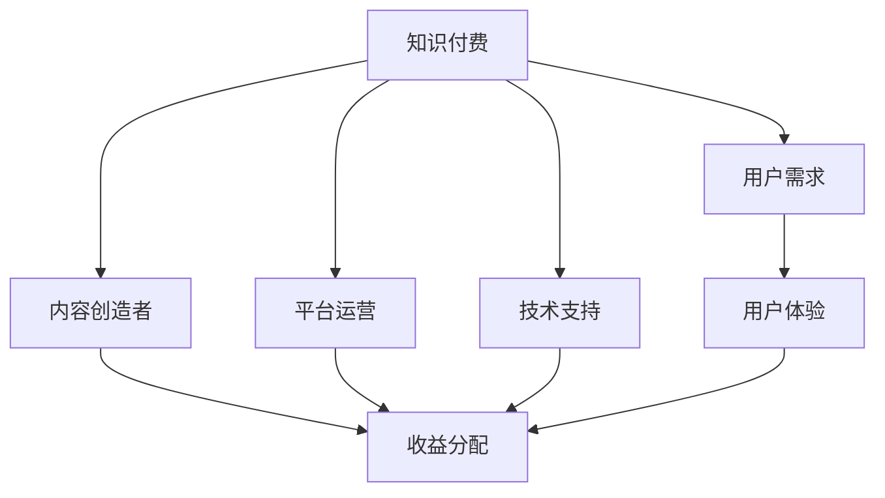

#### 第2章：程序员知识付费模式探索

##### 2.1 付费模式概述

程序员知识付费模式主要可以分为以下几种：

1. **订阅模式**：用户通过支付一定费用，获得平台提供的所有课程或特定课程的长期访问权限。
2. **一次性购买模式**：用户为单个课程支付费用，仅获得该课程的访问权限。
3. **课程包模式**：用户为一系列相关课程支付费用，获得这些课程的访问权限。
4. **会员模式**：用户支付会员费用，享受平台提供的多种增值服务，如优先课程、VIP社群等。
5. **知识星球模式**：以社群为核心，用户通过付费加入特定主题的社群，进行知识交流和分享。

每种模式都有其独特的特点和适用场景，内容创造者和平台运营者需要根据自身情况和市场需求进行选择。

##### 2.2 订阅模式

订阅模式是目前最为常见的知识付费模式之一。用户通过支付一定费用，获得平台提供的所有课程或特定课程的长期访问权限。订阅模式具有以下优点：

1. **稳定收入**：对于平台和内容创造者来说，订阅模式能够提供稳定的收入来源。
2. **用户黏性强**：订阅模式能够吸引用户长期使用平台，提高用户黏性。
3. **内容持续更新**：平台和内容创造者可以通过持续更新内容，保持用户的兴趣和活跃度。

然而，订阅模式也存在一定的缺点，如用户流失率较高、市场竞争激烈等。

**订阅模式架构图（Mermaid 流程图）**

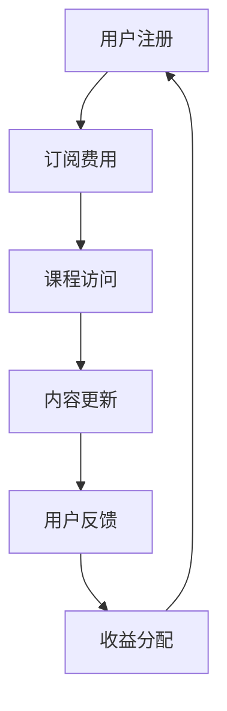

##### 2.3 一次性购买模式

一次性购买模式是指用户为单个课程支付费用，仅获得该课程的访问权限。该模式具有以下优点：

1. **购买决策简单**：用户无需长期承诺，只需为感兴趣的课程支付费用。
2. **价格透明**：用户能够清楚地了解所需支付的费用，无需担心后续费用问题。
3. **收入稳定**：对于内容创造者来说，一次性购买模式能够提供稳定的收入。

然而，一次性购买模式也存在一定的缺点，如用户黏性较低、收入波动较大等。

**一次性购买模式架构图（Mermaid 流程图）**

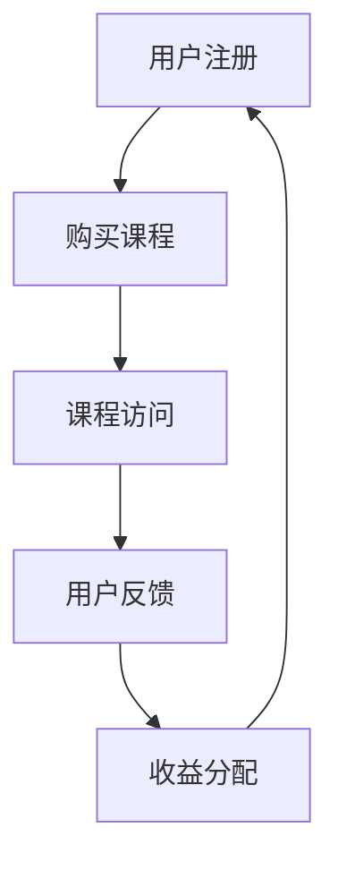

##### 2.4 课程包模式

课程包模式是指用户为一系列相关课程支付费用，获得这些课程的访问权限。该模式具有以下优点：

1. **内容丰富**：用户能够一次性获取多个相关课程，内容更为丰富。
2. **学习效率高**：用户可以更系统地学习相关知识点，提高学习效率。
3. **价格优惠**：相对于单个课程的购买，课程包通常能够提供更优惠的价格。

然而，课程包模式也存在一定的缺点，如课程内容可能存在重复、用户决策成本较高等。

**课程包模式架构图（Mermaid 流程图）**

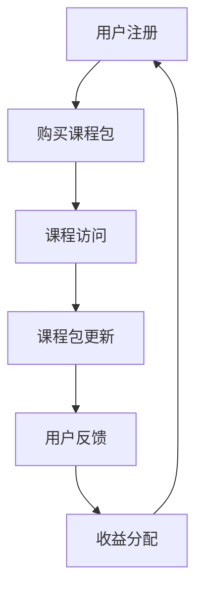

##### 2.5 会员模式

会员模式是指用户支付会员费用，享受平台提供的多种增值服务，如优先课程、VIP社群等。该模式具有以下优点：

1. **增值服务丰富**：用户可以享受平台提供的多种增值服务，提升用户体验。
2. **用户黏性强**：会员模式能够提高用户黏性，增加用户在平台上的活跃度。
3. **收益多元化**：平台可以通过会员服务获得多样化的收益来源。

然而，会员模式也存在一定的缺点，如会员费用较高、用户决策成本较高等。

**会员模式架构图（Mermaid 流程图）**

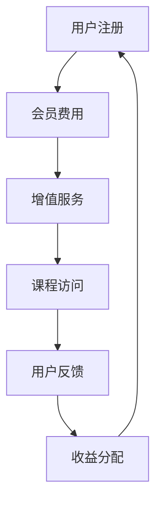

##### 2.6 知识星球模式

知识星球模式以社群为核心，用户通过付费加入特定主题的社群，进行知识交流和分享。该模式具有以下优点：

1. **互动性强**：用户可以在社群中与其他学习者交流，获取更多的学习资源和经验。
2. **内容实时更新**：社群内的知识分享可以实时更新，用户能够及时获取最新知识。
3. **个性化服务**：知识星球模式可以根据用户需求提供个性化的服务，提升用户体验。

然而，知识星球模式也存在一定的缺点，如社群管理成本较高、用户质量难以保障等。

**知识星球模式架构图（Mermaid 流程图）**

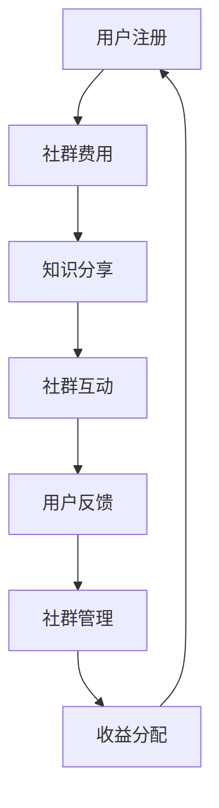

##### 2.7 程序员知识付费模式架构图（Mermaid 流程图）

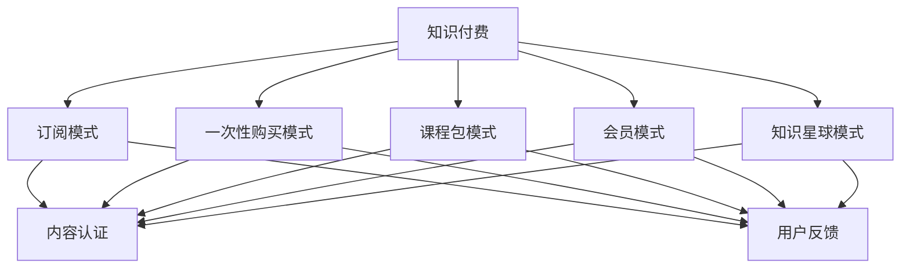

### 第一部分总结

通过对程序员知识付费市场现状、付费模式及其特点的深入分析，我们可以看到，程序员知识付费领域具有巨大的市场潜力。不同的付费模式各有优缺点，内容创造者和平台运营者需要根据自身情况和市场需求进行选择。在接下来的章节中，我们将进一步探讨程序员知识付费内容创建、平台建设等方面的实践方法，帮助读者打造出实践型的知识付费课程。

#### 第3章：程序员知识付费内容创建

##### 3.1 内容创建流程

程序员知识付费内容创建是一个复杂且系统性的过程，涉及多个环节。以下是一个典型的内容创建流程：

1. **选题定位**：首先，内容创造者需要根据市场需求和个人专业背景，确定课程的主题和目标受众。选题应具有明确的定位，以满足用户的需求。
   
2. **内容规划**：在选题确定后，制定详细的内容规划，包括课程大纲、章节划分、知识点覆盖等。这一阶段需要明确课程的核心内容、学习目标以及教学方法。

3. **素材收集**：根据内容规划，收集相关的素材，包括教材、案例、视频、图片等。素材的质量直接影响到课程的质量，因此这一环节至关重要。

4. **内容创作**：在素材收集完毕后，进行内容的创作。对于视频课程，需要录制视频并进行后期剪辑；对于文档课程，需要进行撰写和排版。

5. **初稿编写**：完成内容创作后，编写初稿。初稿应包含所有核心知识点，并进行初步的整理和梳理。

6. **审核修改**：初稿完成后，由专家或团队进行审核，提出修改意见。根据审核意见，对内容进行修改和完善。

7. **发布与推广**：完成修改后，将课程发布到知识付费平台，并进行推广。推广手段包括社交媒体、广告投放、社群营销等。

8. **用户反馈收集**：课程发布后，收集用户的反馈，包括评价、建议和问题。根据反馈，进一步优化课程内容。

9. **内容迭代**：根据用户反馈和市场需求，不断迭代和更新课程内容，以保持课程的时效性和实用性。

**3.2 优质内容的特点**

优质的内容是程序员知识付费成功的关键。以下是一些优质内容的特点：

1. **实用性**：内容应具有很强的实用性，能够帮助用户解决实际问题，提升技能水平。

2. **系统性**：内容应具有系统性，知识点之间应逻辑清晰、层次分明，便于用户理解。

3. **针对性**：内容应针对特定的受众，满足他们的学习需求。避免内容过于泛泛，无法引起用户的兴趣。

4. **互动性**：内容应具有一定的互动性，鼓励用户参与讨论，提高学习积极性。

5. **更新及时**：内容应保持更新，及时引入最新的技术动态和行业趋势，确保课程的前沿性。

**3.3 内容创作的工具与资源**

进行内容创作时，可以选择以下工具和资源：

1. **文字处理工具**：如Microsoft Word、Google Docs等，用于撰写文档。

2. **视频制作工具**：如Camtasia、Adobe Premiere等，用于录制和剪辑视频。

3. **PPT制作工具**：如Microsoft PowerPoint、Google Slides等，用于制作演示文稿。

4. **在线协作工具**：如Trello、Asana等，用于项目管理和团队协作。

5. **素材资源平台**：如Unsplash、Pixabay等，提供免费的高质量图片和视频素材。

6. **技术文档工具**：如Git、Markdown等，用于编写和整理技术文档。

**3.4 视频课程制作**

视频课程制作是程序员知识付费内容创建的重要部分。以下是一些视频课程制作的关键步骤：

1. **脚本编写**：首先编写详细的脚本，包括课程内容、教学方法和互动环节。

2. **录制视频**：根据脚本进行录制，可以使用摄像头、手机或其他录制设备。

3. **后期剪辑**：对录制好的视频进行剪辑，去除不必要的部分，调整画面和音频。

4. **添加特效**：为视频添加适当的特效，如过渡效果、动画效果等，提升视觉效果。

5. **发布与推广**：将制作好的视频发布到知识付费平台，并通过各种渠道进行推广。

**3.5 文档编写与排版**

文档编写与排版也是程序员知识付费内容创建的重要环节。以下是一些关键步骤：

1. **编写文档**：根据课程内容和教学目标，撰写详细的文档。文档应结构清晰、语言简练。

2. **排版设计**：对文档进行排版设计，包括字体、字号、行距、段落格式等。可以使用LaTeX等排版工具。

3. **添加图表**：在文档中添加相关的图表，如流程图、UML图等，以帮助用户更好地理解内容。

4. **审阅与修改**：完成初稿后，进行审阅和修改，确保文档的质量。

5. **发布与推广**：将文档发布到知识付费平台，并通过各种渠道进行推广。

**3.6 社区互动与内容迭代**

社区互动是提高课程质量和用户满意度的关键。以下是一些社区互动和内容迭代的方法：

1. **建立社群**：在知识付费平台或社交媒体上建立课程社群，鼓励用户参与讨论。

2. **收集反馈**：定期收集用户的反馈，了解他们对课程的意见和建议。

3. **解决问题**：针对用户提出的问题，及时给予解答，并在课程中补充相关内容。

4. **定期更新**：根据用户反馈和市场需求，定期更新课程内容，保持课程的前沿性和实用性。

5. **互动教学**：在课程中引入互动教学环节，如在线问答、小组讨论等，提高用户参与度。

**3.7 程序员知识付费内容创建流程图（Mermaid 流程图）**

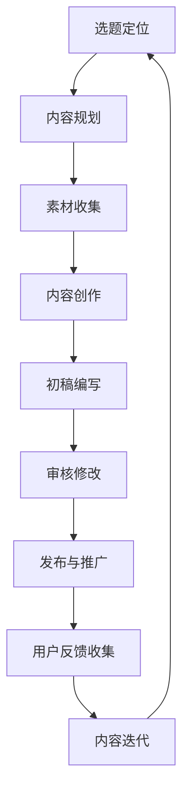

### 第3章总结

通过本章的讲解，我们了解了程序员知识付费内容创建的流程和关键要素。从选题定位、内容规划到素材收集、内容创作，再到审核修改、发布与推广，每一个环节都需要精心策划和执行。同时，社区互动和内容迭代也是提高课程质量和用户满意度的重要手段。在接下来的章节中，我们将进一步探讨程序员知识付费平台建设、商业模式与盈利分析等方面的内容，帮助读者全面了解程序员知识付费领域的各个方面。

#### 第4章：程序员知识付费平台建设

##### 4.1 平台架构设计

程序员知识付费平台的建设是一个复杂且系统性的过程，需要考虑多个方面，包括用户管理、内容管理、交易支付、数据分析和安全隐私等。以下是一个典型的平台架构设计：

1. **前端展示层**：负责用户界面的展示，包括课程列表、课程详情、学习进度、用户互动等。前端展示层可以使用HTML、CSS和JavaScript等技术进行实现。

2. **业务逻辑层**：负责处理平台的各种业务逻辑，如用户注册、登录、课程购买、课程学习、评论反馈等。业务逻辑层通常使用后端框架（如Django、Spring Boot等）进行开发。

3. **数据访问层**：负责与数据库进行交互，实现数据的存储和查询。常用的数据库技术包括关系型数据库（如MySQL、PostgreSQL）和NoSQL数据库（如MongoDB、Redis等）。

4. **数据存储层**：用于存储用户数据、课程数据、交易数据等。数据存储层需要考虑数据的安全性、可靠性和性能。

5. **数据分析层**：负责对用户行为数据、课程数据等进行分析，为平台运营和优化提供数据支持。数据分析层可以使用大数据技术和机器学习算法。

6. **安全隐私层**：负责保护用户数据和交易数据的安全，包括用户身份认证、数据加密、权限控制等。

**4.2 技术选型**

程序员知识付费平台的技术选型需要综合考虑性能、可扩展性、安全性等因素。以下是一些常见的技术选型：

1. **前端框架**：可以使用Vue.js、React、Angular等前端框架，以提高开发效率和用户体验。

2. **后端框架**：可以选择Django、Spring Boot、Flask等后端框架，根据实际需求进行选择。

3. **数据库技术**：关系型数据库如MySQL、PostgreSQL适用于存储结构化数据，NoSQL数据库如MongoDB、Redis适用于存储非结构化数据或缓存。

4. **缓存技术**：可以使用Redis、Memcached等缓存技术，提高数据读取速度和系统性能。

5. **消息队列**：可以使用RabbitMQ、Kafka等消息队列技术，实现异步处理和分布式系统架构。

6. **容器化技术**：可以使用Docker、Kubernetes等容器化技术，实现应用程序的轻量级部署和扩展。

7. **数据分析工具**：可以使用Python、R语言等数据分析工具，结合大数据平台（如Hadoop、Spark）进行数据处理和分析。

**4.3 数据分析与用户行为研究**

数据分析在程序员知识付费平台中起着至关重要的作用，可以帮助平台了解用户行为、优化课程推荐、提高用户留存率等。以下是一些常见的数据分析方法和工具：

1. **用户行为分析**：通过收集用户在平台上的行为数据（如课程访问、学习时长、购买行为等），分析用户兴趣和需求，为课程推荐和个性化服务提供依据。

2. **课程推荐算法**：可以使用协同过滤、基于内容的推荐算法等，根据用户的历史行为和偏好，推荐合适的课程。

3. **用户留存分析**：通过分析用户留存率、活跃度等指标，了解用户对平台的满意度，发现潜在问题，并采取相应措施提高用户留存率。

4. **转化率分析**：通过分析用户从浏览到购买的过程，优化用户体验和转化路径，提高购买转化率。

5. **A/B测试**：通过A/B测试，对比不同设计方案的效果，选择最优方案，提高用户满意度和平台收益。

**4.4 安全性与隐私保护**

安全性与隐私保护是程序员知识付费平台建设的核心问题，需要从多个方面进行考虑：

1. **用户身份认证**：采用双因素认证、OAuth2.0等认证技术，确保用户身份的安全。

2. **数据加密**：使用HTTPS、SSL/TLS等加密技术，保护用户数据在传输过程中的安全。

3. **权限控制**：通过角色权限管理和细粒度权限控制，确保不同角色的用户只能访问和操作相应的数据和功能。

4. **数据备份与恢复**：定期进行数据备份，确保在数据丢失或损坏时能够及时恢复。

5. **安全审计**：定期进行安全审计，检查系统漏洞和安全隐患，及时进行修复。

**4.5 用户界面设计**

用户界面设计在程序员知识付费平台中起着至关重要的作用，需要从用户的角度出发，设计简洁、直观、易用的界面。以下是一些用户界面设计的关键要素：

1. **简洁性**：界面设计应简洁明了，避免过多的装饰和复杂的功能，确保用户能够快速找到所需的内容。

2. **一致性**：界面风格应保持一致性，包括颜色、字体、布局等，使用户在浏览不同页面时能够保持良好的体验。

3. **响应式设计**：支持多种设备和屏幕尺寸，确保平台在不同设备上的良好表现。

4. **交互设计**：设计合理的交互元素，如按钮、滚动条、弹窗等，提高用户操作的便捷性。

5. **可视化**：使用图表、图片等可视化元素，帮助用户更好地理解和掌握知识。

**4.6 网站性能优化**

网站性能优化是程序员知识付费平台建设的重要环节，需要从多个方面进行考虑：

1. **负载均衡**：使用负载均衡器，如Nginx、HAProxy等，将请求分配到多个服务器上，提高系统的并发处理能力。

2. **缓存策略**：使用缓存技术，如Redis、Memcached等，缓存 frequently accessed 数据，减少数据库查询次数，提高系统响应速度。

3. **静态资源优化**：压缩和合并静态资源文件，如CSS、JavaScript等，减少页面加载时间。

4. **数据库优化**：优化数据库查询语句，如使用索引、分库分表等，提高数据库查询性能。

5. **服务器性能调优**：定期进行服务器性能调优，包括CPU、内存、网络等，确保系统在高负载下的稳定运行。

**4.7 程序员知识付费平台技术架构图（Mermaid 流程图）**

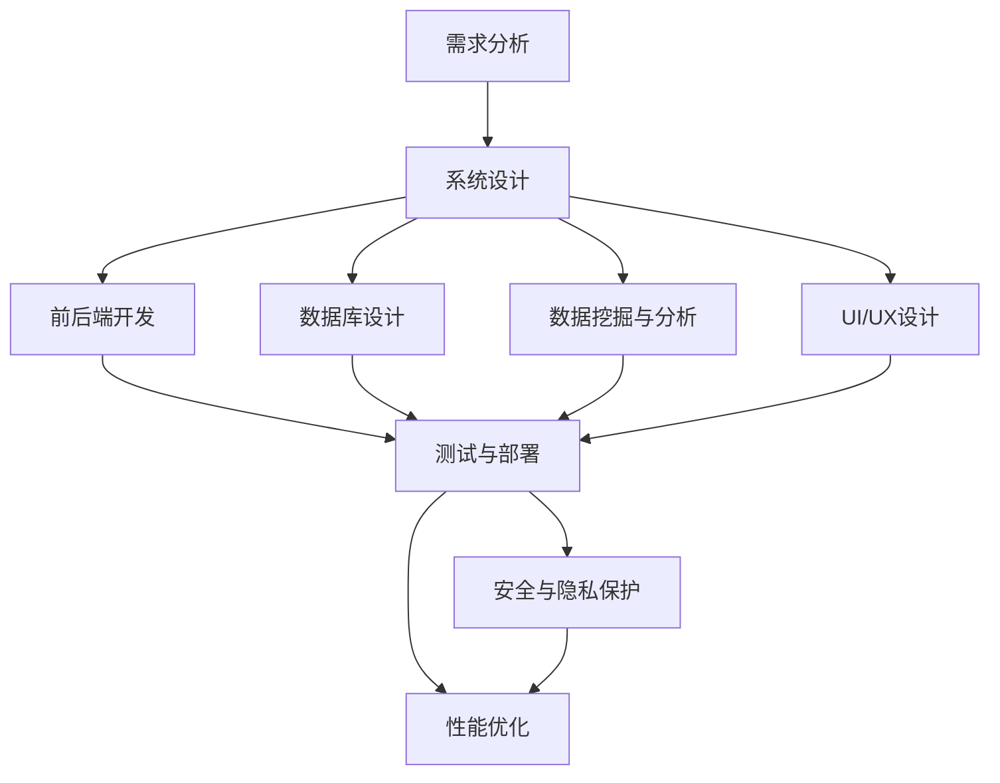

### 第4章总结

通过本章的讲解，我们了解了程序员知识付费平台建设的各个方面，包括平台架构设计、技术选型、数据分析和用户行为研究、安全性与隐私保护、用户界面设计以及网站性能优化等。程序员知识付费平台的建设需要综合考虑多个因素，确保平台的稳定性、安全性、用户体验和性能。在接下来的章节中，我们将进一步探讨程序员知识付费的商业模式与盈利分析，帮助读者更好地了解该领域的商业逻辑和盈利模式。

#### 第5章：程序员知识付费商业模式与盈利分析

##### 5.1 商业模式概述

程序员知识付费的商业模式主要包括以下几种类型：

1. **订阅模式**：用户支付一定费用，获得平台提供的所有课程或特定课程的长期访问权限。这种模式能够提供稳定的收入来源，并提高用户黏性。

2. **一次性购买模式**：用户为单个课程支付费用，仅获得该课程的访问权限。这种模式操作简单，用户决策成本低，但收入波动较大。

3. **课程包模式**：用户为一系列相关课程支付费用，获得这些课程的访问权限。这种模式能够提供丰富的学习内容，提高学习效率。

4. **会员模式**：用户支付会员费用，享受平台提供的多种增值服务，如优先课程、VIP社群等。这种模式能够提高用户满意度和平台收益。

5. **知识星球模式**：以社群为核心，用户通过付费加入特定主题的社群，进行知识交流和分享。这种模式能够增强用户互动和社区氛围。

##### 5.2 盈利模式分析

程序员知识付费的盈利模式主要包括以下几种：

1. **内容销售**：通过销售课程、电子书、直播课程等有偿内容，获取收入。这是最常见的盈利模式，适用于所有知识付费平台。

2. **广告收入**：平台可以通过展示广告获得收入，如在课程页面、用户个人主页等位置投放广告。这种模式适用于用户基数较大的平台。

3. **会员服务**：提供会员服务，如VIP社群、优先课程、个性化推荐等，用户支付会员费用获得增值服务。这种模式能够提高用户满意度和粘性。

4. **线下活动**：举办线下讲座、工作坊、研讨会等活动，用户支付费用参加。这种模式能够增强用户互动，提升品牌知名度。

5. **赞助与合作伙伴**：与相关企业或机构合作，提供定制化服务或赞助活动，获得收入。这种模式适用于有一定影响力的知识付费平台。

6. **在线教育**：通过在线教育平台提供培训服务，如企业培训、职业技能培训等。这种模式适用于面向企业的知识付费平台。

##### 5.3 成本与收益计算

在进行程序员知识付费商业模式与盈利分析时，成本与收益的计算是至关重要的。以下是一个简化的成本与收益计算方法：

1. **内容制作成本**：包括课程研发、视频录制、编辑、校对等费用。每门课程的制作成本可以根据实际投入进行计算。

2. **运营成本**：包括服务器租赁、带宽费用、人力成本、推广费用等。这些成本可以根据平台规模和运营需求进行预算。

3. **收入计算**：收入包括课程销售、广告收入、会员服务收入、线下活动收入等。每项收入可以根据实际销售情况计算。

4. **盈利分析**：将总收入减去总成本，得到净利润。通过对比不同业务模式的收入和成本，分析哪种模式具有更高的盈利能力。

**5.4 市场营销策略**

市场营销策略是提高程序员知识付费平台知名度、吸引更多用户的关键。以下是一些常见的市场营销策略：

1. **内容营销**：通过发布高质量的内容，如博客文章、视频教程、案例研究等，吸引用户关注。

2. **社交媒体营销**：利用社交媒体平台（如微博、微信公众号、知乎等）进行宣传，增加平台曝光度。

3. **广告投放**：通过搜索引擎广告、社交媒体广告等渠道进行广告投放，提高品牌知名度。

4. **合作伙伴**：与相关企业或机构建立合作，通过联合营销活动提升品牌影响力。

5. **口碑营销**：通过用户口碑传播，提高平台信誉和用户满意度。

6. **活动营销**：举办线下活动、线上讲座等，增加用户互动，提升品牌形象。

##### 5.5 用户获取与留存

用户获取与留存是程序员知识付费平台的核心问题。以下是一些常见的用户获取与留存策略：

1. **用户画像**：通过数据分析，了解用户需求和偏好，制定个性化的营销策略。

2. **免费试用**：提供免费试用课程，吸引用户注册和使用平台。

3. **课程推荐**：根据用户行为和偏好，推荐合适的课程，提高用户留存率。

4. **社群运营**：建立社群，鼓励用户参与讨论和互动，增强用户黏性。

5. **用户反馈**：定期收集用户反馈，及时解决问题，提高用户满意度。

6. **优惠活动**：定期举办优惠活动，如优惠券、折扣等，吸引新用户并促进旧用户留存。

##### 5.6 程序员知识付费商业模式图（Mermaid 流程图）

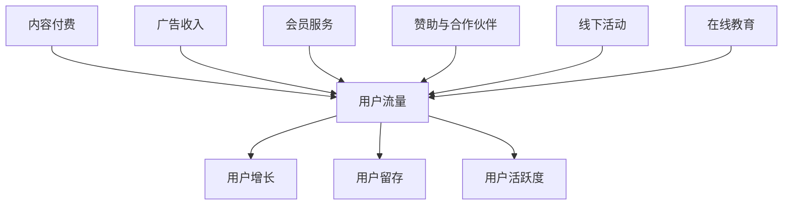

### 第5章总结

通过本章的讲解，我们了解了程序员知识付费的商业模式、盈利模式、市场营销策略以及用户获取与留存策略。这些策略对于程序员知识付费平台的发展至关重要。在接下来的章节中，我们将通过案例分析，深入探讨成功知识付费平台的具体实践和经验，为读者提供更多启示。

#### 第6章：程序员知识付费案例分析

##### 6.1 案例一：知乎Live

知乎Live是知乎推出的在线知识付费产品，用户可以通过付费观看知乎上的专家、大V进行直播授课。以下是对知乎Live的分析：

**成功经验：**
1. **平台影响力**：知乎作为知名的问答社区，拥有大量高质量内容和活跃用户，这为知乎Live提供了丰富的课程资源和潜在的用户基础。
2. **专家资源**：知乎邀请各领域专家进行授课，确保了课程的专业性和权威性，吸引了大量用户关注。
3. **内容多样化**：知乎Live涵盖广泛的话题，从技术到生活，满足不同用户的需求。

**挑战与问题：**
1. **内容质量参差不齐**：由于知乎Live的专家来源多样，导致部分课程质量不高，影响了用户体验。
2. **用户留存问题**：虽然知乎Live吸引了大量用户，但用户留存率相对较低，需要进一步提升用户黏性。

**解决方案：**
1. **严格审核机制**：加强对课程内容的审核，确保课程质量，提升用户体验。
2. **用户激励机制**：通过积分、优惠券等方式，鼓励用户积极参与和留存。

##### 6.2 案例二：网易云课堂

网易云课堂是网易旗下的在线教育平台，提供包括编程、设计、语言等多个领域的课程。以下是对网易云课堂的分析：

**成功经验：**
1. **品牌影响力**：网易云课堂依托网易的品牌优势，建立了良好的口碑，吸引了大量用户。
2. **课程体系完善**：网易云课堂提供了从入门到进阶的完整课程体系，满足不同层次用户的需求。
3. **个性化推荐**：通过大数据和算法，为用户推荐合适的课程，提高学习效率。

**挑战与问题：**
1. **内容同质化**：随着越来越多的平台进入知识付费市场，课程内容同质化问题逐渐凸显。
2. **用户流失**：由于市场竞争激烈，用户获取成本较高，导致用户流失问题。

**解决方案：**
1. **差异化竞争**：通过独特的内容或教学方式，打造差异化优势，提高用户忠诚度。
2. **用户运营**：加强用户运营，提高用户留存率和活跃度。

##### 6.3 案例三：极客时间

极客时间是一个专注于技术领域的知识付费平台，提供高质量的音频和视频课程。以下是对极客时间的分析：

**成功经验：**
1. **内容质量高**：极客时间注重课程质量，邀请行业专家进行授课，保证了内容的深度和实用性。
2. **形式多样化**：极客时间提供音频和视频两种形式，方便用户根据自己的需求和场景进行选择。
3. **社区互动**：极客时间建立了活跃的社区，鼓励用户参与讨论，提升学习体验。

**挑战与问题：**
1. **用户认知度**：作为新兴平台，极客时间的用户认知度相对较低，需要加大品牌推广力度。
2. **内容更新速度**：技术更新迭代快，需要持续更新内容，保持课程的时效性。

**解决方案：**
1. **品牌推广**：通过广告、合作等方式，提高品牌知名度和用户认知度。
2. **内容更新机制**：建立内容更新机制，确保课程紧跟技术发展趋势。

##### 6.4 案例分析总结

通过对知乎Live、网易云课堂和极客时间的案例分析，我们可以总结出以下经验教训：

1. **平台影响力**：拥有强大品牌影响力的平台，在知识付费领域更具竞争力。
2. **内容质量**：高质量的内容是用户选择知识付费平台的重要因素，平台需要重视课程质量和内容创新。
3. **用户运营**：有效的用户运营策略可以提高用户留存率和活跃度，增加平台收益。
4. **差异化竞争**：在激烈的市场竞争中，差异化优势有助于平台脱颖而出。

**6.5 程序员知识付费案例总结图（Mermaid 流程图）**

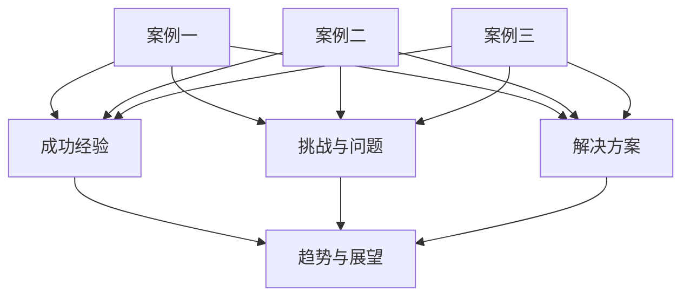

### 第6章总结

通过本章对知乎Live、网易云课堂和极客时间的案例分析，我们深入了解了程序员知识付费领域的成功经验和挑战。这些案例为我们提供了宝贵的经验和启示，帮助我们更好地理解知识付费平台的运营策略和未来发展。在接下来的章节中，我们将进一步探讨程序员知识付费的未来趋势与展望，为读者提供更全面的认识。

#### 第7章：未来程序员知识付费趋势与展望

##### 7.1 技术发展对知识付费的影响

随着科技的不断进步，人工智能、大数据、区块链等新兴技术将对程序员知识付费领域产生深远影响。以下是一些关键影响：

1. **个性化推荐**：人工智能技术可以根据用户行为和偏好，提供个性化的课程推荐，提高用户满意度和参与度。
2. **智能互动**：人工智能助手可以实现实时交互，解答用户疑问，提供学习指导，提升用户体验。
3. **内容生成**：利用自然语言处理和机器学习技术，可以自动生成高质量的课程内容，降低内容创作成本。
4. **数据分析**：大数据技术可以帮助平台更好地了解用户需求，优化课程设置和营销策略，提高运营效率。
5. **隐私保护**：区块链技术可以提供去中心化的隐私保护解决方案，确保用户数据的安全和隐私。

##### 7.2 新兴市场与用户需求变化

程序员知识付费市场正在发生深刻变化，新兴市场和用户需求的变化将推动知识付费领域的发展：

1. **国际化发展**：随着全球化的推进，程序员知识付费市场将逐渐走向国际化，平台需要提供多语言支持和全球化运营策略。
2. **垂直领域细分**：随着技术的不断进步，程序员知识付费将更加垂直化，满足不同领域的专业需求。
3. **新兴技术需求**：随着人工智能、大数据等新兴技术的普及，程序员对这些领域的知识需求日益增加，相关课程将受到更多关注。
4. **职业发展需求**：程序员在职业发展过程中对管理能力、沟通能力等方面的知识需求也在增加，相关知识付费内容将得到更多关注。

##### 7.3 知识付费平台竞争格局

随着程序员知识付费市场的不断扩大，竞争格局也将发生深刻变化。以下是一些关键趋势：

1. **平台整合**：大型平台将通过收购、合作等方式，整合资源，扩大市场份额。
2. **差异化竞争**：平台将根据自身优势和用户需求，提供差异化服务，满足不同用户的需求。
3. **技术创新**：平台将加大技术创新投入，提高用户体验和运营效率。
4. **品牌影响力**：品牌影响力将成为平台竞争的重要因素，平台需要加强品牌建设和营销策略。

##### 7.4 未来商业模式探索

未来程序员知识付费商业模式将更加多样化和创新化，以下是一些可能的商业模式探索：

1. **会员制**：平台将提供更丰富的会员服务，如线下活动、VIP社群等，提高用户满意度和忠诚度。
2. **众筹模式**：平台可以采用众筹模式，用户为感兴趣的课程提供资金支持，课程成功后按比例分成。
3. **内容共享**：平台将建立内容共享机制，鼓励用户贡献内容，平台从中获取收益。
4. **广告分成**：平台可以与广告商合作，将广告收入与内容创作者分享，提高收入来源。
5. **跨界合作**：平台将与相关企业或机构合作，提供定制化服务或解决方案，拓展业务范围。

##### 7.5 行业规范与法律监管

随着程序员知识付费市场的快速发展，行业规范和法律监管也日益重要。以下是一些关键点：

1. **内容审核**：平台需加强对课程内容的审核，确保内容的合法性和质量。
2. **用户隐私保护**：平台需严格遵守隐私保护法规，保护用户个人信息安全。
3. **知识产权保护**：平台需加强对知识产权的保护，防止侵权行为。
4. **用户权益保障**：平台需建立完善的用户权益保障机制，确保用户权益不受侵害。

**7.6 程序员知识付费未来趋势图（Mermaid 流程图）**

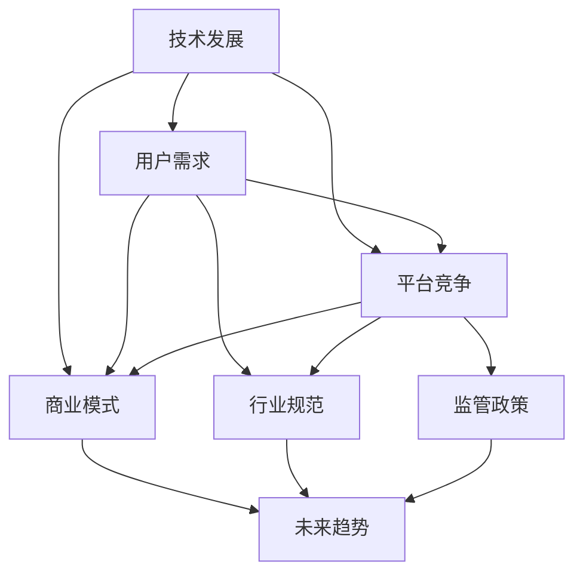

### 第7章总结

通过本章的讨论，我们深入探讨了未来程序员知识付费领域的发展趋势和展望。技术发展、新兴市场、用户需求变化、平台竞争格局、商业模式探索以及行业规范与法律监管等因素都将对程序员知识付费领域产生重要影响。在未来的发展中，程序员知识付费平台需要不断创新和优化，以满足用户需求，提升用户体验，实现可持续发展。

### 附录

#### 附录 A：程序员知识付费资源汇总

**A.1 行业报告与市场分析**

- **《2022年中国在线教育行业报告》**：由艾瑞咨询发布，详细分析了中国在线教育行业的市场规模、用户行为和市场竞争状况。
- **《程序员知识付费市场研究报告》**：由知名市场研究机构发布，探讨了程序员知识付费市场的现状、趋势和机遇。

**A.2 知识付费平台推荐**

- **网易云课堂**：提供涵盖编程、设计、语言等多个领域的在线课程，适合不同层次的程序员学习。
- **极客时间**：专注于技术领域的知识付费平台，提供高质量的音频和视频课程。
- **知乎Live**：知乎推出的在线知识付费产品，邀请各领域专家进行直播授课。

**A.3 开发工具与资源链接**

- **GitHub**：全球最大的开源代码托管平台，程序员可以在这里找到丰富的学习资源和项目案例。
- **Stack Overflow**：全球最大的程序员社区，提供问答平台和丰富的学习资源。
- **掘金**：国内知名的程序员社区，提供技术文章、招聘信息和课程推荐。

**A.4 知识付费相关书籍推荐**

- **《代码大全》**：史蒂夫·麦科马克等著，系统地介绍了编写高质量代码的最佳实践。
- **《设计模式：可复用面向对象软件的基础》**：埃里希·伽玛等著，深入讲解了面向对象设计模式。
- **《深入理解计算机系统》**：尼哈尔·B·达塔等著，全面介绍了计算机系统的工作原理。

**A.5 程序员知识付费资源汇总图（Mermaid 流程图）**

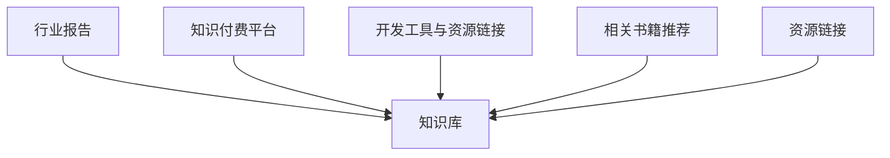

### 总结与展望

通过本篇博客文章，我们系统地探讨了程序员知识付费的各个方面，从市场分析、付费模式、内容创建、平台建设、商业模式到案例分析以及未来趋势。每个章节都通过深入的分析和详细的讲解，帮助读者全面了解程序员知识付费领域的核心概念和实践方法。

在总结中，我们再次强调了程序员知识付费的重要性，以及其面临的市场机遇和挑战。通过分析多种付费模式、内容创建流程、平台建设关键点、商业模式与盈利策略，我们为读者提供了切实可行的操作指南。

同时，案例分析部分通过具体实例，展示了成功知识付费平台的经验和教训，为读者提供了宝贵的参考。最后，对未来趋势的探讨，使读者能够预见到程序员知识付费领域的发展方向，为自身的职业发展做好准备。

作为文章的结尾，我们鼓励程序员和内容创作者积极投身于知识付费领域，不断学习、实践和创新，把握市场机遇，提升自身竞争力。通过打造高质量、实践型的知识付费课程，不仅能够实现个人价值，也能为整个行业的发展贡献力量。

**作者：AI天才研究院/AI Genius Institute & 禅与计算机程序设计艺术 /Zen And The Art of Computer Programming**

