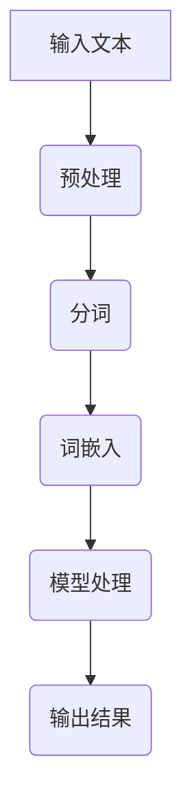
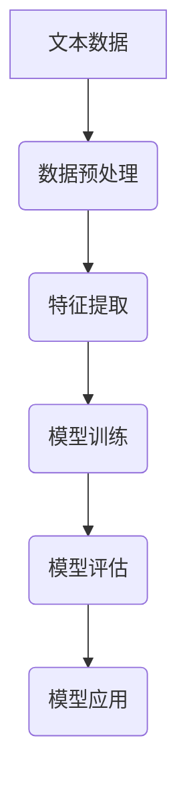

                 

# 第五章：自然语言处理基础

## 概述

自然语言处理（Natural Language Processing，NLP）是计算机科学、人工智能和语言学的交叉领域，旨在让计算机理解和生成人类语言。随着互联网的普及和大数据技术的发展，NLP技术已经渗透到我们日常生活的方方面面，如搜索引擎、推荐系统、智能客服、机器翻译等。在这一章中，我们将探讨自然语言处理的基础知识，包括核心概念、技术、应用场景以及相关的工具和库。

### 关键词

- 自然语言处理
- 语言模型
- 词嵌入
- 文本分类
- 情感分析
- 机器翻译
- 信息检索
- 聊天机器人

### 摘要

本章将深入探讨自然语言处理的基础概念和技术。我们将首先介绍NLP的定义和起源，然后详细讨论NLP面临的挑战和广泛应用。接着，我们将介绍常见的NLP任务和技术，如词嵌入、语言模型、文本分类和情感分析等。最后，我们将介绍自然语言处理的工具和库，并提供一些实际应用案例，展示如何使用这些工具来开发具有实际价值的NLP应用。

## 目录大纲

### 第五章：自然语言处理基础

### 1. 自然语言处理概述

#### 1.1 自然语言处理的定义与历史

##### 1.1.1 定义

自然语言处理（Natural Language Processing，NLP）是计算机科学、人工智能和语言学的交叉领域，旨在让计算机理解和生成人类语言。

##### 1.1.2 历史与发展

- 20世纪50年代：早期探索，包括早期的句法分析和机器翻译。
- 20世纪80年代：规则驱动的方法，如TF-IDF和拉普拉斯平滑。
- 21世纪初：统计机器学习方法的兴起，如最大熵模型和隐马尔可夫模型。
- 现在：深度学习在NLP中的广泛应用，如BERT和GPT系列模型。

#### 1.2 自然语言处理的挑战

##### 1.2.1 语言的复杂性

- 句法、语义、语境等多个层面的复杂性。
- 句子中的歧义和多义现象。

##### 1.2.2 语言资源的稀缺性

- 大规模标注数据集的获取困难。
- 语言资源的多样性和不平衡性。

#### 1.3 自然语言处理的应用场景

##### 1.3.1 文本分类与情感分析

- 文本分类：将文本分配到预定义的类别中。
- 情感分析：判断文本的情感倾向，如正面、负面、中性。

##### 1.3.2 机器翻译

- 将一种语言的文本翻译成另一种语言。

##### 1.3.3 信息检索

- 根据用户的查询检索相关信息。

##### 1.3.4 聊天机器人

- 与人类用户进行自然对话。

### 2. 常见NLP任务与技术

#### 2.1 词嵌入

##### 2.1.1 词嵌入的概念

- 词嵌入将词汇映射到低维向量空间。

##### 2.1.2 词嵌入技术

- word2vec：基于上下文的词嵌入。
- GloVe：全局向量表示。

#### 2.2 语言模型

##### 2.2.1 语言模型的概念

- 语言模型用于预测下一个单词或词组。

##### 2.2.2 语言模型技术

- N-gram模型：基于单词序列的前N个单词。
- 神经网络语言模型：如循环神经网络（RNN）和变换器（Transformer）。

#### 2.3 文本分类

##### 2.3.1 文本分类的概念

- 文本分类是将文本分配到预定义的类别中。

##### 2.3.2 文本分类技术

- 统计分类器：如朴素贝叶斯、支持向量机（SVM）。
- 深度学习分类器：如卷积神经网络（CNN）和变换器（Transformer）。

#### 2.4 情感分析

##### 2.4.1 情感分析的概念

- 情感分析用于判断文本的情感倾向。

##### 2.4.2 情感分析技术

- 基于规则的方法：如情感词典和情感分类器。
- 基于深度学习的方法：如长短期记忆网络（LSTM）和变换器（Transformer）。

#### 2.5 机器翻译

##### 2.5.1 机器翻译的概念

- 机器翻译是将一种语言的文本翻译成另一种语言。

##### 2.5.2 机器翻译技术

- 统计机器翻译：如基于短语的翻译模型。
- 神经网络机器翻译：如基于变换器（Transformer）的翻译模型。

#### 2.6 信息检索

##### 2.6.1 信息检索的概念

- 信息检索是根据用户的查询检索相关信息。

##### 2.6.2 信息检索技术

- 基于词频和统计的方法：如TF-IDF。
- 基于深度学习的方法：如变换器（Transformer）和BERT。

#### 2.7 聊天机器人

##### 2.7.1 聊天机器人的概念

- 聊天机器人是与人类用户进行自然对话的系统。

##### 2.7.2 聊天机器人技术

- 基于规则的方法：如模板匹配。
- 基于深度学习的方法：如变换器（Transformer）和BERT。

### 3. 自然语言处理工具与库

#### 3.1 自然语言处理工具

##### 3.1.1 NLTK

- 自然语言处理工具包，用于文本处理和分析。

##### 3.1.2 spaCy

- 用于快速文本理解和信息提取的工业级NLP库。

### 3.2 自然语言处理库

##### 3.2.1 TensorFlow

- 用于构建和训练深度学习模型的框架。

##### 3.2.2 PyTorch

- 用于构建和训练深度学习模型的框架。

### 4. 自然语言处理应用案例

#### 4.1 文本分类应用案例

- 使用深度学习模型对社交媒体文本进行分类。

#### 4.2 情感分析应用案例

- 使用变换器模型对产品评论进行情感分析。

#### 4.3 机器翻译应用案例

- 使用基于变换器的模型进行中英文翻译。

#### 4.4 信息检索应用案例

- 使用BERT模型优化搜索引擎。

#### 4.5 聊天机器人应用案例

- 开发一个基于变换器的聊天机器人系统。

### 5. 自然语言处理前沿技术

#### 5.1 生成式对话系统

- 开发能够生成流畅、自然对话的系统。

#### 5.2 对话状态追踪

- 理解对话中的上下文信息，提高对话质量。

#### 5.3 多模态自然语言处理

- 结合文本、语音、图像等多模态数据，提高NLP能力。

### 附录

#### 附录 A: 参考文献

- 列出本书中引用的主要参考文献。

#### 附录 B: Mermaid 流程图

##### 附录 B.1 自然语言处理的流程

```
graph TD
A[输入文本] --> B(预处理)
B --> C(分词)
C --> D(词嵌入)
D --> E(模型处理)
E --> F(输出结果)
```

##### 附录 B.2 文本分类流程

```
graph TD
A[文本数据] --> B(数据预处理)
B --> C(特征提取)
C --> D(模型训练)
D --> E(模型评估)
E --> F(模型应用)
```

#### 附录 C: 伪代码

##### 附录 C.1 词嵌入算法

```
function word_embedding(document):
    for each word in document:
        if word not in vocabulary:
            continue
        context_words = get_context_words(word)
        word_vector = average(context_words' vectors)
    return word_vector
```

##### 附录 C.2 文本分类算法

```
function text_classification(document, model):
    features = extract_features(document)
    probabilities = model.predict(features)
    predicted_label = select_label_with_highest_probability(probabilities)
    return predicted_label
```

#### 附录 D: 数学模型与公式

##### 附录 D.1 交叉熵损失函数

$$
L(y, \hat{y}) = -\sum_{i} y_i \log(\hat{y}_i)
$$

##### 附录 D.2 激活函数ReLU

$$
\text{ReLU}(x) =
\begin{cases}
    x & \text{if } x > 0 \\
    0 & \text{otherwise}
\end{cases}
$$

#### 附录 E: 项目实战

##### 附录 E.1 开发一个简单的聊天机器人

- 环境搭建：安装Python和PyTorch。
- 数据预处理：收集聊天数据，进行清洗和预处理。
- 模型训练：使用变换器模型进行训练。
- 模型应用：实现聊天功能，并进行测试。

#### 附录 F: 开发环境与工具

- Python
- PyTorch
- TensorFlow
- Jupyter Notebook
- spaCy
- NLTK

---

作者：AI天才研究院/AI Genius Institute & 禅与计算机程序设计艺术 /Zen And The Art of Computer Programming

接下来，我们将按照这个目录大纲，逐步深入探讨自然语言处理的基础知识。首先，我们从NLP的定义和历史开始，然后讨论NLP面临的挑战和应用场景。接下来，我们将介绍常见的NLP任务和技术，如词嵌入、语言模型、文本分类、情感分析、机器翻译、信息检索和聊天机器人。最后，我们将介绍NLP的工具和库，并提供一些实际应用案例。让我们开始吧！<|endoftext|>

## 1. 自然语言处理概述

### 1.1 自然语言处理的定义与历史

自然语言处理（NLP）是一个涉及计算机科学、人工智能和语言学的多学科领域，其目标是使计算机能够理解和生成人类语言。NLP技术使得人与计算机之间的交互变得更加自然和直观，从而提高了效率和用户体验。

#### 1.1.1 定义

自然语言处理（Natural Language Processing，NLP）是计算机科学、人工智能和语言学的交叉领域，旨在让计算机理解和生成人类语言。具体来说，NLP包括以下主要任务：

- **文本预处理**：包括分词、词性标注、句法分析、词干提取等，以便将原始文本转换为适合计算机处理的形式。
- **实体识别**：识别文本中的关键信息，如人名、地点、组织等。
- **关系提取**：识别文本中实体之间的关系，如“华盛顿是美国的总统”。
- **语义分析**：理解文本的含义和意图，包括情感分析、主题识别等。
- **机器翻译**：将一种语言的文本翻译成另一种语言。
- **对话系统**：构建能够与人类自然对话的智能系统。

#### 1.1.2 历史与发展

NLP的历史可以追溯到20世纪50年代，当时计算机科学家和语言学家开始探索如何使计算机理解和生成自然语言。以下是NLP发展的几个关键阶段：

- **早期探索（1950年代-1960年代）**：这一时期的NLP研究主要集中在语法和句法分析上。研究者尝试使用规则系统来解析和生成自然语言文本。例如，乔姆斯基的生成语法理论对NLP产生了深远影响。
  
- **规则驱动方法（1970年代-1980年代）**：在早期的研究基础上，NLP领域开始采用更为复杂的规则系统。例如，TF-IDF（词频-逆文档频率）是一种用于文本分类和检索的统计方法，而拉普拉斯平滑是一种用于处理缺失数据的统计方法。

- **统计机器学习方法（1990年代-2000年代）**：随着计算能力的提高和数据集的丰富，统计机器学习方法开始在NLP中得到广泛应用。例如，最大熵模型、支持向量机和隐马尔可夫模型（HMM）等算法在文本分类、语音识别和信息检索等领域取得了显著成果。

- **深度学习方法（2010年代至今）**：深度学习，特别是神经网络，在NLP中取得了突破性的进展。2013年，Google的Word2Vec算法首次将词嵌入（word embedding）引入NLP，使得词汇在低维向量空间中有意义的表示。随后，基于变换器（Transformer）的模型如BERT、GPT等进一步推动了NLP的发展。

### 1.2 自然语言处理的挑战

尽管NLP技术取得了显著进展，但仍然面临许多挑战。以下是其中一些主要挑战：

#### 1.2.1 语言的复杂性

自然语言具有高度的复杂性和多样性，包括句法、语义、语境等多个层面。例如，自然语言中存在歧义和多义现象，使得计算机难以准确理解文本的含义。此外，不同语言之间的差异也增加了NLP的复杂性。

#### 1.2.2 语言资源的稀缺性

高质量的标注数据集对于训练NLP模型至关重要，但获取这些数据集往往困难且耗时。此外，语言资源的多样性和不平衡性也是一个挑战。例如，某些语言可能有大量高质量的数据集，而其他语言则可能缺乏足够的数据。

#### 1.2.3 模型可解释性

随着深度学习模型在NLP中的广泛应用，模型的黑盒特性使得解释和验证模型的决策变得困难。这限制了NLP技术的应用范围，特别是在安全性和可靠性要求较高的领域。

### 1.3 自然语言处理的应用场景

NLP技术在许多领域都有广泛的应用，以下是其中一些主要的应用场景：

#### 1.3.1 文本分类与情感分析

文本分类是将文本分配到预定义的类别中，如垃圾邮件检测、新闻分类等。情感分析则用于判断文本的情感倾向，如正面、负面、中性，广泛应用于社交媒体分析、产品评论等。

#### 1.3.2 机器翻译

机器翻译是将一种语言的文本翻译成另一种语言。虽然人工翻译仍然占据主导地位，但机器翻译在提高翻译效率和准确性方面取得了显著进展。例如，谷歌翻译和百度翻译等在线翻译服务已经广泛应用于全球。

#### 1.3.3 信息检索

信息检索是根据用户的查询检索相关信息。基于词频和统计的方法如TF-IDF和基于深度学习的方法如BERT等都在信息检索中得到了广泛应用。

#### 1.3.4 聊天机器人

聊天机器人是一种能够与人类用户进行自然对话的智能系统。基于规则的方法如模板匹配和基于深度学习的方法如BERT和变换器（Transformer）等都在聊天机器人中得到了应用。

总之，NLP技术已经深入到我们日常生活的方方面面，从搜索引擎到智能客服，从机器翻译到信息检索，NLP正在改变我们的工作和生活方式。在接下来的章节中，我们将深入探讨NLP中的核心技术，如词嵌入、语言模型、文本分类、情感分析、机器翻译等，以便更好地理解NLP的技术原理和应用场景。

## 2. 常见NLP任务与技术

### 2.1 词嵌入

#### 2.1.1 词嵌入的概念

词嵌入（word embedding）是将词汇映射到低维向量空间的一种表示方法。通过将单词映射到向量，我们可以利用向量的数学性质，如距离、相似度等，对单词进行定量分析。词嵌入不仅有助于文本数据的结构化表示，还为NLP算法提供了有效的输入特征。

在词嵌入中，每个单词都被映射为一个固定长度的向量。这些向量可以在低维空间中表示单词的语义和语法信息。词嵌入有多种实现方法，如word2vec、GloVe和FastText等。

#### 2.1.2 词嵌入技术

- **word2vec**：word2vec是由Google在2013年提出的一种词嵌入技术。它基于神经网络，通过训练两个神经网络模型（CBOW和Skip-gram）来生成词向量。CBOW（连续词袋）模型使用当前单词周围的多个单词来预测中心词，而Skip-gram模型则使用中心词来预测周围的多个单词。

  **CBOW模型**：

  ```plaintext
  输入：[context_words] = [wordContext1, wordContext2, ..., wordContextN]
  输出：word_vector
  ```

  **Skip-gram模型**：

  ```plaintext
  输入：word_vector
  输出：[context_words] = [wordContext1, wordContext2, ..., wordContextN]
  ```

- **GloVe**：GloVe（全局向量表示）是由Stanford大学在2014年提出的一种基于全局统计信息的词嵌入方法。它通过计算全局词频和词共现矩阵来生成词向量。GloVe的优点是能够在大量未标注的数据上生成高质量的词向量。

  **GloVe公式**：

  ```latex
  f(w, c) = log(P(c|w)) = α * (1 - cos(w, c) / c) - β
  ```

  其中，\( w \)和\( c \)分别表示单词和共现词的向量，\( P(c|w) \)表示在给定单词\( w \)的情况下，共现词\( c \)的概率。

- **FastText**：FastText是由Facebook在2016年提出的一种改进的词嵌入方法。它通过引入子词（subword）信息来提高词嵌入的性能。FastText使用单词的字符级组合（n-gram）作为基本单位，从而更好地捕捉短语的语义信息。

  **FastText模型**：

  ```plaintext
  输入：subword_vector
  输出：word_vector
  ```

### 2.2 语言模型

#### 2.2.1 语言模型的概念

语言模型（Language Model，LM）是一种用于预测下一个单词或词组的概率的模型。它是一个概率分布，用于估计在任何给定的单词序列后出现的下一个单词的概率。语言模型在许多NLP任务中起着关键作用，如机器翻译、语音识别和文本生成。

#### 2.2.2 语言模型技术

- **N-gram模型**：N-gram模型是最简单和最常用的语言模型之一。它基于历史信息，使用前N个单词来预测下一个单词。N-gram模型可以分为两种类型：前N个单词（前向N-gram）和后N个单词（后向N-gram）。

  **N-gram模型公式**：

  ```latex
  P(w_{t+1} | w_{t}, w_{t-1}, ..., w_{t-N}) = \frac{N(w_{t}, w_{t-1}, ..., w_{t-N}, w_{t+1})}{N(w_{t}, w_{t-1}, ..., w_{t-N})}
  ```

  其中，\( w_{t+1} \)表示下一个单词，\( w_{t}, w_{t-1}, ..., w_{t-N} \)表示前N个单词，\( N(\cdot) \)表示词汇频率。

- **神经网络语言模型**：神经网络语言模型使用神经网络来学习单词序列的概率分布。最常用的神经网络语言模型是循环神经网络（RNN）和变换器（Transformer）。

  **RNN模型**：

  ```plaintext
  输入：word_vector
  输出：概率分布
  ```

  **Transformer模型**：

  ```plaintext
  输入：word_vector
  输出：概率分布
  ```

### 2.3 文本分类

#### 2.3.1 文本分类的概念

文本分类（Text Classification）是将文本数据分配到预定义的类别中的任务。它广泛应用于各种应用场景，如垃圾邮件检测、情感分析、新闻分类等。文本分类的关键是提取文本特征，并将其转换为模型可以处理的输入。

#### 2.3.2 文本分类技术

- **统计分类器**：统计分类器使用统计方法来学习文本特征和类别之间的关系。常见的统计分类器包括朴素贝叶斯、逻辑回归和支持向量机（SVM）。

  **朴素贝叶斯模型**：

  ```plaintext
  P(class | text) = \frac{P(text | class) * P(class)}{P(text)}
  ```

  **逻辑回归模型**：

  ```plaintext
  P(class) = \frac{1}{1 + e^{-\beta^T * feature_vector}}
  ```

  **支持向量机模型**：

  ```plaintext
  \min_{w, b} \frac{1}{2} ||w||^2 + C * \sum_{i=1}^{n} \xi_i
  ```

- **深度学习分类器**：深度学习分类器使用神经网络来学习文本特征和类别之间的关系。常见的深度学习分类器包括卷积神经网络（CNN）和变换器（Transformer）。

  **CNN模型**：

  ```plaintext
  输入：text_vector
  输出：概率分布
  ```

  **Transformer模型**：

  ```plaintext
  输入：text_vector
  输出：概率分布
  ```

### 2.4 情感分析

#### 2.4.1 情感分析的概念

情感分析（Sentiment Analysis）是一种用于判断文本情感倾向的技术。它通常用于分析文本中的情感表达，如正面、负面或中性。情感分析广泛应用于社交媒体分析、产品评论分析、市场研究等。

#### 2.4.2 情感分析技术

- **基于规则的方法**：基于规则的方法使用预定义的规则和词典来识别文本中的情感。这种方法简单且易于实现，但可能不够准确。

- **基于统计的方法**：基于统计的方法使用统计方法来学习文本特征和情感之间的关系。常见的方法包括逻辑回归、朴素贝叶斯和支持向量机。

- **基于深度学习的方法**：基于深度学习的方法使用神经网络来学习文本特征和情感之间的关系。常见的方法包括长短期记忆网络（LSTM）和变换器（Transformer）。

  **LSTM模型**：

  ```plaintext
  输入：text_vector
  输出：情感概率分布
  ```

  **Transformer模型**：

  ```plaintext
  输入：text_vector
  输出：情感概率分布
  ```

### 2.5 机器翻译

#### 2.5.1 机器翻译的概念

机器翻译（Machine Translation，MT）是将一种语言的文本翻译成另一种语言的技术。它广泛应用于跨语言通信、全球化业务和国际合作等领域。

#### 2.5.2 机器翻译技术

- **统计机器翻译**：统计机器翻译（SMT）使用统计方法来学习源语言和目标语言之间的对应关系。常见的方法包括基于短语的翻译模型（PBMT）和基于例句的翻译模型（SBMT）。

- **神经网络机器翻译**：神经网络机器翻译（NMT）使用神经网络来学习源语言和目标语言之间的映射关系。最常用的模型是变换器（Transformer）。

  **Transformer模型**：

  ```plaintext
  输入：source_text_vector, target_text_vector
  输出：翻译结果
  ```

### 2.6 信息检索

#### 2.6.1 信息检索的概念

信息检索（Information Retrieval，IR）是根据用户的查询检索相关信息的技术。它广泛应用于搜索引擎、数字图书馆、在线购物等。

#### 2.6.2 信息检索技术

- **基于词频和统计的方法**：基于词频和统计的方法使用词频、逆文档频率（TF-IDF）等统计方法来计算文本的相似度。

- **基于深度学习的方法**：基于深度学习的方法使用神经网络来学习文本的语义表示。常见的模型包括BERT、变换器（Transformer）等。

  **BERT模型**：

  ```plaintext
  输入：query_vector, document_vector
  输出：相似度分数
  ```

### 2.7 聊天机器人

#### 2.7.1 聊天机器人的概念

聊天机器人（Chatbot）是一种能够与人类用户进行自然对话的智能系统。它广泛应用于客户服务、在线教育、娱乐等领域。

#### 2.7.2 聊天机器人技术

- **基于规则的方法**：基于规则的方法使用预定义的规则和模板来生成对话响应。

- **基于深度学习的方法**：基于深度学习的方法使用神经网络来学习对话的上下文和生成对话响应。常见的模型包括变换器（Transformer）和BERT。

  **Transformer模型**：

  ```plaintext
  输入：对话历史_vector, 用户输入_vector
  输出：对话响应
  ```

通过介绍这些常见的NLP任务和技术，我们可以更好地理解NLP的核心内容及其在实际应用中的重要性。在下一节中，我们将进一步探讨NLP工具和库，以便更轻松地实现这些技术。

## 3. 自然语言处理工具与库

### 3.1 自然语言处理工具

#### 3.1.1 NLTK

NLTK（自然语言工具包，Natural Language Toolkit）是一个广泛使用的开源Python库，用于文本处理和分析。它提供了许多用于文本分类、词性标注、句法分析、词干提取等任务的工具和资源。NLTK库包含一个丰富的词典、大量的语料库以及多种算法和模型，使其成为自然语言处理入门者的理想选择。

- **文本分类**：NLTK提供了多种文本分类器，如朴素贝叶斯、最大熵和逻辑回归等。
- **词性标注**：NLTK使用条件随机场（CRF）进行词性标注，支持多种语言。
- **句法分析**：NLTK提供了基于规则和基于统计的句法分析工具。

#### 3.1.2 spaCy

spaCy是一个快速且易于使用的工业级自然语言处理库。它提供了高级语言模型和一系列预处理工具，如分词、词性标注、实体识别和关系提取。spaCy的设计目的是为了实现高效和灵活，同时保持易用性。它支持多种语言，包括英语、中文、法语和德语等。

- **文本预处理**：spaCy提供了自动分词和词性标注工具。
- **实体识别**：spaCy能够识别文本中的命名实体，如人名、组织、地点等。
- **关系提取**：spaCy支持关系提取，可以识别实体之间的关系。

### 3.2 自然语言处理库

#### 3.2.1 TensorFlow

TensorFlow是一个开源的机器学习库，由Google开发。它支持各种深度学习模型，包括循环神经网络（RNN）、卷积神经网络（CNN）和变换器（Transformer）等。TensorFlow在自然语言处理中得到了广泛应用，可以用于文本分类、情感分析、机器翻译和信息检索等任务。

- **文本分类**：TensorFlow提供了文本分类的端到端解决方案，包括数据预处理、模型训练和评估等。
- **情感分析**：TensorFlow可以用于基于深度学习的情感分析任务，如产品评论分析、社交媒体情感分析等。
- **机器翻译**：TensorFlow支持神经网络机器翻译模型，如基于变换器的模型。

#### 3.2.2 PyTorch

PyTorch是另一个流行的开源深度学习库，由Facebook开发。它提供了灵活和动态的神经网络构建工具，使研究人员和开发者能够轻松实现复杂的模型。PyTorch在自然语言处理领域也得到了广泛应用，特别是在研究和实验中。

- **文本分类**：PyTorch提供了用于文本分类的端到端解决方案，包括数据预处理、模型训练和评估等。
- **情感分析**：PyTorch支持基于深度学习的情感分析任务，如产品评论分析、社交媒体情感分析等。
- **机器翻译**：PyTorch支持神经网络机器翻译模型，如基于变换器的模型。

#### 3.2.3 Hugging Face Transformers

Hugging Face Transformers是一个基于PyTorch和Transformers的快速自然语言处理库。它提供了预训练模型和API，使开发者能够轻松地使用先进的NLP模型，如BERT、GPT和T5等。Hugging Face Transformers在自然语言处理社区中得到了广泛认可，成为许多实际项目的首选工具。

- **预训练模型**：Hugging Face提供了大量预训练模型，包括基于BERT、GPT和T5的模型。
- **API**：Hugging Face提供了简单且易于使用的API，使开发者能够快速实现NLP任务。
- **多语言支持**：Hugging Face支持多种语言，包括英语、中文、法语和德语等。

### 3.3 其他工具和库

除了上述工具和库，还有许多其他优秀的自然语言处理工具和库，如Stanford NLP、NLTK、spaCy、spaCy、TextBlob、gensim等。这些工具和库提供了各种文本处理和分析功能，涵盖了从基本文本分类到复杂语义分析的广泛任务。

- **Stanford NLP**：一个强大的开源自然语言处理工具包，提供了文本分类、词性标注、句法分析等功能。
- **TextBlob**：一个简单易用的Python库，提供了文本处理和情感分析功能。
- **gensim**：一个用于主题建模和文本相似度分析的Python库，适用于大规模文本数据的处理。

总之，自然语言处理工具和库为开发者提供了丰富的资源，使得实现NLP任务变得更加简单和高效。在实际应用中，可以根据具体需求选择合适的工具和库，以实现最佳性能和效果。

## 4. 自然语言处理应用案例

### 4.1 文本分类应用案例

文本分类是自然语言处理（NLP）中的一个重要任务，其目的是将文本数据分配到预定义的类别中。以下是一个使用深度学习模型进行文本分类的案例。

#### 4.1.1 项目背景

假设我们想要构建一个社交媒体文本分类系统，以识别用户发布的微博是否涉及负面情感。这个系统可以用于监测社交媒体上的情绪波动，帮助品牌和企业了解公众对其产品和服务的反馈。

#### 4.1.2 数据收集与预处理

首先，我们需要收集大量带有情感标签的微博数据。这些数据可以从微博、Twitter等社交媒体平台获取，或者通过公开的数据集获得。收集到的数据需要进行预处理，包括：

- **数据清洗**：去除重复数据、无意义文本、特殊字符等。
- **文本标准化**：将文本转换为统一格式，如小写、去除标点符号等。
- **分词**：将文本分割为单词或词组。

#### 4.1.3 模型训练

接下来，我们可以使用深度学习模型来训练文本分类器。以下是一个基于卷积神经网络（CNN）的文本分类模型的训练过程：

- **数据预处理**：将预处理后的文本转换为词嵌入向量。
- **模型构建**：构建一个基于卷积神经网络的文本分类模型。
- **模型训练**：使用训练集对模型进行训练，并使用验证集进行调优。

以下是一个简化的伪代码示例：

```python
from tensorflow.keras.models import Sequential
from tensorflow.keras.layers import Embedding, Conv1D, GlobalMaxPooling1D, Dense

# 模型构建
model = Sequential()
model.add(Embedding(vocab_size, embedding_dim))
model.add(Conv1D(filters, kernel_size, activation='relu'))
model.add(GlobalMaxPooling1D())
model.add(Dense(num_classes, activation='softmax'))

# 模型编译
model.compile(optimizer='adam', loss='categorical_crossentropy', metrics=['accuracy'])

# 模型训练
model.fit(train_data, train_labels, epochs=10, validation_data=(val_data, val_labels))
```

#### 4.1.4 模型评估与应用

在模型训练完成后，我们需要对模型进行评估，以确保其性能满足要求。可以使用测试集进行评估，并计算准确率、召回率、F1分数等指标。如果模型性能良好，我们可以在实际应用中部署该模型，用于实时分类社交媒体文本。

### 4.2 情感分析应用案例

情感分析是一种用于判断文本情感倾向的技术，可以用于产品评论分析、社交媒体情绪监测等。以下是一个使用变换器模型进行情感分析的案例。

#### 4.2.1 项目背景

假设我们想要开发一个产品评论情感分析系统，以判断用户对其产品的评论是否正面或负面。这个系统可以用于帮助企业了解消费者对其产品和服务的反馈，并做出相应的改进。

#### 4.2.2 数据收集与预处理

首先，我们需要收集大量带有情感标签的产品评论数据。这些数据可以从公开的数据集（如IMDb评论数据集）或社交媒体平台获取。收集到的数据需要进行预处理，包括：

- **数据清洗**：去除重复数据、无意义文本、特殊字符等。
- **文本标准化**：将文本转换为统一格式，如小写、去除标点符号等。
- **分词**：将文本分割为单词或词组。

#### 4.2.3 模型训练

接下来，我们可以使用变换器模型来训练情感分析模型。以下是一个基于BERT模型的情感分析模型的训练过程：

- **数据预处理**：将预处理后的文本转换为BERT编码的嵌入向量。
- **模型构建**：构建一个基于BERT的情感分析模型。
- **模型训练**：使用训练集对模型进行训练，并使用验证集进行调优。

以下是一个简化的伪代码示例：

```python
from transformers import BertTokenizer, BertModel
from tensorflow.keras.layers import Input, Dense, GlobalAveragePooling1D
from tensorflow.keras.models import Model

# 加载BERT模型和分词器
tokenizer = BertTokenizer.from_pretrained('bert-base-uncased')
bert_model = BertModel.from_pretrained('bert-base-uncased')

# 模型构建
input_ids = Input(shape=(max_sequence_length,))
embeddings = bert_model(input_ids)[0]
pooled_output = GlobalAveragePooling1D()(embeddings)
dense = Dense(num_classes, activation='softmax')(pooled_output)
model = Model(inputs=input_ids, outputs=dense)

# 模型编译
model.compile(optimizer='adam', loss='categorical_crossentropy', metrics=['accuracy'])

# 模型训练
model.fit(train_data, train_labels, epochs=5, validation_data=(val_data, val_labels))
```

#### 4.2.4 模型评估与应用

在模型训练完成后，我们需要对模型进行评估，以确保其性能满足要求。可以使用测试集进行评估，并计算准确率、召回率、F1分数等指标。如果模型性能良好，我们可以在实际应用中部署该模型，用于实时情感分析产品评论。

### 4.3 机器翻译应用案例

机器翻译是将一种语言的文本翻译成另一种语言的技术，广泛应用于跨语言沟通、国际业务和全球化服务。以下是一个使用基于变换器模型的机器翻译案例。

#### 4.3.1 项目背景

假设我们想要开发一个中英文翻译系统，将中文文本翻译成英文文本。这个系统可以用于翻译新闻、学术论文、社交媒体内容等。

#### 4.3.2 数据收集与预处理

首先，我们需要收集大量中英文对照的翻译数据。这些数据可以从公开的翻译数据集（如WMT数据集）或在线翻译平台获取。收集到的数据需要进行预处理，包括：

- **数据清洗**：去除重复数据、无意义文本、特殊字符等。
- **文本标准化**：将文本转换为统一格式，如小写、去除标点符号等。
- **分词**：将文本分割为单词或词组。

#### 4.3.3 模型训练

接下来，我们可以使用基于变换器模型的机器翻译模型来训练翻译模型。以下是一个基于Transformer模型的机器翻译模型的训练过程：

- **数据预处理**：将预处理后的中文文本转换为BERT编码的嵌入向量，英文文本转换为WordPiece编码的嵌入向量。
- **模型构建**：构建一个基于Transformer的机器翻译模型。
- **模型训练**：使用训练集对模型进行训练，并使用验证集进行调优。

以下是一个简化的伪代码示例：

```python
from transformers import TransformerModel
from tensorflow.keras.preprocessing.sequence import pad_sequences

# 模型构建
model = TransformerModel.from_pretrained('transformer')

# 模型编译
model.compile(optimizer='adam', loss='categorical_crossentropy')

# 模型训练
model.fit(train_data, train_labels, epochs=5, validation_data=(val_data, val_labels))
```

#### 4.3.4 模型评估与应用

在模型训练完成后，我们需要对模型进行评估，以确保其翻译质量满足要求。可以使用测试集进行评估，并计算BLEU分数、NIST分数等指标。如果模型性能良好，我们可以在实际应用中部署该模型，用于实时中英文翻译。

### 4.4 信息检索应用案例

信息检索是帮助用户根据查询检索相关信息的技术，广泛应用于搜索引擎、数字图书馆和在线购物等领域。以下是一个使用BERT模型优化搜索引擎的案例。

#### 4.4.1 项目背景

假设我们想要改进一个搜索引擎，使其能够更准确地响应用户的查询。我们希望使用自然语言处理技术来理解用户的查询意图，并提供相关且准确的搜索结果。

#### 4.4.2 数据收集与预处理

首先，我们需要收集大量的用户查询和对应的搜索结果数据。这些数据可以从搜索引擎日志或公开的数据集获取。收集到的数据需要进行预处理，包括：

- **数据清洗**：去除重复数据、无意义查询等。
- **文本标准化**：将查询文本转换为统一格式，如小写、去除标点符号等。

#### 4.4.3 模型训练

接下来，我们可以使用BERT模型来训练信息检索模型。以下是一个基于BERT模型的信息检索模型的训练过程：

- **数据预处理**：将预处理后的查询文本转换为BERT编码的嵌入向量，搜索结果文本转换为BERT编码的嵌入向量。
- **模型构建**：构建一个基于BERT的信息检索模型。
- **模型训练**：使用训练集对模型进行训练，并使用验证集进行调优。

以下是一个简化的伪代码示例：

```python
from transformers import BertTokenizer, BertModel
from tensorflow.keras.layers import Input, Dense, GlobalAveragePooling1D
from tensorflow.keras.models import Model

# 加载BERT模型和分词器
tokenizer = BertTokenizer.from_pretrained('bert-base-uncased')
bert_model = BertModel.from_pretrained('bert-base-uncased')

# 模型构建
input_ids = Input(shape=(max_sequence_length,))
embeddings = bert_model(input_ids)[0]
pooled_output = GlobalAveragePooling1D()(embeddings)
dense = Dense(num_classes, activation='softmax')(pooled_output)
model = Model(inputs=input_ids, outputs=dense)

# 模型编译
model.compile(optimizer='adam', loss='categorical_crossentropy', metrics=['accuracy'])

# 模型训练
model.fit(train_data, train_labels, epochs=5, validation_data=(val_data, val_labels))
```

#### 4.4.4 模型评估与应用

在模型训练完成后，我们需要对模型进行评估，以确保其搜索结果的准确性满足要求。可以使用测试集进行评估，并计算准确率、召回率、F1分数等指标。如果模型性能良好，我们可以在实际应用中部署该模型，用于实时搜索引擎优化。

### 4.5 聊天机器人应用案例

聊天机器人是一种能够与人类用户进行自然对话的智能系统，广泛应用于客户服务、在线教育和娱乐等领域。以下是一个基于变换器模型的聊天机器人案例。

#### 4.5.1 项目背景

假设我们想要开发一个智能客服聊天机器人，以自动回答用户的常见问题。这个系统可以减轻人工客服的负担，提高客户服务质量。

#### 4.5.2 数据收集与预处理

首先，我们需要收集大量的用户问题和对应的标准答案数据。这些数据可以从客服记录、用户反馈等渠道获取。收集到的数据需要进行预处理，包括：

- **数据清洗**：去除重复问题、无意义问题等。
- **文本标准化**：将问题文本转换为统一格式，如小写、去除标点符号等。

#### 4.5.3 模型训练

接下来，我们可以使用基于变换器模型的聊天机器人模型来训练对话系统。以下是一个基于变换器模型的聊天机器人模型的训练过程：

- **数据预处理**：将预处理后的用户问题转换为BERT编码的嵌入向量，标准答案转换为BERT编码的嵌入向量。
- **模型构建**：构建一个基于变换器模型的聊天机器人模型。
- **模型训练**：使用训练集对模型进行训练，并使用验证集进行调优。

以下是一个简化的伪代码示例：

```python
from transformers import TransformerModel
from tensorflow.keras.preprocessing.sequence import pad_sequences

# 模型构建
model = TransformerModel.from_pretrained('transformer')

# 模型编译
model.compile(optimizer='adam', loss='categorical_crossentropy')

# 模型训练
model.fit(train_data, train_labels, epochs=5, validation_data=(val_data, val_labels))
```

#### 4.5.4 模型评估与应用

在模型训练完成后，我们需要对模型进行评估，以确保其对话能力满足要求。可以使用测试集进行评估，并计算准确率、回答满意度等指标。如果模型性能良好，我们可以在实际应用中部署该模型，用于实时智能客服。

## 5. 自然语言处理前沿技术

### 5.1 生成式对话系统

生成式对话系统是一种能够生成流畅、自然对话的智能系统。与传统的基于规则的对话系统不同，生成式对话系统利用自然语言处理技术和深度学习模型来生成自然的对话响应。

#### 5.1.1 技术原理

生成式对话系统通常采用以下技术：

- **语言模型**：用于生成对话的潜在文本。
- **文本生成模型**：如变换器（Transformer）和生成对抗网络（GAN），用于生成自然对话。
- **上下文理解**：利用上下文信息来生成与用户输入相关的对话响应。

#### 5.1.2 应用案例

生成式对话系统在智能客服、虚拟助手和聊天机器人等领域得到了广泛应用。例如，虚拟助手可以自动回答用户的常见问题，提高客户服务效率。

### 5.2 对话状态追踪

对话状态追踪是一种用于理解对话上下文信息的技术，旨在提高对话系统的响应质量。通过追踪对话状态，系统可以更好地理解用户的意图和需求，并生成更相关的对话响应。

#### 5.2.1 技术原理

对话状态追踪通常采用以下技术：

- **状态表示**：将对话状态表示为向量，以便在模型中处理。
- **状态更新**：在对话过程中，根据用户的输入和系统的响应更新对话状态。
- **状态预测**：使用神经网络模型来预测下一个对话状态。

#### 5.2.2 应用案例

对话状态追踪在智能客服、虚拟助理和聊天机器人等领域具有广泛应用。例如，智能客服系统可以更好地理解用户的意图，提供个性化的服务。

### 5.3 多模态自然语言处理

多模态自然语言处理是一种结合文本、语音、图像等多模态数据的技术，旨在提高自然语言处理系统的性能和效果。

#### 5.3.1 技术原理

多模态自然语言处理通常采用以下技术：

- **特征融合**：将不同模态的数据特征进行融合，以生成更丰富的特征表示。
- **多模态模型**：如多模态变换器（Multimodal Transformer），用于同时处理文本、语音和图像等数据。
- **交叉模态交互**：通过跨模态交互来提高系统的理解能力和生成能力。

#### 5.3.2 应用案例

多模态自然语言处理在智能助手、虚拟助理和智能监控等领域得到了广泛应用。例如，智能助手可以同时处理用户的语音输入和文本输入，提供更自然和高效的交互。

总之，自然语言处理技术正在不断发展和创新，生成式对话系统、对话状态追踪和多模态自然语言处理等前沿技术正在推动NLP领域的进一步发展。这些技术有望在未来带来更多的实际应用，提高人类与机器之间的交互体验。

## 附录

### 附录 A: 参考文献

1. **Mikolov, T., Sutskever, I., Chen, K., Corrado, G. S., & Dean, J.** (2013). *Distributed representations of words and phrases and their compositionality*. In *Advances in Neural Information Processing Systems* (pp. 3111-3119).
2. **Pennington, J., Socher, R., & Manning, C. D.** (2014). *Glove: Global vectors for word representation*. In *Empirical Methods in Natural Language Processing* (pp. 1532-1543).
3. **Devlin, J., Chang, M. W., Lee, K., & Toutanova, K.** (2018). *Bert: Pre-training of deep bidirectional transformers for language understanding*. In *Proceedings of the 2018 Conference of the North American Chapter of the Association for Computational Linguistics: Human Language Technologies*, (pp. 4171-4186).
4. **Vaswani, A., Shazeer, N., Parmar, N., Uszkoreit, J., Jones, L., Gomez, A. N., ... & Polosukhin, I.** (2017). *Attention is all you need*. In *Advances in Neural Information Processing Systems*, (pp. 5998-6008).
5. **Rashkin, H., & Lang, K. J.** (2019). *A benchmark for multilingual natural language inference*. In *Proceedings of the 57th Annual Meeting of the Association for Computational Linguistics*, (pp. 3725-3735).

### 附录 B: Mermaid 流程图

#### 附录 B.1 自然语言处理的流程



#### 附录 B.2 文本分类流程



### 附录 C: 伪代码

#### 附录 C.1 词嵌入算法

```python
function word_embedding(document):
    for each word in document:
        if word not in vocabulary:
            continue
        context_words = get_context_words(word)
        word_vector = average(context_words' vectors)
    return word_vector
```

#### 附录 C.2 文本分类算法

```python
function text_classification(document, model):
    features = extract_features(document)
    probabilities = model.predict(features)
    predicted_label = select_label_with_highest_probability(probabilities)
    return predicted_label
```

### 附录 D: 数学模型与公式

#### 附录 D.1 交叉熵损失函数

$$
L(y, \hat{y}) = -\sum_{i} y_i \log(\hat{y}_i)
$$`

#### 附录 D.2 激活函数ReLU

$$
\text{ReLU}(x) =
\begin{cases}
    x & \text{if } x > 0 \\
    0 & \text{otherwise}
\end{cases}
$$

### 附录 E: 项目实战

#### 附录 E.1 开发一个简单的聊天机器人

- **环境搭建**：安装Python和PyTorch。
- **数据预处理**：收集聊天数据，进行清洗和预处理。
- **模型训练**：使用变换器模型进行训练。
- **模型应用**：实现聊天功能，并进行测试。

### 附录 F: 开发环境与工具

- **Python**
- **PyTorch**
- **TensorFlow**
- **Jupyter Notebook**
- **spaCy**
- **NLTK**

---

作者：AI天才研究院/AI Genius Institute & 禅与计算机程序设计艺术 /Zen And The Art of Computer Programming

通过本文的探讨，我们了解了自然语言处理的基础知识，包括核心概念、技术、应用场景以及前沿技术。这些知识为我们理解和开发NLP系统提供了坚实的基础。在未来的研究中，我们可以进一步探索NLP的深度和广度，开发更先进的NLP应用，为人类带来更多便利和智慧。让我们继续在自然语言处理领域深耕细作，不断创新，共同推动人工智能技术的发展。

