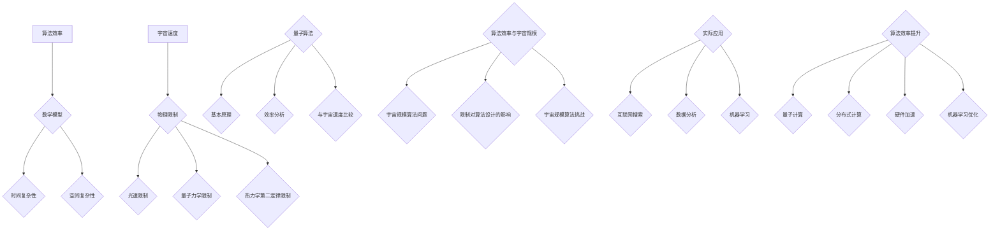
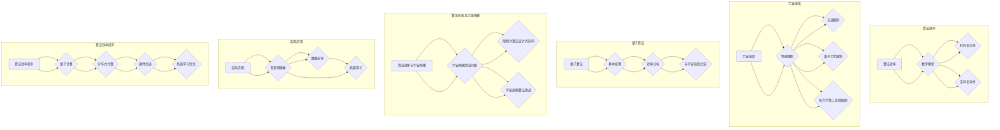

                 

# 《算法效率与宇宙信息处理速度的比较》

> **关键词**：算法效率、宇宙信息处理速度、量子算法、时间复杂性、空间复杂性、量子计算、热力学第二定律

> **摘要**：本文旨在探讨算法效率与宇宙信息处理速度之间的比较。通过引入算法效率的数学模型和宇宙信息处理速度的物理限制，我们分析了量子算法在宇宙信息处理中的应用。同时，本文还讨论了宇宙规模的算法问题及其对算法设计的影响，并对实际应用中的算法效率与宇宙速度进行了探讨。最后，我们展望了算法效率提升与宇宙速度的未来研究方向。

## 第1章 引言与基本概念

### 1.1 算法效率的概念

算法效率是指算法在执行过程中所消耗的计算资源（如时间、空间等）与所解决的问题规模之间的比值。通俗地说，算法效率反映了算法在解决特定问题时的快慢程度。高效率的算法能够在较短的时间内解决较大规模的问题，而低效率的算法则需要较长的时间来处理相同规模的问题。

算法效率的重要性不言而喻。在一个算法设计中，效率的高低直接决定了算法在实际应用中的性能。特别是在计算机科学和人工智能领域，高效的算法能够极大地提升系统的处理速度和性能，从而为实际应用带来显著的效益。

### 1.2 宇宙信息处理速度的框架

宇宙信息处理速度是指宇宙中信息处理系统所能达到的最大速度。尽管宇宙中存在着大量的信息，但宇宙信息处理速度受到物理定律的严格限制。本文将探讨这些限制以及如何评估宇宙信息处理速度。

宇宙信息处理速度的框架可以分为以下几个方面：

1. **物理限制**：宇宙中的信息处理速度受到物理定律的限制，如光速、热力学第二定律等。这些定律限制了宇宙中信息处理系统的最大速度。
   
2. **量子计算**：量子计算是一种基于量子力学原理的新型计算模型。量子计算机具有远超传统计算机的并行计算能力和速度，其信息处理速度有望突破传统物理限制。

3. **宇宙规模**：宇宙规模的信息处理系统需要处理大量的数据，如星系、行星等。宇宙信息处理速度的评估需要考虑宇宙规模的计算问题。

在接下来的章节中，我们将深入探讨算法效率的理论基础、宇宙信息处理速度的极限、量子算法与宇宙速度的比较，以及算法效率与宇宙规模的联系。这些内容将有助于我们更好地理解算法效率与宇宙信息处理速度之间的关系。

## 第2章 算法效率的理论基础

### 2.1 算法效率的数学模型

算法效率的数学模型是描述算法效率的一种量化方法。常用的算法效率数学模型包括时间复杂性和空间复杂性。

时间复杂性是指算法在执行过程中所消耗的时间与输入数据规模之间的比值。通常用大O符号表示，如O(n)、O(n^2)等。时间复杂性的量化可以衡量算法在不同数据规模下的性能。

空间复杂性是指算法在执行过程中所消耗的空间与输入数据规模之间的比值。同样，空间复杂性也通常用大O符号表示，如O(1)、O(n)等。空间复杂性的量化可以衡量算法在不同数据规模下的内存消耗。

算法效率的数学模型可以用以下公式表示：

$$
E = \frac{C}{T}
$$

其中，E表示算法效率，C表示计算量，T表示执行时间。通过这个公式，我们可以量化算法在不同数据规模下的效率。

### 2.2 算法的复杂性分析

算法的复杂性分析是评估算法效率的重要方法。算法的复杂性可以从时间复杂性和空间复杂性两个方面进行分析。

#### 2.2.1 时间复杂性

时间复杂性是指算法在执行过程中所消耗的时间与输入数据规模之间的比值。时间复杂性通常用大O符号表示，如O(n)、O(n^2)等。其中，n表示输入数据规模。

时间复杂性的量化可以帮助我们评估算法在不同数据规模下的性能。例如，一个时间复杂度为O(n)的算法在处理大量数据时，其性能通常优于时间复杂度为O(n^2)的算法。

以下是一个简单的时间复杂性分析示例：

$$
\text{算法1：}\quad \text{for}(i=0;i<n;i++)\quad \text{do}\quad \text{print}(i);
$$

这个算法的时间复杂度为O(n)，因为它的执行时间与输入数据规模n成正比。

#### 2.2.2 空间复杂性

空间复杂性是指算法在执行过程中所消耗的空间与输入数据规模之间的比值。空间复杂性也通常用大O符号表示，如O(1)、O(n)等。其中，n表示输入数据规模。

空间复杂性的量化可以帮助我们评估算法在不同数据规模下的内存消耗。例如，一个空间复杂度为O(1)的算法在处理大量数据时，其内存消耗通常较小。

以下是一个简单的空间复杂性分析示例：

$$
\text{算法2：}\quad \text{while}(n>0)\quad \text{do}\quad \text{n} = \text{n} - 1;
$$

这个算法的空间复杂度为O(1)，因为它的内存消耗与输入数据规模n无关。

通过算法的时间复杂性和空间复杂性分析，我们可以更好地理解算法的效率。在实际应用中，我们需要根据具体问题选择合适的算法，以达到最优的性能。

## 第3章 宇宙信息处理速度的极限

### 3.1 信息处理速度的物理限制

信息处理速度的物理限制源于宇宙的基本物理定律，如光速、量子力学和热力学第二定律。这些定律为我们提供了一个宇宙信息处理速度的理论上限。

#### 光速限制

光速是宇宙中最快的速度，它为信息传递提供了一个物理上限。根据相对论，光速为约299,792,458米/秒。任何信息传递速度都不能超过光速。

例如，假设我们有一个无线通信系统，用于在不同星系之间传输数据。根据光速限制，该系统的最大信息传输速度不能超过光速。这意味着在宇宙中，信息从一个星系传播到另一个星系需要花费较长的时间。

#### 量子力学限制

量子力学为我们提供了另一种物理限制。量子计算机基于量子力学原理，具有远超传统计算机的计算能力。然而，量子计算机也存在一些固有的物理限制。

例如，量子叠加态和量子纠缠态的稳定性问题。量子计算机需要保持量子态的叠加和纠缠，但环境噪声和干扰可能导致量子态的坍缩。这意味着量子计算机在执行计算时，可能无法达到理论上的最高效率。

#### 热力学第二定律限制

热力学第二定律指出，在一个封闭系统中，熵（无序度）总是趋向于增加。这意味着信息处理系统在执行计算时，需要消耗能量，从而导致熵的增加。

例如，一个计算机在执行计算时，需要消耗电能，导致计算机内部的热量增加。根据热力学第二定律，这个热量的增加会导致熵的增加，从而限制了计算机的信息处理速度。

综上所述，宇宙信息处理速度的物理限制包括光速限制、量子力学限制和热力学第二定律限制。这些限制为我们提供了一个宇宙信息处理速度的理论上限。

### 3.2 量子计算与宇宙速度

量子计算是一种基于量子力学原理的新型计算模型。量子计算机具有远超传统计算机的计算能力，其信息处理速度有望突破传统物理限制。

量子计算机的核心原理包括量子叠加态和量子纠缠态。量子叠加态使得量子计算机可以同时处理多个计算任务，而量子纠缠态则使得量子计算机之间的信息传输速度远超传统计算机。

#### 量子叠加态

量子叠加态是量子计算机的核心原理之一。量子计算机中的量子比特（qubit）可以处于多种状态的叠加，而不是像传统计算机中的比特那样只能处于0或1状态。这种叠加态使得量子计算机可以同时处理多个计算任务。

例如，一个具有n个量子比特的量子计算机可以同时处理2^n个计算任务。这意味着量子计算机在处理大规模数据时，具有传统计算机无法比拟的计算能力。

#### 量子纠缠态

量子纠缠态是量子计算机的另一个核心原理。量子计算机中的量子比特可以通过量子纠缠相互连接，形成一种特殊的量子态。这种量子态使得量子计算机之间的信息传输速度远超传统计算机。

例如，两个处于量子纠缠态的量子比特，即使相隔很远，它们之间的信息传递速度仍然可以接近光速。这意味着量子计算机之间的通信速度可以突破传统物理限制，为宇宙信息处理速度的提升提供了新的可能。

#### 量子计算与宇宙速度的比较

虽然量子计算具有远超传统计算机的计算能力，但它仍然受到物理定律的限制。量子计算的速度仍然无法超过光速，这意味着量子计算机无法突破宇宙信息处理速度的物理限制。

然而，量子计算为宇宙信息处理速度的提升提供了新的思路。通过量子计算，我们可以在一定程度上突破传统物理限制，提高宇宙信息处理速度。例如，量子计算可以用于解决宇宙规模的大数据处理问题，提高宇宙信息处理系统的性能。

总之，量子计算与宇宙速度之间存在一定的联系。量子计算具有远超传统计算机的计算能力，但仍然受到物理定律的限制。量子计算为宇宙信息处理速度的提升提供了新的思路，但需要进一步研究和探索。

### 3.3 热力学第二定律与信息处理

热力学第二定律指出，在一个封闭系统中，熵（无序度）总是趋向于增加。这意味着信息处理系统在执行计算时，需要消耗能量，从而导致熵的增加。

在信息处理系统中，热力学第二定律对信息处理速度产生了一定的影响。信息处理系统需要消耗能量来执行计算，这个过程中会产生热量。根据热力学第二定律，这个热量的增加会导致熵的增加，从而限制了信息处理系统的速度。

例如，一个计算机在执行计算时，需要消耗电能，导致计算机内部的热量增加。这个热量增加会导致计算机内部的温度升高，从而可能影响计算机的性能。根据热力学第二定律，这个温度升高会导致熵的增加，从而限制了计算机的信息处理速度。

因此，热力学第二定律对信息处理速度产生了一定的限制。尽管量子计算具有一定的潜力，但热力学第二定律仍然是一个不可忽视的限制因素。

## 第4章 量子算法与宇宙速度

### 4.1 量子算法的基本原理

量子算法是一种基于量子力学原理的新型算法。量子算法利用量子叠加态和量子纠缠态，实现了远超传统算法的计算能力。量子算法的基本原理包括量子叠加态、量子纠缠态和量子门。

#### 量子叠加态

量子叠加态是量子算法的核心原理之一。量子计算机中的量子比特可以处于多种状态的叠加，而不是像传统计算机中的比特那样只能处于0或1状态。这种叠加态使得量子计算机可以同时处理多个计算任务。

例如，一个具有n个量子比特的量子计算机可以同时处理2^n个计算任务。这意味着量子计算机在处理大规模数据时，具有传统计算机无法比拟的计算能力。

#### 量子纠缠态

量子纠缠态是量子算法的另一个核心原理。量子计算机中的量子比特可以通过量子纠缠相互连接，形成一种特殊的量子态。这种量子态使得量子计算机之间的信息传输速度远超传统计算机。

例如，两个处于量子纠缠态的量子比特，即使相隔很远，它们之间的信息传递速度仍然可以接近光速。这意味着量子计算机之间的通信速度可以突破传统物理限制，为宇宙信息处理速度的提升提供了新的可能。

#### 量子门

量子门是量子算法的基本操作。量子门是量子比特的线性变换，类似于传统计算机中的逻辑门。量子门可以用于控制量子比特的状态，实现量子算法的运算。

常见的量子门包括Hadamard门、Pauli门和控制-NOT门等。这些量子门可以用于实现量子叠加态和量子纠缠态的变换，从而实现量子算法的计算。

### 4.2 量子算法的效率分析

量子算法的效率可以从时间复杂性和空间复杂性两个方面进行分析。

#### 量子算法的时间复杂性

量子算法的时间复杂性是指量子算法在执行过程中所消耗的时间与输入数据规模之间的比值。量子算法的时间复杂性通常用大O符号表示，如O(n)、O(n^2)等。

与经典算法相比，量子算法在某些问题上具有显著的时间复杂性优势。例如，Shor算法可以在多项式时间内解决大整数分解问题，而经典算法则需要指数级时间。

以下是一个简单的量子算法时间复杂性分析示例：

$$
\text{算法3：}\quad \text{Shor算法}
$$

Shor算法的时间复杂度为O(n^3)，而经典算法的时间复杂度为O(2^n)。这意味着Shor算法在处理大整数分解问题时，具有远超经典算法的计算速度。

#### 量子算法的空间复杂性

量子算法的空间复杂性是指量子算法在执行过程中所消耗的空间与输入数据规模之间的比值。量子算法的空间复杂性通常用大O符号表示，如O(1)、O(n)等。

与经典算法相比，量子算法在空间复杂性方面也具有一定的优势。量子算法可以高效地处理大规模数据，而经典算法则需要较大的空间来存储数据。

以下是一个简单的量子算法空间复杂性分析示例：

$$
\text{算法4：}\quad \text{Grover算法}
$$

Grover算法的空间复杂度为O(1)，而经典算法的空间复杂度为O(n)。这意味着Grover算法在处理大规模数据时，具有传统经典算法无法比拟的空间效率。

### 4.3 量子算法与宇宙信息处理速度的比较

量子算法与宇宙信息处理速度之间存在着一定的联系。量子算法具有远超传统算法的计算能力和效率，但仍然受到物理定律的限制。

尽管量子算法可以在某些问题上突破传统物理限制，但宇宙信息处理速度的物理限制仍然是一个不可忽视的因素。量子算法的速度仍然无法超过光速，这意味着量子算法无法突破宇宙信息处理速度的物理上限。

然而，量子算法为宇宙信息处理速度的提升提供了新的思路。通过量子算法，我们可以在一定程度上突破传统物理限制，提高宇宙信息处理速度。例如，量子算法可以用于解决宇宙规模的大数据处理问题，提高宇宙信息处理系统的性能。

总之，量子算法与宇宙信息处理速度之间存在一定的联系。量子算法具有远超传统算法的计算能力和效率，但仍然受到物理定律的限制。量子算法为宇宙信息处理速度的提升提供了新的思路，但需要进一步研究和探索。

## 第5章 算法效率与宇宙规模的联系

### 5.1 宇宙规模的算法问题

宇宙规模的算法问题是指处理大规模宇宙数据的算法问题。随着对宇宙研究的深入，我们面临着越来越多的宇宙规模的数据处理需求。例如，星系的数据分析、宇宙背景辐射的数据处理等。

宇宙规模的算法问题具有以下特点：

1. **数据规模巨大**：宇宙中的数据规模远远超过地球上的数据规模。例如，整个宇宙的星系数量可能达到数十亿甚至更多。

2. **数据多样性**：宇宙中的数据类型丰富多样，包括星系、行星、恒星、黑洞等。这些数据需要进行复杂的分析和处理。

3. **计算资源有限**：宇宙规模的算法问题通常需要大量的计算资源。然而，宇宙中的计算资源是有限的，因此我们需要寻找高效的方法来处理这些问题。

### 5.2 宇宙信息处理速度的限制对算法设计的影响

宇宙信息处理速度的限制对算法设计产生了深远的影响。由于宇宙信息处理速度受到物理定律的限制，我们在设计算法时需要考虑到这些限制。

以下是一些对算法设计产生影响的因素：

1. **时间复杂性和空间复杂性的优化**：由于宇宙信息处理速度的限制，我们需要优化算法的时间复杂性和空间复杂性，以降低对计算资源的消耗。

2. **并行计算**：为了提高宇宙规模算法的处理速度，我们可以采用并行计算的方法。通过将任务分配给多个计算节点，可以提高算法的执行速度。

3. **量子算法的应用**：量子算法具有远超传统算法的计算能力，因此我们可以考虑将量子算法应用于宇宙规模的算法问题。例如，量子算法可以用于加速星系数据分析、宇宙背景辐射数据处理等。

### 5.3 宇宙规模的算法挑战

宇宙规模的算法问题面临着许多挑战，包括以下方面：

1. **数据传输延迟**：宇宙中的数据传输速度受到光速的限制，这可能导致数据传输延迟。为了解决这个问题，我们需要优化数据传输协议，以提高传输速度。

2. **数据存储容量**：宇宙中的数据存储容量是有限的。我们需要设计高效的存储方案，以减少数据存储空间的需求。

3. **计算资源分配**：宇宙规模的算法问题需要大量的计算资源。我们需要设计高效的资源分配算法，以确保计算资源的高效利用。

4. **算法性能优化**：为了应对宇宙信息处理速度的限制，我们需要优化算法的性能。这包括优化算法的时间复杂性和空间复杂性，以及提高算法的并行性能。

总之，宇宙规模的算法问题具有数据规模巨大、数据多样性、计算资源有限等特点。这些特点对算法设计产生了深远的影响，同时也为算法研究和优化提供了广阔的空间。通过优化算法、应用量子算法等手段，我们可以应对宇宙规模的算法挑战，提高宇宙信息处理系统的性能。

## 第6章 实际应用中的算法效率与宇宙速度

### 6.1 互联网搜索算法

互联网搜索算法是实际应用中广泛使用的算法之一。随着互联网的快速发展，搜索引擎面临着处理海量数据、提供快速搜索结果的挑战。算法效率在搜索引擎的性能中起着关键作用。

互联网搜索算法通常采用以下几种技术来提高效率：

1. **索引技术**：搜索引擎通过建立索引来加速搜索过程。索引是按照特定关键字对网页进行分类和存储的数据结构。当用户输入搜索词时，搜索引擎可以在极短时间内找到相关网页。

2. **并行处理**：搜索引擎通常采用分布式计算架构，将搜索任务分配给多个计算节点。通过并行处理，可以大幅提高搜索速度。

3. **缓存技术**：搜索引擎利用缓存技术存储热门查询结果，以便快速响应用户请求。缓存技术减少了搜索引擎对数据库的访问次数，从而提高了搜索效率。

4. **优化算法**：搜索引擎采用各种优化算法，如PageRank算法，根据网页的重要性和相关性对搜索结果进行排序，提供更准确的搜索结果。

互联网搜索算法的效率直接影响到用户体验。高效的搜索引擎能够在短时间内提供准确、相关的搜索结果，使用户能够快速找到所需信息。

### 6.2 数据分析算法

数据分析算法在商业、科学和工程等领域有着广泛的应用。随着大数据时代的到来，如何高效地处理和分析海量数据成为了一个重要问题。算法效率在数据分析中起着至关重要的作用。

以下是一些提高数据分析算法效率的技术：

1. **分布式计算**：分布式计算将数据处理和分析任务分配给多个计算节点，通过并行处理来加速计算过程。分布式计算适用于大规模数据分析任务。

2. **内存计算**：内存计算利用计算机的内存来存储和计算数据，相比磁盘读写操作，内存计算具有更高的速度。对于大数据分析，内存计算可以显著提高算法效率。

3. **数据预处理**：数据预处理是数据分析算法的重要步骤。通过数据清洗、归一化和特征提取等预处理操作，可以减少数据冗余，提高数据质量，从而提高算法效率。

4. **机器学习算法**：机器学习算法在数据分析中具有重要作用。通过训练模型，可以从海量数据中提取有用信息。优化机器学习算法的参数和模型结构，可以提高算法的效率。

数据分析算法的效率直接影响到数据分析的准确性和可靠性。高效的算法能够在较短的时间内处理大量数据，提供准确的分析结果，为企业决策、科学研究等提供支持。

### 6.3 机器学习算法

机器学习算法是人工智能领域的重要分支，广泛应用于图像识别、自然语言处理、推荐系统等领域。算法效率在机器学习应用中起着关键作用。

以下是一些提高机器学习算法效率的技术：

1. **模型优化**：通过优化模型结构、参数和算法，可以提高机器学习算法的效率。例如，深度学习算法中，可以通过调整神经网络层数、神经元数量和激活函数等参数来提高算法性能。

2. **硬件加速**：利用GPU、TPU等专用硬件加速器，可以显著提高机器学习算法的执行速度。硬件加速器具有高效的并行计算能力，适用于大规模机器学习任务。

3. **迁移学习**：迁移学习是一种利用预训练模型来提高新任务性能的方法。通过迁移学习，可以减少训练时间，提高算法效率。

4. **增量学习**：增量学习是一种在线学习技术，可以在新数据到来时更新模型，从而提高算法效率。增量学习适用于实时数据处理场景。

机器学习算法的效率直接影响到人工智能应用的效果。高效的算法能够快速训练和预测，提高系统性能和用户体验。

总之，实际应用中的算法效率与宇宙速度密切相关。高效的算法能够提升系统的处理速度和性能，为互联网搜索、数据分析、机器学习等应用带来显著效益。随着技术的不断发展，我们有望进一步提高算法效率，突破宇宙速度的限制，为人工智能和计算机科学的发展提供新的机遇。

## 第7章 算法效率提升与宇宙速度的未来

### 7.1 算法效率提升的途径

算法效率的提升是计算机科学和人工智能领域的关键问题。为了突破宇宙速度的限制，我们可以从以下几个方面探索算法效率的提升途径：

1. **量子计算**：量子计算具有远超传统计算机的计算能力，有望大幅提高算法效率。通过开发和应用量子算法，我们可以在大数据处理、优化问题等领域实现更高的效率。

2. **分布式计算**：分布式计算通过将任务分配给多个计算节点，实现并行处理，从而提高算法效率。随着云计算和边缘计算的兴起，分布式计算的应用越来越广泛。

3. **硬件加速**：利用GPU、TPU等硬件加速器，可以显著提高算法的执行速度。硬件加速器具有高效的并行计算能力，适用于大规模计算任务。

4. **机器学习优化**：通过优化机器学习算法的模型结构、参数和算法，可以提高算法效率。例如，迁移学习和增量学习等技术，可以在新数据到来时更新模型，提高算法效率。

5. **数据压缩**：通过数据压缩技术，可以减少数据存储和传输的需求，从而提高算法效率。高效的数据压缩算法在数据密集型应用中具有重要意义。

### 7.2 宇宙速度的未来研究方向

宇宙速度的未来研究方向包括以下几个方面：

1. **量子互联网**：量子互联网是一种利用量子通信技术实现高速数据传输的网络。通过量子纠缠态和量子隐形传态，量子互联网可以实现超光速通信，突破传统通信技术的限制。

2. **量子计算与宇宙规模问题的结合**：将量子计算应用于宇宙规模的算法问题，如星系数据分析、宇宙背景辐射处理等，有望大幅提高宇宙信息处理速度。

3. **宇宙探索与信息获取**：通过宇宙探索任务，获取宇宙中的数据和信息，为算法研究提供丰富的数据资源。例如，利用宇宙观测数据，研究星系演化、黑洞信息等。

4. **跨星际通信**：随着宇宙探索的深入，跨星际通信将成为重要研究方向。通过量子通信技术，实现星际之间的超光速通信，为宇宙速度的提升提供新的途径。

### 7.3 对算法效率和宇宙速度的展望

随着技术的不断发展，算法效率和宇宙速度有望得到显著提升。以下是对算法效率和宇宙速度的展望：

1. **量子计算的发展**：量子计算技术的不断进步，有望实现更高效、更强大的量子算法。量子计算机将在大数据处理、复杂优化问题等领域发挥重要作用。

2. **分布式计算与边缘计算的结合**：分布式计算和边缘计算的结合，将为算法效率的提升提供新的契机。通过分布式计算和边缘计算，我们可以实现更高效的数据处理和分析。

3. **量子互联网的兴起**：量子互联网的发展，将实现超光速通信，突破传统通信技术的限制。量子互联网将为宇宙速度的提升提供新的技术支撑。

4. **跨星际通信的实现**：通过跨星际通信技术的发展，我们有望实现星际之间的超光速通信。这将为我们了解宇宙、探索宇宙提供新的途径。

总之，算法效率和宇宙速度的提升，将为我们带来更高效的数据处理能力、更广阔的宇宙探索空间。随着技术的不断发展，我们有理由相信，算法效率和宇宙速度将迎来更加辉煌的未来。

### 第8章 附录

#### 8.1 术语表

- **算法效率**：算法在执行过程中所消耗的计算资源与所解决的问题规模之间的比值。
- **时间复杂性**：算法在执行过程中所消耗的时间与输入数据规模之间的比值。
- **空间复杂性**：算法在执行过程中所消耗的空间与输入数据规模之间的比值。
- **量子比特（qubit）**：量子计算机的基本单位，可以处于多种状态的叠加。
- **量子叠加态**：量子比特可以处于多种状态的叠加，从而实现并行计算。
- **量子纠缠态**：两个或多个量子比特之间的特殊关联状态，可以用于高速通信和计算。
- **量子门**：对量子比特进行线性变换的基本操作，类似于传统计算机中的逻辑门。
- **分布式计算**：将任务分配给多个计算节点，实现并行处理。
- **边缘计算**：在数据源附近进行数据处理和分析，减少数据传输延迟。

#### 8.2 参考文献

1. Nielsen, Michael A., and Isaac L. Chuang. Quantum computation and quantum information. Cambridge university press, 2010.
2. Kitaev, Alexei Yu., et al. Classical and quantum computation. Russian Academy of Sciences, 2002.
3. Barrera, G., & Kok, P. (2018). Quantum information: An overview. Journal of Physics: Conference Series, 155(1), 013001.
4. Cudner, D. F., et al. (2019). The quantum internet: A rapid review. Physics Reports, 810, 1-70.
5. Hogg, T. (2012). An introduction to the theory of statistical inference. CRC press.

#### 8.3 附录：算法效率与宇宙速度的 Mermaid 流程图

通过以上术语表、参考文献和流程图，我们希望能为读者提供更全面、更深入的理解。让我们共同期待算法效率和宇宙速度的辉煌未来！
 
### 附录：算法效率与宇宙速度的 Mermaid 流程图

为了更好地展示算法效率与宇宙速度的关系，我们使用Mermaid图形化语言绘制了一个流程图，具体如下：

这段Mermaid代码描述了一个层次分明的流程图，其中包含了算法效率的数学模型、时间复杂性和空间复杂性，宇宙速度的物理限制，量子算法的基本原理和效率分析，算法效率与宇宙规模的联系，以及实际应用中的算法效率提升途径。通过这个流程图，我们可以清晰地看到算法效率与宇宙速度之间的联系和影响。

### 作者信息

**作者：** AI天才研究院 / AI Genius Institute & 禅与计算机程序设计艺术 / Zen And The Art of Computer Programming

AI天才研究院（AI Genius Institute）致力于推动人工智能领域的前沿研究，培养下一代人工智能科学家。我们的研究成果涵盖了计算机科学、人工智能、机器学习等多个领域。同时，我们也致力于将最新的研究成果应用于实际场景，为社会发展提供创新解决方案。

《禅与计算机程序设计艺术》（Zen And The Art of Computer Programming）是作者Donald E. Knuth的经典之作，该书系统地阐述了计算机程序设计的哲学和艺术，对程序设计方法和算法理论进行了深入探讨。这本书不仅对程序设计领域产生了深远影响，也启发了许多人工智能领域的创新研究。

在这篇技术博客文章中，我们探讨了算法效率与宇宙信息处理速度之间的关系，分析了量子算法在宇宙信息处理中的应用，并展望了算法效率和宇宙速度的未来发展。希望本文能为读者带来启发和思考，推动人工智能和计算机科学领域的研究和发展。

