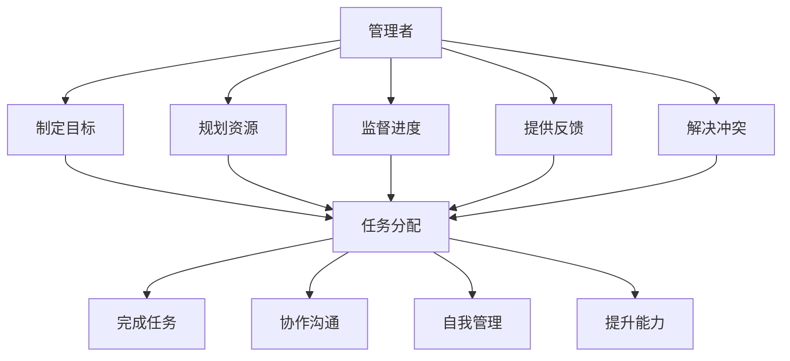
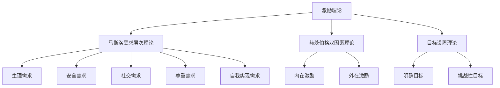
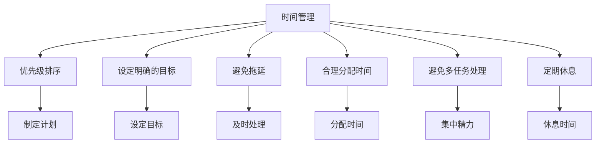
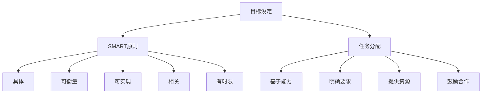
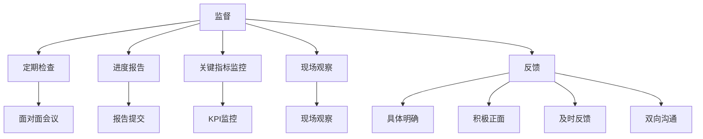
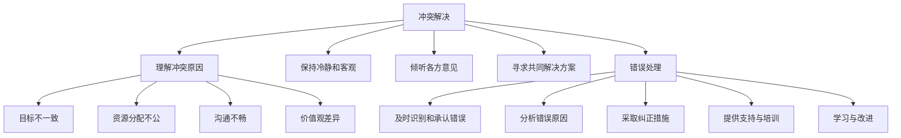
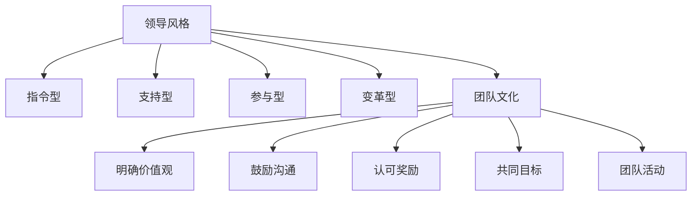
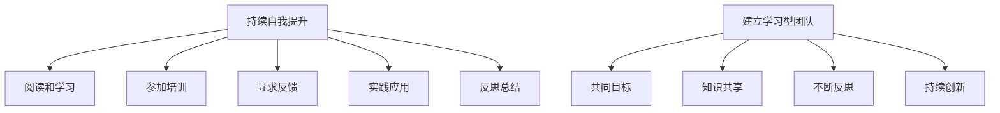
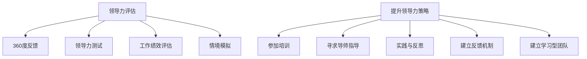

                 

### 文章标题

《管理者如何有效管理人员：实用指南》

---

关键词：团队管理、领导力、激励策略、目标设定、监督与反馈、冲突解决、领导风格

摘要：
本文旨在为管理者提供一套全面而实用的团队管理指南。通过详细探讨管理者与团队成员的关系、激励方法、时间管理技巧、目标设定与任务分配、监督与反馈、冲突解决、领导风格建设以及持续领导力提升的方法，本文将帮助管理者更加有效地管理和激励团队，提高工作效率和团队绩效。

---

本文将采用逻辑清晰、结构紧凑、简单易懂的写作方式，结合实际的案例分析和伪代码、数学模型讲解，为读者提供实用的管理知识和技巧。

<|assistant|>### 第一部分: 基础理论

#### 第1章: 管理者与团队成员的关系

在团队管理中，管理者与团队成员的关系是至关重要的。良好的关系能够促进团队协作，提高工作效率，而糟糕的关系则可能导致团队分裂和绩效下降。

##### 1.1.1 管理者与团队成员的角色

管理者是团队的核心，他们负责制定目标、规划资源、监督进度、提供反馈和解决冲突。团队成员则是执行者，他们负责具体任务的完成。

**管理者角色**：
- 制定目标：明确团队的目标和期望成果。
- 规划资源：确保团队拥有完成任务所需的资源。
- 监督进度：跟踪任务的进度，确保项目按计划进行。
- 提供反馈：对团队成员的工作进行评价，提供改进建议。
- 解决冲突：协调团队成员之间的关系，解决冲突。

**团队成员角色**：
- 完成任务：根据管理者的指示完成具体的工作任务。
- 协作沟通：与团队成员保持良好的沟通和协作。
- 自我管理：自我驱动，高效完成任务。
- 提升能力：不断学习新技能，提升自己的能力。

##### 1.1.2 有效沟通的重要性

有效沟通是管理者与团队成员之间建立良好关系的关键。它不仅能够传递信息，还能够建立信任和尊重。

**有效沟通的要素**：
- 明确目的：明确沟通的目标和目的，确保双方理解。
- 充分准备：提前准备所需的信息和数据，确保沟通内容准确。
- 主动倾听：倾听对方的观点和意见，理解其立场和需求。
- 正面反馈：提供积极的反馈，鼓励团队成员发表意见。
- 使用非语言信号：注意身体语言、语调和面部表情，以增强沟通效果。

##### 1.1.3 管理者与团队成员的互动机制

建立良好的互动机制有助于管理者更好地了解团队成员，同时也让团队成员感受到被重视和关注。

**互动机制的构建**：
- 定期会议：定期召开团队会议，讨论工作进展和问题。
- 一对一交流：与团队成员进行一对一交流，了解他们的需求和困难。
- 反馈机制：建立有效的反馈机制，鼓励团队成员提出意见和建议。
- 共享资源：共享团队资源和信息，促进知识共享和协作。

---

**核心概念与联系**：

为了更好地理解管理者与团队成员的关系，我们使用Mermaid流程图来展示两者的互动机制。

---

通过以上内容，我们可以看出，管理者与团队成员之间的互动机制是一个双向的过程，管理者需要发挥领导作用，而团队成员也需要积极参与和配合。只有双方共同努力，才能实现团队的高效运作。

在下一章中，我们将探讨管理者如何激励团队成员，以及如何通过激励来提高团队绩效。

<|assistant|>### 第2章: 管理者如何激励团队成员

在团队管理中，激励团队成员是管理者的一项重要任务。激励不仅能够提高团队成员的工作积极性，还能够提升团队的整体绩效。下面，我们将探讨管理者如何运用不同的激励理论和方法来激励团队成员。

##### 2.1.1 激励理论概述

激励理论是管理学中的一个重要分支，它研究如何通过激励来激发员工的工作动力和积极性。常见的激励理论包括：

- **马斯洛需求层次理论**：马斯洛认为人的需求可以分为生理需求、安全需求、社交需求、尊重需求和自我实现需求。管理者应根据员工的不同需求层次，提供相应的激励。
- **赫茨伯格双因素理论**：赫茨伯格将激励因素分为内在激励和外在激励。内在激励包括工作本身的兴趣和成就感，外在激励包括薪资、福利和工作环境等。管理者应同时关注内在和外在激励，以实现最佳激励效果。
- **目标设置理论**：目标设置理论认为，明确的、具有挑战性的目标能够激发员工的工作动力。管理者应帮助团队成员设定合理的目标，并提供必要的支持。

##### 2.1.2 常见激励策略

管理者可以采用多种策略来激励团队成员。以下是几种常见的激励策略：

- **奖励制度**：设立奖励制度，对完成任务优秀的团队成员进行奖励。奖励可以包括奖金、晋升机会、培训机会等。
- **认可与表扬**：及时对团队成员的成绩和努力进行认可和表扬。认可和表扬可以是一种口头表扬、书面表扬，甚至是在团队会议中分享成就。
- **职业发展机会**：为团队成员提供职业发展的机会，如培训、轮岗、晋升等。这能够激发团队成员的学习热情和职业追求。
- **工作环境优化**：提供良好的工作环境，如舒适的办公条件、先进的办公设备、良好的团队氛围等，能够提高团队成员的工作满意度和工作效率。

##### 2.1.3 针对团队成员的个性化激励

每个团队成员都有其独特的需求和动机，因此，管理者应采取个性化的激励策略。以下是一些个性化激励的方法：

- **了解团队成员**：通过沟通和观察，了解团队成员的兴趣、优点和需求。这有助于管理者制定个性化的激励计划。
- **定制目标**：根据团队成员的个人能力和兴趣，为其设定个性化的目标。这样，团队成员会感到目标更具挑战性和吸引力。
- **灵活的工作安排**：为团队成员提供灵活的工作安排，如远程工作、弹性工作时间等。这能够满足团队成员的不同需求，提高工作满意度。
- **特殊奖励**：对于特别优秀的团队成员，可以提供特殊的奖励，如休假、参加行业会议等。这样的奖励不仅能够激励团队成员，还能够增强团队的凝聚力。

---

**核心概念与联系**：

为了更好地理解激励理论，我们使用Mermaid流程图来展示激励的原理和策略。

---

通过以上内容，我们可以看出，激励团队成员需要综合考虑不同的激励理论和方法，并结合团队成员的个性化需求进行激励。管理者应根据实际情况灵活运用这些策略，以实现最佳激励效果。

在下一章中，我们将探讨时间管理与工作效率，帮助管理者更好地利用时间，提高团队的工作效率。

<|assistant|>### 第3章: 时间管理与工作效率

时间管理是管理者的一项重要技能，高效的利用时间不仅能够提高个人的工作效率，还能够提升整个团队的整体绩效。在本章中，我们将探讨时间管理的基本原则、提高工作效率的策略以及成功案例的分享。

##### 3.1.1 时间管理的基本原则

良好的时间管理是提高工作效率的基础。以下是一些基本的时间管理原则：

- **优先级排序**：将任务按照优先级排序，首先完成最重要和最紧急的任务。
- **设定明确的目标**：为每个任务设定明确的目标和时间限制，确保任务能够按时完成。
- **避免拖延**：及时处理任务，避免拖延。拖延会降低工作效率，增加压力。
- **合理分配时间**：合理分配时间，确保每个任务都有足够的时间来完成。
- **避免多任务处理**：尽量减少多任务处理，专注于一个任务，直到完成。

##### 3.1.2 提高工作效率的策略

以下是一些提高工作效率的具体策略：

- **制定工作计划**：每天早上制定一份详细的工作计划，列出当天需要完成的任务和目标。
- **专注工作**：在工作时尽量减少干扰，专注完成当前的任务。关闭社交媒体通知，集中精力处理工作。
- **使用时间管理工具**：使用时间管理工具，如日历、待办事项列表等，来跟踪和管理任务。
- **分解任务**：将大任务分解为小任务，一步一步完成，避免任务堆积。
- **学会说“不”**：合理拒绝那些无关紧要的任务，专注于最重要的工作。
- **定期休息**：定期休息，避免疲劳。短暂的休息能够提高工作效率。

##### 3.1.3 成功案例分享

以下是一个成功案例，展示了如何通过良好的时间管理和工作效率策略来提升团队绩效。

**案例：**一家软件公司的项目经理通过以下方法提高了团队的工作效率：

1. **优先级排序**：项目经理每周都会与团队成员开会，讨论任务的优先级，确保团队首先完成最重要的任务。
2. **设定明确的目标**：每个任务都有明确的目标和时间限制，团队成员知道自己需要完成的任务和截止日期。
3. **避免拖延**：项目经理鼓励团队成员及时处理任务，避免拖延。对于拖延的任务，项目经理会及时跟进。
4. **合理分配时间**：项目经理为团队成员分配合理的工作时间，确保每个任务都有足够的时间来完成。
5. **专注工作**：项目经理制定了团队的工作规则，要求团队成员在工作时减少干扰，专注于任务。
6. **使用时间管理工具**：项目经理使用项目管理软件来跟踪和管理任务，确保任务按时完成。
7. **定期休息**：项目经理每周安排一次团队休息日，让团队成员有足够的休息时间。

通过这些策略，项目经理成功地提高了团队的工作效率，缩短了项目的完成时间，并且团队的士气也显著提升。

---

**核心概念与联系**：

为了更好地理解时间管理和工作效率，我们使用Mermaid流程图来展示时间管理的基本原则和策略。

---

通过以上内容，我们可以看出，良好的时间管理和工作效率不仅能够提高个人的工作绩效，还能够提升整个团队的整体表现。管理者应灵活运用这些策略，以实现最佳的工作效率。

在下一章中，我们将探讨目标设定与任务分配，帮助管理者更好地规划和执行团队的工作。

<|assistant|>### 第4章: 目标设定与任务分配

目标设定和任务分配是团队管理中至关重要的环节，它们不仅决定了团队的工作方向和效率，也直接影响到团队成员的积极性和满意度。在本章中，我们将介绍SMART原则、任务分配技巧，并通过成功案例分享，展示如何有效地设定目标和分配任务。

##### 4.1.1 目标设定的SMART原则

SMART原则是一种常用的目标设定方法，它将目标设定为具体的、可衡量的、可实现的、相关的和有时限的。

- **具体（Specific）**：目标应明确具体，明确指出要达成的具体成果。
- **可衡量（Measurable）**：目标应有明确的衡量标准，能够通过数据或指标来评估进展和成果。
- **可实现（Achievable）**：目标应具有可实现性，即通过团队成员的努力可以实现。
- **相关（Relevant）**：目标应与团队的总体目标和战略一致，相关且有意义。
- **有时限（Time-bound）**：目标应设定明确的时间限制，确保任务有明确的时间节点。

##### 4.1.2 任务分配的技巧

有效的任务分配是确保团队目标实现的关键。以下是一些任务分配的技巧：

- **基于能力分配任务**：根据团队成员的技能和经验，为他们分配适合的任务。这不仅能提高任务完成的效率，还能促进团队成员的技能提升。
- **明确任务要求和期望**：在分配任务时，明确任务的要求和期望结果，确保团队成员理解任务的目标和重要性。
- **提供必要的资源和支持**：确保团队成员在完成任务时能够获得所需的资源和支持，避免因为资源不足而影响任务进度。
- **鼓励团队合作**：鼓励团队成员之间的合作和沟通，共同解决问题，提高任务的完成质量。

##### 4.1.3 成功案例分享

以下是一个成功案例，展示了如何通过SMART原则和有效任务分配来提升团队绩效。

**案例：**一家互联网公司的产品团队通过以下方法设定目标和分配任务，成功完成了多个重要项目：

1. **设定SMART目标**：产品团队在项目开始时，使用SMART原则设定了明确的目标。例如：“在三个月内，开发并上线一款具有高性能和高用户满意度的移动应用。”这个目标具体、可衡量、可实现、相关且有明确的时间限制。
2. **任务分配**：根据团队成员的技能和经验，产品经理将任务分配给不同的团队成员。例如，前端开发人员负责应用界面的设计与实现，后端开发人员负责应用逻辑与数据库的搭建。
3. **明确任务要求和期望**：产品经理在任务分配时，明确说明了每个任务的要求和期望结果，确保团队成员理解任务的目标和重要性。
4. **提供必要的资源和支持**：产品团队确保团队成员在完成任务时能够获得所需的资源和支持，包括技术文档、开发工具和测试环境等。
5. **鼓励团队合作**：产品经理鼓励团队成员之间的合作和沟通，定期召开团队会议，分享进度和问题，共同解决问题。

通过以上方法，产品团队成功地在三个月内完成了移动应用的开发和上线，并且应用的用户满意度高达90%。

---

**核心概念与联系**：

为了更好地理解目标设定和任务分配，我们使用Mermaid流程图来展示SMART原则和任务分配的流程。

---

通过以上内容，我们可以看出，目标设定和任务分配对于团队的成功至关重要。管理者应熟练掌握SMART原则和任务分配技巧，以实现团队的高效运作。

在下一章中，我们将探讨监督与反馈，帮助管理者更好地监控团队的工作进度，提供有效的反馈，促进团队成员的成长。

<|assistant|>### 第5章: 监督与反馈

监督与反馈是管理者确保团队工作顺利进行的重要手段。通过有效的监督，管理者可以实时了解团队的进度和问题，而反馈则有助于团队成员不断改进和成长。在本章中，我们将讨论监督的基本方法、提供有效反馈的技巧以及通过成功案例来展示这些方法的应用。

##### 5.1.1 监督的基本方法

监督是管理者对团队工作过程进行跟踪和管理的过程。以下是一些基本的方法：

- **定期检查**：定期检查团队成员的工作进度和质量，通过面对面的会议、电话会议或在线工具进行。
- **进度报告**：要求团队成员定期提交进度报告，总结已完成的工作和遇到的问题，以便管理者及时掌握团队情况。
- **关键指标监控**：设定关键指标（KPI）来监控团队的工作绩效，如完成任务的数量、质量和时间等。
- **现场观察**：定期到现场观察团队的工作情况，了解实际工作中遇到的问题和挑战。

##### 5.1.2 提供有效反馈

反馈是团队成员成长和进步的重要推动力。以下是一些提供有效反馈的技巧：

- **具体而明确**：在反馈时，应具体而明确地指出问题的所在，避免模糊和泛泛而谈。
- **积极正面**：反馈应更多地关注团队成员的努力和成就，而非仅指出错误。使用积极正面的语言，鼓励团队成员。
- **及时反馈**：及时提供反馈，使团队成员能够及时了解到自己的工作表现，并有机会进行调整和改进。
- **双向沟通**：鼓励团队成员参与反馈过程，让他们表达自己的观点和感受，这有助于建立信任和理解。

##### 5.1.3 成功案例分享

以下是一个成功案例，展示了如何通过有效的监督与反馈来提升团队绩效。

**案例：**一家技术公司的项目经理通过以下方法监督与反馈团队的工作：

1. **定期检查**：项目经理每周与团队成员进行一次一对一的进度检查会议，了解每个人的工作进展和遇到的问题。通过面对面的交流，项目经理能够及时发现并解决问题。
2. **进度报告**：团队成员每天提交工作进度报告，项目经理通过查看报告来监控团队的整体进度和各个任务的状态。
3. **关键指标监控**：项目经理设定了多个关键指标，如任务完成率、代码质量评分、用户反馈等，来评估团队的工作绩效。
4. **现场观察**：项目经理定期到开发现场观察团队的工作情况，了解实际开发中的问题，并给予及时的指导。
5. **积极反馈**：项目经理在反馈时，注重积极正面地评价团队成员的努力和成就，同时具体指出需要改进的地方，并提供解决方案。
6. **及时反馈**：项目经理鼓励团队成员遇到问题时及时沟通，而不是等到问题积累。项目经理在发现问题时，会及时提供反馈，帮助团队成员找到解决方案。

通过以上方法，项目经理成功地提升了团队的工作效率和绩效，团队成员的工作满意度也显著提高。

---

**核心概念与联系**：

为了更好地理解监督与反馈，我们使用Mermaid流程图来展示监督与反馈的过程和技巧。

---

通过以上内容，我们可以看出，有效的监督与反馈对于团队的成功至关重要。管理者应熟练掌握监督与反馈的方法，以帮助团队不断进步和成长。

在下一章中，我们将探讨解决冲突与处理错误，帮助管理者更好地应对团队中的挑战。

<|assistant|>### 第6章: 解决冲突与处理错误

在团队工作中，冲突和错误是不可避免的。有效的冲突解决和错误的处理不仅能够维护团队的和谐，还能够提高团队的适应能力和创新能力。在本章中，我们将介绍解决冲突的策略、处理错误的技巧以及通过成功案例来展示这些方法的应用。

##### 6.1.1 冲突解决的策略

冲突解决是团队管理中的一个重要方面。以下是一些解决冲突的策略：

- **理解冲突原因**：首先，管理者需要理解冲突的根本原因。冲突可能源于目标不一致、资源分配不公、沟通不畅、价值观差异等。
- **保持冷静和客观**：在处理冲突时，管理者应保持冷静和客观，避免情绪化。冷静的分析有助于找到解决问题的最佳方法。
- **倾听各方意见**：管理者应给予冲突双方充分的时间来表达自己的观点和感受，倾听他们的意见，这有助于找到共同点。
- **寻求共同解决方案**：鼓励冲突双方共同寻找解决问题的方法，这样的解决方案更容易被接受和执行。
- **建立沟通渠道**：建立有效的沟通渠道，确保团队成员能够自由地表达意见和建议，减少冲突的发生。

##### 6.1.2 处理错误的技巧

错误是团队工作中不可避免的一部分。以下是一些处理错误的技巧：

- **及时识别和承认错误**：管理者应鼓励团队成员及时识别和承认错误，这有助于迅速解决问题，减少错误的影响。
- **分析错误原因**：对错误进行深入分析，找出导致错误的原因。这有助于预防未来类似错误的发生。
- **采取纠正措施**：根据错误原因，采取相应的纠正措施，确保错误不再发生。
- **提供支持与培训**：对因错误而受到影响的团队成员提供必要的支持和培训，帮助他们提升技能，增强自信心。
- **学习与改进**：将错误视为学习机会，通过总结经验教训，不断改进工作流程和方法。

##### 6.1.3 成功案例分享

以下是一个成功案例，展示了如何通过有效的冲突解决和错误处理来提升团队绩效。

**案例：**一家初创公司的产品团队在一次项目评审中遇到了严重的冲突。以下是如何解决冲突和错误的过程：

1. **理解冲突原因**：项目经理通过调查发现，冲突源于团队成员对项目目标的理解不一致，以及对资源分配的不满。
2. **保持冷静和客观**：项目经理保持了冷静和客观的态度，避免了进一步的冲突升级。
3. **倾听各方意见**：项目经理组织了一次团队会议，听取了冲突双方的意见，并试图理解他们的立场。
4. **寻求共同解决方案**：项目经理与团队一起讨论，找到了一个双方都能接受的解决方案，即重新调整项目目标和资源分配，确保每个人都能理解并支持项目。
5. **分析错误原因**：在冲突解决后，项目经理组织了一次会议，分析项目中的错误，并找出导致错误的原因。
6. **采取纠正措施**：项目经理根据分析结果，采取了一系列纠正措施，包括调整开发流程、提供额外的培训和支持，以及改进项目管理方法。
7. **提供支持与培训**：项目经理为团队成员提供了额外的培训和支持，帮助他们提升技能，并增强团队的合作能力。
8. **学习与改进**：团队从错误中吸取了教训，制定了改进计划，并在未来的项目中实施，以避免类似错误的发生。

通过以上方法，产品团队成功地解决了冲突，并从错误中吸取了宝贵的经验，团队的整体绩效得到了显著提升。

---

**核心概念与联系**：

为了更好地理解冲突解决和错误处理，我们使用Mermaid流程图来展示冲突解决和错误处理的流程。

---

通过以上内容，我们可以看出，有效的冲突解决和错误处理对于团队的成功至关重要。管理者应熟练掌握这些策略和技巧，以帮助团队克服挑战，不断提升团队绩效。

在下一章中，我们将探讨领导风格与团队文化建设，帮助管理者打造积极向上的团队氛围。

<|assistant|>### 第7章: 领导风格与团队文化建设

领导风格和团队文化建设是团队管理中不可或缺的两个方面。领导风格决定了管理者如何引导和管理团队，而团队文化则是团队内在的工作氛围和行为规范。在本章中，我们将探讨不同领导风格的影响、建设积极团队文化的策略以及通过成功案例来展示这些方法的应用。

##### 7.1.1 领导风格的影响

领导风格对团队成员的行为和工作效率有着深远的影响。常见的领导风格包括：

- **指令型领导**：指令型领导者通过明确的指令和严格的控制来管理团队。这种风格适用于需要迅速做出决策和执行的任务，但在长期合作中可能会导致团队成员缺乏自主性和创新性。
- **支持型领导**：支持型领导者关注团队成员的需求和感受，提供支持和鼓励。这种风格有助于提高团队成员的满意度和忠诚度，但在高压环境下可能缺乏效率。
- **参与型领导**：参与型领导者鼓励团队成员参与决策过程，尊重他们的意见。这种风格能够激发团队成员的积极性和创造力，但需要更多的时间和沟通成本。
- **变革型领导**：变革型领导者通过激励和启发团队成员，推动团队进行变革和创新。这种风格适用于需要创新和突破的情境，但领导者需要具备强大的个人魅力和影响力。

##### 7.1.2 建设积极团队文化的策略

团队文化是团队内在的工作氛围和行为规范，对团队成员的士气和工作效率有着重要影响。以下是一些建设积极团队文化的策略：

- **明确价值观**：明确团队的价值观，并将其融入日常工作中。团队成员应共同遵守这些价值观，形成一致的行为规范。
- **鼓励开放沟通**：建立开放的沟通渠道，鼓励团队成员自由表达意见和建议。这有助于建立信任和理解，减少冲突。
- **认可与奖励**：对团队成员的成绩和努力进行认可和奖励，增强他们的成就感和归属感。
- **共同目标**：设定明确的共同目标，确保团队成员都朝着同一个方向努力。这有助于增强团队凝聚力。
- **团队活动**：组织团队建设活动，如团建、培训、社交活动等，增强团队成员之间的联系和信任。

##### 7.1.3 成功案例分享

以下是一个成功案例，展示了如何通过合适的领导风格和团队文化建设来提升团队绩效。

**案例：**一家创业公司的产品团队在短短两年内迅速成长为行业领军者，其成功得益于合适的领导风格和团队文化建设：

1. **合适的领导风格**：公司创始人是一位变革型领导者，他通过激励和启发团队成员，推动团队不断创新和突破。他鼓励团队成员提出新的想法和改进方案，并给予充分的支持和资源。
2. **明确的价值观**：公司明确了“创新、协作、共赢”的价值观，并将其融入日常工作中。团队成员在工作中遵循这些价值观，形成了一致的行为规范。
3. **鼓励开放沟通**：公司建立了开放的沟通渠道，鼓励团队成员自由表达意见和建议。每周的团队会议都是开放的，任何团队成员都可以提出问题和建议。
4. **认可与奖励**：公司对团队成员的成绩和努力进行认可和奖励。每个月都会举行一次团队表彰大会，对优秀团队成员进行表彰和奖励。
5. **共同目标**：公司设定了明确的共同目标，如推出新一代产品、扩大市场份额等。团队成员都朝着这些目标努力，形成了一股强大的合力。
6. **团队活动**：公司定期组织团建活动和培训课程，增强团队成员之间的联系和信任。这些活动不仅提高了团队成员的士气，也促进了团队的合作和协作。

通过以上方法，产品团队在短时间内取得了显著的成果，成为行业内的佼佼者。

---

**核心概念与联系**：

为了更好地理解领导风格和团队文化建设，我们使用Mermaid流程图来展示领导风格和团队文化建设的要素。

---

通过以上内容，我们可以看出，合适的领导风格和积极向上的团队文化对于团队的成功至关重要。管理者应根据自己的团队特点和需求，灵活运用不同的领导风格，并积极建设团队文化，以实现团队的高效运作和持续成长。

在下一章中，我们将探讨领导力发展的持续实践，帮助管理者不断提升自己的领导能力。

<|assistant|>### 第8章: 领导力发展的持续实践

领导力是一种可以通过持续学习和实践不断提升的能力。管理者要想在职业生涯中取得成功，就需要不断地自我提升，以适应不断变化的工作环境和挑战。在本章中，我们将探讨持续自我提升的方法、建立学习型团队的重要性以及通过成功案例来展示这些方法的应用。

##### 8.1.1 持续自我提升的方法

持续自我提升是管理者职业生涯中不可或缺的一部分。以下是一些有效的方法：

- **阅读和学习**：阅读是获取知识和信息的重要途径。管理者应定期阅读相关书籍、研究报告和行业资讯，了解最新的管理理念和技术动态。
- **参加培训和课程**：参加专业培训和课程，不仅能够系统学习管理知识和技能，还能够与同行交流，获取宝贵的实践经验。
- **寻求反馈**：定期向团队成员、同事和上级寻求反馈，了解自己的优点和不足，以便有针对性地进行改进。
- **实践和应用**：将学到的知识和技能应用到实际工作中，通过实践来检验和巩固自己的能力。
- **反思和总结**：定期对自己的工作和行为进行反思和总结，分析成功和失败的原因，从中吸取经验教训。

##### 8.1.2 建立学习型团队

建立学习型团队是提升团队整体领导力的关键。学习型团队具有以下特点：

- **共同学习目标**：团队成员共同设定学习目标，明确学习的内容和方向。
- **知识共享**：鼓励团队成员分享知识和经验，形成知识共享的文化。
- **不断反思**：团队定期反思工作方法和行为模式，从中发现问题和改进点。
- **持续创新**：鼓励团队成员不断创新和尝试，推动团队不断进步。

##### 8.1.3 成功案例分享

以下是一个成功案例，展示了如何通过持续自我提升和建立学习型团队来提升领导力和团队绩效。

**案例：**一家大型科技公司的CEO通过以下方法提升了领导力和团队绩效：

1. **持续自我提升**：CEO定期阅读管理类书籍和行业报告，参加行业峰会和研讨会，了解最新的管理理念和技术动态。他还通过自我反思和总结，不断提升自己的管理技能和领导能力。
2. **建立学习型团队**：CEO鼓励团队成员共同设定学习目标，并组织定期的学习会议。团队成员在会议中分享学习心得和经验，形成知识共享的文化。
3. **知识共享**：公司内部建立了知识库，团队成员可以将自己的知识和经验录入其中，供其他团队成员查阅和参考。
4. **持续创新**：CEO鼓励团队成员不断尝试新的工作方法和工具，推动团队不断进步和创新。
5. **反馈机制**：CEO建立了有效的反馈机制，定期与团队成员交流，了解他们的工作情况和需求，并提供指导和支持。

通过以上方法，CEO成功地提升了自己的领导力，并带领团队在短时间内取得了显著的成绩。团队的工作效率和质量显著提升，公司的市场份额和竞争力也大幅增加。

---

**核心概念与联系**：

为了更好地理解领导力发展的持续实践，我们使用Mermaid流程图来展示持续自我提升和建立学习型团队的方法。

---

通过以上内容，我们可以看出，持续自我提升和建立学习型团队是管理者提升领导力和团队绩效的有效方法。管理者应重视自我提升，并积极推动团队的学习和创新，以实现团队的长远发展。

在下一章中，我们将探讨管理者领导力评估与提升策略，帮助管理者系统地评估和提升自己的领导能力。

<|assistant|>### 第9章: 管理者领导力评估与提升策略

管理者领导力的评估与提升是团队管理中至关重要的一环。有效的评估可以帮助管理者了解自身的领导能力，发现不足并加以改进，而科学的提升策略则能帮助管理者不断提升自己的领导水平。在本章中，我们将讨论领导力评估的方法、提升策略以及通过成功案例来展示这些方法的应用。

##### 9.1.1 领导力评估的方法

领导力评估是了解管理者领导能力的重要手段。以下是一些常用的领导力评估方法：

- **360度反馈**：360度反馈是一种通过同事、下属和上级等多方对管理者进行评估的方法。这种方法能够提供全面的视角，帮助管理者了解自己的优势和不足。
- **领导力测试**：通过领导力测试，如MBTI（迈尔斯-布里格斯类型指标）和DISC（行为风格测试），管理者可以了解自己的领导风格和行为模式。
- **工作绩效评估**：通过对管理者的工作绩效进行评估，包括任务完成情况、团队绩效和个人贡献等，可以衡量管理者的领导能力。
- **情境模拟**：通过情境模拟，管理者可以在模拟的场景中展示自己的领导能力，这种方法能够测试管理者的应变能力和决策能力。

##### 9.1.2 提升领导力的策略

为了提升领导力，管理者可以采取以下策略：

- **参加培训与研讨会**：参加专业培训和研讨会，学习最新的管理理念和技能。这些活动不仅能够提供理论知识，还能够通过案例分析和互动交流，提高实践能力。
- **寻求导师指导**：找到经验丰富的导师，从他们那里学习领导力和管理技巧。导师的指导可以帮助管理者更快地成长。
- **实践与反思**：将学到的知识和技能应用到实际工作中，通过实践来检验和提升自己的领导能力。定期进行反思，总结经验教训。
- **建立反馈机制**：建立有效的反馈机制，定期收集团队成员的反馈，了解自己的领导效果，并根据反馈进行调整。
- **建立学习型团队**：推动团队建立学习型组织，鼓励团队成员共同学习和成长。通过知识共享和团队协作，提高整个团队的管理水平。

##### 9.1.3 成功案例分享

以下是一个成功案例，展示了如何通过领导力评估与提升策略来提升管理者的领导能力。

**案例：**一家中型企业的CEO通过以下方法提升了领导能力，并带领团队实现了公司的快速发展：

1. **领导力评估**：CEO通过360度反馈和领导力测试，评估了自己的领导能力，发现了自身的优势和不足。评估结果显示，CEO在战略规划和团队建设方面表现出色，但在沟通和情绪管理方面有待提升。
2. **参加培训与研讨会**：CEO参加了多场管理培训课程和行业研讨会，学习了最新的管理理念和工具。通过这些活动，CEO获得了丰富的理论知识，并学会了如何将理论应用到实际工作中。
3. **寻求导师指导**：CEO找到了一位经验丰富的行业导师，从导师那里学习到了宝贵的领导经验和策略。导师的建议和指导帮助CEO在沟通和情绪管理方面取得了显著进步。
4. **实践与反思**：CEO将学到的知识和技能应用到实际工作中，通过实践来提升自己的领导能力。同时，CEO定期进行反思，总结经验教训，不断改进自己的领导方法。
5. **建立反馈机制**：CEO建立了有效的反馈机制，定期收集团队成员的反馈，了解自己的领导效果，并根据反馈进行调整。这种做法不仅提高了团队的凝聚力，也增强了团队的执行力。
6. **建立学习型团队**：CEO推动了团队建立学习型组织，鼓励团队成员共同学习和成长。通过知识共享和团队协作，CEO带领团队在短时间内取得了显著的成绩，公司的市场份额和竞争力大幅提升。

通过以上方法，CEO成功地提升了自己的领导能力，并带领团队实现了公司的快速发展。

---

**核心概念与联系**：

为了更好地理解领导力评估与提升策略，我们使用Mermaid流程图来展示领导力评估和提升的方法。

---

通过以上内容，我们可以看出，有效的领导力评估与提升策略对于管理者的成长和团队的成功至关重要。管理者应重视领导力评估，并根据评估结果采取科学的提升策略，以不断提升自己的领导能力。

在附录部分，我们将提供一些常见管理工具和资源的推荐，以帮助读者更好地实践这些管理理念和方法。

<|assistant|>### 附录A: 常见管理工具介绍

在现代团队管理中，有效的工具和方法能够极大地提高管理效率和工作质量。以下是一些常见的管理工具介绍，这些工具涵盖了目标管理、项目管理、时间管理和团队协作等方面，有助于管理者更好地进行团队管理和任务执行。

##### A.1.1 OKR工作法

**OKR（Objectives and Key Results）**是一种目标设定和执行方法，它由英特尔公司创始人安德鲁·格罗夫提出，并在谷歌等公司中得到广泛应用。OKR的核心思想是通过设定具体的、可衡量的目标（Objectives）和关键结果（Key Results），来驱动团队的进步和绩效提升。

- **目标（Objectives）**：描述团队要达成的目标，通常是描述性、挑战性的句子。
- **关键结果（Key Results）**：具体、量化的指标，用来衡量目标实现的进度和成果。

**示例**：
- 目标：提高产品市场占有率。
- 关键结果：1. 增加新用户数10%。2. 提升用户留存率至85%。3. 完成三次市场调研并制定相应的推广策略。

OKR工作法的关键在于定期的回顾和评估，确保团队始终聚焦于最重要的目标和任务。

##### A.1.2 SMART目标设定法

**SMART**是一种目标设定的方法论，它将目标设定为具体（Specific）、可衡量（Measurable）、可实现（Achievable）、相关（Relevant）和有时限（Time-bound）的。

- **具体（Specific）**：目标要明确，具体描述要达成的成果。
- **可衡量（Measurable）**：目标要有具体的衡量标准，能够量化和评估。
- **可实现（Achievable）**：目标要现实，通过努力可以实现。
- **相关（Relevant）**：目标要与团队的整体目标一致。
- **有时限（Time-bound）**：目标要有明确的时间限制。

**示例**：
- 具体且可衡量：下个月完成新产品的市场推广。
- 可实现：我们有足够的资源和人力来完成市场推广。
- 相关：市场推广是新产品的关键步骤。
- 有时限：下个月是目标完成的时间限制。

SMART目标设定法有助于确保目标的明确性和可执行性，从而提高团队的工作效率。

##### A.1.3 项目管理工具介绍

现代项目管理工具可以帮助团队更好地规划、执行和监控项目。以下是一些常用的项目管理工具：

- **Trello**：一款基于看板（Kanban）方法的任务管理工具，适用于小型项目和团队协作。
- **Asana**：一款功能全面的项目管理工具，支持任务分配、进度跟踪和团队协作。
- **JIRA**：一款专业的项目管理工具，特别适用于软件开发团队，提供强大的任务跟踪和敏捷开发功能。
- **Microsoft Project**：一款传统的项目管理工具，适用于复杂项目的大型团队，提供详细的进度计划和资源管理功能。

这些工具提供了任务分配、进度跟踪、时间管理等功能，有助于团队高效地完成项目任务。

---

通过上述管理工具的介绍，我们可以看到，合理选择和使用管理工具对于提升团队的管理效率至关重要。管理者应根据团队的具体需求，选择适合的工具，以实现最佳的管理效果。

在下一部分，我们将推荐一些实用的管理资源，包括书籍、课程和管理工具，以供读者进一步学习和实践。

<|assistant|>### 附录B: 实用管理资源推荐

为了帮助读者更深入地了解团队管理的理论和方法，我们推荐了一系列实用的管理资源。这些资源涵盖了书籍、课程和管理工具，旨在为读者提供全面的学习和实践指导。

##### B.1.1 管理书籍推荐

- **《管理的实践》**：作者：彼得·德鲁克（Peter Drucker）
  - 这是德鲁克最著名的著作之一，详细阐述了管理的基本理论和实践方法。

- **《团队协作力》**：作者：詹姆斯·K·加斯凯（James K. Gasiorowski）
  - 本书介绍了团队协作的原理和实践技巧，帮助管理者提升团队协作效率。

- **《深度工作》**：作者：卡尔·纽波特（Cal Newport）
  - 探讨了在信息爆炸的时代，如何通过深度工作来提升个人和团队的工作效率。

- **《五星分级法》**：作者：戴维·尤里奇（Dave Ulrich）
  - 提供了人才管理和绩效评估的方法，帮助企业提升团队整体绩效。

##### B.1.2 管理课程推荐

- **《领导力与发展》**：哈佛商学院
  - 一门介绍领导力理论和实践的课程，适合希望提升领导能力的专业人士。

- **《项目管理基础》**：Coursera
  - 一门介绍项目管理基础知识和方法的在线课程，适合初学者和有经验的项目经理。

- **《团队协作技巧》**：LinkedIn Learning
  - 介绍团队协作的最佳实践，帮助团队提升沟通效率和协作能力。

- **《变革管理》**：edX
  - 探讨如何成功地实施组织变革，提高团队的适应能力和执行力。

##### B.1.3 管理工具推荐

- **Trello**：一款基于看板（Kanban）方法的任务管理工具，适用于小型项目和团队协作。

- **Asana**：一款功能全面的项目管理工具，支持任务分配、进度跟踪和团队协作。

- **JIRA**：一款专业的项目管理工具，特别适用于软件开发团队，提供强大的任务跟踪和敏捷开发功能。

- **Microsoft Teams**：微软推出的集成沟通和协作平台，支持团队会议、文档共享和任务管理。

- **Slack**：一款流行的团队沟通工具，支持实时消息传递、文件共享和集成第三方服务。

通过以上推荐的管理资源，读者可以系统地学习团队管理的理论和实践，提升自身的管理能力，并在实际工作中应用这些知识，从而实现团队的高效运作和持续成长。

---

通过本文的详细探讨，我们希望读者能够掌握有效的团队管理方法，提升领导力和工作效率。管理不仅是一种技能，更是一种艺术，需要不断地学习和实践。希望本文能够为您的团队管理工作提供有益的参考和启示。

---

**作者：AI天才研究院/AI Genius Institute & 禅与计算机程序设计艺术 /Zen And The Art of Computer Programming**

