                 

### 第1章：纳米材料的基本概念

纳米材料，作为一种具有特殊物理、化学和生物学性质的材料，其尺寸在纳米级别（1至100纳米）。这一章节将详细探讨纳米材料的定义与特性、分类与结构，以及其在现代科技中的应用前景。

#### 1.1 纳米材料的定义与特性

纳米材料是指至少在一维尺度上处于纳米级别的材料，即尺寸在1到100纳米之间的材料。纳米材料具有量子尺寸效应、表面效应和宏观量子隧道效应等独特性质。

##### 1.1.1 纳米材料的定义
纳米材料因其尺寸微小，表面积大，具有独特的物理、化学和生物学性质。它们在许多领域都展现出巨大的应用潜力，如电子器件、新能源材料、生物医学、环境保护等。

##### 1.1.2 纳米材料的特性
1. **高比表面积**：纳米材料的比表面积显著高于传统材料，这使其具有优异的吸附性能和催化活性。
2. **量子尺寸效应**：纳米材料的电子性质因尺寸缩小而发生变化，表现出与宏观材料不同的特性。
3. **优异的物理化学性质**：纳米材料通常具有与块体材料不同的电学、热学、光学和磁学性能。

#### 1.2 纳米材料分类与结构

##### 1.2.1 纳米材料分类
根据纳米材料的组成和结构，可以将纳米材料分为以下几类：
1. **单层纳米材料**：如单层石墨烯、单层过渡金属硫化物等。
2. **多层纳米材料**：如石墨烯烯层状材料、多层纳米管等。
3. **纳米颗粒**：如金纳米颗粒、量子点等。
4. **纳米膜与纳米线**：如纳米薄膜、纳米线阵列等。

##### 1.2.2 纳米材料结构
纳米材料具有独特的晶体结构和非晶态结构。在晶体结构中，纳米材料可能表现出与宏观材料不同的晶格缺陷和晶格应变。而在非晶态结构中，纳米材料则表现出独特的物理化学性质。

#### 1.3 纳米材料在现代科技中的应用前景

##### 1.3.1 应用领域
纳米材料在现代科技中有着广泛的应用前景，具体体现在以下几个方面：
1. **电子器件**：纳米材料在电子器件中的应用，如纳米晶体管、纳米传感器等。
2. **新能源材料**：纳米材料在太阳能电池、锂离子电池等新能源材料中的应用。
3. **生物医学**：纳米材料在药物传递、生物成像、生物传感器等生物医学领域的应用。
4. **环境保护**：纳米材料在废水处理、催化氧化、污染修复等环境保护领域的应用。

##### 1.3.2 发展趋势
1. **多功能化**：通过将多种功能集成到纳米材料中，实现多功能应用。
2. **智能化**：将纳米材料与智能传感器、机器学习等技术相结合，提升纳米材料的应用效能。
3. **规模化生产**：通过改进纳米材料的制备方法和生产设备，实现纳米材料的大规模生产。

### Mermaid 流程图

以下是一个描述纳米材料基本概念的 Mermaid 流程图：

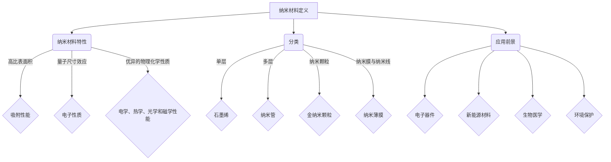
```mermaid
graph TD
A[纳米材料定义] --> B(纳米材料特性)
B -->|高比表面积| C{吸附性能}
B -->|量子尺寸效应| D{电子性质}
B -->|优异的物理化学性质| E{电学、热学、光学和磁学性能}
A --> F(分类)
F -->|单层| G{石墨烯}
F -->|多层| H{纳米管}
F -->|纳米颗粒| I{金纳米颗粒}
F -->|纳米膜与纳米线| J{纳米薄膜}
A --> K(应用前景)
K --> L{电子器件}
K --> M{新能源材料}
K --> N{生物医学}
K --> O{环境保护}
```

### 第2章：纳米材料的制备方法

纳米材料的制备方法多种多样，本章将介绍化学合成法、物理合成法以及纳米材料制备中的关键问题与解决策略。

#### 2.1 纳米材料的合成方法

##### 2.1.1 化学合成法
化学合成法是一种常见的纳米材料合成方法，包括以下几种：
1. **溶胶-凝胶法**：通过溶胶-凝胶过程制备纳米材料，适用于制备硅基、氧化物基纳米材料。
2. **共沉淀法**：通过化学沉淀反应制备纳米材料，适用于制备金属、金属氧化物和金属硫化物纳米材料。
3. **水热法**：在高温高压条件下进行化学反应，适用于制备各种纳米颗粒。

##### 2.1.2 物理合成法
物理合成法是通过物理过程制备纳米材料，包括以下几种：
1. **气相合成法**：通过气相反应制备纳米材料，适用于制备纳米颗粒和纳米膜。
2. **激光烧蚀法**：通过激光激发制备纳米材料，适用于制备金属、合金和化合物纳米材料。
3. **电化学沉积法**：通过电解反应制备纳米材料，适用于制备金属和金属氧化物纳米材料。

#### 2.2 纳米材料的制备技术

##### 2.2.1 纳米颗粒合成技术
纳米颗粒合成技术包括以下几种：
1. **模板合成法**：通过模板引导纳米颗粒的生长，适用于制备具有特定结构的纳米颗粒。
2. **溶胶凝胶法**：通过溶胶-凝胶过程制备纳米颗粒，适用于制备多孔和复合纳米颗粒。

##### 2.2.2 纳米线与纳米管合成技术
纳米线与纳米管合成技术包括以下几种：
1. **化学气相沉积法**：通过气相沉积制备纳米线与纳米管，适用于制备碳纳米管、硅纳米线等。
2. **模板合成法**：通过模板引导纳米线与纳米管的生长，适用于制备具有特定结构的纳米线与纳米管。

#### 2.3 纳米材料制备中的关键问题与解决策略

##### 2.3.1 尺度控制
纳米材料的尺度控制是制备过程中的关键问题，解决策略包括：
1. **控制反应条件**：通过调整反应温度、压力、反应物浓度等条件，控制纳米材料的尺寸。
2. **引入模板**：通过模板控制纳米材料的生长过程，实现尺寸的精确控制。

##### 2.3.2 形状与结构的调控
纳米材料形状与结构的调控是制备过程中的重要任务，解决策略包括：
1. **选择合适的合成方法**：不同的合成方法适用于制备不同形状和结构的纳米材料。
2. **表面修饰**：通过表面修饰剂调控纳米材料的形状与结构。

##### 2.3.3 纳米材料的纯度与分散性
纳米材料的纯度与分散性是影响其性能的重要因素，解决策略包括：
1. **优化合成条件**：通过优化合成条件，提高纳米材料的纯度与分散性。
2. **使用分散剂**：通过添加分散剂，防止纳米材料在合成过程中发生团聚。

### 伪代码示例

以下是一个简化的纳米材料制备过程的伪代码示例：

```python
# 纳米材料制备过程伪代码

def prepare_nano_material(method, template=None, conditions=None, additives=None):
    if method == "sol-gel":
        gel_formation()
        pyrolysis()
        if template:
            template_guided_growth(template)
        else:
            random_growth()

    elif method == "chemical_precipitation":
        reactants.mix()
        precipitate_form()
        filter_and_dry()

    elif method == "hydrothermal":
        reactor密封()
        high_temp_pressure_reaction()
        extract_and_purify()

    # 尺度控制
    adjust_reaction_conditions(conditions)

    # 形状与结构调控
    if template:
        shape_control(template)

    # 纯度与分散性优化
    purify_and_disperse(additives)

    return nano_material
```

### 第3章：纳米材料数据库平台的架构与设计

纳米材料数据库平台是一个复杂的信息系统，其核心在于数据的管理与应用。本章将介绍纳米材料数据库平台的总体架构、数据库设计原则和性能优化策略。

#### 3.1 数据库平台总体架构

纳米材料数据库平台的总体架构包括数据采集模块、数据处理模块、数据存储模块、数据展示模块和用户交互模块。

##### 3.1.1 数据库平台的功能模块

1. **数据采集模块**：负责从各种数据源（如学术论文、专利、实验室数据库等）收集纳米材料相关信息。
2. **数据处理模块**：对采集到的数据进行预处理、清洗、转换等处理，确保数据的一致性和完整性。
3. **数据存储模块**：负责存储处理后的数据，提供高效的数据检索和查询功能。
4. **数据展示模块**：将数据库中的数据以图表、报表等形式展示给用户。
5. **用户交互模块**：提供用户与数据库平台的交互接口，包括用户注册、登录、数据查询、下载等。

##### 3.1.2 数据库平台的架构设计

纳米材料数据库平台采用客户端/服务器架构，客户端负责用户交互和数据展示，服务器负责数据处理和存储。同时，数据库平台采用分布式数据库设计，以提高数据存储和处理能力，实现数据的横向扩展。

#### 3.2 数据库设计原则

##### 3.2.1 数据完整性
确保数据库中数据的完整性，防止数据丢失或错误。具体措施包括：
1. **数据校验**：在数据输入时进行校验，确保数据的正确性。
2. **数据备份**：定期备份数据库，防止数据意外丢失。

##### 3.2.2 数据一致性
确保数据库中数据的一致性，避免数据冲突和矛盾。具体措施包括：
1. **事务管理**：使用事务机制，确保数据的原子性和一致性。
2. **数据同步**：在分布式数据库中，实现数据同步，保持数据一致性。

##### 3.2.3 数据安全性
采取安全措施，防止数据库被非法访问和篡改。具体措施包括：
1. **访问控制**：实施严格的访问控制，确保只有授权用户可以访问敏感数据。
2. **数据加密**：对存储在数据库中的敏感数据进行加密处理。

##### 3.2.4 数据可扩展性
设计数据库时考虑未来的扩展性，适应数据量的增长。具体措施包括：
1. **分布式数据库**：采用分布式数据库设计，支持数据量的横向扩展。
2. **模块化设计**：设计模块化数据库架构，便于功能扩展和系统升级。

#### 3.3 数据库性能优化策略

##### 3.3.1 索引优化
通过建立合适的索引，提高数据检索速度。具体策略包括：
1. **选择合适的索引类型**：根据查询需求和数据特点，选择合适的索引类型（如B树索引、全文索引等）。
2. **索引维护**：定期维护索引，保持索引的有效性。

##### 3.3.2 缓存机制
采用缓存机制，减少数据库的直接访问，提高系统响应速度。具体策略包括：
1. **查询缓存**：缓存常用的查询结果，减少对数据库的访问次数。
2. **会话缓存**：缓存用户会话信息，提高用户交互效率。

##### 3.3.3 数据库分区
对数据库进行分区，提高数据查询和处理效率。具体策略包括：
1. **分区策略**：根据数据访问模式和特点，选择合适的分区策略（如范围分区、列表分区等）。
2. **分区维护**：定期维护分区，保持分区的有效性。

### Mermaid 流程图

以下是一个描述纳米材料数据库平台总体架构的 Mermaid 流程图：

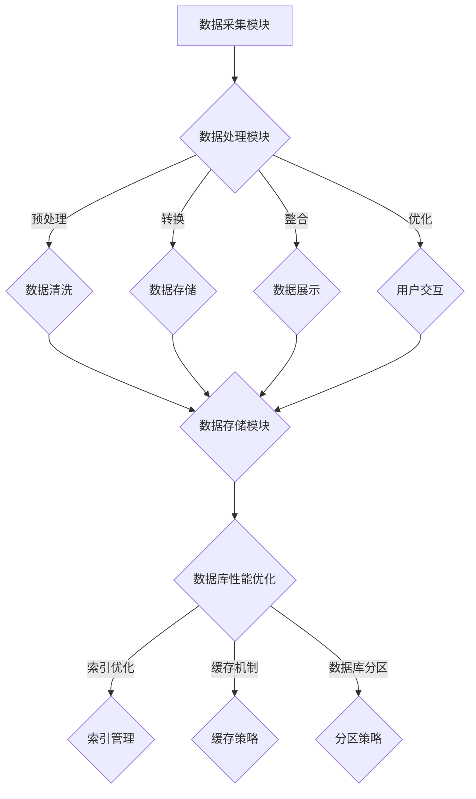
```mermaid
graph TD
A[数据采集模块] --> B{数据处理模块}
B -->|预处理| C{数据清洗}
B -->|转换| D{数据存储}
B -->|整合| E{数据展示}
B -->|优化| F{用户交互}
C --> G{数据存储模块}
D --> G
E --> G
F --> G
G --> H{数据库性能优化}
H -->|索引优化| I{索引管理}
H -->|缓存机制| J{缓存策略}
H -->|数据库分区| K{分区策略}
```

### 第4章：纳米材料数据的收集与处理

纳米材料数据库平台的数据收集与处理是确保平台有效运行的关键环节。本章将详细讨论纳米材料数据的来源、数据收集方法和数据处理与分析过程。

#### 4.1 纳米材料数据的来源

纳米材料数据库平台的数据来源主要包括以下几个方面：

##### 4.1.1 纳米材料数据库
通过访问各种纳米材料数据库，如NanoDB、NanoHub等，可以获取纳米材料的详细信息。这些数据库通常包含纳米材料的制备方法、物理化学性质、应用领域等。

##### 4.1.2 学术论文与专利
纳米材料的研究成果和专利信息是数据收集的重要来源。通过检索学术期刊和专利数据库，可以收集到大量的纳米材料研究论文和专利文件。

##### 4.1.3 实验室研究与数据共享
参与实验室研究项目，共享实验数据和研究成果，是获取纳米材料数据的重要途径。许多实验室和研究机构都愿意分享他们的实验数据。

##### 4.1.4 用户贡献
鼓励用户参与数据库建设，提交自己的研究成果和应用实例。用户贡献的数据可以丰富数据库内容，提高平台的实用性和价值。

#### 4.2 数据收集方法

数据收集方法包括自动化数据采集和手动数据收集两种方式。

##### 4.2.1 自动化数据采集
自动化数据采集是通过编写脚本或使用自动化工具从互联网上获取数据。常用的自动化数据采集工具包括Web爬虫、API接口调用等。例如，可以使用Python的requests库和BeautifulSoup库来编写爬虫脚本，从学术期刊和专利数据库中提取纳米材料数据。

python
import requests
from bs4 import BeautifulSoup

# 请求网页内容
url = "https://www.nature.com/articles/s41567-021-21674-0"
response = requests.get(url)

# 解析网页内容
soup = BeautifulSoup(response.text, "html.parser")
title = soup.find("h1", class_="title__2aC-B").text
abstract = soup.find("div", class_="abstract u-size--full-width").text

# 存储数据
data = {
    "title": title,
    "abstract": abstract
}

# 提交数据到数据库
# ...

##### 4.2.2 手动数据收集
手动数据收集是通过人工阅读文献、记录数据、整理表格等方式获取信息。这种方法适用于数据量较小或特定领域的研究。例如，研究人员可以阅读纳米材料相关的学术论文，将关键信息整理成表格，并导入数据库。

excel
# 手动整理纳米材料数据
# 1. 下载论文PDF文件
# 2. 阅读论文，提取关键信息
# 3. 整理成表格
# 4. 导入数据库

#### 4.3 数据处理与分析

数据处理与分析是确保数据准确性和有效性的关键步骤。本章将介绍数据处理与分析的过程。

##### 4.3.1 数据预处理
数据预处理包括数据清洗、去重、格式转换等步骤。预处理后的数据将更加规范和统一，便于后续处理和分析。

1. **数据清洗**：去除数据中的无效信息，如空白字符、特殊字符等。
2. **去重**：删除重复的数据记录，确保数据的唯一性。
3. **格式转换**：将不同格式的数据转换为统一的格式，如将文本数据转换为数值数据。

python
import pandas as pd

# 读取数据
data = pd.read_excel("nano_material_data.xlsx")

# 数据清洗
data = data.dropna()  # 去除空值
data = data.drop_duplicates()  # 去除重复记录

# 格式转换
data["size"] = pd.to_numeric(data["size"], errors="coerce")  # 转换尺寸为数值

##### 4.3.2 数据分析
数据分析是通过统计分析和数据挖掘方法，从数据中提取有价值的信息。本章将介绍常用的数据分析方法。

1. **描述性统计分析**：计算数据的统计量，如均值、中位数、标准差等，以了解数据的基本特征。
2. **相关性分析**：分析不同变量之间的关系，确定变量之间的相关性。
3. **聚类分析**：将相似的数据分为不同的群体，以便更好地理解数据。
4. **机器学习**：使用机器学习算法，如决策树、支持向量机、神经网络等，对数据进行分类、预测和分析。

python
from scipy import stats

# 描述性统计分析
mean_size = data["size"].mean()
median_size = data["size"].median()
std_size = data["size"].std()

# 相关性分析
correlation = data["size"].corr(data["property"])

# 聚类分析
from sklearn.cluster import KMeans

kmeans = KMeans(n_clusters=3)
clusters = kmeans.fit_predict(data[["size", "property"]])

# 机器学习
from sklearn.ensemble import RandomForestClassifier

rf = RandomForestClassifier()
rf.fit(data[["size", "property"]], data["class"])
predictions = rf.predict(data[["size", "property"]])

### 第5章：纳米材料数据库平台的用户界面设计

纳米材料数据库平台的用户界面设计是用户体验的重要组成部分。本章将介绍用户界面设计的原则、用户交互流程以及用户界面的实现与优化。

#### 5.1 用户界面设计原则

##### 5.1.1 用户体验
用户界面的设计应以用户体验为中心，确保界面简洁、直观、易于使用。以下原则有助于提升用户体验：

1. **一致性**：确保界面元素的外观和交互行为一致，降低用户的学习成本。
2. **简洁性**：避免界面过于复杂，减少不必要的元素和功能，确保用户能够快速找到所需信息。
3. **响应性**：界面应适应不同设备和屏幕尺寸，提供一致的浏览体验。

##### 5.1.2 功能性
用户界面应具备完整的功能，满足用户的各种需求，包括：

1. **数据查询**：提供高效的数据查询功能，允许用户根据关键词、分类等条件快速查找纳米材料信息。
2. **数据下载**：用户应能轻松下载感兴趣的数据，以进行进一步分析和研究。
3. **用户贡献**：鼓励用户提交自己的研究成果和应用实例，丰富数据库内容。

##### 5.1.3 可扩展性
界面设计应考虑未来的扩展性，便于添加新功能和模块，以适应不断变化的需求。

#### 5.2 用户交互流程

##### 5.2.1 数据查询流程
用户交互流程中的数据查询是核心功能之一。以下是一个典型的数据查询流程：

1. **输入查询条件**：用户在查询框中输入关键词或选择分类条件。
2. **提交查询请求**：用户提交查询请求，系统根据查询条件从数据库中检索相关数据。
3. **显示查询结果**：系统将查询结果以列表或表格形式展示给用户，允许用户浏览、筛选和排序。
4. **数据下载**：用户选择需要下载的数据，系统提供数据下载链接或数据包。

##### 5.2.2 数据下载流程
数据下载流程通常包括以下步骤：

1. **选择数据**：用户在查询结果中标记需要下载的数据。
2. **生成数据包**：系统将选定的数据打包，生成可下载的文件。
3. **下载数据**：用户点击下载链接，系统将数据包发送到用户的计算机或云存储账户。

##### 5.2.3 用户贡献流程
用户贡献流程包括以下步骤：

1. **注册与登录**：用户注册并登录平台，确保其身份验证。
2. **提交数据**：用户提交自己的研究成果和应用实例，系统对提交的数据进行审核。
3. **审核与存储**：审核通过的数据将被存储在数据库中，供其他用户查询和使用。

#### 5.3 用户界面实现与优化

##### 5.3.1 界面布局
界面布局应遵循清晰、直观的原则，确保用户能够轻松找到所需功能。以下是一些建议：

1. **导航栏**：将主要功能模块放置在导航栏中，便于用户快速切换。
2. **搜索框**：在页面顶部放置搜索框，方便用户快速进行数据查询。
3. **功能按钮**：为常见操作提供显眼的按钮，如“查询”、“下载”、“提交”等。

##### 5.3.2 响应式设计
响应式设计确保界面在不同设备和屏幕尺寸上都能良好显示。以下是一些建议：

1. **媒体查询**：使用媒体查询（Media Queries）调整不同屏幕尺寸下的布局和样式。
2. **弹性布局**：使用弹性布局（Flexbox）和网格布局（Grid），确保内容在不同屏幕尺寸上自适应排列。
3. **字体和图标**：使用可缩放矢量图形（SVG）和相对单位（如em、rem），确保字体和图标在不同屏幕上保持清晰可读。

##### 5.3.3 性能优化
性能优化是提升用户体验的重要方面。以下是一些建议：

1. **懒加载**：对图片和内容采用懒加载技术，减少初始加载时间。
2. **缓存策略**：实施有效的缓存策略，减少对后端数据库的访问次数。
3. **异步处理**：对于耗时操作，如数据查询和下载，采用异步处理方式，避免用户界面阻塞。

### Mermaid 流程图

以下是一个描述用户交互流程的 Mermaid 流程图：

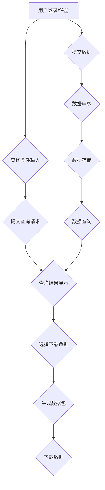
```mermaid
graph TD
A[用户登录/注册] --> B{查询条件输入}
B --> C{提交查询请求}
C --> D{查询结果展示}
D --> E{选择下载数据}
E --> F{生成数据包}
F --> G{下载数据}
A --> H{提交数据}
H --> I{数据审核}
I --> J{数据存储}
J --> K{数据查询}
K --> D
```

### 第6章：纳米材料数据库平台在材料研发中的应用

纳米材料数据库平台在材料研发中的应用主要体现在材料筛选、材料优化和材料合成等方面。本章将详细探讨纳米材料数据库平台在这些领域的具体应用。

#### 6.1 纳米材料数据库平台在材料筛选中的应用

纳米材料数据库平台在材料筛选中的应用主要是利用平台中丰富的纳米材料信息，帮助研究人员快速筛选出适合特定应用场景的纳米材料。

##### 6.1.1 材料筛选流程

材料筛选流程通常包括以下步骤：

1. **确定筛选条件**：研究人员根据项目需求，确定筛选纳米材料的条件，如尺寸、形状、化学成分等。
2. **查询数据库**：通过平台提供的查询接口，输入筛选条件，从数据库中检索符合条件的纳米材料。
3. **评估材料性能**：根据数据库中提供的纳米材料性能数据，评估材料的潜在应用价值。
4. **选择材料**：综合评估结果，选择最适合的纳米材料进行进一步研究。

##### 6.1.2 材料筛选案例

假设某研究项目需要寻找一种具有高电导率的纳米材料用于导电涂层。研究人员可以按照以下步骤进行筛选：

1. **确定筛选条件**：电导率大于10^6 S/m。
2. **查询数据库**：在平台中输入筛选条件，检索符合条件的纳米材料。
3. **评估材料性能**：查看材料的光学、热学、机械性能，确保材料不仅电导率高，还具有其他所需性能。
4. **选择材料**：从筛选结果中选择一种具有高电导率、良好光学和机械性能的纳米材料，如石墨烯纳米片。

#### 6.2 纳米材料数据库平台在材料优化中的应用

纳米材料数据库平台在材料优化中的应用主要是通过分析数据库中的纳米材料数据，为研究人员提供材料优化建议。

##### 6.2.1 材料优化流程

材料优化流程通常包括以下步骤：

1. **确定优化目标**：明确材料优化的目标，如提高电导率、增强抗氧化性、提升催化活性等。
2. **收集数据**：从数据库中收集相关纳米材料的性能数据，如电导率、抗氧化性、催化活性等。
3. **数据分析**：利用数据挖掘和机器学习技术，分析不同纳米材料之间的性能差异，找出影响性能的关键因素。
4. **优化建议**：根据数据分析结果，为研究人员提供材料优化的建议。

##### 6.2.2 材料优化案例

假设某研究项目需要优化一种纳米催化剂，以提高其催化活性。研究人员可以按照以下步骤进行优化：

1. **确定优化目标**：提高纳米催化剂的催化活性。
2. **收集数据**：从数据库中收集不同类型纳米催化剂的催化活性数据。
3. **数据分析**：分析不同催化剂的化学成分、结构、尺寸等因素与催化活性的关系。
4. **优化建议**：基于数据分析结果，建议研究人员调整催化剂的化学成分、结构或尺寸，以提升催化活性。

#### 6.3 纳米材料数据库平台在材料合成中的应用

纳米材料数据库平台在材料合成中的应用主要是为研究人员提供纳米材料制备方法和优化策略。

##### 6.3.1 材料合成流程

材料合成流程通常包括以下步骤：

1. **选择制备方法**：根据纳米材料的类型和性能需求，选择合适的制备方法，如溶胶-凝胶法、水热法、化学气相沉积法等。
2. **查阅制备指南**：从数据库中查阅相关纳米材料的制备方法和实验参数。
3. **调整制备参数**：根据数据库中的数据，调整制备过程中的温度、压力、反应时间等参数，优化材料性能。
4. **实验验证**：进行实验验证，评估制备方法的可行性和材料性能。

##### 6.3.2 材料合成案例

假设某研究项目需要合成一种具有高热稳定性的纳米材料，用于高温应用。研究人员可以按照以下步骤进行合成：

1. **选择制备方法**：选择溶胶-凝胶法作为制备方法。
2. **查阅制备指南**：从数据库中查阅溶胶-凝胶法合成纳米材料的相关指南。
3. **调整制备参数**：根据数据库中的数据，调整溶胶-凝胶法的实验参数，如反应温度、凝胶化时间等。
4. **实验验证**：进行实验验证，评估合成方法的高温稳定性和纳米材料的热学性能。

### Mermaid 流igrams

以下是一个描述材料筛选、优化和合成流程的 Mermaid 流程图：

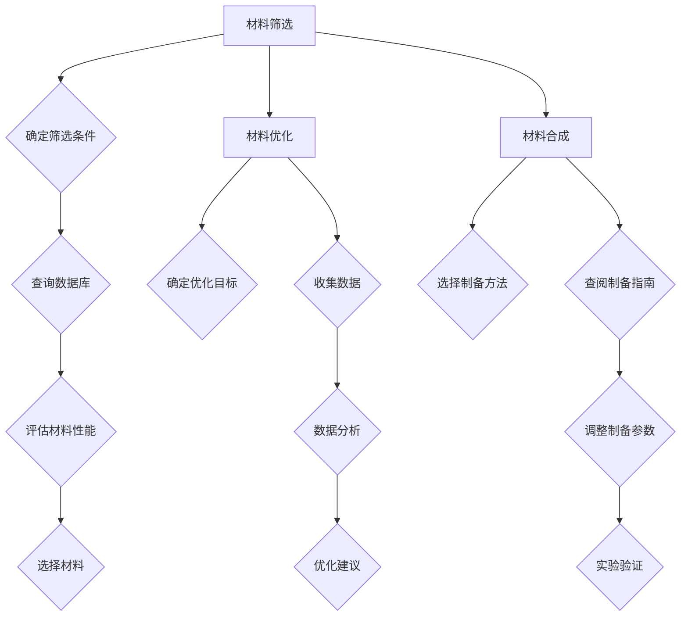
```mermaid
graph TD
A[材料筛选] --> B{确定筛选条件}
B --> C{查询数据库}
C --> D{评估材料性能}
D --> E{选择材料}

A --> F[材料优化]
F --> G{确定优化目标}
F --> H{收集数据}
H --> I{数据分析}
I --> J{优化建议}

A --> K[材料合成]
K --> L{选择制备方法}
K --> M{查阅制备指南}
M --> N{调整制备参数}
N --> O{实验验证}
```

### 第7章：纳米材料数据库平台的案例分析

本章将通过具体案例展示纳米材料数据库平台在实际应用中的效果和成果，分析案例的背景、分析过程和总结启示，以便为未来类似项目提供参考和指导。

#### 7.1 案例背景

纳米材料在生物医学领域具有广泛的应用前景，尤其在药物传递、生物成像和治疗方面。一个典型的案例是一个生物医学研究团队，他们致力于开发一种基于纳米材料的新型药物传递系统，以提高药物的生物利用度和治疗效果。

#### 7.2 案例分析

##### 7.2.1 数据收集
研究团队首先从纳米材料数据库平台中收集了多种纳米材料的信息，包括制备方法、物理化学性质和应用案例。这些数据来源于学术论文、专利文献和实验室数据。

##### 7.2.2 数据筛选
根据药物传递系统的需求，研究团队筛选出具有高生物相容性、低毒性、良好可控释放特性的纳米材料。他们使用了数据库平台的筛选功能，输入关键词和条件，快速找到了符合条件的纳米材料。

##### 7.2.3 材料优化
研究团队利用纳米材料数据库平台的数据，对筛选出的纳米材料进行性能优化。通过数据挖掘和机器学习算法，他们分析了不同纳米材料在释放速率、稳定性和生物相容性等方面的差异，并给出了优化建议。

##### 7.2.4 实验验证
根据优化建议，研究团队选择了一种具有较高释放速率和良好生物相容性的纳米材料进行实验验证。他们调整了纳米材料的制备参数，优化了药物负载和释放机制。

##### 7.2.5 结果分析
实验结果显示，优化后的纳米材料药物传递系统能够显著提高药物的生物利用度，降低副作用，提高治疗效果。研究团队将这些结果提交到数据库平台，与其他研究人员分享。

#### 7.3 案例总结与启示

##### 7.3.1 案例总结
通过纳米材料数据库平台，研究团队快速筛选并优化了一种适合药物传递的纳米材料，显著提高了药物传递系统的性能。这一案例展示了纳米材料数据库平台在材料研发中的重要作用。

##### 7.3.2 启示
1. **数据资源的重要性**：丰富的纳米材料数据资源是材料研发的基础，有助于快速筛选和优化材料。
2. **人工智能的应用**：数据挖掘和机器学习技术在纳米材料性能预测和优化中具有重要价值，可以提高研究效率。
3. **协作与共享**：纳米材料数据库平台促进了研究人员之间的协作与共享，有助于加速材料研发进程。
4. **标准化与规范化**：建立标准化和规范化的纳米材料数据库，可以提高数据的可靠性和一致性，为科研和工业应用提供支持。

### Mermaid 流程图

以下是一个描述纳米材料数据库平台在生物医学领域应用案例的 Mermaid 流程图：

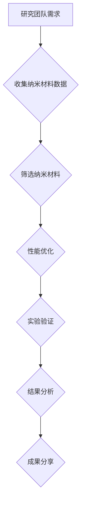
```mermaid
graph TB
A[研究团队需求] --> B{收集纳米材料数据}
B --> C{筛选纳米材料}
C --> D{性能优化}
D --> E{实验验证}
E --> F{结果分析}
F --> G{成果分享}
```

### 第8章：纳米材料数据库平台的未来发展趋势

纳米材料数据库平台作为材料科学研究的重要工具，其未来发展将受到技术创新、应用领域扩展和市场需求等多方面因素的影响。本章将探讨纳米材料数据库平台的未来发展趋势，包括技术发展、应用领域发展和未来挑战与机遇。

#### 8.1 技术发展趋势

##### 8.1.1 数据库技术的进步
数据库技术的发展将显著提升纳米材料数据库平台的性能和扩展性。例如，分布式数据库和NoSQL数据库的广泛应用，将使得平台能够更好地处理大规模、多样化的数据。此外，数据库索引和查询优化技术的进步，也将提高数据检索速度和查询效率。

##### 8.1.2 人工智能与机器学习
人工智能和机器学习技术在纳米材料数据库平台中的应用将不断深化。通过深度学习、数据挖掘和智能算法，平台将能够更准确地预测纳米材料的性能，提供更为智能的筛选和优化建议。此外，自然语言处理技术的发展，也将有助于自动化处理和解析大量非结构化数据，如学术论文和专利文献。

##### 8.1.3 物联网（IoT）与传感器技术
物联网和传感器技术的进步将使得纳米材料数据库平台能够实时收集和分析更多的实验数据和环境数据。例如，通过传感器网络，平台可以实时监控纳米材料在工业生产、环境监测和生物医学等领域的应用效果，为材料研发提供更直观的反馈。

#### 8.2 应用领域发展趋势

##### 8.2.1 生物医学
纳米材料在生物医学领域的应用前景广阔，包括药物传递、生物成像、癌症治疗和组织工程等。未来，纳米材料数据库平台将更加专注于生物医学领域，提供更加丰富的纳米材料信息和应用案例，促进生物医学研究的发展。

##### 8.2.2 能源领域
纳米材料在能源领域的应用正在逐渐兴起，如高效太阳能电池、高效锂离子电池和先进的储能材料等。未来，随着能源需求的增加和对可持续能源的重视，纳米材料数据库平台将进一步加强能源领域的数据收集和分析，为能源材料研发提供支持。

##### 8.2.3 环境保护
纳米材料在环境保护领域的应用，如废水处理、污染物检测和修复等，将随着环境保护意识的提高而增加。纳米材料数据库平台将提供更多关于纳米材料在环境保护中的应用数据，推动环境治理技术的发展。

#### 8.3 未来挑战与机遇

##### 8.3.1 数据质量和标准化
纳米材料数据库平台面临的挑战之一是数据质量和标准化。确保数据的准确性和一致性是平台成功的关键。未来，平台需要建立严格的数据质量控制和标准化体系，提高数据的可靠性和可对比性。

##### 8.3.2 技术整合与创新
纳米材料数据库平台需要整合多种先进技术，如人工智能、物联网和传感器技术等，以提高平台的功能和性能。技术创新将是平台未来发展的重要驱动力。

##### 8.3.3 市场竞争与合作
随着纳米材料数据库平台的普及，市场竞争将越来越激烈。平台需要不断创新，提升用户体验和功能，同时加强与其他机构和企业的合作，共同推动纳米材料数据库平台的发展。

##### 8.3.4 用户需求与隐私保护
满足用户需求是平台发展的基础。同时，随着用户数据的增加，隐私保护将成为一个重要问题。平台需要建立完善的用户隐私保护机制，确保用户数据的隐私和安全。

### Mermaid 流程图

以下是一个描述纳米材料数据库平台未来发展趋势的 Mermaid 流程图：

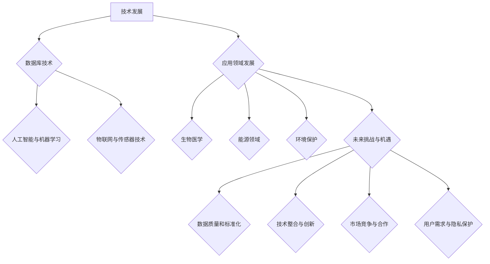
```mermaid
graph TB
A[技术发展] --> B{数据库技术}
B --> C{人工智能与机器学习}
B --> D{物联网与传感器技术}

A --> E{应用领域发展}
E --> F{生物医学}
E --> G{能源领域}
E --> H{环境保护}

E --> I{未来挑战与机遇}
I --> J{数据质量和标准化}
I --> K{技术整合与创新}
I --> L{市场竞争与合作}
I --> M{用户需求与隐私保护}
```

### 第9章：纳米材料数据库平台的创新方向

随着纳米材料技术的不断发展，纳米材料数据库平台也需要不断创新以适应新的需求。本章将探讨纳米材料数据库平台的创新方向，包括数据挖掘与机器学习、跨学科整合和智能化与自动化。

#### 9.1 数据挖掘与机器学习

数据挖掘与机器学习是纳米材料数据库平台创新的重要方向之一。通过数据挖掘和机器学习技术，可以从大量纳米材料数据中提取有价值的信息，提高材料筛选和优化的效率。

##### 9.1.1 数据挖掘技术
数据挖掘技术可以从纳米材料数据库中提取知识，发现数据之间的关系和规律。例如，通过关联规则挖掘，可以找出不同纳米材料性能指标之间的关联性，帮助研究人员进行材料筛选。

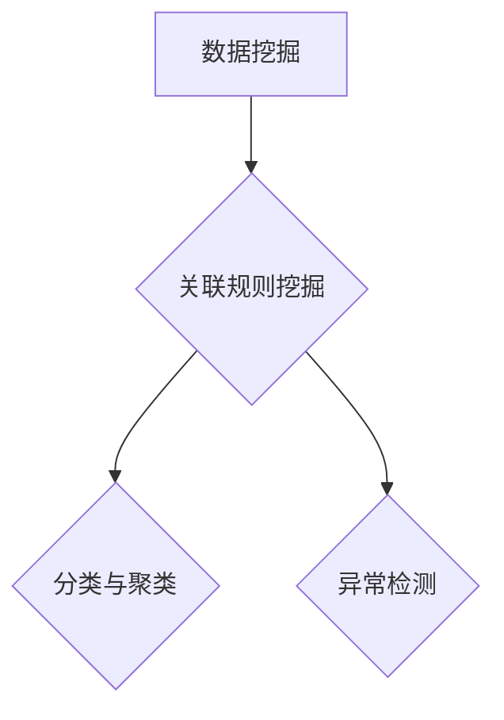
```mermaid
graph TB
A[数据挖掘] --> B{关联规则挖掘}
B --> C{分类与聚类}
B --> D{异常检测}
```

##### 9.1.2 机器学习技术
机器学习技术可以用于纳米材料性能预测和优化。通过训练机器学习模型，可以预测纳米材料的电导率、热稳定性等性能，为材料研发提供参考。

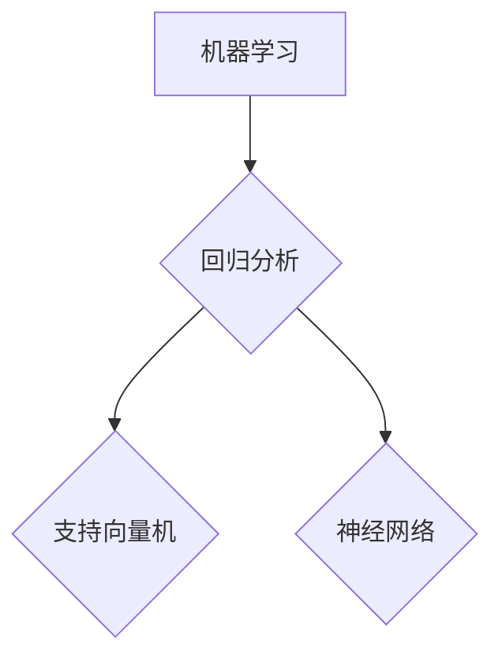
```mermaid
graph TD
A[机器学习] --> B{回归分析}
B --> C{支持向量机}
B --> D{神经网络}
```

#### 9.2 跨学科整合

纳米材料数据库平台的创新还在于跨学科整合，将纳米材料与其他领域（如生物医学、环境科学等）结合起来，拓展纳米材料的应用范围。

##### 9.2.1 生物医学
纳米材料在生物医学领域的应用前景广阔，如药物传递、生物成像和癌症治疗等。跨学科整合可以将纳米材料与生物医学知识相结合，开发出更高效的生物医学产品。

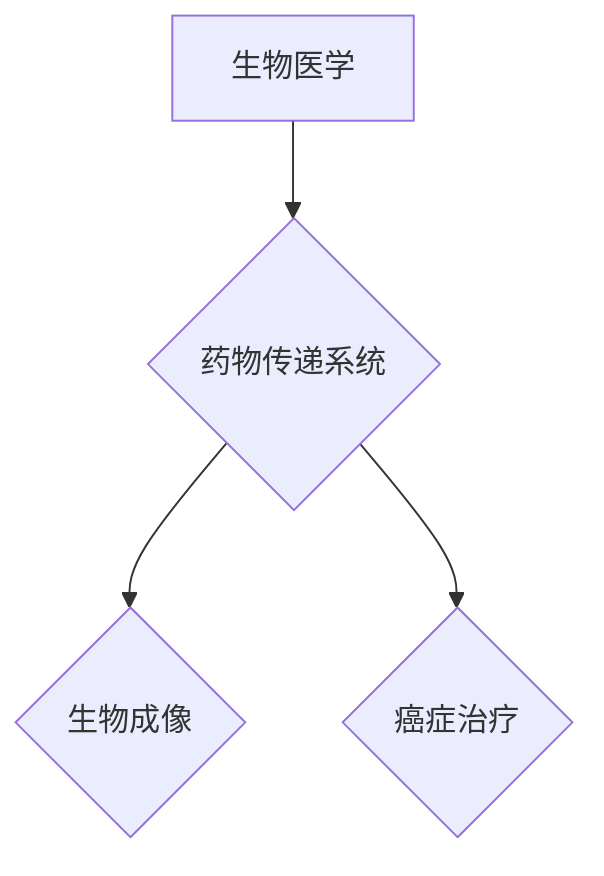
```mermaid
graph TD
A[生物医学] --> B{药物传递系统}
B --> C{生物成像}
B --> D{癌症治疗}
```

##### 9.2.2 环境科学
纳米材料在环境保护领域的应用，如废水处理、污染物检测和修复等，具有很大的潜力。跨学科整合可以将纳米材料与环境科学知识相结合，提高环境保护的效果。

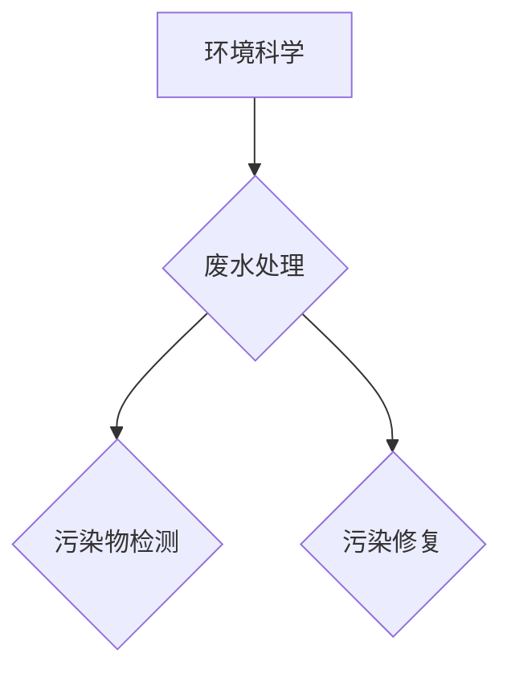
```mermaid
graph TD
A[环境科学] --> B{废水处理}
B --> C{污染物检测}
B --> D{污染修复}
```

#### 9.3 智能化与自动化

智能化与自动化是纳米材料数据库平台发展的另一个重要方向。通过智能化和自动化技术，可以提升平台的功能和效率，减少人力投入。

##### 9.3.1 智能化
智能化技术可以将人工智能和机器学习应用于纳米材料数据库平台，提高平台的智能化水平。例如，通过智能筛选系统，用户只需输入简单的查询条件，系统即可自动筛选出符合条件的纳米材料。

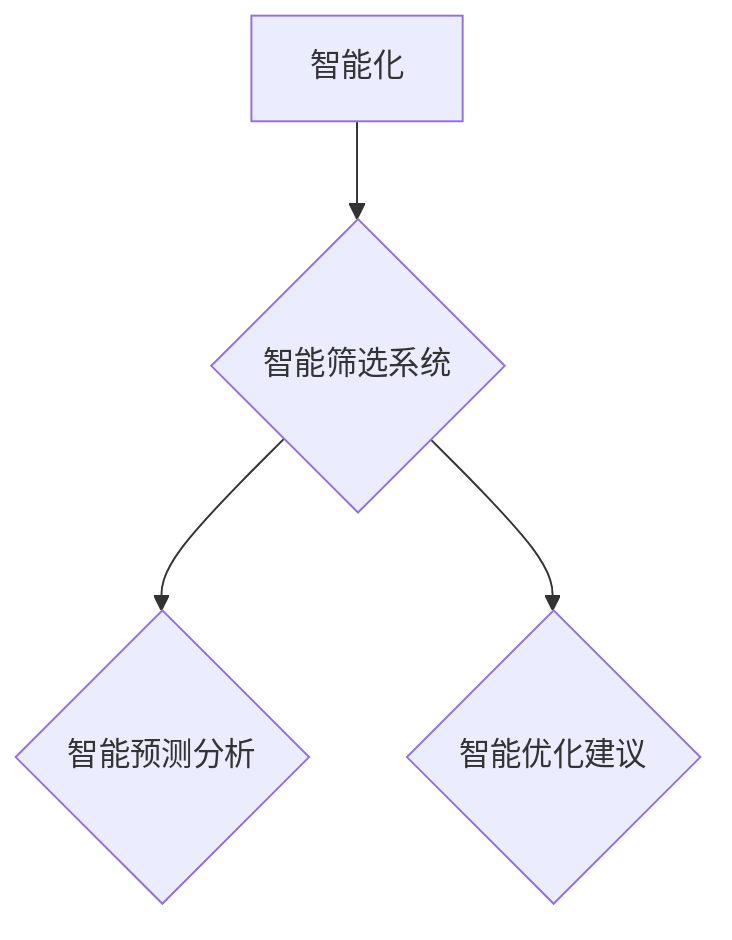
```mermaid
graph TD
A[智能化] --> B{智能筛选系统}
B --> C{智能预测分析}
B --> D{智能优化建议}
```

##### 9.3.2 自动化
自动化技术可以自动化纳米材料数据库平台的许多操作，提高平台的效率。例如，通过自动化数据采集和自动化实验系统，可以大大减少人工操作和错误。

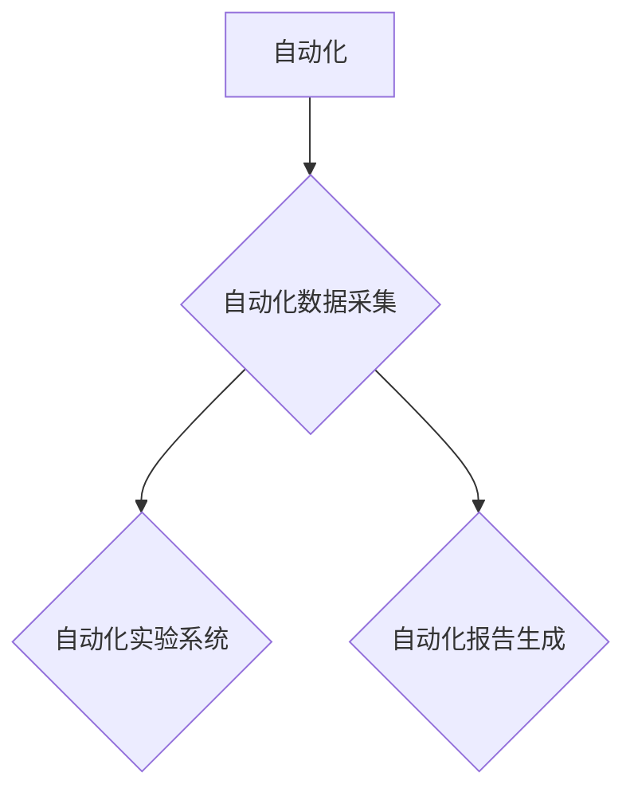
```mermaid
graph TD
A[自动化] --> B{自动化数据采集}
B --> C{自动化实验系统}
B --> D{自动化报告生成}
```

### Mermaid 流程图

以下是一个描述纳米材料数据库平台创新方向的 Mermaid 流程图：

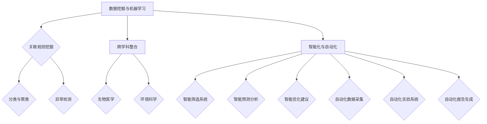
```mermaid
graph TB
A[数据挖掘与机器学习] --> B{关联规则挖掘}
B --> C{分类与聚类}
B --> D{异常检测}

A --> E[跨学科整合]
E --> F{生物医学}
E --> G{环境科学}

A --> H[智能化与自动化]
H --> I{智能筛选系统}
H --> J{智能预测分析}
H --> K{智能优化建议}
H --> L{自动化数据采集}
H --> M{自动化实验系统}
H --> N{自动化报告生成}
```

### 第10章：纳米材料数据库平台在人工智能领域的应用

随着人工智能技术的快速发展，纳米材料数据库平台在人工智能领域的应用也越来越广泛。本章将探讨纳米材料数据库平台在人工智能中的应用，包括机器学习算法在纳米材料性能预测中的应用、深度学习算法在纳米材料性能预测中的应用，以及纳米材料数据库平台在人工智能应用中的挑战与机遇。

#### 10.1 机器学习算法在纳米材料性能预测中的应用

机器学习算法在纳米材料性能预测中具有重要的作用。通过训练机器学习模型，可以从大量纳米材料数据中提取出有用的信息，预测纳米材料的性能。

##### 10.1.1 线性回归
线性回归是一种常见的机器学习算法，可以用于预测纳米材料的性能。通过建立线性回归模型，可以将纳米材料的物理化学性质与性能指标联系起来。

```python
# 线性回归模型
from sklearn.linear_model import LinearRegression

model = LinearRegression()
model.fit(X_train, y_train)
y_pred = model.predict(X_test)
```

##### 10.1.2 支持向量机
支持向量机（SVM）是一种强大的分类和回归算法，可以用于预测纳米材料的性能。通过训练SVM模型，可以找出影响纳米材料性能的关键特征。

```python
# 支持向量机模型
from sklearn.svm import SVR

model = SVR()
model.fit(X_train, y_train)
y_pred = model.predict(X_test)
```

##### 10.1.3 随机森林
随机森林是一种基于决策树的集成算法，可以用于预测纳米材料的性能。随机森林通过构建多个决策树，并汇总它们的预测结果，提高预测的准确性。

```python
# 随机森林模型
from sklearn.ensemble import RandomForestRegressor

model = RandomForestRegressor()
model.fit(X_train, y_train)
y_pred = model.predict(X_test)
```

#### 10.2 深度学习算法在纳米材料性能预测中的应用

深度学习算法在纳米材料性能预测中具有巨大的潜力。通过构建复杂的神经网络，可以自动学习纳米材料数据中的特征和模式。

##### 10.2.1 卷积神经网络
卷积神经网络（CNN）是一种强大的图像处理算法，可以用于处理纳米材料的图像数据。通过CNN，可以自动提取图像中的特征，用于性能预测。

```python
# 卷积神经网络模型
from tensorflow.keras.models import Sequential
from tensorflow.keras.layers import Conv2D, Flatten, Dense

model = Sequential()
model.add(Conv2D(32, (3, 3), activation='relu', input_shape=(64, 64, 3)))
model.add(Flatten())
model.add(Dense(1, activation='linear'))
model.compile(optimizer='adam', loss='mean_squared_error')
model.fit(X_train, y_train, epochs=10, batch_size=32)
y_pred = model.predict(X_test)
```

##### 10.2.2 循环神经网络
循环神经网络（RNN）是一种用于处理序列数据的算法，可以用于处理纳米材料的序列数据。通过RNN，可以捕捉数据中的时间依赖关系，提高性能预测的准确性。

```python
# 循环神经网络模型
from tensorflow.keras.models import Sequential
from tensorflow.keras.layers import LSTM, Dense

model = Sequential()
model.add(LSTM(50, activation='relu', input_shape=(timesteps, features)))
model.add(Dense(1))
model.compile(optimizer='adam', loss='mean_squared_error')
model.fit(X_train, y_train, epochs=100, batch_size=64, validation_data=(X_val, y_val))
y_pred = model.predict(X_test)
```

#### 10.3 纳米材料数据库平台在人工智能应用中的挑战与机遇

纳米材料数据库平台在人工智能应用中面临着一系列挑战和机遇。

##### 10.3.1 挑战
1. **数据质量和标准化**：确保纳米材料数据库中数据的质量和一致性是一个挑战。数据标准化和规范化是关键。
2. **计算资源**：深度学习算法通常需要大量的计算资源，这对纳米材料数据库平台提出了高计算要求。
3. **安全性**：随着数据量的增加，数据安全和用户隐私保护变得至关重要。

##### 10.3.2 机遇
1. **智能筛选和优化**：通过人工智能技术，可以实现智能筛选和优化纳米材料，提高材料研发效率。
2. **跨学科整合**：纳米材料数据库平台可以与其他领域（如生物医学、环境科学等）整合，推动多学科研究。
3. **应用推广**：随着人工智能技术的普及，纳米材料数据库平台的应用范围将进一步扩大。

### Mermaid 流程图

以下是一个描述纳米材料数据库平台在人工智能领域应用的 Mermaid 流程图：

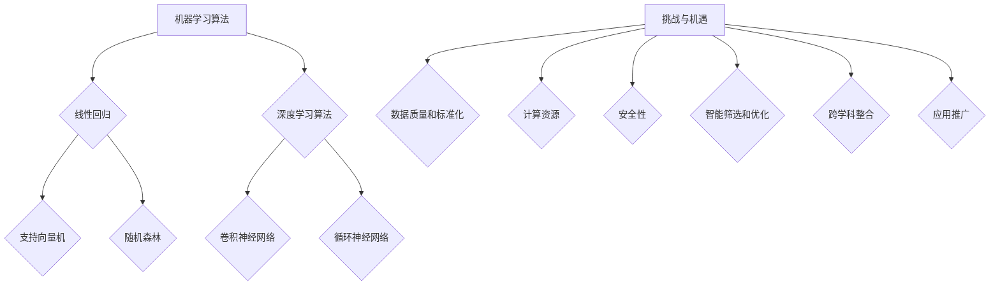
```mermaid
graph TD
A[机器学习算法] --> B{线性回归}
B --> C{支持向量机}
B --> D{随机森林}

A --> E{深度学习算法}
E --> F{卷积神经网络}
E --> G{循环神经网络}

H[挑战与机遇] --> I{数据质量和标准化}
H --> J{计算资源}
H --> K{安全性}
H --> L{智能筛选和优化}
H --> M{跨学科整合}
H --> N{应用推广}
```

### 第11章：纳米材料数据库平台在工业领域的应用

纳米材料数据库平台在工业领域具有广泛的应用前景，特别是在制造业、能源领域和环境工程中。本章将详细探讨纳米材料数据库平台在这些领域的应用案例和解决方案。

#### 11.1 纳米材料数据库平台在制造业中的应用

纳米材料在制造业中的应用，如涂料、电子制造、医疗设备等，已经成为提高产品质量和降低成本的关键因素。纳米材料数据库平台在制造业中的应用主要体现在材料筛选、工艺优化和产品创新等方面。

##### 11.1.1 材料筛选
纳米材料数据库平台可以帮助制造业企业快速筛选出适合特定应用场景的纳米材料。例如，在涂料制造中，企业可以根据涂料性能要求，从平台中选择具有高遮盖率、耐磨损和高附着力等特性的纳米材料。

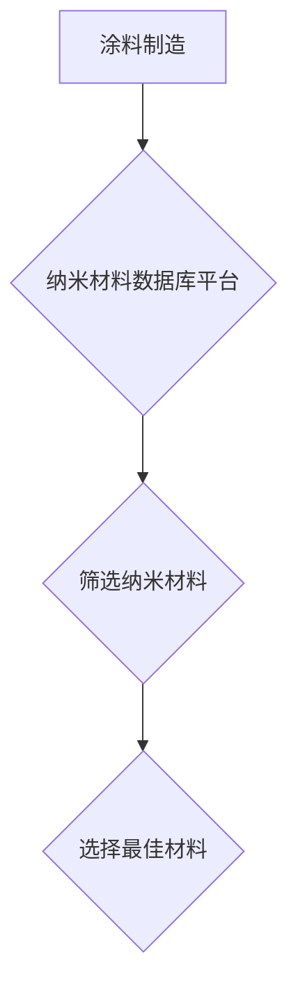
```mermaid
graph TB
A[涂料制造] --> B{纳米材料数据库平台}
B --> C{筛选纳米材料}
C --> D{选择最佳材料}
```

##### 11.1.2 工艺优化
纳米材料数据库平台中的实验数据和性能指标，可以为企业提供优化生产工艺的参考。例如，在电子制造中，企业可以通过平台分析不同纳米材料的电学性能，优化电子元件的制备工艺，提高产品的导电性和稳定性。

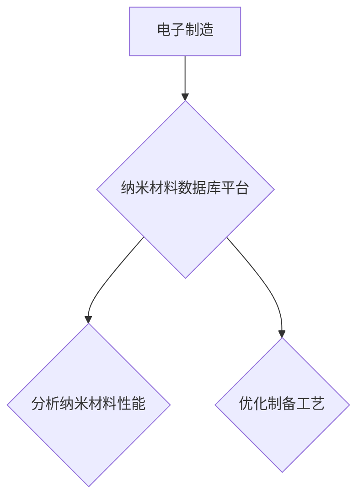
```mermaid
graph TD
A[电子制造] --> B{纳米材料数据库平台}
B --> C{分析纳米材料性能}
B --> D{优化制备工艺}
```

##### 11.1.3 产品创新
纳米材料数据库平台可以激发制造业企业的创新思维，推动新型产品的研发。例如，在医疗设备制造中，企业可以通过平台研究纳米材料在医疗传感器和植入材料中的应用，开发出更高效、更安全的医疗设备。

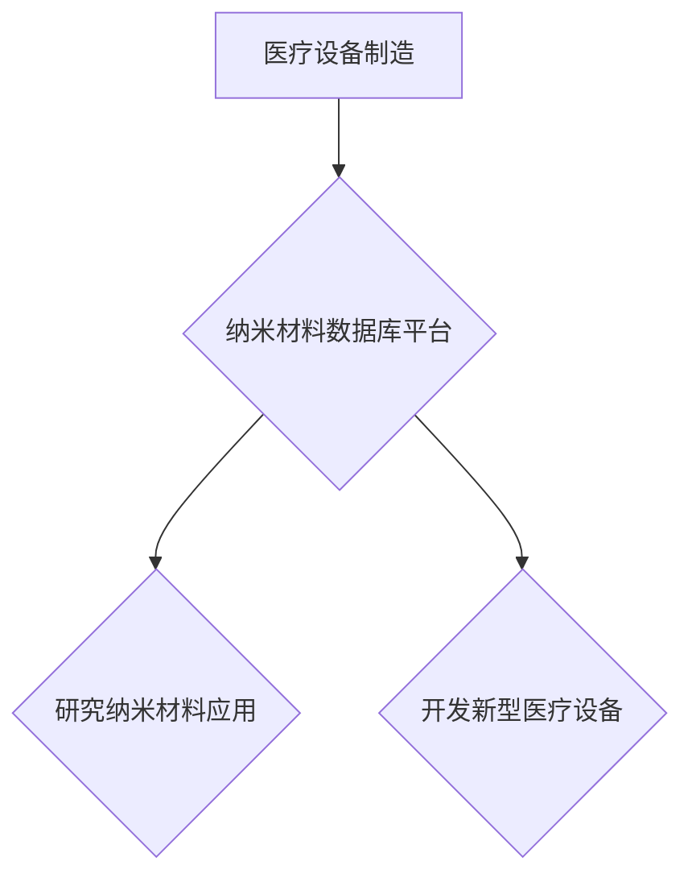
```mermaid
graph TB
A[医疗设备制造] --> B{纳米材料数据库平台}
B --> C{研究纳米材料应用}
B --> D{开发新型医疗设备}
```

#### 11.2 纳米材料数据库平台在能源领域中的应用

纳米材料在能源领域，如太阳能电池、锂离子电池和储能器件等，具有提高性能、降低成本的重要作用。纳米材料数据库平台在能源领域的应用主要体现在材料优化、性能预测和能源系统设计等方面。

##### 11.2.1 材料优化
纳米材料数据库平台可以帮助能源企业优化电池材料和能源存储系统。例如，在锂离子电池制造中，企业可以通过平台分析不同纳米材料在电池电导率、容量和循环寿命等方面的性能，选择最佳材料。

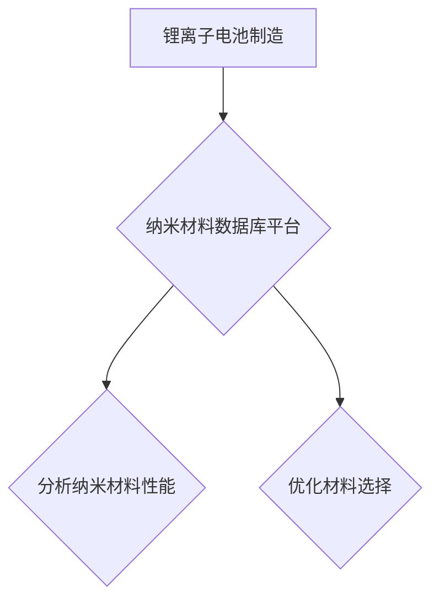
```mermaid
graph TD
A[锂离子电池制造] --> B{纳米材料数据库平台}
B --> C{分析纳米材料性能}
B --> D{优化材料选择}
```

##### 11.2.2 性能预测
纳米材料数据库平台中的数据可以用于预测纳米材料在能源系统中的应用性能。例如，在太阳能电池制造中，企业可以通过平台预测不同纳米材料的光电转换效率，优化电池设计。

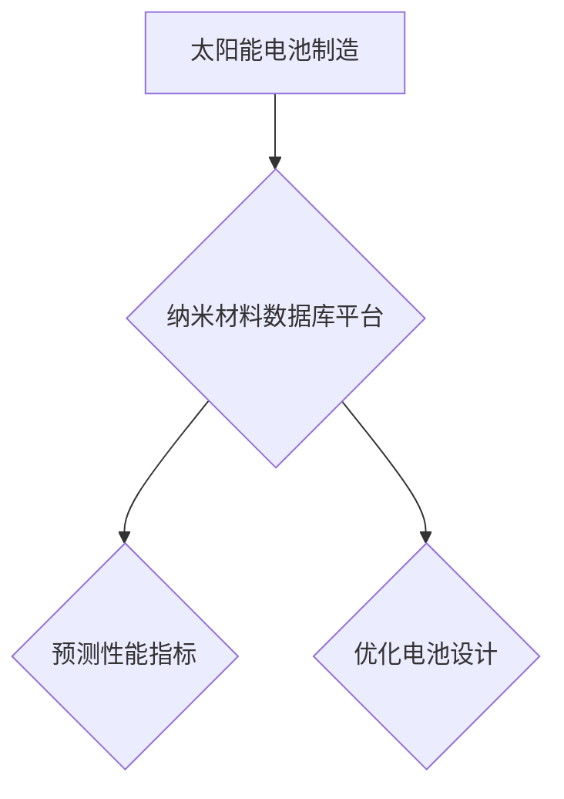
```mermaid
graph TD
A[太阳能电池制造] --> B{纳米材料数据库平台}
B --> C{预测性能指标}
B --> D{优化电池设计}
```

##### 11.2.3 能源系统设计
纳米材料数据库平台可以为能源系统的设计提供数据支持。例如，在储能器件设计中，企业可以通过平台分析不同纳米材料在能量密度、功率密度和安全性等方面的性能，设计出更高效、更可靠的储能系统。

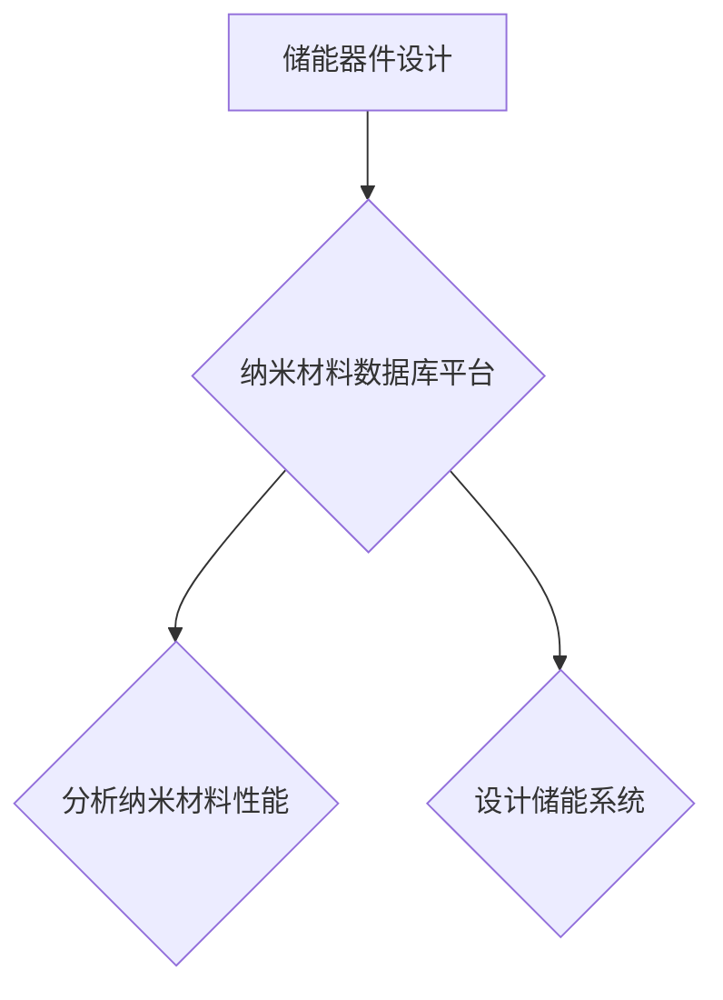
```mermaid
graph TD
A[储能器件设计] --> B{纳米材料数据库平台}
B --> C{分析纳米材料性能}
B --> D{设计储能系统}
```

#### 11.3 纳米材料数据库平台在环境工程中的应用

纳米材料在环境工程中的应用，如污染修复、环境监测和污水处理等，已经成为解决环境污染问题的重要手段。纳米材料数据库平台在环境工程中的应用主要体现在材料筛选、工艺优化和环境影响评估等方面。

##### 11.3.1 材料筛选
纳米材料数据库平台可以帮助环境工程师快速筛选出适合污染修复和环境监测的纳米材料。例如，在废水处理中，工程师可以通过平台选择具有高吸附能力和良好生物相容性的纳米材料。

```mermaid
graph TD
A[废水处理] --> B{纳米材料数据库平台}
B --> C{筛选纳米材料}
B --> D{选择最佳材料}
```

##### 11.3.2 工艺优化
纳米材料数据库平台可以为企业提供优化环境工程工艺的参考。例如，在污染修复项目中，工程师可以通过平台分析不同纳米材料在吸附性能、稳定性和再生能力等方面的性能，优化修复工艺。

```mermaid
graph TD
A[污染修复项目] --> B{纳米材料数据库平台}
B --> C{分析纳米材料性能}
B --> D{优化修复工艺}
```

##### 11.3.3 影响评估
纳米材料数据库平台中的数据可以用于评估纳米材料在环境工程中的应用效果。例如，在环境监测中，工程师可以通过平台分析纳米材料对污染物浓度的变化，评估其环境修复效果。

```mermaid
graph TD
A[环境监测] --> B{纳米材料数据库平台}
B --> C{评估纳米材料效果}
B --> D{评估环境修复效果}
```

### Mermaid 流程图

以下是一个描述纳米材料数据库平台在工业领域应用的 Mermaid 流程图：

```mermaid
graph TD
A[制造业] --> B{材料筛选}
B --> C{工艺优化}
B --> D{产品创新}

A --> E[能源领域]
E --> F{材料优化}
E --> G{性能预测}
E --> H{系统设计}

A --> I[环境工程]
I --> J{材料筛选}
I --> K{工艺优化}
I --> L{环境影响评估}
```

### 第12章：纳米材料数据库平台在国际合作与标准化中的应用

纳米材料数据库平台在国际合作与标准化中发挥着重要作用。本章将探讨纳米材料数据库平台在国际合作中的作用、在标准化中的作用，以及如何通过国际合作与标准化推动纳米材料数据库平台的发展。

#### 12.1 纳米材料数据库平台在国际合作中的作用

纳米材料数据库平台在国际合作中的作用主要体现在数据共享与交流、跨学科合作和国际学术会议与研讨会等方面。

##### 12.1.1 数据共享与交流
纳米材料数据库平台为全球的研究人员和工程师提供了一个共享和交流纳米材料数据的重要平台。通过平台，研究人员可以轻松地访问和共享纳米材料的制备方法、物理化学性质和应用案例。这种数据共享有助于加速纳米材料研究的进展，促进全球范围内的合作。

```mermaid
graph TD
A[数据共享与交流] --> B{全球数据共享}
B --> C{促进合作}
B --> D{加速研究进展}
```

##### 12.1.2 跨学科合作
纳米材料数据库平台促进了不同学科之间的合作，如材料科学、化学、物理学、生物医学和环境科学等。平台提供了一个统一的数据资源，使得不同领域的专家可以相互借鉴和合作，开展跨学科的研究项目。这种跨学科合作有助于推动纳米材料在各个领域的应用和创新。

```mermaid
graph TD
A[跨学科合作] --> B{材料科学}
B --> C{化学}
B --> D{物理学}
B --> E{生物医学}
B --> F{环境科学}
```

##### 12.1.3 国际学术会议与研讨会
纳米材料数据库平台经常与国际学术会议和研讨会合作，为全球的纳米材料研究人员提供一个交流和分享研究成果的平台。这些会议和研讨会不仅促进了学术交流，还帮助研究人员建立合作关系，推动纳米材料领域的发展。

```mermaid
graph TD
A[国际学术会议与研讨会] --> B{学术交流}
B --> C{建立合作关系}
B --> D{推动发展}
```

#### 12.2 纳米材料数据库平台在标准化中的作用

纳米材料数据库平台在标准化中的作用主要体现在标准化体系建设、标准化技术推广和国际标准合作等方面。

##### 12.2.1 标准化体系建设
纳米材料数据库平台积极参与纳米材料标准化体系建设，推动建立国际统一的纳米材料数据库标准。这些标准有助于确保数据的准确性、一致性和互操作性，为全球纳米材料研究提供了可靠的依据。

```mermaid
graph TD
A[标准化体系建设] --> B{建立国际标准}
B --> C{确保数据准确性}
B --> D{确保数据一致性}
B --> E{确保互操作性}
```

##### 12.2.2 标准化技术推广
纳米材料数据库平台通过推广标准化技术，帮助用户更好地理解和应用标准。平台提供标准化指南、培训材料和案例研究，帮助用户掌握标准化的知识和技能，提高纳米材料数据管理的效率。

```mermaid
graph TD
A[标准化技术推广] --> B{提供指南}
B --> C{培训用户}
B --> D{提高效率}
```

##### 12.2.3 国际标准合作
纳米材料数据库平台积极参与国际标准的合作与制定，与全球标准组织、学术机构和工业界紧密合作。通过国际标准合作，平台推动了纳米材料领域标准化工作的进展，提升了全球纳米材料研究的规范性和协同性。

```mermaid
graph TD
A[国际标准合作] --> B{合作与制定}
B --> C{推动进展}
B --> D{提升规范性}
B --> E{协同性提升}
```

#### 12.3 通过国际合作与标准化推动纳米材料数据库平台的发展

通过国际合作与标准化，纳米材料数据库平台可以更好地服务于全球纳米材料研究，推动平台的发展。以下是一些建议：

1. **加强国际合作**：与全球的纳米材料研究机构、企业和标准组织建立合作关系，共同推动纳米材料数据库平台的发展。
2. **推动标准化工作**：积极参与国际标准的制定与推广，推动纳米材料数据库标准化工作的进展。
3. **提升平台功能**：不断优化平台功能，增加数据收集、处理、分析和展示的功能，提高平台的实用性和用户体验。
4. **培养专业人才**：通过培训和教育，培养一批熟悉纳米材料数据库平台操作和国际标准的专业人才，为平台的发展提供人力支持。
5. **提升数据质量**：加强数据质量控制和标准化，确保数据库中数据的准确性、一致性和互操作性。

```mermaid
graph TD
A[加强国际合作] --> B{合作与交流}
B --> C{推动平台发展}

A --> D[推动标准化工作]
D --> E{制定与推广}
E --> F{提升规范性}

A --> G[提升平台功能]
G --> H{优化功能}
H --> I{提高用户体验}

A --> J[培养专业人才]
J --> K{培训与教育}
K --> L{人力支持}

A --> M[提升数据质量]
M --> N{质量控制}
N --> O{标准化}
```

### Mermaid 流程图

以下是一个描述纳米材料数据库平台在国际合作与标准化中应用的 Mermaid 流程图：

```mermaid
graph TD
A[国际合作与标准化] --> B{数据共享与交流}
B --> C{跨学科合作}
B --> D{国际学术会议与研讨会}

A --> E{标准化体系建设}
E --> F{建立国际标准}
E --> G{确保数据准确性}
E --> H{确保数据一致性}

A --> I{标准化技术推广}
I --> J{提供指南}
I --> K{培训用户}

A --> L{国际标准合作}
L --> M{合作与制定}
L --> N{推动进展}
L --> O{提升规范性}
```

### 第13章：纳米材料数据库平台的可持续发展策略

纳米材料数据库平台的可持续发展策略旨在确保平台在长期运行中能够持续提供高质量的服务，满足用户需求，并适应技术发展和市场变化。本章将探讨数据资源持续更新与维护、技术创新与持续发展、用户需求持续满足与优化等方面的策略。

#### 13.1 数据资源持续更新与维护

数据资源的持续更新与维护是纳米材料数据库平台可持续发展的基础。以下是一些建议：

##### 13.1.1 数据收集与更新
- 建立数据收集机制，定期从学术论文、专利数据库和实验室数据源获取最新数据。
- 与科研机构和公司建立合作关系，共同维护和更新数据资源。

```mermaid
graph TD
A[数据收集与更新] --> B{定期收集}
B --> C{合作更新}
```

##### 13.1.2 数据质量监控
- 实施数据质量监控措施，确保数据的准确性、一致性和完整性。
- 定期进行数据审核，识别和修复数据中的错误和异常。

```mermaid
graph TD
A[数据质量监控] --> B{数据审核}
B --> C{错误修复}
```

##### 13.1.3 数据安全与隐私保护
- 加强数据安全与隐私保护，防止数据泄露和滥用。
- 实施数据加密、访问控制和数据备份等措施。

```mermaid
graph TD
A[数据安全与隐私保护] --> B{数据加密}
B --> C{访问控制}
B --> D{数据备份}
```

#### 13.2 技术创新与持续发展

技术创新是纳米材料数据库平台保持竞争力的关键。以下是一些建议：

##### 13.2.1 技术研发投入
- 加大技术研发投入，推动平台的技术创新和功能拓展。
- 建立技术研发团队，专注于新技术的引入和应用。

```mermaid
graph TD
A[技术研发投入] --> B{技术创新}
B --> C{功能拓展}
```

##### 13.2.2 人才培养与引进
- 加强人才培养，提高员工的技能和创新能力。
- 通过人才引进，吸引高端技术人才，提升团队的整体水平。

```mermaid
graph TD
A[人才培养与引进] --> B{技能提升}
B --> C{团队提升}
```

##### 13.2.3 合作与交流
- 积极开展国际合作与交流，借鉴国际先进经验，推动平台的技术进步。
- 参与学术会议、研讨会和技术论坛，拓展合作渠道。

```mermaid
graph TD
A[合作与交流] --> B{国际合作}
B --> C{经验借鉴}
B --> D{合作拓展}
```

#### 13.3 用户需求持续满足与优化

用户需求是纳米材料数据库平台发展的动力。以下是一些建议：

##### 13.3.1 用户调研与需求分析
- 定期进行用户调研，了解用户的需求变化和痛点。
- 分析用户反馈，识别平台改进的机会。

```mermaid
graph TD
A[用户调研与需求分析] --> B{了解需求变化}
B --> C{识别改进机会}
```

##### 13.3.2 用户培训与支持
- 提供用户培训与支持服务，帮助用户更好地使用平台。
- 建立用户支持渠道，及时解决用户在使用过程中遇到的问题。

```mermaid
graph TD
A[用户培训与支持] --> B{培训服务}
B --> C{支持渠道}
```

##### 13.3.3 用户反馈与改进
- 建立用户反馈机制，鼓励用户提出意见和建议。
- 根据用户反馈，持续优化平台的功能和服务。

```mermaid
graph TD
A[用户反馈与改进] --> B{鼓励反馈}
B --> C{持续优化}
```

### Mermaid 流程图

以下是一个描述纳米材料数据库平台可持续发展策略的 Mermaid 流程图：

```mermaid
graph TD
A[数据资源更新与维护] --> B{数据收集与更新}
B --> C{数据质量监控}
B --> D{数据安全与隐私保护}

A --> E[技术创新与持续

