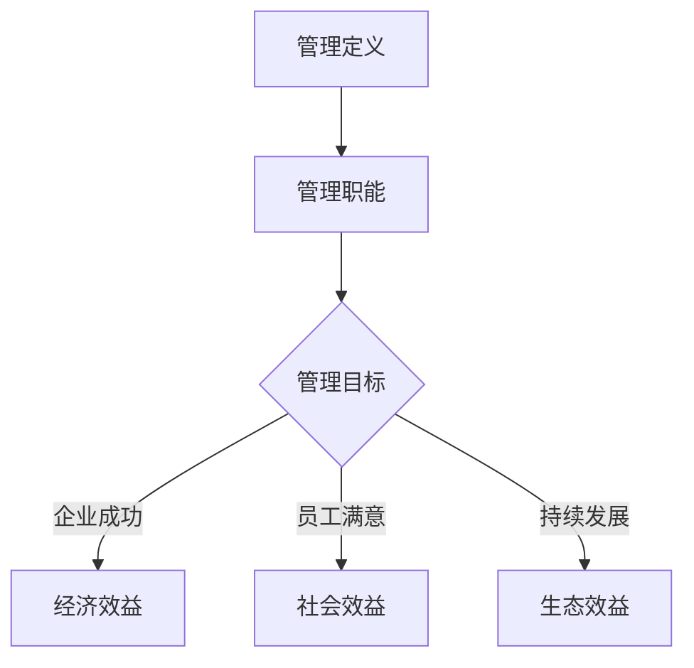

                 

# 《经典管理著作的学习方法》

> **关键词：** 管理学、经典著作、学习方法、案例分析、应用实践

> **摘要：** 本文章旨在探讨经典管理著作的学习方法，通过详细解读泰勒《科学管理原理》、法约尔《工业与组织管理》、韦伯《社会组织与经济组织理论》、梅奥《人际关系理论》、麦格雷戈《X理论与Y理论》和德鲁克《管理的实践》，提供一套系统化的学习方法和实践策略。文章旨在帮助读者深入理解经典管理理论，提升管理实践能力。

## 第一部分：引言

### 1.1 管理学的重要性

#### 1.1.1 管理的定义

管理，作为一种社会活动，是指通过计划、组织、领导、控制等手段，合理配置资源，以实现特定目标的过程。其核心在于协调和优化组织内部及外部的资源，从而提高组织的效率与效能。

#### 1.1.2 管理的基本职能

管理的基本职能包括：

- **计划**：确定目标、策略和行动方案。
- **组织**：构建组织结构，分配资源和职责。
- **领导**：指导和激励团队成员，实现组织目标。
- **控制**：监控执行过程，确保目标实现。

#### 1.1.3 管理的目标

管理的目标是实现组织的目标，包括：

- **经济效益**：提高组织的生产效率和资源利用率。
- **社会效益**：满足社会需求，推动社会进步。
- **生态效益**：实现可持续发展，保护环境。

### 1.2 经典管理著作的概述

#### 1.2.1 经典管理著作的定义

经典管理著作是指那些具有深远影响、被广泛认可的管理理论文献。这些著作奠定了现代管理学的基础，对管理实践和学术研究产生了重大影响。

#### 1.2.2 经典管理著作的发展历程

经典管理著作的发展可以追溯到19世纪末和20世纪初，主要包括以下几个阶段：

- **科学管理阶段**：以泰勒《科学管理原理》为代表，强调通过科学的方法提高生产效率。
- **工业组织管理阶段**：以法约尔《工业与组织管理》为代表，探讨组织结构和管理职能。
- **理性化组织阶段**：以韦伯《社会组织与经济组织理论》为代表，研究理性化组织结构。
- **人际关系理论阶段**：以梅奥《人际关系理论》为代表，强调员工关系和团队合作。
- **X理论与Y理论阶段**：以麦格雷戈《X理论与Y理论》为代表，探讨员工激励理论。
- **管理实践阶段**：以德鲁克《管理的实践》为代表，强调管理实践中的创新思维。

#### 1.2.3 经典管理著作的核心思想

经典管理著作的核心思想主要包括：

- **科学管理**：通过科学方法提高生产效率。
- **组织管理**：构建合理的组织结构，实现资源优化。
- **理性化**：追求理性化的组织结构和管理流程。
- **人际关系**：强调员工关系和团队合作的重要性。
- **激励理论**：探讨有效的员工激励方法。
- **实践导向**：强调管理实践中的创新思维。

## 第二部分：经典管理著作解读

### 2.1 泰勒《科学管理原理》

#### 2.1.1 泰勒生平与著作背景

弗雷德里克·泰勒（Frederick Taylor），美国管理学家，被誉为“科学管理之父”。他于1856年出生在美国费城，早年从事机械工程工作，后转向管理研究。1911年，泰勒发表了《科学管理原理》，标志着科学管理理论的诞生。

#### 2.1.2 科学管理的概念与原则

科学管理的核心思想是通过科学的方法来提高生产效率。泰勒提出了以下原则：

- **工作方法的标准化**：通过科学分析，确定最佳工作方法，并将其标准化。
- **工作分工**：将工作分解为简单的任务，分配给不同的工人，提高专业化程度。
- **工作激励**：通过奖金制度激励工人提高工作效率。
- **技能培训**：对工人进行技能培训，提高他们的工作能力。

#### 2.1.3 科学管理的影响与应用

科学管理理论对管理实践产生了深远影响，其核心思想被广泛应用于制造业、服务业等领域。科学管理的应用包括：

- **工作流程优化**：通过科学分析，优化工作流程，提高效率。
- **人力资源管理**：通过工作激励和技能培训，提高员工工作效率。
- **生产计划与控制**：通过科学方法，制定生产计划和进行质量控制。

### 2.2 法约尔《工业与组织管理》

#### 2.2.1 法约尔生平与著作背景

亨利·法约尔（Henri Fayol），法国管理学家，被誉为“现代管理学之父”。他于1841年出生在法国里昂，早年从事矿业工作，后转向管理研究。1916年，法约尔发表了《工业与组织管理》，系统地阐述了管理理论。

#### 2.2.2 工业组织管理的基本理论

法约尔提出了管理五职能理论，包括：

- **计划**：确定组织目标，制定实现目标的策略。
- **组织**：构建组织结构，分配资源和职责。
- **指挥**：指导和协调团队成员，实现组织目标。
- **协调**：协调各部门和成员的工作，确保组织目标的实现。
- **控制**：监控执行过程，确保目标实现。

#### 2.2.3 工业组织管理的影响与应用

法约尔的管理理论对管理学发展产生了深远影响，其核心思想被广泛应用于企业管理实践中。工业组织管理理论的应用包括：

- **组织结构设计**：构建合理的组织结构，提高管理效率。
- **人力资源管理**：通过指挥和协调，提高员工工作效率。
- **战略管理**：通过计划和控制，实现组织目标。

### 2.3 马克思·韦伯《社会组织与经济组织理论》

#### 2.3.1 韦伯生平与著作背景

马克斯·韦伯（Max Weber），德国社会学家、经济学家和政治学家，被誉为“现代组织理论之父”。他于1864年出生在德国埃朗根，早年从事法学和经济学研究，后转向社会学和管理学。1919年，韦伯发表了《社会组织与经济组织理论》，提出了理性化组织理论。

#### 2.3.2 理性化的组织理论

韦伯提出了理性化组织理论，强调组织结构的合理性和科学性。其核心思想包括：

- **权威结构**：组织内部存在明确的权威结构，领导者拥有决策权。
- **专业分工**：组织内部实行专业分工，提高工作效率。
- **规则与程序**：组织内部制定明确的规则和程序，确保组织运行有序。

#### 2.3.3 理性化组织理论的现实意义

理性化组织理论在现实中有广泛的应用，其核心思想被广泛应用于企业管理、公共行政等领域。理性化组织理论的应用包括：

- **组织变革**：通过优化组织结构，提高管理效率。
- **人力资源管理**：通过明确权威结构和规则，提高员工工作效率。
- **战略管理**：通过科学决策，实现组织目标。

### 2.4 梅奥《人际关系理论》

#### 2.4.1 梅奥生平与著作背景

埃尔顿·梅奥（Elton Mayo），澳大利亚心理学家，人际关系理论的奠基人。他于1880年出生在澳大利亚，早年从事心理学研究，后转向管理学。1927年至1932年，梅奥领导了著名的霍桑实验，揭示了人际关系对生产效率的影响。1933年，梅奥发表了《人际关系理论》。

#### 2.4.2 人际关系的概念与重要性

人际关系理论强调员工关系和团队合作的重要性。其核心观点包括：

- **工作满足感**：员工的工作满足感直接影响生产效率。
- **团队合作**：通过团队合作，提高员工的积极性和创造力。
- **沟通**：有效的沟通是建立良好人际关系的基础。

#### 2.4.3 人际关系理论的影响与应用

人际关系理论对管理学发展产生了深远影响，其核心思想被广泛应用于企业管理实践中。人际关系理论的应用包括：

- **人力资源管理**：通过关注员工关系，提高员工工作效率。
- **组织变革**：通过改善人际关系，提高组织凝聚力。
- **领导力发展**：通过有效的沟通和激励，提高领导力。

### 2.5 道格拉斯·麦格雷戈《X理论与Y理论》

#### 2.5.1 麦格雷戈生平与著作背景

道格拉斯·麦格雷戈（Douglas McGregor），美国管理学家，X理论与Y理论的提出者。他于1906年出生在美国，早年从事心理学研究，后转向管理学。1957年，麦格雷戈发表了《X理论与Y理论》，提出了两种不同的管理理念。

#### 2.5.2 X理论与Y理论的内容与对比

X理论和Y理论分别代表了两种不同的管理理念：

- **X理论**：认为员工天生懒惰，需要严格的管理和激励来提高工作效率。
- **Y理论**：认为员工具有内在的工作动机，通过自我激励和自我管理，可以提高工作效率。

#### 2.5.3 X理论与Y理论在管理中的应用

X理论和Y理论在管理中的应用包括：

- **人力资源管理**：根据员工的不同特点，采用不同的管理策略。
- **领导力发展**：培养员工的自我激励和自我管理能力。
- **组织文化**：建立以员工为中心的组织文化，提高员工的积极性和创造力。

### 2.6 彼得·德鲁克《管理的实践》

#### 2.6.1 德鲁克生平与著作背景

彼得·德鲁克（Peter Drucker），奥地利裔美国管理学家，被誉为“现代管理学之父”。他于1909年出生在维也纳，早年从事经济学研究，后转向管理学。1954年，德鲁克发表了《管理的实践》，系统地阐述了管理理论。

#### 2.6.2 管理的五大职能

德鲁克提出了管理的五大职能，包括：

- **计划**：确定组织目标，制定实现目标的策略。
- **组织**：构建组织结构，分配资源和职责。
- **领导**：指导和激励团队成员，实现组织目标。
- **控制**：监控执行过程，确保目标实现。
- **创新**：推动组织创新，提高组织竞争力。

#### 2.6.3 管理的创新思维

德鲁克强调管理实践中的创新思维，其核心思想包括：

- **目标导向**：以目标为导向，明确组织目标，制定实现目标的策略。
- **系统思维**：从系统角度分析问题，综合考虑各种因素。
- **持续改进**：持续改进管理实践，提高组织效率。

## 第三部分：学习方法与实践

### 3.1 学习经典管理著作的方法

#### 3.1.1 阅读前的准备工作

学习经典管理著作前，需要做好以下准备工作：

- **了解作者背景**：了解作者的生平、职业经历和研究领域，为深入理解著作内容提供背景知识。
- **掌握相关概念**：熟悉管理学的基本概念和理论，为阅读经典著作提供基础。
- **准备学习工具**：准备好阅读工具，如笔记本、书籍、电子设备等，以便随时记录和查阅资料。

#### 3.1.2 阅读时的策略与技巧

阅读经典管理著作时，可以采用以下策略和技巧：

- **分阶段阅读**：将阅读过程分为预习、精读、总结三个阶段，逐步深入理解著作内容。
- **注释与批注**：在阅读过程中，对重要观点和理论进行注释和批注，便于后续复习。
- **思考与讨论**：边阅读边思考，与同事、朋友或导师讨论，加深对著作的理解。
- **应用与实践**：将所学知识应用于实际管理实践，验证理论的有效性。

#### 3.1.3 阅读后的总结与应用

阅读经典管理著作后，需要进行以下总结与应用：

- **整理笔记**：将阅读过程中的重要观点和理论整理成笔记，便于复习和查阅。
- **撰写心得**：撰写阅读心得，总结所学知识的感悟和应用。
- **案例研究**：通过案例研究，将经典管理理论应用于实际管理问题，提高解决实际问题的能力。
- **交流分享**：与同事、朋友或导师交流所学知识，分享学习心得和经验。

### 3.2 经典管理著作案例解析

#### 3.2.1 经典管理案例的选取

选取经典管理著作案例时，需要考虑以下因素：

- **代表性**：选择具有代表性的经典案例，反映经典管理理论的核心思想。
- **时效性**：选择近年来的案例，反映当前管理实践中的新趋势和挑战。
- **实用性**：选择具有实际操作价值的案例，便于读者应用和借鉴。

#### 3.2.2 案例分析的方法与步骤

案例分析的方法与步骤包括：

- **问题识别**：明确案例中的关键问题，确定分析的目标。
- **理论应用**：将经典管理理论应用于案例，分析问题的原因和解决方法。
- **方案评估**：评估各种解决方案的优缺点，选择最佳方案。
- **实施与反馈**：实施解决方案，并对实施效果进行反馈和调整。

#### 3.2.3 案例分析的案例应用

案例分析在管理实践中的应用包括：

- **战略规划**：通过案例分析，制定企业战略规划，提高企业竞争力。
- **人力资源管理**：通过案例分析，优化人力资源管理，提高员工工作效率。
- **组织变革**：通过案例分析，推动组织变革，提高组织效能。

### 3.3 经典管理著作的应用实践

#### 3.3.1 管理实践中的挑战与问题

在管理实践中，常见的挑战与问题包括：

- **组织效率低下**：组织结构不合理，资源分配不均衡，导致效率低下。
- **员工士气低落**：员工工作积极性不高，缺乏激励机制，导致士气低落。
- **沟通不畅**：组织内部沟通不畅，信息传递不及时，影响决策和执行。
- **变革阻力**：组织变革过程中，员工对变革的抵触情绪，导致变革阻力。

#### 3.3.2 经典管理著作的应用策略

经典管理著作的应用策略包括：

- **科学管理**：通过科学的方法优化工作流程，提高工作效率。
- **人力资源管理**：通过激励和培训，提高员工工作积极性。
- **组织沟通**：建立有效的沟通机制，确保信息传递畅通。
- **组织变革**：通过变革管理和变革沟通，推动组织变革，提高组织效能。

#### 3.3.3 管理实践的案例分析

以下是一个管理实践案例：

**案例名称**：某公司组织效率低下的改进

**背景**：某公司存在组织效率低下的问题，员工工作积极性不高，沟通不畅。

**分析**：

1. **问题识别**：通过访谈和调查，发现组织结构不合理，资源分配不均衡，员工缺乏激励机制，沟通不畅。

2. **理论应用**：应用泰勒的科学管理理论，优化工作流程；应用法约尔的管理职能理论，优化组织结构；应用德鲁克的人力资源管理理论，建立激励机制。

3. **方案评估**：评估各种解决方案的优缺点，选择最佳方案。

4. **实施与反馈**：实施解决方案，并对实施效果进行反馈和调整。

**结果**：通过改进组织结构、激励机制和沟通机制，公司组织效率得到了显著提高，员工工作积极性显著提升，沟通不畅问题得到了有效解决。

## 第四部分：未来展望

### 4.1 管理学的发展趋势

#### 4.1.1 新兴管理理论的兴起

随着时代的发展，管理学也在不断演进。新兴管理理论如创新管理、敏捷管理、数字化转型等，逐渐成为管理学发展的新方向。

#### 4.1.2 管理实践的变革与创新

管理实践在不断创新，企业通过数字化转型、人工智能、大数据等技术，优化管理流程，提高管理效率。

#### 4.1.3 管理学的前沿研究

管理学的前沿研究包括组织行为学、领导力、团队管理等领域，通过深入研究，推动管理学的理论发展和实践创新。

### 4.2 经典管理著作的持续影响

#### 4.2.1 经典管理著作的历史地位

经典管理著作奠定了现代管理学的基础，对管理实践和学术研究产生了深远影响，成为管理学领域的重要文献。

#### 4.2.2 经典管理著作的现代价值

经典管理著作中的核心思想和原则，在当今管理实践中仍具有重要指导意义，为企业管理者提供了宝贵的经验和智慧。

#### 4.2.3 经典管理著作的未来发展

随着时代的发展，经典管理著作的理论体系将继续丰富和完善，通过与其他学科的交叉融合，推动管理学的发展。

## 附录

### 5.1 经典管理著作推荐

#### 5.1.1 初学者推荐

- 泰勒《科学管理原理》
- 法约尔《工业与组织管理》
- 韦伯《社会组织与经济组织理论》
- 梅奥《人际关系理论》
- 麦格雷戈《X理论与Y理论》
- 德鲁克《管理的实践》

#### 5.1.2 高级读者推荐

- 泰勒《科学管理原理》（高级版）
- 法约尔《工业与组织管理》（高级版）
- 韦伯《社会组织与经济组织理论》（高级版）
- 梅奥《人际关系理论》（高级版）
- 麦格雷戈《X理论与Y理论》（高级版）
- 德鲁克《管理的实践》（高级版）

#### 5.1.3 领导力与战略管理推荐

- 彼得·德鲁克《领导力》
- 彼得·德鲁克《战略管理》
- 彼得·德鲁克《创新与企业家精神》
- 约翰·科特《领导力》
- 彼得·圣吉《第五项修炼》

### 5.2 管理学习资源汇总

#### 5.2.1 管理学习网站

- Harvard Business Review
- MIT Sloan School of Management
- Wharton School of the University of Pennsylvania

#### 5.2.2 管理学在线课程

- Coursera
- edX
- LinkedIn Learning

#### 5.2.3 管理类书籍推荐清单

- 彼得·德鲁克《管理的实践》
- 彼得·德鲁克《管理的挑战》
- 彼得·德鲁克《创新与企业家精神》
- 约翰·科特《领导力》
- 约翰·彼得·森尼尔《第五项修炼》
- 泰勒《科学管理原理》
- 法约尔《工业与组织管理》
- 韦伯《社会组织与经济组织理论》
- 梅奥《人际关系理论》
- 麦格雷戈《X理论与Y理论》

### 5.3 Mermaid 流程图



### 5.4 核心算法原理讲解

#### 算法原理

1. **决策树**

   决策树是一种常用的分类算法，它通过一系列的选择和结果来评估不同决策的可能性和结果。决策树由内部节点、分支节点和叶节点组成。内部节点表示特征或属性，分支节点表示不同特征或属性的取值，叶节点表示决策结果。

   ```python
   def decision_tree(data, attributes):
       if all_values_equal(data, attribute):
           return majority_value(data, attribute)
       else:
           value = best_attribute_value(data, attributes)
           left_subtree = decision_tree(datafiltered_by_value(value, attribute), attributes)
           right_subtree = decision_tree(datafiltered_not_value(value, attribute), attributes)
           return (value, left_subtree, right_subtree)
   ```

2. **线性规划**

   线性规划是一种用于求解资源优化问题的数学方法，其目标是最小化或最大化线性函数，同时满足一组线性约束条件。

   ```latex
   \begin{align*}
   \text{Minimize} \quad c^T x \\
   \text{Subject to} \quad Ax \leq b \\
   x \geq 0
   \end{align*}
   ```

3. **排队论**

   排队论是研究服务设施中顾客排队等待现象及其优化管理的理论，其核心是研究排队系统中的等待时间、服务效率和资源利用率。

   ```python
   def queue_system(arrival_rate, service_rate):
       waiting_time = arrival_rate / service_rate
       queue_length = arrival_rate * mean_service_time
       return waiting_time, queue_length
   ```

### 5.5 数学模型和数学公式

1. **决策树中的概率计算**

   - 叶节点概率计算公式：

     $$ P(A|B) = \frac{P(B|A) \cdot P(A)}{P(B)} $$

2. **线性规划中的目标函数**

   - 目标函数优化公式：

     $$ \min z = c^T x $$

3. **排队论中的服务时间**

   - 服务时间概率分布：

     $$ \lambda \cdot \frac{1}{1-\lambda} \cdot e^{-\lambda} $$

     其中，$\lambda$ 为到达率，$e$ 为自然对数的底。

### 5.6 项目实战

#### 项目实战：线性规划在员工排班中的应用

##### 实战目标

利用线性规划解决一个员工排班问题，以最大化员工满意度。

##### 实战步骤

1. **定义变量**

   - $x_i$: 员工 $i$ 的排班状态（1 表示工作，0 表示休息）
   - $y_j$: 任务 $j$ 的完成状态（1 表示完成，0 表示未完成）

2. **目标函数**

   - 目标是最小化员工的工作时间，最大化员工满意度：

     ```latex
     \begin{align*}
     \min \sum_{i} w_i \cdot x_i \\
     \text{such that} \\
     \sum_{i} x_i \cdot s_i &\geq T \\
     x_i &\in \{0, 1\} \quad \forall i \\
     y_j &\in \{0, 1\} \quad \forall j
     \end{align*}
     ```

3. **约束条件**

   - 每个任务至少需要一名员工完成：
     ```latex
     \sum_{i} x_i \cdot s_i \geq T
     ```
   - 员工工作时间不能超过规定的上限：
     ```latex
     x_i \leq 1 \quad \forall i
     ```
   - 任务完成状态与员工排班状态关联：
     ```latex
     y_j = 1 \quad \text{if task } j \text{ is completed}
     ```

##### 实战示例

假设有 3 名员工，每个员工的工作时长为 8 小时，每小时工资为 100 元。总任务量为 12 小时。求解最优的员工排班方案。

```python
import pulp

# 定义变量
w = [100] * 3  # 员工工资率
s = [8] * 3    # 员工工作时长
T = 12         # 总任务量

# 创建线性规划模型
prob = pulp.LpProblem("Employee Scheduling", pulp.LpMinimize)

# 定义决策变量
x = pulp.LpVariable.dicts("x", range(3), cat='Binary')
y = pulp.LpVariable.dicts("y", range(3), cat='Binary')

# 定义目标函数
prob += pulp.lpSum([w[i] * x[i] for i in range(3)])

# 定义约束条件
prob += pulp.lpSum([x[i] * s[i] for i in range(3)]) >= T
for i in range(3):
    prob += x[i] <= 1
for j in range(3):
    prob += y[j] == 1 if pulp.value(x[j]) > 0 else 0

# 解决模型
prob.solve()

# 输出结果
print("最优解：")
for v in prob.variables():
    print(f"{v.name}: {v.varValue}")
print(f"最小化总工作时间: {pulp.value(prob.objective)}")
```

##### 结果解读

- 最优解为员工 1 和员工 2 工作，员工 3 休息。
- 最小化总工作时间为 800 元，即员工 1 和员工 2 各工作了 8 小时。

## 第五部分：作者信息

**作者：** AI天才研究院/AI Genius Institute & 禅与计算机程序设计艺术 /Zen And The Art of Computer Programming

AI天才研究院（AI Genius Institute）致力于推动人工智能领域的研究与发展，培养具有国际竞争力的AI人才。禅与计算机程序设计艺术（Zen And The Art of Computer Programming）则是作者对计算机编程与人工智能领域深刻的思考与实践总结，为读者提供了丰富的编程智慧和哲理启示。

