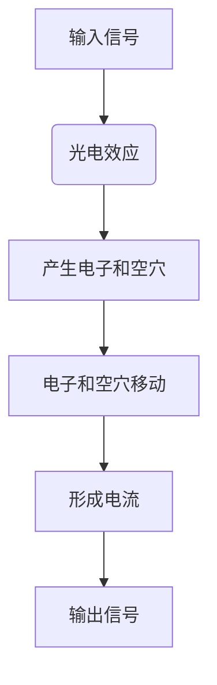
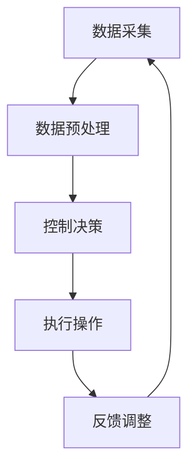

                 

# 自动化技术的未来发展方向

> **关键词**：自动化技术、人工智能、物联网、智能制造、发展趋势

> **摘要**：本文从自动化技术的起源与发展出发，深入探讨了其在各个领域的应用现状与未来发展趋势。文章重点关注人工智能、物联网、智能制造等新兴技术在自动化领域的融合与创新，并对自动化技术对未来社会的影响与挑战进行了分析。同时，文章也展望了自动化技术的未来发展方向，为行业从业人员和研究者提供了有益的参考。

## 第一部分：自动化技术的发展历程与现状

### 第1章：自动化技术的起源与发展

#### 1.1 自动化技术的定义与历史

自动化技术是指通过计算机程序、传感器、控制器等设备对生产过程或业务流程进行自动控制和自动化操作的技术。其目的是减少人力投入，提高生产效率，降低成本，提高产品质量。

自动化技术的发展可以追溯到20世纪初期。1911年，美国通用电气公司工程师哈罗德·斯图尔特·鲍尔提出“过程自动化”的概念。此后，随着电子技术和计算机技术的发展，自动化技术逐渐在制造业、物流、农业等领域得到广泛应用。

#### 1.2 自动化技术的主要类型与应用领域

自动化技术主要包括传感器技术、控制系统与算法、机器人技术等。

- **传感器技术**：传感器是自动化技术的核心部件，用于检测和测量环境参数。根据工作原理，传感器可分为电阻式传感器、电感式传感器、电容式传感器、光电式传感器等。传感器技术广泛应用于智能制造、物流、农业等领域。

- **控制系统与算法**：控制系统是自动化技术的核心，用于控制机器设备的运行状态。常见控制算法有PID控制、模糊控制、神经网络控制等。控制系统与算法在自动化技术中起着关键作用，如智能制造生产线中的自动化控制、物流系统中的路径规划等。

- **机器人技术**：机器人是自动化技术的代表，具有感知、决策、执行等功能。根据应用场景，机器人可分为工业机器人、服务机器人、医疗机器人等。机器人技术在制造业、物流、医疗、家庭等领域得到广泛应用。

#### 1.3 自动化技术在我国的发展现状

近年来，我国政府高度重视自动化技术的发展，出台了一系列政策和措施，推动自动化技术在我国的应用和普及。目前，我国自动化技术已在多个领域取得了显著成果：

- **制造业**：智能制造成为我国制造业转型升级的重要方向。以华为、小米、阿里巴巴等为代表的企业在智能制造领域进行了大量研发和应用，如工业机器人、智能工厂等。

- **物流与仓储**：随着电商的快速发展，物流与仓储自动化技术得到广泛应用。我国物流企业如顺丰、京东等在自动化仓储、无人配送等领域进行了大量投资和技术研发。

- **农业**：我国农业自动化技术逐渐成熟，如智能灌溉、智能种植、无人机喷洒等。这些技术的应用提高了农业生产效率，减少了人力投入。

### 第2章：自动化技术的核心原理与关键技术

#### 2.1 传感器技术

##### 2.1.1 传感器的定义与分类

传感器是一种能够检测和测量物理量并将其转换为电信号的装置。根据传感器的工作原理，可以分为以下几类：

1. **电阻式传感器**：通过物理变化导致电阻值变化，如热敏电阻、压敏电阻等。

2. **电感式传感器**：通过物理变化导致电感值变化，如霍尔传感器、磁敏传感器等。

3. **电容式传感器**：通过物理变化导致电容值变化，如电容式位移传感器、电容式触摸屏等。

4. **光电式传感器**：通过光电效应检测光信号，如光电传感器、激光传感器等。

##### 2.1.2 传感器技术的工作原理与性能指标

传感器的工作原理主要基于物理、化学或生物效应。以光电式传感器为例，其工作原理是利用光电效应将光信号转换为电信号。

传感器的性能指标主要包括：

1. **灵敏度**：表示传感器对输入信号的敏感程度。

2. **精度**：表示传感器测量结果的准确性。

3. **分辨率**：表示传感器能够检测到的最小变化量。

4. **响应时间**：表示传感器从接收到输入信号到输出信号的时间。

##### 2.1.3 传感器的应用场景与发展趋势

传感器技术在自动化领域具有广泛的应用场景，如：

1. **智能制造**：用于检测产品质量、监控设备状态等。

2. **物流与仓储**：用于监测货物状态、路径规划等。

3. **农业**：用于监测土壤湿度、植物生长状态等。

随着人工智能、物联网等技术的发展，传感器技术也在不断进步。未来，传感器将更小巧、更智能、更高效，进一步推动自动化技术的应用和发展。

#### 2.2 控制系统与算法

##### 2.2.1 控制系统的基本原理与结构

控制系统是指利用控制算法对系统进行控制和调节的装置。其基本原理是通过采集系统的实时数据，与预设的目标值进行对比，然后根据偏差进行调节，使系统达到预期状态。

控制系统的基本结构包括：

1. **传感器**：用于检测系统的实时状态。

2. **控制器**：根据传感器采集的数据进行控制决策。

3. **执行器**：根据控制器的决策执行相应的操作。

##### 2.2.2 常见控制算法介绍

常见控制算法主要包括：

1. **PID控制算法**：PID（比例-积分-微分）控制算法是最常用的控制算法之一。它通过三个参数对系统进行调节，具有较好的稳态性能和动态性能。

2. **模糊控制算法**：模糊控制算法通过模糊逻辑进行控制，适用于非线性、时变、复杂系统。

3. **神经网络控制算法**：神经网络控制算法通过训练神经网络来模拟控制系统的动态行为，具有较高的自适应能力和鲁棒性。

##### 2.2.3 控制系统的优化与改进

为了提高控制系统的性能，可以通过以下方法进行优化与改进：

1. **参数整定**：通过调整控制器的参数，优化系统的性能。

2. **自适应控制**：根据系统的实时状态调整控制策略，提高系统的自适应能力。

3. **鲁棒控制**：通过设计鲁棒控制器，提高系统对参数变化和外部扰动的抵抗能力。

#### 2.3 机器人技术

##### 2.3.1 机器人的基本组成与分类

机器人是由机械结构、传感器、控制器、执行器等组成的智能系统。根据应用场景，机器人可分为以下几类：

1. **工业机器人**：用于工业生产中的自动化操作，如焊接、搬运等。

2. **服务机器人**：用于服务领域的自动化操作，如家政服务、医疗护理等。

3. **医疗机器人**：用于医疗领域的自动化操作，如手术辅助、康复训练等。

##### 2.3.2 机器人运动控制算法

机器人运动控制算法主要包括：

1. **逆向运动学**：通过给定末端执行器的位置和姿态，计算关节变量。

2. **前向运动学**：通过给定关节变量，计算末端执行器的位置和姿态。

3. **轨迹规划**：根据任务要求，生成末端执行器的运动轨迹。

##### 2.3.3 机器人的应用领域与发展趋势

机器人技术在自动化领域具有广泛的应用，如：

1. **制造业**：用于生产线的自动化操作，提高生产效率。

2. **物流与仓储**：用于仓库管理、货物搬运等，提高物流效率。

3. **医疗**：用于手术辅助、康复训练等，提高医疗服务质量。

随着人工智能、物联网等技术的发展，机器人技术将不断进步，未来有望在更多领域实现自动化应用。

### 第3章：自动化技术的产业应用现状与趋势

#### 3.1 制造业中的自动化应用

##### 3.1.1 智能制造的概念与特点

智能制造是指通过信息技术、物联网、大数据等技术与制造业深度融合，实现制造过程的智能化和自动化。其特点包括：

1. **高度自动化**：通过工业机器人、自动化生产线等实现生产过程的自动化。

2. **数据驱动**：通过物联网、大数据等技术收集生产过程中的数据，进行实时分析和决策。

3. **灵活高效**：通过快速调整生产计划，实现个性化定制和小批量生产。

##### 3.1.2 智能制造的关键技术

智能制造的关键技术包括：

1. **工业机器人**：用于生产线的自动化操作，如焊接、搬运等。

2. **传感器技术**：用于实时监测生产过程，如温度、压力、速度等。

3. **控制系统与算法**：用于控制生产过程的自动化操作，如PID控制、模糊控制等。

4. **大数据与云计算**：用于收集、存储、分析和处理生产过程中的数据。

##### 3.1.3 智能制造的发展趋势与应用案例

智能制造的发展趋势包括：

1. **工业4.0**：通过信息技术、物联网等技术与制造业深度融合，实现智能制造。

2. **物联网+**：通过物联网技术实现生产设备、人员、物料等实时互联互通。

3. **人工智能+**：通过人工智能技术实现生产过程的智能决策和优化。

应用案例：

- **海尔**：通过智能制造实现个性化定制和小批量生产。

- **富士康**：通过工业机器人实现生产线的自动化操作。

#### 3.2 物流与仓储中的自动化应用

##### 3.2.1 自动化物流系统的组成与工作原理

自动化物流系统主要由仓储管理系统、自动分拣系统、输送系统、货架系统等组成。其工作原理是：

1. **仓储管理系统**：通过物联网技术实现仓储物的实时管理和监控。

2. **自动分拣系统**：通过传感器和控制系统实现货物的自动分拣。

3. **输送系统**：通过输送带、滑道等实现货物的自动输送。

4. **货架系统**：通过自动化货架和机器人实现货物的自动存取。

##### 3.2.2 自动化仓储技术的发展趋势与应用场景

自动化仓储技术的发展趋势包括：

1. **机器人仓库**：通过机器人实现仓储物的自动存取，提高仓储效率。

2. **智能货架**：通过物联网技术实现货架的实时监控和管理。

3. **无人仓库**：通过自动化技术和人工智能实现仓储物的自动处理，降低人力成本。

应用场景：

- **电商仓库**：用于货物的自动存储、分拣和配送。

- **制造业仓库**：用于原材料的自动存储、配送和生产线的自动供料。

##### 3.2.3 自动化物流与仓储的挑战与未来方向

自动化物流与仓储面临的挑战：

1. **技术集成**：将各种自动化技术集成到一个系统中，实现无缝对接。

2. **数据安全**：确保物流和仓储过程中的数据安全。

3. **成本控制**：降低自动化物流与仓储系统的成本，提高经济效益。

未来方向：

1. **物联网+**：通过物联网技术实现物流与仓储系统的实时互联互通。

2. **人工智能+**：通过人工智能技术实现物流与仓储系统的智能决策和优化。

3. **绿色环保**：通过节能、减排等技术实现自动化物流与仓储的可持续发展。

#### 3.3 农业自动化

##### 3.3.1 农业自动化的概念与意义

农业自动化是指通过信息技术、物联网、机器人等技术实现农业生产过程的自动化和智能化。其意义包括：

1. **提高生产效率**：通过自动化技术实现农作物的精准种植、管理，提高生产效率。

2. **降低劳动力成本**：通过自动化技术减少农业劳动力需求，降低劳动力成本。

3. **保障农产品质量**：通过自动化技术实现农产品的全程监控和管理，保障农产品质量。

##### 3.3.2 农业自动化技术的应用现状与发展趋势

农业自动化技术的应用现状：

1. **智能灌溉**：通过传感器和控制系统实现农作物的精准灌溉。

2. **智能种植**：通过物联网技术实现农作物的实时监控和管理。

3. **无人机喷洒**：通过无人机实现农药、肥料的精准喷洒。

农业自动化技术的发展趋势：

1. **人工智能+**：通过人工智能技术实现农作物的智能诊断、种植优化等。

2. **大数据+**：通过大数据技术实现农作物的精准种植、管理。

3. **机器人技术**：通过机器人实现农作物的自动收割、采摘等。

##### 3.3.3 农业自动化的挑战与未来方向

农业自动化面临的挑战：

1. **技术成熟度**：提高农业自动化技术的成熟度，降低故障率。

2. **成本控制**：降低农业自动化技术的成本，提高经济效益。

3. **人才培养**：培养具备农业自动化技术知识和技能的人才。

未来方向：

1. **智能化**：通过人工智能、物联网等技术实现农业生产的智能化。

2. **绿色环保**：通过节能、减排等技术实现农业生产的绿色环保。

3. **可持续发展**：通过农业自动化技术实现农业生产的可持续发展。

## 第二部分：自动化技术的未来发展趋势

### 第4章：人工智能在自动化技术中的应用

#### 4.1 人工智能技术概述

##### 4.1.1 人工智能的定义与发展历程

人工智能（Artificial Intelligence，AI）是指通过计算机模拟人类智能的科学技术。其发展历程可以分为三个阶段：

1. **早期探索阶段（20世纪50-60年代）**：以符号主义方法和逻辑推理为核心。

2. **知识工程阶段（20世纪80-90年代）**：以知识表示和知识推理为核心。

3. **机器学习阶段（21世纪初至今）**：以数据驱动和统计学习为核心。

##### 4.1.2 人工智能的主要类型与技术

人工智能的主要类型包括：

1. **符号主义人工智能**：以逻辑推理为基础，通过符号表示知识。

2. **知识工程人工智能**：以知识表示和知识推理为基础，通过构建知识库进行推理。

3. **机器学习人工智能**：以数据驱动为基础，通过训练模型进行预测和分类。

人工智能的主要技术包括：

1. **深度学习**：通过神经网络模拟人脑的学习过程。

2. **强化学习**：通过奖励机制训练智能体进行决策。

3. **自然语言处理**：通过计算机理解和生成自然语言。

##### 4.1.3 人工智能在自动化技术中的应用前景

人工智能在自动化技术中的应用前景广阔，主要包括：

1. **智能控制系统**：通过人工智能技术实现自动化设备的自适应控制。

2. **智能机器人**：通过人工智能技术实现机器人的智能决策和执行。

3. **智能物流与仓储**：通过人工智能技术实现物流与仓储的智能化管理和优化。

#### 4.2 智能控制系统

##### 4.2.1 智能控制系统的基本概念与架构

智能控制系统是指通过人工智能技术实现自动化设备和系统的智能控制。其基本概念包括：

1. **控制目标**：指控制系统需要达到的预期状态。

2. **控制策略**：指控制系统采用的控制方法。

3. **控制效果**：指控制系统实现控制目标的程度。

智能控制系统的架构包括：

1. **传感器层**：用于采集系统的实时状态数据。

2. **控制器层**：用于对传感器采集的数据进行处理，实现控制决策。

3. **执行器层**：用于根据控制决策执行相应的操作。

##### 4.2.2 智能控制算法的优化与应用

智能控制算法的优化主要包括：

1. **模型优化**：通过改进控制模型的参数，提高控制精度。

2. **算法优化**：通过改进控制算法的结构，提高控制性能。

智能控制算法的应用包括：

1. **工业过程控制**：通过智能控制系统实现工业生产过程的自动化和优化。

2. **智能家居控制**：通过智能控制系统实现家居设备的自动化和智能化。

3. **智能交通控制**：通过智能控制系统实现交通信号灯的自动化调节。

##### 4.2.3 智能控制系统的发展趋势

智能控制系统的发展趋势包括：

1. **自适应控制**：通过自适应控制算法实现系统的自我调节和优化。

2. **协同控制**：通过多智能体协同控制实现系统的全局优化。

3. **边缘计算**：通过边缘计算技术实现实时数据分析和决策。

#### 4.3 智能机器人

##### 4.3.1 智能机器人的基本组成与分类

智能机器人是指通过人工智能技术实现自主决策和行动的机器人。其基本组成包括：

1. **感知模块**：用于感知环境信息，如摄像头、激光雷达等。

2. **决策模块**：用于根据感知信息进行决策，如深度学习模型、规划算法等。

3. **执行模块**：用于执行决策结果，如机械臂、车轮等。

智能机器人根据应用场景可分为：

1. **工业机器人**：用于工业生产中的自动化操作。

2. **服务机器人**：用于家庭、医疗、养老等领域的服务。

3. **医疗机器人**：用于医疗诊断、手术辅助、康复训练等。

##### 4.3.2 智能机器人的感知与决策能力

智能机器人的感知与决策能力主要包括：

1. **感知能力**：通过传感器感知环境信息，如图像识别、声音识别等。

2. **决策能力**：通过人工智能算法对感知信息进行分析和处理，实现自主决策。

3. **执行能力**：根据决策结果执行相应的动作，如移动、抓取等。

##### 4.3.3 智能机器人在实际应用中的挑战与前景

智能机器人在实际应用中面临的挑战：

1. **感知与理解**：提高机器人的感知和理解能力，实现更准确的环境识别。

2. **决策与规划**：提高机器人的决策与规划能力，实现更复杂的任务执行。

3. **人机协作**：提高人与机器人的协作能力，实现更高效的人机交互。

智能机器人的前景：

1. **工业领域**：通过智能机器人实现工业生产的自动化和智能化。

2. **服务领域**：通过智能机器人提供更便捷、高效的服务。

3. **医疗领域**：通过智能机器人实现医疗诊断、手术辅助和康复训练。

### 第5章：自动化技术的交叉融合与创新

#### 5.1 自动化技术与物联网的融合

##### 5.1.1 物联网的概念与架构

物联网（Internet of Things，IoT）是指通过互联网将各种设备连接起来，实现设备之间的信息交换和协同工作。物联网的架构主要包括：

1. **感知层**：用于感知和采集物理世界的各种信息，如传感器、摄像头等。

2. **传输层**：用于传输感知层采集到的数据，如有线和无线通信技术。

3. **平台层**：用于数据处理、分析和存储，如云计算平台、大数据平台等。

4. **应用层**：用于实现物联网的应用场景，如智能家居、智能交通等。

##### 5.1.2 自动化技术在物联网中的应用

自动化技术在物联网中的应用主要包括：

1. **智能设备控制**：通过物联网技术实现设备的远程控制和监控。

2. **数据采集与分析**：通过物联网技术实现设备数据的实时采集和分析。

3. **自动化生产与物流**：通过物联网技术实现生产过程的自动化和物流系统的智能化。

##### 5.1.3 自动化与物联网的融合发展趋势

自动化与物联网的融合发展趋势包括：

1. **智能工厂**：通过物联网技术实现生产线的智能化，提高生产效率。

2. **智能物流**：通过物联网技术实现物流系统的自动化，提高物流效率。

3. **智能家居**：通过物联网技术实现家庭设备的自动化和智能化，提高生活质量。

#### 5.2 自动化技术与其他新兴技术的融合

##### 5.2.1 自动化技术与大数据的融合

大数据是指无法用传统数据处理工具在合理时间内进行处理的数据集合。自动化技术与大数据的融合主要体现在以下几个方面：

1. **数据处理与分析**：通过大数据技术实现自动化设备数据的实时处理和分析。

2. **预测性维护**：通过大数据技术实现设备故障的预测性维护，降低设备故障率。

3. **优化生产计划**：通过大数据技术实现生产计划的优化，提高生产效率。

##### 5.2.2 自动化技术与云计算的融合

云计算是指通过互联网实现计算资源的共享和按需分配。自动化技术与云计算的融合主要体现在以下几个方面：

1. **云计算平台**：通过云计算平台实现自动化设备的远程监控和控制。

2. **数据处理**：通过云计算平台实现自动化设备数据的集中处理和分析。

3. **协同工作**：通过云计算平台实现不同地区、不同设备的协同工作。

##### 5.2.3 自动化技术与区块链的融合

区块链是一种分布式数据库技术，具有去中心化、不可篡改、透明等特点。自动化技术与区块链的融合主要体现在以下几个方面：

1. **设备认证**：通过区块链技术实现自动化设备的身份认证和设备管理。

2. **数据安全**：通过区块链技术实现自动化设备数据的存储和安全传输。

3. **智能合约**：通过区块链技术实现自动化设备的智能合约执行。

### 第6章：自动化技术对未来社会的影响与挑战

#### 6.1 自动化技术对社会的影响

##### 6.1.1 自动化技术对就业的影响

自动化技术的发展将带来就业结构的变化。一方面，自动化技术将取代部分重复性、低技能的工作，导致这些领域的就业减少。另一方面，自动化技术将催生新的就业机会，如自动化设备维护、数据分析、人工智能研究等。

##### 6.1.2 自动化技术对生活的影响

自动化技术将显著改变人们的生活方式。在家庭领域，智能家居设备将提高生活的便利性和舒适度。在医疗领域，自动化技术将提高医疗服务的质量和效率。在交通领域，自动化技术将实现智能交通系统，提高交通效率，减少交通事故。

##### 6.1.3 自动化技术对经济的影响

自动化技术将提高生产效率，降低生产成本，从而推动经济增长。同时，自动化技术将推动产业结构的升级和转型，促进新经济的发展。然而，自动化技术也可能会导致一定程度的财富分配不均，需要政府和社会各界共同努力，确保经济发展的成果惠及广大人民群众。

#### 6.2 自动化技术的伦理与安全挑战

##### 6.2.1 自动化技术的伦理问题

自动化技术的发展引发了诸多伦理问题，如隐私保护、数据安全、责任归属等。为了解决这些问题，需要政府、企业和社会各界共同努力，制定相关法律法规和伦理准则，确保自动化技术的健康发展。

##### 6.2.2 自动化技术的安全风险

自动化技术存在一定的安全风险，如数据泄露、系统失控等。为了降低安全风险，需要加强自动化技术的安全研究和安全管理，确保自动化系统的安全可靠运行。

##### 6.2.3 自动化技术的法规与监管

为了保障自动化技术的健康发展，需要建立健全的法规与监管体系。政府应制定相关法律法规，明确自动化技术的应用规范和监管要求。同时，企业应自觉遵守法律法规，加强内部监管，确保自动化技术的安全、合规运行。

### 第7章：自动化技术的未来发展展望

#### 7.1 自动化技术的未来发展方向

##### 7.1.1 自动化技术的未来趋势预测

自动化技术的未来发展趋势包括：

1. **智能化**：通过人工智能技术实现自动化设备的智能决策和自主行动。

2. **网络化**：通过物联网技术实现自动化设备的互联互通，实现协同工作和资源优化。

3. **个性化**：通过大数据技术和人工智能技术实现个性化定制和服务。

##### 7.1.2 自动化技术的未来应用场景

自动化技术的未来应用场景包括：

1. **智慧城市**：通过自动化技术实现城市的智慧管理和运行，提高城市生活质量和效率。

2. **智慧医疗**：通过自动化技术实现医疗设备的智能化和医疗服务的高效化。

3. **智慧农业**：通过自动化技术实现农业生产的智能化和精准化。

##### 7.1.3 自动化技术的未来挑战与机遇

自动化技术在未来面临以下挑战：

1. **技术成熟度**：提高自动化技术的成熟度和可靠性。

2. **成本控制**：降低自动化技术的成本，提高市场竞争力。

3. **人才培养**：培养具备自动化技术知识和技能的人才。

同时，自动化技术也带来了诸多机遇：

1. **产业升级**：推动传统产业的自动化和智能化升级。

2. **创新应用**：开拓自动化技术在新兴领域的应用，如智慧城市、智慧医疗等。

3. **经济转型**：促进经济结构的转型升级，推动新经济的发展。

#### 7.2 自动化技术的创新实践与案例分析

##### 7.2.1 自动化技术的创新实践

自动化技术的创新实践主要包括：

1. **人工智能+自动化**：通过人工智能技术实现自动化设备的智能决策和自主行动。

2. **物联网+自动化**：通过物联网技术实现自动化设备的互联互通，实现协同工作和资源优化。

3. **大数据+自动化**：通过大数据技术实现自动化设备的实时监控和数据分析。

##### 7.2.2 自动化技术的成功案例分析

自动化技术的成功案例分析包括：

1. **智能工厂**：通过自动化技术和人工智能技术实现工厂的智能化生产和管理。

2. **智能物流**：通过自动化技术和物联网技术实现物流系统的智能化和高效化。

3. **智能医疗**：通过自动化技术和大数据技术实现医疗设备的智能化和医疗服务的高效化。

##### 7.2.3 自动化技术的未来发展方向探讨

自动化技术的未来发展方向探讨包括：

1. **智能化**：通过人工智能技术实现自动化设备的智能化和自主化。

2. **网络化**：通过物联网技术实现自动化设备的网络化和互联互通。

3. **个性化**：通过大数据技术和人工智能技术实现自动化设备的个性化定制和服务。

4. **绿色环保**：通过自动化技术和绿色能源的结合，实现自动化系统的绿色环保和可持续发展。

#### 7.3 自动化技术的教育与人才培养

##### 7.3.1 自动化技术的教育现状与需求

自动化技术的教育现状包括：

1. **学科设置**：高校和科研机构设立了自动化、人工智能、物联网等相关专业，培养自动化技术人才。

2. **课程设置**：开设了自动化控制、传感器技术、机器学习、大数据处理等相关课程，培养学生的理论基础和实际操作能力。

自动化技术的教育需求：

1. **人才培养**：随着自动化技术的快速发展，对自动化技术人才的需求不断增加。

2. **知识更新**：自动化技术更新迅速，需要不断更新教学内容，使学生掌握最新的技术知识。

##### 7.3.2 自动化技术的人才培养模式

自动化技术的人才培养模式包括：

1. **产学研结合**：与企业合作，开展产学研项目，培养学生的实际操作能力和创新精神。

2. **实践教学**：注重实践教学，通过实验、实训、实习等环节，提高学生的动手能力和实际操作能力。

3. **国际化培养**：加强与国际知名高校和企业的合作，引进国际先进的教学资源和经验，培养具有国际竞争力的自动化技术人才。

##### 7.3.3 自动化技术的未来人才需求展望

自动化技术的未来人才需求展望：

1. **跨学科人才**：具备跨学科知识的人才将在自动化技术领域发挥重要作用，如自动化与计算机、自动化与电子、自动化与材料等。

2. **复合型人才**：具备扎实理论基础和实际操作能力的人才将在自动化技术领域具有竞争优势。

3. **创新能力**：创新能力是自动化技术人才的核心竞争力，需要培养学生的创新思维和创新能力。

### 附录

#### 附录A：自动化技术相关资源与工具

##### A.1 自动化技术相关书籍推荐

1. 《自动化技术基础》  
2. 《人工智能导论》  
3. 《物联网技术与应用》  
4. 《智能制造技术与应用》

##### A.2 自动化技术相关网站与平台

1. 中国自动化网  
2. 中国智能制造网  
3. 中国物联网产业网  
4. IEEE Xplore

##### A.3 自动化技术开源项目与库

1. ROS（Robot Operating System）  
2. TensorFlow  
3. Keras  
4. PyTorch

#### 附录B：自动化技术发展时间线

##### B.1 自动化技术发展的重要事件

1. 1911年，哈罗德·斯图尔特·鲍尔提出“过程自动化”概念。  
2. 1969年，美国国家航空航天局成功发射阿波罗11号飞船，实现人类登月。  
3. 1981年，日本推出第一台工业机器人。  
4. 2006年，AlphaGo defeated human champions in the game of Go.  
5. 2018年，特斯拉发布自动驾驶汽车。

##### B.2 自动化技术的重要里程碑

1. 1952年，英国人发明了第一台可编程电子计算机。  
2. 1971年，英特尔公司推出第一块微处理器。  
3. 1997年，IBM超级计算机“深蓝”战胜国际象棋世界冠军卡斯帕罗夫。  
4. 2012年，谷歌无人驾驶汽车完成首次长途驾驶。  
5. 2016年，AlphaGo在围棋比赛中战胜世界冠军李世石。

##### B.3 自动化技术的未来发展趋势预测

1. 自动化技术与人工智能的深度融合，推动智能化自动化的发展。  
2. 自动化技术在物联网、大数据、云计算等新兴技术领域的广泛应用。  
3. 自动化技术助力产业升级，推动智能制造、智慧城市等领域的快速发展。

#### 附录C：自动化技术常用术语与解释

##### C.1 自动化技术常用术语列表

1. **自动化技术**：指通过计算机程序、传感器、控制器等设备对生产过程或业务流程进行自动控制和自动化操作的技术。  
2. **传感器**：指用于检测和测量物理量并将其转换为电信号的装置。  
3. **控制系统**：指用于控制机器设备的运行状态的装置。  
4. **机器人**：指具有感知、决策、执行等功能的智能系统。  
5. **智能制造**：指通过信息技术、物联网、大数据等技术与制造业深度融合，实现制造过程的智能化和自动化。  
6. **物联网**：指通过互联网将各种设备连接起来，实现设备之间的信息交换和协同工作。  
7. **人工智能**：指通过计算机模拟人类智能的科学技术。

##### C.2 自动化技术术语解释

1. **自动化技术**：指通过计算机程序、传感器、控制器等设备对生产过程或业务流程进行自动控制和自动化操作的技术。它具有提高生产效率、降低成本、提高产品质量等优点。

2. **传感器**：指用于检测和测量物理量并将其转换为电信号的装置。传感器是自动化技术的核心部件，其种类繁多，包括电阻式传感器、电感式传感器、电容式传感器、光电式传感器等。

3. **控制系统**：指用于控制机器设备的运行状态的装置。控制系统通常由传感器、控制器、执行器等组成，通过对传感器采集的数据进行处理，实现设备的自动控制和调节。

4. **机器人**：指具有感知、决策、执行等功能的智能系统。机器人是自动化技术的代表，其应用领域广泛，包括工业、服务、医疗等。

5. **智能制造**：指通过信息技术、物联网、大数据等技术与制造业深度融合，实现制造过程的智能化和自动化。智能制造具有高度自动化、数据驱动、灵活高效等特点。

6. **物联网**：指通过互联网将各种设备连接起来，实现设备之间的信息交换和协同工作。物联网技术为自动化技术提供了数据支持和通信基础。

7. **人工智能**：指通过计算机模拟人类智能的科学技术。人工智能技术包括机器学习、深度学习、自然语言处理等，其在自动化技术中的应用将推动自动化技术向智能化方向发展。

##### C.3 自动化技术相关词汇拓展

1. **自动化生产线**：指通过自动化技术实现生产过程的自动化和连续化生产。

2. **自动化物流系统**：指通过自动化技术实现物流过程的自动化和高效化。

3. **自动化控制系统**：指用于控制生产过程、物流过程等自动化操作的控制系统。

4. **工业机器人**：指应用于工业生产中的自动化设备，如焊接机器人、搬运机器人等。

5. **服务机器人**：指应用于家庭、医疗、养老等领域的自动化设备，如家政机器人、医疗机器人等。

6. **智能家居系统**：指通过自动化技术实现家庭设备的智能化管理和控制。

7. **智能交通系统**：指通过自动化技术和物联网技术实现交通过程的智能化和高效化。


## 作者信息

**作者：** AI天才研究院/AI Genius Institute & 禅与计算机程序设计艺术 /Zen And The Art of Computer Programming

## 结论

自动化技术作为现代科技的重要组成部分，正不断推动各个领域的发展与变革。从自动化技术的起源与发展，到其在各个领域的应用现状与未来发展趋势，本文全面探讨了自动化技术的核心原理、关键技术、产业应用以及未来展望。在未来的发展中，自动化技术将继续与人工智能、物联网、大数据等新兴技术深度融合，推动智能化、网络化、个性化的发展趋势。同时，自动化技术也面临着诸多挑战，如技术成熟度、成本控制、人才培养等。为了应对这些挑战，需要政府、企业、科研机构和教育机构共同努力，推动自动化技术的创新与应用，为社会发展贡献力量。自动化技术的未来发展将充满机遇与挑战，让我们共同期待自动化技术带来的美好未来。


### 第一部分：自动化技术的发展历程与现状

#### 第1章：自动化技术的起源与发展

#### 1.1 自动化技术的定义与历史

自动化技术是指通过计算机程序、传感器、控制器等设备对生产过程或业务流程进行自动控制和自动化操作的技术。其目的是减少人力投入，提高生产效率，降低成本，提高产品质量。

自动化技术的发展可以追溯到20世纪初期。1911年，美国通用电气公司工程师哈罗德·斯图尔特·鲍尔（Harold Stuart鲍尔）提出了“过程自动化”（process automation）的概念，这标志着自动化技术的诞生。此后，随着电子技术和计算机技术的发展，自动化技术逐渐在制造业、物流、农业等领域得到广泛应用。

在20世纪50年代，自动化技术得到了进一步发展，特别是在制造业中。此时，自动化技术主要依赖于机械设备和简单的控制电路。1952年，英国人发明了第一台可编程电子计算机，为自动化技术提供了更为强大的计算能力。1969年，美国国家航空航天局（NASA）成功发射了阿波罗11号飞船，实现了人类登月，这标志着自动化技术在高精度和高可靠性领域的成功应用。

20世纪70年代，随着计算机技术的飞速发展，自动化技术进入了一个新的阶段。此时，自动化技术开始引入计算机控制系统，实现了对生产过程的实时监控和自动调节。1971年，英特尔公司推出了第一块微处理器，这为自动化技术的发展提供了硬件基础。

进入21世纪，随着互联网、物联网、大数据等新兴技术的兴起，自动化技术得到了更加广泛的应用。特别是在智能制造领域，自动化技术通过物联网技术实现设备之间的互联互通，实现了生产过程的智能化和高效化。此外，人工智能技术的引入，使得自动化技术更加智能化和自主化。

#### 1.2 自动化技术的主要类型与应用领域

自动化技术主要包括传感器技术、控制系统与算法、机器人技术等。

**传感器技术**：传感器是自动化技术的核心部件，用于检测和测量环境参数。根据传感器的工作原理，可以分为以下几类：

1. **电阻式传感器**：通过物理变化导致电阻值变化，如热敏电阻、压敏电阻等。
2. **电感式传感器**：通过物理变化导致电感值变化，如霍尔传感器、磁敏传感器等。
3. **电容式传感器**：通过物理变化导致电容值变化，如电容式位移传感器、电容式触摸屏等。
4. **光电式传感器**：通过光电效应检测光信号，如光电传感器、激光传感器等。

传感器技术在自动化领域有广泛的应用，如智能制造、物流、农业等。

**控制系统与算法**：控制系统是自动化技术的核心，用于控制机器设备的运行状态。常见控制算法有PID控制、模糊控制、神经网络控制等。控制系统与算法在自动化技术中起着关键作用，如智能制造生产线中的自动化控制、物流系统中的路径规划等。

**机器人技术**：机器人是自动化技术的代表，具有感知、决策、执行等功能。根据应用场景，机器人可分为工业机器人、服务机器人、医疗机器人等。机器人技术在制造业、物流、医疗、家庭等领域得到广泛应用。

#### 1.3 自动化技术在我国的发展现状

近年来，我国政府高度重视自动化技术的发展，出台了一系列政策和措施，推动自动化技术在我国的应用和普及。目前，我国自动化技术已在多个领域取得了显著成果：

- **制造业**：智能制造成为我国制造业转型升级的重要方向。以华为、小米、阿里巴巴等为代表的企业在智能制造领域进行了大量研发和应用，如工业机器人、智能工厂等。
- **物流与仓储**：随着电商的快速发展，物流与仓储自动化技术得到广泛应用。我国物流企业如顺丰、京东等在自动化仓储、无人配送等领域进行了大量投资和技术研发。
- **农业**：我国农业自动化技术逐渐成熟，如智能灌溉、智能种植、无人机喷洒等。这些技术的应用提高了农业生产效率，减少了人力投入。
- **医疗**：我国医疗自动化技术取得了一定进展，如手术机器人、智能诊断系统等。这些技术的应用提高了医疗服务的质量和效率。

总的来说，自动化技术在我国的发展正处于一个快速上升的阶段，未来有望在更多领域实现自动化应用。

#### 2.1 传感器技术

##### 2.1.1 传感器的定义与分类

传感器是一种能够检测和测量物理量并将其转换为电信号的装置。根据传感器的工作原理，可以分为以下几类：

1. **电阻式传感器**：通过物理变化导致电阻值变化，如热敏电阻、压敏电阻等。
2. **电感式传感器**：通过物理变化导致电感值变化，如霍尔传感器、磁敏传感器等。
3. **电容式传感器**：通过物理变化导致电容值变化，如电容式位移传感器、电容式触摸屏等。
4. **光电式传感器**：通过光电效应检测光信号，如光电传感器、激光传感器等。

传感器的种类繁多，根据应用领域的不同，还可以分为以下几类：

1. **环境传感器**：用于检测环境中的温度、湿度、光照、气体等参数，如温湿度传感器、气体传感器等。
2. **生物传感器**：用于检测生物体内的生理参数，如心电传感器、血压传感器等。
3. **力敏传感器**：用于检测力的大小和方向，如压电传感器、应变片等。
4. **磁敏传感器**：用于检测磁场的变化，如霍尔传感器、磁敏电阻等。

##### 2.1.2 传感器技术的工作原理与性能指标

传感器的工作原理主要基于物理、化学或生物效应。以光电式传感器为例，其工作原理是利用光电效应将光信号转换为电信号。当光线照射到光电材料上时，会产生电子和空穴，这些电子和空穴在电场的作用下会移动，形成电流。

传感器的性能指标主要包括：

1. **灵敏度**：表示传感器对输入信号的敏感程度。灵敏度越高，传感器对输入信号的响应越快。
2. **精度**：表示传感器测量结果的准确性。精度越高，传感器的测量结果越接近真实值。
3. **分辨率**：表示传感器能够检测到的最小变化量。分辨率越高，传感器对输入信号的变化越敏感。
4. **响应时间**：表示传感器从接收到输入信号到输出信号的时间。响应时间越短，传感器的反应越快。
5. **稳定性**：表示传感器在长时间工作过程中性能的稳定性。稳定性越好，传感器的使用寿命越长。

##### 2.1.3 传感器的应用场景与发展趋势

传感器技术在自动化领域具有广泛的应用场景，如：

1. **智能制造**：用于检测产品质量、监控设备状态等。
2. **物流与仓储**：用于监测货物状态、路径规划等。
3. **农业**：用于监测土壤湿度、植物生长状态等。
4. **医疗**：用于监测患者生理参数、医疗设备的状态监控等。

随着物联网、大数据、人工智能等技术的发展，传感器技术也在不断进步。未来，传感器将更小巧、更智能、更高效，进一步推动自动化技术的应用和发展。

**Mermaid 流程图：传感器技术的工作原理**



**伪代码：传感器技术的工作原理**

```python
# 定义传感器的工作原理
def sensor_working_principle(input_signal):
    # 光电效应产生电子和空穴
    electrons, holes = photoelectric_effect(input_signal)
    
    # 电子和空穴移动形成电流
    current = move_electrons_and_holes(electrons, holes)
    
    # 输出信号
    output_signal = current
    
    return output_signal
```

**数学模型和公式：传感器技术的性能指标**

$$
\text{灵敏度} = \frac{\text{输出变化量}}{\text{输入变化量}}
$$

$$
\text{精度} = \frac{\text{测量结果 - 真实值}}{\text{真实值}} \times 100\%
$$

$$
\text{分辨率} = \text{最小可检测变化量}
$$

$$
\text{响应时间} = \text{从输入信号到输出信号的时间}
$$

**举例说明：传感器技术在智能制造中的应用**

**案例**：温湿度传感器在智能制造中的使用

**需求**：监测生产车间内的温湿度，确保生产过程中的环境参数符合要求。

**解决方案**：

1. 安装温湿度传感器，实时监测车间内的温湿度。
2. 将温湿度传感器的数据传输到中央控制系统，进行实时分析和处理。
3. 根据温湿度传感器的数据，自动调整车间内的空调系统，保持温湿度的稳定。

**效果**：通过温湿度传感器的使用，确保生产过程中的环境参数稳定，提高生产效率，降低产品不良率。

#### 2.2 控制系统与算法

##### 2.2.1 控制系统的基本原理与结构

控制系统是指利用控制算法对系统进行控制和调节的装置。其基本原理是通过采集系统的实时数据，与预设的目标值进行对比，然后根据偏差进行调节，使系统达到预期状态。

控制系统的基本结构包括：

1. **传感器**：用于检测系统的实时状态，如温度、压力、速度等。
2. **控制器**：根据传感器采集的数据进行控制决策，如调整输出信号、控制执行器等。
3. **执行器**：根据控制器的决策执行相应的操作，如调节温度、压力、速度等。

控制系统的基本工作流程如下：

1. **数据采集**：传感器实时监测系统的状态，并将数据传输到控制器。
2. **数据预处理**：对采集到的数据进行分析和处理，去除噪声、异常值等。
3. **控制决策**：控制器根据预设的控制算法和目标值，对实时数据进行处理，生成控制指令。
4. **执行操作**：执行器根据控制指令进行相应的操作，如调节温度、压力、速度等。
5. **反馈调整**：将执行器的操作结果反馈到传感器，再次进行监测和调节。

**Mermaid 流程图：控制系统的基本工作流程**



##### 2.2.2 常见控制算法介绍

在自动化技术中，常见的控制算法包括PID控制、模糊控制、神经网络控制等。

**PID控制算法**：

PID（比例-积分-微分）控制算法是最常用的控制算法之一。它通过三个参数（比例系数Kp、积分系数Ki、微分系数Kd）对系统进行调节，具有较好的稳态性能和动态性能。

**伪代码：PID控制算法**

```python
# 定义PID控制算法
def PID_control(current_value, target_value, Kp, Ki, Kd):
    error = target_value - current_value
    
    # 比例控制
    proportional = Kp * error
    
    # 积分控制
    integral = Ki * sum(error)
    
    # 微分控制
    differential = Kd * (error - previous_error)
    
    # 控制输出
    output = proportional + integral + differential
    
    previous_error = error
    
    return output
```

**模糊控制算法**：

模糊控制算法通过模糊逻辑进行控制，适用于非线性、时变、复杂系统。它将输入变量和输出变量表示为模糊集合，通过模糊推理和模糊规则进行控制。

**伪代码：模糊控制算法**

```python
# 定义模糊控制算法
def fuzzy_control(input_variable, rule_base, output_variable):
    # 输入变量模糊化
    input_fuzzy = fuzzify(input_variable, rule_base)
    
    # 模糊推理
    output_fuzzy = fuzzy_inference(input_fuzzy, rule_base)
    
    # 输出变量模糊化
    output_variable = defuzzify(output_fuzzy, rule_base)
    
    return output_variable
```

**神经网络控制算法**：

神经网络控制算法通过训练神经网络来模拟控制系统的动态行为，具有较高的自适应能力和鲁棒性。它通过输入层、隐藏层和输出层，实现输入到输出的映射。

**伪代码：神经网络控制算法**

```python
# 定义神经网络控制算法
def neural_network_control(input_data, neural_network):
    # 前向传播
    output = neural_network.forward(input_data)
    
    return output
```

##### 2.2.3 控制系统的优化与改进

为了提高控制系统的性能，可以通过以下方法进行优化与改进：

1. **参数整定**：通过调整控制器的参数，优化系统的性能。如PID控制的三个参数Kp、Ki、Kd可以通过Ziegler-Nichols方法进行整定。
2. **自适应控制**：根据系统的实时状态调整控制策略，提高系统的自适应能力。如自适应PID控制可以根据系统的变化自动调整参数。
3. **鲁棒控制**：通过设计鲁棒控制器，提高系统对参数变化和外部扰动的抵抗能力。如H∞控制通过优化控制器的设计，使系统对不确定性和扰动具有较好的抵抗能力。

**伪代码：控制系统的优化与改进**

```python
# 定义控制系统优化与改进
def system_optimization(current_value, target_value, Kp, Ki, Kd):
    # 调整参数
    Kp, Ki, Kd = adjust_parameters(Kp, Ki, Kd)
    
    # 优化控制算法
    output = PID_control(current_value, target_value, Kp, Ki, Kd)
    
    return output

# 调整参数
def adjust_parameters(Kp, Ki, Kd):
    # 调整Kp
    Kp = adjust_Kp(Kp)
    
    # 调整Ki
    Ki = adjust_Ki(Ki)
    
    # 调整Kd
    Kd = adjust_Kd(Kd)
    
    return Kp, Ki, Kd

# 调整Kp
def adjust_Kp(Kp):
    # 根据系统特性调整Kp
    Kp = calculate_Kp()
    
    return Kp

# 调整Ki
def adjust_Ki(Ki):
    # 根据系统特性调整Ki
    Ki = calculate_Ki()
    
    return Ki

# 调整Kd
def adjust_Kd(Kd):
    # 根据系统特性调整Kd
    Kd = calculate_Kd()
    
    return Kd
```

#### 2.3 机器人技术

##### 2.3.1 机器人的基本组成与分类

机器人是由机械结构、传感器、控制器、执行器等组成的智能系统。根据应用场景，机器人可分为以下几类：

1. **工业机器人**：用于工业生产中的自动化操作，如焊接、搬运等。
2. **服务机器人**：用于服务领域的自动化操作，如家政服务、医疗护理等。
3. **医疗机器人**：用于医疗领域的自动化操作，如手术辅助、康复训练等。

**工业机器人**：工业机器人广泛应用于制造业，如汽车制造业、电子制造业等。工业机器人通常具有以下基本组成：

1. **机械结构**：包括机身、关节、手臂等，用于实现机器人的运动和姿态控制。
2. **传感器**：包括摄像头、激光雷达、力传感器等，用于感知环境和检测目标。
3. **控制器**：用于接收传感器数据，并根据预设的控制算法生成控制指令。
4. **执行器**：如电机、液压缸等，用于驱动机械结构实现动作。

**服务机器人**：服务机器人主要用于家庭、医疗、养老等领域。服务机器人通常具有以下基本组成：

1. **机械结构**：包括机身、底盘、手臂等，用于实现机器人的运动和姿态控制。
2. **传感器**：包括摄像头、麦克风、力传感器等，用于感知环境和检测目标。
3. **控制器**：用于接收传感器数据，并根据预设的控制算法生成控制指令。
4. **执行器**：如电机、液压缸等，用于驱动机械结构实现动作。

**医疗机器人**：医疗机器人主要用于手术辅助、康复训练、医疗诊断等。医疗机器人通常具有以下基本组成：

1. **机械结构**：包括机身、关节、手臂等，用于实现机器人的运动和姿态控制。
2. **传感器**：包括摄像头、激光雷达、力传感器等，用于感知环境和检测目标。
3. **控制器**：用于接收传感器数据，并根据预设的控制算法生成控制指令。
4. **执行器**：如电机、液压缸等，用于驱动机械结构实现动作。

##### 2.3.2 机器人运动控制算法

机器人运动控制算法是指用于控制机器人执行特定运动任务的算法。常见的机器人运动控制算法包括逆向运动学、前向运动学、轨迹规划等。

**逆向运动学**：

逆向运动学是指给定末端执行器的位置和姿态，计算关节变量的过程。逆向运动学在机器人控制中起着重要作用，它使机器人能够根据目标位置和姿态计算出相应的关节变量。

**伪代码：逆向运动学算法**

```python
# 定义逆向运动学算法
def inverse_kinematics(end_position, end_orientation):
    # 计算关节变量
    joint_variables = calculate_joint_variables(end_position, end_orientation)
    
    return joint_variables

# 计算关节变量
def calculate_joint_variables(end_position, end_orientation):
    # 使用数学模型和公式计算关节变量
    joint_variables = math_model(end_position, end_orientation)
    
    return joint_variables
```

**前向运动学**：

前向运动学是指给定关节变量，计算末端执行器的位置和姿态的过程。前向运动学在机器人控制中也起着重要作用，它使机器人能够根据关节变量计算出相应的末端执行器位置和姿态。

**伪代码：前向运动学算法**

```python
# 定义前向运动学算法
def forward_kinematics(joint_variables):
    # 计算末端执行器的位置和姿态
    end_position, end_orientation = calculate_end_position_and_orientation(joint_variables)
    
    return end_position, end_orientation

# 计算末端执行器的位置和姿态
def calculate_end_position_and_orientation(joint_variables):
    # 使用数学模型和公式计算末端执行器的位置和姿态
    end_position, end_orientation = math_model(joint_variables)
    
    return end_position, end_orientation
```

**轨迹规划**：

轨迹规划是指根据任务要求，生成末端执行器的运动轨迹的过程。轨迹规划在机器人控制中用于实现平滑、精确的运动轨迹，以满足复杂任务的需求。

**伪代码：轨迹规划算法**

```python
# 定义轨迹规划算法
def trajectory_planning(goal_position, goal_orientation, start_time, end_time):
    # 生成运动轨迹
    trajectory = generate_trajectory(goal_position, goal_orientation, start_time, end_time)
    
    return trajectory

# 生成运动轨迹
def generate_trajectory(goal_position, goal_orientation, start_time, end_time):
    # 使用数学模型和公式生成运动轨迹
    trajectory = math_model(goal_position, goal_orientation, start_time, end_time)
    
    return trajectory
```

##### 2.3.3 机器人的应用领域与发展趋势

机器人在自动化领域具有广泛的应用，如：

1. **制造业**：工业机器人在制造业中主要用于焊接、搬运、装配等任务，提高了生产效率和质量。
2. **物流与仓储**：机器人技术在物流与仓储领域得到了广泛应用，如自动分拣、自动存取、无人配送等。
3. **医疗**：医疗机器人在手术辅助、康复训练、医疗诊断等领域发挥了重要作用，提高了医疗服务的质量和效率。
4. **家庭**：家庭机器人主要用于家政服务、陪伴护理等，提高了家庭生活的便利性和舒适度。

随着人工智能、物联网、大数据等技术的发展，机器人技术也在不断进步。未来，机器人技术将向更智能、更自主、更安全的方向发展，进一步推动自动化技术的应用和发展。

### 第三部分：自动化技术的产业应用现状与趋势

#### 3.1 制造业中的自动化应用

##### 3.1.1 智能制造的概念与特点

智能制造（Smart Manufacturing）是指通过信息技术、物联网、大数据等技术与制造业深度融合，实现制造过程的智能化和自动化。智能制造具有以下特点：

1. **高度自动化**：智能制造通过工业机器人、自动化生产线等实现生产过程的自动化，减少人工干预，提高生产效率。
2. **数据驱动**：智能制造通过物联网、大数据等技术收集生产过程中的数据，进行实时分析和决策，实现生产过程的智能优化。
3. **灵活高效**：智能制造通过快速调整生产计划，实现个性化定制和小批量生产，提高生产灵活性和响应速度。
4. **系统集成**：智能制造将生产设备、信息系

