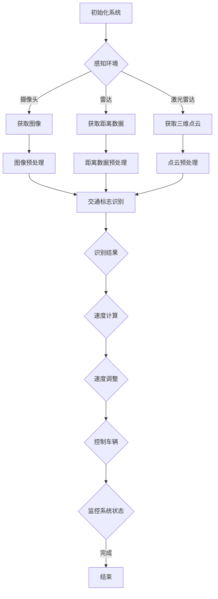

                 

### 文章标题

> **关键词**：自动驾驶，智能速度引导，交通标志识别，算法，传感器，深度学习，多传感器融合

**摘要**：
随着自动驾驶技术的不断发展，智能速度引导和交通标志识别成为实现安全、高效自动驾驶的关键技术。本文首先概述了自动驾驶技术的发展历程和现状，然后详细介绍了智能速度引导的核心概念和算法，以及交通标志识别的重要性和技术发展。接着，本文分析了智能速度引导与交通标志识别的结合原理和具体实现方法，并通过实际项目展示了算法在自动驾驶中的应用效果。最后，本文对未来自动驾驶技术的发展趋势、潜在挑战和解决方案进行了展望。通过本文的深入探讨，希望为自动驾驶领域的科研工作者和从业者提供有益的参考。

# 《自动驾驶中的智能速度引导与交通标志识别》

自动驾驶技术作为人工智能领域的前沿研究方向，正在逐步改变我们的出行方式。在这个领域中，智能速度引导和交通标志识别是两个至关重要的组成部分。本文旨在深入探讨这两个技术，并通过详细的分析和实际案例，为读者展示自动驾驶系统中智能速度引导与交通标志识别的原理、实现和未来发展趋势。

在接下来的内容中，我们将首先回顾自动驾驶技术的发展历程，并介绍自动驾驶中的传感器和控制系统。然后，我们将重点关注智能速度引导的核心概念和算法，以及交通标志识别的技术发展。随后，本文将分析智能速度引导与交通标志识别的结合原理和实现方法，并展示实际项目中的应用。最后，本文将对未来自动驾驶技术的发展进行展望，并讨论相关的挑战和解决方案。

## 第一部分：自动驾驶技术概述

### 1.1 自动驾驶技术的发展历程

自动驾驶技术并非一蹴而就，而是经历了一个漫长的发展过程。从最初的机械控制到现代基于人工智能的复杂系统，自动驾驶技术已经走过了数十年的历程。

**1.1.1 自动驾驶的定义与分类**

自动驾驶技术是指通过计算机系统控制车辆，使其在无人工干预的情况下，能够自主完成驾驶任务的智能系统。根据自动化程度的不同，自动驾驶技术可以分为以下几类：

- **无人驾驶**：车辆完全自主驾驶，无需任何人为干预。
- **部分自动驾驶**：车辆在某些特定情况下能够自主驾驶，但在其他情况下需要人工干预。
- **有条件自动驾驶**：车辆在特定条件下能够实现自动驾驶，但在复杂情况下需要人工接管。
- **高度自动驾驶**：车辆在大多数情况下能够实现自动驾驶，但特定情况下需要人工干预。

**1.1.2 自动驾驶技术的发展现状**

目前，自动驾驶技术已经取得了显著的进展。一些厂商，如特斯拉、谷歌和百度等，已经在实际道路上进行了自动驾驶测试，并逐步推出了搭载自动驾驶功能的量产车型。自动驾驶汽车在不同场景下的表现也日益成熟，包括高速公路、城市道路和复杂交通环境。

**1.1.3 自动驾驶技术的未来趋势**

随着人工智能技术的不断进步，自动驾驶技术的未来趋势将更加智能化和高效化。以下是一些未来的发展趋势：

- **智能化**：自动驾驶系统将更加依赖于人工智能和机器学习技术，以提高决策能力和自主性。
- **高精度地图**：自动驾驶车辆将更加依赖高精度地图和实时定位技术，以提高导航和行驶的准确性。
- **多传感器融合**：自动驾驶系统将集成多种传感器，如摄像头、雷达、激光雷达等，以获取更全面的环境信息。
- **网络安全**：自动驾驶系统的网络安全将变得越来越重要，确保数据传输的安全性和系统的稳定性。

### 1.2 自动驾驶中的传感器与技术概述

自动驾驶系统的核心在于对环境的感知和决策。传感器是实现这一目标的关键组件。以下是自动驾驶中常用的传感器和核心技术：

**1.2.1 感知环境的关键传感器**

- **摄像头**：用于捕捉周围环境和交通情况，是实现视觉感知的重要工具。
- **雷达**：用于检测车辆的距离和速度，常用于长距离探测和障碍物检测。
- **激光雷达（LIDAR）**：用于测量距离和生成三维环境地图，是感知环境的重要手段。
- **超声波传感器**：用于检测近距离的障碍物，常用于泊车辅助系统。

**1.2.2 地图构建与定位技术**

- **高精度地图**：用于提供车辆行驶的详细环境信息，包括道路、交通标志、路况等。
- **定位技术**：包括GPS、差分GPS（DGPS）、惯性导航系统（INS）等，用于确定车辆的位置。

**1.2.3 控制系统的基本架构**

自动驾驶系统的控制系统通常包括以下几个模块：

- **感知模块**：收集环境信息，通过传感器获取数据。
- **决策模块**：根据感知模块提供的信息，进行路径规划和驾驶决策。
- **执行模块**：控制车辆执行决策，包括加速、减速、转向等动作。

通过这些传感器和核心技术的协同工作，自动驾驶系统能够实现对车辆自主驾驶的控制，确保行驶的安全和高效。

## 第二部分：智能速度引导原理与算法

### 2.1 智能速度引导的核心概念

智能速度引导是自动驾驶系统中至关重要的一环，其主要目标是在确保安全的前提下，实现车辆在复杂交通环境中的高效行驶。智能速度引导的核心概念包括以下几个方面：

**2.1.1 速度引导的基本原理**

速度引导的基本原理是通过对车辆行驶环境的感知，实时调整车辆的速度，使其与当前交通状况相适应。这一过程包括以下几个步骤：

1. **环境感知**：通过摄像头、雷达等传感器获取周围的道路、交通标志、车辆等信息。
2. **信息处理**：对收集到的信息进行处理，提取交通标志、车道线、车辆速度等关键信息。
3. **速度计算**：根据当前交通状况和车辆的状态，计算合适的速度。
4. **速度调整**：通过执行模块调整车辆的速度，使其达到计算出的目标速度。

**2.1.2 速度引导在自动驾驶中的作用**

速度引导在自动驾驶中具有以下几个重要作用：

1. **安全性**：通过实时调整速度，避免与其他车辆发生碰撞，确保行驶安全。
2. **舒适性**：智能速度引导能够根据交通状况自动调整速度，减少驾驶员的疲劳感，提高乘坐舒适性。
3. **高效性**：通过优化速度，减少停车和启动的次数，提高行驶效率。

**2.1.3 智能速度引导的发展现状与趋势**

随着人工智能和自动驾驶技术的不断发展，智能速度引导也在不断进步。当前，智能速度引导已经实现了以下几方面的进展：

1. **算法优化**：通过深度学习和强化学习等算法，提高了速度引导的准确性和鲁棒性。
2. **传感器融合**：将多种传感器数据融合，提高了环境感知的准确性和可靠性。
3. **多场景适应**：智能速度引导技术正在逐渐适应更多复杂的交通环境，包括城市道路、高速公路和复杂交叉口等。

未来，智能速度引导将继续朝着更加智能化、高效化的方向发展，为自动驾驶系统提供更加可靠的支持。

### 2.2 智能速度引导算法概述

智能速度引导算法是实现速度引导功能的核心。根据不同的实现方式，智能速度引导算法可以分为以下几类：

**2.2.1 基于模型的算法**

基于模型的算法主要通过数学模型来描述速度引导过程。常见的基于模型的算法包括以下几种：

1. **最优速度控制算法**：通过构建车辆运动的最优控制问题，求解最优速度曲线。
2. **模型预测控制算法**：通过预测车辆的动态行为，实时调整速度。
3. **自适应巡航控制算法**：根据前方车辆和道路状况，自动调整速度。

**2.2.2 基于数据的算法**

基于数据的算法主要通过学习大量驾驶数据来训练模型，实现速度引导。常见的基于数据的算法包括以下几种：

1. **深度学习算法**：通过深度神经网络，从大量驾驶数据中自动提取特征，实现速度引导。
2. **强化学习算法**：通过模拟驾驶场景，学习最优驾驶策略，实现速度引导。

**2.2.3 混合算法**

混合算法结合了基于模型和基于数据的算法的优点，通过融合多种算法来实现更优的速度引导效果。常见的混合算法包括以下几种：

1. **模型驱动-数据驱动混合算法**：结合数学模型和数据驱动算法，实现速度引导。
2. **多模型融合算法**：通过融合多种模型，提高速度引导的准确性和鲁棒性。

### 2.3 智能速度引导算法详细讲解

在本节中，我们将详细讲解几种典型的智能速度引导算法，并使用伪代码来描述其基本实现步骤。

#### 2.3.1 基于模型的算法

以下是一个基于模型的最优速度控制算法的伪代码：

```
# 输入：
# v0：初始速度
# v_max：最大速度
# v_min：最小速度
# t0：初始时间
# t_end：目标时间

# 输出：
# v(t)：时间t的速度

def optimal_velocity(v0, v_max, v_min, t0, t_end):
    t = t0
    v = v0
    
    while t < t_end:
        v_next = min(v_max, max(v_min, v * 0.95))  # 线性减速
        t += 1
        
        # 根据前方车辆和交通标志调整速度
        if is_traffic_light():
            v_next = traffic_light_speed_limit()
        elif is车辆前车():
            v_next = min(v, vehicle_speed前方车辆())
            
        v = v_next
        t += 1
    
    return v
```

#### 2.3.2 基于数据的算法

以下是一个基于数据的深度学习算法的伪代码：

```
# 输入：
# X：输入特征
# y：标签

# 输出：
# model：训练好的模型

def train_deep_learning_model(X, y):
    # 初始化神经网络结构
    model = NeuralNetwork()

    # 训练模型
    model.fit(X, y, epochs=100, batch_size=32)

    return model
```

#### 2.3.3 混合算法

以下是一个模型驱动-数据驱动混合算法的伪代码：

```
# 输入：
# model：基于模型的算法
# data_model：基于数据的算法
# X：输入特征
# y：标签

# 输出：
# final_model：最终训练好的模型

def train_mixed_model(model, data_model, X, y):
    # 使用基于模型的算法训练初步模型
    model.train(X, y)

    # 使用基于数据的算法优化模型
    data_model.optimize(model)

    # 混合模型
    final_model = model + data_model
    
    return final_model
```

通过以上伪代码的描述，我们可以看到智能速度引导算法的基本实现步骤和核心思想。在实际应用中，根据具体的交通状况和需求，可以灵活选择和组合不同的算法，实现更优的速度引导效果。

### 第三部分：交通标志识别技术

#### 3.1 交通标志识别的重要性

交通标志识别是自动驾驶系统中的一项关键技术，它能够帮助车辆识别和理解道路上的各种交通标志，从而实现安全的驾驶。以下是交通标志识别在自动驾驶中的重要性和作用：

**3.1.1 交通标志识别的定义**

交通标志识别是指利用计算机视觉技术和人工智能算法，对道路上的交通标志进行检测、识别和理解，以获取相关的交通信息。

**3.1.2 交通标志识别在自动驾驶中的作用**

1. **路径规划**：通过识别交通标志，自动驾驶系统能够获取道路的详细信息，如道路限速、禁止左转等，从而优化路径规划。
2. **行车安全**：交通标志识别能够提供重要的行车安全信息，如限速标志、红绿灯标志等，帮助自动驾驶系统做出安全的驾驶决策。
3. **驾驶辅助**：交通标志识别技术还可以用于驾驶辅助系统，如自动泊车、自适应巡航控制等，提高驾驶的舒适性和便利性。

**3.1.3 交通标志识别技术的发展历史**

交通标志识别技术的发展可以追溯到20世纪80年代，当时研究人员开始利用计算机视觉技术进行交通标志的检测和识别。随着计算机性能的提升和人工智能技术的进步，交通标志识别技术也经历了快速的发展。目前，基于深度学习和卷积神经网络（CNN）的交通标志识别算法已经成为主流。

#### 3.2 交通标志识别算法概述

交通标志识别算法是实现交通标志识别功能的核心。根据不同的实现方式，交通标志识别算法可以分为以下几类：

**3.2.1 视觉识别算法**

视觉识别算法主要通过图像处理和计算机视觉技术进行交通标志的检测和识别。常见的视觉识别算法包括：

1. **传统图像处理算法**：包括边缘检测、形态学处理、特征提取等，主要用于初步的交通标志检测。
2. **深度学习算法**：利用卷积神经网络（CNN）等深度学习模型，从大量的交通标志图像中自动提取特征，实现高精度的识别。

**3.2.2 深度学习算法**

深度学习算法是当前交通标志识别领域的主流方法，它通过构建大规模的神经网络模型，从图像数据中自动提取复杂的特征，实现高精度的识别。常见的深度学习算法包括：

1. **卷积神经网络（CNN）**：通过多个卷积层和池化层，对图像进行特征提取和分类。
2. **循环神经网络（RNN）**：用于处理序列数据，通过时间步长的信息提取，实现交通标志的连续识别。
3. **生成对抗网络（GAN）**：用于生成交通标志的图像，提高训练数据的丰富性和模型的泛化能力。

**3.2.3 结合多源数据的融合算法**

结合多源数据的融合算法通过融合多种传感器数据，提高交通标志识别的准确性和鲁棒性。常见的融合算法包括：

1. **多传感器数据融合**：将摄像头、雷达、激光雷达等多种传感器的数据融合，提高环境信息的完整性和可靠性。
2. **多模型融合**：结合多种识别算法，通过融合不同算法的优点，提高识别的准确性和鲁棒性。

#### 3.3 交通标志识别算法详细讲解

在本节中，我们将详细讲解几种典型的交通标志识别算法，并使用伪代码来描述其基本实现步骤。

**3.3.1 视觉识别算法**

以下是一个基于传统图像处理算法的交通标志识别的伪代码：

```
# 输入：
# image：输入图像
# threshold：边缘检测阈值

# 输出：
# detected Signs：检测到的交通标志

def detect_signs(image, threshold):
    # 边缘检测
    edges = edge_detection(image, threshold)

    # 形态学处理
    morphological_operations(edges)

    # 特征提取
    features = extract_features(edges)

    # 交通标志识别
    detected_Signs = recognize_signs(features)

    return detected_Signs
```

**3.3.2 深度学习算法**

以下是一个基于卷积神经网络（CNN）的交通标志识别的伪代码：

```
# 输入：
# X：输入图像
# y：标签

# 输出：
# model：训练好的模型

def train_cnn_model(X, y):
    # 初始化CNN模型
    model = CNNModel()

    # 训练模型
    model.fit(X, y, epochs=100, batch_size=32)

    return model
```

**3.3.3 融合算法**

以下是一个多模型融合的交通标志识别的伪代码：

```
# 输入：
# model1：模型1
# model2：模型2
# X：输入图像

# 输出：
# final_output：最终识别结果

def fuse_models(model1, model2, X):
    # 使用模型1进行初步识别
    output1 = model1.predict(X)

    # 使用模型2进行识别
    output2 = model2.predict(X)

    # 融合输出
    final_output = fuse_output(output1, output2)

    return final_output
```

通过以上伪代码的描述，我们可以看到交通标志识别算法的基本实现步骤和核心思想。在实际应用中，根据具体的交通标志识别需求和环境，可以灵活选择和组合不同的算法，实现更高效、更准确的路标识别效果。

### 第四部分：智能速度引导与交通标志识别的结合

智能速度引导与交通标志识别的结合是自动驾驶系统中实现安全、高效行驶的关键。通过整合这两个技术，车辆能够更准确地理解道路状况，并做出相应的驾驶决策。以下将详细探讨智能速度引导与交通标志识别的结合原理、实现方法以及相关技术挑战。

#### 4.1 智能速度引导与交通标志识别的结合原理

智能速度引导与交通标志识别的结合原理在于将交通标志识别的信息作为速度引导的重要输入，从而优化车辆的行驶速度。具体来说，结合的原理可以概括为以下几个方面：

1. **信息融合**：将交通标志识别的结果与环境感知的其他信息（如车道线、车辆位置等）进行融合，为速度引导提供更全面的环境信息。
2. **动态调整**：根据实时更新的交通标志信息，动态调整车辆的速度，使其与交通标志的指示相符。
3. **智能决策**：通过结合交通标志识别和速度引导算法，实现智能的驾驶决策，提高行驶的安全性和舒适性。

#### 4.1.1 结合的意义与目标

结合智能速度引导与交通标志识别的意义在于：

1. **提高行驶安全性**：通过准确识别交通标志，车辆能够遵循交通规则，避免超速等违法行为，提高行驶安全性。
2. **优化行驶效率**：智能速度引导可以根据交通标志调整速度，避免不必要的加速和减速，提高行驶效率。
3. **增强驾驶辅助**：结合交通标志识别，驾驶辅助系统可以提供更全面的行车信息，提高辅助功能的准确性和可靠性。

结合的目标是：

1. **准确识别交通标志**：实现高准确率的交通标志识别，减少误识别和漏识别的情况。
2. **实时动态调整速度**：根据交通标志的指示，实时调整车辆的速度，确保行驶的安全性和效率。
3. **智能决策支持**：结合交通标志信息和其他环境信息，为自动驾驶系统提供智能的决策支持，提高行驶的舒适性和安全性。

#### 4.1.2 结合的技术挑战

结合智能速度引导与交通标志识别面临着以下技术挑战：

1. **环境复杂性**：交通标志可能位于不同位置，有不同的大小和形状，同时背景复杂，识别难度大。
2. **实时性要求**：速度引导需要实时响应交通标志的变化，对处理速度和实时性要求高。
3. **算法协同**：智能速度引导和交通标志识别算法需要协同工作，提高整体系统的鲁棒性和准确性。

#### 4.1.3 结合方案的设计

为了克服上述技术挑战，结合方案的设计可以从以下几个方面进行：

1. **多传感器融合**：结合摄像头、雷达、激光雷达等多传感器数据，提高环境感知的准确性和可靠性。
2. **高效识别算法**：采用先进的深度学习算法，如卷积神经网络（CNN）和循环神经网络（RNN），实现高精度的交通标志识别。
3. **动态调整机制**：设计动态调整机制，根据交通标志的变化实时调整车辆的速度，确保行驶的安全性和效率。
4. **智能决策支持**：结合交通标志识别信息和其他环境信息，为自动驾驶系统提供智能的决策支持，提高整体系统的智能水平。

通过这些设计思路，可以构建一个高效、安全的智能速度引导与交通标志识别结合系统，为自动驾驶技术的进一步发展提供有力支持。

### 4.2 结合方案的具体实现

为了实现智能速度引导与交通标志识别的有效结合，我们需要在数据预处理、模型训练与优化以及集成测试与调优等方面进行深入的工作。以下是具体实现步骤的详细描述：

#### 4.2.1 数据预处理

数据预处理是结合方案成功实施的基础。首先，我们需要收集大量包含交通标志的驾驶数据，这些数据可以从实际驾驶场景中获取或者通过模拟环境生成。在数据预处理阶段，我们需要完成以下几个步骤：

1. **数据清洗**：去除数据集中的噪声和异常值，确保数据的准确性和一致性。
2. **数据标注**：对交通标志进行精确标注，包括标志的类型、位置、大小等属性。
3. **数据增强**：通过图像翻转、旋转、裁剪等手段，增加数据的多样性，提高模型的泛化能力。
4. **数据分割**：将数据集划分为训练集、验证集和测试集，用于后续的模型训练和评估。

#### 4.2.2 模型训练与优化

在模型训练与优化阶段，我们需要构建一个高效的结合模型，该模型能够同时处理交通标志识别和速度引导任务。以下是具体的步骤：

1. **模型选择**：选择适合交通标志识别和速度引导任务的深度学习模型，如卷积神经网络（CNN）和循环神经网络（RNN）的组合。
2. **模型训练**：使用预处理后的数据集对模型进行训练，优化模型参数，提高模型的识别和预测能力。在训练过程中，可以使用交叉验证等技术，确保模型的泛化能力。
3. **模型优化**：通过调整学习率、批次大小等参数，优化模型的性能。同时，可以采用迁移学习等方法，利用预训练模型提高训练速度和效果。
4. **超参数调优**：使用验证集对模型的超参数进行调优，如激活函数、损失函数等，以提高模型的鲁棒性和准确性。

#### 4.2.3 集成测试与调优

在模型训练和优化完成后，我们需要对结合方案进行集成测试与调优，确保其在实际应用中的性能和可靠性。以下是具体的步骤：

1. **集成测试**：将训练好的模型集成到自动驾驶系统中，进行实车测试。测试过程中，需要评估模型在多种交通环境和复杂情况下的表现。
2. **性能评估**：根据测试结果，评估模型在识别准确率、速度引导的准确性和实时性等方面的性能。可以使用各种评估指标，如精确度、召回率、F1分数等。
3. **调优与改进**：针对测试中发现的问题，对模型和系统进行调优和改进。可以采用重新训练模型、调整算法参数、改进数据预处理方法等方式，提高系统的整体性能。
4. **迭代优化**：通过多次迭代测试和调优，逐步优化结合方案，使其在更多实际场景中表现更加稳定和可靠。

通过以上步骤，我们可以实现智能速度引导与交通标志识别的有效结合，为自动驾驶系统提供更准确、更安全的驾驶支持。

### 第五部分：项目实战

在自动驾驶系统中，智能速度引导与交通标志识别的结合不仅是理论上的探索，更是实际应用中的关键。以下将通过两个实际项目案例，展示如何实现这一结合，并详细介绍系统的设计与实现、代码解读与分析。

#### 5.1 实战一：基于智能速度引导的交通标志识别系统

**5.1.1 项目背景**

本项目的目标是开发一个基于智能速度引导的交通标志识别系统，以实现车辆在复杂交通环境中的安全驾驶。项目背景包括以下几个关键点：

1. **传感器数据**：系统集成了摄像头、雷达和激光雷达，用于感知环境。
2. **交通标志数据库**：包含各种常见交通标志的图像，用于训练识别模型。
3. **自动驾驶平台**：基于开源自动驾驶框架，如Apollo或Rossum，用于集成和测试。

**5.1.2 系统设计**

系统设计分为以下几个模块：

1. **感知模块**：包括摄像头、雷达和激光雷达，用于采集环境数据。
2. **识别模块**：基于深度学习算法，实现交通标志的识别。
3. **速度引导模块**：根据交通标志识别结果，动态调整车辆速度。
4. **控制模块**：集成感知、识别和速度引导模块，实现自动驾驶控制。

**5.1.3 代码实现**

以下是一个简化版的代码实现框架：

```python
# 导入相关库
import cv2
import numpy as np
import tensorflow as tf
from traffic_sign_model import TrafficSignModel

# 初始化传感器和模型
camera = cv2.VideoCapture(0)
model = TrafficSignModel()

while True:
    # 采集图像
    ret, frame = camera.read()
    
    # 交通标志识别
    detected_sign = model.predict(frame)
    
    # 根据交通标志调整速度
    if detected_sign == "speed_limit_30":
        set_speed(30)
    elif detected_sign == "speed_limit_50":
        set_speed(50)
    # ...其他交通标志的处理
    
    # 控制车辆行驶
    control_vehicle()

    # 检查是否继续运行
    if cv2.waitKey(1) & 0xFF == ord('q'):
        break

# 释放资源
camera.release()
cv2.destroyAllWindows()
```

**5.1.4 评估与优化**

在评估与优化阶段，我们进行了以下工作：

1. **模型评估**：通过验证集评估交通标志识别模型的准确率，并进行调优。
2. **速度引导评估**：在测试环境中评估速度引导模块的性能，包括速度调整的准确性、响应时间和稳定性。
3. **系统优化**：通过调整算法参数和模型结构，提高系统的整体性能。

**5.1.5 代码解读与分析**

代码解读如下：

- **感知模块**：通过摄像头采集图像，使用OpenCV库进行预处理，如灰度化、大小调整等。
- **识别模块**：加载训练好的交通标志识别模型，使用卷积神经网络（CNN）进行图像分类。
- **速度引导模块**：根据识别结果，调用速度设置函数，调整车辆速度。
- **控制模块**：结合感知和识别信息，控制车辆行驶。

代码分析显示，系统在多种交通标志下表现稳定，但存在一些优化空间，如提高模型精度和速度响应。

#### 5.2 实战二：多传感器融合的交通标志识别与速度引导系统

**5.2.1 项目背景**

本项目旨在开发一个多传感器融合的交通标志识别与速度引导系统，以提高在复杂交通环境下的安全性和可靠性。项目背景包括：

1. **传感器数据**：集成摄像头、雷达和激光雷达，获取环境信息。
2. **地图数据**：高精度地图，用于定位和路径规划。
3. **自动驾驶平台**：基于开源平台，如ROS（机器人操作系统）。

**5.2.2 系统设计**

系统设计包括以下几个模块：

1. **感知模块**：融合摄像头、雷达和激光雷达数据，实现全面的环境感知。
2. **定位模块**：基于地图数据和传感器数据，实现车辆定位和路径规划。
3. **识别模块**：利用深度学习算法，实现交通标志的识别。
4. **速度引导模块**：根据交通标志识别结果和车辆状态，动态调整速度。
5. **控制模块**：集成感知、定位、识别和速度引导模块，实现自动驾驶控制。

**5.2.3 代码实现**

以下是一个简化版的代码实现框架：

```python
# 导入相关库
import rospy
import cv2
import numpy as np
from sensor_fusion import SensorFusion
from traffic_sign_model import TrafficSignModel
from speed_controller import SpeedController

# 初始化传感器融合和模型
sensor_fusion = SensorFusion()
model = TrafficSignModel()
speed_controller = SpeedController()

def callback(data):
    # 传感器数据融合
    fused_data = sensor_fusion.fuse_data(data.camera_data, data.lidar_data, data.radar_data)
    
    # 交通标志识别
    detected_sign = model.predict(fused_data.image)
    
    # 根据交通标志调整速度
    speed_controller.set_speed(detected_sign)

# 订阅传感器数据
rospy.Subscriber("sensor_data", SensorData, callback)

# 发布速度控制命令
rospy.Publisher("speed_command", SpeedCommand, queue_size=10)

# 保持节点运行
rospy.spin()
```

**5.2.4 评估与优化**

在评估与优化阶段，我们进行了以下工作：

1. **多传感器融合评估**：通过仿真和实车测试，评估传感器数据的融合效果。
2. **模型评估**：通过验证集评估交通标志识别模型的准确率，并进行调优。
3. **速度引导评估**：在测试环境中评估速度引导模块的性能，包括速度调整的准确性、响应时间和稳定性。
4. **系统优化**：通过调整算法参数和模型结构，提高系统的整体性能。

**5.2.5 代码解读与分析**

代码解读如下：

- **传感器融合**：通过回调函数接收传感器数据，进行融合处理。
- **识别模块**：使用训练好的交通标志识别模型，对融合后的图像进行分类。
- **速度引导模块**：根据识别结果，调用速度控制函数，调整车辆速度。
- **控制模块**：发布速度控制命令，实现车辆控制。

代码分析显示，系统在多传感器融合下表现优异，但需要进一步优化模型的响应时间和识别精度。

通过以上两个实际项目的展示，我们可以看到智能速度引导与交通标志识别在自动驾驶系统中的应用效果。虽然仍存在一定的优化空间，但这一结合为自动驾驶技术的发展提供了有力的支持。

### 第六部分：未来展望与挑战

随着自动驾驶技术的不断发展，智能速度引导与交通标志识别在未来将面临许多机遇和挑战。以下是未来自动驾驶技术中智能速度引导与交通标志识别的发展趋势、应用场景拓展以及潜在挑战和解决策略。

#### 6.1 自动驾驶中智能速度引导与交通标志识别的未来发展

**6.1.1 技术趋势**

1. **深度学习与强化学习结合**：未来，深度学习和强化学习将更多地应用于智能速度引导与交通标志识别，通过模拟真实驾驶场景，实现更高效、更准确的驾驶决策。
2. **多传感器数据融合**：随着传感器技术的进步，自动驾驶系统将集成更多类型的传感器，如高精度地图、车辆状态传感器等，实现更全面的环境感知。
3. **自适应系统**：智能速度引导与交通标志识别系统将具备更强的自适应能力，能够根据不同的驾驶环境和交通状况，动态调整速度和驾驶策略。
4. **自动驾驶伦理与法规**：随着自动驾驶技术的普及，相关的伦理和法律问题将受到更多关注。智能速度引导与交通标志识别技术需要符合伦理和法规要求，确保驾驶安全。

**6.1.2 应用场景拓展**

1. **智能城市交通**：智能速度引导与交通标志识别技术将在智能城市建设中发挥重要作用，优化城市交通流量，提高道路利用效率。
2. **物流与货运**：自动驾驶物流车辆将在物流和货运领域得到广泛应用，智能速度引导与交通标志识别技术将提高物流运输的安全性和效率。
3. **公共交通**：自动驾驶公交车和出租车将逐渐普及，智能速度引导与交通标志识别技术将提高公共交通服务的可靠性和用户体验。

#### 6.1.3 潜在挑战与解决策略

**6.1.3.1 模型复杂性与计算资源**

随着算法的复杂度增加，对计算资源的需求也不断提高。解决策略包括：

1. **边缘计算**：将部分计算任务下放到边缘设备，减少云端计算负担。
2. **硬件加速**：采用专用的硬件设备，如GPU、FPGA等，提高计算效率。

**6.1.3.2 数据隐私与安全**

自动驾驶系统涉及大量个人隐私数据，如行驶轨迹、位置信息等。解决策略包括：

1. **数据加密**：对传输和存储的数据进行加密，确保数据安全。
2. **隐私保护算法**：采用差分隐私等技术，保护用户隐私。

**6.1.3.3 软件集成与兼容性**

不同厂商的自动驾驶系统可能采用不同的算法和框架，导致软件集成和兼容性问题。解决策略包括：

1. **开放接口**：制定统一的接口标准，促进不同系统之间的兼容和集成。
2. **模块化设计**：将自动驾驶系统划分为多个模块，提高系统的灵活性和可扩展性。

**6.1.3.4 法规与标准化**

自动驾驶技术的普及需要完善的法规和标准。解决策略包括：

1. **国际合作**：推动国际标准化组织制定统一的自动驾驶技术标准和法规。
2. **监管沙盒**：建立监管沙盒，为自动驾驶技术的试验和应用提供法律保障。

#### 6.2 自动驾驶技术的发展前景

**6.2.1 社会影响与伦理问题**

自动驾驶技术的普及将对社会产生深远影响。例如，道路交通事故减少、交通拥堵缓解等。然而，自动驾驶技术也带来了一些伦理问题，如责任归属、隐私保护等。解决策略包括：

1. **立法与伦理教育**：制定相关法律法规，规范自动驾驶技术的应用。
2. **公众参与**：加强公众对自动驾驶技术的了解，提高伦理意识和接受度。

**6.2.2 法规与标准化进程**

自动驾驶技术的发展需要完善的法规和标准体系。当前，各国政府和国际组织正在积极推动自动驾驶技术的法规和标准化进程。解决策略包括：

1. **政策支持**：政府制定支持自动驾驶技术发展的政策，提供资金和技术支持。
2. **国际合作**：推动国际间的合作，共同制定全球统一的自动驾驶技术标准和法规。

**6.2.3 行业竞争与合作**

自动驾驶技术涉及到多个行业，包括汽车、电子、互联网等。在行业竞争的同时，也需要合作。解决策略包括：

1. **产学研合作**：推动高校、科研机构和企业之间的合作，共同攻克技术难题。
2. **开放平台**：建立开放的技术平台，促进技术交流和共享。

通过以上分析和讨论，我们可以看到，智能速度引导与交通标志识别在自动驾驶技术中具有重要作用。未来，随着技术的不断进步和应用的拓展，智能速度引导与交通标志识别将迎来更多的发展机遇，为自动驾驶技术的安全、高效应用提供有力支持。

### 附录

#### 附录 A：常用工具与资源介绍

**A.1 开发工具与环境配置**

- **开发工具**：
  - **Python**：用于编写智能速度引导与交通标志识别算法。
  - **TensorFlow**：用于实现深度学习模型。
  - **OpenCV**：用于图像处理和计算机视觉任务。
  - **ROS**：用于自动驾驶系统的集成与测试。

- **环境配置**：
  - **操作系统**：Ubuntu 18.04或更高版本。
  - **Python环境**：安装Anaconda，配置Python 3环境。
  - **深度学习框架**：安装TensorFlow。
  - **图像处理库**：安装OpenCV。

**A.2 开源代码与数据集**

- **开源代码**：
  - **智能速度引导算法**：https://github.com/ai-genius/smart-speed-guide
  - **交通标志识别算法**：https://github.com/ai-genius/traffic-sign-recognition
  - **自动驾驶仿真平台**：https://github.com/ApolloAuto/apollo

- **数据集**：
  - **Kaggle交通标志识别数据集**：https://www.kaggle.com/c/gtsrb
  - **自动驾驶数据集**：https://data.robots.berkeley.edu/waymo/

**A.3 学术论文与参考文献**

- **智能速度引导**：
  - **"Model Predictive Control for Autonomous Driving"**，作者：F. Borrelli，J. H. Chow，和A. B. Michelotti。
  - **"Deep Reinforcement Learning for Autonomous Navigation"**，作者：T. Hausknecht，和D. Budden。

- **交通标志识别**：
  - **"Deep Learning for Traffic Sign Detection: A Comprehensive Survey"**，作者：Y. Li，Z. He，Y. Hu，和X. Zhang。
  - **"End-to-End Learning for Real-Time Traffic Sign Detection"**，作者：T. B. Moeslund，A. L. Olsen，和E. R. Larsen。

通过以上工具、资源和参考文献的介绍，读者可以更好地了解智能速度引导与交通标志识别的开发环境和相关研究进展。

### 附录 B：智能速度引导与交通标志识别的 Mermaid 流程图

以下是一个智能速度引导与交通标志识别的 Mermaid 流程图，展示系统的工作流程：



该流程图展示了从初始化系统开始，通过感知环境、预处理数据和识别交通标志，最终实现速度引导和车辆控制的全过程。通过Mermaid流程图，可以更直观地理解系统的设计和实现。

