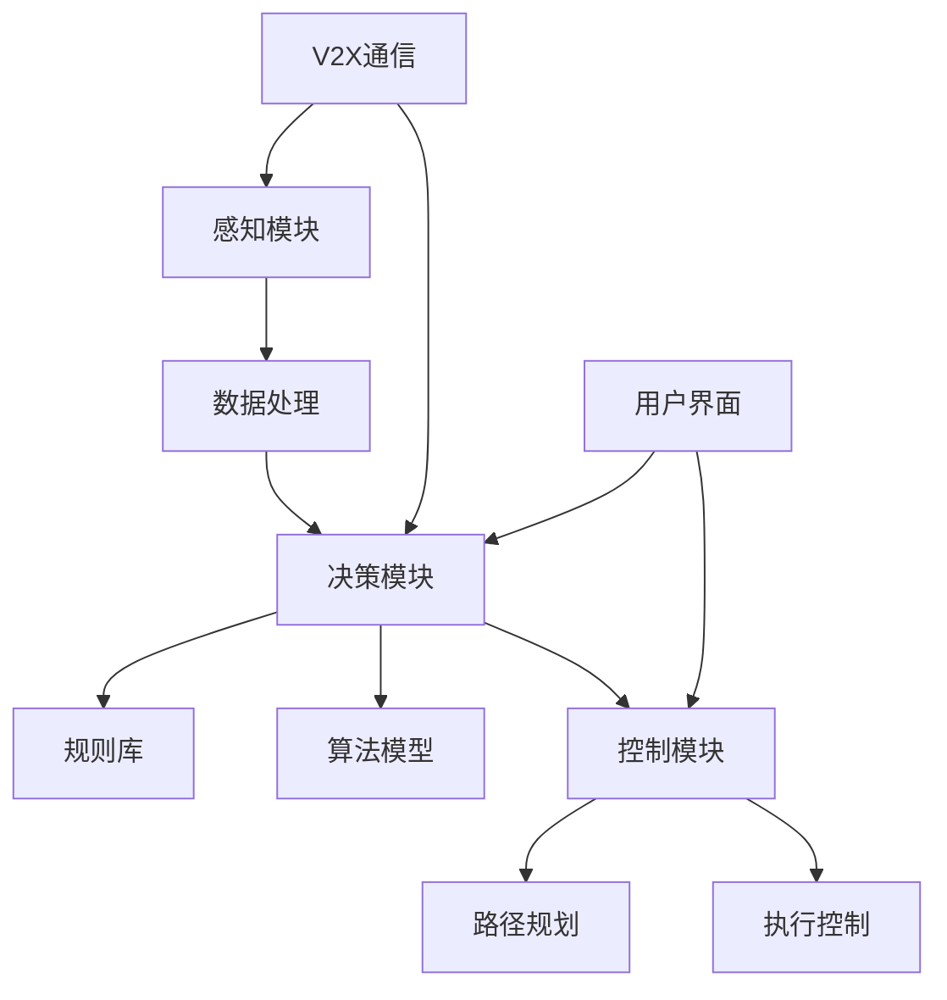

                 

## 《自动驾驶伦理决策系统：智能交通的创新挑战》

### 关键词：自动驾驶、伦理决策、智能交通、创新挑战、技术发展

> 摘要：本文深入探讨了自动驾驶伦理决策系统的概念、重要性及其构建方法。通过对自动驾驶技术概述、伦理决策系统的基础、架构设计、核心算法和应用场景的详细分析，本文旨在揭示自动驾驶伦理决策系统在智能交通中的创新挑战。文章最后提出了未来发展趋势和项目实战案例，为自动驾驶伦理决策系统的研发提供参考。

### 《自动驾驶伦理决策系统：智能交通的创新挑战》目录大纲

1. **第一部分：自动驾驶与伦理决策系统基础**
    1.1 自动驾驶技术概述
        - 自动驾驶技术的发展历程
        - 自动驾驶的核心技术
        - 自动驾驶的分类与现状
    1.2 伦理决策系统的概念与重要性
        - 伦理决策系统的定义
        - 伦理决策系统在自动驾驶中的重要性
        - 自动驾驶伦理决策系统的挑战与机遇
    1.3 自动驾驶伦理决策系统的构建方法

2. **第二部分：自动驾驶伦理决策系统的构建方法**
    2.1 伦理决策系统的架构设计
        - 伦理决策系统的总体架构
        - 伦理规则与决策策略
        - 伦理决策系统的数据处理与建模
    2.2 伦理决策系统的核心算法
        - 基于人工智能的伦理决策算法
        - 多智能体系统中的伦理决策
        - 基于博弈论的伦理决策算法
    2.3 伦理决策系统的应用场景
        - 城市交通管理中的应用
        - 道路安全与事故预防
        - 公共交通系统优化

3. **第三部分：自动驾驶伦理决策系统的开发与实现**
    3.1 开发环境与工具
        - 开发环境的搭建
        - 开发工具的选择
    3.2 代码实现与解读
        - 关键算法的代码实现
        - 代码解读与分析
    3.3 系统性能评估与优化
        - 系统性能评估指标
        - 系统性能优化策略

4. **第四部分：自动驾驶伦理决策系统的未来发展趋势**
    4.1 自动驾驶伦理决策系统的技术挑战
    4.2 自动驾驶伦理决策系统的法律法规与伦理规范
    4.3 自动驾驶伦理决策系统的未来发展方向

5. **第五部分：项目实战：基于自动驾驶伦理决策系统的智能交通系统开发**
    5.1 项目背景与目标
    5.2 系统架构设计
    5.3 关键算法与模型实现
    5.4 系统性能测试与优化
    5.5 项目总结与展望

6. **附录A：自动驾驶与伦理决策系统相关资源**
    6.1 自动驾驶与伦理决策系统相关书籍
    6.2 自动驾驶与伦理决策系统相关论文
    6.3 自动驾驶与伦理决策系统开源工具与框架

---

### 第1章：自动驾驶技术概述

自动驾驶技术作为人工智能和计算机视觉领域的重要创新，正逐步改变着我们的出行方式。本章节将详细介绍自动驾驶技术的发展历程、核心技术以及当前分类与现状。

#### 1.1 自动驾驶技术的发展历程

自动驾驶技术的发展可追溯到20世纪50年代，当时计算机科学家艾伦·图灵提出了计算机模拟自动驾驶的概念。随着计算机技术和传感器技术的进步，自动驾驶技术经历了几个重要的发展阶段：

1. **感知阶段（1950-1970s）**：
   - 自动驾驶研究主要集中在车辆感知环境的能力上，如使用雷达和光学传感器进行车辆定位和障碍物检测。

2. **控制阶段（1980-1990s）**：
   - 研究重点转向车辆的路径规划和控制策略，使车辆能够在简单封闭道路环境下实现自动驾驶。

3. **系统集成阶段（2000-2010s）**：
   - 随着多传感器融合技术的发展，自动驾驶车辆能够更好地处理复杂路况，实现了从简单道路到复杂城市道路的过渡。

4. **商业化阶段（2010s 至今）**：
   - 自动驾驶技术开始逐步应用于实际交通场景，从辅助驾驶到完全自动驾驶，自动驾驶汽车逐渐进入公众视野。

#### 1.2 自动驾驶的核心技术

自动驾驶技术的实现依赖于多个核心技术的协同工作，包括感知技术、决策技术和控制技术：

1. **感知技术**：
   - **摄像头**：用于捕捉车辆周围环境，通过图像处理技术进行目标识别和场景理解。
   - **激光雷达（LiDAR）**：通过发射激光束并测量反射时间来生成高精度的三维点云数据，用于环境建模和障碍物检测。
   - **GPS/IMU**：用于车辆的定位和姿态估计。

2. **决策技术**：
   - **路径规划**：确定车辆从当前位置到达目标位置的最优路径。
   - **行为预测**：预测其他车辆、行人的行为，以适应动态交通环境。
   - **控制策略**：根据决策结果，控制车辆的速度、转向和制动等动作。

3. **控制技术**：
   - **控制算法**：如PID控制、模型预测控制（MPC）等，用于精确控制车辆动作。
   - **执行机构**：包括发动机、制动系统和转向系统等，实现控制策略的具体执行。

#### 1.3 自动驾驶的分类与现状

自动驾驶技术按照自动化程度可以分为几个级别，根据美国汽车工程师协会（SAE）的定义：

1. **Level 0-2**：完全由人类驾驶员控制，辅助系统如自动制动和车道保持功能仅作为辅助。
2. **Level 3**：部分自动驾驶，车辆可以在特定条件下接管驾驶任务，如高速公路自动驾驶。
3. **Level 4**：高度自动驾驶，车辆可以在特定环境下完全自动驾驶，但需有人类驾驶员在必要时接管。
4. **Level 5**：完全自动驾驶，车辆在任何环境下都能完全自主驾驶。

目前，自动驾驶技术已广泛应用于公共交通、物流运输和私人出行等领域。例如，Waymo的自动驾驶出租车服务已经在数个城市试运行，而特斯拉的自动驾驶系统也在全球范围内广受欢迎。

自动驾驶技术的不断进步不仅提高了交通效率，还减少了交通事故和环境污染。然而，随着自动驾驶技术的普及，伦理决策系统的问题也日益突出，这将是后续章节重点探讨的内容。

### 第2章：伦理决策系统的概念与重要性

#### 2.1 伦理决策系统的定义

伦理决策系统是一种结合人工智能和伦理学的方法，用于在复杂的决策环境中提供道德指导。它通常包括一系列规则、算法和模型，用于评估和选择符合道德标准的行动方案。在自动驾驶技术中，伦理决策系统尤为重要，因为它需要在各种潜在的冲突和紧急情况下做出快速而合理的决策。

伦理决策系统的基本组成部分包括：

1. **道德原则**：作为决策的基础，如不伤害他人、尊重个人权利等。
2. **规则库**：包含具体的行为准则和决策标准。
3. **决策算法**：用于处理实时数据并生成决策结果。
4. **模型**：用于模拟和预测不同决策结果的可能后果。

#### 2.2 伦理决策系统在自动驾驶中的重要性

在自动驾驶技术中，伦理决策系统的重要性体现在以下几个方面：

1. **安全**：自动驾驶车辆需要在各种复杂路况下做出快速而准确的决策，以避免事故。伦理决策系统能够在事故发生前预测潜在风险，并提供最佳应对方案。

2. **道德责任**：在紧急情况下，自动驾驶车辆可能需要做出牺牲某些个体利益的决策，以保护更多人的安全。伦理决策系统有助于明确这些决策的道德边界，确保车辆的行为符合社会伦理标准。

3. **公众接受度**：自动驾驶技术的普及离不开公众的信任和接受。一个透明且公正的伦理决策系统能够增强公众对自动驾驶车辆的信任，促进技术的广泛应用。

4. **法律合规性**：随着自动驾驶技术的发展，各国政府和国际组织正在制定相应的法律法规。伦理决策系统需要遵循这些法规，确保车辆的行为合法合规。

#### 2.3 自动驾驶伦理决策系统的挑战与机遇

虽然自动驾驶伦理决策系统具有重要的应用价值，但其实现面临着诸多挑战：

1. **复杂性**：自动驾驶环境复杂多变，需要处理大量的感知数据和动态变化。这使得伦理决策系统的设计、实现和优化变得异常复杂。

2. **伦理争议**：不同文化和价值观可能对相同的决策情境有不同的伦理判断，这使得伦理决策系统的设计需要考虑到广泛的伦理观点。

3. **技术实现**：目前的算法和模型在处理复杂伦理决策时仍存在局限性，需要进一步研究和发展。

然而，这些挑战也伴随着机遇：

1. **技术创新**：自动驾驶伦理决策系统的开发将推动人工智能和伦理学领域的交叉研究，促进技术的进步。

2. **社会影响**：通过解决伦理决策问题，自动驾驶技术可以为社会带来更安全、更高效的交通系统，改善人们的出行体验。

3. **法律法规完善**：随着自动驾驶技术的普及，伦理决策系统的规范化将有助于法律法规的完善和执行。

综上所述，自动驾驶伦理决策系统是智能交通系统中的重要组成部分，其研究和应用将面临诸多挑战，但也蕴含着巨大的机遇。接下来的章节将进一步探讨伦理决策系统的具体构建方法，以期为这一领域的未来发展提供指导。

### 第3章：伦理决策系统的架构设计

#### 3.1 伦理决策系统的总体架构

自动驾驶伦理决策系统的总体架构是一个复杂而精密的系统，它由多个模块和组件组成，协同工作以实现安全、合法和道德的自动驾驶。总体架构可以概括为以下几个主要部分：

1. **感知模块**：
   - **环境感知**：通过摄像头、激光雷达（LiDAR）、GPS和IMU等传感器收集车辆周围的环境数据。
   - **数据处理**：对感知数据进行预处理，如去噪、融合和特征提取，以生成可靠的感知输入。

2. **决策模块**：
   - **规则库**：包含一系列伦理规则和决策标准，用于评估和选择行动方案。
   - **算法模型**：用于处理实时数据，执行伦理规则，并生成决策结果。

3. **控制模块**：
   - **路径规划**：根据决策结果，生成车辆行驶的路径和轨迹。
   - **执行控制**：根据路径规划和控制策略，控制车辆的速度、转向和制动等动作。

4. **通信模块**：
   - **V2X通信**：实现车辆与其他车辆、基础设施和行人之间的通信，以获取外部信息。

5. **用户界面**：
   - **交互接口**：提供驾驶员与车辆之间的交互界面，展示决策结果和操作指令。

#### 各模块的功能与作用

1. **感知模块**：
   - 感知模块是整个系统的信息来源，其准确性和可靠性直接影响决策模块的性能。通过多传感器融合技术，感知模块可以获取高度详细和准确的环境数据，如道路状况、交通流量、车辆位置和行人行为等。

2. **决策模块**：
   - 决策模块是伦理决策系统的核心，负责根据感知模块提供的数据和规则库中的伦理规则，进行伦理评估和决策。该模块通常包括多个算法模型，如深度学习模型、强化学习模型和博弈论模型，以应对不同类型的伦理决策问题。

3. **控制模块**：
   - 控制模块负责将决策模块生成的行动方案转化为具体的车辆控制指令。它需要与车辆的控制系统紧密集成，以实现高效的执行。控制模块通常包括路径规划算法和执行控制算法，以确保车辆在动态环境中安全、稳定地行驶。

4. **通信模块**：
   - 通信模块是实现车辆与外部环境互动的关键，通过V2X通信，车辆可以实时获取其他车辆、基础设施和行人的信息，从而提高整个系统的效率和安全性。

5. **用户界面**：
   - 用户界面是驾驶员与车辆交互的桥梁，它需要提供直观、清晰的交互体验。用户界面不仅可以展示车辆的状态和决策结果，还可以允许驾驶员在必要时进行干预和控制。

#### 伦理决策系统的基本架构图

为了更好地理解伦理决策系统的架构，我们可以使用Mermaid流程图来展示其基本组成部分和相互关系：



在这个流程图中，各模块通过数据流和控制流相互连接，形成一个协同工作的整体。感知模块收集数据，数据处理模块对数据进行预处理，然后传递给决策模块。决策模块根据规则库和算法模型生成决策结果，传递给控制模块执行。同时，V2X通信模块为系统提供外部信息，用户界面则允许驾驶员与车辆进行交互。

通过上述架构设计，自动驾驶伦理决策系统不仅能够实现高度自动化的驾驶功能，还能在复杂的交通环境中做出符合道德和法律规范的决策，从而提高交通安全性和交通效率。

#### 3.2 伦理规则与决策策略

伦理决策系统中的伦理规则和决策策略是确保自动驾驶车辆行为符合道德标准的关键组成部分。伦理规则是一系列预先定义的道德准则和行为指南，用于评估不同决策情境的伦理正确性。而决策策略则是根据这些伦理规则和具体情境，选择最优行动方案的方法。

**伦理规则的设计与实现**

伦理规则的设计需要考虑多种伦理原则和实际应用场景。以下是一些常见的伦理规则：

1. **不伤害原则**：在做出决策时，应尽量避免对任何个体造成伤害。
2. **效用最大化原则**：选择能够带来最大总体利益的行为方案。
3. **尊重个人权利原则**：在冲突情况下，应优先保护个人权利，尤其是弱者。
4. **公平原则**：确保决策结果在各个个体之间公平分配。

这些伦理规则通常以规则库的形式存储在系统中，并在决策过程中进行查询和应用。实现伦理规则需要明确规则的定义、优先级和适用条件。例如，一个具体的伦理规则可以是：“在无法避免碰撞的情况下，优先保护行人而不是乘客。”

**决策策略的制定与优化**

决策策略是确保伦理规则能够有效应用于具体决策情境的关键。常见的决策策略包括：

1. **最大期望效用（MEU）策略**：选择能够带来最大期望总效用（通常是基于概率的加权平均）的决策方案。
2. **最小化后悔（Regret Minimization）策略**：选择在所有可能结果中使最小后悔值最小的决策方案。
3. **博弈论策略**：在多智能体交互环境中，使用博弈论模型确定最优行为策略，以最大化自身利益或达到集体利益的最大化。

制定决策策略时，需要考虑以下几个关键步骤：

1. **情境建模**：根据感知模块提供的数据，建立决策情境的数学模型，包括变量、约束条件和目标函数。
2. **规则应用**：将伦理规则应用于模型，以生成可能的行动方案。
3. **策略评估**：使用决策策略评估每个行动方案的可能后果，包括伦理、安全和法律等方面。
4. **策略优化**：根据评估结果，选择最优或次优的行动方案，并对其进行优化。

一个具体的决策策略示例如下：

```pseudo
function decision_strategy(state, rule_base, policy):
    # state: 当前感知状态
    # rule_base: 伦理规则库
    # policy: 决策策略模型

    # 步骤1：应用伦理规则
    applicable_rules = filter_rules(state, rule_base)

    # 步骤2：评估所有规则
    rule_outcomes = evaluate_rules(applicable_rules, state)

    # 步骤3：选择最佳规则
    best_rule = select_best_rule(rule_outcomes)

    # 步骤4：执行决策
    action = apply_policy(best_rule, policy, state)

    return action
```

通过这种设计，伦理决策系统能够在复杂动态的驾驶环境中，快速而准确地做出符合道德规范的决策，从而提高自动驾驶车辆的安全性和公众信任。

#### 3.3 伦理决策系统的数据处理与建模

在自动驾驶伦理决策系统中，数据处理与建模是确保系统性能和决策准确性的关键环节。这一部分将详细讨论数据处理流程、常见建模方法及其选择。

**数据处理流程**

1. **数据收集**：
   - **传感器数据**：包括摄像头、激光雷达（LiDAR）、GPS、IMU等传感器的原始数据。
   - **外部数据**：如交通信号、道路信息、天气预报等。

2. **数据预处理**：
   - **去噪**：去除传感器数据中的噪声，提高数据质量。
   - **归一化**：将不同传感器和不同规模的数据进行归一化处理，以便于模型训练。
   - **特征提取**：从原始数据中提取有助于决策的关键特征，如障碍物位置、速度、行人行为等。

3. **数据融合**：
   - 结合不同传感器数据和外部数据，生成统一的全局环境模型。

4. **数据存储**：
   - 将处理后的数据存储在数据库或数据湖中，以便后续分析和模型训练。

**常见建模方法**

1. **机器学习模型**：
   - **监督学习**：如决策树、支持向量机（SVM）、神经网络等。
   - **无监督学习**：如聚类分析、主成分分析（PCA）等。
   - **强化学习**：如Q-learning、深度Q网络（DQN）、策略梯度等。

2. **深度学习模型**：
   - **卷积神经网络（CNN）**：擅长处理图像数据，适用于环境感知。
   - **循环神经网络（RNN）**：擅长处理序列数据，适用于行为预测。
   - **生成对抗网络（GAN）**：用于生成多样化的数据，提高模型泛化能力。

3. **博弈论模型**：
   - **合作博弈**：用于多智能体系统中的协同决策。
   - **非合作博弈**：用于竞争环境中的决策。

**建模方法的选择**

选择合适的建模方法需要考虑以下几个因素：

1. **数据类型**：根据数据的类型和规模选择合适的模型。例如，对于图像数据，CNN更为合适；对于时间序列数据，RNN更为有效。

2. **应用场景**：根据应用场景的复杂性和动态性选择模型。例如，在需要实时决策的场景中，强化学习模型可能更为适用。

3. **计算资源**：考虑模型的计算复杂度和所需资源。一些深度学习模型可能需要大量的计算资源和时间进行训练和推理。

4. **模型性能**：根据模型在验证集上的性能选择最优模型。可以使用交叉验证等方法评估模型性能。

**示例：深度强化学习模型**

以下是一个使用深度强化学习（DRL）模型进行伦理决策的伪代码示例：

```python
class EthicalDecisionAgent:
    def __init__(self, state_space, action_space):
        self.state_space = state_space
        self.action_space = action_space
        self.model = build_drl_model(state_space, action_space)
        
    def act(self, state):
        # 将状态输入到模型中，获取行动建议
        action = self.model.predict(state)
        return action

    def train(self, trajectories):
        # 使用轨迹数据进行模型训练
        for trajectory in trajectories:
            state = trajectory[0]
            reward = trajectory[-1]
            self.model.fit(state, reward)
            
# 构建DRL模型
def build_drl_model(state_space, action_space):
    model = keras.Sequential()
    model.add(keras.layers.Dense(128, activation='relu', input_shape=state_space))
    model.add(keras.layers.Dense(128, activation='relu'))
    model.add(keras.layers.Dense(action_space, activation='softmax'))
    model.compile(optimizer='adam', loss='categorical_crossentropy')
    return model
```

通过上述数据处理与建模方法，自动驾驶伦理决策系统能够在复杂动态的交通环境中实现高效、准确的决策，从而提高整体系统的安全性和道德合规性。

#### 4.1 基于人工智能的伦理决策算法

在自动驾驶伦理决策系统中，人工智能（AI）算法扮演着至关重要的角色。这些算法能够处理复杂的感知数据，并基于预设的伦理规则生成合理的决策。以下将介绍几种常见的基于人工智能的伦理决策算法。

**深度学习算法**

深度学习算法在自动驾驶伦理决策中的应用非常广泛，尤其是卷积神经网络（CNN）和循环神经网络（RNN）。

1. **卷积神经网络（CNN）**：
   - **图像识别与处理**：CNN擅长于处理二维图像数据。在自动驾驶中，CNN可用于识别道路标志、车道线、障碍物和行人等关键对象。
   - **伪代码示例**：
     ```python
     model = keras.Sequential()
     model.add(keras.layers.Conv2D(32, (3, 3), activation='relu', input_shape=(height, width, channels)))
     model.add(keras.layers.MaxPooling2D(pool_size=(2, 2)))
     model.add(keras.layers.Flatten())
     model.add(keras.layers.Dense(128, activation='relu'))
     model.add(keras.layers.Dense(num_classes, activation='softmax'))
     model.compile(optimizer='adam', loss='categorical_crossentropy', metrics=['accuracy'])
     ```

2. **循环神经网络（RNN）**：
   - **时间序列分析**：RNN擅长处理序列数据，如行人运动轨迹和车辆行为历史。在自动驾驶中，RNN可用于预测行人和车辆的未来行为。
   - **伪代码示例**：
     ```python
     model = keras.Sequential()
     model.add(keras.layers.LSTM(128, activation='relu', input_shape=(timesteps, features)))
     model.add(keras.layers.Dense(1, activation='sigmoid'))
     model.compile(optimizer='adam', loss='binary_crossentropy', metrics=['accuracy'])
     ```

**强化学习算法**

强化学习（RL）算法在自动驾驶伦理决策中也非常重要，尤其是在需要动态决策和长期学习的环境中。

1. **Q-Learning**：
   - **值函数**：Q-Learning算法通过学习状态-行动值函数（Q值）来选择最佳行动。在自动驾驶中，Q-Learning可用于学习最优驾驶策略。
   - **伪代码示例**：
     ```python
     Q = defaultdict(float)
     learning_rate = 0.1
     for episode in range(num_episodes):
         state = env.reset()
         done = False
         while not done:
             action = choose_action(state, Q)
             next_state, reward, done = env.step(action)
             Q[state, action] = Q[state, action] + learning_rate * (reward + gamma * max(Q[next_state].values()) - Q[state, action])
             state = next_state
     ```

2. **深度Q网络（DQN）**：
   - **经验回放**：DQN通过经验回放机制来避免Q-Learning中的样本偏差问题。在自动驾驶中，DQN可用于学习复杂驾驶策略。
   - **伪代码示例**：
     ```python
     experience_replay = deque(maxlen=10000)
     for episode in range(num_episodes):
         state = env.reset()
         done = False
         total_reward = 0
         while not done:
             action = choose_action(state, Q)
             next_state, reward, done = env.step(action)
             experience_replay.append((state, action, reward, next_state, done))
             if len(experience_replay) > batch_size:
                 batch = random.sample(experience_replay, batch_size)
                 states, actions, rewards, next_states, dones = zip(*batch)
                 targets = [reward if done else rewards[0] + gamma * max(Q[next_state].values()) for next_state, reward, done in zip(next_states, rewards, dones)]
                 model.fit(np.array(states), np.array(targets), epochs=1, verbose=0)
             state = next_state
             total_reward += reward
         print(f"Episode {episode}: Total Reward {total_reward}")
     ```

3. **策略梯度算法**：
   - **策略更新**：策略梯度算法通过直接更新策略函数来优化驾驶行为。在自动驾驶中，策略梯度算法可用于自适应调整驾驶策略。
   - **伪代码示例**：
     ```python
     model = build_policy_model(state_space, action_space)
     optimizer = optimizers.Adam(learning_rate=0.001)
     for episode in range(num_episodes):
         state = env.reset()
         done = False
         total_reward = 0
         while not done:
             action = model.predict(state)
             next_state, reward, done = env.step(action)
             total_reward += reward
             with tf.GradientTape() as tape:
                 logits = model(state)
                 probabilities = tf.nn.softmax(logits)
                 log_prob = tf.nn.log_softmax(logits)
                 policy_loss = -tf.reduce_mean(log_prob * reward)
             grads = tape.gradient(policy_loss, model.trainable_variables)
             optimizer.apply_gradients(zip(grad

