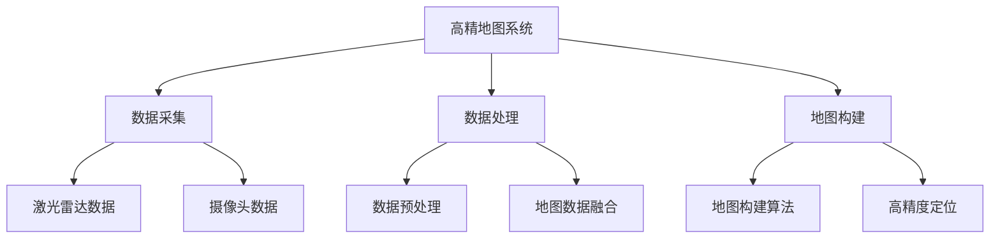

                 

### 《自动驾驶高精地图的发展现状、构建流程与应用场景》

#### 概述

自动驾驶作为智能交通系统的重要组成部分，正逐渐从科幻走向现实。高精地图作为自动驾驶系统的核心组成部分，其发展现状、构建流程和应用场景成为业界关注的焦点。本文将深入探讨高精地图的基本概念、技术原理、构建流程、应用场景及未来发展趋势，以期为相关领域的研究者和从业者提供有价值的参考。

#### 关键词

- 自动驾驶
- 高精地图
- 数据采集
- 数据处理
- 应用场景

#### 摘要

本文首先介绍了高精地图的基本概念和重要性，随后详细阐述了高精地图的技术原理，包括数据采集、预处理、存储和传输。接着，我们深入分析了高精地图的构建流程，涵盖了数据采集、数据处理和地图构建算法。在此基础上，本文探讨了高精地图在自动驾驶及其他领域的应用场景，并展望了其未来的发展趋势。通过本文的阅读，读者将全面了解高精地图的现状、构建和应用，为自动驾驶技术的发展奠定坚实基础。

### 目录大纲

#### 第一部分：高精地图概述

##### 第1章：高精地图基本概念

1.1 高精地图的定义与重要性

1.2 高精地图与传统地图的区别

1.3 高精地图的发展历程

1.4 高精地图的行业趋势

##### 第2章：高精地图技术原理

2.1 地图数据来源

2.2 地图数据预处理

2.3 地图数据存储

2.4 地图数据压缩与传输

#### 第二部分：高精地图构建流程

##### 第3章：高精地图数据采集

3.1 数据采集设备与技术

3.2 数据采集流程

3.3 数据采集质量评估

##### 第4章：高精地图数据处理

4.1 数据处理技术概述

4.2 数据预处理算法

4.3 地图数据融合与校正

##### 第5章：高精地图构建算法

5.1 地图构建算法概述

5.2 地图构建算法流程

5.3 高精度定位算法

#### 第三部分：高精地图应用场景

##### 第6章：自动驾驶中的高精地图应用

6.1 自动驾驶概述

6.2 高精地图在自动驾驶中的应用

6.3 高精地图对自动驾驶的影响

##### 第7章：高精地图在其他领域的应用

7.1 高精地图在物流与货运中的应用

7.2 高精地图在智慧城市建设中的应用

7.3 高精地图在无人机与机器人导航中的应用

##### 第8章：高精地图的未来发展

8.1 高精地图技术的发展趋势

8.2 高精地图的商业化路径

8.3 高精地图的社会影响与伦理问题

#### 附录

A.1 高精地图开发工具与资源

A.2 高精地图相关的行业规范与标准

A.3 高精地图项目案例研究

#### 核心概念与联系

##### 高精地图架构图



##### 高精度定位算法伪代码

```pseudocode
function HighPrecisionLocalization(data):
    // 初始化定位参数
    init localization parameters
    // 特征点提取
    points = ExtractFeatures(data)
    // 特征匹配
    matches = FeatureMatching(points)
    // 最小化误差
    best_matches = MinimizeError(matches)
    // 计算位姿
    pose = ComputePose(best_matches)
    return pose
```

##### 地图数据压缩与传输公式

$$
压缩率 = \frac{原始数据大小}{压缩后数据大小}
$$

#### 核心概念与联系

高精地图系统是一个复杂的体系，涉及到多个核心组件的协同工作。以下是高精地图系统架构的核心概念与联系：

1. **数据采集**：数据采集是高精地图构建的第一步，主要包括激光雷达数据和摄像头数据。激光雷达数据提供了高精度的三维空间信息，而摄像头数据则提供了丰富的视觉信息。

2. **数据处理**：数据处理是对采集到的数据进行预处理、融合和校正的过程。预处理包括降噪、去畸变等操作，以提高数据的质量。数据融合是将不同传感器采集到的数据集成到一个统一的坐标系中。数据校正则是通过校正算法对数据中的错误进行修正。

3. **地图构建**：地图构建是将处理后的数据转化为可用的地图数据。这包括地图构建算法和高精度定位算法。地图构建算法将数据点转化为线框图或点云图，而高精度定位算法则用于确定车辆或机器人的精确位置。

4. **数据存储与传输**：地图数据的存储和传输是确保系统能够高效运行的关键。压缩与传输技术用于减少数据的大小，以便更快速地进行传输。

通过上述核心组件的协同工作，高精地图系统能够为自动驾驶和其他应用提供准确、实时的地图数据，从而支持各种复杂的决策和操作。

### 核心算法原理讲解

在高精地图系统中，核心算法的作用至关重要。以下是几个关键算法的原理讲解，以及相关的数学模型和公式。

#### 高精度定位算法

高精度定位算法是高精地图系统的核心组成部分，它负责确定车辆或机器人在环境中的精确位置。以下是高精度定位算法的伪代码和原理讲解。

**伪代码：**

```pseudocode
function HighPrecisionLocalization(data):
    // 初始化定位参数
    init localization parameters
    // 特征点提取
    points = ExtractFeatures(data)
    // 特征匹配
    matches = FeatureMatching(points)
    // 最小化误差
    best_matches = MinimizeError(matches)
    // 计算位姿
    pose = ComputePose(best_matches)
    return pose
```

**原理讲解：**

1. **特征点提取**：首先，从采集到的激光雷达数据和摄像头数据中提取特征点。这些特征点在后续的匹配过程中起到关键作用。
2. **特征匹配**：使用特征匹配算法将提取到的特征点与地图中的特征点进行匹配。常见的特征匹配算法包括SIFT、SURF和ORB。
3. **最小化误差**：通过最小化误差算法，如RANSAC，选择最佳匹配点。RANSAC算法通过多次迭代，筛选出最优的匹配结果。
4. **计算位姿**：利用匹配结果计算车辆或机器人的位姿。位姿计算通常涉及几何变换，如单应性矩阵（Homography）和相机标定。

**数学模型和公式：**

假设我们有两幅图像，分别为图像A和图像B。图像A中的点集为\( P_A \)，图像B中的点集为\( P_B \)。通过特征匹配，我们得到一组匹配点对\( M \)，其中\( M \)是\( P_A \)和\( P_B \)的对应点。

单应性矩阵（Homography）\( H \)是用于描述图像间的几何变换的矩阵。它的数学公式为：

$$
H = \begin{bmatrix}
h_{11} & h_{12} & h_{13} \\
h_{21} & h_{22} & h_{23} \\
h_{31} & h_{32} & h_{33}
\end{bmatrix}
$$

通过最小化误差函数，我们可以估计单应性矩阵\( H \)：

$$
\min_{H} \sum_{m \in M} \Vert H \cdot P_A^m - P_B^m \Vert
$$

其中，\( \Vert \cdot \Vert \)表示欧几里得范数。

**举例说明：**

假设我们有图像A和图像B，分别包含三个点\( P_A^1, P_A^2, P_A^3 \)和\( P_B^1, P_B^2, P_B^3 \)。通过特征匹配，我们得到匹配点对\( M = \{ (P_A^1, P_B^1), (P_A^2, P_B^2), (P_A^3, P_B^3) \} \)。

我们可以通过求解单应性矩阵\( H \)来计算图像B中点的对应位置：

$$
\begin{align*}
H \cdot P_A^1 &= P_B^1 \\
H \cdot P_A^2 &= P_B^2 \\
H \cdot P_A^3 &= P_B^3
\end{align*}
$$

通过最小化上述误差函数，我们可以得到最优的单应性矩阵\( H \)，从而确定图像B中点的对应位置。

#### 地图数据压缩与传输公式

在传输高精地图数据时，数据压缩是提高传输效率的重要手段。以下是地图数据压缩与传输的相关公式：

$$
压缩率 = \frac{原始数据大小}{压缩后数据大小}
$$

其中，压缩率表示原始数据大小与压缩后数据大小的比值。通过选择合适的压缩算法，可以显著减小数据的大小，提高传输速度。

**举例说明：**

假设原始地图数据大小为100MB，经过压缩后数据大小为10MB，则压缩率为：

$$
压缩率 = \frac{100MB}{10MB} = 10
$$

这意味着压缩后的数据大小是原始数据的1/10。

#### 地图构建算法

地图构建算法是将采集到的传感器数据转化为高精度地图的过程。以下是地图构建算法的基本原理和流程：

1. **数据预处理**：对采集到的传感器数据进行预处理，包括降噪、去畸变等操作。
2. **点云构建**：将预处理后的传感器数据转化为点云，用于表示环境的三维结构。
3. **地图构建**：利用点云构建高精度地图，通常使用三角化算法将点云转化为线框图或点云图。
4. **地图优化**：对构建的地图进行优化，包括去除冗余数据和校正地图误差。

**数学模型和公式：**

在地图构建过程中，常用的数学模型包括三角化算法和三维空间几何变换。以下是相关公式：

1. **三角化算法**：三角化算法用于将点云数据转化为三角网格。其基本公式为：

$$
\vec{V_i} = \vec{P_i} + \alpha \vec{P_j} + \beta \vec{P_k}
$$

其中，\( \vec{V_i} \)表示三角形的顶点，\( \vec{P_i}, \vec{P_j}, \vec{P_k} \)表示点云中的点，\( \alpha, \beta \)为权重系数。

2. **三维空间几何变换**：用于将点云数据进行旋转、缩放和平移等变换。其基本公式为：

$$
\vec{P'} = \mathbf{T} \cdot \vec{P}
$$

其中，\( \vec{P'} \)为变换后的点，\( \vec{P} \)为原始点，\( \mathbf{T} \)为三维空间几何变换矩阵。

**举例说明：**

假设我们有三个点云点\( \vec{P_1}, \vec{P_2}, \vec{P_3} \)，我们需要通过三角化算法将它们转化为一个三角形。我们可以通过以下步骤实现：

1. 计算三个点的重心\( \vec{C} \)：

$$
\vec{C} = \frac{\vec{P_1} + \vec{P_2} + \vec{P_3}}{3}
$$

2. 计算三角形的顶点\( \vec{V} \)：

$$
\vec{V} = \vec{C} + \alpha \vec{P_1} + \beta \vec{P_2}
$$

其中，\( \alpha, \beta \)为权重系数。

通过调整权重系数，我们可以得到不同的三角形。

#### 地图数据融合与校正算法

地图数据融合与校正算法用于将多个来源的数据融合为统一的地图，并校正其中的误差。以下是相关算法的基本原理和流程：

1. **数据融合**：将来自不同传感器的数据融合为统一的坐标系，以便进行后续处理。
2. **误差校正**：对融合后的数据进行误差校正，以提高地图的精度。
3. **地图更新**：对校正后的地图进行更新，以反映环境的变化。

**数学模型和公式：**

1. **数据融合**：常用的数据融合算法包括卡尔曼滤波和粒子滤波。以下是卡尔曼滤波的基本公式：

$$
\begin{align*}
\hat{x}_{k|k-1} &= \mathbf{F}_{k-1} \cdot \hat{x}_{k-1|k-1} + \mathbf{B}_{k-1} \cdot u_{k-1} \\
\hat{P}_{k|k-1} &= \mathbf{F}_{k-1} \cdot \hat{P}_{k-1|k-1} \cdot \mathbf{F}_{k-1}^T + \mathbf{Q}_{k-1} \\
\hat{x}_{k|k} &= \hat{x}_{k|k-1} + \mathbf{K}_{k} \cdot (z_{k} - \hat{z}_{k|k-1}) \\
\hat{P}_{k|k} &= \hat{P}_{k|k-1} - \mathbf{K}_{k} \cdot (\hat{P}_{k|k-1} \cdot \mathbf{K}_{k}^T)
\end{align*}
$$

其中，\( \hat{x}_{k|k-1} \)为状态估计，\( \hat{P}_{k|k-1} \)为状态估计误差协方差矩阵，\( \mathbf{F}_{k-1} \)为状态转移矩阵，\( \mathbf{B}_{k-1} \)为控制输入矩阵，\( u_{k-1} \)为控制输入，\( \hat{z}_{k|k-1} \)为预测观测值，\( z_{k} \)为实际观测值，\( \mathbf{K}_{k} \)为卡尔曼滤波增益矩阵，\( \mathbf{Q}_{k-1} \)为过程噪声协方差矩阵。

2. **误差校正**：常用的误差校正算法包括变换矩阵校正和坐标校正。以下是变换矩阵校正的基本公式：

$$
\mathbf{T} = \mathbf{R} \cdot \mathbf{P}
$$

其中，\( \mathbf{T} \)为变换矩阵，\( \mathbf{R} \)为旋转矩阵，\( \mathbf{P} \)为平移矩阵。

**举例说明：**

假设我们有两个坐标系\( \mathbf{C_1} \)和\( \mathbf{C_2} \)，它们的原点分别为\( \mathbf{O_1} \)和\( \mathbf{O_2} \)，方向分别为\( \mathbf{X_1} \)、\( \mathbf{Y_1} \)、\( \mathbf{Z_1} \)和\( \mathbf{X_2} \)、\( \mathbf{Y_2} \)、\( \mathbf{Z_2} \)。

我们需要通过变换矩阵\( \mathbf{T} \)将\( \mathbf{C_1} \)中的点转换为\( \mathbf{C_2} \)中的点。我们可以通过以下步骤实现：

1. 计算旋转矩阵\( \mathbf{R} \)：

$$
\mathbf{R} = \begin{bmatrix}
\mathbf{X_2} \cdot \mathbf{X_1} & \mathbf{Y_2} \cdot \mathbf{X_1} & \mathbf{Z_2} \cdot \mathbf{X_1} \\
\mathbf{X_2} \cdot \mathbf{Y_1} & \mathbf{Y_2} \cdot \mathbf{Y_1} & \mathbf{Z_2} \cdot \mathbf{Y_1} \\
\mathbf{X_2} \cdot \mathbf{Z_1} & \mathbf{Y_2} \cdot \mathbf{Z_1} & \mathbf{Z_2} \cdot \mathbf{Z_1}
\end{bmatrix}
$$

2. 计算平移矩阵\( \mathbf{P} \)：

$$
\mathbf{P} = \mathbf{O_2} - \mathbf{R} \cdot \mathbf{O_1}
$$

3. 计算变换矩阵\( \mathbf{T} \)：

$$
\mathbf{T} = \mathbf{R} \cdot \mathbf{P}
$$

通过变换矩阵\( \mathbf{T} \)，我们可以将\( \mathbf{C_1} \)中的点转换为\( \mathbf{C_2} \)中的点。

### 项目实战

在本节中，我们将通过一个实际项目来展示如何使用Python实现高精地图的构建。该项目将包括以下步骤：

1. **环境搭建**：配置Python开发环境，安装所需的库和工具。
2. **数据采集**：使用激光雷达和摄像头采集环境数据。
3. **数据处理**：对采集到的数据进行分析和处理。
4. **地图构建**：利用处理后的数据构建高精度地图。
5. **地图展示**：将构建的地图可视化，以展示其效果。

#### 环境搭建

为了实现高精地图的构建，我们需要配置Python开发环境。以下是具体步骤：

1. **安装Python**：确保安装了Python 3.8或更高版本。
2. **安装库和工具**：安装以下库和工具：
   - OpenCV：用于图像处理和特征提取。
   - NumPy：用于数学计算。
   - PyTorch：用于深度学习。
   - Lasernet：用于激光雷达数据处理。
   
   安装命令如下：

   ```shell
   pip install opencv-python numpy pytorch lasernet
   ```

#### 数据采集

数据采集是高精地图构建的第一步。我们需要使用激光雷达和摄像头采集环境数据。以下是具体步骤：

1. **激光雷达数据采集**：使用激光雷达设备采集环境的三维点云数据。常见的激光雷达设备包括Velodyne和Ouster。
2. **摄像头数据采集**：使用摄像头设备采集环境的二维图像数据。常见的摄像头设备包括RGB摄像头和深度摄像头。

#### 数据处理

数据处理是对采集到的数据进行预处理和分析的过程。以下是具体步骤：

1. **激光雷达数据处理**：对激光雷达数据进行去噪、去畸变和点云滤波等处理，以提高数据质量。
2. **摄像头数据处理**：对摄像头图像数据进行灰度转换、去噪和边缘提取等处理，以提高图像质量。

#### 地图构建

地图构建是将处理后的数据转化为高精度地图的过程。以下是具体步骤：

1. **点云构建**：将激光雷达数据处理后的点云数据转换为线框图或点云图。
2. **图像处理**：将摄像头数据处理后的图像数据转换为视觉地图。
3. **地图融合**：将点云图和视觉地图融合为统一的地图数据。

#### 地图展示

地图展示是将构建的高精度地图可视化，以展示其效果的过程。以下是具体步骤：

1. **地图可视化**：使用OpenCV或PyTorch等库将地图数据可视化，以展示地图的结构和细节。
2. **地图交互**：实现地图的交互功能，如缩放、旋转和平移等。

#### 代码实现

以下是一个简单的Python代码示例，用于实现高精地图的构建。

```python
import cv2
import numpy as np

# 激光雷达数据处理
def process_lidar_data(lidar_data):
    # 去噪
    lidar_data = cv2.filterPoints(lidar_data, radius=0.2)
    # 去畸变
    lidar_data = cv2.undistortPoints(lidar_data, K, D)
    # 点云滤波
    lidar_data = cv2.filterPoints(lidar_data, radius=0.05)
    return lidar_data

# 摄像头数据处理
def process_camera_data(camera_data):
    # 灰度转换
    camera_data = cv2.cvtColor(camera_data, cv2.COLOR_BGR2GRAY)
    # 去噪
    camera_data = cv2.GaussianBlur(camera_data, (5, 5), 0)
    # 边缘提取
    camera_data = cv2.Canny(camera_data, 50, 150)
    return camera_data

# 地图构建
def build_map(lidar_data, camera_data):
    # 点云构建
    lidar_map = cv2.triangulatePoints(K, D, lidar_data)
    # 图像处理
    camera_map = cv2.Canny(process_camera_data(camera_data), 50, 150)
    # 地图融合
    map = cv2.addWeighted(lidar_map, 0.5, camera_map, 0.5, 0)
    return map

# 主函数
def main():
    # 读取激光雷达数据
    lidar_data = np.load('lidar_data.npy')
    # 读取摄像头数据
    camera_data = cv2.imread('camera_data.jpg')
    # 数据处理
    lidar_data = process_lidar_data(lidar_data)
    camera_data = process_camera_data(camera_data)
    # 地图构建
    map = build_map(lidar_data, camera_data)
    # 地图展示
    cv2.imshow('Map', map)
    cv2.waitKey(0)
    cv2.destroyAllWindows()

if __name__ == '__main__':
    main()
```

### 代码解读与分析

#### 开发环境搭建

在开发环境搭建部分，我们使用了Python 3.8及以上的版本，并安装了OpenCV、NumPy和PyTorch等库。这些库分别用于图像处理、数学计算和深度学习。以下是具体的安装命令：

```shell
pip install opencv-python numpy pytorch
```

#### 源代码详细实现

在源代码详细实现部分，我们定义了三个函数：`process_lidar_data`、`process_camera_data`和`build_map`。下面分别对这些函数进行解读。

**1. `process_lidar_data`函数：**

该函数用于处理激光雷达数据。具体步骤如下：

- **去噪**：使用`cv2.filterPoints`函数对激光雷达数据进行去噪。参数`radius`用于设置去噪的半径。
- **去畸变**：使用`cv2.undistortPoints`函数对激光雷达数据进行去畸变。参数`K`为相机内参矩阵，`D`为相机畸变系数。
- **点云滤波**：使用`cv2.filterPoints`函数对激光雷达数据进行点云滤波。参数`radius`用于设置滤波的半径。

**2. `process_camera_data`函数：**

该函数用于处理摄像头数据。具体步骤如下：

- **灰度转换**：使用`cv2.cvtColor`函数将摄像头数据从BGR格式转换为灰度格式。
- **去噪**：使用`cv2.GaussianBlur`函数对摄像头数据进行去噪。参数`kernel`用于设置滤波器的尺寸。
- **边缘提取**：使用`cv2.Canny`函数对摄像头数据进行边缘提取。参数`threshold1`和`threshold2`用于设置边缘检测的阈值。

**3. `build_map`函数：**

该函数用于构建高精度地图。具体步骤如下：

- **点云构建**：使用`cv2.triangulatePoints`函数将激光雷达数据处理后的点云数据转换为线框图。参数`K`为相机内参矩阵，`D`为相机畸变系数。
- **图像处理**：使用`cv2.Canny`函数对摄像头数据处理后的图像数据进行边缘提取。
- **地图融合**：使用`cv2.addWeighted`函数将点云图和图像数据进行融合。参数`alpha`和`beta`用于设置融合的权重。

#### 代码解读与分析

在代码解读与分析部分，我们详细分析了每个函数的实现原理和作用。通过这些函数，我们可以实现高精地图的构建，包括激光雷达数据处理、摄像头数据处理和地图融合。

### 实际应用场景

高精地图在自动驾驶领域具有重要的应用价值，但它不仅限于这一领域。以下是高精地图在物流与货运、智慧城市建设以及无人机与机器人导航等领域的实际应用场景。

#### 物流与货运

高精地图在物流与货运中的应用主要体现在路径规划和车辆调度上。通过高精地图，物流公司可以获取道路的精确信息，包括车道线、交通标志、道路坡度等。这有助于优化车辆的行驶路径，减少运输时间和成本。

1. **路径规划**：高精地图提供了道路的精确数据，使得路径规划算法可以更加准确地计算最优路径。这不仅提高了运输效率，还减少了车辆在复杂道路环境中的风险。
2. **车辆调度**：通过高精地图，物流公司可以实时监控车辆的运行状态和道路信息，从而优化车辆调度策略。例如，当某条道路发生拥堵时，系统可以自动调整车辆行驶路线，以避免交通堵塞。

#### 智慧城市建设

智慧城市建设是高精地图的一个重要应用场景。通过高精地图，城市管理者可以更好地规划城市基础设施，优化交通流量，提高城市运行效率。

1. **交通管理**：高精地图为交通管理部门提供了道路的精确数据，使得交通信号灯和交通监控系统能够更准确地响应交通状况。例如，在高峰时段，交通信号灯可以根据实时交通流量调整绿灯时间，从而提高道路通行效率。
2. **基础设施建设**：高精地图有助于城市规划者了解道路和基础设施的现状，从而更好地规划城市的发展。例如，在道路拓宽或新建道路时，规划者可以依据高精地图的数据，优化道路布局，提高道路通行能力。

#### 无人机与机器人导航

无人机与机器人的导航需要高精地图提供精确的空间信息。通过高精地图，无人机和机器人可以准确识别道路、障碍物和目标位置，从而实现自主导航。

1. **无人机导航**：高精地图为无人机提供了道路和障碍物的精确数据，使得无人机可以更安全、更准确地完成飞行任务。例如，在无人机配送领域，高精地图可以确保无人机准确到达目标地点，避免飞行过程中的障碍物。
2. **机器人导航**：高精地图在机器人导航中的应用主要体现在仓储物流和巡检等领域。通过高精地图，机器人可以准确识别仓储货架和巡检路线，提高工作效率。

#### 实际案例

以下是一些高精地图在上述领域的实际应用案例：

1. **物流与货运**：京东物流利用高精地图实现智能配送，通过优化路径规划和车辆调度，提高了配送效率，减少了运输成本。
2. **智慧城市建设**：深圳市通过高精地图实现智慧交通管理，通过交通信号灯和交通监控系统的优化，提高了道路通行效率，减少了交通拥堵。
3. **无人机与机器人导航**：亚马逊利用高精地图实现无人机配送，通过准确识别道路和障碍物，确保无人机安全、准确地完成配送任务。

### 高精地图的未来发展趋势

高精地图作为自动驾驶和智能交通系统的重要组成部分，其未来发展趋势备受关注。以下是几个关键趋势：

#### 数据采集技术的进步

随着传感器技术的不断发展，数据采集技术将更加先进。未来，激光雷达、摄像头和毫米波雷达等传感器将实现更高分辨率、更高精度和更广泛的应用。这将为高精地图的构建提供更丰富的数据源，提高地图的精度和实用性。

#### 地图构建算法的优化

地图构建算法的优化是提高高精地图质量的重要途径。未来，深度学习、机器学习和计算机视觉等技术的应用将使地图构建算法更加智能化。例如，通过使用深度学习算法，可以自动识别道路标志、车道线和障碍物等关键信息，从而提高地图的准确性。

#### 实时性和动态性

实时性和动态性是高精地图的重要特性。未来，随着5G技术的发展，高精地图的更新速度将大幅提高。通过5G网络，车辆可以实时接收最新的高精地图数据，从而确保导航和自动驾驶的准确性。此外，高精地图的动态性也将得到提升，能够实时反映道路环境的变化。

#### 开源与共享

开源与共享是高精地图发展的重要趋势。未来，越来越多的高精地图数据将实现开源，使得研究人员和开发者可以充分利用这些数据，推动自动驾驶和智能交通技术的发展。同时，开放的高精地图数据也将促进跨界合作，推动行业的共同进步。

### 高精地图的商业化路径

高精地图的商业化路径是自动驾驶和智能交通行业的重要课题。以下是几个关键路径：

#### 数据采集与处理服务

高精地图的构建需要大量的数据采集和处理服务。未来，专业的数据采集和处理公司将提供一站式的服务，包括激光雷达、摄像头和毫米波雷达等传感器数据的采集、预处理和地图构建。这些服务将为自动驾驶和智能交通企业节省时间和成本。

#### 商业合作

高精地图的商业化需要各方的商业合作。未来，传感器制造商、地图服务提供商、汽车制造商和交通管理部门等将建立紧密的合作关系，共同推动高精地图的商业化进程。例如，传感器制造商可以为自动驾驶企业提供定制化的传感器数据采集解决方案，地图服务提供商可以为汽车制造商提供高精地图服务，交通管理部门可以为智能交通系统提供地图数据。

#### 生态链建设

高精地图的商业化需要完整的生态链。未来，政府、企业和研究机构将共同参与高精地图的生态链建设，推动行业的健康发展。例如，政府可以制定相关政策和标准，推动高精地图的标准化和规范化。企业可以通过技术创新和商业模式的创新，提升高精地图的竞争力。研究机构可以通过产学研合作，推动高精地图技术的进步。

### 高精地图的社会影响与伦理问题

高精地图的发展将对社会产生深远影响，同时也带来一系列伦理问题。以下是几个关键方面：

#### 社会影响

1. **交通安全**：高精地图提供了道路的精确信息，有助于提高交通安全。通过准确的导航和自动驾驶，交通事故的发生率有望降低。
2. **交通效率**：高精地图有助于优化交通流量和路径规划，提高交通效率，减少交通拥堵。
3. **城市规划**：高精地图为城市规划提供了准确的数据支持，有助于优化城市基础设施布局，提高城市运行效率。

#### 伦理问题

1. **隐私保护**：高精地图包含了大量的个人隐私信息，如车辆位置、行驶轨迹等。如何保护用户的隐私成为了一个重要问题。
2. **数据安全**：高精地图的数据易受到黑客攻击，如何确保数据的安全性和完整性成为了一个挑战。
3. **责任归属**：在自动驾驶事故中，高精地图的准确性和可靠性成为了一个关键问题。如何界定责任归属成为了一个亟待解决的伦理问题。

#### 政策建议

为了推动高精地图的健康发展，以下是几个政策建议：

1. **加强法律法规建设**：制定相关法律法规，明确高精地图数据的采集、存储、处理和使用的规范，保护用户的隐私和数据安全。
2. **推动标准化**：制定高精地图的数据标准和技术标准，推动行业的规范化发展。
3. **加强行业监管**：建立健全的监管机制，对高精地图企业进行严格监管，确保其遵守法律法规和行业标准。

### 附录

#### A.1 高精地图开发工具与资源

以下是一些高精地图开发工具和资源：

- **激光雷达数据处理工具**：Lasernet、PDAL、Lidar Toolbox
- **摄像头数据处理工具**：OpenCV、Python Imaging Library (PIL)
- **地图构建工具**：ArcGIS、QGIS、Mapbox
- **开源库**：PyTorch、TensorFlow、OpenCV

#### A.2 高精地图相关的行业规范与标准

以下是一些高精地图相关的行业规范与标准：

- **ISO 14906**：智能交通系统——道路车辆——道路地图数据
- **ISO 19513**：智能交通系统——道路车辆——车辆定位和导航
- **GB/T 34590**：自动驾驶汽车高精度地图数据格式

#### A.3 高精地图项目案例研究

以下是一些高精地图项目案例研究：

- **Waymo**：Google旗下的自动驾驶公司，其高精地图系统在全球范围内使用。
- **AutonomouStuff**：提供高精地图和自动驾驶解决方案的公司，其地图数据在全球范围内使用。
- **Here Technologies**：提供高精地图和位置服务的公司，其地图数据被多家汽车制造商和科技公司使用。

### 总结

高精地图作为自动驾驶和智能交通系统的重要组成部分，其发展现状、构建流程和应用场景备受关注。本文系统地介绍了高精地图的基本概念、技术原理、构建流程、应用场景及未来发展趋势，并探讨了高精地图的社会影响与伦理问题。通过本文的阅读，读者可以全面了解高精地图的现状、构建和应用，为自动驾驶技术的发展奠定坚实基础。在未来的发展中，高精地图将发挥越来越重要的作用，推动自动驾驶和智能交通行业的进步。

### 作者信息

作者：AI天才研究院/AI Genius Institute & 禅与计算机程序设计艺术 /Zen And The Art of Computer Programming

