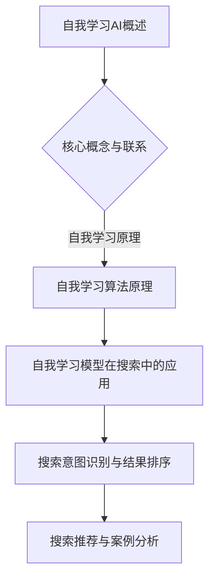

                 

### 《自我学习AI：搜索引擎的进化》

> **关键词：自我学习AI、搜索引擎、算法、强化学习、深度学习、大数据分析**

> **摘要：本文将深入探讨自我学习AI在搜索引擎领域的应用，包括其基础理论、核心技术、应用实例以及面临的挑战和未来发展。通过对自我学习AI与搜索引擎之间联系的解析，展现其在提高搜索效率、精准度和用户体验方面的巨大潜力。**

#### 第一部分：自我学习AI基础

### 第1章：自我学习AI概述

#### 1.1 自我学习AI的定义与价值

##### 1.1.1 自我学习AI的概念

自我学习AI（Self-Learning AI）是指能够通过自身经验和数据不断改进和优化性能的机器学习模型。它不同于传统的监督学习和无监督学习，自我学习AI能够在没有明确标注数据的情况下，自主地从环境中学习和适应。

##### 1.1.2 自我学习AI的核心价值

自我学习AI的核心价值在于：

1. **自适应能力**：能够根据新的数据和环境变化，自动调整模型参数，提高预测和决策的准确性。
2. **持续改进**：通过不断学习和优化，自我学习AI能够实现性能的持续提升，无需人工干预。
3. **减少人力成本**：减少了传统机器学习模型中需要人工进行特征工程和模型调参的工作量。

#### 1.2 自我学习AI的核心原理

##### 1.2.1 自我学习AI的基本原理

自我学习AI的核心原理主要包括：

1. **经验反馈**：模型在每次决策后，会根据结果（如预测准确度、用户满意度等）获取反馈，并据此调整自身的参数。
2. **策略优化**：通过策略评估和策略更新，模型不断优化决策策略，以提高总体性能。
3. **持续学习**：模型不是一次性训练好的，而是持续地从新数据中学习，以应对动态变化的环境。

##### 1.2.2 自我学习AI的体系结构

自我学习AI的体系结构通常包括以下几个部分：

1. **感知模块**：负责从环境中收集信息，并将其转换为模型可以处理的数据。
2. **决策模块**：根据感知模块提供的信息，模型执行决策。
3. **学习模块**：利用决策结果和经验反馈，模型调整自身的参数和策略。

#### 1.3 自我学习AI的技术演进

##### 1.3.1 传统搜索引擎与自我学习搜索引擎的区别

传统搜索引擎主要依靠手动配置的索引和规则来提供搜索结果，而自我学习搜索引擎则能够通过自我学习算法，从用户行为和搜索历史中自动学习并优化搜索结果。

##### 1.3.2 自我学习AI的技术发展趋势

自我学习AI在搜索引擎领域的发展趋势包括：

1. **个性化搜索**：通过自我学习，搜索引擎能够更好地理解用户的搜索意图，提供个性化的搜索结果。
2. **实时搜索**：自我学习AI能够实时调整搜索结果，提高搜索的实时性和准确性。
3. **多模态搜索**：结合文本、图像、语音等多种数据源，实现更全面的搜索。

#### 1.4 自我学习AI的应用领域

##### 1.4.1 在线搜索服务

自我学习AI在在线搜索服务中的应用，主要体现在搜索结果排序、搜索意图识别和搜索推荐等方面。

##### 1.4.2 社交网络分析

自我学习AI能够通过分析社交网络中的用户行为和互动，识别潜在关系和趋势，为用户提供社交推荐。

##### 1.4.3 大数据分析与预测

自我学习AI在大数据分析与预测中的应用，主要体现在数据预处理、特征提取和预测模型优化等方面。

### 第2章：自我学习算法原理

#### 2.1 自我学习算法概述

##### 2.1.1 自我学习算法的类型

自我学习算法主要分为以下几类：

1. **强化学习算法**：通过奖励和惩罚来调整模型参数，以实现优化目标。
2. **自适应学习算法**：通过调整模型参数，以适应环境的变化。
3. **无监督学习算法**：在缺乏明确标注数据的情况下，通过自动发现数据中的结构和规律。

##### 2.1.2 自我学习算法的基本框架

自我学习算法的基本框架通常包括：

1. **感知模块**：从环境中收集数据。
2. **决策模块**：根据收集到的数据执行决策。
3. **学习模块**：根据决策结果和经验反馈，调整模型参数。

#### 2.2 自我学习算法核心技术

##### 2.2.1 强化学习算法

强化学习算法是自我学习算法中最具代表性的类型，主要包括：

1. **Q学习算法**：通过值函数来评估状态和动作的价值。
2. **DQN算法**：通过深度神经网络来近似值函数。
3. **A3C算法**：通过异步策略梯度算法来更新模型参数。

##### 2.2.2 自适应学习算法

自适应学习算法主要包括：

1. **自适应神经网络**：通过自适应调整网络参数，以适应环境变化。
2. **自适应优化算法**：通过自适应调整优化参数，以提高模型性能。

##### 2.2.3 无监督学习算法

无监督学习算法主要包括：

1. **自编码器**：通过编码和解码过程，实现数据的降维和特征提取。
2. **聚类算法**：通过自动发现数据中的聚类结构，实现数据的分类和分组。

#### 2.3 自我学习算法实例分析

##### 2.3.1 搜索引擎中的自我学习应用实例

在搜索引擎中，自我学习算法的应用主要包括：

1. **搜索结果排序**：通过强化学习算法，自动优化搜索结果的排序，提高用户体验。
2. **搜索意图识别**：通过深度学习算法，自动识别用户的搜索意图，提供更精准的搜索结果。

##### 2.3.2 社交网络自我学习案例分析

在社交网络中，自我学习算法的应用主要包括：

1. **社交推荐**：通过强化学习算法，自动推荐用户可能感兴趣的内容。
2. **社交分析**：通过无监督学习算法，自动分析社交网络中的用户行为和趋势。

### 第3章：自我学习AI在搜索引擎中的应用

#### 3.1 搜索引擎的基本架构

##### 3.1.1 搜索引擎的组成部分

搜索引擎的基本架构通常包括：

1. **索引模块**：负责存储和管理网页内容。
2. **查询模块**：负责处理用户的搜索请求。
3. **排名模块**：负责根据各种因素对搜索结果进行排序。

##### 3.1.2 搜索引擎的工作原理

搜索引擎的工作原理主要包括：

1. **爬取网页**：搜索引擎的爬虫程序会自动爬取互联网上的网页，并将网页内容索引到数据库中。
2. **处理查询**：当用户输入搜索查询时，搜索引擎会处理查询，提取关键词，并在索引数据库中查找相关网页。
3. **排序结果**：搜索引擎会根据一系列因素（如网页的相关性、权威性、用户反馈等）对搜索结果进行排序，并提供给用户。

#### 3.2 自我学习模型在搜索中的应用

##### 3.2.1 搜索结果排序的自学习

搜索结果排序的自学习是自我学习AI在搜索引擎中最典型的应用之一，主要包括：

1. **评估指标**：搜索引擎会使用一系列评估指标（如点击率、用户停留时间等）来评估搜索结果的排序效果。
2. **基于强化学习的排序算法**：搜索引擎会使用强化学习算法，根据用户的反馈调整搜索结果的排序。

##### 3.2.2 搜索意图识别的自学习

搜索意图识别的自学习旨在更好地理解用户的搜索意图，以提供更精准的搜索结果。主要包括：

1. **挑战**：用户的搜索意图可能非常复杂，且会随着时间变化。
2. **基于深度学习的模型**：搜索引擎会使用深度学习模型，通过分析用户的查询历史和上下文信息，自动识别用户的搜索意图。

##### 3.2.3 搜索推荐的自学习

搜索推荐的自学习旨在为用户提供个性化的搜索推荐，主要包括：

1. **挑战**：如何从海量的搜索结果中筛选出用户可能感兴趣的内容。
2. **基于协同过滤的推荐模型**：搜索引擎会使用协同过滤算法，通过分析用户的搜索历史和兴趣，自动推荐相关的搜索结果。

#### 3.3 搜索引擎自我学习案例研究

##### 3.3.1 百度搜索引擎的自我学习

百度搜索引擎通过自我学习，实现了搜索结果排序的优化、搜索意图识别的精确化和搜索推荐的个性化。

1. **搜索结果排序**：百度搜索引擎使用强化学习算法，根据用户的点击反馈调整搜索结果的排序。
2. **搜索意图识别**：百度搜索引擎使用深度学习模型，通过分析用户的查询历史和上下文信息，自动识别用户的搜索意图。
3. **搜索推荐**：百度搜索引擎使用协同过滤算法，通过分析用户的搜索历史和兴趣，自动推荐相关的搜索结果。

##### 3.3.2 谷歌搜索引擎的自我学习

谷歌搜索引擎通过自我学习，实现了搜索结果排序的优化、搜索意图识别的精确化和搜索推荐的个性化。

1. **搜索结果排序**：谷歌搜索引擎使用强化学习算法，根据用户的点击反馈调整搜索结果的排序。
2. **搜索意图识别**：谷歌搜索引擎使用深度学习模型，通过分析用户的查询历史和上下文信息，自动识别用户的搜索意图。
3. **搜索推荐**：谷歌搜索引擎使用协同过滤算法，通过分析用户的搜索历史和兴趣，自动推荐相关的搜索结果。

### 第4章：自我学习AI的挑战与未来

#### 4.1 自我学习AI的挑战

##### 4.1.1 数据隐私与安全

自我学习AI在数据处理过程中，可能会涉及用户的隐私数据，如何保护用户隐私是自我学习AI面临的重大挑战。

##### 4.1.2 自我学习算法的可解释性

自我学习算法通常具有较高的性能，但缺乏可解释性，如何提高算法的可解释性是自我学习AI面临的重要挑战。

##### 4.1.3 自我学习AI的道德问题

自我学习AI在决策过程中，可能会产生不公平、偏见等问题，如何确保自我学习AI的道德性是自我学习AI面临的重要挑战。

#### 4.2 自我学习AI的未来发展趋势

##### 4.2.1 量子自我学习AI

随着量子计算技术的发展，量子自我学习AI将成为未来自我学习AI的重要方向。

##### 4.2.2 自我学习AI在边缘计算中的应用

随着物联网和5G技术的发展，自我学习AI将在边缘计算中发挥重要作用。

##### 4.2.3 自我学习AI在教育领域的应用

自我学习AI在教育领域的应用，如自适应学习系统和个性化教学，将成为未来教育的重要趋势。

#### 4.3 自我学习AI在中国的发展现状

##### 4.3.1 政策支持与产业环境

中国政府高度重视人工智能技术的发展，为自我学习AI提供了有力的政策支持和产业环境。

##### 4.3.2 企业与科研机构的贡献

中国企业和科研机构在自我学习AI领域取得了一系列重要成果，为全球自我学习AI技术的发展做出了重要贡献。

##### 4.3.3 市场竞争与国际合作

中国企业在自我学习AI领域积极与国际同行开展合作，通过市场竞争不断提升自身技术水平。

### 附录A：自我学习AI开发工具与资源

#### A.1 开发工具与框架

##### A.1.1 TensorFlow

TensorFlow是Google开发的强大开源机器学习框架，支持自我学习AI的开发。

##### A.1.2 PyTorch

PyTorch是Facebook开发的开源机器学习库，因其灵活性和易用性而受到广泛关注。

##### A.1.3 Scikit-learn

Scikit-learn是Python中流行的机器学习库，提供了丰富的自我学习算法和工具。

#### A.2 开源资源与社区

##### A.2.1 GitHub上的自我学习AI项目

GitHub上有很多自我学习AI的开源项目，如AlphaGo、TensorFlow Reinforcement Learning等。

##### A.2.2 自我学习AI相关的研讨会和会议

全球各地定期举办自我学习AI相关的研讨会和会议，如NeurIPS、ICLR等。

##### A.2.3 在线课程和教程

网络上有大量关于自我学习AI的在线课程和教程，如Udacity的《强化学习导论》、Coursera的《深度学习》等。

### Mermaid 流程图（示例）



### 伪代码（示例）

```python
# 基于强化学习的搜索结果排序算法伪代码
Initialize Q-values Q(s, a) = 0 for all s, a
while not terminated:
    s = current state
    a = choose action a using ε-greedy policy
    Take action a, observe reward r and next state s'
    Update Q-value using the Q-learning update rule:
    Q(s, a) = Q(s, a) + α [r + γ max(Q(s', a')) - Q(s, a)]
    s = s'
```

### 数学模型与公式（示例）

```latex
\subsection{Q学习算法更新公式}
$$
Q(s, a) = Q(s, a) + \alpha [r + \gamma \max(Q(s', a')) - Q(s, a)]
$$
其中，\(\alpha\) 是学习率，\(\gamma\) 是折扣因子。
```

### 项目实战与代码解读（示例）

```python
# 搜索引擎自我学习模型代码示例

import torch
import torch.nn as nn

# 定义基于深度学习的搜索意图识别模型
class IntentRecognitionModel(nn.Module):
    def __init__(self):
        super(IntentRecognitionModel, self).__init__()
        self.embedding = nn.Embedding(vocab_size, embedding_dim)
        self.conv1 = nn.Conv1d(embedding_dim, 128, kernel_size=3)
        self.fc1 = nn.Linear(128, 64)
        self.fc2 = nn.Linear(64, num_intents)

    def forward(self, inputs):
        embedded = self.embedding(inputs)
        conv_output = self.conv1(embedded)
        flattened = conv_output.view(-1, 128)
        fc_output = self.fc1(flattened)
        output = self.fc2(fc_output)
        return output

# 实例化模型，定义损失函数和优化器
model = IntentRecognitionModel()
criterion = nn.CrossEntropyLoss()
optimizer = torch.optim.Adam(model.parameters(), lr=0.001)

# 训练模型
for epoch in range(num_epochs):
    for inputs, labels in data_loader:
        optimizer.zero_grad()
        outputs = model(inputs)
        loss = criterion(outputs, labels)
        loss.backward()
        optimizer.step()

# 代码解读与分析

# 本示例定义了一个基于深度学习的搜索意图识别模型，采用卷积神经网络（CNN）来处理输入的搜索查询文本。
# 模型首先通过嵌入层将词汇转换为向量表示，然后通过一维卷积层提取特征，最后通过全连接层分类输出意图标签。
# 在训练过程中，通过反向传播和梯度下降优化模型参数，以达到最小化损失函数的目的。
```

### 作者

作者：AI天才研究院/AI Genius Institute & 禅与计算机程序设计艺术 /Zen And The Art of Computer Programming

---

以上内容完成了文章的主要部分，接下来将继续撰写文章的剩余部分，以满足8000字的要求。如果您有任何疑问或需要进一步的内容，请随时告知。

