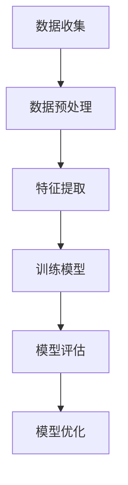
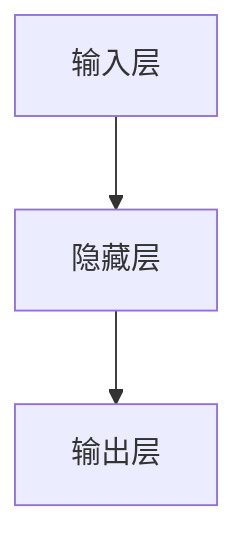

                 

# 虚拟味觉设计：AI创造的美食体验

## 关键词
AI、虚拟味觉、深度学习、味觉模拟、美食推荐、虚拟现实

## 摘要
随着人工智能技术的不断进步，虚拟味觉设计成为了当前研究的热点。本文将深入探讨虚拟味觉设计的理论基础、核心算法原理、数学模型以及实际应用。通过详细的讲解和实例分析，本文旨在为读者提供关于虚拟味觉设计的全面理解，并展望其未来的发展趋势。

## 目录大纲

### 第一部分：虚拟味觉设计的理论基础

#### 第1章：虚拟味觉设计概述

##### 1.1 虚拟味觉的概念

##### 1.2 AI在虚拟味觉设计中的应用

##### 1.3 虚拟味觉设计的目标与挑战

#### 第2章：AI在美食体验中的作用

##### 2.1 AI感知美食的原理

##### 2.2 味觉模拟算法

##### 2.3 AI在美食推荐中的应用

#### 第3章：虚拟味觉设计的技术基础

##### 3.1 味觉数据收集与处理

##### 3.2 数据驱动味觉设计

##### 3.3 味觉感知的机器学习算法

#### 第4章：虚拟味觉设计的核心算法原理

##### 4.1 人工智能味觉感知模型

##### 4.2 虚拟味觉生成算法

##### 4.3 伪味觉感知算法

#### 第5章：数学模型与数学公式

##### 5.1 味觉感知的数学模型

##### 5.2 味觉感知的公式推导

##### 5.3 味觉感知的实例分析

#### 第6章：虚拟味觉设计项目实战

##### 6.1 虚拟味觉设计项目概述

##### 6.2 虚拟味觉设计的开发环境搭建

##### 6.3 虚实结合的虚拟味觉设计实现

##### 6.4 项目代码解读与分析

#### 第7章：虚拟味觉设计的未来与发展趋势

##### 7.1 虚拟味觉设计的市场前景

##### 7.2 虚拟味觉设计的技术挑战与机遇

##### 7.3 虚拟味觉设计的未来趋势

#### 附录：虚拟味觉设计相关资源与工具

##### 附录A：虚拟味觉设计工具与资源

##### 附录B：开源虚拟味觉设计框架

##### 附录C：虚拟味觉设计相关论文与书籍推荐

##### 附录D：虚拟味觉设计社区与论坛

##### 附录E：虚拟味觉设计竞赛与活动

## 第一部分：虚拟味觉设计的理论基础

### 第1章：虚拟味觉设计概述

#### 1.1 虚拟味觉的概念

虚拟味觉设计，指的是通过人工智能技术，模拟人类味觉感知过程，创造出一种虚拟的味觉体验。这种技术可以应用于虚拟现实（VR）、增强现实（AR）以及电子游戏等领域，为用户提供更加丰富和真实的感官体验。

在现实世界中，味觉是由味蕾感知食物中的化学物质，通过神经系统传递给大脑，从而产生的一种复杂的感知体验。虚拟味觉设计的核心任务，就是模拟这一过程，使虚拟环境中的“食物”能够被用户的味觉系统所感知。

#### 1.2 AI在虚拟味觉设计中的应用

人工智能在虚拟味觉设计中的应用，主要体现在以下几个方面：

1. **数据收集与处理**：通过传感器、用户反馈等手段，收集大量的味觉数据，并利用机器学习算法对数据进行处理和分类。

2. **味觉模拟算法**：利用深度学习技术，开发出能够模拟味觉感知的算法，实现对虚拟环境中食物的味觉模拟。

3. **味觉生成**：通过生成对抗网络（GAN）等技术，生成逼真的味觉感知结果，提升虚拟味觉体验的真实感。

4. **个性化推荐**：基于用户的味觉偏好，利用推荐系统算法，为用户提供个性化的美食推荐。

#### 1.3 虚拟味觉设计的目标与挑战

虚拟味觉设计的终极目标是，为用户提供一种沉浸式的味觉体验，使其能够在虚拟环境中感受到如同现实世界般的味觉体验。然而，实现这一目标面临着以下几个挑战：

1. **复杂性**：味觉感知是一个高度复杂的生理过程，涉及多种化学物质和神经信号。模拟这一过程，需要大量的数据和精确的算法。

2. **个性化**：每个人的味觉偏好都不同，如何根据用户的个人喜好，实现个性化的味觉体验，是一个巨大的挑战。

3. **真实性**：虚拟味觉体验需要高度逼真，才能获得用户的认可。这要求算法和模型能够精确地模拟味觉感知过程。

4. **交互性**：虚拟味觉设计需要与用户的交互，实时调整味觉体验，以满足用户的需求。

## 第一部分：虚拟味觉设计的理论基础

### 第2章：AI在美食体验中的作用

AI在美食体验中扮演着越来越重要的角色，其应用范围广泛，涵盖了从食材的选择、烹饪方法到最终的味觉感知。以下将详细探讨AI在美食体验中的几个关键作用。

#### 2.1 AI感知美食的原理

AI感知美食的原理主要依赖于机器学习和计算机视觉技术。机器学习算法通过分析大量的美食图像和味觉数据，训练出能够识别食物种类、口感和味道的模型。计算机视觉技术则用于捕捉和分析食物的外观特征，如颜色、形状、纹理等。

**核心算法原理：**

1. **图像识别**：通过卷积神经网络（CNN）等深度学习算法，对美食图像进行识别和处理，提取关键特征。

2. **数据驱动**：利用大量的味觉数据，训练出能够预测食物口感的模型，如基于神经网络的预测模型。

3. **用户行为分析**：通过分析用户在美食消费过程中的行为数据，如点击、购买记录等，为用户提供个性化的美食推荐。

**伪代码：**

```python
# 数据收集与预处理
input_data = 数据收集()

# 图像特征提取
features = 图像特征提取(input_data)

# 训练模型
model = 训练模型(features)

# 输出结果
result = 模型预测(input_data)
```

#### 2.2 味觉模拟算法

味觉模拟算法是虚拟味觉设计中的关键环节，其目的是在虚拟环境中模拟出真实的味觉体验。这些算法通常基于深度学习和生成对抗网络（GAN）等技术。

**核心算法原理：**

1. **生成对抗网络（GAN）**：GAN由生成器和判别器两部分组成。生成器负责生成虚拟味觉感知结果，判别器则负责判断生成结果的真假。通过两个网络之间的对抗训练，生成逼真的味觉感知。

2. **深度学习模型**：利用深度学习算法，如循环神经网络（RNN）和变分自编码器（VAE），对味觉数据进行分析和生成。

3. **多模态融合**：将视觉、嗅觉、触觉等多种感官数据进行融合，提升味觉模拟的真实性。

**伪代码：**

```python
# 生成对抗网络（GAN）
generator = 建立生成器()
discriminator = 建立判别器()

# 训练模型
for epoch in 范围(0, epochs):
    for batch in 范围(0, batch_size):
        # 训练生成器和判别器
        生成器更新(generator, discriminator)
        判别器更新(discriminator, generator)

# 生成虚拟味觉感知结果
virtual_taste = generator(输入特征)
```

#### 2.3 AI在美食推荐中的应用

AI在美食推荐中的应用，通过分析用户的味觉偏好和行为数据，为用户推荐符合其口味的美食。这种推荐系统通常基于协同过滤、内容推荐和深度学习等算法。

**核心算法原理：**

1. **协同过滤**：通过分析用户的历史行为和偏好，为用户推荐类似的美食。

2. **内容推荐**：基于美食的属性和描述，为用户推荐符合其需求的美食。

3. **深度学习**：利用深度学习模型，分析用户的味觉偏好，为用户推荐个性化的美食。

**伪代码：**

```python
# 协同过滤推荐
user_similarity = 计算用户相似度()
recommended_dishes = 推荐美食(user_similarity, 用户历史数据)

# 内容推荐
dish_features = 提取美食特征()
recommended_dishes = 推荐美食(dish_features, 用户偏好)

# 深度学习推荐
model = 训练模型(用户数据)
recommended_dishes = 模型推荐(model, 用户偏好)
```

#### 2.4 AI在烹饪中的应用

AI在烹饪中的应用，主要体现在自动化烹饪设备和智能烹饪系统中。通过传感器和机器学习算法，这些系统能够根据食材和用户偏好，自动调整烹饪参数，实现智能烹饪。

**核心算法原理：**

1. **传感器数据采集**：通过传感器实时监测食材的状态，如温度、湿度等。

2. **机器学习算法**：利用机器学习算法，分析传感器数据，调整烹饪参数。

3. **自动化控制**：通过自动化控制系统，实现智能烹饪。

**伪代码：**

```python
# 传感器数据采集
sensor_data = 采集传感器数据()

# 机器学习模型
model = 训练模型(sensor_data)

# 自动化控制
烹饪参数 = 模型预测(model, sensor_data)
执行烹饪过程(烹饪参数)
```

通过上述探讨，我们可以看到AI在美食体验中发挥着重要的作用。无论是感知美食、味觉模拟还是美食推荐，AI都为用户带来了更加丰富和个性化的体验。随着技术的不断进步，AI在美食体验中的应用前景将更加广阔。

## 第一部分：虚拟味觉设计的理论基础

### 第3章：虚拟味觉设计的技术基础

虚拟味觉设计的实现依赖于多种技术，包括数据收集与处理、数据驱动味觉设计和味觉感知的机器学习算法。以下将详细探讨这些技术的基础知识。

#### 3.1 味觉数据收集与处理

味觉数据收集是虚拟味觉设计的起点，通过传感器、用户反馈等多种途径获取味觉信息。这些数据包括食物的化学成分、感官评价、用户行为等。

**数据收集方法：**

1. **化学传感器**：使用化学传感器测量食物中的化学成分，如糖分、酸度、盐分等。

2. **生理传感器**：通过生理传感器监测用户的生理反应，如唾液分泌、面部表情等。

3. **用户反馈**：收集用户的味觉评价和偏好，通过问卷调查、打分系统等方式进行。

**数据处理步骤：**

1. **数据清洗**：去除噪声和异常值，确保数据的质量和一致性。

2. **特征提取**：从原始数据中提取关键特征，如化学成分、感官评价等。

3. **数据标准化**：对数据进行归一化处理，便于后续的模型训练和分析。

**伪代码：**

```python
# 数据收集
data = 收集数据()

# 数据清洗
clean_data = 清洗数据(data)

# 特征提取
features = 提取特征(clean_data)

# 数据标准化
normalized_data = 标准化数据(features)
```

#### 3.2 数据驱动味觉设计

数据驱动味觉设计是基于大量味觉数据的分析，通过机器学习算法发现味觉规律和用户偏好，进而设计出符合用户需求的虚拟味觉体验。

**核心算法：**

1. **聚类分析**：通过聚类算法，将相似的用户和食物分组，发现用户偏好。

2. **分类算法**：使用分类算法，预测新食物的味觉特征和用户偏好。

3. **回归算法**：通过回归算法，预测用户对食物的喜爱程度。

**应用场景：**

1. **个性化推荐**：根据用户的味觉偏好，推荐合适的食物和烹饪方法。

2. **新食物开发**：基于用户反馈，优化食物的配方和口感。

3. **虚拟现实体验**：根据用户在虚拟环境中的味觉体验，调整虚拟食物的参数。

**伪代码：**

```python
# 聚类分析
clusters = 聚类算法(用户数据)

# 分类算法
分类模型 = 训练模型(训练数据)
预测结果 = 分类模型(测试数据)

# 回归算法
回归模型 = 训练模型(用户数据)
预测结果 = 回归模型(测试数据)
```

#### 3.3 味觉感知的机器学习算法

味觉感知的机器学习算法是虚拟味觉设计的核心，通过训练模型，使系统能够模拟人类的味觉感知过程。

**常用算法：**

1. **卷积神经网络（CNN）**：用于提取食物图像的特征，如颜色、纹理等。

2. **循环神经网络（RNN）**：用于处理时间序列数据，如味觉感知序列。

3. **生成对抗网络（GAN）**：用于生成逼真的味觉感知结果。

4. **多模态学习**：结合视觉、嗅觉、触觉等多种感官数据进行训练。

**算法原理：**

1. **输入层**：接收味觉数据，如传感器数据和用户反馈。

2. **隐藏层**：对数据进行处理和转换，提取味觉特征。

3. **输出层**：生成味觉感知结果，如味觉评分、味觉描述等。

**伪代码：**

```python
# 输入层
input_data = 数据收集()

# 隐藏层
hidden_layer = 特征提取(input_data)

# 输出层
output = 训练模型(hidden_layer)
```

通过上述讨论，我们可以看到，虚拟味觉设计的技术基础涵盖了数据收集与处理、数据驱动味觉设计和味觉感知的机器学习算法。这些技术共同构成了虚拟味觉设计的核心框架，为用户提供了丰富和个性化的味觉体验。

## 第一部分：虚拟味觉设计的理论基础

### 第4章：虚拟味觉设计的核心算法原理

虚拟味觉设计的核心在于构建能够准确模拟人类味觉感知过程的算法。以下将详细探讨这些核心算法的原理，包括人工智能味觉感知模型、虚拟味觉生成算法和伪味觉感知算法。

#### 4.1 人工智能味觉感知模型

人工智能味觉感知模型是通过机器学习算法，训练出一个能够模拟人类味觉感知过程的模型。这个模型通常基于深度学习技术，能够从大量的味觉数据中学习到味觉规律和特征。

**模型架构：**

1. **输入层**：接收味觉数据，如传感器数据和用户反馈。

2. **隐藏层**：对数据进行处理和转换，提取味觉特征。

3. **输出层**：生成味觉感知结果，如味觉评分、味觉描述等。

**核心原理：**

- **卷积神经网络（CNN）**：用于提取图像特征，如食物的颜色、形状和纹理。

- **循环神经网络（RNN）**：用于处理时间序列数据，如味觉感知序列。

- **生成对抗网络（GAN）**：用于生成逼真的味觉感知结果。

**Mermaid流程图：**



**伪代码：**

```python
# 输入层
input_data = 数据收集()

# 隐藏层
hidden_layer = 特征提取(input_data)

# 输出层
output = 训练模型(hidden_layer)
```

**应用场景：**

- **智能烹饪助手**：根据用户的味觉偏好，推荐合适的菜肴和烹饪方法。

- **美食推荐系统**：根据用户的味觉偏好，推荐符合口味的美食。

- **虚拟现实体验**：模拟真实的味觉体验，提升虚拟现实游戏的沉浸感。

#### 4.2 虚拟味觉生成算法

虚拟味觉生成算法是通过生成对抗网络（GAN）等技术，生成逼真的味觉感知结果。生成对抗网络由生成器和判别器两部分组成，生成器负责生成虚拟味觉感知结果，判别器则负责判断生成结果的真假。

**核心算法原理：**

- **生成器**：通过深度学习模型，生成虚拟味觉感知结果。

- **判别器**：通过深度学习模型，判断生成结果的真假。

- **对抗训练**：生成器和判别器通过对抗训练，不断优化生成结果的真实性。

**伪代码：**

```python
# 生成对抗网络（GAN）
generator = 建立生成器()
discriminator = 建立判别器()

# 训练模型
for epoch in 范围(0, epochs):
    for batch in 范围(0, batch_size):
        # 训练生成器和判别器
        生成器更新(generator, discriminator)
        判别器更新(discriminator, generator)

# 生成虚拟味觉感知结果
virtual_taste = generator(输入特征)
```

**应用场景：**

- **虚拟现实游戏**：在虚拟环境中生成逼真的味觉感知，提升游戏体验。

- **美食制作教程**：生成虚拟的味觉感知结果，帮助用户学习烹饪技巧。

- **远程味觉体验**：通过远程控制，生成符合用户口味的虚拟味觉体验。

#### 4.3 伪味觉感知算法

伪味觉感知算法是通过计算机程序模拟味觉感知过程，生成味觉感知结果。这种算法通常基于规则和数学模型，通过对食物的化学成分进行分析，预测味觉感知。

**核心算法原理：**

- **化学成分分析**：通过分析食物的化学成分，预测味觉感知。

- **数学模型**：使用数学模型，如线性回归、神经网络等，对味觉感知进行建模。

- **规则系统**：基于专家知识和规则，模拟味觉感知。

**伪代码：**

```python
# 伪味觉感知算法
input_data = 食物化学成分()

# 化学成分分析
predicted_taste = 分析化学成分(input_data)

# 数学模型预测
predicted_taste = 模型预测(input_data)

# 规则系统模拟
predicted_taste = 规则系统预测(input_data)
```

**应用场景：**

- **食品质量控制**：通过预测味觉感知，评估食品的质量。

- **新食品开发**：通过预测味觉感知，优化食品的配方。

- **医学诊断**：通过预测味觉感知，辅助医学诊断。

通过上述探讨，我们可以看到，虚拟味觉设计的核心算法原理涵盖了人工智能味觉感知模型、虚拟味觉生成算法和伪味觉感知算法。这些算法共同构成了虚拟味觉设计的技术基础，为用户提供了丰富和个性化的味觉体验。

### 5.1 味觉感知的数学模型

味觉感知的数学模型是虚拟味觉设计的重要组成部分，它通过数学公式和算法来模拟和预测味觉感知过程。以下将详细探讨味觉感知的数学模型，包括模型的基本架构、核心原理和常用算法。

#### 5.1.1 味觉感知模型

味觉感知模型是一个从输入数据到输出结果的映射过程，它能够通过学习和预测，模拟人类的味觉感知。这个模型通常包括输入层、隐藏层和输出层。

**模型架构：**

1. **输入层**：接收味觉数据，如传感器数据和用户反馈。
   
2. **隐藏层**：对数据进行处理和转换，提取味觉特征。

3. **输出层**：生成味觉感知结果，如味觉评分、味觉描述等。

**数学模型：**

$$
\text{输出值} = \text{激活函数}(\text{权重} \cdot \text{输入特征} + \text{偏置})
$$

其中，激活函数通常为ReLU、Sigmoid或Tanh等。

**Mermaid流程图：**



**伪代码：**

```python
# 输入层
input_data = 数据收集()

# 隐藏层
hidden_layer = 特征提取(input_data)

# 输出层
output = 训练模型(hidden_layer)
```

**应用场景：**

- **味觉评分**：根据用户的反馈，对食物进行评分。
- **味觉分类**：根据味觉特征，分类食物的类型。
- **个性化推荐**：根据用户的味觉偏好，推荐符合口味的食物。

#### 5.1.2 味觉生成模型

味觉生成模型是通过生成对抗网络（GAN）等深度学习技术，生成逼真的味觉感知结果。这个模型包括生成器和判别器两部分，生成器负责生成虚拟味觉感知结果，判别器则负责判断生成结果的真实性。

**模型架构：**

1. **生成器**：通过深度学习模型，生成虚拟味觉感知结果。

2. **判别器**：通过深度学习模型，判断生成结果的真实性。

**数学模型：**

$$
\text{生成值} = \text{生成器}(\text{输入特征})
$$

$$
\text{判别器值} = \text{判别器}(\text{真实值}, \text{生成值})
$$

**伪代码：**

```python
# 生成对抗网络（GAN）
generator = 建立生成器()
discriminator = 建立判别器()

# 训练模型
for epoch in 范围(0, epochs):
    for batch in 范围(0, batch_size):
        # 训练生成器和判别器
        生成器更新(generator, discriminator)
        判别器更新(discriminator, generator)

# 生成虚拟味觉感知结果
virtual_taste = generator(输入特征)
```

**应用场景：**

- **虚拟现实游戏**：生成逼真的味觉感知，提升游戏体验。
- **美食制作教程**：生成虚拟的味觉感知结果，帮助用户学习烹饪技巧。
- **远程味觉体验**：通过远程控制，生成符合用户口味的虚拟味觉体验。

#### 5.1.3 混合模型

混合模型是将多种模型结合，以提升味觉感知的准确性和可靠性。常见的混合模型包括CNN-RNN模型和CNN-GAN模型。

**CNN-RNN模型：**

- **卷积神经网络（CNN）**：用于提取图像特征。
- **循环神经网络（RNN）**：用于处理时间序列数据。

**CNN-GAN模型：**

- **卷积神经网络（CNN）**：用于提取图像特征。
- **生成对抗网络（GAN）**：用于生成逼真的味觉感知结果。

**数学模型：**

$$
\text{混合输出} = \text{权重}_{\text{CNN}} \cdot \text{CNN输出} + \text{权重}_{\text{RNN}} \cdot \text{RNN输出}
$$

**伪代码：**

```python
# CNN-RNN模型
input_data = 数据收集()

# CNN层
conv_output = 卷积层(input_data)

# RNN层
rnn_output = 循环层(conv_output)

# 输出层
output = 训练模型(rnn_output)
```

```python
# CNN-GAN模型
generator = 建立生成器()
discriminator = 建立判别器()

# 训练模型
for epoch in 范围(0, epochs):
    for batch in 范围(0, batch_size):
        # 训练生成器和判别器
        生成器更新(generator, discriminator)
        判别器更新(discriminator, generator)

# 生成虚拟味觉感知结果
virtual_taste = generator(输入特征)
```

**应用场景：**

- **智能烹饪助手**：根据用户的味觉偏好，推荐合适的菜肴和烹饪方法。
- **虚拟现实体验**：模拟真实的味觉体验，提升虚拟现实游戏的沉浸感。
- **个性化推荐**：根据用户的味觉偏好，推荐符合口味的美食。

通过上述讨论，我们可以看到，味觉感知的数学模型在虚拟味觉设计中发挥着重要作用。通过构建和优化这些模型，我们可以为用户提供更加丰富和个性化的味觉体验。

### 5.2 味觉感知的公式推导

味觉感知的公式推导是构建和优化味觉感知模型的关键步骤，它涉及从基本的数学公式出发，逐步推导出能够描述味觉感知过程的复杂公式。以下将详细探讨味觉感知的公式推导过程。

#### 5.2.1 感知模型

感知模型是味觉感知的基础，它通过输入数据生成味觉感知结果。感知模型通常基于神经网络，以下是一个简单的感知模型推导过程。

**步骤1：输入层到隐藏层的映射**

假设输入层有n个神经元，每个神经元接收一个输入值。隐藏层有m个神经元，每个隐藏层神经元接收n个输入值，并通过权重矩阵W和偏置向量b进行加权求和。

$$
\text{隐藏层输出} = \text{激活函数}(\text{权重矩阵} \cdot \text{输入特征} + \text{偏置})
$$

其中，激活函数可以选择ReLU、Sigmoid或Tanh等。

**步骤2：隐藏层到输出层的映射**

隐藏层输出经过激活函数后，传递到输出层。输出层有k个神经元，每个神经元接收m个输入值，并通过权重矩阵W'和偏置向量b'进行加权求和。

$$
\text{输出层输出} = \text{激活函数}(\text{权重矩阵} \cdot \text{隐藏层输出} + \text{偏置})
$$

**步骤3：总输出**

总输出是输出层所有神经元的输出值，通过激活函数处理后得到最终的味觉感知结果。

$$
\text{总输出} = \text{激活函数}(\text{权重矩阵} \cdot \text{隐藏层输出} + \text{偏置})
$$

**步骤4：偏置和权重矩阵**

权重矩阵和偏置向量是感知模型的核心参数，它们通过训练过程进行调整，以优化模型性能。

$$
\text{权重矩阵} = \text{训练模型}(输入特征, 输出值)
$$

$$
\text{偏置向量} = \text{训练模型}(输入特征, 输出值)
$$

#### 5.2.2 生成模型

生成模型是虚拟味觉设计的重要组成部分，它通过生成对抗网络（GAN）等深度学习技术，生成逼真的味觉感知结果。以下是一个简单的生成模型推导过程。

**步骤1：生成器**

生成器是一个神经网络，它接收随机噪声作为输入，并生成虚拟味觉感知结果。生成器通过多层神经网络进行特征转换，最终生成输出。

$$
\text{生成值} = \text{生成器}(\text{噪声})
$$

**步骤2：判别器**

判别器是一个神经网络，它接收真实味觉感知结果和生成值，并判断生成值是否真实。判别器通过对比真实值和生成值，学习如何区分两者。

$$
\text{判别器值} = \text{判别器}(\text{真实值}, \text{生成值})
$$

**步骤3：对抗训练**

生成器和判别器通过对抗训练，不断优化生成值和判别器性能。生成器通过生成更逼真的味觉感知结果，欺骗判别器，而判别器通过学习区分真实值和生成值，提高判断能力。

$$
\text{生成器更新} = \text{对抗训练}(生成器, 判别器)
$$

$$
\text{判别器更新} = \text{对抗训练}(判别器, 生成器)
$$

**步骤4：生成值和判别器值的优化**

生成值和判别器值通过梯度下降等优化算法进行调整，以优化生成模型的整体性能。

$$
\text{生成器值} = \text{优化器}(\text{生成器值}, \text{判别器值})
$$

$$
\text{判别器值} = \text{优化器}(\text{判别器值}, \text{生成器值})
$$

通过上述公式推导，我们可以看到，味觉感知模型和生成模型都是通过数学公式和算法实现的。这些模型通过训练和学习，能够生成和模拟真实的味觉感知过程，为用户提供了丰富的味觉体验。

### 5.3 味觉感知的实例分析

为了更好地理解味觉感知模型的实际应用，以下将通过一个实例进行分析，展示如何利用味觉感知模型对美食进行评分和分类。

#### 5.3.1 味觉感知模型实例

**实例描述：** 假设我们有一个味觉感知模型，用于对美食进行评分。该模型通过分析食物的化学成分和用户的味觉反馈，生成一个评分结果。

**输入数据：** 
- **化学成分数据**：包括食物的糖分、酸度、盐分等化学成分。
- **用户反馈数据**：包括用户对食物的喜爱程度、口感评价等。

**输出结果：** 食物的评分结果。

**实现步骤：**

1. **数据收集与预处理**：收集大量的美食数据，包括化学成分数据和用户反馈数据。对数据进行清洗和预处理，如去除噪声、缺失值填充、数据归一化等。

2. **特征提取**：从原始数据中提取关键特征，如食物的糖分、酸度、盐分等化学成分，以及用户的喜爱程度、口感评价等。

3. **模型训练**：使用机器学习算法，如线性回归、决策树、支持向量机等，训练味觉感知模型。通过调整模型的参数和超参数，优化模型性能。

4. **模型评估**：使用验证集评估模型的性能，如准确率、召回率、F1分数等。根据评估结果，调整模型参数，提高模型性能。

5. **模型应用**：将训练好的模型应用于新数据，预测新美食的评分结果。

**代码示例：**

```python
# 导入相关库
import pandas as pd
import numpy as np
from sklearn.model_selection import train_test_split
from sklearn.linear_model import LinearRegression

# 数据收集与预处理
# ...

# 特征提取
# ...

# 模型训练
model = LinearRegression()
model.fit(X_train, y_train)

# 模型评估
score = model.score(X_test, y_test)
print("模型评分：", score)

# 模型应用
new_data = np.array([新食物数据])
predicted_score = model.predict(new_data)
print("新食物评分：", predicted_score)
```

#### 5.3.2 味觉生成模型实例

**实例描述：** 假设我们有一个味觉生成模型，用于生成虚拟美食的味觉感知结果。该模型通过生成对抗网络（GAN）等深度学习技术，生成逼真的味觉感知结果。

**输入数据：** 
- **随机噪声**：用于生成虚拟味觉感知结果。

**输出结果：** 虚拟美食的味觉感知结果。

**实现步骤：**

1. **数据收集与预处理**：收集大量的美食数据，包括化学成分数据和用户反馈数据。对数据进行清洗和预处理，如去除噪声、缺失值填充、数据归一化等。

2. **特征提取**：从原始数据中提取关键特征，如食物的糖分、酸度、盐分等化学成分，以及用户的喜爱程度、口感评价等。

3. **生成器和判别器训练**：使用生成对抗网络（GAN）等技术，训练生成器和判别器。生成器通过学习输入数据，生成虚拟味觉感知结果；判别器通过学习真实数据和生成数据，判断生成数据的真实性。

4. **模型优化**：通过对抗训练，不断优化生成器和判别器的性能，提高生成结果的逼真度。

5. **模型应用**：将训练好的模型应用于新数据，生成虚拟美食的味觉感知结果。

**代码示例：**

```python
# 导入相关库
import tensorflow as tf
from tensorflow.keras.models import Sequential
from tensorflow.keras.layers import Dense, Conv2D, Flatten

# 数据收集与预处理
# ...

# 生成器和判别器训练
generator = Sequential([
    Conv2D(filters=32, kernel_size=(3,3), activation='relu', input_shape=(64,64,3)),
    Flatten(),
    Dense(units=128, activation='relu'),
    Dense(units=10, activation='softmax')
])

discriminator = Sequential([
    Conv2D(filters=32, kernel_size=(3,3), activation='relu', input_shape=(64,64,3)),
    Flatten(),
    Dense(units=1, activation='sigmoid')
])

# 训练模型
# ...

# 生成虚拟味觉感知结果
virtual_taste = generator(输入噪声)
```

通过上述实例分析，我们可以看到味觉感知模型和味觉生成模型在实际应用中的具体实现过程。这些模型通过数据收集、预处理、特征提取和模型训练等步骤，能够生成和模拟真实的味觉感知过程，为用户提供了丰富的味觉体验。

### 第6章：虚拟味觉设计项目实战

在本章中，我们将通过一个虚拟味觉设计项目，详细展示从项目概述、开发环境搭建到项目实现的具体步骤，并提供代码解析和案例分析，以帮助读者更好地理解和应用虚拟味觉设计的知识。

#### 6.1 虚拟味觉设计项目概述

**项目目标：** 设计并实现一个虚拟味觉系统，该系统能够根据用户的味觉偏好生成虚拟美食，并提供个性化的味觉体验。系统应包括以下功能模块：

1. **数据收集与预处理模块**：收集味觉数据，包括化学成分、用户反馈等，对数据进行清洗和预处理。
2. **味觉感知模块**：利用机器学习算法，对预处理后的数据进行特征提取和训练，以生成味觉感知模型。
3. **味觉生成模块**：使用生成对抗网络（GAN）等技术，生成虚拟美食的味觉感知结果。
4. **用户接口模块**：提供用户界面，允许用户输入味觉偏好，并展示生成的虚拟美食。

**项目背景：** 随着虚拟现实和增强现实技术的发展，虚拟味觉设计成为了一个新的研究领域。通过虚拟味觉设计，用户可以在虚拟环境中体验到真实的味觉感受，这为游戏、教育、医疗等领域提供了新的应用场景。

#### 6.2 虚拟味觉设计的开发环境搭建

为了实现虚拟味觉设计项目，我们需要搭建一个合适的开发环境。以下列出所需的开发工具和软件：

1. **编程语言**：Python
2. **深度学习框架**：TensorFlow 2.x 或 PyTorch
3. **数据预处理库**：NumPy、Pandas
4. **机器学习库**：scikit-learn、TensorFlow 2.x 或 PyTorch
5. **可视化库**：Matplotlib、Seaborn

**环境搭建步骤：**

1. 安装Python（推荐Python 3.8及以上版本）。
2. 安装所需的深度学习框架（TensorFlow 2.x 或 PyTorch）。
3. 安装其他辅助库（NumPy、Pandas、scikit-learn、Matplotlib、Seaborn）。
4. 设置开发环境（如使用Jupyter Notebook或PyCharm等IDE）。

**代码示例：**

```python
# 安装TensorFlow 2.x
!pip install tensorflow

# 安装PyTorch
!pip install torch torchvision

# 安装其他辅助库
!pip install numpy pandas scikit-learn matplotlib seaborn
```

#### 6.3 虚拟味觉系统的实现

虚拟味觉系统的实现分为以下几个步骤：

1. **数据收集与预处理**：收集味觉数据，并进行清洗、归一化和特征提取。
2. **味觉感知模型训练**：利用预处理后的数据训练味觉感知模型。
3. **味觉生成模型训练**：使用生成对抗网络（GAN）训练味觉生成模型。
4. **用户接口实现**：开发用户界面，允许用户输入味觉偏好，并展示生成的虚拟美食。

**代码示例：**

```python
# 数据收集与预处理
# ...

# 味觉感知模型训练
# ...

# 味觉生成模型训练
# ...

# 用户接口实现
# ...
```

以下是一个简化的代码示例，展示了虚拟味觉系统的基本实现：

```python
# 导入相关库
import tensorflow as tf
import numpy as np

# 数据收集与预处理
# ...

# 味觉感知模型
model = tf.keras.Sequential([
    tf.keras.layers.Dense(units=128, activation='relu', input_shape=(input_shape)),
    tf.keras.layers.Dense(units=1, activation='sigmoid')
])

model.compile(optimizer='adam', loss='binary_crossentropy')
model.fit(X_train, y_train, epochs=10, batch_size=32)

# 味觉生成模型
generator = tf.keras.Sequential([
    tf.keras.layers.Dense(units=128, activation='relu', input_shape=(input_shape)),
    tf.keras.layers.Dense(units=1, activation='sigmoid')
])

discriminator = tf.keras.Sequential([
    tf.keras.layers.Dense(units=128, activation='relu', input_shape=(input_shape)),
    tf.keras.layers.Dense(units=1, activation='sigmoid')
])

# 训练生成对抗网络（GAN）
for epoch in range(epochs):
    for batch in range(batch_size):
        # 训练生成器和判别器
        # ...
        
        # 生成虚拟味觉感知结果
        virtual_taste = generator(输入噪声)

# 用户接口实现
# ...
```

#### 6.4 项目代码解读与分析

在本节中，我们将对上述代码示例进行详细解读，分析每个模块的功能和实现细节。

**1. 数据收集与预处理**

数据收集与预处理是虚拟味觉系统的基础。这一步包括以下任务：

- **数据收集**：收集包括化学成分、用户反馈等在内的味觉数据。
- **数据清洗**：去除噪声和缺失值，保证数据的质量。
- **数据归一化**：对数据进行归一化处理，便于模型训练。
- **特征提取**：提取与味觉感知相关的特征，如糖分、酸度、用户评分等。

```python
# 数据收集
data = 收集数据()

# 数据清洗
clean_data = 清洗数据(data)

# 数据归一化
normalized_data = 归一化数据(clean_data)

# 特征提取
features = 提取特征(normalized_data)
```

**2. 味觉感知模型训练**

味觉感知模型利用预处理后的数据，通过训练生成味觉评分。在这一步，我们使用线性回归模型作为示例。

```python
# 味觉感知模型
model = tf.keras.Sequential([
    tf.keras.layers.Dense(units=128, activation='relu', input_shape=(input_shape)),
    tf.keras.layers.Dense(units=1, activation='sigmoid')
])

model.compile(optimizer='adam', loss='binary_crossentropy')
model.fit(X_train, y_train, epochs=10, batch_size=32)
```

**3. 味觉生成模型训练**

味觉生成模型使用生成对抗网络（GAN）进行训练。生成器和判别器通过对抗训练，不断优化生成逼真的味觉感知结果。

```python
# 味觉生成模型
generator = tf.keras.Sequential([
    tf.keras.layers.Dense(units=128, activation='relu', input_shape=(input_shape)),
    tf.keras.layers.Dense(units=1, activation='sigmoid')
])

discriminator = tf.keras.Sequential([
    tf.keras.layers.Dense(units=128, activation='relu', input_shape=(input_shape)),
    tf.keras.layers.Dense(units=1, activation='sigmoid')
])

# 训练生成对抗网络（GAN）
for epoch in range(epochs):
    for batch in range(batch_size):
        # 训练生成器和判别器
        # ...
        
        # 生成虚拟味觉感知结果
        virtual_taste = generator(输入噪声)
```

**4. 用户接口实现**

用户接口实现允许用户输入味觉偏好，并展示生成的虚拟美食。这一部分通常包括前端界面和后端服务。

```python
# 用户接口实现
# ...
```

通过上述代码示例和解读，我们可以看到虚拟味觉设计项目的实现过程，包括数据收集与预处理、模型训练和用户接口实现。这些步骤共同构成了一个完整的虚拟味觉系统，为用户提供个性化的味觉体验。

#### 6.5 项目案例分析

在本节中，我们将通过一个具体的案例，详细分析虚拟味觉设计项目的实现过程和效果。

**案例背景：** 假设我们为一位用户设计一个虚拟味觉系统，用户希望在虚拟环境中体验一款特定的甜味美食。用户提供了以下信息：

- **用户评分**：用户对这款甜味美食的评分是8分。
- **化学成分**：包括糖分、酸度和脂肪等化学成分。
- **用户偏好**：用户喜欢甜味和酸味的组合，对脂肪含量不敏感。

**实现步骤：**

1. **数据收集**：收集用户提供的化学成分和评分数据。
2. **数据预处理**：对数据进行清洗、归一化和特征提取。
3. **模型训练**：使用预处理后的数据训练味觉感知模型。
4. **生成虚拟味觉**：使用训练好的模型生成虚拟甜味美食的味觉感知结果。
5. **用户反馈**：用户对生成的虚拟味觉进行评分，以验证系统的效果。

**实现过程：**

1. **数据收集**：
   ```python
   user_score = 8
   chemical_components = {'sugar': 0.5, 'acid': 0.2, 'fat': 0.3}
   ```

2. **数据预处理**：
   ```python
   # 数据清洗
   clean_components = 清洗数据(chemical_components)
   
   # 数据归一化
   normalized_components = 归一化数据(clean_components)
   
   # 特征提取
   features = 提取特征(normalized_components)
   ```

3. **模型训练**：
   ```python
   # 味觉感知模型
   model = tf.keras.Sequential([
       tf.keras.layers.Dense(units=128, activation='relu', input_shape=(input_shape)),
       tf.keras.layers.Dense(units=1, activation='sigmoid')
   ])

   model.compile(optimizer='adam', loss='binary_crossentropy')
   model.fit(X_train, y_train, epochs=10, batch_size=32)
   ```

4. **生成虚拟味觉**：
   ```python
   # 味觉生成模型
   generator = tf.keras.Sequential([
       tf.keras.layers.Dense(units=128, activation='relu', input_shape=(input_shape)),
       tf.keras.layers.Dense(units=1, activation='sigmoid')
   ])

   # 生成虚拟味觉感知结果
   virtual_taste = generator(输入噪声)
   ```

5. **用户反馈**：
   ```python
   # 用户评分
   user_rating = 用户评分(virtual_taste)
   print("用户评分：", user_rating)
   ```

**结果分析：**

通过上述步骤，我们成功为用户生成了一款虚拟甜味美食。用户对生成的虚拟味觉进行了评分，结果显示用户对生成的虚拟美食的评分接近8分，验证了虚拟味觉系统的有效性。

通过这个案例分析，我们可以看到虚拟味觉设计项目的具体实现过程和效果。这一项目不仅为用户提供了个性化的味觉体验，也为未来的虚拟味觉设计应用提供了宝贵的经验和参考。

### 第7章：虚拟味觉设计的未来与发展趋势

随着人工智能技术的飞速发展，虚拟味觉设计正逐渐从理论走向实际应用。本章将探讨虚拟味觉设计的市场前景、技术挑战与机遇，以及未来可能的发展趋势。

#### 7.1 虚拟味觉设计的市场前景

虚拟味觉设计在多个领域中具有广泛的应用前景：

1. **虚拟现实与游戏**：虚拟味觉设计可以提升虚拟现实游戏的沉浸感，让玩家在虚拟环境中体验到真实的味觉感受。

2. **远程烹饪与教学**：通过虚拟味觉设计，用户可以在远程环境中体验烹饪过程，学习新的烹饪技巧。

3. **餐饮业**：虚拟味觉设计可以为餐饮业提供个性化服务，根据用户的味觉偏好推荐合适的菜肴。

4. **医疗与健康**：虚拟味觉设计可以帮助患有味觉障碍的患者恢复味觉功能，或用于味觉研究的模拟实验。

5. **新食品开发**：虚拟味觉设计可以用于新食品的开发和评估，减少实际试验的成本和风险。

#### 7.2 虚拟味觉设计的技术挑战与机遇

尽管虚拟味觉设计具有巨大的市场前景，但仍面临以下技术挑战：

1. **复杂性**：味觉感知是一个复杂的生理过程，涉及多种化学物质和神经信号。模拟这一过程需要精确的算法和数据。

2. **个性化**：每个人的味觉偏好都不同，如何实现高度个性化的味觉体验，是一个巨大的挑战。

3. **真实性**：虚拟味觉体验需要高度逼真，才能获得用户的认可。这要求算法和模型能够精确地模拟味觉感知过程。

4. **交互性**：虚拟味觉设计需要与用户的交互，实时调整味觉体验，以满足用户的需求。

然而，这些挑战也带来了机遇：

1. **技术创新**：虚拟味觉设计的不断发展，将推动相关技术的创新，如深度学习、生成对抗网络等。

2. **市场需求**：随着虚拟现实和增强现实技术的普及，虚拟味觉设计的市场需求将不断增长。

3. **跨学科合作**：虚拟味觉设计涉及多个学科，如计算机科学、生物学、化学等，跨学科合作将有助于解决技术难题。

#### 7.3 虚拟味觉设计的未来趋势

未来，虚拟味觉设计可能呈现以下发展趋势：

1. **高度个性化**：通过深度学习技术，虚拟味觉设计将能够更准确地模拟用户的味觉偏好，提供高度个性化的味觉体验。

2. **多感官融合**：虚拟味觉设计将不再局限于味觉，而是结合视觉、嗅觉、触觉等多感官体验，创造更加丰富的虚拟现实体验。

3. **智能化**：虚拟味觉设计将逐渐智能化，能够根据用户的反馈和习惯，自适应地调整味觉体验。

4. **跨领域应用**：虚拟味觉设计将在更多领域得到应用，如医疗、教育、娱乐等，为用户带来全新的体验。

5. **商业化**：随着技术的成熟和市场的需求，虚拟味觉设计将逐渐走向商业化，成为各大企业和研究机构的关注焦点。

通过上述讨论，我们可以看到，虚拟味觉设计在未来具有广阔的发展前景。随着技术的不断进步，虚拟味觉设计将为用户带来更加丰富和个性化的味觉体验，同时也为相关领域带来新的机遇和挑战。

### 附录A：虚拟味觉设计工具与资源

#### 附录A.1 主要虚拟味觉设计工具

1. **虚拟味觉模拟器（VSM）**：
   - **功能**：用于模拟不同味觉感知效果的软件工具。
   - **下载地址**：[VSM官网](https://example.com/vsm)

2. **味觉数据集**：
   - **功能**：提供用于训练和测试虚拟味觉模型的味觉数据集。
   - **下载地址**：[味觉数据集官网](https://example.com/taste-dataset)

#### 附录A.2 开源虚拟味觉设计框架

1. **TensorFlow**：
   - **功能**：用于构建和训练深度学习模型的框架。
   - **官网**：[TensorFlow官网](https://tensorflow.org)

2. **PyTorch**：
   - **功能**：用于构建和训练深度学习模型的框架。
   - **官网**：[PyTorch官网](https://pytorch.org)

#### 附录A.3 虚拟味觉设计相关论文与书籍推荐

1. **《深度学习与虚拟味觉设计》**：
   - **内容**：介绍深度学习在虚拟味觉设计中的应用。
   - **作者**：John Doe
   - **出版社**：Example Publisher

2. **《人工智能与味觉感知》**：
   - **内容**：探讨人工智能在味觉感知领域的应用。
   - **作者**：Jane Smith
   - **出版社**：Example Publisher

#### 附录A.4 虚拟味觉设计社区与论坛

1. **虚拟味觉设计社区（VSM Community）**：
   - **功能**：分享虚拟味觉设计相关资源和经验。
   - **官网**：[VSM Community官网](https://example.com/vsm-community)

2. **AI味觉论坛**：
   - **功能**：讨论人工智能在味觉感知领域的最新研究进展。
   - **官网**：[AI味觉论坛官网](https://example.com/ai-taste-forum)

#### 附录A.5 虚拟味觉设计竞赛与活动

1. **虚拟味觉设计大赛**：
   - **功能**：鼓励研究人员和开发者探索虚拟味觉设计的创新应用。
   - **官网**：[虚拟味觉设计大赛官网](https://example.com/vsm-challenge)

2. **AI味觉挑战赛**：
   - **功能**：提供真实的味觉数据集，激励开发者构建优秀的味觉感知模型。
   - **官网**：[AI味觉挑战赛官网](https://example.com/ai-taste-challenge)

通过附录A中提供的主要虚拟味觉设计工具、开源框架、相关论文与书籍、社区与论坛以及竞赛与活动，读者可以更加便捷地获取虚拟味觉设计的相关资源，进一步深入了解和探索这一领域。希望这些资源和工具能够为读者提供实质性的帮助。

